# Design a Collaborative Document Editing Service (Google Docs) — The Story (narrative edition)

> **What this file is.** The reference file, `38-Design-a-Collaborative-Document-Editing-Service-Google-Docs-FAANG-Guide.md`, is the one to recite from — requirements, capacity math, the OT/CRDT deep dive, the API design, every cheat sheet. This file is a second way in: the same material as one continuous story, told in plain language. Engineers at a company keep hitting a wall, patch it, and the patch itself creates the next wall — until we land on the exact same design the reference file documents. The company, **Inkwell** (a small note-taking startup), is fictional. But every wall it hits, and every fix it reaches for, is something a real, named system actually does: Google Wave and Google Docs' documented Operational Transformation approach, the CRDT libraries (Automerge, Yjs) used by Notion-style and offline-first editors, and Figma's own documented property-level conflict resolution. I'll say clearly, every time, whether something is a documented fact or just a reasonable, labeled guess — using `[illustrative]` whenever a number is a stand-in, not a published figure.

**The one sentence to keep in your head:** real-time collaborative editing exists to make many people's local copies of the same document — each edited instantly and optimistically, with no lock, no "please wait for the other person" — converge to one identical final result, automatically, with no human resolving the conflict by hand. Everything below is just this one idea getting harder, in small, honest steps.

---

## Chapter 1 — The autosave that eats itself

It's early days at Inkwell. Notes are plain text, and "collaboration" means the whole document gets `PUT` to the server every 4 seconds as one big blob — whatever the browser currently has in memory, overwriting whatever is already saved. This is the simplest thing that could possibly work, and for a single editor it works fine.

Two people, Priya and Sam, open the same 500-word meeting note at the same time. At 14:02:00, Priya adds a new paragraph — the doc in her browser is now 600 words. At 14:02:03, Sam's autosave timer fires. Sam's browser is still holding the *500-word* version it loaded at 14:01:50 — it never received Priya's edit, because nothing pushes updates between browsers, they just each independently PUT what they locally have on a timer. Sam's PUT lands after Priya's and silently replaces the 600-word version with his own 500-word (minus a sentence he deleted) version. Priya's whole new paragraph — 100 words — is just gone. No error, no warning, no merge conflict dialog. It simply isn't there anymore.

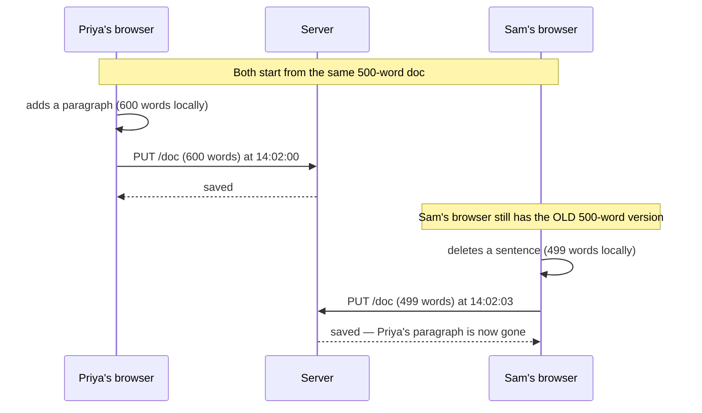

Over one week of a 40-person pilot at Inkwell, this generates 11 "my notes just disappeared" support tickets `[illustrative]`. The obvious question support asks engineering: *why didn't the server notice these two saves were about to collide?* Because a whole-document `PUT` carries no idea of "what I'm changing relative to" — it's not an edit, it's a replacement. The server has no way to tell "this is an intentional full rewrite" apart from "this is a stale copy that's about to erase someone else's work," because both look exactly the same on the wire: a blob of text.

**The fix, and the analogy for the rest of this story:** stop sending finished blobs and start sending **instructions**. Think of it as the difference between mailing someone **a photograph of a finished cake** versus mailing them **the recipe step you just did** — "add 2 tablespoons of sugar." A photograph completely replaces whatever the recipient already has (and erases any step *they* took that isn't in your photo). A recipe step just says what changed, and can be applied on top of whatever state someone's already in. This is **operation-based editing**: instead of `save(entire_document)`, the client sends small ops — `insert(value, index)`, `delete(index)` — and the server (and every other client) applies just that instruction.

**New problem, immediately:** sending instructions instead of photographs solves "don't erase what you can't see," but it opens a new question nobody had to think about with whole-doc overwrites — *what happens when two people's instructions arrive for the same spot in the document, at nearly the same time?*

**How I'd say this in an interview:** "The naive version of collaborative editing is whole-document overwrite on save — last write wins, and it silently destroys concurrent work the moment two people edit close together in time. The fix is switching from 'send the finished document' to 'send the operation that changed it' — but that's not the end of the story, because now you have to make those operations agree with each other."

---

## Chapter 2 — Two recipe steps for the same bowl, sent blind

Inkwell ships operation-based sync. Two collaborators are both looking at the shared text `"Educative platform"`, cursor at index 10 (right after "Educative "). Within about 40ms of each other:
- User A types `"for developers"` at index 10 → wants `"Educative for developers platform"`
- User B types `"platform"` at index 10 → wants... wait, B is also trying to insert at index 10 in a doc that, from B's screen, still just says `"Educative platform"` — B was actually trying to insert a *word*, but for this example, say B inserts `"Wave "` at index 10, wanting `"Educative Wave platform"`.

Both ops get applied to the server's copy in the order they happen to arrive, naively, with no adjustment:

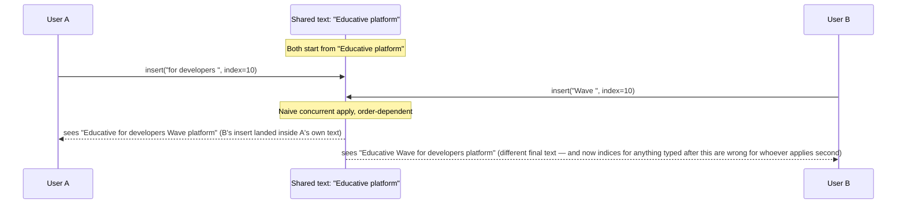

Two different collaborators, editing the same document, now see two **different final texts** — the exact thing collaborative editing was supposed to prevent, just moved one layer down from "whole doc overwritten" to "individual op garbled." A second, uglier failure mode shows up too: if the same duplicate character gets deleted independently by two clients — say the doc has a typo `"EEDUCATIVE"` and both A and B each fire `delete(index=0)` to fix it — naively replaying both deletes removes **two** characters instead of one.

The obvious question: *what actual guarantee is missing here?* Two, precisely:
1. **Commutativity** — applying A-then-B should give the same result as B-then-A. Right now it doesn't; raw positional indices silently drift depending on arrival order.
2. **Idempotency** — a duplicate or replayed operation should apply only once. Right now it doesn't; the double-delete above proves it.

Any correct conflict-resolution technique has to guarantee **both** of these, or it isn't finished. There are exactly two real families of answer to this, and Inkwell is about to try both.

**How I'd say this in an interview:** "Switching to operation-based edits fixes 'don't silently erase what you can't see,' but raw operations aren't automatically safe to apply out of order — you need two specific properties, commutativity and idempotency, and 'just send the ops' doesn't give you either for free. That's exactly the gap Operational Transformation and CRDTs each fill, in two very different ways."

---

## Chapter 3 — The referee who rewrites your move as it happens

Inkwell's first real fix: put a **server in the middle that acts as a referee**. Every op gets sent to the server first, not directly between browsers. When two ops turn out to be concurrent — based on the same starting version — the server runs a `transform(opA, opB) → (opA', opB')` function that **rewrites each operation's position** to account for the other one, so that applying the transformed ops, in *either* order, converges to the identical final text.

This is **Operational Transformation (OT)**, invented by Ellis & Gibbs in 1989, and it's the real, documented technique Google Docs uses in production — a central server holds the canonical order and does the transforming.

**The analogy:** picture a doorway with a referee standing in it, handing out numbered tickets. If two people show up claiming "I should be 10th in line," the referee doesn't just let both claim slot 10 — they look at who's *actually* ahead of whom and hand out corrected ticket numbers so the line makes sense, no matter which claim arrived at the referee's desk first.

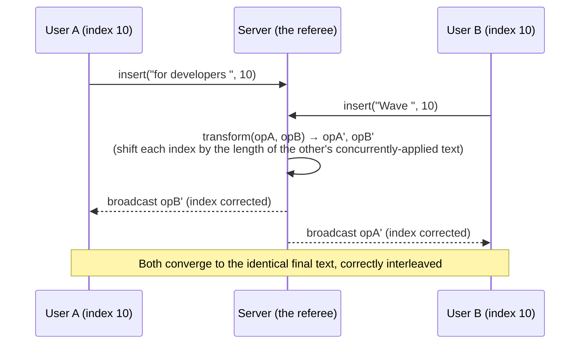

This works, and Inkwell ships it. But the referee analogy has a cost that shows up fast once Inkwell tries two things:

First, they add a third and fourth simultaneous editor to a popular shared doc. The transform function now has to reason about pairs of concurrent ops across *four* people, not two — the number of pairwise transform cases grows fast, and the referee's logic gets genuinely hard to get right. This isn't a guess: Google Wave's own engineers, after building the OT engine that powered Wave, said publicly that *"implementing OT sucks... Wave took 2 years to write and if we rewrote it today, it would take almost as long a second time."* That's not a small implementation tax — it's a real, documented cost of this exact approach.

Second, Inkwell wants an offline mode — edit on the train, sync later. With OT, "sync later" means: take everything the user typed while offline, and transform each one of those buffered ops, in order, against **every single op the server accepted from everyone else while this user was gone.** Six hours offline at even a modest editing pace means transforming against potentially thousands of intervening ops — and the transform function has to stay correct for every one of those pairwise combinations. It also fundamentally needs that one **central referee** to exist at all — no referee, no canonical order, no OT.

**How I'd say this in an interview:** "OT works by transforming each operation's position against every operation it was concurrent with, using a central server as the authority on order — it's exactly what Google Docs runs in production. The catch, and Google Wave's own team said this publicly, is that the transform function is notoriously hard to implement correctly as you add concurrent editors, and it fundamentally wants a central server, which makes long offline stretches expensive to reconcile."

---

## Chapter 4 — Giving every letter its own GPS coordinate

Inkwell's mobile team pushes back hard on OT: they want editing to work fully offline, syncing whenever a connection reappears, without a central referee in the loop for every keystroke. The referee-based fix from Chapter 3 fundamentally needs that referee — so instead of making the referee smarter, Inkwell tries removing the need for a referee at all.

**The obvious question:** if positions drift because they're relative — "index 10" means something different depending on what else has been inserted before it — what if a character's *identity* never depended on its position in the first place?

**The fix:** give every character a permanent, globally unique identity that never changes, no matter what gets inserted around it. Each character carries `{ SiteID: <who created it>, Value: <the char>, PositionalIndex: <a fraction> }`. This is a **Conflict-free Replicated Data Type (CRDT)** — the real technique behind libraries like Automerge and Yjs, both used in production offline-first collaborative apps, and reportedly the same family of idea behind Apple Notes' iCloud sync (reported, not officially detailed by Apple, so treat that one specific attribution as `[illustrative]`).

**The analogy:** instead of numbering seats 1, 2, 3, 4 (where inserting a new seat means renumbering everyone after it — exactly the drift problem from Chapter 2), give every seat a **GPS-style coordinate**. Seat "O" is at 1, seat "T" is at 2. Insert a new seat "A" between them? It doesn't need seat 2's slot — it just takes coordinate **1.5**. Nobody else's seat number ever changes.

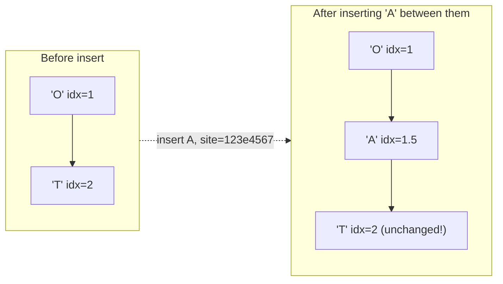

Because no existing character's identity or coordinate is ever mutated, two sites can apply their inserts and deletes **in any order, any number of times**, and still land on the same final text — commutativity and idempotency both come for free from the data structure itself, with no referee required. This is what makes serverless, peer-to-peer collaborative editing genuinely possible, in a way classic OT can't easily match.

**New problem:** this identity-per-character scheme isn't free. Each character now carries a site ID plus a fractional coordinate — tens of bytes of metadata `[illustrative — exact figure depends on ID encoding]` on top of the one byte the actual letter would cost. On a busy document with 10,000 edits in a day, that metadata overhead adds up fast. Worse: if a lot of people keep inserting characters clustered near the same coordinate (everyone typing right after the same word, for instance), the fractional coordinates start needing more and more decimal precision, and eventually need periodic rebalancing. And when someone deletes a character, a CRDT typically doesn't just remove it — it leaves a **tombstone** marker behind (so a delayed, concurrent op referencing that character's ID doesn't get confused), and tombstones accumulate if nothing ever garbage-collects them.

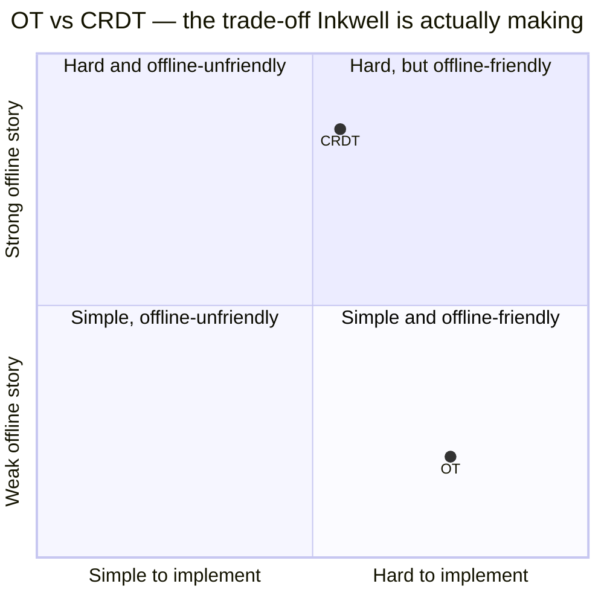

**How I'd say this in an interview:** "CRDTs sidestep OT's central-referee problem by giving every character a permanent global identity plus a fractional position, so inserts and deletes are naturally commutative and idempotent — no transform function, no arbiter. The cost you're trading for that is metadata: tens of bytes of site-ID-and-coordinate overhead per character, plus tombstones for deletes that need eventual garbage collection. Neither OT nor CRDT is strictly better — it's implementation cost versus offline-friendliness, and you pick based on the requirements."

---

## Chapter 5 — Keeping the phone line open instead of mailing postcards

Underneath both OT and CRDT, Inkwell still has a plumbing problem: how does an edit actually get from one browser to another, fast? Right now, browsers poll the server every 2 seconds asking "anything new?" With 500 concurrent editing sessions platform-wide `[illustrative]`, that's roughly 250 polling requests per second, and the overwhelming majority come back empty — nobody typed anything in that particular 2-second window for that particular doc. Every one of those requests still pays full HTTP overhead: headers, and (without a kept-alive connection) a fresh TCP/TLS handshake.

The real cost isn't the empty responses — it's the **latency**. A user typing sees their *own* keystroke instantly (it's applied to their own local copy first), but a collaborator on the same doc doesn't see it until that collaborator's next poll fires — up to 2 full seconds later. For something meant to feel like "we're editing together right now," 2 seconds reads as broken, not just slow.

**The obvious question:** why not just poll faster — every 100ms instead of every 2000ms? Because that multiplies the request volume by 20x for the exact same mostly-empty responses — it doesn't fix the fundamental shape of the problem, it just makes the server work much harder to deliver the same bad latency floor (still bounded by *some* polling interval, however small).

**The fix:** stop asking "anything new?" over and over, and instead hold one connection open and let the server push down it the instant something happens. This is a **WebSocket** — one handshake, then a persistent full-duplex channel that both sides can write tiny frames into whenever they want.

**The analogy, and the one to reuse for delivery from here on:** polling is like mailing a postcard every 2 seconds asking "anything to tell me?" — postage and an envelope every single time, mostly for a "no." A WebSocket is like **keeping a phone line open** — you dial once, and after that, either side can just say something the instant they have something to say, no redialing.

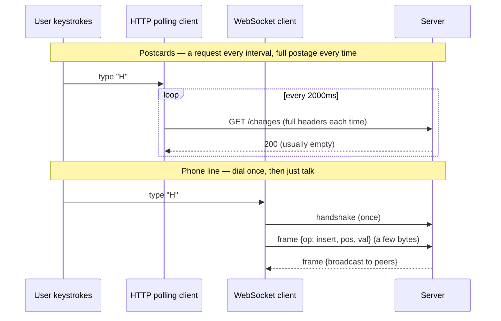

**New problem:** the phone line only connects one browser to *one* WebSocket server process. Inkwell runs many WS servers behind a load balancer for capacity. User A is connected to WS-Server-1; User B, editing the very same doc, happens to be connected to WS-Server-2. A's insert lands on Server-1 and gets applied to Server-1's copy of the state — but Server-2 has no idea it happened. B keeps staring at stale text, potentially for as long as their session lasts, because nothing tells Server-2 "something changed on a document you also have a client connected to."

**How I'd say this in an interview:** "Polling caps your latency floor at whatever interval you pick, and polling faster just burns more resources for the same empty-response problem — WebSockets fix that by keeping one connection open and pushing the instant something happens. But a WebSocket only connects a browser to *one* server process, and once you have more than one WS server, an edit accepted on server 1 doesn't automatically reach a client sitting on server 2."

---

## Chapter 6 — The bulletin board pinned to each document

**The obvious question:** should every WS server just connect directly to every other WS server, so Server-1 can tell Server-2 "hey, doc X changed"? No — with, say, 200 WS server processes, that's nearly 40,000 possible server-to-server links to maintain, and every server would need to track every other server's currently-connected clients just to know who to even talk to. That doesn't scale, and it couples servers to each other for no good reason.

**The fix:** give each *document* its own topic on a shared pub/sub system (Redis Pub/Sub, in Inkwell's case), and have every WS server that currently holds a connection for that document simply **subscribe** to that doc's topic. When an op is resolved (transformed under OT, or merged under CRDT), it gets published once, to that one topic — not sent server-to-server directly.

**The analogy — a new one, but it plugs directly into the "phone line" idea from Chapter 5:** think of it as a **bulletin board pinned specifically to this one document**, hanging in a shared hallway. Any WS server currently serving a reader of that document is standing in front of that one board, watching it. The moment something's pinned, every server watching that board sees it immediately and relays it down its own open phone lines to its own connected clients. No server needs to know which *other* servers exist — it only needs to know which board to watch.

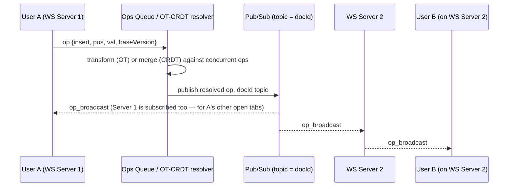

One more piece rides along with this: the "ops queue" that resolves conflicts before publishing is sharded **per document**, not run as one global queue. A single wildly popular doc — say, an all-hands meeting note with 20 people typing at once — generates roughly 10,000 ops in a busy day `[illustrative]`, at roughly 80 bytes each (JSON metadata plus the character), which is about 800 KB of raw operation log for that one document, in one day, before any compaction. If every document shared one global queue, that one hot doc's load would slow down resolution for every *other*, unrelated document waiting in the same line. Sharding the queue by document ID means a hot doc can only ever compete with itself.

**New problem:** the bulletin-board model works great as long as everyone's online, watching the board. What happens to a user who closes their laptop lid on the subway — no board-watching for 25 minutes, but they keep typing the whole time?

**How I'd say this in an interview:** "The fan-out problem across multiple WebSocket servers is solved with a doc-scoped pub/sub topic, not direct server-to-server links — every WS server holding a connection for a document just subscribes to that document's topic. And the operations queue that resolves conflicts before publishing gets sharded per document, so one hot doc's load never bleeds into unrelated documents' latency."

---

## Chapter 7 — The notebook you fill while your phone has no signal

A user on Inkwell's mobile app goes into a subway tunnel — no connection for 25 minutes — and keeps typing the whole time, producing roughly 150 local operations `[illustrative]` that never left the phone. When the tunnel ends and the connection comes back, the client has a notebook full of edits the server never saw, and the server has whatever anyone else did in the meantime.

**The obvious question:** how do you merge a whole notebook of offline edits back into a document that kept moving without you — without losing anything, and without corrupting order? The honest answer: **it depends entirely on which conflict-resolution family you picked**, and this is the single biggest practical difference between OT and CRDT in this story.

- **Under CRDT** (the GPS-coordinate scheme from Chapter 4): every buffered op already carries its own permanent site ID and fractional coordinate. The client just ships the whole buffer to the server as-is; the server merges them into current state exactly like any other concurrent op, because that's the only kind of op CRDTs know how to handle. No special "offline" code path is needed at all.
- **Under OT** (the referee scheme from Chapter 3): the buffered ops were generated against a `baseVersion` that's now stale — thousands of ops potentially happened on the server while the client was dark. Each buffered op has to be **rebased**: transformed, in order, against every single op the server accepted during that gap. That's the same transform machinery from Chapter 3, just run many more times in a row, and it's exactly the cost Google Wave's engineers were describing.

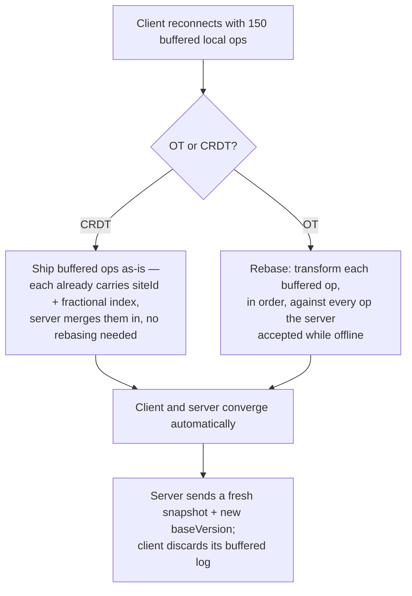

**New problem:** what if the phone stays offline for 3 days on a work trip, not 25 minutes? The local buffer keeps growing — thousands of ops, no upper limit. Under OT, rebasing against days of intervening history gets both slow and risky (more chances the transform logic hits an edge case). Under CRDT, the *merge* itself stays correct, but shipping and applying an enormous buffered log is still expensive.

**The fix inside the fix:** cap the buffer — say, at 10,000 ops or 24 hours, whichever comes first `[illustrative bound]`. Past that cap, don't attempt replay at all: pull a fresh snapshot of the document's current state, and let the user manually recover any unsynced text from a local backup if they need to. An unbounded offline queue isn't a hypothetical edge case — it's a real failure mode that needs an explicit limit.

**How I'd say this in an interview:** "Offline reconciliation is where CRDTs earn their keep — buffered ops just get merged, no rebase, because that's the only kind of apply a CRDT does anyway. OT has to transform every buffered op against everything the server accepted while the client was gone, which gets genuinely expensive and risky over a long offline stretch. Either way, you cap the offline buffer size — past the cap, force a fresh snapshot instead of attempting replay."

---

## Chapter 8 — Seeing someone else's flashlight beam in the room

With sync fast (Chapter 5-6) and offline handled (Chapter 7), Inkwell notices something: on documents with 8+ simultaneous editors, bursts of 30-40 concurrent transform/merge operations pile up in the same 2-second window, clustered in the *same paragraph* `[illustrative]` — two people happen to be typing in the exact same sentence at the exact same moment, purely because neither one had any idea the other was there.

**The obvious question:** since the WebSocket channel to every editor is already open (Chapter 5) and there's already a doc-scoped topic broadcasting to everyone (Chapter 6), is there something almost-free we can push down that same pipe to reduce how often people collide in the first place — before the conflict-resolution machinery even has to run? Yes: **where everyone's cursor currently is.**

**The fix:** broadcast every collaborator's live cursor position and selection over the same channel used for ops — it's nearly free bandwidth-wise, since the connection and the topic already exist. This is **presence**.

**The analogy:** think of it as everyone in a dark room carrying a **flashlight** pointed at exactly where they're working. You don't need a lock on the door or a referee assigning turns — if you can see someone else's flashlight beam already sitting on a sentence, you just... naturally edit somewhere else. The conflict-avoidance happens in the human's head, before it ever becomes a conflict for the server to resolve.

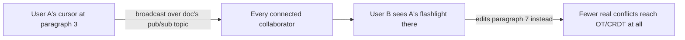

This has a genuinely nice side effect: it's not just a UX nicety, it measurably lowers the *rate* of real conflicts the transform/merge machinery even has to handle, because humans self-avoid once they can see each other.

**New problem:** broadcasting "who's here and where they're looking" to everyone connected raises an uncomfortable question Inkwell hadn't fully answered yet — *who's allowed to be connected to this document, watching or editing, in the first place?* Presence reveals every connected person to every other connected person, which means getting permissions wrong is no longer just "someone edited who shouldn't have" — it's also "someone *saw* a doc's live contents and cursor activity who was never supposed to see it at all."

**How I'd say this in an interview:** "Presence — broadcasting live cursors over the channel that already exists for ops — is basically free once you have real-time delivery, and it's a genuine conflict-avoidance feature, not just polish: people subconsciously avoid editing where they see someone else's cursor. But it also means access control has to be airtight before you ever open that channel, because presence broadcasts who's watching to everyone else who's watching."

---

## Chapter 9 — Badge check at the door, then spot-checks at every desk

An early Inkwell bug: a document shared as "commenter" (view + comment, no editing) still lets that user's WebSocket send `insert` frames — because the client UI disables the editor for commenters, but the *server* never actually re-checks the role when an op frame arrives, it just trusts that a well-behaved client wouldn't send one. Over one week: 6 "how did a viewer edit my doc" tickets `[illustrative]`.

**The obvious question:** where should a permission check actually live — just once, at the door? The honest answer is **no single point is enough** — there are three separate moments where access has to be checked, and skipping any one of them is a real bug, not a theoretical one:

1. **At connect time**: before the WebSocket handshake even completes, check the user's role against the doc's ACL. No reason to open a socket — and start broadcasting presence and content to it — for someone who can't even view the doc.
2. **Per operation**: never trust the client to enforce its own UI restrictions. Every incoming `insert`/`delete` frame gets re-checked against the sender's role, every single time, regardless of what the client's UI theoretically allows.
3. **Share links**: a link encodes a doc ID plus a *default* role, not a specific person — it only becomes a concrete ACL entry the first time someone actually opens it. That way, revoking access later has something specific to revoke, instead of an anonymous link floating around forever.

**The analogy:** a badge check at the building's front door isn't enough on its own — you also need a guard who checks your badge again at every floor's desk, because someone could theoretically slip in behind another employee. **Badge check at the door, then spot-checks at every desk, and never assume the person walking around is only going where their badge says they should** — that's the rule.

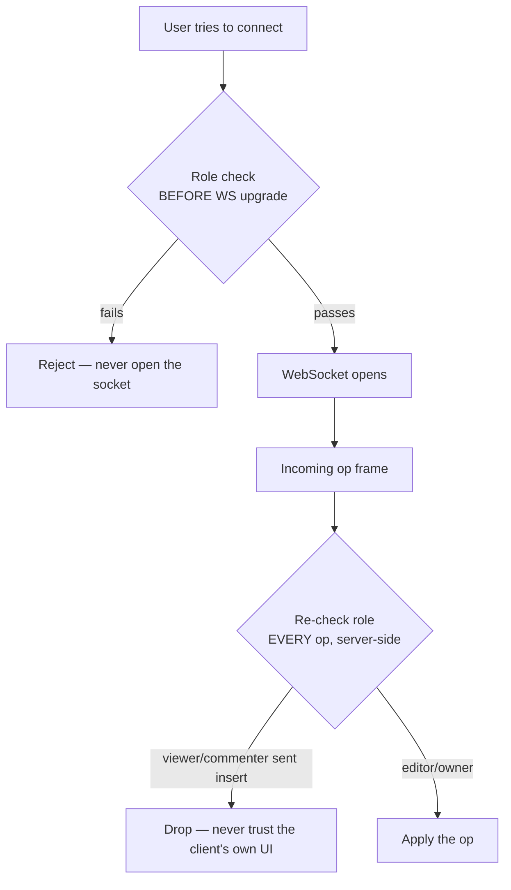

**New problem:** a genuinely nasty edge case — a user's editor access gets revoked by the doc's owner *while that user still has the document open* in an active session. The badge was valid when they walked in; it's been cancelled while they're still at their desk. Two real options, and a strong answer names both rather than silently picking one:
1. **Push a revocation event** through the exact same doc-scoped pub/sub channel used for ops (Chapter 6) — the session server force-closes that specific user's WebSocket the instant the revoke event arrives.
2. **Do nothing until their next reconnect** — cheaper to build, but leaves a real window where a de-authorized user keeps editing. Plenty of real systems accept this small window rather than pay for a full ACL re-check on every single keystroke.

**How I'd say this in an interview:** "Permission checks need three separate enforcement points, not one: at connect time before the socket even opens, per-operation on the server because you never trust the client's own UI, and at first-use for share links so there's a concrete grant to revoke later. The edge case worth naming unprompted is access revoked mid-session — either force-close the socket via the same pub/sub channel used for ops, or explicitly accept a small window until reconnect."

---

## Chapter 10 — Un-baking a shared cake

A user hits Ctrl+Z after typing "cat" at position 10. Naively, undo means "reverse my last operation" — delete 3 characters starting at position 10. But between the moment they typed "cat" and the moment they hit undo, a collaborator inserted 5 characters at position 5, shifting everything after it. Position 10 doesn't mean "where I typed cat" anymore — it now points at the *wrong* characters, potentially chewing into the collaborator's brand-new text instead of removing "cat" at all.

**The obvious question:** how do you undo something in a document that's kept changing underneath you the entire time? You don't rewind time — you can't, because other people's edits happened in the meantime and they're not going away. Instead, undo is **"compute the inverse of my last operation, and run it through the exact same conflict-resolution machinery as any brand-new edit"** — transformed against everything that happened since, under OT, or merged/tombstoned by identity, under CRDT.

**The analogy — tying back to both earlier ones:** you can't literally un-bake a cake that's already been shared and eaten into. What you *can* do is add a corrective step — "remove the 3 tablespoons of salt I added" — and run that correction through the same kitchen process as any other step, accounting for whatever anyone else did to the cake in between. It's a new instruction, not a rewind button.

```
OT undo:   undo_op = transform(inverse(my_last_op), all_ops_since)
CRDT undo: undo_op = tombstone(my_last_op's element IDs)   # delete-by-ID, no position math at all
```

Under CRDT specifically, this is almost free: because every character already carries the identity of who inserted it (Chapter 4's GPS coordinates come with a site ID attached), "undo my last op" reduces to "find my last surviving character IDs and tombstone exactly those" — regardless of what position math would say, and regardless of what anyone else did afterward. That's also why **selective per-user undo** ("undo only my change, not the change someone else made after mine") falls out almost automatically with CRDTs, and needs more explicit bookkeeping under OT.

**New problem:** undo-as-inverse-op handles "undo my very last edit." But what about "show me exactly what this document looked like 20 minutes ago" or "restore the version from before someone accidentally deleted a whole section"? That's not an inverse operation anymore — that's a completely different question: how much history does the system actually keep, and how expensive is it to reconstruct an old state?

**How I'd say this in an interview:** "Undo in a collaborative doc can't be a literal rewind, because other people's edits happened in between and can't be un-happened — it's the inverse operation, run through the same transform-or-merge machinery as any live edit. CRDTs make this and selective per-user undo nearly free, because every character already carries who created it; OT needs more explicit bookkeeping to get the same behavior."

---

## Chapter 11 — The photo album that doesn't take a full portrait every second

Version history needs an actual storage design now, and Inkwell's first instinct is the same one they started this whole story with: store a full snapshot of the document on every batch of edits. A moderately busy document with 10,000 ops in a day, snapshotted at, say, every 100 ops — that's 100 full snapshots of a 100 KB document, or **10 MB/day just for one document's history** `[illustrative, scales with snapshot frequency]`. Snapshot on *every* op batch instead, and it's closer to 1 GB/day for that same one document — write amplification, exactly the cost that motivated moving off whole-document saves back in Chapter 1, now showing back up in the history layer instead of the live-edit layer.

**The obvious question:** do we actually need a full copy of the document every time something changes, or just a record of *what* changed? Same answer as Chapter 1: store the **delta**, not the blob. A time-series database holds every resolved batch of operations as a timestamped, append-only record. Reconstructing "what did this look like at 3pm yesterday" means starting from the nearest snapshot *before* that time and replaying the small deltas forward from there — not storing a full copy at every single point in time.

**The analogy — and it's a direct callback to Chapter 1's photograph-versus-recipe idea:** think of it as a **photo album that takes a full portrait only occasionally**, and in between portraits just jots quick notes — "she smiled," "turned the page," "added a hat." To see what things looked like at any given moment, you find the nearest portrait before that moment and read forward through the notes. You get the same ability to reconstruct any point in time, at a small fraction of the storage cost of a full portrait every second.

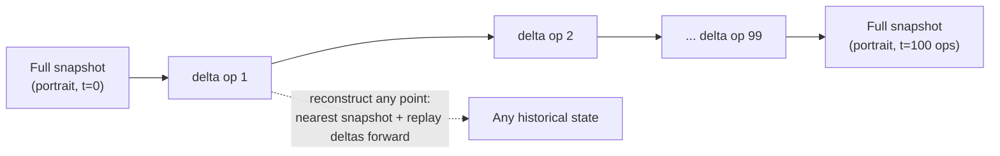

While building this out, Inkwell also has to answer a related question: does the document's **view count** need the same strong guarantees as the document's **text**? No — and this is worth saying out loud explicitly in an interview, because it's tempting to apply one consistency model everywhere. Document *content* needs strong consistency: two collaborators must never see permanently different text. View count is a vanity metric — it's totally fine if it's a few seconds stale, updated asynchronously off the critical editing path via a simple pub-sub increment. Not every number in the system deserves the same guarantee, and pretending otherwise wastes engineering effort where it isn't needed.

**New problem:** this closes out storage for a single document on a single machine, in a single data center. But Inkwell is about to open EU offices, and a team in the US and a team in the EU are about to start editing the *same* documents together — and a single central referee sitting in one region is about to become everyone's worst-case latency.

**How I'd say this in an interview:** "Storing a full snapshot on every edit batch reproduces the exact write-amplification problem you fixed by moving off whole-document saves in the first place — the fix is the same shape: store deltas as an append-only, timestamped log, and snapshot periodically to bound how far back you ever have to replay. And it's worth saying explicitly: document content needs strong consistency, but something like view count is fine to be eventually consistent — don't apply one consistency model to the whole system uniformly."

---

## Chapter 12 — Crossing oceans without asking permission every keystroke

Inkwell goes global. A team in San Francisco and a team in Frankfurt now co-edit the same planning doc. If Inkwell had stuck with pure OT — one central referee server, say, still sitting in the US — every keystroke an EU engineer types has to round-trip to the US server to get transformed and confirmed. Cross-region RTT between the US and EU is roughly 100-150ms in practice; against the roughly 200ms p99 sync latency budget `[illustrative]` before users start perceiving things as "broken" rather than just "a little slow," that round trip alone eats most of the available budget before the transform even runs.

**The obvious question:** does confirming a keystroke really need to check in with a server on another continent before the *rest of the world* can see it? Under OT, yes — the whole model depends on one canonical arbiter deciding order. Under CRDT, though, the answer is genuinely no: since every character already carries its own permanent identity and fractional coordinate (Chapter 4's GPS-coordinate scheme), a US-region merge and an EU-region merge are **commutative** — they converge to the same final result no matter which region's edit gets applied first, anywhere.

**The fix:** each region runs its own local CRDT merge, against its own regional store, with **no cross-region round trip required to accept a keystroke**. Regions replicate to each other asynchronously in the background, and because the merge function doesn't care about arrival order, "the EU copy saw the US edit five seconds later than the US copy did" never produces a different final document — it just produces the same document, five seconds later in one place than the other.

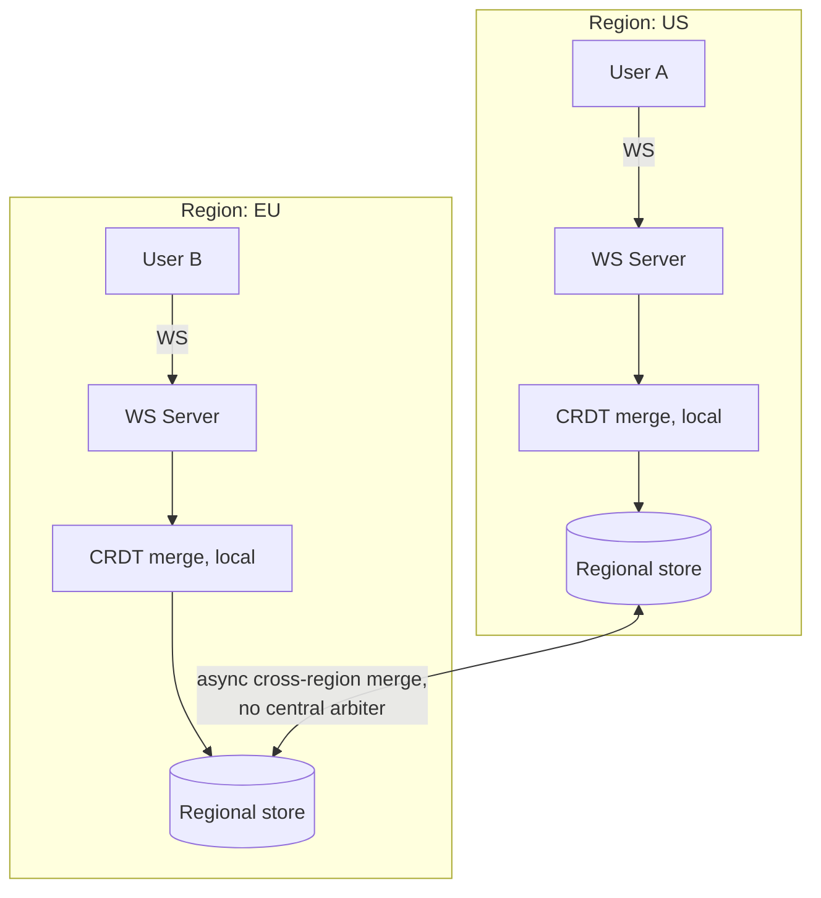

This is genuinely where the story lands: no further wall to hit, just a conscious trade to name. Classic OT-based systems like Google Docs itself don't use this trick — they keep a single canonical-order server and instead pick that server's *location* carefully (and accept the resulting latency trade-off for far-away editors), because Google Docs' OT engine predates today's mature CRDT tooling. That's a real, deliberate choice made for historical reasons, not evidence that OT is inherently worse — the trade-off table from Chapter 4 is still the honest answer, and multi-region is simply the scenario that tips the scale hardest toward CRDT.

**How I'd say this in an interview:** "Multi-region collaborative editing is where OT's central-arbiter requirement really costs you — every keystroke would pay a 100-150ms cross-continent round trip just to get confirmed. CRDTs sidestep that completely, because merges are commutative: each region resolves locally against its own store and reconciles asynchronously, with no arbiter needed anywhere. Google Docs itself still runs OT in production for historical reasons — it predates mature CRDT libraries — not because OT wins this specific trade-off."

---

## Where the story actually lands


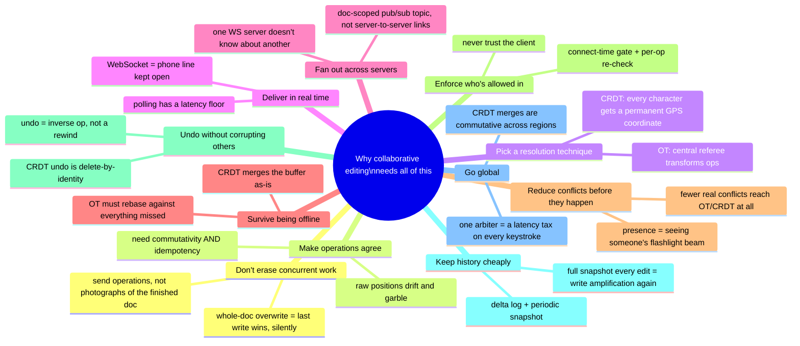

Every real collaborative document editor sits somewhere on this chain, and the interview skill isn't reciting all twelve chapters — it's knowing where the *stated* requirements say to stop. A simple shared-notes app for one team in one office might reasonably stop around Chapter 8. A product that explicitly promises offline editing has to reach Chapter 7 and pick its technique in Chapter 4 accordingly. A product going multi-region has to reach Chapter 12. Walking all twelve unprompted when nobody asked about offline or multi-region reads as padding, not depth.

---

## Grill me — adversarial follow-ups

**Q1: "Why not just use a lock — only one person can edit at a time, problem solved?"**
Because that kills the entire product. The whole point of "collaborative" editing is that nobody waits on anybody else — locking one paragraph while someone else edits it turns a real-time collaborative tool back into a single-editor tool with extra steps. Any correct answer here has to be lock-free by construction, which is exactly why commutativity and idempotency matter so much.

**Q2: "You said OT needs a central server — doesn't that make it a single point of failure, same as Chapter 1's overwrite bug?"**
Fair, and yes — in practice that server is run as a small, highly-available cluster with its own replication and failover, not literally one box, the same way any other critical stateful service would be built. It's a real operational cost of choosing OT, and it's part of why CRDT's "no arbiter needed" property is genuinely attractive for offline-first or peer-to-peer designs.

**Q3: "If CRDTs are so much better for offline and multi-region, why does Google Docs still use OT?"**
Historical timing, not technical superiority — Google Docs' OT engine predates mature CRDT tooling like Yjs and Automerge existing at all. If you were designing this system greenfield today, CRDT is the easier, more defensible default; but "the incumbent uses OT" is a documented fact about *when* it was built, not a verdict on which technique is better.

**Q4: "Walk me through what happens if two people delete the exact same character at the same instant."**
Under OT, the server sees both delete ops referencing the same position, and the transform function has to recognize the second delete as now targeting a character that's already gone, so it becomes a no-op rather than deleting an extra character. Under CRDT, it's simpler by construction: both deletes just tombstone the same character ID, and tombstoning something twice is naturally idempotent — nothing extra gets removed either way.

**Q5: "Presence seems like a nice-to-have — why does it deserve real design attention?"**
Because it measurably reduces how often real conflicts even reach your OT or CRDT machinery — if people can see where others are working, they naturally avoid colliding, which lowers load on the exact code path that's hardest to get right. It's a cheap, almost-free broadcast on a channel you already have open, with an outsized effect on real-world conflict rates.

**Q6: "Isn't 'accept a small window of unauthorized editing until reconnect' just a bug you're choosing to ship?"**
It's a conscious trade-off, not an oversight — pushing a hard revoke through the pub/sub channel is more correct, but it means paying for an extra event path and force-disconnect logic for a genuinely rare case. Plenty of real systems land on accepting the small window deliberately, as long as it's named and chosen on purpose rather than discovered by an angry customer.

**Q7: "Your undo design relies on the same transform/merge machinery as live edits — doesn't that make undo just as hard to implement as OT itself?"**
Under OT, yes, it inherits real complexity, because you're transforming an inverse op against everything that's happened since, using the same subtle machinery Wave's engineers complained about. Under CRDT, it's actually simpler than the live-edit path, not harder, because undo becomes "tombstone by identity," and identity was already free from the data structure.

**Q8: "Why store deltas instead of just diffing two full snapshots when you need history?"**
Diffing two full snapshots means you had to store two full snapshots in the first place, which is exactly the write-amplification problem from Chapter 1 and Chapter 11 — expensive at scale and slow to diff after the fact. Storing the deltas as they happen is both cheaper to store and gives you a natural, ready-made timeline, instead of reconstructing one after the fact from occasional heavy snapshots.

**Q9: "If someone just says 'design Google Docs' cold, where do you actually start?"**
Say the one-sentence core idea first — many local copies of a document, edited optimistically and instantly, need to converge to one truth with no human resolving conflicts — and then immediately name that the whole interview lives or dies on picking and defending OT or CRDT, because everything else is plumbing around that one decision. Then walk forward: real-time delivery, presence, access control, offline, history, only as far as the stated requirements actually need.

**Q10: "What's the one thing in this whole design you'd flag as still an open problem if asked?"**
Cross-region disaster recovery — what happens if an entire region goes dark, not just one machine — is explicitly a stated gap even in the reference design, and naming it unprompted is a stronger answer than pretending the design is airtight. A good closing line is simply: "here's what I'd want more time to dig into."

---

## Cheat sheet — one line per stop on the story

- **Whole-document overwrite**: last write wins, silently erasing concurrent edits — the wall this entire story exists to get past.
- **Operation-based editing**: send the instruction (`insert`/`delete`), not a finished copy of the document — but raw ops still need to agree with each other.
- **The two required properties**: commutativity (order shouldn't matter) and idempotency (repeats shouldn't matter) — any correct technique needs both.
- **Operational Transformation (OT)**: a central server transforms concurrent ops against each other so any arrival order converges — used by Google Docs; hard to implement correctly; needs a canonical-order arbiter.
- **CRDT**: every character gets a permanent site ID + fractional coordinate, so ops are commutative and idempotent by construction, no arbiter needed — used by Automerge/Yjs; costs metadata and tombstone overhead.
- **WebSockets over polling**: one handshake, then a persistent channel — fixes the latency floor and per-request overhead of polling.
- **Doc-scoped pub/sub**: the fan-out mechanism across multiple WS servers — a topic per document, not direct server-to-server links.
- **Offline reconciliation**: CRDT ships the buffer as-is and merges; OT must rebase every buffered op against everything missed — cap the buffer either way.
- **Presence/cursors**: broadcasting live cursor position over the already-open channel — reduces real conflicts before your resolution algorithm ever runs.
- **Access control**: connect-time gate, per-operation re-check, never trust the client — plus a named answer for access revoked mid-session.
- **Undo/redo**: the inverse operation run through the same transform/merge machinery as any live edit — never a literal rewind.
- **History storage**: append-only delta log plus periodic snapshots — full snapshots on every edit reproduce Chapter 1's write-amplification problem one layer down.
- **Multi-region**: CRDT's commutative merges let each region resolve locally with no cross-continent round trip; OT's arbiter model pays that round trip on every keystroke.
- **The meta-lesson**: every fix in this story buys one property (no-erase, agreement, convergence, arbiter-freedom, real-time delivery, cross-server fan-out, offline safety, fewer conflicts, enforced permissions, safe undo, cheap history, or region-independence) by spending a different one — say the trade in the same sentence you propose the fix.
