# Design a Collaborative Document Editing Service (Google Docs) — FAANG Interview Guide

> **Enhancement notes:** this pass added material the original guide was thin on or missing,
> without touching sections that already worked.
> - Added a `🆕 API Design` section (REST endpoints + WebSocket message schema) and a concrete
>   operation wire-format example with byte-level numbers.
> - Added a `🆕 Architecture Evolution (v1 → v2 → v3)` walkthrough with diagrams, since the
>   original jumped straight to the final architecture without showing why each piece exists.
> - Added deep dives on `🆕 Access Control` enforcement, `🆕 offline editing & reconciliation`
>   (with a flowchart), and `🆕 undo/redo` in a collaborative document — these were either
>   mentioned in one line or missing entirely.
> - Added a sequence diagram for cross-WebSocket-server op fan-out via pub-sub — the original
>   high-level diagram didn't actually show how an edit reaches a client connected to a
>   *different* WS server.
> - Added illustrative volume numbers (concurrent sessions, op size, p99 sync latency budget),
>   clearly labeled as estimates, plus an `🆕 If-X-Then-Y` recall table.
> - Left the Mental Model, Requirements, capacity-estimation math, OT/CRDT deep dive, and
>   existing cheat sheets untouched — they already did their job well.

## Mental Model

Google Docs is **not** "a text editor with a database." It's three separable problems wearing
one UI:

1. **A replicated data structure problem** — every collaborator has a local copy of the
   document and edits it optimistically, offline-tolerant, before the server confirms
   anything. The whole system exists to make N divergent local copies converge to one
   truth without ever blocking the user's keystroke.
2. **A fan-out/real-time delivery problem** — one user's keystroke has to reach every other
   open tab in tens of milliseconds, not on the next HTTP poll.
3. **A boring CRUD-and-blob-storage problem** — documents, permissions, comments, view
   counts, history. This part is a completely conventional web app and interviewers spend
   the least time here.

The entire interview lives or dies on problem #1: **how do you make concurrent edits
commute?** Everything else (WebSockets, queues, databases) is plumbing to support that core
decision. If you can't explain OT or CRDTs crisply, the rest of the design won't save you.

**Analogy**: think of the document as a shared Google Sheet of git commits, except there's no
`git merge` step — every client must auto-resolve every conflict, instantly, with no human in
the loop, forever agreeing on the same final byte sequence.

---

## Interview Playbook

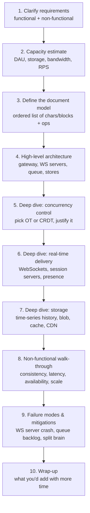

Say this order out loud unprompted — it signals you know that concurrency control is the
centerpiece, not an afterthought bolted onto a CRUD app.

---

## Requirements Clarification

### Functional
| Requirement | Notes |
|---|---|
| Concurrent multi-user editing | Core feature — must handle simultaneous writers on the same region of text |
| Conflict resolution | Push every edit to every collaborator; converge to one state |
| Suggestions / typeahead | Autocomplete words/phrases, grammar hints |
| View count | Editors see how many people have viewed the doc |
| Version history | Recover/diff older versions |
| (Real system, not asked but mention) | Doc create/delete, access control (owner/editor/commenter/viewer), sharing, comments |

### Non-functional
| Requirement | Why it's hard here specifically |
|---|---|
| **Consistency** | Must resolve concurrent edits to the *same* final state on every replica — this is stronger than typical "eventual consistency is fine" system-design answers |
| **Low latency** | Users perceive latency directly as "my keystroke lags" — worse UX than almost any other system type |
| **Availability** | Editing must survive brief disconnects; local-first editing masks server hiccups |
| **Scalability** | Millions of concurrent editing sessions, most documents small, a few documents (viral spreadsheets) very hot |

**Questions to ask the interviewer** (signals seniority):
- Do we need character-level granularity or block-level (paragraphs, table cells)? Changes the
  data model and which conflict-resolution technique is cheapest.
- Is offline editing in scope? (Forces CRDT-leaning design or a robust operation log/replay.)
- Rich formatting/embedded objects (images, tables, comments anchored to text) or plain text?
- Do we need cross-document features (@mentions, linked docs) — usually out of scope, say so
  and move on.

---

## Capacity Estimation (worked example)

**Assumptions** (state them, don't hide the method):

| Input | Value |
|---|---|
| Daily active users (DAU) | 80 million |
| Max concurrent editors per doc | 20 |
| Avg text-only doc size | 100 KB |
| % docs containing images | 30% (800 KB collective per doc) |
| % docs containing video | 2% (3 MB per doc) |
| Docs created per user per day | 1 |
| Docs viewed per user per day | 5 |
| Requests per user per day | 100 |
| Reference server capacity | 8,000 RPS (memorize this baseline from back-of-envelope lessons) |

**Formula chain**: `DAU → docs/day → bytes/doc-type → storage/day → bytes/sec → Gbps → RPS → server count`

**Storage**:
```
docs/day = 80M × 1 = 80M
text storage/day   = 80M × 100 KB               = 8 TB
image storage/day  = 80M × 30% × 800 KB          = 19.2 TB
video storage/day  = 80M × 2%  × 3 MB             = 4.8 TB
-----------------------------------------------------------
total storage/day  = 8 + 19.2 + 4.8              = 32 TB/day
```

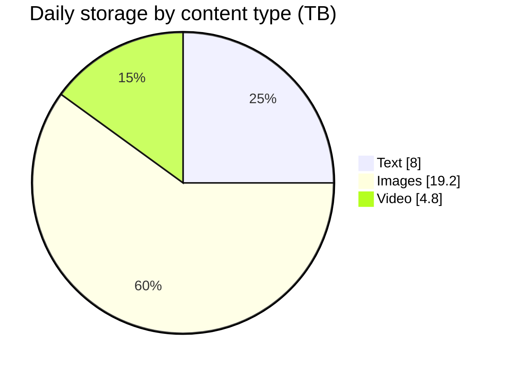

**Bandwidth**:
```
incoming = 32 TB / 86,400 s × 8 bits  ≈ 3 Gbps
docs viewed/day = 80M × 5 = 400M  →  4,630 docs/sec
outgoing ≈ 3.7 (text) + 8.89 (image) + 2.22 (video) Gbps ≈ 14.8 Gbps
total ≈ 3 + 14.8 ≈ 18 Gbps
```

**Servers**:
```
RPS = (100 requests/user/day × 80M users) / 86,400 s ≈ 92.6 K RPS
servers = DAU / users-per-server-equivalent = 80M / 8,000 ≈ 10,000 servers
```

**Redo-the-chain instinct**: if the interviewer changes "5 docs viewed/day" to "20", outgoing
bandwidth roughly quadruples — walk through the recompute live, don't just state a new number.

**What this estimation misses (say it out loud)**: version-history storage (append-only, can
dwarf live-doc storage over time — every keystroke batch is a new time-series row),
WebSocket connection memory footprint (see Numbers table below), and CRDT/OT metadata
overhead per character (10s of bytes per char — can 2-5x raw text storage if you keep full
operation history instead of compacting).

### 🆕 Real-time op volume (illustrative, not derived from the DAU math above)

The storage/bandwidth math above covers documents at rest. The live editing path has its own
numbers worth stating explicitly, since "how many connections does one WebSocket server hold"
is a near-certain follow-up:

| Quantity | Illustrative value | Why it matters |
|---|---|---|
| Concurrent editing sessions, platform-wide | ~50,000 (a guess if not given — say so out loud) | Only a small slice of 80M DAU is mid-keystroke at any instant |
| Concurrent editors on one *hot* doc | 20 (from requirements table) | Bounds worst-case conflict rate per document |
| Bytes per op (insert/delete + metadata) | ~50 bytes (OT) vs. ~80-100 bytes (CRDT: site ID + fractional index) | The CRDT "tax" is metadata, not the character itself |
| Ops per busy doc per day | ~10,000 | A few thousand keystrokes/edits across a workday |
| Op-log volume for that doc | 10,000 × ~80 bytes ≈ 800 KB/day | Before snapshot compaction — this is why periodic snapshotting matters |
| p99 sync latency budget (keystroke → visible on a peer's screen) | ~200 ms | Past this, users perceive "broken," not just "slow" |
| Idle WebSocket memory per connection | a few KB–20 KB (see Numbers table) | 50,000 sessions × 20 KB ≈ 1 GB across the whole WS fleet — connection *count*, not memory, is the real ceiling |

Treat these as illustrative unless the interviewer hands you real ones — the *method* (assume,
say so, redo when challenged) is what's being graded, not the exact figure.

---

## High-Level Design

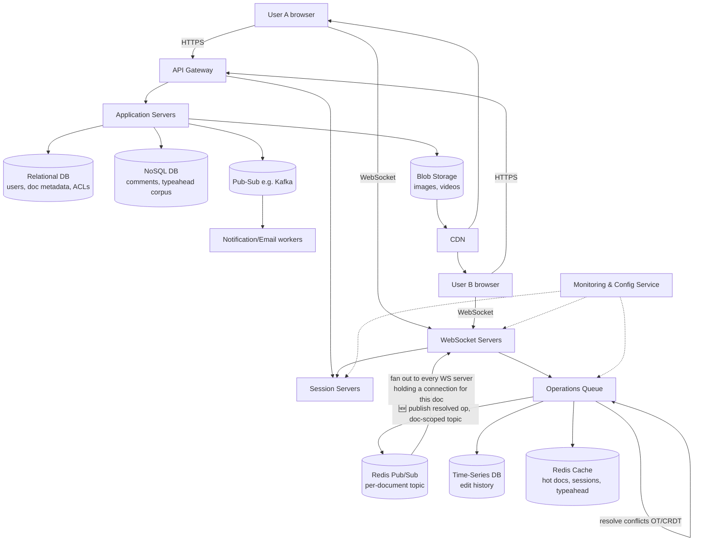

| Component | Job | Why this choice |
|---|---|---|
| API gateway | Routing, auth, rate limiting, cache short-circuit | Single ingress simplifies auth/observability |
| WebSocket servers | Bidirectional low-latency channel for keystrokes, presence, cursor position | HTTP request/response overhead (headers, TCP handshake per call) is too costly for per-character updates |
| Session servers | Track who's connected/editing which doc, access control at session level | Decouples "is this connection alive" from "what does this doc contain" |
| Operations queue | Serialize and batch edit operations per document; conflict resolution happens here | Character-by-character edits arrive out of order across a network — need one place that imposes an order |
| 🆕 Doc-scoped Pub/Sub | Fan out a resolved op to every WS server that has a client connected to that doc | This is the missing link between "one WS server accepted the op" and "every other tab sees it" — without it, a WS server would need to know about every other server's connections directly |
| Time-series DB | Store ordered edit history → enables version recovery via diff | History is fundamentally a stream of timestamped deltas, not a snapshot |
| Relational DB | Users, doc metadata, ACLs | Needs joins/transactions for permission checks |
| NoSQL DB | Comments, typeahead corpus | High write volume, simple key lookups, no need for joins |
| Blob storage | Images, videos | Large binary objects, infrequent overwrite |
| Redis | Sessions, typeahead cache, frequently-accessed docs, **and CRDT/OT working state** | Sub-ms reads for the hot path (active editing sessions) |
| CDN | Serve images/video and read-only/public docs | Offloads static, infrequently-changing content from origin |
| Pub-sub (Kafka) | Async notifications, emails, view-count updates | These don't block the editing critical path |

**Why WebSockets over HTTP polling** (a favorite interviewer probe):

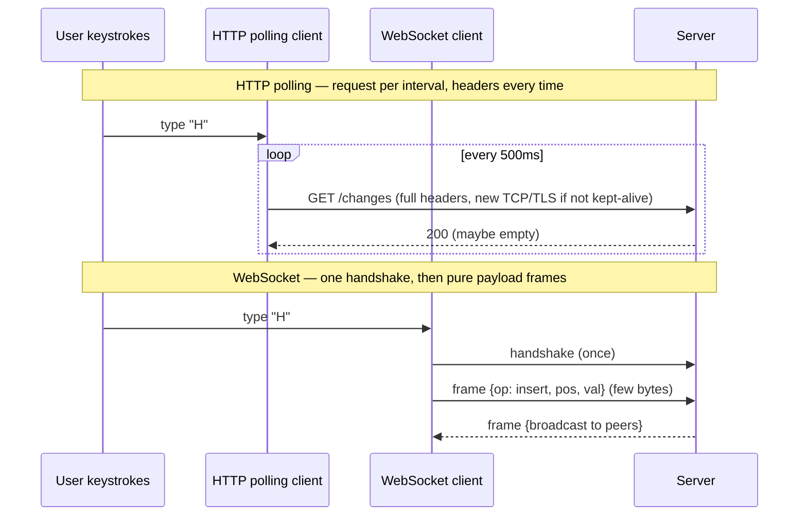

---

## 🆕 Architecture Evolution (v1 → v2 → v3)

Narrate this out loud in an interview — it shows *why* each piece of complexity in the final
architecture exists, instead of presenting a finished diagram with no backstory.

### v1 — single server, no real collaboration

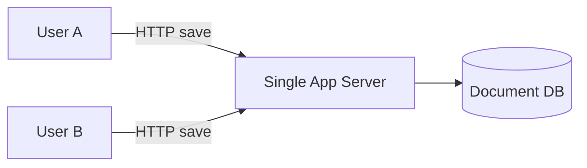

Works for "one editor at a time." Two people editing concurrently just overwrite each other's
saves — last write wins, silently. Name this and reject it in one sentence before moving on;
it's the strawman that motivates everything else.

### v2 — WebSocket fan-out + pub-sub, single region

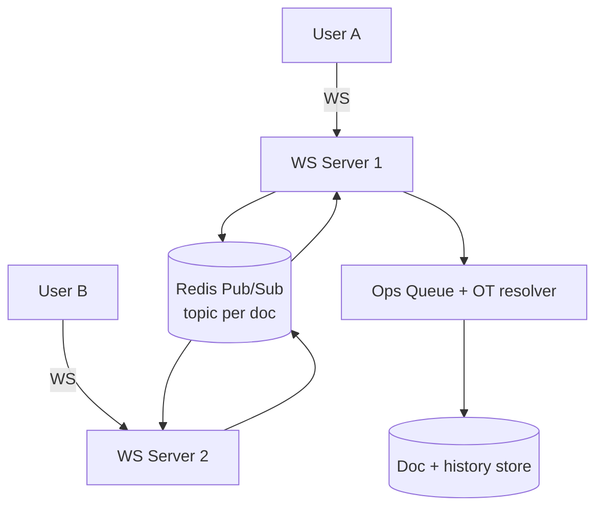

Two users on *different* WebSocket server processes now see each other's edits: server 1
publishes a resolved op to the doc's pub-sub topic, and every WS server subscribed to that
topic — because it holds a connected client for that doc — rebroadcasts it down its own
sockets. Pub-sub, not a direct server-to-server link, is what lets "any WS server" serve "any
client" without every server tracking every other server's connections.

### v3 — CRDT-based, multi-region

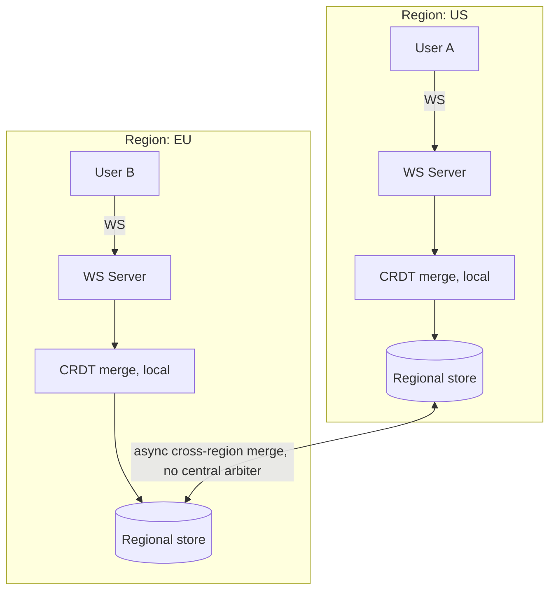

Each region resolves conflicts locally — no cross-region round trip needed just to accept a
keystroke — because CRDT merges are commutative: a US edit and an EU edit converge to the same
result whichever region sees them first. Name this version when asked "how would you avoid a
150ms tax on every keystroke across continents."

**Recall shortcut**: v1 = no collaboration. v2 = collaboration in one region (pub-sub fan-out
solves "which WS server"). v3 = collaboration across regions (swap OT's central arbiter for
CRDT's arbiter-free merge).

---

## 🆕 API Design

Two protocols, two jobs: REST for anything that isn't a live keystroke, WebSocket frames for
the edit stream itself. Forcing real-time ops through REST is the wrong answer to "why
WebSockets" turned into an API.

### REST — CRUD, sharing, history

| Endpoint | Method | Purpose |
|---|---|---|
| `/docs` | POST | Create a new document |
| `/docs/{docId}` | GET | Fetch metadata + latest snapshot (not the live op stream) |
| `/docs/{docId}` | DELETE | Soft-delete (owner only) |
| `/docs/{docId}/acl` | GET / PUT | Read or update permissions (owner/editor/commenter/viewer) |
| `/docs/{docId}/share-link` | POST | Mint a shareable link with a default role |
| `/docs/{docId}/history?before={ts}` | GET | Paginated version history, cursor by timestamp |
| `/docs/{docId}/history/{versionId}/restore` | POST | Roll back to a prior version — writes a *new* op batch, never deletes history |
| `/docs/{docId}/comments` | GET / POST | Comment thread anchored to a text range |

### WebSocket message schema — the part interviewers actually probe

Once connected (`wss://.../docs/{docId}/edit`), every message is a small frame (JSON here for
readability; production systems typically pack this into a smaller binary format):

| Direction | Type | Payload (illustrative) |
|---|---|---|
| Client → Server | `op` | `{ type: "insert", pos: 42, value: "H", siteId, opId, baseVersion }` |
| Client → Server | `cursor` | `{ userId, selectionStart, selectionEnd }` |
| Client → Server | `ack` | `{ opId }` — confirms the client applied a server-broadcast op |
| Server → Client | `op_broadcast` | Transformed/merged op + the new document version number |
| Server → Client | `presence` | Currently-connected collaborators + their live cursors |
| Server → Client | `snapshot` | Full/partial doc state, sent once at connect or after a long disconnect |

**Why `baseVersion` matters**: it tells the server (or the client's own OT/CRDT layer) what
state this op was generated against — exactly what conflict resolution needs to decide how to
transform or merge it. Without it, the server can't tell a stale op from a fresh one.

---

## Deep Dive: The Document Model

A document = an **ordered list of characters** (or blocks, for coarser-grained editors). Each
character has a **value** and a **positional index**. The editor's job reduces to three
primitives: `insert(value, index)`, `delete(index)`, `edit(...)`. Every conflict-resolution
technique is ultimately about making these three primitives commutative and idempotent across
concurrent, out-of-order execution.

#### 🆕 Concrete operation record (what actually goes over the wire and into history)

```json
{
  "opId": "site-42-seq-8831",
  "docId": "doc_9f2a",
  "type": "insert",
  "value": "H",
  "pos": 1240,
  "siteId": "42",
  "baseVersion": 8830,
  "ts": 1721300000123
}
```

At ~80 bytes per op (JSON; smaller if packed binary), a document with 10,000 edits on a busy
day produces roughly **800 KB of raw operation log per day** before compaction — this is the
number that motivates periodic snapshotting (store a full-doc snapshot every N ops, keep only
the deltas since the last one, rather than replaying the entire day's log to reconstruct
current state).

---

## Deep Dive: Concurrency Control — the heart of this interview

### Why plain "last write wins" fails

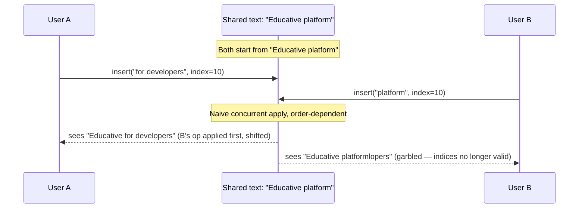

Two failure classes surface:
- **Not commutative**: applying A-then-B gives a different (wrong) result than B-then-A —
  raw positional indices silently drift under concurrent inserts.
- **Not idempotent**: two users independently deleting the same duplicate character ("EEDUCATIVE"
  → both delete index 0) can delete *two* characters instead of one if replayed naively.

Any correct solution must guarantee:
1. **Commutativity** — operation order shouldn't change the end state.
2. **Idempotency** — a repeated/duplicate operation applies only once.

### Technique 1 — Operational Transformation (OT)

**What it is**: a function `transform(op1, op2) → (op1', op2')` that rewrites an incoming
operation's positional index against operations that happened concurrently, so that applying
transformed ops in *any* arrival order converges to the same result. Invented by Ellis & Gibbs
in 1989; the algorithm family used in production (Jupiter, GOT, dOPT) adds a central server
that holds canonical order.

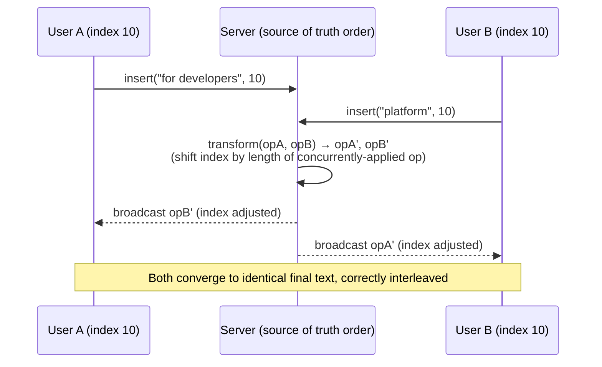

Consistency model behind this: **CC (Causality-preservation + Convergence) model**.
- **Causality preservation**: if op *a* happened-before op *b*, *a* is applied before *b* on
  every replica.
- **Convergence**: all replicas eventually hold identical document state.

**OT downsides** (say these unprompted — they're the reason CRDTs exist):
- Every operation potentially requires rewriting the positional index of every other pending
  operation → strongly **order-dependent**, hard to reason about with >2 concurrent editors.
- Notoriously hard to implement correctly. Google Wave's own engineers: *"implementing OT
  sucks... Wave took 2 years to write and if we rewrote it today, it would take almost as long
  a second time."* This is a great interview quote to drop — shows you know the real cost.
- Typically requires a central server to arbitrate the canonical order (harder to do
  peer-to-peer / offline-first).

### Technique 2 — Conflict-free Replicated Data Type (CRDT)

**What it is**: instead of transforming operations, give every character enough *intrinsic*
identity that operations are naturally commutative and idempotent, with no central arbiter
needed.

Each character carries:
```
{ SiteID: <uuid of originating client>, Value: <char>, PositionalIndex: <fraction> }
```

- **Globally unique identity** (`SiteID` + local counter) → duplicate/replayed ops are
  detected and dropped → **idempotency** for free.
- **Fractional positional index** → inserting between two characters (e.g., between index 1
  and 2) just picks a value in between (e.g., 1.5) instead of shifting every subsequent
  character's index → **commutativity** for free, because no other character's identity ever
  changes.

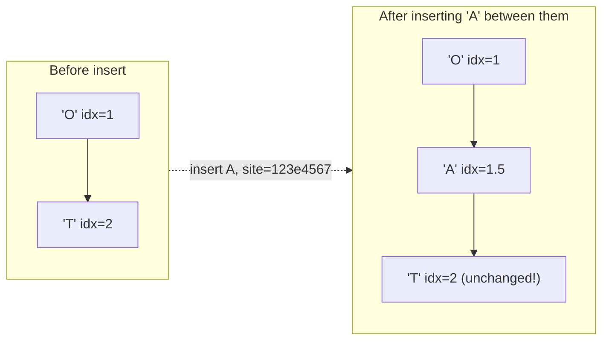

Because no existing character's index or identity is ever mutated, two sites can apply
insertions/deletions **in any order, any number of times**, and still converge — no central
server required. This is what makes **serverless peer-to-peer** collaborative editing possible
with CRDTs (not really feasible with classic OT).

**CRDT downsides**:
- Per-character metadata overhead (SiteID + fractional index) is heavier than raw text —
  matters at scale (see Numbers table).
- Fractional indices can require re-basing/rebalancing after many insertions cluster near the
  same value (implementations like LSEQ, Logoot address this with allocation strategies).
- Tombstones for deletes can accumulate if not garbage-collected.

### OT vs CRDT — side by side

| | Operational Transformation (OT) | CRDT |
|---|---|---|
| Core idea | Transform incoming ops against concurrent ops | Give every element global identity + order so ops are inherently commutative |
| Needs central server to arbitrate order? | Yes (in practice) | No — works peer-to-peer |
| Offline support | Harder — reconciliation on reconnect is complex | Natural — replicas converge whenever they sync |
| Implementation difficulty | Very high (algorithmically subtle, many edge cases) | Data structure is complex but algorithm is simpler |
| Metadata overhead per char | Low (just position) | Higher (site ID + fractional index + tombstones) |
| Used by | Google Docs, Google Wave (historically), Etherpad (Easysync) | Automerge, Yjs, Redis CRDTs (Active-Active), Riak, Notion-style block CRDTs, many offline-first apps |
| Mnemonic | **O**T = **O**rder gets rewritten | **C**RDT = **C**onvergence via **C**oordinate-free IDs |

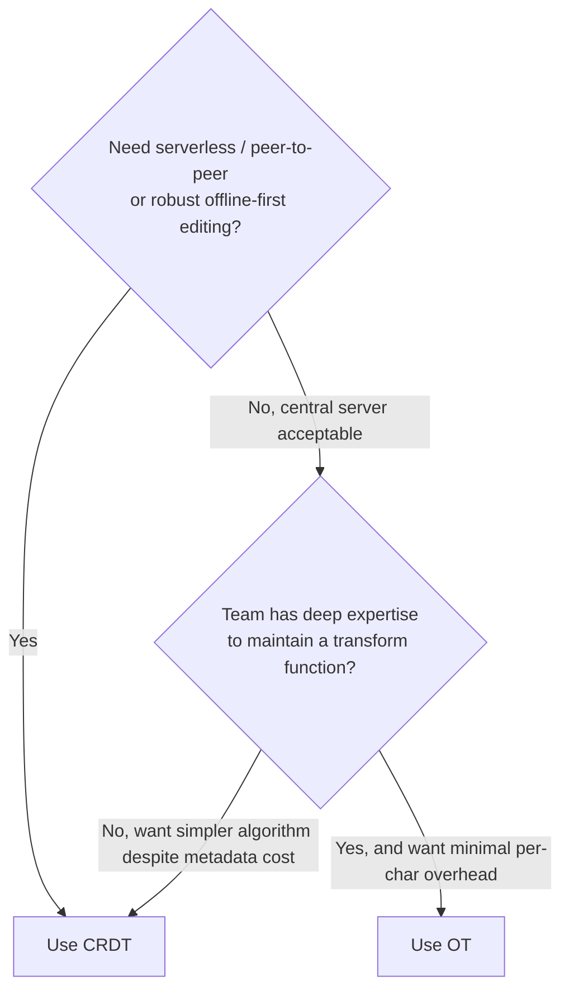

**Golden rule**: if the interviewer pushes "which would *you* pick," the safe, defensible
answer is CRDT for a greenfield design in 2024+ — the tooling (Yjs, Automerge) is mature, and
offline-first is now a baseline user expectation. Justify with the trade-off table above rather
than picking a side dogmatically; Google Docs itself is OT for historical reasons (predates
mature CRDT libraries), not because OT is inherently superior.

---

## Deep Dive: Real-Time Delivery & Presence

- **WebSocket servers** hold a persistent connection per active editor; each accepts small
  operation frames instead of full HTTP requests.
- **Session servers** track who is connected to which document and their access level —
  decoupled from WebSocket servers so a WS server crash doesn't lose session/permission state.
- **Cursor/presence broadcast**: since a WebSocket channel already exists, broadcasting a
  collaborator's live cursor position is nearly free and has a side benefit — *users
  subconsciously avoid the region another cursor is in*, reducing real-world conflict rate
  before conflict-resolution logic even runs.
- **Chat piggybacking**: combine WebSockets + Redis pub-sub to add a lightweight "collaborators
  chatting while editing" feature almost for free.

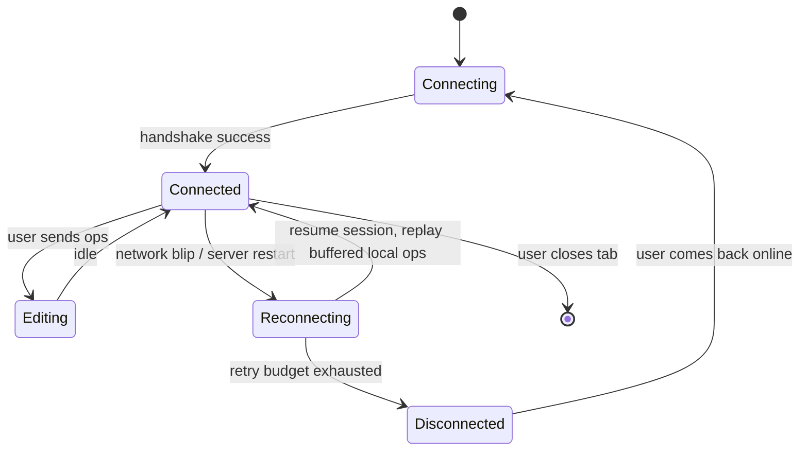

#### 🆕 End-to-end edit-sync sequence (op sent → resolved → fanned out)

This is the flow the high-level diagram's new pub-sub edge is shorthand for — worth drawing in
full at least once in the interview:

```mermaid
sequenceDiagram
    participant A as User A (WS Server 1)
    participant OQ as Ops Queue / OT-CRDT resolver
    participant PS as Pub/Sub (topic = docId)
    participant WS2 as WS Server 2
    participant B as User B (on WS Server 2)

    A->>OQ: op {insert, pos, val, baseVersion}
    OQ->>OQ: transform (OT) or merge (CRDT) against concurrent ops
    OQ->>PS: publish resolved op, docId topic
    PS-->>A: op_broadcast (A's own server also subscribes, for other local tabs)
    PS-->>WS2: op_broadcast
    WS2-->>B: op_broadcast
    Note over A,B: p99 sync latency budget ~200ms (illustrative);<br/>A already saw their own keystroke instantly via local-first apply
```

The pub-sub topic — not a direct link between WS Server 1 and WS Server 2 — is what lets
50,000 concurrent sessions spread across an arbitrary number of WS server processes without
every server needing to track every other server's connections.

#### 🆕 Offline editing & reconciliation

A closed laptop lid or a subway tunnel shouldn't block editing. The client keeps a local op
log while disconnected, then replays it on reconnect. What "replay" means depends on which
conflict-resolution technique you picked:

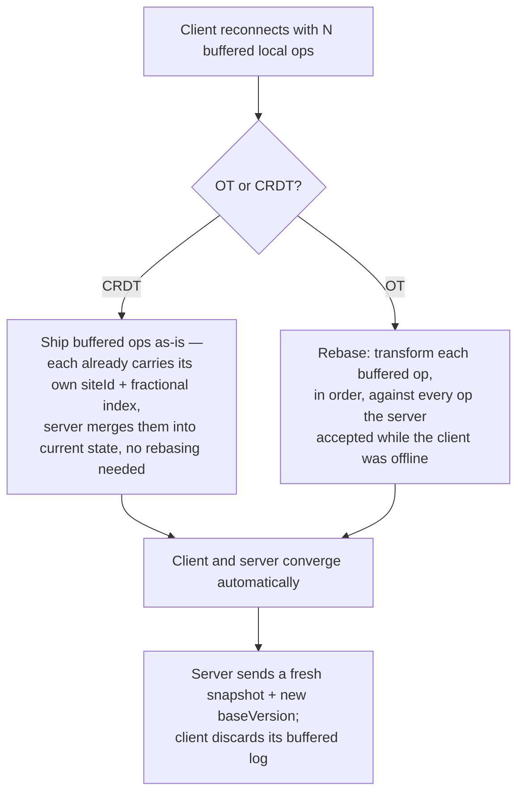

**Why this is CRDTs' strongest pitch in an interview**: with OT, reconciling a long offline
stretch means transforming a buffered op against potentially thousands of intervening
server-side ops — the transform function has to stay correct for every pairwise combination.
With CRDTs, replay is just "apply these ops, in any order" — the data structure was built for
exactly this. It's why offline-first apps skew CRDT even when they don't need multi-region
writes.

**Illustrative bound**: cap the local op buffer (e.g., 10,000 ops or 24 hours, whichever comes
first). Past that, don't attempt replay — pull a fresh snapshot and let the user manually
recover any unsynced text from a local backup. An unbounded offline queue is a real failure
mode, not a hypothetical.

---

## Deep Dive: Storage & History

- **Time-series DB** for edit history: every batch of resolved operations is a timestamped
  append. Enables **DIFF-based version recovery** — reconstruct any prior state by replaying
  ops up to a timestamp, or store periodic snapshots + deltas to bound replay cost (classic
  event-sourcing snapshot pattern).
- **Why not just store snapshots of the whole doc on every edit?** Write amplification — a
  100 KB doc re-saved on every keystroke batch is far more expensive than storing a
  few-byte delta.
- **Suggestions/typeahead**: NoSQL store for the corpus (high write/read volume, no relational
  needs) + Redis cache for the hottest words/phrases — classic cache-aside for a read-heavy,
  latency-sensitive feature.
- **View counts**: implemented asynchronously via pub-sub — count can be *stale*, which is
  fine (users tolerate eventual consistency for a vanity metric but never for the *document
  content itself*). This is a good moment in an interview to explicitly distinguish **which
  parts of the system get strong consistency vs. eventual consistency** — don't apply one
  consistency model uniformly.
- **Sharded/Redis counters** are the standard answer if the interviewer asks "how do you make
  view count less stale without hurting write throughput" — batch increments, flush
  periodically instead of a single hot row.

#### 🆕 Undo/redo in a collaborative document

Naive undo ("reverse my last op") breaks the moment someone else has edited in between —
undoing "insert 'cat' at position 10" is meaningless once another user has inserted text at
position 5 and shifted everything after it.

The fix: undo is **not** "go back in time." It's **"apply the inverse operation, transformed
(OT) or merged (CRDT) against everything that happened since"** — the same machinery as a
normal concurrent edit, just with a computed inverse op instead of a typed one.

```
OT undo:   undo_op = transform(inverse(my_last_op), all_ops_since)
CRDT undo: undo_op = tombstone(my_last_op's element IDs)   # delete-by-ID, no position math
```

This is also why **redo** and **selective per-user undo** ("undo only my last change, not
everyone else's") fall out almost for free with CRDTs: every op already carries the identity
of who made it and what it touched, so "undo my last op" reduces to "find my last surviving op
ID and tombstone it" — regardless of what anyone else did afterward.

---

## 🆕 Deep Dive: Access Control

Mentioned in passing in Requirements — worth a full answer, since "how do you handle
permissions" is a near-certain follow-up on any multi-user editing design.

| Role | View | Comment | Edit | Change ACL |
|---|---|---|---|---|
| Viewer | Yes | No | No | No |
| Commenter | Yes | Yes | No | No |
| Editor | Yes | Yes | Yes | No |
| Owner | Yes | Yes | Yes | Yes |

**Where the check happens** (name all three — a single check point is a common gap):
- **At connect time**: the session server validates the user's role against the doc's ACL
  (relational DB, cached in Redis) *before* accepting the WebSocket upgrade — no reason to open
  a socket for someone who can't even read the doc.
- **Per operation**: a viewer's client should never send `insert`/`delete` frames, but the
  server re-checks role on every incoming op regardless — never trust the client to enforce
  its own permissions.
- **Share links**: a link encodes a doc ID plus a default role ("anyone with the link can
  comment") rather than a per-user grant, and resolves to a concrete ACL entry the first time
  someone opens it — so a later revocation has something specific to revoke.

**The edge case interviewers like**: a user's access is revoked *while they have the doc open*.
Name both options rather than picking one blindly:
1. **Push a revocation event** through the same doc-scoped pub/sub channel used for ops — the
   session server force-closes that user's WebSocket immediately.
2. **Do nothing until next reconnect** — cheaper, but leaves a window where a de-authorized
   user keeps editing. Many real systems accept this small window rather than pay for
   per-request ACL re-validation on every keystroke.

**Mnemonic**: **connect-time gate, per-op re-check, never trust the client.**

---

## Non-Functional Deep Dive

### Consistency
- Strong consistency **within a document's operation stream** (via OT/CRDT) — this is
  non-negotiable; eventual consistency on the actual text would mean two users literally see
  different documents indefinitely.
- Cross-server replication **within a data center** uses a **Gossip protocol** (peer-to-peer,
  epidemic-style state propagation — same family of protocol used by Cassandra/DynamoDB for
  membership and anti-entropy) to keep replicas of the same document state converged quickly.
- Cross-datacenter replication is asynchronous — trades a small consistency window for latency
  and availability (classic multi-region trade-off).

### Latency
- User-perceived latency is low because **the user edits a local replica first** (optimistic
  local apply) — the network round trip only affects *when other people* see the edit, not
  when the typing user sees their own keystroke. This "local-first" property is the single
  biggest latency win in the whole design.
- Readers are cheap: a document loads once, then mostly no more traffic — route to nearest
  replica/CDN.
- Writers: pick a data-center "centroid" close to the set of active collaborators; for very
  popular/viral docs, fall back to asynchronous replication and accept a wider consistency
  window in exchange for keeping latency flat as writer count grows.

### Availability
- Redundant WebSocket servers — a client reconnects to any other WS server without losing
  document state (state lives in Redis/DB, not in WS server memory).
- Replication of operations queue and data stores is handled internally by each store.
- Monitoring + configuration services do leader election when a primary fails.
- Caching and CDN both double as availability buffers, not just performance boosts — they let
  the system keep serving even when an origin component is degraded.
- Explicitly flag the gap: **disaster recovery (cross-region failover) is a stated open
  problem** in the source design — a strong interview answer names this rather than pretending
  the design is complete.

### Scalability
- Microservice-style component isolation → scale each piece independently.
- **Operations queue sharding**: one queue per active document (not one global queue) — a
  single hot document never bottlenecks unrelated documents, and queue count scales with
  active-document count, not user count.
- Horizontal sharding of the relational DB for user/doc metadata.
- CDN absorbs large read fan-out for media and public read-only docs.

---

## Failure Modes & Mitigations

| Failure | Impact | Mitigation |
|---|---|---|
| WebSocket server crash | Connected clients drop | Stateless WS servers (session/doc state in Redis/DB) + client auto-reconnect with buffered local ops replay |
| Operations queue backlog for one hot doc | Edits to that doc lag | Per-document queue sharding isolates the hot doc; autoscale queue consumers per shard |
| Split-brain during network partition (multi-DC) | Two regions each think they hold canonical state | Prefer single-writer-region-per-doc + async replication; reconcile via CRDT merge or OT replay log on heal |
| Redis cache node failure | Slower typeahead, session lookup miss | Fallback to DB read-through; Redis cluster replication |
| Time-series DB write pressure | History writes lag behind live edits | Batch small character ops before persisting (already in design); async persistence off the hot path |
| Malicious/duplicate operation replay | Double-delete/double-insert corruption | CRDT's unique IDs give idempotency by construction; OT needs explicit dedup/sequence numbers |
| 🆕 Client offline for an extended stretch | Local op buffer grows unbounded, replay/rebase gets expensive or incorrect | Cap the buffer (e.g., 10K ops / 24h); past that, force a fresh snapshot instead of replaying |
| 🆕 Access revoked while user's session is open | De-authorized user keeps editing until they reconnect | Push a revocation event over the doc's pub/sub channel to force-close the session, or explicitly accept the small window |

---

## Real-World References

| System | Technique | Notable detail |
|---|---|---|
| **Google Docs** | OT | Predates mature CRDT tooling; uses a central server as the transform authority |
| **Google Wave** (2009-2010, OT pioneer) | OT | Famously hard to implement — 2 years for the core algorithm; heavily influenced today's OT literature |
| **Etherpad** | OT (Easysync) | Open-source, real-time pad editor; simpler doc model than Docs |
| **Figma** | Central server + property-level last-write-wins on a scene-tree | Not text CRDT/OT — their doc model is a tree of typed properties, so per-property LWW resolves cleanly without character-level transform |
| **Automerge / Yjs** | CRDT libraries (JS) | Power many offline-first collaborative apps; Yjs widely used in Jupyter-notebook collaboration and various editors |
| **Redis Enterprise (Active-Active / CRDB)** | CRDT | Multi-region writable Redis using CRDTs for data types (counters, sets) |
| **Riak / Cosmos DB (multi-master)** | CRDT | Same core idea applied to general-purpose databases, not just text |
| **Apple Notes / iCloud sync** | Reportedly CRDT-influenced | Offline-first sync across devices without a central arbiter |

---

## Interview Cheat-Sheets

### Requirements & estimation
- Functional core: collab editing, conflict resolution, suggestions, view count, history.
- Non-functional core: consistency (strong, for doc content), latency, availability, scale.
- Formula chain: DAU → docs/day → storage/day → bytes/sec → Gbps → RPS → server count.
- State your assumptions explicitly — the interviewer will change one and expect a redo.

### Architecture
- API gateway (routing/auth/cache) → app servers (business logic, conversions) → WebSocket
  servers (real-time edits) → operations queue (ordering/conflict resolution) → time-series DB
  (history).
- Different data stores for different jobs: RDBMS (ACLs/metadata), NoSQL (comments/typeahead),
  time-series (history), blob (media), Redis (hot path + sessions), CDN (media/public docs).
- Queue is sharded **per document**, not global — this is the scalability lever, know it cold.

### Concurrency control (the make-or-break section)
- Two properties any solution must guarantee: **commutativity** and **idempotency**.
- OT: transforms operations against each other; needs a canonical-order server; hard to
  implement; used by Google Docs.
- CRDT: gives elements global identity + fractional order so ops are naturally commutative;
  enables serverless P2P; used by Automerge/Yjs/Redis Active-Active.
- Be ready to draw the fractional-index insert example from memory.
- Name the trade-off unprompted: OT = lower metadata, high implementation cost. CRDT = simpler
  algorithm, higher metadata cost, better offline story.

### Non-functional walkthrough
- Consistency: strong for doc content (OT/CRDT + time-series ordering), Gossip protocol for
  intra-DC replica sync, async for inter-DC.
- Latency: local-first optimistic apply is the single biggest win; CDN for media; pick a
  low-latency writer region.
- Availability: stateless WS servers, replicated queue/stores, monitoring-driven leader
  election, caching/CDN double as availability buffers.
- Scalability: per-document queue sharding, DB horizontal sharding, independent component
  scaling.

---

## Disambiguation Quick-Reference

| Confusable pair | The distinction |
|---|---|
| **OT vs CRDT** | OT rewrites operations against each other centrally; CRDT gives data inherent commutative identity, no central authority needed |
| **Commutativity vs Idempotency** | Commutativity = order doesn't matter; idempotency = repetition doesn't matter. A correct concurrent-editing system needs *both* |
| **WebSockets vs long-polling/SSE** | WebSockets: full-duplex, one handshake, tiny frames both ways. SSE: server→client only, still HTTP-based, simpler but one-directional. Long-polling: repeated HTTP requests, most overhead |
| **Strong vs eventual consistency (in this system)** | Document *content* needs strong consistency (via OT/CRDT); auxiliary metrics like *view count* are fine eventual — don't apply one consistency model to the whole system uniformly |
| **Gossip protocol vs Pub-Sub** | Gossip = peer-to-peer epidemic state propagation for replica convergence (intra-DC); Pub-Sub = centralized topic-based async task dispatch (notifications, emails) — different jobs, don't conflate |
| **Vector clock vs Lamport timestamp** (useful vocabulary if asked "how do you order ops across sites") | Lamport timestamp gives a total order but can't detect concurrency; vector clocks can detect true concurrency (needed to know when a real conflict — not just a delay — has occurred) |

---

## 🆕 If-X-Then-Y Recall Table

A fast-recall cheat sheet for the probes interviewers reach for most often in this problem:

| If the interviewer says... | Then answer... |
|---|---|
| "What if the user is offline for hours?" | CRDT merge needs no rebase; OT must replay-transform against everything missed — name the buffer cap too |
| "Two people edit the exact same spot simultaneously" | Both ops still apply — OT transforms indices, CRDT keeps both insertions ordered by fractional index; nothing silently drops |
| "How do you undo your own edit without undoing someone else's?" | Undo = inverse op transformed/merged against everything since, not a literal rewind |
| "A user's access is revoked mid-session" | Either push a revoke event over the doc's pub/sub channel, or accept the small window until reconnect |
| "How does an edit reach a client on a different WebSocket server?" | A doc-scoped pub/sub topic — servers never talk to each other directly |
| "How do you scale the operations queue?" | Shard per document ID, never globally |
| "Why not eventual consistency for the document text?" | Users would see permanently divergent documents — fine for view counts, not for shared content |

---

## Numbers Worth Memorizing

| Metric | Value | Why it matters here |
|---|---|---|
| Reference server capacity | ~8,000 RPS | Baseline used to convert DAU → server count |
| 🆕 Concurrent editing sessions, platform-wide (illustrative) | ~50,000 | Sizes the WS server fleet independent of the DAU/storage math |
| 🆕 p99 sync latency budget | ~200 ms | Keystroke-to-peer-screen target; past this, users perceive "broken" |
| Typical WebSocket connection memory overhead | ~ a few KB–20 KB per idle connection | Determines how many concurrent editors one WS server can hold (tens of thousands, not millions) |
| Redis read latency | sub-millisecond | Why hot-path session/typeahead data lives there, not RDBMS |
| Cross-region RTT | ~100–150 ms | Why writer-region selection matters for editing latency |
| Same-DC RTT | ~0.5–2 ms | Why Gossip-based intra-DC replication is "fast enough" for near-real-time convergence |
| CRDT per-character metadata | ~tens of bytes (site ID + fractional index) | Can multiply raw text storage several-fold if history isn't compacted |
| Typical doc text size (from estimation) | 100 KB | Baseline for storage math |
| Max concurrent editors assumed | 20 per doc | Bounds worst-case conflict rate per operations-queue shard |

---

## Golden Rules

- **The document's content always gets strong consistency; everything else (view counts,
  notifications) can be eventually consistent** — don't uniformly apply one consistency model.
- **Local-first optimistic apply is what makes latency feel instant** — the network only
  affects when *others* see your edit, never when you see your own.
- **Any correct conflict-resolution technique must guarantee both commutativity and
  idempotency** — if a proposed design can't explain how it gets both, it's not finished.
- **Shard the operations queue by document, not by user or globally** — a hot document should
  never be able to starve unrelated documents.
- **State machines don't replace judgment**: OT vs CRDT is a trade-off, not a right answer —
  justify your pick against the specific requirements (offline support? implementation budget?
  greenfield vs legacy?) rather than reciting a preference.
- **Presence (live cursors) is a conflict-avoidance feature, not just a UX nicety** — users
  naturally avoid editing where they see someone else's cursor, reducing real conflicts before
  your algorithm even runs.

---

## Master Cheat Sheet

**Formula chain**: DAU → docs/day → storage/day (text+image+video) → bytes/sec → Gbps →
RPS → servers (÷ 8,000 RPS/server baseline).

**Core commitment**: pick OT or CRDT and defend it — this is the section interviewers weight
most. Two required properties: commutativity + idempotency.

**OT** = central server transforms ops against each other. Hard to implement. Used by Google
Docs, Etherpad. Lower per-char overhead.

**CRDT** = global ID + fractional position per element → ops commute/idempotent by
construction. No central server needed → enables offline & P2P. Higher metadata overhead. Used
by Automerge, Yjs, Redis Active-Active.

**Architecture skeleton**: API gateway → app servers / WebSocket servers → session servers +
operations queue (sharded per doc) → time-series DB (history) + RDBMS (ACLs/metadata) + NoSQL
(comments/typeahead) + blob storage (media) + Redis (hot path) + CDN (media/public docs) +
pub-sub (async notifications).

**Consistency stack**: OT/CRDT (per-op) → time-series DB (ordering) → Gossip protocol
(intra-DC replica sync) → async replication (inter-DC).

**Latency lever**: local-first optimistic apply + WebSockets + CDN for media + regional writer
placement.

**Availability lever**: stateless WS servers + replicated stores + monitoring/leader election +
cache/CDN as availability buffer, not just perf.

**Scalability lever**: per-document queue sharding + independently scalable microservices +
RDBMS horizontal sharding.

**🆕 Fan-out lever**: a doc-scoped pub/sub topic — not direct server-to-server links — is how
an op reaches clients connected to a *different* WebSocket server.

**🆕 The four extra deep dives worth naming unprompted**: API design (REST for CRUD, WS frames
carrying `baseVersion` for the edit stream), access control (connect-time gate + per-op
re-check, never trust the client), offline reconciliation (CRDT merges without rebase, OT must
replay-transform), and undo/redo (inverse op transformed/merged against everything since — not
a literal rewind).

**One-liners for common interview probes**:
- "Why WebSockets over HTTP?" → per-character HTTP overhead (headers/handshake) is too costly;
  WebSockets keep one persistent full-duplex channel.
- "Why can't you just use locks?" → locks kill the collaborative, non-blocking UX the whole
  product is built on; conflict resolution must be lock-free.
- "Why not eventual consistency for the document itself?" → users would see permanently
  divergent document states — unacceptable for a shared editing surface, unlike view counts.
- "How do you scale the operations queue?" → shard by document ID, not globally.
- "What's still missing?" → disaster recovery / cross-region failover — name it as a known gap.
