# Spectacular Failures — The Story (narrative edition)

> **What this file is.** The reference file, `39-Spectacular-Failures-FAANG-Guide.md`, is the one
> to recite from — the mental model, the nines table, the three incident deep-dives, every
> cross-cutting pattern, the golden rules, the master cheat sheet. This file is a second way in:
> the same material told as one continuous story. It differs from the other "-story" companions in
> this folder on purpose — those retell a fictional company hitting fictional walls, because their
> source material is a general design problem. This one can't do that. **Every incident below is
> real, named, and documented in a public postmortem** — Meta's October 4, 2021 outage, AWS
> Kinesis's November 25, 2020 outage, and AWS US-EAST-1's December 7, 2021 outage. Fictionalizing
> them would misrepresent what actually happened. So the story here is the real chronological and
> causal chain: three real outages in the order they happened, then the general patterns the
> industry pulled out of incidents exactly like these. Every number is the actual documented or
> widely-reported figure, and every estimate is flagged as an estimate — same as the reference file.

**The one sentence to hold onto:** distributed systems don't fail because one thing breaks — they
fail because the safety net turns out to share a dependency with the thing it was supposed to
catch. Watch for that exact shape recurring across all three incidents below.

---

## Chapter 1 — The four ways a system can betray you

A distributed system fails in exactly one of four shapes: **crash** (a process/box dies, memory
state is lost), **confuse** (it keeps running but the logic is wrong or deadlocked), **cut-off**
(nothing is down, but components can't reach each other), or **corrupt** (a replica/disk goes bad).
Memory hook: *Crash, Confuse, Cut-off, Corrupt.*

No real outage is one root cause — it's a chain of individually-reasonable decisions:

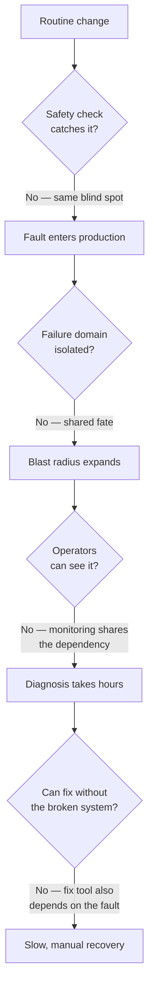

Every "No" above is a design decision an interviewer wants you to make correctly ahead of time. All
three incidents below walk down this exact ladder.

**How I'd say this in an interview:** "Failures reduce to crash, confuse, cut-off, or corrupt — but
they become outages, not blips, almost always because the safety net shared a blast radius with the
fault it was meant to catch."

---

## Chapter 2 — Putting a number on "acceptable failure"

| Availability | Downtime/year | Colloquial |
|---|---|---|
| 99% | 3.65 days | "two nines" |
| 99.9% | 8.76 hours | "three nines" |
| 99.99% | 52.6 minutes | "four nines" |
| 99.999% | 5.26 minutes | "five nines" |

A 99.9% monthly SLO gives a team roughly 43 minutes of error budget a month. Picture a team that's
burned 34 of those 43 minutes by day 10 — 79% of the whole month's budget gone in the first third:

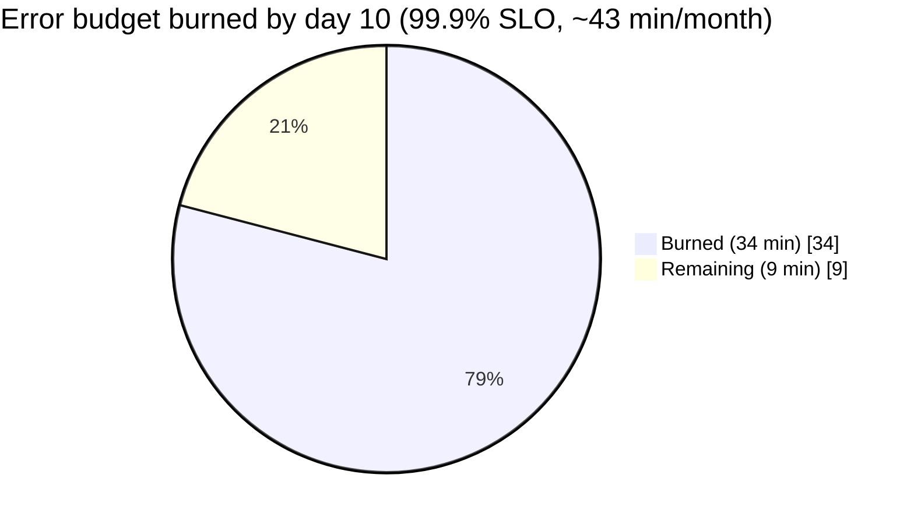

At that burn rate, the disciplined move is freezing risky changes for the rest of the month — all
three incidents below started as exactly the kind of "routine" change a freeze is meant to defer.
Composite availability also multiplies down: five services at 99.9% each give `0.999^5 ≈ 99.5%`,
worse than any one of them. Every extra hop in a call path is a cost — which is exactly how one
Kinesis problem became a Cognito, CloudWatch, and Lambda problem all at once in Chapter 3.

**How I'd say this in an interview:** "Nines compose by multiplying, not averaging, so every extra
dependency drags the effective availability down — error budgets turn 'be reliable' into a number a
team can spend or freeze."

---

## Chapter 3 — The capacity add that hit a ceiling nobody had drawn (AWS Kinesis, Nov 25, 2020)

On **November 25, 2020**, AWS added a small, routine amount of capacity to the Kinesis front-end
fleet in US-EAST-1. Nothing about that sounds dangerous — until the exact break: Kinesis's front-end
caching design required **every server to hold a thread to every other server** in the fleet to keep
its shard-ownership map current, a cost that grows with fleet size, not with the size of the change.
The routine add pushed every server past the OS's max thread count. Threads exhausted, the shard-map
cache failed to build, and front-end servers lost the ability to route requests to the back-end.

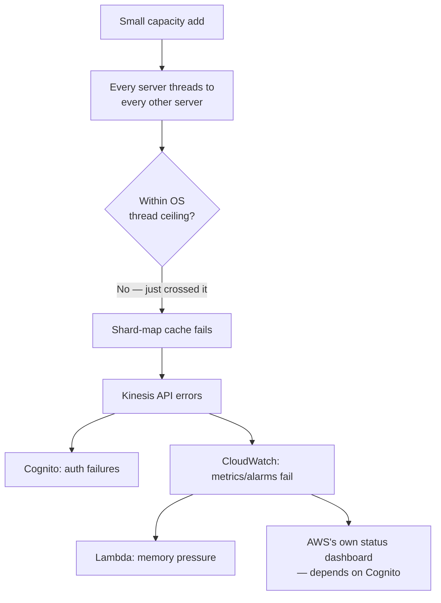

Obvious next question: *why didn't restarting fix it right away?* Because every restarted server
rebuilt its **full mesh** again, all at once — a second, self-inflicted stampede (**thundering
herd** — Chapter 6).

**Name the pattern:** a full-mesh design has a hidden **O(n²) ceiling** — cost grows with the square
of fleet size. Analogy: a party where every guest must shake every other guest's hand before anyone
eats. A few more guests and the handshake count explodes far faster than the guest list did.

And here's the recurring shape: **CloudWatch is the tool operators would use to diagnose this — and
CloudWatch was itself a victim**, because it consumes Kinesis internally. The fire alarm was wired
into the building that was on fire. This exact sentence recurs twice more in this story.

**Impact**: the fleet itself substantially recovered in roughly **~5 hours** (start ~5:15am PST,
core mitigation mid-morning); some dependent services took several more hours to drain backlog
(illustrative estimate). Dozens of consumer products (iRobot/Roomba, Ring, delivery dashboards) had
public outages, because they all sat on Cognito/CloudWatch/Lambda without knowing those shared one
fleet. AWS's own Service Health Dashboard couldn't post real-time updates — posting to it needed
Cognito.

**What changed afterward**: fewer, larger front-end nodes (lowers total thread count); a dedicated,
isolated fleet for tier-0 consumers (Cognito, CloudWatch) so they can never again be starved by a
customer-side capacity change; and a faster cold-start path so a fleet-wide restart doesn't force
every server to rebuild the whole mesh at once.

**How I'd say this in an interview:** "A capacity add that looks linear can hit a nonlinear, O(n²)
ceiling in a full-mesh design — I'd game-day capacity changes against topology cost, not just
correctness. And I'd never let my own monitoring and auth run on the same fleet as the traffic
they're watching."

---

## Chapter 4 — The fail-safe that fired on a condition nobody tested (Meta, Oct 4, 2021)

Ten months earlier in real time — but next in this story's causal chain of "same shape, different
company" — a different mechanism produced the exact same lesson.

On **October 4, 2021**, an engineer ran a routine command auditing spare capacity on Facebook's
backbone network. A bug in the command, missed by the audit tool meant to catch exactly this,
disconnected **all** backbone links between all data centers at once — not a scoped subset.

The subtle part: Facebook's authoritative DNS servers run a health check that withdraws their own
BGP route advertisements if they can't reach the internal backbone — a fail-safe built and tested
for *partial* problems. "Zero of N data centers reachable" was never tested. When it fired, it fired
everywhere.

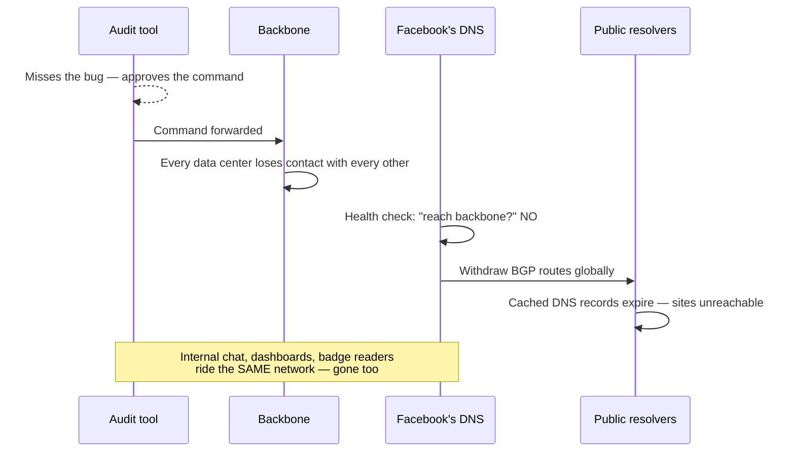

Obvious next question: *why couldn't engineers just fix it remotely?* Because the same
disconnection took down Facebook's own internal tools and complicated physical badge access to the
data centers. The rescue plan was standing in the burning building — the same sentence as Chapter
3's CloudWatch problem, in different clothes.

**Impact** (widely-reported, not all Meta-confirmed): roughly **~6 hours** of total unreachability
(start ~11:40am ET). Facebook, Instagram, WhatsApp, Messenger, and Oculus went dark together — a
combined addressable user base on the order of **3+ billion** (not all concurrently active). Lost ad
revenue was estimated at the time on the order of **tens of millions of dollars** for the window —
Meta never published an official figure, so treat this as illustrative. The blast radius even
crossed a company boundary: every third-party site whose *only* login option was "Login with
Facebook" broke too.

**What changed afterward**: hardened the audit tool with additional checks before this command
class executes; rate-limiting so a single command can't take effect network-wide at once; a faster
way to halt this kind of cascade once detected; and faster, more resilient physical/emergency access
to data centers for when normal remote tooling is unusable.

**How I'd say this in an interview:** "The health check fired exactly as designed — the design just
never accounted for a total, not partial, failure. I'd game-day the 'everything is gone' case, and
make sure break-glass access never resolves through the same network as the thing it fixes."

---

## Chapter 5 — The retry storm that jammed the one bridge everyone needed (AWS, Dec 7, 2021)

Two months after Meta's outage, AWS had its own version — same shape, third variation.

On **December 7, 2021**, an automated action expanded capacity for a component on AWS's *internal*
network — the separate network carrying AWS's own DNS, monitoring, and the control-plane APIs
behind EC2/ELB. The exact break: that action triggered unexpected client behavior, producing a
sudden connection-activity surge that saturated the **networking devices bridging** the internal
network to the main network — the one seam connecting the two.

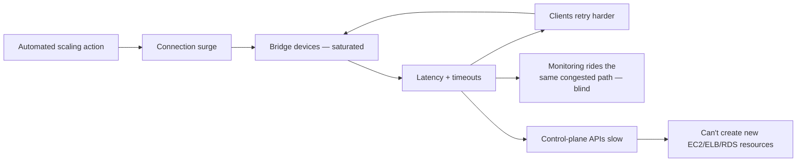

Rising latency caused timeouts, which caused more retries, which added load onto an already
saturated bridge — congestion collapse, TCP's failure shape playing out at the level of application
retries. Monitoring rode that same congested path — the third and last time this sentence appears:
**the fire alarm shared the fire's network.** Operators fell back to manually grepping raw logs.

Obvious next question: *if control plane and data plane are decoupled, why did anything break?*
Because they were decoupled for *existing* traffic only — already-running EC2 instances and load
balancers kept serving live traffic the whole time. But creating anything new is a control-plane
call, and the control plane's own dependencies (network, DNS, monitoring) weren't isolated from the
failure. Partial decoupling gave partial protection.

**Impact**: roughly **~5-8 hours** end to end (start ~7:30am PST). Publicly-reported impact
included Amazon's own retail and delivery operations, Ring, some Prime Video/Alexa features, and
third-party services on AWS (Disney+, DoorDash reported degraded service) — illustrative of breadth,
not a confirmed count.

**What changed afterward**: throttles on the class of scaling action that triggered the surge;
expanded bridge capacity so the same surge no longer saturates it; better isolation between the
internal network's monitoring path and its data path; a hardened internal DNS failover path.

**How I'd say this in an interview:** "Data plane survived, control plane didn't — I'd volunteer
that distinction unprompted. And I'd never call two networks 'independent' without asking what
their bridge's own capacity ceiling is — that seam is exactly where this one broke."

---

## Chapter 6 — Naming what actually happened three times

Same handful of named patterns underneath three different literal mechanisms — this is what an
interviewer actually grades.

**SPOF**: a shared audit tool (Meta), a shared fleet serving both customers and AWS's own
control-plane traffic (Kinesis), a shared network bridge (AWS Dec 2021). SPOFs hide in places
nobody audits as "infrastructure." Notice **DNS shows up in 2 of 3 incidents** — once broadcasting
Meta's outage to the whole internet, once blinding AWS's operators mid-incident. DNS sits underneath
almost everything while usually being treated as a boring, assumed-reliable utility.

**Cascading failures and retry storms**: failure in A raises load on B, which fails C. For
backoff-free retries:

```
effective_load ≈ base_load / (1 - error_rate)
```

At 50% error rate, naive retries **double** the offered load on a system already failing half its
requests — a death spiral, exactly what saturated the bridge in Chapter 5.

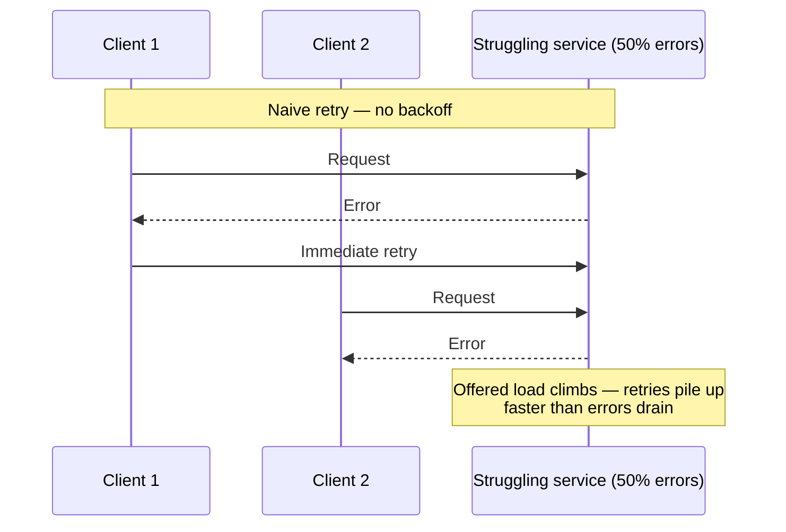

Fix: **backoff + jitter + a retry budget** — spread retries over time and cap how much extra load
any client can offer.

**How I'd say this in an interview:** "Say the pattern name out loud — SPOF, cascading failure,
retry storm — not just the anecdote. That's literally the rubric interviewers use."

---

## Chapter 7 — The structural fixes: bulkheads, circuit breakers, degradation

**Bulkheads**, borrowed from ship design: partition so one breach doesn't sink the whole ship. This
is literally AWS's Kinesis fix — isolating tier-0 consumers from customer-facing capacity so one
can't drown the other.

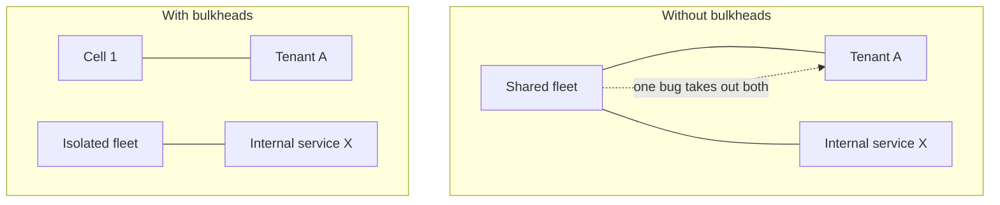

**Circuit breakers** stop a caller from hammering a failing dependency:

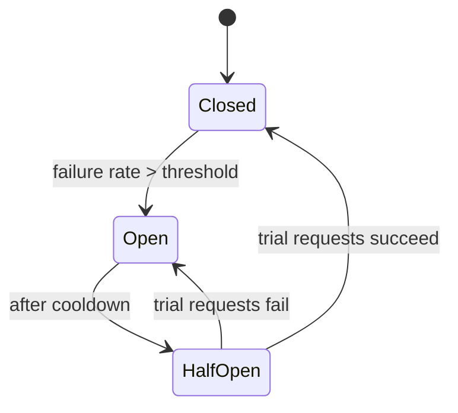

Illustrative starting point: open past 50% errors over a 20-request window; 30-second cooldown;
5 trial requests in half-open; close on all 5 succeeding, else reopen and double the cooldown.

**Graceful degradation**: when a non-critical dependency fails, serve cached/stale data or a
simplified feature instead of a hard error. "Cache failure must never mean system failure."

**How I'd say this in an interview:** "For every component: this is a SPOF unless I bulkhead or
replicate it; if it fails slowly, my mitigation is a circuit breaker with a stated threshold; if
it's non-critical, I'd degrade gracefully rather than fail hard."

---

## Chapter 8 — Finding cascades on purpose: chaos engineering and postmortems

All three incidents above were found by production, the expensive way. Could they have been found
first? **Chaos engineering** deliberately injects failure to test assumptions ahead of time.
Netflix's Simian Army is the canonical example, and it's a ladder:

| Tool | Injects | Answers |
|---|---|---|
| **Chaos Monkey** | Randomly kills production instances | "What if a node dies?" |
| **Latency Monkey** | Injects artificial delay/errors | "What if it's slow, not down?" |
| **Chaos Kong** | Simulates losing an entire AWS region | "What if a whole region is gone?" |

A chaos drill killing *all* backbone links at once would have caught Meta's fail-safe misfire in a
game day, not production. A capacity-add drill modeling thread consumption at fleet scale would have
caught Kinesis's ceiling before a real change did.

**Blameless postmortems** treat an incident as a systems/process failure, not a person's mistake —
because the goal is surfacing true root causes, not fewer people willing to admit what happened. All
three incidents got detailed public postmortems. A good one covers timeline, impact, root cause,
contributing factors, and a committed action-item list with owners. **An incident with an empty
action-item list is the real failure.**

**How I'd say this in an interview:** "I'd name Chaos Monkey, Latency Monkey, Chaos Kong
specifically — node dies, node is slow, region is gone is the same ladder an interviewer uses on
you. And a postmortem without owned action items is just a well-written story."

---

## Chapter 9 — The hardest failure mode: slow-but-alive, and safe retries

Every incident above escalates from "what if it's down" to "what if it's slow" — the harder case,
because health checks catch "down" easily and "degraded" rarely. A half-dead dependency keeps
receiving full traffic and keeps timing out expensively. Nothing in Chapters 3 or 5 was cleanly
"down" at the start — latency crept up until it functionally was.

Fix: timeouts shorter than the caller can tolerate (not the callee's SLA), a bulkheaded connection
pool per dependency, and treating elevated p99 latency as its own alert, not just error rate.

Every "retry with backoff" fix only works if the operation is **idempotent** — replaying it twice
equals doing it once. Stripe's payments API is the canonical documented example: every
`POST /charges` takes an `Idempotency-Key`, and a retry with the same key returns the original
charge instead of creating a second one.

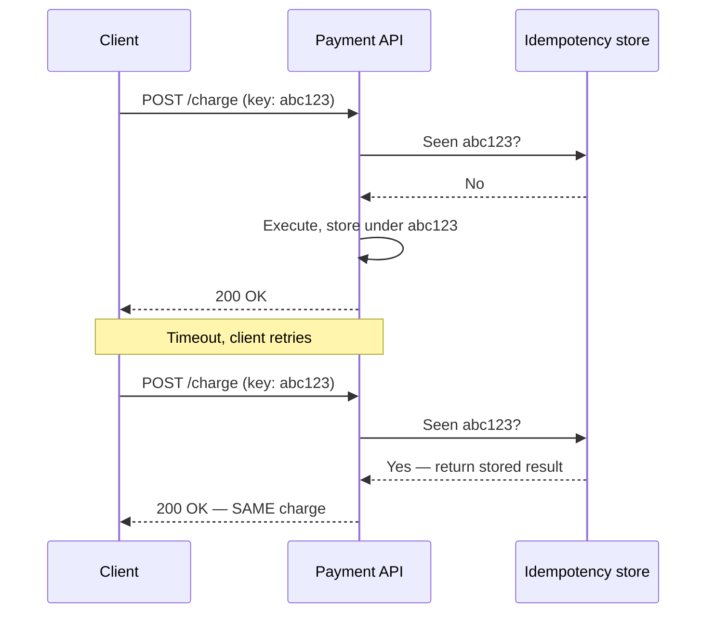

**How I'd say this in an interview:** "'Retry' and 'idempotent' are a package deal — I'd never
propose retries on a write path without saying how the retry is made idempotent."

---

## Chapter 10 — Spending the resilience budget: tiers, active-active, canary, command

Not every dependency deserves equal investment. FAANG orgs tier services by blast radius: **tier-0**
(company-wide outage — Facebook's DNS, AWS's internal network), **tier-1** (a major platform —
Kinesis feeding Cognito/CloudWatch/Lambda), **tier-2** (one feature degrades), **tier-3** (internal
tooling). Naming tiers tells you where to spend bulkhead budget — Chapter 3's fix is exactly a
tiering decision AWS made *after* an incident that should've been made at design time.

None of the three incidents were fixed by "add a standby" alone — all were single-region or
single-namespace failures, exactly why multi-region redundancy is the natural next question after
any SPOF answer. **Active-passive** is simpler, costs a failover window; **active-active** costs
consistency complexity but has near-zero failover impact. Netflix, active-active on AWS and verified
with Chaos Kong drills, is the standard counter-example to all three incidents here.

Look back at the trigger for all three: a backbone command, a capacity add, a scaling action, each
pushed everywhere at once. **Canary and blast-radius-limited rollouts** are the single most
preventable fix common to all three:

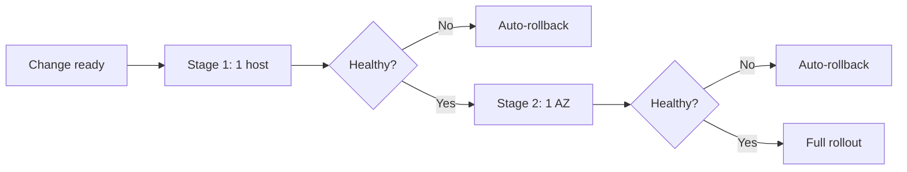

**Incident command** — an IC who coordinates rather than debugs, a comms lead who owns the status
page, a severity rubric — means "who does what" is never decided live, under pressure, for the
first time. This is exactly what Meta's engineers needed with no working chat, and exactly the
situation AWS's log-grepping fallback in Chapter 5 is built for.

**How I'd say this in an interview:** "None of these three needed a smarter safety check as much as
a smaller *first* blast radius — canary to AZ to region to global, with automatic abort. And I'd
tier dependencies so tier-0 gets the strictest change control."

---

## Where the story actually lands

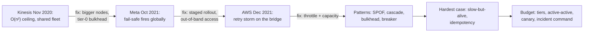

Three real incidents keep rhyming: a routine change, a safety check with a blind spot, an unscoped
blast radius, and a fix path sharing a dependency with the fault. Say that sentence once, and you
can say it about almost any distributed-systems outage you'll ever be asked about.

---

## Grill me — adversarial follow-ups

**Q1: "Isn't this just AWS/Meta trivia?"**
No — three unrelated companies hit the same shape of failure independently: routine change, blind
safety check, recovery path sharing a dependency with the fault. That repetition is the lesson; the
names are just how you cite evidence.

**Q2: "Meta's fail-safe did exactly what it was designed to do — was that really a bug?"**
Not in the code — in the design's test coverage. It was correct for a partial problem; "zero of N
reachable" was never tested, so an untested condition made a locally-reasonable fail-safe fire
globally.

**Q3: "AWS's 'fewer, bigger nodes' fix just delays the same ceiling, right?"**
Right, and the postmortem says as much — it buys headroom, not immunity. The part that actually
changes the failure mode is the bulkhead: the next ceiling breach hits only customer traffic, not
AWS's own control and observability plane.

**Q4: "AWS Dec 2021 says data plane survived — isn't that just luck?"**
Not luck — already-provisioned resources don't need the control plane to keep serving traffic they
were already configured for. The failure was scoped to *creating new things*, which inherently needs
the control plane.

**Q5: "If retries without backoff are dangerous, why not remove retries entirely?"**
Because a call that fails transiently and gives up is worse for availability. The fix is backoff,
jitter, and a retry budget so aggregate retry traffic never exceeds what the dependency can absorb.

**Q6: "Isn't 'the fire alarm shared the fire' just 'have redundant monitoring,' restated?"**
More specific — redundant monitoring still fails if both copies share the same network, DNS, or auth
as the service they watch. The real requirement is an independent failure domain for your vantage
point.

**Q7: "Isn't randomly killing production instances reckless?"**
Not if scoped and monitored — it forces every service to handle instance loss as routine instead of
an untested emergency. The real risk is discovering intolerance to instance loss during a live
incident instead.

**Q8: "How far down this list do I need to go for my own design?"**
As far as the requirements demand — a tolerant system might stop at circuit breaker plus bulkhead. A
payments or auth system has to reach idempotency, tiering, and staged rollouts, because a duplicate
charge is a correctness failure, not just availability.

**Q9: "What's the one thing you'd actually change after reading these three?"**
Say, per component, unprompted: SPOF unless X, failure mode is crash/slow/cut-off, mitigation is Y,
residual blast radius if Y fails is Z, and monitoring lives outside Z's failure domain. That one
paragraph beats a five-minute tangent about any famous outage.

---

## Cheat sheet — one line per idea, no repeated story

- **Four failure types**: crash, confuse, cut-off, corrupt — every outage is one or a chain.
- **Nines compose by multiplying**: every extra dependency hop costs you; error budgets make
  reliability spendable.
- **Kinesis, Nov 2020**: a "small" capacity add hit an O(n²) full-mesh thread ceiling; fixed by
  fewer/bigger nodes plus bulkheading tier-0 consumers.
- **Meta, Oct 2021**: a DNS fail-safe, correct for a partial failure, fired globally on an untested
  total failure; fixed by staged rollout plus out-of-band emergency access.
- **AWS, Dec 2021**: an unthrottled scaling action triggered a retry storm on the one bridge between
  two networks; data plane survived, control plane didn't.
- **The recurring sentence**: the fire alarm shared a dependency with the fire, in all three.
- **SPOF hides in shared automation and shared fleets**, not just single boxes.
- **Retry storms**: `effective_load ≈ base_load / (1 - error_rate)` — always pair retries with
  backoff, jitter, and a cap.
- **Bulkheads and circuit breakers**: contain the blast radius, then stop hammering a failing
  dependency.
- **Chaos engineering finds cascades on purpose**: Chaos Monkey (node dies), Latency Monkey (node is
  slow), Chaos Kong (region is gone).
- **Blameless postmortems** need owned action items — an incident without them is the real failure.
- **Slow is worse than down**: health checks catch "down" easily, "degraded" rarely.
- **Retry is only safe with idempotency** — a key, a conditional write, or a naturally idempotent op.
- **Tier your dependencies** (tier-0 to tier-3) and spend redundancy budget accordingly.
- **Stage rollouts by blast radius** — host, AZ, region, global — with automatic abort.
