# Spectacular Failures — FAANG Interview Guide

> **Enhancement notes:** this pass added — (1) a "🆕 Blast radius & the actual fix" subsection to
> each of the three incident deep dives (§3.1–3.3) with concrete/illustrative impact numbers and
> the real postmortem-documented remediation, distinct from the pre-existing "what would have
> prevented it" list; (2) two new "🆕 architecture evolution" before/after diagrams (Meta §3.1, AWS
> Dec 2021 §3.3), matching the before/after diagram your Kinesis section already had; (3) a new
> "🆕 Postmortem data model (ER diagram)" in §4.8; (4) concrete numeric examples added to the
> Circuit Breaker (§4.6) and Backpressure (§4.11) sections; (5) an extra "Illustrative blast radius
> / actual fix" column added to the incident comparison table in §7; (6) one typo fix
> ("mathermatical" → "mathematical"). Everything else — structure, section order, existing
> diagrams, tables, and cheat-sheets — is untouched; this was already a strong, tightly-written
> chapter with almost no hand-wavy language to clean up.

> Source chapter type: **concept + real-world incident case studies**. This isn't a component or a
> full system — it's the "resilience" muscle every system design interview eventually tests. The
> interviewer rarely asks "tell me about the Facebook outage." They ask "what happens if this node
> dies," "how do you stop this from cascading," "what's your blast radius here" — and they're
> grading you against the exact failure patterns below.

## How to identify this topic in an interview

You're being tested on failure reasoning, not incident trivia, whenever you hear:

- "What happens if [component] goes down?" / "Walk me through a partial failure."
- "How would you detect this before customers do?"
- "What's the blast radius of that change?"
- "How do you prevent one bad deploy from taking down everything?"
- "Tell me about a time a system you worked on failed" (behavioral, but graded on the same rubric).
- Any deep-dive that ends with "...and what if that dependency is slow, not down?" (the hardest
  failure mode — see [Slow-but-alive](#slow-but-alive-the-hardest-failure-mode)).

The move: never let "resilience" be an afterthought bullet at the end. Weave failure-mode
reasoning into every component you draw — "this is a SPOF unless I add X" — as you go.

---

## 1. Mental Model: How Distributed Systems Actually Fail

Two forces make failure inevitable at scale, and neither is fixable — only manageable:

- **Diverse, evolving users** force constant change (features, scale, new integrations). Change
  is the raw material of outages — nearly every incident below started with a routine, "boring"
  change: a config push, a capacity add, a scaling action.
- **Emergent complexity**: a distributed system's behavior is not the sum of its parts. Components
  that are each individually correct can interact to produce behavior nobody designed or tested
  for. This is why "we tested every component" is never sufficient at scale.

### Four failure categories worth naming explicitly

| Failure type | What breaks | Example below |
|---|---|---|
| **System failure** | A node's process/hardware dies; primary memory state is lost, disk/replicas survive | Kinesis front-end servers crash-looping on thread exhaustion |
| **Method / process failure** | The system runs, but logic is wrong or deadlocks | Meta's audit tool logically failing to catch a bad command |
| **Communication medium failure** | Components can't reach each other; nothing is "down," but it's unreachable | Meta backbone disconnect; AWS internal↔main network congestion |
| **Secondary storage failure** | Replica/disk becomes inaccessible; system must re-replicate | Not in these 3 incidents, but always list it — interviewers probe for it |

**Memory hook**: *"Crash, Confuse, Cut-off, Corrupt"* — a node can crash, its logic can confuse
itself into a bad state, the network can cut it off from peers, or its storage can corrupt/vanish.
Every outage you'll ever be asked about is one of these four, or a chain of them.

### The anatomy of a cascading failure

A cascading failure is never one root cause — it's a **chain of independently-reasonable
decisions** that compound. Every incident in this guide fits this shape:

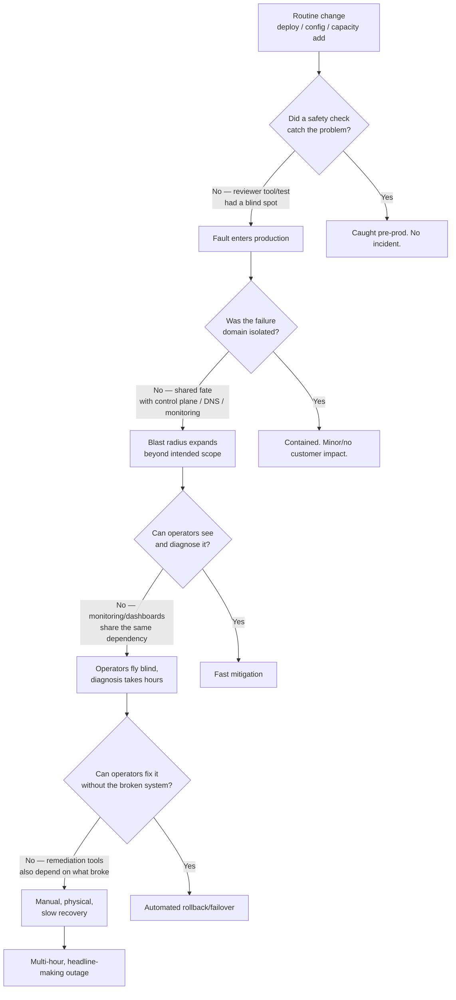

Every box with a "No" branch above is a **design decision an interviewer wants to hear you make
correctly**: independent safety checks, isolated failure domains, out-of-band monitoring,
break-glass tooling that doesn't depend on the system it's meant to fix.

### Failure domains, blast radius, and vantage points

- **Failure domain**: a boundary such that a failure inside it should not propagate outside it
  (an AZ, a region, a shard, a service, a team's deployment unit).
- **Blast radius**: how much of the system is affected when a domain fails. Two domains are
  "independent" when each is outside the other's blast radius.
- **Vantage point**: where you observe system health *from*. A dashboard hosted inside the same
  blast radius as the failure is not an independent vantage point — this is why Downdetector-style
  third-party, crowd-sourced monitoring exists, and why every incident below took down the
  company's *own* status page along with the service.

**Golden interview line**: *"I'd want my health-check and status-reporting path to be in a
different failure domain than the service it's reporting on — otherwise the fire also burns the
fire alarm."*

### Interview cheat-sheet — mental model

- Failure = crash, confuse, cut-off, or corrupt. Name which one you're guarding against.
- Assume the *change*, not the *steady state*, is where failures are born — audit changes harder
  than you audit stability.
- A cascade is a chain of "did the safety net also share the failure domain?" — find every shared
  dependency (DNS, monitoring, control plane, auth) between the fault and the fix.
- Independent vantage points > self-reported health. If your dashboard depends on the same DNS/auth
  as your product, it will go dark exactly when you need it most.
- Blast radius is a design parameter you choose, not an accident — bulkheads, shards, cells, and
  regions are how you choose it.

---

## 2. The Nines: Availability Math You Must Know Cold

Every resilience conversation eventually becomes a numbers conversation. Memorize this table.

| Availability | Downtime / year | Downtime / month | Downtime / week | Colloquial |
|---|---|---|---|---|
| 99% | 3.65 days | 7.3 hours | 1.68 hours | "two nines" |
| 99.9% | 8.76 hours | 43.8 minutes | 10.1 minutes | "three nines" |
| 99.95% | 4.38 hours | 21.9 minutes | 5 minutes | common internal SLA |
| 99.99% | 52.6 minutes | 4.4 minutes | 1.01 minutes | "four nines" |
| 99.999% | 5.26 minutes | 26.3 seconds | 6.05 seconds | "five nines" — telecom-grade |

```
downtime_per_year = (1 - availability) × 365.25 × 24 × 60   minutes
```

**Composite availability matters more than any single component's number.** If a request touches
5 services each at 99.9%, naive series composition gives `0.999^5 ≈ 99.5%` — worse than any one
of them. This is the mathematical reason "add a dependency" is never free, and why the incidents
below turned single-service problems into multi-service ones: Cognito depending on Kinesis,
CloudWatch depending on Kinesis, Lambda depending on CloudWatch — each additional hop multiplies
down the effective availability, and a "just 99.9%" internal service becomes the ceiling for
everything built on top of it.

**Error budget**: `1 - SLO` is the allowed unreliability. A 99.9% SLO = ~43 minutes/month you're
"allowed" to be down. Teams that burn their error budget early are expected to freeze risky
changes — this is the practice that could have deferred the "routine capacity add" in two of the
three incidents below.

**Worked example**: a service with a 99.9% monthly SLO has a ~43-minute error budget for the
month. Suppose by day 10 it has already burned 34 of those 43 minutes on a string of small
blips — that's 79% of the *entire month's* budget spent in the first third of the month:

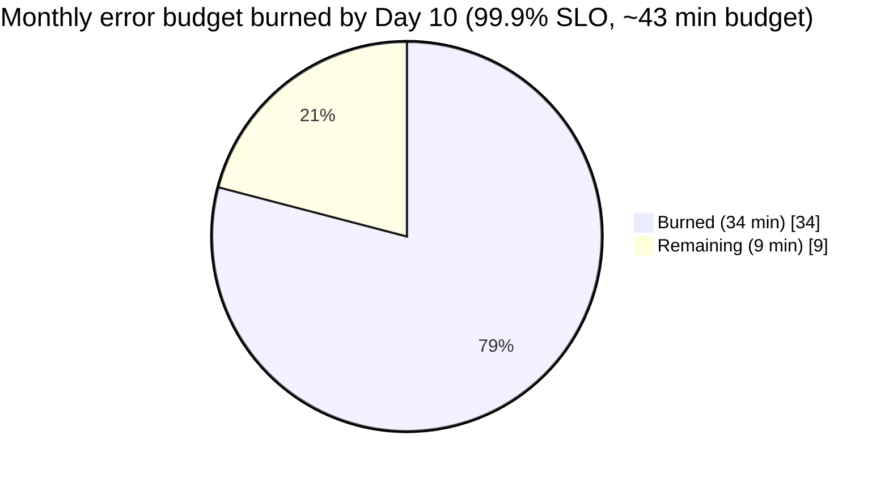

At this burn rate, the team should freeze risky changes for the rest of the month — this is the
error-budget-freeze practice referenced above, and it's the practice that could have deferred the
"routine capacity add" behind two of the three incidents in §3.

### Interview cheat-sheet — the nines

- Know the table above cold — interviewers will ask "what does 4 nines mean in minutes/year."
- Series composition of dependencies multiplies availabilities down — every new hop costs you.
- Error budgets turn "reliability" into a number you can spend — mention this to sound senior.
- Always ask "nines of what — the API, the data plane, the control plane?" (see §5.4). They're not
  the same number, and conflating them is a classic beginner mistake.

---

## 3. Incident Deep Dives

### 3.1 Meta (Facebook/WhatsApp/Instagram/Oculus) — October 4, 2021

**One-liner**: a routine backbone-capacity audit command, missed by its own safety-check tool,
withdrew Facebook's backbone connectivity between data centers — which triggered a *designed*
DNS fail-safe to withdraw Facebook's own authoritative DNS routes from the internet, deleting
Facebook's presence from the internet's addressing system for ~6 hours, and simultaneously locking
engineers out of the internal tools and physical-access systems they needed to fix it.

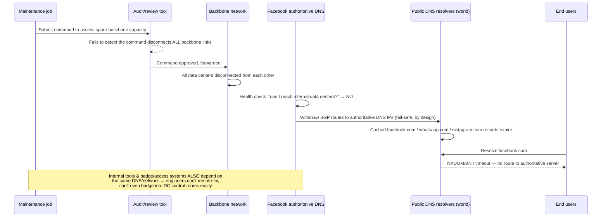

**Root cause (technical)**: Facebook's authoritative DNS servers announce their IP prefixes to the
internet via BGP. Those DNS servers run a health check that withdraws their own BGP advertisement
if they can't reach Facebook's internal backbone — a fail-safe meant to stop routing users to a
DNS server that can't serve fresh/correct answers. The backbone audit command (intended to check
spare capacity) contained a bug that the review/audit tool didn't catch, and it disconnected
**all** backbone links between data centers at once, not a scoped subset. That total disconnection
tripped the DNS health check everywhere simultaneously, so every authoritative DNS server withdrew
its routes at once — a fail-safe designed for a localized problem fired globally.

**Contributing factors**:
- A rare/never-tested combination: "zero data centers reachable" was outside the tested envelope of
  the DNS health-check design.
- Heavy automation with no independent, out-of-band safety check — the audit tool was the *only*
  gate, and it shared the same blind spot as the command generator.
- Internal tools (chat, dashboards, deployment tools, even physical badge readers at data centers)
  depended on the same global network/DNS that had just gone dark — the fix mechanism was inside
  the blast radius of the fault.
- Heavy security hardening (physical + digital access controls) — normally a strength — became a
  liability once remote tooling was unusable and engineers needed emergency physical access.

**How it cascaded**: backbone loss → DNS fail-safe withdrawal (designed behavior, wrong trigger
condition) → global DNS cache expiry → total unreachability of Facebook/Instagram/WhatsApp/Oculus
→ internal engineering tools unreachable → physical access hampered → manual, on-site recovery
required → careful, slow traffic ramp-up to avoid a second self-inflicted outage (see thundering
herd, §4.3).

**What would have prevented/mitigated it**:
- An independent (differently-implemented, differently-failure-mode) audit tool or a staged/canary
  rollout of backbone commands instead of a global one-shot command.
- Scoping the blast radius of the maintenance command so a bug could disconnect *some* links, never
  *all* of them at once.
- A genuinely out-of-band emergency-access path (break-glass credentials/tools that don't resolve
  through the same DNS/network) for exactly this scenario.
- Treating "0 of N data centers reachable" as an explicit, tested edge case for the DNS fail-safe,
  not an implicit one.

**Lessons**: keep the emergency exit outside the building that's on fire. Automation removes human
error on the happy path and introduces a new single point of failure on the unhappy path — the
mitigation isn't "less automation," it's "make sure the *rollback* path doesn't share a dependency
with the *forward* path."

#### 🆕 Blast radius & the actual fix

**Impact, concretely** (widely-reported public figures, not Meta-confirmed internal metrics):
- **Duration**: ~6 hours of total unreachability (started ~11:40am ET, restored ~9:00pm UTC / mid-to-late
  afternoon ET, October 4, 2021).
- **Reach**: all of Facebook, Instagram, WhatsApp, Messenger, and Oculus went dark simultaneously —
  services with a combined reported user base on the order of **3+ billion people**, though not all
  were active/impacted concurrently; treat this as the *addressable* blast radius, not concurrent
  users-affected.
- **Revenue**: independent media estimates at the time put Facebook's lost ad revenue **on the order
  of tens of millions of dollars** for the ~6-hour window (illustrative estimate — Meta itself never
  published an official revenue-loss figure).
- **Secondary blast radius**: every third-party site/app using "Login with Facebook" as its only
  auth option also broke — a SPOF Meta's own postmortem didn't have to fix, because it wasn't
  Meta's system, but interviewers love this detail as an example of blast radius crossing a
  company boundary.

**Actual fix (per Meta's public engineering postmortem)**:
- Hardened the audit/review tooling so a command class that can disconnect backbone capacity gets
  additional automated checks before it's allowed to execute.
- Added safeguards to slow down / rate-limit this class of global network change so a single command
  can't take effect everywhere at once.
- Built a more robust way to stop this kind of accidental backbone/DNS-withdrawal cascade once
  detected, instead of relying on the fail-safe to always be correctly scoped.
- Invested in faster, more resilient methods for engineers to gain physical/emergency access to
  data centers when the normal (network-dependent) remote tooling is unusable.

**Lessons to cite in an interview** (short list, say 2-3 of these out loud):
- "The rollback path shared a dependency with the thing that broke — that's the root design flaw,
  not the backbone bug itself."
- "A fail-safe designed for a partial failure fired on a total failure it was never tested against —
  I'd explicitly game-day the 'everything is gone' case."
- "Blast radius crossed a company boundary — third-party sites using Facebook login went down too;
  a SPOF audit has to include how *other people* depend on you."

#### 🆕 Architecture evolution — before/after the fix

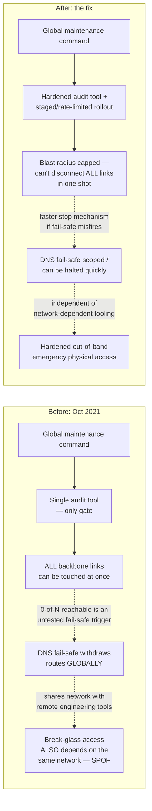

#### Cheat-sheet — Meta 2021
- BGP withdrawal + DNS TTL expiry = "the internet forgets how to find you," not "the servers are down."
- A health-check fail-safe can itself become the outage — test fail-safes against total, not partial, failure.
- Break-glass tooling must not depend on the system it exists to fix.
- "Automated audit tool caught it" is not resilience — it's one gate. Ask "what if the gate itself is wrong?"

---

### 3.2 AWS Kinesis (US-EAST-1) — November 25, 2020

**One-liner**: a small, routine capacity addition to the Kinesis front-end fleet pushed every
server in the fleet over an OS-level thread-count ceiling, breaking the frontend's ability to
build its shard-routing cache — and because so many other AWS services (Cognito, CloudWatch,
Lambda, EventBridge) quietly depend on Kinesis Data Streams internally, the failure fanned out far
beyond Kinesis itself.

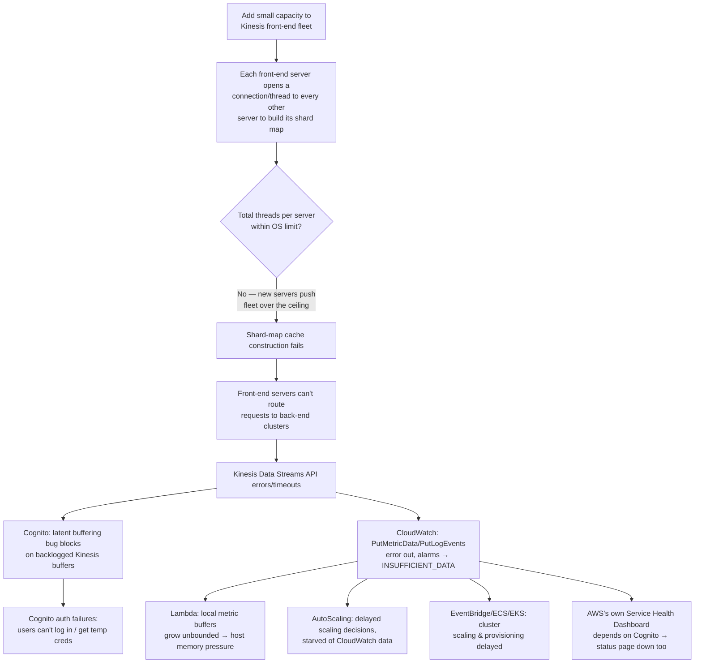

**Root cause (technical)**: the Kinesis front-end fleet's caching design required each server to
maintain a connection/thread to every other member of the cluster to keep its shard-ownership map
current — a topology whose thread cost grows with fleet size. A routine, modest capacity addition
was enough to push every server (new and existing) past the maximum thread count allowed by the
OS configuration. With threads exhausted, cache/shard-map construction failed to complete, leaving
front-end servers without a usable routing table to the back-end "workhorse" clusters.

**Contributing factors**:
- No pre-production simulator/load test modeled the fleet-wide thread ceiling under a capacity add
  — the bug was a latent capacity limit, not a code regression, so normal testing didn't catch it.
- Restarting servers didn't fix it immediately: every restarted server tried to rebuild its full
  shard map again, simultaneously, extending the outage — a **cold-start thundering herd**.
- Cognito had a *separate*, pre-existing latent bug in its Kinesis buffering path that only
  manifested under sustained Kinesis degradation — proof that dependent teams' untested failure
  paths are where the real damage compounds.
- CloudWatch, the observability tool operators would normally lean on, was itself a *victim* of the
  same root cause (it consumes Kinesis Data Streams internally) — operators partially lost
  visibility into the very system they were debugging.

**How it cascaded**: capacity add → thread ceiling breached → shard-map cache failures → Kinesis
API errors → Cognito auth breakage (login outage for many third-party apps) + CloudWatch metric/log
ingestion failures → Lambda memory pressure + AutoScaling delays + EventBridge/ECS/EKS provisioning
delays → AWS's own public status dashboard (dependent on Cognito) unable to post accurate updates.

**What would have prevented/mitigated it**:
- Bigger/fewer front-end nodes (lowers total thread count needed for full mesh) — this is literally
  what AWS did afterward.
- Partition "tier-0" internal consumers (CloudWatch, Cognito) onto a dedicated, isolated front-end
  fleet so a Kinesis data-plane problem can't take out AWS's own control/observability plane.
  This is a **bulkhead pattern** applied at the fleet level.
  - Bootstrap from an authoritative metadata store instead of peer front-end servers, so a cold
    start doesn't require an O(n²) mesh rebuild.
- A capacity-change simulator/game-day that models thread/fd ceilings before rollout, not just
  functional correctness.
- Fine-grained alarming on thread/fd consumption *before* it becomes a ceiling breach.

**Lessons**: capacity increases are not risk-free "more of the same" — a linear-looking change
(add servers) can hit a nonlinear ceiling (O(n²) mesh cost). And when your monitoring tool is built
on the thing that's failing, you lose eyes exactly when you need them most — this is the second
time in this guide the same anti-pattern appears (cf. Meta's internal tools, §3.1).

#### 🆕 Blast radius & the actual fix

**Impact, concretely**:
- **Duration**: the Kinesis front-end fleet itself was substantially recovered in **~5 hours**
  (widely-cited start ~5:15am PST, core mitigation by mid-morning, November 25, 2020). Some
  downstream, dependent services (parts of Cognito-backed auth, CloudWatch-dependent alarms/
  dashboards) took **on the order of several more hours** to fully drain backlog and return to
  normal — illustrative estimate, not an exact per-service figure.
- **Reach**: dozens of well-known consumer products had visible, publicly-reported outages that day
  — smart-home apps (e.g., iRobot/Roomba, Ring), delivery/logistics dashboards, and numerous SaaS
  status pages lit up on Downdetector simultaneously, because they all sat on Cognito/CloudWatch/
  Lambda without realizing those shared a single Kinesis front-end fleet.
- **Self-inflicted wound**: AWS's own public Service Health Dashboard couldn't be updated in
  real time during the incident, because posting to it required Cognito — the status page and the
  outage shared a dependency.

**Actual fix (per AWS's public post-event summary)**:
- Moved to a smaller number of larger front-end servers, reducing the total thread count needed to
  maintain the full-mesh shard map at the same fleet capacity.
- Separated tier-0 internal consumers (Cognito, CloudWatch) onto their own isolated front-end fleet,
  so a capacity change on the customer-facing fleet can't starve AWS's own auth/observability plane
  — this is the bulkhead redesign shown in the diagram below.
- Sped up the cold-start/cache-rebuild path so a fleet-wide restart doesn't require every server to
  simultaneously rebuild its full mesh from scratch.
- Decoupled the Service Health Dashboard's update mechanism from the services it reports on.

**Lessons to cite in an interview**:
- "A capacity add that looks linear can hit a nonlinear (O(n²)) ceiling — I'd game-day capacity
  changes against the actual topology cost, not just functional correctness."
- "Tier-0 internal consumers (auth, monitoring) sharing a fleet with customer traffic is a hidden
  SPOF — I'd bulkhead them onto isolated capacity from day one, not after an outage."
- "Even the status page can share the outage's blast radius — I'd put health reporting on a
  dependency chain that doesn't include the thing being reported on."

**Architecture evolution — before/after the fix**: this is the clearest "why the improved
architecture survives the same failure" example in the whole guide.

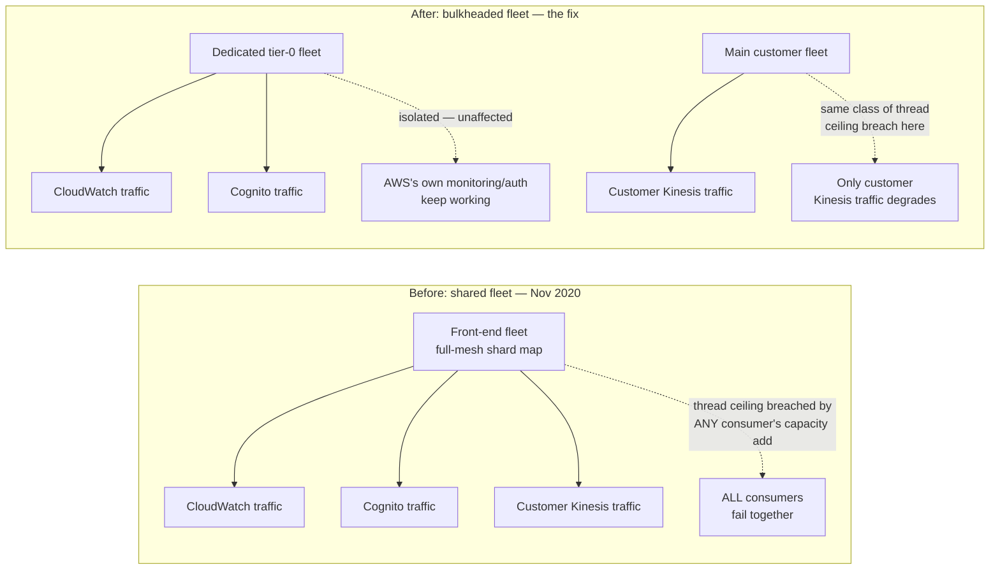

The fault mode (thread ceiling breach on capacity add) is identical on both sides — what changed
is that the "after" architecture no longer lets a breach on one fleet take out a different tier's
traffic. That's the bulkhead payoff: not "this can't fail again," but "when it fails again, it
fails alone."

#### Cheat-sheet — AWS Kinesis 2020
- "Small capacity add" ≠ "small risk" when the underlying topology cost is O(n²), not O(n).
- A full-mesh cache/gossip design has a hidden thread/fd ceiling — know the ceiling before you scale past it.
- Restart storms after an outage are a second outage — simultaneous cold starts create a new thundering herd.
- Isolate your own internal control-plane/observability consumers from the data plane they observe — a bulkhead, not a shared fleet.

---

### 3.3 AWS Wide-Spread Outage (US-EAST-1) — December 7, 2021

**One-liner**: an automated capacity-scaling action against AWS's internal network (the network
that carries AWS's *own* internal services — DNS, monitoring, control planes) triggered a
connection-activity storm that overwhelmed the network devices bridging the internal network to
the main AWS network — congesting the very channel operators needed to see and fix the problem.

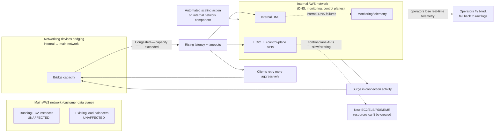

**Root cause (technical)**: AWS runs a separate internal network that hosts foundational internal
services (including internal DNS and the control-plane services behind EC2/ELB APIs), bridged to
the main customer-facing network by dedicated networking devices. An automated action to expand
capacity for one internal AWS service triggered unexpected client behavior across the internal
network, producing a large, sudden increase in connection activity. That surge saturated the
bridging network devices, which delayed communication between the two networks. Increased latency
led to increased timeouts, which led to more retries and re-connection attempts from clients on
both sides — a self-reinforcing **congestion collapse**, the same failure shape as TCP congestion
collapse, but at the level of application retries.

**Contributing factors**:
- The "independent" internal network was not, in fact, independent of the main network for the
  purposes operators cared about — a shared bridge is a shared fate.
- Monitoring/telemetry for the internal operations teams itself rode over the congested path, so
  the overload **blinded operators in real time**, forcing a fallback to manually grepping logs —
  slow, and error-prone under time pressure.
- Retries amplified the very overload they were trying to route around — clients (both AWS-internal
  and, transitively, customer control-plane calls) retried into an already-saturated channel with
  no effective backoff, which is precisely a **retry storm**.
- Control plane and data plane were correctly *decoupled* in one sense (running EC2 instances and
  existing ELBs kept serving live customer traffic throughout — a real resilience win) but
  operationally *coupled* in another: creating anything new (EC2 instances, load balancers, RDS/EMR/
  Workspaces resources that provision EC2 under the hood) failed, because provisioning is a
  control-plane operation.

**How it cascaded**: automated scaling action → connection surge on internal network → bridging
device saturation → cross-network latency/timeouts → retry storm amplifying congestion → internal
DNS failures + loss of real-time monitoring → slow, manual, log-based diagnosis → control-plane API
degradation (EC2 launch, ELB provisioning) → downstream managed services (RDS, EMR, Workspaces,
and famously a long tail of consumer/IoT products) unable to create new resources for ~8 hours.

**What would have prevented/mitigated it**:
- True network-level isolation (separate physical/logical bridge capacity, or a circuit breaker at
  the bridge) so a surge on one side can't saturate cross-network communication entirely.
- Backoff-with-jitter and request shedding on the retrying clients, instead of naive immediate
  retries, to avoid amplifying the very congestion causing the retries.
- Keep telemetry/monitoring on a path structurally independent from the traffic it measures — the
  same "fire alarm inside the burning building" lesson as Meta's incident.
- Canary/staged rollout of the automated scaling action with an automatic abort on anomalous
  connection-activity metrics, instead of a single blanket action.

**Lessons**: decoupling control plane from data plane is real and valuable (this is *why* running
instances stayed up), but it only pays off if the control plane's own dependencies (network,
DNS, monitoring) are *also* isolated from the failure. Partial decoupling gives partial credit,
not full protection.

#### 🆕 Blast radius & the actual fix

**Impact, concretely**:
- **Duration**: roughly **~5-8 hours** end to end (started ~7:30am PST, core network issue mitigated
  within a few hours, full resolution across every dependent service by early-to-mid afternoon PST,
  December 7, 2021) — consistent with the "~8 hours" figure already used earlier in this section for
  the full cascade.
- **Reach**: high-profile, publicly-reported impact included Amazon's own retail site and delivery
  operations, Ring, Amazon Prime Video/some Alexa features, and third-party services built on AWS
  (Disney+, Doordash, and others reported degraded service on Downdetector) — illustrative of breadth,
  not a confirmed customer count.
- **What survived**: already-running EC2 instances and already-provisioned load balancers kept
  serving live traffic throughout — the control-plane/data-plane split held up for existing capacity,
  even though it failed for anything that needed to be *newly created* during the window.

**Actual fix (per AWS's public post-event summary)**:
- Added throttles/rate limits on the class of automated scaling action that triggered the initial
  connection-activity surge, so a single automated action can't produce an unbounded spike again.
- Expanded the capacity of the networking devices that bridge the internal and main AWS networks, so
  the same surge size no longer saturates the bridge.
- Improved fault isolation between the internal network's monitoring/telemetry path and its data
  path, so operators don't lose real-time visibility the next time the internal network is
  congested.
- Sped up and hardened the internal DNS failover path within the internal network itself.

**Lessons to cite in an interview**:
- "Data plane survived, control plane didn't — I'd explicitly say which one my design keeps alive
  under a dependency failure, and volunteer that distinction unprompted."
- "A 'separate' internal network is only as isolated as its bridge capacity — I'd ask what the bridge's
  own failure mode and capacity ceiling are before calling two networks independent."
- "Retries without backoff amplified the very congestion they were trying to route around — I'd
  always pair 'retry' with backoff, jitter, and a cap in the same breath."

#### 🆕 Architecture evolution — before/after the fix

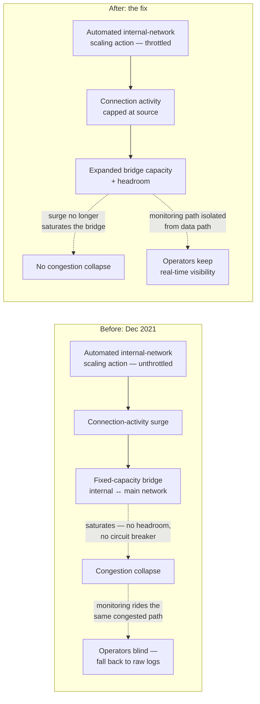

#### Cheat-sheet — AWS Dec 2021
- Data plane (already-running resources) survived; control plane (creating new resources) didn't — know this distinction and volunteer it in interviews.
- A "separate" internal network is only as independent as its bridge/gateway capacity — audit the seams, not just the sides.
- Retries without backoff/jitter turn a slowdown into a congestion collapse — always specify backoff+jitter+cap when you say "retry."
- Monitoring must survive the outage it's meant to detect, or operators debug blind with raw logs.

---

## 4. Cross-Cutting Failure Patterns (the real syllabus)

Every incident above is a specific instance of these general patterns. This is what interviewers
are actually probing for — name the pattern, not just the anecdote.

### 4.1 Single Point of Failure (SPOF)

Any component whose failure takes down the whole system, even if 99% of the system is redundant.
SPOFs hide in places people don't audit as "infrastructure": a shared audit/review tool (Meta), a
shared front-end fleet serving both customer and internal-control traffic (Kinesis), a shared
network bridge (AWS Dec 2021), a third-party single-sign-on dependency (many apps that used
"Login with Facebook" during the Meta outage).

**Interview move**: for every box you draw, ask out loud "what's the SPOF here, and is it a
component, a network path, or a piece of shared automation?"

> **DNS is a systemic SPOF, not an incident-specific one.** 2 of the 3 case studies here (Meta,
> AWS Dec 2021) have DNS somewhere in the failure chain — either as the mechanism that broadcasts
> the outage to the whole internet (Meta's BGP-withdrawn authoritative DNS) or as a casualty that
> blinds operators mid-incident (AWS's internal DNS in Dec 2021). DNS earns this recurring role
> because it sits *underneath* almost everything — services, internal tools, monitoring, even
> auth — while usually being operated and reasoned about as a single logical namespace. Treat DNS
> TTL, resolver health, and DNS's own failure domain as a first-class design question, not an
> assumed-reliable utility you never draw on the whiteboard.

### 4.2 Cascading Failures & Retry Storms

A cascading failure is a chain reaction: failure in A increases load or reduces capacity elsewhere,
which fails B, which fails C. **Retry storms** are the most common accelerant: a slow/erroring
dependency causes callers to retry, multiplying load on an already-struggling system.

```
effective_load ≈ base_load / (1 - error_rate)     # naive retry-on-failure, no backoff
```
At a 50% error rate, naive retries alone **double** the offered load on a system that's already
failing half its requests — a death spiral. This is exactly what happened to the AWS Dec 2021
bridging devices.

**Fixes**: exponential backoff + jitter, retry budgets (cap total retries as a fraction of traffic),
and load shedding at the callee so it can reject cheaply instead of failing expensively.

**Naive retry pile-on vs. backoff+jitter, side by side** — this is the exact mechanic that
saturated the bridging devices in the AWS Dec 2021 incident:

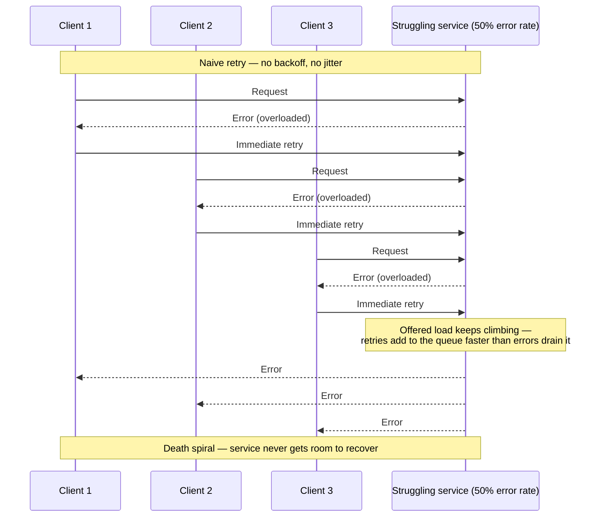

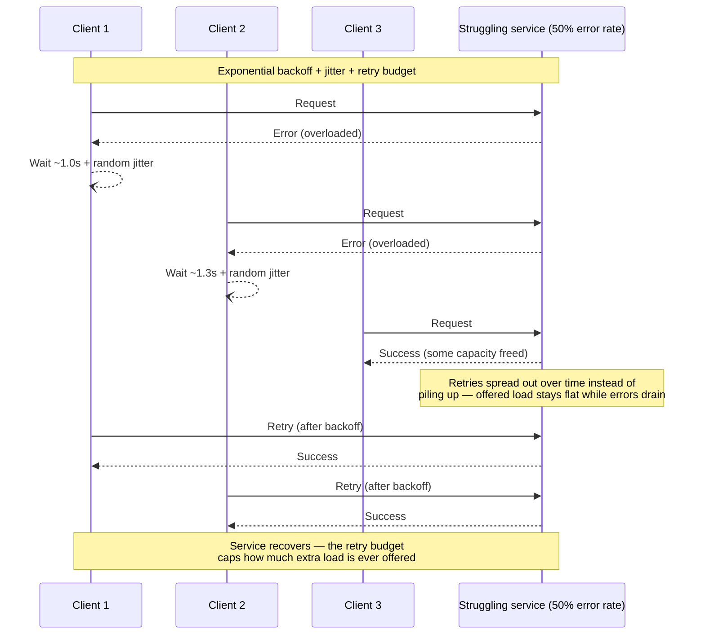

### 4.3 Thundering Herd / Cold-Start Stampede

When many clients (or many servers) act in unison after being released from a wait state — cache
expiry, a mass reconnect, a fleet-wide restart — they collide on the same resource simultaneously.
Seen twice above: Kinesis's simultaneous cold-start cache rebuilds after restarts, and Meta's
deliberately slow, staged traffic ramp-up after DNS was restored (to avoid a self-inflicted second
outage from every client on Earth reconnecting at once).

**Fixes**: staggered/jittered restarts, gradual traffic ramp-up (percentage-based rollout of
restored capacity), request coalescing, randomized cache TTLs so expirations don't align.

### 4.4 Control Plane vs. Data Plane Failures

| | Control plane | Data plane |
|---|---|---|
| **Does** | Create/modify/delete resources (launch an instance, provision an LB, change routing) | Serve already-provisioned traffic (an EC2 instance running your app, an ELB routing live requests) |
| **Failure mode in AWS Dec 2021** | EC2/ELB APIs slow/erroring — can't launch new instances or LBs | Existing EC2 instances and ELBs kept serving traffic |
| **Design implication** | Should be independently scalable/isolatable — a control-plane blip shouldn't touch live traffic | Should have no runtime dependency on the control plane once provisioned |
| **Interview line** | "I'd design so that a control-plane outage degrades *my ability to change the system*, never *my ability to serve current traffic*." | |

**Memory hook**: control plane = the "manager's office" (hiring, firing, reorganizing); data plane
= "the factory floor" (still producing widgets even while the manager's office is on fire).

### 4.5 Blast Radius & Bulkheads

Borrowed from ship design: bulkheads partition a hull so one breach doesn't sink the whole ship.
In systems: shard by customer/tenant/region, use cells (independent, full-stack replicas of the
system serving a subset of traffic), and physically/logically separate "tier-0" internal
consumers from customer-facing capacity (the fix AWS applied to Kinesis: give CloudWatch and
Cognito their own front-end fleet instead of sharing one).

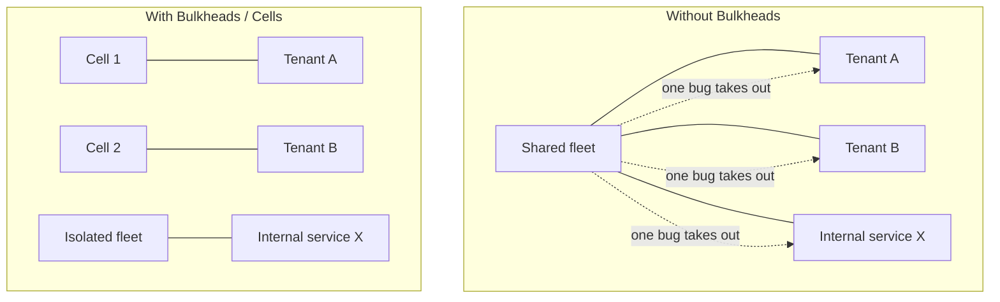

### 4.6 Circuit Breakers & Graceful Degradation

A circuit breaker stops a caller from hammering a failing dependency, giving it room to recover
instead of being retried into the ground.

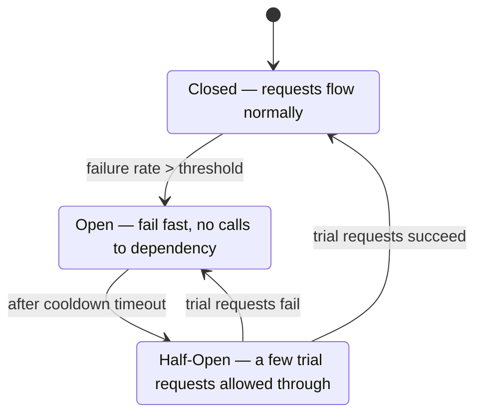

**Concrete thresholds, so this isn't abstract**: open the breaker once error rate exceeds 50% over
a rolling window of 20 requests; stay open for a 30-second cooldown; then allow 5 trial requests
through in half-open — if all 5 succeed, close; if any fails, reopen and double the cooldown (30s →
60s → 120s, capped). Those numbers are illustrative starting points, not universal constants — tune
the window size and threshold to the traffic volume of the dependency being protected.

**Graceful degradation** is the companion move: when a non-critical dependency fails, serve a
degraded response instead of an error — cached/stale data, a simplified feature set, or a default
value — rather than failing the whole request. "Cache failure must never mean system failure" is
the general form of this principle.

### 4.7 Chaos Engineering

Deliberately injecting failure in a controlled way (kill a node, add latency, partition a network)
to verify assumptions before an incident does it for you, uncontrolled. Directly relevant here: a
chaos exercise that killed *all* backbone links at once, or that simulated "0 of N data centers
reachable," would have caught Meta's fail-safe misfire in a game day instead of production. A
capacity-add "game day" that modeled thread consumption at scale would have caught Kinesis's
ceiling before a real capacity change did.

**Netflix's Simian Army — the canonical named example, and it's a ladder, not one tool**:

| Tool | Injects | Maps to the escalation ladder |
|---|---|---|
| **Chaos Monkey** | Randomly kills production instances *during business hours* | "What if a node dies?" — forces every service to tolerate instance loss as routine, not an emergency |
| **Latency Monkey** | Injects artificial delay/errors into a service's network calls | "What if it's slow, not down?" (§4.9) — exercises timeouts and circuit breakers, not just crash handling |
| **Chaos Kong** | Simulates the loss of an *entire AWS region* | "What if a whole region is gone?" — verifies traffic can actually shift to surviving regions (§4.14), not just that the runbook says it can |

That ladder — node dies → node is slow → region is gone — is the same escalation interviewers use
on you, which is exactly why naming Chaos Monkey/Chaos Kong by name (not just "chaos engineering")
signals you've internalized the pattern rather than the buzzword.

### 4.8 Postmortem Culture

**Blameless postmortems** treat an incident as a systems-and-process failure, not an individual's
mistake — because the goal is more true root causes surfaced, not fewer people willing to admit
what happened. All three incidents above were followed by detailed public postmortems (a strong
signal of engineering maturity an interviewer will respect you citing). A good postmortem answers:
timeline, customer impact, root cause, contributing factors, what went well, what didn't, and a
committed list of follow-up action items with owners.

#### 🆕 Postmortem data model (ER diagram)

If an interviewer asks you to sketch what a postmortem/incident-tracking system actually stores,
this is the shape — and naming it shows you think of "process maturity" as a real data model, not
just a cultural value:

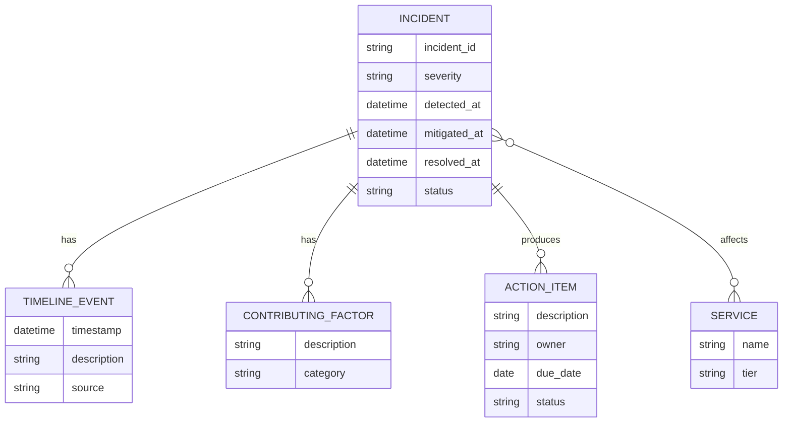

**Interview line**: "an incident isn't one row, it's a small graph — a timeline, one-or-more
contributing factors, and a list of owned action items with due dates. If the action-item table is
empty for a resolved incident, that's the actual failure — not the outage itself."

### 4.9 Slow-but-alive: the hardest failure mode

Interviewers escalate "what if it's down" to "what if it's slow" because slow failures are worse:
health checks often only detect "down," not "degraded," so a half-dead dependency keeps receiving
full traffic and keeps timing out expensively, tying up caller threads/connections. This is exactly
the failure shape inside the Kinesis and Dec-2021 incidents — nothing was cleanly "down," latency
crept up until it functionally was.

**Fixes**: aggressive timeouts (shorter than the caller can tolerate, not the callee's SLA),
bulkhead the connection pool per dependency so one slow dependency can't exhaust threads needed for
others, and treat elevated p99 latency as an alerting signal, not just error rate.

### 4.10 Idempotency: What Makes a Retry Safe

Every fix above says "retry with backoff" — but a retry is only safe if replaying the same request
twice has the same effect as sending it once. Without idempotency, backoff+jitter makes retries
*survivable* for the caller but not *correct*: a payment retried after a timeout (where the first
attempt actually succeeded server-side, and only the response was lost) can double-charge a
customer.

**Mechanism**: the client generates a unique idempotency key per logical operation (not per HTTP
attempt) and sends it on every retry. The server persists "key → result" the first time it executes
the operation; a retry with the same key returns the stored result instead of re-executing.
Stripe's payments API is the canonical named example: every `POST /charges` accepts an
`Idempotency-Key` header, and a retried request with the same key against a charge already in
flight or completed returns the original charge instead of creating a second one.

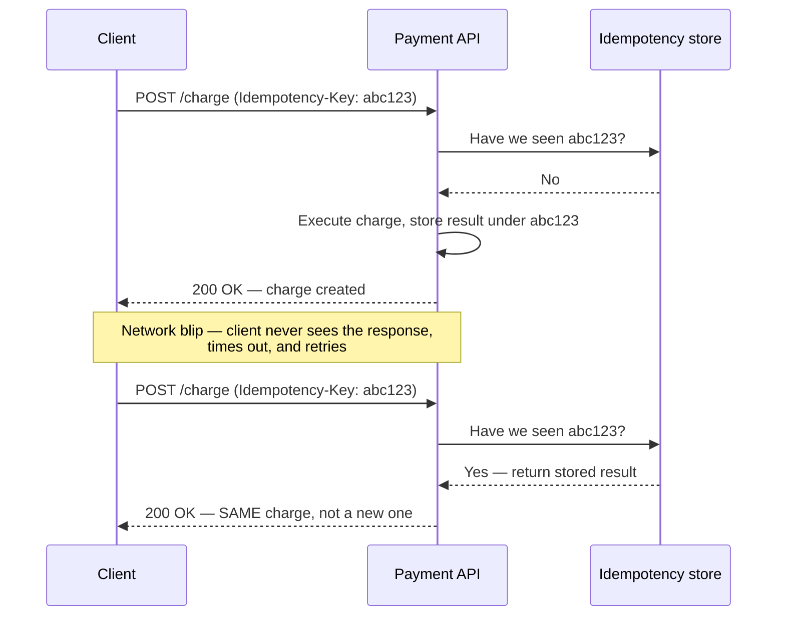

**Interview line**: "retry" and "idempotent" are a package deal — never propose retries on a write
path without saying how the retry is made idempotent (idempotency key, conditional write / version
check, or a naturally idempotent operation like `SET x = 5`).

### 4.11 Backpressure & Load Shedding

Retries and circuit breakers protect the *caller*; backpressure and load shedding protect the
*callee*. **Backpressure** is a signal flowing backward through a pipeline telling upstream
producers to slow down because a downstream stage is saturated (bounded queues, TCP flow control,
reactive-streams `request(n)` semantics) — the alternative is an unbounded queue that trades an
immediate failure for a slower, worse one (out-of-memory, or requests so stale by the time they're
served that serving them is pointless). **Load shedding** is the blunter cousin: when a service is
over capacity, actively reject a slice of incoming requests cheaply, at the front door, rather than
accept everything and let all of it degrade — shed low-priority traffic first (background jobs
before user-facing reads) so headroom is preserved for what matters.

Both are the callee-side complement to the AWS Dec-2021 lesson: the bridging devices had no way to
push back on the connection surge or shed excess connection attempts, so every unit of offered load
was accepted until the whole channel collapsed.

**Concrete example**: a downstream stage can durably process 5K writes/sec. Upstream, during a
burst, produces 20K writes/sec — a 15K/sec surplus. With an unbounded queue, that surplus queues up
at 15K/sec; a 60-second burst alone queues ~900K unprocessed writes before the process runs out of
memory. Backpressure fixes this by signaling upstream to slow to ~5K/sec at the source. Load
shedding fixes it differently: reject the extra 15K/sec at the front door immediately (a cheap
`503`), so the 5K/sec that gets in is served well instead of all 20K/sec being served badly.

**Interview line**: "backoff+jitter is what the *caller* does; load shedding and backpressure are
what the *callee* does — a resilient system needs both sides implemented, not just one."

### 4.12 Health Checks: Shallow vs. Deep

Meta's incident (§3.1) was triggered by a health check doing exactly what it was told — the
problem was what it was told to do about it. Worth generalizing:

- **Shallow health check**: "is the process running / does it answer on its port." Cheap, fast,
  but blind to a process that's up yet unable to do its job (e.g., can't reach its own database).
- **Deep health check**: actually exercises the dependency path — "can I read from my database,
  reach my downstream, serve a real request end-to-end." Catches more, but risks becoming a
  cascade trigger itself if its *response* isn't scoped — exactly what happened at Facebook: the
  DNS health check was appropriately deep (it checked real backbone reachability, and correctly
  detected a real problem), but its remediation — withdraw routes globally — wasn't scoped to the
  size of the problem it detected.

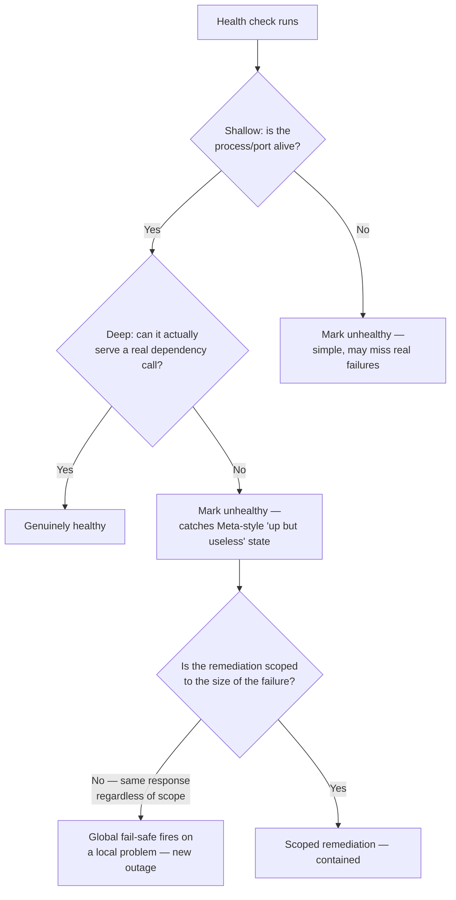

**Interview line**: "a health check needs two things right: deep enough to catch real failures, and
a remediation response that scales with how much of the system actually failed — not an
all-or-nothing trigger."

### 4.13 Dependency Tiers & Criticality (Tier-0 → Tier-3)

Not every dependency deserves the same resilience budget — FAANG orgs commonly tier services by
blast radius if they fail, and invest engineering effort accordingly.

| Tier | Definition | Example from this guide |
|---|---|---|
| **Tier-0** | Company-wide outage if this fails; everything else depends on it transitively | Facebook's authoritative DNS; AWS's internal DNS/control-plane network |
| **Tier-1** | A major product line or a widely-depended-on platform service fails | Kinesis Data Streams itself (feeds Cognito, CloudWatch, Lambda) |
| **Tier-2** | A single product/feature degrades; doesn't take others down | A recommendation service with a cache fallback |
| **Tier-3** | Internal/low-traffic tooling; failure is an inconvenience, not an incident | An internal admin dashboard |

The point of naming tiers explicitly: **it tells you where to spend your bulkhead budget.** AWS's
Kinesis fix — giving Cognito/CloudWatch (tier-0 consumers of a tier-1 service) their own isolated
front-end fleet (§3.2) — is a tiering decision made *after* an incident that should have been made
at design time.

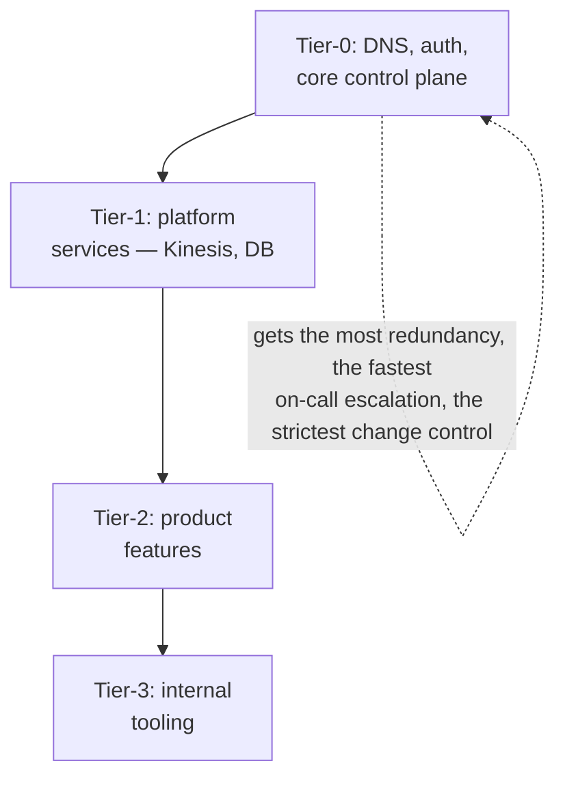

**Interview line**: "I'd tier my dependencies — the components that are tier-0 for me get extra
redundancy and the strictest deploy gates; I won't spend that same budget on a tier-3 internal
tool."

### 4.14 Redundancy & Failover: Active-Active vs. Active-Passive

None of the three incidents were fixed by "add a standby" alone — all three were single-region
(US-EAST-1 ×2) or single-logical-namespace (Facebook's DNS) failures, which is exactly why
multi-region redundancy is the first thing interviewers probe after any SPOF answer.

| | Active-Passive | Active-Active |
|---|---|---|
| **Traffic** | One region serves live traffic; standby stays warm/cold, promoted on failure | All regions serve live traffic simultaneously |
| **Failover cost** | Failover time (detect + promote + re-route) — seconds to minutes | None — the failing region's traffic is already being served elsewhere |
| **Data consistency** | Simpler — single writer | Harder — needs conflict resolution or partitioning by key/region |
| **Steady-state cost** | Standby capacity is mostly idle | Full capacity used everywhere — no idle spend |

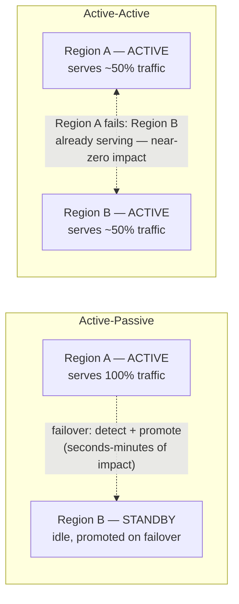

Netflix (multi-region active-active on AWS, verified with Chaos Kong drills — §4.7) is the
canonical named counter-example to all three incidents in this guide: designed explicitly so a
single-region AWS failure — its own biggest single dependency risk — doesn't take Netflix down.

**Interview line**: "active-passive buys simplicity and costs failover time; active-active buys
zero failover time and costs consistency complexity — I'd default to active-passive unless the SLA
can't tolerate the failover window."

### 4.15 Progressive Delivery: Canary & Blast-Radius-Limited Rollouts

Look at the trigger column in the Master Cheat Sheet (§7): **all three incidents started as a
routine change** — a backbone audit command, a capacity add, an automated scaling action — pushed
everywhere at once. This is the single most preventable ingredient common to all three.

- **Canary release**: ship the change to a small slice (1 host, one AZ, 1% of traffic) first,
  watch health signals, then widen — instead of a single global rollout.
- **Blast-radius-limited rollout**: cap *how much* of the fleet/traffic a single stage can touch,
  regardless of how good the change looked in canary — because canary only proves "this doesn't
  break under canary-scale conditions," not "this doesn't break at fleet scale." Kinesis's thread
  ceiling was exactly a fleet-scale-only failure — it would not have shown up in a 10-host canary.
- **Automatic abort/rollback on anomaly**: the rollout pauses/reverts itself if error rate,
  latency, or a custom metric (like connection-activity count — the metric that actually broke in
  the Dec-2021 incident) crosses a threshold, without waiting for a human to notice.

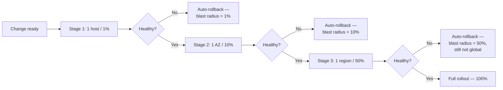

**Interview line**: "none of these three incidents needed a smarter safety check as much as they
needed a *smaller first blast radius* — I'd stage every risky change through canary → AZ → region
→ global, with automatic abort on the metric that actually matters, not just 'errors.'"

### 4.16 Incident Command, On-Call, and Runbooks

The postmortem (§4.8) happens after the fire is out — this section is about the fire itself.
FAANG on-call orgs run incidents with a lightweight command structure so "who does what" is never
being decided live, under pressure, for the first time:

- **Incident Commander (IC)**: owns coordination and decisions, not necessarily the fix itself —
  their job is to unblock, delegate, and communicate, not to be the best debugger in the room.
- **Comms lead**: owns the status page / stakeholder updates, so the people fixing the issue are
  never interrupted to answer "any update?"
- **Ops/subject-matter responders**: the people actually diagnosing and mitigating.
- **Runbooks**: a pre-written, tested playbook for known failure classes ("DNS resolution
  failures: check X, Y, Z, roll back to known-good zone file") — the value is doing this *before*
  3 a.m., not improvising a diagnosis process during the incident.
- **Severity levels** (SEV1...SEV5 or similar): a shared vocabulary for "how bad," which determines
  who gets paged and how loudly — a SEV1 pages an IC and wakes up leadership; a SEV4 waits for
  business hours.

**Why this matters for Meta/AWS specifically**: all three incidents needed *fast, correct*
escalation precisely because their normal tooling was degraded — Meta's engineers needed physical
access decisions made and executed under a clear chain of command with no functioning chat/ticket
system; AWS's operators fell back to manually grepping logs, which is exactly the situation a
runbook ("if telemetry is down, here's where to look and who decides what") is built for.

**Interview line (often behavioral, but gradeable here too)**: "I'd want a named incident commander
role, a pre-written runbook for the failure classes I can anticipate, and a severity rubric — so
that during an actual incident, the only new decision being made is the fix itself, not the
process."

### Interview cheat-sheet — cross-cutting patterns

- Say the pattern name out loud: SPOF, cascading failure, retry storm, thundering herd, bulkhead,
  circuit breaker, graceful degradation — it signals you've internalized the vocabulary, not just
  memorized anecdotes.
- Control plane vs data plane is the single highest-leverage distinction to volunteer unprompted.
- "Slow" is worse than "down" — always ask what happens under partial degradation, not just total failure.
- Chaos engineering = finding cascades in a game day instead of in production (name Chaos Monkey /
  Latency Monkey / Chaos Kong by tool, not just the buzzword).
- A blameless postmortem culture is itself an answer to "how do you prevent repeat incidents."
- Retries are only safe if the operation is idempotent — say how (idempotency key, conditional
  write) whenever you propose a retry on a write path.
- Backoff+jitter is the caller's job; load shedding/backpressure is the callee's — mention both.
- Tier your dependencies (tier-0 → tier-3) and spend redundancy/change-control budget accordingly.
- Stage risky rollouts by blast radius (canary → AZ → region → global) with automatic abort — this
  would have prevented or shrunk all three incidents in §3.

---

## 5. Bringing This Into a System Design Interview

Resilience isn't a bolt-on section — but if you need a checkpoint to make sure you cover it, use
this flow after your high-level design is on the board.

```mermaid
flowchart TD
    A[Finish high-level design] --> B[Pick the 2-3 highest-traffic<br/>or highest-blast-radius components]
    B --> C[For each: state its SPOF risk<br/>out loud, unprompted]
    C --> D[Name the failure mode:<br/>crash / slow / partition / corrupt]
    D --> E[Propose the specific mitigation:<br/>replica+failover, circuit breaker,<br/>bulkhead, retry+backoff+jitter]
    E --> F[State the blast radius if<br/>the mitigation ALSO fails]
    F --> G{Interviewer pushes:<br/>"what if it's slow, not down?"}
    G -- answer with timeouts,<br/>bulkheaded pools, p99 alerting --> H[Mention monitoring/vantage point:<br/>is your health check outside<br/>the failure domain?]
    H --> I[Close with graceful degradation:<br/>what's the degraded-but-alive answer<br/>vs. a hard error?]
```

**Concretely, per component, say this pattern out loud**:

> "This [service] is a SPOF unless I [replicate / shard / add a standby]. If it fails [slowly vs.
> completely], my mitigation is [circuit breaker / timeout / bulkhead]. If that mitigation also
> fails, the blast radius is [scoped to X] because [isolation mechanism]. My monitoring for this
> lives in [independent failure domain] so I still have a vantage point if this component is down."

This single paragraph, repeated for 2-3 key components, is worth more in an interview than a
10-minute tangent about a famous outage — cite the outage in one sentence as evidence, then move
back to *your* design.

### Disambiguation: terms interviewers expect you not to conflate

| Term | Means | Common confusion |
|---|---|---|
| **SLI** | Service Level *Indicator* — the raw measured metric (e.g., p99 latency, error rate) | Confused with SLO |
| **SLO** | Service Level *Objective* — the internal target for an SLI (e.g., p99 < 200ms) | Confused with SLA |
| **SLA** | Service Level *Agreement* — the external, often contractual, promise (usually looser than the SLO, with financial penalties) | Treated as the same number as the SLO |
| **Fail-open** | On failure, let requests through (favors availability) | Confused with fail-closed |
| **Fail-closed** | On failure, block requests (favors safety/security) | Wrong default picked for auth vs. e.g. a rate limiter |
| **Retry** | Re-attempt a failed call | Used without specifying backoff/jitter/cap — incomplete answer in an interview |
| **Backoff (+jitter)** | Growing delay between retries, randomized to avoid synchronized retries | Confused with a fixed retry interval |
| **Circuit breaker** | Stops calling a dependency entirely once it's clearly unhealthy | Confused with a retry policy — a breaker *prevents* calls, retries *repeat* them |
| **Control plane** | Manages/provisions resources | Confused with data plane |
| **Data plane** | Serves live traffic on already-provisioned resources | Assumed to share fate with control plane (it shouldn't) |
| **Availability Zone (AZ)** | Isolated DC(s) within a region, independent power/network/cooling | Confused with "just another server rack" |
| **Region** | Fully independent set of AZs, often geographically distant | Assumed to share control-plane dependencies with other regions (it often does more than people expect — see US-EAST-1's outsized blast radius in both AWS incidents) |
| **Idempotent** | Replaying the same request has the same effect as sending it once | Assumed "retry" alone makes an operation safe |
| **Backpressure** | A signal telling upstream producers to slow down | Confused with load shedding — backpressure asks the producer to slow; shedding rejects at the callee |
| **Canary release** | Roll a change to a small slice first, watch, then widen | Treated as a substitute for blast-radius caps at fleet scale (canary proves canary-scale correctness only) |
| **Active-active** | All regions/replicas serve live traffic simultaneously | Assumed strictly "better" than active-passive (it costs consistency complexity) |
| **Tier-0 service** | A dependency whose failure is company-wide | Conflated with "important to my team" — tiering is blast-radius-based, not team-based |

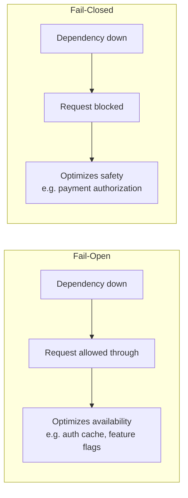

### Interview cheat-sheet — bringing it into the interview

- Weave resilience into each component as you draw it — don't save it all for the end.
- Use the one-paragraph pattern above per key component: SPOF → failure mode → mitigation →
  residual blast radius → monitoring vantage point.
- Cite a real incident in one sentence max, then pivot back to your own design — depth over
  storytelling.
- Know fail-open vs fail-closed and *justify* your choice per component (auth = fail closed;
  a recommendation cache = fail open).
- Region and AZ are not automatically independent for every purpose — say so; that's a senior-level
  observation the incidents above prove (US-EAST-1 control-plane blast radius extended past what
  most engineers assume "regional isolation" covers).

---

## 6. Golden Rules

1. **The safety net must live outside the building that's on fire.** Monitoring, break-glass
   tooling, and rollback paths must not share a failure domain with the thing they protect.
2. **Every "routine" change is a candidate root cause.** Audit changes — deploys, config pushes,
   capacity adds — harder than you audit steady-state operation.
3. **Retries without backoff+jitter+cap are a self-inflicted DDoS.** Always specify all three.
4. **Slow is worse than down.** Down fails fast; slow ties up resources while looking almost fine.
5. **Control plane and data plane must be able to fail independently.** Losing the ability to
   *change* the system must never mean losing the ability to *serve* the system.
6. **Blast radius is chosen, not discovered.** Bulkheads, cells, shards, and isolated fleets are how
   you choose it before an incident, not after.
7. **Cache/dependency failure must never mean total failure — fail open where safety allows, fail
   closed where it doesn't, but always have an explicit answer.**
8. **A cascading failure is always a chain of shared dependencies — find the shared thread, not
   just the first domino.**
9. **Blameless postmortems with committed action items are the only thing that converts an outage
   into fewer future outages.** An incident without action items is a wasted incident.
10. **Independent vantage points beat self-reported health** — your status page should not depend
    on the thing it reports status about.
11. **A retry is only as safe as the idempotency behind it.** Never propose a retry on a write path
    without saying how duplicates are handled.
12. **Stage every risky change by blast radius — host → AZ → region → global — with automatic
    abort, not manual detection.** All three incidents in this guide were a routine change rolled
    out globally in one shot.

---

## 7. Master Cheat Sheet

**Four failure types**: crash (system), confuse (method/logic), cut-off (communication), corrupt
(storage).

**Nines table** (know cold): 99% ≈ 3.65 days/yr · 99.9% ≈ 8.76 hrs/yr · 99.99% ≈ 52.6 min/yr ·
99.999% ≈ 5.26 min/yr. Composite availability = product across the dependency chain — every hop
costs you.

**Naive retry amplification**: `effective_load ≈ base_load / (1 - error_rate)` — always pair
retries with backoff + jitter + a retry budget cap.

**The three incidents, one line each**:
| Incident | Trigger | Core failure pattern | 🆕 Duration (~) | 🆕 Actual fix |
|---|---|---|---|---|
| Meta, Oct 2021 | Backbone audit command missed by review tool | Fail-safe (DNS BGP withdrawal) fired on an untested "0 of N" condition; recovery tools shared the fault's blast radius | ~6 hrs | Hardened audit tool, rate-limited global network commands, out-of-band emergency DC access |
| AWS Kinesis, Nov 2020 | Small front-end capacity add | O(n²) thread/mesh ceiling breached; internal control/observability consumers shared fate with customer data plane | ~5 hrs (core), longer for some dependents | Fewer/larger front-end nodes, dedicated tier-0 fleet for Cognito/CloudWatch, faster cold-start rebuild |
| AWS US-EAST-1, Dec 2021 | Automated internal-network scaling action | Retry storm congesting the internal↔main network bridge; control plane degraded while data plane survived | ~5-8 hrs | Throttled the triggering scaling action, expanded bridge capacity, isolated monitoring path |

*(Duration figures are widely-reported/illustrative — see each incident's "🆕 Blast radius & the
actual fix" subsection in §3 for the caveats and sourcing.)*

**Patterns to name unprompted**: SPOF, cascading failure, retry storm, thundering herd, control
plane vs data plane, blast radius/bulkhead, circuit breaker, graceful degradation, chaos
engineering, blameless postmortem, slow-vs-down, idempotency, backpressure/load shedding,
health-check depth, dependency tiers (tier-0→3), active-active vs active-passive, canary/staged
rollout, incident command/runbooks.

**Circuit breaker states**: Closed (flowing) → Open (fail fast) → Half-Open (trial) → Closed or
back to Open.

**Fail-open vs fail-closed**: open favors availability (caches, flags); closed favors safety
(auth, payments) — justify your pick per component.

**The one paragraph to say per component**: *"SPOF unless [mitigation]. Failure mode is [crash/
slow/partition]. Mitigation is [breaker/bulkhead/backoff]. Residual blast radius is [scope].
Monitoring lives in [independent domain]."*

**Golden rule to lead with if you only remember one**: the safety net must live outside the
building that's on fire — independent vantage points, independent rollback paths, independent
break-glass access.
