# Non-Functional System Characteristics — FAANG Interview Guide

> **Goal**: Walk into any Google/Meta/Amazon system design interview and confidently articulate, quantify, and design for Availability, Reliability, Scalability, Maintainability, and Fault Tolerance.

> **Enhancement notes:**
> - Added **🆕 Chapter 0 — Don't Confuse These Words**: precise definitions for all six properties (including **Durability**, which had no dedicated coverage before), a master comparison table (definition + differentiator + one-line example each), a disambiguation flowchart, and a reusable 30-second template for stating non-functional requirements at the start of an interview answer.
> - **Durability** was previously absent as a named concept — it's now defined, added to the Quick Chapter Map, the Comparison Matrix, the Golden Rules (#11), and the Master Cheat Sheet, with AWS S3's "11 nines" as the anchoring real-world number.
> - Added a **🆕 SLA → SLO → SLI flow diagram** and a from-scratch **error-budget worked example** (99.9% SLO over 30 days ≈ 43 minutes) in the Availability chapter, next to the existing SLA/SLO/SLI table and burn-down pie chart.
> - Added a **🆕 Latency vs Throughput trade-off** subsection in the Scalability chapter, with an illustrative batching example and Little's Law (`L = λW`) — explicitly labeled illustrative where numbers aren't measured facts.
> - Extended the Master Cheat Sheet's "Interviewer Says → You Think" table with entries for durability, SLA/SLO/SLI, and latency-vs-throughput signals.
> - No existing section was rewritten or reordered — all additions are new subsections/rows marked with 🆕, and the original voice, formulas, and examples are untouched.

---

## How to Use This Guide

- **First pass**: Read each section top-to-bottom. Focus on the "What it is" and real-world examples.
- **Second pass**: Memorize the cheat-sheets and formulas.
- **Before an interview**: Skim the "How to identify" sections and the Master Cheat Sheet at the end.
- **During an interview**: When the interviewer describes a system, the "how to identify" triggers tell you which non-functional requirement is implicitly expected.

---

────────────────────────────────────────────────────────────────────────────────────────────────

## Quick Chapter Map

| Property                  | One-liner                                        | Key Metric                | Core Technique                |
| ------------------------- | ------------------------------------------------ | ------------------------- | ----------------------------- |
| **Availability**    | System is*up* when you need it                 | Nines (99.9%, 99.99%…)   | Redundancy, Failover          |
| **Reliability**     | System does the*right thing* every time        | MTBF, MTTR                | Circuit breakers, Retries     |
| **Scalability**     | System handles*growing load* without degrading | Throughput, Latency at Pn | Horizontal scaling, Sharding  |
| **Maintainability** | System is*easy to operate and evolve*          | MTTR                      | Observability, Modular design |
| **Fault Tolerance** | System*keeps running* despite failures         | RTO, RPO                  | Replication, Checkpointing    |
| 🆕 **Durability**       | Data*never gets lost*, even if the service is briefly down | Nines of durability (e.g. 11 nines) | Replication across disks/AZs, checksums |

---

## 🆕 0. Don't Confuse These Words (Definitions At a Glance)

Six words get used almost interchangeably outside interviews, and precisely because of that, FAANG interviewers listen for whether you keep them separate. Skim this chapter first if you only have five minutes before the interview — everything here is expanded with formulas and examples in the chapters that follow.

### 🆕 Precise Definitions

- **Availability** — the fraction of time the system is up and responding. Answers: *"Is it reachable right now?"* Measured in nines (99.9%, 99.99%…).
- **Reliability** — the probability the system does the *correct* thing for a given period. Answers: *"Is the answer right?"* A system can be up and still wrong.
- **Durability** — the probability that data, once committed, is never lost — even across disk, node, or datacenter failure. Answers: *"Will this data still exist years from now?"* A system can be temporarily unreachable (unavailable) while every byte it holds remains perfectly durable, waiting on disk for the service to come back.
- **Fault Tolerance** — the ability to keep operating correctly *while* a component is actively failing, not just recover after the fact. Answers: *"Does a live failure ever become user-visible?"*
- **Scalability** — the ability to handle more load (users, requests, data) without a proportional loss of performance. Answers: *"What happens at 10x traffic?"*
- **Maintainability** — how cheaply the system can be operated, debugged, and changed over its lifetime. Answers: *"How painful is day-2 operations?"*

### 🆕 Comparison Table — All Six, Side by Side

| Term                    | Precise Definition                                                        | Differs From...How                                                                                          | One-Sentence Example                                                                                                                             |
| ----------------------- | -------------------------------------------------------------------------- | -------------------------------------------------------------------------------------------------------------- | --------------------------------------------------------------------------------------------------------------------------------------------------- |
| **Availability**  | % of time the system responds to requests                                  | vs Reliability: says nothing about correctness, only uptime                                                     | A checkout page that loads 99.99% of the time is highly available                                                                                   |
| **Reliability**   | Probability of producing the correct result over a period                  | vs Availability: a system can be "up" and still wrong                                                           | An ATM that's always online but occasionally dispenses the wrong amount is available but not reliable                                               |
| **Durability**    | Probability that stored data is never lost, independent of reachability    | vs Availability: durability is about data survival, not service uptime                                          | AWS S3 advertises "11 nines" (99.999999999%) annual durability — an object essentially never disappears, even during a brief outage                 |
| **Fault Tolerance** | Continuing to work correctly *during* an active component failure        | vs Reliability/Availability: it's the *mechanism*, not the outcome — it's what protects the other two          | A 4-engine plane that lands safely on 2 engines is fault-tolerant; passengers never notice the failure                                              |
| **Scalability**   | Handling growing load without proportional performance loss                | vs Availability: a system can be up for 10 users and fall over at 10M — scale is a separate axis from uptime    | Sharding a database by `user_id` so adding new users doesn't slow down existing queries                                                             |
| **Maintainability** | Ease of operating, debugging, and evolving the system over time          | vs Reliability: reliability is failing less often (↑MTBF); maintainability is fixing faster (↓MTTR) once it does | Structured logs + one-command rollback let an on-call engineer fix a bad deploy in 5 minutes instead of 2 hours                                     |

### 🆕 Disambiguation Diagram

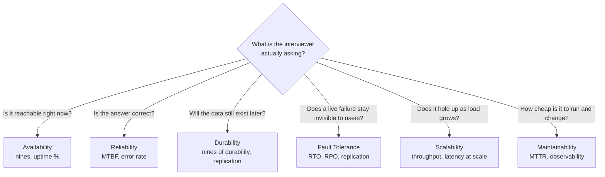

### 🆕 How to State Non-Functional Requirements Concisely (Interview Opening)

Before you draw a single box, spend 30 seconds stating your targets out loud. This does two things: it shows the interviewer you think in trade-offs before solutions, and it gives you a yardstick to justify every design decision later ("I chose async replication *because* I said availability mattered more than zero data loss").

A reusable template:

> "For this system, I'll design for **[X] requests/sec** and **[Y] TB of data**, targeting **[N] nines of availability** (~[downtime]/year), **[strong/eventual] consistency** for [which operations], **RTO of [T1]** and **RPO of [T2]**, and I'll treat [reliability/durability/scalability] as the primary constraint because [reason from the prompt]."

Example: *"For this URL shortener, I'll design for ~2,000 RPS reads and ~200 RPS writes, targeting 99.99% availability (~52 min/year downtime), eventual consistency is fine since a redirect being a few seconds stale doesn't matter, and durability is the real constraint — losing a mapping breaks every link that points to it, so I'll replicate writes to at least 3 nodes before acknowledging."*

Note what this does *not* do: it doesn't invent precise numbers you can't defend. If you're unsure of a number, say "illustrative" or "let's assume" out loud — interviewers reward candidates who flag their own assumptions over ones who state guesses as facts.

---

## 1. Availability

### What Is It?

**Availability** is the percentage of time a system is operational and accessible to users under normal conditions.

> **Simple mental model**: If you call a friend and they pick up 99.9% of the time, their "availability" is 99.9%. The 0.1% is when they're in the shower — the system is *down*.

**Formula**:

```
Availability (%) = ((Total Time - Downtime) / Total Time) × 100
```

---

### The Nines of Availability

| Availability | Nines     | Downtime/Year | Downtime/Month | Downtime/Week |
| ------------ | --------- | ------------- | -------------- | ------------- |
| 90%          | 1 nine    | 36.5 days     | 72 hours       | 16.8 hours    |
| 99%          | 2 nines   | 3.65 days     | 7.20 hours     | 1.68 hours    |
| 99.5%        | 2.5 nines | 1.83 days     | 3.60 hours     | 50.4 minutes  |
| 99.9%        | 3 nines   | 8.76 hours    | 43.8 minutes   | 10.1 minutes  |
| 99.99%       | 4 nines   | 52.56 minutes | 4.32 minutes   | 1.01 minutes  |
| 99.999%      | 5 nines   | 5.26 minutes  | 25.9 seconds   | 6.05 seconds  |
| 99.9999%     | 6 nines   | 31.5 seconds  | 2.59 seconds   | 0.605 seconds |

> **Memory trick**: Going from 3 nines → 4 nines means you go from ~9 hours/year downtime to ~52 minutes/year. Each additional nine is roughly 10x better.

**What do companies target?**

- **Payment systems / banking**: 99.999% (5 nines) — max ~5 min/year
- **Search, social media**: 99.99% (4 nines) — max ~52 min/year
- **Internal tools / dashboards**: 99.9% (3 nines) is usually fine
- **Google Search SLA**: publicly targeting 99.99%+
- **AWS S3**: 99.99% availability SLA; actual uptime often higher

---

### Sequential vs Parallel Availability

This is a **critical formula** interviewers love to test implicitly.

**Sequential (components in a chain)** — if any one fails, the whole thing fails:

```
A_total = A1 × A2 × A3 × ... × An
```

**Example**: 3 services each at 99.9% availability in a request path:

```
A_total = 0.999 × 0.999 × 0.999 = 0.997 = 99.7%
```

You *lost* one nine by chaining 3 services. This is why microservices architectures fight hard to keep per-service availability high.

**Parallel (redundant components)** — the system fails only if *all* replicas fail:

```
A_total = 1 - (1 - A1) × (1 - A2) × ... × (1 - An)
```

**Example**: 2 servers each at 99% availability in parallel:

```
A_total = 1 - (1-0.99) × (1-0.99) = 1 - 0.0001 = 99.99%
```

Adding one replica turned 2 nines into 4 nines.

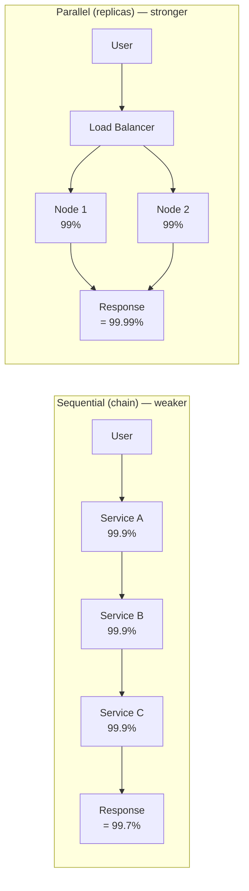

---

### SLA vs SLO vs SLI

These three terms come up constantly in FAANG interviews and on the job.

| Term          | Stands For              | Owned By                   | Example                                         |
| ------------- | ----------------------- | -------------------------- | ----------------------------------------------- |
| **SLA** | Service Level Agreement | Legal/Business ↔ Customer | "We guarantee 99.9% uptime or you get a refund" |
| **SLO** | Service Level Objective | Engineering team           | "Our internal target is 99.95% uptime"          |
| **SLI** | Service Level Indicator | Monitoring system          | "Last month we measured 99.97% uptime"          |

> **Interview tip**: SLO is your engineering target. SLA is the legal contract (usually more lenient than SLO to give you buffer). SLI is the actual measured number. Always set SLO tighter than SLA.

### 🆕 How SLA, SLO, and SLI Fit Together

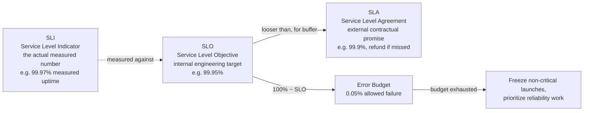

The direction of the arrows is the whole trick: you measure with an **SLI**, hold yourself to a stricter internal **SLO**, and promise customers an even looser **SLA** — the gap between SLO and SLA is your safety margin.

**Error Budget** = 100% − SLO. If your SLO is 99.9%, your error budget is 0.1%. Once you burn the budget, you stop shipping new features and focus on reliability.

### 🆕 Worked Example: Error Budget From Scratch

Say your SLO is **99.9% over a 30-day month**:

```
Error budget (%)      = 100% − 99.9% = 0.1%
Minutes in 30 days     = 30 × 24 × 60 = 43,200 minutes
Allowed downtime       = 43,200 × 0.1% = 43.2 minutes
```

So **99.9% SLO over 30 days ≈ 43 minutes of allowed downtime** — this is the number to memorize. (The nines table above shows 43.8 min/month because it uses a 30.44-day average month; either figure is fine to quote, just say which month-length you assumed.)

If an incident this month already ate 25 minutes of downtime, you have **~18 minutes of error budget left** — that's the number that should drive whether you approve a risky deploy today or wait.

---

### Techniques to Achieve High Availability

1. **Redundancy**: Run multiple instances of every component (N+1 or N+2 redundancy). No single point of failure.
2. **Load Balancing**: Distribute traffic across replicas. Health-check and route away from unhealthy nodes.
3. **Active-Active Failover**: All replicas serve traffic. If one dies, others absorb the load seamlessly.
4. **Active-Passive Failover**: One primary serves traffic; standby is warm and ready. Failover = seconds.
5. **Geographic Redundancy**: Deploy in multiple regions/AZs. Protects against datacenter-level failures.
6. **Health Checks + Auto-healing**: Detect failures fast (liveness/readiness probes in Kubernetes) and replace failed instances automatically.
7. **Graceful Degradation**: When a dependency is down, return partial results instead of a full error (e.g., show cached content instead of a blank page).

> **Memory hook**: "**R**eally **L**ucky **A**stronauts **A**lways **G**et **H**ome **G**racefully" → Redundancy, Load balancing, Active-active, Active-passive, Geographic redundancy, Health checks, Graceful degradation.

---

### Error Budget Burn-Down (Example)

A 99.9% SLO gives you a 43.8-minute monthly error budget. Here's how a typical month might spend it:

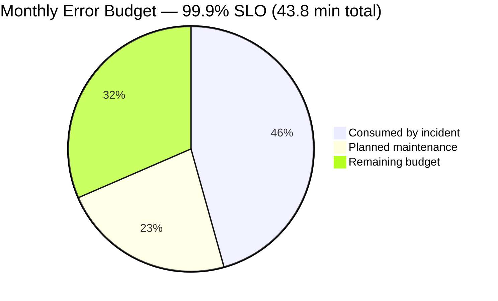

Once the "remaining budget" slice hits zero, freeze non-critical feature launches and prioritize reliability work until the budget resets next month.

---

### Real-World Examples

- **WhatsApp**: In 2021, the Facebook/WhatsApp/Instagram outage lasted ~6 hours due to a BGP misconfiguration. Affected availability: ~99.93% for that year. A misconfigured config push took out DNS-level routing globally.
- **AWS S3 2017 outage**: A human typo in a command brought down S3 in us-east-1 for 4 hours. Impact rippled across thousands of services. AWS now has runbook validation and reduced-blast-radius deletion procedures.
- **Google Search**: Maintains 99.99%+ through multi-region active-active serving. Queries are answered by whichever datacenter is healthy — users rarely notice a datacenter failure.

---

### How to Identify in an Interview

Listen for these phrases — they signal the interviewer expects you to discuss availability:

- "The system must be up 24/7"
- "Users in different time zones must be able to access it"
- "We can't afford downtime"
- "This is a payments / healthcare / safety-critical system"
- "What happens if a server goes down?"

**Your response trigger**: Start talking about redundancy, failover strategy, and what your target SLO is.

---

### Availability Interview Cheat-Sheet

- State your availability target upfront: "I'm designing for 99.99% availability (4 nines = ~52 min/year downtime)."
- Eliminate single points of failure: every critical component needs a replica.
- Sequential services multiply failure probability; use parallel/redundant paths.
- Active-Active > Active-Passive for availability; Active-Passive is cheaper.
- Always mention health checks and auto-failover — don't rely on manual intervention.
- Graceful degradation is a valid availability technique: partial service beats no service.

---

## 2. Reliability

### What Is It?

**Reliability** is the probability that a system performs its intended function correctly for a specified period under stated conditions.

> **Mental model**: Availability asks "Is the system up?" Reliability asks "Does the system give the *right* answer?" A system can be available (responding) but unreliable (returning wrong data).
>
> Example: An ATM that's running but dispenses wrong amounts is *available* but *unreliable*.

---

### Key Metrics: MTBF and MTTR

**Mean Time Between Failures (MTBF)** — how long the system runs between failures:

```
MTBF = (Total Elapsed Time - Total Downtime) / Number of Failures
```

**Mean Time To Repair (MTTR)** — how long it takes to restore service after a failure:

```
MTTR = Total Maintenance Time / Number of Repairs
```

**Goal**: **Maximize MTBF** (fail less often) and **Minimize MTTR** (recover faster).

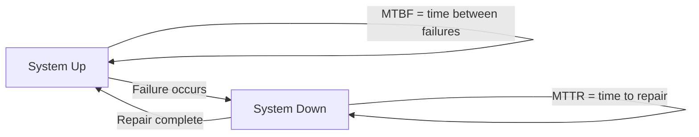

**Relationship to Availability**:

```
Availability = MTBF / (MTBF + MTTR)
```

- High MTBF + Low MTTR = High Availability
- Even with a short MTTR, if MTBF is tiny (fails constantly), availability suffers.

---

### Reliability vs Availability — The Key Distinction

| Scenario                                    | Available? | Reliable?              |
| ------------------------------------------- | ---------- | ---------------------- |
| System is up and correct                    | Yes        | Yes                    |
| System is up but returns stale/wrong data   | Yes        | No                     |
| System is down for scheduled maintenance    | No         | (Not applicable)       |
| System auto-restarts after crash every hour | Mostly yes | No (too many failures) |

> **Interview trap**: Don't conflate them. High availability does not imply high reliability. A system that crashes every hour but restarts in 2 seconds has 99.99% availability but terrible reliability (MTBF = 1 hour).

```mermaid
quadrantChart
    title Reliability vs Availability
    x-axis Low Availability --> High Availability
    y-axis Low Reliability --> High Reliability
    quadrant-1 Ideal: up and correct
    quadrant-2 Correct but rarely up
    quadrant-3 Down and wrong
    quadrant-4 Up but wrong: the trap
    Crashes hourly, restarts in 2s: [0.75, 0.15]
    4-nines search engine: [0.92, 0.9]
    Rare uptime, correct when live: [0.2, 0.85]
    Flaky legacy system: [0.15, 0.2]
```

---

### Techniques for Reliability

#### 1. Retries with Exponential Backoff

When a call fails transiently, retry — but space retries exponentially to avoid thundering herd:

```
Wait = base_delay × 2^attempt + random_jitter
# e.g.: 100ms, 200ms, 400ms, 800ms + jitter
```

Always set a **max retry count** and a **timeout** — infinite retries can cascade into larger failures.

#### 2. Circuit Breaker Pattern

Prevents cascading failures by "opening the circuit" when a downstream service is unhealthy.

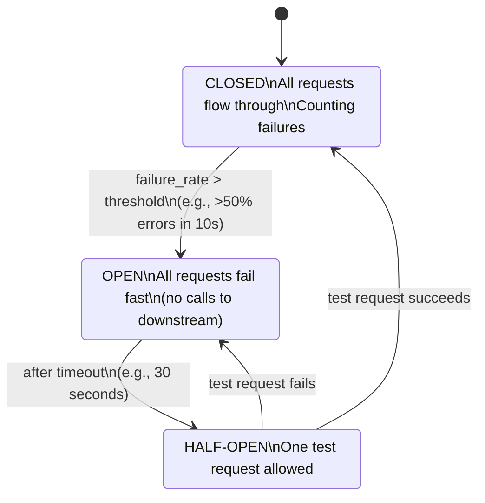

**Real example**: Netflix Hystrix (now Resilience4j) implements circuit breakers for every service-to-service call. When the recommendation service is down, Netflix returns a generic list rather than failing the whole page load.

**Trade-off**: A threshold set too sensitively causes **false positives** — the breaker trips and keeps routing around a downstream service that has actually recovered, adding needless errors/latency until the next half-open probe succeeds. Tune the threshold and half-open interval, don't just set-and-forget.

#### 3. Timeouts

Every network call must have a timeout. Without one, a slow downstream can exhaust thread pools and starve other requests.

```
# Never do this:
response = call_database()  # hangs forever if DB is slow

# Do this:
response = call_database(timeout=500ms)
if timeout: return cached_result or error
```

#### 4. Graceful Degradation

Return a degraded but usable response instead of a hard error:

- Amazon product page: if review service is down, show the product without reviews
- Google Maps: if real-time traffic is down, show static route
- Twitter: if engagement count service is slow, show approximate counts

#### 5. Bulkhead Pattern

Isolate resources (thread pools, connection pools) per downstream dependency so one slow service can't exhaust all threads:

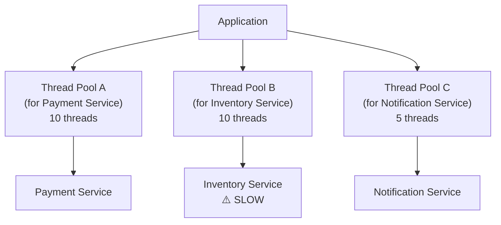

If Inventory is slow and exhausts Pool B, Payments still work — Pool A is untouched.

**Trade-off**: Reserved pools sit **idle** whenever their dependency is healthy — you're paying for capacity (threads, connections) that goes unused most of the time, in exchange for isolation when things go wrong.

#### 6. Idempotency

Design operations so that retrying them multiple times produces the same result. Critical for:

- Payment processing (don't charge twice)
- Order placement
- Message queues (at-least-once delivery)

Use idempotency keys: client sends a unique `request_id`; server deduplicates.

> **Memory hook**: "**R**eally **C**autious **T**urtles **G**uard **B**ulkheads **I**mmunely" → Retry, Circuit breaker, Timeout, Graceful degradation, Bulkhead, Idempotency.

---

### Real-World Examples

- **Netflix**: Chaos Monkey (part of Chaos Engineering) randomly kills production instances to test that the system is reliable under failure. Services must gracefully degrade or circuit-break — if they can't, they get fixed proactively.
- **Amazon checkout**: If the recommendation service fails, the checkout flow still works. Reliability of the critical path (checkout) is prioritized over non-critical services (recommendations).
- **Amazon Aurora**: On a crash, Aurora doesn't replay a full redo log from disk like traditional MySQL/Postgres — it recovers by reading from 6 storage copies spread across 3 AZs, replaying only outstanding log records in parallel. Instance restart and crash recovery typically complete in under 10 seconds, and correctness (no partial/corrupt pages) is guaranteed by quorum writes (4-of-6) even mid-crash.

---

### How to Identify in an Interview

Listen for:

- "We can't afford to lose any transactions / data"
- "The system must handle failures without corrupting state"
- "What if a downstream service is slow or down?"
- "How do you prevent cascading failures?"
- Payment, financial, healthcare, safety systems

**Your response trigger**: Talk about MTBF/MTTR, retries, circuit breakers, timeouts, idempotency.

---

### Reliability Interview Cheat-Sheet

- Distinguish from availability: "available" ≠ "reliable."
- Every external call needs: **timeout + retry with backoff + circuit breaker**.
- Use circuit breakers to fail fast and prevent cascading failures.
- Bulkheads isolate failure domains — one slow service shouldn't crash others.
- Idempotency is essential for retries in distributed systems.
- State your MTBF target: "We want failures no more than once per month per service."

---

## 3. Scalability

### What Is It?

**Scalability** is the ability of a system to handle growing amounts of work (requests, data, users) without significant performance degradation.

> **Mental model**: A highway is scalable if you can add lanes as traffic grows. A single-lane road that gets congested at 1,000 cars/hour is not scalable.

---

### Dimensions of Scalability

| Dimension                | What It Means                               | Example                                 |
| ------------------------ | ------------------------------------------- | --------------------------------------- |
| **Size**           | Add more users, data, requests              | YouTube going from 1M to 1B users       |
| **Administrative** | Many teams/orgs sharing the system          | Multiple business units on shared cloud |
| **Geographic**     | Serve users across regions with low latency | Netflix serving Asia, Europe, Americas  |

---

### Vertical vs Horizontal Scaling

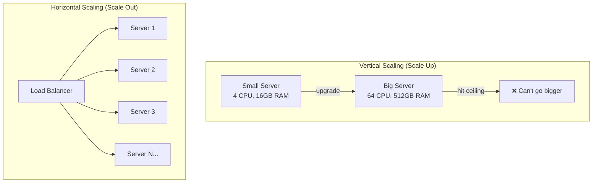

|                      | Vertical (Scale Up)                            | Horizontal (Scale Out)                               |
| -------------------- | ---------------------------------------------- | ---------------------------------------------------- |
| **How**        | Bigger machine (more CPU/RAM)                  | More machines                                        |
| **Ceiling**    | Hard limit (biggest machine available)         | Near-unlimited                                       |
| **Cost**       | Exponentially more expensive at top end        | Linear (commodity hardware)                          |
| **Downtime**   | Often requires restart                         | None (rolling adds)                                  |
| **Complexity** | Simple                                         | Requires load balancing, sharding, distributed state |
| **Use when**   | Quick fix, DB that can't be easily distributed | Long-term growth, need elasticity                    |

**Rule of thumb**: Start vertical (simpler), plan for horizontal (inevitable at scale).

---

### Key Scalability Techniques

#### 1. Load Balancing

Distributes incoming traffic across multiple servers. Algorithms: Round Robin, Least Connections, IP Hash, Weighted.

#### 2. Caching

Store frequently read data in memory to reduce load on databases.

```
Cache Hit Rate = Cache Hits / (Cache Hits + Cache Misses)
```

- **L1**: In-process memory (fastest, limited size)
- **L2**: Distributed cache — Redis, Memcached (ms latency, shared across instances)
- **L3**: CDN (content delivery network — geographic caching for static assets)

Target 95%+ cache hit rate for read-heavy workloads.

#### 3. Database Sharding (Horizontal Partitioning)

Split data across multiple DB instances by a shard key (user_id, geo, etc.).

```
shard_id = hash(user_id) % num_shards
```

Trade-off: Cross-shard queries become complex. Choose shard key carefully to avoid hot shards.

#### 4. Read Replicas

For read-heavy workloads, add read replicas. Writes go to primary; reads go to replicas.

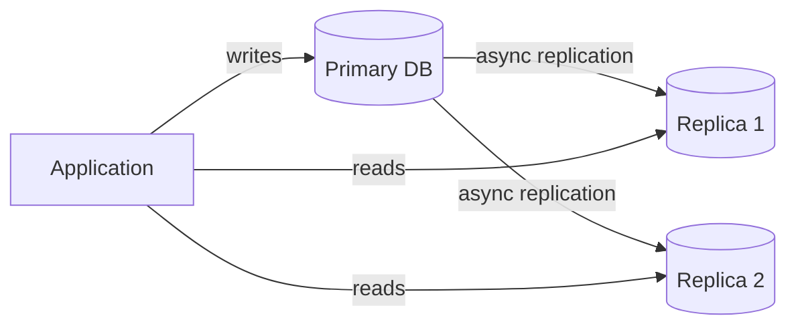

Trade-off: Replicas may lag slightly behind primary (eventual consistency on reads).

#### 5. CDN (Content Delivery Network)

Cache static assets (images, CSS, JS, videos) at edge nodes close to users. Reduces load on origin servers and cuts latency for global users.

- YouTube: 99%+ of video served from CDN, not origin
- Netflix: Open Connect (their own CDN) handles almost all video traffic

#### 6. Async Processing / Message Queues

Decouple slow operations (email sending, image processing, payment reconciliation) from the request path using queues (Kafka, SQS, RabbitMQ).

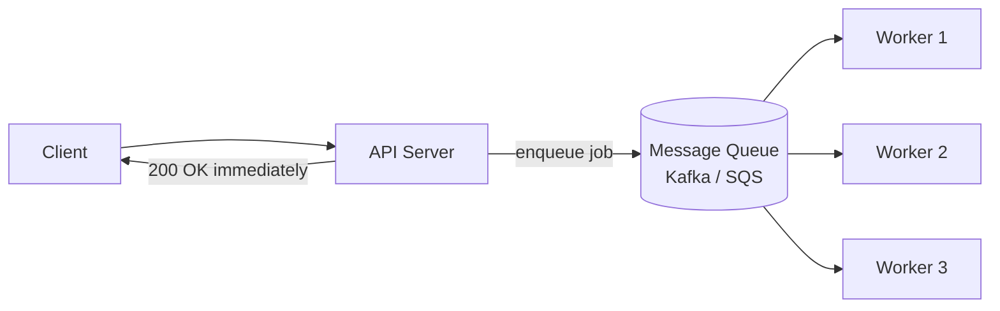

This lets you scale consumers independently of the API tier.

#### 7. Autoscaling

Automatically add/remove instances based on load metrics (CPU, request rate, queue depth). AWS Auto Scaling, Kubernetes HPA.

> **Memory hook**: "**L**arge **C**ats **S**lowly **R**ace **C**ars **A**round **A**irports" → Load balancing, Caching, Sharding, Read replicas, CDN, Async/queues, Autoscaling.

---

### Back-of-Envelope Scale Estimation (Interview Must-Have)

Always clarify and state the scale upfront:

```
Daily Active Users (DAU): 100M
Requests per user per day: 10
Total requests/day: 1B
Requests per second (RPS): 1B / 86,400 ≈ 12,000 RPS

Storage per request: 1KB
Daily storage: 1B × 1KB = 1TB/day
Monthly: ~30TB
```

**Interview tip**: Do this estimate before designing anything. It tells you whether you need 1 server or 1000.

---

### 🆕 Latency vs Throughput Trade-off

These two metrics are often quoted together, but improving one can hurt the other — interviewers use this to check you understand *why* a design choice was made, not just that you named the right buzzword.

- **Latency** — time to complete *one* request (p50/p95/p99, usually in ms).
- **Throughput** — number of requests the system completes *per unit time* (RPS, QPS).

**Why they trade off**: batching is the classic example. Grouping 100 writes into one batch call raises throughput (fewer round-trips, less per-request overhead) but raises latency for the first request in the batch (it waits for the batch to fill).

```
Illustrative example — a write API:
  No batching:     1 write/call   →  ~5ms latency/write   →   ~2,000 writes/sec (thread-bound)
  Batch of 50:      50 writes/call →  ~40ms latency/write  →  ~50,000 writes/sec
```

(Numbers above are illustrative, not measured — the direction of the trade-off, not the exact figures, is what matters in an interview.)

**Little's Law** ties them together and is safe to cite by name: `L = λ × W` — the average number of requests in the system (L) equals the arrival rate (λ, i.e. throughput) times the average time each spends in the system (W, i.e. latency). Push more throughput through a system with fixed concurrency, and per-request latency has to rise to compensate — this is why connection-pool size and thread-pool size are latency/throughput dials, not just resource limits.

> **Interview framing**: "I'm optimizing for low latency on the read path (users are waiting on it) and high throughput on the write path (it's async, batched via a queue)." Naming which side of the trade-off matters for which part of the system is the signal interviewers look for.

---

### Real-World Examples

- **Twitter (2012–2015)**: Migrated from monolith to microservices to scale the tweet-serving tier independently of the timeline-fanout tier. The "Fail Whale" era was a scaling problem — too much vertical, not enough horizontal.
- **Instagram at 1B users**: Shards PostgreSQL by user_id across many nodes. Uses Redis for caching hot timelines and follower lists.
- **YouTube**: Each video upload triggers async transcoding jobs (queued). Serving uses CDN for 99%+ of traffic, with origin servers only for cache misses.

---

### How to Identify in an Interview

Listen for:

- "The system should handle 1 million users" (or 100M, or 1B)
- "Traffic spikes during events / holidays"
- "As the company grows, the system must keep up"
- "How would you handle 10x traffic tomorrow?"
- Any question with explicit QPS / storage numbers

**Your response trigger**: Do the back-of-envelope math first, then talk about horizontal scaling, caching, sharding based on the numbers.

---

### Scalability Interview Cheat-Sheet

- Always quantify: "How many users? QPS? Data size?" before proposing solutions.
- Prefer horizontal scaling for long-term growth; vertical for quick wins.
- Cache aggressively — 80% of reads are often for 20% of data (Pareto principle).
- Use read replicas to scale reads independently from writes.
- Shard the database only when a single instance can't handle the load.
- Decouple with message queues to handle traffic bursts and slow consumers.
- CDN is free-ish latency and scale for static/cacheable content.

---

## 4. Maintainability

### What Is It?

**Maintainability** is the ease with which a system can be kept operational, fixed when broken, and evolved over time. It answers: "How painful is it to operate and change this system?"

> **Mental model**: A car is maintainable if a mechanic can diagnose and fix it quickly. An unmaintainable system is like a car with no diagnostic ports, no labeled parts, and no documentation — every repair is a guessing game.

---

### The Three Pillars of Maintainability

| Pillar                  | What It Means                                       | How to Achieve                                           |
| ----------------------- | --------------------------------------------------- | -------------------------------------------------------- |
| **Operability**   | Easy to keep running day-to-day                     | Monitoring, alerts, runbooks, auto-healing               |
| **Lucidity**      | Simple and understandable codebase/design           | Clean APIs, good naming, minimal magic                   |
| **Modifiability** | Easy to add/change features without breaking things | Loose coupling, clear interfaces, backward compatibility |

> **Naming note**: "Lucidity" and "Simplicity" are the same idea. Kleppmann's *Designing Data-Intensive Applications* calls this pillar **Simplicity** — if an interviewer uses that word instead of "Lucidity," they mean the same thing: can a newcomer understand the system without deciphering accidental complexity?

> **Memory hook**: "**O**ps **L**ove **M**odifying" → Operability, Lucidity/Simplicity, Modifiability.

---

### Measuring Maintainability: MTTR

**Mean Time To Repair (MTTR)** is the primary metric for maintainability:

```
MTTR = Total Maintenance Time / Number of Repairs
```

Lower MTTR = more maintainable system. Components:

- **Detection time**: How long until someone knows there's a problem?
- **Diagnosis time**: How long to find the root cause?
- **Fix time**: How long to apply and deploy the fix?
- **Validation time**: How long to confirm the fix works?

Maintainability improvements reduce all four.

---

### Techniques for Maintainability

#### 1. Observability (The Golden Triangle)

You can't maintain what you can't observe. The three pillars of observability:

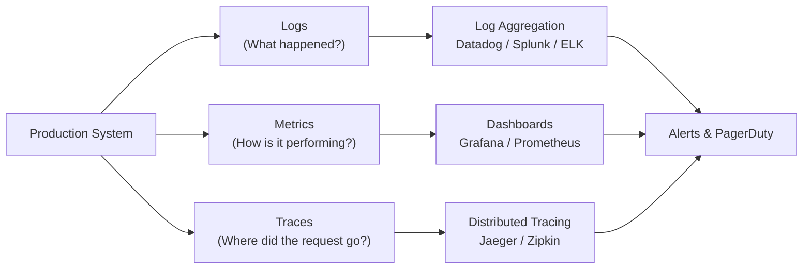

- **Logs**: Structured logs (JSON) with request IDs, user IDs, timestamps. Searchable.
- **Metrics**: Counters, gauges, histograms. Track error rates, latency (p50/p95/p99), RPS, saturation.
- **Traces**: End-to-end request tracing across microservices. Identifies slow hops.

#### 2. Deployment Strategies

| Strategy                | How                                        | Risk     | Rollback            |
| ----------------------- | ------------------------------------------ | -------- | ------------------- |
| **Blue-Green**    | Two identical envs; switch traffic at once | Medium   | Instant (flip back) |
| **Canary**        | Route 1% → 5% → 20% → 100% gradually    | Low      | Stop rollout        |
| **Rolling**       | Update one pod/instance at a time          | Low      | Rollback deployment |
| **Feature Flags** | Ship code off, enable for % of users       | Very low | Toggle flag off     |

Canary + feature flags = the safest way to deploy in FAANG environments.

#### 3. Runbooks and Playbooks

Documented procedures for common operational tasks:

- How to scale up the database tier
- How to respond to an alert for high error rate
- How to perform a database failover

Good runbooks reduce mean-time-to-repair by turning expert knowledge into a repeatable checklist.

#### 4. Auto-Healing and Self-Service

- Kubernetes auto-restarts crashed containers (liveness probes)
- Auto-scaling replaces unhealthy instances
- Self-healing reduces dependency on manual intervention during incidents

#### 5. API Versioning and Backward Compatibility

Changes should not break existing clients. Use versioned APIs (`/v1/`, `/v2/`) and deprecation windows. This is modifiability in practice.

---

### Maintainability vs Reliability

```
Reliability = system failing less often (↑ MTBF)
Maintainability = recovering faster when it does fail (↓ MTTR)

Availability = MTBF / (MTBF + MTTR)
```

Both contribute to availability, but through different means. Maintainability improvements are often faster to ship than reliability improvements.

---

### Real-World Examples

- **Google SRE**: Google invented the Site Reliability Engineering (SRE) discipline around maintainability. Error budgets, runbooks, postmortems, and toil-reduction automation are all maintainability practices.
- **Netflix Deployment**: Netflix deploys hundreds of times per day using canary releases and feature flags. If a canary shows elevated errors, it auto-rolls back before reaching 5% of users.
- **Amazon**: After the 2012 DynamoDB outage, Amazon mandated that every service must have an operational review, runbooks for all known failure modes, and automated alerts for every SLO.

---

### How to Identify in an Interview

Listen for:

- "How would you operate this system at scale?"
- "How do you detect and respond to incidents?"
- "How do you deploy changes safely?"
- "How do you onboard new engineers to this codebase?"
- "What happens when a bug goes to production?"

**Your response trigger**: Talk about observability (logs/metrics/traces), deployment strategy (canary/blue-green), runbooks, and MTTR reduction.

---

### Maintainability Interview Cheat-Sheet

- Define what "operational" means: good monitoring, alerts, runbooks.
- Observability = logs + metrics + traces. Name specific tools (Datadog, Prometheus, Jaeger).
- Prefer canary deploys + feature flags over big-bang releases.
- Design for debuggability: structured logging, correlation IDs, distributed tracing.
- Loose coupling enables independent deployment — a key modifiability win.
- MTTR is the metric: aim to detect in <1min, diagnose in <5min, fix in <30min for P0 incidents.

---

## 5. Fault Tolerance

### What Is It?

**Fault Tolerance** is the ability of a system to continue operating correctly even when one or more of its components fail.

> **Mental model**: An airplane has 4 engines — it can land safely on 2 or even 1. That's fault tolerance. It doesn't just stay "up" (availability) — it continues doing the *right thing* (reliability) despite component failures.

Key distinction:

- **Availability**: Are you up? (binary)
- **Reliability**: Are you doing the right thing?
- **Fault Tolerance**: Are you continuing to function despite failures happening right now?

| Question                  | Availability                  | Reliability                              | Fault Tolerance                                  |
| -------------------------- | ------------------------------ | ------------------------------------------ | --------------------------------------------------- |
| What it measures     | Is the system up right now?    | Is the output correct?                     | Does it keep working *while* a component fails? |
| Metric                | Nines (%)                      | MTBF / error rate                          | RTO / RPO                                            |
| Triggered by           | Any downtime, planned or not   | Any incorrect result, even while "up"    | An active component failure, in the moment           |
| Failure looks like     | 503 / no response               | 200 OK with wrong/stale data               | User never notices the node/AZ that died             |
| Relationship           | The *outcome* you report    | A *precondition* for trustworthy uptime | The *mechanism* that protects both of the above   |

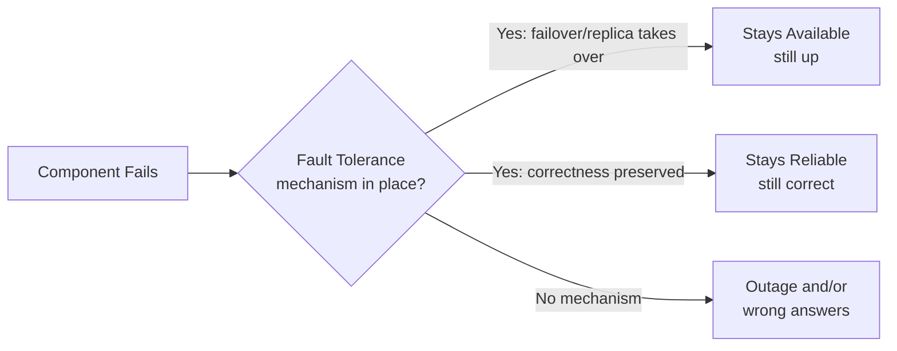

---

### Technique 1: Replication

Maintain multiple copies of data and services so failures can be masked transparently.

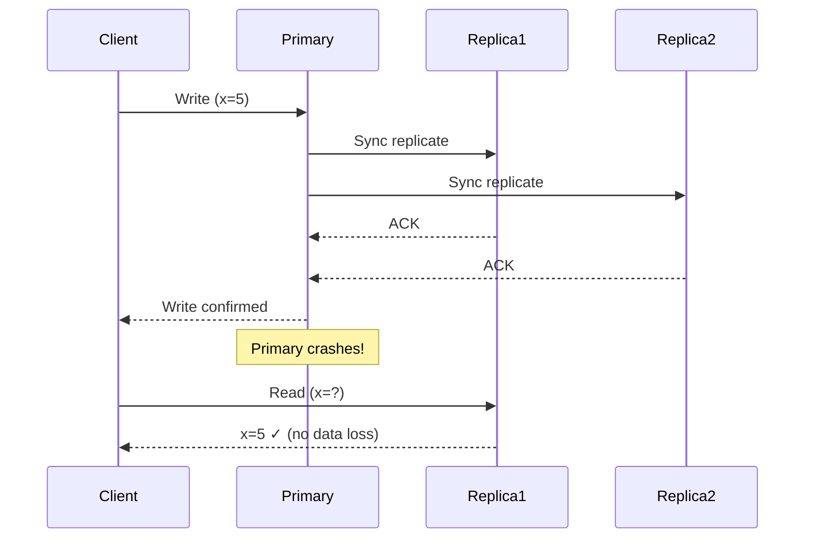

**Sync vs Async Replication**:

|                        | Synchronous                              | Asynchronous                                        |
| ---------------------- | ---------------------------------------- | --------------------------------------------------- |
| **When**         | Wait for all replicas to ACK             | Return to client; replicate in background           |
| **Consistency**  | Strong (no data loss on failure)         | Eventual (possible stale reads, data loss on crash) |
| **Latency**      | Higher (wait for slowest replica)        | Lower                                               |
| **Availability** | Lower (if replica is slow, write stalls) | Higher                                              |
| **Use when**     | Payments, financial records              | Social feeds, non-critical data                     |

**CAP Theorem connection**: Under network partition, you must choose Consistency (sync) or Availability (async). You can't have both.

---

### Technique 2: Checkpointing

Save the system's computational state at intervals so you can resume from the last checkpoint instead of restarting from scratch.

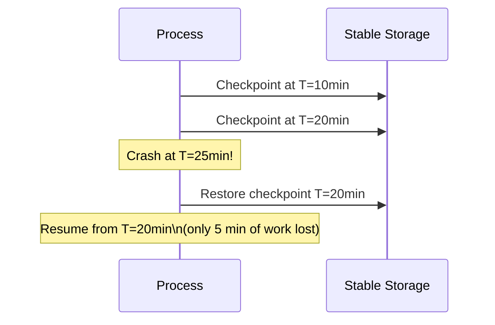

**Consistent checkpoint**: No in-flight messages between processes when snapshot is taken. Safe to restore.

**Inconsistent checkpoint**: Messages in-flight during snapshot. Restoring leads to duplicate or lost messages — data corruption.

**Examples**:

- Spark streaming jobs checkpoint progress to HDFS/S3
- Video encoding jobs checkpoint at frame intervals
- Database WAL (Write-Ahead Log) is a form of continuous checkpointing

---

### Hot / Warm / Cold Standby

| Type                   | Description                                                      | RTO        | Cost                  |
| ---------------------- | ---------------------------------------------------------------- | ---------- | --------------------- |
| **Hot Standby**  | Fully running replica, takes over instantly                      | Seconds    | High (full duplicate) |
| **Warm Standby** | Replica running but not serving traffic; needs ~1min to activate | Minutes    | Medium                |
| **Cold Standby** | Replica not running; must be started and provisioned             | 10min–1hr | Low                   |

> **Interview tip**: RTO (Recovery Time Objective) = max acceptable downtime. RPO (Recovery Point Objective) = max acceptable data loss. Hot standby minimizes both; cold standby has the worst RTO.

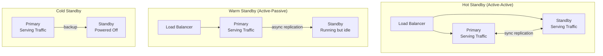

---

### Additional Fault Tolerance Techniques

#### Bulkhead Pattern

Isolate components into failure pools (as described in Reliability section). If the payment pod pool is exhausted, recommendation pod pool is unaffected.

**Trade-off**: You're reserving capacity per pool up front, so healthy pools carry idle, unused headroom most of the time — isolation costs money.

#### Rate Limiting

Protect services from being overwhelmed (intentional or not). If a client sends too many requests, drop or queue the excess — the service stays healthy for others.

#### Idempotency for Safe Retries

Retrying after a timeout won't cause duplicate side effects (charge twice, send two emails) if operations are idempotent.

#### Chaos Engineering

Proactively inject failures in production to find weaknesses before they happen organically.

- **Netflix Chaos Monkey**: randomly kills production VMs
- **Game Days**: simulate a datacenter outage; test team response
- **Chaos Mesh** (open source): Kubernetes-native fault injection

---

### Real-World Examples

- **Cassandra**: Multi-datacenter replication with tunable consistency (`ONE`, `QUORUM`, `ALL`). A full datacenter failure doesn't lose any data if you use `QUORUM` writes — the system is fault-tolerant by design.
- **Kafka**: Each topic partition has a configurable replication factor (typically 3). If one broker dies, another broker in the ISR (in-sync replicas) becomes leader with no data loss.
- **Google Spanner**: Synchronous replication across 3+ datacenters within a region using Paxos. Can survive the loss of a full datacenter with zero data loss and near-zero downtime.
- **AWS RDS Multi-AZ**: Synchronous standby replica in a different availability zone. Automatic failover in ~60-120 seconds on primary failure.

---

### How to Identify in an Interview

Listen for:

- "What happens if a node/server/datacenter goes down?"
- "We can't afford to lose any data"
- "The system must continue operating during partial failures"
- "How do you handle network partitions?"

**Your response trigger**: Describe replication strategy (sync vs async), standby type (hot/warm/cold), CAP theorem choice, and whether you use checkpointing.

---

### Fault Tolerance Interview Cheat-Sheet

- State RTO and RPO targets first: "We need RTO <30s and RPO = 0 (zero data loss)."
- No single point of failure: every stateful component needs replication.
- Sync replication = no data loss but higher latency; async = lower latency but possible data loss.
- Hot standby for critical paths; warm/cold for cost-sensitive non-critical components.
- Mention CAP theorem: under partition, you choose C or A.
- Chaos engineering = proactive fault tolerance; mention Netflix Chaos Monkey or Game Days.
- Checkpointing for long-running jobs (Spark, batch processing) — saves re-computation.

---

## 6. Relationships & Trade-offs

### How They Relate

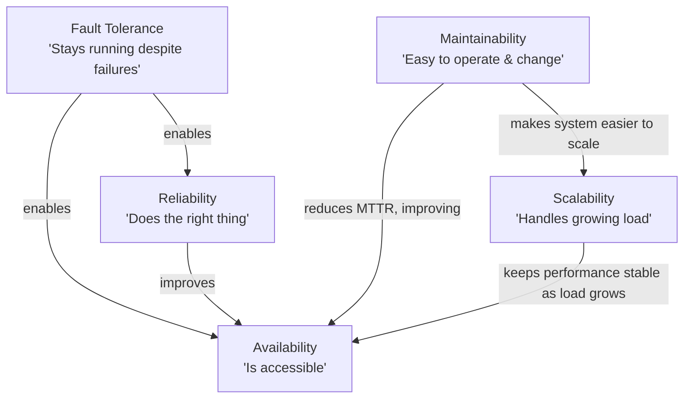

**Key insight**: Fault Tolerance and Reliability are the *foundation*. Availability is the *outcome*. Scalability and Maintainability are about *sustaining* that outcome over time and load.

---

### Comparison Matrix

| Property        | Metric                   | Achieved By                            | Trade-off                           |
| --------------- | ------------------------ | -------------------------------------- | ----------------------------------- |
| Availability    | % uptime, nines          | Redundancy, failover                   | Cost (more hardware), complexity    |
| Reliability     | MTBF, error rate         | Retries, circuit breakers, idempotency | Added latency (retries), complexity |
| Scalability     | Throughput at Pn latency | Horizontal scaling, caching, sharding  | Complexity (distributed state)      |
| Maintainability | MTTR                     | Observability, modular design          | Initial investment                  |
| Fault Tolerance | RTO, RPO                 | Replication, checkpointing             | Cost, latency (sync replication)    |
| 🆕 Durability       | Nines of durability     | Replication across disks/AZs, checksums, erasure coding | Storage cost, write latency (extra copies) |

> **🆕 Durability's place in this table**: it sits next to Fault Tolerance as a foundation, but protects a different thing. Fault tolerance keeps the *service* running through a live failure; durability guarantees the *data* survives even if the service itself is down for a while. A system can lose availability without losing durability — S3 being briefly unreachable doesn't mean any object was deleted.

---

### CAP Theorem Quick Recap

In a distributed system under network **partition** (P), you must choose:

- **CP** (Consistency + Partition tolerance): Every read sees the most recent write or an error. Availability may suffer during partition. *Examples: Zookeeper, HBase, Spanner.*
- **AP** (Availability + Partition tolerance): System stays available during partition but may return stale data. *Examples: Cassandra, DynamoDB, CouchDB.*

> CA (Consistency + Availability, no Partition tolerance) = only possible if you're running on a single non-distributed node. Not realistic for large-scale systems.

**Interview application**: When asked about database choice, state your CAP choice explicitly. "For this payment service, I need CP — I'll use PostgreSQL with synchronous replication and accept slightly lower write availability." vs "For this social feed, AP is fine — Cassandra with eventual consistency."

---

### Common Interview Trade-off Questions

| Question                              | Key Trade-off                                                        |
| ------------------------------------- | -------------------------------------------------------------------- |
| "How do you achieve 5 nines?"         | Cost vs availability: hot standbys, geo-redundancy are expensive     |
| "Sync vs async replication?"          | Consistency vs latency/availability                                  |
| "Add more microservices vs monolith?" | Scalability/maintainability vs operational complexity                |
| "Cache everything vs real-time?"      | Performance vs consistency / freshness                               |
| "Retry on failure?"                   | Reliability vs risk of duplicate side effects (idempotency required) |
| "Hot vs cold standby?"                | RTO/RPO vs cost                                                      |

---

## Golden Rules

Unconditional, durable principles — true regardless of which system you're designing. If you remember nothing else, remember these:

1. **Always state your SLO before designing anything.** Availability, cost, and complexity all flow from this one number.
2. **Every external call needs timeout + retry with backoff + circuit breaker.** No exceptions — a call with none of these is a future incident.
3. **Sync replication leans CP (consistent, higher latency, write availability can stall); async replication leans AP (available, lower latency, possible data loss).** Pick consciously, not by default.
4. **No single point of failure.** Every stateful or critical component needs a replica — this is the one idea redundancy, failover, and replication all reduce to.
5. **Available ≠ Reliable.** Up-and-wrong is still broken; a system that answers fast but incorrectly has failed just as hard as one that's down.
6. **Each additional nine costs roughly 10x more and buys roughly 10x less downtime.** Match the nines you target to what the business actually needs — don't over-build.
7. **Sequential dependencies multiply availability down; parallel/redundant paths multiply it up.** Count your hops before you trust your uptime number.
8. **Idempotency is mandatory wherever retries exist.** If a call can be retried, it must be safe to run twice.
9. **Bulkheads isolate failure domains — one slow dependency should never be able to starve every other request path.**
10. **State RTO and RPO before choosing a replication or standby strategy.** "Hot vs warm vs cold" is a cost conversation once you know the numbers you're targeting.
11. **🆕 Durability ≠ Availability.** Data can be perfectly safe on disk (durable) while the service in front of it is temporarily unreachable (unavailable) — don't let an outage make you claim you "lost data" when you only lost access to it.

---

## 7. Master Cheat Sheet (One-Page Summary)

### Formulas

```
Availability (%) = ((Total Time - Downtime) / Total Time) × 100
A_sequential    = A1 × A2 × A3 × ... × An
A_parallel      = 1 - (1-A1)(1-A2)...(1-An)
Availability    = MTBF / (MTBF + MTTR)
MTBF            = (Total Time - Total Downtime) / # Failures
MTTR            = Total Maintenance Time / # Repairs
```

### Nines Quick Reference

| Nines | %       | Downtime/Year |
| ----- | ------- | ------------- |
| 2     | 99%     | 3.65 days     |
| 3     | 99.9%   | 8.76 hours    |
| 4     | 99.99%  | 52.6 minutes  |
| 5     | 99.999% | 5.26 minutes  |

### Per-Property One-Liners

| Property                  | Say This in an Interview                                                                                                 |
| ------------------------- | ------------------------------------------------------------------------------------------------------------------------ |
| **Availability**    | "I'll target 4 nines by using active-active failover across 2 AZs and eliminating all SPOFs."                            |
| **Reliability**     | "Every service call has a timeout, retry with exponential backoff, and a circuit breaker to prevent cascading failures." |
| **Scalability**     | "Start with a back-of-envelope estimate, then design for horizontal scaling with sharding and a caching layer."          |
| **Maintainability** | "I'll instrument with logs, metrics, and traces from day one, and deploy via canary releases."                           |
| **Fault Tolerance** | "I'll use synchronous replication with a hot standby — RTO <30s, RPO = 0."                                              |
| 🆕 **Durability**       | "I'll replicate every write to at least 3 storage nodes across 2+ AZs before acknowledging — the object should never be lost even if we lose a disk or a zone." |

### Interview Flow: When They Say... You Think...

| Interviewer Says                        | You Think                                                      |
| --------------------------------------- | -------------------------------------------------------------- |
| "Must be up 24/7"                       | Availability → nines, redundancy, failover                    |
| "Can't lose data / transactions"        | Reliability + Fault Tolerance → sync replication, idempotency |
| "Will grow to millions of users"        | Scalability → horizontal scaling, caching, sharding           |
| "Easy to debug and deploy"              | Maintainability → observability, canary deploys               |
| "What if a server crashes?"             | Fault Tolerance → replication, checkpointing, hot standby     |
| "What if a whole datacenter goes down?" | Availability + FT → geo-redundancy, multi-AZ, active-active   |
| 🆕 "This data must never be lost, even in 10 years" | Durability → multi-AZ/multi-disk replication, checksums, nines of durability |
| 🆕 "We promised customers X% uptime in the contract" | SLA (external) vs SLO (your tighter internal target) vs SLI (what you actually measured) |
| 🆕 "How do you handle a sudden spike vs steady heavy load?" | Throughput (requests/sec you can sustain) vs Latency (how slow each request gets under that load) — name which one you're protecting |

### FAANG-Level Depth Signals (What Makes You Stand Out)

- Quantify everything: "99.99% availability = 52 min/year budget; I'll allocate 20 min to planned maintenance."
- State trade-offs explicitly: "Sync replication costs ~2ms latency; for payments, that's acceptable."
- Reference real systems: "Like Cassandra's tunable consistency, I'd let operators choose QUORUM vs ONE."
- Mention operational concerns: "I'd add distributed tracing so oncall can find the slow microservice in <2 minutes."
- Bring up error budgets: "If we burn our error budget early in the month, we freeze non-critical deploys."
- Chaos engineering: "I'd run quarterly Game Days to validate our failover procedures actually work."

---

*Guide covers content from Grokking Modern System Design — extended with FAANG-level depth, real examples, and interview strategies.*
