# Design a Code Deployment System — FAANG Interview Guide

> **Enhancement notes:** this pass added — (1) two full end-to-end `sequenceDiagram`s in a new
> "🆕 7.2 End-to-end walkthroughs" subsection tracing a complete happy-path deploy (PR merge →
> build → registry → canary → full rollout → done) and a complete bad-deploy-triggers-rollback
> trace through every major component, since the existing diagrams (Sections 10, 12) were partial,
> mechanism-level flows rather than full user-journey traces; (2) a "🆕 Worked example: does this
> trigger a rollback?" subsection in §9 with concrete error-rate numbers, sample sizes, a
> standard-error calculation, and a metric-level pass/fail table run against the canary-score
> thresholds; (3) a "🆕 Worked example: ramping across a 10,000-host fleet" in §10 that maps the
> 1%→10%→50%→100% ramp from the §6 API example onto actual host counts and bake-window timing,
> and shows it sums to exactly the ~45-minute average rollout duration from §5 — a consistency
> check the original draft left implicit; (4) two "🆕 memory hook" recall tables — "which rollout
> strategy, when" (§8) and "what triggers an automatic rollback" (§11.3) — as if/then lookups for
> the two hardest-to-recall decision points; (5) a "🆕 Named incident: Knight Capital (2012)" case
> study in §16 giving root-cause framing for a real, on-topic deployment failure (a partial rollout
> that left dead flag-gated code live on one of eight servers), matching the incident-case-study
> depth of the Spectacular Failures chapter. Everything else — requirements, capacity estimation,
> API design, the existing architecture-evolution subsection, and all other deep dives — was
> already strong and is untouched.

> Source chapter type: infrastructure/platform system. Inspired by educative's "Introduction to Code Deployment System," expanded with real progressive-delivery and rollback mechanics for FAANG-depth interviews.

## 1. Mental model

A code deployment system is **three coupled problems wearing one "Deploy" button**:

1. **A supply chain for binaries** — build once, store the artifact immutably, then *promote* the exact same bytes through dev → staging → prod. Never rebuild per environment; a rebuild is a different binary, and "it worked in staging" stops meaning anything.
2. **A blast-radius controller** — never let a bad change touch 100% of traffic before you've seen it touch 1%. This is the actual product: not "ship code," but "ship code while bounding how much can break at once."
3. **A feedback-and-rollback loop** — a rollout is not "done" the instant the last host gets the new binary; it's done when metrics have *confirmed* the new binary is healthy, and if they don't, the system undoes itself faster than a human can page anyone.

Everything else — config pushes, feature flags, database migrations, secrets, multi-region ordering — is glue that has to respect all three constraints simultaneously. If you keep this triad in your head, you can reconstruct almost the entire design from scratch under pressure.

**Analogy**: think of it as **a pharmaceutical rollout** — a drug (the binary) is manufactured once in a controlled batch (the build), given to a small trial group first (canary), monitored continuously for adverse reactions (metrics/SLOs), and pulled immediately if a signal appears (automated rollback) — never mass-distributed on day one. Speed is not the primary virtue here; *controlled, observable, reversible* speed is.

**Say this out loud early**: "The hard part of this system isn't getting a binary onto a host — `scp` can do that. The hard part is deciding, automatically and fast, whether that binary is *safe*, and undoing it if it isn't." That framing is what separates this answer from "I'd write a bash script that SSHes into every box."

---

## 2. Interview playbook

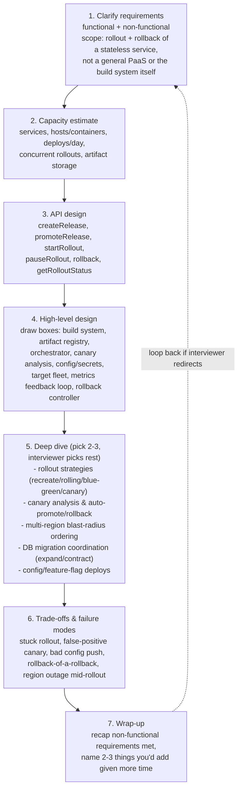

**Cheat-sheet for this section**
- State your scope cut up front: "I'll design the rollout/rollback control plane for a stateless service across a fleet of hosts; I'll treat the CI build step and the artifact-scanning/security pipeline as inputs I receive, not things I design from scratch, unless you want depth there."
- Budget your 45 minutes: ~5 min requirements, ~5 min capacity, ~5 min API, ~10 min HLD, ~15 min deep dive, ~5 min trade-offs/wrap-up.
- The single sentence that anchors the whole interview: "Safety is the product; speed is the constraint we optimize *under*, not instead of."
- If the interviewer says "let's go deeper on X," drop your own agenda and follow it — that's the steering wheel.
- Always end a deep dive with the trade-off you accepted, not just the mechanism.

---

## 3. How to identify this topic in an interview

You're being asked to "design a deployment system" (or a close variant) when you hear:

- "Design the system that **safely rolls out new binaries** to a fleet of thousands of hosts."
- "Design a **CI/CD pipeline** / release-management platform" for a large engineering org.
- "How would you build **canary releases**, or **progressive delivery**, at scale?"
- "Design a system that can **automatically roll back** a bad deploy."
- Any prompt mentioning **blast radius, staged rollout, feature flags, or SLO-based rollback**.

Distinguish from adjacent problems:
- **CI build system (Jenkins/Buildkite-style)** = compiles code and produces an artifact — an *input* to this system, not the system itself. Say so and move on if the interviewer drifts there.
- **Kubernetes itself** = a scheduler/orchestrator that *can* run rolling updates natively, but this interview is usually one level up: the release-management layer that decides *what* version to roll out, *how fast*, and *whether to continue*, often sitting on top of Kubernetes/Argo/Spinnaker rather than replacing them.
- **Feature-flagging platform (LaunchDarkly-style)** = a real, related, but distinct sub-system — it controls *behavior* toggles at runtime without a binary change, whereas a deployment system controls *which binary* is running. They compose (Section 12), they aren't the same thing.
- **Infrastructure-as-code / provisioning (Terraform-style)** = creates/destroys the hosts and cloud resources this system deploys *onto* — a dependency, not the topic.

---

## 4. Requirements clarification

### Functional requirements

| # | Requirement | Notes to say out loud |
|---|---|---|
| 1 | Build → artifact → registry | Every commit that passes CI produces one immutable, addressable artifact (container image, binary + version) |
| 2 | Promote a release across environments | The *same* artifact moves dev → staging → prod; never rebuilt per environment |
| 3 | Start a rollout with a chosen strategy | Recreate / rolling / blue-green / canary — pick per service risk profile |
| 4 | Progressive, blast-radius-limited rollout | 1% → 10% → 50% → 100%, with a bake/soak period at each stage |
| 5 | Canary analysis | Continuously compare canary-cohort metrics against a baseline cohort; decide promote/hold/rollback |
| 6 | Automated rollback | Triggered by SLO/error-rate regression, not just a human noticing a dashboard |
| 7 | Manual controls | Pause, resume, abort, and a human-initiated rollback must always be available alongside automation |
| 8 | Multi-region/multi-cell rollout ordering | Canary region/cell first, then widen — never all regions simultaneously |
| 9 | Config and secrets deployment | Config-as-code and secrets rotate through the same safety machinery as binaries, on their own cadence |
| 10 | Database migration coordination | Schema changes ride alongside a rolling binary deploy without requiring both to be atomic together |
| 11 | Audit history of every deploy | Who/what/when/why for every release, promotion, rollout, and rollback — queryable later |
| 12 | Approval gates for production | A prod rollout can require one or more human approvals before it starts or before it widens |

**Explicitly out of scope unless asked**: the CI build/compile system itself, container image vulnerability scanning internals, infrastructure provisioning (Terraform-style), a full GitOps reconciliation engine, chaos-engineering tooling. Say this out loud — it shows scoping discipline, exactly like naming "ride pooling" out of scope in an Uber design.

### Non-functional requirements

| Requirement | Why it matters here | Design lever |
|---|---|---|
| **Safety over speed** | A fast rollout that ships an outage is a net negative; a slow rollout that never breaks anything is boring but correct | Progressive rollout + automated rollback as the default, not an opt-in |
| **Blast-radius control** | One bad binary should never be able to reach 100% of traffic before *something* notices | Percentage/cell-based staged rollout, canary-region-first ordering |
| **Auditability** | "Who deployed what, when, and why" must be answerable months later — compliance, incident postmortems | Immutable, append-only release/rollout event log |
| **Low deploy latency at scale** | Thousands of services, elite orgs deploy on-demand multiple times/day per service (DORA elite tier) — the pipeline can't be the bottleneck | Parallelizable per-service rollouts, artifact promotion instead of rebuild |
| **Idempotency & determinism** | Retrying a failed deploy step must never double-apply it | Idempotency keys on every orchestration command, versioned rollout state machine |
| **High availability of the control plane itself** | If the deployment system is down, you can't roll back a bad deploy that's actively hurting users — the *worst* possible moment for it to be unavailable | Leader-elected, stateless orchestrator workers, durable state store (Section 17) |
| **Strong consistency for rollout state** | Two operators (or the automation and a human) must never race to advance the same rollout inconsistently | Single-writer/CAS on rollout state, like Uber's driver-state guard |

**Key interview move — separate "the binary's correctness" from "the rollout's safety."** Say explicitly: "This system doesn't test whether the code is *correct* — that's CI's job. It tests whether the code is *safe to keep exposing to more traffic*, continuously, using production signals." This one sentence signals you understand the boundary between testing and progressive delivery.

**Clarifying questions to ask the interviewer**
- Scope: one service's rollout, or the platform used by an entire org's thousands of services?
- Kubernetes-native (build on Deployments/Argo Rollouts) or bare-metal/VM fleet (build your own agent-based rollout)?
- Is database/schema migration coordination in scope, or a stated dependency?
- Do we need multi-region ordering, or is this single-region for now?
- What's an acceptable automated-rollback false-positive rate — i.e., how paranoid should the canary judge be?

**Cheat-sheet for this section**
- Lead with "safety is the product" — it reframes every later trade-off in your favor.
- Split functional (what it does) from non-functional (how good it must be) exactly like every other chapter — interviewers are scanning for this structure.
- Auditability is easy to forget and cheap to mention — say it before being asked.
- State the boundary with CI/testing explicitly: this system decides *rollout* safety, not *code* correctness.

---

## 5. Capacity estimation (worked example)

Assume a large engineering org (Google/Meta/Amazon-scale), numbers rounded for speed:

```
Services in the org                : 5,000
Total hosts/containers across fleet: 2,000,000  (2M)
Avg containers per service          : 2,000,000 / 5,000 = 400
Deploys per service per day (elite DORA tier: on-demand, multiple/day): 3
Total deploys/day across the org    : 5,000 x 3 = 15,000
Avg rollout duration (canary + bake stages, end-to-end)  : ~45 minutes
Health-probe interval (readiness + liveness)              : every 10s per container
Unique new build artifacts/day (fewer than deploys — same artifact promotes through envs): 3,000
Avg compressed artifact size (container image)            : 500 MB
```

### 5.1 The number that actually shapes the architecture

```
Deploy-command QPS (avg) = 15,000 deploys / 86,400 s ≈ 0.17 QPS   ← tiny, never the bottleneck

Health-check probe QPS = 2,000,000 containers x 2 probes (readiness+liveness) / 10 s
                        ≈ 400,000 probes/sec   ← THE big number, say it out loud

Canary-analysis metric-query volume: ~5 stage transitions/rollout x ~15 metrics compared per
  transition = 75 analysis queries/rollout. 15,000 deploys/day x 75 ≈ 1,125,000 queries/day
  ≈ 13 QPS avg, bursty around stage-transition moments (not steady like health probes)
```

**Takeaway to say in the room**: "Issuing a deploy command is almost free — 0.17/sec. The system's real, continuous load is the ~400K/sec health-check firehose it must ingest and evaluate to know whether *any* of those 15,000 daily rollouts should keep advancing. This is the same shape of insight as Uber's location-ping firehose dwarfing ride requests — the marquee action (deploy) is not the load-bearing number (health signal ingestion)."

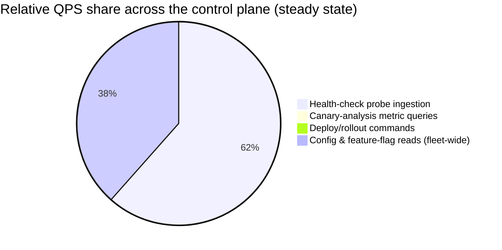

Config/flag reads land in the same order of magnitude as health probes because every container evaluates its feature-flag/config state on a similar cadence — another reason Section 13 treats config delivery as its own scalable read path, not an afterthought bolted onto the binary rollout.

### 5.2 Concurrency — how many rollouts are in flight at once

```
Deploys/hour (spread over a 16h working window, not uniformly)  ≈ 15,000 / 16 ≈ 940/hour
Avg rollout wall-clock duration                                  ≈ 45 min (0.75 h)
Concurrent in-flight rollouts ≈ 940/hour x 0.75h ≈ 705  → round to ~700-1,000 concurrent rollouts
```

**Say this explicitly**: 700-1,000 concurrent, independent state machines is the concurrency the orchestrator's data layer must support — this is why Section 17 insists on per-rollout sharded state, never a single global lock.

### 5.3 Artifact registry storage

```
New unique builds/day        : 3,000
Avg compressed image size    : 500 MB
Raw new bytes/day            : 3,000 x 500 MB = 1.5 TB/day
Layer de-duplication (base-image layers shared across builds, ~55-65% typical)  ≈ 40% net-new
Net new registry storage/day ≈ 1.5 TB x 0.4 ≈ 600 GB/day

Annual (raw, single copy)    ≈ 600 GB x 365 ≈ 219 TB/year
With a retention policy (last 90 days of every branch's images + all tagged
release images kept indefinitely for audit/rollback) — NOT “keep everything forever”:
  hot tier (90 days): 600 GB x 90 ≈ 54 TB
  cold/tagged-release archive (blob storage, cheap, indefinite): grows slowly,
  since only ~15,000 deploys/day worth of *tagged* releases persist, not every CI build
```

Exactly like Uber's breadcrumb-TTL trade-off: naming a retention policy explicitly (hot 90-day tier + a cheap cold archive for anything ever actually promoted to prod) is the depth signal — "keep it all forever in the hot registry" is the naive answer to reject out loud.

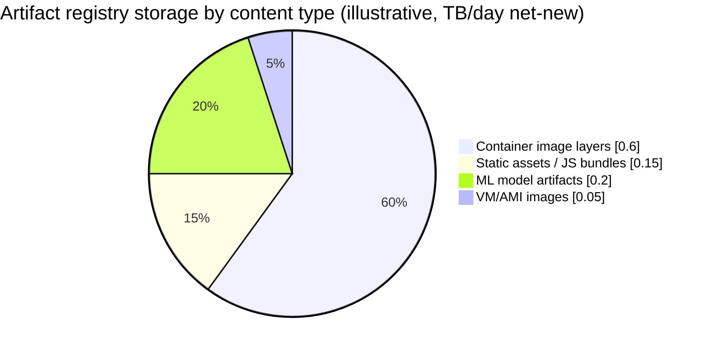

### 5.4 Servers for the control plane

| Component | Peak load | Est. capacity/server | Servers (w/ 2x redundancy) |
|---|---|---|---|
| Health-check ingestion tier | 400,000 probes/sec | ~5,000/server | ~160 |
| Rollout orchestrator workers (state machine ticks) | ~1,000 concurrent rollouts, ticking every few seconds | ~200 active rollouts/worker | ~10 |
| Canary-analysis service | ~13 QPS avg, bursty to ~10x at stage transitions | ~50 analyses/sec/server (CPU-heavy stats) | ~4-6 |
| Artifact registry (read-heavy: every host pulls on deploy) | Bursty, thousands of pulls per rollout wave | CDN/blob-storage-backed, not a bespoke bottleneck | Fronted by existing object storage + CDN |
| Config/feature-flag read path | ~250,000 reads/sec fleet-wide | ~10,000/server (cached, in-memory) | ~25 |

**Cheat-sheet for this section**
- Lead with QPS, not deploy counts — 0.17 deploys/sec is a rounding error; 400K health-probes/sec is the architecture-shaping number.
- Concurrency (how many rollouts are simultaneously in-flight) matters as much as raw QPS here — say the ~700-1,000 number, it justifies sharded/per-rollout state in Section 17.
- Name a registry retention policy explicitly — hot tier + cold archive for tagged releases, not "store everything forever."
- If the interviewer changes an input (say, "assume 50,000 services, not 5,000"), redo the chain live: health-probe QPS and concurrent-rollout count both scale linearly with fleet size — proving you understand the formula, not a memorized answer, exactly like Uber's Section 5.7 move.

### 5.5 Redone example — what if the interviewer changes the inputs?

Interviewers routinely swap an assumption mid-conversation to check you understand the *model*, not a memorized answer. Suppose the interviewer stops you: *"Let's scope this to one product line, not the whole org — 500 services, 200,000 containers, and let's say this team deploys more aggressively: 6 times per service per day."*

Redo the chain live, same formulas, new numbers:

```
Total deploys/day = 500 x 6 = 3,000
Deploy-command QPS (avg) = 3,000 / 86,400 ≈ 0.035 QPS  ← still trivial, as expected

Health-check probe QPS = 200,000 containers x 2 probes / 10s = 40,000 probes/sec
  ← exactly 1/10th of the 400,000/sec global estimate, because container count dropped 1/10th
  while probe cadence stayed fixed — say this out loud, it proves the formula still holds

Concurrent rollouts ≈ (3,000/16h) x 0.75h ≈ 140 concurrent rollouts
  ← notice deploys/day dropped 5x (15,000 -> 3,000) but concurrency only dropped ~5x too
  (705 -> 140), because rollout duration didn't change — a linear relationship, not a coincidence
```

**The move that matters**: don't panic when the interviewer shrinks the scope — re-derive from the same formulas out loud. A 10x smaller fleet with a higher per-service deploy frequency still nets a proportionally smaller, not qualitatively different, set of numbers. That's the signal you understood the *model* and not just the headline "400K/sec" line.

---

## 6. API design

| API | Signature | Purpose |
|---|---|---|
| Create a release | `createRelease(serviceId, artifactId, commitSha, version)` → `releaseId` | Registers an immutable, promotable release record from a built artifact |
| Promote a release | `promoteRelease(releaseId, fromEnv, toEnv)` → `promotionId` | Moves the *same* artifact to the next environment; never rebuilds |
| Start a rollout | `startRollout(releaseId, targetEnv, strategy, config)` → `rolloutId` | Kicks off recreate/rolling/blue-green/canary against a target environment |
| Get rollout status | `getRolloutStatus(rolloutId)` → status, currentStage, metrics snapshot | Polls or streams current stage, health, and canary-judge verdict |
| Pause a rollout | `pauseRollout(rolloutId)` | Freezes progression at the current stage without rolling back |
| Resume a rollout | `resumeRollout(rolloutId)` | Continues progression from where it was paused |
| Approve a rollout stage | `approveRollout(rolloutId, approverId, stage)` | Satisfies a human approval gate before prod or before widening (Section 18) |
| Roll back | `rollback(rolloutId, toVersion?)` → `rollbackId` | Reverts to the last-known-good version (or an explicit `toVersion`); always available, automated or manual |
| Abort a rollout | `abortRollout(rolloutId, reason)` | Hard-stops and triggers rollback in one call |
| Get release history | `getReleaseHistory(serviceId)` → paginated list | Full audit trail: releases, promotions, rollouts, rollbacks, approvers |

### Example — `startRollout` request/response

```json
// Request
POST /rollouts
{
  "releaseId": "rel_8f2a9c",
  "targetEnv": "prod-us-east",
  "strategy": "canary",
  "config": {
    "steps": [
      { "setWeight": 1,  "bakeMinutes": 10 },
      { "setWeight": 10, "bakeMinutes": 15 },
      { "setWeight": 50, "bakeMinutes": 20 },
      { "setWeight": 100 }
    ],
    "analysisTemplate": "default-slo-judge",
    "requireApprovalAtStage": [50]
  },
  "idempotencyKey": "req-2026-07-23-a1b2"
}

// Response
{
  "rolloutId": "rol_44d1e7",
  "status": "IN_PROGRESS",
  "currentStage": 0,
  "currentWeight": 1,
  "startedAt": "2026-07-23T14:02:11Z"
}
```

### Example — `rollback` request/response

```json
// Request
POST /rollouts/rol_44d1e7/rollback
{
  "reason": "canary-judge: error-rate burn-rate breach at 6h window",
  "initiator": "automated-rollback-controller",
  "idempotencyKey": "rb-2026-07-23-c9d0"
}

// Response
{
  "rollbackId": "rbk_20a3f4",
  "rolloutId": "rol_44d1e7",
  "revertedToVersion": "v2026.07.20-3",
  "status": "ROLLBACK_IN_PROGRESS",
  "completedStages": ["drain-canary-weight", "restore-baseline-weight"]
}
```

**Why `idempotencyKey` is on every mutating call**: a retried `startRollout` or `rollback` (client timeout, network blip, an operator double-clicking) must never start a second, conflicting rollout for the same service — the same exactly-once discipline Uber's payment ledger uses for charges (Section 13 there), applied here to orchestration commands instead of money.

**Cheat-sheet for this section**
- `getRolloutStatus` is the one endpoint every other component polls or subscribes to — mention that it should support both poll and a streaming/webhook mode for dashboards and chatops bots.
- `pauseRollout`/`resumeRollout` are distinct from `rollback` — pausing holds steady, rollback actively reverts. Interviewers probe this distinction.
- Approval gates are parameterized *per stage*, not a single global on/off — a common follow-up is "what if only the jump to 50% needs a human, not the 1% canary."
- Every mutating endpoint takes an idempotency key — say this unprompted, it's the same discipline as Uber's payment charges.

---

## 7. High-level architecture

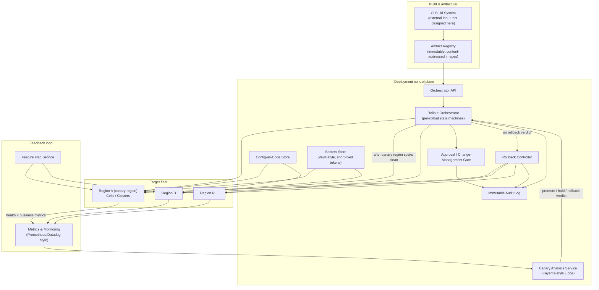

| Component | Job | Why this choice |
|---|---|---|
| Artifact registry | Store immutable, content-addressed build outputs | Same bytes promoted everywhere — rebuilding per environment invalidates every test that ran on the earlier build |
| Rollout orchestrator | Owns the per-rollout state machine (Section 15): stage, weight, status | One durable, versioned state machine per rollout — never a single global "current deploy" variable |
| Canary analysis service | Continuously compares canary vs. baseline metrics, emits promote/hold/rollback verdicts | Decouples "is this healthy" from "who executes the next step" — mirrors Kayenta sitting beside Spinnaker, not inside it |
| Rollback controller | Executes the actual revert (shift traffic/weight back, redeploy last-known-good) | A rollback is a first-class, tested code path — not "run the deploy in reverse" |
| Config-as-code store | Versioned, promotable configuration, separate from binaries | Config changes far more often than code; coupling them to a binary release would slow both down |
| Secrets store | Issues short-lived, scoped credentials to running workloads | Static, long-lived secrets in a binary or a CI log are a standing breach waiting to happen |
| Feature flag service | Runtime behavior toggles independent of binary version | Lets you decouple *deploy* (bytes on disk) from *release* (behavior visible to users) — Section 13 |
| Approval/change-management gate | Enforces human sign-off at configured stages | Prod-impacting stages need an accountable approver, not just a passing canary score |
| Audit log | Immutable, append-only record of every release/promotion/rollout/rollback | "Who deployed what, when, why" must be answerable months later, not just during the incident |
| Metrics & monitoring | Ingests health checks + business/SLO metrics from the fleet | The literal fuel for the canary judge and the automated-rollback trigger |

**Cheat-sheet for this section**
- Draw the control plane as a visually separate tier from the fleet it manages — the same discipline as separating Uber's AP real-time tier from its CP trip/payment tier.
- The canary analysis service is deliberately a *separate* component from the orchestrator — it answers "is this healthy," the orchestrator answers "what do we do next." Conflating them is a common candidate mistake.
- Config and secrets flow to the fleet on their own paths, parallel to the binary rollout, not serialized behind it (Section 13).
- Everything writes to one immutable audit log — mention it as a cross-cutting concern, not a bolt-on.

### 7.1 Architecture evolution — from a naive script to the final design

Walking an interviewer through *how* you'd arrive at Section 7's architecture — rather than presenting it fully-formed — is often the most memorable part of the interview. Show what breaks at each stage and why that specific pain forces the next change.

**Stage 1 — naive: a deploy script that SSHes into every host:**

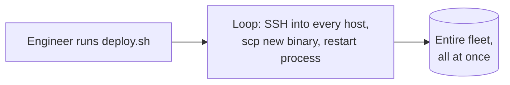

*What breaks:* every host gets the new binary simultaneously — this is the "recreate," 100%-blast-radius strategy from Section 8, except worse, because there's no readiness gate at all. A bad build takes down 100% of traffic instantly, with no automated way to know it happened short of a human watching a dashboard, and no automated way to undo it short of re-running the script with the old binary (if anyone kept it handy). This is the strawman to name and reject in one sentence, exactly like Uber's Stage 1 single-DB-and-polling monolith.

**Stage 2 — rolling update + health probes, single environment:**

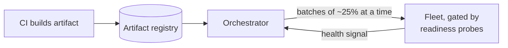

*What improved:* blast radius is now bounded by `maxUnavailable`/`maxSurge` instead of "everyone at once," and a broken new instance simply never becomes ready, so it never receives traffic. *What still breaks:* the gate is binary ("did the process start and pass a readiness check"), not comparative — a build that starts fine but silently regresses p99 latency or error rate sails straight through to 100%. There's also only one environment and one region; nothing stops a bad build from reaching every user everywhere in one pass.

**Stage 3 — canary analysis + multi-region wave ordering + decoupled config/flags (the final design):**

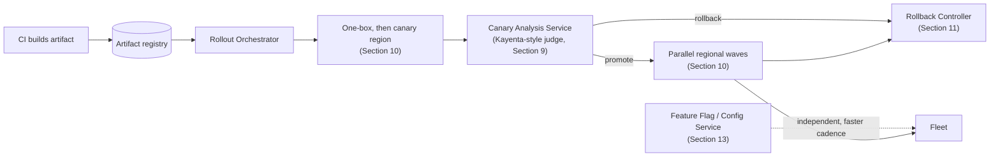

*What this buys:* the gate is now comparative and statistical (canary vs. baseline), not just "did it start"; blast radius is bounded on two axes (percentage within a region, and which regions go first); rollback is an automated, pre-tested path triggered by SLO burn, not a manual re-run of the deploy script; and config/flag changes ride a separate, faster lane instead of waiting behind the full binary pipeline. Every piece here answers a specific pain point from Stage 1 or 2 — none of it is complexity for its own sake.

**The narrative to say out loud**: "I'd start with the naive script, show it fails at the first bad build because there's no gate and no automated undo, add a rolling update with health probes, show that a *comparative* regression still slips through a binary gate, and then add canary analysis, multi-region wave ordering, and automated rollback to close that gap." This story is more convincing than presenting the final architecture cold — it proves the complexity is earned.

**Cheat-sheet for this section**
- Don't skip Stage 1 out of embarrassment — naming the naive script and its failure mode (no gate, no automated undo) IS the skill being tested.
- Each stage should name one concrete gap that breaks (100% blast radius; a binary, non-comparative gate) — vague "it doesn't scale" is not credible.
- Use this evolution as your opening gambit in the HLD section if the interviewer wants depth on *process*, not just the end state.

### 7.2 🆕 End-to-end walkthroughs: two full traces

Every diagram so far is a component or a single mechanism. Here are two full, concrete journeys through *every* major component in Section 7's architecture — the kind of trace an interviewer means by "walk me through what actually happens."

**Trace A — happy path: an engineer merges a PR and it reaches 100% of prod**

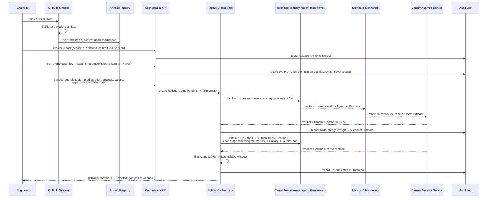

**Trace B — a bad deploy triggers automatic rollback**

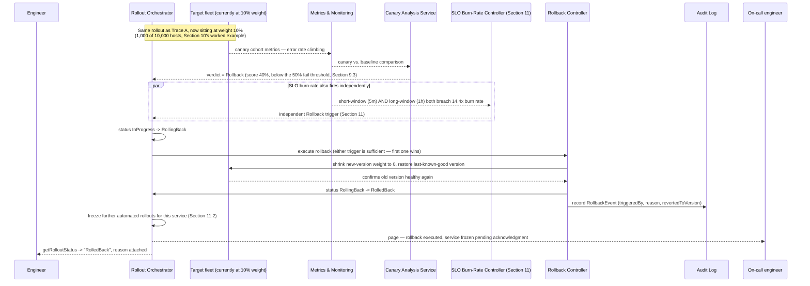

**Why both traces matter**: Trace A is the "everything went right" story every candidate can whiteboard; Trace B is the one interviewers actually grade hardest, because it's where two independent triggers (the canary judge and the SLO burn-rate controller) can both fire, either one is sufficient to act, and the system has to freeze itself afterward rather than blindly retry. If you can only draw one, draw B.

---

## 8. Deep dive: rollout strategies compared

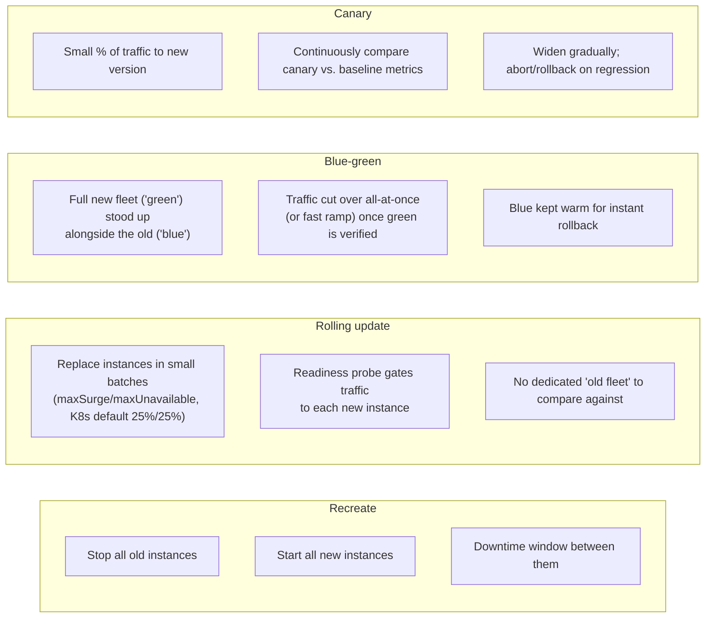

| Strategy | Blast radius on a bad build | Rollback speed | Infra cost during rollout | Best for |
|---|---|---|---|---|
| Recreate | 100% (everyone hits downtime, then everyone hits the new build) | Redeploy old version (slow) | None extra — 1x fleet | Batch jobs, dev/staging, anything tolerating downtime |
| Rolling update | Bounded by `maxUnavailable`/`maxSurge` (K8s defaults to 25%/25% of replicas) | Roll backward the same way — still gradual | Small surge (up to +25% instances mid-rollout) | Stateless services where a brief mixed-version fleet is safe |
| Blue-green | 100% once cut over (no gradual exposure) — but a bad cutover is instantly reversible | Fastest — flip traffic back to the still-warm old fleet | 2x fleet running simultaneously | Services needing instant, clean rollback and where a brief 2x cost is acceptable |
| Canary | As low as 1% of traffic, by design | Fast — shrink canary weight to 0, no need to "undo" 100% of traffic | Small canary fleet alongside full baseline fleet | Anything user-facing at scale where you want a live, statistically-compared health signal before widening |

**The trade-off to name explicitly**: rolling update bounds blast radius by *instance count*, not by *observed health* — it will happily roll every instance forward even if the new version is silently broken, as long as it passes its readiness probe. Canary is the only strategy in this table that gates progression on *comparative metrics*, not just "did the process start." This is why production-grade systems (Argo Rollouts, Spinnaker) layer canary analysis *on top of* a rolling or blue-green mechanic rather than treating rolling-update-with-a-readiness-probe as sufficient on its own.

**Kubernetes specifics worth naming**: a `Deployment`'s rolling update is driven by two knobs, `maxSurge` and `maxUnavailable` (each defaults to 25% of desired replicas), gated by **readiness probes** (control whether a pod receives traffic and whether the rollout can proceed) and **liveness probes** (control whether the kubelet restarts a pod) — these are separate mechanisms answering separate questions ("should this pod get traffic" vs. "is this pod alive at all").

### 🆕 Memory hook — which strategy, when

| If... | ...then use | Because |
|---|---|---|
| Downtime is tolerable and you want zero extra infra cost (batch job, dev/staging) | **Recreate** | Simplest possible mechanic; no mixed-version fleet to reason about |
| The service is stateless, a brief mixed old/new fleet is safe, and you just need bounded-by-instance-count blast radius | **Rolling update** | `maxSurge`/`maxUnavailable` + readiness probes are enough; no comparative health signal needed |
| The service needs an instant, guaranteed-clean rollback and 2x infra cost is acceptable | **Blue-green** | The old fleet stays warm — flipping traffic back is a cutover, not a redeploy |
| The service is user-facing at scale and you want a live, statistically-compared health signal before widening exposure | **Canary** | Only strategy here that gates on *comparative* metrics, not just "did the process start" |
| You want both an instant-cutover option *and* a statistical health gate | **Compose them** | Canary analysis riding on top of a rolling or blue-green traffic shift (Section 9) — real systems (Argo Rollouts, Spinnaker) do exactly this, it's not a fifth strategy |

**Cheat-sheet for this section**
- Always name all four strategies even if only asked about canary — shows you know the design space, exactly like Uber's push-vs-pull dispatch section.
- The one-line disambiguator: recreate/rolling bound blast radius by *what fraction of instances* are new; canary bounds it by *what fraction of traffic* is new and *whether that traffic looks healthy*.
- Readiness vs. liveness probes is a near-guaranteed Kubernetes-flavored follow-up — know both defaults (25%/25%) and both jobs (traffic gate vs. restart trigger) cold.
- Real systems compose these: canary analysis riding on top of a rolling or blue-green traffic shift, not a standalone fifth strategy.

---

## 9. Deep dive: canary analysis mechanics

This is the single most-tested sub-topic, the same weight OT-vs-CRDT carries in the Google Docs chapter. You must be able to explain *how the promote/hold/rollback decision actually gets computed*, not just say "compare metrics."

### 9.1 The mechanism

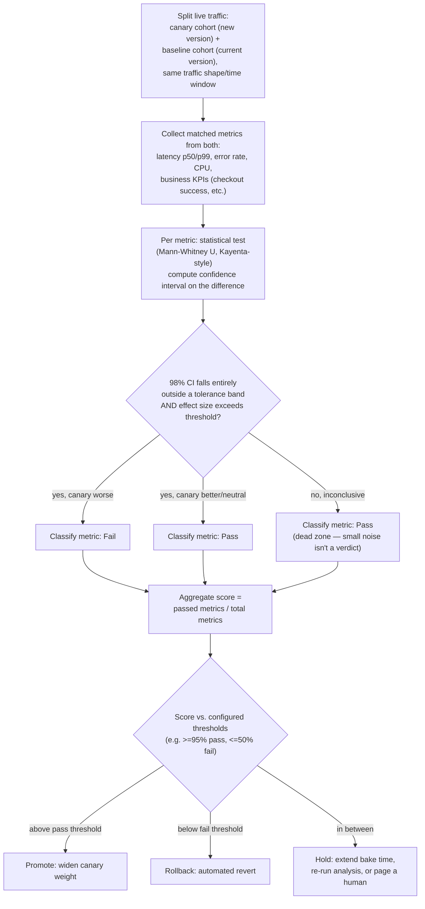

This is a direct description of **Kayenta**, Netflix's open-source automated canary analysis engine (built jointly with Google, used by Spinnaker): it runs a **Mann-Whitney U test** per metric to get a confidence interval on the canary-vs-baseline difference, applies a **tolerance band** (a "dead zone" around zero, sized relative to the Hodges-Lehmann estimate) so tiny noise never triggers a verdict, and only classifies a metric as a real regression when the confidence interval clears that band *and* the effect size passes a configured threshold. The final **canary score** is simply the fraction of metrics that passed — e.g., 9 of 10 metrics passing yields a 90% score.

### 9.2 The promote/hold/rollback state machine

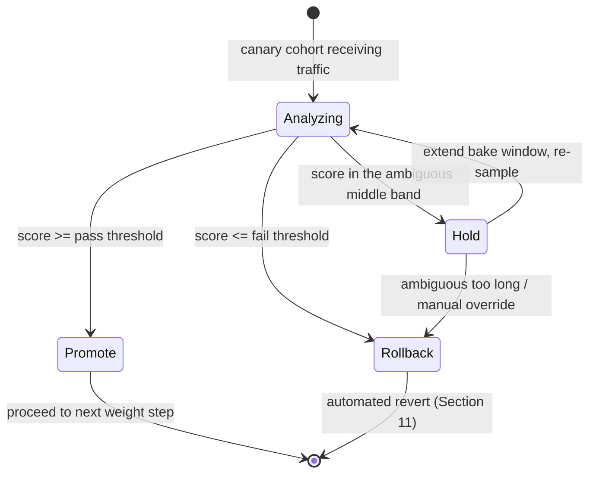

**Argo Rollouts' concrete pattern** (the Kubernetes-native version of the same idea): a `Rollout` steps through `setWeight: 20`, `pause: {duration: 10m}`, `setWeight: 40`, `pause: {duration: 10m}`, and so on up to 100%, with an `AnalysisTemplate` referenced at specific steps — if the analysis run fails, Argo Rollouts automatically aborts and rolls the canary back. The "pause with a bake duration, then re-analyze" loop in the diagram above is exactly this.

**Why a dead zone / tolerance band matters (say this unprompted)**: without one, pure noise in p99 latency — canaries almost always run on a smaller cohort, so they have higher sampling variance — would trip false-positive rollbacks constantly. The tolerance band is what makes automated rollback *usable* rather than a pager that never stops firing.

### 9.3 🆕 Worked example: does this trigger a rollback?

A two-proportion comparison (the intuition behind Kayenta's Mann-Whitney test, simplified to a back-of-envelope z-test you can actually do on a whiteboard) for one metric — **error rate** — during a 10% canary stage:

```
Baseline cohort: 50,000 requests, 200 errors -> error rate p_base = 0.40%
Canary cohort  :  5,000 requests,  23 errors -> error rate p_canary = 0.46%

Standard error of a proportion: SE = sqrt( p(1-p) / n )
SE_base   = sqrt(0.0040 x 0.9960 / 50,000) ≈ 0.028 percentage points
SE_canary = sqrt(0.0046 x 0.9954 /  5,000) ≈ 0.096 percentage points
Combined SE = sqrt(SE_base^2 + SE_canary^2) ≈ 0.10 percentage points

Observed difference = 0.46% - 0.40% = 0.06 percentage points
0.06 pp is well INSIDE 1 combined SE (0.10 pp) -> statistically indistinguishable from noise
Verdict for this metric: Pass (inside the tolerance band / dead zone)
```

Now the same calculation after a genuine regression (same canary cohort size — this is why cohort size matters, Section 9.2's cheat-sheet):

```
Canary cohort: 5,000 requests, 95 errors -> error rate p_canary = 1.90%
SE_canary = sqrt(0.019 x 0.981 / 5,000) ≈ 0.193 percentage points
Combined SE ≈ sqrt(0.028^2 + 0.193^2) ≈ 0.195 percentage points

Observed difference = 1.90% - 0.40% = 1.50 percentage points
1.50 pp is ~7.7 combined-SEs away from zero -> nowhere near the dead zone
Verdict for this metric: Fail
```

That single failing metric doesn't rollback by itself — it feeds the aggregate canary score (Section 9.1). Suppose this stage compares 15 metrics total and the error-rate regression is real enough to also drag down two correlated ones (p99 latency, checkout-success rate) plus six further downstream metrics that share the same failing dependency:

| Metrics compared | Passed | Failed | Score (passed/total) | Vs. thresholds (pass >=95%, fail <=50%) | Verdict |
|---|---|---|---|---|---|
| 15 | 6 | 9 | 40% | Below the 50% fail threshold | **Rollback** (Section 9.2) |

Contrast with the first scenario: if error rate alone had failed and the other 14 metrics passed, the score would be 14/15 ≈ 93% — below the 95% pass bar but above the 50% fail bar, landing in the **Hold** band (extend bake, re-sample) rather than an immediate rollback. This is the concrete mechanics behind "promote / hold / rollback are three outcomes, not two" from Section 9.2's cheat-sheet.

**Cheat-sheet for this section**
- Name Kayenta and the Mann-Whitney U test specifically — this is the "I've read the real engineering blog" signal, like DeepETA in the Uber chapter.
- Always describe three outcomes, not two: promote, rollback, *and* hold — the ambiguous middle is what real systems actually spend most of their time in, and naming it shows nuance.
- The dead-zone/tolerance-band concept is the answer to "won't this false-positive constantly on noisy metrics" before the interviewer even asks.
- Canary cohort size is itself a trade-off: too small and statistical power is weak (everything looks "inconclusive"); too large and you've defeated the point of limiting blast radius. Say this trade-off out loud if pressed.

---

## 10. Deep dive: blast-radius-limited progressive rollout across regions

A single-region canary answers "is this build healthy under real traffic." It does **not** answer "will this build behave the same way once it also has to survive a different region's traffic mix, a different failure domain, or a partial network partition." That's why production rollout ordering is staged at two levels simultaneously: percentage-of-traffic *within* a region, and *which* regions go first.

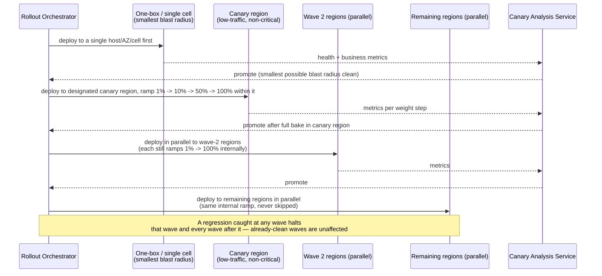

This mirrors two real, named patterns:
- **AWS's staggered deployment waves**: each production wave begins with a **one-box stage** — the new code goes to a single unit (one server, one container, one AZ, or one cell) before anything wider — and when a wave spans multiple regions in parallel, *each region still independently starts at a single AZ/cell* before widening. The blast radius is bounded twice: once by "how many regions are in this wave," and again by "how much of *each* region has the new code."
- **Canary-region-first ordering**: pick one low-traffic, non-critical region (or a synthetic canary cluster) to absorb the earliest real-world exposure before touching regions that carry the bulk of traffic or serve latency-sensitive/regulated markets. A regression there is cheap; the same regression in your largest region on a Friday is not.

**Why parallel waves, not one-region-at-a-time globally**: waiting for a full sequential region-by-region rollout would make a 15,000-deploys/day org's median rollout take hours-to-days end-to-end. Instead, once the canary region and the smallest blast-radius stage (one-box) are clean, remaining regions deploy **in parallel waves**, each independently re-running its own internal percentage ramp — you get both speed (parallel waves) and safety (every wave still ramps gradually and can independently halt).

### 🆕 Worked example: ramping across a 10,000-host fleet

Put real host counts against the exact `startRollout` ramp from Section 6's API example (1% -> 10% -> 50% -> 100%, bake windows 10/15/20/-- minutes) for a service running on 10,000 hosts:

| Stage | Weight | Hosts exposed (of 10,000) | Bake window | Cumulative elapsed time |
|---|---|---|---|---|
| 1 | 1% | 100 | 10 min | 10 min |
| 2 | 10% | 1,000 | 15 min | 25 min |
| 3 | 50% | 5,000 | 20 min | 45 min |
| 4 | 100% | 10,000 | none (final stage) | 45 min |

That 45-minute total is not a coincidence — it's exactly Section 5's "avg rollout duration ~45 minutes" assumption, derived bottom-up from the same bake windows used in the API example. Say this out loud if asked "where did that 45-minute number come from" — it proves the estimate and the mechanism agree, rather than being two unrelated numbers you memorized separately.

**The blast-radius payoff, concretely**: if the canary judge (Section 9.3) or the SLO-burn trigger (Section 11) fires while stage 2 is baking, exactly 1,000 of 10,000 hosts (10%) ever saw the bad build — not 10,000. Compare that to Stage 1's naive script (Section 7.1), where a bad build reaches all 10,000 hosts before anyone can react. The entire point of the percentage ramp is that the worst-case exposure at the moment of detection is bounded by *which stage you're in*, not by the fleet size.

**Cheat-sheet for this section**
- Two independent axes of blast-radius control: percentage-of-traffic *within* a region, and *order/parallelism of regions themselves* — conflating them into one "canary %" number is the common gap.
- Name "one-box" explicitly — starting at a single host/AZ/cell before even a full canary-region ramp is the smallest possible blast radius, and it's a real AWS term worth dropping.
- A regression in wave N halts wave N and everything after it, but never rolls back waves that already finished clean — say this explicitly, it's a common "what if it breaks halfway through" follow-up.
- Pick a genuinely low-traffic, non-critical region as the canary region — using your biggest market "because it has the most data" defeats the entire point of bounding blast radius.

---

## 11. Deep dive: automatic rollback triggers tied to SLO burn

Canary analysis (Section 9) answers "is the new version healthy compared to the old one, right now, in this cohort." Automated rollback triggers answer a related but distinct question: "is the *service's SLO* being burned through fast enough, right now, that we should revert regardless of what stage we're in." The two mechanisms often fire together, but a rollback trigger also has to catch regressions that a percentage-based canary already promoted past (a defect that only manifests once traffic is wider, or with a delay).

### 11.1 Multiwindow, multi-burn-rate alerting

Google SRE's documented technique: never fire a rollback off a single window, because a short window alone is noisy (false positives) and a long window alone is slow (a real outage burns half the monthly error budget before anyone notices). Instead, pair a **short window** (confirms the problem is happening *right now*) with a **long window** (confirms it's *sustained*, not a blip), at multiple severities:

| Severity | Long window | Paired short window | Burn rate | Budget consumed if sustained |
|---|---|---|---|---|
| Page immediately | 1 hour | 5 minutes | 14.4x | 2% of the 30-day error budget in 1 hour |
| Ticket / urgent | 6 hours | 30 minutes | 6x | 5% of the 30-day error budget in 6 hours |
| Investigate | 3 days | 6 hours | 1x | 10% of the 30-day error budget in 3 days |

Both windows in a row must breach simultaneously for the alert (and, in this system, the automated rollback) to fire — this is what keeps the false-positive rate low enough that "automatically revert production" is a decision you're willing to let a machine make unattended.

### 11.2 Rollback decision flow

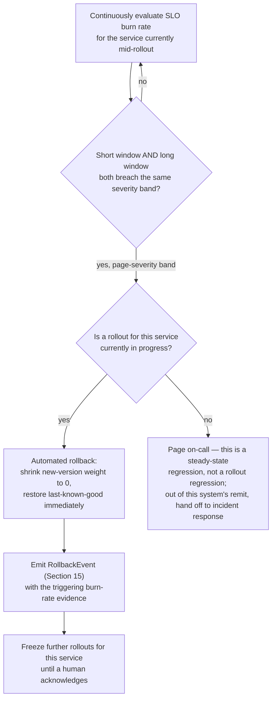

**The key design decision to name**: a rollback trigger firing *during* an active rollout is unambiguous — revert that rollout. A rollback trigger firing when no rollout is in progress means the regression isn't about the deploy at all (capacity, a dependency outage, a traffic spike) — this system should hand that off to normal incident response, not try to "roll back" something that didn't just change. Conflating the two is a common design flaw interviewers listen for.

### 11.3 🆕 Memory hook — what triggers an automatic rollback

| If... | ...then | Section |
|---|---|---|
| Canary judge score <= the configured fail threshold (e.g. <=50%) during an active stage | **Rollback** — comparative regression against baseline | 9.2, 9.3 |
| Canary judge score is between the pass and fail thresholds | **Hold**, not rollback — extend bake, re-sample | 9.2 |
| Short-window AND long-window SLO burn-rate both breach the same severity band, AND a rollout is in progress for that service | **Rollback** — absolute error-budget burn, independent of the canary judge | 11.1, 11.2 |
| Short + long burn-rate both breach, but no rollout is in progress | **Not a rollback** — page on-call, hand off to normal incident response (nothing to revert) | 11.2 |
| Only one window (short or long) breaches, not both | **No action** — a single-window breach is the noisy/slow trade-off this system explicitly rejects | 11.1 |
| A rollback's own `revertedToVersion` target regresses after being restored | **Freeze automation, page a human** — never auto-rollback-of-a-rollback | 16 |

**Cheat-sheet for this section**
- Multiwindow, multi-burn-rate alerting is Google SRE's own documented answer to "how do you avoid a rollback system that's either too slow or too noisy" — name it, and give at least the 1h/14.4x page-severity row from memory.
- Always pair a short and long window — a single-window trigger is the naive answer to reject out loud, same posture as rejecting naive nearest-driver dispatch in the Uber chapter.
- Distinguish "regression caused by this rollout" (auto-rollback) from "regression with no active rollout" (incident response, out of this system's job) — this is the trade-off/nuance interviewers are grading for.
- After an automated rollback, freeze further automated progression for that service until a human acknowledges — an unattended retry loop against a genuinely broken build is its own failure mode (Section 16).

---

## 12. Deep dive: database migration coordination (expand/contract)

A binary rollout and a schema change are two independent axes of "what's currently different across the fleet," and during a rolling deploy **both old and new code run simultaneously against the same database** for the whole rollout window. A schema change that only one of them can tolerate will break the other half of the fleet mid-rollout. The fix is the **expand/contract pattern**: never make a breaking schema change and a breaking code change in the same deploy.

```mermaid
sequenceDiagram
    participant Old as Old binary (still running on some hosts)
    participant DB as Database
    participant New as New binary (rolling in)
    participant Deploy as Deploy N (expand) --then--> Deploy N+1 (migrate) --then--> Deploy N+2 (contract)

    Note over Deploy: Deploy N — EXPAND
    Deploy->>DB: add new column/table, additive only<br/>(old code ignores it, keeps working)
    Old->>DB: reads/writes old shape only — unaffected
    New->>DB: (not deployed yet)

    Note over Deploy: Deploy N+1 — MIGRATE
    Deploy->>New: roll out code that writes BOTH old and new shape,<br/>reads from new shape (dual-write / backfill)
    Old->>DB: still writes old shape only — still compatible
    New->>DB: writes both; a backfill job fills historical rows

    Note over Deploy: Deploy N+2 — CONTRACT
    Old->>Old: fully retired fleet-wide (rollout N+1 reached 100% and baked)
    Deploy->>DB: drop old column/table — safe now, nothing reads it
```

- **Expand**: add the new column/table/index additively. Old code doesn't know it exists and keeps working unmodified — this deploy is safe to roll out at the normal pace, with the normal canary, because nothing observable changed for existing readers.
- **Migrate**: deploy code that writes to *both* the old and new shape (dual-write) and backfills historical data; reads can start preferring the new shape once backfill completes. Old code, if any is still running (a lagging host, a slow rollout wave), is still writing the old shape and is still fully compatible with the database as it exists.
- **Contract**: only once the *previous* rollout (the one that stopped writing the old shape) has reached 100% and fully baked — i.e., you're certain zero running code still depends on the old shape — drop it. This step is itself just another additive-safe-to-remove deploy, gated the same way as any other.

**The rule to say verbatim**: "Never change the schema and the code that depends on it in the same deploy." Each of the three phases above is independently backward-compatible with the phase before it, which is exactly why a rolling deploy — where old and new code coexist for minutes — never breaks: at every instant, every running version of the code is compatible with the database as it currently exists.

**Named tooling**: `pgroll` (Xata's open-source Postgres tool) automates exactly this pattern — every migration it runs is generated as an expand/contract pair so the multi-version-compatibility window is handled for you instead of hand-rolled per migration.

**Cheat-sheet for this section**
- The one-sentence rule: never couple a breaking schema change to a breaking code change in the same deploy — split into expand, migrate, contract, each its own independently-safe rollout.
- Name the failure this avoids: if you added a `NOT NULL` column and shipped code that requires it in the *same* deploy, every host still running the old binary during the rolling window either can't insert (violates the constraint) or the new binary crashes reading a null from a row the old binary just wrote.
- Contract is not optional cleanup — leaving expand-phase-only debris (dual-written columns nobody drops) accumulates schema and storage debt; say this as a known discipline gap teams fall into.
- This pattern is the DB-specific instance of a more general principle: every deploy should be independently safe for a fleet running a *mix* of old and new versions, because during any rolling/canary rollout, that mix is the normal state, not an edge case.

---

## 13. Deep dive: config and feature-flag deploys decoupled from binary deploys

Binary rollouts (Sections 8-10) and config/flag changes are deliberately **different systems with different cadences**, even though both ultimately change what users experience.

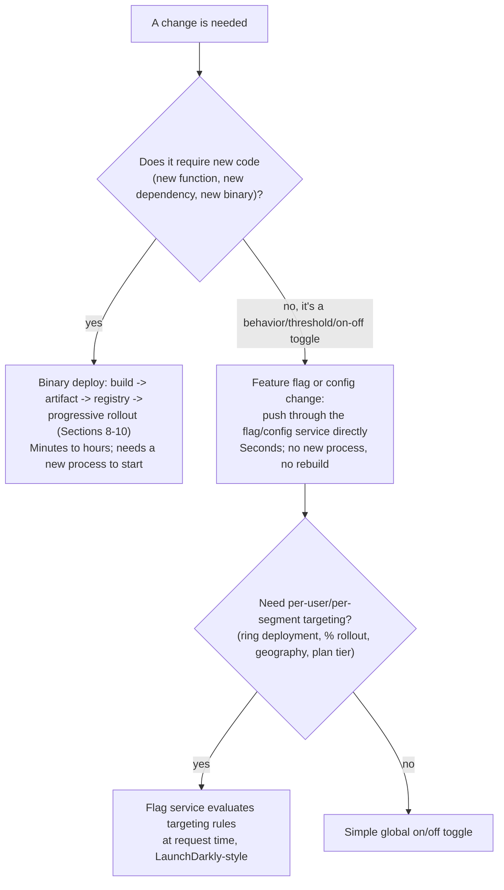

**Why decouple deploy from release at all**: the code for a new feature can be **deployed** (present in the running binary, dark, doing nothing) long before it's **released** (flag flipped on for real users). This lets an org deploy continuously — dozens of times a day per service, in line with DORA's elite-performer benchmark of on-demand, multiple-times-daily deploys — while still controlling exactly when, for whom, and how a *feature* becomes visible, entirely independent of the deploy pipeline's own cadence.

**What this buys concretely**:
- **Kill switch without a rollback**: a bad feature can be turned off in seconds via a flag flip — no rebuild, no re-run of the whole progressive-rollout machinery from Section 10.
- **Targeting-based progressive rollout**: a flag service can ramp a feature by percentage, account ID, geography, device type, or plan tier — a second, finer-grained blast-radius lever layered *on top of* an already-deployed binary, sometimes called ring deployment.
- **Decoupled incident response**: if a canary judge (Section 9) can't tell whether a regression is the binary or a flag-gated feature that shipped inside it, "flip the flag off" is a strictly faster mitigation to try first than "roll back the binary."

**The trade-off to name**: flags are not free — every long-lived flag is a permanent branch in the code, a combinatorial testing burden, and a place bugs hide (`if (oldFlag && newFlag && !veryOldFlag)`). Real orgs enforce flag hygiene: expiry dates on flags, automated lint rules flagging (no pun intended) stale ones, and a policy that a flag graduates to "always on, code path cleaned up" within a bounded number of weeks after full rollout — otherwise flag debt accumulates the same way un-contracted schema debt does (Section 12).

**Config-as-code follows the same logic but for tunables, not booleans**: rate limits, connection-pool sizes, retry budgets. These are versioned and promoted through environments exactly like a release (Section 6's `promoteRelease` pattern applies equally to config), but on their own, typically much faster, cadence — and still ride through a scaled-down version of the same canary/bake machinery, because a bad config push (an overly aggressive timeout, a wrong rate limit) is exactly as capable of causing an outage as a bad binary.

**Cheat-sheet for this section**
- The one-line answer to "why not just always deploy the new behavior": deploy and release are different events; decoupling them lets you deploy continuously while controlling release independently, and gives you a faster kill switch than a rollback.
- Name LaunchDarkly-style targeting explicitly — percentage, segment/cohort, geography — as a second, finer blast-radius lever that composes with (not replaces) Section 10's regional/percentage rollout.
- Flag debt is a real, named failure mode — mention flag expiry/cleanup discipline unprompted, it signals maturity beyond "just add a flag."
- Config pushes need the *same* progressive-rollout respect as binaries — "it's just a YAML change" is exactly the kind of change that causes real outages when skipped past canary.

---

## 14. State machines

### 14.1 Release lifecycle

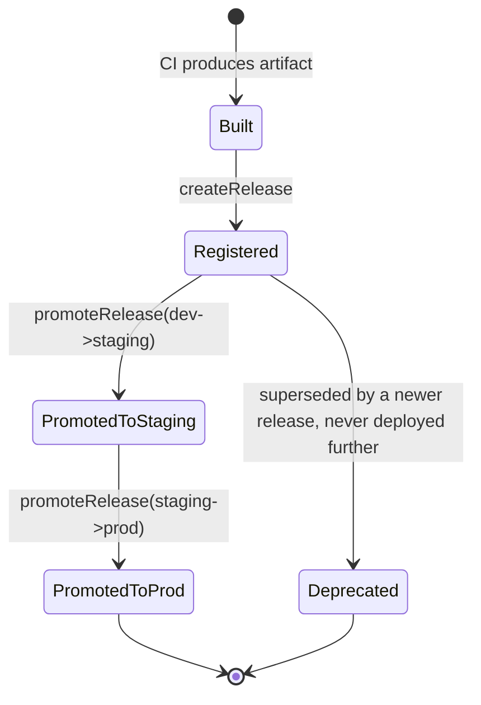

A release never mutates once created — `Registered`, `PromotedToStaging`, `PromotedToProd` are all annotations on an immutable artifact's journey, not edits to it. This mirrors the Uber chapter's trip-state discipline: the underlying "thing" (a trip, a release) is append-only; only its status field advances.

### 14.2 Rollout lifecycle

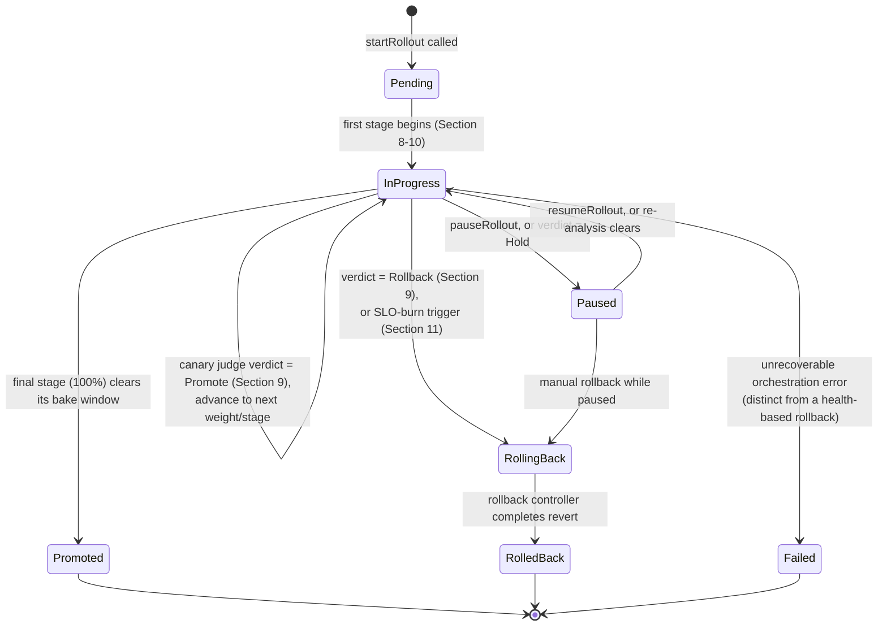

**The transition worth calling out unprompted**: `InProgress -> RollingBack` has *two* independent triggers — the canary judge (Section 9, comparative analysis at the current stage) and the SLO-burn controller (Section 11, absolute error-budget consumption, active at every stage including after full promotion). A rollout that has already reached `Promoted` is not exempt from the SLO-burn trigger; "done" only means the staged ramp finished, not that automated safety monitoring stops.

**Cheat-sheet for this section**
- Drawing both state machines unprompted answers "what happens if X happens at step Y" before it's asked — the same payoff as Uber's trip and driver-availability diagrams.
- `Failed` (orchestration-level error) is distinct from `RolledBack` (health-triggered revert) — conflating "the pipeline broke" with "the release was bad" is a common candidate slip.
- Tie the `InProgress -> RollingBack` dual-trigger back to Section 17's point that a `Promoted` rollout still has live SLO-burn monitoring — nothing here is "fire and forget."

---

## 15. Data model

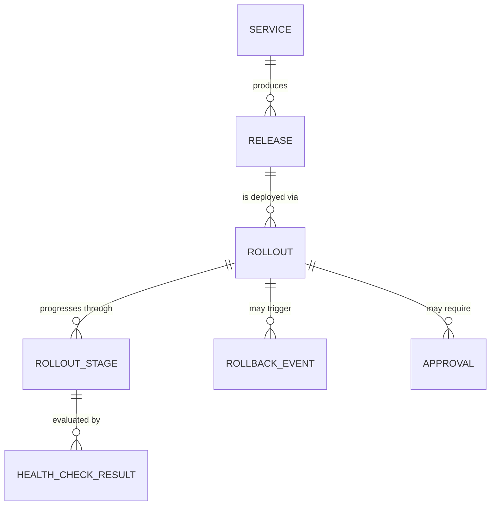

| Entity | Store | Key fields | Notes |
|---|---|---|---|
| **Release** | Relational DB (needs referential integrity + audit joins) | releaseId (PK), serviceId, artifactId, commitSha, version, createdAt, createdBy | Immutable once created — a new code change always produces a *new* Release row, never an edit |
| **Rollout** | Relational DB, versioned row (optimistic concurrency) | rolloutId (PK), releaseId, targetEnv, strategy, status (`Pending/InProgress/Paused/Promoted/RollingBack/RolledBack/Failed`), currentStage, currentWeight, startedAt, completedAt, version (for CAS) | `version` field is the single-writer guard — exactly like Uber's `Driver.status` CAS field — so two competing "advance this rollout" commands can't both win |
| **RolloutStage** | Relational DB, append-only per rollout | stageId (PK), rolloutId (FK), stageIndex, targetWeight, bakeMinutes, enteredAt, exitedAt, verdict (`Promote/Hold/Rollback`) | One row per stage transition — the audit trail of *why* a rollout advanced or didn't |
| **HealthCheckResult** | Time-series store (high write volume, append-only) | rolloutId, stageId, metricName, canaryValue, baselineValue, pValueOrCI, classification (`Pass/Fail`), ts | This is the ~400K/sec-scale ingestion path from Section 5 — never the relational store |
| **RollbackEvent** | Relational DB (needs to join cleanly to Rollout for audit) | rollbackId (PK), rolloutId (FK), triggeredBy (`automated-slo-burn`/`automated-canary-judge`/human userId), reason, revertedToVersion, ts | The evidence trail a postmortem reads first — never allow this to be a plain log line, make it a queryable row |
| **Approval** | Relational DB | approvalId (PK), rolloutId (FK), stage, approverId, decision (`Approved/Rejected`), ts | Backs the four-eyes/approval-gate requirement from Section 18 |

**Why this split, in one sentence**: anything needing relational integrity and cross-entity joins for audit (Release, Rollout, RolloutStage, RollbackEvent, Approval) lives in an RDBMS; the high-volume, append-only, time-ordered health-check stream lives in a time-series store — the same "match the store to the consistency and volume shape" instinct as Uber's location-breadcrumb vs. trip-ledger split (Section 7.2 there).

**Worked example — HealthCheckResult volume**: from Section 5's ~1,125,000 canary-analysis queries/day, each producing one row per metric compared (~15 metrics/transition) → roughly 1.1M rows/day at maybe ~150 bytes/row ≈ 165 MB/day. Trivial next to the 400K/sec raw probe stream that never gets persisted at that granularity — only the *analysis service's* comparison results are durably stored; the raw liveness/readiness probe firehose is transient, evaluated in-memory by the health-check tier and only escalated (persisted) when it's feeding a rollout decision.

**Cheat-sheet for this section**
- If asked to "draw the schema," draw the ER diagram first, then immediately name which physical store each entity lives in — same move as the Uber chapter, and it's the part interviewers actually want to hear.
- `Rollout.version` is the single field every "advance/pause/rollback" command's CAS guard hinges on — mention it here to preview your concurrency-control answer in Section 17.
- Health-check results are the entity most likely to be miscategorized into the relational store by a nervous candidate — catch yourself and route it to a time-series/append-only store instead.
- RollbackEvent must be a first-class queryable row, not a log line — that's the difference between "we can grep for what happened" and "we can build a dashboard of rollback causes over the last quarter."

---

## 16. Failure modes & mitigations

| Failure mode | Symptom | Mitigation |
|---|---|---|
| Partial rollout stuck mid-way | Some hosts on old version, some on new, indefinitely — "gray failure," nobody notices for days | Rollout state machine has a max bake time per stage; exceeding it without an explicit verdict pages on-call rather than silently sitting in `Paused` forever |
| Canary false positive (healthy build rolled back) | A perfectly good release gets reverted because of noisy metrics or an unrelated dependency blip during its bake window | Mann-Whitney tolerance band / dead zone (Section 9) absorbs noise; require the *same* verdict across a short-window/long-window pair (Section 11) before acting, not a single noisy sample |
| Canary false negative (bad build promoted) | Regression doesn't show up in the canary cohort's traffic mix or time window, gets promoted to 100% | Keep automated rollback triggers (Section 11) active *after* promotion too, not just during the canary stage — a regression that only appears at full traffic/full load is still a regression |
| Bad config push (not a binary at all) | Outage from a YAML/flag change that skipped the "real" deploy pipeline's scrutiny | Route config/flag changes through a scaled-down version of the same canary/bake gate (Section 13) — never treat config as exempt from progressive rollout |
| Rollback-of-a-rollback | An automated rollback reverts to a "last known good" that itself turns out to be bad (e.g., it was never actually validated at current traffic levels) | `RollbackEvent.revertedToVersion` must point to a version with its own recorded clean bake history, not just "whatever was running before" — freeze further automation and page a human the moment a rollback's own target regresses (Section 11.2's freeze-on-rollback rule) |
| Region outage mid-rollout | The canary region (or a wave-2 region) goes down for unrelated infra reasons while a rollout is in flight there | Distinguish "region infra is down" from "the new build is bad" — an orchestrator that can't tell the two apart will wrongly credit or blame the release; correlate with independent infra health signals before drawing a canary verdict from a region that's down for other reasons |
| Double-execution of an orchestration command | Two `startRollout`/`rollback` calls (retry, double-click, a race between automation and a human) both attempt to act on one rollout | Idempotency keys (Section 6) + `Rollout.version` CAS (Section 15) — exactly one wins, the other gets a conflict response, same discipline as Uber's double-dispatch guard |
| Secrets or credentials leaked via deploy logs | A build or deploy step accidentally prints a secret to CI logs, which are far more widely readable than the secret itself | Short-lived, scoped secrets (Section 18) minimize the blast radius of a leak; log redaction/scanning on the CI and orchestrator output as defense-in-depth |
| Flag/config debt accumulation | Dozens of stale flags and dual-write columns nobody ever "contracted," making the system's actual behavior unauditable | Expiry dates + automated lint on flags (Section 13); contract phase is a tracked, not optional, step of every expand/migrate/contract sequence (Section 12) |

### 🆕 Named incident: Knight Capital (2012) — deployment failure case study

**One-liner**: a new order-router feature was deployed to 8 production servers, but the deployment missed the 8th — that server kept running old, dormant test code that a repurposed flag then accidentally reactivated at full trading volume, generating erroneous orders that lost the firm an estimated **$460 million in about 45 minutes** on August 1, 2012, and nearly ended the company (it was acquired within months).

**Root cause (widely reported, not a Knight-confirmed internal postmortem)**: Knight reused an old flag/code-path identifier for new functionality without fully retiring the dead code it used to gate. The new "SMARS" router code was manually copied to 8 servers; one server didn't get the update. When the new flag was turned on fleet-wide, 7 servers ran the intended new logic — but the 8th server's stale binary interpreted the same flag as the trigger for a years-dormant test function ("Power Peg") that had never been fully removed. That function, designed only to run in a test environment, started sending a flood of live orders into the market. There was no automated health/error-rate check comparing that server's behavior to the other 7, and no automated kill switch — detection and manual mitigation took on the order of 45 minutes, by which point the loss was done.

**Mapped onto this chapter's mechanisms — what would have caught it**:
- **A canary/staged rollout instead of a manual 8-server copy** (Section 8, 10): even a simple one-box-first stage would have put the mismatched server through an isolated health check before the flag went live everywhere — the failure would have been visible on 1 of 8 servers, not all of them simultaneously.
- **Canary analysis comparing per-host or per-cohort metrics** (Section 9): order volume and error-rate from the 8th server would have diverged wildly from its 7 siblings within seconds — exactly the comparative signal Section 9's judge is built to catch, and exactly what a purely "did the process start" rolling-update gate (Section 8's central trade-off) would have missed too.
- **Flag hygiene / expiry discipline** (Section 13): the root cause was a repurposed flag riding on top of code that should have been deleted, not dormant — this is precisely the "flag debt" failure mode two rows above in this table, playing out at a scale that ended a company.
- **Automated SLO-burn rollback** (Section 11): an anomalous order-rate or position-risk burn rate, detected and acted on automatically within seconds rather than the ~45 minutes it took humans, is the entire premise this chapter is built to replace.

**Lesson to cite in an interview**: "Knight Capital wasn't a bug in the new code — it was a partial, unverified rollout that left old and new logic simultaneously live in production with no automated way to detect the mismatch or shut it down. That's the exact failure this chapter's canary-analysis-plus-automated-rollback design exists to prevent, and it's why 'deploy to all 8 servers by hand' is the Stage-1-naive-script strawman from Section 7.1, not a hypothetical."

**Cheat-sheet for this section**
- The false-positive/false-negative canary pair is the single most common follow-up pairing ("what if the canary is wrong") — always answer both directions, not just one.
- "Region outage vs. bad release" is the region-scale version of a classic distributed-systems gotcha: correlate against independent signals before attributing a health dip to the thing you just changed.
- Every mitigation should map back to a specific non-functional requirement from Section 4 — tie failure-mode answers to safety, auditability, or idempotency explicitly rather than listing them as trivia.

---

## 17. Non-functional walkthrough

### 17.1 Scaling to tens of thousands of hosts

- **Shard rollout state by rollout, not globally.** Each of the ~700-1,000 concurrent rollouts (Section 5.2) is an independent state machine; a global lock or a single orchestrator process ticking every rollout serially would cap concurrency at whatever one process can chew through. Partition orchestrator workers by `rolloutId` hash, the same instinct as Uber's per-document operations-queue sharding.
- **Health-check ingestion is the true scale bottleneck (400K/sec), not orchestration commands.** Terminate and aggregate health signals at the edge (per-cell or per-region aggregators) rather than shipping every individual probe result to a single central service — only aggregated, per-stage summaries need to reach the canary analysis service and the audit log.
- **Fan the rollout out to the fleet via the same pattern config/flag services use**: agents on each host/container pull their target version and current rollout weight rather than the orchestrator pushing to every host directly — a pull-based, cache-friendly fan-out avoids the orchestrator becoming a thundering-herd target during a wide rollout wave.

### 17.2 HA of the orchestrator itself

The orchestrator is the one component that must never be the single point of failure that prevents an active bad rollout from being rolled back — that's the worst possible moment for it to be down.

- **Leader election among stateless orchestrator workers**, backed by a durable, replicated state store (etcd/Raft-style) — the same pattern Kubernetes' own controller-manager uses for its control loops. Any worker can pick up any rollout's state machine after a leader failover, because state lives in the durable store, not in worker memory.
- **The durable rollout-state store itself needs its own replication and quorum writes** (same shape as Uber's MySQL-for-trip-state choice) — a lost or split-brained rollout-state write is exactly the kind of bug that causes a rollback-of-a-rollback (Section 16).
- **Rollback path gets its own redundant, higher-priority execution lane** — if the control plane is degraded, the ability to *revert* should degrade last, not first. A design that treats "start new rollout" and "roll back an active one" with equal priority under load has its priorities backward.

### 17.3 Consistency & ordering guarantees

- **Per-rollout total order is mandatory; cross-rollout order is not.** Stage transitions for one `rolloutId` must apply in strict order (you cannot process a "widen to 50%" before "widen to 10%" completes) — enforced via `Rollout.version` optimistic concurrency (Section 15). Two unrelated services' rollouts have no ordering requirement relative to each other at all — full parallelism there is not just safe, it's required for the concurrency numbers in Section 5.2 to work.
- **Health-check ingestion is AP, rollout state is CP** — exactly the same CAP-per-component split as Uber's location-vs-trip-state division. A momentarily stale health signal just delays a promote/rollback decision by one evaluation cycle; a torn or double-applied stage transition can advance a rollout past a stage it never actually passed.
- **Idempotency is the load-bearing consistency mechanism for commands**, not distributed transactions — every mutating API call (Section 6) carries a key, and duplicate delivery (retries, at-least-once messaging) is expected and handled at the command layer rather than assumed away.

**Cheat-sheet for this section**
- Say "the health-check ingestion path is AP, the rollout state machine is CP" out loud — it's the single sentence that mirrors the highest-signal line from the Uber chapter's CAP-per-component move, applied to this domain.
- HA of the control plane isn't generic "run three replicas" — the specific, gradeable answer is leader election + durable state store + a rollback path that degrades last.
- Per-rollout ordering (strict) vs. cross-rollout ordering (none needed) is the concurrency insight that justifies sharding by `rolloutId` — say both halves, not just "we shard it."

---

## 18. Security & compliance

| Concern | Answer |
|---|---|
| Who can approve a production deploy | Role-based: an `Approval` gate (Section 15) tied to specific rollout stages; for regulated or high-blast-radius services, require **two distinct approvers** (a "four-eyes principle" — the same control used for financial and safety-critical changes at large tech companies), and never let the same identity be both initiator and sole approver |
| Audit trail | Every Release, Rollout, RolloutStage, RollbackEvent, and Approval row is immutable and append-only (Section 15); nothing is ever overwritten, only superseded by a new row — this is what makes "who deployed what, when, and why" answerable months later during a compliance review or a postmortem |
| Secrets never in plaintext logs | Secrets are issued as **short-lived, scoped credentials** at deploy/runtime (Vault-style dynamic secrets: a pipeline authenticates with its own platform identity, receives a token scoped to only what it needs, and the token expires on a TTL) — never baked into an artifact, a config file, or a CI log; log pipelines additionally run redaction/secret-scanning as defense-in-depth, but the primary control is that there's no long-lived plaintext secret to leak in the first place |
| Service-to-service trust | mTLS between the orchestrator, canary analysis service, config store, and fleet agents — a compromised edge component shouldn't be able to impersonate the rollback controller and, say, force-promote a bad release |
| Least privilege for rollout actions | The identity that can `startRollout` for a service is not automatically the identity that can approve its own prod promotion (ties back to four-eyes above); automated rollback triggers act under a narrowly-scoped service identity, not a broad human credential |
| Supply-chain integrity | Artifacts in the registry (Section 7) are content-addressed and signed at build time; the orchestrator verifies signature + provenance before promoting a release to a new environment, so a tampered or substituted artifact can't slip in between build and deploy |
| Compliance/regulatory | Retention policy on audit logs and rollback history (Section 5.3's cold-archive pattern applies here too) must meet whatever regulatory window applies (e.g., financial services often mandate multi-year retention of change records) — say this as a scope question to ask the interviewer, not an assumption to bake in silently |

**Cheat-sheet for this section**
- The four-eyes principle (two distinct approvers for high-risk changes) is a concrete, named control — better than a vague "we have approvals."
- Vault-style short-lived, scoped secrets is the correct universal answer to "how do you avoid secrets in plaintext" for *any* CI/CD-adjacent design, not just this one.
- Say "supply-chain integrity" unprompted — verifying an artifact's signature/provenance before promoting it is exactly the kind of depth that separates this from a toy design.
- Compliance retention is a scope question, not a guess — ask it, the way you'd ask about payment scope in the Uber chapter.

---

## 19. Cost & trade-offs

| Decision | Alternative rejected | Why this choice | Cost accepted |
|---|---|---|---|
| Progressive canary rollout as the default strategy | Rolling update with only a readiness-probe gate | Gates on *observed comparative health*, not just "the process started" | Slower time-to-100% (bake windows add minutes-to-hours) — an explicit, worthwhile safety tax |
| Blue-green kept warm for instant rollback on high-risk services | Recreate/rolling-only (no warm standby) | Fastest possible revert path for services where even a gradual rollback is too slow | 2x fleet cost while both blue and green run |
| Immutable, promoted artifacts (build once) | Rebuild per environment | Guarantees staging and prod run byte-identical binaries — the entire point of testing in staging | Registry storage cost (Section 5.3) and a promotion step instead of a "just rebuild it" shortcut |
| Automated SLO-burn-based rollback | Rely on human on-call to notice and revert | Reverts in the time it takes metrics to breach a threshold, not the time it takes a human to see a page and act | Risk of false-positive automated reverts (mitigated by the dead-zone/multiwindow design in Sections 9 & 11) — an accepted, bounded cost, not eliminated |
| Config/flags decoupled from binary deploys | Ship all behavior changes only via binary deploy | Faster kill switch, finer-grained targeting, continuous deploy without continuous *release* | Flag/config debt if not actively pruned (Section 13, 15) |
| Canary-region-first, staggered wave ordering | Deploy to all regions simultaneously | Bounds blast radius to one low-traffic region before the regions that matter most see the change | Slower global rollout completion time — an explicit trade of speed for safety, restated from Section 1's mental model |
| Two-person approval for high-risk prod stages | Single-approver or fully automated promotion | Accountability and compliance for changes that can cause real business/safety impact | Adds latency and an operational dependency on human availability — worth naming as a real cost, not just a checkbox |

**The cost-driver summary to say if asked "what does this actually cost to run"**: the biggest recurring costs are (1) artifact registry storage at scale (Section 5.3 — mitigated by a hot/cold retention split), (2) the extra compute for canary and blue-green cohorts running alongside full baseline fleets during every rollout, and (3) the canary-analysis service's own compute for continuously running statistical tests across thousands of concurrent rollouts. All three are the direct, line-item price of the safety this system exists to buy — cutting any of them is a legitimate lever if an org's actual risk tolerance is lower than FAANG-scale, and worth saying so rather than presenting this as one-size-fits-all.

---

## 20. Real-world references — how this is actually solved in industry

| System/Concept | What it is | Where it fits in this design |
|---|---|---|
| **Kubernetes Deployments** | Native rolling-update controller: `maxSurge`/`maxUnavailable` (default 25%/25%), readiness/liveness probes | The mechanical layer this system's orchestrator often sits *on top of*, rather than replaces (Section 8) |
| **Argo Rollouts** | Kubernetes-native progressive-delivery controller: `setWeight`, `pause`, `AnalysisTemplate` steps, auto-abort on failed analysis | The open-source, concrete implementation of the canary state machine in Section 9.2 |
| **Spinnaker** | Netflix-originated, now CNCF, multi-cloud continuous-delivery platform orchestrating pipelines across environments/regions | The orchestrator tier in Section 7's architecture, at real-world scale |
| **Kayenta** | Netflix + Google's open-source automated canary analysis engine; Mann-Whitney U test, confidence-interval tolerance bands, aggregate pass-ratio score | The canary analysis service in Section 9 — described in this chapter almost verbatim from its documented mechanics |
| **Google SRE Workbook — "Alerting on SLOs"** | Documents multiwindow, multi-burn-rate alerting (1h/14.4x, 6h/6x, 3d/1x) | The automated-rollback trigger design in Section 11 |
| **AWS Builders' Library — "Automating safe hands-off deployments" / "Ensuring rollback safety during deployments"** | Documents one-box-first staggered waves, per-region internal ramp, rollback-safety discipline | The multi-region blast-radius ordering in Section 10 |
| **LaunchDarkly** | Commercial feature-management platform; decouples deploy from release, supports percentage/segment/geography targeting | The feature-flag deep dive in Section 13 |
| **HashiCorp Vault** | Secrets engine issuing short-lived, dynamically-generated, scoped credentials instead of static plaintext secrets | The secrets-management answer in Section 18 |
| **pgroll (Xata)** | Open-source Postgres migration tool that generates expand/contract migration pairs automatically | The concrete tooling behind Section 12's DB migration coordination |
| **Meta's Conveyor / Gatekeeper / Flytrap** | Meta's internal release pipeline (Build/Canary/Push nodes), feature-gating system, and anomaly-report collector, respectively | A named, real-world instance of this chapter's orchestrator + flag service + feedback loop, operating at thousands of deploys/day |
| **DORA (DevOps Research and Assessment) metrics** | Deployment frequency, lead time for changes, change failure rate, time to restore service | The industry-standard yardstick for whether this system is actually working (Section 5's "elite tier: on-demand, multiple/day" assumption comes from here) |

**Cheat-sheet for this section**
- Namedropping Kayenta, Argo Rollouts, and the SRE Workbook's burn-rate table correctly (with what they actually do, not just the name) is the fastest way to signal you've gone past the course material — the same payoff as H3/RADAR/DeepETA in the Uber chapter.
- If asked "is this exactly how Google/Meta/Amazon do it," be honest: this is a defensible interview-scale design *inspired by* these companies' publicly documented practices, not a literal blueprint of any one company's current, non-public production system.
- DORA metrics are the right answer to "how do you know if this system is any good" — deployment frequency, lead time, change failure rate, and MTTR, not vibes.

---

## 21. Disambiguation quick-reference

| Confusable pair | The distinction |
|---|---|
| **Deploy vs. Release** | Deploy = new binary present on hosts, possibly dark/inactive. Release = behavior visible to real users. Feature flags (Section 13) are what let these happen at different times. |
| **Rolling update vs. Canary** | Rolling update bounds blast radius by *instance count* and gates on "did it start" (readiness probe). Canary bounds it by *traffic percentage* and gates on *comparative, statistical health* (Section 9). |
| **Readiness probe vs. Liveness probe** | Readiness = "should this instance receive traffic right now" (gates the rollout). Liveness = "is this instance alive at all" (triggers a restart). Different questions, different consumers. |
| **Canary judge verdict vs. SLO-burn rollback trigger** | The judge (Section 9) compares canary-vs-baseline cohorts *during* a specific stage. The burn-rate trigger (Section 11) watches absolute error-budget consumption *continuously*, including after a rollout has fully promoted. Both can independently call for a rollback. |
| **Feature flag vs. Config-as-code** | A flag is typically a boolean/targeting rule for a specific behavior. Config is a broader class of tunables (timeouts, pool sizes, rate limits). Both are decoupled from binary deploys and both should ride a scaled-down version of the same progressive-rollout gate (Section 13). |
| **Expand/contract (schema) vs. Blue-green (fleet)** | Expand/contract sequences *database* changes across multiple deploys so old and new code stay compatible (Section 12). Blue-green is a *fleet* cutover strategy (Section 8) — orthogonal concerns that often apply to the same rollout simultaneously. |
| **Rollback vs. Roll-forward (fix-forward)** | Rollback reverts to a previously-known-good version. Roll-forward ships a new fix on top of the bad version instead of reverting. This chapter defaults to rollback as the automated safety net because it's faster and doesn't require a human to have already written a fix — but a mature org offers both, and a human incident commander may prefer roll-forward once a fix exists. |

---

## 22. Wrap-up: MVP vs. out of scope, stretch goals

**MVP** (what you'd actually build first, and what's reasonable to fully whiteboard in 45 minutes):
- Build → immutable artifact → registry → promote across environments (Sections 6-7).
- One rollout strategy done well: rolling update with readiness/liveness-probe gating, or a basic percentage-based canary (Section 8).
- Manual `rollback` always available, with an audit trail (Sections 6, 14).
- Basic health-check-based promote/hold decision — even without full statistical canary analysis, a simple error-rate threshold check is a legitimate MVP-level canary judge.

**Explicitly out of scope for the interview** (name these, don't build them): the CI/build system internals, container vulnerability/security scanning internals, infrastructure provisioning (Terraform-style), a full policy-as-code/OPA-Gatekeeper admission-control layer, chaos-engineering integration.

**Stretch goals** (name 2-3 if the interviewer wants "what would you add with more time"):
1. **Full Kayenta-style statistical canary analysis** (Section 9) with the Mann-Whitney tolerance-band judge, replacing a simple threshold check.
2. **Multi-region, wave-based blast-radius ordering** (Section 10) with a designated canary region and one-box-first staging within each wave.
3. **Automated SLO-burn rollback triggers** (Section 11) via multiwindow multi-burn-rate alerting, decoupled from and complementary to the canary judge.
4. **Feature-flag-based ring deployments** (Section 13) layered on top of the binary rollout for a finer-grained, code-free blast-radius lever.

**Cheat-sheet for this section**
- Naming the MVP explicitly, unprompted, shows you can prioritize under a real time budget — don't wait to be asked "what would you cut."
- The stretch goals list doubles as your answer to "what would you add with more time" — have it ready verbatim.
- If the interviewer only wants one deep dive, canary analysis (Section 9) is the highest-signal choice — it's this chapter's equivalent of Google Docs' OT-vs-CRDT centerpiece.

---

## 23. Golden rules & master cheat sheet

**Golden rules**
1. **Safety is the product, not a constraint on the product.** Every design choice in this chapter is defensible by asking "does this bound blast radius or improve the feedback loop" — if a proposed mechanism doesn't do either, question why it's there.
2. **The busiest number is health-check ingestion (~400K/sec), not deploy commands (~0.17/sec).** Design the ingestion/aggregation path for that number; deploy commands are never the bottleneck.
3. **Bound blast radius on two independent axes**: percentage-of-traffic within a region/cell (Sections 8-9), and which regions/waves go first (Section 10). Conflating them into one number is the most common gap.
4. **Every correct conflict-resolution guard here is a CAS on `Rollout.version`** — the direct analogue of Uber's driver-state compare-and-swap — preventing two competing commands from both winning.
5. **A rollback is a first-class, pre-tested code path, not "run the deploy backward.**" It gets its own priority lane and its own state-machine transitions (Section 15, 17.2).
6. **Never couple a breaking schema change to a breaking code change in the same deploy** — expand, migrate, contract, each independently safe (Section 12).
7. **Decouple deploy (bytes on disk) from release (behavior visible to users)** via feature flags/config — it's a faster kill switch than any rollback, and it's what makes continuous deployment survivable (Section 13).
8. **Automated rollback needs two things to avoid being either useless or a false-positive machine**: a statistical dead zone (Section 9) and a multiwindow/multi-burn-rate trigger (Section 11) — a single noisy sample or a single window is never enough evidence.
9. **Auditability and approval gates are non-functional requirements, not paperwork** — raise them before asked, exactly like fraud detection in the Uber chapter.
10. **Name the trade-off, always.** Every strategy in this chapter buys safety at a stated, explicit cost (time, infra spend, operational latency) — an answer without a stated cost sounds like marketing, not engineering.

**Master cheat sheet**

```
Formulas
Deploy-command QPS      = deploys_per_day / 86,400
Health-probe QPS        = total_containers x probes_per_container / probe_interval_seconds
Concurrent rollouts     = (deploys_per_day / working_hours) x avg_rollout_duration_hours
Net registry growth/day = unique_builds_per_day x avg_artifact_size x (1 - dedup_fraction)

Numbers worth memorizing
- K8s Deployment defaults: maxSurge = maxUnavailable = 25% of replicas.
- Kayenta: Mann-Whitney U test, 98% confidence interval, tolerance band ~ ±0.25 x Hodges-Lehmann estimate.
- Canary score = passed metrics / total metrics compared (e.g., 9/10 = 90%).
- Google SRE burn-rate table: 1h/5m @ 14.4x (2% budget), 6h/30m @ 6x (5% budget), 3d/6h @ 1x (10% budget).
- AWS staggered rollout: one-box (single host/AZ/cell) is the first stage of every wave.
- DORA elite performers: on-demand deploys (multiple/day), <1 day lead time, <5% change failure rate, <1h MTTR.
- Illustrative canary ramp: 1% -> 10% -> 50% -> 100%, with a bake window at each step.
```

**One-liners for common interview probes**
- "Why not just rolling-update with a readiness probe?" → it gates on "did the process start," not "is it actually healthy compared to before" — canary analysis is the layer that adds the second question.
- "How do you avoid a flaky automated rollback?" → a statistical dead zone per metric, plus requiring both a short and long window to agree, before acting.
- "What if the database migration and the code both need to change?" → they never ship in the same deploy — expand, migrate, contract, three independently-safe steps.
- "How is this different from feature flags?" → flags control runtime behavior without a new binary; this system controls which binary is running at all — they compose, they don't overlap.
- "What's still out of scope?" → the CI build system, artifact security scanning, and infrastructure provisioning — name them as stated dependencies, not gaps you forgot.
