# Design a Payment System — The Story (narrative edition)

> **What this file is.** The reference file, `41-Design-a-Payment-System-FAANG-Guide.md`, is the one to recite from — the mental model, the API shapes, every state-machine and trade-off table, the master cheat sheet. This file is a second way in: the same material as one continuous story, told in plain language. Engineers at a company keep hitting a wall, patch it, and the patch itself creates the next wall — until we land on the exact same design the reference file documents. The company, **ByteBasket** (a small online electronics store), is fictional. But every wall it hits, and every fix it reaches for, is something a real, named system actually does: Stripe's documented `Idempotency-Key` API design, double-entry bookkeeping (the centuries-old accounting technique every real ledger system — including Stripe's own internal "Ledger" service — is built on), the saga pattern used across real distributed payment stacks, Stripe's documented webhook signing/retry behavior, and the four-party card-network model (Visa/Mastercard rails, ISO 8583 messages) that every card charge actually runs on underneath. I'll say clearly, every time, whether a number is a documented fact or a reasonable, labeled guess — tagged `[illustrative]`.

**The trigger phrases** for this whole topic: *"how do we make sure a customer is never charged twice,"* *"design a system that moves money and never loses track of it,"* or *"design PayPal / Stripe / a wallet app."* Keep one sentence in your head as you read: **a payment system's entire job is to make "exactly-once money movement" happen on top of a network that only ever promises "at-least-once, maybe-zero-times."** Every fix below exists to close one more piece of that gap — honestly, one real failure at a time, and every fix creates a new, smaller gap right behind it.

---

## Chapter 1 — The Saturday that charged people twice

It's early days. ByteBasket is a two-person engineering team bolting a checkout page onto an online electronics store. The checkout code does the simplest possible thing: call the card processor synchronously, wait for the response, then mark the order `paid` in the database. Normal processor round-trip time is about 300ms `[illustrative — sits inside the documented 200ms-2s PSP authorization range]`. Nobody thinks twice about this, because it works, every day, for months.

Then one Saturday, the card processor has a rough afternoon — a well-documented category of incident in this industry, third-party payment APIs slow down all the time. Round-trip latency balloons from 300ms to **6 seconds**. ByteBasket's own load balancer times out client requests at **5 seconds**. So here's exactly what happens: the customer clicks "Pay," their browser gives up at 5 seconds and shows an error, and — because people do this — they click "Pay" again. But the *processor* never gave up. It was still working on the *first* request, approved it at 6.1 seconds, and ByteBasket's server just never got to see that response before its own timeout fired. The second click starts a brand new charge, completely unaware the first one is still alive.

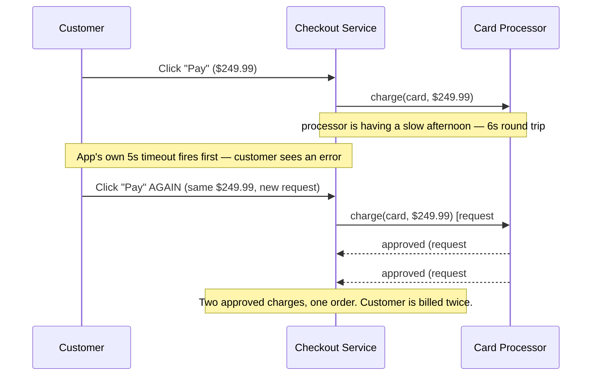

Over 20 minutes that afternoon, this happens to **42 customers**, for a total of **$10,499.58** in duplicate charges `[illustrative — a plausible order of magnitude for a small store's worth of retries during a 20-minute outage, not a real recorded incident]`. Support tickets spike, refunds go out by hand, and the two engineers ask the obvious question: *why does clicking "Pay" twice create two charges, when it's obviously the same purchase?* Because nothing in the request tells the server "this is the same logical attempt as before" — from the server's point of view, two HTTP requests with identical bodies are just two unrelated requests. There is no concept of "have I already done this."

**The fix, and the analogy for the rest of this story:** attach an **idempotency key** to every charge request — a unique ID the *client* generates once per purchase attempt and sends on every retry of that same attempt. The server checks: "have I seen this key before?" If yes, it returns whatever it returned the first time, without charging the card again. This is exactly Stripe's own documented `Idempotency-Key` header design, and it's the industry-standard answer to this exact problem.

Think of it like a **coat-check claim ticket**. You hand your coat over once and get a ticket. If you come back and show the *same* ticket again, you get *your same coat* back — the attendant doesn't hang up a brand new coat for you just because you walked up to the counter twice. The ticket, not "how many times you walked up," is what determines whether a new coat gets checked in.

**New problem, immediately:** ByteBasket ships this in an afternoon — store the key, store the response, check on the way in. It works for the "customer retries five minutes later" case. But what happens if the *second* claim-ticket request arrives while the *first* one is still being processed — not after it finished, but *during*? That's the very next Saturday's incident.

**How I'd say this in an interview:** "The very first bug in any naive payment flow is a synchronous charge-then-update with no way to recognize a retry as a retry. The fix is a client-supplied idempotency key — the same idea as a coat-check ticket — and it's not optional, it's the single most-tested mechanic in this whole topic."

---

## Chapter 2 — The claim ticket that got checked twice in one breath

ByteBasket's first idempotency implementation is a simple table: `idempotency_key -> response`. On a new request, it checks "does this key exist?" — if not, it does the charge and then writes the key and response. Looks right. It isn't.

Here's the gap: during another slow-processor afternoon, a customer's browser retries **1.8 seconds** after the first click — well before the first request's 6-second round trip has even come back. The server does its "does this key exist?" check, finds nothing (because the first request hasn't finished and written anything yet), and proceeds to run *both* requests at the same time, racing each other to the processor. Two charges land, one right after the other, both carrying the *same* claim ticket. The read-then-write check has a hole exactly big enough for this to slip through.

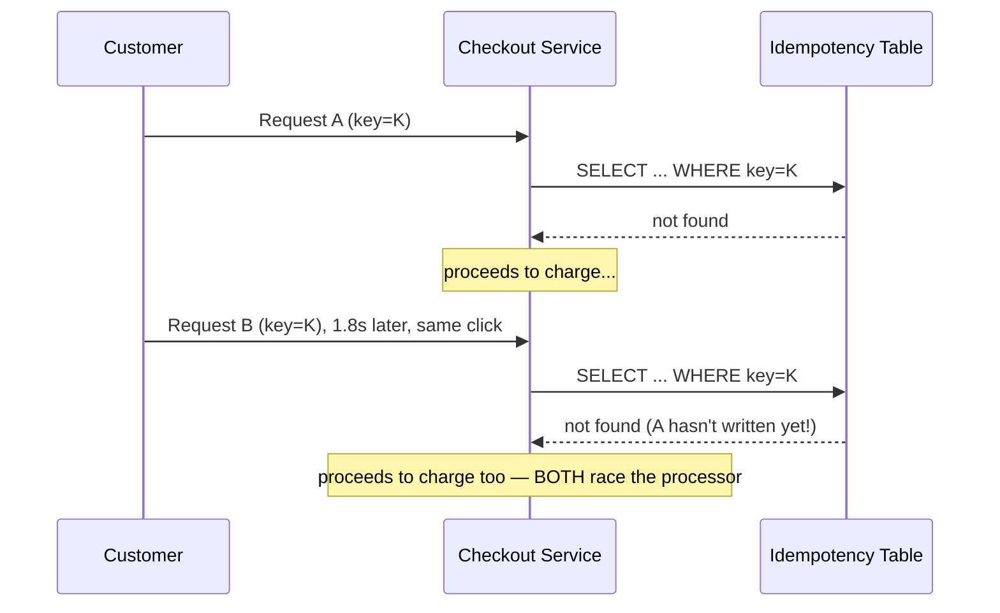

The obvious question: *why doesn't checking first prevent this?* Because "check, then act" is two separate steps with a gap between them, and two requests can both pass through that gap before either one closes it. The fix isn't a smarter check — it's making the *check itself* the thing that only one request can win. ByteBasket adds a **unique constraint** on the idempotency key column, and an explicit `in_progress` status (not just "found" or "not found"). The very first request that tries to `INSERT` with that key wins the race at the database level; the second one's `INSERT` fails on the constraint, instantly, no gap. That losing request gets told "in progress, don't proceed, try again shortly" — a `409 Conflict`, exactly like Stripe's own documented behavior for a concurrent retry against an in-flight key.

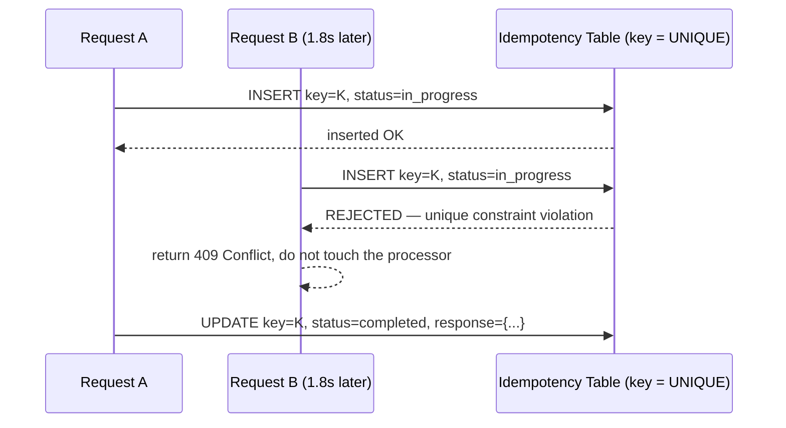

**New problem, one layer deeper:** the unique-constraint trick assumes the *same* claim ticket always means the *same* purchase. What if a bug — or a malicious client — reuses a claim ticket for a *different* purchase? Same key, different amount. The database happily says "key exists, replay the stored response" — and returns yesterday's $10 confirmation for what should have been today's $400 charge, or worse, silently applies the wrong amount if the check isn't careful about what "replay" actually means.

**How I'd say this in an interview:** "A read-then-write idempotency check races under concurrent retries — you need a unique constraint plus an explicit `in_progress` state, so the *database* picks exactly one winner instead of your application code hoping nobody arrives at the same moment. Everything after that is either 'wait for the winner' or 'replay the winner's result,' never 'proceed anyway.'"

---

## Chapter 3 — The ticket that came back for a different coat

A junior engineer's retry logic has a bug: if a checkout fails validation, it "helpfully" retries with the *same* idempotency key but an *updated* cart total (customer added a $65 accessory on the error page). Same claim ticket, different coat. ByteBasket's idempotency store, as built in Chapter 2, doesn't know that — it just sees a familiar key and does whatever the stored logic says to do with it, which in this bug's case, briefly, was silently overwriting the stored response with the new amount and charging the *second* amount under the *first* key's guarantee. That's exactly backwards: the key is supposed to prove "this is the same request," and here it's being used to smuggle through a request that quietly isn't.

The fix: hash the actual request body (amount, currency, payment method) and store that hash alongside the key. On any request carrying a key that already exists, compare the *new* request's hash to the *stored* hash. If they match, it's a legitimate retry — replay the stored response. If they don't match, it's a bug or an attack — reject it outright with an error, never guess which one the client "really meant." This is exactly what Stripe's own idempotency implementation does: hash the parameters, not just check the key.

There's a second, quieter gap in the same neighborhood, and it's the one that actually matters most for money: **the idempotency record and the actual side effect (the charge, and eventually the ledger write) have to become durable together, or not at all.** If ByteBasket writes "key K → completed" and *then* crashes before the charge itself is durably recorded, a retry will see "completed" and skip the charge — the customer thinks they paid, the store thinks they got paid, and nobody actually moved any money. If it's the other way around — the charge happens, then the process crashes before the key gets marked `completed` — a retry sees `in_progress` timing out and might redo the charge. The fix is to make the idempotency write and the actual money-moving write **one atomic unit** — same database transaction if they share a store, or the money-moving write treated as the one source of truth and the idempotency record derived from it, never the reverse.

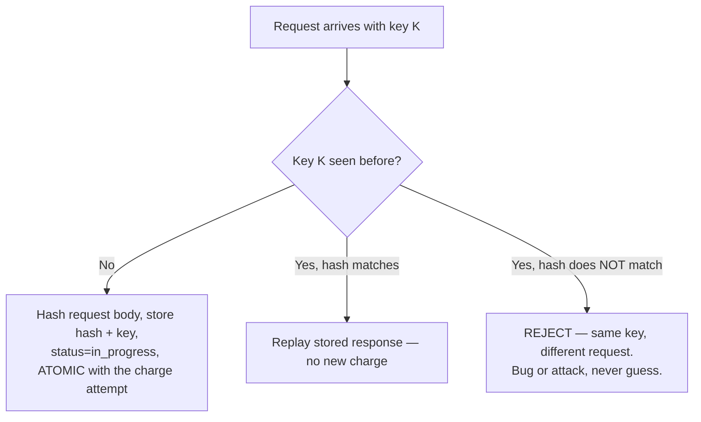

That word "atomic" is doing a lot of work, and it points straight at the next problem. Right now, "the actual charge" on ByteBasket's side is a single `UPDATE accounts SET balance = balance - amount WHERE id = ?`. A mutable number in a column. That's about to become the real fire.

**How I'd say this in an interview:** "Idempotency isn't just 'remember the key' — you have to hash the request body so a key can't be reused for a different amount, and the idempotency record has to commit atomically with the real side effect, or you can end up with a completed-looking key and no actual charge behind it, which is a lost charge, not a saved one."

---

## Chapter 4 — The balance column that couldn't explain itself

ByteBasket's `accounts` table has a `balance` column. Every charge, refund, and payout is an `UPDATE ... SET balance = balance +/- amount`. It's simple, and simple is exactly why it's dangerous.

One weekend, an on-call engineer re-runs a stuck data-migration script twice by accident, because the first run's logs looked ambiguous about whether it had completed. Neither run had a safeguard against running twice. The script re-applies **15,000 pending store-credit refunds** a second time, each an `UPDATE ... SET balance = balance + amount`. Total phantom credit created: **$340,000** `[illustrative — a plausible incident shape for a double-run migration against a mutable balance column, not a real recorded figure]`. Nobody notices for eight days, because there's nothing to notice *against* — the `balance` column, after the double-update, doesn't look wrong. It just looks like a number. There is no record anywhere of what it used to be, or of the fact that anything ran twice.

The obvious question: *how do you even detect a bug like this, let alone fix it, when the only artifact is a single mutable number?* You can't. That's the actual design flaw — not the migration bug, but the fact that the system's source of truth is a column that overwrites its own history on every write. A `balance` column has no memory.

**The fix: double-entry bookkeeping.** This isn't a new invention — it's the same accounting technique businesses have used for centuries (formalized by Luca Pacioli in 1494, and still exactly how every serious modern ledger system, including Stripe's own internal Ledger service, works today). Every transaction writes **two immutable rows**, never one mutable update: a debit on one account, a credit on another, always summing to zero. Nothing is ever edited. Nothing is ever deleted. A `balance` is never stored — it's *computed* on demand as `SUM(credits) - SUM(debits)` for that account.

Think of it as a **register tape**. A cash register doesn't erase yesterday's total and type in a new one — it just keeps printing new lines onto a tape that never gets torn or overwritten. Today's total is *always* "add up the whole tape so far." If someone asks "how did we get to this number," you don't have to trust a number — you can hand them the tape and let them add it up themselves.

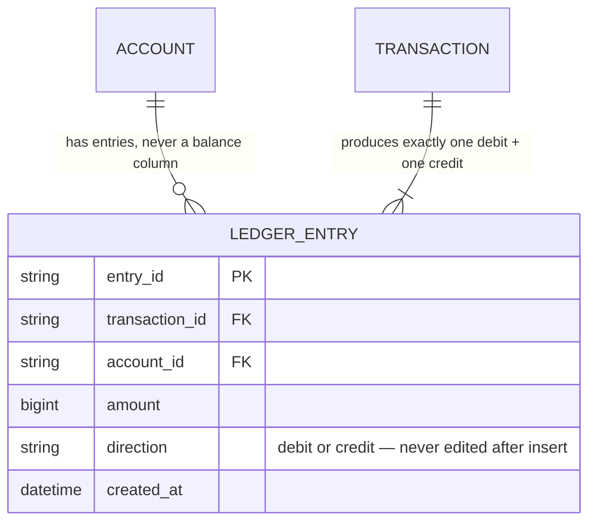

Re-running that same migration bug against a register-tape ledger doesn't create a silent $340,000 hole — it creates 15,000 *extra, visible, duplicate* lines on the tape, each pointing at the same original transaction ID, and a query that groups by transaction ID instantly flags every single one as "posted twice." The bug is exactly as real, but now it's *loud* instead of *invisible*.

**New problem:** a single payment now has to touch at least three separate systems that each own their own data — a **Wallet** service holding customer funds, a **Ledger** service holding the register tape, and an **Order** service tracking what was actually bought. You can't wrap three different services' databases in one ACID transaction. So what happens when step two of three fails halfway through?

**How I'd say this in an interview:** "A mutable balance column has no audit trail and can't be reconciled or explained after the fact — the real answer is double-entry bookkeeping: every transaction is a balanced debit-and-credit pair on an append-only log, and balance is always a derived `SUM`, never a stored field. It's centuries-old accounting, not a database trick, and it's the correct answer to almost every 'how do you prove this is right' follow-up in this topic."

---

## Chapter 5 — The relay race where the third runner drops the baton

ByteBasket's checkout flow now genuinely spans three services: **Wallet** (reserve the customer's funds), **Ledger** (post the balanced pair), and **Order** (mark the purchase as paid). Each owns its own database. One Tuesday, during a routine deploy, the Order service is mid-restart for about four seconds. In that exact window, a purchase sails through Wallet (funds reserved) and Ledger (register tape entries posted) — and then the call to Order fails outright with a connection refused. The money has moved. The order still says `pending`. The warehouse never gets told to ship it.

The obvious question: *can we just retry the Order call until it works?* Sometimes, yes — but "retry until it works" isn't a plan, it's a hope, and it doesn't answer what happens if Order is down for four *minutes*, not four seconds, or if the failure is a real, permanent rejection (say, the order was already canceled by the customer in the meantime) rather than a transient blip.

**The fix: the saga pattern** — a sequence of local transactions, one per service, where *every* step has a defined **compensating action** to run if a *later* step fails. Think of it like a **relay race with a rule**: if the third runner drops the baton, the first and second runners don't get to pretend their legs didn't happen — they each have to go run their own, separate "undo my leg" lap. Nobody rewinds time; everybody who already ran has to actively take a new action to make things right.

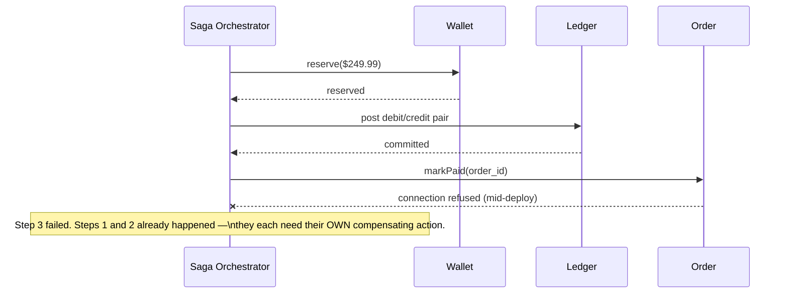

For the Wallet step, compensation is easy: `release()` the reservation — wallet holds are designed to be reserved and released, so undoing one is a normal, mutable operation. But the **Ledger** step is the interesting case, and it's the one that trips people up: you *cannot* "undo" a posted ledger entry the way you release a wallet hold, because Chapter 4 just made the ledger append-only on purpose. So the compensating action for a posted ledger entry is never a delete — it's a **new entry that reverses it** (debit and credit swapped), leaving the tape with two lines instead of zero: the original attempt, and its own explicit undo, both visible, forever. Same rule as Chapter 4, applied to failure instead of success: never erase the tape, only add to it.

| Step that failed | Compensating action | Why |
|---|---|---|
| Wallet reservation | Release the hold | Holds are mutable by design |
| Ledger post | A brand-new reversing entry | The tape is append-only — undo means "add the opposite," never delete |
| Order confirmation | Mark order `PaymentFailed` | Order state is its own mutable state machine |

**New problem:** a saga needs an orchestrator that survives its own crash mid-transaction, or you've just moved the "stuck halfway" bug one level up instead of fixing it. That's an important operational detail, but the more interesting *design* problem shows up one hop earlier — inside the call to the processor itself. What if the processor call is the one that times out, and you genuinely don't know whether it succeeded?

**How I'd say this in an interview:** "You can't do a two-phase-commit across three independently-owned service databases, so you use a saga — local transactions with compensating actions. The subtlety worth stating out loud: compensating a wallet hold is a normal undo, but compensating a ledger post has to be a *new*, reversing entry, never a delete, because the whole point of Chapter 4 was making that log append-only."

---

## Chapter 6 — The charge that succeeded and nobody told us

ByteBasket's saga calls the processor as its second step. One afternoon, the processor approves a **$412.00** charge internally — but the response packet gets dropped somewhere on the network before it reaches ByteBasket's server. The saga's own call times out at 2 seconds with *nothing*: no success, no failure, no answer at all.

The obvious question, and it's the single hardest one in this whole topic: *does the saga retry the charge?* If it blindly retries, and the first charge really did succeed, the customer is charged twice — exactly Chapter 1's bug again, just one layer deeper in the stack, between *your own backend* and the processor instead of between the customer's browser and your backend. If it *doesn't* retry, and the first charge actually failed, the order never gets paid at all. A timeout, on its own, tells you literally nothing about which of those two happened.

**The fix: never guess — ask.** Before retrying, query the processor's own **status API** for that specific attempt (using the same idempotency key you sent it the first time). The processor knows what happened on its side, even if its response to you got lost; asking "what's the status of the thing I already asked you to do" is a *read*, and reads are safe to repeat freely. Only after getting a definitive answer does the saga decide: if already approved, skip straight to posting the ledger entries; if genuinely never received, retry the charge for real.

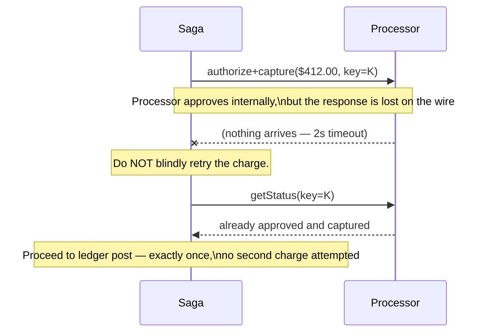

This is also the moment ByteBasket's two states — "charged" and "not charged" — turn out to be three states hiding as one, and the third one is the one that actually explains what "success" means for real money. Think of it as a **layaway counter**: **authorize** is the store putting your name on the item and holding it behind the counter — a reservation, nobody's money has actually moved. **Capture** is the cashier actually ringing it up and taking your card — you now genuinely owe the money, but it hasn't reached the store's bank account yet. **Settle** is days later, when the card network actually wires real cash between the two banks — this is the only point where the money has *actually* moved, and it typically takes T+1 to T+2 days after capture.

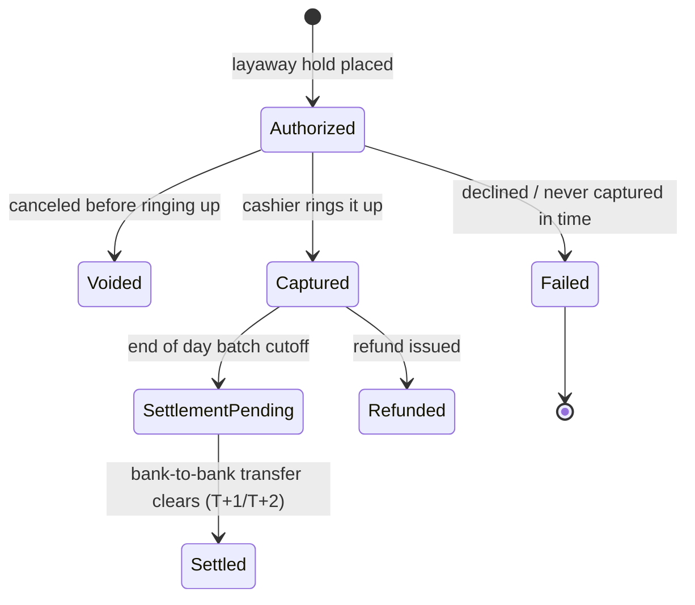

**New problem, discovered a month later:** a batch of holiday-season **authorizations** never got captured, because the customers abandoned their carts right after the card check. Card networks typically auto-expire an uncaptured hold after roughly **7 days** — but until then, that money sits reserved and unusable on the *customer's own card*, for a purchase that's never going to happen. ByteBasket starts getting complaints about "why is my card showing a pending charge for something I never bought." The fix is a scheduled **sweep job** that proactively voids any authorization approaching its expiry window without a capture, instead of just letting it silently time out on the card network's own clock.

**How I'd say this in an interview:** "The hardest failure mode in payments is an ambiguous timeout on the processor call — you genuinely don't know if the money moved. The fix is never to guess: query the processor's own status endpoint before retrying. And 'charged' isn't one state — authorize, capture, and settle are three separate, real events, days apart, and collapsing them loses the ability to model holds, voids, and the actual T+1/T+2 settlement lag."

---

## Chapter 7 — The postcard that arrives after the fact

So far, every mistake has been about requests *ByteBasket itself* sent out. But the processor also sends things *to* ByteBasket, on its own schedule, hours or days later: "this charge settled," "this charge was disputed," "this refund completed." These arrive as **webhooks** — the processor makes an HTTP call *into* ByteBasket's own server, whenever it feels like it.

The first version of ByteBasket's webhook handler just trusts the payload and updates the ledger directly inside the request. Two things go wrong almost immediately. First: the processor's own retry behavior is **at-least-once**, not exactly-once — a webhook for the same event can, and does, arrive more than once, because the processor never got *its* acknowledgment back the first time (the exact same "unreliable network" problem from Chapter 1, just running in the opposite direction now). Second: anyone who can guess ByteBasket's webhook URL can `POST` a fake "payment succeeded" event and mark a $0-paid order as fully paid — there's no proof the request actually came from the processor.

Think of a webhook as a **postcard mailed to you after the fact**. You didn't ask for it in real time, it might get duplicated in the mail, and — unless it has a signature you actually recognize — you have no way to know it wasn't forged by someone who knows your address.

**The fix has three parts, and all three are real, documented practices:** first, **verify a cryptographic signature** (an HMAC header, like Stripe's `Stripe-Signature`) computed over the *raw, unparsed* request bytes — checking it *after* the body has been JSON-parsed and re-serialized is a real, common bug, because the re-serialized JSON isn't byte-identical to what was actually signed. Second, **dedup by the event's own ID** with a unique constraint — the same claim-ticket mechanic from Chapter 2, just keyed by the *sender's* ID instead of a client-generated one. Third, **acknowledge fast, process async**: durably enqueue the event and respond `200 OK` within the processor's own timeout budget — Stripe's is a documented **10 seconds** — then do the actual ledger-affecting work off a queue. A slow handler shouldn't lose the event; it should just cause a redundant, dedup-absorbed retry.

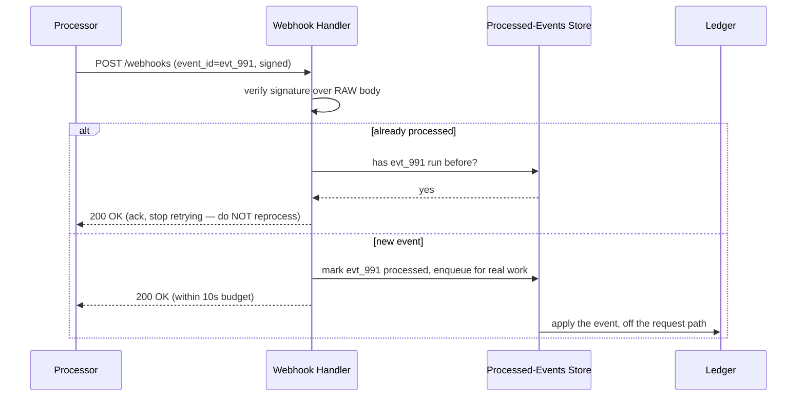

Stripe's own documented retry cadence for a webhook that never gets acknowledged is **immediately, then 5 min, 30 min, 2 h, 5 h, 10 h, then every 12 h — for up to 3 days.** That's a generous window, and it's exactly why "the handler was briefly down for 20 minutes" is a non-event once dedup and durable enqueueing are in place.

**New problem, and it's the one none of the above can catch:** what if a webhook is lost *permanently* — not delayed, not duplicated, but genuinely never delivered even after every one of those retries runs out? Maybe the endpoint was misconfigured for a day, or a firewall rule silently dropped it. Signature checks and dedup only help with webhooks that *arrive*. This is a webhook that never does, and right now, ByteBasket has zero mechanism to even notice.

**How I'd say this in an interview:** "Webhooks are the inbound version of the same unreliable-network problem — at-least-once delivery, and you didn't initiate the call so your own idempotency key doesn't apply. Verify the signature over the raw body, dedup by the sender's event ID, and ack fast while processing async. But none of that catches a webhook that's permanently lost — that needs a completely separate mechanism."

---

## Chapter 8 — The books that quietly stopped matching

Everything built so far protects ByteBasket's *own* side of every transaction. None of it can detect drift **against the processor's own records** — a permanently lost webhook (Chapter 7's open problem), a manual adjustment someone made directly on the processor's dashboard, or an FX rounding difference. ByteBasket's ledger and the processor's ledger are two independent books, kept by two independent parties, and nothing so far ever actually compares them.

**The fix: reconciliation** — a nightly batch job that pulls the processor's own settlement file and diffs it, transaction by transaction, against ByteBasket's internal ledger. It runs on the processor's own settlement cadence (typically T+1 or T+2 for card networks) because running it more often just re-diffs the same stale file. Think of it as **checking your checkbook against the bank's monthly statement** — your own daily bookkeeping can be perfectly disciplined and still miss something the *other side's* records catch, because the other side is the only one who knows what actually cleared.

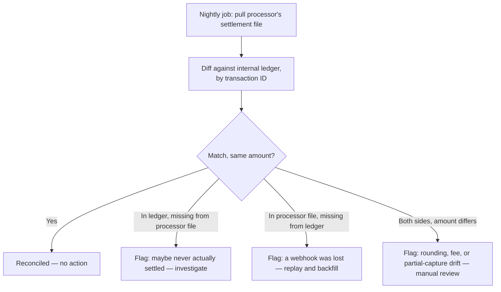

The first version of this job pages on-call every single night, because at ByteBasket's real volume it flags **around 40-60 transactions out of roughly 8,000 nightly settlements** `[illustrative — modeled on the reference guide's documented pattern that a small fraction of a percent of nightly transactions land in a mismatch bucket at real scale, scaled down to ByteBasket's smaller size]`. That sounds alarming until someone actually looks: the overwhelming majority are **timing boundary noise** — a transaction captured at 11:58pm lands in tomorrow's settlement batch instead of today's, not a bug, just a clock. Those clear themselves automatically the very next night once the correct window gets compared. The fix isn't a better diff query, it's a better *triage rule*: bucket by cause first, auto-clear anything that resolves within two settlement cycles, and only page a human for whatever's left.

Once that noise is filtered out, here's what a genuine, actionable flag actually looks like: one night's settlement window shows the processor's file totaling **$9,857.50** across 214 transactions, while ByteBasket's internal ledger for the same window totals **$9,845.00** across the same 214 transactions. Same count, $12.50 short — that rules out a missing row and points straight at an amount mismatch on exactly one transaction. Tracing it: `txn_7734`, an original $80.00 charge, correctly captured and ledgered — but the processor's own transaction detail shows **two** separate $12.50 refund debits against it, while ByteBasket's ledger only has one. What happened: a support agent issued a $12.50 partial refund correctly, through ByteBasket's own `refundPayment` API — idempotency key, ledger entry, all of it done right. An hour later, a *second* agent, picking up the same ticket without realizing it had already been handled, issued *another* $12.50 refund directly through the processor's own merchant dashboard — bypassing ByteBasket's system entirely. No idempotency key, no saga, no ledger entry, because that refund never went through ByteBasket's code at all. It only exists in the processor's own records. That's exactly the class of mistake idempotency and sagas were never in a position to catch — two different people made the same honest mistake through two different doors, and only comparing both books side by side surfaces it.

**What the job does about it, and this matters:** it never silently "fixes" the ledger. It flags the transaction, routes it to a human, who confirms the second refund really happened and decides whether to eat the $12.50 or claw it back — and then backfills a **new** ledger entry (referencing the processor's own refund ID) to make the tape match reality. Never an edit to the existing entries — the same rule as every chapter before this one.

**How I'd say this in an interview:** "Reconciliation exists specifically because idempotency and sagas only protect your own side — they can't see a mistake made entirely on the processor's side of the fence, like a duplicate refund issued through their dashboard instead of your API. The job diffs your ledger against their settlement file, buckets the noise (timing) from the signal (real drift), and never auto-corrects — it flags, and a human decides."

---

## Chapter 9 — The bouncer who has to decide in 400 milliseconds

Separately from all the *correctness* work above, ByteBasket starts seeing a different kind of problem: fraud. One Tuesday night, over **3 minutes**, ByteBasket's checkout sees **180 attempted charges** from newly-created accounts, all different stolen card numbers, all shipping to the same three addresses — a **card-testing attack**, a well-documented, common pattern where stolen card numbers get run through a real store's checkout in bulk just to see which ones still work, before using the "good" ones for a bigger fraudulent purchase elsewhere.

The obvious question: *how do you stop this without also blocking real customers?* You can't just require extra verification on every single transaction — that adds friction to the 99.9% of purchases that are completely legitimate, and friction costs sales. The right answer is a **risk score**, computed fast (in the few hundred milliseconds you have before the checkout call proceeds), that decides how much friction a *specific* transaction actually deserves. Think of it as a **bouncer at the door**: most people walk straight in with a glance, a few get asked for ID, and a tiny number get turned away outright — the same door, three different levels of scrutiny, decided in the time it takes to glance at someone.

```mermaid
quadrantChart
    title Risk vs. friction: matching the check to the transaction
    x-axis Low friction --> High friction
    y-axis Low risk --> High risk
    quadrant-1 High risk, high friction: challenge or decline
    quadrant-2 High risk, low friction: dangerous — don't leave this quadrant empty
    quadrant-3 Low risk, low friction: let it through
    quadrant-4 Low risk, high friction: wasted friction, lost sales
    "Regular customer, known card": [0.15, 0.1]
    "New account, new card, normal amount": [0.35, 0.4]
    "Card-testing pattern (many cards, same address)": [0.25, 0.9]
    "Large amount, new shipping address": [0.6, 0.65]
```

The fix ByteBasket actually ships is deliberately simple, matching what a real MVP would build first: velocity limits (flag/block a burst of attempts from the same IP or device in a short window — this alone stops most card-testing bursts cold, including the one above) plus rule-based checks (mismatched billing/shipping geography, a brand-new account attempting an unusually large first purchase), escalating the genuinely risky ones to **3-D Secure (3DS)** — the "ask for ID" step, redirecting the cardholder to their own bank to confirm a one-time code or biometric before the charge proceeds. This is the real, documented EMV 3DS2 mechanism, and it exists partly because of a legal requirement: the EU/UK's **PSD2 Strong Customer Authentication** mandate requires exactly this two-factor check on most card transactions, with a documented exemption for low-value purchases (commonly under roughly €50) and for recurring charges after the first one's already been authenticated. A successful 3DS challenge also shifts fraud liability from ByteBasket to the card-issuing bank — a business incentive on top of the security one.

The other half of fraud prevention isn't about *behavior* at all — it's about never being a target worth breaking into in the first place. ByteBasket never lets its own servers touch a raw card number: the checkout page uses a processor-hosted iframe field (the customer's card details go straight from their browser to the processor's PCI-compliant vault), and ByteBasket's backend only ever handles an opaque **token**. This single decision is what keeps the bulk of ByteBasket's own infrastructure out of PCI-DSS compliance scope entirely — there's simply no raw card data anywhere on ByteBasket's servers for an attacker to steal.

**New problem, discovered by Finance, not Engineering:** even with all of this in place, sometimes a customer disputes a charge directly with *their own bank*, without ever contacting ByteBasket at all. The bank pulls the money back immediately — before ByteBasket even gets a chance to weigh in.

**How I'd say this in an interview:** "Fraud checks are a risk-vs-friction dial, not an on/off switch — velocity limits and rule-based checks catch the bulk cheaply, and you escalate only the genuinely risky transactions to something like 3DS, which is also legally required in the EU under PSD2 for most charges. Separately, tokenization — never letting your own servers touch a raw card number — is the single highest-leverage security decision in the whole system, because it takes most of your infrastructure out of compliance scope entirely."

---

## Chapter 10 — The tape gets a third line

A customer calls their own card-issuing bank and disputes a **$249.99** charge as "unrecognized" — without ever opening a support ticket with ByteBasket first. The card network notifies ByteBasket of the chargeback, and here's the part that surprises the team the first time it happens: the disputed amount is pulled back **immediately**, the moment the dispute opens — not after it's resolved, not after ByteBasket gets a chance to respond. The card network itself withdraws the money from ByteBasket's acquiring bank right away, so the ledger has to reflect that reality as it happens, not the hoped-for outcome once everything's settled.

The obvious question: *does "reversing" the charge mean deleting or editing the original ledger entry?* By now the answer should be automatic: no. Same rule as every chapter since Chapter 4 — the register tape never gets erased, it only ever gets a new line. The dispute posts a **new, reversing entry** the instant it opens. ByteBasket then gets a window (card networks commonly give roughly 7-20 days) to submit evidence that the charge was legitimate. If the evidence is accepted, the dispute is won — and winning doesn't "undo" the reversal either. It posts yet another **new** entry, crediting the money back a second time. A disputed-then-won $249.99 transaction ends up as **three** balanced pairs on the tape — the original charge, the dispute's reversal, and the reversal-of-the-reversal — not one line edited three times.

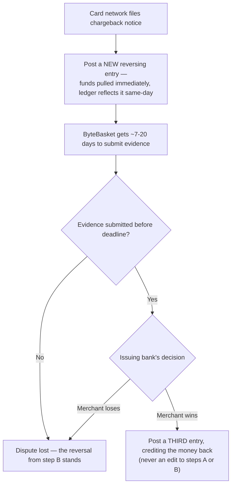

This is the whole story's closing move, and it's worth saying plainly: an auditor — or a curious engineer six months later — can read the raw ledger for this one transaction and reconstruct its *entire* life from nothing but the tape itself: charged, disputed, won. No separate "what actually happened" document is needed anywhere, because the tape *is* the narrative. That single property — the append-only register tape from Chapter 4 — is what every later chapter (sagas, reconciliation, disputes) has secretly been leaning on the whole way through.

**How I'd say this in an interview:** "A chargeback debits the merchant's available balance the moment it opens, not once it's resolved, because that's when the card network actually pulls the funds. And winning a dispute doesn't undo the reversing entry — it adds a third one. That's not a special case for disputes, it's the same append-only rule from the very first ledger chapter, just applied one more time."

---

## The whole arc, in one diagram


---

## Grill me — adversarial follow-ups

**Q1: "Why not just make the client wait longer instead of building an idempotency key at all?"**
Because a longer timeout doesn't remove the ambiguity, it just delays when it bites — the processor can always be slower than whatever number you pick, and a customer will always eventually click twice out of impatience or a real page refresh. The idempotency key solves the actual problem (recognizing a retry as a retry) instead of just making the symptom rarer.

**Q2: "Your idempotency store and your ledger are two different systems — what stops them from disagreeing after a crash?"**
The idempotency write and the ledger write have to commit as one atomic unit, and if they're physically separate stores, the ledger is the one source of truth — the idempotency record should always be treated as rebuildable from the ledger, never the other way round. If they ever disagree, trust the ledger, because that's where the actual money-moving fact lives.

**Q3: "Isn't the register-tape ledger just a slower, more complicated version of a balance column?"**
It's slightly slower to compute a raw `SUM` on every read, which is exactly why real systems cache a rolling balance as a read-optimization — but that cache is always reconstructible from the log and periodically checked against it. The log is the truth; the cache is a shortcut. A bare balance column has no log behind it at all, which is the actual problem, not the read latency.

**Q4: "Why use a saga instead of a two-phase commit across the wallet, ledger, and order databases?"**
Two-phase commit needs all participants to be reachable and responsive at the same moment, and it doesn't survive a participant crashing mid-protocol gracefully — it locks everyone else out until it recovers. A saga trades that fragility for a slightly harder mental model: local transactions plus a compensating action per step, which degrades to "temporarily inconsistent, then corrected" instead of "everyone's stuck."

**Q5: "If the ledger is append-only, how do you ever correct a genuine mistake in it?"**
You never edit or delete the mistaken entry — you post a new entry that reverses it, and if needed, a further entry with the corrected version. The mistake stays visible on the tape forever, which is a feature, not a bug: an auditor needs to see that a mistake happened and was corrected, not have it silently vanish.

**Q6: "Why query the processor's status on a timeout instead of just always retrying with the same idempotency key — isn't that supposed to be safe anyway?"**
It is safe on your *own* API, because you built the idempotency store. But the ambiguity here is about whether the *first* call to the processor ever landed at all — querying status first avoids even attempting a second network call into an unknown state, and it's strictly faster to resolve a known "already approved" answer than to run the full retry-with-key path again for no reason.

**Q7: "Webhooks already have dedup by event ID — why do you still need reconciliation on top of that?"**
Dedup protects against a webhook arriving *more than once*. It does nothing for a webhook that never arrives at all, or for an action taken entirely outside your system, like a refund issued straight through the processor's own dashboard. Reconciliation is the only mechanism that compares your book against theirs and catches what never touched your pipeline in the first place.

**Q8: "Why not just require 3DS on every single transaction and skip building a risk-scoring layer entirely?"**
You'd stop the fraud, but you'd also add friction — and lose real sales — on the 99%+ of transactions that were never risky, and PSD2 itself explicitly carves out exemptions for low-value and repeat-authenticated charges for exactly this reason. Risk scoring exists so the friction is spent only where it's actually buying you something.

**Q9: "A chargeback pulls funds immediately, before any investigation — doesn't that let a customer commit fraud against the merchant risk-free?"**
It's a real, asymmetric risk merchants live with, which is why a merchant gets an evidence window (commonly 7-20 days) to fight it, and why some merchants apply a rolling reserve against future payouts to buffer against exactly this. It's a business/legal trade-off baked into how card networks work, not something a payment system's engineering can design around.

**Q10: "If someone just says 'design a payment system' cold, where do you actually start?"**
Start with the one sentence: it's a ledger with a fraud/compliance layer, talking to systems you don't control, over a network that guarantees you nothing — and say explicitly that the request path needs to be *available* while the ledger needs to be *strongly consistent*, and those are two different dials, not one trade-off. Then walk forward through idempotency and the ledger as the load-bearing core, and go as deep as the interviewer's follow-ups actually point — sagas, webhooks, reconciliation, and fraud are all real depth, but they're earned by a specific question, not defaults you recite unprompted.

---

## Cheat sheet — one line per idea

- **Idempotency key (the claim ticket)**: a client-supplied key lets the server recognize a retry as a retry instead of a new charge — the single most-tested mechanic in this whole topic.
- **Concurrent in-flight retry**: a read-then-write idempotency check races; a unique constraint plus an explicit `in_progress` status makes exactly one request win, with a `409` for the loser.
- **Request-hash check**: hash the request body alongside the key so the same key can't be silently reused for a different amount — mismatch means reject, never guess.
- **Atomic commit**: the idempotency record and the actual money-moving write must commit together, or you risk either a lost charge or a double charge.
- **Double-entry ledger (the register tape)**: every transaction is a balanced debit+credit pair on an append-only log; balance is always a derived `SUM`, never a mutable column.
- **Saga with compensating actions (the relay race)**: local transactions per service, each with its own undo — a wallet hold releases, but a posted ledger entry only ever gets reversed by a *new* entry, never deleted.
- **Ambiguous processor timeout**: never blindly retry a money-moving call after a timeout — query the processor's own status first, always.
- **Authorize / Capture / Settle (the layaway counter)**: three separate real events days apart — a hold, an actual charge, and the real bank-to-bank transfer (T+1/T+2) — collapsing them loses the ability to model holds, voids, and settlement lag.
- **Dangling authorizations**: an uncaptured hold ties up a customer's money for days; a sweep job proactively voids anything nearing its expiry instead of waiting on the card network's own clock.
- **Webhook ingestion (the postcard)**: verify the signature over the *raw* body, dedup by the sender's event ID, and ack fast while processing asynchronously.
- **Reconciliation (checking the checkbook against the bank statement)**: the only mechanism that catches drift against the processor's own records — permanently lost webhooks, dashboard-side mistakes — that nothing else in the system can see.
- **Alert-fatigue triage**: bucket nightly flags by cause first; timing-boundary noise clears itself, and only the genuine, non-clearing residual should page a human.
- **Fraud risk scoring (the bouncer)**: match the friction to the risk — velocity limits and rules catch the bulk cheaply, 3DS/SCA escalates only the genuinely risky ones.
- **Tokenization**: never let your own servers touch a raw card number — the single highest-leverage security decision, and what keeps most of your infrastructure out of PCI-DSS scope.
- **Chargebacks**: funds are pulled the moment a dispute opens, not once it resolves, and winning a dispute posts a third ledger entry — it never undoes the first two.
- **The meta-lesson**: every fix in this story is the same rule, applied one more time — never overwrite the truth, add a new fact next to it, and when you don't know what happened, ask the party who does instead of guessing.
