# Design a Payment System — FAANG Interview Guide

> **Enhancement notes:** this pass added — (1) two new "🆕 End-to-end walkthroughs" full-stack
> `sequenceDiagram`s in §6.3 tracing "click Pay" through gateway → idempotency check → fraud →
> wallet → processor → ledger → order → webhook → notification, and a second trace for "processor
> call times out after the charge actually succeeded, client retries" through the same full stack
> (the existing §8.2 and §10.1/10.2 diagrams were mechanism-level — idempotency-store-only or
> saga-only — not full end-to-end); (2) a concrete dollar-figure worked reconciliation mismatch in
> §12.2, tracing a $12.50 nightly gap to one duplicate out-of-band refund, complementing the
> existing aggregate flagged-row-percentage example in §12.1; (3) a "🆕 Memory hook — authorize vs.
> capture vs. settle" recall table in §7.2; (4) a "🆕 Recall table — idempotency key vs. conditional
> write vs. naturally-idempotent operation" in §8.4. The pre-existing "🆕"-worthy content — the
> §6.1 v1→v2→v3 architecture evolution, the §6.2 four-party/ISO 8583 model, the idempotency,
> ledger, saga, webhook, and reconciliation deep dives — was already at FAANG depth with concrete
> numbers and diagrams; this pass closed the two remaining gaps (full end-to-end traces, a
> single-transaction reconciliation example) rather than rewriting what already worked.

> Source chapter type: correctness-critical transactional system. Inspired by educative's "Introduction to the Payment System", expanded with real ledger/idempotency/reconciliation mechanics for FAANG-depth interviews.

## 1. Mental model

A payment system is **a ledger with a fraud/compliance layer, talking to systems you don't control (banks, card networks, PSPs) over a network that guarantees you nothing.**

Unpack that sentence, because every design decision in this chapter falls out of it:

1. **A ledger** — the single source of truth for "who owns how much money, right now, and how did it get there." Everything else in the system is a client of the ledger, not a replacement for it.
2. **A fraud/compliance layer** — money attracts attackers and regulators simultaneously. You need real-time risk scoring *and* an audit trail good enough to survive a regulator subpoena, and those are different engineering problems solved by different components.
3. **Talking to systems you don't control** — card networks (Visa/Mastercard/Amex), banks (ACH/wire rails), and payment service providers (PSPs) like Stripe/Adyen/Braintree are black boxes to you. You send a request, and the response can be a clean success, a clean failure, or — the case that defines this whole domain — **silence** (timeout, dropped connection, 5xx). You cannot tell "the charge never happened" apart from "the charge happened but I never heard back" from the network alone.
4. **Over an unreliable network** — TCP connections drop, load balancers time out, processes crash mid-request. None of this is exotic; it's Tuesday. The entire discipline of payment-system design is: **make "exactly-once money movement" emerge from an "at-least-once, maybe-zero-times" network**, without ever asking a human to eyeball every transaction.

Compare this to Uber's triad (geo-index + matching engine + a ledger with a fraud layer, see `30-Design Uber-FAANG-Guide.md` §1) — this chapter *is* that third leg, isolated and taken to full depth. Where Uber's payment section treats the ledger as "one deep dive among several," here the ledger, the idempotency mechanism, and the reconciliation job **are** the entire system.

**The central tension to say out loud in the interview**: availability and correctness pull in different directions here, and unlike almost every other system design problem, you cannot resolve it by "picking AP or CP and moving on." You need the request path to be available (a checkout page that hangs is a lost sale) *and* the ledger to be linearizably correct (a double charge is a lawsuit) *and* the whole thing to keep working when a bank's API is down for four hours on a Saturday. The resolution isn't a CAP trade-off, it's **decoupling the user-facing latency from the money-moving correctness** — accept the payment intent instantly, and let idempotent, retriable, auditable machinery move the actual money on its own schedule underneath.

**Analogy**: think of the ledger as a court stenographer — it never edits the transcript, it only ever adds a new line, and the "truth" of what happened is derived by reading the whole transcript, not by asking the stenographer "what's your opinion right now."

---

## 2. Interview playbook & how to spot this topic

### 2.1 How to identify this topic in an interview

You're being asked to design a payment system when you hear:

- "Design a payment processing system" / "Design PayPal / Stripe / Venmo / a wallet app."
- "Design the checkout flow for [Amazon/Uber/DoorDash] — go deep on payments, not the rest of the product."
- "How would you make sure a customer is never charged twice?"
- "Design a system that moves money between two accounts and never loses track of it."
- "Design a system that has to reconcile with a bank/processor overnight."

Distinguish from adjacent problems:
- **A generic "distributed transaction" question** (e.g., "design a system that debits inventory and credits an order") is the *saga* sub-problem of this chapter (§10), not the whole thing — payments additionally require an external processor, PCI scope, and a settlement/reconciliation layer that a generic saga question doesn't.
- **Uber/DoorDash/Airbnb "payments" sub-section** is this chapter's content *applied inside* a bigger marketplace design — if the interviewer says "just the payment piece," this chapter is your answer; if they want the whole ride-hailing system, dial back to the depth in `30-Design Uber-FAANG-Guide.md` §13.
- **Blockchain/crypto payment rails** are explicitly a different system (no ledger owner, consensus instead of ACID) — say you're scoping to a traditional custodial ledger unless told otherwise.

### 2.2 Order to talk through it out loud

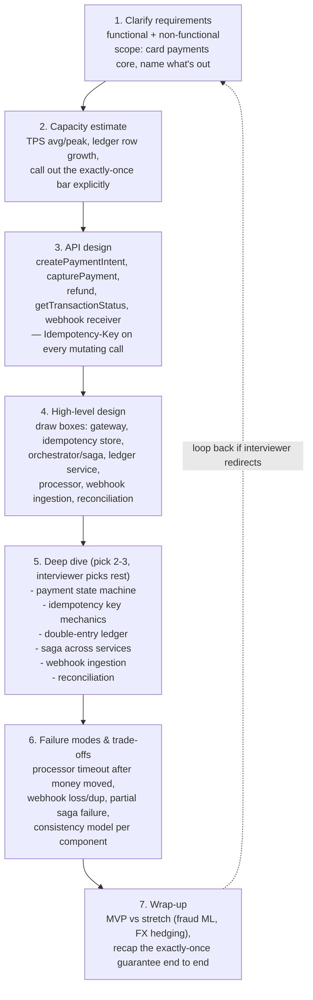

**Cheat-sheet for this section**
- Open with the mental model sentence from §1 — "ledger + fraud layer talking to systems I don't control, over an unreliable network" — before drawing a single box. It tells the interviewer you know what's actually hard here.
- State your scope cut up front: "I'll design card-payment authorize→capture→settle→payout plus refunds and disputes; I'll treat the card network and issuing/acquiring banks as black-box external dependencies unless you want me to go deeper into ISO 8583."
- Budget your 45 minutes: ~5 min requirements, ~5 min capacity, ~5 min API, ~10 min HLD, ~15 min deep dive, ~5 min trade-offs/wrap-up — identical shape to every other FAANG system design interview, the content is what's different here.
- The single most-tested sub-skill in this whole topic is idempotency — if you only nail one deep dive, make it §8.
- Never let "we use a queue" be your answer to correctness. A queue gives you durability and decoupling; it does not give you exactly-once by itself — pair every async step with an idempotency key or a natural dedup key.

---

## 3. Requirements clarification

### 3.1 Functional requirements

| # | Requirement | Notes to say out loud |
|---|---|---|
| 1 | Charge a card / bank account | `createPaymentIntent` → `capturePayment`; support both "auth now, capture later" and "auth+capture together" |
| 2 | Refund a payment | Full or partial; refunds go through the same rail as the original charge, and can only refund up to the captured amount |
| 3 | Payout to a seller/driver/merchant | Money leaving the platform's pooled account to an external bank account — a *different* rail and risk profile than charging a customer |
| 4 | Multi-currency support | Store amounts in minor units (cents) in a fixed currency per ledger entry; conversion happens at a boundary, never inside the ledger (§4, §9) |
| 5 | Recurring / subscription billing | A scheduler that creates a new `PaymentIntent` per billing cycle against a stored, tokenized payment method — reuses the whole charge pipeline, doesn't reinvent it |
| 6 | Webhooks / notifications | Asynchronously tell the merchant/internal services "payment succeeded/failed/refunded/disputed" — at-least-once delivery, must be idempotent on the receiving end (§11) |
| 7 | Dispute / chargeback handling | Ingest a chargeback notice from the card network, freeze/reverse the disputed funds, give the merchant a window to submit evidence |
| 8 | Query transaction status | `getTransactionStatus` — must reflect the *ledger's* view, not a stale cache, when money is in flight |

**Explicitly out of scope unless asked:** building your own card network, in-house bank charter/rails, a full fraud ML pipeline (see wrap-up), a tax engine, a full accounting/GL product for merchants. Say this out loud — it shows scoping discipline, exactly like Uber's guide scopes out UberPool matching.

### 3.2 Non-functional requirements

| Requirement | Why it matters here | Design lever |
|---|---|---|
| **Exactly-once semantics** (no double charge, no lost charge) | The one property that, if wrong, becomes a legal/trust problem, not just a bug | Idempotency keys (§8) + double-entry ledger (§9) |
| **Strong consistency on balances** | Two concurrent reads of "can this account afford this charge" must not both say yes when only one can be true | Ledger writes are ACID transactions; balance is a derived aggregate, not a racy mutable field |
| **Auditability** | Every balance-affecting write must be explainable, forever, to a regulator or auditor | Immutable, append-only ledger; nothing is ever `UPDATE`d or `DELETE`d, only appended |
| **PCI-DSS compliance** | Storing raw card numbers makes your entire stack a compliance liability | Tokenization at the edge — raw PAN never enters your infrastructure (§16) |
| **Availability of the *request* path** | A checkout page that spins is a lost sale, even though correctness matters more than latency for the *money-moving* path | Decouple "accept the intent" (must be fast, must be available) from "settle the money" (can be async, must be correct) |
| **Durability** | An accepted payment intent must never be silently dropped, even if a service crashes mid-request | Idempotency store and ledger writes both go to durable storage before acknowledging the client |
| **Fault tolerance against external dependencies** | The card network or a specific bank *will* be slow or down sometimes, and it's not your outage to have | Circuit breakers + retries-with-backoff + a "pending" state that doesn't block the user |

**Key interview move — separate the availability bar from the correctness bar, explicitly.** Say: "I want the *front door* (accepting a payment intent) to be highly available, because a slow checkout page loses revenue. I want the *ledger* to be strongly consistent, because an incorrect balance is a legal and trust failure, not a UX inconvenience. These are not the same dial, and conflating them is the classic mistake in this problem." This is the payments-domain equivalent of Uber's "CAP per component, not per system" line, and interviewers listen for the analogous sentence here.

### 3.3 Clarifying questions to ask the interviewer

- Scope: card payments only, or also bank transfers (ACH/wire) and wallet-to-wallet transfers?
- Are we the merchant-of-record (we own the PSP relationship) or a platform routing to many merchants' own PSP accounts (marketplace/Connect-style, e.g. Stripe Connect)?
- Do we need to support multiple currencies and cross-border FX, or is this single-currency?
- What's the acceptable settlement latency — same-day, T+1, T+2? (This shapes the reconciliation cadence, §12.)
- Do we need subscription/recurring billing in scope, or one-off charges only?
- What's the expected transaction volume (this drives §4's sizing) and is there a known peak event (Black Friday, a flash sale)?
- Is fraud detection in scope as a deep dive, or can we treat it as "call an external risk-scoring service" and move on?

**Cheat-sheet for this section**
- Lead with "exactly-once" as the headline non-functional requirement — it's the one word an interviewer is listening for in this topic.
- Separate the availability requirement (request path) from the consistency requirement (ledger) explicitly — this is the single sentence that most differentiates a senior answer from a junior one here.
- Auditability is easy to forget as a *non-functional* requirement — mention it before being asked; it's not "nice to have," it's the reason the ledger is append-only at all.
- Ask whether you're the merchant-of-record or a routing platform — the architecture (and the PCI scope) differs materially.

---

## 4. Capacity estimation (worked example)

### 4.1 Assumptions

Assume a large e-commerce/marketplace platform at Stripe/Adyen scale:

```
Total payment transactions/day        : 100,000,000  (100M)
Average transaction value             : $45
Refund rate                            : ~2% of transactions
Dispute/chargeback rate                : ~0.1% of transactions
Webhook-worthy events per transaction  : ~4 (created, authorized, captured, settled)
Ledger entries per transaction         : 2 (one debit, one credit — double-entry, §9)
Peak/average multiplier                : ~10x on a flash-sale day (Black Friday-class),
                                          vs ~3-5x typical for most consumer traffic
```

**Grounding these numbers in reality, so you're not inventing fluff:** Stripe's own published figures put its 2024 total payment volume at **$1.4 trillion**, its systems handling **~500 million API requests/day**, and its internal Ledger logging **~5 billion money-movement events/day** — the 100M-transactions/day, 4-events-per-transaction assumption above is a deliberately conservative, round-number stand-in for a platform at meaningful (not hyperscale) size. On the card-network side, Visa's *peak engineered capacity* is publicly cited at **over 65,000 transactions/second**, while typical *average* load is far lower (low-to-mid thousands of TPS) — the gap between those two numbers is exactly the peak/average multiplier this section exists to teach you to reason about.

### 4.2 TPS — the number that shapes the architecture

```
Transaction QPS (avg)  = 100,000,000 / 86,400 s ≈ 1,157 TPS
Transaction QPS (peak) ≈ 1,157 × 10 ≈ 11,570 TPS   (flash-sale-class event)

Ledger write QPS (avg)  = 1,157 TPS × 2 entries/txn ≈ 2,314 writes/sec
Ledger write QPS (peak) ≈ 11,570 × 2 ≈ 23,140 writes/sec

Webhook fan-out QPS (avg)  = 1,157 × 4 events ≈ 4,628/sec
Webhook fan-out QPS (peak) ≈ 11,570 × 4 ≈ 46,280/sec

Refund QPS (avg)  = 1,157 × 2% ≈ 23/sec  (small, but must reuse the same idempotent path as a charge)
Dispute QPS (avg) = 1,157 × 0.1% ≈ 1.2/sec  (tiny volume, outsized operational and legal cost per event)
```

**Takeaway to say in the room:** "The transaction-request rate itself (~1,157 TPS average) is modest by FAANG standards — the real engineering pressure is the *fan-out*: every transaction produces 2 ledger writes and ~4 webhook events, and every one of those needs the same durability and idempotency guarantee as the original charge. This is why the idempotency store and ledger, not the API gateway, are the components that need the most careful scaling story."

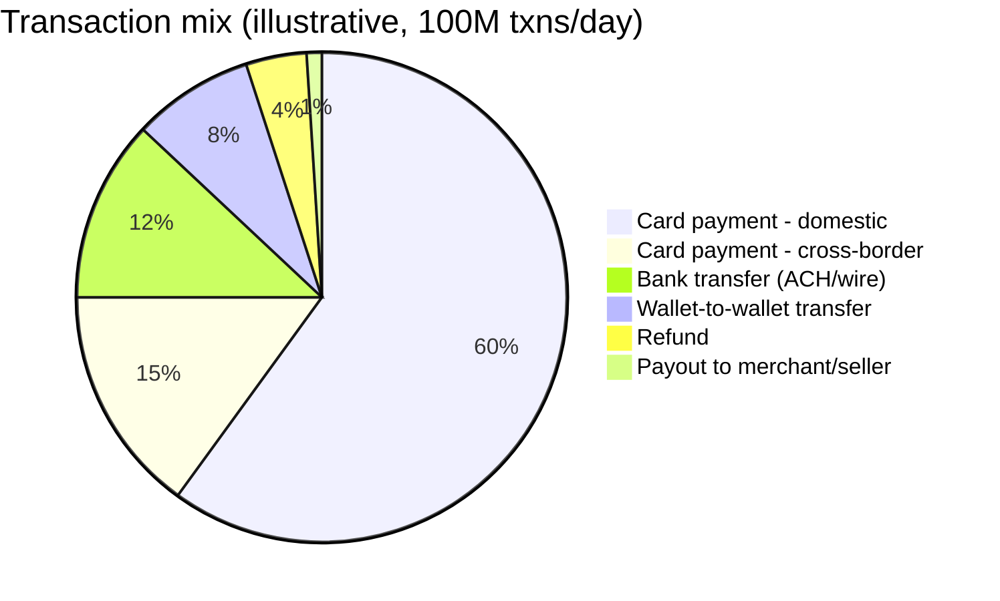

### 4.3 Storage — ledger row growth

```
Ledger entries/day = 100,000,000 txns × 2 entries/txn = 200,000,000 rows/day
Bytes/row (entry_id, account_id, txn_id, amount, currency, direction, created_at, metadata) ≈ 250 B
Raw ledger volume/day ≈ 200,000,000 × 250 B ≈ 50 GB/day

Annual raw ≈ 50 GB × 365 ≈ 18.25 TB/year
With 3x replication (durability requirement, not optional for a ledger) ≈ ~55 TB/year

Idempotency-key store: 1,157 avg TPS × 86,400 s ≈ 100M keys/day, each ~200 B (key, request hash,
  response snapshot, status, TTL) ≈ 20 GB/day — small, but this store needs the SAME durability
  bar as the ledger (§15), which is the easy-to-miss "aha" of this section.

Webhook event log (for retry/replay + audit): ~400M events/day × ~300 B/event ≈ 120 GB/day
```

**The contrast worth naming out loud:** the ledger is small-but-permanent (50 GB/day, kept for 7+ years for regulatory retention — this never gets a TTL), while the webhook event log is large-but-disposable (120 GB/day, safe to TTL after ~90 days once delivery is confirmed and reconciled). This is the same "hot/ephemeral vs append-only-huge vs ACID-and-permanent" three-way split Uber's guide makes about location data vs trip/ledger data (`30-Design Uber-FAANG-Guide.md` §7.2) — the pattern recurs because it's a general truth about mixed real-time/financial systems, not a coincidence.

### 4.4 Numbers worth memorizing

| Metric | Value | Context |
|---|---|---|
| Visa peak engineered capacity | 65,000+ TPS | Publicly cited network capacity ceiling |
| Visa typical average load | low-to-mid thousands of TPS | The peak/average gap is the point — provision for peak, not average |
| Stripe reported 2024 TPV | $1.4 trillion | Illustrative of "this is a real, hyperscale problem," not a number to derive from |
| Stripe reported daily API requests | ~500 million/day | ~5,787/sec average, per Stripe's own published figures |
| Stripe internal Ledger events/day | ~5 billion | The fan-out ratio (many ledger events per customer-visible transaction) at hyperscale |
| PSP authorization round trip | 200 ms – 2 s | External dependency — budget a timeout and a retry policy around it |
| Stripe webhook retry window | up to 3 days, exponential backoff | immediate → 5 min → 30 min → 2 h → 5 h → 10 h → every 12 h |
| Idempotency key TTL (Stripe's own default) | 24 hours | After which the same key can legitimately be reused for a new operation |
| Card network settlement cycle | typically T+1 to T+2 | Drives the cadence of the nightly reconciliation job (§12) |

**Cheat-sheet for this section**
- Lead with TPS, but immediately pivot to "the real pressure is the fan-out multiplier" — 1 transaction becomes 2 ledger writes and ~4 webhook events, and each needs the same guarantees as the original.
- Separate "small but permanent" (ledger) from "large but disposable" (webhook/event log) storage — say this contrast explicitly, it's a strong depth signal.
- Cite real numbers (Visa's 65,000 TPS peak capacity, Stripe's $1.4T TPV / 5B ledger events/day) to ground your invented worked example in something real, then say clearly which numbers are yours vs. cited.
- Always give peak *and* average — a flash-sale event is the ~10x case here, higher than Uber's typical 3-5x rush-hour multiplier, because payment spikes (Black Friday) are more extreme than commute-hour ride demand.

---

## 5. API design

| API | Signature | Purpose |
|---|---|---|
| Create a payment intent | `createPaymentIntent(amount, currency, paymentMethodToken, captureMethod)` | Declares intent to charge; may auto-capture or require a separate capture call |
| Confirm / authorize | `confirmPaymentIntent(paymentIntentID, paymentMethodToken)` | Runs the actual authorization against the processor, may trigger 3-D Secure (§16) |
| Capture a payment | `capturePayment(paymentIntentID, amountToCapture)` | Converts a hold into an actual charge; supports partial capture |
| Void an authorization | `voidPayment(paymentIntentID)` | Cancels an un-captured authorization before it settles |
| Refund a payment | `refundPayment(transactionID, amount, reason)` | Full or partial; capped at the captured amount |
| Get transaction status | `getTransactionStatus(transactionID)` | Reads the ledger's authoritative state, not a cache, for in-flight money |
| Create a payout | `createPayout(accountID, amount, currency, destination)` | Moves money out to a seller/driver's bank account |
| Webhook receiver | `POST /webhooks/processor` | Ingests async events from the external PSP/card network (§11) |

### 5.1 Example request/response — the idempotency key is not optional

```json
POST /v1/payment_intents
Idempotency-Key: 7c9e6679-7425-40de-944b-e07fc1f90ae7
Content-Type: application/json

{
  "amount": 4599,
  "currency": "usd",
  "payment_method_token": "pm_tok_9f8a7b6c",
  "capture_method": "automatic",
  "metadata": { "order_id": "ord_88213" }
}
```

```json
200 OK
{
  "id": "pi_3Nk8f2L2ez",
  "status": "succeeded",
  "amount": 4599,
  "currency": "usd",
  "amount_captured": 4599,
  "created": 1721740800,
  "charges": [
    { "id": "ch_1Nk8f2L2ez", "outcome": "authorized_and_captured" }
  ]
}
```

**Retrying the exact same request with the same `Idempotency-Key` — even minutes or hours later, even after a lost response — returns this exact same JSON body and status code, without creating a second charge.** This is the single most load-bearing line in the entire API design, and it's the mechanism §8 exists to explain in full.

```json
POST /v1/refunds
Idempotency-Key: a1b2c3d4-5e6f-7890-abcd-ef1234567890

{ "transaction_id": "ch_1Nk8f2L2ez", "amount": 1500, "reason": "requested_by_customer" }
```

```json
409 Conflict
{
  "error": {
    "type": "idempotency_error",
    "message": "A request with this Idempotency-Key is currently being processed. Retry after it completes, or check status via getTransactionStatus."
  }
}
```

That `409` is not a design accident — it's the concurrent-in-flight-retry case that §8 covers in depth, and it's the detail most candidates miss when they only describe the "retry after a completed response" happy path.

**Cheat-sheet for this section**
- Every mutating endpoint (create, confirm, capture, refund, payout) takes an `Idempotency-Key` header — say this as a blanket rule, not endpoint-by-endpoint.
- `getTransactionStatus` is a read, but it must read from the ledger's consistency boundary, not an eventually-consistent cache, whenever money is "in flight" (authorized-but-not-settled).
- Show the `409` concurrent-in-flight response, not just the "replay after completion" response — it's the detail that signals you've actually thought about race conditions, not just read the happy-path docs.
- `capturePayment` supporting a *partial* amount is a common follow-up ("what if the merchant ships less than the full order?") — mention it unprompted.

---

## 6. High-level architecture

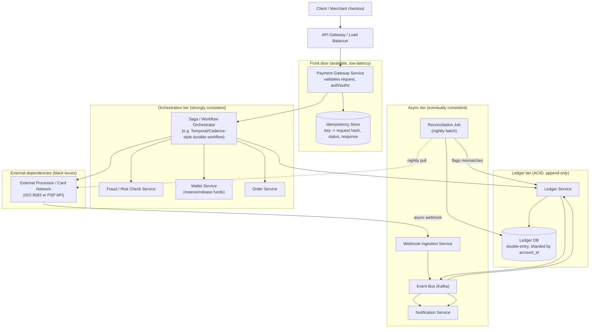

**Component roles, one line each:**
- **Payment Gateway** — the only synchronous, user-facing hop; validates the request and idempotency key, then hands off. Must be fast and available; must never itself decide "did the charge succeed."
- **Idempotency Store** — a durable key-value store keyed on the idempotency key; the single source of truth for "have we seen this exact logical operation before." Needs the same durability bar as the ledger (§15) — this is the most commonly under-designed component in this whole system.
- **Saga/Workflow Orchestrator** — coordinates the multi-step, multi-service transaction (reserve wallet funds → check fraud → call processor → post ledger entries → confirm order), and knows how to run compensating steps if any step fails (§10).
- **Ledger Service** — the only writer to the ledger DB; enforces the double-entry invariant on every write (§9).
- **External Processor / Card Network** — a black box you call over HTTP (PSP APIs like Stripe/Adyen) or, at the lowest level, via ISO 8583 messages routed through an acquirer to the card networks. You control neither its latency nor its failure modes.
- **Webhook Ingestion Service** — the *inbound* side of the external dependency: verifies signatures, dedups by event ID, republishes internally (§11).
- **Reconciliation Job** — a nightly batch that is the system's own self-check: diff the ledger against the processor's settlement file and flag drift (§12).

**Cheat-sheet for this section**
- Draw the front door (available) and the ledger tier (strongly consistent) as visually separate blocks — the same move Uber's guide makes for its real-time vs. trip/payment tiers, and for the same reason: it's the clearest signal of design maturity in this problem shape.
- The idempotency store sits *before* the orchestrator, not inside it — every retry, from any layer, must hit the same dedup check before doing any work.
- The reconciliation job is drawn as a first-class component, not an afterthought cron job — it's the system's only defense against silent, undetected drift with an external party you don't control.
- Say explicitly: "the webhook ingestion path and the synchronous request path both funnel into the same Ledger Service — there's exactly one writer to the ledger, no matter which direction the write came from." This prevents a very common design bug (two independent write paths racing on the same account).

### 6.1 Architecture evolution — from a naive monolith to the design above

Walking an interviewer through *how* you'd arrive at the §6 architecture, rather than presenting it fully-formed, is as valuable here as it is in Uber's guide (`30-Design Uber-FAANG-Guide.md` §7.5) — arguably more so, because every stage's failure is a real, named payments incident pattern, not a hypothetical.

**Stage 1 — naive single-service, synchronous design (what most candidates instinctively draw first):**

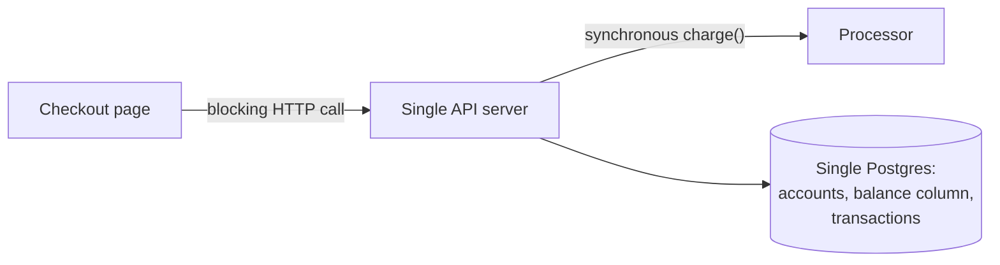

*What breaks:* the user waits on a live 200ms-2s PSP round trip inside the request — the worst possible place to add latency, right when they're trying to complete a purchase. Worse, a network blip between the API server and the processor after the processor has already approved the charge is indistinguishable, from the client's perspective, from a blip before approval — a naive client-side retry on timeout double-charges. And `balance` as a mutable column (§9) means there's no way to explain a discrepancy after the fact, and no way to safely handle two concurrent debits against the same account without heavy row-level locking that serializes all activity on a popular merchant's account.

**Stage 2 — idempotency key + async capture + a real ledger:**

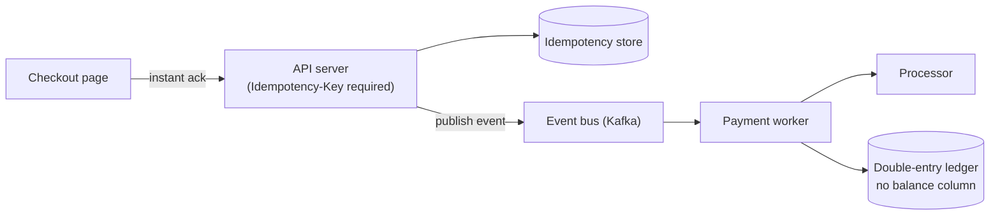

*What improved:* the checkout page gets an instant acknowledgment; the actual processor call and ledger post happen off the critical path, retried safely because every retry carries the same idempotency key (§8); the ledger is now append-only, so a discrepancy is explainable by replaying the log, not by trusting a single mutable number.
*What still breaks:* everything is one region, one processor, and there's still no mechanism to detect drift *against* the processor's own records if a webhook is silently lost, no compensating-action story if the ledger post succeeds but the order service crashes before confirming, and no way to see whether "correct" today is still "correct" a week from now once settlement and disputes enter the picture.

**Stage 3 — the full design (§6):** adds the saga orchestrator so a partial failure mid-transaction has a defined compensating action (§10), a dedicated webhook ingestion service so inbound processor events are deduped and durable rather than best-effort (§11), and a reconciliation job so drift against the processor's own settlement file is *detected*, not just hoped against (§12). Each addition answers a specific gap from Stage 2, not an arbitrary design flourish — that's the story worth telling out loud.

**The narrative to say out loud:** "I'd start simple — one service, synchronous charge, a mutable balance column — then show you exactly where that breaks: blocking latency, ambiguous timeouts, and no audit trail. Then I'd evolve it in two concrete steps to the async, saga-coordinated, reconciled design, and each step exists because of a specific failure mode, not because it's what the textbook says to draw."

### 6.2 The four-party model & ISO 8583 — what "the card network" actually is

"Call the processor" hides a real, four-party structure that's worth being able to draw when an interviewer pushes on "what happens after you call `authorize()`":

```mermaid
flowchart LR
    Cardholder["Cardholder<br/>(your customer)"] -- "card details / token" --> Merchant["Merchant<br/>(your platform)"]
    Merchant -- "ISO 8583 auth request<br/>(via your PSP)" --> Acquirer["Acquiring bank<br/>(merchant's bank)"]
    Acquirer -- "ISO 8583 auth request" --> Network["Card network<br/>(Visa/Mastercard rails)"]
    Network -- "ISO 8583 auth request" --> Issuer["Issuing bank<br/>(cardholder's bank)"]
    Issuer -- "approve/decline" --> Network
    Network -- "approve/decline" --> Acquirer
    Acquirer -- "approve/decline" --> Merchant
    Merchant -- "receipt" --> Cardholder
```

Your PSP (Stripe/Adyen/Braintree) exists specifically to hide this four-hop chain behind one clean HTTP API — but knowing what's underneath explains *why* a card decline can come from any of three different parties (issuer says insufficient funds, network flags fraud risk, acquirer's own risk rules reject it), and why settlement (§7's `SettlementPending` state) genuinely takes T+1/T+2: the issuer and acquirer's banks settle net obligations with each other on their own batch cycle, not in real time.

**ISO 8583 is the message format every hop above speaks**, whether or not your PSP exposes it to you directly:

| Field (common numbering) | Name | Purpose |
|---|---|---|
| MTI (message header) | Message Type Indicator | 4 digits — identifies the message class, e.g. `0100` = authorization request, `0110` = authorization response |
| Field 2 | Primary Account Number (PAN) | The card number — in a modern tokenized architecture (§16.1), your own systems never see this field's real value, only the PSP does |
| Field 3 | Processing code | What kind of transaction — purchase, refund, cash advance |
| Field 4 | Transaction amount | In the transaction's currency, minor units |
| Field 39 | Response code | `00` = approved, and a large, standardized table of specific decline reasons (insufficient funds, do-not-honor, expired card, suspected fraud) |
| Field 41 / 42 | Terminal / merchant identifiers | Which merchant and terminal originated the request |

**Why this matters for your design, not just as trivia:** ISO 8583's field 39 response codes are exactly what your `Failed` state (§7) needs to distinguish — "insufficient funds" (retryable by the customer with a different card, not by your system) versus "suspected fraud" (should route to your own risk/fraud handling, not a naive retry) versus "expired card" (should prompt a payment-method update, not a blind retry at all). A payment system that collapses every ISO 8583 decline into one generic `Failed` status loses information the network is handing you for free.

### 6.3 🆕 End-to-end walkthroughs — two full-stack traces

Every diagram so far is either an architecture box diagram (§6) or a single-mechanism sequence diagram scoped to one component (idempotency store in §8.2, the saga in §10.1/§10.2). Neither shows one concrete request traveling through *every* component the §6 architecture actually has. These two traces do — the first is the happy path, the second is the scenario that actually separates a shallow answer from a deep one: the processor call times out from your side, but the charge already succeeded on theirs.

#### 🆕 A. Happy path: click "Pay" to settlement notification

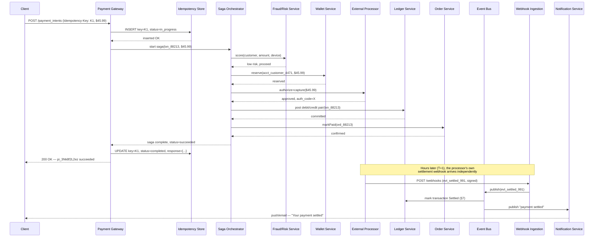

Notice this is the *only* diagram in the chapter where you can point at one arrow and say "this is where the money actually became real" (the `Settled` mark, days after the customer saw "succeeded") — everything before it, including the `200 OK` the client sees, is `Captured` at best (§7). That gap between "the customer thinks it's done" and "the money has actually cleared" is precisely why §7 makes `Settled` its own state instead of collapsing it into `Captured`.

#### 🆕 B. Processor times out after the charge actually succeeded — client retries

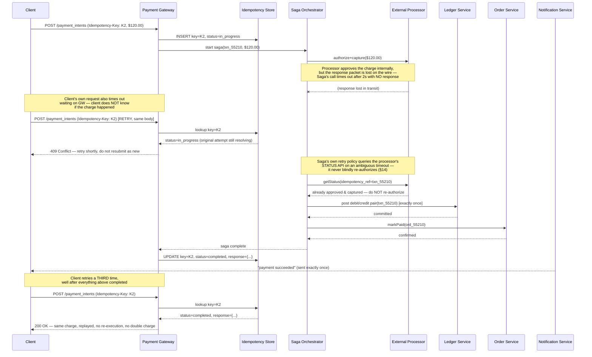

**Two separate idempotency mechanisms are stacked here, not one** — the client-facing `Idempotency-Key` dedup (§8) stops the client's own retries from re-entering the saga at all, while the saga's own "query the processor's status before assuming failure" discipline (§14) stops *your own backend's* ambiguous-timeout retry from re-authorizing a charge that already succeeded on the processor's side. Either mechanism alone leaves a gap; together they're what makes "exactly-once" true end to end, not just at the API boundary.

---

## 7. Deep dive: the payment state machine

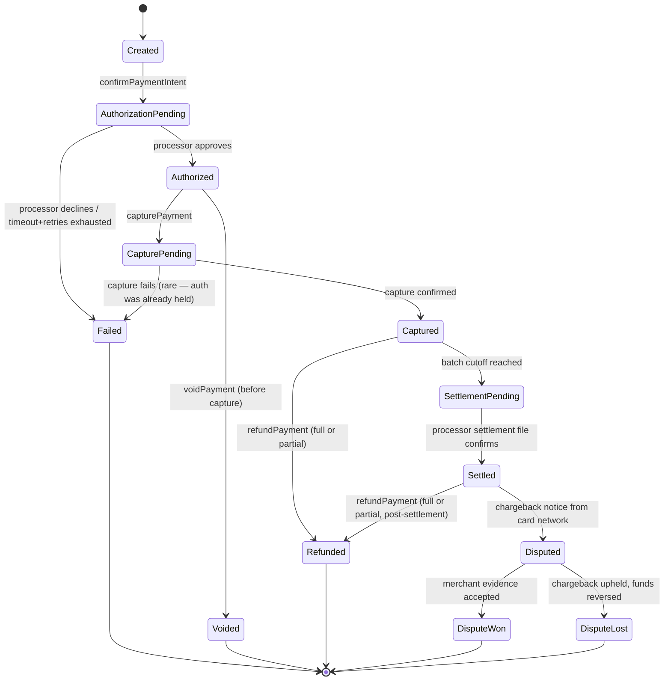

**Why this shape, not a simpler one:**
- **`Authorized` and `Captured` are separate states, not one** — because a hotel or car-rental style hold authorizes an amount now but only captures the actual amount days later; collapsing these two loses the ability to model "auth without capture" (which is also how `voidPayment` becomes meaningful — you can only void before capture, you can only refund after).
- **`SettlementPending` is a real, distinct state** — capture happens at the processor level in near-real-time, but settlement (money actually moving bank-to-bank via the card network's clearing cycle) is typically T+1 to T+2. If your state machine treats `Captured` as terminal, you'll misreport "the money has moved" a full day or two before it actually has — this is exactly the trip-to-payment linkage gap Uber's guide calls out (`30-Design Uber-FAANG-Guide.md` §15.3: "why `Completed` isn't really the last state").
- **`Disputed` branches off `Settled`, not `Captured`** — a chargeback is initiated by the cardholder's *issuing bank*, which only happens after the transaction has cleared; you cannot dispute money that hasn't settled yet.
- **Every non-terminal state has a `Failed` escape hatch** — a state machine with no failure transition from a pending state is a state machine that will eventually deadlock a real transaction in production.

### 7.1 Dispute/chargeback handling, one level deeper

The `Settled → Disputed` transition above is a single arrow; the process behind it is a small workflow of its own, and "how would you handle a chargeback" is common enough as a standalone follow-up to deserve its own flow:

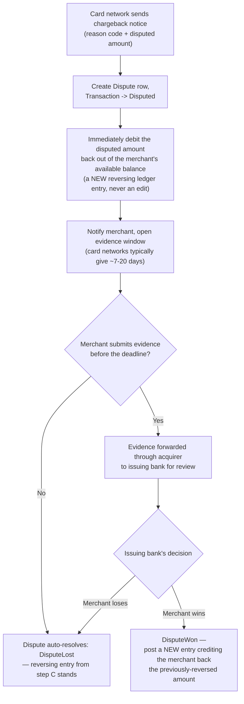

**Two mechanics worth calling out explicitly, because they're easy to get wrong:** first, the disputed amount is deducted from the merchant's *available* balance the moment the dispute opens — not after it resolves — because the card network itself withdraws the funds from the acquirer immediately; your ledger has to reflect that reality, not a hoped-for outcome. Second, notice this is the same immutability rule as everywhere else in this chapter: winning a dispute doesn't "undo" the reversing entry from step C, it posts a **new, third entry** crediting the money back — the ledger for a disputed-then-won transaction ends up with three balanced pairs (original charge, dispute reversal, dispute-won reversal-of-reversal), not one edited row. This is precisely why an auditor reading the raw ledger log can reconstruct the entire story of a transaction's life without needing a separate "what actually happened" narrative — the log *is* the narrative.

### 7.2 🆕 Memory hook — authorize vs. capture vs. settle

Candidates conflate these three words constantly under interview pressure — a compact recall table beats trying to re-derive the distinction live:

| Term | What actually happens | Whose money moves | When | If X then Y |
|---|---|---|---|---|
| **Authorize** | Issuer places a hold on the cardholder's available credit/balance for the amount | Nobody's money moves yet — it's a reservation, not a transfer | Near-real-time (200ms-2s round trip) | If never captured within ~7 days → the hold auto-expires (dangling authorization, §14) |
| **Capture** | Merchant/platform converts some or all of the hold into an actual charge request | Still nobody's money has *settled* — this confirms "I want the money," it doesn't yet deliver it | Immediately after auth, or any time up to the hold's expiry window | If capture amount < authorized amount → the difference is released back to the cardholder, never captured |
| **Settle** | The card network clears net obligations between issuing and acquiring banks; money actually moves bank-to-bank | Real money moves, for real, between real banks | Typically T+1 to T+2 after capture | If you report "money received" or allow a payout before this point → you're describing a promise, not a fact |

**The mnemonic**: *"Ask, Take, Bank"* — you **ask** for a hold (authorize), you **take** the amount you actually earned (capture), and only then does the **bank**-to-bank transfer actually happen (settle). Everything before "Bank" is still cleanly reversible with a simple void; everything after requires a refund or dispute — a new ledger fact, never an edit (§9).

**Cheat-sheet for this section**
- If asked to draw the state machine from scratch, draw `Authorized` and `Captured` as two separate boxes before anything else — collapsing them is the single most common mistake candidates make here.
- `Settled` — not `Captured` — is the state that should gate "can this be disputed" and "is this eligible for payout to the merchant."
- Every arrow into a terminal-looking state should make you ask "what if this fails partway" — and the answer should point back at a `Failed`/compensating transition, not silence.
- A dispute resolves in *three* ledger entries when it's won (charge, reversal, reversal-of-reversal), not one edited row — say this if asked to defend the immutability rule against a "just fix the balance" objection.

---

## 8. Deep dive: idempotency key mechanics, end to end

The Spectacular Failures guide's idempotency section (`39-Spectacular-Failures-FAANG-Guide.md` §4.10) covers the mechanism at the "why retries need this at all" level: client sends a key, server stores "key → result," a retry with the same key returns the stored result. That's necessary but not sufficient for a system whose entire job is money — three gaps have to be closed to make it production-grade, and this is where a payment-focused interview digs in.

### 8.1 The three gaps beyond the shallow mechanism

1. **What if the retry arrives *while the original request is still executing*, not after it finished?** The shallow version assumes the first request always completes (success or failure) before a retry shows up. In reality, a client can time out and retry in 2 seconds while the server is still 400ms into calling the external processor. The idempotency store needs an explicit `in_progress` status, not just `completed`/`failed` — a second request with the same key while the first is `in_progress` must be rejected with a `409 Conflict` (§5.1) or made to poll, **never** allowed to proceed and race the first request to the processor.
2. **What if the retry has the same key but a *different* request body?** (Amount changed, different payment method.) This is a client bug or an attack, not a legitimate retry. The server must hash the request parameters alongside the key and reject a key-reuse-with-different-params as an error — Stripe's own API does exactly this.
3. **The idempotency record and the actual side effect must commit atomically, or not at all.** If you write the ledger entry and then crash before recording the idempotency key, a retry will redo the ledger write — a double charge. If you record the idempotency key and then crash before writing the ledger, a retry will correctly no-op, but the money never actually moved — a lost charge. The fix: **the idempotency-key write and the ledger write happen in the same database transaction** (or, if they're in different stores, the idempotency write happens strictly *after* the ledger transaction commits, with the ledger being the true source of truth and the idempotency store as an accelerator that can always be safely rebuilt from it).

### 8.2 Sequence: concurrent retry, not just a late retry

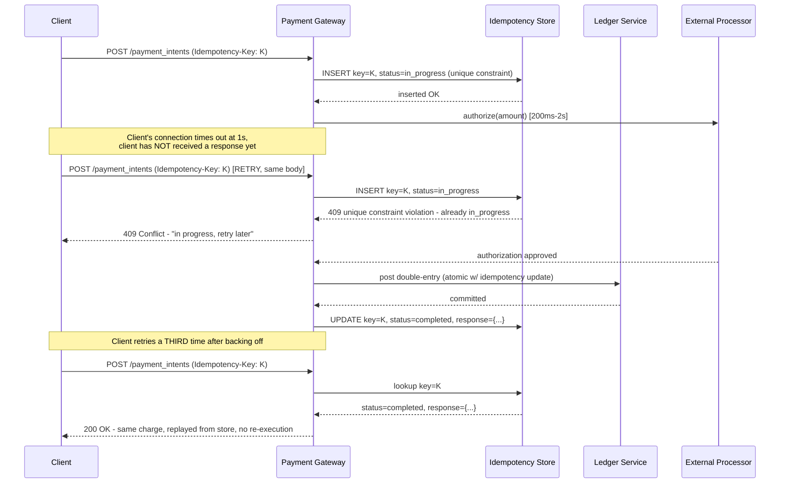

**The insight this diagram adds over the shallow version:** the dangerous window isn't "after the response is lost," it's "while the first attempt is still running." A unique constraint on the idempotency key (not a read-then-write check, which races) is what turns "two requests arrived close together" into "exactly one of them does the work, the other is told to wait or replay."

### 8.3 Storage shape and lifecycle

| Field | Purpose |
|---|---|
| `idempotency_key` (PK, unique) | The client-supplied key; enforced unique at the DB/store level so concurrent inserts race safely |
| `request_hash` | Hash of the request body — detects key-reuse-with-different-params |
| `status` | `in_progress` \| `completed` \| `failed` |
| `response_snapshot` | The exact status code + body to replay on a matching retry |
| `created_at` / `expires_at` | TTL — Stripe's own default is **24 hours**, after which the key can be legitimately reused for an unrelated new operation |

### 8.4 🆕 Recall table — idempotency key vs. conditional write vs. naturally-idempotent operation

Three different mechanisms get lumped together as "just make it idempotent," and reaching for the wrong one for the wrong operation is a common slip under interview pressure:

| Mechanism | How it works | Best for | Weakness if misapplied |
|---|---|---|---|
| **Idempotency key** (this section) | Client supplies an opaque key; server stores key→result, replays the stored result on a retry | An operation with a real external side effect that can't be made safe to repeat on its own (charge a card, issue a payout) | Requires a durable store with ledger-grade durability (§15.3); does nothing if the client fails to send the same key on retry |
| **Conditional write** (e.g. `UPDATE ... WHERE status='pending'`, or a DB unique constraint) | The write only succeeds if the row is still in the expected prior state; a retry arriving after the first write already advanced the state simply no-ops | Internal state transitions your own service owns end-to-end (e.g. a `PaymentIntent`'s status advancing exactly once, §7) | Doesn't help across a service/process boundary, where the "retry" is a brand-new external call, not a second write against a row you already control |
| **Naturally idempotent operation** | The operation is safe to repeat by construction — no key or check needed at all | Setting an absolute value (`status = 'captured'`), a pure read (`getTransactionStatus`), inserting a row keyed by a caller-supplied unique ID | Only holds when the operation has no "add N" / "charge again" semantics — `balance += amount` is the counterexample that always needs one of the other two mechanisms instead |

**If X then Y, memorized:** if the operation moves money or calls an external processor → use an idempotency key. If it only changes your own row's state and that state monotonically advances → a conditional write is enough on its own. If it's a pure read or an absolute-value set → it's naturally idempotent, don't build machinery for it.

**Cheat-sheet for this section**
- Lead with the fact that "idempotency key" is necessary but the *concurrent in-flight retry* is the gap that separates a shallow answer from a deep one — say this contrast explicitly, referencing "the simple version everyone knows" before showing the harder case.
- A unique constraint + `in_progress` status, not a read-then-write check, is what makes the concurrent case race-safe.
- The idempotency write and the ledger write must be atomic with each other — say which one is the source of truth if they ever disagree (the ledger; the idempotency store can always be rebuilt from it, never the reverse).
- Know the concrete number: Stripe's default idempotency key TTL is 24 hours — a real, citable detail beats "some expiration policy."

---

## 9. Deep dive: the double-entry ledger

### 9.1 Why a balance is a derived `SUM`, not a mutable column

The naive design — an `accounts` table with a `balance` column, `UPDATE accounts SET balance = balance + ? WHERE id = ?` — fails for reasons that compound under real financial load:

- **No audit trail.** After the update, the prior balance is gone. You cannot answer "how did this account arrive at $412.50" without a separate, easy-to-forget audit log that can drift from the "real" balance.
- **Race conditions under concurrency.** Two concurrent debits against the same row either need row-level locking (which serializes all activity on a hot account, e.g. a popular merchant) or risk a lost update if isolation is misconfigured.
- **No self-healing.** If a bug or an infra failure corrupts the `balance` value, there is nothing to recompute it from — the column *is* the truth, and now the truth is wrong.
- **Can't be reconciled.** Reconciliation (§12) works by recomputing a value from raw facts and comparing it to a stated value. A mutable balance column has no raw facts underneath it to recompute from.

**The double-entry answer**: every transaction writes **two immutable rows** into a single `ledger_entries` table — one `debit` and one `credit` — that must sum to zero across the pair. The `balance` for any account is never stored; it is always `SUM(credits) - SUM(debits)` for that `account_id`, computed from the append-only log. This is the exact mental model Uber's guide names as "the correct universal answer for any design a payment/ledger system sub-question" (`30-Design Uber-FAANG-Guide.md` §13.3) — this chapter is where that one-liner gets its full mechanics.

```sql
-- Every transaction is a PAIR of rows, written in one atomic DB transaction.
INSERT INTO ledger_entries (entry_id, transaction_id, account_id, amount, direction, currency, created_at)
VALUES
  (gen_uuid(), 'txn_88213', 'acct_customer_4471', 4599, 'debit',  'usd', now()),
  (gen_uuid(), 'txn_88213', 'acct_platform_pool', 4599, 'credit', 'usd', now());
-- Invariant enforced at write time: SUM(amount WHERE direction='debit') = SUM(amount WHERE direction='credit')
-- for every transaction_id, every time, with no exceptions.
```

```sql
-- Balance is ALWAYS derived, never read from a stored column:
SELECT
  SUM(CASE WHEN direction = 'credit' THEN amount ELSE -amount END) AS balance
FROM ledger_entries
WHERE account_id = 'acct_customer_4471';
```

At real scale, you materialize a **cached rolling balance** per account (updated in the same transaction as the new entries, purely as a read-path optimization) — but that cache is always reconstructible by re-running the `SUM` over the immutable log, and reconciliation periodically verifies the cache hasn't drifted from the source of truth. The log is the ledger; the cached number is a performance shortcut, never the other source of truth.

### 9.2 Why "correct" one-liner is worth memorizing

**"Every transaction is a balanced debit+credit pair, written atomically, on an immutable append-only log — the balance is a derived aggregate, never a mutable field."** Memorize this sentence; it is the correct answer to nearly every sub-question this topic can ask ("how do you prevent double-spend," "how do you audit a discrepancy," "how do you reconcile with a bank statement").

### 9.3 Multi-currency ledger entries — why FX never happens *inside* the ledger

A common follow-up: "customer pays in EUR, the platform's pooled account is denominated in USD — how does that ledger entry work?" The wrong answer converts the amount somewhere inside the ledger write. The right answer: **every `ledger_entries` row keeps its own native currency, and FX conversion is a fact recorded alongside the entry, never a mutation applied to it.**

```sql
INSERT INTO ledger_entries (entry_id, transaction_id, account_id, amount, currency, direction, fx_rate_snapshot, fx_rate_to, created_at)
VALUES
  (gen_uuid(), 'txn_55210', 'acct_customer_eu_881', 5000, 'eur', 'debit',  NULL,       NULL,  now()),
  (gen_uuid(), 'txn_55210', 'acct_platform_pool_usd', 5450, 'usd', 'credit', 1.0900, 'eur->usd', now());
```

The customer's account is debited 50.00 EUR; the platform's pooled account is credited 54.50 USD; the `fx_rate_snapshot` (1.0900) is stored **on the entry itself**, permanently, so that six months later — during a dispute or an audit — you can answer "what rate did we actually apply" without needing a historical rate table lookup that may no longer reflect what was true at transaction time. **Balance derivation (§9.1) groups by `(account_id, currency)`**, not just `account_id` — an account can legitimately hold a balance in more than one currency, and summing across currencies without conversion would produce a meaningless number. Cross-currency reconciliation (§12) diffs each currency leg against the processor's own reported FX rate for that settlement, specifically to catch the FX-rounding-drift failure mode named in §14.

**Cheat-sheet for this section**
- Never propose a mutable `balance` column as your final answer — propose it, then immediately explain why it fails at scale/under audit, exactly the way Uber's guide never proposes raw Dijkstra as a final ETA answer.
- The invariant to say out loud: every transaction's debit and credit rows are written in a single atomic DB transaction — partial writes must be impossible, not just unlikely.
- A cached "current balance" field is fine as a read-optimization, but only if it's explicitly reconstructible from the log and periodically checked against it — say this distinction unprompted.
- "Immutable" means *append new correcting entries*, never edit or delete a posted entry — a refund is a **new** entry reversing the original, not an edit to it.

---

## 10. Deep dive: saga across wallet, order, and ledger services

A single payment touches at least three service boundaries — reserve funds in the **Wallet** service, create/confirm the **Order**, and post the balanced pair to the **Ledger** — each owning its own data store. You cannot wrap these in one ACID transaction across service boundaries, so you use the **saga pattern**: a sequence of local transactions, each with a defined compensating (undo) action, coordinated by an orchestrator.

### 10.1 Happy path

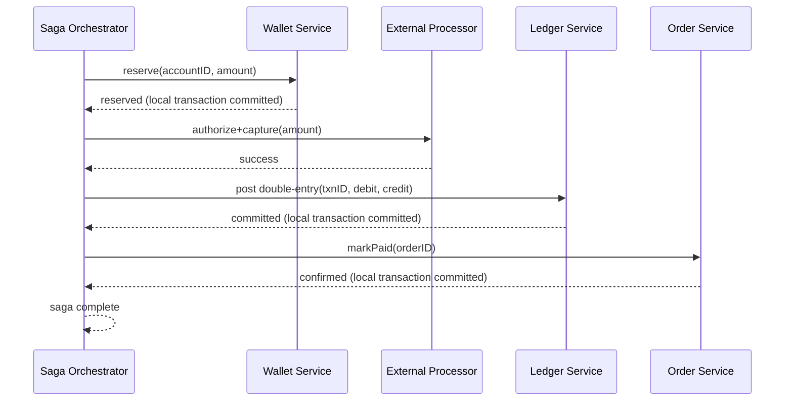

### 10.2 A step fails mid-transaction — compensating actions run in reverse

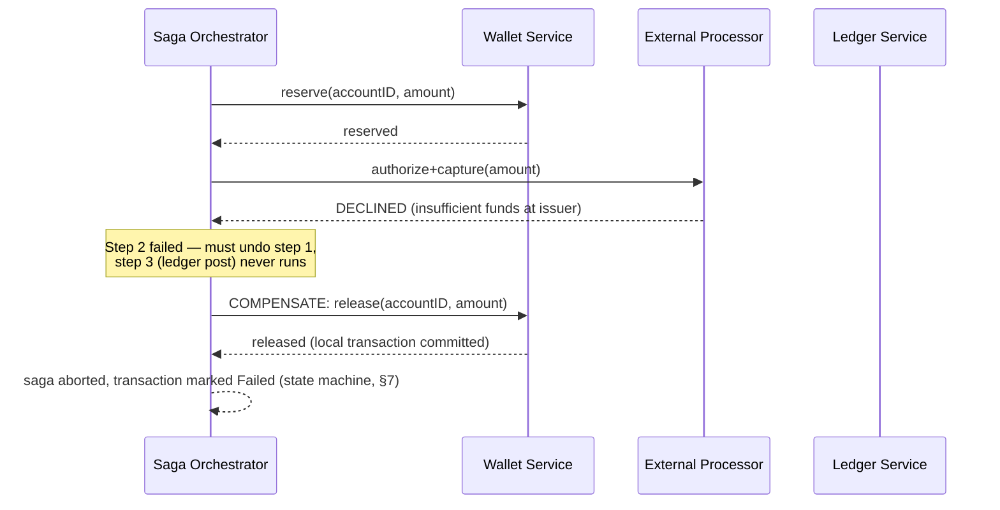

**What if the failure happens *after* the ledger post, e.g. the `Order.markPaid` call fails?** This is the harder case, because you cannot "compensate" a posted ledger entry the way you can release a wallet reservation — the ledger is append-only (§9). The compensating action here is a **new, reversing ledger entry** (a refund-shaped pair), not an edit or delete of the original. This is precisely why §9's immutability rule matters for sagas specifically: every compensating action in a payment saga must itself be expressible as a new fact, never a rollback of an old one.

| Step that failed | Compensating action | Why it's safe |
|---|---|---|
| Wallet reservation | Release the reservation | Wallet holds are mutable-by-design, meant to be reserved/released |
| Processor authorization | Nothing to compensate — it never succeeded | No side effect occurred externally |
| Ledger post | A new reversing entry (debit/credit swapped) | The ledger is append-only; you can never "undo" a row, only add its inverse |
| Order confirmation | Mark order `PaymentFailed`, do not ship | Order state is mutable-by-design, has its own state machine |

**Orchestration vs. choreography, briefly:** an orchestrator (a durable workflow engine — Uber's guide names Cadence/Cherami/Temporal for exactly this purpose, `30-Design Uber-FAANG-Guide.md` §16) gives you one place to read "what step are we on and what's the compensation," which matters enormously when a regulator or a support engineer needs to explain what happened to a specific transaction. Choreography (each service reacts to the previous service's event, no central coordinator) scales better organizationally but makes "what happened to transaction X" a multi-service archaeology exercise — for money, that trade-off usually favors orchestration.

### 10.3 Recurring billing is the same saga, run on a timer

Subscription/recurring billing (§3.1, requirement 5) is a common follow-up ("now make it a monthly subscription") and the honest answer is: **it's not a new mechanism, it's the exact same saga, invoked by a scheduler instead of a checkout click.** A billing scheduler enumerates due subscriptions, and for each one, kicks off the identical `reserve → authorize+capture → post ledger entries → confirm` saga from §10.1, using the customer's previously tokenized payment method (§16.1) instead of a freshly entered card. The one new piece of state is a `Subscription` entity (plan, cadence, next billing date, retry count on decline) that *produces* new `PaymentIntent`s on schedule — it doesn't bypass the state machine (§7) or the idempotency mechanism (§8) at all. A natural idempotency key for a recurring charge is `subscription_id + billing_period` (e.g. `sub_881:2026-08`), which has the pleasant property of being deterministic and reconstructable without any client involvement, unlike a client-generated UUID. **Dunning** (the industry term for retrying a *declined* recurring charge on a backoff schedule — commonly a few attempts over 3-7 days before cancelling the subscription) is the recurring-billing-specific failure handling worth naming if asked "what happens when the card on file is declined."

### 10.4 Payouts — the same saga, run in the opposite direction

A payout (§3.1, requirement 3 — paying a seller, driver, or merchant) is structurally the mirror image of a charge: instead of pulling money **in** from a customer's card via the card network, you push money **out** from the platform's pooled account to a payee's external bank account via ACH, wire, or a instant-payout rail (e.g. RTP/FedNow-style rails, or a debit-push to a linked debit card). The saga shape is identical — reserve the payout amount against the payee's *available* (not just total) ledger balance, call the payout rail, post the balanced ledger pair, confirm — but two details differ meaningfully from a charge:

- **The reservation must check *available* balance, computed as settled ledger balance minus any pending holds** — not just the raw `SUM` from §9.1. A seller shouldn't be able to withdraw funds from a sale that hasn't itself settled yet (§7's `SettlementPending` state), and a common real-world guard is holding a rolling reserve (e.g. a percentage of recent volume) against future disputes/refunds before releasing the rest as payable.
- **Payout rails are typically slower and less reversible than card authorization** — ACH settles in ~1-3 business days and, unlike a card auth, a payout that's already submitted to the rail generally cannot be voided, only reversed as a new, separate transaction (again: append a new fact, never edit the old one, exactly §9's rule). This means the compensating action for "payout submitted, then we discover the payee's account was actually fraudulent" is a debt/clawback ledger entry against the payee's account, not a rollback.

**Cheat-sheet for this section**
- Say explicitly which steps are "compensable in place" (wallet reservations) vs. "compensable only via a new reversing fact" (the ledger) — this distinction is the deep-dive content the surface-level "saga pattern" answer misses.
- Name a durable workflow engine (Temporal/Cadence, or an equivalent) rather than "a script that calls services in order" — a saga that can't survive the orchestrator process crashing mid-transaction isn't actually solving the problem.
- Orchestration over choreography for anything money-related is the right default to state, with the reasoning (single, auditable place to see "what happened to this transaction") — not just a preference.

---

## 11. Deep dive: webhook ingestion from an external processor

The card network/PSP doesn't just respond synchronously — capture confirmations, settlement notices, and dispute filings often arrive **asynchronously**, hours or days later, as webhooks pushed to your endpoint. This is an inbound version of the same "unreliable network" problem from §1, now with an added twist: **you didn't initiate this request, so you can't rely on your own idempotency key.**

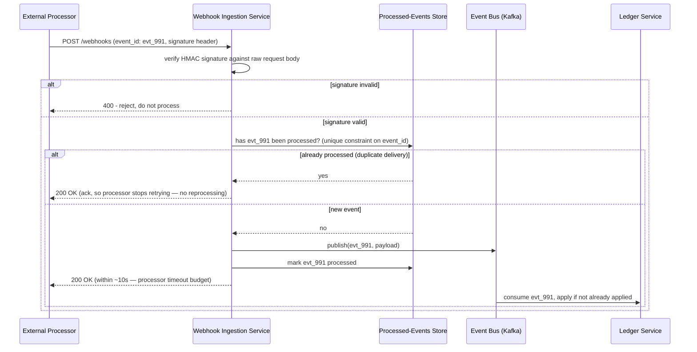

### 11.1 The three mechanics that make this reliable

1. **Signature verification, on the raw body.** The webhook payload is verified against an HMAC signature (a header like `Stripe-Signature`) computed over the *raw, unparsed* request bytes — verifying after JSON parsing/re-serialization silently breaks this, because re-serialized JSON is not byte-identical to what was signed. This is the single most common real-world webhook bug.
2. **At-least-once delivery, dedup by event ID.** The processor guarantees at-least-once, not exactly-once — the same `event_id` can and will arrive more than once (network retries on the *processor's* side, exactly mirroring §8's problem but for inbound traffic). Deduplicate on `event_id` with a unique constraint, the same pattern as the idempotency store, just keyed by the sender's ID instead of the caller's.
3. **Acknowledge fast, process async.** Respond `200 OK` within the processor's timeout budget (Stripe's real-world number: **10 seconds**) as soon as the event is durably queued, and do the actual ledger-affecting work off a consumer reading from the bus. If your handler doesn't respond within that window, the processor marks the delivery failed and retries — Stripe's real retry schedule is **immediately, then 5 min, 30 min, 2 h, 5 h, 10 h, then every 12 h, for up to 3 days** — so a slow handler doesn't lose the event, it just causes redundant, dedup-absorbed retries.

**Cheat-sheet for this section**
- Verify the signature over the *raw* request body before any parsing — say this explicitly, it's the detail that separates "I've read the docs" from "I've debugged this in production."
- Dedup by the sender's event ID with a unique constraint — the same shape as §8's idempotency key, applied to inbound instead of outbound traffic.
- Acknowledge fast (durably enqueue, then `200`), process the actual side effect asynchronously off the queue — never do slow, synchronous ledger work inside the webhook handler itself.
- Cite the real retry cadence (immediate → 5m → 30m → 2h → 5h → 10h → every 12h, up to 3 days) — a concrete schedule beats "it retries with backoff."

---

## 12. Deep dive: reconciliation

Idempotency (§8) and sagas (§10) prevent *your own* system from double-writing. They cannot detect **drift between your ledger and the external processor/bank's own records** — a webhook that silently failed to deliver even after retries, a manual adjustment made on the processor's dashboard, a settlement that landed for a different amount than expected due to a currency conversion rounding difference. Reconciliation is the system's own nightly self-audit against a party you don't control.

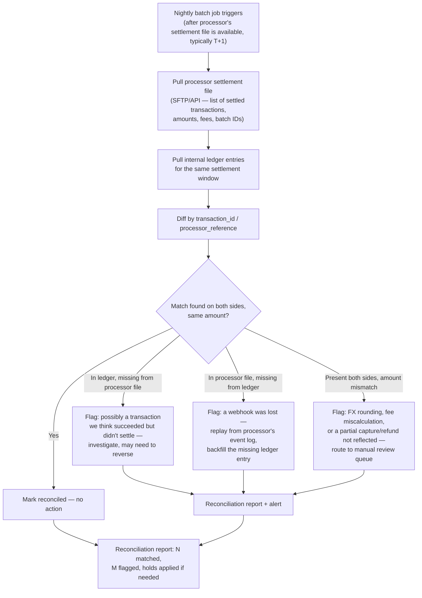

**Why this has to be a nightly (or per-settlement-cycle) batch job, not a real-time check:** the processor's own settlement file is only produced on its own cycle (commonly T+1 or T+2 for card networks), so reconciling more frequently than that just re-diffs against the same stale source. The job's cadence should match the *processor's* settlement cadence, not an arbitrary "nightly" default — say this explicitly if asked "why not run it every hour."

**What the job does with a mismatch, concretely:** it never auto-corrects the ledger silently. A missing-from-ledger case backfills a new ledger entry (referencing the original processor event) and re-triggers the notification pipeline; a missing-from-processor case places a hold on further payouts touching that account and opens a manual review case; an amount mismatch always goes to manual review, because auto-"fixing" a financial discrepancy without a human sign-off is itself a compliance risk.

### 12.1 Worked example — what the diff query actually looks like, and what it finds

Using §4's worked numbers (100M transactions/day), a settlement window's reconciliation is, at its core, a full outer join:

```sql
SELECT
  COALESCE(l.transaction_id, p.transaction_id) AS transaction_id,
  l.amount AS ledger_amount,
  p.amount AS processor_amount,
  CASE
    WHEN l.transaction_id IS NULL THEN 'missing_in_ledger'
    WHEN p.transaction_id IS NULL THEN 'missing_in_processor_file'
    WHEN l.amount <> p.amount    THEN 'amount_mismatch'
    ELSE 'matched'
  END AS diff_status
FROM ledger_settlement_window l
FULL OUTER JOIN processor_settlement_file p
  ON l.transaction_id = p.transaction_id
WHERE l.settlement_date = CURRENT_DATE - INTERVAL '1 day';
```

**Illustrative scale of what comes out the other end:** at 100M transactions/day, even a well-run system typically sees a small fraction of a percent land in `missing_in_processor_file` or `amount_mismatch` on any given night — say 0.01-0.05% — which is 10,000-50,000 flagged rows/night at this volume. That sounds alarming until you separate it by cause: the overwhelming majority are **timing** (a transaction captured at 23:58 lands in tomorrow's settlement batch, not today's — not a bug, a boundary effect) and clear themselves automatically on the next night's run once the correct window is compared. The genuinely actionable slice — a real lost webhook, a real FX rounding drift, a real unexplained discrepancy — is usually one or two orders of magnitude smaller than the raw flagged count. **Say this explicitly if asked "how do you avoid alert fatigue on 10,000 nightly flags":** bucket by cause first (timing-boundary vs. genuine drift), auto-clear the timing bucket on the next run, and only page a human for the residual that doesn't clear within 2 settlement cycles.

### 12.2 🆕 Worked example — one concrete mismatch, traced to its root cause

§12.1's numbers are aggregate ("10,000-50,000 flagged rows/night"). Here's what a single genuine, actionable flag actually looks like once it clears the timing-boundary noise — the kind of concrete trace an interviewer wants to hear you narrate, not just the query that produced it.

```
Settlement batch: 2026-07-22, merchant acct_platform_pool
Processor settlement file total  : $10,412.50  (227 transactions)
Internal ledger total (same window): $10,400.00  (227 transactions)
Gap                                : $12.50, same transaction COUNT on both sides
                                      → NOT a missing-entry case, an amount_mismatch (§12's diff_status)
```

Because both sides agree on 227 transactions but disagree on the total by exactly $12.50, the diff query (§12.1) narrows the search to transactions with a per-row mismatch rather than a missing row — and finds exactly one: `txn_55901`, an original $50.00 charge that was correctly captured and ledgered. Pulling the processor's own transaction detail for `txn_55901` shows **two** $12.50 refund debits against it; the internal ledger shows only **one**.

**Root cause, once traced:** a support agent issued a $12.50 partial refund through the internal `refundPayment` API (correctly ledgered, idempotency-keyed, the works) — and, an hour later, a *second* agent, working the same customer ticket without realizing it had already been handled, issued another $12.50 refund directly through the processor's own merchant dashboard. That second refund bypassed `refundPayment` entirely: no idempotency key, no saga, no ledger entry — it only exists in the processor's own records, which is exactly why reconciliation, and nothing else in this chapter, is what catches it. Idempotency (§8) couldn't have prevented this — the two refunds were never the same logical request, they were two different humans making the same mistake through two different doors.

**What the job does about it, concretely:**
1. Flags `txn_55901` as `amount_mismatch`, routes to manual review (§12, never auto-corrected silently).
2. A human confirms the second refund was legitimate (the customer really did get refunded twice — now the platform needs to decide whether to eat the $12.50 or claw it back), and backfills a **new** ledger entry referencing the processor's own refund ID as the audit trail — never edits the existing entries (§9).
3. The process gap gets closed, not just the dollar figure: disable direct dashboard refunds for merchant-of-record accounts, or wire the processor dashboard's own action-webhook back into the ledger so *every* refund — regardless of which door it came through — produces exactly one ledger entry.

**Cheat-sheet for this section**
- Reconciliation exists because idempotency and sagas only protect *your* side — it's the check against the external party you don't control, and it's the last line of defense, not a redundant one.
- Match the job's cadence to the processor's settlement cycle (commonly T+1/T+2), not an arbitrary schedule.
- Three distinct mismatch types (in-ledger-only, in-processor-only, amount-mismatch) need three distinct remediations — don't collapse them into one "flag and email someone" answer.
- Never let the job silently auto-correct the ledger — flag, hold if needed, and route to a human for anything beyond a simple missing-entry backfill.

---

## 13. Data model

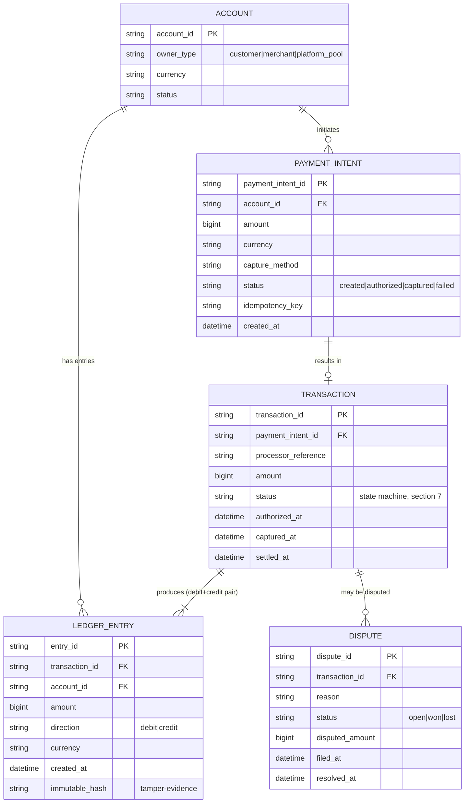

| Entity | Store | Notes |
|---|---|---|
| **Account** | Relational (Postgres/MySQL), sharded by `account_id` | Small, slowly-changing; the anchor for balance derivation |
| **PaymentIntent** | Relational, same store as Account | Short-lived state machine row (§7); indexed on `idempotency_key` for lookup |
| **Transaction** | Relational, ACID | The row the state machine (§7) actually operates on |
| **LedgerEntry** | Relational, append-only, sharded by `account_id` | Never updated or deleted after insert (§9); the true source of truth |
| **Dispute** | Relational | Low volume, high operational/legal importance; drives payout holds |

**Cheat-sheet for this section**
- Draw the ER diagram, then immediately say which table is append-only and which is a mutable state machine row — `LedgerEntry` never changes after insert; `Transaction`/`PaymentIntent` do, by design, as their state machine advances.
- `LedgerEntry` has no `balance` column anywhere in the schema — say this explicitly, it previews and reinforces §9's core point.
- `PaymentIntent.idempotency_key` should be indexed/unique — it's the join between the API layer's dedup mechanism (§8) and the durable record.

---

## 14. Failure modes & mitigations

| Failure mode | What goes wrong | Mitigation |
|---|---|---|
| **Processor timeout after money actually moved** | You called `authorize()`, the network dropped the response, but the processor actually approved it — a naive retry double-charges | Idempotency key (§8) on the outbound call to the processor too, not just your own API; on ambiguous timeout, query the processor's own status API before blindly retrying |
| **Webhook lost or duplicated** | A settlement/dispute notification never arrives (silent drift) or arrives twice (risk of double-processing) | Dedup by `event_id` (§11); reconciliation (§12) as the backstop that catches a *permanently* lost webhook, not just a delayed one |
| **Partial saga failure mid-transaction** | Wallet funds reserved, but the ledger post or order confirmation fails | Compensating transactions (§10) — release the reservation, or post a reversing ledger entry; never leave a reservation or a debit-without-credit dangling |
| **Clock skew on settlement batch cutoff** | A transaction captured at 23:59:58 local time lands in the wrong day's settlement batch depending on which server's clock is authoritative | Use the processor's own batch ID/cutoff timestamp as authoritative, never a local server clock; treat all settlement-boundary logic as UTC + the processor's declared cutoff, not "midnight" on any given machine |
| **Reconciliation mismatch (amount or existence)** | Ledger and processor disagree on whether/how much a transaction settled | Never auto-correct silently; hold further payouts touching the account, route to manual review, backfill only for the clear "missing entry, event replay confirms it" case (§12) |
| **Dangling authorization** | A hold is placed but never captured or voided — funds are stuck reserved on the customer's card indefinitely | TTL every authorization (card networks typically auto-expire holds after ~7 days); a sweep job voids anything past its capture window |
| **Double-entry invariant violated by a bug** | A code path writes a debit without its matching credit (or vice versa) | Enforce the balanced-pair invariant at the database layer (a check constraint or a transactional wrapper that only exposes a "post a balanced pair" API, never a raw insert) — don't rely on application code discipline alone |
| **Currency/FX rounding drift** | Converting between currencies introduces sub-cent rounding that accumulates across millions of transactions | Store amounts in minor units (cents) with a fixed-precision FX rate snapshot per transaction, recorded on the ledger entry itself — never re-derive a historical FX rate from a live rate table |

**Cheat-sheet for this section**
- "Processor timeout after money actually moved" is the single hardest, most-tested failure mode in this entire topic — always resolve ambiguity by *querying the processor's status*, never by blind retry, when the outcome of your own request is unknown.
- Every mitigation above traces back to one of two mechanisms: idempotency (§8) or the immutable ledger (§9) — if you can't map a failure mode to one of those two, you likely haven't found the real fix yet.
- Reconciliation (§12) is explicitly the backstop for failure modes nothing else catches — say this relationship out loud rather than treating it as a separate, unrelated feature.

---

## 15. Non-functional walkthrough

### 15.1 Consistency model, per component

| Component | Consistency model | Why |
|---|---|---|
| Ledger writes | Strong (linearizable, ACID transaction per balanced pair) | A balance must never be observably wrong, even momentarily, to a concurrent reader |
| Idempotency store | Strong, same durability bar as the ledger | Losing an idempotency record is equivalent to losing the ledger's own dedup guarantee — a "small" cache-like store here is a design bug, not an optimization |
| Wallet reservation | Strong within a single account | Two concurrent reservations against the same account must serialize, or you can overcommit funds |
| Webhook delivery | At-least-once, eventually consistent | A webhook arriving a few seconds or minutes late doesn't corrupt correctness, as long as it's deduped and eventually applied |
| Notification service | Eventually consistent | "Payment succeeded" reaching the user 500ms later than the ledger commit is a UX nuance, not a correctness bug |
| Fraud/risk scoring | Eventually consistent (mostly), synchronous only for the pre-auth check | A slightly stale risk profile is an acceptable trade for not blocking every checkout on a slow ML model |
| Reconciliation | Eventually consistent, by design (nightly batch) | It exists precisely to catch what real-time consistency mechanisms miss — it doesn't need to run in real time to do that job |

**The one sentence to say out loud:** "I'd draw a hard line between the components that must be linearizably consistent because they represent money (ledger, idempotency store, wallet reservations) and everything else, which can be eventually consistent without any correctness cost (notifications, fraud scoring, webhook delivery) — conflating these into one blanket consistency requirement either over-engineers the notification path or, worse, under-engineers the ledger."

### 15.2 Scaling the ledger

- **Shard by `account_id`.** Most transactions touch two accounts (customer, platform pool) that likely live on different shards — this means most transactions require entries in two shards, not one.
- **Handling the cross-shard case:** rather than a two-phase commit across shards (slow, fragile, a classic distributed-systems anti-pattern for this exact scenario), post each side's entry as its own local, atomic transaction, coordinated by the saga orchestrator (§10) — and let reconciliation (§12) be the final check that both sides of every pair actually landed. This is the same trade-off as choosing sagas over distributed ACID transactions in general, applied specifically to a sharded ledger.
- **Hot-account mitigation:** a small number of accounts (the platform's own pooled settlement account, a viral merchant) can receive disproportionate write volume. Mitigate with per-account write batching (append multiple entries in one physical write) and, if a single account's write rate genuinely exceeds one shard's capacity, sub-partition that one account's entries by time window, with balance still derived as a `SUM` across the sub-partitions.

### 15.3 HA of the idempotency store

Because losing an idempotency record silently reopens the double-charge risk that the entire mechanism exists to close, the idempotency store needs:
- **Synchronous replication** (not async, not "eventually copied") before acknowledging a write — an idempotency key that's written but not yet durable defeats the purpose the instant the primary fails.
- **The same backup/restore and multi-AZ failover discipline as the ledger itself** — teams frequently over-invest in ledger HA and under-invest in idempotency-store HA, treating the latter as "just a cache." It is not a cache; treat a lost idempotency record with the same severity as a lost ledger entry, because operationally it produces the same outcome (a double charge).

**Cheat-sheet for this section**
- State the consistency-per-component table before being asked — it's the payments-domain version of Uber's "CAP per component" move, and it's exactly what separates a senior answer here.
- Sharding the ledger by `account_id` is the right default; the interesting follow-up is how you handle a transaction whose two entries land on different shards (answer: saga-coordinated local transactions + reconciliation, not 2PC).
- Say explicitly that the idempotency store needs ledger-grade durability, not cache-grade durability — this is the single most common under-engineering mistake in real payment systems.

---

## 16. Security & compliance

### 16.1 PCI-DSS scope reduction via tokenization

The first rule: **the raw Primary Account Number (PAN) should never touch your own servers, logs, or databases.** Instead:
- The client (a PSP-hosted iframe/SDK field, e.g. Stripe Elements or Adyen's drop-in components) collects the card number directly and sends it straight to the PSP's PCI-compliant vault.
- Your backend only ever handles a **token** (`pm_tok_9f8a7b6c` in §5's example) — an opaque reference the PSP can exchange for the real card data on its own PCI-certified infrastructure.
- This single design choice is what keeps the bulk of your own infrastructure **out of PCI-DSS scope** entirely — tokenization doesn't eliminate your compliance obligations (you still need a compliant integration, and anything that can access or proxy the token-to-PAN exchange is still in scope), but it collapses the Cardholder Data Environment down to a small, PSP-hosted boundary instead of your whole stack.

**Self-Assessment Questionnaire (SAQ) level is the concrete artifact this buys you**, worth naming by name if pressed on "how do you prove this to an auditor":

| SAQ type | Who it's for | Why tokenization gets you here |
|---|---|---|
| SAQ D | Merchants who store, process, or transmit PAN directly | The full, expensive, hundreds-of-controls questionnaire — where you land if you touch raw card data yourself |
| SAQ A | Merchants who fully outsource card data handling to a PCI-compliant PSP (hosted fields/iframe, redirect) | A handful of controls — where a tokenized, PSP-hosted-field architecture lands you |
| SAQ A-EP | A middle ground — your page hosts the checkout UI but a PSP's iframe/JS still directly collects the PAN | More controls than SAQ A because your page's own script integrity now matters (a compromised JS include can skim card data even without your servers ever seeing it) |

The practical design implication: **use a PSP-hosted iframe/redirect field for card capture, not a custom form that merely forwards to a tokenization API** — the former is what actually earns you SAQ A; a custom form that touches the PAN in your own JavaScript before tokenizing, even briefly, can push you to the costlier SAQ A-EP.

### 16.2 3-D Secure / Strong Customer Authentication (SCA)

For card-present-equivalent liability shift and, in the EU/UK, legal compliance with **PSD2's Strong Customer Authentication mandate**, a payment additionally authenticates the cardholder via **two of three factors** (something known, something possessed, something inherent) — in practice, EMV **3-D Secure 2 (3DS2)** redirects/challenges the cardholder for a one-time code or biometric confirmation during `confirmPaymentIntent`. Two details worth naming: SCA has common **exemptions** (low-value transactions, typically under roughly €50, and recurring/subscription charges after the first authenticated one), and a successful 3DS challenge shifts fraud liability from the merchant to the issuing bank — which is why it's a business decision, not just a security one, whether to invoke it on every transaction or only where required/exempt-eligible.

### 16.3 Encryption and least-privilege access

- **Encryption in transit**: TLS 1.2+ on every external hop; mTLS between internal services that touch anything payment-adjacent (mirroring the same control Uber's guide names for its own payment tier, `30-Design Uber-FAANG-Guide.md` §14.1).
- **Encryption at rest**: ledger and account data encrypted (e.g. AES-256) at the storage layer, with key rotation managed by a dedicated KMS, not embedded application secrets.
- **Least-privilege access to raw card data**: given tokenization (§16.1), the honest answer is that *no* internal service should ever need direct access to raw PAN — access to the tokenization/vault boundary itself should be restricted to a minimal, audited set of service identities, not human operators, and never debuggable via generic log access.

### 16.4 Audit logging every balance-affecting write

Every write to `ledger_entries` is, by construction (§9), already an immutable, timestamped record — but the *access* to that data, and any administrative action (a manual reconciliation override, a support-initiated refund), needs its own separate, append-only audit log capturing who, what, when, and why. A payments system that can show a regulator a complete, tamper-evident trail of both the money movements *and* who was allowed to see or touch them is the actual bar "compliance" is checking for — not a checkbox, a demonstrable, queryable trail.

**Cheat-sheet for this section**
- Tokenization is the single highest-leverage security decision in this whole system — say "we never store raw PAN" before being asked, exactly the way Uber's guide flags tokenized payment methods as a free PCI-compliance signal.
- 3DS/SCA is a compliance *and* a liability-shift mechanism — mention both angles, and know the rough exemption threshold (~€50) and that recurring charges are typically exempt after the first authenticated one.
- Encryption in transit/at rest is table stakes — spend your interview time on least-privilege access and audit logging, which is where real payment systems actually fail compliance audits.
- Every balance-affecting write already has an audit trail "for free" from the immutable ledger (§9) — but administrative/support actions need their own separate audit log, which is easy to forget.

---

## 17. Cost & trade-offs

| Decision | Option A | Option B | What we'd pick and why |
|---|---|---|---|
| Charge capture timing | Synchronous (block on processor) | Asynchronous (accept instantly, capture via event stream) | Async — matches §1's core insight: decouple user-facing latency from money-moving correctness |
| Ledger consistency | Strong (ACID, sharded RDBMS) | Eventual (a NoSQL store optimized for write throughput) | Strong — the one place in this whole system where "eventually correct" is not an acceptable answer |
| Distributed transaction strategy | Two-phase commit across services | Saga with compensating actions | Saga — 2PC doesn't survive a participant crash gracefully and doesn't scale across independently-deployed services |
| PCI scope | Handle raw card data in-house | Tokenize via PSP-hosted fields | Tokenize — the compliance cost and breach liability of handling raw PAN vastly outweighs any latency/control benefit |
| Fraud detection depth | Build an in-house ML risk model | Call an external risk-scoring API/service, start simple | Start external/simple (see §18) — an in-house fraud ML pipeline is a large, ongoing investment that's a stretch goal, not core |
| Where fees come from | Interchange + card network fees (typically ~1.5-3% + a fixed per-transaction fee) | — | Not a design choice you control, but a cost driver to name: this is often the single largest recurring line item in a payments business, and it directly motivates why PSPs exist (they aggregate risk and negotiate rates you individually couldn't) |
| Reconciliation frequency | Real-time diffing | Nightly/per-settlement-cycle batch | Batch, matched to the processor's own settlement cadence (§12) — running more often just re-diffs stale data |

**Main cost drivers, roughly in order:** (1) processor/interchange fees on transaction volume — a cost of doing business, not an infra cost, but the largest line item by far; (2) ledger DB replication/durability (3x replication is not optional for a financial system, unlike many other domains where 2x might be an acceptable trade); (3) Kafka/event-bus throughput for the webhook and ledger-event fan-out (§4); (4) reconciliation compute — nightly full-window diffs against processor settlement files scale with transaction volume, not user count.

**Cheat-sheet for this section**
- Every trade-off in this table traces back to the same tension named in §1 — restate it here: "availability of the request path vs. correctness of the money."
- Interchange/processor fees are the largest real-world cost driver and are *not* an infrastructure decision — naming this distinction (business cost vs. engineering cost) shows commercial awareness beyond pure systems design.
- 3x replication for the ledger is non-negotiable in a way that wouldn't be true for, say, a social feed's cache — say why: losing a ledger entry is not "degraded service," it's "we lost track of someone's money."

---

## 18. Wrap-up: MVP vs. stretch goals

### 18.1 MVP (what you'd actually build first)

- `createPaymentIntent` / `confirmPaymentIntent` / `capturePayment` / `refundPayment`, all idempotent (§5, §8)
- Double-entry ledger service with the balanced-pair invariant enforced at the write boundary (§9)
- A durable idempotency store with ledger-grade durability (§8, §15.3)
- Basic saga orchestration across wallet/order/ledger for a single-processor, single-currency flow (§10)
- Webhook ingestion with signature verification and event-ID dedup (§11)
- A nightly reconciliation job against one processor's settlement file (§12)
- Tokenized payment methods from day one — this is not a "later" feature, it's a compliance floor (§16.1)

### 18.2 Explicitly out of scope / stretch goals

- **Fraud ML scoring** is a stretch goal, not core — an MVP calls a third-party risk-scoring API (or applies simple rule-based checks: velocity limits, geo-mismatch flags) and defers building an in-house model. This mirrors Uber's own framing of RADAR as a deep, separate investment, not a day-one requirement.
- **Multi-region active-active ledger** — a single-region, multi-AZ ledger with strong consistency is the right MVP; active-active across regions reintroduces exactly the cross-shard consistency problem from §15.2, at a much larger scale, and should be a deliberate later investment, not a default.
- **Real-time FX rate locking/hedging** for cross-currency transactions — an MVP can snapshot a rate at transaction time (§9.1's fixed-precision rate snapshot) and defer building a treasury/hedging function that protects the platform's own currency risk.
- **A full accounting/GL export product for merchants** — the internal ledger (§9) is not the same deliverable as a merchant-facing financial reporting product; say this distinction if the interviewer probes.

**Cheat-sheet for this section**
- Naming fraud ML as an explicit stretch goal, not a gap, shows scoping discipline — the same way Uber's guide explicitly scopes UberPool matching out of its core design.
- If pressed "what would you build in month 2," the answer is multi-currency FX handling and a second processor for redundancy — not fraud ML, which needs data volume the MVP hasn't generated yet.

---

## 19. Cheat-sheet / golden rules

1. **Money moves exactly once by construction, not by luck** — idempotency keys (§8) + an immutable double-entry ledger (§9) + sagas with real compensating actions (§10), always, not "we'll add retries and see."
2. **Separate the availability bar (the request path) from the correctness bar (the ledger)** — this one sentence, said early, is the single strongest signal of seniority in this entire topic.
3. **A balance is a derived `SUM`, never a mutable column.** If your design has an `UPDATE ... SET balance = balance + ?` anywhere, you haven't found the real answer yet.
4. **The idempotency store needs ledger-grade durability, not cache-grade durability** — losing it silently reopens the exact double-charge risk the whole mechanism exists to close.
5. **Every retry needs a plan for the concurrent-in-flight case, not just the "after it finished" case** — a unique constraint + an `in_progress` status, not a read-then-write check.
6. **Reconciliation is the backstop for everything else, not a redundant feature** — it's the only mechanism that catches drift against a party you don't control.
7. **Tokenize from day one.** Raw card numbers touching your own infrastructure is not a "we'll fix it later" corner to cut.
8. **`Authorized`, `Captured`, and `Settled` are three different states, not one** — collapsing them loses the ability to model holds, partial captures, and the real T+1/T+2 settlement lag.
9. **Compensating a payment saga step means writing a new fact, not undoing an old one** — the ledger's immutability rule and the saga's compensation rule are the same rule, applied twice.
10. **When a processor call times out and you don't know if it succeeded, query the processor's status before you retry** — never guess, never blindly re-send a money-moving call into an ambiguous outcome.
