# Design a ChatGPT-like System — FAANG Interview Guide

> Source chapter type: AI/ML-serving product system. This is a newer addition to the
> Grokking-style course lineup ("Design a ChatGPT System"); expanded here with real
> LLM-serving infrastructure mechanics (continuous batching, KV-cache paging, streaming) for
> FAANG-depth interviews.

> **Enhancement notes:** this pass audited the chapter against the rest of the course's
> strongest chapters (Uber, Google Docs) and found the mechanism-level deep dives were already
> strong, but the chapter jumped straight to a final architecture and never showed *why* each
> piece exists, and it only had one full end-to-end trace instead of two.
> - Added a `🆕 Architecture Evolution (v1 → v2 → v3)` subsection under High-Level Design — one
>   GPU per request (no batching) → static batching (slowest sequence stalls the batch) →
>   continuous batching + KV-cache paging (the design already documented) — each stage with its
>   own diagram and a one-line "what broke."
> - Added a second full end-to-end `🆕 sequenceDiagram` ("a conversation crosses the context
>   window mid-session") to the context-window deep dive, tracing a concrete token-count example
>   through prompt construction, a summarization model call, and back through the normal
>   moderation → scheduler → GPU → stream path — the original context-window section only had a
>   component-level flowchart, no full trace.
> - Added a `🆕 worked utilization example` (idle-slot-tick math) to the static-vs-continuous
>   batching gantt charts, and a `🆕 worked KV-cache memory example` (bytes-per-token math, naive
>   slab vs paged block allocation) to the PagedAttention deep dive — both deep dives previously
>   had diagrams but no numbers backing them up.
> - Added a `🆕 Recall Table: TTFT vs TPOT vs Total Latency` with an if-X-then-Y diagnostic
>   column, since TTFT/TPOT were only ever described in prose.
> - Left requirements, capacity estimation, API design, moderation, autoscaling, data model, and
>   the cheat-sheets untouched — they already carried real numbers and worked examples.

---

## Mental Model

Every other chapter in this course is "how do you move/store bytes at scale." This one is
different: the bottleneck isn't bandwidth or disk, it's a **GPU running a many-billion
parameter matrix multiply that costs real dollars per token**. If you walk in and treat this
like "Twitter but with an LLM box in the middle," you will miss the entire point of the
interview.

Break it into four coupled problems, and name all four out loud before you draw a single box:

1. **A real-time token-streaming delivery problem.** The model doesn't produce a response —
   it produces one token, then another, then another, each taking tens of milliseconds. The
   client has to render each token as it's born, not wait for the full answer. This is
   structurally the same "keystroke has to reach a browser in near-real-time" problem as
   collaborative editing, except the direction is reversed: **server → client token stream**
   instead of **client → server op stream**. Expect to reuse the same instinct (persistent
   connection, no per-token HTTP handshake) with a different transport (SSE instead of
   WebSockets, for reasons covered below).
2. **A scarce-GPU-capacity scheduling/batching problem.** A GPU that can serve one user's
   request at 100 tokens/sec can often serve 30 users concurrently at nearly the same
   per-user speed, *if* you batch their requests together on the same forward pass. GPUs are
   the most expensive, least elastic resource in this system (unlike app servers, you can't
   spin up a new GPU node in milliseconds — the model weights alone can be tens to hundreds of
   gigabytes). The entire serving stack exists to keep GPUs busy doing useful work instead of
   idling on a slow user or a half-empty batch.
3. **A conversation-state / context-window problem.** Every message you send carries the
   *entire prior conversation* back through the model — the model itself is stateless between
   calls. A model with an 8K/32K/128K token context window will eventually see a conversation
   longer than it can accept, and someone has to decide what to drop, truncate, or summarize
   without breaking the user's mental model of "the assistant remembers what I said."
4. **A safety/moderation problem.** Unlike a docs editor or a social feed, this system can
   *generate* arbitrary harmful content on demand, not just fail to catch it. Moderation has
   to run on the way in (block a bad prompt before it burns GPU time) and on the way out
   (catch a jailbreak the input filter missed), and it has to do this without adding seconds of
   latency to every single message.

**Analogy**: picture a restaurant kitchen with one enormously expensive, enormously slow
brick oven (the GPU) that can bake several pizzas at once *if they go in together*, but wastes
oven-space if you insist on baking one pizza per firing. The front-of-house (API gateway +
router) has to seat customers (batch requests), the oven staff (scheduler) has to decide which
orders go in together and when to pull a finished pizza without waiting for the slowest one in
the batch, a runner (streaming layer) brings out each slice the moment it's ready instead of
making the customer wait for the whole pizza, and a health inspector (moderation) checks both
the raw order and the finished dish before it reaches the table.

**Interview cheat-sheet — say this in your first 60 seconds:**
> "This is really four problems stacked on one product: streaming tokens to the client in
> real time, scheduling scarce GPU capacity efficiently, managing conversation context within
> a fixed token window, and moderating content both before and after generation. I'll design
> around all four, but the GPU-scheduling problem is the one that's genuinely novel compared to
> a typical web-scale system design."

---

## Interview Playbook

```mermaid
flowchart TD
    A[1. Clarify requirements<br/>functional + non-functional] --> B[2. Capacity estimate<br/>DAU, msgs/day, tokens/msg, GPUs needed]
    B --> C[3. API design<br/>createChatCompletion, streaming protocol, stop/regenerate]
    C --> D[4. High-level architecture<br/>gateway, router, scheduler, GPU fleet, moderation]
    D --> E[5. Deep dive: continuous batching<br/>why static batching wastes GPU time]
    E --> F[6. Deep dive: KV-cache paging<br/>PagedAttention, memory as pages not slabs]
    F --> G[7. Deep dive: token streaming<br/>keystroke to token-in-browser sequence]
    G --> H[8. Deep dive: context window mgmt<br/>truncation, summarization, sliding window]
    H --> I[9. Deep dive: safety & moderation<br/>pre-prompt + post-generation filter]
    I --> J[10. Deep dive: GPU autoscaling<br/>cold-start cost of loading weights]
    J --> K[11. Data model<br/>Conversation, Message, ModelVersion, UsageRecord]
    K --> L[12. Non-functional walkthrough<br/>consistency, HA, scale to millions of chats]
    L --> M[13. Security/compliance<br/>PII, retention/opt-out, tenant isolation]
    M --> N[14. Cost & trade-offs<br/>GPU $ dominates, quantization, cache economics]
    N --> O[15. Wrap-up<br/>MVP vs stretch goals]
```

Say this order out loud unprompted. The signal you're sending: you know that **GPU scheduling
and token streaming are the centerpiece**, not an afterthought bolted onto a CRUD chat app —
the mirror image of how the Google Docs chapter signals that concurrency control, not
WebSockets, is its centerpiece.

---

## Requirements Clarification

### Functional

| Requirement | Notes |
|---|---|
| Send a message, stream a response | Core loop — user submits a prompt, tokens arrive incrementally, not as one blob |
| Maintain conversation history / context | The model is stateless; the server must resend prior turns (or a compressed form of them) on every call |
| Support multiple models/versions | GPT-4-class vs a cheaper/faster model; users or admins pick, or the router picks for them |
| Tool/plugin calling | Model can request a web search, code execution, or a business API call mid-conversation, then continue generating using the result |
| Regenerate / stop generation | User can cut a response short mid-stream, or ask for another attempt at the same prompt |
| Content moderation | Both the user's prompt and the model's output must be screened before either does damage |
| (Real system, not asked but mention) | Conversation rename/delete/share, multi-device sync, usage/billing dashboards |

### Non-functional

| Requirement | Why it's hard here specifically |
|---|---|
| **Low time-to-first-token (TTFT)** | The very first token requires a full "prefill" forward pass over the entire prompt — this is the latency users feel as "is it even working" |
| **High GPU utilization / throughput** | GPUs are the dominant cost center; an idle or under-batched GPU is money burned for nothing |
| **Fairness across users** | One user pasting a 100K-token document shouldn't starve everyone else sharing that GPU |
| **Safety** | Generated content is a first-class risk surface, not just user-submitted content |
| **Cost per token** | Unlike most web systems, marginal cost per unit of work (per output token) is large enough to show up as a board-level metric, not rounding error |

**Questions to ask the interviewer** (signals seniority):
- Is this closed-domain (chat only) or does it need tool/plugin calling and multi-modal input
  in scope? Changes whether you need a sandboxed execution layer.
- One model or a fleet of model versions/sizes (cheap-and-fast vs large-and-capable) that
  requests get routed across?
- Do we need to support enterprise customers with data-isolation/no-training-on-my-data
  guarantees? Changes the security section substantially.
- What's the target TTFT and tokens/sec-per-user budget? (Reasonable production targets: TTFT
  in the 200 ms–2 s range depending on tier, and roughly 20-60 output tokens/sec per stream —
  state this as an assumption if not given, and be ready to redo the GPU-count math if the
  interviewer changes it.)
- Is training the model in scope? (No — say so explicitly and move on. This chapter is about
  the *serving* system around a model that already exists, not MLOps/training infrastructure.)

---

## Capacity Estimation (worked example)

**Assumptions** (state them, don't hide the method):

| Input | Value |
|---|---|
| Daily active users (DAU) | 200 million |
| Messages sent per active user per day | 15 |
| Avg tokens per user message (prompt only) | 100 |
| Avg conversation history resent per call (context) | 800 tokens |
| Avg tokens generated per response | 300 |
| % of messages that trigger tool/plugin calls | 10% (add ~200 tokens each, round-trip) |
| Reference throughput per GPU (continuous batching, mid-size model) | ~2,000 output tokens/sec aggregate across a batched GPU (conservative, well below the ~24,000 tok/s theoretical ceiling quoted for optimized single-request decode on an H100 — batching, safety margin, and mixed prompt lengths eat most of that headroom) |
| Target average per-stream decode speed | ~40 tokens/sec/user (a comfortable "reads faster than the model speaks" pace) |

**Formula chain**: `DAU → messages/day → tokens/day (prompt + context + completion) → tokens/sec
→ GPUs needed (throughput-bound) → GPUs needed (concurrency-bound) → take the max`

**Daily token volume**:
```
messages/day        = 200M × 15                         = 3.0 billion messages/day
input tokens/day     = 3.0B × (100 + 800)                = 2.7 trillion tokens/day
output tokens/day    = 3.0B × 300                         = 0.9 trillion tokens/day
tool-call overhead    = 3.0B × 10% × 200                   = 0.06 trillion tokens/day
------------------------------------------------------------------------------------
total tokens/day     ≈ 2.7 + 0.9 + 0.06                   ≈ 3.66 trillion tokens/day
```

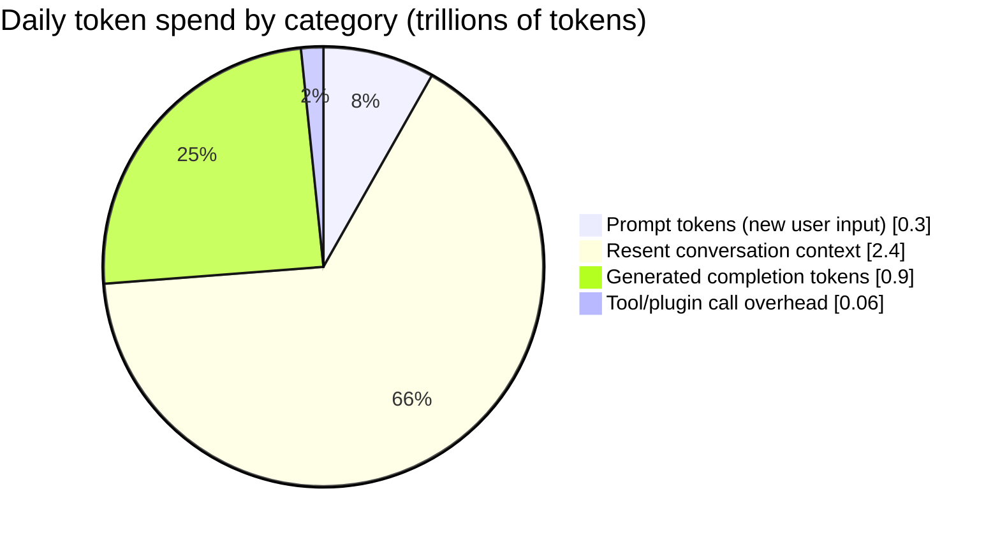

**GPUs needed — two different bottlenecks, take the larger:**

*Throughput-bound (can the fleet chew through the daily token volume at all):*
```
output tokens/sec  = 0.9 trillion / 86,400 s          ≈ 10.4 million tokens/sec (average, not peak)
GPUs (throughput)  = 10.4M / 2,000 tokens/sec/GPU      ≈ 5,200 GPUs (average load)
peak factor        = ×3 for daytime peak vs 24h average
GPUs (peak)        ≈ 15,600 GPUs just for decode
```
Note this deliberately ignores **prefill** cost (processing the 900 input tokens per call is
also GPU work, just cheaper per-token than decode because it's a single parallel forward pass
instead of one pass per output token) — in a real interview, name this as a simplification and
say prefill capacity is typically sized as a separate pool (see the deep dive on continuous
batching for why prefill and decode compete for the same GPU differently).

*Concurrency-bound (how many simultaneous streams are in flight):*
```
avg conversation duration in flight  ≈ 20 s (a few back-and-forth tokens' worth of streaming)
concurrent active streams            ≈ 3.0B msgs/day × (20s / 86,400s) ≈ 700,000 concurrent streams (avg)
peak concurrent streams              ≈ ×3 ≈ 2.1 million concurrent streams
streams a single GPU can hold in one batch ≈ 2,000 tokens/sec ÷ 40 tokens/sec/user ≈ 50 concurrent streams/GPU
GPUs (concurrency)                   ≈ 2.1M / 50                                    ≈ 42,000 GPUs
```

**Take the max of the two bottlenecks** → concurrency, not raw throughput, is usually the
binding constraint for a chat-shaped (many short streams, not few huge batch jobs) workload —
this is worth saying out loud, because it's the opposite of most "how many servers" estimates
in this course, where a single throughput number decides everything.

**Redo-the-chain instinct**: if the interviewer doubles average conversation length (context
tokens 800 → 1,600), prefill cost roughly doubles and per-request GPU memory (KV cache) for a
given batch shrinks the number of concurrent streams a GPU can hold — walk through *why* live:
longer context means each sequence's KV cache eats more of the fixed GPU memory pool, so fewer
sequences fit in a batch, so concurrency-bound GPU count goes up even though total token volume
only doubled.

**What this estimation misses (say it out loud)**: the split between cheap/fast and
large/expensive model tiers (a real fleet is heterogeneous, not one GPU SKU), moderation-model
GPU cost (a second, usually much smaller, model call per message), and the fact that tokens
aren't uniform cost — a token in a 100K-context call is far more expensive to attend over than
the same token in a 500-token call, because self-attention cost per token grows with sequence
length.

---

## API Design

Same split as most real-time systems in this course: a conventional REST-ish surface for
anything that isn't the live generation itself, and a **streamed** response for the one
endpoint that matters most. The key design decision to name unprompted: **Server-Sent Events
(SSE) over plain HTTP, not WebSockets**, for the generation stream. Unlike the collaborative
editor (bidirectional keystrokes both ways, WebSockets earn their keep), a chat completion
stream is fundamentally **one-directional** — server pushes tokens, client's only "message
back" is an out-of-band stop signal on a *separate* request. SSE rides plain HTTP/2, works
through ordinary proxies/load balancers and browser `EventSource`, and auto-reconnects — paying
for full-duplex WebSocket machinery buys nothing here.

### Core endpoints

| Endpoint | Method | Purpose |
|---|---|---|
| `/v1/conversations` | POST | Create a new conversation, returns `conversationId` |
| `/v1/conversations/{id}` | GET | Fetch conversation metadata + message history (paginated) |
| `/v1/conversations/{id}` | DELETE | Soft-delete a conversation |
| `/v1/conversations/{id}/messages` | POST, `stream=true` | **The core endpoint.** Send a user message, stream the assistant's response back over SSE |
| `/v1/conversations/{id}/messages/{msgId}/stop` | POST | Client asks the server to stop an in-flight generation early |
| `/v1/conversations/{id}/messages/{msgId}/regenerate` | POST | Re-run generation for the same prompt (optionally against a different model/temperature) |
| `/v1/models` | GET | List available model versions/tiers and their capabilities (context length, tool support) |
| `/v1/moderations` | POST | Standalone moderation check (used internally, sometimes exposed to trusted callers) |

### Request — send a message and stream the response

```json
POST /v1/conversations/conv_8f21/messages
{
  "model": "chat-large-v3",
  "message": { "role": "user", "content": "Summarize the attached doc in 3 bullets." },
  "stream": true,
  "tools": ["web_search", "code_interpreter"],
  "max_output_tokens": 800
}
```

### Response — an SSE stream of chunks, not one JSON blob

The HTTP response has `Content-Type: text/event-stream` and never closes until generation ends.
Each `data:` line is one incremental chunk the client appends to the growing response:

```
event: message_start
data: {"id":"msg_991","role":"assistant","model":"chat-large-v3"}

event: token
data: {"delta":"Here"}

event: token
data: {"delta":" are"}

event: token
data: {"delta":" three"}

event: token
data: {"delta":" bullets:\n1."}

event: tool_call
data: {"tool":"code_interpreter","input":"parse_doc(doc_id=42)"}

event: token
data: {"delta":" The report covers Q3 revenue..."}

event: message_end
data: {"finish_reason":"stop","usage":{"prompt_tokens":874,"completion_tokens":212}}
```

**Why per-token events instead of per-word or per-sentence batching**: tokens are the model's
native unit of output — buffering multiple tokens before flushing adds latency for no accuracy
gain, and the client-side renderer already handles partial-word display gracefully (this is
the direct analogue of the Google Docs chapter's "per-keystroke, not per-sentence" WebSocket
frames).

**Stop-generation semantics**: `POST .../stop` is a *separate* HTTP call, not a message on the
SSE stream (SSE is one-directional). The scheduler (see architecture below) marks that
sequence's slot as cancelled; on the *next* batch iteration (typically single-digit
milliseconds away, thanks to continuous batching — see the deep dive) it's dropped from the
batch instead of continuing to decode wastefully. This is a good moment to note that
cancellation latency is bounded by the batching iteration interval, not instantaneous — a nice
concrete detail interviewers like to hear you volunteer.

**Interview cheat-sheet:**
> "SSE for the completion stream because it's one-directional server-push over plain HTTP; a
> tiny separate REST call for stop/regenerate because those are rare, discrete actions, not a
> continuous channel. WebSockets would work but buy nothing here that SSE doesn't already give
> me more cheaply."

---

## High-Level Design

### 🆕 Architecture Evolution (v1 → v2 → v3)

Don't present the final architecture cold — walk through why each piece got added. This is the
GPU-serving analogue of the Docs chapter's v1→v3 walkthrough: every stage exists because the
previous one had a named, concrete failure.

**v1 — naive: one GPU serves one request at a time, no batching at all.**

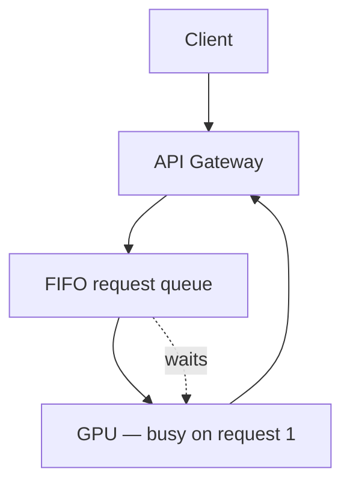
**What broke**: LLM decode is memory-bandwidth-bound, not compute-bound — a batch size of 1
leaves most of the GPU's parallelism idle on every single forward pass. Throughput per GPU is a
small fraction of what the hardware can do, the request queue backs up under any real load, and
the fleet size from the capacity-estimation section balloons by an order of magnitude. This is
the "one WebSocket message = one DB write" mistake of this chapter — technically correct,
economically unworkable at 200M DAU.

**v2 — static (request-level) batching added.**

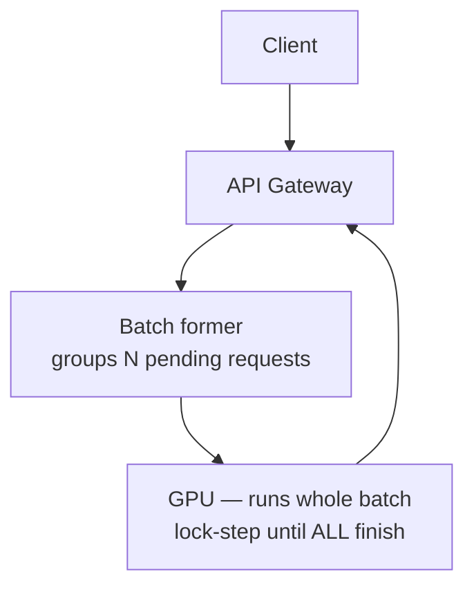
**What broke**: GPU utilization improves a lot versus v1, but the batch only retires — and only
then admits new requests — once its *slowest* sequence finishes. A 5-token "yes/no" answer sits
in a finished, idle slot for as long as it takes the batch's longest response to complete (see
the gantt chart in the batching deep dive below for the exact wasted-time math). Short and long
requests can't be mixed efficiently, so operators are tempted to bucket by expected length —
which just pushes the same idle-slot problem down a level.

**v3 — continuous batching + KV-cache paging (the production design, detailed below).**

This is the architecture in the full diagram immediately below: iteration-level scheduling
backfills a freed batch slot on the very next decode step instead of waiting for the whole
batch, and PagedAttention removes the memory fragmentation that would otherwise cap how many
sequences can share a GPU at once. Nothing here is invented for this chapter — Orca (continuous
batching) and vLLM (PagedAttention) are the two production techniques worth naming as soon as
you draw this box.

### Final architecture (v3)

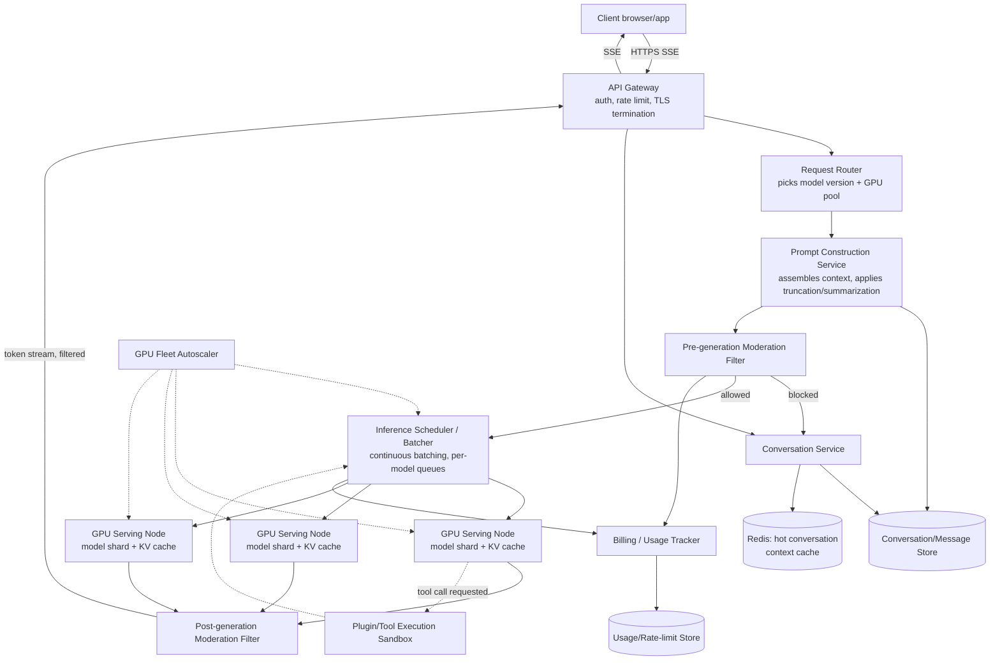

| Component | Job | Why this choice |
|---|---|---|
| API gateway | AuthN/Z, per-user rate limiting, TLS, SSE passthrough | Single ingress simplifies auth and keeps the streaming connection open end-to-end |
| Request router | Chooses model version/GPU pool per request (by explicit choice, tier, or load) | Decouples "which model" from "which physical GPU" — lets you add capacity or a new model version without client changes |
| Conversation service | CRUD over conversations/messages, orchestrates the call | Ordinary stateless app-tier service — boring by design |
| Conversation/message store | Durable history | Append-mostly, read-heavy on the *tail* of a conversation — see data model section |
| Redis context cache | Recently-used conversation's assembled context, KV-cache hints | Reassembling + re-tokenizing the last N turns on every message is wasted work if the conversation is still "hot" |
| Prompt construction service | Assembles system prompt + truncated/summarized history + new message into the final prompt | This is where context-window management (deep dive below) lives — one seam, not scattered logic |
| Pre-generation moderation filter | Screens the *user's* prompt before it reaches a GPU | Never spend GPU dollars generating a response to a prompt you were going to block anyway |
| Inference scheduler / batcher | Continuous batching across in-flight requests per model version | The core scarce-resource scheduling problem — its own deep dive below |
| GPU serving fleet | Runs the actual forward passes; holds the KV cache in GPU memory | Tensor/pipeline-parallel shards of one model span multiple physical GPUs for large models |
| Post-generation moderation filter | Screens generated tokens (streamed, incrementally) before they reach the client | Catches jailbreaks the input filter missed; last line of defense |
| Plugin/tool execution sandbox | Runs model-requested tool calls (web search, code exec) in isolation | Model output driving arbitrary code execution is a security boundary, not a library call |
| Billing/usage tracker | Meters prompt + completion tokens per user/org, feeds rate limiting | Cost per token is a first-class metric here, unlike most web systems |
| GPU fleet autoscaler | Adds/removes GPU capacity per model pool | Its own deep dive — cold-start cost of loading model weights makes this very unlike scaling a stateless web tier |

---

## Deep Dive: Continuous Batching vs. Static Batching

This is the single most-tested mechanism in this interview — the GPU-scheduling equivalent of
"pick OT or CRDT" in the collaborative-editing chapter.

**Static (request-level) batching**: gather N requests, run the model forward-pass-by-pass
until *every* sequence in the batch finishes, only then start the next batch. The problem:
generation length is unpredictable per-request — one user asks "yes or no?" (5 tokens), another
asks for a 2,000-token essay. In a static batch, the short request's GPU slot sits **idle**
for every remaining step until the longest sequence in the batch finishes.

```mermaid
gantt
    dateFormat X
    axisFormat %s
    title Static batching — GPU slot sits idle after a short sequence finishes
    section Batch slot A (5 tokens)
    generating :done, a1, 0, 5
    idle, waiting for batch : crit, a2, 5, 40
    section Batch slot B (40 tokens)
    generating : b1, 0, 40
    section Batch slot C (12 tokens)
    generating :done, c1, 0, 12
    idle, waiting for batch : crit, c2, 12, 40
```

Slots A and C finish early and then simply **waste GPU time** waiting for slot B — no new work
can start in their place until the whole batch retires together. This is exactly analogous to
the Google Docs chapter's "why last-write-wins fails" strawman: name it, reject it, then
introduce the real technique.

**🆕 Worked utilization example** (using the gantt numbers above, 3 slots × 40 time-steps = 120
slot-ticks total): slot A does useful work for 5 ticks then idles for 35; slot C does useful
work for 12 ticks then idles for 28; slot B works the full 40. Useful ticks = 5 + 12 + 40 = 57
out of 120 → **~48% GPU utilization** for this one static batch. Continuous batching backfills
slot A and slot C the instant they free up (requests 4/7 and 3/5/6 in the second gantt chart),
so — as long as the queue isn't empty — every slot is doing useful decode work on every tick →
utilization approaches **~100%**. That roughly 2x gap, on just this tiny 3-slot example, is the
same order of magnitude as Orca's reported throughput gains, and it only gets worse for static
batching as response-length variance grows (a batch mixing 5-token and 2,000-token responses is
far worse than this toy example).

**Continuous batching (a.k.a. iteration-level scheduling)** — the technique introduced by the
**Orca** paper (Yu et al., OSDI 2022) and implemented in production by serving engines like
**vLLM**, **NVIDIA TensorRT-LLM**, and **HuggingFace TGI**: instead of scheduling at the
*request* level, schedule at the *iteration* (single forward-pass/single-token-step) level. The
moment slot A finishes, a brand-new request slides into that freed slot on the *very next*
iteration — no need to wait for slots B or C.

```mermaid
gantt
    dateFormat X
    axisFormat %s
    title Continuous batching — a finished slot is immediately backfilled
    section Slot A
    request 1 (5 tok) :done, a1, 0, 5
    request 4 (10 tok) : a2, 5, 15
    request 7 (18 tok) : a3, 15, 33
    section Slot B
    request 2 (40 tok) : b1, 0, 40
    section Slot C
    request 3 (12 tok) :done, c1, 0, 12
    request 5 (9 tok) :done, c2, 12, 21
    request 6 (14 tok) : c3, 21, 35
```

Orca's paper reports up to **36.9x higher throughput** than request-level batching systems on
their benchmarks — the headline number worth memorizing, though always caveat it as
benchmark-specific rather than a universal multiplier. Orca pairs this with **selective
batching**: batch together the parts of the forward pass that tolerate different sequence
lengths cleanly (QKV projections, feed-forward layers), while handling attention — which
depends on each sequence's individual, differently-sized KV cache — per-sequence within the
same iteration.

**Interview cheat-sheet:**
> "Static batching wastes GPU cycles waiting for the slowest sequence in the batch to finish.
> Continuous batching, from the Orca paper and implemented in vLLM/TensorRT-LLM/TGI, schedules
> at the granularity of one decoding step instead of one request, so a finished sequence's slot
> is immediately backfilled by a new request — GPU utilization stays high regardless of the
> variance in how long each response happens to be."

---

## Deep Dive: KV-Cache Paging (PagedAttention)

Continuous batching solves *when* work enters a batch. It doesn't solve a second problem:
**where does each sequence's working memory live, and how much of it gets wasted?**

Every token a model generates attends back over all previous tokens' **key and value (KV)
vectors** — the "KV cache" — so it doesn't have to recompute them from scratch each step. This
cache is large (grows with sequence length × number of layers × hidden size) and, critically,
**its final size is unknown up front**: you don't know if a user's response will be 20 tokens
or 2,000 tokens when you allocate memory for it.

**The naive approach**: pre-allocate a contiguous slab of GPU memory sized for the *maximum
possible* sequence length, per request. This wastes enormous amounts of memory on short
sequences (most of the slab sits empty) and causes **fragmentation** — memory carved into
differently-sized dead-on-arrival chunks that can't be reused for a different-shaped request
even though the *total* free memory would be enough.

**PagedAttention** (Kwon et al., from the **vLLM** project at UC Berkeley) borrows the fix
straight from operating-systems memory management: treat GPU memory for the KV cache the way
an OS treats RAM for a process — **paged**, not slab-allocated.

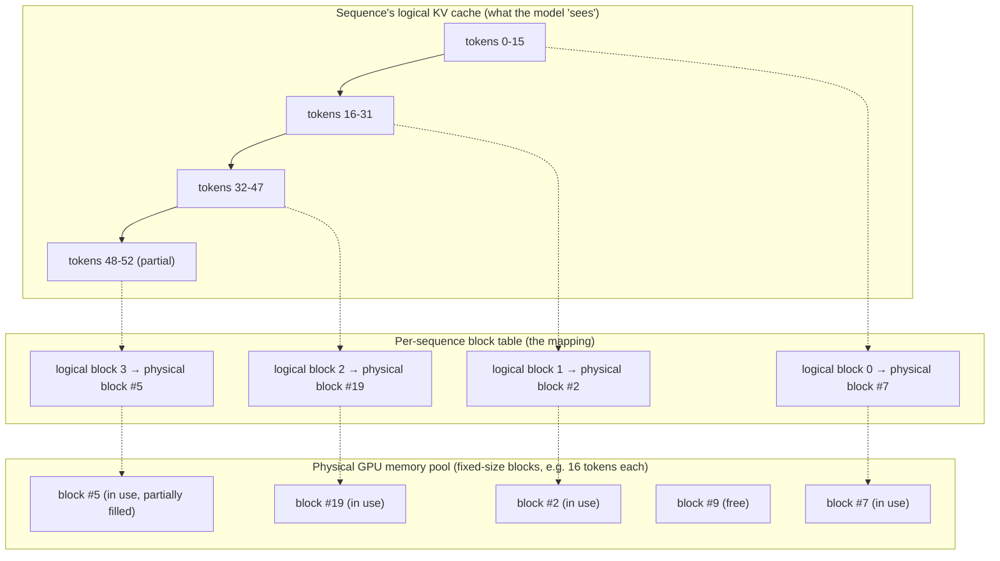

Key ideas, plainly stated:
- KV cache memory is carved into fixed-size **blocks** (16 tokens' worth, in vLLM's default),
  from one shared pool across all in-flight sequences.
- Each sequence has a small **block table** mapping its logical token positions to whichever
  physical blocks happen to be free — blocks for one sequence **do not need to be contiguous**
  in GPU memory, exactly like virtual memory pages for a process don't need to be contiguous
  in physical RAM.
- Memory waste is now bounded to **at most one partially-filled block per sequence** (the last,
  still-growing one) instead of an entire over-provisioned slab.
- When a sequence finishes, its blocks return to the shared free pool immediately, available
  for the very next request's growing cache — this is what makes continuous batching's rapid
  slot turnover actually cheap to support at the memory-allocation level.
- **Bonus**: because blocks are addressed by table entries rather than fixed offsets, **prefix
  sharing** falls out naturally — two requests with an identical system prompt or a shared
  conversation prefix can literally point their block tables at the *same* physical blocks
  copy-on-write, instead of duplicating that KV cache per request.

**Why this matters for capacity**: PagedAttention's headline result in the vLLM paper is
serving significantly more concurrent sequences per GPU than a naive slab-allocation baseline —
directly increasing the "concurrency-bound GPU count" term from the capacity-estimation section
above, without touching hardware.

**🆕 Worked KV-cache memory example** (illustrative numbers, not a specific model's real specs):

```
GPU memory                 = 80 GB total (e.g. one H100)
model weights               = 40 GB  → leaves 40 GB for KV cache + activations
usable for KV cache         ≈ 35 GB  (after reserving room for activations/overhead)

KV cache per token          = 2 (K and V) × 32 layers × 4096 hidden dim × 2 bytes (fp16)
                             = 512 KB / token

Naive slab allocation (reserve for max possible length, e.g. 4,000 tokens/request):
  memory per request        = 4,000 × 512 KB              ≈ 2.0 GB/request (reserved up front)
  concurrent requests        = 35 GB / 2.0 GB               ≈ 17 sequences/GPU

Paged allocation (allocate only what's actually used, avg length ≈ 800 tokens):
  memory per request        = 800 × 512 KB                 ≈ 0.4 GB/request (actual usage)
  concurrent requests        = 35 GB / 0.4 GB                ≈ 87 sequences/GPU
```

Same 80 GB card, **~5x more concurrent sequences** just by not pre-reserving for a worst case
that most requests never hit — this is the mechanism-level reason the capacity-estimation
section's "streams a single GPU can hold" number (50/GPU) is achievable at all, and it's the
same "don't allocate for the max, allocate for what's used" idea as an OS overcommitting virtual
memory.

**Interview cheat-sheet:**
> "The KV cache is the actual scarce resource on the GPU, not raw FLOPs, once you're
> serving many concurrent users. PagedAttention — vLLM's core contribution — pages that memory
> into fixed-size blocks with a per-sequence block table, the same trick an OS uses for virtual
> memory, so fragmentation drops to at most one partial block per sequence and finished
> sequences' memory is instantly reusable."

---

## Deep Dive: Token Streaming — Keystroke to Token-in-Browser

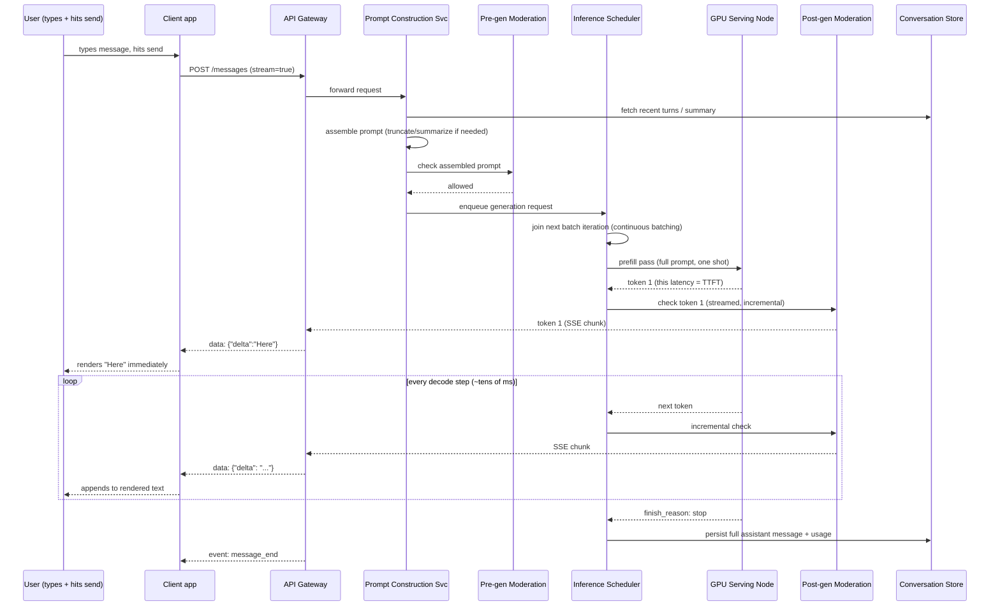

Two latencies to name explicitly, because interviewers grade on this vocabulary:
- **Time to first token (TTFT)** — dominated by the **prefill** pass: processing the entire
  input prompt in one parallel forward pass before any output token exists. Longer prompts (or
  longer resent conversation history) directly increase TTFT — a strong argument for the
  context-window management work in the next deep dive.
- **Time per output token (TPOT)**, sometimes called inter-token latency — the steady-state gap
  between consecutive streamed tokens during **decode**. This is bound by the batching and
  KV-cache mechanics above: a well-batched, well-paged GPU keeps TPOT low and *consistent* even
  as more users share it; a poorly batched one degrades unevenly.

**Why not buffer several tokens before flushing?** It would smooth network overhead trivially,
but it directly hurts the metric users feel most: perceived responsiveness. Chat products
universally flush every token (or every few, at most) the instant it's decoded.

### 🆕 Recall Table: TTFT vs. TPOT vs. Total Latency

Mnemonic: **TTFT is about how much you must *read* (prefill scans the whole prompt); TPOT is
about how fast you can *write* once reading is done (decode, one token at a time).** Interviewers
routinely ask "user says the bot feels slow to start but fine once it's going — what's the
lever?" — this table is the answer, memorized:

| Metric | What it measures | Dominated by | If this is the complaint, look at... |
|---|---|---|---|
| **TTFT** (time to first token) | Delay before *any* text appears | The **prefill** pass over system prompt + history + new message, plus queueing time waiting for a batch slot | Prompt/context length (shrink via context-window mgmt), prefix/KV-cache reuse (skip recomputing unchanged history), scheduler queue depth |
| **TPOT** (time per output token, inter-token latency) | Steady-state gap between each streamed token during decode | Batch quality (continuous vs. static), KV-cache paging efficiency, model size, GPU contention | Batching/scheduler tuning, noisy-neighbor limits, quantized/smaller model tier |
| **Total latency** | `TTFT + (TPOT × output tokens)` | Whichever term is larger for this request shape | Short answers ("yes/no"): TTFT dominates — optimize prompt size. Long answers (2,000-token essay): TPOT dominates — optimize batching/model size |

**If-X-then-Y**: if TTFT is high but TPOT is fine, the problem is prompt size or queueing, *not*
the batching/paging layer — don't reach for PagedAttention tuning to fix a slow-to-start bot. If
TPOT is high (or, worse, inconsistent across users), the problem *is* the batching/KV-cache
layer or GPU contention — don't reach for context-window trimming to fix a slow-to-stream bot.

---

## Deep Dive: Context-Window Management

The model call is stateless — every request resends the conversation. A model's **maximum
context window** (e.g., 8K/32K/128K tokens) is a hard ceiling that a long-running conversation
will eventually hit. Someone has to decide what goes in the resent prompt when
`system_prompt + history + new_message > max_context`.

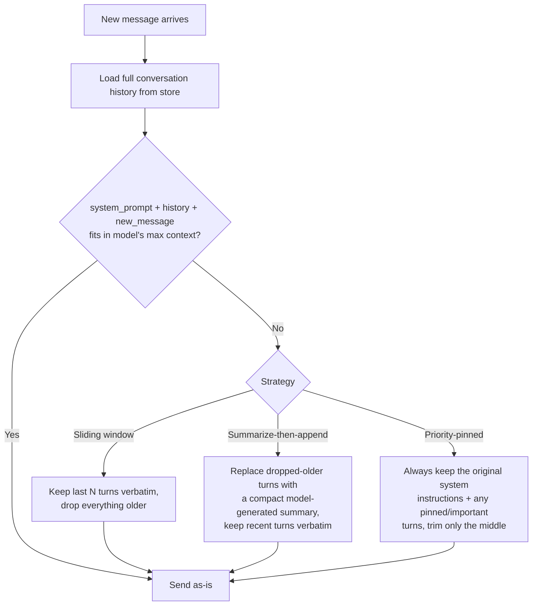

Three strategies, in increasing order of sophistication (and cost):

1. **Sliding window / hard truncation** — keep only the most recent N turns, drop the rest.
   Cheapest, but the assistant "forgets" anything outside the window — including instructions
   given at the very start of the conversation ("always answer in French"), which is exactly
   the failure mode users complain about most.
2. **Summarize-then-append** — periodically (e.g., every K turns, or whenever the window
   fills), run a **separate, cheap summarization model call** over the oldest turns, replace
   them with a short summary, and keep recent turns verbatim. This is strictly more expensive
   (an extra model call) but preserves the *gist* of early instructions instead of losing them
   outright.
3. **Priority-pinned context** — treat the original system prompt and any explicitly
   "important" turns (e.g., a user profile fact, a stated constraint) as never-evictable,
   trimming or summarizing only the conversational middle. Real products (and most agent
   frameworks) converge on some version of this: system prompt is sacred, recent turns are
   sacred, everything in between is compressible.

**Trade-off to name unprompted**: summarization adds latency (another model round-trip) and
cost (another set of tokens processed) on the write path, but avoids the "the assistant just
forgot what I told it three messages ago" failure that a pure sliding window produces. Most
production systems use a **hybrid**: sliding window for the common case (most conversations are
short), triggering summarization only once a conversation crosses a length threshold.

**Interview cheat-sheet:**
> "Context management is a store-vs-resend problem: the model is stateless, so on every call I
> either send the whole history (breaks past the context limit), a sliding window of recent
> turns (cheap but forgetful), or a summarized-older + verbatim-recent hybrid (costs one extra
> model call, preserves intent). I'd default to hybrid with sliding window as the fast path."

### 🆕 End-to-End: A Conversation Crosses the Context Window Mid-Session

The flowchart above shows the *decision*. This sequence diagram traces the full round-trip
through every major component when that decision actually fires mid-conversation — the second
full end-to-end trace for this chapter, alongside the token-streaming one above.

**Worked numeric example** (`chat-large-v3`, `max_context = 8,000 tokens`):

```
system prompt                     =    50 tokens
existing history (40 turns)        = 8,000 tokens   ← accumulated over a long session
new user message                   =   150 tokens
------------------------------------------------------------------
naive total                        = 8,200 tokens   >  8,000 max  →  OVER BUDGET by 200 tokens

Trigger: summarize-then-append (this conversation is long-lived, not the common short case)
  oldest 35 turns (7,800 tokens)  →  compressed to a ~400-token summary (one cheap model call)
  most recent 5 turns             =   600 tokens, kept verbatim
  pinned system prompt             =    50 tokens

new total                          =  50 + 400 + 600 + 150  =  1,200 tokens
headroom left for max_output_tokens (800) and future turns  =  8,000 − 1,200 − 800 = 6,000 tokens
```

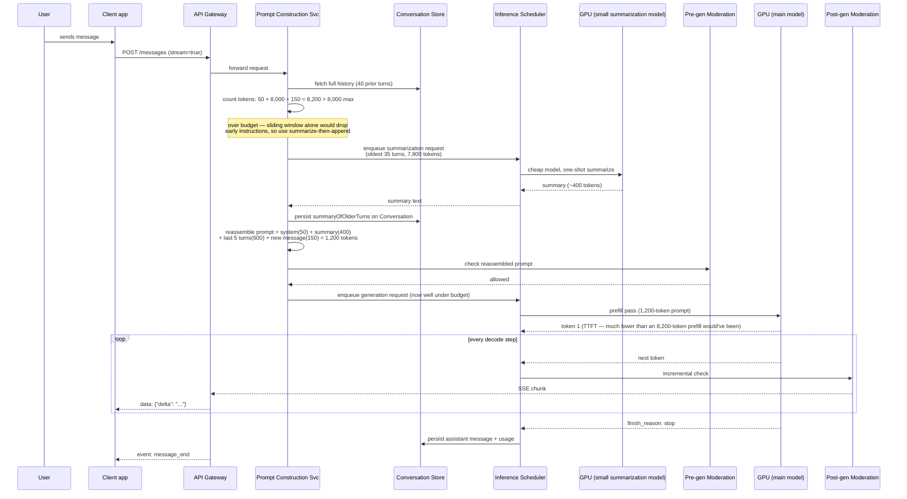

The point to say out loud: summarization isn't free (it's a whole extra scheduler round-trip and
GPU call, shown explicitly as its own participant above), but it runs **once**, on the write
path for this one message, and every subsequent message in the conversation benefits from the
now-1,200-token baseline instead of re-hitting the 8,200-token ceiling next turn too. This is
also exactly why the `summaryOfOlderTurns` field exists on the `Conversation` record in the data
model below — without persisting it, you'd re-run this same expensive summarization call on
every single subsequent message.

---

## Deep Dive: Safety & Moderation as a Two-Sided Filter

Moderation is not one gate — it's two, because a prompt can be fine but the model's *output*
still isn't (a successful jailbreak, a hallucinated harmful instruction), and because catching
a bad prompt *before* it burns GPU time is strictly cheaper than catching it after generation.

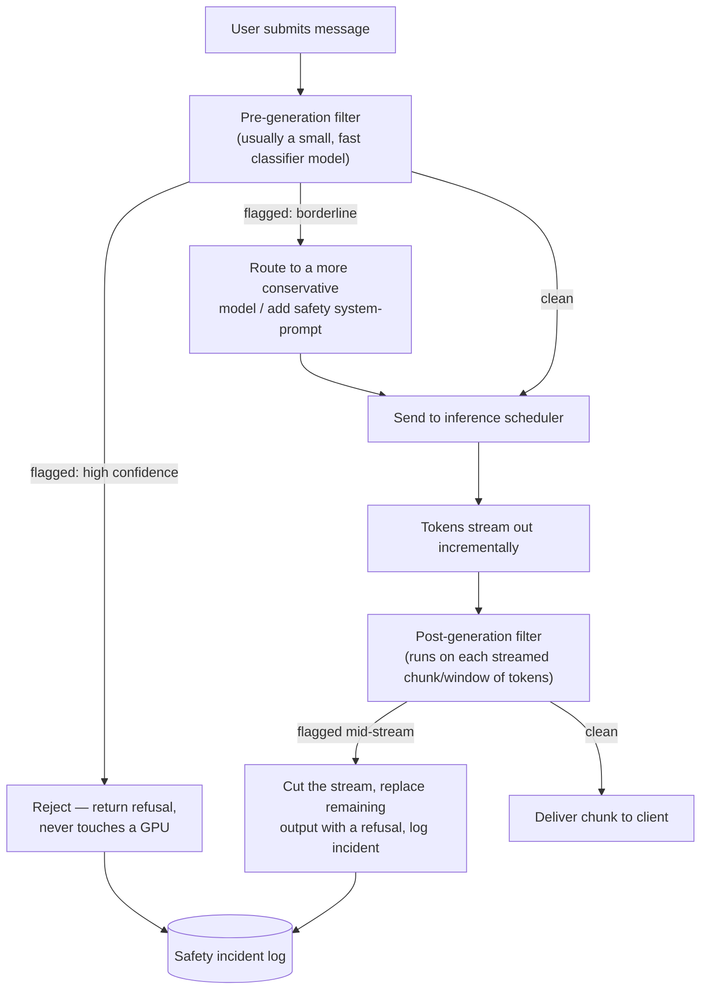

Design details worth naming:
- **Pre-generation filter** runs as a small, fast classifier (a screening model, not the main
  model) against the user's raw prompt — this is the same shape as OpenAI's public Moderation
  API pattern: classify standalone input cheaply, before it's allowed to reach the expensive
  model.
- **Post-generation filter** has to run **incrementally on the stream**, not only once at the
  end — waiting for the full response before checking it would defeat the entire point of
  streaming (and would let a fully-formed harmful response sit fully generated in memory before
  being blocked, wasting the GPU time regardless). In practice this means checking a rolling
  window of recently-streamed tokens, not the single latest token in isolation, since harmful
  intent is often only recognizable once several tokens combine.
- **Why both, not just one**: the pre-filter can't catch a **jailbreak** — a prompt engineered
  to be individually benign-looking but that steers the model into producing disallowed output
  — because the harm only appears in what the model *generates*, not in what the user *asked*.
  The post-filter is the only backstop for that class of failure.
- **Latency budget**: both filters need to add single-digit milliseconds, not hundreds — this
  is why they're typically much smaller/faster models than the main generation model, often
  running on cheaper hardware or even CPU for the pre-filter.

**Interview cheat-sheet:**
> "Moderation has to be two-sided: pre-generation to avoid wasting a GPU cycle on a prompt
> you'd refuse anyway, post-generation because a jailbreak is defined as harmful output from a
> seemingly benign prompt — the input filter structurally cannot catch that class. The output
> filter has to run on the live token stream in windows, not after the fact, or you lose the
> entire benefit of streaming."

---

## Deep Dive: GPU Fleet Autoscaling & Cold-Start Cost

Autoscaling a GPU inference pool is not like autoscaling a stateless web tier, for one
dominant reason: **spinning up a new node means loading multi-gigabyte-to-hundred-gigabyte
model weights into GPU memory before it can serve a single token** — and for models sharded
across multiple GPUs (tensor/pipeline parallelism, next section), *every* GPU in that shard
group has to finish loading before any of them are useful.

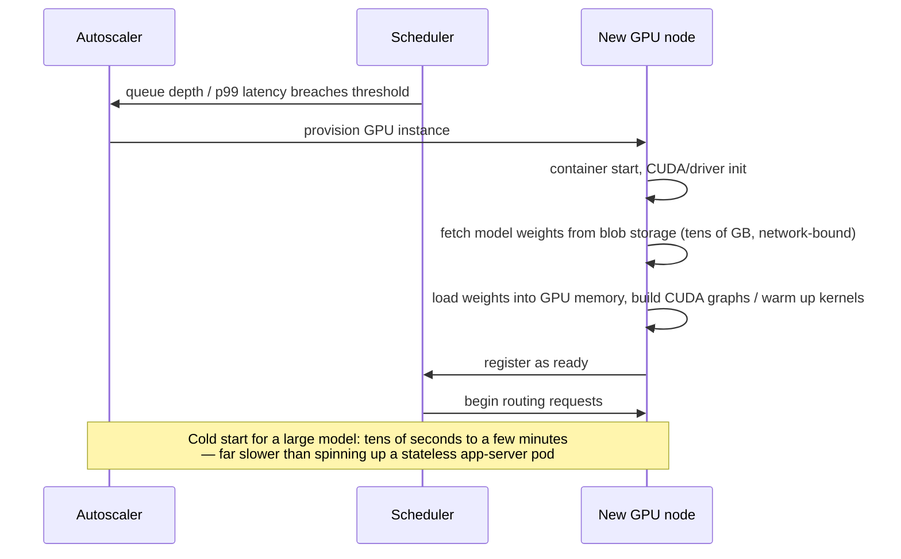

Mitigations worth naming, in order of how commonly production systems actually use them:
- **Never scale a hot pool to zero.** Keep a warm minimum-instance floor sized to the trough of
  daily traffic; only autoscale the *marginal* capacity above that floor. Scale-to-zero is
  reasonable for a rarely-used model tier, not the primary chat model.
- **Pre-warmed / standby pool.** Keep a small number of nodes with weights already loaded but
  not yet receiving traffic, ready to be slotted in the instant the scheduler needs more
  capacity — trades idle GPU cost for eliminated cold-start latency.
- **Weight-loading optimizations**: streaming weights directly from fast local NVMe caches
  instead of remote blob storage, and container/GPU memory snapshotting (resuming a
  previously-initialized process image) to skip re-running framework/CUDA initialization from
  scratch on every new node.
- **Predictive/scheduled scaling**: traffic to a chat product is highly diurnal and
  weekly-periodic — pre-scale ahead of the known daily peak instead of purely reacting to
  queue-depth breaches after the fact.
- **Route around, don't wait**: while a new node is warming, the scheduler keeps serving from
  existing (possibly momentarily over-subscribed) nodes rather than queuing requests behind the
  cold node — a cold node should never become the thing new requests wait on.

**Interview cheat-sheet:**
> "GPU autoscaling has a cost a stateless web tier doesn't: loading model weights can take tens
> of seconds to minutes, and for a model sharded across GPUs, every shard has to finish before
> any of them serve traffic. The standard mitigations are a warm floor sized to trough traffic,
> a pre-warmed standby pool, faster weight-loading paths (local NVMe, memory snapshots), and
> predictive scaling ahead of known daily peaks rather than pure reactive autoscaling."

---

## Deep Dive: Serving a Model Too Large for One GPU

Named briefly because it directly informs the autoscaling section above and the "why does
cold-start take so long" question: a large model's weights (and its per-request KV cache) can
exceed a single GPU's memory, so the model itself is **split across multiple physical GPUs**.
Two complementary splitting strategies:

| | Tensor parallelism | Pipeline parallelism |
|---|---|---|
| What's split | A single layer's matrix multiply, across GPUs (intra-layer) | Different layers assigned to different GPUs (inter-layer) |
| Communication pattern | Frequent, small all-reduce-style sync per layer — needs fast interconnect (NVLink) | Only passes activations between consecutive stages — less frequent, larger messages |
| Best suited for | Low request-rate, latency-sensitive serving (cuts TTFT directly) | High-throughput serving; lets a model exceed single-node GPU memory entirely, across multiple nodes |
| Failure blast radius | One GPU dying stalls every request in flight on that layer, immediately | One stage dying stalls the whole pipeline behind it |
| Typical combination | Used *within* a node (e.g., 4-8 GPUs, NVLink-connected) | Used *across* nodes, often combined with tensor parallelism within each node |

**Rule of thumb worth stating**: if you're compute/latency-bound, reach for tensor parallelism;
if you're memory-bound (model literally doesn't fit), reach for pipeline parallelism; if you're
request-volume-bound rather than single-request-bound, reach for plain data parallelism
(replicate the whole model across independent GPU groups) instead of either. Most large
production deployments combine all three: data-parallel replicas, each replica internally using
tensor parallelism within a node and pipeline parallelism across nodes.

**Speculative decoding — a complementary latency trick, not a batching or sharding
technique**: run a small, fast "draft" model that proposes several tokens ahead, then have the
large "target" model verify all of them in a **single parallel forward pass** and accept the
prefix that matches what it would have generated on its own. Because verifying K draft tokens
in one pass is cheaper than generating them one at a time autoregressively, an accepted run of
tokens is delivered at a fraction of the latency — the technique's payoff scales with the
draft model's **acceptance rate** (how often its guesses match the target model), not its raw
language-modeling quality. This composes with continuous batching and tensor parallelism; it's
a decode-latency optimization layered on top of the scheduling and sharding decisions above, not
a replacement for them.

---

## Data Model

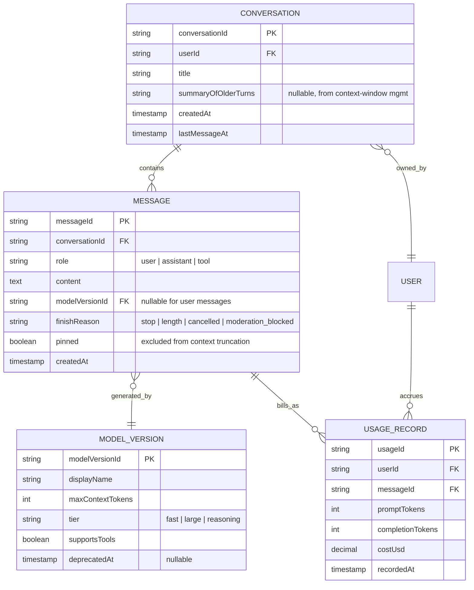

| Table | DB choice | Rationale |
|---|---|---|
| `Conversation` | Document store (e.g., DynamoDB/MongoDB) keyed by `conversationId` | Read pattern is almost always "fetch one conversation's recent messages" — no cross-conversation joins needed |
| `Message` | Same document store, or a wide-column store partitioned by `conversationId`, sorted by `createdAt` | Append-mostly, always read as an ordered range within one conversation — a natural fit for a sorted, partitioned table rather than a relational join |
| `ModelVersion` | Small relational table / config service | Tiny, low-write-volume, needs simple lookups by ID — a cache-friendly config table, not a scale concern |
| `UsageRecord` | Append-only, time-partitioned store (e.g., a columnar/analytics store) feeding both real-time rate-limit checks and monthly billing rollups | High write volume, aggregate-heavy reads (sum tokens per user per billing period) — the classic shape for a time-series/OLAP-leaning store, not a transactional RDBMS |

**Why the `summaryOfOlderTurns` field on `Conversation` and `pinned` flag on `Message`**: these
are the storage-layer hooks the context-window deep dive needs — the prompt construction
service reads `pinned` messages plus the summary plus the most recent N raw messages, instead
of re-summarizing from scratch on every single call.

---

## Failure Modes & Mitigations

| Failure | Impact | Mitigation |
|---|---|---|
| GPU node crashes mid-generation | User's partial response is lost, stream just dies | Client-side: buffer received tokens, on stream drop show what arrived + a retry button rather than silently failing; server-side: scheduler detects the dead node's slots and can re-issue the request to a healthy node, resuming from the persisted partial output where feasible, otherwise starting over |
| Moderation false negative (harmful content slips through) | Reputational/safety incident | Defense in depth — pre- *and* post-generation filters are independent models; log every flagged-borderline case for offline review and filter retraining, don't rely on a single filter pass |
| Moderation false positive (benign content blocked) | User-visible over-refusal, bad UX | Route borderline-confidence cases to a stricter model/system-prompt instead of a hard block (see moderation flowchart); provide an appeal/feedback path that feeds back into filter tuning |
| Context truncation drops important early instructions | Assistant "forgets" what it was told, user has to repeat themselves | Priority-pinned context (system prompt + explicitly pinned turns never evicted) + summarize-rather-than-drop for the rest |
| Noisy-neighbor GPU contention (one user's huge prompt/response starves others sharing a batch) | Other users on the same GPU see degraded TPOT | Per-user/per-tier token-bucket rate limiting (below) at admission time, plus fair scheduling within the batcher (cap max tokens any single sequence contributes per iteration) |
| Tool/plugin call hangs or misbehaves | Generation stalls waiting on an external call | Timeout + circuit breaker around the tool sandbox; on timeout, resume generation with an explicit "tool call failed" result rather than blocking indefinitely |
| Scheduler itself becomes a single point of failure | No requests can be routed to any GPU | Run the scheduler as a replicated, stateless-where-possible service with fast leader election — see HA discussion below |
| Cold GPU node added mid-traffic-spike, adds latency instead of relieving it | Autoscaling makes the p99 worse, briefly, right when it's needed most | Pre-warmed standby pool absorbs the spike while new cold nodes finish loading in the background; never route fresh traffic to a node still loading weights |

---

## Non-Functional Walkthrough

### Scaling to millions of concurrent conversations
- The API gateway and conversation service scale horizontally like any stateless web tier —
  this part is genuinely boring, by design.
- The hard scaling axis is GPU capacity, not request-handling capacity: continuous batching +
  KV-cache paging maximize concurrent streams per GPU, data/tensor/pipeline parallelism scale a
  single model across many GPUs, and the request router load-balances across model-version
  pools so a spike on one model tier doesn't starve another.
- Conversation history storage scales the conventional way: partition by `conversationId`,
  since essentially all reads and writes are scoped to one conversation at a time — no
  cross-partition fan-out needed for the common path.

### High availability of the inference scheduler
- Run multiple scheduler replicas behind a fast leader-election mechanism (or a
  sharded-by-model-pool design where each shard has its own primary) so a single scheduler
  crash doesn't stall an entire model tier.
- Keep the scheduler's own state (queue contents, which GPU owns which in-flight sequence)
  minimal and reconstructable — in-flight requests can be safely re-queued to a surviving
  scheduler shard; the source of truth for *durable* conversation state lives in the
  conversation store, not in scheduler memory.
- GPU nodes register/de-register with a health-checked service discovery layer so the scheduler
  never routes to a node that's mid-crash or mid-weight-load.

### Consistency needs for conversation history
- **Eventual consistency is completely fine here** — a genuinely different answer than the
  Google Docs chapter, worth contrasting explicitly if asked. If a conversation's title update
  or a usage counter takes a few hundred milliseconds to propagate to a second device, nobody
  is harmed. Compare this to a payment ledger (must be strongly consistent and durable *before*
  acknowledging) or the Docs chapter's live document text (must converge to one exact byte
  sequence for every viewer). Here, the worst case of staleness is "my other tab shows the
  message list one refresh behind" — a UX nit, not a correctness violation.
- The one place strong consistency *does* matter: a single conversation's message **ordering**
  and the **usage/rate-limit counters** that gate whether the next request is even allowed to
  proceed — those need to be read-your-writes consistent for the user who just sent the
  message, even if propagation to their other devices can lag.

---

## Security, Compliance & Privacy

- **PII in prompts**: users routinely paste sensitive data (names, health info, proprietary
  code) into prompts. Encrypt data in transit and at rest as a baseline; additionally consider
  a PII-detection pass (similar shape to the moderation filter) that can redact or flag
  sensitive fields before they're persisted in long-term conversation storage or used to
  improve models.
- **Data retention / opt-out for training**: give users and enterprise customers an explicit,
  auditable setting for whether their conversations may be used to improve/train future models,
  and a separate, shorter retention window for conversations that opt out — this needs to be a
  first-class flag on the `Conversation`/`User` record, not an afterthought policy document.
- **Per-tenant isolation for enterprise customers**: enterprise/business customers typically
  require a guarantee that their prompts and completions are never used for training and never
  visible to other tenants — implemented via tenant-scoped storage partitions, tenant-specific
  encryption keys, and often dedicated (not shared-pool) inference capacity for the largest
  customers, trading some of the cost benefit of shared GPU pools for a hard isolation
  guarantee.
- **Prompt injection via tool results**: when a tool call (web search, document retrieval)
  brings external content back into the model's context, that content is now
  attacker-controllable input to the model — treat tool results as untrusted input requiring
  the same scrutiny as direct user input, not as trusted system data.
- **Auth**: standard OAuth2/OIDC for user-facing auth, service-to-service mTLS between the
  gateway, scheduler, and GPU fleet, and API-key-scoped access with per-key rate limits for
  programmatic/API customers.

---

## Cost & Trade-offs

GPU compute is, by a wide margin, the dominant cost line — unlike almost every other system in
this course, where storage or bandwidth usually wins that title.

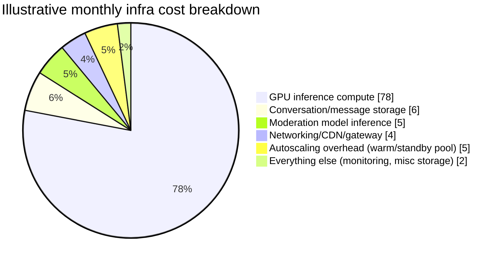

### Bigger model vs. quantized/distilled model

| | Full-precision large model | Quantized (e.g., int8/int4) or distilled smaller model |
|---|---|---|
| Quality ceiling | Highest | Somewhat lower — the exact gap is workload-dependent |
| GPU memory footprint | Largest — fewer concurrent sequences fit per GPU | Smaller — more concurrent sequences per GPU, or fits on cheaper hardware |
| Throughput per GPU | Lower | Higher |
| Cost per token | Highest | Lowest |
| Where to use it | Complex reasoning, coding, high-stakes answers — route via the request router's model-tier choice | Simple queries, quick factual lookups, draft-model role in speculative decoding |

**The trade-off in one line**: most production systems don't pick one — they run a **tiered
fleet** and let the router send easy queries to a cheap/fast model and hard queries to the
expensive one, the same "different tool for different job" instinct as picking OT vs. CRDT per
use case in the Docs chapter, just applied to model size instead of consistency algorithm.

### Cache hit-rate economics (prefix/KV-cache reuse)

Because PagedAttention makes KV-cache blocks shareable by reference, **prompt-prefix reuse**
(identical system prompts, or the unchanged earlier turns of an ongoing conversation) can skip
re-computing that portion of the KV cache entirely on the next turn — directly cutting TTFT and
GPU work for the resent-context portion of every follow-up message, which the capacity
estimation above showed is the *majority* of daily token volume (2.4 of 3.66 trillion
tokens/day was resent context, not new input). A high prefix cache hit rate is one of the
single biggest cost levers available, precisely because conversations are structurally
prefix-heavy — the same growing context gets resent, mostly unchanged, on every turn.

### Rate limiting and per-token cost accounting

Rate limit on **token volume**, not request count — a single request with a 50K-token resent
conversation history costs vastly more GPU time than a single short request, so a naive
requests-per-minute limit lets a handful of heavy users monopolize the fleet while looking
"within limits" by request count alone. The standard mechanism: a **token-bucket** per user (or
per API key/org), refilled continuously at a tokens-per-minute rate, drawn down by
`prompt_tokens + completion_tokens` on every call — mirroring how OpenAI's own public API
enforces both RPM (requests per minute) and TPM (tokens per minute) simultaneously, with TPM
being the one that actually protects shared GPU capacity. Pair this with **usage-based
billing**: meter prompt and completion tokens separately (they're priced differently, since
completion/decode tokens cost more GPU time per token than prefill/prompt tokens), and feed the
same `UsageRecord` stream that powers the rate limiter into the billing pipeline — one source of
truth for "how much did this user cost us" and "how much do we charge them."

---

## Wrap-up: MVP vs. Out of Scope, and Stretch Goals

**MVP** (what you should be able to defend a design for in a 45-minute interview):
- Send-a-message + streamed response over SSE, single default model.
- Conversation history persisted and resent each turn, with a simple sliding-window truncation
  strategy.
- Continuous batching + KV-cache paging on a single-model GPU pool.
- Pre- and post-generation moderation, even if both are simple threshold-based classifiers.
- Per-user token-bucket rate limiting and basic usage metering.

**Explicitly out of scope for MVP** (name these unprompted, don't let the interviewer catch you
having "forgotten" them):
- Multiple model versions/tiers and router-driven model selection.
- Tool/plugin calling and the sandboxed execution layer.
- Summarization-based context management (ship sliding-window first).
- Multi-region/multi-datacenter serving and disaster recovery.
- Enterprise per-tenant isolation guarantees.

**Stretch goals** (name 2-3 if time remains, to show breadth beyond the core ask):
1. **Multi-modal input** — images, audio, or documents as part of the prompt. Changes the
   prefill cost model substantially (a large image can cost far more "effective tokens" than
   its text description would suggest) and requires a modality-aware pre-generation moderation
   pass (image classifiers, not just text classifiers).
2. **Long-term memory across conversations** — a persistent user-level memory store (facts,
   preferences) retrieved and injected into the prompt at the start of *any* new conversation,
   not just within one conversation's own history. This is structurally a retrieval problem
   layered on top of the prompt-construction service, distinct from within-conversation
   context-window management.
3. **Agentic tool use** — letting the model chain multiple tool calls and reasoning steps
   autonomously toward a goal, rather than a single tool call per turn. Raises the stakes on
   the tool-execution sandbox (more autonomous, more surface area for prompt injection via
   intermediate tool outputs) and on cost accounting (a single user turn can now trigger an
   unbounded number of underlying model calls — needs its own budget/step-limit, separate from
   plain per-message token limits).

---

## Interview Cheat-Sheets

### Requirements & estimation
- Functional core: send-message-stream-response, conversation history/context, multi-model
  support, tool calling, stop/regenerate, moderation.
- Non-functional core: low TTFT, high GPU utilization, fairness, safety, cost per token.
- Formula chain: DAU → messages/day → tokens/day (prompt + resent context + completion) →
  tokens/sec → GPUs (throughput-bound) *and* GPUs (concurrency-bound) → take the max.
- For a chat-shaped workload (many short streams), **concurrency**, not raw throughput, is
  usually the binding GPU-count constraint — say this explicitly, it's the opposite of most
  other capacity estimates in this course.

### Architecture
- API gateway (auth/rate-limit) → request router (model/pool selection) → prompt construction
  (context assembly + truncation/summarization) → pre-generation moderation → inference
  scheduler (continuous batching) → GPU fleet (KV cache, tensor/pipeline parallel shards) →
  post-generation moderation (streamed) → SSE back to client.
- SSE, not WebSockets, for the completion stream — it's one-directional server push; stop/
  regenerate are separate, rare REST calls, not channel messages.

### The three GPU-serving mechanisms interviewers weight most (the make-or-break section)
- **Continuous batching (Orca, implemented in vLLM/TensorRT-LLM/TGI)**: schedule at the
  iteration level, not the request level, so a finished sequence's slot is immediately
  backfilled — this is what static batching gets wrong (idles on the slowest sequence in the
  batch).
- **PagedAttention / KV-cache paging (vLLM)**: page GPU memory for the KV cache into fixed-size
  blocks with a per-sequence block table, the same trick an OS uses for virtual memory —
  bounds fragmentation to at most one partial block per sequence and enables prefix sharing.
- **Speculative decoding**: a small draft model proposes tokens ahead, the large target model
  verifies them in one parallel pass — payoff scales with acceptance rate, composes on top of
  batching and parallelism, doesn't replace them.
- Be ready to draw the static-vs-continuous-batching timeline and the block-table diagram from
  memory.

### Non-functional walkthrough
- Scale: GPU capacity (not request-handling capacity) is the hard axis — batching, paging,
  parallelism, and router-based load balancing across model pools are the levers.
- HA: replicated/sharded scheduler with fast leader election; GPU nodes register/de-register
  via health-checked service discovery; never route fresh traffic to a still-loading node.
- Consistency: eventual consistency is genuinely fine for conversation history and usage
  counters — the sharp contrast with the Docs chapter's document-content consistency
  requirement is worth naming if asked to compare.

### Cost & trade-offs
- GPU compute dominates cost, by far — everything else (storage, moderation, networking) is
  a rounding error by comparison in a mature deployment.
- Bigger model vs. quantized/distilled: run a tiered fleet, route by query difficulty, don't
  pick one size for everything.
- Rate limit on **token volume** (token-bucket, tokens-per-minute), not just request count —
  a single huge-context request can cost more GPU time than a hundred short ones.
- Prefix/KV-cache reuse across turns is one of the single biggest cost levers, precisely
  because resent conversation context is the majority of daily token volume.

---

## Golden Rules

- **GPUs are the scarce, non-elastic resource — everything in this design exists to keep them
  busy on useful work.** An idle or poorly-batched GPU is the direct cost-and-latency failure
  mode of this entire system, the way an idle server thread almost never is in a typical web
  system.
- **Continuous batching beats static batching because it schedules at the iteration level, not
  the request level** — a finished sequence's slot gets backfilled immediately instead of
  sitting idle until the slowest sequence in its batch finishes.
- **PagedAttention treats KV-cache memory like an OS treats virtual memory** — fixed-size
  blocks plus a per-sequence block table, so fragmentation is bounded and finished sequences'
  memory is instantly reusable.
- **Time-to-first-token (prefill-bound) and time-per-output-token (decode-bound, batching/
  paging-bound) are different metrics with different levers** — don't conflate them when asked
  about latency.
- **Moderation must be two-sided.** Pre-generation to avoid wasting GPU time on a prompt you'd
  refuse anyway; post-generation, running incrementally on the live stream, because a jailbreak
  is by definition harmful *output* from a seemingly benign *input* — only the output filter
  can catch that.
- **Rate limit and bill on tokens, not requests** — request count hides the real cost driver,
  which is how many tokens (especially resent conversation context) a call actually processes.
- **Conversation history and usage counters can be eventually consistent** — this system's
  correctness-critical core is the token stream itself and the moderation/rate-limit gates in
  front of it, not the metadata around it. Don't reflexively demand strong consistency
  everywhere the way a payments or Docs-content system would require.

---

## Master Cheat Sheet

**Formula chain**: DAU → messages/day → tokens/day (prompt + resent context + completion) →
tokens/sec → GPUs by throughput *and* GPUs by concurrency → take the max (concurrency usually
wins for chat-shaped traffic).

**Core commitment**: name and defend the three serving mechanisms — continuous batching (Orca/
vLLM/TensorRT-LLM/TGI), KV-cache paging (PagedAttention/vLLM), and (bonus) speculative
decoding. This is the section interviewers weight most, the direct analogue of "pick OT or
CRDT" in the collaborative-editing chapter.

**Architecture skeleton**: API gateway → request router → prompt construction (context
truncation/summarization) → pre-gen moderation → inference scheduler (continuous batching) →
GPU fleet (KV cache + tensor/pipeline parallel shards) → post-gen moderation (streamed) → SSE
to client. Autoscaler manages the GPU fleet; billing/usage tracker meters every call.

**Streaming lever**: SSE, one-directional server push, per-token flush — not WebSockets, not
buffered batches of tokens.

**Context lever**: sliding window (cheap, forgetful) vs. summarize-then-append (costs one extra
model call, preserves intent) vs. priority-pinned (system prompt + pinned turns never evicted).
Default: hybrid, sliding window as the fast path.

**Consistency stack**: strong for message ordering and rate-limit/usage counters at the
requesting user's own read; eventual everywhere else (conversation title sync across devices,
etc.) — the opposite emphasis from the Docs chapter's document-content consistency.

**Cost lever**: GPU compute dominates; tiered model fleet (big vs. quantized/distilled) routed
by query difficulty; token-bucket rate limiting on tokens-per-minute, not requests-per-minute;
prefix/KV-cache reuse across conversation turns as the single biggest efficiency lever, since
resent context is the majority of daily token volume.

**One-liners for common interview probes**:
- "Why SSE and not WebSockets?" → the completion stream is one-directional server push; stop/
  regenerate are rare, separate REST calls — WebSockets' bidirectionality buys nothing here.
- "Why does static batching waste GPU time?" → the whole batch waits for its slowest sequence
  to finish before any new request can start; continuous batching backfills a finished slot on
  the very next iteration instead.
- "Why not pre-allocate max-length KV cache per request?" → massive fragmentation and wasted
  memory on the many requests that finish far short of the max — PagedAttention pages memory
  in fixed-size blocks instead.
- "How do you keep one huge prompt from starving everyone else on a GPU?" → token-bucket rate
  limiting at admission time, plus a per-iteration cap on how many tokens any single sequence
  contributes inside the batcher.
- "What's still missing?" → multi-modal input, cross-conversation long-term memory, and
  autonomous multi-step agentic tool use — name these as stated stretch goals, not gaps you
  forgot.
