# Design a Data Infrastructure System — The Story (narrative edition)

> **What this file is.** The reference file, `43-Design-a-Data-Infrastructure-System-FAANG-Guide.md`, is the one to recite from — requirements, capacity math, API shapes, every deep-dive table, the master cheat sheet. This file is a second way in: the same material as one continuous story, told in plain language. Engineers at a company keep hitting a wall, patch it, and the patch itself creates the next wall — until we land on the exact same lakehouse architecture the reference file documents. The company, **Kestrel** (a fictional online marketplace), is made up. But every wall it hits, and every fix it reaches for, is something a real, named system actually does: Debezium's CDC (built at Red Hat), Apache Kafka (built at LinkedIn), Apache Flink's checkpointing (based on the real 1985 Chandy-Lamport snapshot algorithm), the Lambda architecture (coined by Nathan Marz, Storm's creator) and Kappa architecture (proposed by Jay Kreps, Kafka's co-creator), Apache Iceberg (created at Netflix), Delta Lake (Databricks), Apache Hudi (created at Uber), Confluent's Schema Registry, Great Expectations, and Apache Airflow (built at Airbnb). I'll say clearly, every time, whether a number is a documented fact from the reference guide's own worked example or just a reasonable stand-in for Kestrel's story, tagged `[illustrative]`.

**The trigger phrase** for this whole topic: *"our analysts keep slowing down checkout,"* or *"we found a bug in the pipeline and now we can't trust six months of dashboards."* Keep one sentence in your head as you read: **nothing that reads data for analysis, ML, or reporting should ever touch the same system, the same load, or the same raw copy that production traffic depends on — there has to be a separate, governed path in between.** Everything below is just this one idea, getting harder in small, honest steps.

---

## Chapter 1 — The report that made checkout time out

It's Kestrel's third year. The whole company — orders, inventory, checkout — runs on one Postgres database. Checkout is fast: p99 latency sits around **80ms**. One Tuesday, a growth analyst wants a monthly cohort report: total revenue per signup month, joined across the 25-million-row `orders` table and the 60-million-row `order_items` table, straight from the production replica... except Kestrel doesn't have a replica yet, so the query runs against the **primary**. It's a heavy join with no useful index, and it takes **4 minutes** to finish, hammering disk I/O and holding row locks the whole time.

During those 4 minutes, checkout's p99 latency jumps from 80ms to **6,000ms**, and the checkout error rate (timeouts) spikes from a baseline 0.1% to **8%** `[illustrative — Kestrel's own numbers, but "one heavy analytical query competes with OLTP for the same disk/CPU/locks" is a well-documented real failure mode]`. Customer support gets 40 "is your site down?" tickets before the query finally finishes.

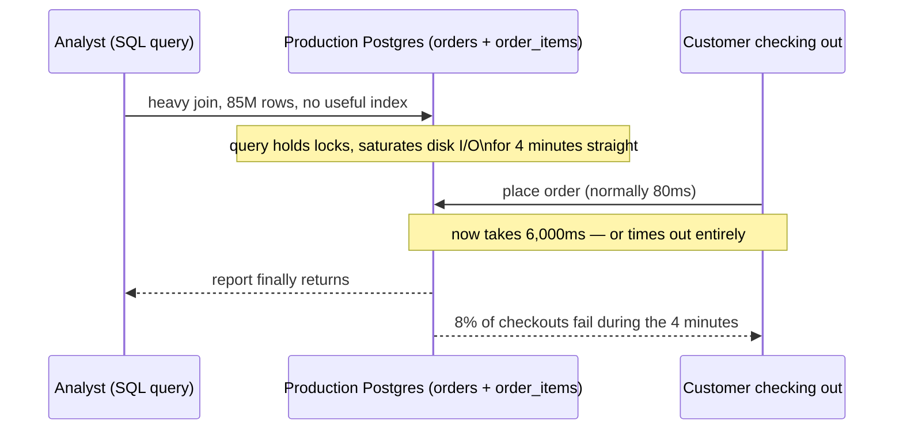

The obvious question: *why does one SQL report get to slow down real customers buying things?* Because analytics and production transactions are sharing the exact same machine, the exact same disk, the exact same lock table — one system is being asked to do two very different jobs at once: answer thousands of tiny fast writes per second, and also scan millions of rows for one big slow read.

**The fix, and the first analogy for this story:** separate the **shop floor** from the **back office**. The shop floor (production database) exists to ring up customers, fast, all day — nobody doing bookkeeping should be allowed to stand at the register doing arithmetic while a line forms. Instead, every night, someone copies the day's sales ledger to the back office, and the accountant does all their heavy analysis there, on a completely separate desk, with a completely separate copy of the numbers. Concretely: a nightly script runs at 2 AM, reads straight from production, transforms it, and loads it into a brand-new, separate data warehouse. Analysts now query the warehouse, never the shop floor.

**New problem, three weeks later:** the nightly script has a bug — it double-counts refunds for one product category. Because the script reads from production and writes *straight into* the warehouse in one step, with no raw copy kept anywhere, that bad transform overwrites the *only* record of that night's data. There's nothing to go back and recompute from. The team has to manually reconstruct three days of numbers from application logs `[illustrative]` before anyone trusts the dashboard again.

**How I'd say this in an interview:** "The very first fix for 'analytics is slowing down my OLTP system' is always the same: stop reading analytical queries off the production database at all, and move them to a separate warehouse fed by a scheduled job. But a one-step nightly script that transforms-and-loads in the same breath has no raw copy to fall back on — the next thing that breaks is exactly that."

---

## Chapter 2 — The ledger nobody kept a copy of

The fix: split "land the data" from "transform the data" into two separate steps, and never skip the first one. Before any cleaning or aggregating happens, dump the **raw**, untouched export into cheap storage first — a bucket of files, not yet a warehouse table. This raw copy is kept indefinitely and never edited in place.

**The analogy:** think of a security camera's raw footage tape versus the after-action report someone writes from watching it. If the report has a typo, you go back and rewatch the tape. If you only ever kept the report and taped over the footage the next day, a mistake in the report is unrecoverable. Kestrel's raw landing zone is the tape. Everything transformed from it is a report that can always be rewritten.

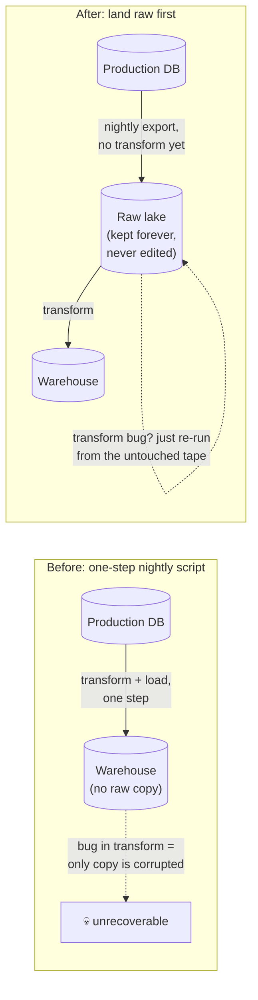

This works, and it's the first real appearance of what the industry calls a **bronze zone** — the permanent, unedited record of "what actually arrived." But two new problems show up together, six months later. First: Kestrel launches a fraud-detection feature that needs to catch card-testing attacks within minutes — but the whole pipeline only runs once a night, at 2 AM. An attacker runs 40 fraudulent test transactions between 3 AM and 5:45 AM; by the time the 2 AM-scheduled batch job would even see them (the *next* night), Kestrel has already lost **$18,000** `[illustrative]` — nightly batch can never be fast enough for a "minutes" requirement, no matter how well it's tuned.

Second, and sneakier: the nightly export is a plain `SELECT * FROM orders` running for 40 minutes across a growing table. Rows that get updated *while* the scan is in progress can be captured twice, or missed entirely, depending on exactly when the cursor passes them — a raw bulk export like this has no way to guarantee it captured one clean, consistent snapshot of a table that's still being written to live.

**How I'd say this in an interview:** "Landing raw data before transforming it is what makes 'just re-run it' a safe sentence — that's the birth of a bronze zone. But a nightly bulk export has two separate ceilings: it can never be faster than its schedule, and a long-running `SELECT *` against a live table isn't even guaranteed to capture a clean, consistent snapshot of what's changing underneath it."

---

## Chapter 3 — Reading the ship's log instead of interrogating the captain

The obvious question: *if the problem is 'asking the database questions is slow and inconsistent,' what if we stop asking it questions at all?* Every database already keeps an internal log of every single change it makes, for its own crash-recovery purposes — Postgres calls it the write-ahead log (WAL). That log is the ground truth of every insert, update, and delete, in the exact order they happened, and reading it costs the database almost nothing, because it's not a query — it's just tailing a file that's being written anyway.

**The fix:** a **CDC (change data capture) connector** — Debezium, a real, documented tool built at Red Hat, is the standard here — attaches to the database's WAL and streams every row-level change out continuously, the instant it happens. This is fundamentally different from Chapter 2's bulk export: it's not asking "give me everything," it's saying "just tell me what changed, as it changes."

**The analogy:** a bulk `SELECT *` export is like interrogating a ship's captain every morning, asking them to reconstruct everything that happened since yesterday from memory — slow, and easy to misremember. CDC is like reading the ship's own logbook directly — every entry, in order, written the moment it happened, with nothing left to reconstruct.

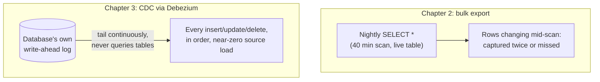

At the same time, Kestrel needs somewhere for this continuous stream to land that can absorb bursts and let producers and consumers move at different speeds — this is where **Kafka** (built at LinkedIn) enters: a durable, replayable log that CDC connectors and app/mobile event SDKs both write into. This single move fixes both Chapter 2 problems at once: near-zero extra load on production (tailing a log instead of scanning tables), and near-real-time freshness (events flow continuously instead of once a night). Kestrel's fraud-detection feature can now see a suspicious transaction within seconds of it happening, not the next night.

**New problem, immediately visible:** Kestrel still needs the *old* nightly batch pipeline too — for the monthly cohort report, for full historical recomputation when a bug is found, for anything that genuinely wants "recompute all of history correctly," which a continuous stream isn't naturally built for. So now there are **two** pipelines: the new streaming path (fast, approximate-ish, for fraud/live use cases) and the old batch path (slow, but the one everyone still trusts for "the real numbers"). And nobody has decided yet how those two paths are supposed to agree with each other.

**How I'd say this in an interview:** "CDC tailing the write-ahead log is strictly better than a bulk `SELECT *` for two separate reasons — it adds almost no load to the source, and it's continuous instead of scheduled. That's what unlocks a genuine streaming path. But the moment you have both a streaming path and a batch path doing similar work, you've created a new problem: which one is the source of truth, and what happens when they disagree?"

---

## Chapter 4 — Two chefs, two recipes, two different answers

Three months after standing up the streaming fraud path, someone actually checks whether the two pipelines agree. The live streaming dashboard says **1,140 fraud alerts today**. The next morning's batch recompute, run over the same day's raw Kafka/CDC data, says **1,158** — an 18-event gap `[illustrative]`. Nobody planned this discrepancy; it happened because the streaming job (written in one framework, one team, one set of dedup rules) and the batch job (written earlier, by a different team, with slightly different join logic) quietly drifted apart over months of separate bug fixes. Two codebases implementing "count fraud events" will diverge — it's not a matter of if, only when and by how much.

This architecture — a batch layer for full, correct-but-slow recomputation, plus a separate speed layer for fast-but-approximate live views, merged at serving time — has a name: the **Lambda architecture**, coined by Nathan Marz (also Storm's creator). It's a legitimate, real, widely-used pattern. But Kestrel didn't choose it on purpose; it just accumulated it, one pipeline at a time, and is now paying its real cost: two codebases to write, test, and keep in sync, forever.

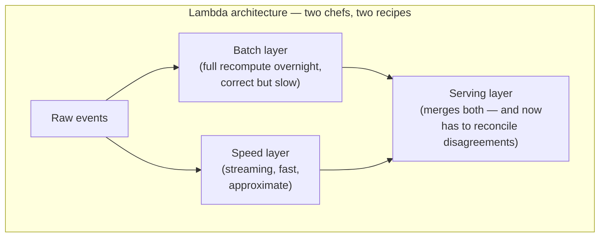

The obvious question: *do we really need two separate codebases, or can one pipeline do both jobs?* Kafka's log is **replayable** — you can rewind it and reprocess from any earlier point, not just consume it once and move on. If the streaming job itself can be re-run from the beginning whenever a bug fix needs to reprocess history, there's no separate need for a whole second batch codebase just to get "the correct version." This simplification has a name too: **Kappa architecture**, proposed by Jay Kreps (Kafka's co-creator) explicitly as Lambda's simplification.

**The fix Kestrel actually adopts:** one streaming pipeline (Flink) as the single source of truth. When a bug is found, instead of trusting a separate batch layer to quietly "correct" it, Kestrel replays the Kafka log from an earlier offset through the *same* corrected streaming code. One recipe, one chef — if it needs redoing, they just rewind the tape and cook it again with the fixed recipe.

**How I'd say this in an interview:** "I'd default to Kappa for this kind of platform — one streaming codebase, with Kafka's replayability standing in for what a separate batch layer used to provide. I'd only reach for genuine Lambda if a business requirement truly needs an independently-verified batch recompute — financial reconciliation is the classic example — because otherwise you're paying to maintain the same logic twice, and it *will* drift."

---

## Chapter 5 — Raw ore, refined metal, finished jewelry

With one streaming pipeline now as the source of truth, a new organizational problem shows up fast: analysts start querying the raw, event-level Kafka-fed table directly, because it's the only table that exists. One dashboard does a live join and aggregation over **900 million** raw clickstream rows every time someone refreshes it — the query takes **47 seconds** `[illustrative]`, and three different teams have each written their own slightly-different version of "how do we dedupe this raw feed," none of which agree with each other.

The obvious question: *should every consumer really have to re-derive "clean, deduplicated, joined data" for themselves, every single time?* No — that logic should live in exactly one place, run once, and be reused by everyone downstream.

**The fix:** split storage into three deliberate stages, each a different trade-off between trust and speed — this is the **medallion architecture** (the name Databricks uses; the same three-stage idea also goes by raw/refined/curated elsewhere).

**The analogy:** raw ore, refined metal, finished jewelry. Ore (bronze) is the ground truth of what was dug up — messy, heavy, unrefined, but nothing is thrown away. Refined metal (silver) has had the impurities removed and been shaped into a consistent, usable form — still fairly plain, but trustworthy and joinable. Finished jewelry (gold) is what actually gets sold — polished, assembled, ready for a customer (or in this case, a dashboard) to consume directly, with all the expensive shaping work already done upstream.

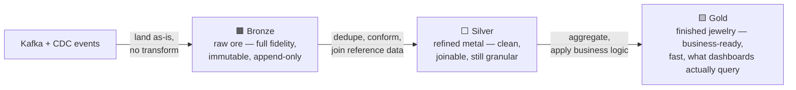

Once the aggregation work moves into gold, the same 900-million-row dashboard query becomes a lookup against a table pre-aggregated down to a few thousand daily rows — the refresh drops from 47 seconds to about **1.2 seconds** `[illustrative]`. Every analyst now queries gold, never bronze, and the "how do we dedupe this" logic exists exactly once, in the silver-conformance job.

**New problem:** bronze and silver are currently just plain files sitting in cheap storage — Parquet-or-not, JSON-or-not, nobody's decided yet, and multiple jobs write to the same directories at the same time. That's about to bite.

**How I'd say this in an interview:** "Bronze, silver, gold isn't decoration — it's separating three different jobs that shouldn't be mixed: bronze is the permanent, replayable truth; silver is the one place cleaning and joining logic lives instead of being reinvented by every consumer; gold is cheap and fast because the expensive work already happened upstream. Skipping straight to 'one clean table' is exactly what caused three teams to write three different, disagreeing versions of the same dedup logic."

---

## Chapter 6 — The spice rack versus the filing cabinet

As bronze and silver grow, Kestrel notices something odd: a query that only needs to sum one column — `amount_cents` — out of a 40-column clickstream table is taking almost as long as a query that reads every column. The events are stored as raw JSON, one full record per row. To compute a sum over even a single field, the engine has to read and parse the *entire* record — all 40 fields — for every one of 900 million rows, just to throw away 38 of them. Concretely: scanning that JSON table to sum one column reads roughly **1.1 TB** of bytes off disk `[illustrative]`, when the actual data needed for the query is a small fraction of that.

The obvious question: *why does the engine have to read data it's about to throw away?* Because JSON (and CSV, and Avro) stores data **row by row** — every field of one record sits physically next to every other field of that same record. To get one column, you have to walk past all the others.

**The analogy:** a row-oriented file is a filing cabinet where each drawer holds one customer's *entire* folder — name, address, every order, every field, all stapled together. To add up everyone's total spend, you have to open every single drawer and dig through every staple. A **columnar** format is a spice rack organized by ingredient instead — every customer's "amount spent" value sits in one jar, right next to every other customer's "amount spent" value. To sum that one thing, you grab one jar, and never open the other drawers at all.

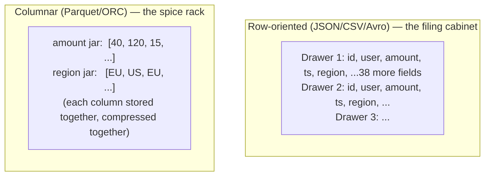

**The fix:** convert everything landing in bronze and silver into **Parquet** (the de facto standard, originating at Twitter/Cloudera) with a compression codec like ZSTD. Column pruning means a query touching 2 of 40 columns only reads those 2 columns' bytes; per-column min/max statistics let the engine skip whole chunks of data that can't possibly match a filter, without even decompressing them; and similar values sitting next to each other compress far better than a shuffled row ever could. Kestrel's real numbers: that same "sum one column" scan drops from **1.1 TB read to roughly 90 GB** `[illustrative]` — about 12x less I/O — and the query finishes in about 5 seconds instead of a minute.

**New problem:** Parquet files are great to *read*, but they're immutable once written — you can't edit a row inside one. Multiple jobs (a streaming sink, a nightly compaction job, an ad-hoc backfill) are now all writing new Parquet files into the same bronze/silver directories, concurrently, with nothing coordinating who's allowed to change what, or in what order a reader should see them.

**How I'd say this in an interview:** "Columnar storage wins on analytical scans for exactly one reason: you only pay for the columns and row-groups the query actually touches, instead of every field of every record. Kafka messages travel as row-oriented Avro or JSON because that matches how one event is produced and consumed — but the moment it lands at rest in the lake, converting to Parquet is the single highest-leverage move for query cost and speed."

---

## Chapter 7 — Adopting the shipping-container standard

With everyone now writing Parquet files into the same bronze/silver directories, a genuinely scary bug appears. A nightly compaction job (merging small files together, more on why in Chapter 14) and a Flink sink job both write to `silver/orders_conformed/` at overlapping moments. An analyst's dashboard query, mid-refresh, reads the directory listing *between* the old files being deleted and the new merged file finishing its write — for about six minutes, the revenue number the dashboard shows is roughly **doubled**, because it's counting both the old and new files for the same rows `[illustrative]`. Plain files on plain object storage have no concept of a transaction — there's no such thing as "see either the old version or the new version, atomically, never a mix."

The obvious question: *can we get database-style guarantees — one consistent view, atomic commits — without giving up cheap object storage or locking data into one vendor's engine?* Yes — this is exactly what an **open table format** exists to solve: Apache Iceberg (created at Netflix), Delta Lake (Databricks), and Apache Hudi (created at Uber) all add a thin metadata/commit-log layer on top of plain Parquet files, giving ACID transactions, schema evolution, and time-travel, while the underlying files stay ordinary Parquet that any engine can still read directly.

**The analogy:** before international shipping containers became standardized, every port needed different cranes and different-shaped ships for different cargo, and loading was chaotic and error-prone. Standardizing the container size didn't change what was *inside* the boxes — it just meant any crane, any ship, any port could handle the exact same box, and the port's own logbook always recorded, unambiguously, which containers were currently on which ship — no two cranes could ever load conflicting cargo into the same slot at once. An open table format is that standard: Spark, Flink, and Trino all read and write the *same* physical Parquet files, coordinated through one shared, atomic commit log.

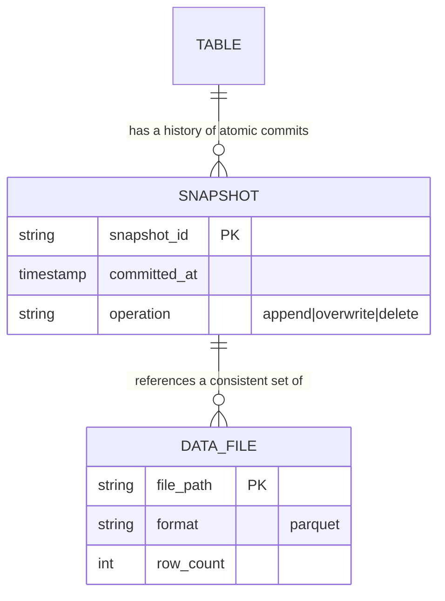

Kestrel adopts this as a **lakehouse**: cheap object storage underneath, Iceberg's metadata layer on top, giving every reader — Spark, Flink, or the new interactive Trino/Presto engine analysts use for ad-hoc SQL — a consistent, snapshot-isolated view. A reader always sees the last *fully committed* snapshot, never a half-written mix of old and new files, and it becomes possible to time-travel to yesterday's snapshot to answer "what did this table look like before the bad deploy."

**New problem:** ACID commits fix "don't show a half-written table." They say nothing about what happens when the *streaming job itself* crashes mid-computation, halfway through building today's aggregation — does it lose track of what it already processed, or does it double-process the same events on restart?

**How I'd say this in an interview:** "A lakehouse is lake storage plus an open table format — Iceberg, Delta, or Hudi — giving you ACID commits, schema evolution, and time travel on top of plain Parquet files, without locking you into one vendor's proprietary engine. Iceberg leans engine-neutral, Delta leans deepest into the Spark ecosystem, Hudi is strongest at high-frequency CDC-style upserts — which is exactly why Uber built it."

---

## Chapter 8 — The save point that survives a crash

Kestrel's Flink streaming job — the single Kappa-style source of truth from Chapter 4 — runs 24/7, continuously folding events into an in-progress aggregation (this hour's fraud-alert count, this hour's cart-funnel numbers). One afternoon, a traffic spike causes the Flink task manager to run out of memory and crash. It restarts automatically — but with no memory of exactly which events it had already folded into that hour's count before dying. On restart, it re-reads the last several minutes of Kafka data from an arbitrary offset and **double-counts roughly 38,000 add-to-cart events** into that hour's gold funnel metric `[illustrative]`.

The obvious question: *how does a restarted job know exactly where it left off, without either replaying events it already counted or skipping events it never got to?* It needs a save point — a durable, periodic snapshot of exactly what state it was in and exactly which offset it had consumed up to, taken *while it keeps running*, not just at shutdown.

**The fix:** **checkpointing**, based on the real 1985 Chandy-Lamport distributed snapshot algorithm, which is exactly what Flink implements. Every 30 seconds (a real, tunable interval), Flink's JobManager injects a checkpoint "barrier" that flows through the pipeline in-line with the actual records — never overtaking them. Each operator waits for the barrier to arrive on every input, snapshots its own state at that exact instant, and acknowledges. Once every operator has acknowledged, the sink (writing to Kafka or the lakehouse) is told to actually commit that batch of writes — using a two-phase commit, so writes sit in a pending, invisible transaction until the *whole* checkpoint is confirmed durable.

**The analogy:** a video game save point. When you die, the game doesn't make you replay from the very beginning, and it doesn't let you keep the coin you picked up *after* your last save if that part of the level gets replayed — it restores you to exactly the state at the last save, and anything after that point simply happens again, cleanly, with no double-counted coins.

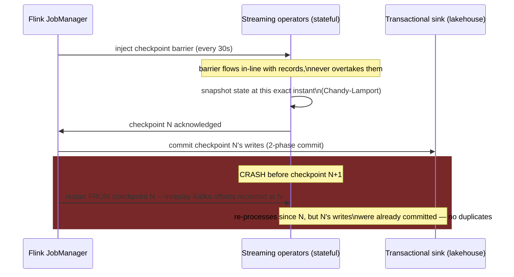

This is what "exactly-once processing" actually means in practice: not that nothing is ever reprocessed, but that the reprocessing never produces a *different final result* — the last confirmed checkpoint is always the true starting line, and anything after it happens exactly once from the outside observer's point of view.

**New problem:** checkpointing protects against a *crash*. It does nothing for a completely different kind of trouble — a customer's phone goes offline for two minutes and its buffered events arrive *late*, well after the 5-minute window they belong to has already closed and reported a number.

**How I'd say this in an interview:** "Checkpointing answers one specific question: how do you survive a crash without losing track of what you already processed or double-processing what you already committed. It's a save-point mechanism — Chandy-Lamport snapshots plus a two-phase-commit sink. It has nothing to do with events arriving out of order, which is a completely separate problem."

---

## Chapter 9 — The lifeguard's whistle and the stragglers after it blows

Kestrel's cart-funnel metric uses 5-minute tumbling windows: every event with a timestamp between `10:00:00` and `10:05:00` gets counted together, and the window "closes" and reports its total once the system is confident no more events for that window are coming. But mobile clients buffer events offline and send them late — sometimes by seconds, sometimes by minutes. If the window just closes the instant the clock hits `10:05:00`, every late event is either wrongly excluded or the window can never close at all, waiting forever for a straggler that might never come.

Kestrel sets the bounded out-of-orderness to **10 seconds** and allowed lateness to **60 seconds** past the window's end. On a normal day, the on-time total for one window is **48,213 events**. Here's exactly what happens to three events that land only seconds apart in arrival time, but on different sides of two deadlines:

```text
Event A — event-time 10:04:50, arrives normally at 10:04:52
  -> well before the window closes -> counted in the 48,213 on-time total

Event C — event-time 10:04:58, arrives LATE at 10:05:40 (42s network delay)
  -> the window already closed and reported 48,213 by the time C shows up
  -> allowed-lateness deadline = window-end (10:05:00) + 60s = 10:06:00
  -> 10:05:40 is BEFORE 10:06:00 -> within the grace period
  -> triggers a corrected re-emission: 48,213 becomes 48,214

Event B — event-time 10:04:55, phone was offline, arrives at 10:07:30 (2m35s delay)
  -> arrives AFTER the 10:06:00 deadline -> too late
  -> dropped from the automatic window result (stays at 48,214, never 48,215)
  -> routed instead to a side-output "late-data" stream for separate reconciliation
```

Across a full day, roughly **1,200 events** land in that too-late bucket — about 2.4% of a day's volume `[illustrative]` — meaning the live streaming number silently undercounts by that much until a nightly reconciliation job re-reads bronze and recomputes the true total. This is exactly the Lambda-style "speed layer is approximate, something corrects it later" idea from Chapter 4 — except now it's deployed narrowly, just for the tail of stragglers, instead of duplicating the whole pipeline.

**The fix, and its analogy:** a **watermark** — a moving timestamp that declares "no event earlier than this is expected anymore" — is the lifeguard's whistle at a pool: it doesn't mean everyone is instantly out of the water, it means the deadline has been announced. Anyone who gets out within the grace period after the whistle still gets counted as "on time, corrected." Anyone who wanders in long after that gets logged separately and dealt with another way — but the pool still closes.

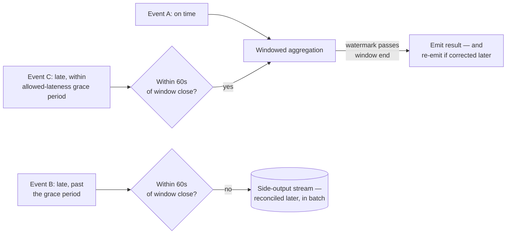

**How I'd say this in an interview:** "A late event's outcome depends entirely on which side of the allowed-lateness deadline it lands on — on time gets counted normally, late-but-within-grace triggers a corrected re-emission, and too-late gets dropped from the stream and reconciled separately in batch. Checkpointing and watermarks solve two genuinely different problems — one survives a crash, the other decides when a time window is safe to close — and a correct streaming pipeline needs both."

---

## Chapter 10 — Rewriting one page, not tearing out the book

Two months later, a finance engineer finds a real bug: the revenue rollup job was mis-handling refunds issued in a different currency than the original order, for six months running. The fix is a one-line code change. But now Kestrel has to recompute six months of gold-layer revenue with the corrected logic — a **backfill**.

The engineer runs the fixed job over January through June, but by habit writes results with a plain `INSERT` instead of a full partition replace. Because the old (buggy) rows are never removed, January's gold table now shows **$4.2M** in revenue — double the actual **$2.1M** — until someone notices the number looks implausibly high `[illustrative]`.

The obvious question: *how do you correct history without either losing it or duplicating it?* Bronze can't be touched — it's the permanent, immutable record from Chapter 2, and it's also the *only* thing that makes recomputing six months of history possible at all, since it still holds the original raw events untouched by the bug. The fix has to happen in how silver and gold get rewritten, not in bronze.

**The fix, and its analogy:** correcting a bound ledger means replacing one entire page with a corrected version — never gluing a correction slip on top of the old page, which leaves both readable and ambiguous. Concretely: every backfill write uses `INSERT OVERWRITE PARTITION` (or, in an Iceberg/Delta/Hudi lakehouse, an atomic snapshot-swap commit) — the entire partition for a given day is atomically replaced in one commit, so a reader either sees the old page or the new page, in full, never a mix of both.

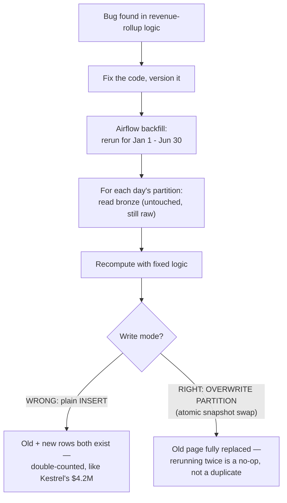

Kestrel's orchestrator for all of this is **Airflow** (built at Airbnb) — its `catchup=True` setting is what makes triggering a historical backfill straightforward in the first place, running the same DAG logic once per missed day in the requested range, each one an atomic, idempotent partition overwrite.

**How I'd say this in an interview:** "Backfills only work safely because two things hold at once: bronze is immutable, so there's always an untouched source to recompute from, and every silver/gold correction is an atomic partition overwrite, never an append. That's what makes 're-run it, even twice by accident' a genuinely safe sentence instead of a data-corruption risk."

---

## Chapter 11 — The customs inspector who only checks the paperwork

A different kind of break: the checkout-service team deploys a change that renames a field in the events they publish, `order_id` becomes `orderId`, with no warning to the data team. Every downstream deserializer expecting the old field name throws an exception. The Flink job crashes and stays down; **45 minutes** of clickstream backs up in Kafka before anyone on-call notices `[illustrative]`.

The obvious question: *how do we stop an upstream team's Tuesday deploy from silently breaking a downstream job on Wednesday?* Reject the incompatible change *before* it ever reaches Kafka, not after it's already broken something.

**The fix, and its analogy:** a **schema registry** (Confluent's is the real, documented standard) — every producer registers its schema before writing, and every write gets checked against a compatibility rule (the default, and most common, is **BACKWARD**: new schema versions must still be readable by whoever's reading the previous version). This is a customs inspector checking a shipping container's manifest before it's allowed to leave port: if the manifest doesn't match the agreed shape — wrong number of fields, a field renamed without warning — the container is turned back at the dock, before it can cause chaos downstream.

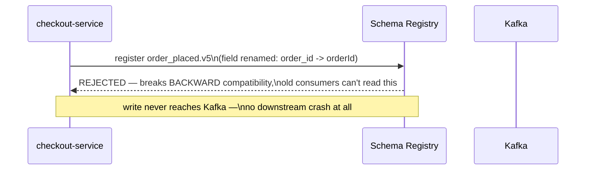

This closes the "structural break" problem. But four months later, a subtler bug slips straight past this exact same registry. The checkout team ships a new schema version that keeps the field name `amount_cents` and keeps its type as an integer — structurally, nothing changed, so the registry happily accepts it. What actually changed is the *meaning*: the field now holds whole dollars, not cents. A $45.99 order now reports `amount: 46` instead of `amount_cents: 4599`. The registry has no way to know that, because it only checks shape, never meaning — the manifest says "42 boxes of apples," and structurally that's a perfectly valid manifest, even though what's actually inside the container is lemons.

Overnight, Kestrel's reported gold-layer revenue drops by roughly **99%**. Nobody's automated check catches it — 46 is a perfectly plausible number sitting well within any static range check — until a human analyst notices the dashboard looks implausibly wrong the next morning.

**The fix for this new layer of the same problem:** add **business-metric anomaly detection** on top of structural schema enforcement — a day-over-day delta check on key aggregates (e.g. "alert if total revenue swings more than 20% versus yesterday") catches semantic drift that no schema check ever could, because it's watching the *number*, not the *shape*.

**How I'd say this in an interview:** "A schema registry only proves structural compatibility — same field names, same types — it says nothing about whether the meaning changed. The fix for semantic drift isn't a smarter schema check, it's a second, independent layer: comparing today's key business metrics against yesterday's, because that's the only place a cents-to-dollars bug actually becomes visible."

---

## Chapter 12 — The quality inspector at the end of the line

Separately, a bug in the mobile SDK ships a broken version that sends `amount_cents: -999999` for about **12,000 events** in one afternoon `[illustrative]`. Nothing about this violates the schema — the field is still the right name and the right type, just an absurd value. It flows straight from bronze through silver into gold, and for about an hour, Kestrel's live finance dashboard shows **negative revenue** before someone flags it as obviously wrong.

The obvious question: *the schema registry checked shape, and it passed — so what's actually missing?* A check on the *values themselves* — is this number plausible, is this field ever null when it shouldn't be, did the row count for today suddenly crater or explode compared to normal.

**The fix, and its analogy:** a **data quality gate** — Great Expectations, a real open-source tool, is the standard here — sitting between silver and gold, running a suite of expectations before anything is promoted: no nulls where nulls shouldn't exist, values inside a sane range, row counts within a normal band of the 7-day rolling average. This is quality control at the end of an assembly line, catching a defective unit *before* it ships, rather than trusting an inspection of the box after a customer's already unwrapped it.

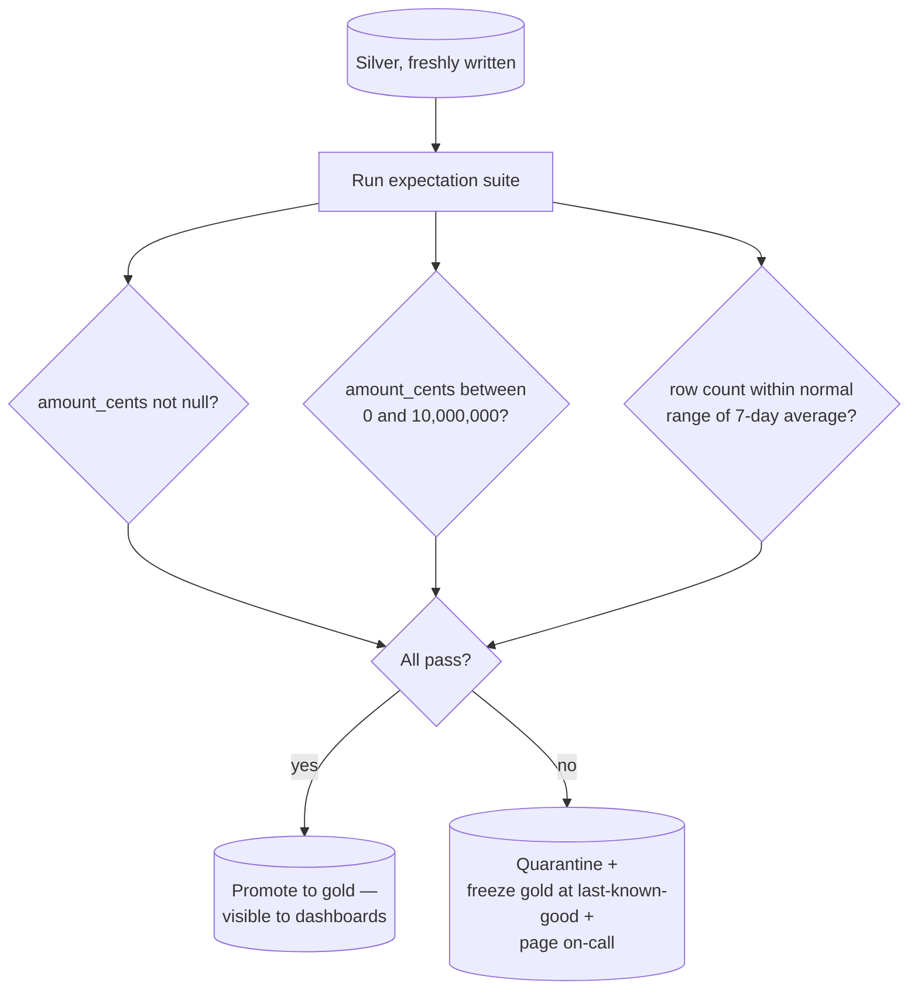

The part that matters most isn't the checks themselves, it's what happens on failure: gold freezes at its last-known-good state instead of serving broken numbers, and the on-call gets paged with exactly which expectation failed, on which partition. A dashboard quietly showing yesterday's numbers for an extra hour is a minor inconvenience; a dashboard confidently showing today's *corrupted* numbers is the kind of thing that destroys trust in the whole platform.

**How I'd say this in an interview:** "The schema registry catches shape violations, and the anomaly check from the last chapter catches metric-level drift — this data quality gate catches value-level garbage, like negative amounts or unexpected nulls, that both of those miss. The single most important design detail is the failure behavior: quarantine and freeze at last-known-good, never let a failed check quietly pass through to gold."

---

## Chapter 13 — The library card catalog, and the book recalled from every branch

By now Kestrel has hundreds of bronze/silver/gold tables across a dozen teams. Two problems surface in the same month. First: a new analyst spends **three days** just trying to figure out which of 40 similarly-named `orders_*` tables is the real, current one, who owns it, and whether it's safe to query `[illustrative]`. Second, and much more serious: a customer files a GDPR erasure request, and engineering realizes nobody actually knows every place that customer's data landed — bronze tables, silver tables, gold aggregates, a few ad-hoc exports to a partner's warehouse. Manually grepping through it all is estimated to take **three weeks** `[illustrative]` — well past GDPR's 30-day statutory deadline.

The obvious question: *how do you find and trust a dataset without asking a human, and how do you delete something everywhere without hoping someone remembers every copy?* You need a map of the whole system — not just what exists, but which job produced it and what reads from it downstream.

**The fix, and its analogy:** a **data catalog with a lineage graph** (LinkedIn's DataHub and Lyft's Amundsen are real, documented examples of exactly this). Think of a library's card catalog: every book has a card recording its title, its shelf location, and its owner — but a *good* catalog also records who checked it out and passed it along, so a recall notice for one specific book can be traced to every branch that ever received a copy, not just the original shelf.

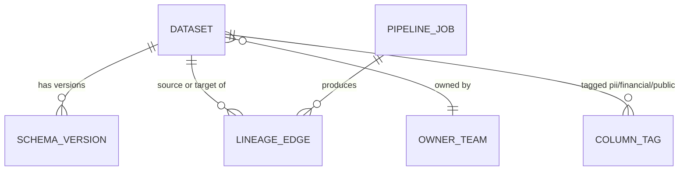

Every dataset gets an owner, a schema, and column-level tags — PII columns are tagged and masked automatically at query time by a policy engine, so an analyst without clearance sees `***MASKED***` instead of a raw email address, without needing a different table. And the lineage graph is what makes the GDPR request tractable at all: walk the graph forward from "everything containing this user's ID," find every bronze/silver/gold table and every downstream export, rewrite the affected partitions (an atomic overwrite, the one sanctioned, audited exception to "bronze never changes"), and log the erasure itself — without logging the deleted PII inside that log.

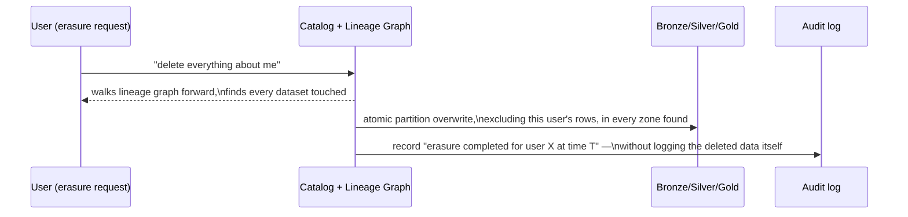

**How I'd say this in an interview:** "The catalog answers 'what exists and who owns it' — that's what turns three days of guessing into a search bar. The lineage graph inside it is what actually makes GDPR deletion possible at all — without a map of every downstream copy, 'delete everywhere' degenerates into hoping somebody remembers."

---

## Chapter 14 — Combining small boxes onto one pallet, and moving the archive across town

Two cost problems surface at once, both self-inflicted by earlier fixes. First: the streaming Flink sink has 200 parallel tasks, each committing its own small file to silver every 30-second checkpoint. That's 200 new tiny files every 30 seconds, all day — after a month, one silver table has accumulated **8.6 million small files** `[illustrative]`, and a query that used to take 5 seconds now takes **6 minutes**, because the engine spends almost all its time opening and reading metadata for millions of tiny files instead of actually scanning data.

Second: finance flags the AWS bill. Kestrel keeps 7 years of compliance-mandated raw data, all sitting on standard hot storage, all the time — even data nobody has queried in 4 years. At Kestrel's real-world-comparable scale `[illustrative — Kestrel is a smaller company than the reference guide's ~52 PB worked example, but the same shape of problem applies]`, keeping everything on hot storage costs meaningfully more per month than the business can justify for data that's essentially never read.

**The fix for the first problem, and its analogy:** compaction. Shipping a thousand tiny half-empty boxes wastes a truck's capacity on air and cardboard; combining them onto one full pallet before the truck leaves is strictly better for everyone downstream. A scheduled (nightly, or table-format-native) compaction job merges those millions of small files into properly-sized ones — roughly 128MB to 1GB each — and file count drops by 100-1000x, restoring query performance.

**The fix for the second problem, and its analogy:** storage tiering. Nobody keeps last decade's tax receipts in their office desk drawer — they go to a storage unit across town: cheaper, slower to access, but that's fine because you almost never need them. Kestrel moves aging data through tiers — hot storage for anything actively queried, a cheaper "infrequent access" tier for aging-but-occasionally-needed data, and deep cold archive for multi-year compliance data nobody reads except during an audit. Moving the coldest tier from standard hot storage to a deep-archive tier is roughly a **20x cost reduction** on that tier alone — a real, well-documented AWS pricing gap between S3 Standard and Glacier Deep Archive.

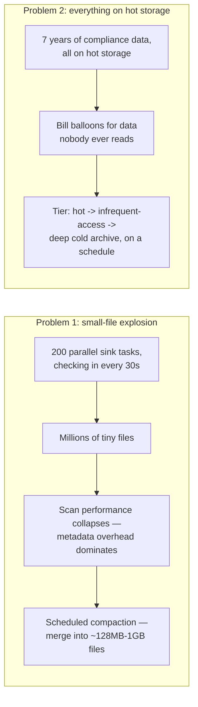

One more cost lever, layered on top: batch compute (Spark jobs) doesn't need to sit provisioned for peak load 24/7 — it can autoscale up for a scheduled window and scale to zero afterward, and can safely run on cheap spot/preemptible instances, *because* every batch job is already idempotent (Chapter 10's atomic partition overwrite) — a killed spot instance just means a retried task, not a correctness incident.

**How I'd say this in an interview:** "Both of these cost problems are side effects of earlier, correct decisions — streaming sinks naturally produce lots of small files, and compliance requirements naturally pile up years of rarely-read data. Neither is a design mistake to avoid; they're operational taxes to manage: scheduled compaction for the first, tiered storage for the second, and idempotent jobs are exactly what makes cheap spot compute safe on top of all of it."

---

## Where the story actually lands

```mermaid
flowchart LR
    A["Ch1: analyst query\nslows down checkout"] -->|"fixes: separate warehouse\nbreaks: no raw copy to recover from"| B["Ch2: land raw first (bronze)"]
    B -->|"fixes: recoverable\nbreaks: nightly-only, inconsistent bulk export"| C["Ch3: CDC + Kafka streaming"]
    C -->|"fixes: fresh + low-load\nbreaks: batch and stream disagree"| D["Ch4: Lambda -> Kappa"]
    D -->|"fixes: one source of truth\nbreaks: raw table can't serve fast queries"| E["Ch5: medallion zones"]
    E -->|"fixes: cheap fast gold\nbreaks: row-oriented scans are wasteful"| F["Ch6: columnar Parquet"]
    F -->|"fixes: cheap scans\nbreaks: concurrent writers corrupt reads"| G["Ch7: open table format (lakehouse)"]
    G -->|"fixes: ACID commits\nbreaks: crash loses/duplicates stream state"| H["Ch8: checkpointing"]
    H -->|"fixes: crash-safe\nbreaks: late events break windows"| I["Ch9: watermarks + allowed lateness"]
    I -->|"fixes: correct windows\nbreaks: a fixed bug needs history redone"| J["Ch10: idempotent backfill"]
    J -->|"fixes: safe reprocessing\nbreaks: upstream schema/semantic drift"| K["Ch11: schema registry + anomaly checks"]
    K -->|"fixes: catches drift\nbreaks: garbage values still slip through"| L["Ch12: data quality gate"]
    L -->|"fixes: trustworthy gold\nbreaks: nobody can find/govern/delete data"| M["Ch13: catalog + lineage + GDPR"]
    M -->|"fixes: governed\nbreaks: small files + hot-storage costs balloon"| N["Ch14: compaction + tiering"]
```

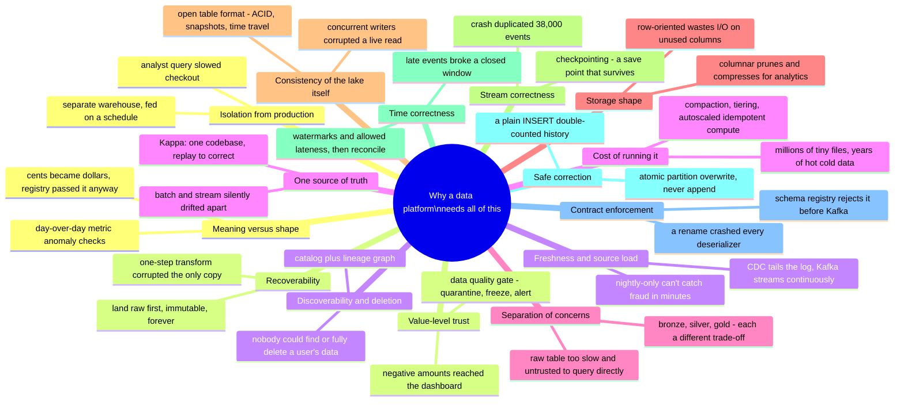

The skill isn't reciting all fourteen chapters cold — it's knowing where the stated requirements say to stop. A small internal reporting tool might reasonably stop around Chapter 5 (a warehouse plus medallion zones). A platform feeding fraud detection and financial reporting has to reach Chapter 9, 11, and 13. If nobody's mentioned compliance or GDPR, walking all the way to Chapter 13 unprompted reads as padding, not depth — read the requirements, then walk exactly as far as they point.

---

## Grill me — adversarial follow-ups

**Q1: "Why not just give analysts a read replica of the production database instead of building an entire separate pipeline?"**
A read replica helps with the load problem, a little, but it doesn't fix the deeper issues: replication lag means analysts see slightly-stale data anyway, the schema is still shaped for transactions rather than analytics (no columnar layout, no pre-aggregation), and a heavy analytical query can still saturate a replica's own resources and lag it further behind. A separate pipeline also gives you governance, retention, and a place to build gold-layer aggregates — a replica is a partial patch, not the actual fix.

**Q2: "You said Kappa is the default — when would you actually pick Lambda on purpose?"**
When a business requirement genuinely needs an independently-verified batch recompute that can't just be "replay the same streaming code" — financial reconciliation is the standard example, where regulators or auditors want a completely separate code path computing the same numbers as a cross-check. Outside of that kind of explicit requirement, maintaining two codebases for the same logic is a cost you're choosing to pay for no real benefit.

**Q3: "If bronze is supposed to be immutable, how does GDPR deletion ever actually work?"**
It's a narrow, sanctioned, and fully audited exception — not a violation of the rule. A deletion request rewrites the specific bronze partitions containing that user's data via the same atomic partition-overwrite mechanism used for backfills, and the fact that it happened gets logged in a separate audit trail, without ever logging the deleted PII itself.

**Q4: "Doesn't the schema registry basically solve data quality for you?"**
No — and this is the trap. The registry only checks structure: field names, types, required-vs-optional. It has zero visibility into meaning, which is exactly how "cents silently became dollars" sailed through untouched. You need at least two more layers: static value checks (a data quality gate) for garbage like negative amounts, and business-metric anomaly detection for semantic drift that looks perfectly plausible in isolation.

**Q5: "Why do you need watermarks at all — can't you just wait longer before closing a window?"**
You could wait longer, but there's no value of "long enough" that's actually safe — some straggler could always theoretically arrive later, and waiting forever means the window never closes at all. A watermark with an explicit allowed-lateness deadline is an honest trade-off: it draws a firm line, corrects results for events that squeak in just after, and explicitly routes anything later than that to a separate reconciliation path instead of pretending the problem doesn't exist.

**Q6: "Checkpointing already gives you exactly-once — so why do you still need idempotent writes for backfills?"**
Checkpointing gives you exactly-once for the streaming job surviving its own crash. A backfill is a completely different operation — a human deliberately re-running a corrected job over historical data, potentially more than once by accident. Idempotent writes (atomic partition overwrite) protect against *that* kind of intentional-but-error-prone re-run, which checkpointing was never designed to cover.

**Q7: "Isn't converting everything to Parquet just adding an extra processing step for no reason if the data's already landing fine as JSON?"**
It's an extra step, but a cheap one relative to what it buys — the reference numbers in this story showed roughly a 12x reduction in bytes scanned for a simple aggregate query. At real analytical scale, that's the difference between a 5-second dashboard refresh and a full minute, repeated by every analyst, every day, forever. The conversion cost is paid once at ingestion; the query savings compound every single time anyone reads the data afterward.

**Q8: "Your lineage graph is now a critical dependency for both impact analysis and legal compliance — what happens if it's wrong or out of date?"**
That's a real risk, which is why the catalog has to be populated automatically from the orchestrator and the pipeline jobs themselves — every DAG run recording what it read and wrote — rather than relying on humans to manually document lineage after the fact. A catalog that depends on manual upkeep will silently drift out of date exactly when you need it most, during an incident or a legal deadline.

**Q9: "Given this whole story, if someone just says 'design a data platform' cold, where do you actually start?"**
Ask who's consuming it and what freshness they actually need — BI analysts running SQL, or an ML model needing minutes-fresh features, or both — because that answer decides your batch-versus-streaming split before you draw a single box. Then state your four sub-problems out loud — ingestion, storage, processing, governance — and walk forward only as deep as the stated requirements demand; medallion zones and a lakehouse table format are close to a given at any real scale, but watermarks, schema registries, and GDPR-aware lineage are things you earn by naming a specific requirement, not defaults you bolt on for their own sake.

---

## Pacing note

**If this is 60 seconds inside a bigger question:** say the shop-floor/back-office line — analytics never touches production directly — then say "ingestion via CDC and Kafka, an immutable bronze zone, medallion zones on an open table format, exactly-once streaming with checkpointing and watermarks, and governance via a schema registry, a data-quality gate, and a lineage-aware catalog." That's the whole shape in one breath.

**If this is the whole 15-20 minute focus:** walk the chapters roughly in order — why analytics needs its own path, why raw data must be kept immutable, why CDC and streaming beat nightly bulk pulls, Lambda versus Kappa, medallion zones, columnar storage, the lakehouse table format, checkpointing versus watermarks, idempotent backfills, schema evolution versus semantic drift, the data quality gate, then governance and cost if there's time. Follow wherever the interviewer's questions actually point, and use the skipped chapters as your "if we had more time" closer.

---

## Active recall — no answers, test yourself cold

1. What's the one-sentence reason analytics needs a separate path from production traffic?
2. Why did Kestrel's very first nightly-ETL fix still lose data when a transform bug hit?
3. Name the two separate problems a nightly bulk `SELECT *` export has, that CDC fixes at the same time.
4. What's the actual difference between what Lambda architecture is, and what Kappa architecture simplifies it into?
5. Why does bronze/silver/gold exist as three zones instead of one "clean" table?
6. Why does a columnar format like Parquet beat a row-oriented format like JSON for analytical queries — name both mechanisms, not just "it's faster"?
7. What specific problem does an open table format (Iceberg/Delta/Hudi) solve that plain Parquet files on plain object storage can't?
8. What's the difference between what checkpointing fixes and what watermarks fix?
9. Walk through why a plain `INSERT` during a backfill causes double-counting, and what the actual fix is.
10. Why did a cents-to-dollars schema change pass the schema registry, and what catches it instead?
11. What's the difference between what a schema registry catches, what a data-quality gate catches, and what a business-metric anomaly check catches?
12. Why is a lineage graph specifically necessary for GDPR deletion, not just nice to have?

*Spaced repetition: test this list today, again in 2-3 days, again in a week.*

---

## Cheat sheet — one line per stop on the story

- **Separate analytics from production**: never let a BI query or a bulk export compete with live transactional traffic for the same disk, CPU, or locks — that's the entire reason this platform exists.
- **Land raw before transforming (bronze)**: a one-step transform-and-load has no fallback if the transform is buggy — keep the untouched raw copy forever, edit nothing in place.
- **CDC over bulk pull**: tailing a database's write-ahead log (Debezium) adds near-zero load and captures every change continuously — a scheduled `SELECT *` is slow, inconsistent on a live table, and never faster than its schedule.
- **Lambda vs. Kappa**: two codebases (batch + speed layers) that will drift apart, versus one streaming codebase that replays its own log to self-correct — default to Kappa, justify Lambda only for an explicit independent-recompute requirement.
- **Medallion zones (bronze/silver/gold)**: raw ore, refined metal, finished jewelry — each a different trade-off between trust and query speed; BI and ML should only ever read gold.
- **Columnar storage (Parquet/ORC)**: column pruning + per-column statistics + better compression beat row-oriented formats for analytical scans by an order of magnitude — convert at rest, keep the in-flight format (Avro/JSON) for Kafka.
- **Lakehouse (open table format)**: Iceberg/Delta/Hudi add ACID commits, schema evolution, and time travel on top of plain Parquet files, so concurrent writers can't corrupt a live read — pick based on engine-neutrality, Spark-depth, or upsert-heavy CDC workloads.
- **Checkpointing**: a periodic, crash-safe save point (Chandy-Lamport snapshots + two-phase-commit sink) — survives a crash without losing or duplicating processed records.
- **Watermarks + allowed lateness**: a moving deadline that decides when a time window is safe to close — on-time events count normally, late-but-within-grace events trigger a correction, too-late events get dropped and reconciled separately.
- **Idempotent backfills**: atomic partition overwrite (never a plain append) is what makes "just re-run it, even by accident" a safe sentence instead of a double-counting risk.
- **Schema registry**: enforces structural compatibility (usually BACKWARD) at write time, rejecting a breaking change before it ever reaches Kafka.
- **Semantic drift is a separate problem from schema drift**: same field name and type, different meaning, sails straight through the registry — catch it with day-over-day anomaly checks on key business metrics.
- **Data quality gate**: catches value-level garbage (nulls, out-of-range numbers, volume anomalies) that neither the registry nor an anomaly check would — the failure behavior (quarantine + freeze-at-last-good + alert) matters more than the checks themselves.
- **Catalog + lineage graph**: makes a dataset discoverable and makes GDPR deletion tractable — without it, "delete everywhere" is just hoping someone remembers every copy.
- **Compaction + storage tiering**: streaming sinks naturally create millions of small files (fix: scheduled compaction); years of compliance data naturally pile up on expensive hot storage (fix: tier to cold archive) — both are operational taxes from correct earlier decisions, not mistakes to avoid.
- **The meta-lesson**: every fix in this story buys one property — isolation, recoverability, freshness, correctness-of-truth, separation of concerns, scan efficiency, consistency, crash-safety, time-correctness, safe correction, contract enforcement, semantic trust, value-level trust, discoverability, or cost control — by spending something else; say the trade in the same sentence you propose the fix.
