# Design a Data Infrastructure System — FAANG Interview Guide

> **Enhancement notes:** this pass audited the chapter against the bar set by the Distributed Logging (22) and Uber (30) chapters and found one structural gap and a few depth gaps despite otherwise-strong capacity/API/deep-dive sections. New content is marked **🆕** at the subsection level; everything unmarked is the original guide, untouched.
> - 🆕 An **architecture evolution** (v1 nightly-dump-to-warehouse → v2 add-a-raw-lake-but-still-batch → v3 the real streaming lakehouse) under Section 6 — the original jumped straight to the final architecture with no "why does each piece exist" narrative.
> - 🆕 Two full **end-to-end scenario traces** (Section 7.7): a clickstream event's entire journey from SDK to dashboard through Kafka/Flink/watermarks/checkpoints/silver/gold/Trino, and a schema change that passes the registry but silently corrupts a downstream revenue metric until a human notices — the existing sequence diagrams (checkpointing, GDPR deletion) were mechanism-level, not full ingest-to-serving traces.
> - 🆕 A **concrete worked numeric example** for late-arriving data breaking a windowed aggregation (Section 7.3) — specific event timestamps, a bounded-out-of-orderness value, and a corrected-vs-dropped outcome with real counts. The watermark mechanism was previously only described in prose/flowchart form.
> - 🆕 Two **memory-hook recall tables**: "batch vs. streaming — if X then Y" (Section 7.0d) and "Parquet vs. ORC vs. Avro — when each wins" (Section 7.0b) — both mechanisms existed in prose but had no fast-recall table.
> - Everything else — mental model, capacity math, API design, medallion/Lambda-Kappa/schema-registry/data-quality deep dives, failure modes, governance, and cost sections — is the original guide, left as-is because it already covered the ground well.

> Source chapter type: platform/infrastructure system. This is a newer addition to the Grokking-style course lineup ("Design a Data Infrastructure System"); expanded here with real lakehouse/streaming-processing mechanics for FAANG-depth interviews.

> Building-block chapter, but a *meta* one — it sits underneath almost every other "Design X at scale" chapter in this course. Whenever YouTube (26), Uber (30), Twitter (31), or Newsfeed (32) needs "analytics," "ML recommendations," or "reporting dashboards," this is the chapter that answers "how does that data actually get from an event to a dashboard/model."

---

## 1. Mental Model

Think of a company's data infrastructure as **a power grid**.

- **Generation** = ingestion. Hundreds of heterogeneous power plants (OLTP databases, mobile/web clients, IoT sensors, third-party partner feeds) each generate data in their own voltage/format, all day, all the time.
- **Transmission** = pipelines. High-voltage lines (Kafka topics, CDC streams) move raw energy long distances efficiently, decoupled from both the generator and the consumer.
- **Substations** = transformation. Step the raw, dangerous, inconsistent voltage down into something usable — dedupe, join, validate, aggregate (Spark/Flink jobs) — before anyone downstream is allowed to plug in.
- **The meter and breaker box** = governance. Every household (team) only sees what it's billed for and permitted to draw (access control, column-level masking); the utility knows exactly who drew how much and when (audit logging, lineage); and if a fault is detected anywhere on the grid, breakers trip before it burns down a house (data quality gates, schema-compatibility checks).

The whole point of the grid metaphor: **nobody downstream should ever touch raw generation voltage directly.** A BI analyst or an ML training job should never read straight off a production OLTP replica or a raw Kafka topic — exactly like a toaster should never be wired straight to a turbine. Everything passes through transmission, transformation, and metering first.

This reframes "design a data platform" as **four coupled sub-problems**, and a strong interview answer explicitly separates them before designing any one of them:

1. **Ingestion** — get data in reliably from hundreds of heterogeneous sources (batch exports, CDC streams, event SDKs), without ever pushing load back onto a production OLTP system.
2. **Storage** — hold petabytes of it cheaply, yet still make it queryable, both as raw fact and as curated, business-ready tables.
3. **Processing** — transform it two ways: near-real-time (streaming, seconds-to-minutes freshness) and via large batch recomputations (nightly/backfill, full historical correctness).
4. **Governance/discovery** — make it findable, trusted, and safe: a schema registry, a data catalog with lineage, access control, and retention/deletion policies.

One-line framing to say out loud in an interview:
> "A data infrastructure system is the **grid** that turns operational exhaust — clicks, transactions, sensor readings — into a small number of trusted, governed, queryable datasets that dashboards, analysts, and ML models can build on, without ever touching production traffic or being blocked on a single processing paradigm."

### Cheat-sheet
- Say "ingestion, storage, processing, governance" as your four sub-problems in the first 30 seconds — it's the skeleton the rest of the interview hangs off.
- The grid analogy's punchline: nothing downstream touches raw "generation" voltage directly — always insert transmission + transformation + metering.
- This is a platform chapter, not a product chapter — the "users" are internal (analysts, ML engineers, other services), which changes the non-functional priorities: cost and correctness matter more than P99 latency to an end user.
- Reuse building blocks from other chapters explicitly: Distributed Messaging Queue (17) for ingestion, Blob Store (20) for the lake, Distributed Task Scheduler (23) for orchestration — say this to signal seniority.

---

## 2. Interview Playbook

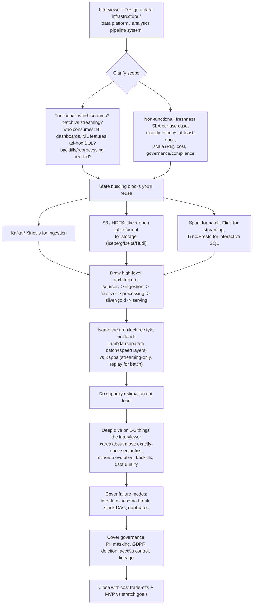

### Cheat-sheet
- Clarify functional vs non-functional before drawing a single box — same discipline as every other chapter in this course.
- Say "I'll reuse Pub-Sub, Blob Store, and Task Scheduler as building blocks" in the first minute — this is a platform built from platforms, not a green-field design.
- Name Lambda vs Kappa explicitly and pick one with a stated reason — this is the single highest-signal moment in the interview.
- Do capacity math before being asked — for a data platform this means PB/year and events/sec, not just QPS.
- Governance (schema registry, catalog, PII, GDPR deletion) is not optional color commentary here — it's a named functional requirement in the modern Grokking-style version of this chapter. Bring it up unprompted.

---

## 3. Requirements Clarification

### 3.1 Functional Requirements

| # | Requirement | Meaning |
|---|---|---|
| F1 | Ingest batch sources | Nightly/periodic bulk loads from OLTP databases, partner file drops, third-party APIs (Sqoop-style bulk export, or scheduled file landing) |
| F2 | Ingest streaming sources | Continuous event streams from CDC connectors (Debezium) and application/client SDKs (clickstream, mobile telemetry), via Kafka |
| F3 | Transform / aggregate | Clean, dedupe, join, and aggregate raw data into curated, business-ready tables — both on a schedule (batch) and continuously (streaming) |
| F4 | Serve to BI dashboards | Interactive SQL over curated tables with sub-minute-to-seconds latency for analysts (Trino/Presto/BigQuery-style engine) |
| F5 | Serve to ML feature stores | Point-in-time-correct feature values available for both offline training (batch) and online low-latency inference (streaming-updated online store) |
| F6 | Support backfills / reprocessing | Re-run a transformation across historical data when logic changes or a bug is found, without double-counting or requiring a full pipeline rewrite |
| F7 | Data discovery / catalog | Any engineer can search "what datasets exist, what do the columns mean, who owns this, what's its lineage" without asking a human |
| F8 | Data quality enforcement | Bad data (nulls where not expected, broken referential integrity, volume anomalies) is caught and quarantined before it reaches dashboards or models |
| F9 | Governance & deletion | Column-level PII controls, per-dataset access control, and provable deletion of a user's data across every copy on request (GDPR Article 17) |

### 3.2 Non-Functional Requirements

| Requirement | Why it's non-negotiable |
|---|---|
| Petabyte-scale storage | A platform serving hundreds of services accumulates PBs/year — must scale storage independently of compute |
| Processing guarantee per use case | Financial/billing aggregates need exactly-once; a rough "top trending videos" dashboard can tolerate at-least-once with occasional double-counts — state this explicitly, don't over-engineer everything to exactly-once |
| Freshness SLA differs by path | Streaming path: seconds-to-minutes (fraud detection, live dashboards); batch path: hours (nightly BI, model retraining) — these are two different contracts, not one number |
| Cost efficiency | Storage and compute cost dominate this system's P&L line far more than in most other chapters — cost is a first-class non-functional requirement here, not an afterthought |
| Governance / compliance | GDPR, CCPA, SOC2, HIPAA depending on industry — deletion, access control, and audit trails are load-bearing requirements, not nice-to-haves |
| Scalability (independent axes) | Storage grows ~linearly with ingestion; compute must scale independently and elastically (batch jobs are bursty, streaming jobs run 24/7) |
| Availability of the pipeline, not just the data | A stuck orchestrator or a down Kafka cluster should degrade gracefully (delayed freshness), not silently corrupt or drop data |
| Idempotency | Every re-run (retry, backfill, replay after crash) must be safe to repeat without producing different results |

### 3.3 Clarifying Questions to Ask the Interviewer

1. "Who are the consumers — BI analysts running ad-hoc SQL, ML engineers needing training features, or both? That changes whether Trino/Presto or a feature store is the priority."
2. "Is this greenfield, or are there existing OLTP databases/warehouses I need to integrate with via CDC?"
3. "What's the freshness requirement — is 'near-real-time' actually seconds (fraud), minutes (ops dashboards), or is next-morning batch fine (BI)?"
4. "Do we need exactly-once end-to-end, or is at-least-once with idempotent downstream consumers acceptable? (This one decision reshapes the whole streaming design.)"
5. "What's the compliance surface — GDPR/CCPA (user deletion), HIPAA/PCI (PII handling), SOC2 (audit trails)?"
6. "Roughly what scale — tens of GB/day, or hundreds of TB/day? This determines whether a managed warehouse (BigQuery/Snowflake/Redshift) suffices or we need a self-managed lakehouse."

### Cheat-sheet
- Nine functional requirements, memorize as three groups of three: **ingest** (batch, streaming), **process** (transform, serve-BI, serve-ML), **govern** (backfill, catalog, quality, deletion) — that's actually four groups but group them however sticks for you.
- The single most important non-functional statement: **"processing guarantee is a per-use-case decision, not a platform-wide constant"** — exactly-once everywhere is expensive and usually unnecessary.
- Cost is a non-functional requirement here in a way it usually isn't in a product-facing chapter — say so explicitly, it signals platform-engineering maturity.
- Always ask the freshness-SLA question — the batch-vs-streaming split in your architecture flows directly from the answer.

---

## 4. Capacity Estimation (Worked Example)

### 4.1 Formula chain

```text
1. Ingestion rate
   events/sec (streaming) x avg event size (bytes) = streaming raw bytes/sec
   + batch files/night x avg file size = batch raw bytes/day

2. Daily raw volume
   streaming raw bytes/sec x 86,400 s/day + batch raw bytes/day = total raw bytes/day

3. Compression (raw JSON/CDC -> columnar Parquet/ORC + codec)
   total raw bytes/day / compression_ratio = compressed (bronze) bytes/day

4. Storage per tier, accounting for retention window
   compressed bytes/day x retention_days(tier) = storage footprint for that tier

5. Kafka / ingestion-buffer sizing (short retention, for replay only)
   streaming raw bytes/sec x kafka_replication_factor x kafka_retention_seconds = Kafka cluster storage

6. Yearly growth
   compressed bytes/day x 365 = new compressed data added per year (before any tier ages out / gets deleted)

7. Compute sizing (rough)
   batch: (total data to scan nightly / per-executor-core scan throughput) = executor-core-hours needed within the nightly SLA window
   streaming: (events/sec / per-task-slot throughput) = parallel task slots needed
```

### 4.2 Worked numeric example

**Inputs (state these out loud — that's half the score):**
- A large e-commerce + streaming platform — roughly **1/20th of Netflix's ~2 trillion events/day Keystone pipeline**, to calibrate scale
- Clickstream/mobile telemetry: **2,000,000 events/sec average**, 4,000,000 peak, avg event size **800 bytes** (JSON)
- CDC row-change events from **300 OLTP databases** via Debezium: **150,000 events/sec average**, avg event size **1,200 bytes** (includes before/after row image)
- Nightly batch/partner file drops: **50 TB/night raw** (uncompressed CSV/JSON exports)
- Columnar compression ratio (JSON/CSV → Parquet + ZSTD): **~5:1**
- Kafka replication factor: **3**; Kafka retention (replay window, not permanent storage): **3 days**
- Bronze (raw, immutable) retention: **365 days**
- Silver (curated, deduped, conformed) retention: **2 years**, at **~60%** of bronze's daily volume (garbage/duplicates filtered, more efficient encoding)
- Gold (aggregated marts/BI cubes) retention: **3 years**, at **~2%** of silver's daily volume (heavily aggregated)
- Cold archive (compliance, e.g. financial records): **7 years**, compressed further (~50% of bronze's already-compressed size)

**Step-by-step math:**

```text
Step 1 — Streaming raw ingestion
  Clickstream: 2,000,000 events/s x 800 B  = 1,600,000,000 B/s = 1.60 GB/s
  CDC:           150,000 events/s x 1,200 B =   180,000,000 B/s = 0.18 GB/s
  Total streaming raw ≈ 1.78 GB/s ≈ 14.2 Gbps

Step 2 — Daily raw volume
  Streaming: 1.78 GB/s x 86,400 s ≈ 154 TB/day
  Batch:     50 TB/day (already daily, not smoothed)
  Total raw ≈ 204 TB/day

Step 3 — Bronze (compressed, Parquet + ZSTD, ~5:1)
  204 TB/day / 5 ≈ 41 TB/day compressed bronze

Step 4 — Bronze storage footprint (365-day retention)
  41 TB/day x 365 ≈ 15.0 PB steady-state bronze footprint

Step 5 — Kafka ingestion-buffer sizing (3-day replay window, RF=3)
  1.78 GB/s x 3 (RF) x 259,200 s (3 days) ≈ 1.38 PB Kafka cluster storage

Step 6 — Silver footprint (60% of bronze daily volume, 2-year retention)
  (41 TB/day x 0.60) x 730 days ≈ 18.0 PB steady-state silver footprint

Step 7 — Gold footprint (2% of silver daily volume, 3-year retention)
  (41 TB/day x 0.60 x 0.02) x 1,095 days ≈ 0.54 PB steady-state gold footprint

Step 8 — Yearly new-data growth (bronze layer only, before aging out)
  41 TB/day x 365 ≈ 15.0 PB/year newly ingested (compressed)

Step 9 — Cold archive (7-year compliance retention, ~50% smaller than bronze via re-compaction)
  (41 TB/day x 0.5) x 2,555 days ≈ 52.4 PB accumulated over 7 years
```

**Punchline to say in an interview:** "Streaming ingestion looks modest at 1.78 GB/s (~14 Gbps), but retention multiplies it fast — bronze alone reaches ~15 PB steady-state at a 365-day window, and cold compliance archive dwarfs everything else at ~52 PB over 7 years. This is exactly why tiered storage — S3 Standard → Standard-IA → Glacier — isn't an optimization, it's the difference between a viable and a bankrupt storage bill."

### 4.3 Storage footprint by tier

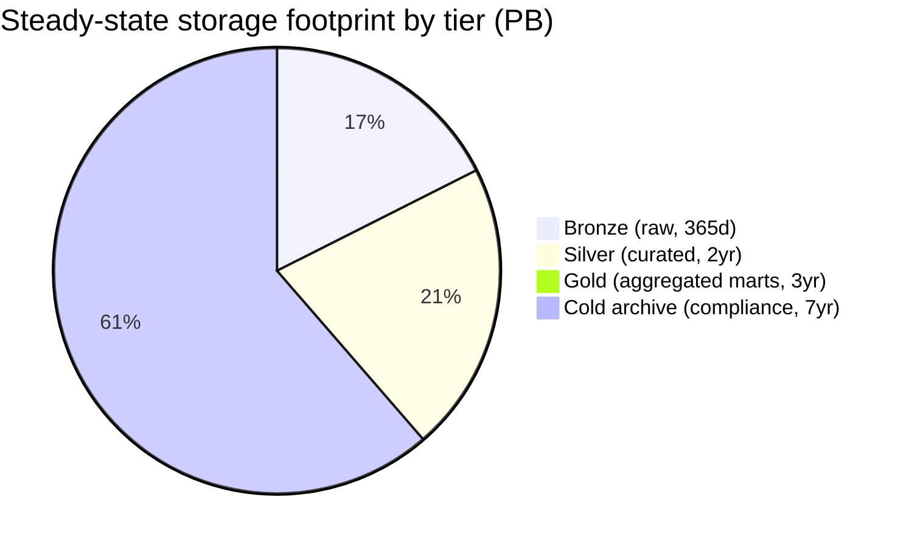

Reading it: gold is tiny (aggregation shrinks volume ~50x vs silver) but drives almost all BI/dashboard query traffic; cold archive is the largest by raw bytes but the cheapest per byte and almost never queried — this inversion (biggest tier = least-queried) is *the* argument for tiered storage cost design (see Section 12).

### 4.4 Retention timeline across tiers

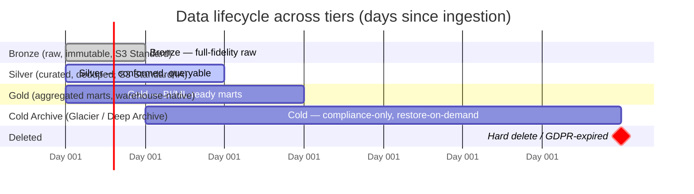

### Cheat-sheet
- Always state assumptions (events/sec, avg size, retention windows) before computing — interviewers grade the method.
- Memorize the formula chain shape: ingest → daily raw → compress → per-tier storage → Kafka buffer sizing → yearly growth → compute sizing.
- The "retention multiplier trap": a modest ingest rate (GB/s) becomes tens of PBs once multiplied by a year(s)-long retention window — always call this out explicitly.
- Gold is the smallest tier by volume but the most-queried — bronze/cold are the largest by volume but almost never queried directly. This inversion is the single best one-liner to justify tiered storage cost design.

---

## 5. API Design / Interfaces

Three distinct interfaces matter here — an interviewer will ask "what does the write call/query/schema-lookup actually look like," so have concrete answers, not just boxes labeled "ingestion."

### 5.1 Data-ingestion API / SDK (for producers)

| Interface | Who calls it | Purpose | Notes |
|---|---|---|---|
| Event SDK (`track()` client library) | Mobile/web apps, backend services | Emit a single structured event; SDK batches and ships async | Never a synchronous network call on the caller's critical path — same principle as the Distributed Logging chapter (22) |
| CDC connector (Debezium) | Attached to each OLTP database's write-ahead/binlog | Streams every row-level insert/update/delete as a change event to Kafka, without querying the source DB directly | Reads the transaction log, not the tables — zero extra load on production OLTP compute |
| Batch landing API (`/v1/ingest/batch-file`) | Partner/third-party systems, legacy nightly exports | Registers a file drop (S3 path) for the ingestion orchestrator to pick up on its next scheduled run | Sqoop-style "here's a location, we'll pull it" contract — the file itself, not the API call, carries the payload |

Example event SDK call (what the app actually does — fire-and-forget, matches the ingestion-API pattern from chapter 22):
```json
POST https://ingest.internal/v1/events:batch
{
  "producer": "checkout-service",
  "schema_id": "checkout.order_placed.v3",
  "batch_id": "b-9a41f2",
  "events": [
    {"event_time": "2026-07-23T10:22:31.482Z", "user_id_hash": "9f86d0...",
     "order_id": "ord_7f3c2a91", "amount_cents": 4599, "currency": "USD"}
  ]
}
```

Example Debezium connector config (CDC ingestion — this is the concrete artifact an interviewer wants to see once, not memorize):
```json
{
  "name": "orders-db-connector",
  "config": {
    "connector.class": "io.debezium.connector.postgresql.PostgresConnector",
    "database.hostname": "orders-db-primary.internal",
    "database.dbname": "orders",
    "table.include.list": "public.orders,public.order_items",
    "topic.prefix": "cdc.orders",
    "plugin.name": "pgoutput",
    "snapshot.mode": "initial"
  }
}
```
Interview line: "Debezium tails the database's write-ahead log (WAL) — it never issues a `SELECT` against the production tables, so ingestion adds essentially zero query load to the OLTP system it's shadowing. `snapshot.mode: initial` means it takes one consistent full snapshot on first connect, then switches to pure log-tailing."

### 5.2 Query interface (SQL engine, for BI/analysts)

| Endpoint / interface | Called by | Purpose |
|---|---|---|
| JDBC/ODBC over Trino/Presto (or a managed warehouse's native driver) | BI tools (Looker, Tableau), analyst notebooks | Interactive federated SQL across gold/silver tables, seconds-to-low-minutes latency |
| `/v1/query:submit` (async job API) | Long-running ad-hoc analytical queries | Returns a `job_id` immediately; large scans (billions of rows) run as a Spark/Trino batch job, not held open on an HTTP connection |

Example interactive query (analyst-facing):
```sql
SELECT region, date_trunc('day', order_ts) AS day, sum(amount_cents) / 100.0 AS revenue_usd
FROM gold.orders_daily_summary
WHERE order_ts >= date '2026-07-01'
GROUP BY 1, 2
ORDER BY 2;
```
This hits the **gold** zone only — analysts should never need to hand-write a join across raw bronze CDC tables; that work already happened upstream (Section 7.2).

### 5.3 Metadata / catalog API (schema + lineage lookup)

| Endpoint | Method | Purpose |
|---|---|---|
| `/v1/catalog/datasets/{id}` | GET | Dataset metadata: owner, description, zone (bronze/silver/gold), schema version, tags (e.g. `contains_pii`) |
| `/v1/catalog/datasets/{id}/schema?version=` | GET | Full column list, types, and compatibility mode for a specific schema version |
| `/v1/catalog/datasets/{id}/lineage` | GET | Upstream sources and downstream consumers — which pipeline/job produced this table, what reads from it |
| `/v1/catalog/search?q=` | GET | Free-text dataset discovery (table/column name, description, owner, tag) — this is the "Google for our data" endpoint |

Example response:
```json
GET /v1/catalog/datasets/gold.orders_daily_summary
{
  "dataset_id": "gold.orders_daily_summary",
  "zone": "gold",
  "owner": "checkout-analytics-team",
  "schema_version": 7,
  "compatibility_mode": "BACKWARD",
  "tags": ["contains_pii:false", "sla:daily-by-6am-utc"],
  "upstream": ["silver.orders_conformed", "silver.refunds_conformed"],
  "produced_by_job": "airflow:orders_daily_rollup_dag",
  "last_updated": "2026-07-23T05:58:12Z"
}
```

### 5.4 Orchestrator DAG definition (batch pipelines)

```python
# airflow DAG — nightly silver -> gold rollup, with explicit backfill support
from airflow import DAG
from airflow.operators.python import PythonOperator
from datetime import datetime, timedelta

dag = DAG(
    dag_id="orders_daily_rollup",
    start_date=datetime(2026, 1, 1),
    schedule_interval="0 5 * * *",   # 05:00 UTC daily
    catchup=True,                     # enables historical backfills for this date range
    max_active_runs=3,                # bound parallel backfill runs
    default_args={"retries": 3, "retry_delay": timedelta(minutes=10)},
)

def run_rollup(ds, **_):
    # ds = the logical date this run is processing (Airflow's execution_date)
    # writes an idempotent OVERWRITE of the single partition dt=ds — safe to re-run
    spark_submit(job="orders_rollup.py", args=["--date", ds, "--mode", "overwrite_partition"])

rollup = PythonOperator(task_id="rollup_orders", python_callable=run_rollup, dag=dag)
```
Interview line: "`catchup=True` plus a per-partition `overwrite_partition` write mode is what makes backfills safe — running the same logical date twice produces the same result, never a duplicate. That idempotency is doing more real work here than any amount of retry logic."

### Cheat-sheet
- Three different interfaces, three different consumers: ingestion SDK (producers, fire-and-forget), SQL engine (analysts, interactive), catalog API (everyone, discovery) — don't conflate them.
- Debezium reads the WAL/binlog, never queries the source tables — this is the one fact that answers "won't CDC slow down my production database?"
- The DAG snippet's two load-bearing details are `catchup=True` (enables backfill) and `overwrite_partition` (makes re-runs idempotent) — say both explicitly if asked "how do backfills work?"
- Analysts query gold, not bronze — if your architecture lets a dashboard read raw CDC tables directly, that's a design smell, not a shortcut.

---

## 6. High-Level Architecture

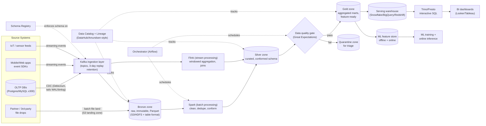

**Component responsibilities (canonical list — memorize it):**

| Component | Job |
|---|---|
| **CDC connectors (Debezium)** | Stream row-level changes from OLTP databases into Kafka without querying source tables |
| **Kafka ingestion layer** | Absorb bursty, high-volume event writes; short-retention replay buffer; decouples producers from downstream processing speed |
| **Bronze zone** | Durable, immutable, append-only raw data in columnar format — the permanent source of truth for reprocessing |
| **Spark (batch compute)** | Large-scale scheduled transformations: joins, dedup, aggregation, backfills |
| **Flink (stream compute)** | Continuous low-latency transformations: windowed aggregation, stream-stream/stream-table joins, exactly-once state |
| **Silver zone** | Cleaned, conformed, deduplicated, business-entity-aligned tables — still fairly granular |
| **Data quality gate** | Validates silver-to-gold promotion against expectations (nullability, ranges, row-count anomalies); quarantines failures |
| **Gold zone** | Highly aggregated, business-ready marts and feature tables — what BI and ML actually query |
| **Serving warehouse** | Managed MPP query engine (Snowflake/BigQuery/Redshift) or Trino/Presto over the lakehouse for interactive SQL |
| **ML feature store** | Offline (training, point-in-time-correct) and online (low-latency inference) views of the same feature definitions |
| **Schema registry** | Enforces producer/consumer schema compatibility at write time — rejects breaking changes before they hit Kafka |
| **Data catalog + lineage** | Searchable metadata of every dataset, its schema, owner, and upstream/downstream dependency graph |
| **Orchestrator (Airflow)** | Schedules, retries, and tracks dependencies between all batch jobs; drives backfills |

### 6.1 🆕 Architecture Evolution: v1 (naive) → v2 (add a lake) → v3 (the real lakehouse)

An interviewer who's seen a hundred candidates draw the Section 6 diagram cold is far more impressed by *why* each piece exists. Narrate it as three stages, each one fixing a specific failure of the last — don't present the final architecture as if it sprang into existence whole.

**v1 — naive: nightly batch dump straight into a warehouse.** This is what a team builds in month one, before "data platform" is even a job title.

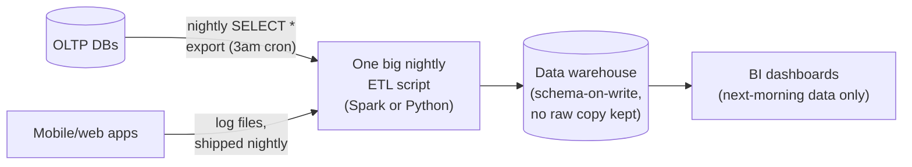

What's wrong with it, concretely: there is no raw copy anywhere — the nightly script transforms-and-loads in one step, so a bug in the transform logic corrupts the *only* copy of history and there's nothing to replay from. `SELECT *` against production tables competes with live traffic. There's no streaming path at all, so "seconds-to-minutes" use cases (fraud, live ops) are structurally impossible, not just slow. There's no schema registry or catalog, so an upstream column rename silently breaks the one nightly script and nobody finds out until the dashboard is empty.

**v2 — add a data lake for raw retention, but everything is still batch and slow.** The first fix a team reaches for is "keep the raw files somewhere durable before transforming them."

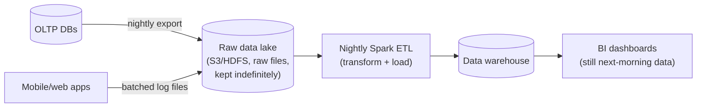

What v2 fixes: raw history now survives a bad transform — this is the first real bronze zone, and reprocessing/backfills (Section 7.4) become possible for the first time. What's still broken: everything is still nightly-cadence only (no fraud/live-ops use case is possible yet), the warehouse is still a coupled, expensive appliance, there's still no schema registry so drift is caught only when the nightly job crashes, and there's no medallion separation — one script does raw-to-warehouse in one opaque hop, so nobody can trust "is this cleaned yet?"

**v3 — the real lakehouse: streaming ingestion + medallion zones + orchestration (this chapter's design, Section 6's diagram).** Kafka/CDC adds a genuine streaming path so freshness stops being nightly-only; bronze/silver/gold formalizes "raw vs. conformed vs. business-ready" into three distinct, independently-queryable zones instead of one black-box script; and the schema registry, data-quality gate, catalog, and orchestrator become first-class cross-cutting services instead of afterthoughts.

| Version | What it newly solves | What's still missing (fixed by the next version) |
|---|---|---|
| **v1** — nightly dump straight to warehouse | Gets analytics running at all | No raw retention (unrecoverable ETL bugs), no streaming path, no governance |
| **v2** — add a raw data lake | Raw retention → backfills/reprocessing now possible | Still nightly-only (no fraud/live-ops freshness), schema drift still silently breaks the one script, no bronze/silver/gold separation of concerns |
| **v3** — streaming + medallion zones + governance (final design) | Freshness via Kappa/Flink, clear zone boundaries, safety rails (registry, DQ gate, catalog) | — this is the target architecture for the rest of this chapter |

**Interview line:** "I wouldn't draw the final lakehouse cold — I'd narrate that a team starts with a nightly dump straight into a warehouse, hits a wall the first time a transform bug corrupts the only copy of history, adds a raw lake to fix that, then hits a second wall — everything's still nightly and schema drift is only caught by a crash — and that's what motivates streaming ingestion, medallion zones, and a schema registry as first-class citizens, not add-ons."

### Cheat-sheet
- Draw sources → CDC/SDK → Kafka → bronze → {Spark batch, Flink stream} → silver → data-quality gate → gold → warehouse/feature-store → BI/ML, in that order, every time.
- Name all four cross-cutting services that touch every zone: schema registry, data catalog/lineage, orchestrator, data-quality gate — these are not optional side notes, they're load-bearing.
- State explicitly: batch (Spark) and streaming (Flink) are two parallel paths into the *same* silver zone — this is what makes the Lambda-vs-Kappa conversation concrete instead of abstract.
- BI and ML both read from gold, never from bronze — say this to show you understand why the medallion zones exist (Section 7.2).
- Narrate the v1 → v2 → v3 evolution (6.1) rather than presenting the final diagram as if it always existed — it's the single highest-recall-value story in this chapter.

---

## 7. Deep Dives

### 7.0 Storage Paradigm: Data Lake vs. Data Warehouse vs. Lakehouse

Before picking Kafka topics or Spark jobs, an interviewer wants to hear you place the *storage* decision on this spectrum — it's the decision every other choice in this chapter hangs off.

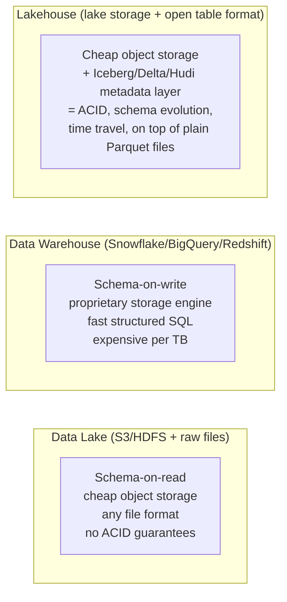

| | Data Lake | Data Warehouse | Lakehouse |
|---|---|---|---|
| Storage | Raw files (any format) on cheap object storage | Proprietary, tightly coupled to compute | Open file format (Parquet/ORC) + open table format metadata, on cheap object storage |
| Schema enforcement | Schema-on-read — the reader decides how to interpret bytes; easy to land garbage | Schema-on-write — rejected at ingest if it doesn't fit | Schema-on-write, enforced via the table format's schema + evolution rules, but files remain plain Parquet |
| ACID transactions | No — concurrent writers can corrupt or produce inconsistent reads | Yes, natively | Yes — added on top of plain files via the table format's commit log (Iceberg manifests, Delta transaction log, Hudi timeline) |
| Time travel / rollback | No | Vendor-dependent, often limited | Yes — every table format keeps prior snapshots queryable |
| Cost per TB | Lowest | Highest | Low (lake storage pricing) + moderate compute |
| Vendor lock-in | None | High — data physically lives in the vendor's engine | Low — Parquet + an open table spec is readable by Spark, Flink, Trino, and most warehouses interchangeably |
| Typical failure mode if you stop here | "Data swamp" — ungoverned, unqueryable, nobody trusts it | Cost balloons long before petabyte scale; rigid schema slows onboarding new sources | None inherent — this is why it became the default architecture for new platforms since ~2020 |

**Which table format, and why it matters:** Apache Iceberg (created at Netflix, now the most widely adopted vendor-neutral spec across engines), Delta Lake (created by Databricks, deepest native integration with Spark), and Apache Hudi (created at Uber, strongest at high-frequency row-level upserts/CDC ingestion) all deliver the same core promise — ACID commits, schema evolution, and time travel over plain Parquet files — via different trade-offs. A platform ingesting heavy CDC traffic (our worked example's 150K CDC events/sec) leans toward Hudi's upsert-optimized design or Iceberg's merge-on-read; a Spark-monoculture shop defaults to Delta Lake; a platform that must stay engine-agnostic (Trino today, something else in five years) defaults to Iceberg.

Interview line: "This platform is a lakehouse, not a raw lake or a closed warehouse — cheap object storage under the hood, an open table format (Iceberg) giving us ACID commits and schema evolution on top of it, so Spark, Flink, and Trino all read and write the exact same physical Parquet files without a proprietary ingestion step in between."

### 7.0b Columnar Storage Formats (Parquet/ORC) and Why They Matter

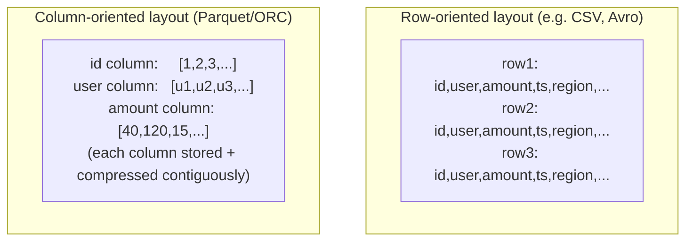

A query like `SELECT sum(amount_cents) FROM orders WHERE region = 'EU'` only needs the `amount_cents` and `region` columns out of a table that might have 40 columns. Columnar formats give two payoffs a row store can't:

1. **Column pruning** — the engine reads only the bytes belonging to the columns the query touches, skipping the other 38 columns entirely. On a wide analytical table this alone can cut I/O by 10-50x versus reading full rows.
2. **Predicate pushdown via per-column statistics** — Parquet/ORC store min/max (and sometimes bloom filters) per column *per row-group*, so a filter like `region = 'EU'` lets the engine skip entire row-groups (and, combined with partitioning, entire files) without decompressing them at all.
3. **Better compression** — values within one column are far more self-similar than values across a row (a `region` column is a handful of repeated strings; an `amount_cents` column is a tight numeric range) — columnar layouts compress 2-4x better than row-oriented formats for the same data.

Parquet (originated at Twitter/Cloudera, now the de facto standard, especially in the Spark/Iceberg/Delta ecosystem) and ORC (originated at Facebook/Hive, still common in the Hive/Presto-heavy world) solve the same problem with different encoding details — an interviewer rarely needs you to pick one, just to explain *why* either beats row-oriented storage for analytical scans: **row stores are optimized for "give me this one record," columnar stores are optimized for "give me this one aggregate across a billion records" — exactly the analytical workload this whole chapter is about.**

**🆕 Memory hook — Parquet vs. ORC vs. Avro, when each wins:**

| Format | Layout | Best when | Why |
|---|---|---|---|
| **Avro** | Row-oriented, schema travels with the data (or via registry ID) | Data **in motion** — Kafka messages, RPC payloads, streaming ingestion (Section 5, Section 7.5's schema registry) | Fast full-record read/write matches how a single event is produced and consumed; built-in schema evolution is exactly what a producer/consumer contract needs — but it's the wrong shape for scanning a billion rows |
| **Parquet** | Columnar | Data **at rest** in the lake/lakehouse — bronze/silver/gold, Spark/Iceberg/Delta ecosystems | Best-in-class column pruning + predicate pushdown + compression (Section 7.0b above); the de facto default for new lakehouse builds |
| **ORC** | Columnar | Hive/Presto-heavy, often-on-prem stacks; workloads wanting native lightweight transactional updates | Same columnar wins as Parquet, plus native Hive ACID support; a legacy-Hadoop-shop default more than a greenfield one |

**One-line mnemonic:** *"Avro moves it, Parquet (or ORC) stores it."* Use Avro for data in flight through Kafka; convert to Parquet (or ORC) the moment it lands in bronze — this is precisely why the CDC events in this chapter's ingestion API (Section 5.1) travel as Avro/JSON over Kafka but land as Parquet in bronze.

### 7.0c Batch vs. Streaming Ingestion Mechanics, and the Compute Engines Behind Each

| | Batch ingestion (Sqoop-style) | Streaming ingestion (Kafka + CDC) |
|---|---|---|
| Mechanism | Periodic bulk `SELECT`/export from the source, on a schedule (nightly, hourly) | Continuous tap on the source's write-ahead log (Debezium) or a push SDK, flowing through Kafka |
| Load on the source system | Can be heavy — a full-table scan/export competes with production queries unless carefully windowed or run against a read replica | Near-zero — CDC tails a log file, never issues a query against live tables |
| Freshness | Hours (until the next scheduled run) | Seconds to low minutes |
| Historical tool | Apache Sqoop (Hadoop-era bulk RDBMS↔HDFS transfer) — still cited in the original Grokking-style version of this chapter, largely superseded by CDC for anything latency-sensitive today | Debezium (CDC connector, Kafka Connect-based) for databases; client SDKs for app/clickstream events |
| When still the right choice | Legacy partner systems with no log-tailing access, or truly latency-insensitive nightly-refresh feeds | Anything where "yesterday's data" isn't good enough — fraud, personalization, live ops dashboards |

**Compute engines — one job each, don't conflate them:**

| Engine | Processing model | Primary job in this architecture | Origin |
|---|---|---|---|
| **Spark** | Micro-batch/batch, in-memory DAG execution | Large scheduled transformations over bronze/silver: joins, dedup, aggregation, backfills | UC Berkeley AMPLab, now Apache/Databricks |
| **Flink** | True record-at-a-time streaming, stateful, checkpointed | Continuous low-latency transforms: windowed aggregation, stream-stream joins, exactly-once state (Section 7.3) | Stratosphere research project (TU Berlin), popularized by Ververica/Alibaba |
| **Trino/Presto** | Interactive, in-memory MPP SQL, no persistent state between queries | Ad-hoc and BI-facing federated SQL over gold (and sometimes silver) — seconds-to-low-minutes queries, not pipelines | Facebook (Presto); forked by its original creators into Trino after a 2019 trademark/governance split |

Interview line: "Spark answers 'transform a huge amount of data on a schedule,' Flink answers 'transform an endless stream continuously and correctly,' and Trino answers 'let a human ask an ad-hoc question and get an answer in seconds' — they're not competing choices, a mature platform runs all three, each against the zone it's suited for."

### 7.0d 🆕 Memory Hook: Batch vs. Streaming — If X, Then Y

The single most re-asked question in this chapter is "would you do this in batch or streaming, and why" — for a whole pipeline, or for one specific job. Use this table as a fast recall device instead of re-deriving it from first principles every time:

| If... | Then reach for... | Why |
|---|---|---|
| Freshness need is seconds-to-low-minutes (fraud, live ops dashboards, personalization) | **Streaming** (Flink/Kafka) | Batch's scheduling cadence structurally cannot hit sub-minute freshness, no matter how fast the job runs |
| You need a full historical recompute after a logic/bug fix | **Batch** (Spark) over bronze | Replaying months/years of history through a stateful streaming job's checkpoint/watermark machinery is slower and more expensive than a plain batch scan |
| The source system has no log-tailing/CDC access (legacy partner file drops) | **Batch ingestion** | There is no stream to tap — only a periodic export exists, so the ingestion mechanism is forced regardless of preference |
| The aggregation just needs to be simple, low-ops, and "next morning" is an acceptable answer | **Batch** | Don't pay streaming's operational tax (watermarks, checkpoints, backpressure, 24/7 cluster cost) for a freshness bar nobody asked for |
| Correctness must account for late/out-of-order events arriving within minutes, not overnight | **Streaming with watermarks + allowed lateness** (Section 7.3) | Batch handles lateness for free by just running later; streaming needs explicit machinery to decide when a window is "done" |
| Data volume is huge but freshness tolerance is loose, and cost dominates the decision | **Batch** | A 24/7 streaming cluster costs more per byte processed than a scheduled batch window that scales to zero when idle (Section 10, Section 12) |

**One-line mnemonic:** *"Streaming buys freshness, batch buys cheap correctness — pick per use case, not once for the whole platform"* — the same principle as the non-functional requirement in Section 3.2 that processing guarantees are a per-use-case decision, not a platform constant.

### Cheat-sheet
- Lakehouse = lake storage (cheap, open) + an open table format (Iceberg/Delta/Hudi) giving ACID + schema evolution + time travel on top of plain Parquet — say this as the reason you're not proposing a raw lake or a closed warehouse.
- Iceberg (Netflix), Delta Lake (Databricks), Hudi (Uber) all solve the same problem; pick based on engine-neutrality (Iceberg), Spark-native depth (Delta), or upsert/CDC-heavy workloads (Hudi).
- Columnar formats (Parquet/ORC) win on analytical scans via column pruning + predicate pushdown via per-row-group statistics + better compression — row stores are optimized for single-record lookups, columnar for billion-row aggregates.
- Sqoop-style batch pull is legacy for anything latency-sensitive — CDC (Debezium tailing the WAL) is the modern default because it adds zero query load to the source.
- Spark (scheduled batch), Flink (continuous streaming), Trino/Presto (interactive SQL) each own a different job — naming all three and their distinct roles unprompted is a strong signal.
- Avro moves it (Kafka, in-flight), Parquet/ORC store it (lake, at-rest) — reach for the batch-vs-streaming table (7.0d) whenever asked "would this job be batch or streaming, and why."

### 7.1 Lambda vs. Kappa Architecture

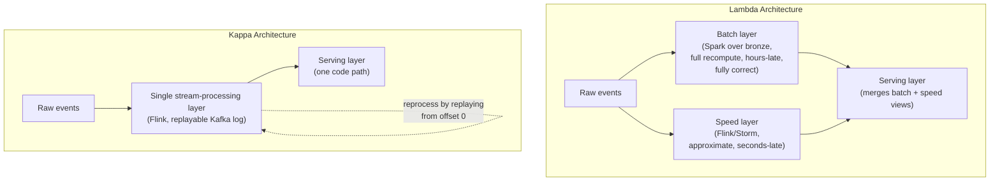

| | Lambda | Kappa |
|---|---|---|
| Codebases to maintain | Two (batch logic + streaming logic, often duplicated in Spark and Flink) | One (streaming logic only) |
| Correctness model | Batch layer is the eventual source of truth; speed layer is an approximation, overwritten later | Stream processing *is* the source of truth — no separate "corrected" batch pass |
| Reprocessing / backfill | Re-run the batch layer over bronze | Replay the Kafka log from an earlier offset through the same streaming job |
| Operational complexity | Higher — two compute paradigms, two sets of bugs, logic can silently drift apart between batch and speed layers | Lower — one paradigm, but requires the message log to retain history long enough to replay (or a bootstrap-from-lake path) |
| Best fit | Mixed workloads needing full historical batch recompute *and* live approximate views (e.g. a data warehouse team migrating gradually) | Continuous, latency-sensitive pipelines (fraud detection, recommendation feature freshness) where "always streaming" is good enough |
| Origin | Coined by Nathan Marz (Storm's creator) | Proposed by Jay Kreps (Kafka co-creator) explicitly as Lambda's simplification |

**Interview line:** "I'd default to a Kappa-leaning design for this platform: one Flink pipeline as the source of truth, with Kafka retention (or a bootstrap read from the bronze lake) providing the 'replay for correctness' story that Lambda's batch layer used to provide — this avoids maintaining the same aggregation logic twice in Spark and Flink. I'd reach for genuine Lambda only if a business requirement truly needs a separate, independently-verified batch recompute (e.g. financial reconciliation) alongside the live approximate view."

### 7.2 Medallion (Bronze / Silver / Gold) Zone Design

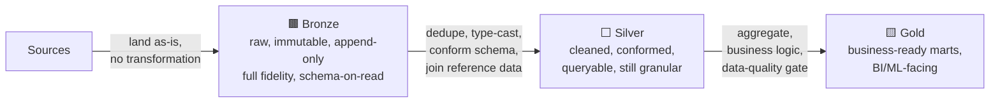

| Zone | Why it exists | What breaks if you skip it |
|---|---|---|
| **Bronze** | Permanent, replayable, full-fidelity record of "what actually arrived" — the only thing that makes backfills and Kappa-style reprocessing possible | Without it, a bug in transformation logic loses history forever; you can only fix data going forward |
| **Silver** | One conformed, deduplicated, joined representation per business entity — the single place transformation logic lives, instead of every downstream consumer reinventing its own cleaning | Without it, every BI query and every ML pipeline re-implements its own dedup/join logic, and they drift out of sync with each other |
| **Gold** | Pre-aggregated, access-controlled, cheap-to-query business marts — decouples "how expensive is this query" from "how many analysts run it" | Without it, every dashboard scans raw/silver-scale data on every load — slow and expensive; also the natural place to put PII masking and access control (Section 11) before serving |

Interview line: "Each zone earns its keep by being a different trade-off point on the cost/query-speed/correctness curve — bronze is expensive to scan but never lies about what arrived; gold is cheap to scan and fast but only as correct as the silver logic that fed it. Databricks calls this exact pattern the medallion architecture; the same three-zone idea appears as raw/refined/curated or landing/staging/mart in other vendors' naming."

### 7.3 Exactly-Once Streaming Semantics: Watermarks + Checkpointing

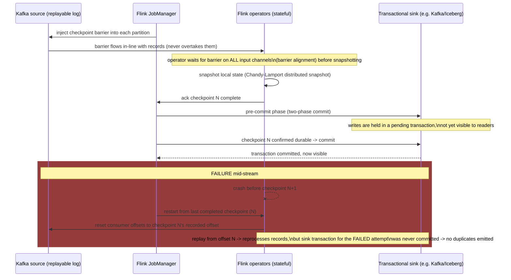

Two separate mechanisms do different jobs and are commonly conflated:
- **Checkpointing** (Chandy-Lamport snapshots + checkpoint barriers + two-phase commit sinks) is what gives **exactly-once processing** — every record affects the final state exactly once even across a crash-and-restart, *provided* the source is replayable (Kafka), state is checkpointed, and the sink is transactional or idempotent.
- **Watermarks** are a completely different mechanism for a different problem: **event-time progress tracking** for windowed aggregations. A watermark is a timestamp `T` that asserts "no more events with event-time earlier than `T` are expected" — it's what lets a 5-minute tumbling window know it's safe to close and emit a result, even though events can arrive out of order or late.

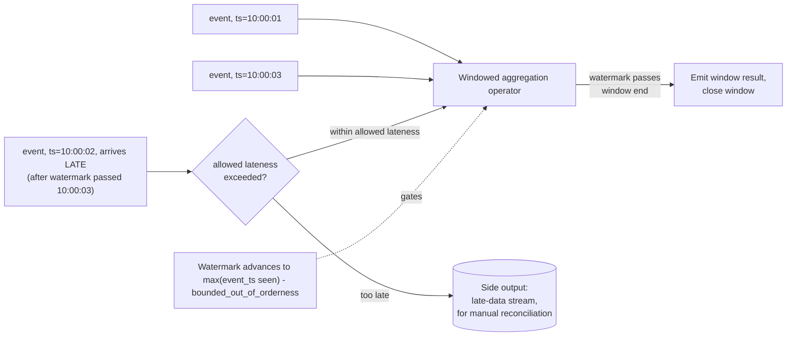

Interview line: "Checkpointing answers 'did my job process this record exactly once even after a crash'; watermarks answer 'when is it safe to finalize a time window given that events can arrive late and out of order.' Both are needed for a correct streaming aggregation — checkpointing alone doesn't fix a late-arriving event breaking a window, and watermarks alone don't survive a Flink task manager crash. End-to-end exactly-once needs all three legs: a replayable source (Kafka), checkpointed state (Flink), and a transactional or idempotent sink (Iceberg/Delta commit, or a de-duplicating upsert)."

**🆕 Worked numeric example — late data hitting a real window, with actual timestamps:**

Setup: a 5-minute tumbling window `[10:00:00, 10:05:00)` on `add_to_cart` events, bounded-out-of-orderness = **10 seconds** (so `watermark = max(event_time seen so far) − 10s`), allowed lateness = **60 seconds** past the window's end. That day the window's on-time total is **48,213 events**.

```text
Event A — ts=10:04:50, network-normal, arrives at 10:04:52
  -> well before the watermark closes the window -> counted normally in the 48,213 on-time total

Event C — ts=10:04:58, arrives LATE at 10:05:40 (42s network delay)
  -> watermark passed 10:05:00 at roughly 10:05:10 (max_seen 10:05:00 - would need +10s buffer,
     so window actually fires once watermark >= 10:05:00, i.e. once an event with ts>=10:05:10 is seen)
  -> window has ALREADY FIRED once with result = 48,213 by the time Event C arrives at 10:05:40
  -> Event C arrives at 10:05:40, deadline for allowed lateness is window-end(10:05:00) + 60s = 10:06:00
  -> 10:05:40 < 10:06:00 -> WITHIN allowed lateness -> triggers a LATE FIRING:
     window result is corrected and re-emitted as 48,214 (idempotent upsert, not an append, into silver)

Event B — ts=10:04:55, device was offline, arrives at 10:07:30 (2m35s network delay)
  -> deadline was 10:06:00; arrival at 10:07:30 is AFTER the deadline -> TOO LATE
  -> dropped from the automatic window result (stays at 48,214, never becomes 48,215)
  -> routed instead to a side-output "late-data" stream for separate reconciliation

Outcome that day: ~1,200 such too-late events accumulate across all windows (about 2.4% of the
day's 48,213-scale volume) -> the automatic streaming gold number silently undercounts by ~2.4%
until a nightly batch reconciliation job re-reads bronze in full and recomputes the corrected total
-- this is exactly the Lambda-style "speed layer is approximate, batch layer corrects it later"
pattern from Section 7.1, deployed narrowly just for the tail of late arrivals, not the whole pipeline.
```

**Punchline:** the same watermark deadline produces three different outcomes for three events that are only seconds apart in arrival time — on-time (counted), late-but-within-lateness (corrected via re-emission), and too-late (dropped from the stream, reconciled later in batch). Say this three-way split explicitly if asked "what happens to a late event" — "it depends which side of the allowed-lateness deadline it lands on" is the answer, not a single universal behavior.

### 7.4 Backfill & Reprocessing Flow

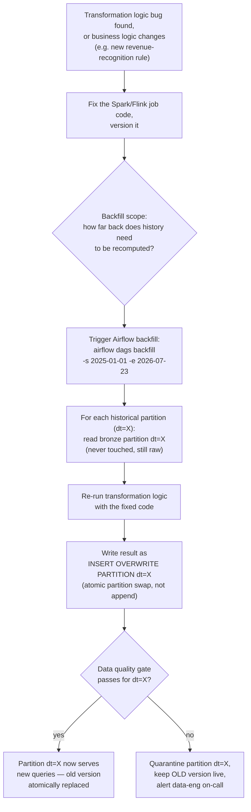

Why the **overwrite-partition, not append** detail matters: bronze is append-only and immutable (it's the permanent record of what arrived), but silver/gold *do* need corrections — the way to correct silver/gold without ever double-counting is to atomically replace one partition's contents (`INSERT OVERWRITE PARTITION`, or an Iceberg/Delta/Hudi snapshot-swap commit), never to append a "corrected" copy alongside the old one. This is the same idempotency principle from the DAG snippet in Section 5.4 — a backfill re-running the same logical date twice must be a no-op, not a duplicate.

**Interview line:** "The backfill story only works because bronze never changes — it's the replayable source of truth. Reprocessing means recomputing silver/gold from bronze with corrected logic and atomically swapping the affected partitions, exactly the same mechanism whether you're fixing yesterday's data or replaying two years of it."

### 7.5 Schema Evolution & the Schema Registry

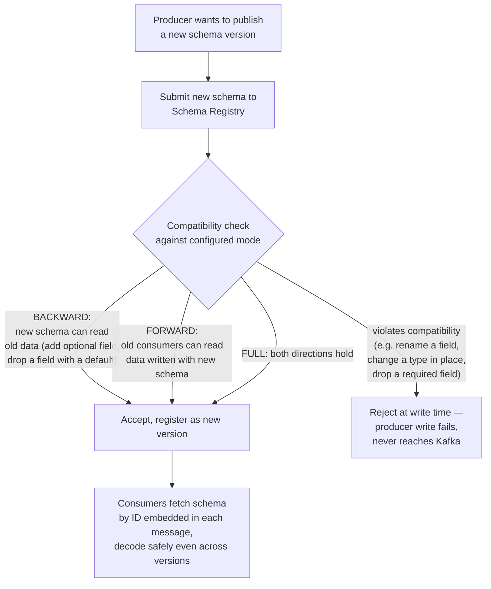

| Change | Compatible? | Rule |
|---|---|---|
| Add an optional field with a default | Safe (backward) | Old consumers ignore it; new consumers get the default for old records |
| Remove a field | Safe only if it had a default (forward) | Deprecate first (stop writing, keep parsing) before fully removing |
| Rename a field | Breaking | Treat as remove + add; dual-write both names during a migration window |
| Change a field's type in place | Breaking | Version the schema; never silently retype — new field name + migration instead |

The default and most common compatibility mode in production (Confluent Schema Registry, Avro/Protobuf) is **BACKWARD** — new schema versions can read data written with the immediately preceding version, which is exactly what lets you rewind a consumer group to the start of a topic without breaking. **FULL** compatibility (both backward and forward) allows producers and consumers to upgrade in *any* order independently, at the cost of being the most restrictive rule to satisfy.

Interview line: "The registry is the enforcement point, not just documentation — a producer's write should be rejected at the API boundary if it violates the configured compatibility mode, the same way a database rejects a write that violates a constraint. This is what prevents an upstream team's Tuesday deploy from silently breaking every downstream Flink job's deserializer on Wednesday."

### 7.6 Data Quality Gate

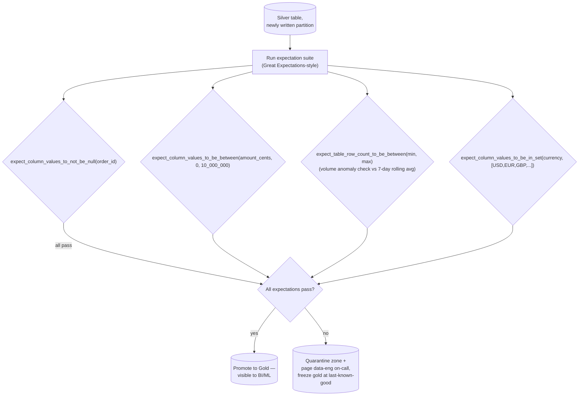

Example expectation suite (Great Expectations-style, illustrative):
```yaml
expectation_suite_name: silver.orders_conformed.suite
expectations:
  - expect_column_values_to_not_be_null: {column: order_id}
  - expect_column_values_to_be_between: {column: amount_cents, min_value: 0, max_value: 10000000}
  - expect_table_row_count_to_be_between: {min_value: 800000, max_value: 1200000}  # vs 7-day rolling avg
  - expect_column_values_to_be_in_set: {column: currency, value_set: [USD, EUR, GBP, JPY]}
```

Interview line: "The gate's failure action matters as much as the check itself: on failure, gold freezes at its last-known-good state instead of serving broken data, and the on-call gets paged with which expectation failed and on which partition — a dashboard showing yesterday's numbers is a minor incident; a dashboard silently showing today's corrupted numbers is a trust-destroying one."

### 7.7 🆕 End-to-End Scenario Traces

Every diagram so far is either the whole architecture at a glance (Section 6) or one mechanism in isolation (Lambda/Kappa, medallion, checkpointing, backfill, schema evolution, DQ gate). The two traces below walk one concrete event through *every* major component, start to finish — this is the level of detail an interviewer means when they say "walk me through what actually happens."

**Trace 1 — a clickstream event, from tap to dashboard:**

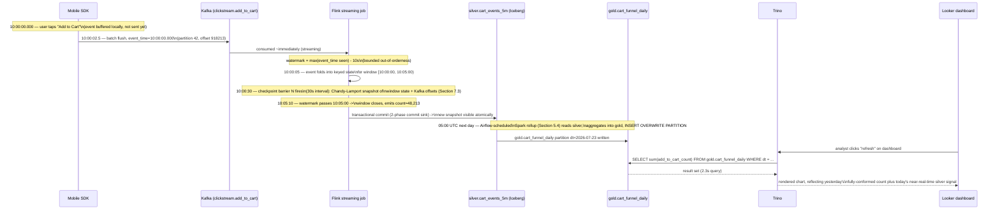

Say the punchline out loud: "One event crosses three different consistency regimes on its way to a dashboard — at-least-once and mutable at the SDK/Kafka edge, exactly-once and windowed in Flink, and finally snapshot-isolated and immutable-per-commit in silver/gold. The dashboard number is only as trustworthy as the weakest of those three links, which is why checkpointing, watermarks, and transactional sinks (Section 7.3) all have to hold at once."

**Trace 2 — an upstream schema change that passes every automated check and still breaks a downstream metric:**

```mermaid
sequenceDiagram
    participant PROD as Producer team (checkout-service)
    participant REG as Schema Registry
    participant K as Kafka
    participant SILJ as Silver conformance job
    participant DQ as Data quality gate
    participant GOLD as gold.orders_daily_summary
    participant ANALYST as BI analyst

    PROD->>REG: register checkout.order_placed.v4 -\nsame field name amount_cents, same INT type,\nbut semantics silently changed from cents to whole dollars
    REG-->>PROD: ACCEPTED - structurally BACKWARD-compatible\n(same name, same type - registry checks structure, not meaning)
    PROD->>K: deploys v4, starts publishing amount=46\ninstead of amount_cents=4599 for a $45.99 order
    K->>SILJ: silver job consumes normally, no deserialization error
    SILJ->>SILJ: expect_column_values_to_be_between(amount, 0, 10_000_000)\n-> 46 is well within range -> PASSES
    SILJ->>DQ: writes silver.orders_conformed, DQ gate runs, all checks green
    DQ->>GOLD: promoted - gold.orders_daily_summary revenue\nis now ~100x too small (dollars summed as if cents)
    ANALYST->>GOLD: next-morning dashboard refresh
    GOLD-->>ANALYST: "revenue" dropped 99% overnight - analyst flags it as an incident
    Note over ANALYST,GOLD: DETECTION happened via a human noticing an\nimplausible business metric, not any automated gate
    Note over PROD,GOLD: MITIGATION: roll back producer to v3 semantics,\nbackfill (Section 7.4) the affected partitions from bronze\n(bronze still has the raw, unambiguous original payload),\nand add a day-over-day revenue delta anomaly check to the\nDQ suite (Section 7.6) so a >20% swing pages on-call\ninstead of waiting for a human to eyeball a chart
```

**Why this trace matters more than a "registry catches it" happy path:** the schema registry (Section 7.5) only enforces *structural* compatibility — field name, type, required/optional. It has no way to know that "amount_cents" quietly stopped meaning cents. The static-range data-quality check (Section 7.6) didn't help either, because 46 is a perfectly plausible number in isolation — it only becomes wrong compared to yesterday's distribution. Say this explicitly if asked "what does your schema registry not protect you from": **semantic drift that doesn't change the schema's shape** — the fix is adding business-metric anomaly detection (day-over-day deltas on key aggregates) as a second, complementary layer to structural schema enforcement, not a replacement for it.

### Cheat-sheet
- Lambda = two codebases (batch + speed), Kappa = one (stream, replay for correctness) — default to Kappa unless a business requirement demands an independently-verified batch recompute.
- Medallion zones exist to separate concerns on the cost/speed/correctness curve: bronze = truth, silver = conformed, gold = cheap-and-fast — never let BI/ML read bronze directly.
- Checkpointing (exactly-once processing across crashes) and watermarks (event-time window closing) solve *different* problems — don't conflate them when asked about streaming correctness.
- A late event's outcome depends entirely on which side of the allowed-lateness deadline it lands on: on-time (counted), late-but-within-lateness (corrected re-emission), too-late (dropped, reconciled later in batch) — Section 7.3's worked example has the exact numbers.
- The schema registry only catches *structural* breaks — semantic drift (same shape, different meaning) needs a second layer: business-metric anomaly detection on top of static data-quality checks (Section 7.7, Trace 2).
- Backfills work because bronze is immutable and silver/gold corrections are atomic partition overwrites, never appends — this is the idempotency principle that makes "just re-run it" actually safe.
- The schema registry's job is enforcement at write time, not passive documentation — BACKWARD compatibility is the sane default because it's what lets you rewind a consumer.
- A data-quality gate's most important behavior is what it does on failure: quarantine + freeze-at-last-good + alert, never "let it through and hope."

---

## 8. Data Model

### 8.1 Partitioning Strategy

Curated tables are partitioned by **date + a high-cardinality-but-bounded dimension** (e.g. region) — this is the single decision with the biggest impact on both query cost and write parallelism.

```sql
-- Iceberg/Delta-style partitioned table definition (illustrative)
CREATE TABLE silver.orders_conformed (
    order_id        STRING,
    user_id_hash    STRING,
    region          STRING,
    order_ts        TIMESTAMP,
    amount_cents    BIGINT,
    currency        STRING,
    status          STRING,
    dt              DATE          -- derived partition column from order_ts
)
USING ICEBERG
PARTITIONED BY (dt, region);
```

| Partitioning choice | Why | Failure mode if wrong |
|---|---|---|
| Partition by `dt` (date) | Nearly every query filters by a time range; lets the query engine prune whole partitions instead of scanning full history | Without it, every query scans the entire table — the same "index-per-day" payoff described in the Distributed Logging chapter's (22) time-based partitioning |
| Sub-partition by `region` | Bounded cardinality (tens of regions, not millions); backfills for one region don't touch others' partitions | Partitioning by an unbounded key (e.g. `user_id`) creates the small-file problem (Section 12) — millions of tiny partitions |
| Not partitioning by `user_id` directly | Cardinality too high — would create one file per user per day | This is *the* textbook partitioning mistake — always partition by low-to-medium cardinality dimensions, never by a near-unique key |

Modern open table formats (Iceberg especially) also support **hidden partitioning** — the engine tracks the partition transform (e.g. `day(order_ts)`) in table metadata, so queries filtering on `order_ts` get pruning automatically without needing to know the physical partition column exists. This avoids the classic Hive mistake of forcing every analyst to remember to also filter on the physical partition column.

### 8.2 Catalog Entity Model

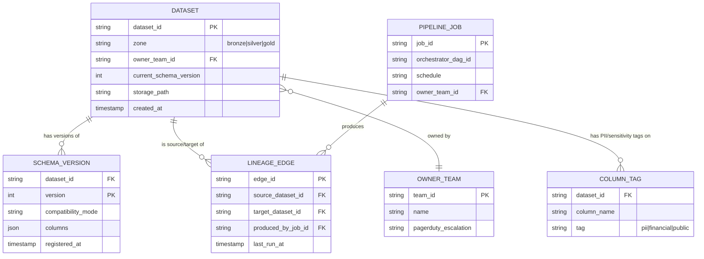

This is the same shape whether the underlying catalog is a homegrown metastore, Apache Hive Metastore, LinkedIn's DataHub, or Lyft's Amundsen — a `Dataset` has versioned `Schema`s, is produced by some `Pipeline/Job`, and `Lineage Edges` connect datasets to the jobs that read/write them, forming the graph you traverse for both "what breaks if I change this column" (downstream lineage) and "GDPR delete propagation" (Section 11).

### Cheat-sheet
- Partition by date + a bounded dimension (region, tenant-tier) — never by a near-unique key like raw `user_id`, that's the textbook small-file/partition-explosion mistake.
- Iceberg's hidden partitioning removes the "forgot to also filter on the physical partition column" failure class that plagued Hive-style tables.
- The catalog's core entities are Dataset, Schema Version, Pipeline/Job, and Lineage Edge — this graph is what answers both "what will break if I change this" and "where does this user's data live" (GDPR).
- Say "lineage graph" whenever discussing impact analysis or deletion propagation — it's the mechanism, not just a nice-to-have UI feature.

---

## 9. Failure Modes & Mitigations

```mermaid
flowchart TD
    F1[Late-arriving data] --> R1["Window already closed —\nmitigate: allowed lateness + side-output stream,\nnever silently drop"]
    F2[Schema-breaking upstream change] --> R2["Deserializers throw downstream —\nmitigate: registry rejects at write time,\nbreak never reaches Kafka"]
    F3[Stuck/failed DAG task] --> R3["Downstream tasks stall past SLA —\nmitigate: timeout+retry, SLA-miss page,\nread last-good partition"]
    F4[Duplicate events, at-least-once source] --> R4["Double-counted aggregates —\nmitigate: idempotency-key dedup\nat silver conformance"]
    F5[Small-file explosion] --> R5["Scan performance collapses —\nmitigate: scheduled/native compaction"]
    F6[Backfill appends instead of overwrites] --> R6["Double-counted history —\nmitigate: atomic partition\noverwrite / snapshot swap"]
    F7[Kafka consumer lag spike] --> R7["Retention window expires\nbefore consumer catches up —\nmitigate: lag alerting, autoscale consumer"]
    F8[Orchestrator scheduler down] --> R8["No new DAG runs\nplatform-wide —\nmitigate: HA scheduler + replicated metadata DB"]
    F9["🆕 Semantic drift\n(passes schema registry)"] --> R9["Metric silently wrong,\nstatic range checks still pass —\nmitigate: day-over-day anomaly\ndetection on key aggregates"]
```

| Failure mode | What goes wrong | Mitigation |
|---|---|---|
| **Late-arriving data breaks a windowed aggregation** | A mobile client buffers offline and sends an event hours late; the 5-minute window it belongs to already closed and emitted a result | Set `allowed lateness` on the window (Flink); events within that grace period trigger a corrected re-emission; events beyond it route to a side-output stream for a separate batch reconciliation job, not silently dropped |
| **Schema-breaking change from an upstream producer** | A service team renames a field or changes a type without warning; every downstream deserializer throws | Schema registry rejects the incompatible write at the producer's API boundary (Section 7.5) — the break never reaches Kafka or downstream consumers in the first place |
| **Semantic drift that passes the schema registry** 🆕 | A field keeps its name and type but its *meaning* changes (e.g. cents → dollars) — structurally compatible, so the registry accepts it, and a static range check still passes on the new (smaller) numbers | Registry checks shape, not meaning — add business-metric anomaly detection (day-over-day delta on key aggregates) as a second layer on top of the static DQ gate; see the full trace in Section 7.7, Trace 2 |
| **Stuck / failed DAG task blocks downstream** | A Spark job hangs or OOMs; every downstream task waiting on it (via `ExternalTaskSensor`/dependency) stalls, freshness SLA breached | Per-task timeout + automatic retry with backoff; SLA-miss alerting pages on-call; downstream DAGs read the *last successful* partition rather than blocking indefinitely where staleness is tolerable |
| **Duplicate events from an at-least-once source** | Producer retries on a network timeout that actually succeeded server-side; the same event lands twice | De-duplicate on a stable idempotency/event key during the silver conformance step (e.g. `INSERT ... ON CONFLICT (event_id) DO NOTHING`, or Flink's exactly-once sink with a deterministic key); never rely on the source to guarantee no duplicates |
| **Small-file explosion after many micro-batch/streaming writes** | Millions of tiny Parquet files accumulate; every downstream scan pays huge per-file metadata overhead | Scheduled compaction job merges small files into target-sized (~128MB–1GB) files (Section 12) |
| **Backfill double-counts historical data** | A re-run appends instead of overwriting, so the corrected and original rows both exist | Enforce `INSERT OVERWRITE PARTITION` / snapshot-swap commits for all reprocessing writes (Section 7.4) — never append during a backfill |
| **Kafka consumer lag spike (slow downstream)** | A Flink job slows down (state grew, backpressure); Kafka retention window (3 days in our worked example) risks expiring before the consumer catches up, causing data loss | Alert on consumer-group lag approaching the retention window; autoscale the consumer's parallelism; as a last resort, widen Kafka retention temporarily |
| **Orchestrator (Airflow) scheduler itself goes down** | No new DAG runs get scheduled platform-wide — a single point of failure for the whole batch layer | Run Airflow with an HA scheduler (multiple scheduler replicas, e.g. via Kubernetes executor) backed by an external metadata DB (Postgres) with its own replication (Section 10) |

### Cheat-sheet
- Name at least four failure modes unprompted: late data (watermark/allowed-lateness), schema break (registry rejection), stuck DAG (timeout + SLA alert), and duplicates (idempotent dedup key) — these four are the interviewer's checklist for this chapter.
- The recurring theme across nearly every mitigation: **push the fix as early as possible in the pipeline** — reject bad schemas at the producer boundary, dedupe at the silver conformance step, never at the BI dashboard layer.
- "Never silently drop or duplicate — quarantine, alert, or route to a side output" is the one sentence that covers most of this table.
- 🆕 A schema-registry pass is not the same as "this data is correct" — semantic drift (same shape, different meaning) needs a second, independent layer: anomaly detection on business metrics, not just structural checks (Section 7.7, Trace 2).

---

## 10. Non-Functional Walkthrough

**Scaling storage and compute independently** — this is the single biggest architectural advantage of a lakehouse (S3/HDFS + Parquet/Iceberg + Spark/Trino) over a traditional coupled MPP warehouse appliance: storage (cheap object storage, scales to petabytes with no compute attached) and compute (Spark/Trino clusters, autoscaled, spun up only while a query or job runs) scale on completely separate axes and completely separate cost curves. A quiet Sunday needs near-zero compute spend even though storage keeps growing; a Black-Friday-scale batch job can burst compute 10x for two hours without provisioning any extra storage.

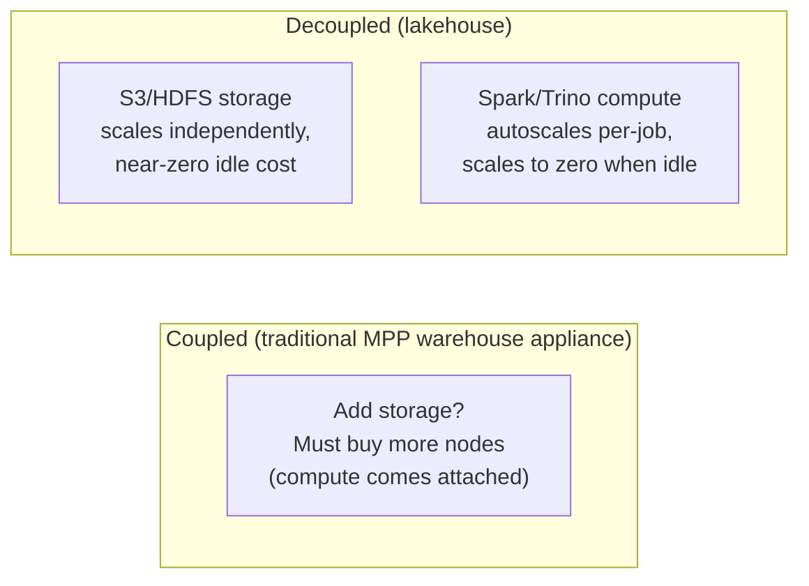

**HA of the orchestrator** — Airflow (or any scheduler) is a single point of failure for the entire batch layer if run naively. Production setups run multiple scheduler replicas (Kubernetes executor, leader-election-based HA scheduling since Airflow 2.x) backed by a replicated Postgres metadata database; workers are stateless and horizontally scalable (Celery/Kubernetes executor pools). The metadata DB, not the scheduler process, is the actual source of truth for "what ran, what's queued, what failed" — so its durability and replication matter more than any individual scheduler instance's uptime.

**Consistency trade-offs per layer** — this is the detail interviewers probe hardest:

| Layer | Consistency model | Why |
|---|---|---|
| Bronze | Append-only, immutable, eventually consistent w.r.t. ingestion lag | It's a permanent raw record — there's nothing to "correct," only more to append; readers accept that the very latest few minutes may be incomplete |
| Silver | Needs corrections (dedup, late-arriving joins) — implemented as atomic partition overwrites/snapshot swaps, not in-place row mutation | Corrections must be all-or-nothing per partition (via Iceberg/Delta/Hudi ACID commits) so no reader ever sees a half-corrected table |
| Gold | Strongly consistent from the reader's point of view at any given snapshot — BI dashboards need a stable, atomic view even while an aggregation job is mid-write | Open table formats provide snapshot isolation: readers see the last fully-committed snapshot, never a partial write in progress |
| Online feature store (ML serving) | Low-latency, eventually consistent with the offline store — a few seconds to minutes of lag between an event happening and the online feature reflecting it is normal and accepted | Optimizing for read latency (Cassandra/Redis-backed online store) trades away perfect real-time consistency with the offline/training view |

### Cheat-sheet
- "Storage and compute scale on independent axes" is the single most important sentence in this section — it's the lakehouse's core value proposition versus a coupled warehouse appliance.
- Airflow's actual source of truth is its metadata database, not the scheduler process — HA design should focus there first.
- Consistency gets *stronger* moving from bronze to gold, not weaker — bronze tolerates "still arriving," gold must never show a half-committed aggregation to a dashboard.
- Snapshot isolation (via Iceberg/Delta/Hudi ACID commits) is what makes "readers never see a partial write" true without locking the whole table.

---

## 11. Security, Compliance & Governance

**Column-level PII masking** — PII columns (email, name, precise location) are tagged in the catalog (the `COLUMN_TAG` entity from Section 8.2) and enforced by a policy engine (Apache Ranger, Unity Catalog, or a homegrown equivalent) at query time — an analyst without clearance sees `***MASKED***` or a hashed value in that column, transparently, without needing a different query or a different table.

**Access control per dataset** — every dataset in the catalog has an owning team and an access policy; access is granted per-dataset (sometimes per-column), not "everyone with warehouse access sees everything." This maps to the same tenant-isolation principle used in the Distributed Logging chapter (22) — different teams' data should never be blast-radius-linked by default.

**GDPR right-to-be-forgotten deletion propagation:**

```mermaid
sequenceDiagram
    participant U as User (Article 17 erasure request)
    participant API as Privacy/Deletion API
    participant CAT as Data Catalog (lineage graph)
    participant BRONZE as Bronze zone
    participant SILVER as Silver zone
    participant GOLD as Gold zone
    participant WH as Warehouse / exports
    participant AUD as Audit log (append-only)

    U->>API: "Delete all my data" (user_id_hash=X)
    API->>CAT: look up every dataset containing user_id_hash=X\n(walk the lineage graph forward)
    CAT-->>API: list of datasets: bronze.*, silver.*, gold.*,\nexported warehouse tables, ML feature store snapshots
    API->>BRONZE: rewrite affected partitions,\ntombstone/purge rows matching user_id_hash=X
    API->>SILVER: same — atomic partition overwrite excluding user
    API->>GOLD: recompute affected aggregates\n(or tombstone if row-level, e.g. per-user marts)
    API->>WH: propagate deletion to any exported/replicated copies
    API->>AUD: record "erasure completed, user_id_hash=X, at T,\ndatasets touched: [...]"
    Note over AUD: the erasure record itself is retained —\nyou log the deletion without logging the deleted PII
    API-->>U: confirmation within regulatory SLA (30 days)
```

The lineage graph is what makes this tractable at all — without it, "delete everywhere" degenerates into "hope someone remembers every downstream export." Because bronze partitions are otherwise immutable, a deletion request is the one sanctioned exception that rewrites bronze (via the same atomic partition-overwrite mechanism used for backfills), not a violation of the "bronze never changes" principle — it's a narrow, audited, and logged carve-out.

**Audit logging of who queried what** — every query against the warehouse/Trino is logged (query text, user, dataset(s) touched, timestamp) to an append-only audit store, separate from the data itself — this is what answers "who looked at this customer's PII in the last 90 days" during a security review or breach investigation, the same pattern as the audit trail in the Distributed Logging chapter's GDPR section.

### Cheat-sheet
- Column-level PII tags live in the catalog and get enforced by a policy engine at query time — masking is centralized, not reimplemented per dashboard.
- GDPR deletion only works because of the lineage graph — say "we walk the lineage graph to find every copy" as the mechanism, not just "we delete it."
- Deleting from bronze is the one sanctioned exception to "bronze is immutable" — frame it as an audited carve-out, not a contradiction.
- Audit logging is a separate append-only store from the data itself — "who queried what" must survive even if the underlying data is later deleted.

---

## 12. Cost & Trade-offs

**Storage tiering to cut cost** — the same hot/warm/cold principle from the Distributed Logging chapter (22), applied to the lake: S3 Standard (bronze/active silver) → S3 Standard-IA (aging silver, gold marts beyond typical query windows) → Glacier/Deep Archive (multi-year compliance cold storage). Given the worked capacity example's ~52 PB cold-archive footprint at 7-year retention, moving that tier from S3 Standard (~$0.023/GB/month) to Glacier Deep Archive (~$0.00099/GB/month) is roughly a **20x cost reduction on the single largest tier by volume** — this is not a micro-optimization, it's the difference between a sane and an unsustainable storage bill.

**Compute autoscaling** — batch (Spark on EMR/Databricks/Kubernetes) and streaming (Flink) clusters should scale to the workload, not sit provisioned for peak 24/7: batch clusters spin up for a scheduled window and scale to zero after; streaming clusters autoscale task-slot parallelism against consumer lag; spot/preemptible instances handle the bulk of batch compute since a killed batch task is just a retried task (idempotent by design, Section 7.4), not a correctness risk.

**The small-file problem and compaction:**

```mermaid
flowchart LR
    A["Frequent small writes\n(streaming micro-batches,\nmany parallel Flink sink tasks)"] --> B["Thousands of tiny files\n(KB-sized) accumulate\nper partition"]
    B --> C["Query engine must open\nand read metadata for\nEVERY tiny file"]
    C --> D["Scan performance degrades —\nmetadata overhead dominates\nactual data read"]
    D --> E["Scheduled compaction job\n(Spark/OPTIMIZE) merges small\nfiles into ~128MB-1GB targets"]
    E --> F["Query performance restored;\nfile count drops by 100-1000x"]
```

Every streaming sink writing directly to the lake (each parallel Flink task committing its own small file every checkpoint interval) is the classic cause: a job with 200 parallel sink tasks checkpointing every minute produces 200 new files every minute, regardless of how little data each contains. A scheduled (e.g. nightly) compaction job — or a table-format-native auto-compaction feature (Delta Lake's `OPTIMIZE`, Hudi's clustering/compaction service, Iceberg's rewrite-data-files procedure) — merges these into properly-sized files. This is one of the highest-ROI, most-overlooked operational tasks in a real lakehouse.

### Design Decisions & Trade-offs

| Decision | Option A | Option B | Trade-off |
|---|---|---|---|
| Streaming architecture | Lambda (batch + speed layers) | **Kappa (streaming-only, default choice)** | Duplicated logic + operational overhead vs. requiring a replayable log for reprocessing |
| Table format | Delta Lake | Apache Iceberg / Apache Hudi | Deepest integration with Spark (Delta) vs. vendor-neutral spec adopted by every major engine (Iceberg) vs. best-in-class row-level upsert/CDC performance (Hudi) |
| Query engine for BI | Managed warehouse (Snowflake/BigQuery/Redshift) | Trino/Presto over the open lakehouse | Simplicity + managed ops vs. no vendor lock-in + query any engine over the same files |
| Processing guarantee | Exactly-once everywhere | Exactly-once only where correctness-critical (billing), at-least-once + idempotent consumer elsewhere | Uniform simplicity vs. avoiding the real throughput/latency cost of exactly-once on paths that don't need it |
| Storage tiering | Keep everything on S3 Standard forever | Tiered: Standard → Standard-IA → Glacier, on a retention schedule | Simplicity vs. ~10-20x cost reduction on cold data |
| Compute provisioning | Statically provisioned for peak | Autoscaled, scale-to-zero, spot instances for batch | Predictability vs. dramatically lower average cost |
| File layout | Let streaming sinks write freely | Scheduled/automatic compaction | No extra job to run vs. avoiding the small-file query-performance cliff |

### Cheat-sheet
- Cold-archive tiering isn't a nice-to-have here — in the worked example it's roughly a 20x cost multiplier on the single largest tier by volume.
- Spot/preemptible instances are safe for batch compute specifically *because* jobs are idempotent (Section 7.4) — a killed spot task is a retry, not a correctness incident.
- The small-file problem is caused by frequent parallel streaming writes and fixed by scheduled or table-format-native compaction — name this unprompted if discussing streaming-to-lake sinks.
- Every "yes" in the trade-off table has a named cost — practice saying the cost half of each row, not just the benefit.

---

## 13. Wrap-Up: MVP vs. Stretch Goals

**In MVP scope:**
- Batch ingestion (CDC via Debezium + scheduled file drops) into an immutable bronze zone
- One streaming path (Kafka → Flink) for at least one latency-sensitive use case
- Medallion zones (bronze/silver/gold) with a scheduled orchestrator (Airflow) driving batch transforms
- A schema registry enforcing compatibility on write
- A basic data-quality gate (a handful of expectations) between silver and gold
- Column-level PII tagging and per-dataset access control
- A minimal catalog: dataset name, owner, schema version, and where it lives

**Explicitly out of scope for MVP (call this out unprompted — it shows judgment):**
- Full lineage-graph UI/automation (a spreadsheet of "who owns what" is an acceptable v1)
- Self-serve backfill tooling for non-data-engineers (data-eng runs backfills manually at first)
- A fully automated GDPR deletion pipeline (a manual, catalog-assisted runbook satisfies the 30-day SLA initially)
- Real-time (sub-second) feature serving — start with minutes-level online feature freshness

**Stretch goals (mention 2-3 if the interviewer has time):**
1. **Real-time ML feature store** — sub-second-fresh online features (Flink continuously updating a low-latency store like Redis/Cassandra) fully consistent with the offline training view via shared feature definitions (à la Uber's Michelangelo Palette).
2. **Self-serve data-quality SLAs** — let dataset owners declare their own expectation suites and freshness SLAs in a config file, with the platform automatically wiring up gates and alerting, instead of a central team hand-authoring every suite.
3. **Data mesh / federated ownership** — decentralize gold-zone mart ownership to individual domain teams (each team owns and publishes its own gold datasets to the shared catalog) rather than one central data-platform team owning every transformation.

### Cheat-sheet
- State MVP vs. out-of-scope explicitly and unprompted — this is one of the highest-signal things a senior candidate does in a platform-design interview.
- The real-time feature store, self-serve data-quality SLAs, and data-mesh ownership stretch goals are the three most commonly asked "how would you evolve this" follow-ups — have one sentence ready for each.
- "Manual runbook first, automate later" is a legitimate MVP answer for GDPR deletion and backfills — don't over-build governance tooling before the platform has real usage to justify it.

---

## 14. Golden Rules & Master Cheat-Sheet

### Golden Rules

1. **Nothing downstream touches raw ingestion data directly.** Bronze is the only zone allowed to see raw voltage; everything else reads from silver or gold.
2. **Bronze is immutable and append-only — the one exception is a sanctioned, audited GDPR deletion.** Every other correction happens via atomic partition overwrite in silver/gold, never in-place mutation of bronze.
3. **Pick Kappa by default; justify Lambda explicitly.** Maintaining two codebases (batch + speed layers) for the same logic is a cost you should only pay when a business requirement genuinely demands an independent batch recompute.
4. **Idempotency is the backfill story.** `INSERT OVERWRITE PARTITION` / atomic snapshot swaps mean re-running the same logical date twice is a no-op, not a duplicate — this is what makes "just re-run it" a safe sentence.
5. **The processing guarantee is a per-use-case decision, not a platform constant.** Exactly-once everywhere is expensive; reserve it for correctness-critical paths (billing, financial reconciliation) and use at-least-once + idempotent consumers elsewhere.
6. **Checkpointing and watermarks solve different problems.** Checkpointing = surviving a crash without duplicating/losing processed records. Watermarks = knowing when a time window is safe to close given out-of-order/late events. You need both for correct streaming aggregation.
7. **The schema registry enforces at write time, it doesn't just document.** Reject incompatible producer writes before they ever reach Kafka — this is the single biggest lever against "upstream team broke my pipeline."
8. **A data-quality gate's failure behavior matters more than its checks.** Quarantine + freeze-at-last-known-good + alert — never let a failed check silently pass bad data to gold.
9. **Storage and compute scale on independent axes.** This is the core economic argument for a lakehouse over a coupled MPP warehouse appliance — say it explicitly.
10. **Tier your storage, don't keep everything hot forever.** Cold/compliance data is often the largest tier by volume and the cheapest to move — a 10-20x cost lever, not a micro-optimization.
11. **Partition by bounded dimensions (date, region), never by near-unique keys.** Partitioning by raw `user_id` is the textbook mistake that causes small-file explosions.
12. **GDPR deletion is only tractable via the lineage graph.** Without a catalog tracking every dataset a user's data touches, "delete everywhere" degenerates into "hope."
13. **Compact your small files.** Frequent parallel streaming writes create a small-file problem that silently degrades every downstream scan until a compaction job fixes it.
14. 🆕 **A schema-registry pass proves structural compatibility, not correctness.** Semantic drift (same field name and type, different meaning) sails through the registry and even a static range check — catching it needs business-metric anomaly detection as a second layer (Section 7.7, Trace 2).
15. 🆕 **Narrate the architecture as an evolution, not a fait accompli.** v1 (nightly dump to warehouse) → v2 (add a raw lake, still batch) → v3 (streaming + medallion + governance) — each version exists because the previous one broke in a specific, nameable way (Section 6.1).

### Master Cheat Sheet

**One-liner definition:** A data infrastructure system is the platform that turns operational exhaust — clicks, transactions, sensor readings — into a small number of trusted, governed, queryable datasets, via ingestion (batch + streaming), tiered storage (bronze/silver/gold), dual-mode processing (Spark batch + Flink streaming), and governance (schema registry, catalog/lineage, access control).

**Architecture in one line:** `Sources (OLTP via CDC, apps via SDK, partners via batch) → Kafka → Bronze (raw, immutable) → {Spark batch | Flink stream} → Silver (conformed) → Data-quality gate → Gold (aggregated marts) → {Warehouse/Trino for BI, Feature Store for ML}`, with Schema Registry, Catalog/Lineage, and Orchestrator (Airflow) cutting across every zone.

**Capacity formula chain:**
```
events/sec x avg_size = raw bytes/sec
raw bytes/sec x 86,400 = daily raw volume
daily raw volume / compression_ratio = compressed (bronze) bytes/day
compressed bytes/day x retention_days(tier) = storage footprint per tier
raw bytes/sec x kafka_RF x kafka_retention_sec = Kafka buffer sizing
compressed bytes/day x 365 = yearly growth
```

**Worked example headline numbers:** ~1.78 GB/s streaming ingest (clickstream + CDC) → ~204 TB/day raw → ~41 TB/day compressed bronze → ~15 PB bronze (365d), ~18 PB silver (2yr), ~0.5 PB gold (3yr), ~52 PB cold archive (7yr) → Kafka buffer ~1.4 PB (3-day replay, RF=3).

**Confused-pair quick answers:**
- Lambda vs Kappa → two codebases + eventual batch correction vs. one codebase + replay-for-correctness.
- Data lake vs. data warehouse vs. lakehouse → schema-on-read/cheap/flexible vs. schema-on-write/fast/structured vs. lake storage + warehouse-style ACID/schema via an open table format (Iceberg/Delta/Hudi).
- Checkpointing vs. watermarks → crash-recovery exactly-once vs. event-time window closing.
- Batch ingestion vs. streaming ingestion → Sqoop-style periodic bulk pull vs. Kafka-backed continuous push (CDC via Debezium, or client SDKs).
- Bronze vs. silver vs. gold → raw/immutable vs. conformed/deduped vs. aggregated/business-ready.
- Batch vs. streaming (which to use) → cheap/correct/historical-recompute vs. fresh/seconds-to-minutes/higher-ops-cost (full table: Section 7.0d).
- Parquet/ORC vs. Avro → columnar, at-rest, lake-native (Parquet/ORC) vs. row-oriented, in-flight, Kafka-native (Avro) — "Avro moves it, Parquet/ORC stores it" (Section 7.0b).

**Numbers worth memorizing:** JSON→Parquet compression ≈ 5x · Kafka partition throughput ≈ 10-20 MB/s · target compacted file size ≈ 128MB-1GB · S3 Standard→Glacier Deep Archive cost ratio ≈ 20x · GDPR erasure SLA = 30 days · default schema-registry compatibility mode = BACKWARD.

**Real-world anchors:** Netflix (Keystone: Kafka+Flink, ~2 trillion events/day, 10PB/day; also birthplace of Apache Iceberg) · Uber (Michelangelo/Palette feature platform, birthplace of Apache Hudi, uses Spark batch + Flink/Kafka streaming) · Databricks (Delta Lake + the medallion bronze/silver/gold naming) · LinkedIn (Kafka's birthplace; DataHub catalog) · Lyft (Amundsen catalog) · Facebook/Meta (Presto, forked by its original creators into Trino) · Airbnb (Apache Airflow) · Red Hat (Debezium CDC) · Confluent (Schema Registry compatibility modes) · Great Expectations (open-source data-quality assertions).

**If asked "design X" and this is a sub-component:** one sentence — "operational events get CDC'd/streamed into a Kafka-backed lakehouse, land in an immutable bronze zone, get conformed into silver and aggregated into gold behind a data-quality gate, and BI/ML read only from gold" — then move on unless probed.
