# Design an AI-Powered Code Assistant — FAANG Interview Guide

> **Enhancement notes:** this pass added the things a skeptical staff engineer would flag as
> missing on a first read: (1) a 🆕 **Architecture Evolution (v1 → v2 → v3)** subsection under
> High-Level Architecture, walking from "every keystroke hits one large model, no cancellation"
> through "debounced but still prefix-only, no repo context" to the real system — the original
> jumped straight to the final architecture with no naive-first-answer narrative; (2) 🆕 two full
> **end-to-end sequence diagrams** — one inline-completion trace, one agent-mode refactor trace —
> each walking every major component (debounce/cancel → context gathering → prompt construction →
> model tier → security gate → render/report); the existing debounce and agent-mode sequence
> diagrams were valuable but component-level only, skipping context-gathering and the security
> gate entirely; (3) a 🆕 **worked numeric example** of the debounce math (how many keystrokes in
> a typing burst actually fire a live request, tied back to the existing capacity-estimation
> numbers instead of left as an abstract percentage); and (4) a 🆕 three-way **recall table** —
> inline vs. chat vs. agent mode — covering model tier, latency budget, and context-window size
> side by side, since the existing two-tier table only compared fast-vs-capable, not all three
> product surfaces. Requirements, capacity estimation, API design, the FIM/indexing/routing/
> security deep dives, failure modes, and the cheat sheet were already strong and are left
> untouched. New material is tagged 🆕 in its heading.

> Source chapter type: AI/ML developer-tooling product system. This is a newer addition to the
> Grokking-style course lineup ("AI-Powered Code Assistant System Design"); expanded here with
> real low-latency completion and repo-context mechanics for FAANG-depth interviews.

## Mental model

An AI code assistant (think **GitHub Copilot**, **Cursor**, **Amazon Q Developer**, **Windsurf**)
is three different systems wearing one UI:

1. **An extreme-low-latency inline-prediction problem.** As the developer types, the editor
   wants "ghost text" — a gray, inline suggestion of what comes next — to appear before the next
   keystroke lands. Most requests fired for this are **thrown away before they even finish**,
   because the user kept typing and the prefix is already stale. This is nothing like a normal
   API call where every request matters; here, discarding work is the *normal* case, not the
   failure case.
2. **A repo-context-retrieval problem.** The correct completion for `def calculate_` in this
   file depends on a helper function defined in a file the model has never seen, written by a
   teammate last Tuesday, in a private repo that didn't exist when the base model was trained.
   The right context has to be **gathered fresh, per request, from a codebase that is constantly
   changing** — open files, recently edited files, and a semantic index over the whole repo.
3. **A trust/safety problem.** A model trained on public code will, occasionally, regurgitate a
   pattern that looks like a real API key, or a SQL string built by concatenation instead of a
   parameterized query. Never show a leaked secret. Never let a multi-file "agent" change ship
   without the developer reviewing a diff. Getting this wrong once is a headline, not a bug
   ticket.

**The analogy to say out loud in an interview:** *"It's predictive text on your phone keyboard,
except the dictionary is your entire, constantly-changing private codebase, and getting the
wrong word out costs someone a broken build — or a leaked credential."*

Everything below falls out of taking that sentence seriously: two model tiers running two
different latency budgets, a context pipeline that re-indexes incrementally instead of
re-scanning the repo per keystroke, aggressive request cancellation, and a security gate that
runs on every output no matter how fast the inference tier is.

**The one picture to remember forever:**

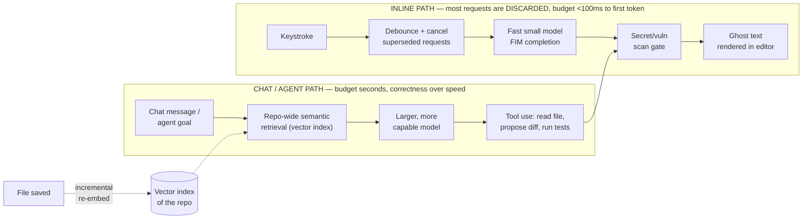

**Memory hook:** *"Cheap and disposable for every keystroke; expensive and careful for every
repo-wide question."* Every deep dive in this guide — debounce, FIM, incremental indexing,
two-tier model routing, the security gate — exists to keep that sentence true.

---

## Table of contents
[Interview Playbook](#interview-playbook) · [Requirements](#requirements-clarification) ·
[Capacity Estimation](#capacity-estimation-worked) · [API Design](#api-design) ·
[High-Level Architecture](#high-level-architecture) ·
[🆕 Architecture Evolution](#-architecture-evolution-v1--v2--v3) ·
[🆕 End-to-End Walkthroughs](#-end-to-end-request-walkthroughs) ·
[Debounce & Cancel](#deep-dive-the-debounce-and-cancel-request-lifecycle) ·
[FIM Prompting](#deep-dive-fill-in-the-middle-fim-prompt-construction) ·
[Incremental Indexing](#deep-dive-incremental-repo-context-indexing) ·
[Two-Tier Model Routing](#deep-dive-two-tier-model-routing) ·
[Security Gate](#deep-dive-secretvulnerability-scanning-gate) ·
[Agent Mode](#deep-dive-agent-mode-multi-step-tool-use) ·
[Data Model](#data-model) · [Failure Modes](#failure-modes--mitigations) ·
[Non-Functional Walkthrough](#non-functional-walkthrough) ·
[Security & Compliance](#security--compliance) · [Cost & Trade-offs](#cost--trade-offs) ·
[Wrap-Up](#wrap-up-mvp-vs-stretch) · [Cheat Sheet](#master-cheat-sheet)

---

## Interview playbook

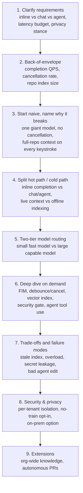

**What the interviewer is actually grading at each step:**
- Step 3: do you know *why* one model answering every request type is wrong — a model sized for
  a 3-second chat answer is too slow for a 100ms ghost-text completion — unprompted?
- Step 4: do you separate "index the repo" from "serve a completion" the same way a search
  system separates crawling from query-serving, instead of describing one service doing both?
- Step 6: do you spot that **most inline requests are cancelled, not completed** — and that this
  changes capacity planning (provision for requests fired, not requests finished)?

---

## Requirements clarification

### Functional

| # | Requirement | Notes |
|---|---|---|
| F1 | **Inline completion** — single-line and multi-line "ghost text" suggestions as the developer types | The core, highest-volume feature; must feel instantaneous or developers disable it |
| F2 | **Chat mode** — natural-language Q&A about the current repo ("where is the retry logic for the payment service?") | Needs repo-wide retrieval, not just the open file |
| F3 | **Agent mode** — multi-file edits, running tests/build commands, and reporting back, from a single natural-language goal | Highest capability, highest risk; changes must be reviewable before applying |
| F4 | **Respect `.gitignore` / private files** | Generated code, secrets files, vendored dependencies, and anything git-ignored must never be read into context or sent to any model |
| F5 | Suggestions must be **cancelable mid-flight** | A stale suggestion rendering after the user has moved on is a correctness bug, not a UX nit |

### Non-functional

| Requirement | Target | Why this number |
|---|---|---|
| Inline completion time-to-first-token (p50/p90) | p50 < 60ms, p90 < 100ms (server-side "worth showing" budget); round-trip including render under ~150-200ms | Faster than the human eye notices a flicker; slower and the ghost text appears *after* the next keystroke, which reads as wrong or laggy |
| Chat/agent time-to-first-token | p50 1-2s acceptable, full multi-step agent turn can run tens of seconds to minutes | A developer asking a question or kicking off an agent task is in "wait for an answer" mode, not "flow state typing" mode — a completely different UX contract |
| Suggestion quality (acceptance rate) | Directionally track upward over time; industry reference point is **~30% of shown suggestions accepted** (GitHub's own published figure) | Acceptance rate is the north-star product metric — it is *the* feedback signal the whole telemetry loop exists to improve |
| Privacy / no unauthorized training | Zero private code used to train shared models without explicit tenant opt-in | A single confirmed violation is an enterprise-trust-ending event, not a bug severity level |
| Availability | High, but **degrade to "no suggestion," never to an editor freeze or error dialog** | Losing the assistant ≠ losing the editor; the IDE must always work with the assistant off |
| Consistency of repo context | Eventual — index can lag a save by seconds to low minutes | A completion based on code from 90 seconds ago is a minor quality miss; it is never a safety issue |
| Consistency of the safety gate | **Strict — zero tolerance** | Unlike the index, the secret/vulnerability scan on the *specific suggestion about to be shown* cannot be "eventually correct" — it runs synchronously before render, every single time |

**Clarifying questions worth asking the interviewer up front:**
- "Is this single-player (one developer, local model) or multi-tenant SaaS serving many
  companies' private repos?" — this single answer decides whether per-tenant isolation is a
  paragraph or the spine of the whole design.
- "Do we need agent mode in scope, or just inline completion + chat?" — agent mode roughly
  doubles the surface area (tool use, diff application, test execution, rollback).
- "On-prem/VPC deployment requirement for regulated customers, or pure SaaS?" — affects whether
  the inference tier can assume a shared multi-tenant GPU fleet at all.

**Say this out loud in the interview:** *"This system has two SLAs living side by side under one
product — sub-100ms-to-first-token for inline, and a much more relaxed multi-second-to-minutes
budget for chat/agent. I'd never make one model or one service own both."*

---

## Capacity estimation, worked

Formula chain: **licensed developers → concurrently-active coders → completion requests/sec →
requests actually completed after cancellation → repo index size**.

```
Given (large-enterprise-deployment assumptions):
  Licensed developers                    = 2,000,000
  Concurrently active (typing) at peak   = 20%                  -> 400,000 developers
  Debounce window                         = ~300ms (fire only after a pause)
  Completion-eligible pause frequency     = ~1 every 2 sec of active typing
  -> inline completion requests/sec per active developer  = 0.5

Peak inline completion QPS:
  400,000 developers x 0.5 req/sec        = 200,000 QPS
  -> this is what you PROVISION for. It is NOT what completes end-to-end.

Cancellation ("superseded by the next keystroke before the model replies"):
  Illustrative cancellation rate           = ~65-70%
  Requests that reach a rendered suggestion = 200,000 x 0.32   ~= 64,000 QPS
  -> the inference tier still has to accept and START all 200,000 QPS of work; cancellation
     saves you from RENDERING or scoring most of it, it does NOT save you the initial dispatch.

Chat QPS (much lower volume, higher value per request):
  Concurrently chatting                    = ~2% of licensed developers  -> 40,000 developers
  Messages per active chat session          = ~1 every 20 sec while actively chatting
  Chat QPS                                  = 40,000 / 20                ~= 2,000 QPS

Agent QPS (rarest, longest-running):
  Concurrently running an agent session    = ~0.3% of licensed developers -> 6,000 sessions
  Each session issues a tool call roughly every ~3-5 sec while running
  Agent tool-call QPS                       ~= 6,000 / 4              ~= 1,500 QPS
  -> but each "request" here is a multi-step turn (read file, run tests), not a single
     token-generation call — treat agent capacity in SESSIONS, not raw QPS.

Repo embedding index, one large monorepo:
  Lines of code                             = 50,000,000
  Avg chunk size (function/class-ish unit)  = ~50 lines/chunk
  Chunks                                    = 1,000,000
  Embedding dimensionality                  = 1,536 (typical embedding model)
  Bytes per vector (float32)                = 1,536 x 4           = 6,144 bytes  (~6 KB)
  Raw vector storage                        = 1,000,000 x 6 KB    ~= 6 GB
  + metadata (file path, line range, content hash, ~20% overhead) ~= 7.2 GB total
  -> a single large monorepo's semantic index comfortably fits on one well-provisioned
     vector-search node; the hard part is keeping it FRESH (see incremental indexing), not
     making it small.
```

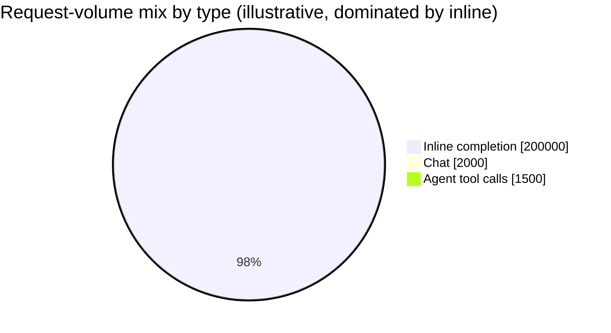

**Redo-the-chain test:** double the debounce window (300ms → 600ms) and the completion-eligible
pause frequency drops, cutting inline QPS roughly in half — at the cost of the suggestion feeling
laggier. Halve the cancellation rate (developers pause longer, so fewer requests get superseded)
and completed-suggestion QPS roughly doubles even though fired QPS stays the same. Practice
turning these knobs live — interviewers probe exactly this trade-off.

**The number worth memorizing:** provision the inline inference tier for **requests fired**
(200,000 QPS in this example), not requests that end up rendered (64,000 QPS) — the model still
has to start generating tokens for a request before it can be told to stop.

---

## API design

Three endpoints, one per mode, each with a very different contract.

### `POST /v1/completions` (inline, called on nearly every keystroke pause)

```json
{
  "requestId": "c_88f2",
  "prefix": "def calculate_monthly_total(orders):\n    total = 0\n    for order in orders:\n        ",
  "suffix": "\n    return total",
  "cursorPos": { "line": 3, "column": 8 },
  "fileContext": {
    "path": "billing/totals.py",
    "language": "python",
    "openFiles": ["billing/models.py", "billing/discounts.py"]
  },
  "cancellationToken": "tok_9a21"
}
```

Response (p90 target: <100ms to first token):
```json
{
  "requestId": "c_88f2",
  "suggestion": "total += order.amount * (1 - order.discount_rate)",
  "confidence": 0.83,
  "modelTier": "fast-completion-v4",
  "scanStatus": "clean",
  "latencyMs": 74
}
```

| Field | Notes |
|---|---|
| `prefix` / `suffix` | Code **before and after** the cursor — this is the fill-in-the-middle contract, see the [FIM deep dive](#deep-dive-fill-in-the-middle-fim-prompt-construction). Truncated to a token budget server-side, never sent unbounded. |
| `cancellationToken` | The client aborts the in-flight HTTP/gRPC stream the instant a newer keystroke fires a new request — the server never has to "discover" a request is stale, it's told. |
| `scanStatus` | `clean`, `blocked-secret`, or `blocked-vuln-pattern` — see the [security gate](#deep-dive-secretvulnerability-scanning-gate). A blocked suggestion never reaches this JSON as-is; it's either withheld or replaced. |

**Error handling:** on timeout, overload, or scan failure, return **no suggestion**, not a 5xx
the client has to special-case — same "fail open" contract as any other latency-obsessed system
(see the [typeahead guide](./37-Typeahead-Suggestion-FAANG-Guide.md) for the same pattern applied
to search-box suggestions).

### `POST /v1/chat` (chat mode, repo-aware Q&A)

```json
{
  "sessionId": "s_4471",
  "conversation": [
    { "role": "user", "content": "Where do we retry failed payment webhooks?" }
  ],
  "repoContext": { "repoId": "payments-service", "commitSha": "a91f3c2" }
}
```

Response streams token-by-token; final payload includes **citations**:
```json
{
  "sessionId": "s_4471",
  "answer": "Retries happen in `webhooks/retry_policy.py`, using exponential backoff...",
  "citations": [
    { "path": "webhooks/retry_policy.py", "lines": "14-42" },
    { "path": "webhooks/consumer.py", "lines": "88-101" }
  ],
  "modelTier": "capable-chat-v4"
}
```

Retrieval (which chunks of the repo get attached as context) happens server-side against the
vector index — the client never needs to know how retrieval works, only that `repoContext`
scopes it to one repo/commit.

### `POST /v1/agent/apply` (agent mode, multi-file edit + test execution)

```json
{
  "sessionId": "a_2091",
  "goal": "Add input validation to the /signup endpoint and add a test for empty emails",
  "approvalMode": "review-before-apply"
}
```

Response is a **plan**, not an immediate file mutation:
```json
{
  "sessionId": "a_2091",
  "status": "awaiting-approval",
  "steps": [
    { "type": "read_file", "path": "api/signup.py" },
    { "type": "propose_diff", "path": "api/signup.py", "diff": "@@ -12,6 +12,9 @@ ..." },
    { "type": "propose_diff", "path": "tests/test_signup.py", "diff": "@@ -0,0 +1,8 @@ ..." },
    { "type": "run_tests", "command": "pytest tests/test_signup.py" }
  ]
}
```

| `approvalMode` | Behavior |
|---|---|
| `review-before-apply` (default) | Every `propose_diff` step pauses for human accept/reject before touching a file — the standard, safe default |
| `auto-apply-with-rollback` | Diffs are applied immediately but every step is recorded so the whole session can be reverted atomically if a later step (e.g. `run_tests`) fails |

**The one sentence worth saying about the API surface:** *"Inline is fire-and-mostly-cancel,
chat is a streamed conversation with citations, and agent is a proposed plan the human approves
step by step — three different contracts because they're three different trust levels, not
three flavors of the same endpoint."*

---

## High-level architecture

### 🆕 Architecture evolution (v1 → v2 → v3)

Walk this out loud before jumping to the final diagram below — it's the forcing-function
narrative an interviewer wants to hear, not a diagram to memorize in isolation. Each stage is
"good enough to say out loud"; each "why it breaks" is what justifies the next stage existing.

**v1 — the naive (and wrong) first answer:**

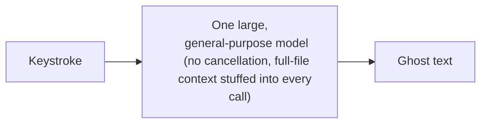

**Why it breaks:** a large model's time-to-first-token is hundreds of milliseconds to seconds —
5-50x over the <100ms budget — so the ghost text renders *after* the developer has already typed
past the cursor position it was computed for. There's no cancellation, so every one of the
~200,000 QPS of fired keystrokes runs full inference to completion even though most of them are
superseded before they'd render. There's also no security gate yet — a regurgitated secret would
ship straight to the editor.

**v2 — debounce added, but still no real repo context:**

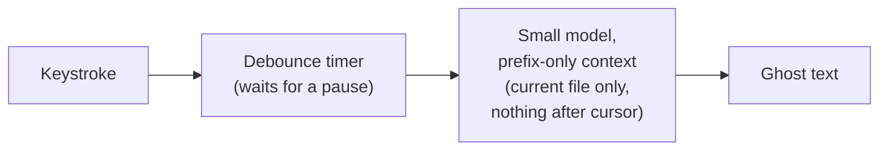

**Why it breaks:** latency is now plausible — fewer requests fire, and the model is smaller — but
two problems remain. First, **prefix-only** context means the model can't see code *after* the
cursor, so it routinely re-generates a `return` statement or duplicates a line that already
exists two lines down (see the [FIM deep dive](#deep-dive-fill-in-the-middle-fim-prompt-construction)).
Second, there's still no **server-side cancellation** — debounce stops the client from *sending*
a request, but once a request is in flight, a fast typist who pauses and immediately resumes
still leaves that request running to completion, wasting the exact GPU time this design is
supposed to be saving. There's also still no awareness of any file except the one currently open
— a helper function in a teammate's file is invisible.

**v3 — the real system (everything diagrammed below is this):**

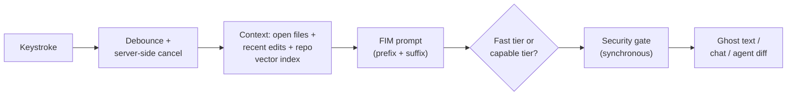

**What v3 fixes, one line each:** server-side cancellation stops wasting inference on superseded
requests (not just debounce); FIM lets the model see the suffix, so it stops duplicating code;
the repo vector index gives it visibility into files it never had open; two-tier routing means
the same system can also serve chat/agent without either mode stealing the other's latency
budget; the security gate closes the secret/vuln-leak hole that existed, unaddressed, since v1.

---

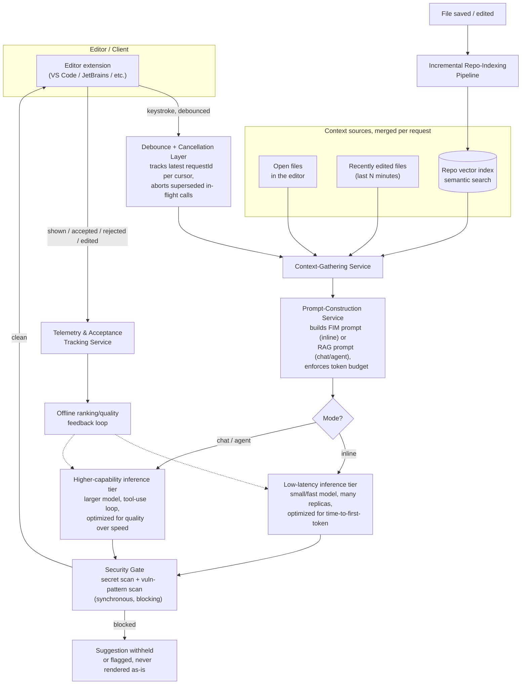

| Component | Role |
|---|---|
| Debounce + cancellation layer | Lives partly client-side (editor extension), partly server-side (accepts a cancellation token). Exists purely to keep the fast tier from doing wasted work — see the [debounce deep dive](#deep-dive-the-debounce-and-cancel-request-lifecycle). |
| Context-gathering service | Merges three sources — open files (free, already in memory), recently edited files (cheap, small set), and repo-wide semantic search (the expensive one, hits the vector index) — into one bounded context window. |
| Prompt-construction service | Different template per mode: FIM (prefix/suffix around cursor) for inline, RAG-style (question + retrieved chunks + citations) for chat/agent. Enforces the model's token budget by truncating lowest-relevance context first. |
| Fast tier vs capable tier | Two separately-scaled fleets — see the [two-tier routing deep dive](#deep-dive-two-tier-model-routing). This is the single most important architectural split in the whole system. |
| Security gate | Runs on **every** model output before it reaches the editor, regardless of which tier produced it. Never optional, never skipped for latency. |
| Telemetry & acceptance tracking | Every shown/accepted/rejected/edited-after-accept event is logged — the feedback loop that improves ranking and, longer-term, model quality. |
| Incremental repo-indexing pipeline | Runs off the write path entirely — a file save triggers re-embedding of *changed chunks only*, never a full repo re-scan. |

---

## 🆕 End-to-end request walkthroughs

The deep dives below zoom into individual mechanisms in isolation. These two traces are the
opposite: one concrete scenario each, walking through **every** component in the v3 architecture
above, in order. If you can draw either of these from memory in an interview, you've internalized
the whole design, not just its parts.

### Walkthrough 1 — developer types 3 characters rapidly (inline path)

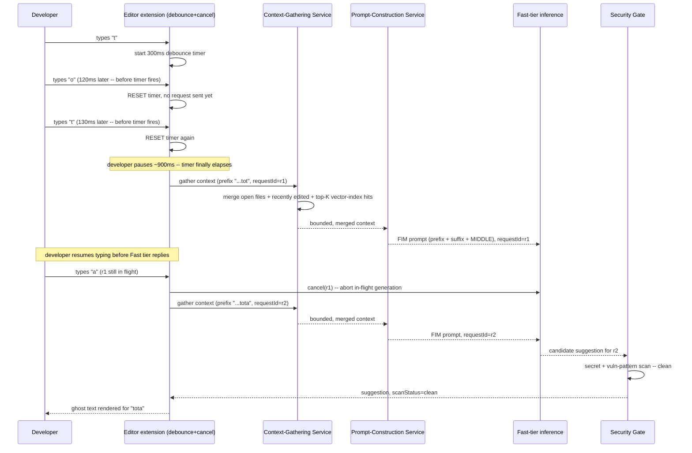

Three keystrokes, but only **one** request ever reaches a rendered suggestion — the first
(`r1`) is explicitly cancelled server-side, not just ignored, the moment the fourth keystroke
lands. Every box in the v3 architecture diagram appears exactly once on this critical path:
debounce, cancel, context gathering, FIM prompt construction, the fast tier, and the security
gate.

### Walkthrough 2 — agent mode refactors a function across 3 files

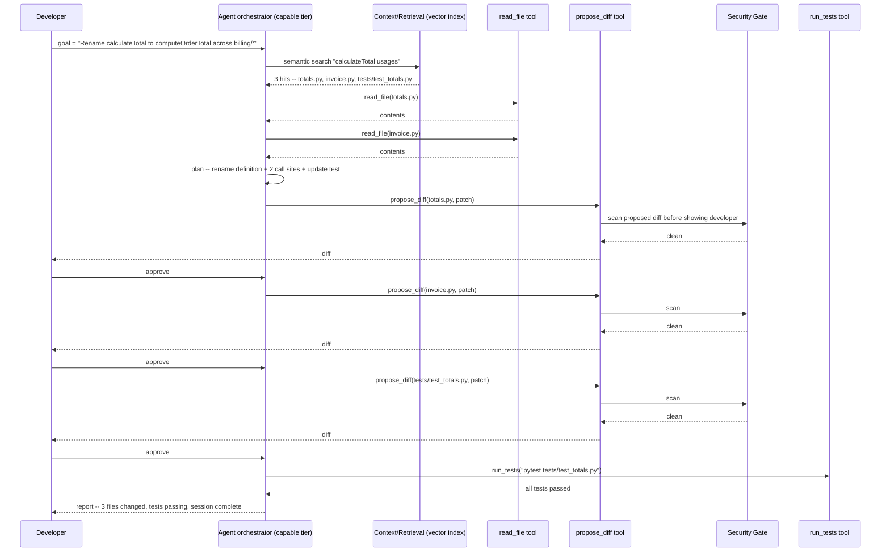

Notice the security gate runs on **every** `propose_diff`, not just inline completions — the
"synchronous, on 100% of outputs, regardless of tier" rule from the
[security-gate deep dive](#deep-dive-secretvulnerability-scanning-gate) applies here too, before
a human ever sees the diff. The original agent-mode diagram (further below) is still useful for
focusing on the plan/re-plan-on-failure loop in isolation; this trace adds the retrieval step and
the gate that diagram omitted.

---

## Deep dive: the debounce-and-cancel request lifecycle

The single most-tested mechanic in this chapter. Three keystrokes in quick succession must not
mean three full completions computed — it must mean **one** completion computed, for the
**latest** state, with the first two requests aborted before they cost real inference time.

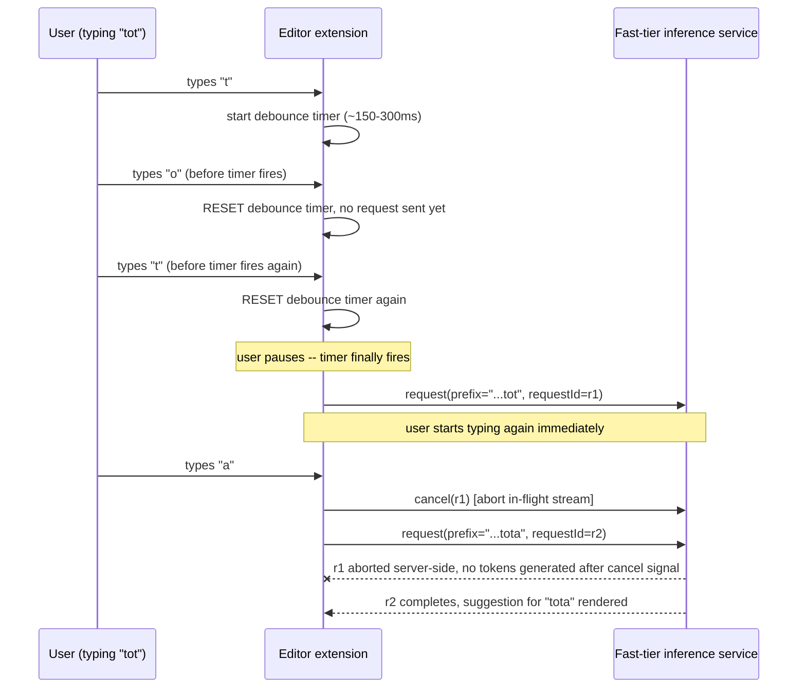

**Two cancellation mechanisms, both needed:**

| Mechanism | What it catches | Cost if missing |
|---|---|---|
| **Client-side debounce** (don't even send the request) | The common case: fast typists whose intermediate keystrokes never needed a suggestion at all | Wasted requests for every keystroke, not just the ones that matter |
| **Server-side cancellation token** (abort a request already in flight) | The request already left the client before the next keystroke landed — debounce alone can't catch this | Wasted GPU inference time on tokens nobody will ever see, at exactly the QPS this system is trying to control |

**Why cancellation matters more here than in a typical API:** in most systems, an in-flight
request that gets ignored by the client is a minor inefficiency. Here, at 200,000 fired QPS with
~65-70% eventually superseded, failing to actually **abort** the superseded ones (as opposed to
just ignoring their response) means paying for GPU inference on the majority of traffic for
nothing — the entire capacity plan for the fast tier assumes cancellation actually stops
generation, not just stops rendering.

### 🆕 Worked example: how many keystrokes actually fire a request

```
A fast typist, ~200ms per keystroke (~5 keystrokes/sec), debounce window = 300ms.

Typing "total" inside a function body (a 5-character burst):
  keystroke gap while mid-word ~= 150-200ms   <  300ms debounce window
  -> every intermediate keystroke RESETS the timer before it ever fires
  -> 5 keystrokes typed, ZERO requests fired during the burst itself

The developer then pauses (thinking about the next line) for ~900ms > 300ms window:
  -> timer finally elapses -- exactly ONE request fires, for the whole 5-character burst

Tie back to the capacity-estimation numbers already computed above:
  Completion-eligible pause frequency  = ~1 every 2 sec of active typing
  At 200ms/keystroke, 2 sec of active typing = 10 keystrokes
  -> roughly 1 request fired per 10 keystrokes typed, i.e. debounce alone suppresses
     ~90% of keystrokes before cancellation even has anything to do

Of the ~10% that DO fire, ~65-70% are still cancelled server-side (the earlier worked
capacity numbers) because the developer resumed typing before the model replied:
  -> per 10 keystrokes: ~1 request fires, ~0.3-0.35 of a request actually renders

-> two independent multipliers, same direction: debounce cuts fired volume by ~10x,
   cancellation then cuts completed volume by another ~3x on top of that.
```

**Interview cheat-sheet:** *"Debounce reduces how many requests get sent; cancellation reduces
how much inference actually completes for the ones that were sent. You need both — debounce
alone doesn't catch a request that already left before the next keystroke."*

---

## Deep dive: fill-in-the-middle (FIM) prompt construction

Before FIM, completion models only saw code **before** the cursor — a real limitation, because
developers routinely place the cursor in the middle of existing code (adding a parameter to an
existing function, inserting a line inside an existing loop). GitHub's own reporting on Copilot
attributes a **~10% relative quality improvement** to introducing FIM, precisely because it lets
the model see what comes *after* the cursor too, instead of guessing blind.

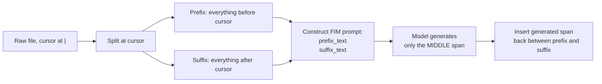

**Worked example** — cursor placed inside an existing function body:

```
File on disk:
    def calculate_monthly_total(orders):
        total = 0
        for order in orders:
            |
        return total

Prefix sent to model:
    "def calculate_monthly_total(orders):\n    total = 0\n    for order in orders:\n        "

Suffix sent to model:
    "\n    return total"

FIM prompt assembled (special tokens vary by model provider):
    <PREFIX>def calculate_monthly_total(orders):\n    total = 0\n    for order in orders:\n        <SUFFIX>\n    return total<MIDDLE>

Model generates only the MIDDLE span:
    "total += order.amount * (1 - order.discount_rate)"

Final render: prefix + generated middle + suffix, spliced back together seamlessly.
```

**Why this beats prefix-only completion:** without the suffix, the model has no signal that a
`return total` already exists two lines down — it might re-generate a `return` statement,
producing duplicate or unreachable code. With the suffix visible, the model knows exactly what
it needs to lead into.

**Token budget discipline:** prefix and suffix are each truncated (not sent in full for large
files) — typically the nearest few hundred to low-thousands of tokens around the cursor, plus a
handful of "neighboring tabs" (other files currently open in the editor) appended as additional
low-priority context, dropped first if the budget is tight. Full-repo context, when needed,
comes from the vector index (next section) rather than stuffing more raw file content into the
FIM prompt itself.

**Interview cheat-sheet:** *"FIM prompting = prefix + suffix + a special separator token telling
the model 'fill in exactly this gap.' It's the reason modern completions insert cleanly into
existing code instead of only ever appending at the end of what's been typed."*

---

## Deep dive: incremental repo-context indexing

Repo-wide semantic search needs a vector index — but a monorepo with millions of lines changes
constantly. Re-embedding the entire repo on every save is both slow and wasteful; the answer,
same as Cursor's approach to codebase indexing, is to **re-embed only what changed**, using
content hashing to identify unchanged chunks.

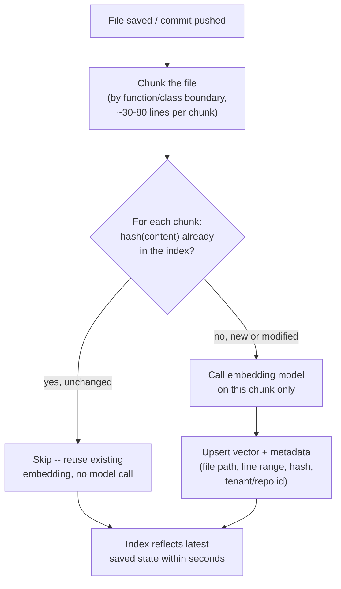

**Why hashing, not timestamps:** a file can be saved with zero semantic change (whitespace,
reformatting) or a large file can have one function touched — hashing at the **chunk** level
means a 2,000-line file with a one-function edit triggers exactly one re-embedding call, not
2,000 lines' worth of re-work. This is the same "diff the tree, don't rescan it" instinct as an
incremental build system or a Merkle-tree-based sync protocol.

**Cadence trade-off** (mirrors the offline-rebuild-cadence discussion in the typeahead guide):

| | Re-embed on every keystroke | Re-embed on file save (debounced) | Nightly full re-index |
|---|---|---|---|
| Freshness | Perfect, but pointless — mid-edit code is often syntactically invalid | Seconds-to-low-minutes stale | Up to 24h stale |
| Cost | Enormous — most keystrokes don't represent a stable, meaningful chunk | Cheap — bounded by save frequency, not typing speed | Cheapest per byte, but misses same-day work entirely |
| What it's for | Never do this | **The right default** for active development | A safety-net full rebuild to catch drift (renamed files, deleted branches, index corruption) |

**Cross-file blast radius:** a single edit can invalidate more than just the chunk that changed
— e.g. renaming a widely-used function should ideally update the *semantic* relevance of every
call site's chunk, not just the definition's chunk. Production systems generally accept this as
an acceptable staleness gap (the call sites are still findable by the retrieval step even with
slightly stale embeddings) rather than trying to propagate every rename repo-wide synchronously.

**Interview cheat-sheet:** *"Content-hash each chunk, re-embed only chunks whose hash changed,
triggered on save (debounced), with a periodic full rebuild as a safety net — never a full
re-embed on every keystroke, and never a fully synchronous re-index blocking the save itself."*

---

## Deep dive: two-tier model routing

The single highest-leverage architectural decision in this whole system: **inline completion and
chat/agent must never share an inference fleet.** They have different latency budgets, different
traffic shapes, and different quality requirements.

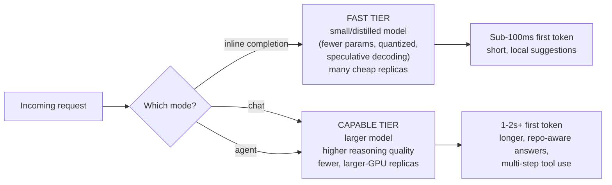

| | Fast tier (inline) | Capable tier (chat/agent) |
|---|---|---|
| p50 time-to-first-token | < 60ms | 1-2s |
| p90 time-to-first-token | < 100ms | 3-5s |
| Model size | Small/distilled, often quantized | Full-size, highest available reasoning quality |
| Typical output length | A line or a few lines | Paragraphs, multi-file diffs, tool-call sequences |
| Traffic shape | Bursty, keystroke-driven, ~200K QPS fired (worked example above) | Smooth, conversation-driven, ~2K QPS |
| Scaling driver | Number of concurrently-typing developers | Number of concurrently-chatting/agent-running developers |
| Failure behavior | Drop the request, show nothing | Show an error / retry — a chat session can tolerate a visible retry, ghost text cannot |
| Optimization techniques | Speculative decoding, prompt caching on the (mostly stable) prefix, aggressive batching **within** a tight latency SLO | Larger batches acceptable, can tolerate queueing, can afford deeper retrieval before generating |

**Why not just always use the small model, everywhere?** Chat and agent answers need to reason
across multiple files, weigh trade-offs, and use tools correctly — small distilled models
measurably underperform here. **Why not just always use the large model?** It cannot hit a
100ms budget at 200,000 QPS without a GPU fleet sized for the wrong problem entirely — you'd be
provisioning your most expensive compute for your highest-volume, lowest-value-per-request
traffic.

### 🆕 Recall table: inline vs. chat vs. agent mode

The table above splits fast-tier-vs-capable-tier; this one splits all **three product surfaces**
side by side — chat and agent share a model tier but differ sharply in context shape and what
happens when a step is too slow.

| | Inline completion | Chat | Agent |
|---|---|---|---|
| Model tier | Fast/distilled | Capable | Capable (same tier as chat) |
| Latency budget | p50<60ms / p90<100ms to first token | 1-2s to first token | Seconds per tool call; whole session can run minutes |
| Context window | Small — prefix+suffix around cursor (few hundred-to-low-thousands tokens) + a couple of open files | Medium — top-K retrieved chunks from the vector index + conversation history | Large & incremental — grows step by step as the agent reads files via tools, bounded per-step rather than fixed upfront |
| If too slow | **Discard.** Fail open, show nothing — the ghost text was already going to be stale | **Show a retry.** A visible delay/retry is tolerable; chat is already a "wait for it" UX | **Re-plan or roll back.** A slow/failed tool step triggers re-planning; a failed session can be rolled back atomically |

**Memory hook:** *"Inline: small model, small window, sub-100ms, throwaway if late. Chat: big
model, retrieved window, a few seconds, visible retry if late. Agent: big model, a window that
grows as it reads, minutes, re-plan-or-rollback if late."* Same two model tiers as the table
above — the third axis that actually distinguishes chat from agent is context *shape* (fixed
retrieval vs. tool-fed and growing) and failure behavior, not the model itself.

**Interview cheat-sheet:** *"Route by mode, not by tenant or by load. Inline always goes to the
fast tier no matter how busy the capable tier is, and vice versa — they scale independently
because their bottlenecks are different (keystroke volume vs. reasoning depth)."*

---

## Deep dive: secret/vulnerability scanning gate

Every generated suggestion — inline, chat, or agent — passes through one synchronous gate before
it is ever rendered. This is the one place in the architecture where "never skip this for
latency" is a hard rule, not a guideline: GitHub's own Copilot tooling ships exactly this kind of
gate (secret scanning / push protection catching known credential formats, and a pre-commit
`/security-review`-style pass flagging injection, XSS, path traversal, and weak crypto patterns)
because an accepted suggestion containing a real secret or an obviously exploitable pattern is a
severity-1 trust failure, not a quality nit.

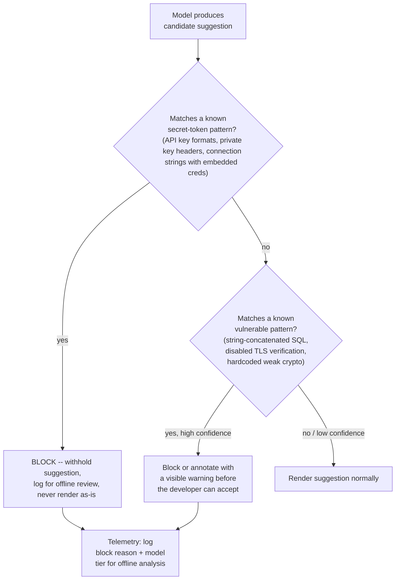

**Two different failure classes handled differently:**

| | Secret leakage | Vulnerable pattern |
|---|---|---|
| Detection | High-precision pattern/entropy matching against known token formats (cheap, fast, deterministic) | Pattern rules for the highest-impact classes (SQLi, XSS, path traversal, weak crypto) — same rung as static-analysis tools like CodeQL, run at suggestion time instead of at CI time |
| Action on match | Always block — never show a suspected secret "with a warning," because developers accept fast and won't read the warning | Often annotate/warn rather than hard-block — some flagged patterns are legitimate in context (e.g., intentionally permissive code in a test fixture) |
| Tolerance for false negatives | As close to zero as achievable | Non-zero acceptable — this is a defense-in-depth layer, not a replacement for CI-time static analysis or code review |
| Tolerance for false positives | Acceptable — better to occasionally withhold a harmless-looking string than miss a real key | Should stay low, or developers learn to ignore/disable the warnings entirely |

**Honest limitation to say out loud:** pattern-based secret scanning reliably catches
well-known token formats (cloud provider key prefixes, common connection-string shapes) but can
miss custom or obfuscated internal formats — this is a defense-in-depth layer, and organizations
with bespoke secret formats still need their own scanning rules layered on top, plus standard
CI-time secret scanning as a second independent check.

**Interview cheat-sheet:** *"This gate is synchronous and blocking, runs on 100% of outputs
regardless of which model tier produced them, and treats 'possible secret' and 'possible
vulnerability' with different tolerance for false negatives — one is zero-tolerance, the other is
warn-and-let-a-human-decide."*

---

## Deep dive: agent-mode multi-step tool use

Agent mode is the highest-risk, highest-capability surface: given a natural-language goal, the
model plans and executes a sequence of tool calls — reading files, proposing diffs, running
tests/build commands — iterating on failures, all before a human approves anything is actually
applied to disk.

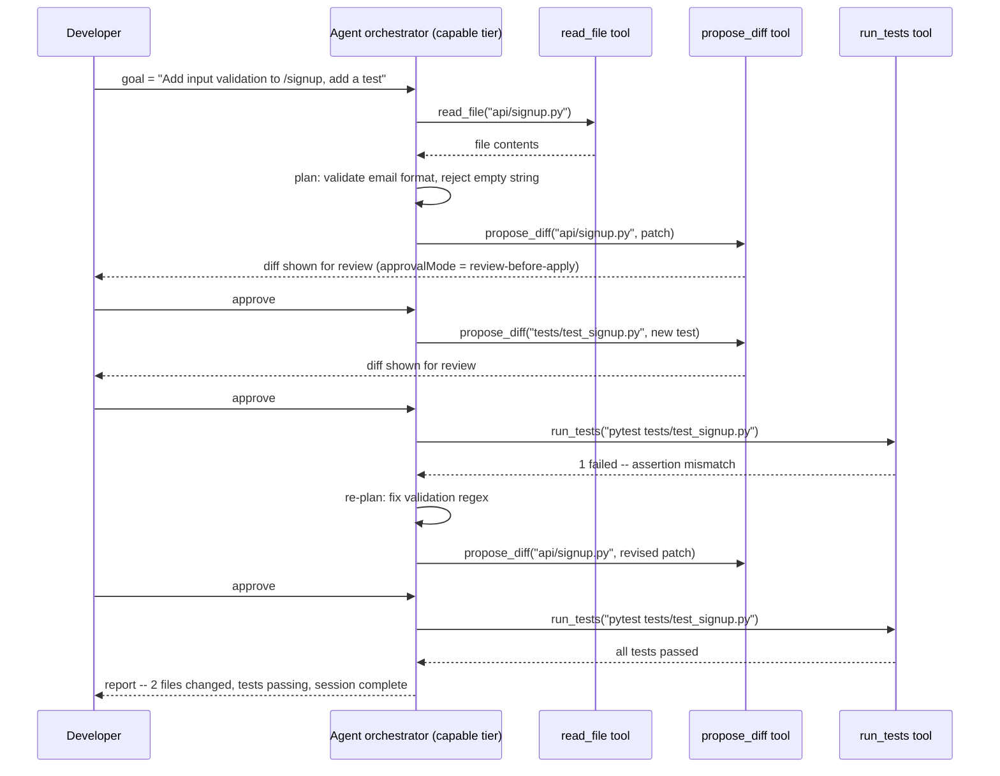

**The loop, generalized:** `read_file → propose_diff → run_tests → (on failure) re-plan and
repeat → report`. Every step goes through the model's tool-calling interface, not free-form text
parsing — the orchestrator gives the model a fixed, named set of tools (`read_file`, `edit_file`,
`run_in_terminal`, `run_tests`) with structured inputs/outputs, exactly the same pattern any
tool-using LLM agent uses.

**Why "propose" and not "apply" by default:** every `propose_diff` step is a pause point. Even
though the model can, technically, chain edits across many files autonomously, the default
`approvalMode` requires a human to accept each diff before it touches the working tree — this is
the direct mitigation for "agent mode applying a bad multi-file edit" (see
[failure modes](#failure-modes--mitigations)). Auto-apply is opt-in, and even then every applied
step is recorded so the whole session can be rolled back atomically if a later step fails.

**Interview cheat-sheet:** *"Agent mode is a bounded tool-use loop with a fixed toolset, not an
open-ended shell. Read, propose, test, re-plan on failure, report — and by default nothing
touches disk without a human clicking accept on the diff."*

---

## Data model

Four core entities. The vector index is the one genuinely novel piece compared to a typical
CRUD-shaped system — everything else (events, sessions) is a familiar append-mostly log shape.

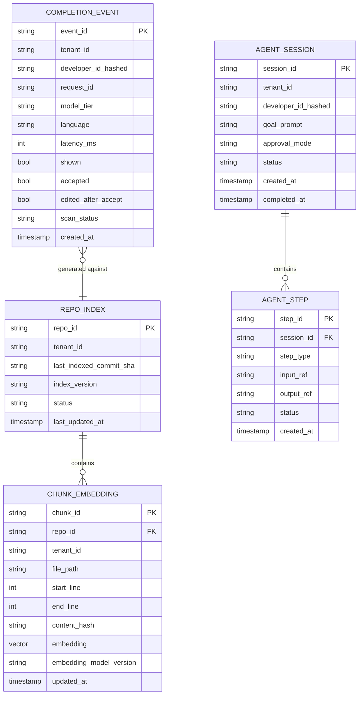

| Table | DB choice & why |
|---|---|
| `RepoIndex` / `ChunkEmbedding` | A **vector database** (e.g. a purpose-built ANN store, partitioned per tenant/repo namespace) — needs approximate-nearest-neighbor search over millions of high-dimensional vectors, which a relational or plain document store doesn't do efficiently. `tenant_id` is part of every key and every query filter, never optional — this is the field that prevents cross-tenant retrieval. |
| `CompletionEvent` | A high-write-throughput, append-only **wide-column/time-series store** (Cassandra-shaped) — this is the telemetry firehose, one row per shown suggestion, at fast-tier QPS volume. Never stores raw code by default — only hashes/lengths/booleans, unless a tenant has explicitly opted into richer diagnostic logging. |
| `AgentSession` / `AgentStep` | A regular **relational or document store** — comparatively low volume (agent sessions, not keystrokes), needs transactional-ish read-after-write for the developer to see their own session's live progress. |

**Cache key pattern (for the context-gathering service):** `ctx:{tenantId}:{repoId}:{commitSha
or index_version}` → the top-K retrieved chunk IDs for a recent query embedding, short TTL
(seconds), invalidated implicitly whenever `index_version` advances rather than explicitly purged.

**Why `developer_id_hashed`, not a raw user ID, in telemetry:** acceptance-rate analytics need to
know "did developer X accept this," not "who is developer X" for most downstream aggregation —
minimizing what's joinable back to a real identity is a privacy default, not an afterthought.

---

## Failure modes & mitigations

| Failure mode | Impact | Mitigation |
|---|---|---|
| **Stale repo index after a large refactor** (mass rename, big merge) | Retrieved context references code that no longer exists at those paths/lines; chat answers cite dead locations | Content-hash-based incremental re-index catches it within the normal save-triggered cadence; a periodic full re-index acts as a safety net; chat responses that cite a file should re-validate the reference still exists before presenting it as current |
| **Inference tier overloaded during a traffic spike** (e.g. a large org's workday start) | Fast tier can't keep up with 200K+ QPS; requests start queueing past the latency budget | Circuit-breaker on the fast tier: past a queue-depth or latency threshold, **fail open to no suggestion** rather than serve a late one; autoscale the fast tier on QPS, not on the capable tier's load, since they're independent fleets |
| **A secret is suggested from training-data leakage** (model reproduces a real-looking key seen during pretraining) | Severity-1 trust incident if shown and accepted | The synchronous [security gate](#deep-dive-secretvulnerability-scanning-gate) is the primary defense; secondary defense is per-tenant fine-tuning/retrieval staying scoped to the tenant's own code so a *different* tenant's leaked secret can never surface in this tenant's suggestions |
| **Agent mode applies a bad multi-file edit** (breaks the build, silently changes behavior) | Developer trust damage, possible production incident if unreviewed | Default `approvalMode: review-before-apply` — nothing touches disk without a human accept per diff; even in auto-apply mode, every step is recorded so the session can be rolled back atomically on the first test failure |
| **Cross-tenant leakage in the vector index** (a query from Tenant A retrieves Tenant B's code) | Confidentiality breach, contractual/legal exposure | `tenant_id` (and often `repo_id`) is a mandatory partition/namespace key on every write and every query — never an optional filter — enforced at the storage layer, not just in application code |
| **Debounce/cancellation bug causes a request pile-up** (cancellation signal lost, superseded requests keep running) | Fast tier silently does 3x the real work per keystroke, capacity plan is wrong under load | Server-side request TTL as a backstop even if the explicit cancel is dropped — every fast-tier request has a hard max lifetime regardless of client behavior |

---

## Non-functional walkthrough

**Scaling the two tiers independently.** The fast (inline) tier autoscales on completion-request
QPS — a metric driven by how many developers are actively typing, largely time-zone/workday
shaped. The capable (chat/agent) tier autoscales on concurrent chat sessions and agent-session
count — a much smoother, lower-volume signal. Putting them on one shared fleet means a spike in
one starves the other; keeping them separate means a lunchtime lull in chat traffic never steals
capacity from the keystroke-driven fast tier, and vice versa.

**High availability: graceful "no suggestion" beats an error, every time.** The inline path has a
hard circuit breaker: if the fast tier can't respond inside its latency budget, the extension
shows nothing and the editor keeps working exactly as it would with the assistant disabled. This
is a stronger version of the "fail open" pattern used in the [typeahead guide](./37-Typeahead-Suggestion-FAANG-Guide.md)
— there, a missing suggestion is a minor UX gap; here, an editor that blocks or freezes waiting on
a completion is a much worse outcome than any missing suggestion.

**Consistency: two very different bars in the same system.**
- The **repo index** is allowed to be stale by seconds to low minutes — a completion based on a
  slightly-out-of-date view of a teammate's file is a minor quality miss, not a correctness bug,
  and trying to make it perfectly fresh (re-embedding on every keystroke) would cost far more
  than the staleness is worth.
- The **security gate**, by contrast, tolerates **zero** staleness or "eventually correct" —
  it must evaluate the exact suggestion about to be shown, synchronously, every single time.
  Say this contrast explicitly in an interview: *"Same system, two different consistency bars —
  eventual for context freshness, strict for safety — and conflating them is the mistake to avoid."*

---

## Security & compliance

- **Per-tenant code isolation.** Every piece of tenant code — raw files, embeddings, cached
  context, telemetry — is partitioned by `tenant_id` (and typically `repo_id`) at the storage
  layer, not merely filtered in application code. A vector index namespace-per-tenant (or a
  hard-enforced metadata filter with no query path that can bypass it) is what actually prevents
  the "Tenant A's retrieval surfaces Tenant B's code" failure mode above.
- **No cross-tenant leakage through model weights.** Any fine-tuning on a tenant's private code
  must stay scoped to that tenant's own served model or retrieval index — never mixed into a
  shared base model that other tenants' completions draw from.
- **Opt-in/opt-out of training on customer code.** Mirror the real-world posture this space has
  converged on: business/enterprise-tier accounts and organization-owned repositories are, by
  contractual default, **excluded** from any model-training data, governed by an explicit data
  processing agreement — while individual/consumer-tier accounts may default to an opt-out model
  instead. Whichever default is chosen, it must be an explicit, auditable per-tenant setting, not
  an implicit behavior — and private repository content at rest should never be used for
  training regardless of tier, with only interaction data (prompts/suggestions generated during
  active use) subject to the training-data policy at all.
- **On-prem / VPC deployment option for regulated enterprises.** For customers who cannot send
  code to a shared multi-tenant SaaS endpoint at all (financial services, defense, healthcare),
  offer a deployment mode where inference runs inside the customer's own VPC or on dedicated
  single-tenant infrastructure — code and embeddings never cross the tenant's network boundary.
  This is a materially different cost/ops profile from shared SaaS and should be scoped as a
  named deployment tier, not an afterthought bullet.
- **Respect `.gitignore` and explicit exclusion lists.** Files matching `.gitignore`, plus an
  explicit assistant-specific ignore list (for things developers want excluded from AI context
  but not from git, like generated fixtures), must never be read by the context-gathering
  service or embedded into the vector index in the first place — enforced at ingestion, not
  filtered out after the fact.
- **Auth & transport.** Standard OAuth2/OIDC for developer identity, mTLS between the editor
  extension and backend services, and encryption at rest for the vector index and telemetry
  stores — table stakes, worth naming briefly rather than dwelling on.

---

## Cost & trade-offs

**Inference cost per completion vs. acceptance-rate value.** At ~30% acceptance (the published
industry reference point) roughly 70% of fast-tier inference spend produces a suggestion nobody
uses. This is acceptable specifically *because* the fast-tier model is small/cheap and the cost
per call is a small fraction of a cent — the economics only work because of the two-tier split;
routing every inline request through the expensive capable-tier model would make that 70%
"wasted" spend a real cost problem instead of a rounding error.

**Cost of a fresh repo-wide index vs. staleness.** Re-embedding on every save (debounced, chunk-hash-scoped)
costs roughly proportional to how much code actually changes — cheap in steady state. The
alternative — batching re-indexing into, say, an hourly job — cuts embedding-model call volume
further but means a chat answer or a completion's repo-context can reference code that's been
rewritten in the last hour. The trade-off is the same shape as the typeahead guide's
rebuild-cadence discussion: **pick a number, state the staleness bound explicitly, and be ready
to defend it** rather than claiming perfect freshness is free.

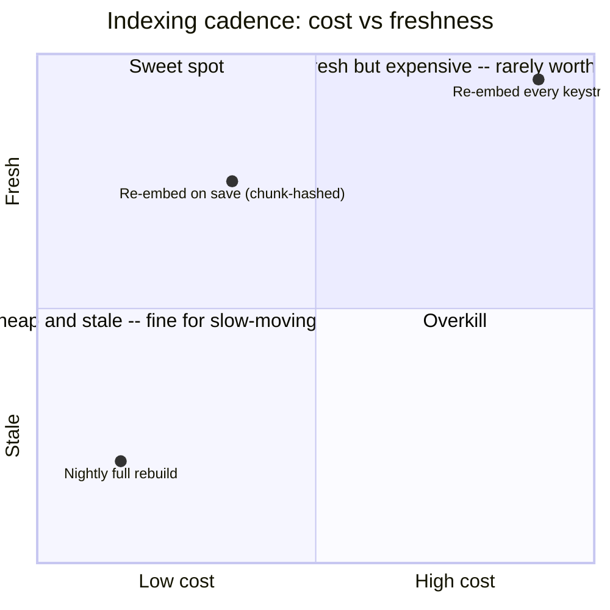

**Agent mode is the most expensive mode per unit of developer time.** A single agent session can
involve many tool calls and multiple full-file reads against the capable-tier model — cost per
session is easily an order of magnitude above a single chat turn. This is fine because agent
sessions are rare relative to inline completions (see the capacity estimation pie chart), but
it's the first place to look if inference spend needs trimming: capping max tool-call steps per
session, or requiring explicit human approval to continue past N steps, bounds worst-case cost
per session without touching the far-higher-volume inline path at all.

---

## Wrap-up: MVP vs. stretch

**In scope for an MVP:**
- Inline single-line and multi-line completion using FIM prompting, served from a dedicated
  low-latency model tier, with client debounce + server-side cancellation.
- Chat mode answering questions about the current repo, backed by a per-tenant vector index
  built via incremental, save-triggered re-embedding.
- The synchronous secret/vulnerability scanning gate on every output — this ships with v1, not as
  a later hardening pass, because the cost of skipping it even briefly is asymmetric with every
  other feature in this list.
- Basic telemetry (shown/accepted/rejected) feeding an offline ranking-quality feedback loop.

**Explicitly out of scope for an MVP (name these as future work, don't design them live unless
pushed):**
- Fully autonomous agent mode that applies multi-file edits **without** a human reviewing each
  diff — ship `review-before-apply` first, `auto-apply-with-rollback` later once trust is earned.
- Cross-repo organizational knowledge (patterns learned across every repo a company owns, not
  just the one currently open).
- Fine-tuning per-tenant models on that tenant's own code (as opposed to just retrieval/context —
  a materially bigger ML-ops and privacy commitment).

**Stretch goals, worth naming if asked "what's next":**
1. **Cross-repo organizational knowledge** — retrieval that spans a company's entire repo
   fleet, so a completion in Service B can draw on a convention established in Service A, not
   just the currently-open repo.
2. **Autonomous PR generation** — agent mode extended from "propose a diff for review" to "open
   a draft PR from a ticket description end-to-end," with CI as the gate instead of a human
   reviewing every intermediate diff.
3. **Personalized ranking from individual acceptance history** — the same "weighted blend of
   global + personal signal" idea from ranking in a typeahead system, applied here: a developer
   who always rejects a certain completion style should see less of it, without that preference
   ever leaking into another developer's suggestions.

---

## Golden rules

- **Most inline requests are supposed to be thrown away.** Provision the fast tier for requests
  *fired*, not requests *rendered* — cancellation saves rendering cost, not dispatch cost, unless
  it actually aborts the in-flight generation.
- **Debounce and cancellation are two different mechanisms, not one.** Debounce stops requests
  from being sent at all; cancellation stops an already-sent request from finishing. You need both.
- **Never let one model own both latency budgets.** A model sized for a 3-second chat answer is
  the wrong model for a 100ms ghost-text completion, full stop — two tiers, scaled independently.
- **FIM, not prefix-only.** The model needs to see code after the cursor, not just before it, or
  it duplicates or ignores what's already there.
- **Index incrementally, by content hash, never by full re-scan.** A one-function edit in a
  2,000-line file should trigger exactly one re-embedding call.
- **The security gate is the one place "never skip this for latency" is a hard rule.** It runs
  synchronously on 100% of outputs, from either tier, with zero tolerance for a missed secret.
- **Fail open, always.** No suggestion is an acceptable degraded state for the editor; a frozen
  or errored editor is not.
- **Agent mode proposes, it doesn't apply — by default.** Every multi-file diff is a pause point
  for human review unless the tenant has explicitly opted into auto-apply-with-rollback.
- **Tenant isolation is a storage-layer property, not an application-code filter.** `tenant_id`
  belongs in the partition key / namespace, not just in a `WHERE` clause that a bug could omit.
- **Two consistency bars in one system.** Eventual for repo-context freshness; strict,
  zero-tolerance for the safety gate. Never conflate the two when asked about consistency.

---

## How to identify this topic in an interview

- "Design GitHub Copilot / Cursor / an AI pair programmer."
- "Design a system that suggests code as a developer types."
- "How would you build a repo-aware coding chatbot / autonomous coding agent?"
- Any variant of "design an IDE feature" combined with "as the user types" + "must feel
  instant" points to this chapter's inline-completion mechanics specifically, as opposed to a
  general chat-product design (which would lean harder on retrieval/RAG and lighter on
  debounce/cancellation).
- A follow-up about "letting the AI make changes across multiple files" or "run tests
  automatically" is the agent-mode extension — treat it as a deep dive, not a redesign from
  scratch.

---

## Master cheat sheet

**One-liners:**
- AI code assistant = three coupled systems: a disposable-request inline-prediction problem, a
  fresh-per-request repo-context-retrieval problem, and a zero-tolerance trust/safety problem.
- Inline completion budget: p50 < 60ms, p90 < 100ms to first token. Chat/agent budget: seconds to
  minutes. Never route both through the same model tier.
- Debounce (client, stop sending) + cancellation token (server, abort in-flight) are two separate
  mechanisms — most fired inline requests are cancelled before completion, and capacity planning
  must account for requests *fired*, not requests *rendered*.
- FIM (fill-in-the-middle): send prefix + suffix around the cursor, model generates only the gap
  — GitHub's own data attributes a ~10% relative quality lift to adding suffix awareness.
- Context comes from three sources merged per request: open files (free), recently edited files
  (cheap), and a repo-wide vector index (the expensive one) — built incrementally via
  content-hash-scoped re-embedding on save, never a full re-scan per keystroke.
- Two-tier model routing by mode, not by load: small/fast model for inline, larger/capable model
  for chat and agent — they scale on different signals (keystroke volume vs. session count) and
  must scale independently.
- The security gate (secret + vulnerable-pattern scanning) is synchronous, blocking, and runs on
  100% of outputs from either tier — the one component where "skip it for latency" is never
  acceptable.
- Agent mode = a bounded tool-use loop (read_file → propose_diff → run_tests → re-plan on
  failure → report), defaulting to human-approve-every-diff before anything touches disk.
- Tenant isolation is enforced at the storage/namespace layer for code, embeddings, and
  telemetry alike — never an application-level filter that a bug could bypass.
- Fail open everywhere on the inline path: no suggestion beats a slow or errored one, always.
- Consistency has two different bars in this one system: eventual for repo-index freshness,
  strict/zero-tolerance for the safety gate before a suggestion is shown.

**Formula chain:**
```
inline_QPS_fired      = concurrently_active_developers x requests_per_developer_per_sec
inline_QPS_rendered   = inline_QPS_fired x (1 - cancellation_rate)
chunk_count           = repo_LOC / avg_lines_per_chunk
vector_index_size     = chunk_count x embedding_dim x bytes_per_float (+ ~20% metadata overhead)
```

**Numbers:** <100ms p90 inline time-to-first-token · seconds-to-minutes for chat/agent · ~30%
industry-reference acceptance rate · ~65-70% illustrative inline-request cancellation rate ·
~6-7GB vector index for a 50M-LOC monorepo at ~1,536-dim embeddings · content-hash-scoped
incremental re-embedding, not full re-scan, on every save.
