# Design an IP Allow/Block-List Service (Government-Fed Sanctions/Geo-Block) — FAANG Interview Guide

> Source chapter type: access-control / compliance-gating system where the **source of truth is
> external and slow**. This is a distinct interview genre from most design rounds — the team does
> not own the data, cannot make it faster, and cannot call it synchronously per request. Everything
> in this guide exists to answer one question well: *"the authoritative data lives in a system you
> don't control and it's slow — now what?"*

## Mental model

Picture a national/regulatory body — an interior ministry, a telecom regulator, a sanctions
authority — that publishes, at its own pace, a list of IP ranges (often as CIDR blocks) tagged
with a country or a decision: allowed, blocked, sanctioned. Your job is to let or deny **every
single request**, at production QPS, in single-digit milliseconds, using that list as ground
truth — while the system that owns the list updates once a day (if you're lucky), has no webhook,
paginates at a crawl, rate-limits you to a handful of calls a minute, and goes down for hours with
no notice and no SLA you can enforce.

This is **not** a rate-limiter problem, though it borrows the IP-matching mechanics. It's not a
caching problem in the usual sense either, though caching is part of the answer. The one sentence
that unlocks the whole design:

**"Decouple the slow, external, rate-limited ingestion of the list from the fast, internal,
all-local serving of decisions — and never let the second one wait on the first."**

Everything below falls out of taking that sentence seriously: an ingestion pipeline that is the
*only* thing in the whole system allowed to talk to the government API, a compact in-memory
structure every replica can hold fully, a warm-start boot sequence sourced from the last
known-good snapshot (never empty, never random), and an explicit, stated policy for what happens
when the external feed goes dark for longer than anyone hoped.

**The one picture to remember forever:**

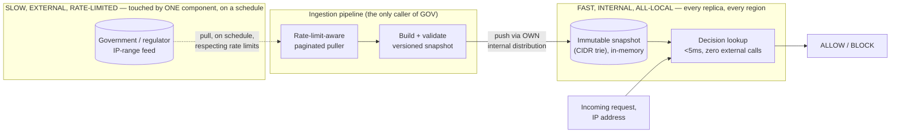

**Memory hook:** *"One pipeline talks to the government. Every replica talks to that pipeline's
output, never to the government, never to a peer's cache."*

---

## Table of contents
[How to Identify This Topic](#how-to-identify-this-topic-in-an-interview) ·
[Interview Playbook](#interview-playbook) · [Requirements](#requirements-clarification) ·
[Capacity Estimation](#capacity-estimation-worked) · [API Design](#api-design) ·
[High-Level Architecture](#high-level-architecture) ·
[End-to-End Walkthroughs](#end-to-end-request-walkthroughs) ·
[Architecture Evolution v1→v2→v3](#architecture-evolution-v1--v2--v3) ·
[Deep Dive: IP Matching Structure](#deep-dive-cidr-matching-data-structure) ·
[Deep Dive: Cache Sizing & Refresh](#deep-dive-cache-sizing--refresh-strategy) ·
[Deep Dive: Warm-Up / Cold-Start](#deep-dive-warm-up--cold-start) ·
[Deep Dive: Fail-Open vs Fail-Closed](#deep-dive-fail-open-vs-fail-closed-policy) ·
[Deep Dive: Multi-DC Distribution](#deep-dive-multi-dc-distribution--consistency) ·
[Data Model](#data-model) · [Failure Modes](#failure-modes--mitigations) ·
[Non-Functional Walkthrough](#non-functional-walkthrough) ·
[Security & Compliance](#security--compliance) · [Cost & Trade-offs](#cost--trade-offs) ·
[Wrap-Up](#wrap-up-mvp-vs-stretch) · [Golden Rules](#golden-rules) ·
[Cheat Sheet](#master-cheat-sheet)

---

## How to identify this topic in an interview

- "Design a system that blocks/allows users by IP or country, where the list is maintained by a
  government/regulatory body."
- "The upstream data source updates slowly / has rate limits / goes down often — how do you serve
  decisions in real time anyway?"
- Any variant of "the source of truth isn't yours to control and it's slow" combined with a
  real-time decision requirement. If the interviewer emphasizes *how bad* the external system is
  (slow, flaky, rate-limited, no push notifications), that emphasis is the actual test — they want
  to see if you architect around it or keep re-describing the constraint back at them.
- A follow-up about "what if this needs to work across 10 data centers" is testing whether you
  reach for **cache-to-cache sync** (wrong — breaks on latency and consistency) or a **shared
  versioned snapshot distributed through your own infra** (right).

---

## Interview playbook

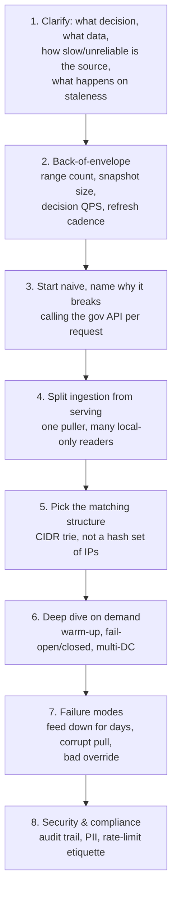

**What the interviewer is actually grading at each step:**
- Step 3: do you know, unprompted, that calling a slow rate-limited external system inside the
  request-serving path is disqualifying — not just slow, but capacity-limited by someone else's
  quota?
- Step 4: do you separate "keep the data fresh" from "answer a lookup" the same way a search
  system separates crawling from query-serving?
- Step 6: when pushed to multi-DC, do you reach for "sync caches to each other" (the wrong answer
  a real candidate gave here) or "one canonical snapshot, pulled independently by every DC from
  owned infrastructure"?
- Throughout: do you actually **use** the answers to your clarifying questions (refresh cadence,
  rate limit, staleness tolerance) to change concrete numbers and decisions later in the design,
  or do you ask them and then design as if you never got an answer?

---

## Requirements clarification

### Functional

| # | Requirement | Notes |
|---|---|---|
| F1 | For any inbound request's IP, return a decision — `ALLOW`, `BLOCK`, or a country/region code — inline in the request path | The core, highest-volume operation |
| F2 | The decision data (IP ranges → country/decision) is owned and published by an external, third-party government/regulatory system | This is the whole problem — not a detail |
| F3 | Support manual overrides (allow-list or block-list specific IPs/ranges regardless of what the feed says) | Business exceptions, emergency mitigations, false-positive fixes |
| F4 | Every decision is auditable after the fact: which rule matched, which snapshot version was live, when | Frequently a hard compliance/legal requirement, not a nice-to-have |
| F5 | Operators can see current feed freshness/staleness and force a manual re-pull | Operational visibility into a dependency you don't control |

### Non-functional

| Requirement | Target | Why this number |
|---|---|---|
| Decision latency (p99) | < 5-10ms, fully in-process | This check gates real user traffic; it must be cheaper than the rest of the request pipeline, not a bottleneck |
| Decision QPS | Matches total inbound traffic — can be hundreds of thousands to millions of QPS globally | Every request needs a decision; there is no sampling here |
| Availability of the decision path | Very high — the government feed's downtime must **never** become your downtime | This is the single most important non-functional requirement in this chapter |
| Freshness of the underlying list | Depends entirely on clarifying answers — commonly hours to a day | Cannot be tighter than the source publishes; don't over-promise real-time accuracy you can't deliver |
| Consistency across regions/DCs | Eventual, with a **stated, monitored** bound (e.g. "no DC serves a snapshot more than N minutes older than the newest published one") | Perfect synchronization across every DC the instant a new snapshot lands is neither necessary nor achievable against a slow external source |
| Auditability | Strict — every decision traceable to a rule + snapshot version | This is a compliance system; "we think it was probably rule X" is not an acceptable answer during an audit |

**Clarifying questions worth asking the interviewer up front — and what each answer changes:**

| Question | If the answer is... | ...then this changes |
|---|---|---|
| "How often does the government system publish updates?" | Daily batch file | Refresh is a scheduled pull, not event-driven; staleness SLA is measured in hours, not seconds |
| "Is there a rate limit or pagination on their API?" | Yes, e.g. 10 requests/min, 1,000 rows/page | A single full pull takes real, computable time (see capacity estimation) — this rules out ever calling it synchronously per user request, and shapes the ingestion pipeline's own pacing |
| "What's their historical uptime — do they go down?" | Frequently, for hours, with no SLA | The design must be able to serve correct-as-of-last-successful-pull decisions indefinitely through an outage — this directly drives the fail-open-vs-fail-closed deep dive |
| "Is a stale decision (yesterday's list) legally acceptable, or must it reflect this instant's list?" | Stale is acceptable up to some bound | Confirms "keep serving last known-good" is the right default, and gives you the number to alert on |
| "Do we decide at the individual-IP level, or CIDR range / ASN / country level?" | CIDR ranges | Confirms the matching structure must be a range/trie structure, not a hash set of exact IPs — get this wrong and the whole design is wrong shape |

**Say this out loud in the interview:** *"I'm going to treat 'the source is slow and unreliable'
as the central constraint, not a footnote — every component from here on exists to make sure that
slowness never touches the request-serving path."*

---

## Capacity estimation, worked

Formula chain: **published range count → snapshot size → decision QPS → time to fully ingest one
refresh cycle given the source's own rate limit.**

```
Given (illustrative, state your own assumptions out loud):
  Published IP ranges (IPv4 + IPv6 CIDR blocks, all countries)  = 500,000
  Bytes per range entry (start_ip 16B, prefix_len 1B,
    decision/country code 2B, source rule id 4B, ~10B overhead) ~= 40 bytes
  Raw snapshot size                                              = 500,000 x 40B ~= 20 MB
  -> trivially fits fully in memory on every single replica. This dataset is SMALL. The hard part
     is never "does it fit," it's "how do we keep it fresh without hammering the source."

Decision QPS:
  Global inbound requests needing a check                       = 300,000 QPS peak (illustrative)
  -> every one of these is served from the LOCAL in-memory structure, zero external calls.
     This number does not touch the government system at all -- it only touches the ingestion
     pipeline's pull cadence, which is a completely separate, much smaller number below.

Ingestion pull, respecting the source's own rate limit:
  Government API rate limit                = 10 requests/minute
  Rows returned per page                    = 1,000
  Total rows to pull for a full refresh     = 500,000
  Pages needed                              = 500,000 / 1,000 = 500 pages
  Time to pull one FULL refresh             = 500 pages / 10 pages-per-minute = 50 minutes
  -> a single full re-pull of the entire list takes ~50 minutes, even running as an offline batch
     job with nothing else contending for the rate limit. This is the number that makes "call the
     government API per incoming request" obviously impossible: at 10 requests/minute, the source
     supports roughly 0.17 QPS -- against a serving requirement of 300,000 QPS, that's a gap of
     roughly 1.8 million times. No caching layer alone closes a gap that size; only NOT calling it
     per-request does.

Delta pulls, if the source supports "changes since X" instead of always a full dump:
  Illustrative daily change volume          = ~2,000 ranges added/removed/modified per day
  Pages needed for a delta pull             = 2,000 / 1,000 = 2 pages
  Time to pull a delta                      = 2 pages / 10 pages-per-minute ~= 12 seconds
  -> if delta pulls are available, refresh can run far more often (e.g. hourly) at negligible cost
     against the rate limit; if only full dumps are available, refresh cadence is bounded by that
     ~50-minute cost plus whatever safety margin you build in before triggering the next one.

Snapshot distribution across DCs:
  Number of DCs/regions                     = 15
  Snapshot size per DC                       = ~20 MB (compiled trie, see matching-structure deep dive)
  Total distribution payload per refresh    = 15 x 20 MB = 300 MB
  -> distributed through YOUR OWN internal object storage / CDN / replication, not by having 15
     DCs each independently re-pull the government API (which would multiply load against a
     source you don't control by 15x for zero benefit).
```

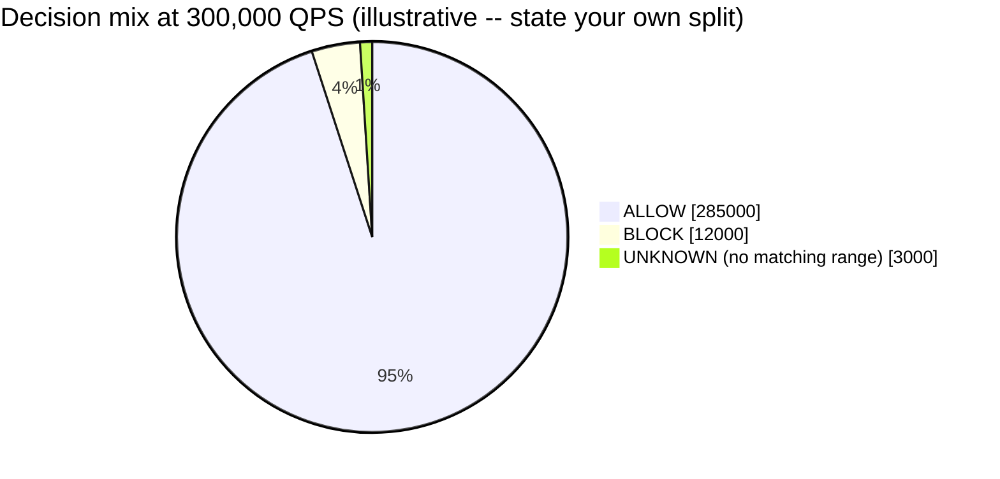

The `UNKNOWN` slice is small but never zero — it's the reminder that "no range matched" is a
distinct, real outcome (see the [fail-open deep dive](#deep-dive-fail-open-vs-fail-closed-policy))
and must be handled explicitly rather than assumed away in capacity planning.

**Redo-the-chain test:** if the interviewer says the source only supports a full dump (no delta),
double the range count to 1,000,000 — pull time roughly doubles to ~100 minutes, which pushes your
realistic refresh cadence from "a few times a day" toward "once or twice a day," which in turn is
the number you'd quote back when asked "how stale can this data get."

**The number worth memorizing:** the gap between what the source can sustain (a handful of
requests per minute) and what you must serve (hundreds of thousands of QPS) is not a "make the
cache bigger" gap — it's an existence proof that ingestion and serving must be two entirely
separate systems.

---

## API design

Two very different contracts: an internal, ultra-hot lookup path, and a slow, scheduled,
external-facing ingestion path that nothing user-facing ever touches directly.

### `GET /v1/ip-check?ip=203.0.113.7` (internal, called on every gated request)

```json
{
  "ip": "203.0.113.7",
  "decision": "BLOCK",
  "matchedRange": "203.0.113.0/24",
  "countryCode": "XX",
  "ruleSource": "gov-feed",
  "ruleId": "r_88213",
  "snapshotVersion": "2026-07-23T04:00:00Z_v512",
  "latencyMicros": 42
}
```

| Field | Notes |
|---|---|
| `decision` | `ALLOW`, `BLOCK`, or `UNKNOWN` (no matching range — see [fail-open/closed deep dive](#deep-dive-fail-open-vs-fail-closed-policy) for what `UNKNOWN` resolves to) |
| `snapshotVersion` | The exact versioned snapshot this decision was computed against — this single field is what makes every decision auditable and reproducible after the fact |
| `latencyMicros` | Should be microseconds, not milliseconds — this is a local in-memory trie lookup, not a network call |

**No external call ever happens on this path.** If that's not true, the design is wrong — say
this explicitly.

### `POST /v1/overrides` (admin, manual allow/block exceptions)

```json
{
  "cidr": "198.51.100.0/24",
  "decision": "ALLOW",
  "reason": "Confirmed false positive, ticket INFRA-4521",
  "createdBy": "ops_user_882",
  "expiresAt": "2026-08-23T00:00:00Z"
}
```

Overrides are layered **on top of** the government snapshot at lookup time (checked first, most
specific match wins) rather than mutating the snapshot itself — this keeps the snapshot an
immutable, versioned, government-sourced artifact, and the override list a small, separately
audited, human-authored layer.

### `GET /v1/admin/feed-status` (operational visibility into the dependency you don't control)

```json
{
  "lastSuccessfulPullAt": "2026-07-23T04:00:00Z",
  "lastAttemptAt": "2026-07-23T16:00:00Z",
  "lastAttemptStatus": "FAILED_TIMEOUT",
  "currentSnapshotVersion": "2026-07-23T04:00:00Z_v512",
  "stalenessHours": 14.2,
  "stalenessAlertThresholdHours": 24
}
```

This endpoint exists because "is our dependency currently degraded" is a question you must be
able to answer in seconds during an incident, not something you discover from a customer
complaint.

**The one sentence worth saying about the API surface:** *"The hot path never talks to the
government system, period — it talks to a local, versioned, in-memory snapshot, and every
response carries the exact version it was computed from so any decision can be explained after
the fact."*

---

## High-level architecture

### Architecture evolution (v1 → v2 → v3)

**v1 — the naive (and wrong) first answer:**

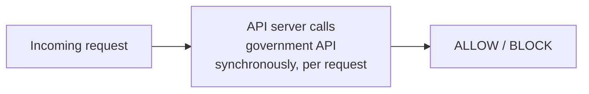

**Why it breaks:** the government API sustains on the order of single-digit-to-low-double-digit
requests per **minute** (its own rate limit), not per second. Against a serving requirement of
hundreds of thousands of QPS, this isn't slow — it's off by roughly six orders of magnitude. Every
request also now inherits the government system's own availability, which the earlier capacity
work already establishes as unreliable and prone to multi-hour outages. This design would fall
over in the first minute of real traffic, rate-limited into oblivion, and would go fully down the
next time the government system does.

**v2 — a shared cache added in front of the government API:**

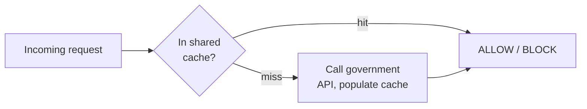

**Why it breaks:** this is the trap a lot of candidates fall into, because it *looks* like the
standard cache-aside pattern that solves most "external dependency is slow" problems. It doesn't
solve this one, for two reasons. First, a **cache miss still calls the government API inline**,
on the request path, for every never-before-seen IP — under any burst of new/unusual traffic (a
scan, a bot wave, simple organic growth into a new IP block) you get a **thundering-herd of
concurrent external calls**, hitting the exact rate limit that broke v1, just less often. Second,
and more fundamentally: this design has no answer for **how you ever get the full list in the
first place** — a lazy, request-driven cache only ever learns about IPs someone has actually
requested; an IP nobody has queried yet is invisibly `UNKNOWN` forever, which is not how a
compliance block-list is supposed to work (you need to know an IP is blocked *before* the first
request from it arrives, not after).

**v3 — the real system: ingestion and serving fully decoupled:**

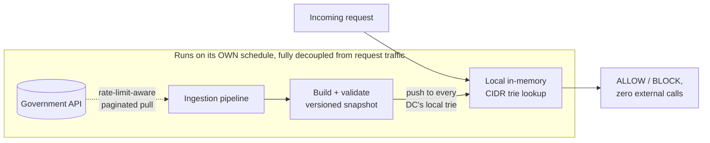

**What v3 fixes, one line each:** the request path never calls, waits on, or is capacity-bounded
by the government system at all; the *entire* list is proactively pulled and pushed everywhere
before any request needs it, so there is no such thing as an "unseen IP" gap; and the government
system's own rate limit and downtime only affect how *fresh* the snapshot is, never whether a
decision can be made right now.

---

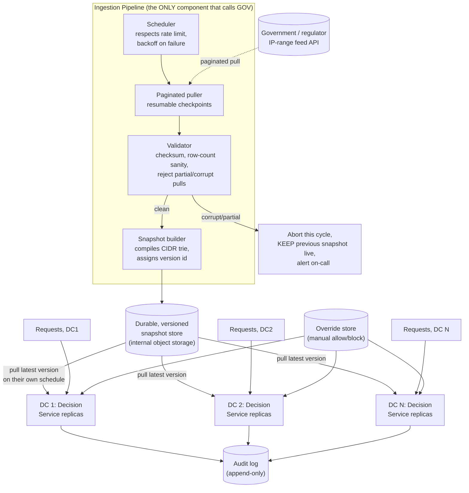

| Component | Role |
|---|---|
| Scheduler | Owns the *only* clock in the system allowed to trigger a call to the government API — respects its rate limit, exponential backoff on failure, and never lets two overlapping pulls run at once |
| Paginated puller | Walks the government API page by page, with resumable checkpoints so a mid-pull failure doesn't waste the whole ~50-minute pull budget from the capacity estimate |
| Validator | Checksums the pulled data and sanity-checks row counts before anything downstream trusts it — a partial or corrupt pull must never become live (see [failure modes](#failure-modes--mitigations)) |
| Snapshot builder | Compiles the validated raw rows into a compact, queryable structure (the [CIDR trie](#deep-dive-cidr-matching-data-structure)) and stamps it with an immutable version id |
| Durable snapshot store | The one place every DC pulls from — internal, fast, fully within your control, unlike the government API |
| Decision service replicas | Hold the *entire* snapshot in memory, serve every lookup locally, and independently pull new versions from the snapshot store on their own schedule — never from a peer replica, never from the government directly |
| Override store | A small, separately-audited layer checked before the government-sourced snapshot, for manual exceptions |
| Audit log | Every decision, tagged with the exact snapshot version and matched rule, append-only |

---

## End-to-end request walkthroughs

The deep dives below zoom into individual mechanisms in isolation. These two traces walk **every**
component in the v3 architecture above, in order, for one concrete case each — if you can draw
either from memory, you've internalized the whole design, not just its parts.

### Walkthrough 1 — a normal decision request (happy path)

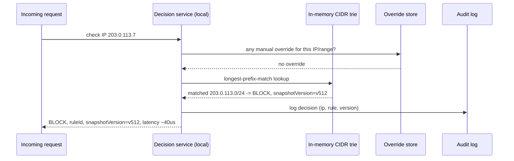

Every hop here is **local** — no network call outside this one service, which is the entire point
of the v3 architecture.

### Walkthrough 2 — a full refresh cycle while the government API is degraded (edge path)

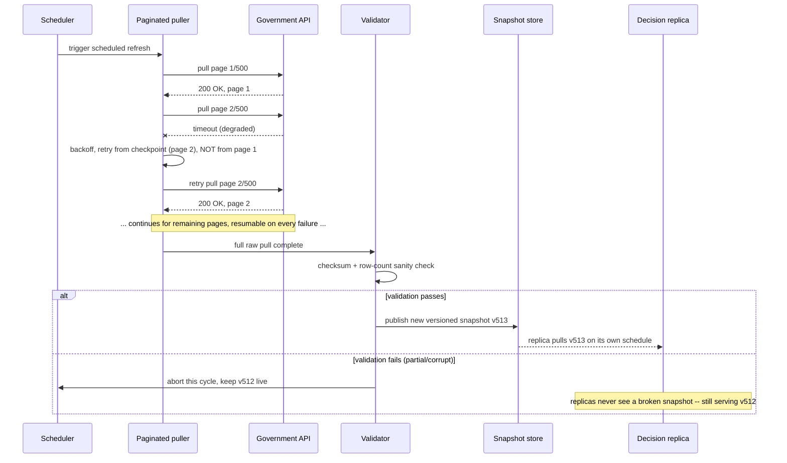

The load-bearing detail: a mid-pull failure resumes from its **checkpoint**, not from scratch —
losing page 2 doesn't waste the ~50-minute budget already spent on the rest of the pull, and a
failed validation never reaches a replica at all.

---

## Deep dive: CIDR matching data structure

The wrong instinct is a hash set of individual IP addresses — it doesn't work here, for a simple
reason: the government feed publishes **ranges** (`203.0.113.0/24`), not individual addresses, and
the IPv4 space alone is 4.3 billion addresses (IPv6 is astronomically larger) — you cannot and
should not enumerate every address in a /24 into a hash set.

The right structure is a **binary trie over the IP's bits (a Patricia/radix trie)**, used for
longest-prefix-match — the same data structure real routers and firewalls use for this exact
problem.

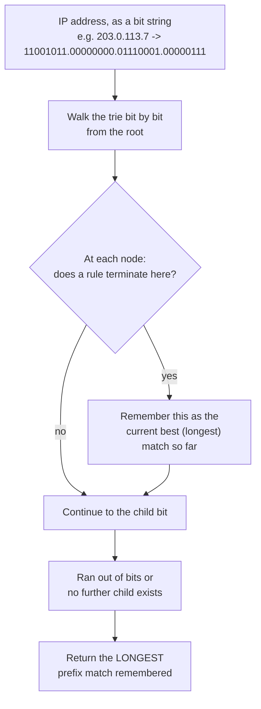

**Why longest-prefix-match matters:** the feed can (and does) contain overlapping ranges at
different specificities — e.g. `203.0.0.0/16` marked `BLOCK` (a broad regulatory rule) and
`203.0.113.0/24` marked `ALLOW` (a specific carve-out, like a verified business exception within
that broader range). The correct decision for an IP inside `203.0.113.0/24` is the **more specific**
rule, `ALLOW` — a plain hash set or a naive linear scan gives no principled way to resolve this;
a trie walk naturally returns the longest (most specific) match.

**Sizing check, tied back to capacity estimation:** 500,000 ranges compiled into a trie is on the
order of a few million nodes at worst — comfortably tens of MB, matching the ~20 MB raw-data
estimate above. This fits fully in L3 cache or main memory on every single replica; lookup cost is
bounded by IP bit-length (32 for IPv4, 128 for IPv6) — effectively constant time, microseconds, not
milliseconds.

**IPv6 note, worth raising unprompted:** the same trie structure works for IPv6, just with a
128-bit walk instead of 32-bit. Don't let the design silently assume IPv4-only unless the
interviewer confirms that's in scope — a government feed covering "all internet traffic" almost
certainly includes IPv6 ranges today.

**Interview cheat-sheet:** *"CIDR ranges need a prefix trie for longest-prefix-match, not a hash
set of individual addresses — the feed publishes ranges, some of them overlapping at different
specificities, and the most-specific match has to win."*

---

## Deep dive: cache sizing & refresh strategy

Already computed in detail in [capacity estimation](#capacity-estimation-worked): a ~20 MB
snapshot, comfortably held in full on every replica, refreshed on a cadence bounded by the
source's own rate limit (~50 minutes for a full pull at the illustrative numbers, seconds if delta
pulls are available).

**The refresh policy that follows from those numbers:**

| | Full re-pull only | Delta pulls available |
|---|---|---|
| Realistic refresh cadence | A few times a day, with a safety margin so two pulls never overlap | As often as hourly, or even more frequent, since a delta pull costs a tiny fraction of the rate-limit budget |
| Staleness bound to quote in an interview | Hours, stated explicitly (e.g. "at most ~6-8 hours stale, by design") | Much tighter — potentially under an hour |
| Why not "as often as possible" | Every pull consumes rate-limit budget the source controls, not you — pulling more aggressively risks getting throttled or IP-banned by the very system you depend on | Same reasoning still applies, just with a much smaller per-pull cost |

**Never poll faster than you can safely afford to lose the ability to poll at all.** A government
system that gets hammered by an overly-aggressive client is exactly the kind of partner that
starts enforcing its rate limit harder, or revokes API access — the refresh cadence is a
trust-preserving choice, not just a performance one.

**Interview cheat-sheet:** *"Refresh cadence is bounded by the source's own rate limit, not by how
fresh you'd like the data to be — compute the real number (pull time given their rate limit,
their page size, and the dataset size) instead of asserting an arbitrary 'refresh every 5 minutes'
without checking it's even possible."*

---

## Deep dive: warm-up / cold-start

A newly deployed or restarted decision-service replica must **never** start serving with an empty
structure, and must never fabricate data (randomly generated ranges, or "just start allowing
everything until the first real pull finishes") — both of those either fail every check silently
or defeat the entire point of the system for however long the gap lasts.

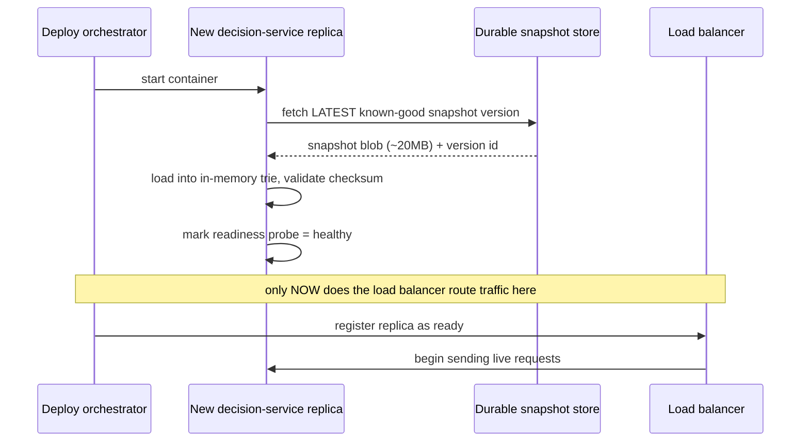

**The rule:** the readiness probe (whatever the orchestration platform's health-check mechanism
is) must depend on "snapshot loaded and validated," not just "process started." A replica that
accepts traffic before it has a real snapshot loaded will either error every request or, worse,
silently return `UNKNOWN`/default-allow for everything — a much more dangerous failure than simply
being slow to start.

**Where the "latest known-good snapshot" comes from:** the durable snapshot store, always — the
same store the ingestion pipeline writes to. It is never sourced from a peer replica (adds a
dependency on another replica being up and correct) and never regenerated from scratch by calling
the government API directly on boot (reintroduces exactly the rate-limit and latency problem this
whole design exists to avoid — and would mean a fleet-wide restart triggers a fleet-wide stampede
against the government system).

**Interview cheat-sheet:** *"Boot from the last known-good versioned snapshot in your own durable
store, gate readiness on that load succeeding, and never call the external system directly as part
of any individual replica's startup — startup is a scaling event too, and it must scale the same
way normal traffic does: against your own infrastructure, not theirs."*

---

## Deep dive: fail-open vs fail-closed policy

This is the deep dive that most exposes whether a candidate has thought about what happens when
things go wrong for a *long* time, not just a few seconds. The government feed **will** go down
for hours, sometimes days, with no SLA. What does the decision service do?

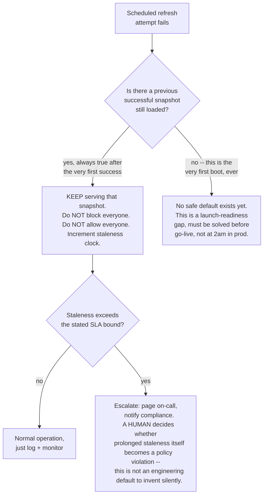

**Why "fail open" (allow everyone) and "fail closed" (block everyone) are both wrong as a
system-wide default here:** fail-open defeats the entire purpose of a compliance block-list the
moment the feed hiccups — an actual sanctioned actor could pass through during exactly the outage
window that a bad actor might engineer or simply benefit from. Fail-closed (block everyone, or
even just everyone `UNKNOWN`) turns a third-party outage into a **self-inflicted, complete outage
of your own product** — the government system going down should degrade your freshness, not your
availability.

**The actual answer:** keep serving the last known-good snapshot, indefinitely, while the
staleness clock ticks — because that snapshot was correct as of some real point in time and
remains the best available approximation of the truth. Layer a **staleness SLA** on top: past a
stated bound (a number that should come from legal/compliance, not be invented by engineering),
escalate to a human decision rather than silently continuing to serve increasingly-stale data
forever. This is the nuance a lot of candidates miss — the right answer isn't a single fixed
policy, it's "serve last-known-good, monitor staleness as a first-class metric, and hand the
question of 'how stale is too stale' to the people who own that risk."

**The one exception where "fail closed for this specific feature" might be the right call:** if
the *legal* consequence of serving even one decision based on data older than some hard regulatory
bound is worse than an outage of the gated feature — that's a business/legal call to make
explicitly and in advance, encoded as the staleness SLA threshold, not an engineering improvisation
during an incident.

**Interview cheat-sheet:** *"Default to serving the last known-good snapshot through an outage of
the external source — that's usually correct because staleness is a much smaller harm than a
false allow-everyone or a self-inflicted block-everyone. But say out loud that 'how stale is too
stale to keep serving' is a policy question with a real answer, not something to leave undefined."*

---

## Deep dive: multi-DC distribution & consistency

This is the exact point where the real candidate feedback that inspired this guide identified the
gap: asked to scale to multiple data centers, the instinct was **cache-to-cache sync** — and it
falls apart on inspection.

**Why cache-to-cache sync breaks:**

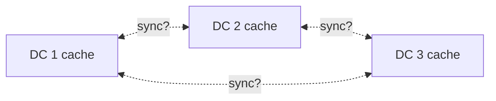

- **No single leader.** Which cache is the source of truth for the others to sync from? If DC1
  updates first and pushes to DC2 and DC3, DC1 has just quietly become a hidden single point of
  failure and a hidden bottleneck — exactly the topology the multi-DC move was supposed to avoid.
- **Latency compounds with every hop.** Syncing DC1 → DC2 → DC3 in sequence means DC3's freshness
  now depends on two network hops instead of one, and on DC2 being healthy.
  Fanning out DC1 → {DC2, DC3} directly avoids the hop-count problem but reintroduces "which node
  is the leader."
  For 15 DCs, either topology means either a hidden leader or an N² mesh of pairwise sync
  relationships to reason about — an operational nightmare with no compensating benefit.
- **It doesn't touch the actual bottleneck.** The problem was never "how do caches talk to each
  other" — it was "how do we get data from a slow external source into many places." Cache-to-cache
  sync solves a problem this system doesn't have, while leaving the real one (how does data
  originate) unsolved or, worse, implicitly re-introduces 15 independent pulls against the
  government API's rate limit if each DC's cache miss still falls back to calling the source
  directly.

**The actual answer — already the v3 architecture above, restated for multi-DC explicitly:**

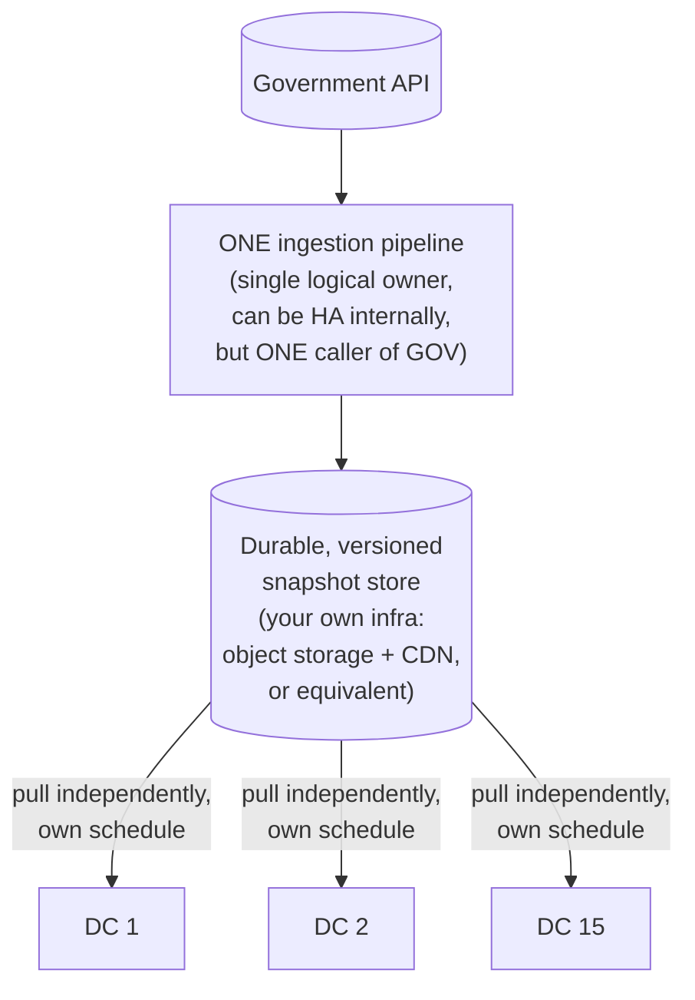

Every DC pulls the **same immutable, versioned artifact** from infrastructure you own and control
(fast, reliable, no external rate limit) — not from a peer DC (no leader ambiguity, no hop-count
latency, no N² mesh) and not from the government system directly (no 15x multiplication of load
against a source you don't control). Consistency becomes simple to reason about: every DC is
running *some* version of the snapshot, each version is immutable and independently valid, and the
only property to monitor is **how far behind the newest version any given DC is allowed to lag**
— a single, explicit, boring number, instead of an open-ended cache-sync consistency problem.

**Geo-latency angle, if pushed further:** even with hint that "requests should hit the nearest DC
for latency," the answer doesn't change — nearest-DC routing decides *where a request lands*,
which is orthogonal to *how that DC got its data*. Every DC still independently pulls the same
canonical snapshot from the shared store; geo-routing the request traffic and geo-distributing the
snapshot are two unrelated concerns solved by two unrelated mechanisms, and conflating them is the
mistake to avoid.

**Interview cheat-sheet:** *"Multi-DC doesn't mean 'sync N caches to each other' — it means 'N
independent pull targets, all pulling the same immutable versioned artifact from infrastructure
you own.' There is no leader, no mesh, and the government API is called exactly once per refresh
cycle, from exactly one place, no matter how many DCs you have."*

---

## Data model

**Snapshot version lifecycle** — the one state machine worth drawing from memory, since every
failure mode in this chapter is really a statement about what can go wrong at one of these
transitions:

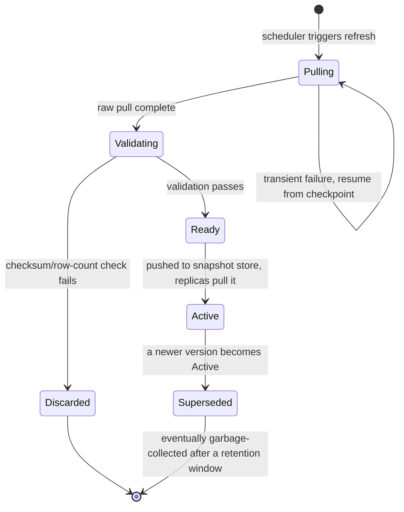

`Discarded` never reaches `Active` — this is the state diagram's way of encoding the failure-modes
table's "a partial/corrupt pull must never become live" rule as something structurally impossible,
not just a convention.

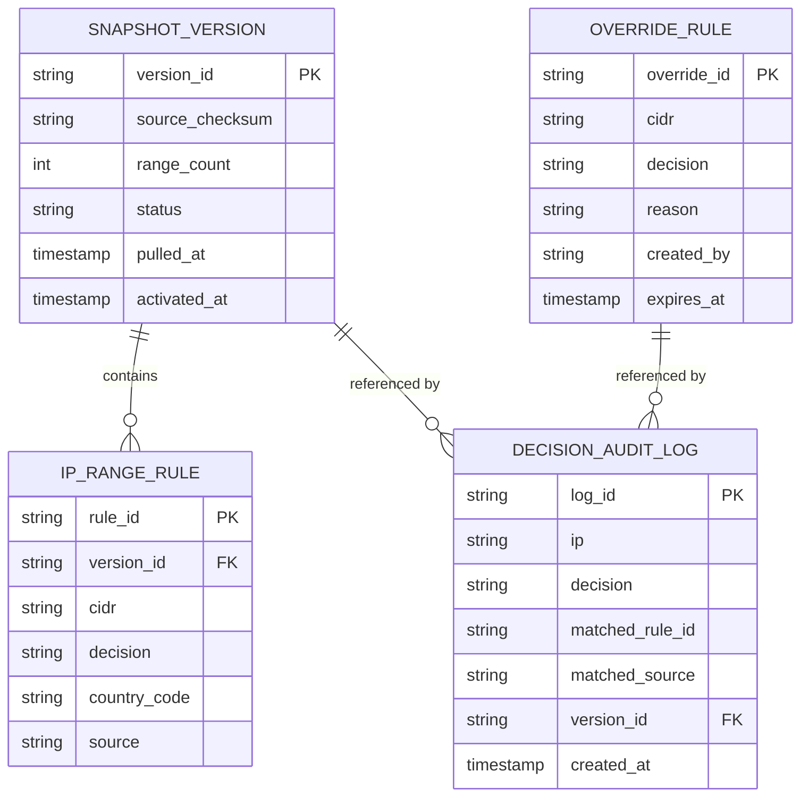

| Table | Storage choice & why |
|---|---|
| `SnapshotVersion` / `IPRangeRule` | Compiled into the **in-memory trie blob** for serving, but also persisted in durable object storage in raw/relational form — the trie is a serving-optimized derivative, the relational rows are the auditable record of exactly what a version contained |
| `OverrideRule` | Small, low-volume, relational store — human-authored, so it needs normal CRUD, review, and expiry semantics that the bulk government data doesn't |
| `DecisionAuditLog` | High-write-throughput, append-only, time-series-shaped store (this is the highest-volume table in the system, one row per gated request) — partitioned/retention-managed by time, never mutated after write |

**Why every audit row carries `version_id`, not a timestamp alone:** a timestamp tells you roughly
when; the version id tells you **exactly** which set of rules was active, which is what "reproduce
this decision during a compliance audit" actually requires — re-deriving "which snapshot was live
at 14:32:07 on July 23rd" from timestamps alone is fragile across deploys, clock skew, and
overlapping refresh windows.

---

## Failure modes & mitigations

| Failure mode | Impact | Mitigation |
|---|---|---|
| **Government feed unreachable for an extended period** | Snapshot goes stale beyond the normal refresh cadence | Keep serving the last known-good snapshot indefinitely (see [fail-open/closed deep dive](#deep-dive-fail-open-vs-fail-closed-policy)); alert once staleness crosses the stated SLA bound |
| **A pull returns a corrupt or partial dataset** (network cut mid-download, malformed page) | If loaded blindly, could silently drop or corrupt real rules — e.g. a large chunk of `BLOCK` rules vanishing | Validator checksums and sanity-checks row counts before any snapshot goes live; a failed validation aborts that cycle and keeps the previous good snapshot active — never a partial swap |
| **A bad manual override blocks a large legitimate range** | Real users/customers denied incorrectly | Overrides are logged with `createdBy` + `reason` and are reversible in seconds (delete the override row) without touching the government-sourced snapshot at all; consider requiring two-person approval for override changes above a size threshold |
| **Ingestion pipeline itself goes down** (not the government API — your own puller) | No new snapshots produced, but existing replicas keep serving the last one they loaded | Because ingestion and serving are decoupled, this failure mode degrades freshness only, never availability — the entire point of the v3 architecture |
| **A new DC/replica boots and can't reach the durable snapshot store** | Would otherwise start with no data | Readiness probe fails until a snapshot loads successfully — the replica never joins the traffic pool empty (see [warm-up deep dive](#deep-dive-warm-up--cold-start)) |
| **Government API silently changes its schema or pagination contract** | Puller could mis-parse data without erroring loudly | Schema/contract validation as part of the validator step, not just a raw checksum — a subtly-wrong parse of a changed API is more dangerous than an obvious failure, because it can produce a *plausible-looking* but wrong snapshot |
| **DCs drift further apart in snapshot version than intended** (one DC's pull path is degraded) | Two users in different regions could get different decisions for the same IP for a window of time | Monitor per-DC version lag as a first-class metric with its own alert threshold — this is the multi-DC consistency bound made concrete and observable, not just a design-doc claim |

---

## Non-functional walkthrough

**Scaling is almost entirely a non-problem on the read path.** Every replica holds the full ~20MB
structure and answers lookups purely in-memory — there is no shared bottleneck to scale, no
database to shard, no cache-hit-ratio to worry about. This is the opposite of most "distributed
cache" problems, and worth saying explicitly: the dataset here is small enough that "does it fit"
was never the hard question — "how do we keep many independent full copies fresh without abusing
an external rate limit" was.

**High availability is really "ingestion pipeline reliability plus a good degrade story," not
"read-path redundancy."** The read path is embarrassingly parallel and trivially horizontally
scaled by adding replicas. The actual availability risk in this system lives entirely in the
ingestion pipeline and its dependency on the government API — which is exactly why the design
isolates that risk into one component whose failure mode is "data gets stale" rather than letting
it become "requests fail."

**Consistency has one bound to state explicitly and monitor:** maximum version lag across DCs. Not
"strong" or "eventual" as an abstract label — a concrete number (e.g. "no DC serves a snapshot more
than 15 minutes older than the newest activated version," derived from your distribution
mechanism's own latency) that you can alert on.

---

## Security & compliance

- **Audit trail is often a hard legal requirement, not an engineering nice-to-have.** Every
  decision must be traceable to a specific rule and snapshot version, retained for whatever period
  regulation demands — design the audit log's retention and immutability with that in mind from
  day one, not as a later hardening pass.
- **IP addresses can be PII under some regulatory regimes (e.g. GDPR).** The audit log, override
  store, and any analytics built on top need to treat IP addresses with the same data-handling
  discipline as other personal data — retention limits, access controls, and right-to-erasure
  considerations where applicable.
- **Respect the government API's own rate limit as a trust relationship, not just a technical
  constraint.** Getting throttled or banned by the very source you depend on is a self-inflicted
  outage with no fast recovery path — credential/API-key handling, backoff behavior, and pull
  cadence should all be designed with "don't get us cut off" as an explicit goal.
- **Overrides need their own access control and approval trail**, separate from normal application
  deploys — a manual allow/block exception is a security-sensitive action and should be logged
  with who, why, and for how long, exactly like the audit log for automated decisions.
- **Data residency**, if the government/regulatory source requires processing to happen within a
  specific jurisdiction — worth confirming explicitly rather than assuming a globally-distributed
  ingestion pipeline is automatically compliant.

---

## Cost & trade-offs

**Full re-pull cadence vs. delta-pull cadence.** Already quantified in the capacity estimation:
full pulls are expensive against the rate-limit budget and push refresh cadence toward "a few
times a day"; delta pulls (if the source offers them) are nearly free against that budget and
allow much fresher data. If the interviewer asks "how would you push for fresher data," the honest
answer is "ask the source if they support incremental/delta queries" before trying to solve it
purely on your own side.

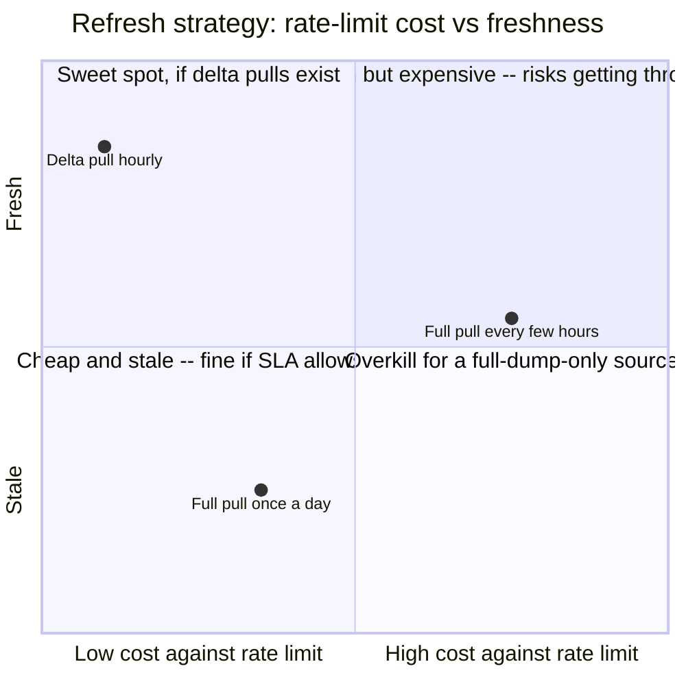

**Replication cost is low, and that's a deliberate contrast worth naming.** Unlike a large vector
index or a big analytical dataset, this snapshot is ~20MB — holding a full copy on every replica
in every DC is close to free. The expensive resource in this whole system is the government API's
rate-limit budget, not your own storage or compute — optimize the design around conserving *that*,
not around minimizing your own infrastructure footprint.

**Cost of getting the fail-open/fail-closed policy wrong is not primarily an infrastructure
cost.** It's a legal/trust cost (an actual sanctioned actor slipping through) or a business-outage
cost (blocking all legitimate users because a government system had a bad day) — call this out
explicitly if asked to compare "costs" in this design, since it's easy to default to only talking
about compute/storage dollars.

---

## Wrap-up: MVP vs. stretch

**In scope for an MVP:**
- A single ingestion pipeline that is the sole caller of the government API, respecting its rate
  limit, with resumable pagination and validation before any pull goes live.
- A versioned, immutable snapshot compiled into a CIDR trie, distributed to every DC through owned
  internal infrastructure.
- Warm-start boot sequence gated on a successful snapshot load — no replica ever serves from empty.
- A stated, monitored fail-open policy: keep serving the last known-good snapshot through an
  outage, with a staleness alert threshold.
- A basic audit log — every decision tagged with the matched rule and snapshot version.

**Explicitly out of scope for an MVP (name these as future work, don't design them live unless
pushed):**
- Sophisticated override-approval workflows (multi-person sign-off, staged rollout of overrides).
- Reconciling **multiple** independent government/regulatory feeds with potentially conflicting
  data — that's a materially harder problem, covered as its own chapter (see the
  [multi-source sanctioned-country payment-blocking guide](./51-Multi-Source-Sanctioned-Country-Payment-Blocking-FAANG-Guide.md)).
- Real-time push from the source (webhooks) — most government systems of this kind don't offer it,
  and the pull-based design here degrades gracefully whether or not it ever becomes available.

**Stretch goals, worth naming if asked "what's next":**
1. **Delta-pull support**, if/when the source exposes a "changes since" query — tightens the
   freshness bound substantially at near-zero extra rate-limit cost.
2. **Confidence-scored overrides** — instead of a binary allow/block override, a reputation-style
   score layered on top of the government-sourced binary decision, for a product that wants
   nuance beyond hard allow/deny.
3. **Cross-region snapshot pre-warming** — proactively pushing a new snapshot version to every DC
   the moment it's built, rather than each DC independently polling the snapshot store on its own
   schedule, shaving the tail of the version-lag bound further.

---

## Golden rules

- **Never call the slow external authority synchronously in the request-serving path.** Not "try
  to make it fast" — never call it there at all.
- **Decouple ingestion (slow, external, rate-limited, unreliable) from serving (fast, internal,
  fully local) as two entirely separate systems**, connected only by a versioned, immutable
  snapshot.
- **One logical component calls the external source, no matter how many DCs you scale to.** Every
  DC pulls the resulting snapshot from infrastructure you own, never from a peer DC and never from
  the source directly.
- **Warm-start from the last known-good snapshot on every boot.** Never empty, never random, never
  a live call to the external source as part of startup.
- **Staleness is a metric to monitor and alert on, not a binary up/down.** Serving last-known-good
  through an outage is usually correct; deciding when staleness itself becomes unacceptable is a
  policy question, not an engineering improvisation.
- **CIDR ranges need a prefix trie for longest-prefix-match, not a hash set of individual IPs.**
- **Multi-DC is "N independent pulls of one canonical artifact," never "N caches syncing to each
  other."** There is no leader in the right design, because there doesn't need to be one.
- **Every decision must be traceable to a rule and a snapshot version** — this is usually a
  compliance requirement, not just good observability.

---

## Master cheat sheet

**One-liners:**
- The core move: decouple slow/external/rate-limited **ingestion** from fast/internal/all-local
  **serving** — everything else in this chapter is a consequence of taking that split seriously.
- The gap between what the source can sustain (single-digit requests/minute) and what you must
  serve (hundreds of thousands of QPS) is orders of magnitude too large for any caching layer
  alone to close — only removing the source from the request path closes it.
- CIDR ranges need a **prefix trie / longest-prefix-match**, not a hash set of exact IP addresses.
- Boot sequence loads the **last known-good versioned snapshot** from your own durable store;
  readiness gates on that load succeeding, never on process start alone.
- Fail-open-vs-fail-closed default: **keep serving the last known-good snapshot indefinitely**
  through an outage of the source, with a monitored staleness SLA that escalates to a human
  decision past a stated bound — not a silently-invented binary policy.
- Multi-DC scaling is **N independent pulls of one canonical, immutable snapshot from owned
  infrastructure** — never cache-to-cache sync, which has no natural leader and doesn't address
  where the data originates in the first place.
- Every decision carries its exact `snapshotVersion` so it can be explained and reproduced during
  an audit — a timestamp alone isn't enough.
- This dataset is small (tens of MB) — full replication everywhere is nearly free; the scarce
  resource is the external source's rate-limit budget, not your own storage or compute.

**Formula chain:**
```
snapshot_size_bytes   = range_count x bytes_per_range_entry
pull_time_minutes     = (range_count / rows_per_page) / source_rate_limit_pages_per_minute
distribution_payload  = num_DCs x snapshot_size_bytes
max_version_lag       = distribution_latency + (refresh_interval / 2)   [worst case, per DC]
```

**Numbers:** <10ms p99 in-process decision latency · ~20MB snapshot for 500K CIDR ranges · a full
re-pull can take tens of minutes to over an hour depending on the source's own rate limit — compute
it, don't guess it · staleness bound stated in hours for a full-dump-only source, potentially
under an hour if delta pulls exist · one logical ingestion pipeline regardless of DC count.
