# Design a Sanctions & Watchlist (OFAC/AML) Transaction Screening System — FAANG Interview Guide

> Source chapter type: compliance-gating system, same genre as
> [the IP allow/block-list guide](./46-Design-an-IP-Allowlist-Blocklist-Service-FAANG-Guide.md) —
> real-time decisions against a slow, externally-owned authoritative list — but with a sharper
> edge: matching here is **fuzzy** (names, not exact IPs), the cost of a false negative is
> potentially criminal liability, and every "block" must be explainable to a regulator on demand.

## Mental model

Every payment, wire transfer, or new-customer onboarding at a bank, fintech, or payment processor
must be checked against government-published sanctions and watchlists (e.g. OFAC's SDN list,
UN/EU consolidated lists) **before** it's allowed to proceed. The lists are published as bulk
files, updated in batches (often daily, sometimes with an out-of-band emergency update when a new
entity is designated), and contain **names, aliases, dates of birth, addresses** — not clean
primary keys. A transaction says "pay John Smith" — the list has "John A. Smith," "Jon Smith,"
"Smith, John" as a known alias of a designated entity, and a hundred unrelated real John Smiths
who are not sanctioned at all.

This is three problems stacked on top of each other:

1. **The same external-authority-is-slow problem as the IP guide** — decouple ingestion of the
   list from serving screening decisions, exactly the same way.
2. **A fuzzy-matching problem, not an exact-match problem.** Legal names have typos, transliteration
   variants, nicknames, and deliberate obfuscation attempts. Exact string match misses real hits;
   over-eager fuzzy match drowns investigators in false positives.
3. **An asymmetric-cost decision problem.** A missed true positive (a real sanctioned entity's
   payment goes through) can mean regulatory fines, license loss, or criminal liability for the
   institution. A false positive (a legitimate "John Smith" gets flagged) costs a delayed payment
   and an analyst's time. These costs are **wildly** asymmetric, and the whole tuning of the
   matching system has to be justified against that asymmetry, explicitly.

**The one picture to remember forever:**

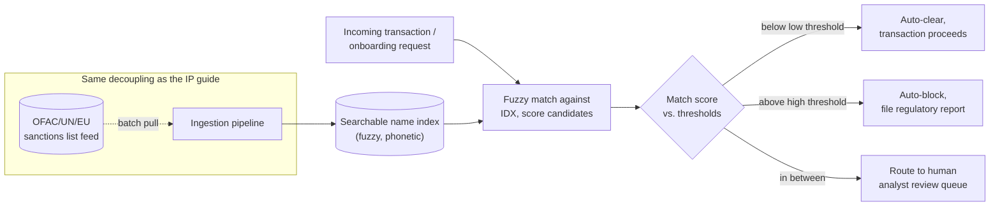

**Memory hook:** *"Same ingestion/serving split as any slow-authority system, but the serving
side isn't a lookup — it's a scored, three-way decision (clear / block / ask a human), because
name matching is never binary."*

---

## Table of contents
[How to Identify This Topic](#how-to-identify-this-topic-in-an-interview) ·
[Interview Playbook](#interview-playbook) · [Requirements](#requirements-clarification) ·
[Capacity Estimation](#capacity-estimation-worked) · [API Design](#api-design) ·
[High-Level Architecture](#high-level-architecture) ·
[Architecture Evolution v1→v2→v3](#architecture-evolution-v1--v2--v3) ·
[End-to-End Walkthroughs](#end-to-end-request-walkthroughs) ·
[Deep Dive: Fuzzy Name Matching](#deep-dive-fuzzy-name-matching--scoring) ·
[Deep Dive: Precision vs Recall](#deep-dive-precision-vs-recall-under-asymmetric-cost) ·
[Deep Dive: Re-Screening on List Update](#deep-dive-re-screening-open-transactions-on-list-update) ·
[Deep Dive: Analyst Review Queue](#deep-dive-the-analyst-review-queue-as-a-first-class-system) ·
[Data Model](#data-model) · [Failure Modes](#failure-modes--mitigations) ·
[Non-Functional Walkthrough](#non-functional-walkthrough) ·
[Security & Compliance](#security--compliance) · [Cost & Trade-offs](#cost--trade-offs) ·
[Wrap-Up](#wrap-up-mvp-vs-stretch) · [Golden Rules](#golden-rules) ·
[Cheat Sheet](#master-cheat-sheet)

---

## How to identify this topic in an interview

- "Design a transaction screening system for sanctions/AML compliance."
- "How would you check payments against a government watchlist in real time?"
- Any variant emphasizing **name-based** matching (as opposed to IP or account-ID matching) is
  the signal that this is the fuzzy-matching chapter, not the exact-lookup chapter — expect the
  interviewer to push on false-positive/false-negative trade-offs specifically.
- A follow-up like "what happens if someone gets newly sanctioned after we already approved their
  last three payments?" is testing the [re-screening deep dive](#deep-dive-re-screening-open-transactions-on-list-update)
  — a distinct concern from the IP guide, because here past decisions can retroactively become wrong.

---

## Interview playbook

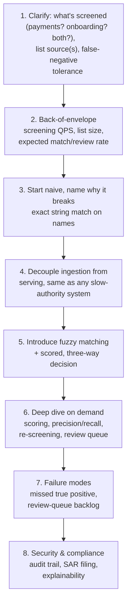

**What the interviewer is actually grading at each step:**
- Step 3: do you recognize, unprompted, that exact-match on a legal name is close to useless — and
  that over-fuzzy matching creates its own operational disaster (an unreviewable flood of false
  positives)?
- Step 5: do you propose a **three-way** outcome (clear / block / human review) rather than a
  binary block/allow — binary is the textbook wrong answer for this specific problem?
- Step 6: do you reason about the asymmetric cost of false negatives vs. false positives
  explicitly, with numbers, rather than treating "make the matcher more accurate" as a
  free lunch?

---

## Requirements clarification

### Functional

| # | Requirement | Notes |
|---|---|---|
| F1 | Screen every transaction/customer name against one or more government/regulatory watchlists before it's allowed to proceed | The core check |
| F2 | Produce a **score**, not a binary flag, for every screened name against every list | A single number that thresholds turn into clear/block/review |
| F3 | Route ambiguous matches to a human analyst review queue, with enough context to decide quickly | This system cannot be fully automated at any acceptable false-negative rate |
| F4 | Re-screen previously-cleared, still-open transactions/customers whenever the underlying list updates | A name cleared yesterday can become a true positive today if newly designated |
| F5 | Every decision — auto-clear, auto-block, or analyst resolution — is fully auditable: which list version, which score, which rule, who (or what) decided | Regulators can and do ask for this |

### Non-functional

| Requirement | Target | Why this number |
|---|---|---|
| Screening latency (p99) | Sub-second to low seconds for payment screening; can be longer (minutes) for onboarding/KYC flows | Payments have a real-time UX expectation; onboarding is already an async, multi-step flow that can tolerate more |
| False-negative tolerance | As close to zero as achievable — this is the number that should dominate every tuning decision | A missed true sanctions hit is a legal/regulatory event, not a quality metric |
| False-positive tolerance | Non-zero, but bounded by analyst review capacity | Too high a false-positive rate makes the review queue unworkable and trains analysts to rubber-stamp, which quietly defeats the whole system |
| Freshness of the list | Same shape as the IP guide — hours, driven by the source's own publishing cadence, with occasional out-of-band emergency updates for newly-designated entities | Some sanctions designations are announced with an expectation of near-immediate compliance — this is the one case where "batch daily" may not be good enough, and needs calling out explicitly |
| Auditability | Strict — every decision, human or automated, is reconstructable | This is the load-bearing non-functional requirement of the entire system |

**Clarifying questions worth asking the interviewer up front — and what each answer changes:**

| Question | If the answer is... | ...then this changes |
|---|---|---|
| "Is this for payments, onboarding/KYC, or both?" | Both | Two different latency budgets and two different volumes — payments dominate QPS, onboarding dominates screening depth (more fields checked) |
| "How many lists, and do they ever disagree or overlap?" | Multiple (OFAC + UN + EU + local regulator) | Screening becomes a fan-out across lists with a "worst decision wins" aggregation rule, not a single lookup |
| "Does the source ever publish out-of-band emergency updates outside the normal batch cadence?" | Yes, for newly-designated entities | Ingestion needs an urgent/priority pull path in addition to the normal scheduled batch, and re-screening of recently-cleared transactions becomes mandatory, not optional |
| "What's the acceptable false-positive rate given analyst headcount?" | A specific number, e.g. "no more than 200 reviews/day per analyst" | Directly sets the score threshold between auto-clear and human-review — this is a capacity constraint, not just an accuracy target |
| "Do we need to re-screen historical transactions, or only in-flight/open ones?" | Only open/recent | Bounds the re-screening deep dive's scope — screening the entire historical ledger on every list update would be a very different (and usually unnecessary) problem |

**Say this out loud in the interview:** *"The list-freshness problem here is the same shape as any
slow-external-authority system — but the matching problem is new: names are fuzzy, so the output
of a screening check is a score and a threshold policy, not a lookup and a boolean."*

---

## Capacity estimation, worked

```
Given (illustrative, a mid-size payment processor):
  Sanctions list size (SDN + aliases, consolidated)   = ~15,000 designated entities,
                                                          ~40,000 name/alias variants total
  Payments requiring screening per day                = 50,000,000
  Peak screening QPS                                    = 50,000,000 / 86,400 ~= 580 QPS average,
                                                          say ~3,000 QPS at peak (bursty payment traffic)

Match-scoring cost per screening call:
  Candidate generation (phonetic/blocking key lookup)  -> narrows 40,000 variants to a short
                                                            candidate list, ~10-50 candidates
  Full fuzzy score computed only against candidates,
    not the full 40,000-variant list, per screening call
  -> this candidate-generation step is why full name-similarity scoring against the ENTIRE list
     per transaction would be too slow at 3,000 QPS; blocking/phonetic indexing turns an O(list
     size) problem into an O(candidates) problem, discussed in the matching deep dive.

Review queue sizing, tied to the false-positive-rate clarifying answer:
  Illustrative auto-clear/auto-block/review split at a tuned threshold:
    Auto-clear                                          = 99.5% of screened transactions
    Auto-block (high-confidence true positive)          = 0.001%
    Routed to human review                              = ~0.499%
  Review volume per day                                 = 50,000,000 x 0.00499 ~= 250,000 / day
  -> at, say, 200 reviews/analyst/day, this requires ~1,250 analysts -- a number worth saying out
     loud, because it reveals the review-queue threshold is not a free knob: tightening it to
     reduce false positives by even a small percentage has a directly computable headcount impact,
     which is exactly the kind of number the "capacity estimation" step is supposed to surface.

List refresh, same shape as the IP guide:
  Normal batch cadence                                  = daily, tens of thousands of rows,
                                                            trivial pull time against typical
                                                            regulator rate limits
  Emergency/out-of-band update path                      = must be pollable/pushable on a much
                                                            tighter cadence (e.g. hourly or
                                                            webhook-driven, if the source supports
                                                            it) specifically for new designations
```

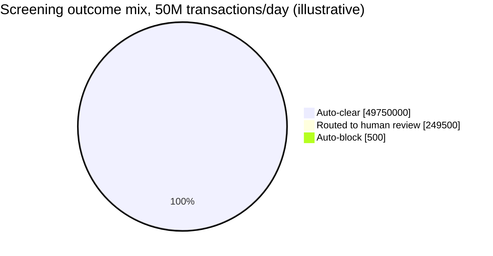

The "Auto-block" slice looks negligible on a pie chart, and that's exactly the point worth saying
out loud: **the review-queue slice, not the auto-block slice, is where the real operational cost
lives** — a threshold tuned to be more conservative barely moves the block slice but can swing the
review slice (and its ~1,250-analyst cost) substantially.

**Redo-the-chain test:** if the review-threshold is tightened to cut false positives in half, the
review queue volume roughly halves to ~125,000/day and ~625 analysts — a concrete trade-off to
walk through live if the interviewer asks "how would you reduce review workload."

**The number worth memorizing:** the review-queue headcount implied by your threshold choice is a
real operational cost, computable from the same funnel math as any other capacity estimate — don't
treat "route ambiguous matches to a human" as a free escape hatch from the accuracy problem.

---

## API design

### `POST /v1/screen` (called synchronously in the payment/onboarding path)

```json
{
  "requestId": "s_71209",
  "subjectType": "PAYMENT_COUNTERPARTY",
  "name": "John A. Smith",
  "dateOfBirth": "1978-03-14",
  "address": { "country": "US" },
  "lists": ["OFAC_SDN", "UN_CONSOLIDATED", "EU_CONSOLIDATED"]
}
```

Response:
```json
{
  "requestId": "s_71209",
  "decision": "REVIEW",
  "matches": [
    {
      "listSource": "OFAC_SDN",
      "listEntryId": "sdn_44821",
      "matchedName": "Smith, Jon A.",
      "score": 0.86,
      "matchedFields": ["name", "dateOfBirth"]
    }
  ],
  "listVersion": "OFAC_SDN_2026-07-23_v88",
  "decisionThresholds": { "autoBlock": 0.95, "autoClear": 0.40 }
}
```

| Field | Notes |
|---|---|
| `decision` | `CLEAR`, `BLOCK`, or `REVIEW` — never a plain boolean, for the reasons in the [matching deep dive](#deep-dive-fuzzy-name-matching--scoring) |
| `matches` | Every candidate above the minimum-consideration threshold, with per-field match detail — an analyst reviewing this decision needs to see *why* it scored the way it did, not just the number |
| `listVersion` | Same auditability pattern as the IP guide — every decision is reproducible against the exact list version live at decision time |

### `POST /v1/review/{requestId}/resolve` (analyst action)

```json
{
  "resolution": "FALSE_POSITIVE",
  "analystId": "analyst_204",
  "notes": "DOB mismatch confirmed against government ID; not the same individual.",
  "fileRegulatoryReport": false
}
```

`fileRegulatoryReport: true` triggers the suspicious-activity-report (SAR) filing workflow — a
separate, legally-governed process outside this guide's scope, but the hook into it belongs here.

**The one sentence worth saying about the API surface:** *"Screening returns a score and a
three-way decision, not a boolean — and every match carries enough field-level detail that a human
reviewer never has to re-derive why the system flagged it."*

---

## High-level architecture

### Architecture evolution (v1 → v2 → v3)

**v1 — exact string match:**

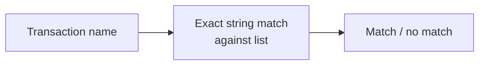

**Why it breaks:** real sanctioned entities almost never transact under the exact string form
published on the list — aliases, transliteration differences, middle names, punctuation, and
simple typos all defeat exact match. This design has a near-100% false-negative rate on anything
but a lucky exact hit, which is the worst possible failure mode for a compliance system: it looks
like it's working (returns clean answers fast) while providing almost no actual protection.

**v2 — fuzzy match, binary threshold:**

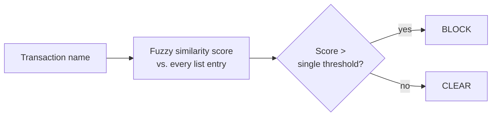

**Why it breaks:** a single threshold forces an impossible trade-off between two asymmetric costs
in one number. Set it low enough to catch real hits reliably (protect against false negatives) and
you auto-block huge numbers of innocent namesakes (unacceptable false-positive rate, no human in
the loop to catch the mistake). Set it high enough to avoid blocking innocent people and you let
real matches slide through uncaught (unacceptable false-negative rate). There is no single
threshold value that serves both goals — the binary design itself is the flaw, not the choice of
number.

**v3 — the real system: scored, three-way decision with a human-review band:**

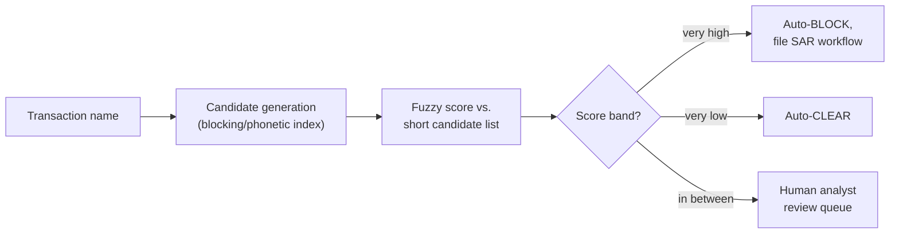

**What v3 fixes, one line each:** candidate generation makes fuzzy scoring computationally
tractable at real QPS instead of scoring against the entire list every time; two thresholds
instead of one create a middle band that absorbs genuine ambiguity into a human decision instead
of forcing a wrong automated one; and the review queue becomes a first-class, capacity-planned
part of the system rather than an afterthought.

---

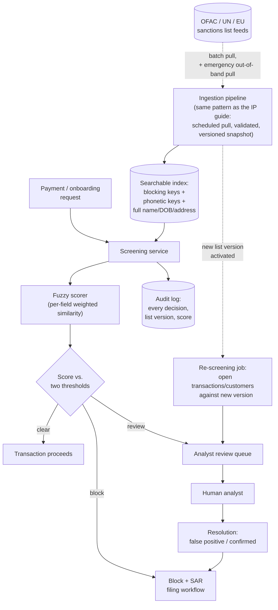

| Component | Role |
|---|---|
| Ingestion pipeline | Same shape as the IP guide's — one component pulls from each list source, validates, versions the result. Adds an emergency/priority pull path for out-of-band designations |
| Searchable index | Not a simple key-value store — needs blocking keys (e.g. Soundex/phonetic codes, name-part n-grams) so candidate generation stays fast at real QPS, plus the full field set for final scoring |
| Fuzzy scorer | Weighted per-field similarity (name similarity, DOB exact/partial match, address/country match) combined into one score — see the [matching deep dive](#deep-dive-fuzzy-name-matching--scoring) |
| Two-threshold policy | Auto-clear below the low threshold, auto-block above the high threshold, human review in between |
| Analyst review queue | A first-class system with its own capacity plan, SLA (how fast must a review resolve), and resolution audit trail — not a generic ticket queue |
| Re-screening job | Triggered whenever a new list version activates — re-runs screening for still-open transactions/customers against the new version, since a clean result yesterday can be wrong today |

---

## End-to-end request walkthroughs

### Walkthrough 1 — a borderline match routed to human review (the case the whole system exists for)

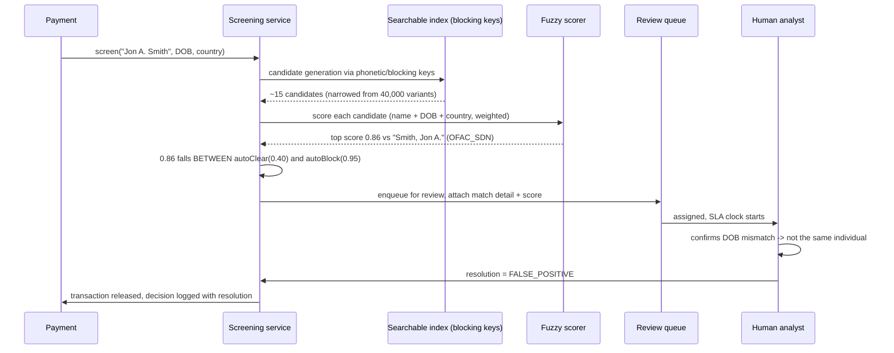

### Walkthrough 2 — a new designation retroactively flags an already-cleared customer

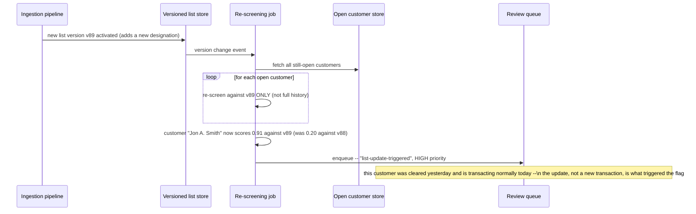

This second trace is the one most system designs miss entirely — a cleared decision from
yesterday is only correct as of the list version it was cleared against, and the
[re-screening deep dive](#deep-dive-re-screening-open-transactions-on-list-update) exists
specifically to catch this case automatically.

---

## Deep dive: fuzzy name matching & scoring

Exact match fails on real names for predictable reasons: transliteration ("Mohammed" vs
"Muhammad"), missing/extra middle names, nicknames, punctuation, and deliberate evasion attempts.
The fix is a **multi-stage pipeline**, not a single similarity function.

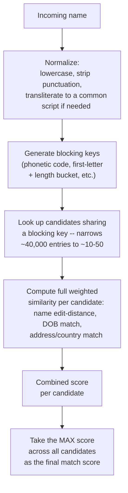

**Why blocking/candidate-generation matters, not just an optimization:** without it, every
screening call would need to compute a full similarity score against every one of ~40,000 list
entries — expensive at real QPS, and the exact kind of "O(list size) per request" shape that the
IP guide's capacity math showed doesn't scale. Blocking keys (phonetic codes are the classic
choice — Soundex, Metaphone, or a modern equivalent) turn this into a cheap index lookup followed
by full scoring on a tiny candidate set.

**Why the score is a weighted combination of fields, not name-similarity alone:** two people can
share a very similar name by pure coincidence — weighting in date-of-birth and address/country
match sharply reduces false positives from common-name collisions, since a real name match with a
DOB that's decades off is almost certainly a different person.

**Interview cheat-sheet:** *"Normalize, generate blocking keys for cheap candidate narrowing, then
score the short candidate list on multiple weighted fields — never brute-force full-list
similarity scoring per request, and never score on name alone when DOB/address are available."*

---

## Deep dive: precision vs. recall under asymmetric cost

This is the deep dive that separates a candidate who can tune a classifier from one who
understands *why* the tuning target here is unusual.

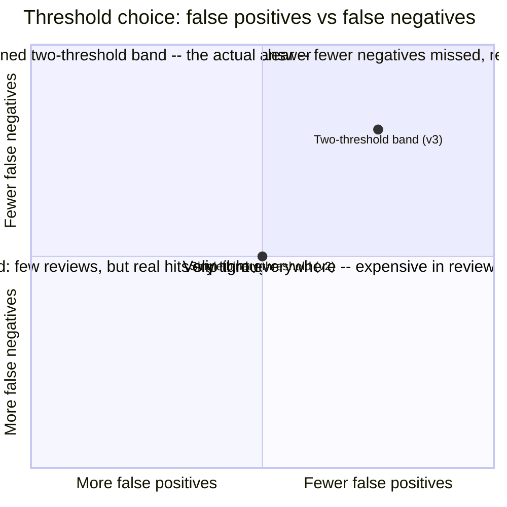

**The asymmetry, stated in numbers:** a false negative (missed true positive) risks regulatory
fines that can run into the tens or hundreds of millions of dollars, loss of banking license, or
individual criminal liability for compliance officers — costs that are largely fixed and severe
regardless of how "close" the miss was. A false positive costs one delayed transaction and a few
minutes of one analyst's time — a cost that scales linearly and is bounded. **This asymmetry is
why the low threshold (the boundary between auto-clear and review) should be set conservatively
loose** — biased toward sending more borderline cases to human review rather than auto-clearing
them, even knowing this inflates review volume and headcount cost.

**Why not just set both thresholds to catch everything (zero auto-clear)?** Every single
transaction would then require human review — at the capacity-estimation volumes above (50M
transactions/day), that's not a review queue, it's the entire payment system rebuilt as a manual
process. The auto-clear threshold exists specifically to let genuinely unambiguous, far-from-any-
match transactions proceed without consuming review capacity that's needed for the genuinely
ambiguous cases.

**Interview cheat-sheet:** *"The cost of a false negative here is not a quality metric, it's a
legal one — and that asymmetry should visibly bias where you set the auto-clear threshold, biased
toward sending more borderline cases to human review rather than clearing them automatically, even
at real headcount cost."*

---

## Deep dive: re-screening open transactions on list update

A name screened and cleared yesterday can become a true positive today, the moment a new
designation is published — this is a concern the IP guide's simpler lookup model doesn't have,
because IP block status doesn't retroactively apply to already-completed requests, but a sanctions
hit can and legally must apply to a customer relationship that's still open.

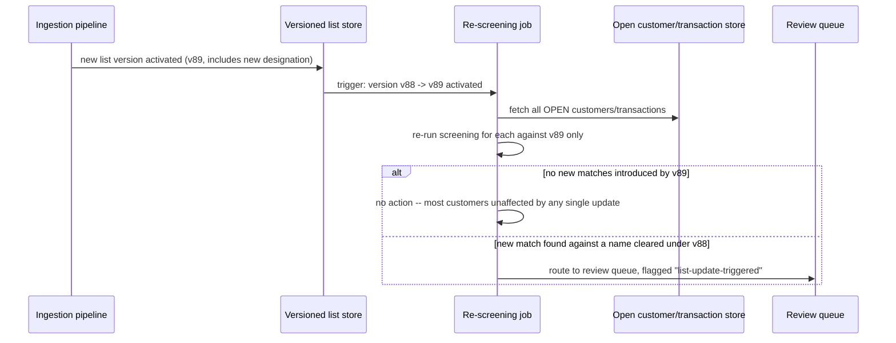

**Scope discipline — re-screen open, not historical.** Re-running every past transaction against
every new list version, forever, is usually neither required nor useful (a completed, closed
transaction from years ago typically can't be un-done); the requirement is almost always "still-
open customer relationships and in-flight/recent transactions," which is a bounded, much smaller
set — confirm this scope explicitly with the interviewer rather than assuming full-history
re-screening by default.

**Why this must be automatic, not analyst-initiated:** relying on a human to remember to re-check
existing customers against every new list update doesn't scale and isn't auditable as a
process — the re-screening job triggering automatically off every list-version activation is the
only version of this that a regulator will accept as a real control, not a best-effort habit.

**Interview cheat-sheet:** *"Every new list version triggers an automatic re-screen of open
customers/transactions against just the new version — not full history, and not something left to
a human to remember to do."*

---

## Deep dive: the analyst review queue as a first-class system

The review queue is not a generic ticket system bolted on the side — it's load-bearing enough to
deserve its own SLA, prioritization, and capacity plan, exactly like any other component whose
capacity was computed in the estimation section.

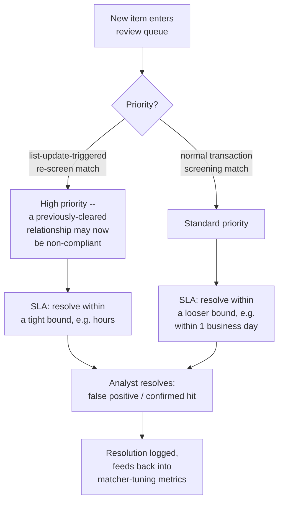

**Why resolutions feed back into tuning:** every analyst resolution is a labeled data point —
"this score, these matched fields, was actually a false positive" or "was actually a true
positive." Aggregated over time, this is exactly the signal needed to tell whether the current
thresholds are too loose or too tight, the same closed-loop idea as any ranking system's acceptance
telemetry, just applied to a compliance decision instead of a product recommendation.

**Interview cheat-sheet:** *"The review queue has its own SLA and priority tiers — a list-update-
triggered match on a previously-cleared relationship is not the same urgency as a routine new
transaction's borderline score — and every resolution is a labeled example that should feed back
into threshold tuning, not just close a ticket."*

---

## Data model

**Screening decision lifecycle** — the state machine that makes "a cleared decision is not
permanent" concrete:

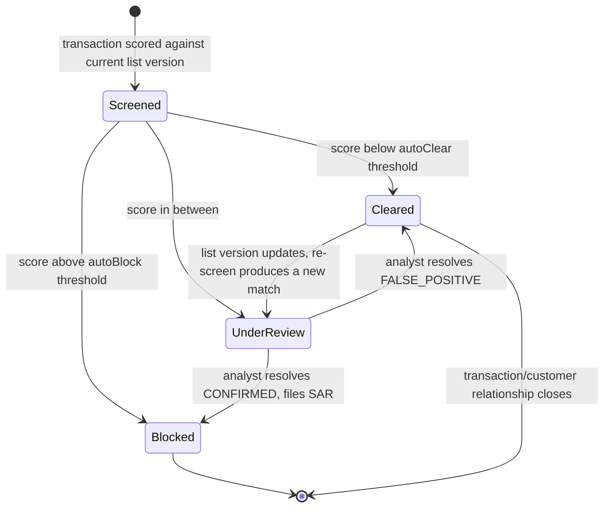

The `Cleared --> UnderReview` transition is the one candidates most often forget exists at
all — it's what the [re-screening deep dive](#deep-dive-re-screening-open-transactions-on-list-update)
and walkthrough 2 above are both about.

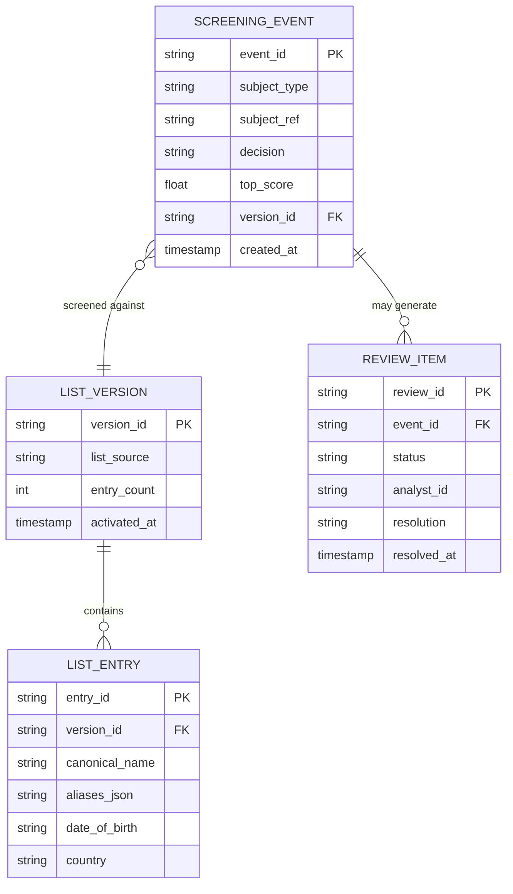

| Table | Storage choice & why |
|---|---|
| `ListVersion` / `ListEntry` | Same pattern as the IP guide: durable versioned store feeding a serving-optimized index (here, a search index with phonetic/blocking keys, not a CIDR trie) |
| `ScreeningEvent` | High-write-throughput append-only store — one row per screened transaction/customer, at payment QPS |
| `ReviewItem` | Relational store, low-to-moderate volume relative to screening events, needs transactional read-after-write for analyst tooling |

---

## Failure modes & mitigations

| Failure mode | Impact | Mitigation |
|---|---|---|
| **List source publishes an emergency update and the normal batch pipeline doesn't pick it up until the next scheduled run** | A window where a newly-designated entity isn't yet screened against | A separate, tighter-cadence "urgent update" pull path, distinct from the routine daily batch — confirm with the source whether they offer any out-of-band notification at all |
| **Review queue backlog grows faster than analyst capacity** | Screening latency for ambiguous cases blows past SLA; risk of analysts rubber-stamping under pressure | Monitor queue depth and age as first-class metrics; auto-clear/auto-block threshold is a release valve that trades false-positive/negative risk for queue depth — a deliberate, visible trade-off, not a silent one |
| **A blocking/phonetic key misses a real variant** (e.g. an unusual transliteration the phonetic algorithm doesn't handle well) | A true positive doesn't reach candidate generation at all, and no score is ever computed | Multiple independent blocking-key strategies run in parallel (not just one phonetic algorithm) so a miss in one doesn't silently drop the candidate entirely |
| **Re-screening job fails partway through a large open-transaction batch** | Some open relationships never get checked against a critical new designation | Resumable, checkpointed re-screening job (same pattern as the IP guide's resumable ingestion pull), with completion tracked and alertable |
| **An analyst incorrectly resolves a true positive as a false positive** | The actual failure mode this whole system exists to prevent, now via human error instead of a matching miss | Sampling-based quality review of closed resolutions, and mandatory escalation/second-review for any resolution touching a high-score (near the auto-block threshold) match |

---

## Non-functional walkthrough

**Scaling the screening path** is bounded by candidate-generation performance, not raw list
size — a well-designed blocking-key index keeps per-request cost roughly constant even as the list
grows, which is why the matching deep dive treats candidate generation as load-bearing rather than
an implementation detail.

**Availability follows the same principle as the IP guide:** the list source's own downtime should
degrade freshness, never availability of the screening path itself — screening always runs against
the last successfully-ingested version.

**Consistency** has the same "eventual, bounded, monitored" shape as the IP guide for the list
data itself, plus one addition specific to this system: the re-screening job's completion status is
itself a consistency property worth monitoring — "how far behind is re-screening from the newest
list version" is as important a metric as list staleness itself.

**Warm-up and fail-open, inherited directly from the IP guide, applied to a search index instead
of a trie.** A newly-booted screening replica loads the last known-good versioned index before
accepting traffic — never empty, never partially loaded — gated on the same readiness-probe
discipline as the [IP guide's warm-up deep dive](./46-Design-an-IP-Allowlist-Blocklist-Service-FAANG-Guide.md#deep-dive-warm-up--cold-start).
If a list source's ingestion pipeline is down, screening keeps running against the last
successfully-ingested version indefinitely — the same "serve last known-good, monitor staleness,
escalate past a stated bound" policy as the
[IP guide's fail-open deep dive](./46-Design-an-IP-Allowlist-Blocklist-Service-FAANG-Guide.md#deep-dive-fail-open-vs-fail-closed-policy) —
never a source outage causing screening itself to go down or default to auto-clearing everything.

---

## Security & compliance

- **Every decision — automated or human — must be explainable on demand**, including which
  fields matched, at what score, against which list version. Regulators audit compliance
  programs specifically by asking "show me why this wasn't blocked" on a sample of transactions.
- **SAR (Suspicious Activity Report) filing workflows** are legally governed processes with their
  own retention and confidentiality rules — the screening system's job is to trigger that
  workflow reliably, not to reimplement its legal requirements.
- **PII handling for names, DOB, and address** is subject to standard data-protection regimes —
  this data is inherently sensitive and the audit trail that makes the system compliant with AML
  law must itself be handled compliantly with privacy law, a tension worth naming explicitly.
- **Access to the review queue and resolution actions** should be role-restricted and logged —
  an analyst's ability to clear a high-score match is itself a security-sensitive capability.

---

## Cost & trade-offs

**Review-queue headcount is the dominant cost lever, not infrastructure.** Unlike the IP guide
(where the dataset is small and infrastructure cost is nearly irrelevant), this system's largest
real cost is human analyst time — the capacity-estimation section already showed this scales
linearly with the auto-clear/review threshold choice. Any "how would you reduce cost" question in
this chapter should be answered primarily in terms of that threshold, not in terms of compute.

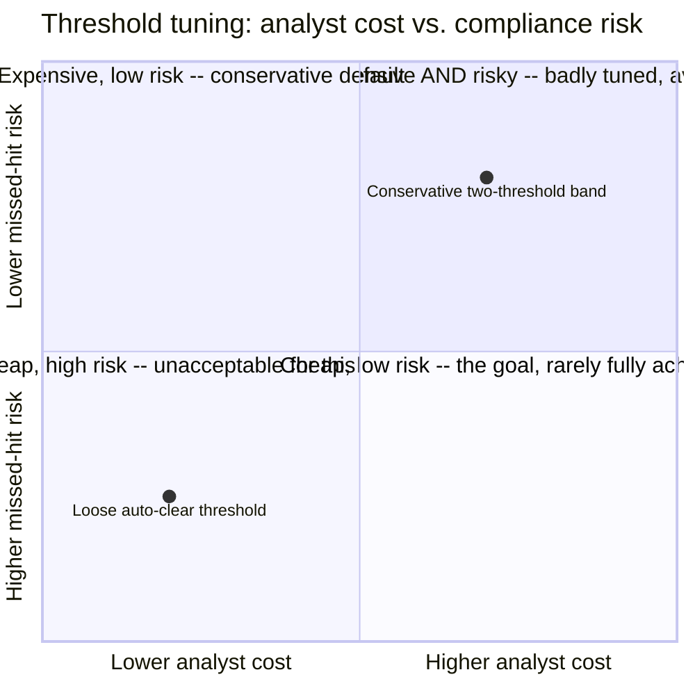

**Explainability tooling is a cost that pays for itself during an audit.** Investing in
per-decision, per-field match explanations up front is far cheaper than reconstructing "why did we
clear this transaction six months ago" after the fact, under regulatory time pressure.

---

## Wrap-up: MVP vs. stretch

**In scope for an MVP:**
- Ingestion pipeline for at least one list source, versioned and validated, same pattern as the
  IP guide.
- Blocking-key-based candidate generation plus a weighted multi-field fuzzy scorer.
- Two-threshold auto-clear/auto-block/review policy, with a basic analyst review queue and
  full audit logging.
- Automatic re-screening of open transactions/customers triggered on every new list version.

**Explicitly out of scope for an MVP:**
- Multi-list aggregation with conflicting decision logic across sources — start with one list,
  generalize once the single-list flow is solid.
- Automated SAR-filing content generation — the MVP triggers the workflow; drafting the actual
  regulatory filing content is a much larger, legally-specific stretch feature.

**Stretch goals, worth naming if asked "what's next":**
1. **Multi-list, multi-source aggregation** with an explicit "worst decision wins" or
   weighted-combination policy across sources that update independently and can disagree.
2. **Active-learning threshold tuning** — feed analyst resolutions directly into an automated
   threshold-adjustment loop, with human sign-off before any threshold change goes live.
3. **Network-level screening** — flagging not just direct name matches but known associates/
   shell-company networks connected to a designated entity, a substantially harder graph problem.

---

## Golden rules

- **Exact match is the wrong tool for names.** Fuzzy, blocking-key-accelerated matching is
  required from the start, not an optimization added later.
- **Binary block/allow is the wrong shape for a scored match.** Three-way (clear/block/review)
  with two thresholds is the minimum viable decision structure.
- **The cost of false negatives and false positives here is wildly asymmetric — let that bias
  threshold choice explicitly**, toward more human review rather than more automatic clearing.
- **A cleared decision is not permanent.** Every new list version must trigger automatic
  re-screening of still-open relationships, not a one-time check at transaction time.
- **The review queue is a capacity-planned system with its own SLA**, not a generic ticket queue —
  its headcount cost is a direct, computable function of your threshold choice.
- **Every decision, automated or human, must be explainable after the fact** — which list version,
  which fields, which score, who or what decided.

---

## Master cheat sheet

**One-liners:**
- Same ingestion/serving decoupling as any slow-external-authority system — but serving here
  outputs a **score**, not a lookup, because names are fuzzy.
- Candidate generation via blocking/phonetic keys turns an O(list size) matching problem into
  O(candidates) — never brute-force score against the full list per request.
- Two thresholds, three outcomes (clear/block/review) — a single binary threshold cannot serve
  both the false-negative and false-positive goals at once.
- The false-negative/false-positive cost asymmetry is legal, not just statistical — bias the
  low threshold conservatively toward more human review.
- Every new list version triggers automatic re-screening of open transactions/customers — a
  cleared decision is only correct as of the version it was cleared against.
- The review queue's headcount cost is directly computable from your threshold choice — treat it
  as a capacity-planned system, not a free escape hatch.

**Formula chain:**
```
review_volume_per_day   = screened_per_day x review_rate_at_threshold
analysts_needed          = review_volume_per_day / reviews_per_analyst_per_day
candidate_set_size       = list_size restricted by blocking_key match (not full list_size)
```

**Numbers:** sub-second to low-seconds screening latency for payments · false-negative tolerance
near zero, treated as a legal constraint, not a tunable · review-queue headcount scales linearly
with threshold looseness — compute it, don't hand-wave it · re-screening triggered on every list
version activation, scoped to open relationships, not full history.
