# Design a Legal Takedown Propagation System — The Story (narrative edition)

> **What this file is.** The reference file, `48-Legal-Takedown-Propagation-System-FAANG-Guide.md`, is the one to recite from — requirements, API shapes, every trade-off table, the master cheat sheet. This file is a second way in: the same material as one continuous story, told in plain language. Engineers at a company keep hitting a wall, patch it, and the patch itself creates the next wall — until we land on the exact same design the reference file documents. The company, **ClipHarbor** (a global video-and-photo hosting platform), is fictional. But every wall it hits, and every fix it reaches for, mirrors something real: the DMCA's actual notice-and-takedown and counter-notice rules (17 U.S.C. §512), Germany's NetzDG law with its real 24-hour deadline for clearly unlawful content, the way YouTube actually geo-restricts a video per country instead of removing it everywhere, the EU's Digital Services Act, and the Lumen database (Harvard's Berkman Klein Center, formerly Chilling Effects) that really does archive legal takedown notices for public scrutiny. I'll say clearly, every time, whether something is a documented fact or a reasonable stand-in number, tagged `[illustrative]`.

**The trigger phrase** for this whole topic: *"design a system to comply with legal takedown or blocking orders across a global platform, where each order names a specific piece of content and a specific country or region."* Keep one sentence in your head as you read: **this is not a "serve a huge dataset fast" problem — it's a "get one small, legally critical fact to exactly the right subset of machines, on time, and prove it happened" problem.** Every chapter below is that one idea, getting harder in small, honest steps.

---

## Chapter 1 — The desk with one ledger

It's 2014. ClipHarbor is young — a handful of legal takedown notices trickle in, maybe **3 a week**. Each one lands as an email forwarded to whichever engineer is around, usually a woman named Dana. Dana reads the notice, finds the content, and flips a `status = REMOVED` flag directly in the database. Takes about 15 minutes per notice, most of it spent figuring out what the letter is even asking for. At 3/week, that's 45 minutes of Dana's week. Nobody thinks about this as "a system" — it's just something Dana does between other things.

The platform keeps growing. By 2016, ClipHarbor is a real destination for creators worldwide, and legal notices grow with it — real-world takedown volumes genuinely do scale with platform size and public attention; Google's own Transparency Report documents copyright removal requests for **billions of URLs** cumulatively, a real, published number that shows just how large this category of problem gets at scale. ClipHarbor's own volume, scaled down to its size, hits **~40 notices a day** `[illustrative — ClipHarbor is fictional; the shape of the growth curve is the real, documented pattern]`. At 15 minutes each, that's **600 minutes — 10 hours** — of one person's day, every day, just reading legal mail. Dana can't keep up. Notices sit unopened for 4-5 days.

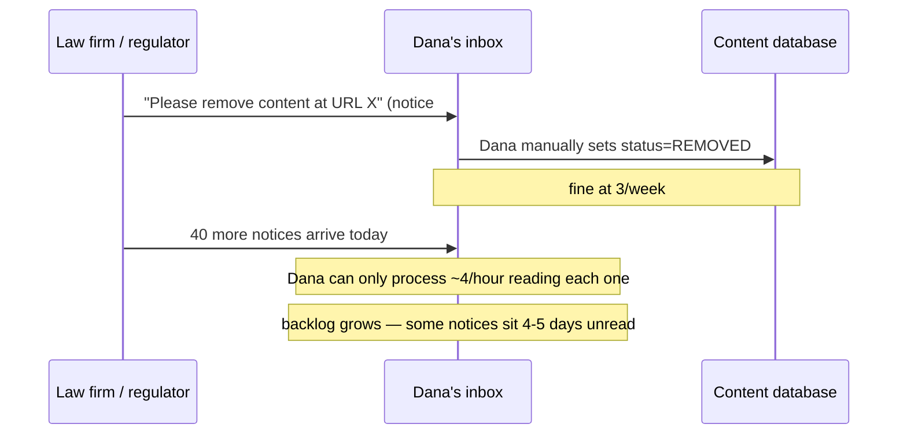

The obvious question: *why does this even matter — isn't a few days' delay just an ops inconvenience?* No — because the law itself has teeth here. The DMCA's real safe-harbor requirement is that a platform remove infringing content **"expeditiously"** upon a valid notice (a real, documented legal standard, even though the statute doesn't pin an exact number of hours) — a multi-day backlog is a genuine legal exposure, not just a bad support metric.

**The fix, and the analogy for the rest of this story:** stand up a proper **intake desk with a ledger** — a structured queue where every notice is logged first (who sent it, what it names, when it arrived), then assigned to a trained reviewer, instead of "whoever happens to see the email." Multiple reviewers can now work in parallel, and nothing is silently sitting in someone's personal inbox. Every time "a human has to actually read and validate a legal document" reappears later in this story, it's this same desk-and-ledger idea.

**New problem, immediately visible:** the desk now reliably decides "remove this" — but "removing" still just means flipping one row in the origin database. ClipHarbor also runs a global CDN with edge caches that keep serving already-fetched copies of that content for up to **24 hours** `[illustrative — a stand-in cache TTL]` after the origin row changes. The takedown "happened," legally, hours before it actually stopped being visible to real viewers.

**How I'd say this in an interview:** "The very first version of this system is always a human directly touching a database row per notice — that scales to a few a week, not a few a day. The fix isn't automation yet, it's just making intake a real, trackable process with a ledger and more than one reviewer. That buys headroom, but it doesn't touch what happens downstream of the origin database, which is the very next problem."

---

## Chapter 2 — Recalling the milk that's already on the shelf

The fix from Chapter 1 gets ClipHarbor's intake desk caught up. But now support tickets show a different pattern: "Legal says this was removed three days ago, why can I still watch it in Singapore?" The origin database says `REMOVED`. The edge caches — dozens of CDN points-of-presence around the world — don't know that yet; they just keep serving whatever they cached until their TTL naturally expires.

**The analogy:** think of the origin database as the factory that stopped shipping a product. That doesn't get the cartons already sitting on grocery store shelves off those shelves — someone has to actively **recall** them, not just wait for the shelf to naturally sell out.

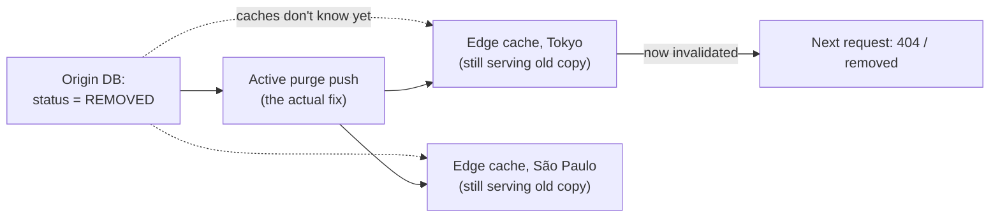

The obvious question: *why not just shorten the cache TTL to something tiny, like a minute?* Because that kills the entire point of a CDN — you'd be re-fetching from origin constantly for content that almost never changes, for the sake of a takedown case that's actually rare. The real fix, and the one real CDNs actually ship (Akamai's and Cloudflare's purge APIs are documented, real products built for exactly this): don't wait for TTL expiry at all — **actively push an invalidation** to every edge node the moment the origin record changes.

**New problem, and it's the big one for the rest of this story:** the easiest way to build "push an invalidation to every edge node" is literally what it sounds like — loop over **every single edge node ClipHarbor owns, everywhere in the world**, and push the takedown to all of them. It works. It also quietly does something nobody asked for.

**How I'd say this in an interview:** "Deleting the origin row isn't the same as the content actually disappearing for viewers — caches need an active push, not a passive TTL wait, which is exactly what CDN purge APIs exist for. The naive version of that push is 'send it to every node we own,' and that's about to become a legal problem, not just an engineering one."

---

## Chapter 3 — The sprinkler that floods the whole building

A German regional court orders ClipHarbor to block one specific video for viewers in Germany — a real, common shape of order (this is literally how country-specific court orders work against global platforms today; YouTube, for instance, really does show a documented on-video message like "this content is not available in your country due to a legal complaint" for exactly this reason, while the same video plays fine elsewhere). ClipHarbor's takedown push, built in Chapter 2, doesn't know the difference between "remove everywhere" and "block in one country" — it just pushes the enforcement action to **every** node.

Worked number: ClipHarbor has grown to **200 edge nodes spread across 40 countries** `[illustrative, matches the scale used later in this story]` — about 5 nodes per country on average. The German court's order should only touch the ~5 nodes serving Germany. Instead, the broadcast hits all 200. The video vanishes worldwide — including for U.S. viewers, where nothing illegal was alleged and no order was ever issued. ClipHarbor has just enforced a German court's authority in 195 countries that court has zero jurisdiction over.

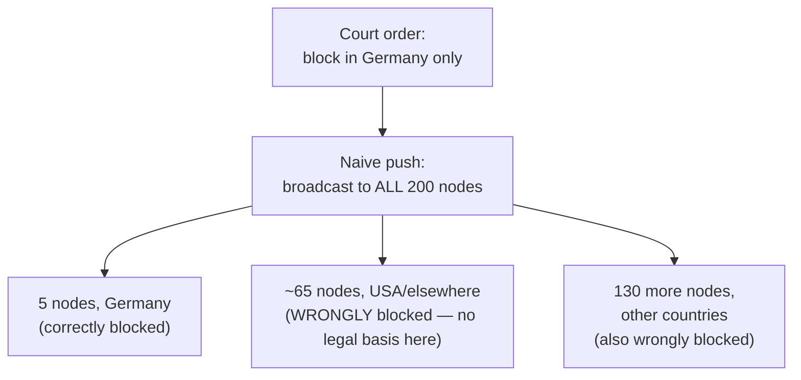

The obvious question: *isn't over-blocking at least the "safe" mistake — better safe than sorry?* No, and this is the part that surprises people who haven't thought about it as a legal system rather than a technical one: blocking content in a country with **no order and no legal basis** is its own form of unauthorized censorship — a distinct violation, not a conservative default. Under- and over-enforcement are both failures here; they're just different failures.

**The fix, and the analogy for the rest of this story:** stop using the sprinkler system that floods the whole building for one room's small fire. Aim a **fire extinguisher** — target only the nodes that actually serve the jurisdiction the order names. Build a **jurisdiction resolver**: a map from "country/region" to "which of our 200 nodes actually serve traffic there," and route every order's enforcement push only through that map.

**New problem:** aiming the extinguisher only at the right room assumes you know which room is on fire — and "push it to those 5 nodes" still says nothing about whether the push actually *landed*.

**How I'd say this in an interview:** "The naive version of propagation is a global broadcast on every order, and that's actively wrong, not just wasteful — it enforces a jurisdiction's court order in every other jurisdiction that court has no authority over, which is its own liability. The fix is a jurisdiction resolver: map the order's stated scope to the actual nodes serving that scope, and target only those. That's the single biggest fork in this whole design."

---

## Chapter 4 — Certified mail, not a note left on the porch

Jurisdiction scoping is live. ClipHarbor pushes the German court's order to exactly the ~5 nodes serving Germany, and moves on to the next order. Three weeks later, a compliance audit — a routine check where legal actually verifies enforcement on the live site — finds the video **still playable from a Frankfurt IP address**. What happened: one of those 5 nodes was mid-deploy the moment the push arrived, missed it entirely, and nothing in the system ever noticed, because the push was fire-and-forget — "we sent it" was treated as "it's done."

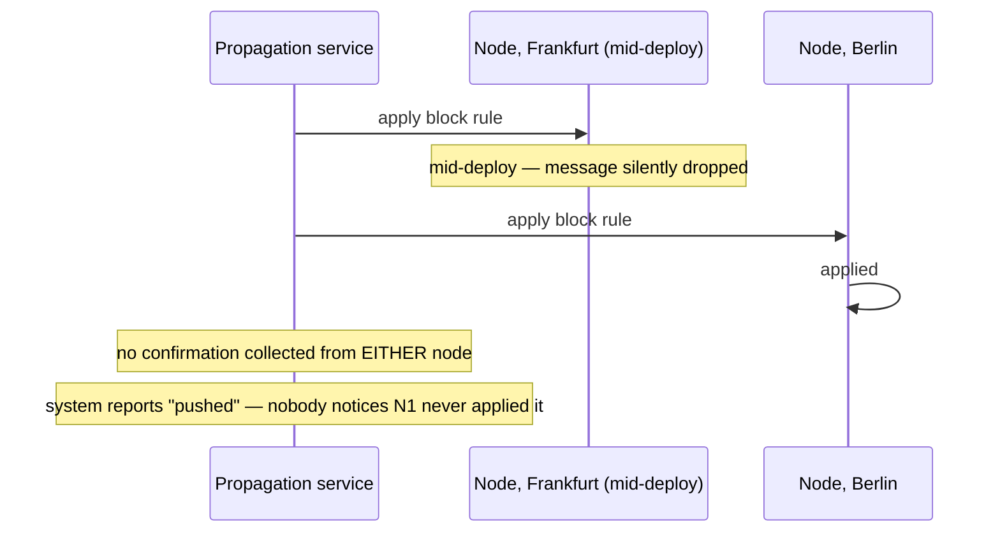

The obvious question: *how would we have caught this three weeks earlier instead of during an audit?* By never treating "pushed" as "done" in the first place. A missed or late enforcement isn't a bug ticket here — a real court order that quietly went unenforced for three weeks is exactly the kind of thing that turns into a contempt-of-court or regulatory-fine conversation.

**The fix:** every node has to send back an explicit **confirmation** — "I received order X and applied it, at time T" — before the order counts as compliant anywhere. Think of it as **certified mail with a signature required**, not a note left on the porch that might have blown away. And because a node can be briefly unreachable for entirely ordinary reasons (a deploy, a network blip), the propagation service **retries** until it gets that signature — which only works safely if re-applying "block content X" twice is a harmless no-op, i.e. the enforcement action has to be genuinely **idempotent**, not just assumed to be.

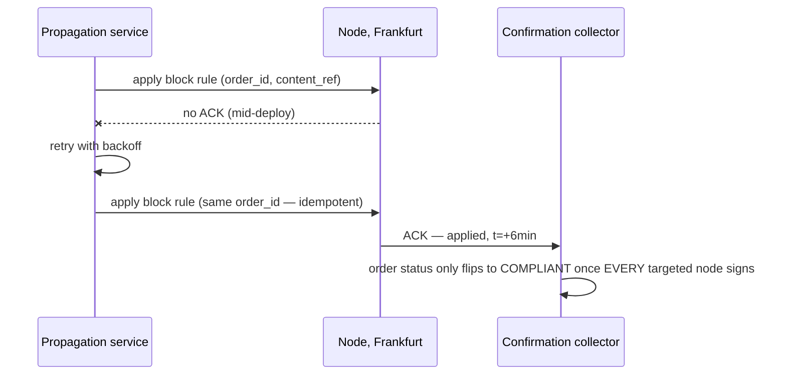

**New problem:** retrying until every node signs eventually works — but "eventually" isn't good enough when an order has a legal deadline attached, and right now nothing is watching the clock.

**How I'd say this in an interview:** "'We pushed it' is never the deliverable here — 'every targeted node signed for it, and we can show when' is. That means mandatory per-node confirmation with idempotent retries, the certified-mail model, not fire-and-forget. Idempotency isn't optional polish — it's what makes retrying safe at all."

---

## Chapter 5 — The clock that pages someone at halftime

ClipHarbor now handles both routine notices (batched, processed within a day or two) and genuinely urgent ones. Real-world grounding for why "urgent" is a distinct category with a real number attached: Germany's NetzDG law actually requires removal of **"manifestly unlawful"** content within **24 hours** — a real, documented legal deadline, not a platform's internal SLA. ClipHarbor sets its own internal urgent-order target at **4 hours** from intake to fully confirmed enforcement `[illustrative — ClipHarbor's own number, tighter than NetzDG's 24h floor to build in margin]`.

Here's the arithmetic that actually bites: legal intake review (Chapter 1's desk) alone routinely takes **2+ hours** for a reviewer to properly read and validate a notice. That's **half the 4-hour clock gone before propagation has even started.** If a node then gets stuck the way Frankfurt did in Chapter 4, and nobody's watching the remaining 2 hours tick down, the system finds out it missed the deadline only *at* the deadline — the worst possible time to find out.

```mermaid
sequenceDiagram
    participant Prop as Propagation
    participant N2 as Node (flaky)
    participant Agg as Status aggregator
    participant OnCall as On-call / legal

    Note over Agg: deadline = +4h; intake already used 2h; 2h remain
    Prop->>N2: apply enforcement rule
    N2--xProp: no ACK
    Prop->>Prop: retry with backoff
    N2--xProp: still no ACK
    Note over Agg: 1h of the remaining 2h has now passed (the halfway point)
    Agg->>OnCall: ESCALATE NOW — don't wait for the deadline
    OnCall->>N2: manual intervention
    N2->>Agg: confirmed, just under the wire
```

The obvious question: *why escalate at the halfway point specifically, instead of at 90% or right at the deadline?* Because escalating right at the deadline gives a human zero time to actually fix anything — the whole point of paging early is to leave enough runway for a manual fix (restart a node, push a direct config change) to actually land before the legal clock runs out. Halfway is a reasonable, simple rule: enough margin to act, not so early that it pages someone over noise.

**The fix, reusing the certified-mail idea plus a clock on the wall:** the compliance-status aggregator doesn't just wait passively for signatures — it watches elapsed time **against the specific order's own deadline**, and pages a human proactively once confirmation coverage is lagging past the halfway mark of whatever time is left.

**New problem, a step removed from any single order:** all of this — jurisdiction resolver, confirmation, deadlines — depends on one piece of state being accurate: which nodes actually serve which countries. Nobody's checked whether that map is still true.

**How I'd say this in an interview:** "This system's deadlines are real legal clocks, not soft SLAs — NetzDG's actual 24-hour rule is the real-world version of that. So the aggregator can't just log a miss after the fact; it has to escalate proactively, at something like the halfway point of whatever time's left, while a human still has time to actually intervene."

---

## Chapter 6 — The map that stopped matching the city

ClipHarbor's infrastructure team adds a new edge PoP in Warsaw to handle a traffic surge. Because of how the regional network routes traffic, that new node ends up quietly serving a meaningful slice of Czech viewers too — nobody flagged this as a "jurisdiction mapping change," it's just a side effect of a capacity decision made by an entirely different team. Two months later, a Czech court order arrives for a piece of content. The jurisdiction resolver, still working off the old map, sends the block to the handful of nodes it *thinks* serve Czech traffic — and never touches the Warsaw node, which is quietly serving that exact content to real Czech viewers.

**The analogy:** this is like using last year's map of a city after its borders got redrawn — the map still looks fine, it's just quietly wrong, and nothing about using it *feels* wrong until someone checks the actual territory.

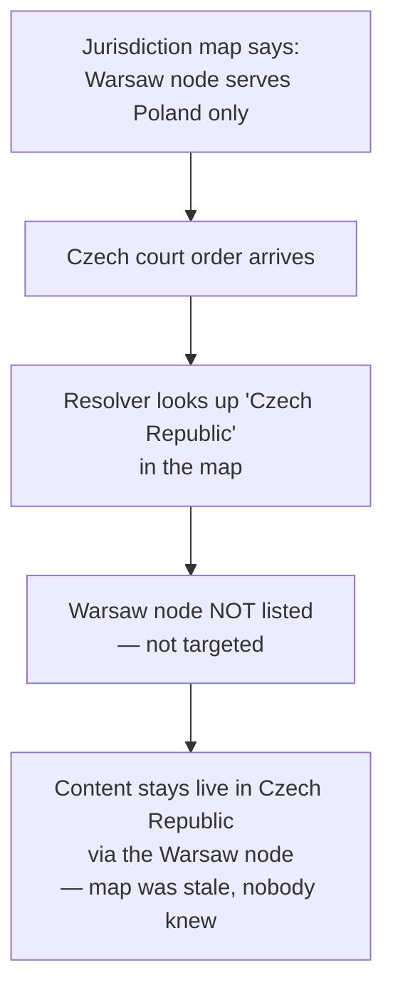

The obvious question: *how would you even catch this — it's invisible until something goes wrong?* You don't wait to find out from a court. Treat the node-to-jurisdiction map itself as versioned state with its own change log — every time infra adds, moves, or re-routes a node, that's logged the same way a code deploy is — and run a **periodic reconciliation job** that compares the map's assumptions against actual observed traffic geography, flagging drift before a real order exposes it.

`[illustrative]` a quarterly reconciliation check on ClipHarbor's 200 nodes finds that roughly **12 of them (6%)** have drifted from their recorded jurisdiction since the last check — a small-sounding number that, per Chapter 3's math, is still enough to misroute a real order.

**How I'd say this in an interview:** "Jurisdiction scoping is only as correct as the map from country to node, and that map isn't static — infra changes for capacity reasons that have nothing to do with legal compliance, and the map silently goes stale. So you version that map and audit it on a schedule, the same rigor you'd give the orders themselves, not a one-time lookup table you set and forget."

---

## Chapter 7 — Two bosses, and which one you listen to

Two different situations start showing up in the same week. First: a German regional court orders a block, and three weeks later a German federal appeals court vacates that same order — one authority reversing another, about the exact same content and country. Second, unrelated: a national regulator in one EU country flags a piece of content under local rules, while the EU's own Digital Services Act framework — a real, documented 2022 regulation that lets member states and the EU itself both have a say in content moderation — hasn't separately ruled on it at all. Two authorities, same content, no explicit relationship between their two orders.

These are different problems and need different answers.

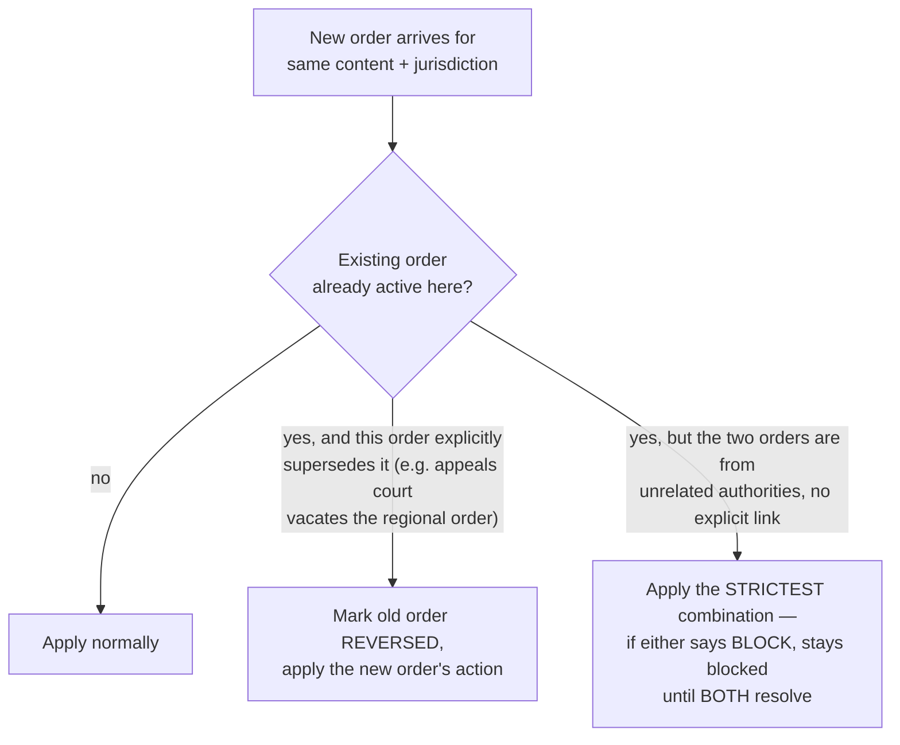

The obvious question, for the "unrelated authorities" case: *why default to the stricter action instead of, say, whichever order arrived first?* Because un-blocking content based on one authority's *silence* — not an actual ruling, just the fact that a second regulator hasn't weighed in yet — is a bigger legal risk than staying blocked a bit longer than strictly necessary. Same asymmetric-cost reasoning you'd apply to a sanctions-screening system: a false "still restricted" is recoverable; a false "cleared" isn't.

For the "one order actually supersedes another" case, the fix is different and stricter: that relationship has to be an **explicit, human-established link** — this order reverses that order_id — created during legal intake review by a person reading both documents. Never inferred automatically just because the timing or content look related; two orders happening to be about the same video three weeks apart is a coincidence detector's job, not a legal one.

**How I'd say this in an interview:** "Two bosses giving conflicting instructions, and no note saying one overrides the other — you follow the stricter one until it's resolved. But if there *is* a note — an appeals court actually vacating a lower order — that's a legal fact, not a pattern match, and it only gets recorded when a human reviewer establishes the link explicitly."

---

## Chapter 8 — The letter that un-says the first letter

ClipHarbor's takedown system has, so far, only ever gone in one direction: block. Then a real, well-documented mechanism from the DMCA shows up — the **counter-notification** process. A creator whose content got taken down can file a counter-notice; if the original complainant doesn't file suit, the law actually requires the platform to wait **10 to 14 business days** (17 U.S.C. §512(g)(2)(C) — a real, specific, documented number, not a stand-in) before restoring the content.

The system needs a whole lifecycle, not a one-shot action: an order can be reversed on appeal, expire on its own stated validity date, or get amended. And here's the failure that catches ClipHarbor off guard the first time it happens: when an order is reversed and the content should come back, the "un-enforce" push to all the originally-targeted nodes fails on **one of them**, the exact same way Chapter 4's original enforcement push once failed on Frankfurt. Nobody had bothered to build confirmation into the reversal path — it was written as a quick afterthought, "just the opposite of enforcement, should be simple." Content stays blocked, in a country that legally cleared it, for another two weeks until someone notices.

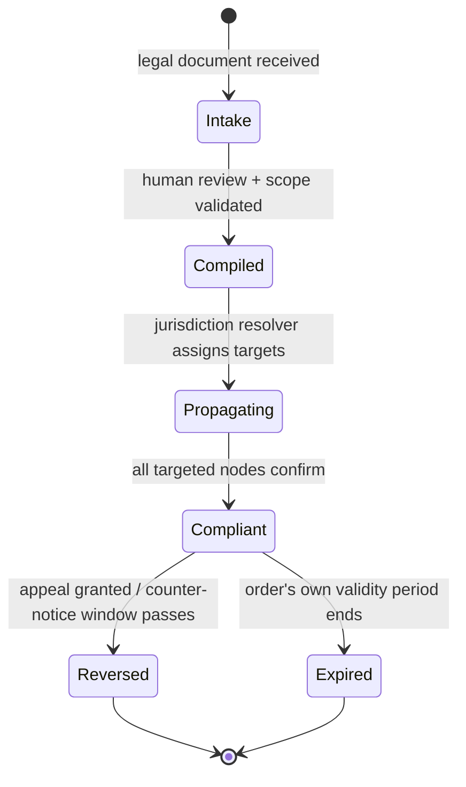

The obvious question: *why would the "undo" path be treated as lower-stakes than the original enforcement?* It shouldn't be, and the bug above is exactly what happens when a team assumes it is. Content that should be legally visible again, staying blocked, is a real, ongoing legal exposure — arguably worse than a slow original takedown, because now the platform is actively over-censoring something a court or a valid counter-notice already cleared.

**The fix:** reversal propagation runs through the **exact same certified-mail mechanism** as original enforcement — same per-node confirmation, same retries, same deadline-awareness. It is not a special "lite" path; it's the identical pipeline, running in the opposite direction.

**How I'd say this in an interview:** "Orders aren't one-shot — they expire, get appealed, get reversed, and the real DMCA counter-notice process with its actual 10-14 business day window is a good concrete anchor for that. The bug worth naming unprompted: teams treat 'undo the block' as simpler than 'apply the block' and skip confirmation on it — but an un-enforced reversal is just as real a legal problem as a missed original order."

---

## Chapter 9 — The transcript nobody can quietly edit

A legal intake reviewer, working through a routine batch, mistypes a jurisdiction code while transcribing a court order from a scanned PDF into the structured record — types `"AT"` (Austria) instead of `"DE"` (Germany). The system does exactly what it's told: blocks the content in Austria, leaves it untouched in Germany, where the order actually applies. Nobody catches it until an unrelated external audit compares ClipHarbor's enforcement against the original court filings and finds the mismatch.

This is the moment ClipHarbor realizes something important: everything built so far — jurisdiction resolver, confirmation, deadlines, lifecycle — assumes the **order itself** was compiled correctly from the original legal document. Nothing has protected against a human transcription error at the very first step.

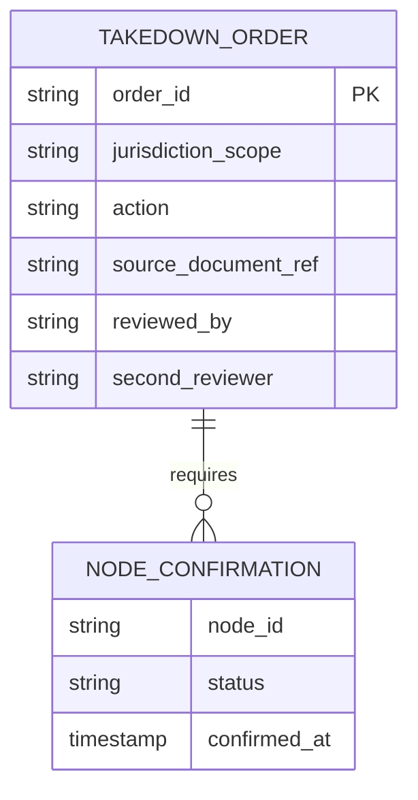

Two fixes, both aimed at the same root cause. First: anything beyond a routine, templated order requires a **second reviewer's sign-off** during intake — the same two-person check you'd want on any high-stakes, easy-to-mistype manual step. Second, and just as important: `sourceDocumentRef` — a permanent link from the structured record back to the *original* scanned court filing — is mandatory, never optional, so that exact mismatch above is instantly checkable by anyone auditing later, instead of requiring a forensic reconstruction of what the order "probably" said.

Why this matters more here than almost anywhere else: a real, documented project called the **Lumen database** (run by Harvard's Berkman Klein Center, formerly Chilling Effects) actually archives legal takedown notices for public research and transparency — meaning enforcement records in this space genuinely do get scrutinized by outside parties, not just internal audits. Every order, confirmation, and status transition goes into a **tamper-evident audit log** — think of it as a courthouse stenographer's transcript: once written, nobody quietly edits it, because the whole point of the record is that it can be trusted *after the fact*, including by people outside the company.

**How I'd say this in an interview:** "Every deep-dive so far assumed the order itself was compiled correctly — this is the one that says 'what if the human transcription step is wrong.' The fix is a second-reviewer sign-off for anything non-templated, plus a permanent link back to the original source document, and a tamper-evident audit log for every state change, because this system's actual output — the compliance record — is itself something that gets scrutinized, sometimes years later."

---

## Chapter 10 — The new guard who reads the no-entry list first

ClipHarbor spins up a brand-new edge PoP in Dublin to absorb a traffic spike. It boots up, registers itself, and — because nothing was ever told otherwise — immediately starts serving live traffic, including content that's under an active block order elsewhere in the world but happens to route through Dublin due to a network quirk. For about **90 seconds** `[illustrative]`, while the new node is still fetching the current list of ~20 active orders it's responsible for enforcing, it serves everything unfiltered, blind to every order that came before it existed.

**The analogy:** a brand-new security guard who starts waving people through the door on day one, before anyone's handed them the no-entry list. Enthusiasm isn't the problem — starting before you have the list is.

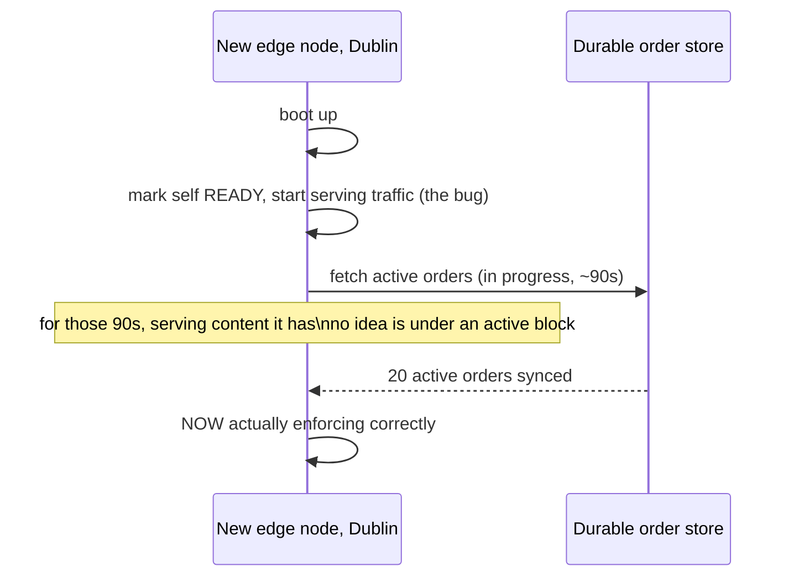

The obvious question: *what should the node do instead, for those 90 seconds — refuse all traffic?* Not quite that heavy-handed either. The right rule: a node that hasn't yet confirmed it's synced with the current active-order set should report itself **not-ready** and let traffic route elsewhere, rather than guessing at its own enforcement state. If routing elsewhere isn't an option, the safer default depends on the content type — but "serve everything as if no orders exist" is never that default. This is the same "never start serving on missing data" discipline that shows up anywhere a node comes back from a cold start — just applied here to a small set of discrete active legal facts instead of a bulk dataset.

**How I'd say this in an interview:** "A node has to sync the currently-active set of orders before it's allowed to mark itself ready — the same cold-start discipline you'd want anywhere, just a much smaller list here than a bulk dataset. The bug worth naming out loud: it's tempting to let a new node start serving immediately for availability's sake, and that's exactly the gap that lets it enforce nothing for however long the sync takes."

---

## Where the story actually lands

```mermaid
flowchart LR
    A["Ch1: one engineer,\none ledger"] -->|"fixes: trackable intake\nbreaks: caches still serve old copies"| B["Ch2: active purge"]
    B -->|"fixes: caches invalidated\nbreaks: purge is a global broadcast"| C["Ch3: jurisdiction resolver"]
    C -->|"fixes: scoped, not global\nbreaks: push has no confirmation"| D["Ch4: certified mail + idempotent retries"]
    D -->|"fixes: provable delivery\nbreaks: no one watches the clock"| E["Ch5: deadline-aware escalation"]
    E -->|"fixes: proactive paging\nbreaks: the map itself goes stale"| F["Ch6: versioned, audited jurisdiction map"]
    F -->|"fixes: map stays true\nbreaks: two orders can conflict"| G["Ch7: strictest-wins + explicit supersession"]
    G -->|"fixes: conflict policy\nbreaks: reversal path skipped confirmation"| H["Ch8: full lifecycle, same guarantee both ways"]
    H -->|"fixes: reversal is provable too\nbreaks: intake itself can be mistyped"| I["Ch9: second reviewer + tamper-evident audit"]
    I -->|"fixes: correctness at the source\nbreaks: a new node starts blind"| J["Ch10: sync-before-ready"]
```

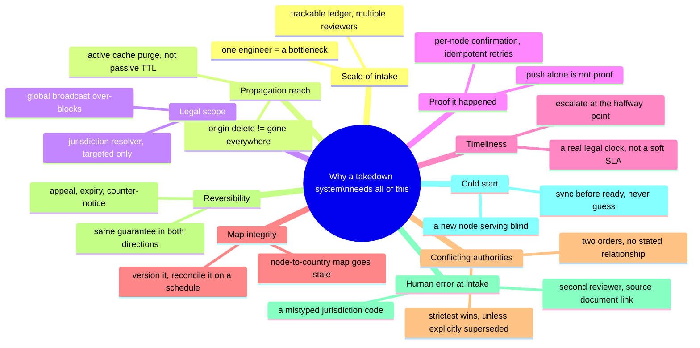

Every real system in this space sits somewhere on this chain — and where you stop depends entirely on what the interviewer actually asks. A take-home about "propagate a takedown globally" might reasonably stop around Chapter 4 or 5. One that specifically asks about country-scoped orders, appeals, or audit needs to reach Chapter 7 through 9. Walking all ten chapters unprompted, when nobody asked about conflicting orders or cold starts, reads as padding — follow the requirements, not the full chain.

---

## Grill me — adversarial follow-ups

**Q1: "Why not just always broadcast to every node — isn't a little over-blocking safer than risking under-blocking?"**
No, because over-blocking outside a court's actual jurisdiction has no legal basis at all — it's not a cautious default, it's a separate violation, effectively unauthorized censorship in every country the order never named. Under- and over-enforcement are both real failure modes here, and treating one as "the safe side" misunderstands the legal shape of the problem.

**Q2: "Walk me through what happens if a targeted node is down for an entire hour during a 4-hour urgent order."**
The propagation service keeps retrying with backoff since the enforcement action is idempotent, so retrying is always safe. Meanwhile the deadline-aware aggregator is watching elapsed time against the remaining window, and if confirmation coverage is still incomplete past the halfway point of what's left, it pages a human proactively — well before the 4-hour mark, so there's still time to manually intervene rather than just logging a miss after the fact.

**Q3: "Isn't 'delivery confirmation' just retries with a timeout — what's actually new here versus a normal distributed system?"**
The mechanics — retry, ACK, idempotency — are standard distributed-systems building blocks, yes. What's different is what the confirmation feeds into: not just "did the operation succeed" but "can we produce a legally defensible answer to 'is order X currently enforced, at every required node, and since when'" — the confirmation is the actual deliverable, not a side effect of making retries reliable.

**Q4: "How do you actually detect that the jurisdiction-to-node map has drifted, before a court order exposes it?"**
A periodic reconciliation job that compares the map's stated assumptions against real observed traffic geography — which countries a node is actually seeing requests from — and flags any node whose real traffic pattern no longer matches its recorded jurisdiction. It's the same idea as auditing a permissions list against actual access logs: the map is a claim, and you check the claim against reality on a schedule, not just once at setup.

**Q5: "Why require a human-established link for supersession instead of just detecting it automatically — same content, same jurisdiction, later order, seems inferable?"**
Because "same content, same jurisdiction, later order" is also exactly what two *unrelated* authorities disagreeing looks like — timing and content overlap alone can't distinguish "this reverses that" from "this conflicts with that." Getting it wrong in either direction is a real legal consequence, so it stays a fact a legal reviewer states explicitly, not a pattern an algorithm infers.

**Q6: "Your Chapter 8 fix says reversal uses the same pipeline as enforcement — doesn't that just double the propagation load for free?"**
It adds some load, sure, but the volume here is thousands of messages a day, not millions a second — this system was never throughput-bound, so doubling it barely registers operationally. What it buys is real: an unenforced reversal (content that should be visible again, staying blocked) is just as much a live legal exposure as a missed original order, so it earns the identical guarantee, not a discount.

**Q7: "If a court order and a counter-notice disagree, who wins?"**
They're not really in tension — the counter-notice process has its own defined legal window (17 U.S.C. §512(g)'s real 10-14 business day rule for DMCA cases specifically), and if the original claimant doesn't file suit within that window, restoration is what the law actually requires. If a claimant does file suit, that's a new legal event that gets its own intake and its own order, not an automatic override.

**Q8: "You said this system isn't throughput-bound — what actually is the bottleneck, then?"**
Legal intake review time. A 2+ hour human review step eating half of a 4-hour urgent deadline is the real constraint, not message volume or node count — this argues for a fast-tracked review lane for urgent orders specifically, not a faster propagation pipeline, because propagation was never the slow part.

**Q9: "What's the one thing you'd refuse to cut if someone told you to ship an MVP fast?"**
Per-node delivery confirmation. Everything else — the urgent lane, deadline escalation, conflict resolution, even the audit log's polish — can be added incrementally without changing the shape of the system. But shipping without confirmation means you can never actually answer "are we compliant" with anything better than "we think so," and that's disqualifying for a system whose entire purpose is producing a provable compliance record.

**Q10: "Given this whole story, where do you start if someone just says 'design a legal takedown system' cold?"**
Say the two things that shape everything downstream: is each order jurisdiction-scoped or global, and what counts as proof of compliance to whoever's asking. Those two answers decide whether you need a jurisdiction resolver at all and whether "we pushed it" is ever acceptable — then walk forward only as far as the stated requirements actually push you, because the rest (conflicts, reversal, cold starts) are earned by a specific follow-up question, not defaults you volunteer.

---

## Cheat sheet — one line per stop on the story

- **One engineer, one ledger**: manual per-notice deletion doesn't scale past a handful a week — fix intake into a trackable, multi-reviewer process before touching anything downstream.
- **Active cache purge**: an origin delete isn't the content actually disappearing — push an invalidation to every relevant cache, don't wait on a passive TTL.
- **Jurisdiction resolver**: a global broadcast on every order over-enforces outside the order's actual legal scope — target only the nodes serving the named jurisdiction, treat the map itself as real, audited state.
- **Certified mail + idempotent retries**: "we pushed it" is never proof — every targeted node must confirm explicitly, and retries only work safely if re-applying the action twice is a no-op.
- **Deadline-aware escalation**: a legal deadline is a real clock, not a soft SLA — escalate to a human at the halfway point of whatever time's left, not after the deadline's already gone.
- **Versioned jurisdiction map + reconciliation**: infrastructure changes for unrelated reasons and silently breaks the country-to-node mapping — audit it on a schedule, don't assume it's still true.
- **Strictest-wins, explicit supersession only**: unrelated conflicting orders default to the stricter action; one order reversing another must be a human-established link, never inferred from timing or content similarity.
- **Same guarantee, both directions**: reversal/expiry/appeal propagation gets the identical confirmation-and-retry mechanism as original enforcement — an unenforced reversal is just as real a legal exposure as a missed order.
- **Second reviewer + source document + tamper-evident log**: a mistyped jurisdiction code at intake is a real failure mode — catch it with a second sign-off, and make every record traceable back to the original filing, because outside scrutiny (like the real Lumen database) is a real possibility here.
- **Sync before ready**: a newly-started node must load the current active-order set before serving any traffic — never guess at enforcement state just to come online faster.
- **The meta-lesson**: this system's hard part was never scale — message volume stays in the thousands a day — every chapter buys legal correctness (scope, proof, timeliness, conflict handling, reversibility, audit) by spending a bit of engineering effort, never the other way around.
