# Design a Legal Takedown / Court-Order Propagation System — FAANG Interview Guide

> Source chapter type: compliance-gating system, same genre as
> [the IP allow/block-list guide](./46-Design-an-IP-Allowlist-Blocklist-Service-FAANG-Guide.md) —
> but the "external authority" here is a **court or regulator issuing discrete, individually
> significant orders**, not a bulk-published list. The hard problem shifts from "how do we serve
> a huge dataset fast" to "how do we guarantee one specific order reaches every edge node,
> globally, provably, and fast enough to matter legally" — a consistency and provability problem
> more than a scale problem.

## Mental model

A court issues an order: "content X must be removed/blocked in jurisdiction Y within Z hours." Or
a regulator issues a global takedown notice for a specific piece of content. Unlike the government
IP-range feed (a bulk dataset updated in batches) or the sanctions list (tens of thousands of
entries updated daily), a legal takedown order is:

- **Issued one at a time, irregularly**, sometimes urgently (an injunction with a same-day
  compliance deadline) and sometimes routinely (a scheduled DMCA-style batch).
- **Jurisdiction-scoped** — an order from a German court typically only requires blocking in
  Germany, not globally; a global regulator's order might require blocking everywhere.
  Get this wrong (block everywhere when only one country's order was issued) and you've just
  over-censored content with no legal basis in every other jurisdiction.
- **Legally significant per-order** — unlike one row in a 500,000-row IP-range list, a single
  missed or late takedown order can itself be the subject of contempt-of-court proceedings or
  regulatory fines. The system's job is not "serve decisions fast on average," it's "guarantee
  *this specific order* reached *every* required edge node within the compliance deadline, and
  prove it did."

**The one picture to remember forever:**

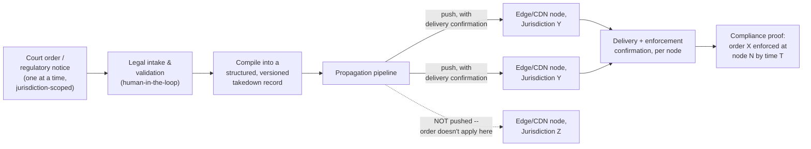

**Memory hook:** *"Every other chapter in this genre is about serving a big dataset fast despite a
slow source. This one is about guaranteeing one small, legally-critical fact reached the right
subset of nodes, with proof — scale is not the hard part, provable, scoped, timely delivery is."*

---

## Table of contents
[How to Identify This Topic](#how-to-identify-this-topic-in-an-interview) ·
[Interview Playbook](#interview-playbook) · [Requirements](#requirements-clarification) ·
[Capacity Estimation](#capacity-estimation-worked) · [API Design](#api-design) ·
[High-Level Architecture](#high-level-architecture) ·
[Architecture Evolution v1→v2→v3](#architecture-evolution-v1--v2--v3) ·
[End-to-End Walkthroughs](#end-to-end-request-walkthroughs) ·
[Deep Dive: Jurisdiction Scoping](#deep-dive-jurisdiction-scoping) ·
[Deep Dive: Guaranteed Propagation & Delivery Proof](#deep-dive-guaranteed-propagation--delivery-proof) ·
[Deep Dive: Conflicting/Overlapping Orders](#deep-dive-conflicting-and-overlapping-orders) ·
[Data Model](#data-model) · [Failure Modes](#failure-modes--mitigations) ·
[Non-Functional Walkthrough](#non-functional-walkthrough) ·
[Security & Compliance](#security--compliance) · [Cost & Trade-offs](#cost--trade-offs) ·
[Wrap-Up](#wrap-up-mvp-vs-stretch) · [Golden Rules](#golden-rules) ·
[Cheat Sheet](#master-cheat-sheet)

---

## How to identify this topic in an interview

- "Design a system to comply with legal takedown/blocking orders across a global content platform."
- "How would you enforce court-ordered content removal in specific countries only?"
- The tell that distinguishes this from the IP-list or sanctions chapters: the interviewer talks
  about **individual orders with deadlines and proof-of-compliance**, not a bulk list you refresh
  periodically. If they ask "what if this order is only for one country," that's the
  [jurisdiction-scoping deep dive](#deep-dive-jurisdiction-scoping) — don't reach for a global
  block by default.
- A follow-up about "what if two orders conflict" is the
  [conflicting-orders deep dive](#deep-dive-conflicting-and-overlapping-orders).

---

## Interview playbook

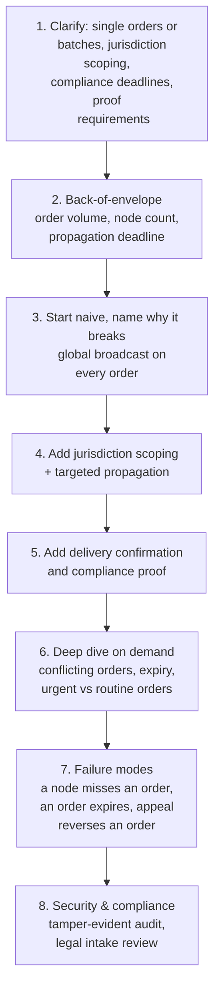

**What the interviewer is actually grading at each step:**
- Step 3: do you recognize that broadcasting every order to every node globally is both legally
  wrong (over-blocking outside the order's jurisdiction) and operationally wasteful?
- Step 5: do you propose **delivery confirmation per node**, not "assume the push succeeded" —
  this is the compliance-proof requirement that most system designs skip?
- Step 6: when asked about conflicting orders (a takedown vs. a later court reversal, or two
  regulators disagreeing), do you have an actual resolution policy, or do you hand-wave "we'd
  handle that somehow"?

---

## Requirements clarification

### Functional

| # | Requirement | Notes |
|---|---|---|
| F1 | Accept a legal order (content identifier, jurisdiction scope, action, deadline) and propagate the required enforcement action to every applicable node | The core function |
| F2 | Enforce orders **only** within their stated jurisdiction scope | Over-enforcement (blocking outside the ordered scope) is its own legal liability, not a safe default |
| F3 | Produce delivery/enforcement confirmation per node, and an aggregate compliance status per order | "Did we comply, and can we prove it" is the actual deliverable, not just "did the block happen somewhere" |
| F4 | Support order expiry, reversal (on appeal), and amendment | Legal orders are not always permanent or final |
| F5 | Human legal-review intake step before any order is compiled into an enforceable record | Orders arrive as legal documents, not structured data — someone has to translate scope, content identifier, and deadline into a machine-actionable record, and that translation step is a liability point worth designing around |

### Non-functional

| Requirement | Target | Why this number |
|---|---|---|
| Propagation latency for urgent orders | Minutes to low hours, driven by the order's own stated deadline, not a fixed platform SLA | Some orders carry a same-day compliance requirement; the system must be able to hit that, even if routine orders tolerate a slower, batched cadence |
| Propagation latency for routine/batched orders | Hours, batched for efficiency | Not every order is urgent; treating all orders as maximally urgent wastes propagation capacity that urgent orders need |
| Delivery guarantee | At-least-once with confirmation, per node, per order | "We pushed it" is not sufficient; "node N confirmed enforcement of order X as of time T" is the actual requirement |
| Jurisdiction-scoping accuracy | Strict — an order must never enforce outside its stated scope | Wrong-scope enforcement is a distinct legal failure mode from under-enforcement, and needs equal design attention |
| Auditability/proof | Strict, tamper-evident | This system's entire purpose, when it works, is to produce a legally defensible compliance record |

**Clarifying questions worth asking the interviewer up front — and what each answer changes:**

| Question | If the answer is... | ...then this changes |
|---|---|---|
| "Are orders jurisdiction-scoped, or always global?" | Jurisdiction-scoped, varies per order | Propagation must target the specific subset of edge nodes serving that jurisdiction, not broadcast globally — this is the single biggest architectural fork in the whole design |
| "Is there a standard compliance deadline, or does it vary per order?" | Varies, sometimes urgent (hours) sometimes routine (days) | Need two propagation lanes — an urgent, low-latency path and a routine, batched path — not one uniform pipeline |
| "What counts as proof of compliance for these regulators?" | Node-level confirmation with timestamps, retained for audit | Delivery confirmation and its retention become a core, not optional, part of the data model |
| "Can an order be appealed/reversed after enforcement has already begun?" | Yes | Orders need a lifecycle (active/expired/reversed/amended), not a one-shot fire-and-forget action |
| "Do overlapping/conflicting orders from different jurisdictions ever apply to the same content?" | Yes, occasionally | Need an explicit conflict-resolution policy — see the [conflicting-orders deep dive](#deep-dive-conflicting-and-overlapping-orders) |

**Say this out loud in the interview:** *"The hard part here isn't dataset size — it's precisely
scoped, provable, timely delivery of individually significant orders. I'd rather over-invest in
delivery confirmation and jurisdiction scoping than in raw propagation throughput, because the
failure modes that matter here are legal, not performance-related."*

---

## Capacity estimation, worked

```
Given (illustrative, a global content platform):
  Legal orders received per day, globally      = ~500 (routine + urgent combined)
  Edge/CDN nodes, globally                       = ~200, spread across ~40 jurisdictions
  Average nodes per jurisdiction                 = 200 / 40 = 5

Propagation fan-out per order (NOT a global broadcast):
  Average jurisdiction scope per order            = ~1.5 jurisdictions (some orders name
                                                      more than one country)
  Nodes actually targeted per order                = 1.5 x 5 ~= 7-8 nodes
  -> compare this to a naive global broadcast, which would target all 200 nodes per order --
     jurisdiction scoping cuts propagation fan-out by roughly 25x in this illustrative example,
     which is the number worth stating if asked "why does scoping matter for capacity, not just
     for legal correctness."

Total propagation messages per day                = 500 orders x ~8 nodes ~= 4,000 messages/day
  -> a genuinely small number. This system is NOT QPS-bound the way the IP-list or sanctions
     chapters are -- the hard constraint is latency-to-compliance-deadline and delivery
     guarantee per message, not throughput.

Urgent-order deadline math:
  Illustrative urgent deadline                     = 4 hours from order intake to confirmed
                                                      enforcement at every targeted node
  Steps that must fit inside that window: legal intake/validation, compilation, propagation,
  per-node enforcement, delivery confirmation collection
  -> if intake/validation alone routinely takes 2+ hours (a human legal reviewer's SLA), that
     consumes half the compliance window before propagation even starts -- a number worth
     surfacing explicitly, because it argues for a FAST-TRACKED human review lane for
     urgent orders, not just a fast propagation pipeline.
```

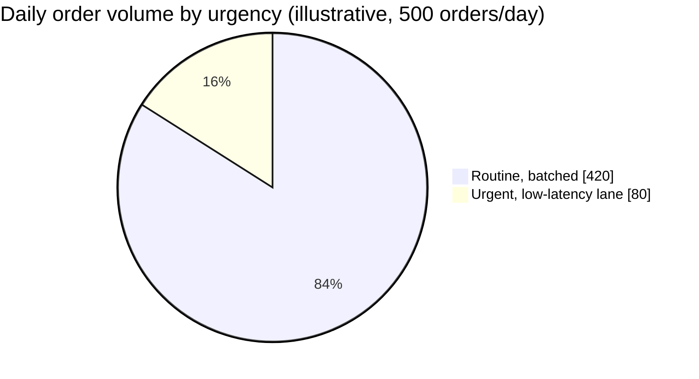

Roughly 1-in-6 orders needs the urgent lane — small enough that running every order through it
"just to be safe" would be wasteful over-provisioning, and large enough that a routine-only
pipeline with no fast lane at all would miss real deadlines regularly, not as a rare edge case.

**Redo-the-chain test:** if a regulator's order applies globally instead of to 1.5 jurisdictions,
fan-out jumps from ~8 nodes to all 200 — a 25x spike for that one order. The propagation pipeline
must handle this variance (occasional wide fan-out orders alongside many narrow ones) rather than
being sized only for the average case.

**The number worth memorizing:** this system's message volume is small (thousands/day, not
millions/second) — the design should optimize for guaranteed, provable, correctly-scoped delivery
per message, not for raw throughput. Don't over-engineer a high-QPS pipeline for a problem that
isn't QPS-bound.

---

## API design

### `POST /v1/orders` (legal intake, after human review)

```json
{
  "orderId": "order_88213",
  "issuingAuthority": "Regional Court, Berlin",
  "contentRef": { "type": "URL_PATTERN", "value": "example.com/content/9921" },
  "action": "BLOCK",
  "jurisdictionScope": ["DE"],
  "complianceDeadline": "2026-07-24T18:00:00Z",
  "urgency": "URGENT",
  "reviewedBy": "legal_reviewer_12",
  "sourceDocumentRef": "docstore://orders/order_88213.pdf"
}
```

### `GET /v1/orders/{orderId}/status` (compliance status, per node)

```json
{
  "orderId": "order_88213",
  "overallStatus": "COMPLIANT",
  "nodeStatus": [
    { "nodeId": "edge-fra-1", "status": "ENFORCED", "confirmedAt": "2026-07-24T15:02:11Z" },
    { "nodeId": "edge-fra-2", "status": "ENFORCED", "confirmedAt": "2026-07-24T15:02:14Z" }
  ],
  "targetedNodeCount": 2,
  "confirmedNodeCount": 2,
  "deadline": "2026-07-24T18:00:00Z"
}
```

| Field | Notes |
|---|---|
| `jurisdictionScope` | Drives which nodes are targeted — never a global broadcast by default |
| `nodeStatus` | Per-node confirmation, the actual proof artifact this whole system exists to produce |
| `overallStatus` | Derived, not stored independently — `COMPLIANT` only once every targeted node confirms; anything else is a live compliance risk that should page someone as the deadline approaches |

### `POST /v1/orders/{orderId}/reverse` (appeal/reversal)

```json
{ "reason": "Appeal granted, order vacated", "reversedBy": "legal_reviewer_12" }
```

Triggers the same propagation pipeline in reverse — un-enforce at every node that had it enforced,
with its own delivery confirmation and audit trail.

**The one sentence worth saying about the API surface:** *"Every order carries an explicit
jurisdiction scope and produces per-node delivery confirmation — 'we broadcast it' is never a
valid answer to 'are we compliant,' only 'every targeted node confirmed' is."*

---

## High-level architecture

### Architecture evolution (v1 → v2 → v3)

**v1 — global broadcast on every order:**

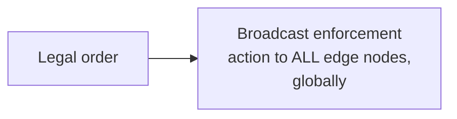

**Why it breaks:** most orders are jurisdiction-scoped — a global broadcast enforces content
restrictions in countries the order never named, which is over-enforcement with no legal basis and
a real liability in its own right (a form of unauthorized censorship). It's also wasteful at scale
for no benefit, per the capacity estimate above (~25x more propagation than needed).

**v2 — jurisdiction-scoped propagation, fire-and-forget:**

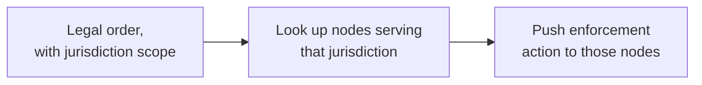

**Why it breaks:** "push" alone doesn't answer "did it actually take effect." A node could be
unreachable, could fail to apply the rule, or could apply it and then silently roll it back on a
later deploy — with fire-and-forget propagation, none of that is visible, and "are we compliant
with order X" has no reliable answer. For a system whose entire purpose is producing a legally
defensible compliance record, this is disqualifying, not just an operational gap.

**v3 — the real system: scoped propagation with mandatory delivery confirmation:**

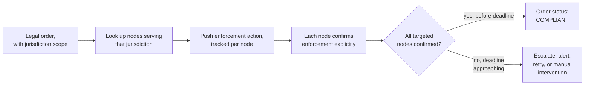

**What v3 fixes, one line each:** jurisdiction scoping (already in v2) prevents over-enforcement;
per-node delivery confirmation turns "we think it worked" into "we know it worked, and when"; and
an explicit deadline-tracking escalation path means an at-risk order surfaces to a human before it
becomes a missed deadline, not after.

---

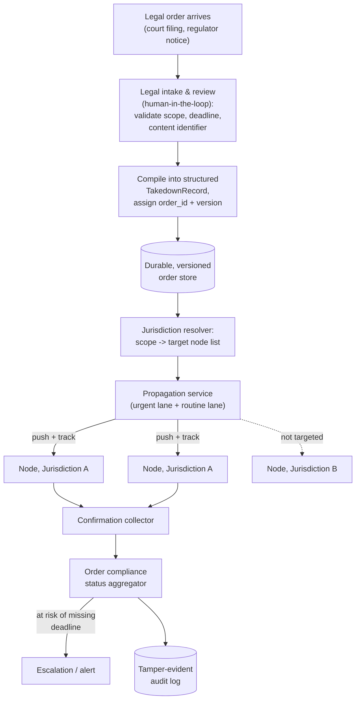

| Component | Role |
|---|---|
| Legal intake & review | The human translation step from legal document to structured, machine-actionable record — deliberately kept in the loop, not automated away |
| Durable, versioned order store | Every order (and every amendment/reversal) is an immutable, versioned record — same pattern as the IP guide's snapshot store, applied to individual legal facts instead of a bulk dataset |
| Jurisdiction resolver | Maps a scope (list of countries/regions) to the actual set of nodes serving that scope — the component that prevents over-enforcement |
| Propagation service, two lanes | Urgent orders get a low-latency, high-priority path; routine orders batch through a normal-priority path — see [propagation deep dive](#deep-dive-guaranteed-propagation--delivery-proof) |
| Confirmation collector | Receives and records explicit per-node enforcement confirmation — the proof artifact |
| Compliance status aggregator | Derives `COMPLIANT`/`AT_RISK`/`NON_COMPLIANT` per order from confirmation state vs. deadline, and escalates before a deadline is actually missed |

---

## End-to-end request walkthroughs

### Walkthrough 1 — an urgent order, intake to confirmed compliance

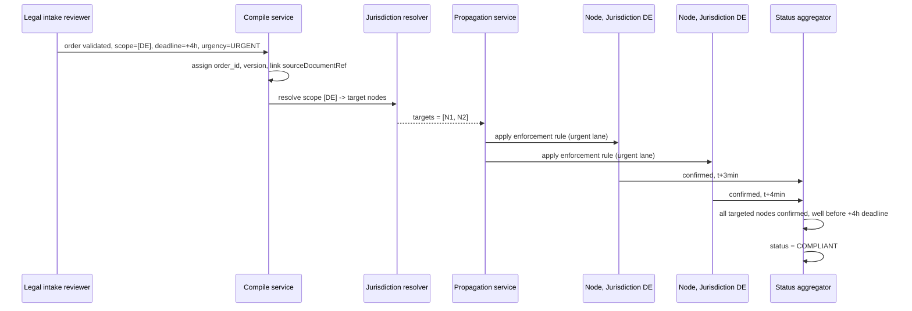

### Walkthrough 2 — a node misses its confirmation window as the deadline approaches

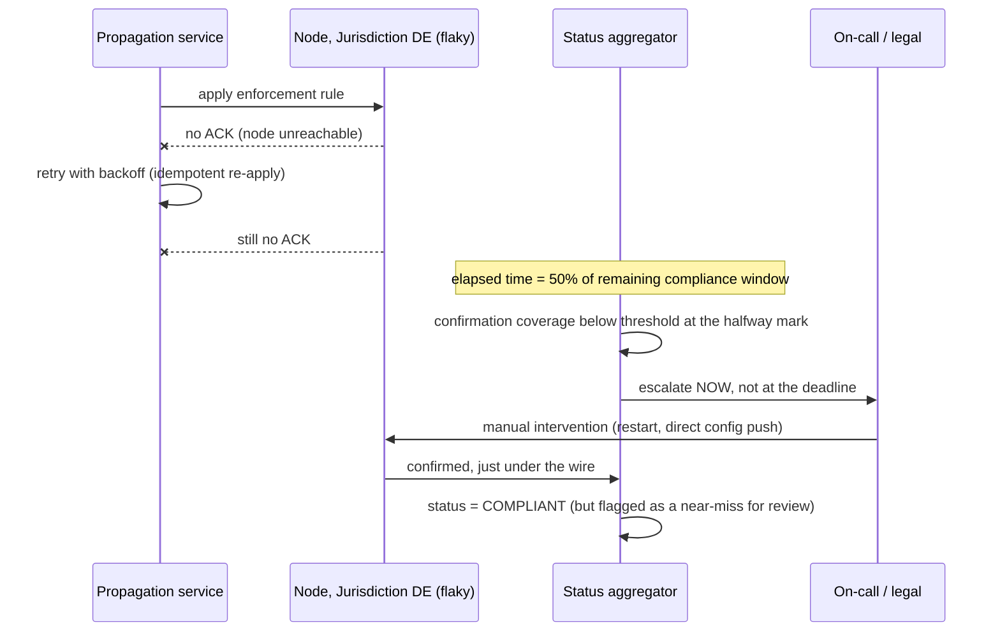

The escalation in walkthrough 2 fires at the **halfway point of the remaining window**, not after
the deadline — this is the concrete mechanism behind the
[guaranteed-propagation deep dive](#deep-dive-guaranteed-propagation--delivery-proof)'s "escalate
proactively" rule.

---

## Deep dive: jurisdiction scoping

The mistake this deep dive exists to prevent: treating every order as if it applies everywhere,
either out of caution ("safer to over-block") or convenience (a global broadcast is simpler to
build). Both are wrong — over-enforcement outside an order's legal scope is its own violation.

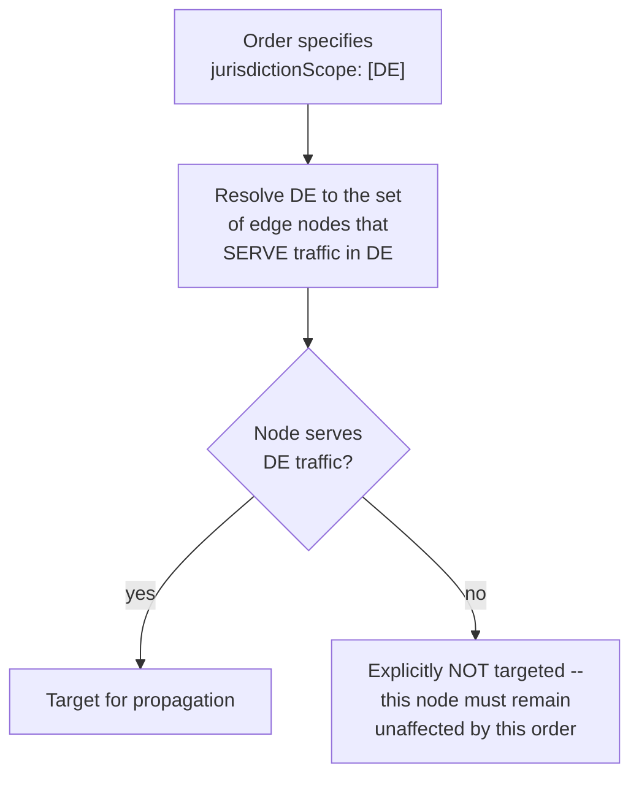

**Why "which nodes serve which jurisdictions" is itself a piece of state that needs to be
correct and current:** a CDN's mapping of nodes to the geographies they serve can change as
infrastructure grows — the jurisdiction resolver depends on this mapping being accurate, and an
out-of-date mapping is a scoping bug that's invisible until an audit or a legal challenge surfaces
it. Treat this mapping with the same rigor as the orders themselves: versioned, and changes to it
logged.

**Multi-jurisdiction orders and "the strictest scope named, nothing more":** an order naming
`["DE", "FR"]` targets nodes serving either — never nodes serving neither, and never a default to
"the whole EU" just because DE and FR are both in it, unless the order's text actually says that.

**Interview cheat-sheet:** *"Jurisdiction scoping is a mapping problem (scope → target nodes) that
must be treated as precisely as the orders themselves — over-scoping is a distinct legal failure
mode from under-scoping, not a safer default."*

---

## Deep dive: guaranteed propagation & delivery proof

"We pushed the enforcement rule" is not the deliverable — "every targeted node confirmed
enforcement, and we can show when" is.

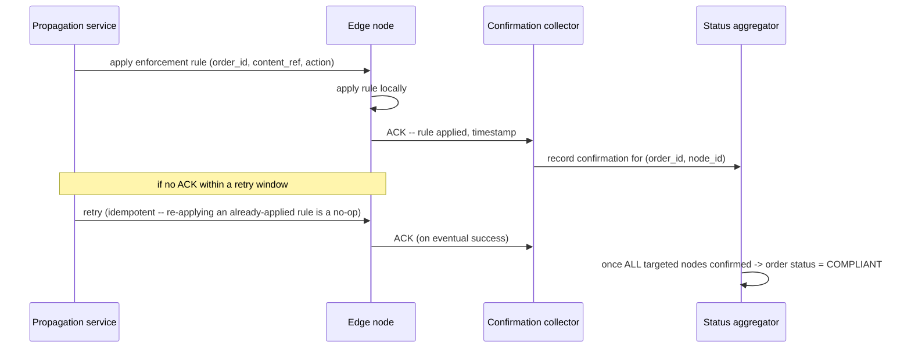

**Idempotency is mandatory, not optional, here.** Retries are the normal path for handling
transient node unavailability — an enforcement action must be safe to apply twice (e.g., "block
content X" is naturally idempotent; make sure the implementation actually is, rather than assuming
it).

**Deadline-aware escalation, not just eventual consistency.** Unlike the IP guide's staleness
tolerance (minutes to hours is usually fine), a specific order has a specific legal deadline —
the aggregator should escalate to a human well *before* the deadline if confirmation coverage is
lagging, not just log a missed SLA after the fact. A useful concrete rule: escalate at, say, 50% of
the remaining window if confirmation coverage is below some threshold, giving a human time to
intervene (chase a stuck node, engage the legal team about an at-risk deadline) before it's too
late to matter.

**Interview cheat-sheet:** *"Propagation must be retried until confirmed, idempotently, and the
compliance-status aggregator escalates proactively as a deadline approaches — 'eventually
consistent' isn't good enough framing here, because there's a hard legal clock running underneath
it."*

---

## Deep dive: conflicting and overlapping orders

Two orders can apply to the same content with different, even contradictory, instructions — e.g.
one jurisdiction orders a block while a later court ruling in the same jurisdiction vacates it, or
two different regulators reach different conclusions about the same content.

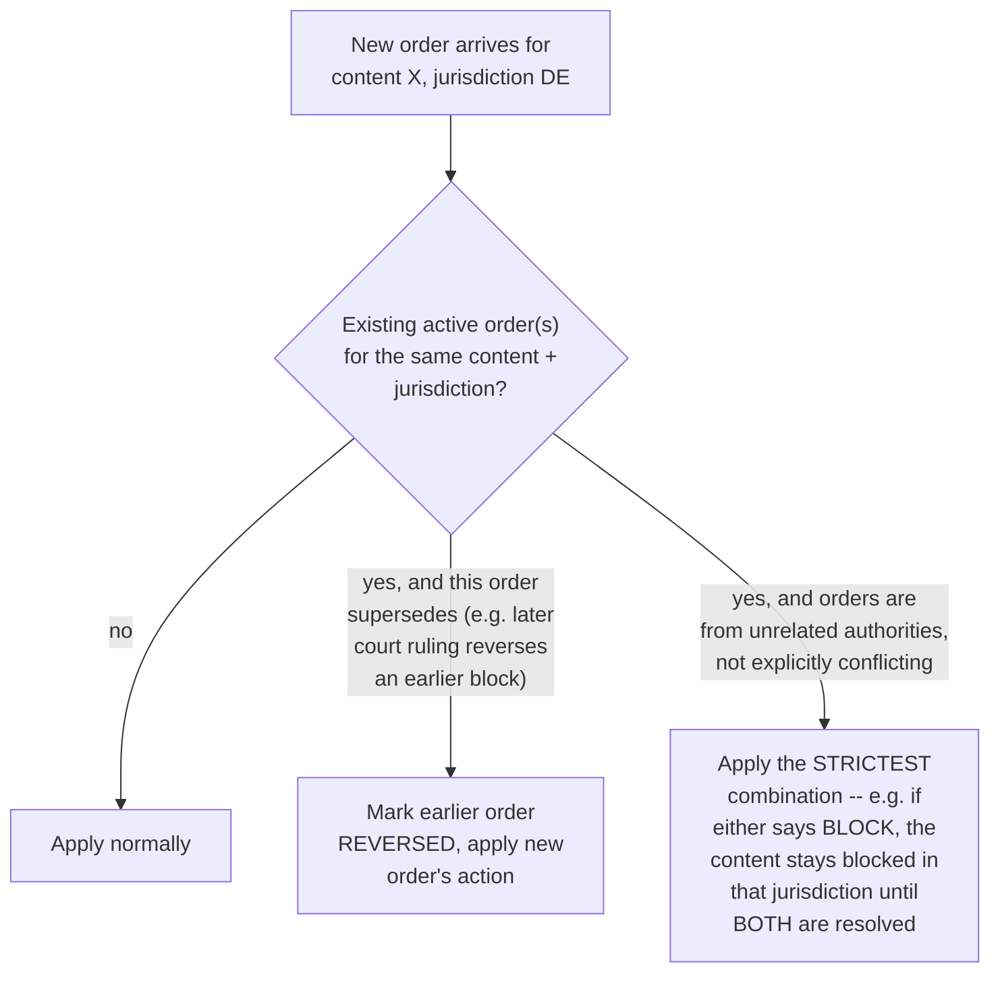

**Why "strictest wins" is the right default for unrelated, non-superseding orders:** if two
independent authorities both have jurisdiction and one says block while the other hasn't ruled,
un-blocking based on the silence of the second authority is a bigger legal risk than over-blocking
briefly — this mirrors the same asymmetric-cost reasoning from the sanctions-screening chapter,
applied to legal risk instead of AML risk.

**Explicit supersession is a legal fact, not a heuristic.** One order reversing another must be
represented as an explicit link between order records (this order supersedes/reverses that
order_id) established during legal intake review — never inferred automatically from timing or
content similarity.

**Interview cheat-sheet:** *"Default to the strictest applicable action when orders don't
explicitly supersede each other, and require an explicit, human-reviewed link when one order does
reverse or amend another — never infer supersession automatically."*

---

## Data model

**Order lifecycle** — every failure mode in this chapter is a statement about an unwanted or
missed transition here:

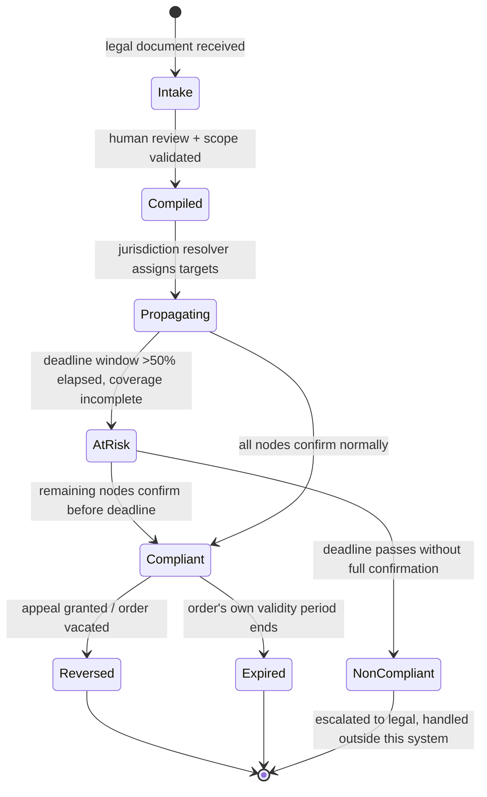

`AtRisk` is a real, monitored state, not just an internal timer — it's what the escalation logic
in [walkthrough 2 above](#end-to-end-request-walkthroughs) actually watches.

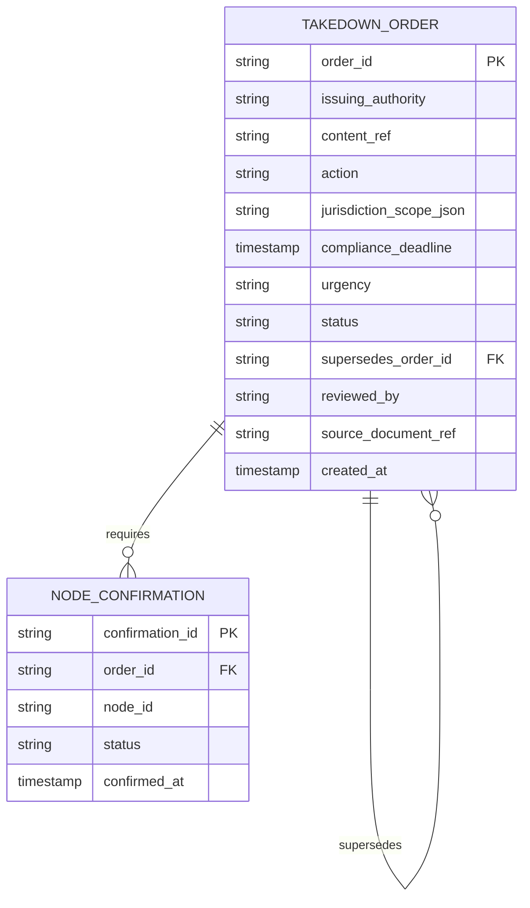

| Table | Storage choice & why |
|---|---|
| `TakedownOrder` | Relational, low volume (thousands/day per the capacity estimate) — needs strong consistency and transactional integrity for status transitions (active → reversed/expired), not eventual-consistency tolerance |
| `NodeConfirmation` | Relational or append-only log, one row per (order, node) pair — small enough in volume to not need the wide-column/time-series treatment the higher-QPS chapters in this genre require |

**Why this system's data model looks nothing like the IP guide's:** volume is low enough that the
usual "does it fit in memory everywhere" and "how do we shard this" questions don't apply at
all — the design effort goes entirely into correctness (scoping, supersession, confirmation), not
scale.

---

## Failure modes & mitigations

| Failure mode | Impact | Mitigation |
|---|---|---|
| **A targeted node never confirms** (network partition, node down, deploy wiped the rule) | Order sits `AT_RISK` past its deadline, real non-compliance | Retry with backoff, idempotent re-application; deadline-aware escalation to a human well before the legal deadline, not after |
| **Jurisdiction-to-node mapping is stale** (infra changed, mapping didn't) | Wrong nodes targeted — either missed enforcement in a jurisdiction that should be covered, or enforcement in one that shouldn't be | Version and audit the mapping itself; periodic reconciliation job comparing mapping assumptions against actual node/traffic geography |
| **An order is compiled with the wrong scope during legal intake** (human transcription error from the legal document) | Wrong-scope enforcement — either over- or under-block relative to what the order actually says | Legal intake requires a second reviewer sign-off for anything beyond routine/templated orders; `sourceDocumentRef` always links back to the original legal document for after-the-fact verification |
| **Two orders conflict without an explicit supersession link** | Ambiguous enforcement state | Default to strictest applicable action (see [conflicting-orders deep dive](#deep-dive-conflicting-and-overlapping-orders)); flag for legal review rather than silently picking one |
| **A reversed order's un-enforcement propagation itself fails on some nodes** | Content stays blocked after a court vacated the order — a real, ongoing legal exposure, not a one-time miss | Reversal propagation uses the exact same guaranteed-delivery-with-confirmation mechanism as original enforcement — it is not treated as lower priority just because it's an "undo" |

---

## Non-functional walkthrough

**This system is not throughput-bound.** The capacity estimate shows thousands of propagation
messages per day, not millions per second — design effort belongs in correctness (scoping,
confirmation, conflict resolution) and provability (audit trail), not in horizontal scaling of a
hot path.

**Availability is about the propagation and confirmation pipeline being resilient to individual
node flakiness**, via retries and idempotency — not about surviving an external-authority outage
the way the IP guide is, because there is no continuously-polled external authority here; each
order is a discrete, human-reviewed intake event.

**Consistency is deadline-driven, not staleness-tolerant.** Where the IP guide's consistency bar
is "no DC more than N minutes behind," this system's bar is "every targeted node confirmed before
the order's specific deadline" — a per-order, not a global, consistency target.

**Warm-up and fail-open, adapted to a discrete-order system.** A newly-deployed or restarted edge
node must sync the full set of currently-active orders from the durable order store **before**
serving traffic — the same "never start empty" discipline as the
[IP guide's warm-up deep dive](./46-Design-an-IP-Allowlist-Blocklist-Service-FAANG-Guide.md#deep-dive-warm-up--cold-start),
just syncing a small set of discrete active records instead of loading a bulk snapshot. The
fail-open equivalent here: a node that cannot yet confirm its active-order sync should **not**
apply any ad-hoc enforcement of its own — it should report itself not-ready and let traffic route
elsewhere (or serve unenforced, if that's the safer default for the content type) rather than
guessing at enforcement state, mirroring the IP guide's "never fabricate a default, never start
serving on missing data" principle.

---

## Security & compliance

- **Tamper-evident audit log** for every order, confirmation, and status transition — this
  system's output *is* a legal compliance record, and its integrity may itself be scrutinized in
  court.
- **Access control on legal intake and reversal actions** — creating or reversing an enforcement
  order is a highly security-sensitive action and should require authenticated, logged,
  role-restricted access, ideally with the two-reviewer pattern noted in the failure-modes table.
- **Source document retention** — `sourceDocumentRef` linking every structured order back to the
  original legal filing is not optional; a compliance record without its source document is much
  weaker evidence.
- **Data minimization for content references** — store enough to identify and enforce against the
  content (URL pattern, content hash, ID), avoid storing more of the underlying content itself than
  necessary for enforcement and audit.

---

## Cost & trade-offs

**Low infrastructure cost, concentrated legal-review cost.** Like the sanctions-screening chapter,
the dominant real cost here is human time — legal intake review — not compute. Unlike that
chapter, volume is low enough that this is a modest, not a massive, headcount question.

**Urgent-lane vs. routine-lane propagation is the main architectural cost trade-off.** Running
every order through a low-latency, individually-tracked urgent path is unnecessary and wasteful
for routine, batchable orders; running every order through a batched routine path risks missing
genuinely urgent deadlines. Two lanes, sized differently, is the right trade-off — say this
explicitly rather than picking one uniform pipeline.

---

## Wrap-up: MVP vs. stretch

**In scope for an MVP:**
- Legal intake with human review, producing a structured, versioned order record with explicit
  jurisdiction scope.
- Jurisdiction resolver + scoped propagation with per-node delivery confirmation.
- Deadline-aware compliance status per order, with escalation before a deadline is missed.
- Tamper-evident audit log linking every order back to its source document.

**Explicitly out of scope for an MVP:**
- Automated conflict/supersession detection — start with explicit, human-established supersession
  links; automatic detection of conflicting orders is a much harder, higher-risk-of-error feature
  to get right.
- Multi-regulator, multi-format order ingestion (parsing structured feeds from many different
  courts/regulators automatically) — start with a single, human-mediated intake process.

**Stretch goals, worth naming if asked "what's next":**
1. **Structured order ingestion from regulators who publish machine-readable notices**, reducing
   (not eliminating) the human intake step for high-volume, templated order types.
2. **Automated jurisdiction-mapping reconciliation**, continuously verifying the node-to-geography
   mapping against actual traffic/infrastructure data instead of relying on periodic manual checks.
3. **Cross-platform coordination** for orders that name multiple, separately-operated platforms —
   a much larger scope than a single company's own edge infrastructure.

---

## Golden rules

- **This is a correctness and provability problem, not a scale problem.** Message volume is low;
  design effort belongs in scoping, confirmation, and audit, not throughput.
- **Jurisdiction scope is a strict boundary, not a suggestion.** Over-enforcement outside an
  order's scope is a distinct legal failure from under-enforcement — treat both with equal care.
- **"We pushed it" is never sufficient. "Every targeted node confirmed it, and we can show when"
  is the actual deliverable.**
- **Deadlines are per-order and legally real** — escalate proactively as a deadline approaches,
  don't just log a miss after the fact.
- **Conflicting orders default to the strictest applicable action** unless an explicit,
  human-established supersession link says otherwise.
- **Every order's structured record must trace back to its original source document** — the audit
  trail is the product here as much as the enforcement itself.

---

## Master cheat sheet

**One-liners:**
- Unlike the IP-list or sanctions chapters, this system is low-throughput and high-stakes-per-item
  — optimize for scoped, provable, timely delivery of individual orders, not raw scale.
- Jurisdiction scoping (scope → target node mapping) prevents over-enforcement, which is its own
  legal failure mode distinct from under-enforcement.
- Delivery confirmation, not fire-and-forget push, is the actual deliverable — idempotent retries
  until every targeted node confirms.
- Compliance status is deadline-aware and escalates proactively, because the clock underneath it
  is a real legal deadline, not a soft SLA.
- Conflicting orders default to the strictest applicable action unless an explicit, human-reviewed
  supersession link says one order reverses another.
- The audit trail — order, source document, confirmations, status transitions — is tamper-evident
  and is, in a real sense, the product.

**Formula chain:**
```
targeted_nodes_per_order = jurisdictions_named x avg_nodes_per_jurisdiction
propagation_messages/day = orders/day x targeted_nodes_per_order
compliance_window_remaining = deadline - now - (intake_review_time already spent)
```

**Numbers:** message volume in the thousands/day, not millions/second — this is not a QPS-bound
system · jurisdiction scoping typically cuts propagation fan-out by an order of magnitude versus a
naive global broadcast · escalate at a fraction (e.g. 50%) of the remaining compliance window if
confirmation coverage is lagging, not only after a deadline is missed.
