# Design a Toll-Booth Vehicle/Insurance Validity Check System — FAANG Interview Guide

> Source chapter type: same genre as
> [the IP allow/block-list guide](./46-Design-an-IP-Allowlist-Blocklist-Service-FAANG-Guide.md) —
> a real-time decision gated by a slow, externally-owned authority — but pushed to a physical,
> ultra-high-throughput extreme: a vehicle crossing a toll gantry at highway speed gives you a
> **sub-100ms** window to decide, there is no "queue and review later," and the authority (a
> government vehicle-registry/insurance database) is not just slow — it may be a **legacy
> mainframe system with its own capacity ceiling**, not merely a slow API.

## Mental model

A highway tolling system (think E-ZPass, FASTag, or an ANPR/number-plate-recognition gantry) must
decide, as a vehicle passes at 100+ km/h, whether that vehicle has valid insurance/registration —
often to apply a different toll rate, flag it for enforcement, or (in some jurisdictions) deny
passage. The registry of "which vehicles have valid insurance right now" is owned by a government
transport/insurance authority, updated on their schedule (insurers report policy issuance/lapse to
the government system in batches, sometimes with real lag), and queryable only through an
interface with real, hard limits — nothing like the throughput a busy highway network needs.

The physics make this the most latency-extreme chapter in this genre:

1. **The decision window is physically bounded, not just a UX preference.** A camera/RFID reader
   captures the vehicle, and the system has milliseconds — not the "feels instant" 100ms of a
   typeahead search, but genuinely sub-100ms including camera OCR, lookup, and gate/signal
   actuation — before the vehicle is already through or a barrier physically needs to move.
2. **The authority's own throughput ceiling is often much lower than your own peak QPS**, and
   unlike a modern rate-limited REST API, it may be a decades-old government system that simply
   cannot be scaled up on your request.
3. **"Fail" has a physical consequence, not just a wrong API response.** A false block can mean a
   barrier arm coming down on a car that's already committed to the lane at highway speed — a
   safety issue, not merely a UX annoyance.

**The one picture to remember forever:**

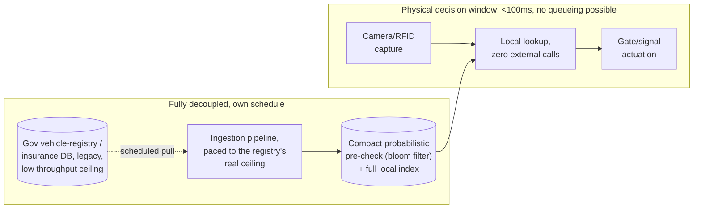

**Memory hook:** *"Same ingestion/serving split as any slow-authority system — but here the
serving side has a physical, not just a product, deadline, and the pre-check layer (bloom filter)
exists to make the common case even cheaper than a full trie lookup, because milliseconds actually
matter here."*

---

## Table of contents
[How to Identify This Topic](#how-to-identify-this-topic-in-an-interview) ·
[Interview Playbook](#interview-playbook) · [Requirements](#requirements-clarification) ·
[Capacity Estimation](#capacity-estimation-worked) · [API Design](#api-design) ·
[High-Level Architecture](#high-level-architecture) ·
[Architecture Evolution v1→v2→v3](#architecture-evolution-v1--v2--v3) ·
[End-to-End Walkthroughs](#end-to-end-request-walkthroughs) ·
[Deep Dive: Bloom-Filter Pre-Check](#deep-dive-probabilistic-pre-check-with-a-bloom-filter) ·
[Deep Dive: Warm-Up at a Physical Gantry](#deep-dive-warm-up--boot-at-a-physical-gantry) ·
[Deep Dive: Fail-Open vs Fail-Closed at Highway Speed](#deep-dive-fail-open-vs-fail-closed-at-highway-speed) ·
[Data Model](#data-model) · [Failure Modes](#failure-modes--mitigations) ·
[Non-Functional Walkthrough](#non-functional-walkthrough) ·
[Security & Compliance](#security--compliance) · [Cost & Trade-offs](#cost--trade-offs) ·
[Wrap-Up](#wrap-up-mvp-vs-stretch) · [Golden Rules](#golden-rules) ·
[Cheat Sheet](#master-cheat-sheet)

---

## How to identify this topic in an interview

- "Design a highway tolling/ANPR system that checks vehicle registration or insurance validity in
  real time."
- Any variant where the decision has a **physical actuation deadline** (a barrier, a gate, a
  signal) rather than just a product-UX latency target — this is the tell that distinguishes this
  chapter from the IP guide's "just" sub-10ms software target.
- A follow-up about "what if the government system is a legacy mainframe with a hard concurrent-
  connection limit" is testing whether you treat the authority's throughput ceiling as a hard
  physical constraint on your ingestion design, not something you can brute-force past with more
  of your own infrastructure.

---

## Interview playbook

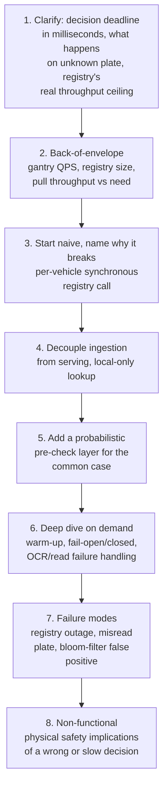

**What the interviewer is actually grading at each step:**
- Step 3: do you immediately rule out a synchronous per-vehicle registry call, given a physical
  deadline in the tens of milliseconds against a registry that may take seconds?
- Step 5: do you know *why* a bloom filter (or similar probabilistic structure) helps here
  specifically — the common case ("plate is fine, let it through") can be answered even faster
  than a full lookup, while the rare case (possible match) falls through to the full structure?
- Step 8: do you connect a wrong or slow decision to an actual physical safety consequence, not
  just "the user sees an error"?

---

## Requirements clarification

### Functional

| # | Requirement | Notes |
|---|---|---|
| F1 | For a vehicle plate captured at a gantry, decide `VALID`/`INVALID`/`UNKNOWN` insurance/registration status within the physical decision window | The core function |
| F2 | Trigger the appropriate physical/soft consequence per decision — different toll rate, enforcement flag, or (where applicable) a barrier/signal action | Ties the software decision to a physical outcome |
| F3 | Log every decision with enough detail (plate, timestamp, gantry, matched record version) for later enforcement/dispute resolution | Toll and insurance enforcement disputes are common and need an auditable trail |
| F4 | Support plate-read failure/ambiguity gracefully (OCR misreads, obscured plates) | The upstream signal (camera OCR) is itself imperfect, a wrinkle this chapter has that the IP guide doesn't |

### Non-functional

| Requirement | Target | Why this number |
|---|---|---|
| Decision latency | Single-digit to low-double-digit milliseconds, end-to-end including OCR and any actuation trigger | This is a **physical** deadline — a barrier arm or a signal has to act before the vehicle arrives, not just "feel fast" |
| Decision availability | Extremely high — the tolling lane must keep functioning even during a registry outage | A lane that can't decide is a lane that must default to some behavior (see [fail-open deep dive](#deep-dive-fail-open-vs-fail-closed-at-highway-speed)) rather than simply halting traffic |
| Freshness of the registry data | Hours, bounded by the source's own batch/report cadence — insurers reporting policy changes to the government system is itself often not real-time | Sets the realistic staleness bound; a policy that lapsed 10 minutes ago may not be reflected yet, and that's an accepted, stated limitation, not a bug |
| Registry query throughput available to you | Often very low relative to gantry QPS, especially for legacy government systems | The load-bearing constraint of this whole design — treat it as similar in shape to a hard rate limit, even if the source frames it as a "concurrent connection limit" rather than a requests-per-minute number |
| Physical safety | Zero tolerance for a decision that causes unsafe barrier/signal behavior | A wrong `INVALID` result that triggers a physical barrier action on a vehicle already committed to the lane is a safety incident, not a data-quality issue |

**Clarifying questions worth asking the interviewer up front — and what each answer changes:**

| Question | If the answer is... | ...then this changes |
|---|---|---|
| "What's the actual decision deadline — is there a physical barrier, or just a billing/flagging outcome?" | No physical barrier, just billing-rate/enforcement-flag differences | Relaxes the hard millisecond deadline somewhat, but doesn't remove the throughput-mismatch problem — still must be fully local, just with slightly more headroom |
| "What's the registry's real sustained throughput, and is it symmetric with typical highway/network peak load?" | Registry sustains far less than gantry peak QPS (common for legacy gov systems) | Confirms per-vehicle synchronous queries are impossible regardless of latency tolerance — this is a throughput ceiling, not just a latency problem |
| "What should happen on a misread or unrecognized plate?" | Flag for manual/enforcement review, don't block passage | Confirms `UNKNOWN` is a distinct, non-blocking outcome from `INVALID` — an OCR failure must never be treated the same as a confirmed invalid record |
| "How fresh does insurance data need to be — same-day, or is next-day acceptable?" | Next-day acceptable is common in practice, since insurers themselves report with lag | Sets a realistic, defensible SLA rather than promising same-second accuracy the underlying data can't support |

**Say this out loud in the interview:** *"The registry's throughput ceiling, not just its latency,
is the binding constraint here — this rules out synchronous per-vehicle queries entirely, the same
way it did in the IP-list chapter, but the physical deadline on the serving side is an order of
magnitude tighter than a typical software SLA."*

---

## Capacity estimation, worked

```
Given (illustrative, a national highway tolling network):
  Gantries, nationwide                          = 2,000
  Peak vehicles/sec across the whole network    = 5,000 (rush hour, aggregate)
  Peak vehicles/sec at a single busy gantry      = ~15-20 (multiple lanes)

Registered vehicle records (insurance/registration DB):
  Vehicles nationwide                            = 250,000,000
  Bytes per record (plate 10B, status 1B,
    policy expiry 8B, insurer id 4B, ~10B overhead) ~= 35 bytes
  Raw dataset size                                = 250,000,000 x 35B ~= 8.75 GB
  -> larger than the IP guide's ~20MB, but still comfortably fits in memory on a
     well-provisioned server -- NOT the bottleneck. As with the IP guide, "does it fit" is
     rarely the hard question in this genre; "how do we refresh it without exceeding the
     source's throughput" is.

Registry query throughput ceiling (illustrative, legacy gov system):
  Sustained concurrent-connection / query ceiling = ~50 queries/sec
  -> against 5,000 vehicles/sec at national peak, that's a 100x gap. Exactly the same shape of
     mismatch as the IP guide's rate-limit gap, just with a different root cause (a throughput
     ceiling instead of an explicit rate limit) -- the design implication is identical: never
     query per-vehicle, always pull in bulk on your own schedule.

Full-refresh pull time, respecting that ceiling:
  Records per query page                          = 5,000
  Pages needed                                     = 250,000,000 / 5,000 = 50,000 pages
  Time at 50 queries/sec                            = 50,000 / 50 = 1,000 seconds ~= 17 minutes
  -> a full nationwide refresh takes ~17 minutes at this illustrative throughput ceiling --
     realistic to run a few times a day, not continuously, and definitely not per-vehicle.

Distribution to gantries:
  Dataset size per gantry (full local copy)        = ~8.75 GB
  -> larger than the IP guide's snapshot but still a normal, cacheable, fully-in-memory dataset
     for a modern gantry-side server -- pushed via your own internal distribution network to
     every gantry, never by having 2,000 gantries independently query the government registry.
```

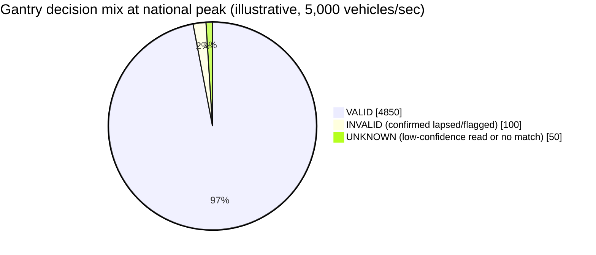

The `UNKNOWN` slice is deliberately non-trivial here — plate misreads are a normal, expected
fraction of traffic at highway speed, not a rare edge case, which is exactly why the
[fail-open deep dive](#deep-dive-fail-open-vs-fail-closed-at-highway-speed) treats `UNKNOWN` as a
first-class outcome rather than an afterthought.

**Redo-the-chain test:** if the registry's throughput ceiling is actually 500 queries/sec instead
of 50 (a modernized system), the full-refresh time drops to under 2 minutes — enabling a much
tighter refresh cadence. Always confirm the real number rather than assuming a specific ceiling;
the *shape* of the design (decouple ingestion from serving) doesn't change, but the achievable
freshness bound does.

**The number worth memorizing:** the registry's throughput ceiling — not the network's overall
QPS — determines how often a full refresh is realistically achievable. A tolling network handling
5,000 vehicles/sec still only needs the registry to sustain a full-refresh pull a few times a day,
because the two numbers are structurally decoupled by design.

---

## API design

### `POST /v1/gantry-check` (local, at the gantry edge — the actual hot path)

```json
{
  "gantryId": "gantry_ncr_112",
  "plate": "DL01AB1234",
  "readConfidence": 0.97,
  "capturedAt": "2026-07-24T08:12:03.114Z"
}
```

Response (target: single-digit milliseconds):
```json
{
  "plate": "DL01AB1234",
  "status": "VALID",
  "policyExpiry": "2027-01-15",
  "registryVersion": "v_20260723_0400",
  "action": "STANDARD_TOLL",
  "latencyMicros": 380
}
```

| Field | Notes |
|---|---|
| `readConfidence` | Carried from the OCR/RFID capture step — a low-confidence read should influence how the system treats an `INVALID` result (see [fail-open deep dive](#deep-dive-fail-open-vs-fail-closed-at-highway-speed)); a confident read of a genuinely invalid plate is a very different case from an unconfident read that merely looks invalid |
| `status` | `VALID`, `INVALID`, or `UNKNOWN` (plate not found / read too ambiguous to match) — three-way, same shape as the sanctions-screening chapter's decision, for a similar reason: an absent or ambiguous match should never collapse into a hard block |
| `registryVersion` | Same auditability pattern as every guide in this genre — every decision traceable to the exact snapshot it was computed against |

**No external call ever happens on this path — the same rule as the IP guide, with a much less
forgiving deadline to enforce it.**

### `GET /v1/admin/registry-status` (operational visibility)

Same shape as the IP guide's feed-status endpoint — last successful pull, staleness, current
version — because the operational question ("is our dependency currently degraded") is identical
across this whole genre.

**The one sentence worth saying about the API surface:** *"The gantry-side check never touches the
government registry — it's a local, in-memory lookup with a three-way outcome, because both 'plate
not found' and 'OCR wasn't confident' need to be distinct from a confirmed invalid record."*

---

## High-level architecture

### Architecture evolution (v1 → v2 → v3)

**v1 — synchronous per-vehicle registry query:**

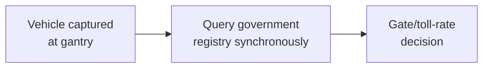

**Why it breaks:** the registry's throughput ceiling (tens of queries/sec in the illustrative
numbers) is roughly two orders of magnitude below national peak vehicle throughput — this isn't a
latency problem you can paper over with a timeout, it's a hard capacity mismatch that guarantees
most vehicles either get no answer in time or contribute to overwhelming a legacy system you don't
control. Even ignoring throughput, the registry's own latency (likely tens to hundreds of
milliseconds for a legacy system, possibly more under load) blows through a sub-100ms physical
deadline on its own.

**v2 — regional cache with a fallback to the registry on miss:**

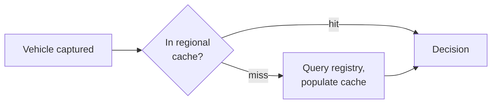

**Why it breaks:** identical failure shape to the IP guide's v2 — a miss still calls the slow,
throughput-limited registry inline, so any burst of unfamiliar plates (out-of-region travelers,
newly registered vehicles, a highway's normal daily traffic mix) creates exactly the kind of
concurrent-call spike the registry can't sustain. There's also still no answer for "how do we get
the *entire* national vehicle registry pre-loaded before the first car with an unfamiliar plate
arrives."

**v3 — the real system: full local dataset, refreshed on the registry's own achievable cadence:**

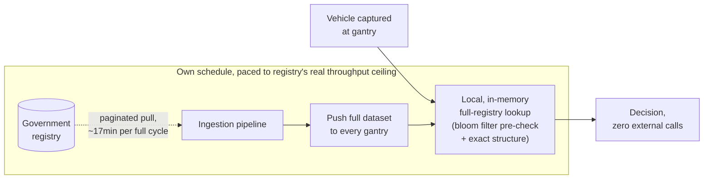

**What v3 fixes, one line each:** every gantry holds the entire national dataset locally (it's
only ~9GB, per the capacity estimate — trivial to fully replicate); the registry is queried on a
schedule your own ingestion pipeline paces to its real throughput ceiling, never per-vehicle; and
a probabilistic pre-check layer (next deep dive) shaves even the local lookup's common-case cost
further, which matters at this system's physical latency budget in a way it didn't in the IP
guide's software-only budget.

---

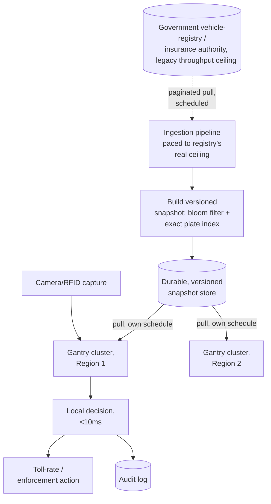

| Component | Role |
|---|---|
| Ingestion pipeline | Same role as the IP guide's — sole caller of the government registry, paced to its real throughput ceiling rather than an arbitrary schedule |
| Snapshot builder | Compiles two structures: a compact bloom filter (fast common-case pre-check) and the exact plate-status index (authoritative answer) — see the [bloom-filter deep dive](#deep-dive-probabilistic-pre-check-with-a-bloom-filter) |
| Durable snapshot store | Same role as every guide in this genre — the one place every gantry cluster pulls from |
| Gantry cluster | Holds the full dataset locally, answers every capture event in-process, zero external calls |
| Audit log | Every decision logged with plate, gantry, timestamp, and registry version — feeds enforcement/dispute resolution |

---

## End-to-end request walkthroughs

### Walkthrough 1 — a normal vehicle pass, bloom filter shortcuts the check

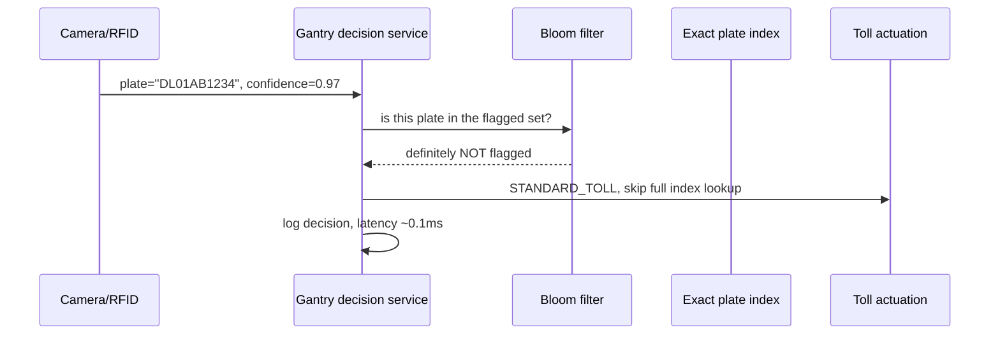

### Walkthrough 2 — a low-confidence read, resolved to UNKNOWN, never to INVALID

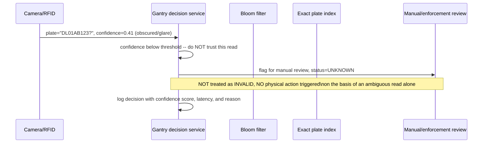

Notice walkthrough 2 never even reaches the bloom filter or index — a low-confidence read is
rejected at the input stage, exactly the discipline the
[fail-open deep dive](#deep-dive-fail-open-vs-fail-closed-at-highway-speed) insists on.

---

## Deep dive: probabilistic pre-check with a bloom filter

At this system's latency budget (single-digit milliseconds, including camera OCR), shaving even a
full in-memory index lookup down further has real value — a bloom filter answers "is this plate
*definitely not* in the invalid/flagged set" in a handful of memory accesses, faster than a full
index lookup, for the common case where a vehicle's status is unremarkable.

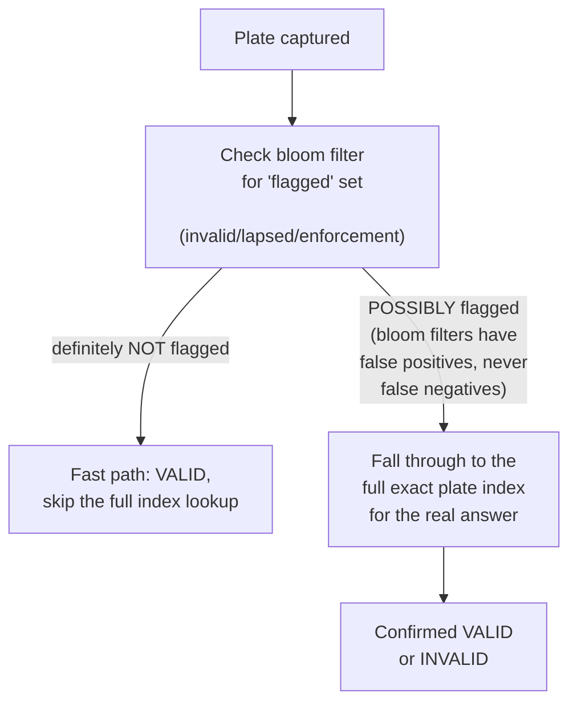

**Why a bloom filter and not just the full index for every lookup:** a bloom filter's "definitely
not present" answer is unconditionally correct (zero false negatives, by construction) and cheaper
to check than the full index — since the overwhelming majority of vehicles on any given day are
neither invalid nor flagged for enforcement, the fast path handles the common case at lower cost,
while the full index still handles every case that needs a real answer (both the rare true
positives and the rarer false positives the bloom filter allows through).

**Why this optimization matters more here than in the IP guide:** the IP guide's ~20MB trie lookup
is already comfortably within its <10ms budget with room to spare; this system's budget is tighter
and the dataset larger (~9GB) — the bloom filter's job is to keep the *typical* request even
cheaper than "full index lookup," which matters when the full budget includes camera OCR time that
this system doesn't fully control.

**Sizing the bloom filter:** sized off the *flagged* subset, not the full 250M-vehicle registry —
if, say, 2% of vehicles are currently flagged (lapsed/invalid/enforcement), that's ~5,000,000
entries, which at a low false-positive rate (~1%) needs a bloom filter on the order of a few tens
of MB — small enough to fit comfortably alongside the full index, not a replacement for it.

**Interview cheat-sheet:** *"A bloom filter never produces a false negative, only occasional false
positives — so it's safe as a fast 'definitely fine, skip further checking' pre-check, as long as
every 'maybe flagged' result still falls through to the authoritative full index rather than being
trusted on its own."*

---

## Deep dive: warm-up / boot at a physical gantry

Same principle as the IP guide's warm-up deep dive, with a sharper consequence: a gantry that
comes online without its dataset loaded cannot safely make *any* decision — and unlike a web
service that can simply return an error page, a physical lane has vehicles actively approaching it.

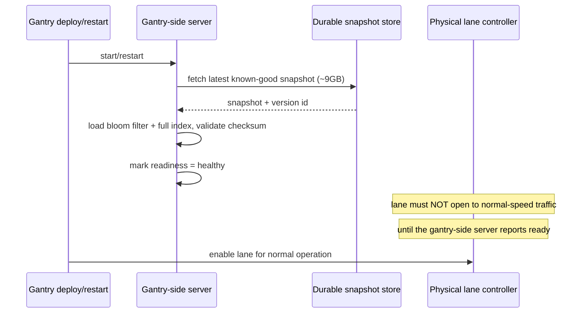

**The physical-safety consequence of skipping this:** a lane opened before its decision service is
ready either has to fail every vehicle to `UNKNOWN` (acceptable if `UNKNOWN` is a non-blocking
outcome, per the requirements) or, worse, silently default to `VALID` for everything — the latter
is exactly the "default to safe/permissive on missing data" trap that quietly defeats the whole
system's purpose during every restart. Gate lane activation on readiness, not on process start,
exactly as the IP guide's warm-up deep dive prescribes, with the added note that "lane activation"
here is a physical-world action with its own controller to coordinate with.

**Interview cheat-sheet:** *"A gantry doesn't open to normal traffic until its local dataset is
loaded and validated — the same warm-up discipline as any system in this genre, but here the thing
gated on readiness is a physical lane, not just a load balancer's routing table."*

---

## Deep dive: fail-open vs fail-closed at highway speed

The IP guide's fail-open/fail-closed deep dive concluded "serve the last known-good snapshot
indefinitely" as the general answer. Here, the same principle applies to *staleness*, but there's
an additional, physically urgent decision: what happens on a **read failure or low-confidence OCR
match**, independent of registry freshness?

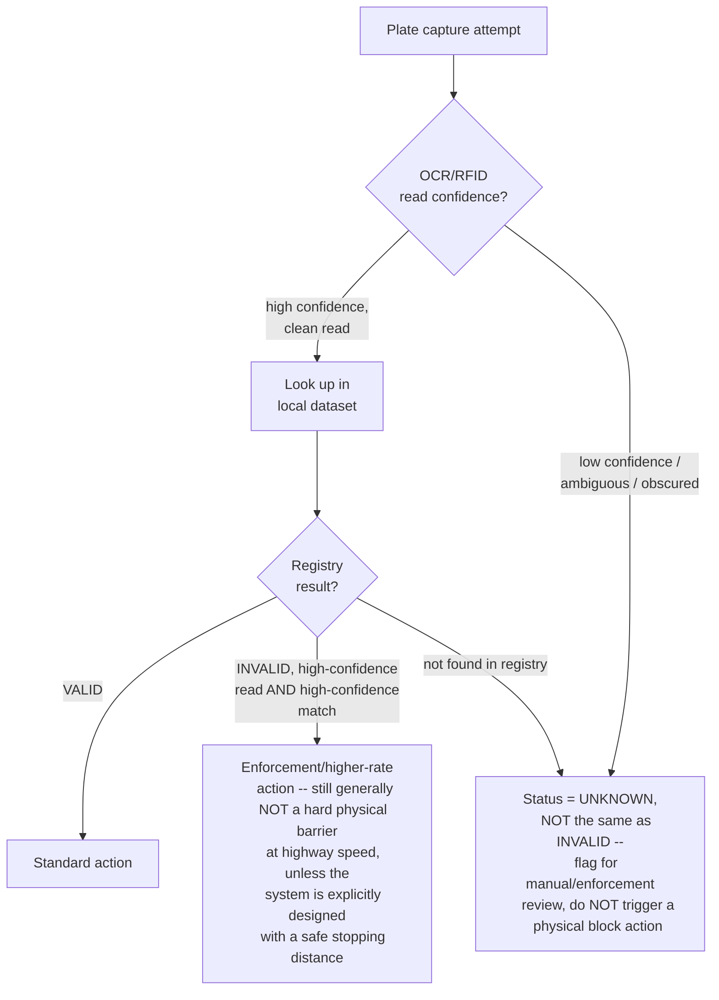

**Why `UNKNOWN` must never collapse into `INVALID`:** a low-confidence OCR read of a plate that
happens to look similar to a flagged one is a data-quality problem, not a compliance finding —
treating it as a confirmed invalid result and triggering an enforcement or (worse) a physical
action on that basis risks a real, unjustified consequence against an innocent vehicle. This is
the same "false positive is expensive, don't treat ambiguous signal as confirmed" lesson as the
sanctions-screening chapter, applied to a physical rather than a financial decision.

**Why a hard physical barrier is rarely the right actuation for this specific decision, even on a
confirmed `INVALID`:** stopping a vehicle at highway speed on a toll-validity signal (as opposed to
a deliberate low-speed toll plaza with barriers, a different physical design entirely) is
generally a stopping-distance and safety-engineering question that belongs to the physical/civil
design of the tolling system, not something a software decision should trigger without that
physical design already accounting for it — worth naming explicitly if the interviewer pushes on
"what does the system *do* about an invalid vehicle," rather than assuming a barrier is always the
answer.

**Interview cheat-sheet:** *"Low-confidence reads produce `UNKNOWN`, never `INVALID` — ambiguous
signal must never be treated as a confirmed compliance finding, and any physical actuation
decision has to already account for safe stopping distance at the actual approach speed, which is
a physical design question, not just a software one."*

---

## Data model

**Per-capture decision lifecycle** — the state machine behind the three-way outcome established
in the fail-open deep dive:

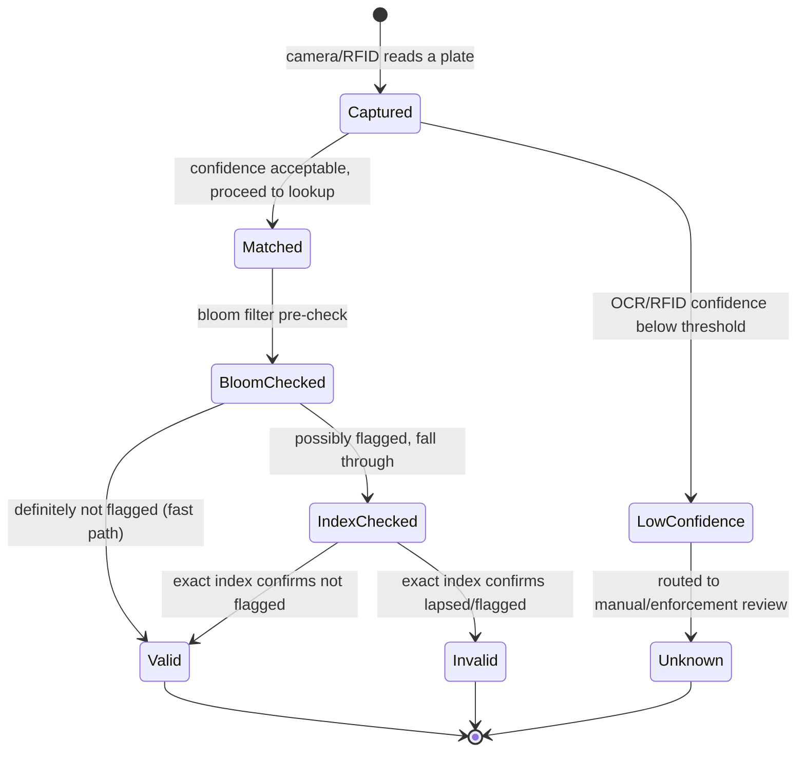

`LowConfidence` and `BloomChecked`'s "possibly flagged" branch are the two places a real
implementation most often gets shortcut-happy — skipping either one is how an ambiguous read
quietly becomes a wrongful `Invalid`.

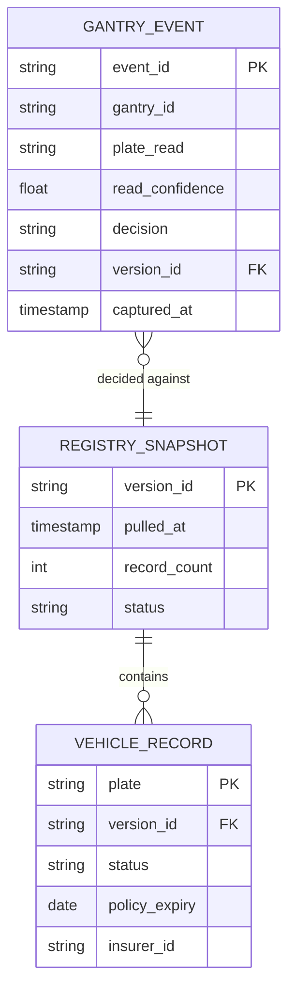

| Table | Storage choice & why |
|---|---|
| `RegistrySnapshot` / `VehicleRecord` | Compiled into the in-memory bloom filter + exact index for serving; persisted in durable object storage in raw form for audit/rebuild, same pattern as every guide in this genre |
| `GantryEvent` | High-write-throughput, append-only, time-series-shaped — one row per vehicle captured, at national peak-QPS volume; feeds both audit/dispute resolution and offline analysis of OCR-confidence trends |

---

## Failure modes & mitigations

| Failure mode | Impact | Mitigation |
|---|---|---|
| **Government registry unreachable for an extended period** | Snapshot goes stale beyond normal cadence | Same as the IP guide: keep serving the last known-good snapshot; alert past a stated staleness SLA, informed here by how quickly insurance status realistically changes (not sub-minute-critical) |
| **A gantry's local dataset fails to load on restart** | Would otherwise open the lane with no data | Gate lane activation on readiness, per the warm-up deep dive — never open to normal traffic on an unloaded dataset |
| **OCR/RFID misreads a plate** | Risk of a false `INVALID` against an innocent vehicle, or a missed real invalid vehicle | Confidence score carried through the whole pipeline; low-confidence reads resolve to `UNKNOWN`, routed to manual/enforcement review, never treated as confirmed |
| **Bloom filter false-positive rate creeping up** (filter under-sized relative to the growing flagged set) | More lookups fall through to the full index than intended — a performance regression, not a correctness one, since the full index is still authoritative | Size the bloom filter with headroom against the flagged-set's expected growth, and monitor the actual fall-through rate as an operational metric |
| **Distribution of a ~9GB snapshot to thousands of gantries strains internal bandwidth** | Slow or incomplete rollout of a new snapshot version | Same as the IP guide's multi-DC answer — push through owned internal distribution infrastructure (regional staging, not every gantry pulling independently from one central store simultaneously), and treat version lag across gantries as a monitored, bounded metric |

---

## Non-functional walkthrough

**Scaling the decision path is embarrassingly parallel**, same as the IP guide — every gantry
holds a full local copy and answers independently. The dataset is larger here (~9GB vs ~20MB) but
still comfortably a "fits in memory" problem, not a sharding problem.

**Availability is, again, almost entirely about the ingestion pipeline's relationship with the
external authority**, not the read path — a registry outage degrades freshness, never gantry
availability, provided the warm-up and fail-open disciplines above are followed.

**The one genuinely new non-functional dimension in this chapter is physical safety.** Latency,
availability, and consistency all matter here for the same reasons they matter in the IP guide —
but a slow or wrong decision has a *physical* consequence (a barrier, a signal, a vehicle's
committed trajectory at speed) that the IP guide's purely-digital `ALLOW`/`BLOCK` doesn't carry.
Say this distinction explicitly if asked to compare the two chapters.

---

## Security & compliance

- **Audit trail for enforcement disputes.** Toll and insurance enforcement actions are frequently
  disputed by vehicle owners — every decision needs to be reconstructable (plate read, confidence,
  matched record, registry version) with the same rigor as the compliance chapters in this genre.
- **Plate images/OCR data retention** is often independently regulated (license-plate-reader laws
  vary significantly by jurisdiction) — retention period and access control for raw
  camera captures should be designed against the applicable local regulation explicitly, not
  assumed to follow the same policy as the structured decision data.
- **Respect the registry's throughput ceiling as an operational trust relationship**, same as the
  IP guide's rate-limit-etiquette point — overloading a legacy government system you depend on
  risks losing access entirely, with no fast recovery path.

---

## Cost & trade-offs

**Full local replication is cheap; the registry's throughput ceiling is the scarce resource** —
identical framing to the IP guide, just with a bigger (but still easily affordable) dataset size.
Any "how do we reduce cost" question here should focus on refresh cadence and bandwidth
distribution efficiency, not on shrinking the per-gantry dataset.

**Bloom-filter sizing is a memory-vs-fall-through-rate trade-off**, worth a quick quadrant-style
mention if pushed: a larger bloom filter costs more memory but reduces how often lookups fall
through to the full index; since the full index is already fast and always in memory anyway, this
trade-off is usually small in absolute terms — don't over-invest interview time tuning it unless
asked to go deep.

---

## Wrap-up: MVP vs. stretch

**In scope for an MVP:**
- Ingestion pipeline paced to the registry's real throughput ceiling, producing a versioned
  snapshot (bloom filter + exact plate index).
- Gantry-side local decision service with warm-up-gated lane activation.
- Three-way decision (`VALID`/`INVALID`/`UNKNOWN`) with OCR-confidence-aware handling — no
  collapsing ambiguous reads into confirmed invalid results.
- Basic audit logging per gantry event.

**Explicitly out of scope for an MVP:**
- Automated physical-barrier actuation logic tied directly to a software `INVALID` result — this
  is a civil/physical-engineering-owned decision (stopping distance, lane design) that a software
  design should interface with, not own, unless explicitly asked to design it.
- Cross-jurisdiction registry reconciliation (a vehicle registered in one region traveling through
  another region's tolling network with a different authority) — a materially harder multi-source
  problem, related to the [multi-source sanctioned-country guide](./51-Multi-Source-Sanctioned-Country-Payment-Blocking-FAANG-Guide.md)'s
  reconciliation theme but out of scope here.

**Stretch goals, worth naming if asked "what's next":**
1. **Adaptive bloom-filter resizing** as the flagged-vehicle proportion shifts over time, rather
   than a fixed size chosen at launch.
2. **Cross-region registry federation**, for vehicles traveling outside their home
   registration region — genuinely the hardest extension of this chapter, worth naming as a
   stretch rather than attempting to design fully live.
3. **Feedback loop from enforcement dispute outcomes** into OCR-confidence-threshold tuning,
   mirroring the sanctions-screening chapter's analyst-resolution feedback loop.

---

## Golden rules

- **The registry's throughput ceiling, not just its latency, rules out per-vehicle synchronous
  queries** — the same decoupling principle as every guide in this genre, with a physical rather
  than purely digital deadline enforcing it.
- **Full local replication is cheap here too** — a ~9GB dataset fully in memory on every gantry is
  a non-issue; the scarce resource is the external authority's throughput, not your own storage.
- **A bloom filter is a safe fast-path pre-check because it never produces false negatives** — only
  ever use it to skip further work on a "definitely fine" result, never to shortcut a "possibly
  flagged" result.
- **Low-confidence signal must resolve to `UNKNOWN`, never to a confirmed `INVALID`.** Ambiguous
  OCR reads are a data-quality problem, not a compliance finding.
- **Gate physical lane activation on data readiness**, exactly like any warm-up discipline in this
  genre, but with a physical rather than purely digital consequence for getting it wrong.
- **A wrong or slow decision here can have a physical safety consequence**, not just a UX one —
  say this explicitly when comparing this chapter to the rest of the genre.

---

## Master cheat sheet

**One-liners:**
- Same ingestion/serving decoupling as any slow-external-authority system, pushed to a physical,
  sub-100ms decision deadline with real safety consequences for getting it wrong.
- The registry's throughput ceiling — often a legacy-system limitation, not just an explicit rate
  limit — is the binding constraint, identical in shape to a rate limit for design purposes.
- Full dataset replication to every gantry is cheap (tens of MB to low GB); the source's real
  achievable refresh cadence is the actual hard number to compute.
- A bloom filter pre-check is safe because it never false-negatives — it only ever shortcuts the
  "definitely fine" case, never the "possibly flagged" case.
- OCR/RFID read confidence must be carried through the whole decision — low confidence resolves to
  `UNKNOWN`, never to a confirmed `INVALID`.
- Physical actuation (a barrier, a signal) tied to a decision needs its own safety-engineering
  design (stopping distance, approach speed) — a software design should interface with that, not
  assume it away.

**Formula chain:**
```
full_dataset_size       = vehicle_count x bytes_per_record
pull_time_minutes       = (vehicle_count / records_per_page) / registry_throughput_ceiling_per_min
bloom_filter_size       = flagged_subset_count x bits_per_entry_at_target_false_positive_rate
```

**Numbers:** single-digit-to-low-double-digit millisecond decision budget including OCR · dataset
sizes in the single-digit GB range even nationwide, still fully replicable per node · registry
throughput ceilings for legacy government systems can be 1-2 orders of magnitude below required
peak QPS — compute the real gap, don't assume it's closeable by request-time optimization alone.
