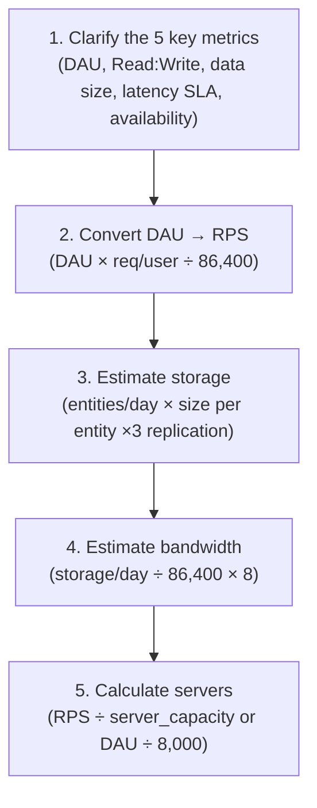
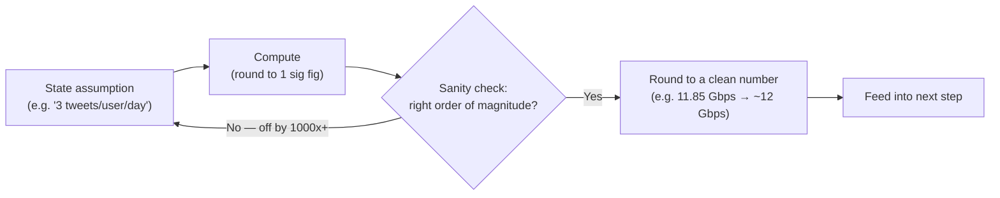
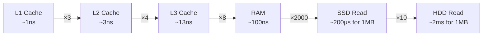
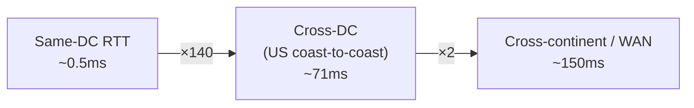
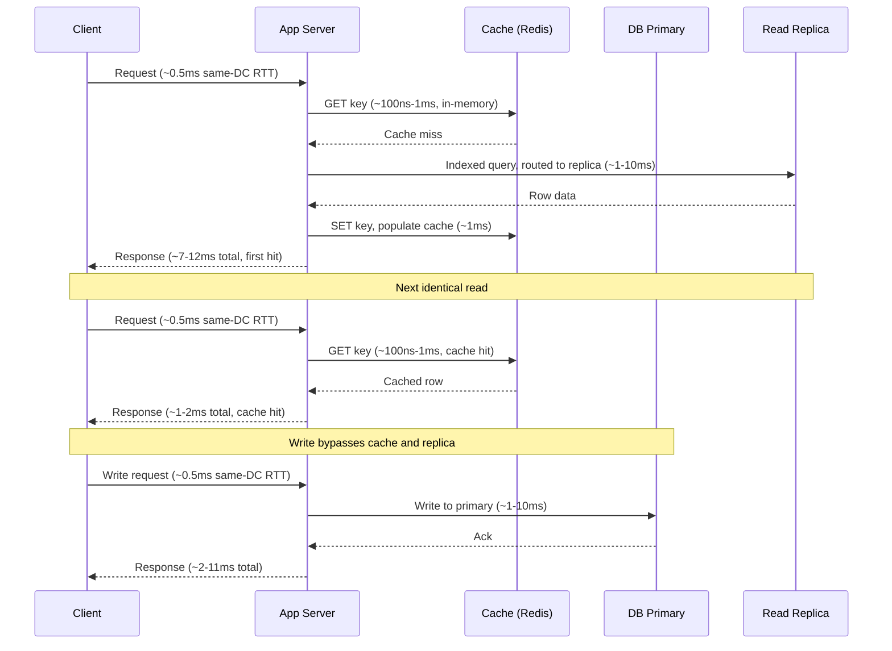

# Back-of-the-Envelope Calculations — FAANG Interview Guide

> **Enhancement notes:**
> - Added a 🆕 "Estimation Loop" flowchart (state assumption → compute → sanity check → round to a clean number) — the per-number process the existing 5-step framework runs internally at each stage.
> - Added a 🆕 time-unit ladder (ns → μs → ms → s, ×1,000 per rung) next to the latency table, mirroring the existing byte ladder for the same memorability effect.
> - Audited the file against the standard checklist (capacity-estimation method, latency numbers table, unit-conversion mnemonics, worked practice problems): all were already present and solid, so they were left untouched rather than padded.
> - No rewrites of working sections — this pass only fills the one confirmed gap (the estimation-loop diagram) plus one small memorability aid.

> **The goal**: Never freeze when an interviewer says "how many servers do you need?" or "how much storage?"
> Estimations don't need to be exact — they need to be *fast, reasonable, and defensible*.

---

## Why Interviewers Ask This

Back-of-the-envelope math signals two things to the interviewer:
1. You understand *scale* — you know whether a system needs 1 server or 1,000.
2. You can drive design decisions from *numbers*, not gut feel.

A wrong estimate with clear reasoning beats a right estimate you can't explain.

---

## The Conversion Table You Must Memorize

This is the #1 thing people get wrong under pressure. Internalize it completely.

### Storage Units (always base 10 in system design)

| Unit | Value | Shorthand trick |
|---|---|---|
| 1 Kilobyte (KB) | 10^3 = 1,000 bytes | "thousand" |
| 1 Megabyte (MB) | 10^6 = 1,000,000 bytes | "million" |
| 1 Gigabyte (GB) | 10^9 bytes | "billion" |
| 1 Terabyte (TB) | 10^12 bytes | "trillion" |
| 1 Petabyte (PB) | 10^15 bytes | "quadrillion" |
| 1 Exabyte (EB) | 10^18 bytes | "quintillion" |

> **Memory shorthand**: KB → MB → GB → TB → PB → EB, each step is ×1,000.
> If you have 50 TB/day and want yearly: 50 × 365 ≈ 50 × 400 = 20,000 TB ≈ **20 PB**.

### Time Units

| Period | Seconds | Approximation |
|---|---|---|
| 1 minute | 60 s | 60 |
| 1 hour | 3,600 s | ~4K |
| 1 day | 86,400 s | **~100K** ← memorize this |
| 1 month | 2,592,000 s | ~2.5M |
| 1 year | 31,536,000 s | ~30M |

> **Key shortcut**: 1 day ≈ **100,000 seconds** (actually 86,400, but 10^5 is close enough for estimation).
> This makes RPS math trivial — see the next section.

### Powers of 2 (for memory/cache sizing)

| Power | Value | Common name |
|---|---|---|
| 2^10 | 1,024 | ≈ 1K |
| 2^20 | 1,048,576 | ≈ 1M |
| 2^30 | 1,073,741,824 | ≈ 1B |
| 2^32 | 4,294,967,296 | ≈ 4B (max IPv4 addresses) |
| 2^40 | ~1 trillion | ≈ 1T |

### Section Cheat Sheet

- Storage uses base 10 (×1,000 per step); memory/cache sizing uses base 2 (×1,024 per step) — don't mix them up mid-answer.
- 1 day ≈ 100,000 sec (real: 86,400); 1 year ≈ 30M sec — these two anchors drive almost every RPS and yearly-storage calculation.
- KB → MB → GB → TB → PB → EB: each arrow is just ×1,000, said out loud it sounds precise even though you're rounding.
- 2^10 ≈ 1K, 2^20 ≈ 1M, 2^30 ≈ 1B, 2^32 ≈ 4B (max IPv4 addresses) — memorize 2^32 cold, it comes up constantly.
- When converting daily → yearly, 365 ≈ 400 is a fine rounding move for mental math; say you're rounding up.
- If a number after conversion looks absurd (e.g., more PBs than atoms in the universe), you dropped or added a ×1,000 somewhere — re-check the chain.

---

## Common Data Sizes to Know Cold

These come up in almost every estimation. Know them without thinking.

### Primitive Types

| Type | Bits | Bytes | Notes |
|---|---|---|---|
| Boolean | 1 bit (stored as 1 byte) | 1 | Most languages waste 7 bits |
| char (ASCII) | 8 bits | **1** | English letters, digits, symbols |
| char (Unicode/UTF-8) | 8–32 bits | **1–4** | Most common chars fit in 1–2 bytes |
| short (int16) | 16 bits | **2** | Range: –32K to +32K |
| int (int32) / float | 32 bits | **4** | Range: –2B to +2B |
| long (int64) / double | 64 bits | **8** | Range: ±9.2 × 10^18 |
| int128 | 128 bits | **16** | Rare; used for UUIDs under the hood |

### Network & System Identifiers

| Type | Bits | Bytes | Notes |
|---|---|---|---|
| Port number | 16 bits | **2** | Range 0–65535 (2^16) |
| **IPv4 address** | **32 bits** | **4** | e.g. `192.168.1.1` — 4 groups of 8 bits |
| MAC address | 48 bits | **6** | e.g. `AA:BB:CC:DD:EE:FF` |
| **IPv6 address** | **128 bits** | **16** | e.g. `2001:0db8::1` — 8 groups of 16 bits |
| UUID / GUID | 128 bits | **16** | Standard random ID |

> **IPv4 vs IPv6 — locked in**:
> - IPv4: 4 octets × 8 bits = **32 bits = 4 bytes** → max 4 billion addresses (2^32 ≈ 4B)
> - IPv6: 8 groups × 16 bits = **128 bits = 16 bytes** → max 3.4 × 10^38 addresses
> - Port: 16 bits = 2 bytes → max 65,535 ports (why well-known ports stop at 65535)

### Hashes & Tokens

| Type | Bits | Bytes | Notes |
|---|---|---|---|
| MD5 hash | 128 bits | **16** | Avoid for security; used for checksums |
| SHA-1 hash | 160 bits | **20** | Git commit IDs (shown as 40 hex chars = 20 bytes) |
| SHA-256 hash | 256 bits | **32** | Standard secure hash |
| SHA-512 hash | 512 bits | **64** | |
| bcrypt hash (stored) | — | **60 chars ≈ 60 bytes** | Password storage |
| JWT token (typical) | — | **~500 bytes** | Header.Payload.Signature |

> **Hex encoding doubles the size**: SHA-256 = 32 bytes raw, but displayed as 64 hex characters. When storing as a string, use binary/blob to save 50%.

### Timestamps & Dates

| Type | Bytes | Notes |
|---|---|---|
| Unix timestamp (int32) | **4** | Seconds since 1970 — **overflows in 2038!** |
| Unix timestamp (int64) | **8** | Safe for billions of years |
| Date only (ISO) | **3–4** | Stored as int32 days since epoch |
| DateTime (microseconds) | **8** | Most DB datetime types |
| Timestamp with timezone | **12–16** | Timezone offset adds 4 bytes |

> **2038 problem**: int32 max = 2,147,483,647 seconds = Jan 19, 2038. Always use int64 timestamps in new systems.

### Application-Level Data

| Type | Size | Notes |
|---|---|---|
| Boolean flag (DB) | 1 byte | |
| Short code / slug | ~7–10 bytes | TinyURL-style IDs |
| Username | ~20–50 bytes | |
| Email address | ~50 bytes | |
| URL | ~100 bytes | Average; can be up to 2KB |
| HTTP cookie | up to **4 KB** | Browser limit per cookie |
| Tweet / short post | ~280 bytes | Text only |
| User row (DB) | ~1 KB | id + name + email + metadata |
| Product listing | ~500 bytes | id + title + price + stock |
| Log entry | ~200–500 bytes | Timestamp + level + message + context |
| JWT token | ~500 bytes | Encoded auth token |
| JSON overhead | +30–50% vs raw | Keys, braces, quotes add up |

### Media Sizes

| Type | Size | Notes |
|---|---|---|
| Icon / favicon | ~1–5 KB | |
| Thumbnail | ~20–50 KB | |
| Profile photo (compressed) | ~100–200 KB | |
| Web page (HTML+CSS+JS) | ~100–500 KB | |
| HD photo (JPEG) | ~200 KB–5 MB | Depends heavily on compression |
| 1 min audio (MP3, 128kbps) | **~1 MB** | |
| 1 min audio (lossless) | **~10 MB** | |
| 1 min video (360p) | **~10 MB** | |
| 1 min video (720p) | **~50 MB** | |
| 1 min video (1080p) | **~100 MB** | |
| 1 min video (4K) | **~375 MB** | |

### Quick Recall: The Byte Ladder

```
1 byte  = char / boolean
2 bytes = short / port number
4 bytes = int32 / float / IPv4 / Unix timestamp (legacy)
6 bytes = MAC address
8 bytes = int64 / double / timestamp (safe)
16 bytes = IPv6 / UUID / MD5 hash / int128
20 bytes = SHA-1
32 bytes = SHA-256
```

This ladder covers 90% of what you'll need in an interview. Read it top to bottom once a day until it's automatic.

---

## RPS Calculations — The 3-Step Method

This is where most people get confused. Here's the mechanical process.

### Step 1: Get daily requests

```
Daily Requests = DAU × requests_per_user_per_day
```

### Step 2: Convert to RPS

```
RPS = Daily Requests / 86,400

Shortcut: RPS ≈ Daily Requests / 100,000  (within 15% error — fine for estimation)
```

### Step 3: Apply peak multiplier

Real traffic is not flat. Add a 2–3× peak factor for interviews unless stated otherwise.

```
Peak RPS = RPS × 2   (for social apps, e-commerce)
Peak RPS = RPS × 3   (for event-driven spikes, e.g. New Year's Eve)
```

### Quick Mental Math Table

| Daily Requests | RPS (÷100K) | Actual RPS (÷86,400) |
|---|---|---|
| 1 Million | 10 | 11.5 |
| 10 Million | 100 | 115 |
| 100 Million | 1,000 | 1,157 |
| 1 Billion | 10,000 | 11,574 |
| 10 Billion | 100,000 | 115,740 |

> **Shortcut you can say aloud**: "1 billion requests/day is roughly **10K RPS**."
> Memorize just this one anchor — everything else scales from it.

### Section Cheat Sheet

- Anchor number: 1B requests/day ≈ 10K RPS — memorize this one ratio and scale everything else off it.
- RPS ≈ daily_requests / 100,000 is within ~15% of the exact ÷86,400 value — close enough to say out loud.
- Always separate average RPS from peak RPS; state the peak multiplier explicitly (2–3×) instead of silently baking it in.
- Compute read RPS and write RPS separately, then state the ratio (e.g., "17:1, read-heavy") — it drives the architecture conversation.
- Round DAU and requests/user to 1 significant figure before multiplying — precision here doesn't change the design.
- If the interviewer changes an input (DAU, requests/user) mid-conversation, redo the chain from Step 1 — don't eyeball a correction.

---

## Server Capacity Reference Numbers

| Server type | Handles per second | Notes |
|---|---|---|
| Web server (HTTP) | 500–1,000 RPS | CPU-bound (72 threads × 1/200ms = 360 RPS) |
| App server | ~1,000 RPS | Typically CPU-bound |
| MySQL / PostgreSQL | ~1,000 QPS | Point queries; range queries less |
| Redis / Memcached | 100,000–1M QPS | Pure in-memory |
| Kafka broker | ~100K msg/s | Write throughput |
| CDN edge node | Millions of RPS | Cached content only |

**Simplified rule for # of servers**:

```
Servers needed = DAU / 8,000

(Assumes 1 server comfortably handles 8,000 daily active users)
```

Example: 500M DAU → 500M / 8,000 = **62,500 servers**

### Section Cheat Sheet

- The DAU/8,000 rule is a fast starting anchor, not gospel — always cross-check it against RPS ÷ server_capacity.
- Web/app servers: ~500–1,000 RPS each, CPU-bound.
- Relational DBs: ~1,000 QPS each for point queries; joins/range scans are far lower — plan for read replicas.
- In-memory stores (Redis/Memcached): 100K–1M QPS — put hot reads here, not on the DB.
- Kafka brokers: ~100K msg/s write throughput — fine for async event pipelines, not synchronous request/response.
- CDN edge nodes handle "millions of RPS" for cached content — push static/media traffic there first, it's nearly free capacity.
- Always compute server count two ways (RPS-based and DAU-based) and sanity-check they land in the same order of magnitude.

---

## The 5-Step Estimation Framework

Use this structure every time an interviewer asks for estimation. It shows discipline.



### 🆕 The Estimation Loop (Run This for Every Number)

The 5 steps above are *what* to estimate. This is the *how* — the micro-loop you repeat inside each one:



Worked example of the loop: assume 250M DAU × 3 tweets/day = 750M writes/day → compute 750M ÷ 100,000 = 7,500 RPS → sanity check ("plausible for a Twitter-scale write path? yes") → round to **~7,500 RPS** and move to storage.

### Step-by-step with Twitter as example

**Given assumptions:**
- 250M DAU
- Each user posts 3 tweets/day, views 50 tweets/day
- Tweet text: 250 bytes, image (10% of tweets): 200 KB, video (5% of tweets): 3 MB

**Step 1 — Clarify**: DAU = 250M, read-heavy (50 reads vs 3 writes per user), global, 99.99% availability required.

**Step 2 — RPS:**
```
Write RPS = 250M × 3 / 100,000 = 7,500 RPS (writes)
Read RPS  = 250M × 50 / 100,000 = 125,000 RPS (reads)
Read:Write ratio = 125,000 : 7,500 ≈ 17:1  →  read-heavy system
```

**Step 3 — Storage per day:**
```
Tweets:  250M users × 3 tweets × 250 bytes = 187.5 GB
Images:  250M × 3 × 10% × 200 KB          = 15 TB
Videos:  250M × 3 × 5%  × 3 MB            = 112.5 TB
─────────────────────────────────────────────────────
Total/day ≈ 128 TB
Total/year (raw) ≈ 128 × 365 ≈ 46.7 PB
```
> Note: this is a real computed total, unrelated to the illustrative 50 TB/day example used earlier in the conversion table.

With standard **×3 replication** for durability, the actual disk footprint is:
```
Physically stored/day  ≈ 128 TB × 3  = 384 TB
Physically stored/year ≈ 46.7 PB × 3 ≈ 140 PB
```

**Step 4 — Bandwidth:**
```
Incoming (uploads):  128 TB/day ÷ 86,400 × 8 bits = ~12 Gbps

Outgoing (reads):
  Tweets:  250M × 50 × 250B / 86,400            ≈ 36 MB/s = 0.3 Gbps
  Images:  250M × 50 × 10% × 200KB / 86,400     ≈ 2.9 GB/s = 23 Gbps
  Videos:  250M × 50 × 5%  × 3MB / 86,400       ≈ 21.7 GB/s = 174 Gbps
  ─────────────────────────────────────────────────────────────────────
  Total outgoing ≈ 197 Gbps
```

**Step 5 — Servers:**
```
For reads:  125,000 RPS ÷ 1,000 RPS/server = 125 app servers
For cache:  125,000 RPS ÷ 100,000 QPS/cache = ~2 cache servers  (+ replication)
DB servers: 7,500 write RPS ÷ 1,000 QPS/DB = ~8 DB primaries (+ read replicas)
```

### More Worked Examples

Same "state assumptions → compute step by step → sanity check" method, applied to two other common interview systems.

#### Example: Chat / Messaging System (e.g. WhatsApp-style)

**Given assumptions:**
- 200M DAU
- Each user sends 20 messages/day, avg message: 100 bytes (text only)
- Fan-out: each message is delivered to 2 recipients on average (mix of 1:1 chats and small groups)
- Each message generates 2 delivery receipts ("delivered" + "read"), ~20 bytes each

**Step 1 — Clarify**: DAU = 200M, near-real-time SLA (<200ms delivery), 99.99% availability (multi-AZ), read volume dominated by fan-out delivery, not user-initiated reads.

**Step 2 — RPS:**
```
Messages sent/day = 200M × 20         = 4B
Write RPS         = 4B / 100,000      = 40,000 RPS

Deliveries/day (fan-out ×2) = 4B × 2  = 8B
Delivery RPS                = 8B / 100,000 = 80,000 RPS

Receipts/day (2 per message) = 4B × 2 = 8B
Receipt write RPS            = 8B / 100,000 = 80,000 RPS
```

**Step 3 — Storage per day:**
```
Messages: 4B × 100 bytes = 400 GB
Receipts: 8B × 20 bytes  = 160 GB
─────────────────────────────────────
Raw total/day  ≈ 560 GB
Raw total/year ≈ 560 GB × 365 ≈ 200 TB

With ×3 replication:
Physically stored/day  ≈ 560 GB × 3 ≈ 1.68 TB
Physically stored/year ≈ 200 TB × 3 ≈ 600 TB
```

**Step 4 — Bandwidth:**
```
Incoming (sends):     0.56 TB × 0.093 ≈ 0.052 Gbps ≈ 52 Mbps
Outgoing (deliveries, ×2 fan-out): 0.8 TB × 0.093 ≈ 0.074 Gbps ≈ 74 Mbps
```

**Step 5 — Servers:**
```
Write path:    40,000 RPS ÷ 1,000 RPS/server   = 40 app servers
Delivery path: 80,000 RPS ÷ 100,000 QPS/cache  = ~1 pub/sub node (round up to 3 for HA)
DB writes:     (40,000 + 80,000) QPS ÷ 1,000 QPS/DB = 120 DB shards (+ read replicas)
```

**Sanity check**: 4B messages sent/day and 8B delivered/day are the right order of magnitude for a WhatsApp-scale system (publicly reported figures are in the tens of billions/day) — our numbers land a bit conservative, which is fine for an interview estimate.

#### Example: File Storage System (e.g. Dropbox/S3-style)

**Given assumptions:**
- 100M active users
- Each user performs 3 upload ops/day and 2 download ops/day; avg object size 5 MB either way
- Dedup saves ~30% of raw upload bytes (identical files uploaded by multiple users)
- Standard ×3 replication for durability

**Step 1 — Clarify**: 100M DAU, write path is bandwidth-bound (large payloads) more than RPS-bound, relaxed latency SLA for uploads (eventual consistency OK), 99.999% availability target driving the replication factor.

**Step 2 — RPS:**
```
Uploads/day   = 100M × 3        = 300M
Upload RPS    = 300M / 100,000  = 3,000 RPS

Downloads/day = 100M × 2        = 200M
Download RPS  = 200M / 100,000  = 2,000 RPS
```

**Step 3 — Storage per day:**
```
Raw upload bytes/day       = 100M users × 3 × 5 MB = 500,000,000 MB = 500 TB
After dedup (30% saved)    = 500 TB × 0.7           = 350 TB/day (unique new data)

With ×3 replication:
Physically stored/day  ≈ 350 TB × 3   = 1.05 PB
Physically stored/year ≈ 350 TB × 365 × 3 ≈ 383 PB

(unique data before replication, for comparison: 350 TB × 365 ≈ 127.75 PB/year)
```

**Step 4 — Bandwidth:**
```
Incoming (post-dedup): 350 TB × 0.093 ≈ 32.5 Gbps
Outgoing (downloads):  200M × 5 MB = 1,000 TB/day → 1,000 × 0.093 ≈ 93 Gbps
```

**Step 5 — Servers:**
```
Upload path:   bandwidth-bound → 32.5 Gbps ÷ ~2 Gbps/server ≈ 16 ingest servers
               (RPS check: 3,000 ÷ 1,000 = 3 — bandwidth dominates here, not RPS)
Download path: 93 Gbps ÷ ~2 Gbps/server ≈ 47 servers (in practice, mostly offloaded to a CDN)
Metadata DB:   3,000 write RPS ÷ 1,000 QPS/DB = 3 shards (+ read replicas for download lookups)
```

**Sanity check**: 127.75 PB/year of unique new data is a very large but plausible order of magnitude for a top-tier global object-storage provider — the ×3 replication multiplier tripling that to ~383 PB/year is exactly the kind of step interviewers expect you to call out explicitly, not skip.

---

## Latency Numbers Every Engineer Should Know

| Operation | Latency | Intuition |
|---|---|---|
| L1 cache reference | ~1 ns | Fastest possible |
| L2 cache reference | ~3 ns | |
| L3 cache reference | ~13 ns | |
| RAM read | ~100 ns | 100× slower than L1 |
| Read 1MB from memory | ~9 μs (9,000 ns) | |
| Read 1MB from SSD | ~200 μs | 20× slower than RAM |
| Read 1MB from disk | ~2 ms | ~10× slower than SSD |
| Disk seek | ~4 ms | Avoid at all costs in hot path |
| Simple indexed DB query | ~1–10 ms | Point lookup on an indexed column |
| Complex DB query / join | ~50–100 ms | Multiple joins, aggregations, or missing index |
| Same datacenter round trip | ~0.5 ms | |
| Cross-datacenter (US coast-to-coast) | ~71 ms | |
| Cross-continent (US to Europe) | ~150 ms | |

**Hardware / storage latency hierarchy** (each node feeds the next — every step down is slower):



**Network round-trip hierarchy** (a separate ladder — don't chain it onto the hardware one above, the numbers aren't comparable):



> **Key insight**: Every layer is 10–2,000× slower than the one above it — the biggest single jump is RAM → SSD (~2,000×). This is why caching exists.
> RAM is roughly 20,000× faster than disk for a 1MB read (100ns vs 2ms, scaled up).

> **🆕 Time-unit ladder** (mirrors the [Byte Ladder](#quick-recall-the-byte-ladder) above): `1,000 ns = 1 μs`, `1,000 μs = 1 ms`, `1,000 ms = 1 s` — each rung is ×1,000, same pattern as KB → MB → GB. So "L1 is ~1ns, RAM is ~100ns, SSD read is ~200μs (200,000ns), disk is ~2ms (2,000,000ns)" is really just counting rungs on this ladder.

### A Concrete Request Flow (Sequence Diagram)

Ties the numbers above into one request, showing a cache miss followed by a cache hit:



---

## The 5 Key Metrics That Drive Every Design

From your own notes — these anchor the entire estimation:

**1. DAU** — "How many users?" Every other number derives from this.

**2. Read:Write Ratio** — Tells you where the bottleneck is. High reads → caching + read replicas. High writes → write-optimized storage + async pipelines.

**3. Data Size per Entity** — Determines sharding necessity and storage class (object store vs DB vs blob).

**4. Latency SLA** — Real-time (<100ms) → cache-first, no sync cross-service calls. Eventual OK → async is fine.

**5. Availability** — 99.9% = 3 nines, single AZ fine. 99.99% = multi-AZ mandatory. 99.999% = multi-region active-active.

The causal chain: **DAU → scale, read/write → bottleneck, data size → storage strategy, latency → architecture, availability → resilience investment.**

---

## Bandwidth Conversion — The Step People Always Fumble

```
Storage is in BYTES.
Bandwidth is in BITS per second.

1 byte = 8 bits
→ always multiply bytes by 8 to get bits

Formula:
Bandwidth (bps) = (Data per day in bytes × 8) / 86,400
Bandwidth (Gbps) = (Data per day in GB × 8) / 86,400
```

**Example**:
```
128 TB/day → 128 × 10^12 bytes × 8 / 86,400
           = 1,024 × 10^12 / 86,400
           = ~11.85 × 10^9 bps
           ≈ 12 Gbps
```

**Even faster shortcut**:
```
N TB/day → N × 8 / 86,400 × 10^12 bps
         → N × ~93 Mbps
         → N × 0.093 Gbps

128 TB/day × 0.093 ≈ 12 Gbps  ✓
```

---

## Interview Pitfalls and How to Avoid Them

| Mistake | What to say instead |
|---|---|
| "IPv4 is 64 bits" | "IPv4 is **32 bits = 4 bytes**. IPv6 is 128 bits = 16 bytes." |
| "1 day ≈ 80,000 seconds" | "1 day ≈ **86,400 seconds**, I'll use 10^5 to keep math simple." |
| Forgetting ×8 for bandwidth | "Storage is bytes; bandwidth is bits — multiply by 8." |
| Exact numbers under pressure | Approximate: 250M → 2.5×10^8, 86,400 → 10^5. Round aggressively. |
| Skipping peak traffic | "Average RPS is X, but I'll plan for 2–3× peak = Y RPS." |
| Not stating assumptions | "I'm assuming 20 req/user/day — does that seem right?" |
| Forgetting replication factor on storage totals | "That's the raw/unique data — with standard ×3 replication for durability, the actual disk footprint is 3× that." |

---

## Golden Rules

A few habits, separate from the pitfalls above, that make your delivery feel senior regardless of the exact numbers:

- **Always state assumptions out loud.** "I'm assuming X" turns a guess into a defensible, discussable input.
- **Round aggressively to one significant figure.** 250M → "250M" not "247.3M"; 86,400 → 10^5. Precision here is theater, not rigor.
- **Separate average load from peak load, explicitly.** Never present a single RPS number — always give "average is X, peak is 2–3× that."
- **Redo the chain when an input changes.** If the interviewer says "actually, make it 500M DAU," recompute from Step 1 — don't just scale a memorized final answer in your head and hope it's right.
- **Say the formula before the number.** "Servers = peak RPS ÷ server capacity" said aloud shows the reasoning; the number alone doesn't.
- **Sanity-check the final answer against something known.** "That's roughly Twitter/WhatsApp scale" or "that's more servers than AWS has regions" — catches order-of-magnitude errors immediately.
- **Never let storage skip replication.** Raw/unique data and physically-stored data are different numbers — give both.
- **It's fine to be wrong by 2×; it's not fine to be wrong by 1000×.** The goal is the right order of magnitude, defensibly reasoned.

---

## Master Cheat Sheet

### The anchor numbers

```
1 day         = 86,400 sec  ≈ 10^5
1 year        = 31.5M sec   ≈ 3×10^7
IPv4          = 32 bits = 4 bytes
IPv6          = 128 bits = 16 bytes
UUID          = 128 bits = 16 bytes
1 server      ≈ 8,000 daily active users
Web server    ≈ 500–1,000 RPS
MySQL         ≈ 1,000 QPS
Redis         ≈ 100K–1M QPS
```

### The conversion chain

```
KB → MB → GB → TB → PB → EB
      each step = ×1,000

bytes → bits = ×8
```

### The RPS shortcut

```
1M req/day  → ~10 RPS
1B req/day  → ~10K RPS   ← anchor
10B req/day → ~100K RPS

Formula: RPS = daily_requests / 100,000  (good enough estimate)
```

### The 5-step framework in 30 seconds

```
1. Clarify: DAU, Read:Write, data size, latency, availability
2. RPS    = DAU × req/user / 100,000
3. Storage = units/day × size_per_unit → ×365 for yearly → ×3 for replication (actual disk footprint)
4. BW(Gbps)= storage_TB_per_day × 0.093  (incoming)
5. Servers = peak_RPS / server_RPS  OR  DAU / 8,000
```

### Say this when you start an estimation

> "Let me start with the scale. Assuming X DAU, with Y requests per user per day, that's roughly Z billion requests per day, or about W thousand RPS. With a 2× peak factor, I'll design for 2W thousand RPS. Let me now estimate storage…"

This phrasing signals to the interviewer that you have a systematic approach before any numbers hit the whiteboard.
