# Design a National ID / KYC Verification System — The Story (narrative edition)

> **What this file is.** The reference file,
> `50-National-ID-KYC-Verification-System-FAANG-Guide.md`, is the one to recite from —
> requirements, API shapes, every trade-off table, the master cheat sheet. This file is a second
> way in: the same material as one continuous story, told in plain language. Engineers at a
> company keep hitting a wall, patch it, and the patch itself creates the next wall — until we
> land on the exact same design the reference file documents. The company, **NimbusPay** (a
> fintech wallet app), is fictional. But every wall it hits, and every fix it reaches for, is
> something a real, named system actually does: India's **Aadhaar** eKYC system run by UIDAI
> (documented scale — 1.3 billion+ people enrolled, with a real, contractual per-organization
> quota on verification calls), document-authenticity vendors like **Jumio** and **Onfido** (a
> genuinely different problem — "is this uploaded photo of an ID doctored," not "does this person
> match the government's record" — mentioned once, on purpose, to draw the boundary), and the same
> event-driven, quota-aware patterns documented in the reference guide itself. I'll say clearly,
> every time, whether a number is a documented fact or a reasonable stand-in, tagged
> `[illustrative]`.

**The trigger phrase** for this whole topic: *"design an identity-verification flow backed by a
government ID authority, where that authority has a hard daily quota, not just slow latency."*
Keep one sentence in your head as you read: **every other "verify against an external source"
system in this genre gets to pull the whole dataset in bulk and serve it locally forever after —
this one can't, because the dataset is an entire population's private identity records, checked
one consenting person at a time, against a fixed daily budget that belongs to the government, not
to you.** Everything below is just this one structural fact, getting harder in small, honest
steps.

---

## Chapter 1 — The two analysts and the line that never gets shorter

It's NimbusPay's first year. To open a wallet, a new user uploads a photo of their government ID.
Two compliance analysts sit in a back office and manually eyeball each one: does the photo look
real, does the name match what the user typed, does the face look like the same person. Each
review takes about **6 minutes** `[illustrative]`. At launch, NimbusPay gets **40 signups/day** —
comfortably inside what two analysts can clear (2 analysts × 8-hour day × 10 reviews/hour = **160
reviews/day** of capacity). Nobody worries about this.

Then NimbusPay signs a partnership with a big retail bank, and the app gets bundled into the
bank's own onboarding flow. Signups jump to **3,000/day** overnight. Redo the math: two analysts
still clear 160/day. The backlog grows by **3,000 − 160 = 2,840 unreviewed signups every single
day** — and unlike a one-time spike, this doesn't clear on its own, because 3,000/day is now the
*new normal*, not a burst. Within two weeks, the backlog is over 30,000 people waiting to open an
account they already tried to sign up for, some of them for money they need *now*.

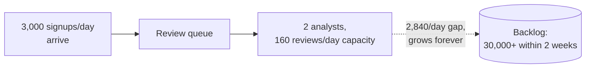

The obvious question: *why is a human looking at a photo the bottleneck for something a computer
should be able to check?* Because "does this photo match a real government record" isn't actually
a question a human eyeballing an image can answer well anyway — a human can spot an obviously fake
photo, but can't confirm the ID number, name, and date of birth are real and currently valid
against the government's own database. That needs a different check entirely: asking the
government's own identity authority directly.

**The fix, and a boundary worth drawing right away:** there are two separate problems hiding
inside "verify this person's ID." One is *"is this uploaded document itself authentic and not
doctored"* — real vendors like **Jumio** and **Onfido** specialize in exactly that, using OCR and
template matching on the document image. The other is *"does this name/ID number/date-of-birth
actually match a real government record for a real, living person"* — only the government's own
identity authority can answer that, because only it holds the actual records. NimbusPay's
compliance requirement is the second one — a real match against Aadhaar, India's national ID
system, run by UIDAI. This story is about that second problem; document-authenticity is a real,
separate deep dive, deliberately parked here.

**How I'd say this in an interview:** "Manual review of an uploaded photo doesn't scale linearly,
and worse, it's not even answering the right question — a human can't confirm a match against a
government database just by looking at a photo. The real fix is calling the actual identity
authority's API directly, which immediately raises a new question: how does that call behave
under load?"

---

## Chapter 2 — The API call that works fine, until the quota runs out at noon

The fix: instead of a human eyeballing a photo, NimbusPay's signup flow calls Aadhaar's eKYC API
directly, **synchronously**, right there in the signup request — send the ID number and consent,
get back a match/no-match, then finish signup. On a normal day this feels great: Aadhaar's typical
call latency is a few seconds `[illustrative — real eKYC calls are documented as taking real,
non-trivial time, but the exact per-call latency varies by load and integration]`, so signup just
feels a little slower than before, not broken.

Then NimbusPay's bank partnership runs a marketing push, and signups spike from a normal
**120,000/day** to **600,000 in one day** `[illustrative, matching the reference guide's worked
capacity numbers]`. Here's the part that actually breaks things: Aadhaar doesn't grant NimbusPay
unlimited calls — like every real requesting organization, NimbusPay's contract comes with a
**hard daily quota, 200,000 verifications/day**, and a per-second cap, **50/sec sustained, bursts
to 100/sec** `[illustrative]`. Nobody paced the synchronous calls against that number. By around
**11:40am**, NimbusPay has already burned through all 200,000 of today's quota. Every signup
attempt after that gets a flat rejection from Aadhaar's side — not "pending," a hard error — for
the rest of the day. New users trying to open an account get a broken-looking app, not a queue.

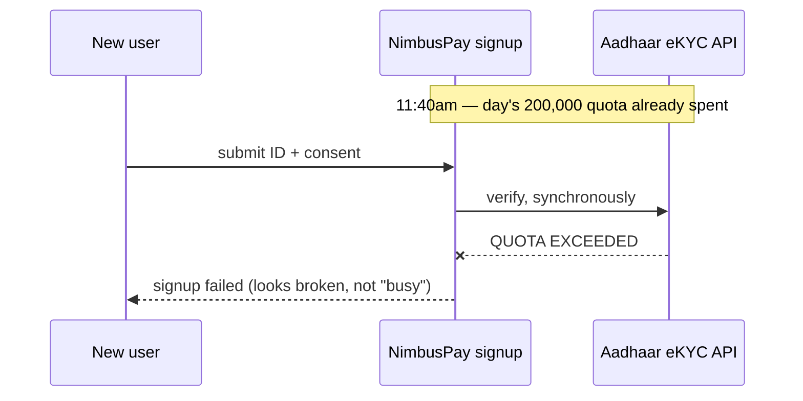

The obvious next question: *why not just cache everyone's ID data ahead of time, the way you'd
bulk-pull a dataset for almost anything else in this genre?* That question is the whole next
chapter — and the answer is genuinely "you can't," not "you shouldn't."

**How I'd say this in an interview:** "A synchronous call to an external authority inherits two of
its constraints at once — its per-call latency, and its quota — and a signup spike hits the quota
wall a lot faster than most people expect, because nothing in a plain synchronous call paces
demand against a fixed daily budget. The instinct at this point in every other chapter in this
genre is to cache the source data — here, that instinct is a dead end, and it's worth naming why
explicitly."

---

## Chapter 3 — The notary who only notarizes the person standing in front of them

Someone on the team, having worked on a different project that bulk-cached an IP address list,
asks the obvious question: *"why don't we just bulk-download India's national ID database once, and
check against our own local copy forever after — the same way we cached that IP list?"*

The answer is no, on two grounds that both matter: **legally**, NimbusPay has no basis to hold or
bulk-query identity records for people who haven't even signed up yet, let alone consented —
Aadhaar's own regulations (a real, documented restriction under India's identity-authority
framework) permit verification only for a specific, consenting individual, at the moment they
request it. And **technically**, the authority won't answer that question anyway — its eKYC API
verifies **one individual, one submission, under explicit consent**, with no "give me the whole
dataset" endpoint, because that dataset is 1.3 billion+ people's private records, and the entire
point of consent is that nobody gets to hold that in bulk, including the government's own
commercial partners.

**The analogy, and the one to keep for the rest of this story:** think of a notary public who only
ever notarizes the document of the person physically standing in front of them, with their own ID
in hand, right now. You cannot hand a notary a phone book and ask them to pre-notarize everyone in
it "just in case" — the notary's entire job is built around verifying one specific, present,
consenting person at a time. Aadhaar's eKYC API is that notary. There is no back room with a
photocopy of every signature already notarized in advance.

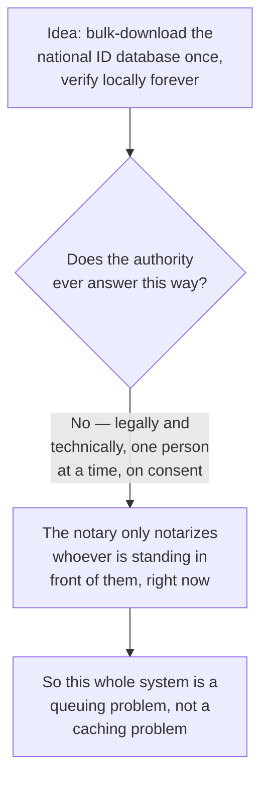

This reframes everything. Every other "verify against a slow external source" system in this genre
solves the problem by pulling a bounded dataset in bulk, once, and serving it locally forever. That
playbook is structurally unavailable here. What's left is: **pace an unpredictable, bursty stream
of one-at-a-time requests against a fixed daily supply, without ever double-spending that supply or
leaving a user in limbo.**

**How I'd say this in an interview:** "The instinct to bulk-cache the source doesn't apply here,
and it's worth saying out loud, unprompted, why not — the authority is a notary, not a database
export: one consenting person, one request, at a time, by law and by API design. That single fact
turns this into a queuing and backpressure problem, not a caching problem, and it should reframe
every design decision from here on."

---

## Chapter 4 — Async fixes the wrong half of the problem

The fix everyone reaches for next: stop making the user wait on the call. Accept the signup
immediately, drop "go verify this person" into a queue, and let a pool of background workers call
Aadhaar as fast as they can, notifying the user later when it resolves.

This *does* fix one real problem — the user isn't stuck staring at a spinner while Aadhaar's API
takes its sweet time. But watch what happens to the quota. NimbusPay sizes the worker pool for
throughput, the same instinct you'd apply to literally any other background job system: **30
workers, each calling Aadhaar at ~7 calls/sec ≈ 210 calls/sec combined.** At that pace, the entire
day's **200,000-call quota is gone in about 952 seconds — under 16 minutes.** And this isn't even
during a spike; this happens on an *ordinary* Tuesday, because nothing in this design paces
dispatch against the quota at all — it only removed the user-facing wait, not the underlying
demand-versus-supply mismatch.

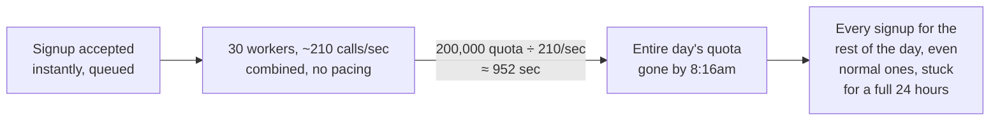

This is arguably *worse* than Chapter 2's failure. In Chapter 2, the failure was visible and
immediate — a broken-looking error at signup time, unpleasant but obvious. In Chapter 4, the
failure is invisible: users get a cheerful "we'll notify you soon," and then nothing happens for
the rest of the day, because the background workers already spent the budget before lunch. Async
alone didn't remove the quota wall — it just moved it somewhere the team can't see it hit.

**How I'd say this in an interview:** "Making the call asynchronous fixes the user-facing latency
problem, but it does nothing about the actual bottleneck, which is a fixed daily quota, not
latency. A worker pool sized for throughput will cheerfully burn an entire day's budget in the
first few minutes if nothing paces it — async without quota-awareness just delays when you notice
the same wall from Chapter 2, and arguably makes it quieter and worse."

---

## Chapter 5 — The rationed fuel pump: always let the car in line, never let it drink more than its share

The real fix has two parts, and they have to ship together: **always accept the submission
instantly, and pace the actual calls to Aadhaar against a live, tracked remaining-budget counter.**

**The analogy:** think of a small town with exactly one fuel pump, and exactly one truck's worth of
fuel — **200,000 liters** — delivered each morning. The attendant's job isn't to turn cars away
once the tank gets low; it's to let every car join the line the moment it arrives, and dole out
fuel car-by-car for as long as the tank has anything left, tracking the exact remaining liters
after every single fill-up. When the tank hits zero, the pump doesn't explode or start turning
people away rudely — it just stops dispensing until tomorrow's delivery, and the line that's
already formed simply waits, visibly, honestly.

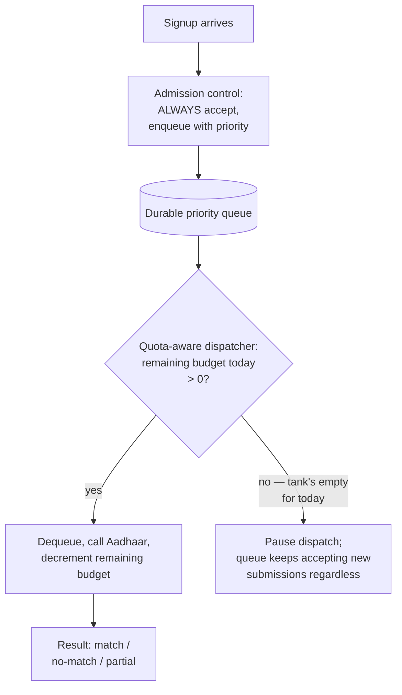

On the 600,000-signup spike day from Chapter 2: the fuel pump attendant still only has 200,000
liters today. All 600,000 people get let into the line — nobody is turned away at the gate. 200,000
get their fuel (verified) today; the other 400,000 wait. At a steady 200,000/day clearing rate
once signups return to normal, **that backlog clears in about 2 additional days** — a concrete,
sayable number, instead of a vague "the queue will handle it eventually."

**Why "always accept, pace the work" beats "reject when the tank's low":** rejecting a signup
outright because today's quota is tight (like Chapter 2's hard error) forces the user to somehow
know to come back later, with zero guarantee they will — quietly losing real signups. Accepting
every submission into a durable queue, and being honest ("verification pending, may take a bit
longer today") preserves every single one and lets the backlog drain automatically as tomorrow's
fuel truck arrives, without asking the user to do anything at all.

**How I'd say this in an interview:** "Never reject a submission because the quota's tight —
always accept it into a durable, priority-ordered queue, and pace the actual calls to the
authority against a live remaining-budget counter, exactly like a pump that tracks how much fuel
is actually left in today's delivery. The queue is the backpressure; the user-facing promise stays
honest — 'pending,' never a lie about instant results, and never a dead end either."

---

## Chapter 6 — Don't let a retry drink twice from the same tank

A verification call to Aadhaar occasionally fails transiently — a network blip, a timeout, a 5xx
from the authority's own side under its own load. Naturally, the dispatcher retries. But here's the
catch nobody in the earlier, non-quota-limited chapters of this genre has to think about: **every
retry drinks from the exact same 200,000-liter tank as a brand-new signup.** A naive retry-until-
success policy can quietly let a wave of transient failures eat a chunk of the day's budget that
was meant for fresh, first-time users.

Worked numbers `[illustrative]`: about **3% of calls** need at least one retry, averaging **1.5
retries** each. Reserved retry budget: `200,000 × 0.03 × 1.5 ≈ 9,000` liters set aside, out of the
200,000. That leaves **≈191,000** as the *effective* fresh-submission capacity the admission-
control queue should actually pace against — not the headline 200,000, a small slice on paper but
the exact number that keeps a retry storm from starving new users of their fair share.

There's a second failure mode hiding here, and it's the true "drink twice from the same tank"
bug: what if the network blip happens *after* Aadhaar already processed the call successfully, but
the response never made it back to NimbusPay? A naive retry would fire a whole new verification
call for a person who's already been verified — spending a second fuel unit for the same car.

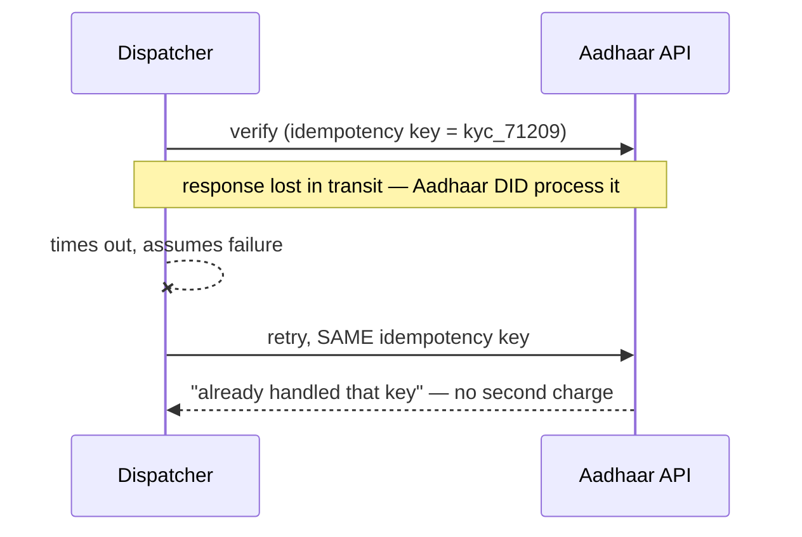

**The fix:** reuse the *same idempotency key* across a retry of the same verification attempt.
Real identity-verification APIs support this precisely because retries are expected — a retried
call carrying the same key doesn't get double-charged against the quota, even though the network
made it look like a fresh failure. Retries should also queue *behind* fresh submissions once the
9,000-unit retry reserve is exhausted for the day — a retry storm shouldn't be allowed to out-
compete a brand-new user's very first attempt.

**How I'd say this in an interview:** "Retries consume the exact same scarce quota as a first
attempt, so budget for them explicitly in capacity planning — a few percent, sized from the actual
transient-failure rate. And reuse the same idempotency key on every retry of the same attempt, so
a lost response doesn't turn into a second charge against a fixed daily budget for one person who
was already verified."

---

## Chapter 7 — The intercom, not five people calling the front desk

Verification now finishes asynchronously — anywhere from seconds to, on a bad day, hours. Multiple
downstream services at NimbusPay need to know the second it resolves: the account-limits service
(how much can this wallet hold), the feature-gating service (can this user send money yet), fraud
scoring, and more. The naive move: each of those services just **polls** the verification service's
status endpoint every few seconds for every pending user.

The number that breaks this: with **200,000 pending verifications on a busy day** and, say, **5
downstream services** each polling every 5 seconds, that's `200,000 × 5 ÷ 5 = 200,000 status checks
every second` `[illustrative]` — hammering the verification service with a firehose of "still
pending? still pending? still pending?" for a status that, per user, changes **exactly once.**

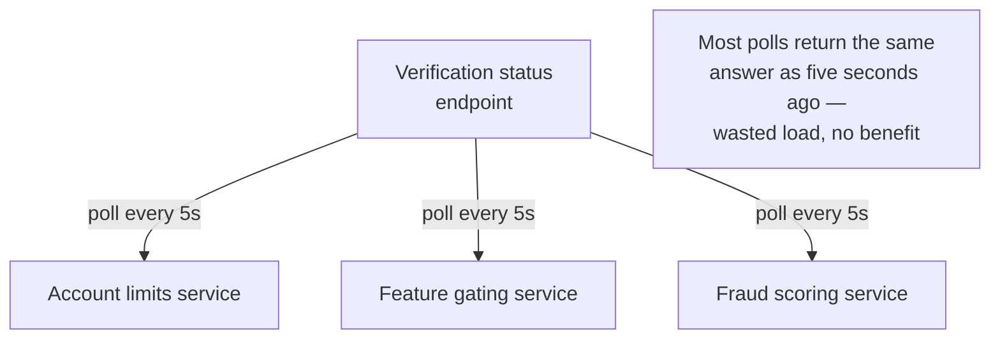

**The fix, and the analogy:** instead of five departments each calling the front desk over and over
asking "has the visitor arrived yet," the front desk pages the building **once, over the intercom**,
the instant the visitor actually arrives. Every department hears it at the same time, updates its
own records, and nobody had to ask twice. Concretely: the moment a verification resolves, publish a
single `KYC_RESOLVED` event — status, `userId`, `verificationId` — to an event bus. Every downstream
service subscribes once and reacts, instead of polling.

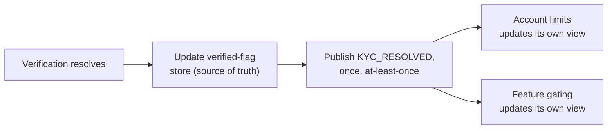

**At-least-once means every consumer must deduplicate.** The event bus can redeliver — a consumer
that already processed `kyc_71209`'s resolution needs to recognize the redelivery by
`verificationId` and ignore it, rather than, say, doubling someone's account limit by mistake.
Standard event-driven hygiene, but worth naming out loud rather than assuming perfect, exactly-once
delivery is either achievable or necessary here.

**How I'd say this in an interview:** "Push a `KYC_RESOLVED` event once, at-least-once, with a
stable id for dedup — never make every downstream service poll a verification service for a status
that only changes once per user, ever. It's the intercom-announcement pattern: tell everyone once,
let each department act on its own copy, instead of five people separately calling the front desk
on a loop."

---

## Chapter 8 — The two analysts come back, but only for the cases the computer can't decide

Not every Aadhaar response is a clean match or a clean no-match. Sometimes the name matches but the
date of birth is off by a transliteration quirk, or the address has changed since the record was
last updated — a **partial/ambiguous match.** About **2% of calls** come back this way
`[illustrative]`. At 200,000 verifications/day, that's **≈4,000/day** needing a human judgment call.

Notice what just happened: this is almost exactly Chapter 1's problem again, at a smaller scale —
2 analysts still only clear 160/day, and 4,000/day is *still* 25x too many for them. But it's a
much better version of the same problem, for one crucial reason: **it's now scoped to just the 2%
the computer genuinely can't decide, not 100% of all signups.** Manual review didn't disappear —
it got rescoped from "everyone" to "only the ambiguous cases," which is a review queue NimbusPay
can actually staff and plan capacity for, the same way any other queue in this system gets sized
against its own real volume.

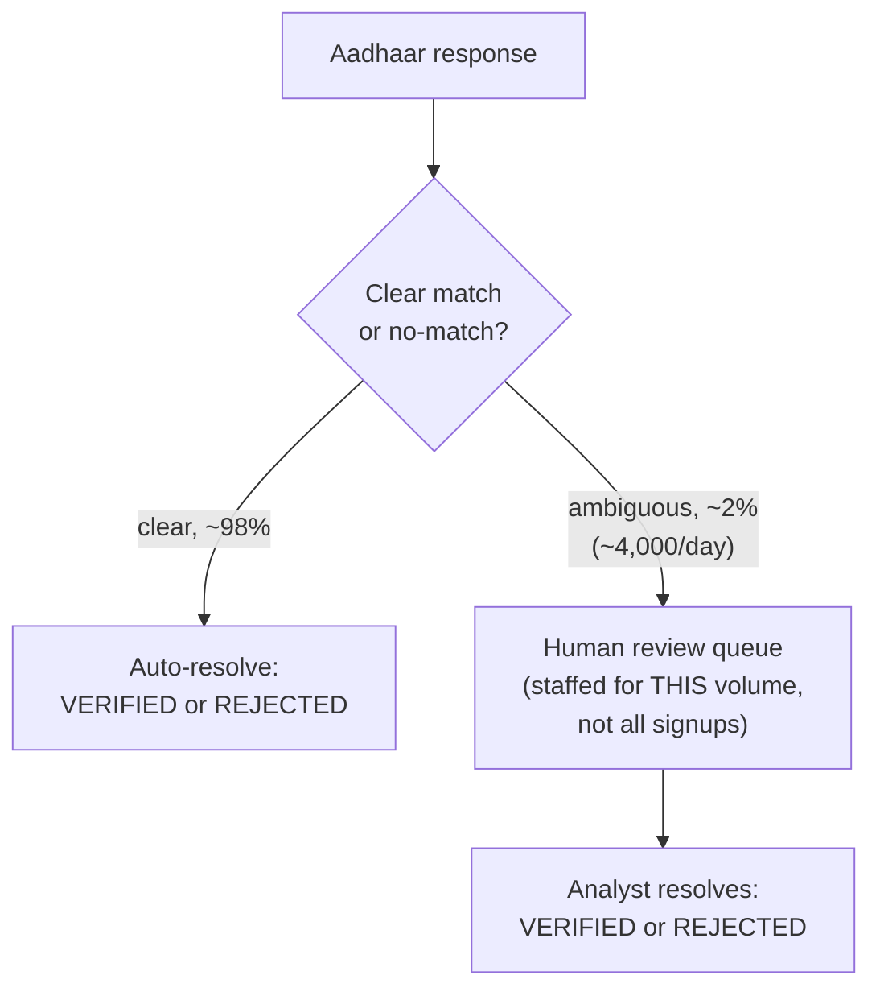

**Never a plain yes/no.** The outcome of a verification is always one of three things — `VERIFIED`,
`REJECTED`, or `NEEDS_REVIEW` — never a boolean, because collapsing "clearly matched," "clearly
didn't," and "a human needs to look at this" into a single true/false would either wrongly approve
ambiguous cases or wrongly bounce good users who just have a messy record.

**How I'd say this in an interview:** "The human review path from Chapter 1 doesn't vanish — it
gets rescoped to just the ambiguous slice the automated match can't confidently call, roughly a
couple percent of volume here. That's a completely different staffing problem than reviewing 100%
of signups, and it's the same three-way decision shape — match, no-match, needs-review — you'd use
for any scored, ambiguous matching system."

---

## Chapter 9 — One shared bank account, not five branch ledgers

NimbusPay runs dispatchers in two data centers for redundancy. Naive split: each DC gets half the
quota, **100,000/day** each. This breaks the first time demand isn't evenly split — a regional
marketing push floods DC-East with signups, and by noon **DC-East has burned its whole 100,000**
while **DC-West is sitting at 40,000 used, 60,000 idle** — capacity that's real and unused, but
DC-East has no way to borrow it.

Naive fix #2: let each DC track its own counter, syncing every few minutes. Same disease as any
cache-to-cache sync of a mutable number: between syncs, **both DCs can believe they have headroom
left and both dispatch against it**, jointly exceeding the real 200,000 for the day — a genuine
double-spend of a shared, consumable, external budget, not a harmless staleness like a cached IP
list being a version behind.

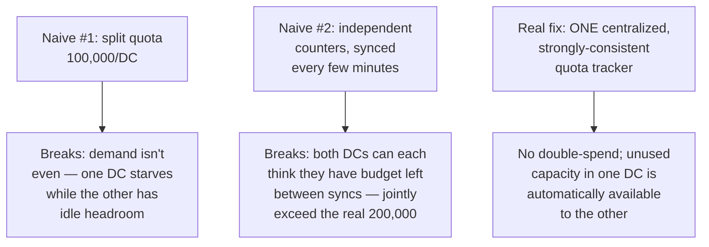

**The analogy:** think of the difference between one shared bank account with a live balance that
every branch checks before approving a withdrawal, versus five separate branch offices each keeping
their own paper ledger and only reconciling with each other every few minutes. The paper-ledger
version is fine for an end-of-day report. It is not fine for deciding, in real time, whether there's
still money left to spend right now — two branches can each approve a withdrawal against money
that, combined, doesn't exist. The fix is the shared, live-balance account: **one centralized,
strongly-consistent quota tracker**, and every DC's dispatcher checks it before every single call.

**Why this is the one place in the whole system that needs strong, not eventual, consistency:** a
stale IP-block-list snapshot being a version behind causes basically no harm. A quota counter that's
stale in the "we think we have more left than we actually do" direction directly causes exceeding
Aadhaar's real quota — which risks throttling or even suspension of NimbusPay's access entirely.
Every other piece of state in this design can tolerate eventual consistency; the quota ledger
cannot.

**How I'd say this in an interview:** "The quota is a shared, consumable resource, not a
replicable snapshot — it needs one centralized, strongly-consistent tracker every DC checks before
every call, like a shared bank account with a live balance, not per-DC slices and not periodic
sync, either of which risks double-spending a fixed external budget you can't just top up
yourself."

---

## Chapter 10 — The bouncer who remembers "yes, over 21," not a photocopy of your ID

Last problem, and it's not a scaling one — it's a legal one, and it was implicit from Chapter 3
onward: what exactly does NimbusPay get to *keep* after a verification resolves?

**The naive instinct:** store the full Aadhaar response and the raw ID number, "just in case we
need it later" — the same instinct that leads teams to log everything by default. This is precisely
what real identity-authority regulations, including Aadhaar's own framework, explicitly restrict:
many such regimes prohibit third parties from retaining the raw national ID number at all, let
alone the government's full response payload.

**The fix, and the analogy:** a good bouncer checking IDs at a bar doesn't photocopy your license
and file it away — they check it once, and all that persists afterward is "yes, this person is over
21." NimbusPay's verified-flag store works the same way: it keeps a **hash** of the ID number (not
the raw number), a **derived status** (`VERIFIED` / `REJECTED` / `NEEDS_REVIEW`), and an audit
trail — never the raw government response, which is used transiently to compute the status and then
discarded, not archived.

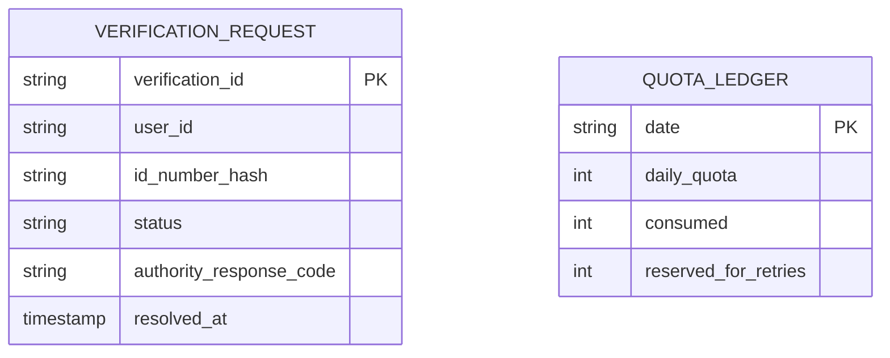

**Consent is a hard prerequisite, not a UX nicety.** Every single call to Aadhaar must carry a
valid, logged consent token — this is both a legal requirement and, practically, a condition of
keeping API access at all; an integration caught calling the authority without consent risks losing
access entirely, which would break every chapter of this design at once.

**How I'd say this in an interview:** "Store a hash of the ID number and a derived status, never
the raw ID number or the raw government response — the same 'remember the conclusion, not the
document' discipline as a bouncer checking IDs. And consent isn't optional UX polish; it's a hard
legal gate on every single call, logged, because the authority's own access agreement depends on
it."

---

## Where the story actually lands

```mermaid
flowchart LR
    A["Ch1: manual review of\nevery signup, doesn't scale"] -->|"fixes: right question\nbreaks: sync call has no pacing"| B["Ch2: sync call to\nauthority at signup"]
    B -->|"fixes: real match\nbreaks: no bulk-cache option"| C["Ch3: the notary\n-- one at a time, by law"]
    C -->|"reframes: queuing,\nnot caching\nbreaks: async alone\ndoesn't pace quota"| D["Ch4: async, unpaced\nworker pool"]
    D -->|"fixes: no user wait\nbreaks: burns quota in minutes"| E["Ch5: always-accept queue +\nquota-aware dispatcher"]
    E -->|"fixes: honest backpressure\nbreaks: retries double-spend"| F["Ch6: idempotency +\nretry budget"]
    F -->|"fixes: safe retries\nbreaks: polling floods the service"| G["Ch7: KYC_RESOLVED\nevent, push not pull"]
    G -->|"fixes: no more polling\nbreaks: ambiguous matches\nneed a human"| H["Ch8: rescoped\nhuman review"]
    H -->|"fixes: 3-way decision\nbreaks: multi-DC quota\ndouble-spend"| I["Ch9: centralized\nquota ledger"]
    I -->|"fixes: no double-spend\nbreaks: nothing left --\njust legal hygiene"| J["Ch10: hash, not raw ID;\nconsent, always"]
```

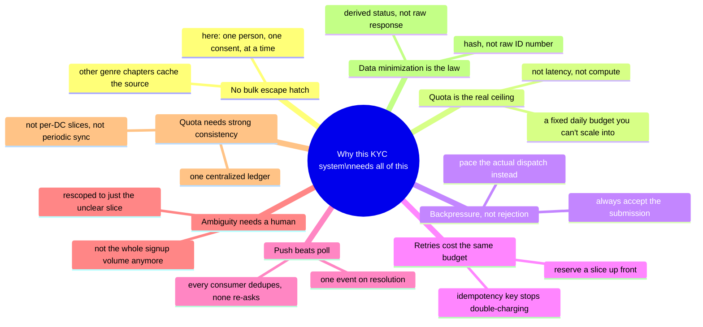

Every real KYC-against-an-authority system you'll design in an interview sits somewhere on this
chain. A product that can tolerate slow, honest onboarding might reasonably stop around Chapter 5.
One with real compliance teeth has to reach Chapter 8, 9, and 10. Walking all ten chapters
unprompted when nobody's asked about multi-DC or data retention reads as padding, not depth — stop
where the stated requirements say to stop.

---

## Grill me — adversarial follow-ups

**Q1: "Why not just negotiate a much bigger quota instead of building all this queuing machinery?"**
That's genuinely often the highest-leverage move, and worth saying unprompted — sometimes the right
systems-design answer is "renegotiate the contract," not "engineer around it harder." But you still
need the queue and the dispatcher regardless of the quota's size, because demand will always be
bursty and unpredictable relative to *whatever* fixed number you're granted — a bigger tank still
needs the same rationing logic, just with more headroom.

**Q2: "If the authority is down entirely for an hour, what happens to the queue?"**
Nothing gets lost — submissions keep being accepted into the durable queue exactly as before, the
dispatcher just has nothing to successfully dispatch. A circuit breaker should trip after enough
consecutive failures so the dispatcher stops burning retry budget hammering a dependency that's
clearly down, and resumes once the authority's health signal recovers.

**Q3: "Couldn't you just increase the number of workers to push through the backlog faster after a
spike?"**
No — that's the mistake Chapter 4 already made. The bottleneck was never worker throughput; it's
the authority's fixed daily quota. More workers just means you hit the same 200,000-call ceiling
even faster, not that you process more calls in total that day.

**Q4: "Why does the retry idempotency key have to be the same across retries — why not just make
each retry attempt look like a fresh call?"**
Because a fresh call for the same underlying attempt is exactly how you double-spend the quota — if
the first attempt actually succeeded on the authority's side and only the response got lost, a
"fresh" retry becomes a second real charge against a fixed daily budget for a person who's already
been verified.

**Q5: "Isn't storing just a hash of the ID number pointless — can't you re-derive the original from
a hash of a fairly small ID-number space?"**
That's a real, fair concern, and it's why the hash needs a proper salt or HMAC keyed on a secret
NimbusPay controls, not a bare unsalted hash of a predictable number space — the point isn't
theoretical unguessability from public info alone, it's meeting a legal minimization requirement
while keeping enough of a stable reference to detect the same person resubmitting, and that design
detail is worth naming if pressed.

**Q6: "What happens if the same person tries to sign up twice, maybe on two different devices?"**
An idempotency key derived from the user's identity (not just their session) at the admission-
control layer catches this before it ever reaches the queue — the second submission gets recognized
as a duplicate of an in-flight or already-resolved verification, rather than consuming a second
unit of the day's quota for one real person.

**Q7: "Why push a `KYC_RESOLVED` event instead of just writing directly to each downstream
service's database from the verification service?"**
Because that couples the verification service to the internal schema and availability of every
downstream consumer, and a new consumer means changing the verification service's code every time.
A published event lets any number of consumers subscribe independently, react in their own time, and
be added or removed without touching the source of truth at all.

**Q8: "You said the quota ledger needs strong consistency — doesn't that make it a single point of
failure across your whole multi-DC design?"**
Fair, and the honest answer is yes, in the sense that it's one small, critical, highly-available
service every DC depends on — but it's a small, well-bounded piece of state (one counter per day),
which is much easier to make highly available with real consensus than the large bulk datasets
elsewhere in this genre. The alternative — per-DC independence — trades that single point of
failure for a guaranteed double-spend risk, which is strictly worse.

**Q9: "How would you handle a second country with a completely different national ID authority and
API contract, and where would you start cold if someone just said 'design a KYC verification
system backed by a government ID authority'?"**
Treat the second country as a second instance of the same shape — its own quota ledger, its own
dispatcher pacing its own limits, its own consent and data-minimization rules — rather than one
global tracker across two legally unrelated authorities; only the admission-control and queue
layer stays shared. And starting cold, say the structural fact first, unprompted: unlike almost
every other "verify against a slow external source" system, there's no bulk-cache option here,
because the source only answers one consenting person at a time against a fixed daily quota —
that one sentence tells the interviewer this is a queuing-and-backpressure problem, not a caching
problem, before a single box gets drawn.

---

## Cheat sheet — one line per stop on the story

- **Manual review**: doesn't scale linearly, and worse, can't actually confirm a match against a
  real government record — that needs the authority itself, not a human eyeballing a photo.
- **Synchronous call to the authority**: inherits both its latency and, more dangerously, its fixed
  quota — a signup spike can burn a whole day's budget by lunchtime with a hard error, not a queue.
- **The notary (no bulk-cache escape hatch)**: the authority only verifies one consenting person at
  a time, by law and by API design — there is no dataset to pre-fetch, which reframes this whole
  system as queuing, not caching.
- **Async without quota-pacing**: fixes user-facing wait time, does nothing about the quota wall —
  an unpaced worker pool can burn a full day's budget in minutes, invisibly.
- **The rationed fuel pump (always accept, pace the dispatch)**: never reject a submission for lack
  of quota — queue it, communicate honestly, and pace outbound calls against a live remaining-
  budget counter.
- **Retry budget + idempotency**: retries spend the same scarce quota as first attempts — reserve a
  slice explicitly, and reuse the same idempotency key across retries so a lost response never
  becomes a second charge.
- **The intercom (push, not poll)**: publish one `KYC_RESOLVED` event on resolution, at-least-once,
  with a dedup key — never make every downstream service poll a status that changes once per user.
- **Rescoped human review**: ambiguous matches still need a person, but only a couple percent of
  volume, not 100% of signups — a three-way outcome (`VERIFIED` / `REJECTED` / `NEEDS_REVIEW`),
  never a plain boolean.
- **The shared bank account (centralized quota ledger)**: the quota is a shared, consumable
  resource across DCs, not a replicable snapshot — one centralized, strongly-consistent tracker,
  checked before every call, is the one place in this design that can't be eventually consistent.
- **The bouncer (data minimization)**: keep a hash of the ID number and a derived status, never the
  raw ID number or the raw authority response — and never call the authority without a logged
  consent token, full stop.
- **The meta-lesson**: every fix here trades one property for another — a bigger quota buys
  headroom, not correctness; a queue buys honesty, not speed; strong consistency on the ledger buys
  safety, not availability. Say the trade in the same sentence you propose the fix.
