# Design a National ID (KYC) Verification System at Onboarding Scale — FAANG Interview Guide

> Source chapter type: same genre as
> [the IP allow/block-list guide](./46-Design-an-IP-Allowlist-Blocklist-Service-FAANG-Guide.md) —
> a real-time-ish decision gated by a slow, externally-owned authority — but with a structural
> twist that flips half the playbook: here you **cannot** bulk-pull the source into a local
> snapshot. A national identity authority (think India's Aadhaar eKYC, or any similar
> government-run identity-verification API) legally and technically only answers **one
> individual's verification at a time**, under explicit consent, against a **hard daily/per-second
> quota** — there is no "the whole dataset" to replicate, because the dataset is an entire
> population's private identity records, and privacy law is the reason you can't have it.

## Mental model

Every other chapter in this genre solves the same shape of problem: pull a bounded dataset from a
slow source, in bulk, on your own schedule, and serve every request locally forever after. That
playbook **does not work here.** A national ID authority's eKYC API can only verify one real
person, one submission at a time, because:

- **You have no legal basis to hold or bulk-query records for people who haven't consented** — a
  new user's identity can only be checked *after* they submit their ID and consent, not
  pre-fetched in advance the way an IP-range list can be.
- **The authority enforces a hard quota per requesting entity** (e.g., "your organization may make
  at most N verification calls per day"), not a soft rate limit you can absorb with a bigger
  cache — there is no cache-hit path around a quota when every request is inherently
  first-time-only for that person.
- **A verification is not instantaneous** even per-call — the authority's own systems can queue,
  and a single call can genuinely take seconds, and its throughput is fixed regardless of how many
  new users your product acquires today.

So the problem is no longer "decouple slow bulk ingestion from fast local serving" — it's
**"decouple an unpredictable, bursty demand for individual verifications from a fixed daily
supply of them, without ever double-spending the quota or leaving a user in limbo."** This is a
queuing, backpressure, and prioritization problem, not a caching problem.

**The one picture to remember forever:**

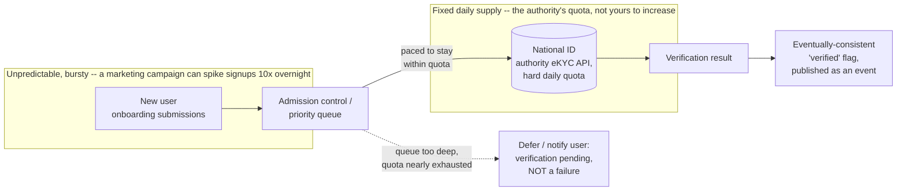

**Memory hook:** *"Every other chapter in this genre says 'pull the whole dataset in bulk, serve
locally forever.' This one says 'you can't — so the entire design is a queue absorbing bursty
demand against a fixed daily supply, with the user told honestly that pending is not the same as
failed.'"*

---

## Table of contents
[How to Identify This Topic](#how-to-identify-this-topic-in-an-interview) ·
[Interview Playbook](#interview-playbook) · [Requirements](#requirements-clarification) ·
[Capacity Estimation](#capacity-estimation-worked) · [API Design](#api-design) ·
[High-Level Architecture](#high-level-architecture) ·
[Architecture Evolution v1→v2→v3](#architecture-evolution-v1--v2--v3) ·
[End-to-End Walkthroughs](#end-to-end-request-walkthroughs) ·
[Deep Dive: Quota-Aware Queue & Backpressure](#deep-dive-quota-aware-queue--backpressure) ·
[Deep Dive: Retry/Backoff Without Double-Spending the Quota](#deep-dive-retrybackoff-without-double-spending-the-quota) ·
[Deep Dive: Eventual-Consistency of the Verified Flag](#deep-dive-eventual-consistency-of-the-verified-flag) ·
[Deep Dive: Global Quota Across Multiple DCs](#deep-dive-global-quota-across-multiple-dcs) ·
[Data Model](#data-model) · [Failure Modes](#failure-modes--mitigations) ·
[Non-Functional Walkthrough](#non-functional-walkthrough) ·
[Security & Compliance](#security--compliance) · [Cost & Trade-offs](#cost--trade-offs) ·
[Wrap-Up](#wrap-up-mvp-vs-stretch) · [Golden Rules](#golden-rules) ·
[Cheat Sheet](#master-cheat-sheet)

---

## How to identify this topic in an interview

- "Design an identity-verification/KYC flow backed by a government ID authority."
- Any variant emphasizing that the external system has a **hard daily quota per requesting
  organization**, not just per-request latency — that's the signal this is the queuing/
  backpressure chapter, not a "build a local cache" chapter, because there's fundamentally
  nothing to cache in advance.
- A follow-up like "what if we get 10x normal signups overnight" is testing the
  [quota-aware queue deep dive](#deep-dive-quota-aware-queue--backpressure) — the answer is
  admission control and honest user communication, not "just call the API more."
- "How do users find out they're verified if the check doesn't finish synchronously?" is testing
  the [eventual-consistency deep dive](#deep-dive-eventual-consistency-of-the-verified-flag).

---

## Interview playbook

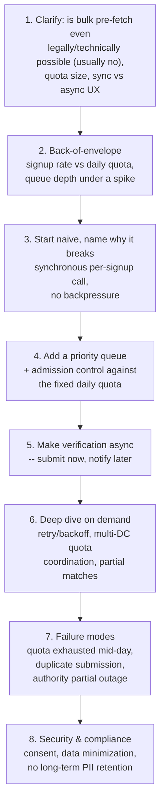

**What the interviewer is actually grading at each step:**
- Step 3: do you recognize, unprompted, that this system has **no bulk-cache escape hatch** — a
  new user's verification is inherently a first-time call, so "just cache it" doesn't apply the
  way it does everywhere else in this genre?
- Step 4/5: do you reach for **admission control and async processing** rather than trying to
  brute-force more throughput out of a fixed quota?
- Step 6: on multi-DC, do you realize the quota is a **shared, consumable resource** (unlike the
  immutable snapshots in the other chapters) — and that per-DC independent quota slices via
  cache-to-cache sync would risk double-spending a fixed daily budget, not just staleness?

---

## Requirements clarification

### Functional

| # | Requirement | Notes |
|---|---|---|
| F1 | Accept a new user's ID submission (with consent) and verify it against the national ID authority | The core function, inherently per-individual, inherently consent-gated |
| F2 | Do not block onboarding synchronously on the verification completing | The authority's own latency and queueing make a hard synchronous wait impractical at scale |
| F3 | Notify the user and downstream services when the `verified` flag resolves, one way or another | Async completion needs an async notification mechanism, not polling from every consumer |
| F4 | Handle partial/ambiguous match responses (e.g. name matched, DOB slightly off) via a human review path | Same three-way-decision shape as the sanctions-screening chapter, applied to identity matching |
| F5 | Never exceed the requesting organization's daily/per-second quota with the authority, under any load | A hard external constraint, not a soft target |

### Non-functional

| Requirement | Target | Why this number |
|---|---|---|
| Time-to-verification-result (typical) | Seconds to a few minutes, communicated honestly to the user as "pending," not hidden behind a spinner implying instant completion | Real eKYC calls can take real time; promising instant results you can't deliver erodes trust more than an honest "we'll notify you" |
| Time-to-verification-result (under quota pressure) | Can extend to hours; must degrade gracefully, never silently drop a submission | A signup surge shouldn't corrupt or lose verification requests — it should visibly, honestly queue them |
| Quota adherence | Zero tolerance for exceeding the authority's quota | Exceeding it risks throttling, suspension, or contractual penalties from the authority — the same "don't get cut off from your dependency" principle as the IP guide, sharpened by a hard contractual quota instead of a soft rate limit |
| Data retention | Minimal — store a derived `verified` flag and an audit hash, not the raw government response or, in many real regimes, the raw ID number itself | Often a specific legal requirement (e.g. many Aadhaar-style regimes explicitly restrict storing the raw ID number by third parties) |
| Consistency of the `verified` flag | Eventual, with the resolution event delivered reliably (at-least-once, deduplicated by consumers) | Downstream services (account limits, feature gating) can tolerate a short delay in seeing a resolved flag; they cannot tolerate silently never finding out |

**Clarifying questions worth asking the interviewer up front — and what each answer changes:**

| Question | If the answer is... | ...then this changes |
|---|---|---|
| "Can we bulk-fetch or pre-verify identity records ahead of user signup, like the IP-list chapter?" | No — legally and technically per-individual, consent-gated only | Rules out the entire bulk-ingestion playbook from the rest of this genre; confirms this is fundamentally a queuing problem |
| "What's the daily/per-second quota, and does it reset at a fixed time?" | E.g. 200,000/day, resets at midnight UTC | Directly sizes the admission-control queue and the "how much headroom is left today" calculation the queue depends on |
| "Can the UX be async (notify later) or must it be synchronous at signup?" | Async is acceptable | Confirms the whole architecture can be queue-based rather than needing to somehow force a synchronous answer out of an inherently async dependency |
| "What happens on a partial/ambiguous match?" | Route to manual review | Confirms the three-way decision shape, same as the sanctions chapter |
| "Do retries count against the same daily quota?" | Yes | Makes retry budget a scarce, trackable resource, not something to spend freely on transient failures — see the [retry deep dive](#deep-dive-retrybackoff-without-double-spending-the-quota) |

**Say this out loud in the interview:** *"Unlike the rest of this genre, there's no bulk snapshot
to build here — every verification is inherently a first-time, per-individual, consent-gated call.
So the design problem is entirely about queuing and pacing bursty demand against a fixed daily
supply, not about caching."*

---

## Capacity estimation, worked

```
Given (illustrative, a consumer fintech app doing eKYC-style onboarding):
  Daily quota granted by the authority           = 200,000 verifications/day
  Per-second quota (if separately enforced)       = 50/sec sustained, bursts to 100/sec

Normal-day signup rate:
  Average daily signups needing verification      = 120,000/day
  -> comfortably within the 200,000/day quota on a normal day; 80,000/day of headroom.

Spike scenario (the number that matters for backpressure design):
  A marketing campaign or viral moment drives      = 600,000 signups in one day
  -> 3x the daily quota. There is NO way to verify all of these same-day, full stop -- this
     isn't a scaling problem solvable with more servers, because the ceiling belongs to the
     authority, not you. The only real levers are: admission control (queue the excess for
     later days), prioritization (which submissions go first), and honest communication (tell
     the deferred users their verification is pending, not failed).

Queue depth under the spike:
  Excess beyond one day's quota                    = 600,000 - 200,000 = 400,000
  At 200,000/day sustainable clearing rate, backlog clears in ~2 additional days if signups
  return to normal -- a concrete number worth stating: "under this spike, expect a ~2-day
  verification backlog before returning to normal same-day turnaround," rather than a vague
  "the queue will handle it."

Retry budget carve-out:
  Illustrative transient-failure rate               = ~3% of calls need at least one retry
  Retry budget reserved from the daily quota         = 200,000 x 0.03 x (avg 1.5 retries) ~= 9,000
  Effective new-verification capacity per day        = 200,000 - 9,000 ~= 191,000
  -> retries are not free against a fixed quota; sizing the *effective* new-submission capacity
     net of expected retries is the number the admission-control queue should actually pace
     against, not the raw 200,000 headline quota.
```

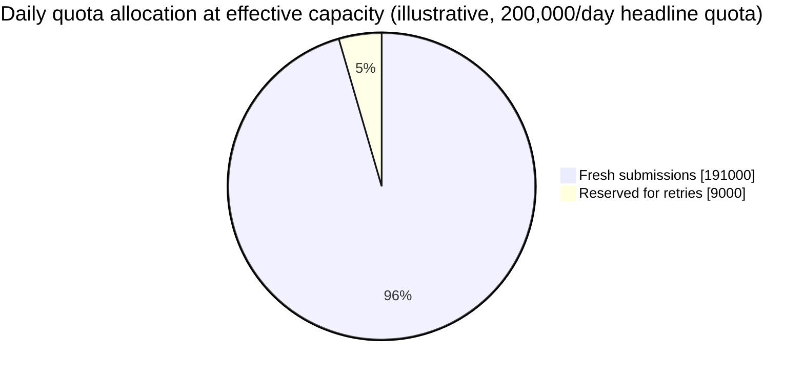

A small slice reserved for retries looks like a rounding error on the pie chart, but it's the
exact number the [retry deep dive](#deep-dive-retrybackoff-without-double-spending-the-quota)
depends on to keep retries from silently eating into fresh users' first-attempt capacity.

**Redo-the-chain test:** if the authority doubles the daily quota to 400,000 (a contract
renegotiation), the same 600,000-signup spike now clears in well under a day of backlog instead of
~2 — a concrete illustration that the quota, not your infrastructure, is the actual scaling lever
here, worth naming explicitly if asked "how would you handle 10x more signups."

**The number worth memorizing:** the daily quota is a **fixed, external, non-negotiable-in-the-
moment ceiling** — capacity planning here is about queue depth and backlog-clearing time under
realistic demand spikes, not about servers, QPS, or cache size the way the rest of this genre is.

---

## API design

### `POST /v1/kyc/submit` (called once per new user, at signup)

```json
{
  "userId": "u_88213",
  "idType": "NATIONAL_ID",
  "idNumberHash": "sha256:...",
  "consentToken": "consent_9a21",
  "demographicData": { "name": "...", "dateOfBirth": "..." }
}
```

Response (immediate, does **not** wait for the authority):
```json
{
  "verificationId": "kyc_71209",
  "status": "PENDING",
  "estimatedResolutionWindow": "minutes to a few hours, depending on current load"
}
```

| Field | Notes |
|---|---|
| `idNumberHash` | The raw ID number is used only transiently to call the authority — what's persisted is a hash, not the raw number, per the data-minimization requirement |
| `status: PENDING` | The only possible immediate response — there is no synchronous `VERIFIED` here, and the API contract should make that explicit rather than implying a fast path exists |

### `GET /v1/kyc/{verificationId}/status` (poll, if the client wants to check)

```json
{
  "verificationId": "kyc_71209",
  "status": "VERIFIED",
  "resolvedAt": "2026-07-24T09:15:03Z",
  "authorityResponseCode": "MATCH_CONFIRMED"
}
```

### Webhook/event (preferred over polling for downstream services)

```json
{
  "eventType": "KYC_RESOLVED",
  "userId": "u_88213",
  "verificationId": "kyc_71209",
  "status": "VERIFIED",
  "resolvedAt": "2026-07-24T09:15:03Z"
}
```

`status` values: `PENDING`, `VERIFIED`, `REJECTED`, `NEEDS_REVIEW` (the three-way outcome, plus the
initial pending state) — never a plain boolean, for the same reason as every scored/ambiguous
matching system in this genre.

**The one sentence worth saying about the API surface:** *"Submission is synchronous and cheap;
resolution is asynchronous and notified via event, because the only honest contract here is
'accepted for processing,' never 'verified right now' — the authority doesn't work fast enough to
promise the latter."*

---

## High-level architecture

### Architecture evolution (v1 → v2 → v3)

**v1 — synchronous call at signup, no backpressure:**

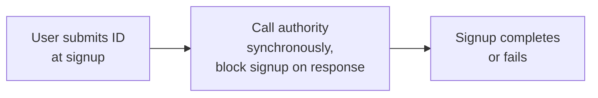

**Why it breaks:** the authority's own latency (seconds, sometimes longer under its own load)
makes signup feel broken; worse, there's no admission control at all — a signup spike sends an
unbounded burst of calls at a fixed quota, guaranteeing throttling or outright rejection from the
authority partway through the surge, with no graceful degradation, just a wall of failed signups.

**v2 — async, but no quota-aware pacing:**

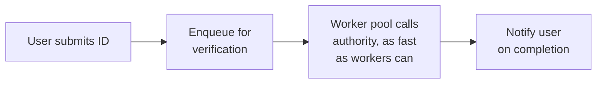

**Why it breaks:** async processing fixes the "don't block signup" problem, but "as fast as
workers can" still has no relationship to the authority's fixed daily quota — a worker pool sized
for throughput will happily burn through the entire day's quota in the first hour of a signup
spike, leaving zero quota for the rest of the day's normal traffic. This is the same mistake as
calling an external rate-limited API without respecting its limit, just moved one layer back —
async alone doesn't solve a quota problem, it just delays when you hit it.

**v3 — the real system: quota-aware admission control and pacing:**

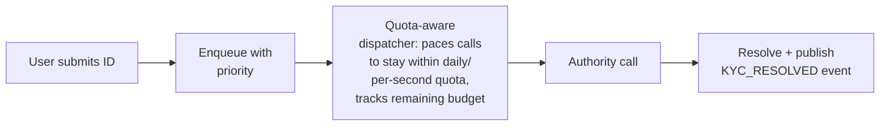

**What v3 fixes, one line each:** submissions are accepted instantly regardless of current quota
pressure (never rejected outright, only queued); the dispatcher paces outbound calls against a
live, tracked remaining-quota counter rather than worker-pool throughput; and priority ordering
(e.g. time-sensitive verifications ahead of routine ones, if the product has such a distinction)
becomes possible precisely because there's an explicit queue to order, not a fire-and-forget
worker race.

---

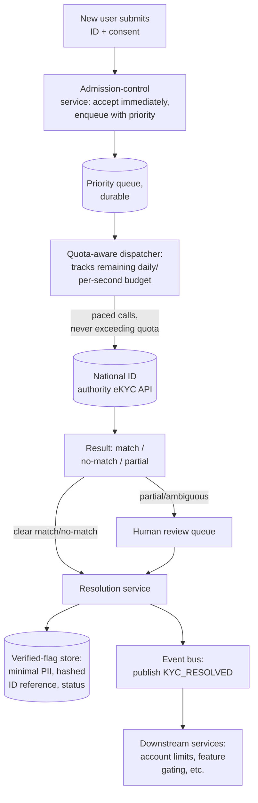

| Component | Role |
|---|---|
| Admission-control service | Accepts every submission instantly (never rejects outright), assigns priority, enqueues — the "always accept, pace the work" pattern that keeps the user-facing contract honest under any load |
| Durable priority queue | Absorbs bursty demand; must survive restarts without losing or duplicating submissions (idempotency keys per submission) |
| Quota-aware dispatcher | The core new component this chapter introduces — tracks live remaining quota (daily + per-second) and paces outbound authority calls to never exceed it, dequeuing by priority |
| Human review queue | Same three-way-decision pattern as the sanctions chapter, for partial/ambiguous authority responses |
| Verified-flag store | Minimal by design — a status and a hashed reference, not the raw government response |
| Event bus | Publishes `KYC_RESOLVED` so downstream services react to the eventual result without polling the verification service directly |

---

## End-to-end request walkthroughs

### Walkthrough 1 — normal day, submission to resolution

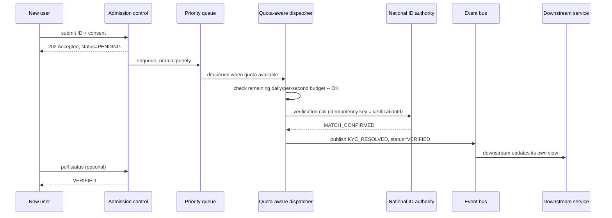

### Walkthrough 2 — signup spike exhausts the daily quota, dispatch pauses

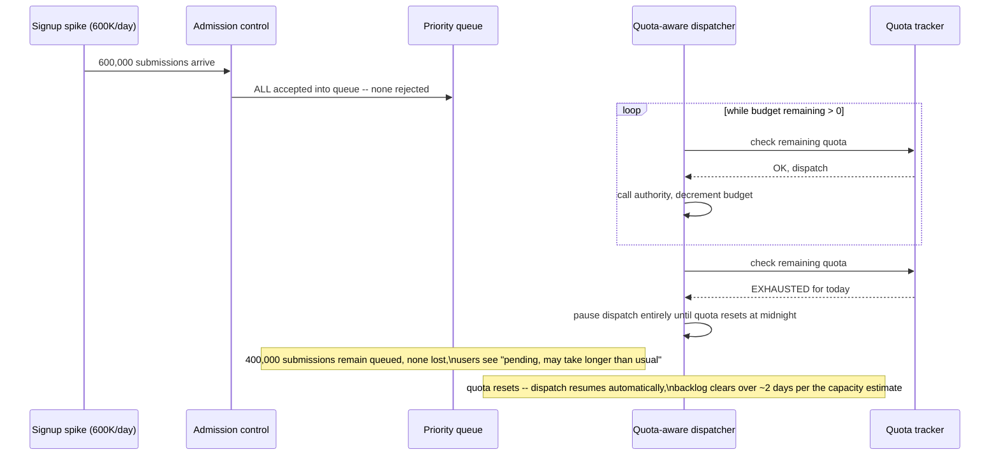

The second trace is the one to draw if an interviewer asks "what happens under load" — nothing is
rejected or lost, dispatch simply pauses and resumes, exactly the "always accept, pace the work"
principle from the [quota-aware queue deep dive](#deep-dive-quota-aware-queue--backpressure).

---

## Deep dive: quota-aware queue & backpressure

The core new mechanism this chapter introduces, replacing the "bulk snapshot" pattern the rest of
the genre relies on.

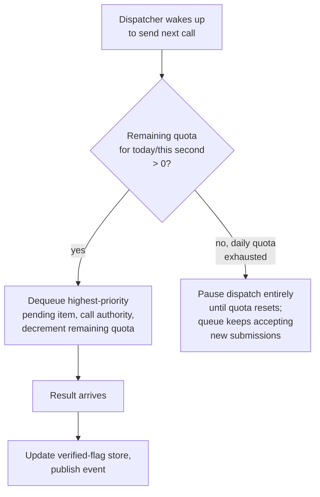

**Why "always accept, pace the work" beats "reject when over capacity":** rejecting a submission
outright at signup time (returning an error because the daily quota is exhausted) forces the user
to retry later on their own, with no guarantee they will — silently losing signups. Accepting every
submission into a durable queue and being honest about resolution timing ("pending, may take
longer than usual today") preserves every submission and lets the system catch up automatically as
quota resets, without asking the user to do anything.

**Priority ordering, if the product has a reason for one:** e.g., a user actively trying to
complete a time-sensitive transaction that requires verification first might reasonably jump ahead
of a routine background re-verification — but this should be an explicit, product-defined priority
scheme, not an implicit "first in, first out" that happens to advantage whoever queued first for no
principled reason.

**Interview cheat-sheet:** *"Never reject a submission because the quota is tight — always accept
into a durable, priority-ordered queue, and pace outbound calls against a live remaining-quota
counter. The queue is the backpressure mechanism; the user-facing contract stays honest ('pending')
instead of lossy ('try again later, good luck')."*

---

## Deep dive: retry/backoff without double-spending the quota

A failed or ambiguous authority call needs a retry policy — but every retry consumes the same
scarce daily quota as a first-time call, which the rest of this genre's slow-but-not-quota-limited
sources don't have to reason about this sharply.

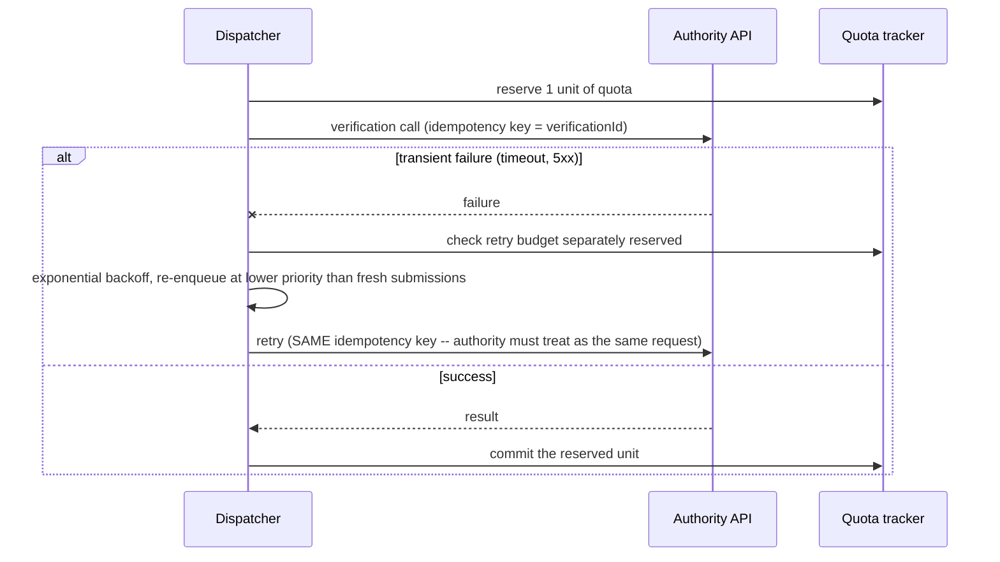

**Idempotency key reuse across retries is what prevents double-spending.** If the authority's own
API supports idempotency keys (many identity-verification APIs do, precisely because retries are
expected), a retried call with the same key should not count as a second charge against the quota
even if your own dispatcher's accounting treats it conservatively as a reservation — confirm this
behavior with the authority's actual API contract rather than assuming it.

**Retries should not out-compete fresh submissions for the same day's quota indefinitely.** The
capacity-estimation section already reserved a slice of the daily quota specifically for expected
retries — once that slice is exhausted, further retries should queue behind fresh submissions
rather than starving new users' first attempts, a prioritization choice worth stating explicitly.

**Interview cheat-sheet:** *"Retries consume the same scarce quota as first attempts — budget for
them explicitly in capacity planning, reuse idempotency keys so the authority doesn't double-charge
you, and don't let a retry storm starve fresh submissions of their fair share of the day's quota."*

---

## Deep dive: eventual-consistency of the verified flag

Because resolution is asynchronous and can take anywhere from seconds to (under load) hours, every
consumer of "is this user verified" needs a consistent way to find out without polling the
verification service directly.

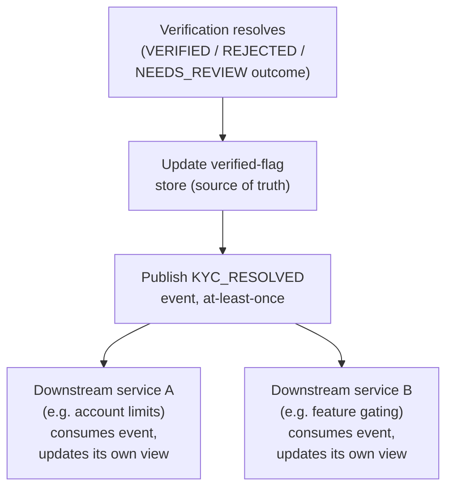

**Why push (events) beats pull (every downstream service polling the verification service):** at
onboarding scale, many downstream services care about verification status — polling multiplies
load on the verification service for no benefit; a published event lets each consumer update its
own local view once, asynchronously, exactly the same "don't make the hot path fan out
synchronously" principle as the debounce/cancellation logic in the AI-code-assistant chapter,
applied to service-to-service communication instead of client-to-server.

**At-least-once delivery means consumers must deduplicate.** A `verificationId` (or an event id)
lets each downstream consumer safely ignore a redelivered event rather than double-applying a
state change (e.g., incrementing an account limit twice) — standard event-driven-architecture
hygiene, worth naming explicitly rather than assuming exactly-once delivery is achievable or
necessary.

**Interview cheat-sheet:** *"Publish a `KYC_RESOLVED` event once the flag changes, at-least-once,
with a stable id for deduplication — never make every downstream service poll the verification
service directly for a status that only changes once, asynchronously, per user."*

---

## Deep dive: global quota across multiple DCs

Multi-DC here has a sharper failure mode than the rest of this genre: the daily quota is a
**single, shared, consumable resource** granted to your organization as a whole, not an immutable
dataset that's safe to fully replicate everywhere.

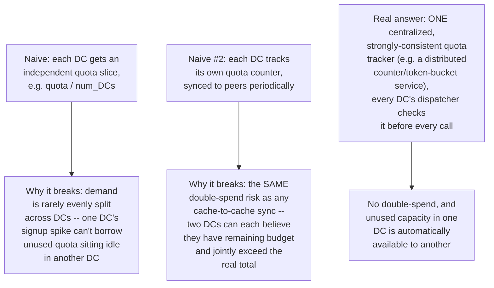

**Why this needs strong, not eventual, consistency, unlike the snapshot data in the rest of this
genre:** an immutable IP-range snapshot can be a version or two stale across DCs with no real
harm — but a quota counter that's stale in the "we have more left than we actually do" direction
directly causes exceeding the authority's real quota, which risks throttling or suspension. The
quota tracker is the one piece of state in this whole genre that genuinely needs strong
consistency, not eventual.

**Interview cheat-sheet:** *"The quota is a shared, consumable resource, not a replicable dataset —
it needs one centralized, strongly-consistent tracker that every DC's dispatcher checks before
every call, not per-DC independent slices and not cache-to-cache sync, either of which risks
double-spending a fixed external budget."*

---

## Data model

**Verification request lifecycle** — the state machine both walkthroughs above are tracing
through:

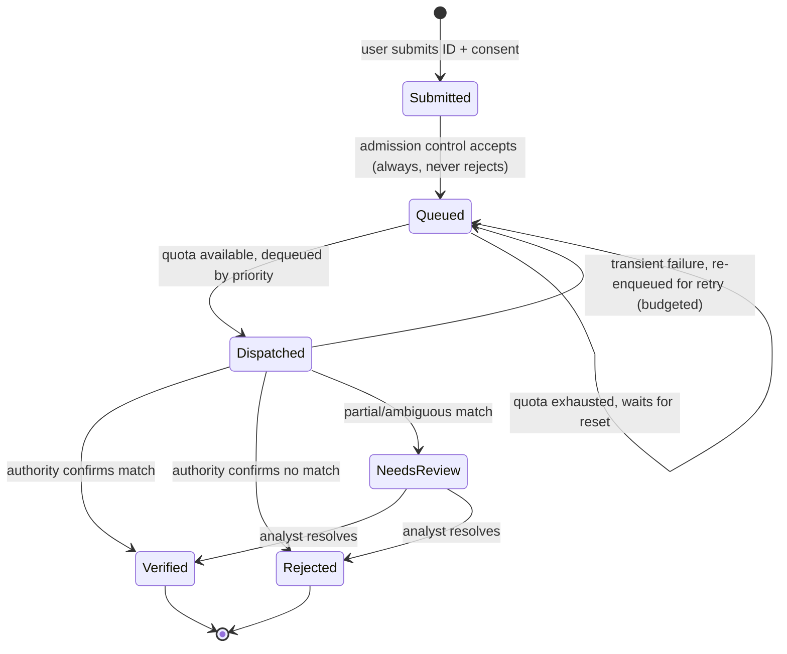

The `Queued --> Queued` self-loop is the entire backpressure story in one transition — a
submission never leaves the queue for any reason except quota becoming available or the retry
budget being spent; it never silently disappears.

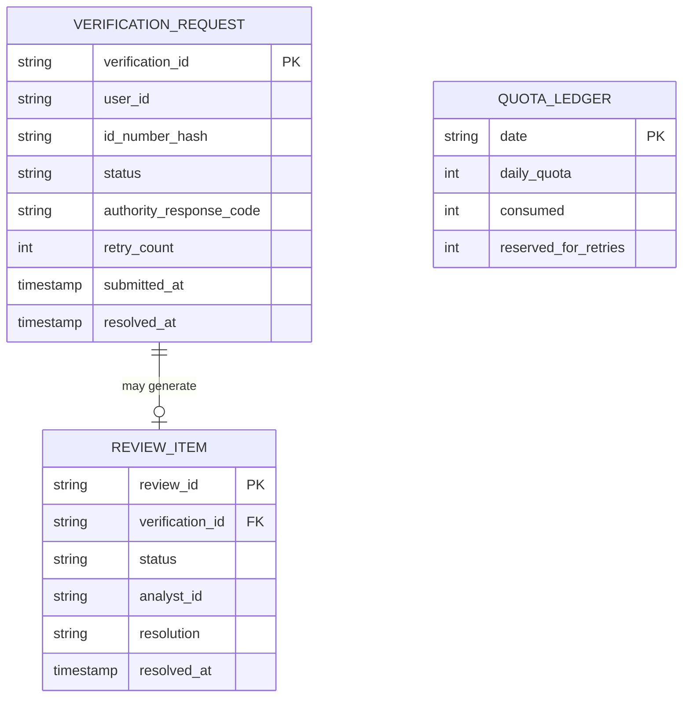

| Table | Storage choice & why |
|---|---|
| `VerificationRequest` | Relational, one row per submission — needs transactional read-after-write so a user's own status check is immediately consistent with their own latest submission |
| `ReviewItem` | Same pattern as the sanctions chapter's review queue, much lower relative volume here |
| `QuotaLedger` | The one piece of state needing strong, centralized consistency — a distributed counter or token-bucket implementation, not a general-purpose relational table replicated loosely |

**Why raw government response data and raw ID numbers are conspicuously absent from this model:**
by design — the data-minimization requirement means only a hash of the ID number and a derived
status are retained; the actual government response is used transiently to compute that status and
then discarded, not archived.

---

## Failure modes & mitigations

| Failure mode | Impact | Mitigation |
|---|---|---|
| **Signup spike far exceeds daily quota** | Backlog grows, resolution times extend for everyone submitted that day | Admission control still accepts every submission; honest "pending, may take longer than usual" messaging; backlog clears automatically over subsequent days as quota resets — quantify the expected clearing time, don't just say "it'll queue" |
| **Quota tracker becomes a single point of failure** | If down, no DC can safely dispatch any call (since none can confirm remaining budget) | The tracker itself should be a small, highly-available, strongly-consistent service (e.g. built on a consensus-backed counter) — it's a small, well-bounded piece of state, much easier to make highly available than the large bulk datasets elsewhere in this genre |
| **Duplicate submission from the same user** (double-click, client retry) | Risk of consuming quota twice for one real verification | Idempotency key derived from user + submission attempt, deduplicated at the admission-control layer before it ever reaches the queue |
| **Authority partial outage — some calls succeed, most time out** | Retry storm risk, consuming retry-budget quota fast | Circuit breaker on the dispatcher: past a failure-rate threshold, pause dispatch and let the queue absorb the pause, rather than retrying into a degraded authority and burning quota on calls likely to fail again |
| **Downstream service misses a `KYC_RESOLVED` event** (consumer was down) | That service's view of the user's verification status never updates | At-least-once delivery with retry from the event bus; downstream services should also be able to pull the current authoritative status from the verified-flag store as a reconciliation fallback, not rely on events alone forever |

---

## Non-functional walkthrough

**Scaling here is about queue and dispatcher throughput relative to quota, not raw compute.**
Unlike the rest of this genre, adding more servers doesn't help once the bottleneck is the
authority's fixed quota — this is worth stating explicitly, since "just scale horizontally" is the
wrong answer to "what if we get more signups than the quota allows."

**Availability of the admission-control/queue path should be very high** — a user's submission
being accepted should almost never fail, even when the downstream dispatch to the authority is
fully paused due to quota exhaustion. Losing a submission is a much worse failure than a delayed
resolution.

**Consistency of the verified flag is eventual by nature** (there's no faster path — the authority
itself is the source of truth and it's inherently async), but the **quota ledger's consistency
must be strong**, as established in the multi-DC deep dive — two very different consistency bars
in one system, similar in spirit to the AI-code-assistant chapter's "two consistency bars" lesson,
but split along a completely different axis (consumable-resource-tracking vs. eventual-result-
propagation) than that chapter's freshness-vs-safety split.

**Warm-up and fail-open, adapted to a queue instead of a bulk snapshot.** On restart, the
dispatcher must recover in-flight/pending queue state (and the quota ledger's current count)
before resuming dispatch — the same "never start from empty or fabricated state" discipline as the
[IP guide's warm-up deep dive](./46-Design-an-IP-Allowlist-Blocklist-Service-FAANG-Guide.md#deep-dive-warm-up--cold-start),
here applied to durable queue/ledger state rather than a dataset snapshot; resuming with an
under-counted quota risks double-spending it, resuming with an over-counted one just wastes a
little headroom, so recovery should bias conservative. The fail-open equivalent here is the
admission-control rule already established above: **always accept a submission, never reject it
outright for lack of quota** — the same "degrade gracefully, never fail the caller" instinct as the
IP guide's "serve last known-good rather than blocking everyone," expressed here as "queue it
rather than losing it."

---

## Security & compliance

- **Consent is a hard prerequisite, not a UX nicety.** A verification call must never be made
  without a valid, logged consent token — many real identity-authority APIs contractually and
  legally require this, and violating it risks losing API access entirely.
- **Data minimization is a legal requirement in most real regimes for this exact system.** Store a
  hash, not the raw ID number; store a derived status, not the raw authority response; define an
  explicit retention/deletion policy for even the minimal data kept.
- **Quota-usage reporting to the authority** may itself be a contractual obligation — treat the
  quota ledger as something you may need to report on, not just internally track.
- **Access to the human review queue** should be role-restricted and logged, same as every review
  queue in this genre — a reviewer resolving an identity match is a security-sensitive action.

---

## Cost & trade-offs

**The daily quota is the single dominant constraint on this system's throughput — not
infrastructure cost.** Unlike every other chapter in this genre (where infrastructure is cheap and
the external system's rate limit is the scarce resource, but usually invisible to the end user),
here the scarce resource directly determines user-facing wait time during a spike — the "cost" that
matters most is user experience/trust cost from delayed verification, not compute dollars.

**Negotiating a larger quota is often the highest-leverage lever available**, more so than any
architectural optimization — worth naming explicitly if asked "how would you handle more scale":
sometimes the right systems-design answer is "renegotiate the external contract," not "build more
clever software" — the software's job is to use whatever quota exists as efficiently and fairly as
possible, not to pretend the quota itself is infinitely elastic.

---

## Wrap-up: MVP vs. stretch

**In scope for an MVP:**
- Instant-accept admission control into a durable, priority-capable queue.
- Quota-aware dispatcher with a live remaining-budget tracker (daily + per-second).
- Async resolution with an event published on status change, plus a basic polling endpoint.
- A minimal human-review path for partial/ambiguous authority responses.
- Data-minimized storage: hashed ID reference, derived status, no raw response retention.

**Explicitly out of scope for an MVP:**
- Sophisticated priority tiers beyond a simple two-level scheme (e.g. "time-sensitive" vs
  "routine") — start simple, generalize only if the product genuinely needs more granularity.
- Automated quota renegotiation/prediction (forecasting signup spikes to proactively request a
  higher quota from the authority ahead of a known campaign) — a valuable stretch, not a
  day-one requirement.

**Stretch goals, worth naming if asked "what's next":**
1. **Predictive admission shaping** — if a marketing campaign's expected signup volume is known in
   advance, proactively spread queue priority/pacing ahead of the spike rather than reacting to it
   after the fact.
2. **Multi-authority support**, for products operating across countries with different national ID
   authorities, each with its own quota and API contract — a fan-out generalization of this
   chapter's single-authority design.
3. **Automated retry-budget forecasting** from historical transient-failure rates, tightening the
   capacity-estimation reservation instead of using a fixed illustrative percentage.

---

## Golden rules

- **There is no bulk-snapshot escape hatch here** — every verification is inherently first-time,
  per-individual, and consent-gated, which is the structural fact that makes this chapter different
  from the rest of the genre.
- **Always accept the submission; never reject outright because the quota is tight.** Queue it,
  communicate honestly, let the backlog clear as quota resets.
- **Retries consume the same scarce quota as first attempts** — budget for them explicitly and
  reuse idempotency keys to avoid double-charging.
- **Push (events), don't make consumers pull.** A `KYC_RESOLVED` event, at-least-once with a
  dedup key, beats every downstream service polling the verification status directly.
- **The quota ledger is the one piece of state in this genre that needs strong, not eventual,
  consistency** — a shared consumable resource must never be double-spent across DCs.
- **When the constraint is a fixed external quota, the highest-leverage fix is sometimes
  renegotiating the quota, not engineering around it harder.**

---

## Master cheat sheet

**One-liners:**
- Unlike the rest of this genre, there's nothing to bulk-replicate here — every verification is a
  first-time, consent-gated, per-individual call against a fixed daily quota.
- Always accept a submission into a durable queue; never reject outright on quota pressure — pace
  dispatch instead, and communicate delay honestly.
- Retries are not free against a fixed quota — reserve budget for them explicitly and reuse
  idempotency keys so the authority doesn't double-charge a retried call.
- Publish an event on resolution rather than making every downstream consumer poll — at-least-once
  delivery with a dedup key is standard hygiene here.
- The quota ledger needs strong, centralized consistency across DCs — it's a consumable resource,
  not an immutable dataset, and double-spending it risks the authority throttling or suspending
  access entirely.
- When quota is the bottleneck, the biggest lever is sometimes a bigger contractual quota, not a
  cleverer queue.

**Formula chain:**
```
effective_daily_capacity = daily_quota - (daily_quota x retry_rate x avg_retries_per_failure)
backlog_clear_days       = max(0, (signups_today - effective_daily_capacity) / effective_daily_capacity)
```

**Numbers:** resolution time ranges from seconds to hours depending on queue depth relative to the
fixed daily quota · reserve roughly a few percent of daily quota for expected retries, sized from
observed transient-failure rate · the quota ledger is the one strongly-consistent piece of shared
state in an otherwise eventually-consistent system.
