# Design a Multi-Source Sanctioned-Country Payment Blocking System — FAANG Interview Guide

> Source chapter type: the capstone of this genre. Everything in
> [the IP allow/block-list guide](./46-Design-an-IP-Allowlist-Blocklist-Service-FAANG-Guide.md)
> still applies — decouple slow ingestion from fast serving, warm-start, fail-open with a
> monitored staleness bound — but now multiplied across **several independent government/
> regulatory sources that update on different schedules and sometimes flatly disagree with each
> other.** The new problem this chapter adds is not ingestion or serving, it's **which source's
> answer applies to this specific transaction, and what do you do when two applicable sources
> disagree.**

## Mental model

A global payment gateway routing a transaction between a payer and a payee doesn't answer to just
one government. A single cross-border payment can simultaneously fall under:

- **The payer's country's regulator** (their local sanctions list).
- **The payee's country's regulator** (theirs).
- **A currency-clearing jurisdiction's regulator** — famously, a transaction denominated in or
  cleared through US dollars can fall under OFAC's jurisdiction regardless of where the payer and
  payee are actually located, because of how dollar-clearing routes through US correspondent
  banks. This "long-arm jurisdiction" fact is *the* thing that makes this chapter distinct from
  guide 46: **which lists even apply to a given transaction is itself a non-trivial
  determination**, not a given.
- **Supranational bodies** (UN Security Council consolidated list, EU consolidated list) whose
  designations member states are independently obligated to enforce, on their own timelines.

Each of these sources publishes independently, updates on its own cadence (some daily, some
irregularly around geopolitical events), and — because sanctions are geopolitically contested —
**can and do disagree**: a country lifted from one list can still appear on another; an entity
newly designated by one regulator might not appear on a second regulator's list for days or weeks.

This chapter is really two problems stacked on guide 46's foundation:

1. **N independent ingestion pipelines instead of one** — mechanically the same pattern, just
   multiplied, with N different cadences and N different staleness bounds to track.
2. **A jurisdiction-nexus and conflict-resolution problem** — determining which sources actually
   apply to a given transaction, and what to do when the applicable sources disagree.

**The one picture to remember forever:**

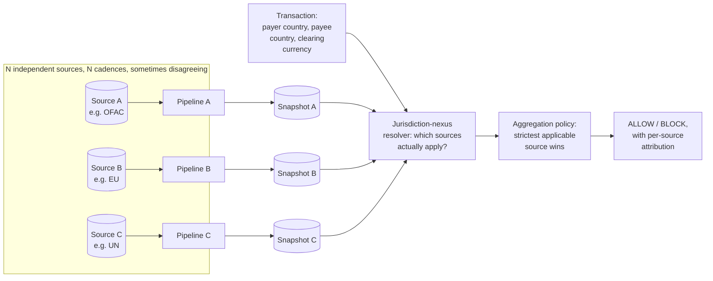

**Memory hook:** *"Guide 46 solved 'one slow source, decouple ingestion from serving.' This guide
solves 'many slow sources that disagree — figure out which ones even apply, then default to the
strictest applicable answer, and never hide which source drove the decision.'"*

---

## Table of contents
[How to Identify This Topic](#how-to-identify-this-topic-in-an-interview) ·
[Interview Playbook](#interview-playbook) · [Requirements](#requirements-clarification) ·
[Capacity Estimation](#capacity-estimation-worked) · [API Design](#api-design) ·
[High-Level Architecture](#high-level-architecture) ·
[Architecture Evolution v1→v2→v3](#architecture-evolution-v1--v2--v3) ·
[End-to-End Walkthroughs](#end-to-end-request-walkthroughs) ·
[Deep Dive: Jurisdiction-Nexus Resolution](#deep-dive-jurisdiction-nexus-resolution) ·
[Deep Dive: Multi-Source Conflict Resolution](#deep-dive-multi-source-conflict-resolution) ·
[Deep Dive: Per-Source Staleness Bounds](#deep-dive-per-source-staleness-bounds) ·
[Data Model](#data-model) · [Failure Modes](#failure-modes--mitigations) ·
[Non-Functional Walkthrough](#non-functional-walkthrough) ·
[Security & Compliance](#security--compliance) · [Cost & Trade-offs](#cost--trade-offs) ·
[Wrap-Up](#wrap-up-mvp-vs-stretch) · [Golden Rules](#golden-rules) ·
[Cheat Sheet](#master-cheat-sheet)

---

## How to identify this topic in an interview

- "Design sanctioned-country/entity blocking for a global payment gateway operating in many
  countries."
- Any variant explicitly mentioning **multiple regulators or lists** — that's the signal to reach
  for this chapter's jurisdiction-nexus and conflict-resolution machinery, not guide 46's simpler
  single-source lookup.
- A follow-up like "what if the US list blocks it but the local regulator doesn't" is the
  [conflict-resolution deep dive](#deep-dive-multi-source-conflict-resolution) — the same
  "strictest applicable action wins" instinct from the [legal-takedown guide](./48-Legal-Takedown-Propagation-System-FAANG-Guide.md#deep-dive-conflicting-and-overlapping-orders),
  generalized from individual orders to entire lists.
- A follow-up like "does a USD transaction between two non-US parties still need OFAC screening"
  is specifically testing whether you know jurisdiction-nexus determination is itself a real,
  non-obvious step — many candidates assume "sanctions screening" means "check the parties'
  country," missing currency-clearing jurisdiction entirely.

---

## Interview playbook

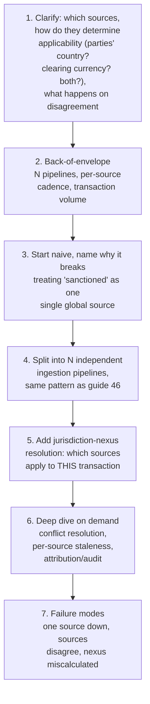

**What the interviewer is actually grading at each step:**
- Step 3: do you recognize, unprompted, that "sanctioned or not" is not a single boolean answered
  by one source, but potentially several sources whose applicability itself depends on transaction
  attributes (parties, currency, routing)?
- Step 5: do you know that currency/clearing jurisdiction (the OFAC long-arm example) can make a
  source applicable even when neither transacting party is in that source's home country — this is
  the single most commonly missed nuance in this chapter?
- Step 6: when two applicable sources disagree, do you have an actual policy (strictest wins, with
  attribution) instead of picking one source arbitrarily or averaging somehow?

---

## Requirements clarification

### Functional

| # | Requirement | Notes |
|---|---|---|
| F1 | For a given transaction, determine which sanctions sources are jurisdictionally applicable | Not a given — depends on payer/payee country, currency, and clearing route |
| F2 | Screen the transaction against every applicable source and produce one aggregate decision | Multiple applicable sources must combine into a single actionable answer |
| F3 | When applicable sources disagree, apply a defined precedence/aggregation policy, never an arbitrary or silent tie-break | Same asymmetric-cost reasoning as the other compliance chapters in this genre |
| F4 | Every decision names exactly which source(s) drove it, and each source's own version/freshness at decision time | Attribution is what makes the decision explainable and auditable per-source, not just in aggregate |
| F5 | Operate correctly even if one source is degraded/stale while others are current | Sources fail independently; the system shouldn't treat "one source is down" as "we can't decide" |

### Non-functional

| Requirement | Target | Why this number |
|---|---|---|
| Decision latency | Same as guide 46 — sub-10ms, fully local, no external calls at decision time | The multi-source aspect changes *what* is computed locally, not *when* it's computed |
| Per-source freshness | Independent per source, driven by each source's own publishing cadence — no single number applies to all sources | Forcing one staleness SLA across sources that update at genuinely different rates either over-promises for the slow ones or under-utilizes the fast ones |
| Conflict-resolution correctness | Strict — the aggregation policy must be deterministic and explainable, not a heuristic that could plausibly change its answer for the same inputs | A payment blocked or allowed based on an unreproducible aggregation is a compliance liability in itself |
| Attribution completeness | Every decision must name every applicable source considered and each one's individual verdict, not just the final aggregate | Regulators and internal audits will ask "what did source X say," not just "what was the final answer" |

**Clarifying questions worth asking the interviewer up front — and what each answer changes:**

| Question | If the answer is... | ...then this changes |
|---|---|---|
| "What determines jurisdictional applicability — party country only, or also clearing currency/routing?" | Both, including currency-clearing jurisdiction | Confirms the jurisdiction-nexus resolver needs transaction-level data (currency, routing bank) beyond just party addresses — a materially bigger input surface than guide 46's IP-only lookup |
| "When sources disagree, is there a legal precedence (e.g. this entity always defers to the stricter regulator for compliance reasons), or is it undefined?" | Strictest-applicable-wins is the house policy | Confirms the default aggregation rule; if instead there's a defined legal precedence order (e.g. "OFAC always overrides for USD transactions"), that specific rule replaces the generic strictest-wins default |
| "Do all sources publish at comparable cadences, or are some much slower?" | Wildly different — some daily, some sporadic/event-driven | Confirms per-source staleness bounds must be tracked and surfaced independently, not averaged into one number |
| "Should a source being down block all transactions that would need its input, or proceed on the remaining applicable sources?" | Proceed on remaining sources, flag the gap | Confirms independent-source degradation doesn't become a total outage — same principle as guide 46's fail-open, applied per-source instead of globally |

**Say this out loud in the interview:** *"The ingestion/serving split from the single-source
chapter still applies per source — what's new here is that 'which sources even apply' is itself a
computation, and 'what do we do when applicable sources disagree' needs an explicit, auditable
policy rather than an implicit tie-break."*

---

## Capacity estimation, worked

```
Given (illustrative, a global payment gateway):
  Number of independent sanctions sources tracked   = 4 (e.g. OFAC, EU, UN, one major local
                                                         regulator)
  Combined unique sanctioned entities/ranges          = ~60,000 (with overlap across sources --
                                                          the same entity often appears on
                                                          multiple lists, just not always all of
                                                          them, and not always with identical
                                                          details)

Per-source ingestion, same shape as guide 46, run independently:
  Source A (OFAC-like): ~15,000 entries, daily batch, minor rate limit
  Source B (EU-like): ~12,000 entries, daily batch
  Source C (UN-like): ~10,000 entries, irregular/event-driven (published when the Security
                        Council acts, not on a fixed schedule)
  Source D (local regulator): ~25,000 entries, weekly batch
  -> four independent pipelines, four independent cadences, four independent staleness clocks --
     this is mechanically four copies of guide 46's ingestion pattern, not a new mechanism, but
     it does mean four times the operational surface area to monitor (four "is this feed
     healthy" dashboards, not one).

Snapshot size, combined:
  ~60,000 combined entries x ~50 bytes/entry (including source attribution field) ~= 3 MB
  -> trivially small, same conclusion as guide 46: this is never a storage or memory problem.

Jurisdiction-nexus computation cost per transaction:
  Determine applicable sources from payer country, payee country, clearing currency
    -> a small, fixed lookup (country/currency -> applicable source set), NOT proportional to
       list size -- this step is cheap regardless of how many entries any given source has.
  Screen against each applicable source's index (typically 1-3 of the 4 sources apply to
    any single transaction, rarely all 4 at once)
    -> total per-transaction cost is bounded by (max applicable sources) x (per-source lookup
       cost), still comfortably sub-millisecond at these list sizes.
```

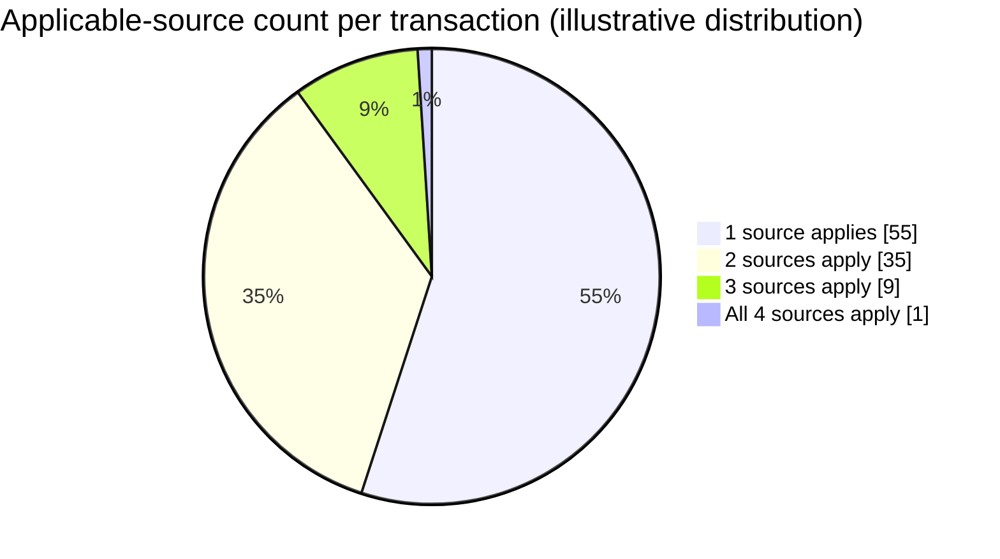

Most transactions trigger only one or two applicable sources — this is *why* nexus resolution
keeps per-transaction cost flat even as total tracked sources grows, and it's the concrete number
behind the "rarely all 4 at once" claim in the capacity estimate above.

**Redo-the-chain test:** if a fifth source is added (say, a newly-tracked regional regulator), the
ingestion side gains one more independent pipeline (linear cost), and the nexus resolver's lookup
table gains new entries mapping additional countries/currencies to that source — but per-
transaction decision cost barely moves, since most transactions still only trigger 1-3 applicable
sources, not all 5.

**The number worth memorizing:** adding sources scales the *ingestion and operational monitoring*
surface linearly, but barely touches per-transaction decision latency, because jurisdiction-nexus
resolution keeps the applicable-source set small and bounded regardless of how many total sources
the system tracks.

---

## API design

### `POST /v1/screen-transaction` (called synchronously in the payment path)

```json
{
  "transactionId": "t_88213",
  "payerCountry": "US",
  "payeeCountry": "TR",
  "clearingCurrency": "USD",
  "routingPath": ["us-correspondent-bank-1"]
}
```

Response:
```json
{
  "transactionId": "t_88213",
  "decision": "BLOCK",
  "applicableSources": ["OFAC", "LOCAL_TR_REGULATOR"],
  "sourceVerdicts": [
    { "source": "OFAC", "verdict": "BLOCK", "matchedEntry": "sdn_991", "version": "OFAC_v512" },
    { "source": "LOCAL_TR_REGULATOR", "verdict": "ALLOW", "version": "TR_REG_v88" }
  ],
  "aggregationRule": "STRICTEST_APPLICABLE_WINS",
  "finalDecisionSource": "OFAC"
}
```

| Field | Notes |
|---|---|
| `applicableSources` | The output of jurisdiction-nexus resolution — explicitly listed, so it's clear *why* OFAC applies even though neither the payer's nor payee's country is the US (the `clearingCurrency: USD` + `routingPath` fields are what triggered it) |
| `sourceVerdicts` | Every applicable source's individual verdict, never collapsed away — this is the attribution requirement made concrete |
| `finalDecisionSource` | Which specific source's verdict the aggregation policy actually selected — critical for audit and for explaining "why was this blocked" precisely |

**The one sentence worth saying about the API surface:** *"The response never hides the individual
source verdicts behind the aggregate decision — every applicable source's answer, and which one
the aggregation policy ultimately deferred to, is first-class in the response."*

---

## High-level architecture

### Architecture evolution (v1 → v2 → v3)

**v1 — one merged list, sources blended at ingestion:**

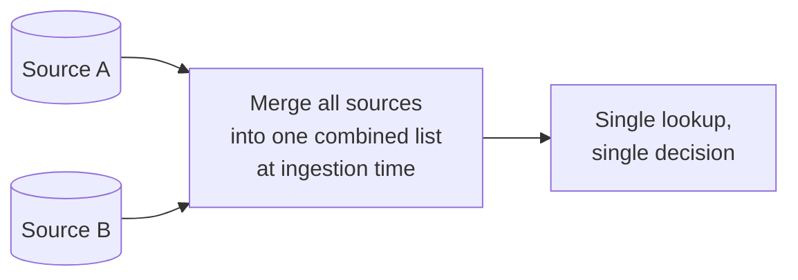

**Why it breaks:** merging sources at ingestion time destroys attribution — once "sanctioned by
OFAC" and "sanctioned by the local regulator" are blended into one combined `BLOCK` flag, there's
no way to answer "which source actually said block" after the fact, which the requirements
established as mandatory. It also has no way to represent jurisdiction-nexus at all — a merged
list has no concept of "this source only applies to USD-clearing transactions," so it either
over-applies every source to every transaction (wrong) or has no principled way to narrow at all.

**v2 — sources kept separate, but jurisdiction-nexus ignored (all sources always checked):**

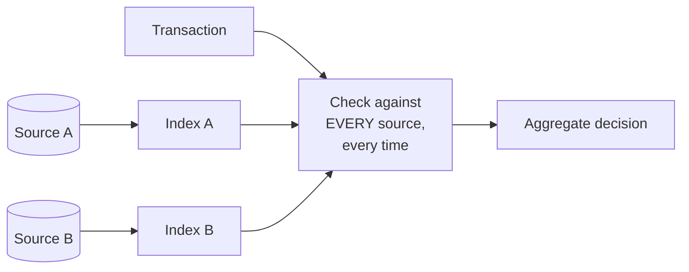

**Why it breaks:** checking every source against every transaction regardless of actual
applicability is both wasteful (most transactions don't have a nexus to most sources) and, more
importantly, **wrong in the other direction from v1** — a source with no real jurisdictional claim
over a transaction shouldn't be allowed to drive a block decision just because it happened to
contain a coincidental name/entity match; a European domestic transaction shouldn't be blocked by
a UN designation whose enforcement obligation legally falls on member states' own transactions, not
a purely domestic transfer with no nexus to it at all. Applicability isn't just an optimization,
it's a correctness requirement.

**v3 — the real system: jurisdiction-nexus resolution, then strictest-applicable-wins:**

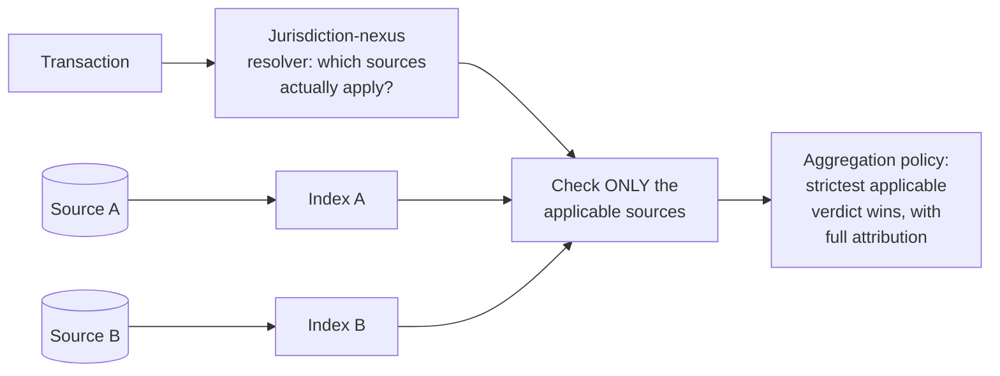

**What v3 fixes, one line each:** each source keeps its own independent index and identity (fixing
v1's lost-attribution problem); nexus resolution narrows to only the sources with a real
jurisdictional claim on this specific transaction (fixing v2's over-application problem); and the
aggregation policy produces one actionable decision while preserving every applicable source's
individual verdict for audit.

---

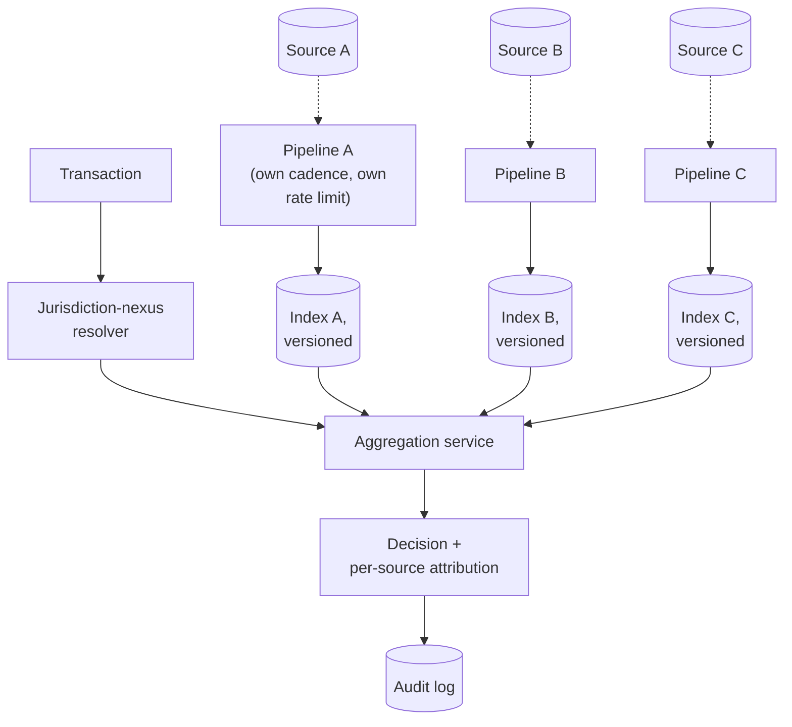

| Component | Role |
|---|---|
| Per-source pipelines | Mechanically identical to guide 46's single pipeline, run N times independently — each source's own cadence, rate limit, validation, and versioned snapshot |
| Per-source indexes | Kept separate, never merged — attribution depends on this |
| Jurisdiction-nexus resolver | The genuinely new component: maps transaction attributes (party countries, clearing currency, routing) to the subset of sources with an actual jurisdictional claim |
| Aggregation service | Applies the precedence/conflict-resolution policy across only the applicable sources' verdicts, producing one decision plus full attribution |

---

## End-to-end request walkthroughs

### Walkthrough 1 — a USD-cleared transaction between two non-US parties (the long-arm case)

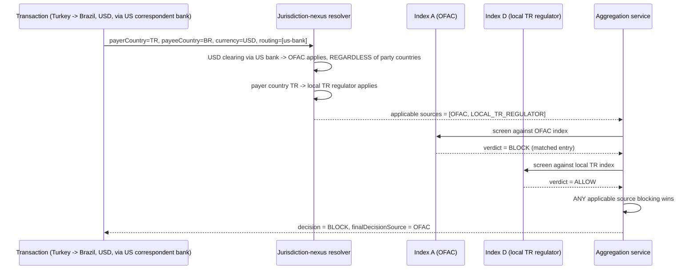

Notice Brazil's own regulator is never even consulted — it has no jurisdictional nexus to this
specific transaction, which is exactly what the
[jurisdiction-nexus deep dive](#deep-dive-jurisdiction-nexus-resolution) means by "applicability is
a correctness step, not just an optimization."

### Walkthrough 2 — one source degraded, screening proceeds on the rest

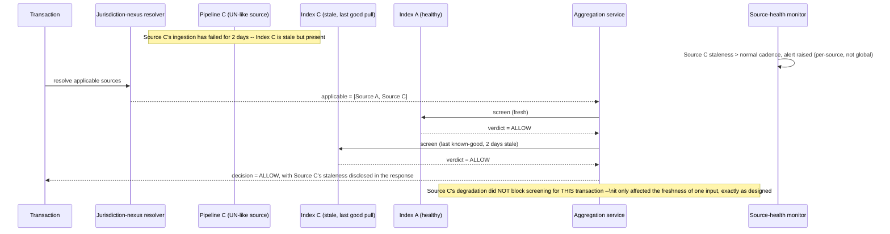

**Interview cheat-sheet:** *"One source's ingestion trouble degrades that source's contribution
only — it never gates a decision that doesn't need it, and for one that does, it contributes its
last known-good verdict with disclosed staleness, never a hard failure of the whole screening
call."*

---

## Deep dive: jurisdiction-nexus resolution

This is the step most candidates skip entirely, defaulting to "check the parties' countries" —
missing that currency-clearing jurisdiction can make a source apply regardless of where the
parties are.

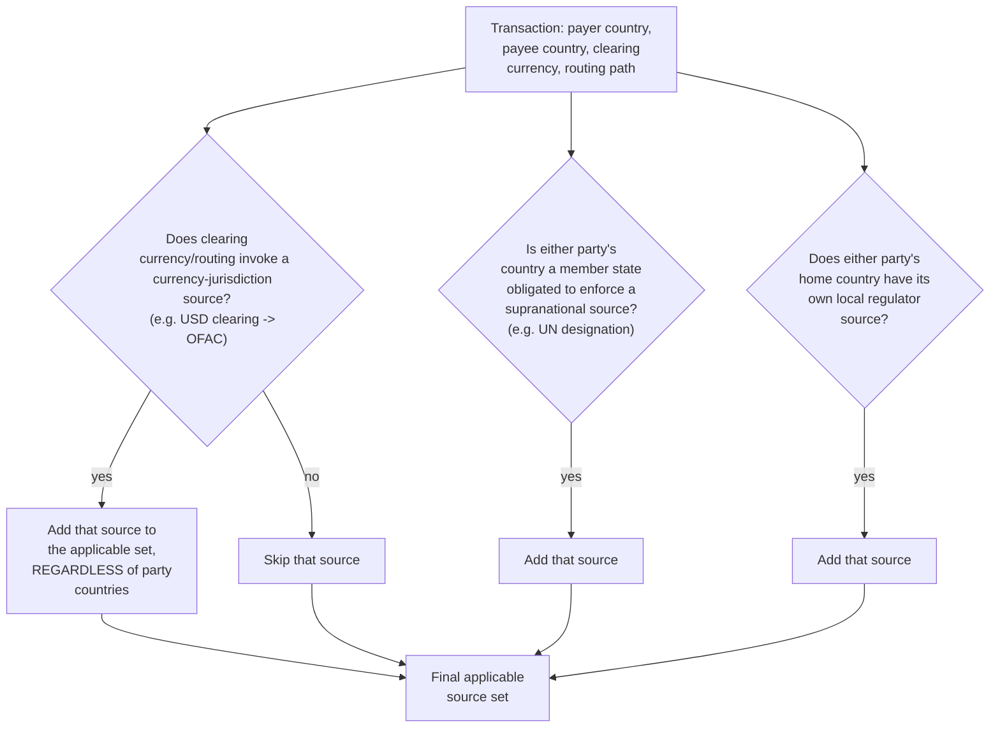

**Why this determination needs to be encoded as explicit, reviewable rules, not inferred
heuristically:** which sources apply to which transaction attributes is a legal determination with
real regulatory consequences — the mapping (e.g. "USD clearing → OFAC applies") should be
maintained as an explicit, versioned rule set reviewed by legal/compliance, not derived
automatically from any kind of pattern-matching or inferred correlation.

**The concrete example worth stating out loud:** *"A payment between a company in Turkey and a
company in Brazil, denominated and cleared in US dollars through a US correspondent bank, is
subject to OFAC screening — even though neither party is American — because of how USD clearing
routes through the US financial system. Missing this is the single most common real-world
compliance gap in this space, and a system design that only checks the parties' home countries
would silently miss it."*

**Interview cheat-sheet:** *"Jurisdiction-nexus resolution is a rules-based mapping from
transaction attributes — not just party countries, but clearing currency and routing — to the set
of sources with an actual legal claim on this transaction. Encode it explicitly and keep it
reviewable by legal/compliance, never infer it."*

---

## Deep dive: multi-source conflict resolution

Once the applicable source set is known, their verdicts can disagree — generalizing the
[legal-takedown guide's conflicting-orders logic](./48-Legal-Takedown-Propagation-System-FAANG-Guide.md#deep-dive-conflicting-and-overlapping-orders)
from individual court orders to entire, independently-maintained lists.

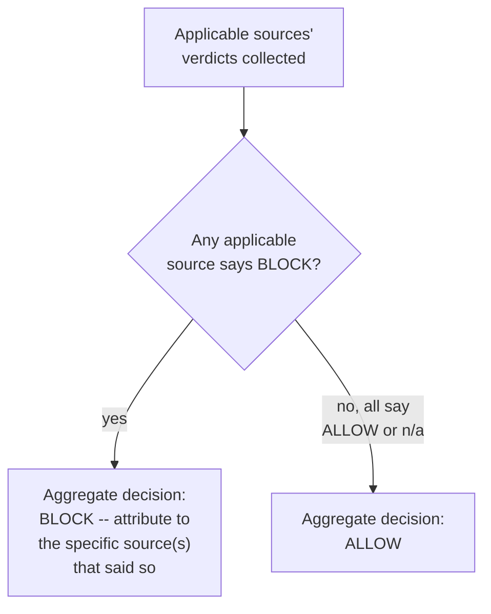

**Why "any applicable source blocking wins" is the correct default, same asymmetric-cost logic as
every other compliance chapter in this genre:** allowing a transaction that even one legally
applicable regulator would block is a direct compliance violation with that regulator, regardless
of what any other regulator's list says — there's no principled way to "average" or "outvote"
across independent sovereign/regulatory determinations. The cost of over-blocking (a delayed or
rejected legitimate transaction, resolvable via the same review-queue pattern as the sanctions
chapter) is much smaller than the cost of a confirmed violation against any one applicable
regulator.

**Where this differs from the legal-takedown chapter's supersession logic:** takedown orders can
explicitly supersede each other (a later court ruling reverses an earlier one, established via a
human-reviewed link) — independent sanctions sources generally do **not** supersede each other;
they're parallel, co-existing legal obligations, not a sequence of rulings on the same case. Don't
apply the takedown chapter's "explicit supersession" pattern here by default; the default
relationship between independent sources is "all apply simultaneously," not "one might override
another."

**Interview cheat-sheet:** *"Default to blocking if ANY applicable source says block — independent
regulators' obligations don't average or vote against each other, they all apply simultaneously,
and the asymmetric cost of a confirmed violation against even one dominates the cost of an
occasional unnecessary block."*

---

## Deep dive: per-source staleness bounds

Guide 46 established one staleness SLA for one source. Here, each source has its own — collapsing
them into a single number either overstates confidence in the slowest source or understates real
staleness risk from treating all sources as if they were the fastest one.

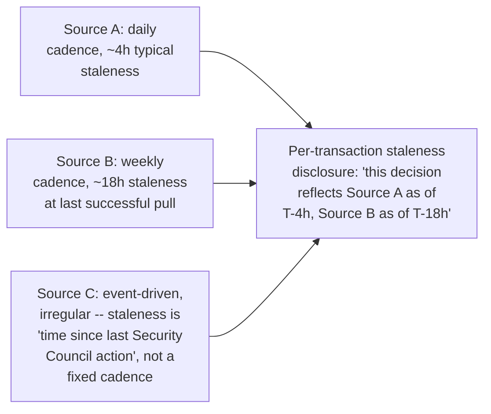

**Why a single blended "the data is at most X stale" claim is actively misleading here:** if
Source C (event-driven, irregular) hasn't published in three weeks because there's simply been no
new designation, that's not the same kind of staleness as Source B's fixed weekly cadence running
one day late due to an ingestion hiccup — conflating them into one number either alarms
unnecessarily or masks a real problem. Track and, where relevant, surface staleness **per source**,
not as one aggregate figure.

**Interview cheat-sheet:** *"Don't blend per-source staleness into one number — each source has its
own cadence and its own meaning of 'stale,' and a decision's attribution should be able to show
which sources it's based on and how current each one actually was."*

---

## Data model

**Per-transaction screening decision lifecycle** — both walkthroughs above trace through this:

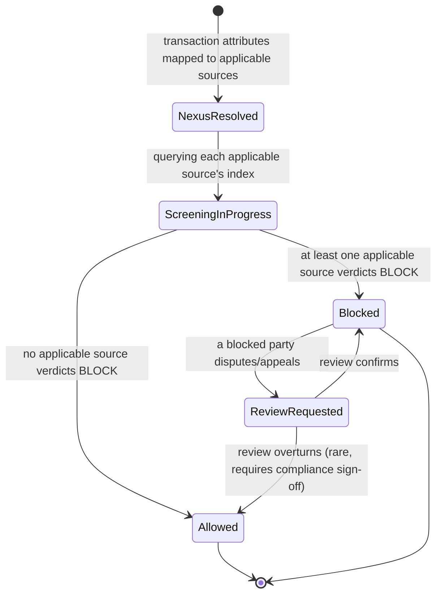

Every transition out of `ScreeningInProgress` is a pure function of the applicable sources'
verdicts collected — no hidden state, which is what makes the aggregation policy reproducible on
audit, per the [conflict-resolution deep dive](#deep-dive-multi-source-conflict-resolution).

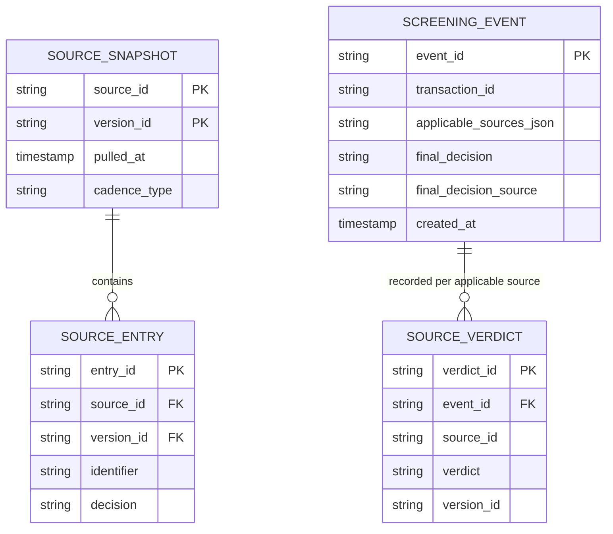

| Table | Storage choice & why |
|---|---|
| `SourceSnapshot` / `SourceEntry` | One versioned store per source, same pattern as guide 46, kept namespace-separate by `source_id` — never merged |
| `ScreeningEvent` / `SourceVerdict` | The attribution model — every screening event links to one row per applicable source's individual verdict, so "what did source X say" is always answerable directly, not reconstructed after the fact |

---

## Failure modes & mitigations

| Failure mode | Impact | Mitigation |
|---|---|---|
| **One source's ingestion pipeline degrades while others are healthy** | That source's contribution to any transaction it's applicable to uses a staler snapshot | Independent per-source health/staleness monitoring (four dashboards, not one blended one); other sources' pipelines and freshness are entirely unaffected — no shared fate |
| **Jurisdiction-nexus rules miss a currency/routing edge case** (e.g. a less common clearing currency with its own jurisdictional implications) | A source that should apply is silently skipped — an under-enforcement gap | Nexus rules reviewed and versioned by legal/compliance on a defined cadence, with periodic audit sampling of screened transactions against manual jurisdictional review |
| **Two sources' entries for the same real-world entity have inconsistent identifying details** (e.g. slightly different spelling/DOB) | The matching layer (borrowing the fuzzy-matching approach from the [sanctions-screening chapter](./47-Sanctions-Watchlist-Screening-System-FAANG-Guide.md)) might treat them as unrelated | Apply the same fuzzy-matching deep dive from guide 47 per source, rather than assuming exact-identifier consistency across independently-maintained sources |
| **A source is fully unreachable for ingestion for an extended period** | That source's contribution to decisions is frozen at its last known-good snapshot | Same as guide 46's fail-open answer, applied per source — screening proceeds using the remaining fresh sources plus the stale one's last-known state, with the staleness disclosed per source, not treated as a reason to block everything |

---

## Non-functional walkthrough

**Scaling and warm-up follow guide 46's answers exactly, multiplied by N sources** — each source's
index is small, fully replicable, and independently warm-started; there's no new scaling
mechanism introduced by adding sources, just more of the same mechanism run in parallel.

**Availability is source-independent by design** — one source's ingestion trouble should never
gate decisions that don't require it, and shouldn't even meaningfully degrade decisions that do
require it beyond that specific source's own staleness impact, per the fail-open-per-source
principle above.

**Consistency has both guide 46's per-source staleness dimension and a new one: aggregation-
policy determinism.** Given the same applicable-source set and the same per-source verdicts, the
aggregate decision must be reproducible — this is a correctness property of the aggregation logic
itself, not a staleness/freshness question, and worth calling out as a distinct consistency
concern if asked to enumerate them.

---

## Security & compliance

- **Full per-source attribution retained in the audit log** is the core compliance deliverable of
  this entire chapter — regulators reviewing a decision will want to know precisely what each
  applicable source said, not just the final aggregate answer.
- **Jurisdiction-nexus rules are themselves a compliance artifact** — version them, review them
  with legal/compliance on a defined cadence, and audit sampled decisions against them
  periodically to catch drift between the coded rules and current legal reality (sanctions regimes
  and their jurisdictional reach do change over time).
- **Independent source isolation** — a bug or outage in one source's pipeline must never be able
  to corrupt or block another source's independent operation; enforce this as a genuine
  architectural boundary (separate services/namespaces per source), not just a logical
  convention that a future change could accidentally violate.

---

## Cost & trade-offs

**Operational cost scales roughly linearly with source count** — each additional source is another
independent pipeline to build, monitor, and keep healthy, following the exact same low-cost
pattern as guide 46's single source (small dataset, cheap full replication, the source's own
cadence being the real constraint) — there's no economy or diseconomy of scale particular to
adding sources beyond the straightforward linear operational surface.

**The real cost/complexity growth is in jurisdiction-nexus rule maintenance and conflict-resolution
correctness**, not infrastructure — legal/compliance review time for nexus rules and periodic
audit sampling are the costs worth naming if asked to compare this chapter's cost profile to guide
46's.

---

## Wrap-up: MVP vs. stretch

**In scope for an MVP:**
- Two independent source pipelines (enough to force the nexus/conflict machinery to actually
  exist, without needing all four/five real-world sources on day one).
- A rules-based jurisdiction-nexus resolver covering the most common cases (party country +
  major currency-clearing jurisdictions).
- Strictest-applicable-wins aggregation with full per-source attribution and audit logging.

**Explicitly out of scope for an MVP:**
- Comprehensive coverage of every real-world currency-clearing jurisdictional nuance — start with
  the highest-volume, highest-risk cases (e.g. USD/OFAC) and expand the nexus rule set
  incrementally under legal review.
- Automated detection of newly-relevant jurisdictional nexus rules (e.g. auto-detecting that a new
  currency's clearing infrastructure has created a new jurisdictional link) — this stays a
  human/legal-review-driven process for the foreseeable future, not an ML problem to solve.

**Stretch goals, worth naming if asked "what's next":**
1. **Automated cross-source entity reconciliation** — using the fuzzy-matching approach from the
   sanctions-screening chapter to detect when multiple sources likely refer to the same real-world
   entity with inconsistent details, surfacing it for compliance review rather than treating them
   as unrelated.
2. **Jurisdiction-nexus rule simulation/testing tooling** — letting compliance test "would this
   hypothetical transaction trigger source X" before a rule change ships, the same instinct as
   testing any other business-rule engine before deploying rule changes.
3. **Expanding to N > 5 sources** as the platform enters more regulatory regimes — mechanically
   straightforward given the architecture, but worth naming as a scaling direction.

---

## Golden rules

- **Keep sources separate through ingestion, indexing, and attribution** — merging them at
  ingestion destroys the ability to answer "what did source X say," which is a hard requirement in
  this domain.
- **Jurisdiction-nexus resolution is a correctness step, not an optimization** — checking a source
  with no real jurisdictional claim on a transaction is a distinct wrong answer from missing a
  source that does apply, not just wasted work.
- **Currency-clearing jurisdiction can apply regardless of where the transacting parties are** —
  the single most commonly missed real-world nuance in this space.
- **Any applicable source saying block wins** — independent regulatory obligations run in
  parallel, not by vote or average, and the asymmetric cost of a confirmed violation dominates.
- **Track staleness per source, never blended into one number** — different cadences mean
  different, non-comparable meanings of "stale."
- **Every decision must show its full per-source attribution** — the aggregate answer alone is
  insufficient for this domain's audit requirements.

---

## Master cheat sheet

**One-liners:**
- This chapter multiplies guide 46's ingestion/serving split across N independent sources, and
  adds two genuinely new problems: which sources apply to a given transaction, and what to do when
  applicable sources disagree.
- Jurisdiction-nexus resolution must account for currency-clearing/routing jurisdiction, not just
  the transacting parties' home countries — missing this is the most common real-world gap.
- Strictest-applicable-source-wins is the correct default aggregation policy — independent
  regulatory obligations don't average or vote against each other.
- Never merge sources at ingestion — per-source attribution in every decision is a hard
  requirement, not a nice-to-have.
- Staleness is tracked per source, not blended — different cadences (daily, weekly, event-driven)
  carry genuinely different meanings of "how stale is this."
- One source's degradation is isolated to that source's contribution — it never gates decisions
  that don't require it, and only proportionally affects ones that do.

**Formula chain:**
```
applicable_sources(txn)  = nexus_rules(payer_country, payee_country, clearing_currency, routing)
aggregate_decision       = BLOCK if any(verdict == BLOCK for verdict in applicable_sources' verdicts) else ALLOW
per_source_staleness     = now - source.last_successful_pull_at   [tracked independently, never averaged]
```

**Numbers:** combined dataset across several sources still typically in the low single-digit MB
range — never the bottleneck · operational monitoring surface scales linearly with source count
(N independent freshness dashboards) · per-transaction decision cost stays roughly constant
regardless of total source count, because nexus resolution keeps the applicable-source set small.
