# Design Uber's Surge Pricing Engine — The Story (narrative edition)

> **What this file is.** The reference file, `53-Design-Uber-Surge-Pricing-Engine-FAANG-Guide.md`, is the one to recite from — requirements, API shapes, every trade-off table, the master cheat sheet. This file is a second way in: the same material as one continuous story, told in plain language. Engineers at a company keep hitting a wall, patch it, and the patch itself creates the next wall — until we land on the exact same design the reference file documents. The company, **MetroHail** (a ride-hailing startup in a fictional mid-size city, Port Haven), is fictional. But every wall it hits, and every fix it reaches for, is something a real, named system actually did: Uber's own H3 hexagonal geo-index (open-sourced, documented on Uber's engineering blog), Uber's real December 2014 Sydney surge-pricing controversy during the Lindt Cafe siege, and Uber's later, documented move toward upfront/smoothed pricing. I'll say clearly, every time, whether something is a documented fact or just a reasonable guess.

**The trigger phrases** for this topic: *"design surge pricing,"* *"how would you price rides dynamically,"* or a follow-up buried inside a bigger Uber question — *"what stops the price from jumping around every few seconds"* or *"what happens once surge pricing actually works and pulls drivers in."* Keep one sentence in your head as you read: **surge pricing is not a lookup table, it's a real-time control loop — measure local demand and supply, smooth what you measured, price it, and watch the price change the very thing you're measuring.** Everything below is just this one idea getting harder, in small, honest steps.

---

## Chapter 1 — The flat fare that strands half the city

It's MetroHail's first year in Port Haven. Every ride is priced the same way regardless of where or when you request it: a distance-based fare, no multiplier, no time-of-day adjustment. On a Friday night, downtown gets busy — worked number: in one 15-minute window, **200 ride requests** come in from the downtown core, but only **40 drivers** are currently in that area. That's a 5-to-1 ratio of riders to drivers. Meanwhile, three miles away near the airport, **90 drivers** are sitting idle waiting for a fare, against only **10 requests** in that same window — roughly 9 idle drivers for every rider. Downtown riders wait an average of **25 minutes** for a pickup, against MetroHail's own promised sub-7-minute experience `[illustrative — MetroHail is fictional, but this exact lopsided pattern, dense demand in one pocket while supply sits idle two miles away, is the standard real-world case every ride-hailing company built dynamic pricing to solve]`.

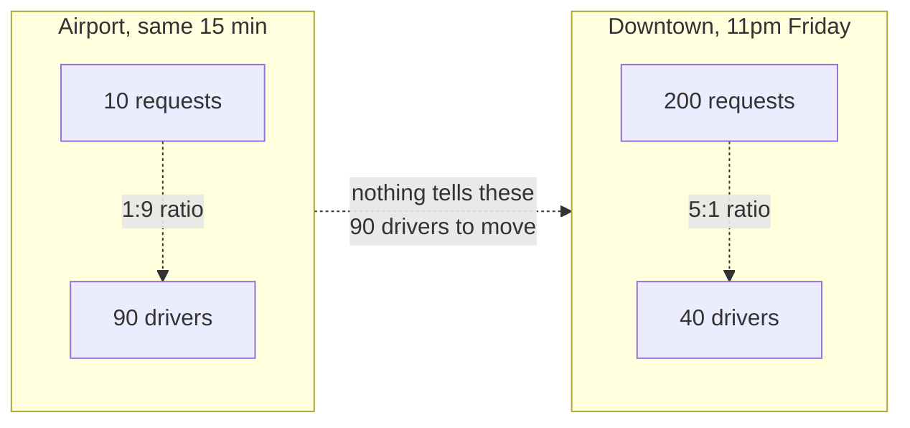

The obvious question: *why don't those 90 idle airport drivers just drive downtown?* Because nothing tells them to. The fare is flat — a driver earns exactly the same $12 average fare whether they sit in an already-oversupplied zone or move to where riders are actually waiting. Fixed pricing carries no signal at all about where the imbalance is.

**The fix, and the first idea for the rest of this story:** let the price itself carry that signal — a **multiplier** that rises when local demand outstrips local supply, both to ration the scarce rides toward riders who'll still pay for one, and to make moving toward that imbalance worth a driver's time. Call this **the price lever** — the one thing MetroHail can move that both riders and drivers actually react to in real time.

**New problem, immediately:** "let the price react to demand and supply" doesn't specify *how big an area* "local" means, or *how* you'd actually compute demand and supply as numbers. MetroHail's engineers reach for the simplest possible answer first — and that's where the next wall is.

**How I'd say this in an interview:** "Before you can even talk about smoothing or feedback loops, you need the actual motivating problem: a flat price gives drivers zero incentive to move toward where riders actually are. The fix is a multiplier that responds to local imbalance — but 'local' is doing a lot of work in that sentence, and that's the first real design decision."

---

## Chapter 2 — One gauge for the whole city

MetroHail's first real attempt: compute **one number for the entire city**. Every five minutes, sum up all ride requests citywide, sum up all available drivers citywide, divide, and apply that single ratio as a multiplier everywhere. Worked number: citywide, Port Haven has roughly 1,650 requests and 1,500 available drivers in a given window — a ratio of about **1.1**. MetroHail applies a modest **1.1x multiplier**, citywide, uniformly.

Downtown riders are still waiting 25 minutes. The citywide average is a **single water-pressure gauge sitting at the reservoir** — it tells you the whole system's average pressure, but it has no idea that one specific neighborhood's pipe is nearly dry while another's is overflowing. Downtown's actual local ratio that same window is still **5-to-1** — a number the 1.1x citywide average completely buries. A stadium two blocks from downtown lets out a concert at the same time, and the citywide average doesn't move enough to register it at all.

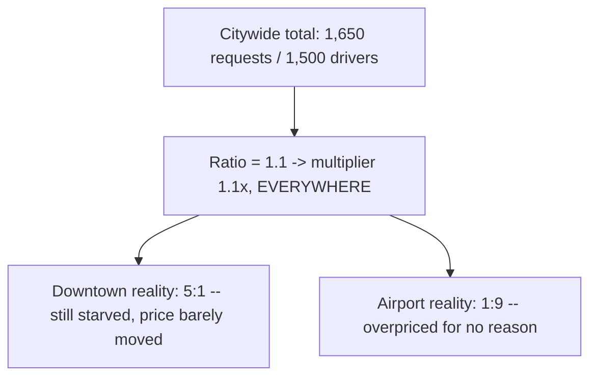

The obvious question: *why not just compute the ratio for smaller areas instead of the whole city?* Right instinct — but "smaller areas" needs a precise definition too, or the next fix just moves the same averaging problem down one level instead of solving it.

**How I'd say this in an interview:** "A citywide average is the reservoir gauge — it's accurate about the system as a whole and useless about any one neighborhood, which is exactly the local imbalance surge pricing exists to fix. The fix has to be granularity, not a smarter citywide formula — but 'how granular' turns out to be its own hard question."

---

## Chapter 3 — Measuring cups of different sizes

MetroHail's second attempt: compute the ratio **per neighborhood** — Downtown, Old Town, Riverside, Airport District — using the city's actual administrative boundaries. This sounds like the fix from Chapter 2. It isn't, quite.

The problem shows up fast: Old Town is a tiny, dense historic district — about **0.3 km²**. Downtown is a sprawling business core — about **4 km²**. Ten simultaneous ride requests in Old Town means a genuinely packed, hard-to-serve area. Ten simultaneous requests spread across all of Downtown's 4 km² is nothing — barely noticeable congestion. But both zones report "10 requests" to the ratio calculation, and the ratio has no way to know one of those tens is a real crunch and the other is background noise. **Comparing a ratio computed in a 0.3 km² cup to a ratio computed in a 4 km² cup and treating them the same is like comparing how full two glasses are without checking whether one glass is a shot glass and the other's a bucket.**

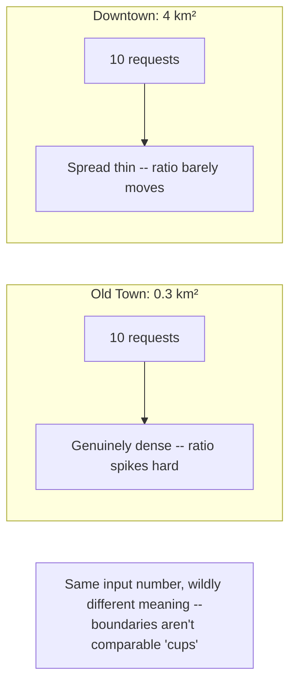

The obvious question: *so use equal-size areas instead of neighborhood names?* Yes — exactly. MetroHail switches to a **uniform hex grid**: a real, documented technique — Uber's own **H3 hexagonal hierarchical spatial index**, open-sourced and described on Uber's engineering blog, does precisely this: it tiles the entire map into hexagons of consistent area, so a ratio computed in one cell means the same thing as a ratio computed in any other cell. MetroHail picks a grid resolution where each hex is roughly **0.7 km²** — small enough that a stadium letting out registers as a spike in a handful of specific hexes, not diluted across a whole irregular neighborhood.

**Name the fix — same-size measuring cups:** every geo-cell is the same shape and area, so "10 requests in this cup" always means the same thing regardless of which cup you're looking at. This is the analogy to carry forward: from here on, whenever the story says "cell," it means one of these identical cups on the map.

**New problem, immediately:** equal-size cups fixes *comparability*. It does nothing about *when* you measure. MetroHail is still computing each cell's ratio the instant a new data point arrives — and most cells, most of the time, see almost no traffic at all.

**How I'd say this in an interview:** "Administrative neighborhoods vary wildly in size, so the same raw request count means something completely different depending on which one it landed in — comparing ratios across them is comparing differently-sized measuring cups. A uniform hex grid, exactly what Uber's H3 index does, fixes that by making every cell the same size, so ratios are actually comparable across the whole map."

---

## Chapter 4 — The snapshot that's mostly noise

With equal-size hex cells in place, MetroHail computes each cell's ratio the moment a new request or driver ping arrives — an **instant** ratio. Worked number, and the actual scale MetroHail eventually grows into `[illustrative]`: Port Haven metro has roughly **5,000 hex cells**, sees **2,000,000 ride requests a day**, which peaks at around **150 requests/sec citywide** at rush hour. Spread across 5,000 cells, that's about **1.8 requests per minute, per cell**, even at peak — well under one request per second in the *average* cell.

An instant ratio computed off that little data is almost entirely noise. Concretely: a specific cell sits at 0 requests / 2 drivers (ratio 0, multiplier 1.0x) for ninety seconds, then two requests land within the same five-second window while one driver happens to drive out of the cell — ratio instantly jumps to 2.0, multiplier flickers up to 1.8x, and ten seconds later it's back down to 1.0x as those same two requests get matched and driven away. A rider glancing at the app twice in that thirty-second span sees two completely different prices for the exact same trip, for no reason a human would call "demand changing."

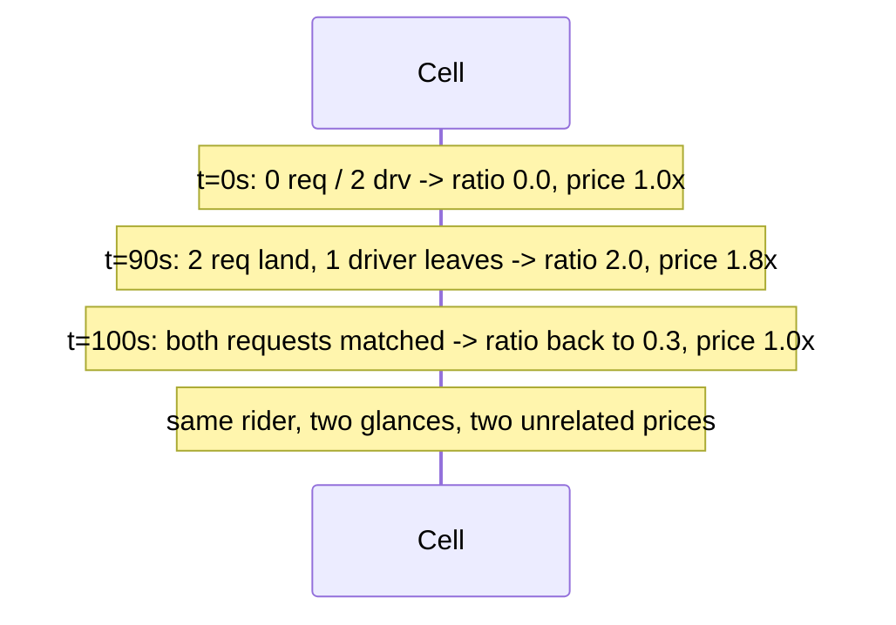

The obvious question: *why measure instantly at all, if most cells barely have enough traffic to measure anything meaningful in a single instant?* Because nobody had told the system it needs *more data*, not *faster* data. The fix: aggregate over a **rolling window** — a few minutes, not an instant.

**Name the fix — the long-exposure photo:** an instant snapshot in low light is mostly grain — random noise that happens to land wherever the shutter caught it. A **long exposure** — leaving the shutter open for a few minutes — averages that same noise into a picture that actually shows the scene. A 3-minute rolling window does the same thing to a cell's ratio: instead of "what happened in this exact instant," it answers "what's the real, sustained level of demand versus supply here," and one lucky or unlucky five-second cluster stops swinging the whole number.

**New problem, right behind this one:** a rolling window smooths out *sparse-data* noise. It does nothing about the fact that a *continuous* ratio still produces a continuously-changing multiplier — 1.94 this cycle, 2.03 the next, 1.88 the one after — which still looks like flicker to a rider watching the number tick, even though the underlying trend genuinely is stable.

**How I'd say this in an interview:** "Most cells see well under one request per second even at rush-hour peak, so an instant ratio is measuring noise, not demand — you need a rolling window, a few minutes, to get enough data for the number to mean anything. That's the long-exposure-photo fix for sparse data, but it's a different problem from continuous-value flicker, which needs its own fix."

---

## Chapter 5 — The thermostat that doesn't chase every degree

Even with a smoothed 3-minute rolling-window ratio, the *published* multiplier is still recomputed straight from that ratio every cycle — and the ratio, while less noisy than an instant snapshot, still drifts continuously: 1.92, then 2.04, then 1.97, cycle over cycle, as individual requests and driver pings roll in and out of the window. Riders comparing quotes 30 seconds apart still see different numbers, and drivers watching the surge map see a price that never quite holds still long enough to act on.

The obvious question: *what actually stops a home's AC from switching on and off every time the temperature ticks by a tenth of a degree?* A thermostat doesn't chase every reading — it has a **dead-band** (it won't react until the temperature crosses a real threshold) and a **minimum cycle time** (once it turns the compressor on, it won't flip it off again for at least a few minutes, even if the temperature dips back down briefly). MetroHail borrows both ideas directly.

**Name the fix — the thermostat:** first, snap the continuous ratio to a small set of **discrete pricing tiers** — 1.0x, 1.2x, 1.5x, 1.8x, 2.0x, 2.5x, 3.0x — so small fluctuations that don't cross a tier boundary produce *zero* visible change at all, exactly like a dead-band. Second, add a **cooldown**: once the published multiplier changes, it can't change again for a fixed window (tens of seconds to a few minutes `[illustrative — reference guide gives this as an example range, not a documented Uber constant]`), and even then it can only move **one tier at a time**, never jump straight to wherever the raw ratio currently sits — exactly like the compressor's minimum cycle time.

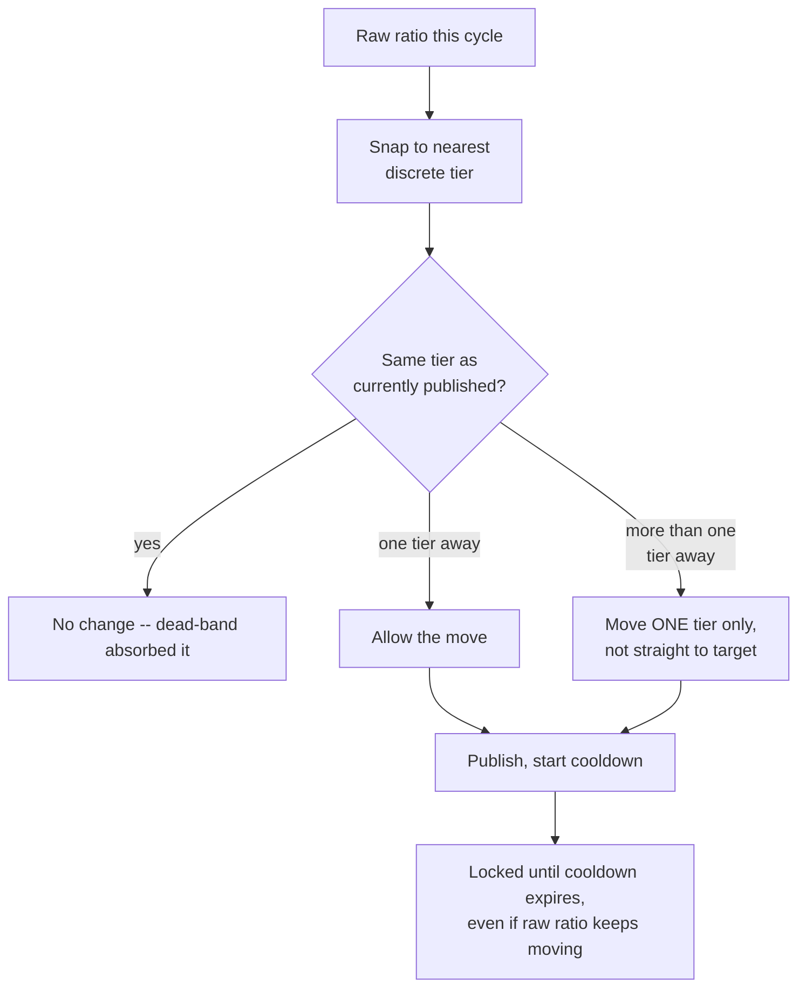

```mermaid
quadrantChart
    title Smoothing knobs: reactivity vs. stability
    x-axis Slower to react --> Faster to react
    y-axis Less stable --> More stable
    quadrant-1 Fast and calm (ideal, rarely free)
    quadrant-2 Fast but flickers
    quadrant-3 Slow and flickers (worst of both)
    quadrant-4 Calm but laggy
    "Tight cooldown, fine tiers": [0.75, 0.35]
    "Loose cooldown, coarse tiers": [0.25, 0.85]
    "MetroHail's chosen default": [0.5, 0.6]
```

**New problem, and it's the one the rest of the design turns on:** the thermostat metaphor was chosen for a reason — a home thermostat doesn't just fight *outside* temperature swings, it also has to avoid fighting *itself*. Running the AC cools the room, which is the whole point — but if it reacts to that self-caused cooling too fast, it short-cycles, turning off the instant it succeeds and back on the moment the room drifts warm again. Surge pricing has the exact same shape: the multiplier is *designed* to pull drivers toward a cell, which changes the very ratio the multiplier is computed from.

**How I'd say this in an interview:** "You need two independent damping mechanisms, not one: discrete tiers absorb small fluctuations before they ever become a visible change, and a cooldown plus one-step-at-a-time rule rate-limits even a big swing. Together they're the thermostat's dead-band and minimum-cycle-time — and that same mechanism is about to matter for a completely different reason."

---

## Chapter 6 — The compressor that cools the room it's measuring

Here's the moment MetroHail's engineers are actually graded on catching without being asked: surge pricing *works*. Cell #4471 — downtown, Friday night — sits at a raw ratio of 2.4, multiplier published at 2.0x. Drivers see that 2.0x on their in-app surge map (a real, intentional feature — showing drivers where multipliers are high so they reposition is the entire point of exposing the number to them at all) and several of them drive toward cell #4471. The next aggregation window sees genuinely more supply in that cell: the raw ratio **drops from 2.4 to 1.3**.

If the multiplier reacted to that new ratio instantly — no cooldown, no one-step rule — it would crash straight from 2.0x to something near 1.0x the moment those drivers arrived. And the instant it crashes, those same drivers, who just spent five minutes repositioning specifically because of the 2.0x, see no more reason to stay. They leave. Demand, which never actually went anywhere, outstrips supply again within minutes. The multiplier climbs right back to 2.0x. Repeat, forever — a cell perpetually surging and crashing, never settling.

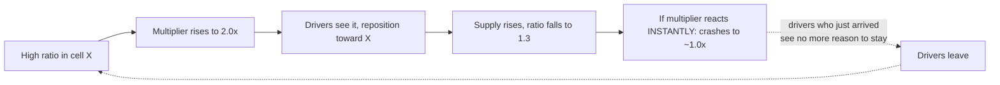

The obvious question: *doesn't this need a whole separate fix, on top of the thermostat mechanism from Chapter 5?* No — and this is the actual point. The **same** one-step-per-cooldown rule that stops noise-driven flicker also stops this. When the ratio drops from 2.4 to 1.3, the smoothing rule doesn't crash the multiplier straight to 1.0x — it steps down **one tier**, say from 2.0x to 1.5x, and holds there for the cooldown window. That gives the drivers who just arrived a real stretch of time at a still-elevated, still-worth-staying-for price, instead of an instant reward-then-yank. By the time the multiplier has fully stepped down to 1.0x, real time has passed, and the driver population has had an honest chance to settle at a genuine equilibrium rather than getting yanked back and forth by its own success.

**Reusing the thermostat analogy exactly:** this is precisely the "self-cooling compressor" problem — the AC's own effect on the room is part of what the thermostat has to account for, or it short-cycles. Surge pricing's own effect on driver supply is part of what the smoothing mechanism has to account for, or it oscillates. It's not a coincidence they're solved by the same knob; it's the same underlying control-systems problem wearing two hats.

**How I'd say this in an interview:** "Surge pricing is a closed loop by design — it's *supposed* to change supply, and changed supply is supposed to change price back. If I only mention the smoothing mechanism as an anti-flicker fix, I'm missing half of why it's there — the same one-step-per-cooldown rule is what makes this intentional feedback loop converge instead of oscillate, and naming both effects out loud is the tell that I actually understand the mechanism, not just that one exists."

---

## Chapter 7 — The cap that shows up after the backlash

MetroHail's smoothing and feedback-loop fixes handle *normal* demand spikes well — a stadium letting out, a rainy rush hour. Then a genuinely extreme event hits: a citywide transit shutdown (a bridge closure, say) sends the raw ratio in several downtown cells to **6.2**, far beyond anything the tier ladder was tuned around. The one-step-at-a-time rule dutifully proposes the next tier up — 3.5x — and, left alone, would keep climbing toward the raw ratio over the following cooldown cycles.

This is not a hypothetical. In **December 2014**, during the Lindt Cafe siege in Sydney — a real hostage crisis — Uber's surge pricing algorithm responded to the sudden spike in ride requests exactly as designed: demand for rides out of the area spiked, and the multiplier climbed with it. Multiple news outlets reported fares reaching roughly **4x normal** during the crisis. The algorithm did precisely what it was built to do — treat a sudden demand spike as a signal to raise price — and it was, correctly, a public-relations and ethical disaster: charging people fleeing a hostage situation more money is not a case where "the market cleared efficiently" is the right takeaway. Uber initially defended the pricing, then reversed course, refunded the affected rides, and apologized. It's one of the most cited real-world cases of a pricing algorithm doing exactly what it was told to do and still being wrong.

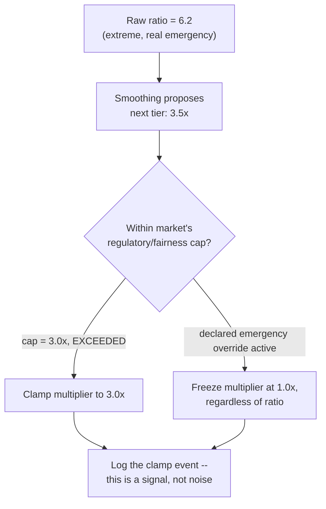

**Name the fix — the guardrail:** a **regulatory/fairness price cap**, configured **per market**, that clamps the multiplier regardless of how extreme the raw ratio is — Port Haven's cap might be 3.0x `[illustrative — the reference guide uses this as an example figure, not a documented universal number; real caps vary by jurisdiction and some markets have none at all]`. On top of the guardrail, an **emergency override**: an operational switch that can freeze or cap surge market-wide during a declared emergency, independent of the normal smoothing logic entirely — because during an actual emergency, "let the market clear" is the wrong instinct, not a tuning problem. Several jurisdictions have gone on to require exactly this kind of anti-gouging safeguard during declared emergencies, as a matter of law, not company preference.

**New problem:** a cap is a ceiling, not a fix for the underlying imbalance. If MetroHail just silently clamps the multiplier and moves on, it throws away a genuinely important signal: demand is outstripping supply by *more* than pricing alone can rebalance. And separately — a cap only bites when the raw *signal itself* is trustworthy. What if the signal is the thing being manipulated?

**How I'd say this in an interview:** "The 2014 Sydney case is the canonical example of why surge pricing can't just be 'let the ratio decide' — a per-market regulatory cap and an emergency override are non-negotiable guardrails, not tuning parameters, and several jurisdictions require exactly this by law. A clamp event should be logged as a signal in its own right, because it means the raw imbalance exceeded what price alone can fix."

---

## Chapter 8 — The loaded dice and the flickering sensor

Two separate integrity problems show up around the same time, and MetroHail's engineers have to tell them apart, because the fix for each is completely different.

**First, a data problem that looks like a demand spike but isn't.** A cluster of driver phones in one cell loses connectivity — a local network outage, not drivers actually leaving. Location pings for that cell stop arriving entirely. If the aggregator treats "no pings" the same as "zero drivers," the ratio spikes artificially and the multiplier rises for a reason that has nothing to do with real supply. Worked number: a cell with a genuine 30 available drivers goes fully dark for four minutes; naively computed, that reads as a ratio jump from 1.2 to effectively infinite, and the multiplier would slam to its cap for no real reason. **The fix:** treat "stale or missing driver data" as a distinct signal from "confirmed zero drivers," and degrade to *no multiplier change* rather than computing a ratio off data you know is broken — the same instinct as ignoring a thermometer you know just fell off the wall, rather than reading "the room is now infinitely cold" off its last stuck value.

**Second, a genuine gaming concern.** If drivers realize that a cluster of them going offline simultaneously in a cell can trigger a higher multiplier — and then they all come back online to cash in on it — the "supply" signal itself becomes something a coordinated group can manipulate, not just observe `[illustrative — this exact coordinated scenario is a reasonable, frequently-discussed concern about any driver-visible surge signal, not a documented, measured incident at a named company; treat it as the shape of the risk, not a verified event]`. This is different from the stale-ping problem — nothing is broken here; the drivers' pings are perfectly accurate, they've just collectively decided to withhold supply on purpose, like loading dice instead of rolling them honestly.

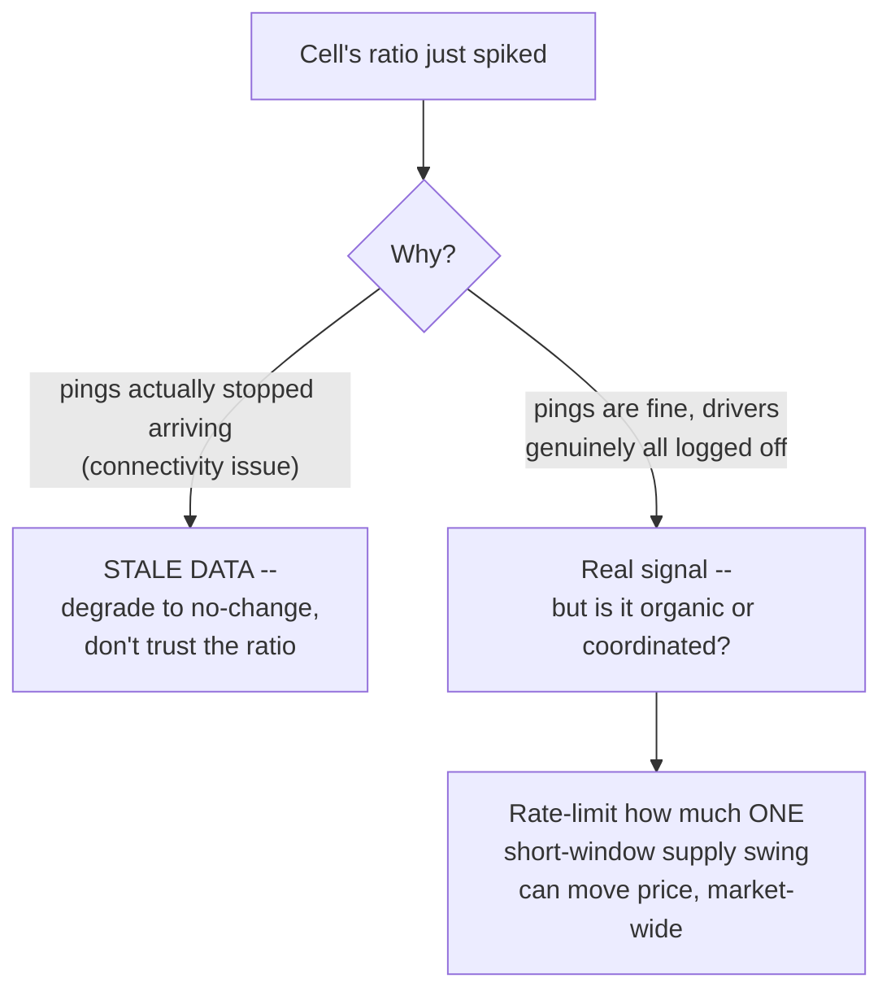

MetroHail can't perfectly distinguish "30 drivers had a genuinely bad reason to log off at once" from "30 drivers coordinated a manipulation," and it doesn't try to solve that with certainty. Instead it leans on the mechanism it already has: the same tiered, cooldown-limited smoothing from Chapters 5 and 6 caps how much *any* short-window supply swing — honest or gamed — can move price, which blunts the payoff of gaming the signal without needing to prove intent. Every clamp and every unusually sharp swing gets logged (per Chapter 7's audit trail) precisely so a pattern of repeated, suspicious swings in the same cells is something operations can spot after the fact, even if it can't be caught in real time.

**How I'd say this in an interview:** "Two different integrity problems get confused if you're not careful — stale driver data looks like a demand spike but is actually a data-quality bug, and deserves a fail-safe default, not a price change. Coordinated supply withholding is a genuine gaming risk with real data, and the honest answer is you don't need to detect it perfectly in real time — the same smoothing that damps normal spikes also blunts the payoff of gaming them, and the audit log is what lets you catch the pattern after the fact."

---

## Chapter 9 — The price tag held at the register

By now the multiplier for any given cell is well-behaved — smoothed, capped, logged. One more gap: a rider opens the app, sees a quote at **1.8x**, and takes 45 seconds deciding whether to book. In that 45 seconds, the cell's cooldown window happens to expire and the multiplier steps up to 2.0x. If the price the rider actually gets charged is whatever the multiplier happens to be *at the moment they tap confirm*, they're being charged a different price than the one they were shown — the exact kind of instability every fix so far has been fighting, just moved to a different point in the flow.

**Name the fix — the price tag held at the register:** a store that changes a shelf price mid-day still honors the sticker price for a customer who's already holding the item at checkout. MetroHail's `GET /v1/pricing/quote` response returns the multiplier along with a `multiplierValidUntil` timestamp — a short lock window (on the order of a couple of minutes), during which that exact quoted price is honored regardless of what the cell's live multiplier does in the meantime.

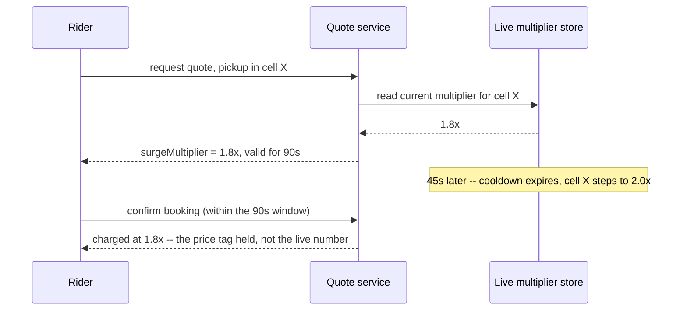

This deliberately loosens consistency in one direction and tightens it in another: the *live* multiplier is allowed to lag by seconds-to-tens-of-seconds behind the true aggregation state (that looseness is fine — it's the whole point of smoothing), but the *quoted-to-a-specific-rider* price is a hard promise for its validity window, no exceptions. This mirrors a real, documented shift in how Uber prices rides — Uber's move toward **upfront pricing**, announced around 2016, shows riders a fixed estimated price before booking based on predicted route and conditions, specifically to avoid the older experience of a volatile, live multiplier changing on a rider mid-decision.

**New problem, the last one worth naming:** every fix so far assumes the pricing engine itself is up and computing. What happens when it isn't?

**How I'd say this in an interview:** "The multiplier itself can lag by seconds without hurting anything — that's the point of smoothing. But once a specific rider has been quoted a specific number, that quote has to be a hard promise for a short window, not a live read of a constantly-updating value — that's the price-tag-at-the-register idea, and it's a big part of why Uber moved toward showing a locked, upfront price before booking."

---

## Chapter 10 — The safe default when the whole engine goes dark

MetroHail's pricing engine — the aggregator, the smoothing layer, the whole pipeline — has an outage. Maybe the stream-processing cluster feeding the per-cell aggregation dies; doesn't matter why. The obvious question, and the one every earlier fix in this story has been implicitly building toward: *does MetroHail stop accepting ride requests until pricing comes back?*

No — and getting this wrong here would undo every good instinct from every earlier chapter. Losing dynamic pricing for a while is a **revenue** problem: MetroHail books rides at a flat baseline rate and makes less money on the ones that would have surged. Blocking ride requests entirely because a pricing microservice is unhealthy turns a revenue problem into an availability outage for a **safety-relevant, revenue-critical core product** — riders who can't get a car at all is a categorically worse failure than riders getting a car at 1.0x when they might have gotten it at 1.8x.

**The fix — the spare tire:** the pricing service fails open to a safe default, **1.0x, no surge**, never to blocking requests. And there's a second, subtler piece: if the engine comes back after being down for a while, it shouldn't instantly resume publishing whatever wildly stale multiplier it last computed before it crashed — a cell that was legitimately at 2.5x an hour ago might have fully normalized by the time the engine recovers. So recovery **decays toward baseline** over a bounded grace period rather than snapping straight back to a potentially very stale high number.

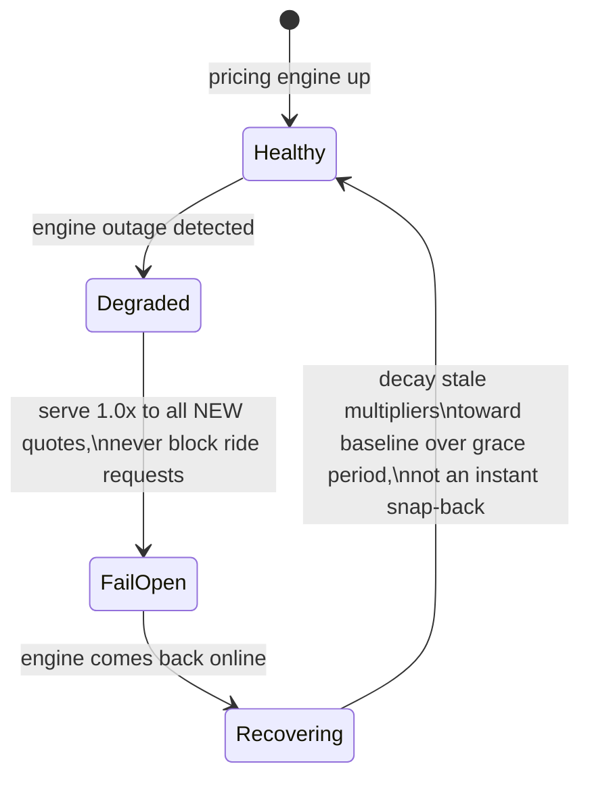

This is the same fail-open instinct that shows up anywhere a non-safety-critical enrichment sits in front of a safety-critical or revenue-critical core flow: the core flow (accepting the ride) must never depend on the enrichment (the exact price) being healthy.

**How I'd say this in an interview:** "The pricing engine degrading is a business-cost problem, not a rider-facing outage — fail open to no-surge, 1.0x, and never let a pricing-layer failure block a ride request. The one easy-to-miss detail is recovery: don't snap straight back to whatever multiplier was last computed before the crash, decay it toward baseline, because it may already be stale by the time you're healthy again."

---

## Where the story actually lands

```mermaid
flowchart LR
    A["Ch1: flat fare\n(no signal to move supply)"] -->|"fixes: give price a signal\nbreaks: what area, what math"| B["Ch2: citywide average"]
    B -->|"fixes: a formula exists\nbreaks: hides local imbalance"| C["Ch3: per-cell, equal-area hex grid"]
    C -->|"fixes: comparable ratios\nbreaks: instant ratio is noise"| D["Ch4: rolling window"]
    D -->|"fixes: sparse-data noise\nbreaks: continuous value still flickers"| E["Ch5: tiers + cooldown"]
    E -->|"fixes: flicker\nreveals: it's also the loop's own damping"| F["Ch6: feedback loop converges"]
    F -->|"fixes: oscillation\nbreaks: extreme ratios need a ceiling"| G["Ch7: regulatory/fairness caps"]
    G -->|"fixes: bounded price\nbreaks: signal itself can be wrong/gamed"| H["Ch8: stale-data vs. gaming"]
    H -->|"fixes: signal integrity\nbreaks: quoted price can drift mid-booking"| I["Ch9: locked quote window"]
    I -->|"fixes: honored price\nbreaks: what if the engine itself is down"| J["Ch10: fail open to 1.0x"]
```

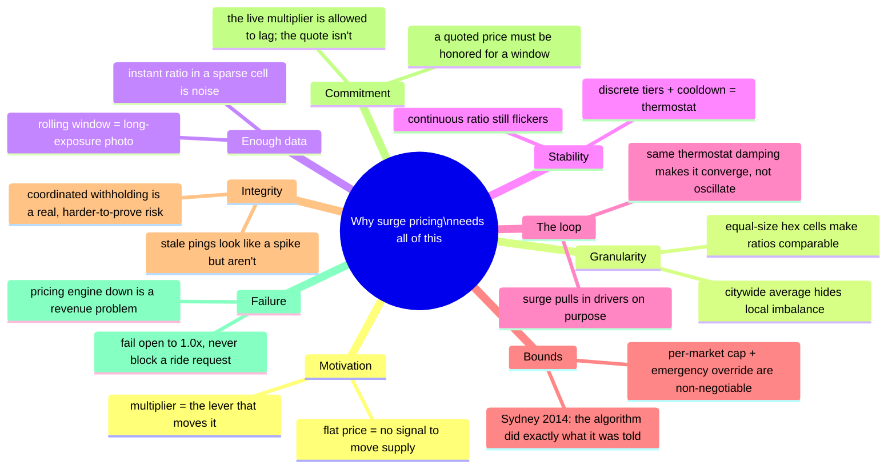

The skill isn't reciting all ten chapters — it's knowing where the interviewer's actual question sits on this chain and stopping there. A question purely about "how do you compute the ratio" lives around Chapter 4. A follow-up about "what stops price from jumping around" is Chapter 5. "What happens once surge works and pulls drivers in" is Chapter 6, and it's the one you're expected to raise yourself, unprompted. Anything about caps, fairness, or the Sydney incident is Chapter 7 — and if nobody's asked about gaming or engine outages, walking there anyway, briefly, is what separates "answered the question" from "actually understands the system."

---

## Grill me — adversarial follow-ups

**Q1: "Why not just let drivers manually set their own prices in high-demand areas instead of building all this?"**
Because that reintroduces exactly the coordination and fairness problems this whole design exists to avoid — riders would need to compare prices across drivers in real time, drivers would race each other to overprice desperate riders, and you'd lose the one thing a centralized multiplier gives you: one transparent, auditable number per cell that both sides can see and trust.

**Q2: "Isn't a hex grid just an arbitrary choice — why not a fixed grid of squares?"**
Hexagons tile a plane with every neighboring cell equidistant from the center, unlike squares where diagonal neighbors are further away than adjacent ones — that makes "which cells are near this one" behave consistently in every direction, which matters when you're reasoning about drivers repositioning between adjacent cells. It's not arbitrary; it's why Uber's own H3 index specifically uses hexagons, not squares.

**Q3: "You said the rolling window needs a few minutes of data — doesn't that make the system slow to react to a real, sudden spike?"**
Yes, and that's an accepted, deliberate trade-off, not an oversight — reacting to a single noisy instant would make price flicker constantly, which is worse for trust than reacting a few seconds late to a genuine trend. If a specific, predictable high-demand event is known ahead of time (a scheduled concert letting out), that's a case for a larger one-time configured step, not for loosening the general smoothing rule.

**Q4: "Walk me through why the same mechanism fixes both flicker and the feedback loop — that feels like it's doing double duty for free."**
It's not double duty, it's one root cause with two visible symptoms: both flicker and oscillation come from the published multiplier reacting too fast to a changing input, whether that input is sensor noise or the surge's own effect on supply. A rate-limited, one-step-at-a-time rule slows reaction to *any* fast-changing input, so it happens to fix both — that's the tell that it's the right mechanism, not a coincidence.

**Q5: "The Sydney 2014 incident — wasn't the algorithm just doing its job correctly? Why is that a design failure and not a PR failure?"**
Both are true at once, and that's the actual lesson: the algorithm worked exactly as specified, and that's precisely the problem — "raise price when demand spikes" is a fine general rule that produces a genuinely harmful outcome in an emergency, which means the system needs an explicit override for that case rather than trusting the general rule to self-correct. That's why the fix is a hard, separate guardrail — a cap and an emergency freeze — not a smarter version of the same formula.

**Q6: "How would you actually detect coordinated supply gaming, concretely, not just 'log it and hope'?"**
Realistically, you don't try to prove intent in real time — you rate-limit how much any single short-window supply swing can move price (which caps the payoff of gaming regardless of cause), and you log every unusually sharp swing per cell so an analyst can look for a repeated pattern in the same cells at the same times of day after the fact. Trying to build a real-time "is this driver lying" classifier is a much harder, riskier problem than damping the blast radius and reviewing patterns offline.

**Q7: "Why lock the quoted price for a window instead of just always charging whatever the live multiplier says at drop-off?"**
Because a rider commits to a trip based on the price they were shown, and charging something different at the end — even if it's "more accurate" — breaks the basic contract of a quote and reintroduces the exact instability the smoothing mechanism spent five chapters trying to prevent, just moved to billing time instead of display time. The live multiplier is allowed to be a little stale; a quoted, accepted price is not allowed to move at all.

**Q8: "If the pricing engine is down, why not just disable surge everywhere and keep going, rather than a gradual decay on recovery?"**
Disabling immediately is exactly the fail-open behavior described — the decay-on-recovery detail is about a slightly later moment: once the engine comes back up, you don't want it to instantly resume broadcasting whatever multiplier it last computed before it crashed, because that number could be an hour stale and no longer reflect reality. Decaying it toward baseline over a short grace period avoids both an abrupt price cliff and trusting genuinely outdated data.

**Q9: "This whole design treats every cell as fully independent — is that actually realistic, given drivers move between adjacent cells?"**
It's a real simplification, and the reference guide calls it out explicitly as deliberately out of scope for a first version — cross-cell driver-flow modeling (explicitly accounting for how a multiplier in one cell pulls supply from its neighbors) is a legitimate stretch goal, but starting with independent per-cell computation and treating cross-cell effects as something to monitor, not model day one, is the right MVP scope.

**Q10: "Cold open — someone just says 'design Uber's surge pricing' with no other context. Where do you start?"**
Say the control-loop sentence first — measure local demand and supply, smooth it, price it, watch the price change what you're measuring — then ask about geo granularity and regulatory caps up front, because those two answers change almost everything downstream. Then walk forward only as far as the conversation actually needs: granularity and smoothing are close to mandatory in any version of this question; the feedback loop is the differentiator if you raise it yourself; caps, gaming, and fail-open are the deep dives you earn by being asked, or by having time left over.

---

## Pacing note

**If this is 60 seconds inside a bigger Uber question:** say the control-loop sentence — measure local demand and supply, smooth it, price it, watch the price change what it's measuring — then say "per-cell on a hex grid, rolling-window ratio, discrete tiers with a cooldown so it doesn't flicker or oscillate, capped per market, and I'd fail open to no-surge if the engine itself is down." That's the whole shape in one breath.

**If this is the whole 15-20 minute focus:** walk the chapters in order — why dynamic pricing exists at all, why granularity has to be a uniform grid not administrative zones, why the ratio needs a rolling window, why the multiplier needs discrete tiers and a cooldown, why that same mechanism is what makes the intentional feedback loop converge, then caps and the Sydney case, signal integrity, the locked quote window, and fail-open last. Raise the feedback loop yourself before being asked — that's the single biggest differentiator in this topic.

---

## Active recall — no answers, test yourself cold

1. What's the one-sentence reason a flat, non-dynamic fare fails to fix a localized supply/demand imbalance?
2. Why does a single citywide ratio hide exactly the imbalance surge pricing is supposed to correct?
3. Why are administrative neighborhood boundaries the wrong choice of "cell," even though they're more granular than citywide?
4. Why is an instant, per-cell ratio mostly noise at real-world request density — what's the actual number that proves it?
5. Name the two independent damping mechanisms that together prevent multiplier flicker, and say why neither alone is enough.
6. Walk through, step by step, why an un-damped feedback loop between surge and driver supply oscillates instead of settling.
7. What actually happened in Sydney in December 2014, and why was "the algorithm worked as designed" not a defense?
8. What's the difference between the fix for stale/missing driver location data and the fix for coordinated supply gaming?
9. Why is the live multiplier allowed to lag by seconds, while a quoted price to a specific rider is not allowed to change at all?
10. When the pricing engine itself goes down, what's the fail-open behavior, and why does recovery decay toward baseline instead of resuming instantly?

*Spaced repetition: test this list today, again in 2-3 days, again in a week.*

---

## Cheat sheet — one line per stop on the story

- **Flat fare**: no incentive for supply to move toward demand — the whole reason a price signal needs to exist at all.
- **Citywide average**: one reservoir gauge for the whole city — accurate in aggregate, useless about any one neighborhood's real imbalance.
- **Equal-size hex cells (H3)**: same-size measuring cups — makes a ratio computed in one cell comparable to a ratio computed in any other, unlike administrative boundaries of wildly different sizes.
- **Rolling window**: the long-exposure photo — most cells see under one request per second even at peak, so an instant ratio is measuring noise, not demand.
- **Discrete tiers + cooldown**: the thermostat's dead-band and minimum cycle time — together, not separately, is what stops flicker.
- **The feedback loop**: surge is designed to attract drivers, which lowers the ratio that caused it — the same thermostat damping is what makes this converge instead of oscillate, not a separate mechanism.
- **Regulatory/fairness caps**: a per-market guardrail, non-negotiable, not a tuning knob — Sydney 2014 is the real case where "the algorithm worked as designed" was still the wrong outcome.
- **Stale data vs. gaming**: missing driver pings should degrade to no-change, not read as zero supply; coordinated withholding is a real risk you blunt with rate-limiting and catch with logs, not real-time certainty.
- **Locked quote window**: the price tag held at the register — the live multiplier can lag by seconds, but a quoted price to a specific rider is a hard promise for its validity window.
- **Fail open to 1.0x**: the spare tire — a pricing outage is a revenue problem, never a reason to block a ride request; recovery decays toward baseline instead of snapping back to stale data.
- **The meta-lesson**: every fix in this story buys one property — signal, comparability, sufficient data, stability, convergence, bounded fairness, signal integrity, commitment, or availability — by spending something else; say the trade in the same sentence you propose the fix.
