# Design a Fraud Detection System — The Story (narrative edition)

> **What this file is.** The reference file, `56-Design-a-Fraud-Detection-System-FAANG-Guide.md`, is the one to recite from — requirements, API shapes, every trade-off table, the master cheat sheet. This file is a second way in: the same material as one continuous story, told in plain language. Engineers at a company keep hitting a wall, patch it, and the patch itself creates the next wall — until we land on the exact same hybrid rules-plus-ML design the reference file documents. The company, **Ledgerly** (a payments startup processing card transactions for small online merchants), is fictional. But every wall it hits is something a real, named system actually hit: PayPal's own documented shift from manual/rule-based review to statistical fraud models in its early years (the "Igor" fraud-ring story recounted by PayPal co-founder Max Levchin and in Eric M. Jackson's *The PayPal Wars*), Uber's Michelangelo feature store (built specifically to guarantee training and serving compute features identically), card-network rules-plus-scoring engines like Visa Advanced Authorization, and documented card-network dispute-window rules. I'll say clearly, every time, whether something is a documented fact or just a reasonable stand-in number.

**The trigger phrase** for this whole topic: *"design a real-time fraud/risk-scoring system for payments."* Keep one sentence in your head as you read: **the hard part isn't the model — it's making sure the feature the model sees at the moment of scoring was computed exactly the same way it was during training, and combining a fast deterministic rules engine with a slower-to-adapt ML score into one decision.** Everything below is just this one idea, getting harder in small, honest steps.

---

## Chapter 1 — The report that arrives after the money is already gone

It's 2018. Ledgerly is small — a few thousand transactions a day for a handful of online merchants. Fraud detection is a nightly cron job: at 2am, a SQL job scans yesterday's transactions for suspicious patterns (unusual amounts, cards used across many merchants) and drops a report on the fraud team's desk in the morning.

One Tuesday, the report flags 340 suspicious transactions from the day before, totaling **$210,000** `[illustrative — Ledgerly-specific, but "batch fraud detection finds it too late" is a well-documented failure mode of early card-fraud systems]`. By the time anyone calls a merchant, the money has already settled overnight — funds already moved out to the fraudster's linked bank account and withdrawn. Of the $210,000 flagged, **$180,000 turns out to be unrecoverable.** The batch job did its job perfectly — it just did it a full day too late to matter.

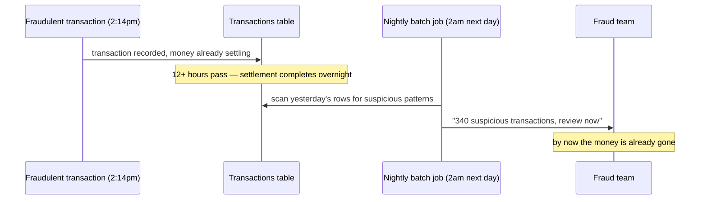

The obvious next question: *why not just run the batch job every hour instead of once a night?* Because even hourly is still too late — a stolen card can be used and drained within minutes of being stolen. The real requirement isn't "check sooner," it's **check before the transaction is even approved**, in the same instant the payment is being authorized, before any money moves at all.

**The fix, and the analogy for the rest of this story:** move the fraud check into the transaction's own critical path — score it **before** you say APPROVE, not after. Think of it as a **bouncer checking ID at the door**, not a security guard reviewing last night's guest list over coffee. The door either opens or it doesn't, right then — there's no "we'll figure out who shouldn't have come in, tomorrow."

**New problem, immediately:** putting the fraud check inline means it now shares the payment's own latency budget — tens to low hundreds of milliseconds, not "whenever the nightly job gets to it." The very first thing an engineer reaches for to compute a feature like "how many transactions has this card made in the last hour" is to just query it live, per incoming transaction. That's the next wall.

**How I'd say this in an interview:** "The naive version of fraud detection is a nightly batch scan, and the reason it fails isn't accuracy — it correctly finds the fraud — it's timing, because by the time it runs, the money's already moved. The real requirement is scoring the transaction inline, before it's approved, which immediately turns this into a latency-budgeted, real-time problem."

---

## Chapter 2 — The query that re-reads an hour of history, every single time

The fix from Chapter 1 works — Ledgerly builds a scoring step that runs during authorization. For the feature "transactions by this card in the last hour," the simplest thing to write is exactly what it sounds like:

```sql
SELECT COUNT(*) FROM transactions
WHERE card_token = ? AND created_at > now() - interval '1 hour'
```

On a small table, this runs in about 80ms `[illustrative]` — tolerable, if a little slow. Ledgerly grows over the next year, though, and the transactions table now holds **40 million rows**. The same query now takes about **600ms**. And "transactions per card per hour" isn't the only rolling feature the model needs — there are roughly **15** of them (count per card, sum per merchant category, velocity across devices, and so on). Scanning for all 15, even in parallel, means **15 separate table scans per incoming transaction**, and at a peak of 200 transactions/sec, that's **3,000 scanning queries/sec** landing on one already-busy OLTP table. The database falls over well before the fraud check even finishes.

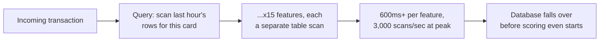

The obvious question: *why re-read the whole hour of history every single time, when almost none of it changed since the last transaction from this card?* Because a scan recomputes from scratch. What you actually want is a number that just **ticks up** as new events happen and **ticks down** as old ones fall outside the window — never re-derived from the raw rows again.

**The fix, and the analogy for the rest of this story:** an **odometer, not a trip log you re-read**. A car's odometer doesn't recalculate your total mileage by re-reading every past fuel receipt — it just adds one mile the instant one mile happens, and it's always instantly readable. Ledgerly builds a **stream processor** that consumes the transaction stream and maintains these rolling counts incrementally — the same architectural role Kafka Streams or Apache Flink play in production stream-processing systems — writing the current value of each feature into a low-latency **online feature store** (a key-value store) that the scoring service reads with a simple point lookup, sub-10ms, instead of a scan.

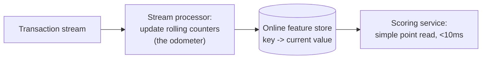

**New problem, three weeks after launch:** Ledgerly ships its first ML fraud model, trained offline on historical data using features with these exact same names — "txn_count_1h," "amount_vs_merchant_avg." Offline, on held-out historical data, it scores a strong **0.94 AUC** `[illustrative]`. In production, it visibly misses fraud patterns it supposedly learned to catch. Nothing crashed. Nothing alerted. It's just quietly worse than advertised.

**How I'd say this in an interview:** "A rolling feature like 'transactions in the last hour' should never be computed by scanning historical rows per incoming request — that's an O(window size) operation on the hot path. The fix is an incrementally updated aggregate in a stream processor, written to a low-latency feature store, so the read at scoring time is a cheap point lookup, not a scan."

---

## Chapter 3 — The model that aced the lab and flopped on the floor

Ledgerly's data scientists dig in. The model was trained on features computed by an **offline** pipeline that scans the full historical record for a given time window. In production, the **same-named** feature is computed by the **online** stream processor from Chapter 2. Nobody had reason to assume these were different — same feature name, same intent — but a side-by-side comparison for the same historical period turns up two specific bugs:

1. The offline pipeline computes "transactions in the last hour" using **calendar-hour boundaries** (e.g., 2:00–3:00pm), while the online pipeline uses a **rolling 60-minute window**. For a transaction at 2:58pm, these can disagree by nearly an hour's worth of activity.
2. The offline pipeline, when building training examples, accidentally **includes the transaction being scored in its own count** — a transaction that's the 6th in the last hour sees `txn_count_1h = 6` in training. The online pipeline correctly excludes the current transaction and would compute `5` for the same case.

Neither of these throws an error. The model just sees a systematically different number online than the one it learned the meaning of during training — its risk scores are miscalibrated, silently, and stay that way until someone thinks to check.

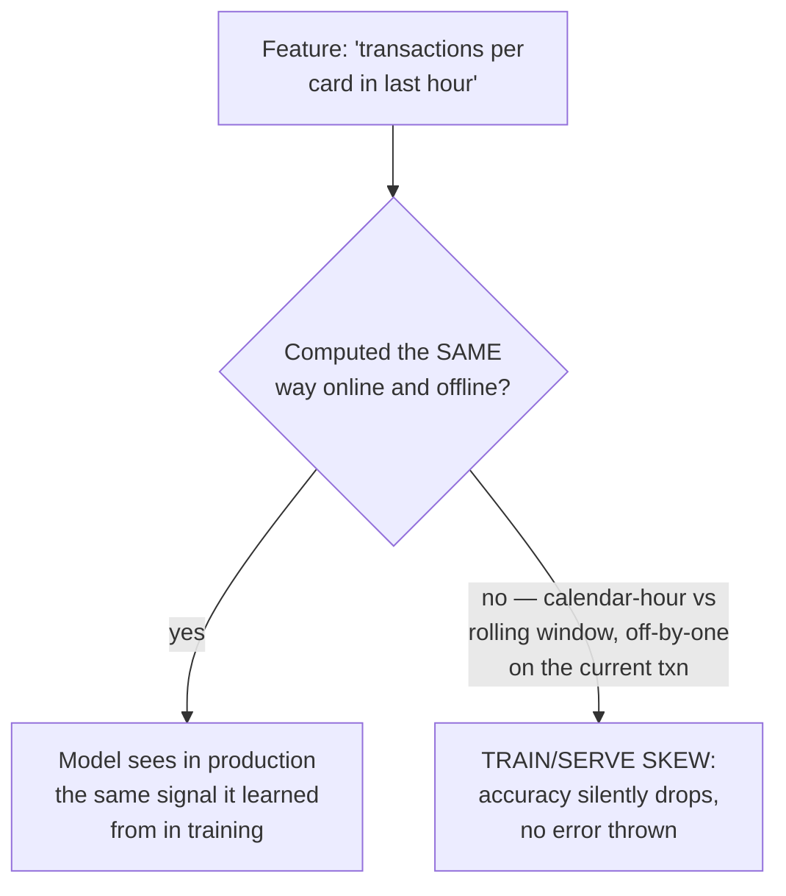

The obvious question: *how do you even catch this, given nothing crashes?* By comparing the **distribution** of a feature's online-computed values against its offline-computed values, for the same historical period, and noticing they don't line up.

**The fix, and the analogy for the rest of this story:** **one measuring cup, not two kitchens each with their own.** If two different chefs each eyeball "one cup of flour" independently, their cups won't match exactly, and the recipe comes out subtly wrong every time, with no error message — just a worse result. The actual fix is a **single shared feature-definition** — one piece of code, or a proper feature store's dual-materialization capability — that both the training pipeline and the live scoring pipeline call. This is a documented, real reason feature stores exist: Uber's **Michelangelo** feature store was built specifically to guarantee that a feature computed for training and the same feature computed for online serving come from the same definition, not two independently-written approximations of "the same thing."

**New problem, three weeks later, once feature consistency is fixed and the model is working well:** a brand-new fraud ring starts using a specific stolen card-number range nobody has seen before. The now-accurate model doesn't recognize it yet — it can only learn from labeled training examples, and there aren't any for this pattern yet. About **$40,000** `[illustrative]` of this specific fraud gets through before anyone notices, purely because the model's only way of learning anything new is retraining on data that doesn't exist yet.

**How I'd say this in an interview:** "Train/serve skew is the classic silent failure mode in ML-serving systems — the model's offline metrics and its production behavior quietly diverge because online and offline computed 'the same' feature slightly differently. The fix is one shared feature definition materialized both ways, which is exactly the problem feature stores like Uber's Michelangelo were built to solve — never two independently maintained implementations of the same feature."

---

## Chapter 4 — The pattern everyone already knows about, and the model that hasn't heard yet

The fraud team investigates the $40,000 loss and finds the pattern in about a day: a specific card-number (BIN) range, `453910–453915` `[illustrative]`. They know it's bad **today**. The model won't know it's bad until its next retraining cycle picks up enough labeled examples — and per Chapter 3, labels for confirmed fraud don't even exist yet; they arrive later, via disputes. In the meantime, more of this exact pattern keeps getting through.

This is close to a documented piece of fraud-detection history: PayPal's own early fraud fight, as Max Levchin and others have recounted, started out largely manual/rule-based, and PayPal's shift toward statistical, learned fraud models (against a persistent fraud operation PayPal engineers reportedly nicknamed "Igor," per accounts in Eric M. Jackson's *The PayPal Wars*) was a response to exactly this gap — rules catch what's already known, but a determined, evolving attacker keeps finding what isn't `[illustrative framing of the specific historical detail, but the rules-to-ML shift itself is well documented]`. Ledgerly is now living the mirror-image problem: it has the model, but not yet the fast-reacting rules layer that catches what's *already* known.

The obvious question: *if we already know this pattern is bad right now, why does the system wait a week to react to it?* Because a model only changes through retraining, and retraining needs labeled data — days to weeks away. A **rule**, by contrast, is just a deterministic check that a human can write and deploy in minutes.

**The fix, and the analogy for the rest of this story:** **an instant memo versus a slow-learning gut instinct.** Ledgerly adds a **rules engine** — deterministic checks (this BIN range, this device fingerprint, this velocity threshold) that run alongside the ML model and can be updated in minutes. When a rule fires, it **wins outright** over the model's score: a rule represents a known, verified, human-confirmed pattern; a model score is a probabilistic estimate learned from inherently stale historical data. Higher-confidence, deterministic knowledge beats a probability estimate when both are on the table.

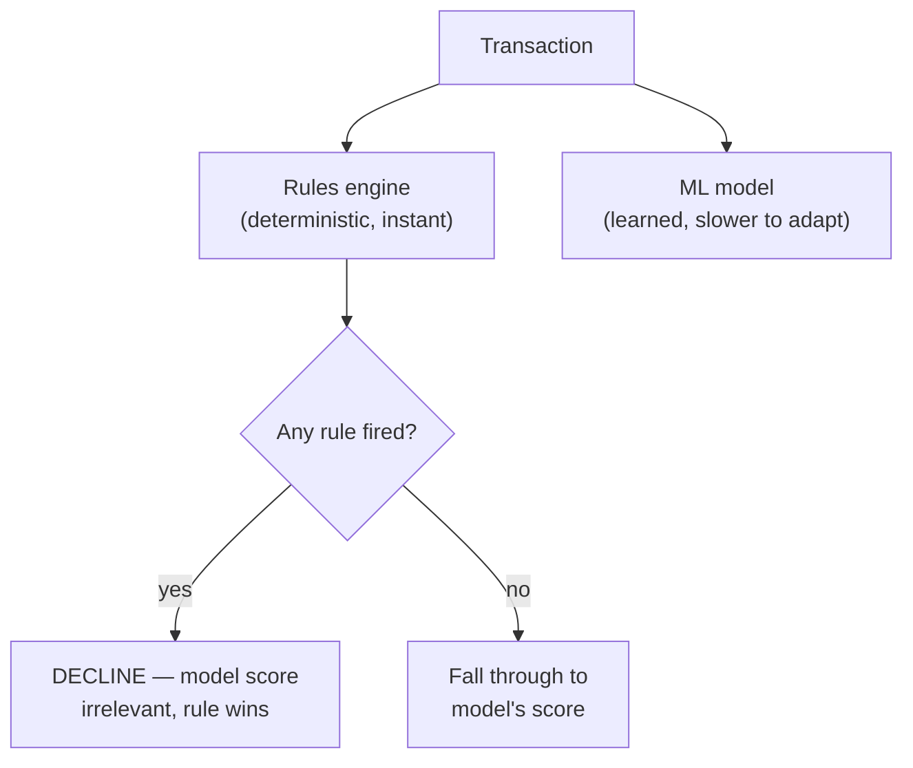

**New problem, almost immediately:** now Ledgerly has both a rules engine and a model, running side by side. What happens when the model says "high risk, score 0.85" on a transaction no rule flags? What happens when a rule fires on something the model scores as very low risk? "Decline if any rule fires OR score is above some cutoff" sounds obviously right — and it is, mostly — but it turns out to be dangerously blunt when a rule itself is written a little too broadly. That's the next wall.

**How I'd say this in an interview:** "Rules and the ML model aren't redundant — they cover different gaps. Rules catch known patterns instantly and explainably; the model catches the broader distribution of fraud nobody's written a rule for yet. When a rule fires, it should win, because it's higher-confidence, verified knowledge, not a probabilistic guess."

---

## Chapter 5 — The good customer declined by a rule that was too blunt

Ledgerly writes a new velocity rule to stop card-testing bots: *"more than 5 transactions from one card in 10 minutes → decline."* It ships straight to production, no trial period — after all, it's "just a rule," how risky can it be?

Three weeks later, it catches something else entirely: a legitimate small merchant's regular customer buying concert tickets, retrying six times in eight minutes because the merchant's checkout page kept timing out. Over one weekend, this single rule wrongly declines an estimated **1,200 good transactions**, worth roughly **$85,000** in legitimate revenue `[illustrative]`, before anyone connects the spike in complaint tickets back to the new rule.

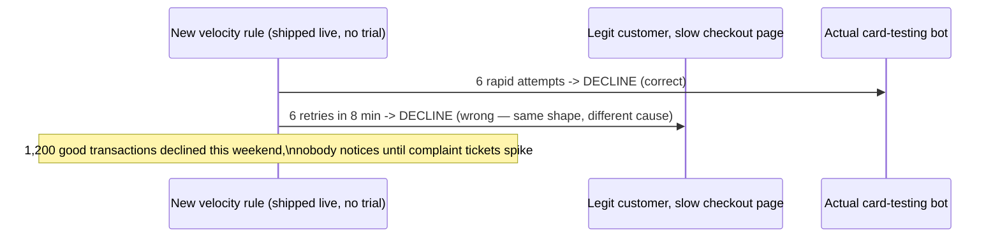

The obvious question: *how do you catch a bad rule before it does damage at real scale, instead of after?* The same way you'd de-risk any high-blast-radius config change — never let it act on real traffic the first time it runs.

**The fix, and the analogy for the rest of this story:** **a dress rehearsal before opening night.** Every new or changed rule goes into **shadow mode** first — it evaluates against real, live traffic and logs what it *would* have decided, without actually declining anything. The fraud team reviews that shadow log (especially checking it against known-good customers) before flipping the rule live. This is the same discipline as canarying any risky production change — you rehearse against the real audience before the curtain goes up for real.

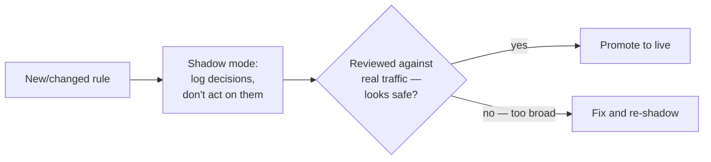

**New problem, deeper and permanent:** even with careful rule rollout, a harder truth remains underneath everything so far: **every** decision boundary — a rule's threshold, the model's score cutoff — trades off missing real fraud against blocking a real customer. There is no threshold that eliminates both at once. This tension doesn't get "fixed"; it gets **managed**, deliberately, as a business calibration.

**How I'd say this in an interview:** "A rule that's individually cheap to write can still be expensive at scale if it's too broad — the fix is shadow-mode canarying for any rule change, the same discipline you'd apply to any risky config change. But shadow mode only catches badly-tuned rules; it doesn't remove the underlying tension between missing fraud and blocking good customers, which is the next thing to name."

---

## Chapter 6 — The line you can't move without moving it somewhere else

Ledgerly tunes the model's decline threshold directly. At a score cutoff of **0.5**, the model catches **92%** of actual fraud, but also declines **3.5%** of all legitimate transactions `[illustrative]`. Lowering the cutoff to **0.8** to stop annoying good customers drops the false-decline rate to **0.4%** — but the fraud catch-rate falls to **61%**, letting far more real fraud through. There is no cutoff that gives you both numbers at their best.

This is a well-documented tension in the payments industry generally: multiple industry cost-of-fraud studies (e.g., LexisNexis Risk Solutions' recurring "True Cost of Fraud" research) have found that false declines — turning away *good* customers — cost merchants a multiple of what actual fraud losses cost them `[illustrative framing of the exact multiple, but the direction — false declines being expensive, often more expensive than fraud itself — is a widely documented industry finding]`. A model tuned only to "catch more fraud" without weighing this cost is optimizing half the problem.

```mermaid
quadrantChart
    title Decline threshold: fraud caught vs. good customers turned away
    x-axis Loose threshold (catches less) --> Strict threshold (catches more)
    y-axis Fewer good customers declined --> More good customers declined
    quadrant-1 Strict and costly to good customers
    quadrant-2 Balanced middle ground
    quadrant-3 Loose, low collateral damage
    quadrant-4 Strict, low damage (rare, aspirational)
    "Cutoff 0.8": [0.25, 0.15]
    "Cutoff 0.65": [0.5, 0.45]
    "Cutoff 0.5": [0.8, 0.75]
```

The obvious question: *is there a "correct" cutoff, then?* No — it's a calibration between the dollar cost of missed fraud and the dollar-plus-reputation cost of falsely declining good customers, and reasonably it should vary by merchant or region, not be one frozen global number. But the deeper insight is: **you don't have to force every score into just two outcomes.**

**The fix, and the analogy for the rest of this story:** a **manager who can say "let me look at this one"** instead of only "yes" or "no" at the door. Add a third decision: **APPROVE / DECLINE / REVIEW.** Scores that land in a genuinely ambiguous middle band get routed to a human analyst instead of being forced into an automated binary call. This absorbs exactly the cases where an automatic threshold does the most collateral damage.

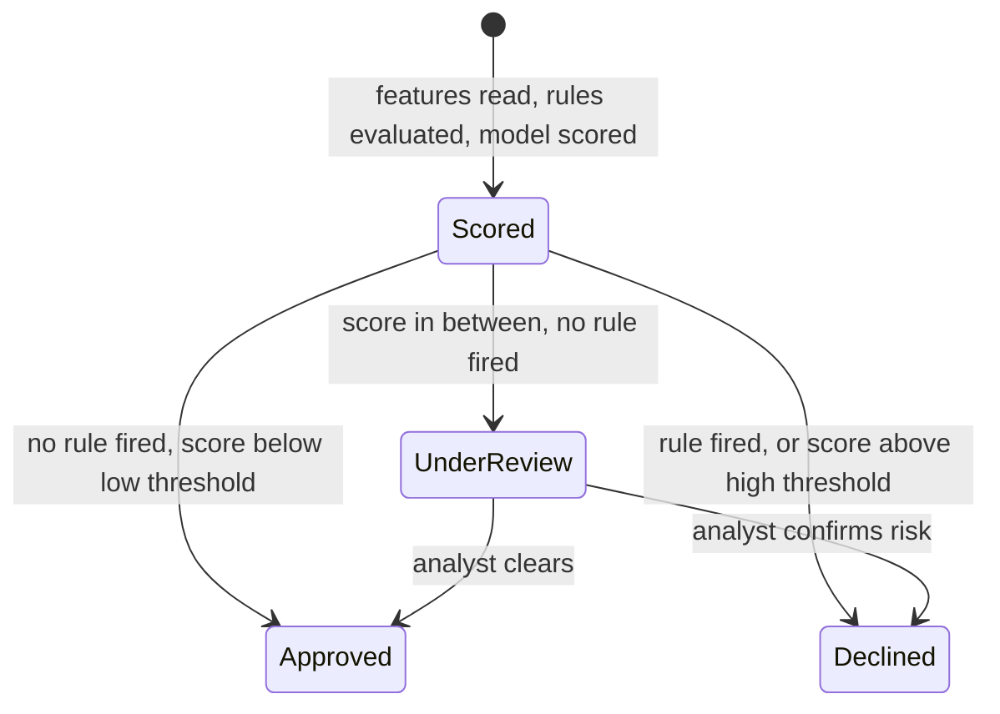

**New problem:** routing to human review only works if the human — or the customer disputing a decline — can actually see **why** the system thinks this transaction is risky. Right now the API returns a bare number, `modelScore: 0.71`, and nothing else. A reviewer can't act on a number alone.

**How I'd say this in an interview:** "There's no threshold that's simultaneously best for fraud catch-rate and false-decline rate — it's a calibrated business trade-off, and it's genuinely different from a legal absolute like sanctions screening. The three-way APPROVE/DECLINE/REVIEW shape exists specifically to absorb the ambiguous middle band into human judgment instead of forcing every score through one brittle cutoff."

---

## Chapter 7 — The decline nobody could explain

A customer disputes a declined **$340** purchase and files a complaint. Ledgerly's dispute team pulls up the record and finds exactly one thing: `modelScore: 0.71`. No indication of which feature drove that number, no record of whether a rule was even evaluated. There's nothing to tell the customer, nothing to hand to the card network's dispute process, and nothing for an internal auditor asking "why was this declined."

Explainability here isn't just good manners — adverse-action-style reasoning for a financial decline is a real, documented regulatory expectation in several jurisdictions and products, the same underlying idea as the long-standing adverse-action-notice requirement in consumer lending: if you're going to say no to someone's money, you generally need to be able to say why.

The obvious question: *how do you make a decision explainable after the fact, without slowing down the actual scoring path?* You don't reconstruct it after the fact at all — you **capture it at the moment it's made**, once, and store it.

**The fix, and the analogy for the rest of this story:** **an itemized receipt, not just a total.** Every scored transaction logs `rulesFired` (which rules, if any, evaluated true) and `topFeatures` — the specific features and their computed values that contributed most to the score — tagged with a `featureComputeVersion` linking back to the exact feature-computation logic in effect at that moment. Now a decision from three weeks ago can be reproduced exactly, not just gestured at.

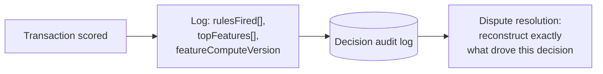

**New problem:** decisions are explainable now, and auditable in real time. But there's a slower, quieter issue underneath everything so far: an APPROVE from today and a DECLINE from today don't actually know yet whether they were **right**. The only way to know for sure that a transaction really was fraud is if the cardholder disputes it — and that dispute doesn't happen instantly.

**How I'd say this in an interview:** "The response should expose which features and rules drove the decision, not just a bare score — an unexplainable decline is both a poor customer experience and a real compliance liability. The fix is capturing feature and rule attribution at scoring time, tied to a versioned snapshot, not trying to reconstruct it after the fact."

---

## Chapter 8 — The fraud that confirms itself twelve days later

A transaction on Day 0 gets scored low-risk (0.12) and approved. It turns out to actually be fraud. The cardholder doesn't check their statement carefully until **Day 12**, disputes the charge, and only then does a chargeback confirming fraud land on Ledgerly's desk — twelve days after the original transaction `[illustrative specific number, but broadly consistent with documented card-network dispute rules, which generally give cardholders a window measured in weeks to months to file a dispute — Visa and Mastercard's own published dispute-resolution rules allow well beyond a same-day window]`.

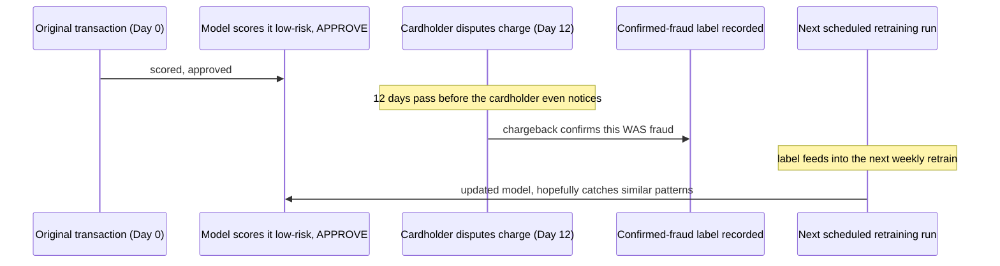

The obvious question: *can the model just retrain on same-day feedback, then?* No — there's nothing to retrain on. The ground-truth label for this transaction doesn't exist on Day 0; it doesn't exist until Day 12. Retraining cadence is bounded by **how fast confirmed labels physically arrive**, not by any infrastructure decision Ledgerly could make.

**The fix, and the analogy for the rest of this story:** **grading an exam weeks after it was taken.** Ledgerly runs a **batch retraining pipeline** on a cadence matched to how fast enough new confirmed labels actually accumulate — weekly, in Ledgerly's case — feeding the offline feature store plus these delayed labels into the next training run. There is no faster honest option, because the feedback itself doesn't exist any faster.

**New problem, really a realization rather than a new bug:** this delayed feedback loop is exactly *why* the rules engine from Chapter 4 was never a legacy stopgap sitting awkwardly next to the "real" ML system — it's the system's **only fast-response mechanism**. A newly discovered pattern, investigated and confirmed by a human today, can be encoded as a rule and take effect in minutes. The model's reaction time to that same new pattern is bounded by this same days-to-weeks label delay, every single time.

**How I'd say this in an interview:** "Model retraining cadence here is bounded by how fast confirmed labels arrive — days to weeks via chargebacks — not by infrastructure. That's exactly why the rules engine isn't a stopgap sitting next to the model, it's the system's only fast-response mechanism for anything newly discovered, because the model literally cannot react faster than its labels do."

---

## Chapter 9 — The night the feature store went dark

2am on a Saturday. The online feature store from Chapter 2 — the key-value store the scoring service reads on every transaction — has a hardware issue. Feature-read latency jumps from **5ms to 3,000ms** `[illustrative]`. Two bad options present themselves immediately.

Option one: the scoring service just waits for the feature store, the way it always has. Payment authorizations across the board start timing out too — a fraud-check outage becomes a full checkout outage, because the fraud check is inline on the critical path (per Chapter 1's whole reason for existing).

Option two: a panicking on-call engineer hardcodes "if the feature store is unreachable, just approve everything, don't block payments." Ledgerly is now wide open to fraud for the entire duration of the outage, and — worse — nobody watching the dashboards would even know coverage had silently dropped to zero, because "approved" looks identical whether or not a real check happened.

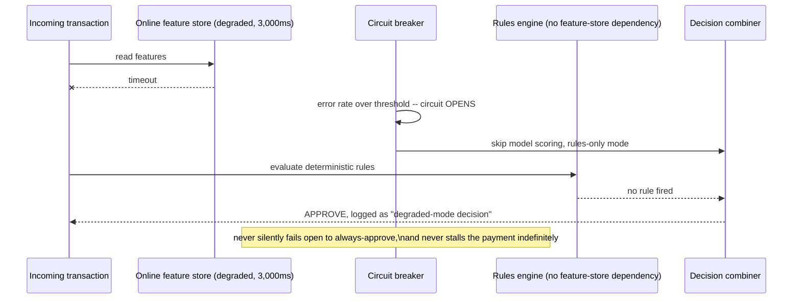

The obvious question: *what's the actual safe fallback, if both extremes are bad?* Neither "block everything" nor "approve everything" is acceptable — the fix is to **degrade to whatever check can still run without the broken dependency**, and make that degradation **visible**, not silent.

**The fix, and the analogy for the rest of this story:** **emergency lighting, not total darkness and not a full evacuation.** When main power fails in a building, you don't sit in the dark, and you don't declare the building unsafe and clear everyone out — a pre-agreed, automatic fallback kicks in. Ledgerly puts a **circuit breaker** on the feature-store read path: when the store's error rate crosses a threshold, the model-scoring step is skipped entirely, and the decision falls back to **rules-only** — since rules don't depend on the feature store at all — with every one of these decisions explicitly tagged as "degraded mode" in the audit log from Chapter 7, so reduced coverage shows up in monitoring instead of getting mistaken for full coverage.

**Where this actually lands:** rules-only coverage is narrower than the full hybrid decision, but it's a real, bounded, known trade-off — a business policy decided calmly in advance, not an engineering improvisation invented at 2am during an incident.

**How I'd say this in an interview:** "A fraud-check outage should never silently become 'no fraud checking happened' by failing open to always-approve, and it shouldn't stall payments by blocking on a dead dependency either. The fix is a circuit breaker that degrades to a rules-only decision — narrower coverage, but bounded and visible — decided as a pre-agreed policy, not improvised during the incident."

---

## Where the story actually lands

```mermaid
flowchart LR
    A["Ch1: nightly batch\n(finds fraud a day late)"] -->|"fixes: check before\napproval, in the critical path\nbreaks: query-time scan too slow"| B["Ch2: rolling aggregates\n+ online feature store"]
    B -->|"fixes: fast feature reads\nbreaks: online/offline compute differs"| C["Ch3: shared feature\ndefinition (feature store)"]
    C -->|"fixes: train/serve consistency\nbreaks: model can't react to new patterns fast"| D["Ch4: rules engine,\nrule wins over model"]
    D -->|"fixes: instant known-pattern block\nbreaks: a broad rule declines good customers"| E["Ch5: shadow-mode\nrule canarying"]
    E -->|"fixes: safe rule rollout\nbreaks: no threshold beats both costs at once"| F["Ch6: three-way decision\n(APPROVE/DECLINE/REVIEW)"]
    F -->|"fixes: absorbs the ambiguous middle\nbreaks: reviewers can't act on a bare score"| G["Ch7: per-decision\nexplainability logging"]
    G -->|"fixes: auditable decisions\nbreaks: labels for today's decision\ndon't exist yet"| H["Ch8: batch retraining,\nbounded by label delay"]
    H -->|"realization: this is why\nrules are the fast-response layer"| I["Ch9: circuit breaker,\nrules-only degraded mode"]
```

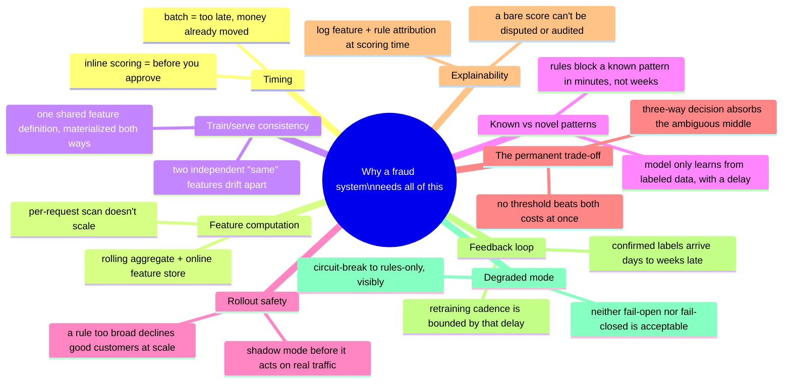

Every real production fraud system sits somewhere on this chain. The skill isn't reciting all nine chapters — it's stopping where the stated requirements say to stop. A low-stakes internal tool might reasonably stop around Chapter 4 (rules plus a model). A real payments system that has to survive disputes, audits, and 2am outages has to reach Chapter 7, 8, and 9. If nobody's mentioned regulatory explainability, walking all the way to Chapter 7 unprompted reads as padding, not depth.

---

## Grill me — adversarial follow-ups

**Q1: "Why not just run the batch job every five minutes instead of building all this real-time infrastructure?"**
Because "every five minutes" still means the transaction was already approved and the money may already be moving before the batch job even looks at it — it doesn't change the fundamental timing problem, it just shrinks the window. The requirement isn't "check soon," it's "check before you say yes," which forces the check into the payment's own critical path no matter how frequently a batch job runs.

**Q2: "Isn't a rules engine just a worse, more manual version of the ML model? Why not drop it once the model is good?"**
No — they cover genuinely different gaps. A model can only act on patterns it's seen enough labeled examples of, and per Chapter 8, those labels arrive days to weeks late. A rule can encode a pattern a human investigator confirmed an hour ago and take effect in minutes. Dropping rules would mean every newly discovered fraud pattern goes unblocked for as long as it takes labels to accumulate and a retrain to run.

**Q3: "Walk me through exactly how train/serve skew could exist even if the code looks identical on both sides."**
It usually isn't the code that's identical, it's the *intent* — "transactions in the last hour" sounds like one definition but can be implemented as calendar-hour buckets in one pipeline and a rolling 60-minute window in the other, or one pipeline can accidentally include the transaction being scored in its own count. Neither difference throws an error; you only catch it by comparing the actual distribution of computed values for the same historical window, online versus offline.

**Q4: "If a fired rule always wins over the model, doesn't that mean one badly-written rule can override a model that's actually right?"**
Yes, and that's exactly the failure Chapter 5 walks through — a rule that's too broad can override a model's correct low-risk score and decline a legitimate customer at scale. That's not an argument against rules winning in general, it's the argument for never letting a new or changed rule act on real traffic before it's been shadow-tested against real transactions first.

**Q5: "You route ambiguous scores to human review — doesn't that just not scale once volume gets big enough?"**
It has a real ceiling, yes — but the fix is tuning the review band to be genuinely narrow, not making review the default outcome. The point of a three-way decision isn't "let humans decide most things," it's "let automation handle the confident majority on both ends, and reserve a deliberately small band in the middle for the cases where an automatic cutoff does the most collateral damage."

**Q6: "Why can't you just retrain the model daily on whatever labels you have so far, even if they're incomplete?"**
You can, and many systems do retrain on a regular cadence regardless — the point isn't that retraining can't happen daily, it's that today's decisions still can't be evaluated against today's ground truth, because most of today's true labels literally don't exist yet. A daily retrain on Day 0 simply won't contain Day 0's own fraud, no matter how often you run it.

**Q7: "What's actually wrong with failing closed — declining everything — during a feature-store outage, instead of degrading to rules-only?"**
It trades one outage for another: instead of undetected fraud during the incident, you get every legitimate customer's payment blocked, which for most businesses is at least as costly and is guaranteed harm instead of probabilistic risk. Rules-only degraded mode keeps the known-pattern coverage running and only sacrifices the model's broader-but-slower-to-compute coverage, which is a much smaller and more defensible gap.

**Q8: "Given everything you've said about explainability, isn't logging topFeatures and rulesFired for every transaction expensive at scale?"**
It's additional write volume, yes, but it's the same write path already logging the transaction and its decision — appending feature attribution to a record you're already writing is a small marginal cost compared to the alternative, which is being unable to answer a dispute or a regulator's question about a specific decline months later.

**Q9: "If someone just says 'design a fraud detection system' cold, where do you actually start?"**
Say the two things that decide almost everything downstream: what's the latency budget for the check within the overall payment flow, and are confirmed fraud labels available immediately or with a delay. The first tells you whether feature computation has to be a real-time rolling aggregate; the second tells you whether you need a rules engine as a fast-response layer alongside the model, or whether the model alone might suffice.

**Q10: "What's the single biggest thing candidates get wrong on this topic?"**
Treating it as a pure ML-serving problem and spending all their time on model architecture, when the actual hard parts are the real-time feature-computation pipeline, the train/serve consistency guarantee, and the fact that rules and the model have to combine deliberately rather than one simply replacing the other. The model itself is almost the easy part.

---

## Cheat sheet — one line per stop on the story

- **Nightly batch fraud scan**: finds fraud accurately but a day too late — the money's already moved, so the real requirement is scoring inline, before approval.
- **Query-time feature scan**: recomputing a rolling feature by scanning historical rows per transaction doesn't scale — maintain it as an incrementally updated rolling aggregate instead (the odometer, not the trip log).
- **Online feature store**: low-latency key-value store fed by a stream processor, so a feature read at scoring time is a point lookup, not a scan.
- **Train/serve skew**: the most commonly silently-broken thing in ML-serving systems — fix it with one shared feature definition materialized identically online and offline, never two independently maintained "same" features.
- **Rules engine**: catches known patterns instantly and explainably, deployable in minutes — a fired rule should win over a probabilistic model score, because it represents higher-confidence, verified knowledge.
- **Shadow-mode rule rollout**: never let a new or changed rule act on real traffic the first time it runs — log what it would have decided first, promote it only after review.
- **Precision/recall trade-off**: no single threshold minimizes both missed fraud and false declines at once — it's a calibrated business decision, not a fixed engineering constant.
- **Three-way decision (APPROVE/DECLINE/REVIEW)**: absorbs the genuinely ambiguous middle band into human judgment instead of forcing every score through one brittle cutoff.
- **Per-decision explainability**: log feature attribution and rules fired at scoring time, tied to a versioned snapshot — a bare score can't be disputed, audited, or reproduced later.
- **Delayed-label feedback loop**: confirmed fraud labels arrive days to weeks later via chargebacks, which bounds retraining cadence — and is exactly why the rules engine is the system's only fast-response mechanism, not a legacy stopgap.
- **Circuit breaker to rules-only**: never fail open to always-approve, and never stall payments waiting on a dead dependency — degrade to a defined, pre-agreed, visibly-logged fallback instead.
- **The meta-lesson**: every fix in this story buys one property (timeliness, throughput, feature correctness, fast reaction to known patterns, safe rollout, calibrated trade-off, auditability, honest retraining cadence, or graceful degradation) by spending something else — say the trade in the same sentence you propose the fix.
