# Design a Recommendation Engine (Netflix/YouTube) — The Story (narrative edition)

> **What this file is.** The reference file, `59-Design-a-Recommendation-Engine-Netflix-YouTube-FAANG-Guide.md`, is the one to recite from — requirements, capacity math, API shapes, every deep dive, the master cheat sheet. This file is a second way in: the same material as one continuous story, told in plain language. Engineers at a company keep hitting a wall, patch it, and the patch itself creates the next wall — until we land on the exact same design the reference file documents. The company, **Bingewave** (a video-streaming startup), is fictional. But every wall it hits, and every fix it reaches for, is something a real, named system or a real, documented event actually did: the 2006 Netflix Prize ($1M for a 10% improvement in recommendation accuracy), classic collaborative filtering and matrix-factorization techniques, and YouTube's own documented two-stage candidate-generation-then-ranking architecture from their 2016 "Deep Neural Networks for YouTube Recommendations" paper. I'll say clearly, every time, whether something is a documented fact or just a reasonable stand-in, using `[illustrative]` for the latter.

**The trigger phrase** for this whole topic: *"design Netflix's / YouTube's / Spotify's recommendation system."* Keep one sentence in your head as you read: **a recommendation engine has to pick, from potentially millions of items, the handful most likely to matter to *this* person, *right now*, in milliseconds — and then it has to keep proving, continuously, that its picks are actually good, because taste drifts, the catalog keeps growing, and clicks are a noisy stand-in for what you actually care about.** Everything below is just this one idea, getting harder in small, honest steps.

---

## Chapter 1 — The flyer stapled outside for everyone

It's early days at Bingewave. The catalog is small — about 2,000 titles — and the homepage is one static list: **"Most Popular Overall,"** the same ten titles, in the same order, for every single visitor, whether they're eleven years old or eighty. Traffic is small enough that this is fine for a while: about 50,000 monthly users, and the "Most Popular" list is, definitionally, popular — a fair chunk of people click something on it `[illustrative]`.

Six months in, Bingewave runs a simple internal check: split users by how closely their actual viewing history matches the profile of "the average person who likes what's on the Most Popular list" versus everyone else. For users close to that average, the homepage click-through rate is a healthy **9%**. For users whose taste is genuinely different — say, someone who exclusively watches documentaries, being shown the same list of blockbuster action movies as everyone else — the click-through rate on that same homepage is **1.4%** `[illustrative]`. Worse: a follow-up survey finds a third of "different-taste" users say they "couldn't find anything to watch" in their most recent session, despite the catalog having plenty of documentaries they'd have loved.

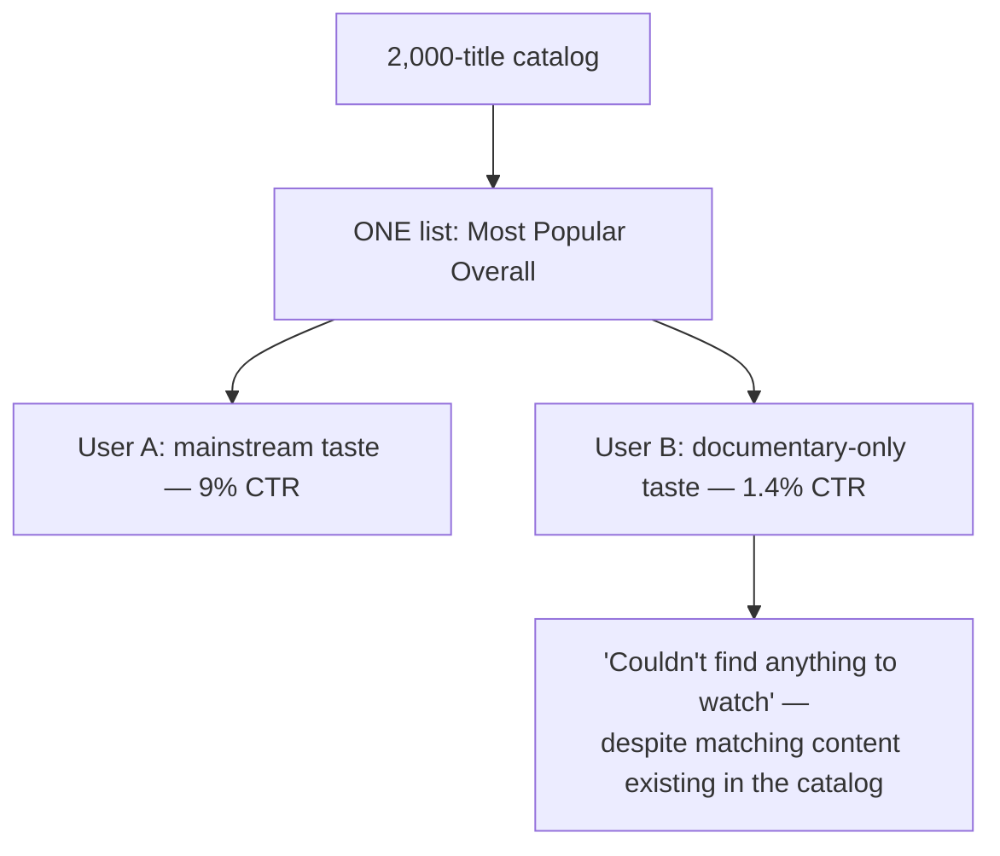

The obvious question: *why show the exact same list to two people who clearly want different things?* Because the homepage, as built, has no concept of "this specific person" at all — it's one global ranking, computed once, served to everyone. It's the community bulletin board again: one flyer, stapled up once, for every passerby, regardless of what any individual passerby actually wants.

**The fix, and the first analogy for this whole story:** stop asking "what's popular in general" and start asking **"who does this person's taste resemble, and what did people like that enjoy?"** Bingewave calls the people who match your taste your **taste twins** — and this exact problem is famous enough to have had a $1M prize on it: in 2006, Netflix ran the real, documented **Netflix Prize**, offering $1,000,000 to any team that could improve the accuracy of its recommendation algorithm by 10%, precisely because generic recommendations leave real value — and real watch-time — on the table.

**New problem, showing up in week one of building this:** the fastest way to find "taste twins" turns out to be hand-written rules — `if user watched Horror, recommend more Horror`. It ships fast. It's also shallow in a way that becomes obvious almost immediately.

**How I'd say this in an interview:** "A one-size-fits-all ranking is fine only as long as your users are all roughly the same — the moment they're not, the same list that delights one group actively frustrates another, and the fix is to stop optimizing for 'everyone' and start optimizing for 'people like this specific person,' which is the entire reason personalized recommendation exists as its own hard problem."

---

## Chapter 2 — Rules versus taste twins

The rule-based fix — "watched Horror, so recommend Horror" — is easy to write and easy to explain. It's also thin. Concrete failure: a user who's watched and loved three slow-burn psychological thrillers gets recommended a slasher movie, because both are tagged "Horror" in the catalog metadata. The genre tag matched; the actual taste didn't. Click-through on these rule-based "because you watched X" rows lands around **3%** `[illustrative]` — better than the flat "Most Popular" list, but far from where it needs to be.

The obvious question: *what's actually missing?* A human curator, writing genre rules, can only encode the similarities they can think of. But the real reason two shows get watched by the same audience is often something no curator would ever write down — a particular pacing, a particular kind of ending, a specific actor's on-screen presence — patterns that live in the *data*, not in anyone's mental model of "what goes with what."

**The fix:** **collaborative filtering** — instead of describing *why* two things are similar, just look at *who* watched *what*, and let similarity fall out of the overlap. If a large group of people who all loved the same three thrillers also all loved one specific slasher movie, that slasher movie gets recommended to fans of those thrillers — even though no rule would have ever connected them. This is a real, long-documented technique, and it's exactly what the winning entries in the 2006 Netflix Prize used, refined into **matrix factorization**: represent every user and every item as a vector of numbers (an **embedding**) such that "similar taste" and "similar audience" show up as vectors that point in similar directions.

**The analogy, kept for the rest of this story:** finding your **taste twins** — not people who happen to share a genre tag with you, but people whose *entire pattern* of likes and dislikes lines up closely with yours — and then recommending you what they loved that you haven't seen yet.

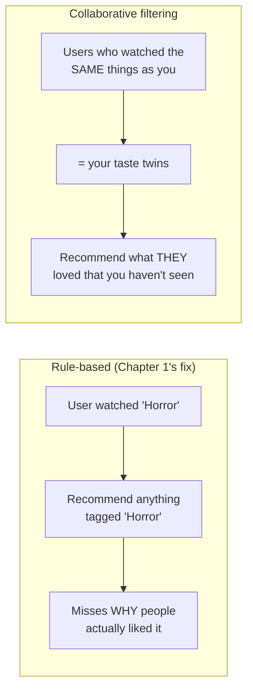

Click-through on collaborative-filtering-driven rows jumps to **11%** `[illustrative]` — a real, meaningful lift over both the flat list and the rule-based version, because it's now finding connections a human curator never would have written down.

**New problem, immediately visible:** collaborative filtering needs *history* to find your taste twins. What happens the moment someone signs up and has watched exactly **zero** things? There are no taste twins to find yet — there's nothing to compare against at all.

**How I'd say this in an interview:** "Explicit genre rules only capture similarity a human thought to encode; collaborative filtering — finding 'taste twins' from actual overlapping behavior, refined via matrix factorization — captures similarity that only shows up in the data itself. That's literally the technique the 2006 Netflix Prize was built around, and it's still the backbone of how these systems find candidates today. But it has an obvious blind spot: it needs history to work at all."

---

## Chapter 3 — The new kid with no reputation yet

Bingewave's signups keep growing, and every single one of them starts in the exact same place: zero watch history. Run collaborative filtering on a brand-new account and it has nothing to compare against — literally no taste twins can be computed, because there's no data point to match against anyone else's. At larger scale this isn't rare — Bingewave is eventually seeing roughly **500,000 new signups a day** `[illustrative, matching the reference guide's capacity numbers]`, a permanent, never-zero slice of the user base with this exact problem at any given moment.

There's a mirror-image version of the same problem on the *item* side. A brand-new title gets added to the catalog — nobody has watched it yet, so there's no viewing-overlap data to build its embedding from either. If Bingewave only recommends items with enough interaction history to compute a reliable taste-twin match, a new title sits invisible, recommended to nobody, forever — because it needs views to get an embedding, and it needs an embedding to get views. A chicken-and-egg problem, and at scale Bingewave is adding roughly **2,000 new titles a day** `[illustrative]` straight into that trap.

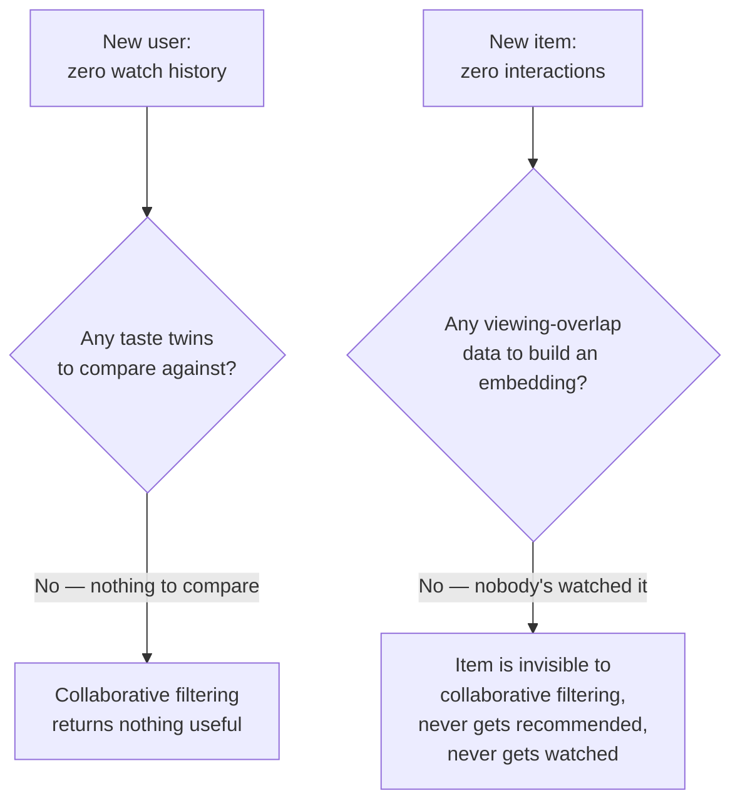

The obvious question: *do we just show new users the generic 'Most Popular' list again — the exact thing we just moved past in Chapter 1?* Not quite — that's the honest fallback for the user side, but it needs a little more than that, and the item side needs something completely different.

**The fix — two separate fallback paths, because they're two separate problems:**
- **New user, no history:** fall back to whatever weaker signal *does* exist — overall popularity, what's trending in their region, plus anything from an onboarding survey ("pick three genres you like"). It's not personalized in the taste-twin sense yet, but it's not a blank screen either, and it's a defined, non-degenerate state.
- **New item, no interactions:** since there's no *behavioral* data to build a taste-twin embedding from, build a **content-based** embedding instead — derived from the item's own metadata (genre, cast, a text description, even a poster image), using a separate model that never needed interaction history in the first place. That gives the new item *some* position in a space comparable to the taste-twin embeddings, so it can actually be discovered by someone whose taste fits it, instead of waiting in the dark for enough views to happen by accident.

Both paths are explicitly temporary — a **bridge**, not a permanent second system. The moment a new user has watched a handful of things, or a new item has picked up some real interactions, both transition back into the normal taste-twin flow.

**How I'd say this in an interview:** "Cold start isn't one problem, it's two: a new *user* has no history to find taste twins from, and a new *item* has no interaction data to build a behavioral embedding from — the fixes are different for each. New users get a popularity-plus-onboarding fallback; new items get a content-derived embedding instead of a behavior-derived one. Both are meant to bridge back into the normal flow as real signal accumulates, never a permanent separate lane."

---

## Chapter 4 — The interview process for five million applicants

Bingewave's catalog and user base explode — this is now a real streaming platform: **5,000,000 titles**, **200,000,000 active users**, and **2,000,000,000** recommendation requests a day across home-screen loads and "up next" surfaces `[illustrative, matching the reference guide's worked numbers]`. That's roughly **23,000 requests/sec on average**, spiking to about **80,000/sec at peak**.

The taste-twin model from Chapter 2 works well conceptually, but here's the naive way to serve it: for every single request, run the rich, taste-twin-aware ranking model over *every item in the catalog*, and take the top 10. Worked number: that's **5,000,000 ranking-model calls per request**. At 80,000 requests/sec at peak, that's **80,000 × 5,000,000 = 400,000,000,000 model-scoring calls per second**. That number isn't "expensive" — it's not achievable on any realistic amount of hardware, by orders and orders of magnitude. Nobody's homepage is loading if this is the design.

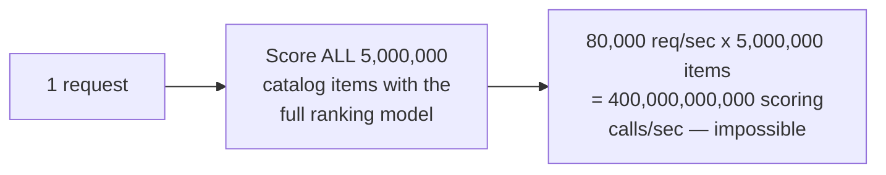

The obvious question: *does every request really need to consider all 5 million items?* No. Almost none of the catalog is remotely relevant to any one person at any one moment — a documentary fan doesn't need the full ranking model wasting cycles scoring 4.9 million action movies they'll never click.

**The fix, and the second analogy for this story:** split the job into two stages, like hiring for a role with thousands of applicants. First, a **shortlist round** — a fast, cheap pass that narrows a huge pool down to a manageable number of plausible candidates without carefully evaluating any of them in depth. Then, a **final interview round** — a slower, much more careful evaluation, but only on the small shortlist, never on the full applicant pool. In recommendation terms: **candidate generation** (the shortlist — fast similarity search over taste-twin embeddings) narrows 5,000,000 items down to roughly **1,000 candidates**, and only then does the expensive **ranking model** (the final interview — rich features, careful scoring) look at those 1,000. This exact two-stage shape — candidate generation, then ranking — is the real, documented architecture YouTube described in its 2016 "Deep Neural Networks for YouTube Recommendations" paper.

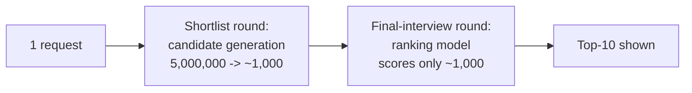

Redo the math: **80,000 req/sec × 1,000 candidates = 80,000,000 ranking calls/sec** — still a big number, but about **5,000x less** than the naive full-catalog approach, and candidate generation itself (a similarity lookup, not a full model score) is far cheaper per call than a full ranking inference. This is the split that actually makes serving tractable.

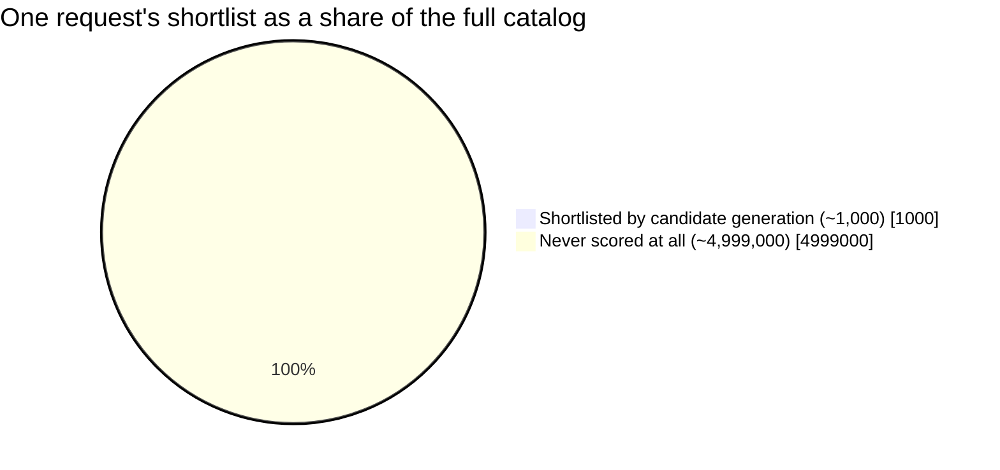

**New problem:** the shortlist round is described as "a fast similarity search." Fast enough to search 5 million taste-twin embeddings, per request, at 80,000 requests a second? Not with a naive exact search — that's the very next wall.

**How I'd say this in an interview:** "Scoring the whole catalog per request is off by many orders of magnitude from any servable throughput — the fix is the same two-stage shape YouTube's own 2016 paper documents: a cheap shortlist round called candidate generation, then an expensive final-interview round called ranking, applied only to the shortlist. It's the only reason personalized ranking at a multi-million-item catalog is possible in a real latency budget at all."

---

## Chapter 5 — The map of taste-space, drawn approximately

The shortlist round needs to answer, per request: "of 5,000,000 items, which ones are nearest, in taste-twin-embedding space, to what this user tends to like?" Each embedding is a vector of **256 numbers** `[illustrative dimensionality, matching the reference guide]`, each a 4-byte float — **1,024 bytes per item**, so the full index of 5,000,000 items is about **5 gigabytes**, comfortably small enough to sit in memory.

The size isn't the problem. The search is. An *exact* nearest-neighbor search — literally comparing the user's embedding against all 5,000,000 item embeddings, one by one, to find the truly closest ones — is itself too slow to run per request at 80,000 requests/sec, even though the data fits in memory. Distance math on millions of 256-dimensional vectors, done exactly and exhaustively, doesn't clear the latency bar.

The obvious question: *does the shortlist really need to be the mathematically exact set of nearest neighbors?* No — for a shortlist round, "close enough, fast" beats "perfect, slow." Missing the single closest item out of 5 million, occasionally, costs almost nothing, because the ranking stage afterward is going to carefully re-evaluate whatever *does* make the shortlist anyway.

**The fix:** **approximate nearest-neighbor (ANN) search** — a class of real, documented indexing techniques (graph-based and quantization-based approaches are the common families) that trade a small, controlled amount of recall for a large speedup. Think of it as a **taste-space map**: instead of walking the whole crowd to find who's standing closest to you, the map is pre-organized into neighborhoods, so you jump straight to the right neighborhood and only look closely at the handful of people already standing there.

```mermaid
quadrantChart
    title Nearest-neighbor search: speed vs. exactness
    x-axis Slower --> Faster
    y-axis Less exact --> More exact
    quadrant-1 Exact and fast (rare, hard to get both)
    quadrant-2 Exact but too slow to serve
    quadrant-3 Fast, some recall traded away
    quadrant-4 Slow, no benefit
    "Exact search over 5M vectors": [0.15, 0.85]
    "Approximate (ANN) taste-space map": [0.8, 0.65]
```

With ANN, the shortlist round comfortably serves within the millisecond-scale budget the whole request needs, at the ~1,000-candidate narrowing from Chapter 4.

**New problem:** the shortlist round is fast, and the final-interview round only sees a small set — but the final-interview round's *model* was trained offline, on a *historical* snapshot of features. Now it's being asked to score things using *live*, right-now features. Those two paths — training-time feature computation and serving-time feature computation — were built by different people at different times. Do they actually compute the same thing?

**How I'd say this in an interview:** "Exact nearest-neighbor search over millions of embeddings doesn't clear a real-time latency budget even though the index itself fits comfortably in memory — the fix is approximate nearest-neighbor search, trading a small, controlled amount of recall for a large speedup, same 'good enough, fast' trade-off you see in a lot of large-scale retrieval problems, just applied to vector search specifically."

---

## Chapter 6 — Two recipe cards that quietly drift apart

The ranking model was trained offline using a feature like "this user's average session length over the last 7 days," computed by one data pipeline crunching historical logs. In production, that *same* feature — "average session length, last 7 days" — gets computed *again*, live, by a different piece of code in the serving path, because it needs a fresh answer right now, not yesterday's batch job's answer.

Here's the actual bug that shows up, three months after the ranking model ships: the offline pipeline computes "last 7 days" using UTC calendar days; the online serving code computes it using the user's local timezone. For a user in a timezone eight hours off from UTC, "last 7 days" quietly means two different date ranges depending on which code path computed it. The model was trained to expect one distribution of values for this feature and is now being fed a subtly different one at serving time — and nothing crashes, nothing errors, nothing pages anyone. Recommendation quality just drifts down, slowly, with no alarm attached to it.

**The analogy:** a **recipe card**. The test kitchen (offline training) writes down a recipe and perfects a dish against it. The live restaurant (online serving) is handed a *different* copy of "the same" recipe, subtly retyped along the way — a pinch becomes a teaspoon somewhere. Every plate that goes out still looks like the dish on the menu. It just doesn't taste quite like what the test kitchen actually tested and approved.

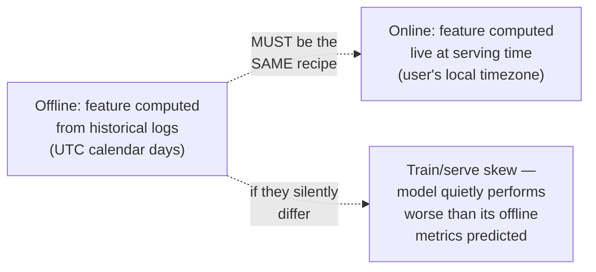

The obvious question: *how do you catch this before it costs months of quietly-worse recommendations?* You don't catch it by staring harder at either pipeline in isolation — you prevent it by never letting two independent implementations of "the same feature" exist in the first place.

**The fix:** a **shared feature store** — one canonical, shared piece of logic that defines exactly how "average session length, last 7 days" is computed, used by *both* the offline training pipeline and the online serving path. One recipe card, one kitchen's worth of copies, never two. This is the identical lesson other ML-serving systems face wherever offline training and online serving both depend on the same computed features — the risk is generic to that shape of system, not unique to recommendations.

**New problem:** the feature store keeps training and serving *consistent* with each other. It says nothing about whether the *ranking objective itself* — optimize for clicks/watches — is actually healthy to optimize for, long-term.

**How I'd say this in an interview:** "Any system that trains offline and serves online has this exact risk — a feature has to be computed identically in both places, or the model silently sees a different distribution of values in production than what it was trained and evaluated against, with nothing throwing an error to say so. The fix is one shared feature store as the single source of truth, never two independently-maintained versions of 'the same' feature."

---

## Chapter 7 — The hallway of mirrors

The ranking model is doing exactly what it was trained to do: maximize predicted engagement. Over several months, an internal review notices something odd: the *diversity* of what an average long-tenured user gets recommended has been steadily shrinking. A user who started out getting a healthy mix of documentaries, dramas, and the occasional comedy is now, eight months later, seeing almost nothing but true-crime documentaries in their top-10 — because they clicked one, watched it, the model updated toward "this person likes true crime," recommended more of it, they clicked more of it (what else was on offer?), and the model updated even further in that direction. Concretely: this user's top-10 genre variety score drops from covering **6 distinct genres** to just **2**, over that period `[illustrative]` — even though nothing about their actual taste changed; the *recommendations* narrowed, and their *visible options* narrowed along with them.

The obvious question: *is this actually a problem, if engagement metrics look fine or even better?* Yes — short-term engagement can look completely healthy while something real is going wrong: the user's world is quietly shrinking, one self-reinforcing click at a time, and they may not even notice it happening to them.

**The fix's name and analogy:** this is a **filter bubble**, and the mechanism behind it is a **hallway of mirrors** — every recommendation reflects back a slightly narrower version of what you already clicked, and the next set of recommendations reflects *that*, over and over, so the reflection keeps getting narrower with each pass, never actually showing you anything outside what you've already shown interest in.

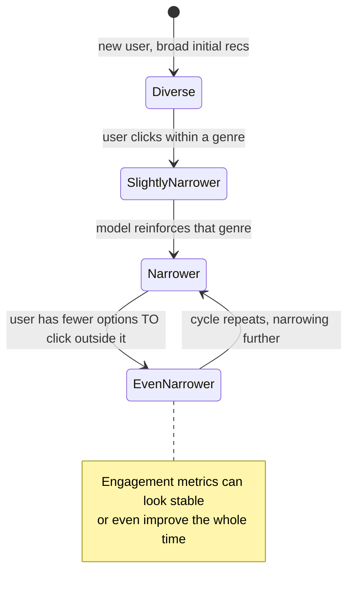

**The fix:** treat diversity as its own **explicit, monitored design element** — not something left to emerge naturally from pure engagement optimization, because left alone, it provably won't. Concretely: deliberately reserve a slice of every shortlist for **exploration** — candidates that are plausible but *not* the model's top predicted picks — and track a genre/category-diversity metric as its own guardrail, separate from the primary click metric.

**New problem:** adding exploration candidates and tracking a diversity guardrail is a *design change* to the ranking pipeline. How does Bingewave actually know whether this change helps, without just trusting a hunch — and more broadly, how does *any* proposed change to the model or ranking logic get proven better before it ships to 200 million people?

**How I'd say this in an interview:** "Pure engagement optimization creates a feedback loop — a filter bubble — where recommendations get narrower over time even while the user's underlying taste hasn't changed, because there are fewer and fewer things left to click outside the bubble the model already built. Engagement metrics alone won't catch this; it has to be treated as its own explicit, monitored design concern, with real exploration budget reserved on purpose."

---

## Chapter 8 — The clinical trial

Someone on the ranking team builds a new candidate-generation strategy and evaluates it the fast way: run it against a historical dataset, check whether it would have predicted the actual clicks better than the current model. It scores better offline. It ships to all 200 million users on a Tuesday.

By Friday, actual engagement is *down*, not up — the opposite of what the offline evaluation predicted. What went wrong? Offline evaluation measures "how well does this model predict what people already did, historically." It cannot measure "how will people behave differently once this *specific change* is what's actually shown to them" — especially once the recommendations themselves start shaping what people watch next, which then becomes the training data for the *next* model, in a loop that offline evaluation, by definition, never gets to observe.

The obvious question: *so how do you actually know if a change helps, before betting the whole user base on it?* The same way medicine answers "does this actually work" — you don't roll it out to everyone and eyeball the aggregate number afterward. You run a **clinical trial**.

**The fix — the analogy carried through this chapter:** randomly split real users into a **control** group (current ranking) and a **treatment** group (the new idea), keep each person in the *same* group for the whole study (**sticky assignment** — a patient doesn't switch trial arms halfway through, or you can't attribute their outcome to either arm cleanly), collect real engagement data tagged by group, and only conclude "treatment works" once the difference clears a **statistical significance** bar, not just "looks a bit higher this week."

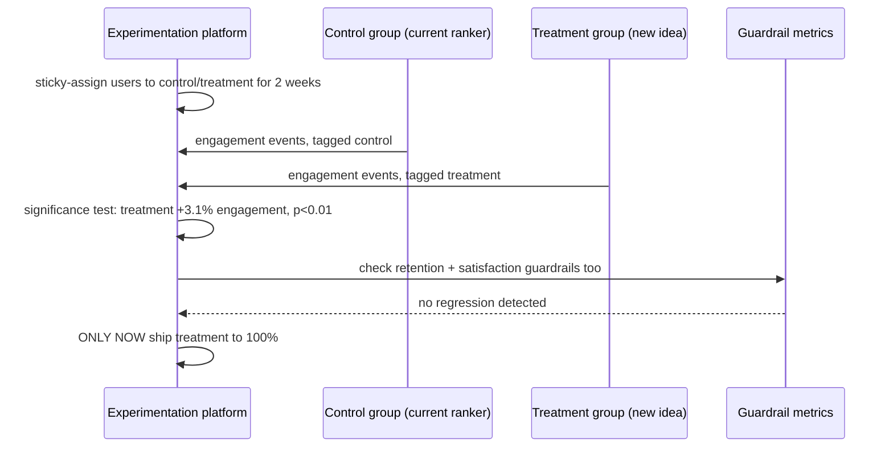

Crucially — echoing Chapter 7 — a win on the *primary* engagement metric isn't enough on its own. The same clinical-trial instinct applies: check the patient isn't harmed even if the main symptom improved. Bingewave's experimentation platform also checks **guardrail metrics** — longer-term satisfaction and retention — because a ranking change *could* increase short-term clicks by surfacing more sensational, addictive-but-ultimately-unsatisfying content, which only a longer-horizon guardrail would catch. A change only ships when it clears *both* the statistical-significance bar *and* the guardrail bar — never either alone.

**New problem:** running trials over 2-week windows with proper statistical rigor is deliberately *slow* — by design, you don't peek early and declare victory on noise. But some personalization signal is genuinely time-sensitive: a user who just finished binge-watching a whole series an hour ago has a very fresh, very strong signal about what they want *next*, and it can't wait for a 2-week trial cycle or even for tomorrow's model retrain.

**How I'd say this in an interview:** "Offline evaluation predicts how well a model matches history — it can't predict how real behavior changes once a specific change actually goes live, especially once recommendations start shaping the training data for the next cycle. The fix is treating the experimentation platform as core infrastructure: sticky per-user assignment, real statistical significance testing, and guardrail metrics beyond the primary target — a change only ships when both bars are cleared, exactly like a real clinical trial needs both efficacy and safety."

---

## Chapter 9 — The note passed immediately, versus the nightly newsletter

Bingewave's model retraining runs nightly — a full batch job that rebuilds taste-twin embeddings and retrains the ranking model on the last day's worth of interactions. That's the right cadence for the *deep* model updates; retraining is expensive, and taste doesn't usually shift meaningfully within a single day.

But here's the concrete gap: a user finishes the final episode of a show at 9:00 PM and opens Bingewave again at 9:15 PM the same night. The nightly retrain hasn't run yet — it runs at 2:00 AM. So at 9:15 PM, the recommendation shown is based on last night's snapshot of this person's taste, with zero awareness that they *just* finished something 15 minutes ago. The single strongest, freshest signal available about what this person wants right now is sitting completely unused for the next several hours.

The obvious question: *do we just retrain the whole model more often — every 15 minutes instead of nightly?* No — that conflates two genuinely different kinds of freshness. Retraining embeddings and the ranking model from scratch is expensive and doesn't need to happen every 15 minutes; taste, in aggregate, doesn't move that fast. What *does* need to be near-instant is folding a single fresh signal — "just finished this show" — into candidate generation for this one person's *next* request, without needing a full model retrain to do it.

**The fix, using the analogy from this chapter's title:** two separate freshness tiers, on purpose. The **note passed immediately** — the user's most recent action gets used right away to adjust *which* items get shortlisted in candidate generation for their very next request, using the existing embeddings, no retraining needed. The **nightly newsletter** — the deeper model retrain, which updates the embeddings and ranking model themselves, still runs on its normal batch cadence, because that part genuinely doesn't need to be instant.

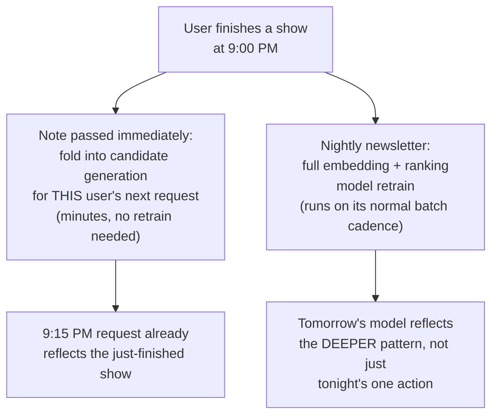

This closes the loop the reference guide's whole system is built around: recommendation quality isn't something computed once and shipped — it's continuously served (fast path, minutes), continuously retrained (batch path, on its own cadence), and continuously *measured* through the experimentation platform from Chapter 8, because taste keeps drifting, the catalog keeps growing, and clicks are always a noisy proxy for what people actually, longer-term, want.

**How I'd say this in an interview:** "There are two different freshness bars here, not one — a user's most recent action should be folded into candidate generation within minutes, without waiting on a full model retrain, while the deeper embedding and ranking model updates can stay on a slower batch cadence, because aggregate taste doesn't shift that fast. Treating both as the same problem either wastes compute retraining constantly, or leaves obviously fresh signal sitting unused for hours."

---

## Two requests, side by side

Before zooming out, it's worth watching two concrete requests hit the *finished* system at once — one from an established user, one from someone who signed up ten minutes ago — because they take genuinely different paths through everything built above.

**An established user, normal flow (Chapters 2, 4, 5, 6, 8 all in play):**

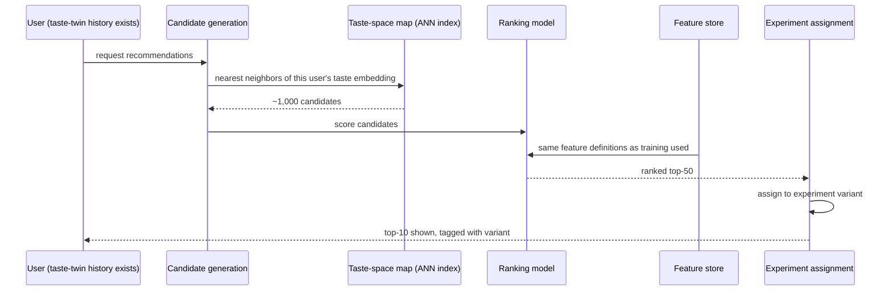

**A brand-new user, cold start (Chapter 3 in play):**

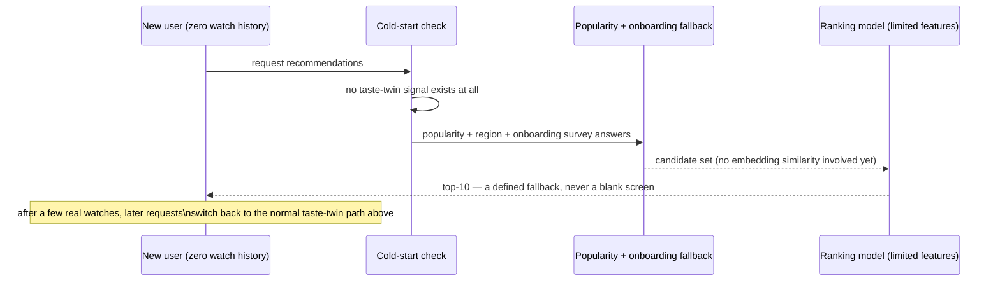

Same system, same code paths available — which branch a request takes depends entirely on whether there's enough history yet to make the taste-twin machinery worth trusting.

---

## Where the story actually lands

```mermaid
flowchart LR
    A["Ch1: one flyer for everyone\n(no personalization)"] -->|"fixes: personalize\nbreaks: rules are shallow"| B["Ch2: taste twins\n(collaborative filtering)"]
    B -->|"fixes: real similarity\nbreaks: needs history to work"| C["Ch3: cold-start fallback\n(user + item paths)"]
    C -->|"fixes: no blank state\nbreaks: full-catalog scoring won't scale"| D["Ch4: shortlist + final interview\n(candidate gen + ranking)"]
    D -->|"fixes: tractable load\nbreaks: exact search too slow"| E["Ch5: taste-space map\n(approximate nearest neighbor)"]
    E -->|"fixes: fast shortlist\nbreaks: train/serve feature drift"| F["Ch6: shared feature store\n(one recipe card)"]
    F -->|"fixes: consistent features\nbreaks: filter bubble narrows taste"| G["Ch7: exploration + diversity guardrail\n(hallway of mirrors, deliberately broken)"]
    G -->|"fixes: bounded narrowing\nbreaks: offline eval alone misleads"| H["Ch8: experimentation platform\n(clinical trial: sticky + significance + guardrails)"]
    H -->|"fixes: proven changes\nbreaks: fresh signal sits unused for hours"| I["Ch9: two freshness tiers\n(note passed immediately + nightly newsletter)"]
```

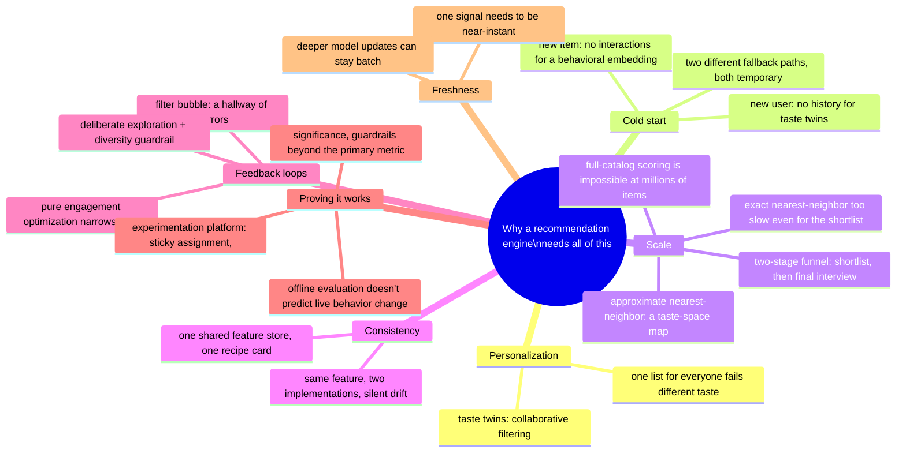

Every real recommendation system you'd design in an interview sits somewhere on this chain. The skill isn't reciting all nine chapters — it's stopping where the stated requirements say to stop. A small catalog with light personalization needs might reasonably stop around Chapter 3. Anything at real streaming-platform scale has to reach Chapter 4 and 5. Anything where the interviewer asks "how do you know it's working" has to reach Chapter 8, unprompted if possible.

---

## Grill me — adversarial follow-ups

**Q1: "Why not just throw more compute at scoring the full catalog instead of building a whole two-stage funnel?"**
Because the gap isn't small — it's five to six orders of magnitude at real catalog size and request volume, not a "buy 2x more servers" gap. No realistic hardware budget closes a 400-billion-calls-a-second problem; the fix has to be architectural, narrowing what gets scored at all, not just scoring faster.

**Q2: "Isn't collaborative filtering just going to recommend whatever's already popular, since popular items have the most overlap data?"**
That's a real risk if you don't correct for it — popular items naturally accumulate more interaction data, which can bias a naive collaborative-filtering model toward recommending them regardless of individual taste fit. Production systems typically correct for this with popularity-normalization in the embedding training itself, and it's part of why the exploration/diversity guardrail from Chapter 7 matters even outside the pure filter-bubble scenario.

**Q3: "Why do new users and new items need genuinely different cold-start fixes — couldn't one fallback cover both?"**
No, because the missing data is different in each case: a new user is missing *their own* history, but the catalog's existing embeddings are all fine — so popularity plus onboarding survey answers works. A new item is missing *the catalog's* history about *it* — there's no behavioral data to build any embedding from at all, so you need a content-derived embedding instead. One fallback covering both would either starve new items of any embedding or waste a real behavioral fallback on users who don't need it.

**Q4: "You said approximate nearest-neighbor search trades away some recall — how do you know that trade-off isn't quietly hurting quality?"**
You measure it directly — recall@k against a held-out exact-search baseline offline, and you also let the experimentation platform from Chapter 8 catch it if it matters in practice, because if a meaningfully-relevant item is getting missed at the shortlist stage often enough to matter, it'll show up as a real engagement or satisfaction difference in an actual online experiment, not just a theoretical concern.

**Q5: "The feature-store fix in Chapter 6 sounds like a lot of engineering investment for a bug that doesn't even throw an error — why prioritize it?"**
Precisely because it doesn't throw an error — that's what makes it dangerous. A crash gets paged immediately; silent train/serve skew just slowly degrades recommendation quality with no alarm attached, and by the time anyone notices via a downstream metric, it could have been running for months. The fix — one shared feature definition for both training and serving — is cheap relative to the cost of not catching this at all.

**Q6: "Isn't reserving exploration budget for diversity just going to hurt your primary engagement metric?"**
In the short term, probably a little, yes — that's the honest trade-off, and it's exactly why it needs to be tracked as its own guardrail metric rather than hoped for as a side effect. The bet is that a slight primary-metric cost now avoids a much larger long-term cost: users whose world has quietly narrowed to the point of dissatisfaction, which is a churn risk that a single-week engagement number won't show you.

**Q7: "Why does the experiment need BOTH statistical significance AND guardrail metrics — isn't a clear engagement win enough?"**
No, because a change can genuinely, significantly increase short-term engagement while making the product worse in a way that only shows up on a different metric — more sensational content driving more clicks but less long-term satisfaction, for instance. Significance tells you the *engagement* difference is real and not noise; the guardrail tells you that real difference isn't coming at the cost of something else you also care about. You need both, because they're answering two different questions.

**Q8: "Doesn't sticky assignment mean a user stuck in a bad treatment group has a worse experience for the whole 2-week trial?"**
Yes, and that's a genuine, real cost of running trials this way — it's why trials are scoped to a defined duration and a defined guardrail check, not run indefinitely, and why a severe regression gets a kill-switch to end the trial early rather than running it to completion regardless. It's a real trade-off between clean, attributable data and individual user experience during the trial window, and good practice is to bound that window as tightly as the statistics allow.

**Q9: "Why can't the 'fold in the latest watch immediately' fix from Chapter 9 just be part of the nightly retrain instead of a separate fast path?"**
Because the two updates serve genuinely different purposes at genuinely different costs. Retraining embeddings and the ranking model is expensive and is capturing a deeper, aggregate pattern that doesn't need to move every 15 minutes; folding one fresh signal into candidate generation for one user's next request is cheap and needs to happen in minutes, not hours — collapsing them into one path either wastes compute retraining constantly or leaves obviously-fresh signal sitting unused.

**Q10: "If someone just says 'design a recommendation engine' cold, where do you actually start?"**
Say the two things that shape almost everything downstream: how big is the catalog and how fast is it growing, and how is quality actually measured. Those answers tell you whether you need the full two-stage funnel with approximate nearest-neighbor search or something simpler, and they tell you whether the experimentation platform needs to be a first-class part of the design from the start or can be sketched lightly. Then walk forward from taste-twin personalization only as far as the stated requirements actually demand — cold-start and the two-stage funnel are close to a given at real scale, but filter-bubble guardrails and near-real-time freshness are things you earn by naming a specific requirement, not defaults you bolt on for their own sake.

---

## Pacing note

**If this is 60 seconds inside a bigger question:** say the taste-twin line — collaborative filtering finds people whose taste matches yours and recommends what they loved — then say "two-stage funnel for scale, cold-start fallback for new users and items, and I'd treat the experimentation platform as core infrastructure, not an afterthought, if you want to go there." That's the whole shape in one breath.

**If this is the whole 15-20 minute focus:** walk the chapters in order — why personalization matters at all, collaborative filtering, cold start for both users and items, the two-stage funnel and why full-catalog scoring is impossible at scale, approximate nearest-neighbor search, feature-store consistency, the filter-bubble risk, the experimentation platform, then freshness if it comes up. Don't walk all nine unprompted — follow wherever the interviewer's questions actually point, and use the skipped chapters as your "if I had more time" closer.

---

## Active recall — no answers, test yourself cold

1. What's the one-sentence reason a recommendation engine needs continuous measurement, not a one-time build?
2. Why did rule-based genre matching cap out at a lower click-through rate than collaborative filtering?
3. Why are "new user" cold-start and "new item" cold-start two genuinely different problems, needing two different fixes?
4. What's the actual number that makes full-catalog scoring per request impossible at real scale, and what two-stage fix cuts it down?
5. Why is exact nearest-neighbor search too slow even after the embedding index itself comfortably fits in memory?
6. What specific bug does a shared feature store prevent that a code review wouldn't necessarily catch?
7. Walk through exactly how a filter bubble forms with no bug or crash involved anywhere in the pipeline.
8. Why does an experiment need to clear both a statistical-significance bar and a guardrail-metric bar, not just one?
9. Why is sticky (not per-request) assignment necessary for an experiment's data to be interpretable at all?
10. Why can't the "fold in the user's latest action" fix just wait for the next nightly retrain?

*Spaced repetition: test this list today, again in 2-3 days, again in a week.*

---

## Cheat sheet — one line per stop on the story

- **One-size-fits-all homepage**: a single global ranking delights the average user and frustrates everyone whose taste differs from it — the whole reason personalization exists.
- **Collaborative filtering (taste twins)**: find people whose overall pattern of likes matches yours, recommend what they loved — captures similarity no human-written rule would ever anticipate, the technique behind the 2006 Netflix Prize.
- **Cold start**: two separate problems — a new user has no history for taste-twin matching (fallback: popularity + onboarding survey), a new item has no interactions for a behavioral embedding (fallback: content-derived embedding) — both meant to bridge back to normal personalization, never a permanent separate path.
- **Two-stage funnel (candidate generation + ranking)**: a cheap shortlist round narrows millions of items to about a thousand, then an expensive ranking round only evaluates the shortlist — the only thing that makes scoring tractable at real catalog scale.
- **Approximate nearest-neighbor search**: even an in-memory embedding index is too slow to search exactly at real request volume — trade a small amount of recall for a large speedup, same "good enough, fast" trade-off as elsewhere in large-scale retrieval.
- **Shared feature store**: one canonical definition for every feature, used identically by offline training and online serving — prevents a silent, no-error quality drift called train/serve skew.
- **Filter bubble**: pure engagement optimization narrows what a user sees over time even with no change in their real taste — fix it with deliberate exploration budget and a diversity metric tracked as its own guardrail, not hoped for as a side effect.
- **Experimentation platform**: offline evaluation can't predict how live behavior changes once a change actually ships — real experiments need sticky per-user assignment, genuine statistical significance testing, and guardrail metrics beyond the primary target; a change ships only when both the significance bar and the guardrail bar are cleared.
- **Two freshness tiers**: a user's most recent action should fold into candidate generation within minutes without a full retrain; the deeper embedding and ranking model updates can stay on a slower batch cadence, because aggregate taste doesn't move that fast.
- **The meta-lesson**: every fix in this story buys one property (personalization, cold-start coverage, tractable scale, fast approximate search, feature consistency, bounded filter-bubble risk, proof-of-improvement, or freshness) by spending something else — say the trade in the same sentence you propose the fix.
