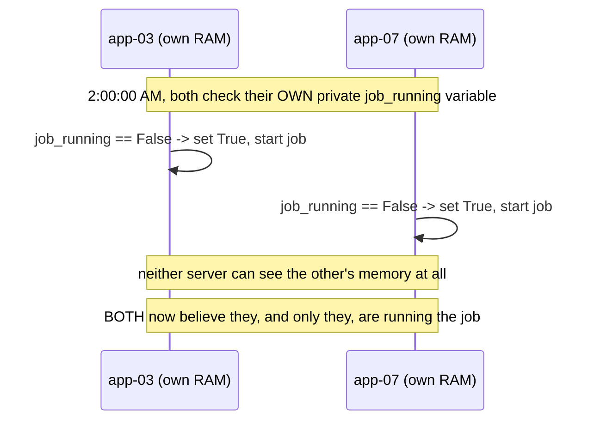
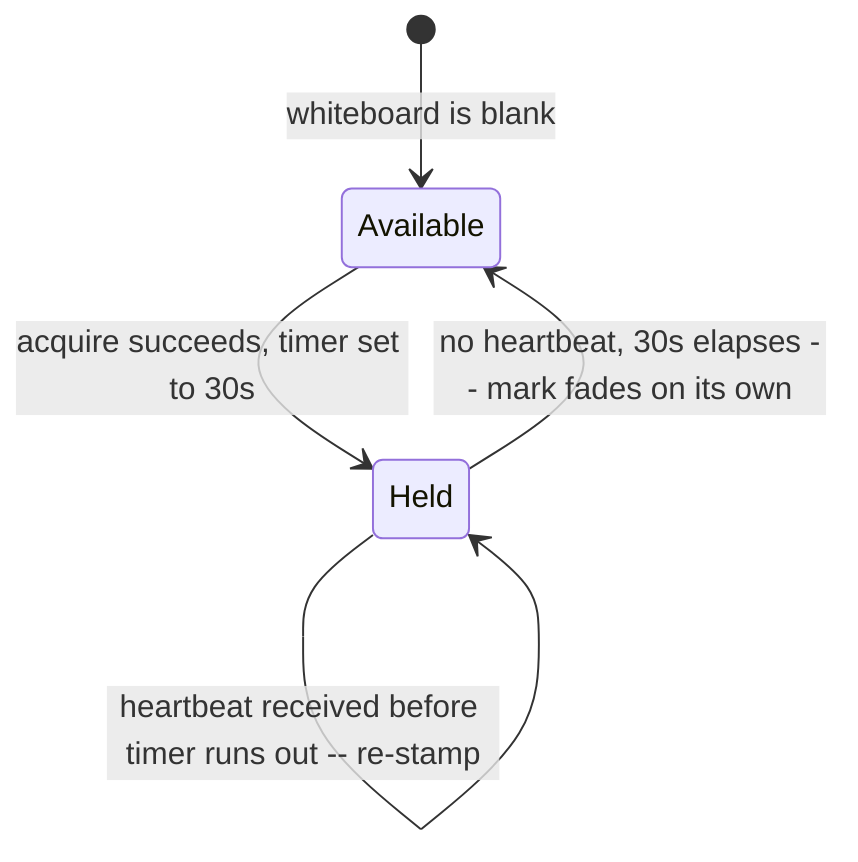
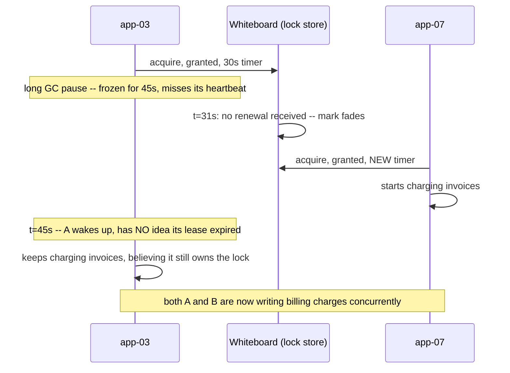
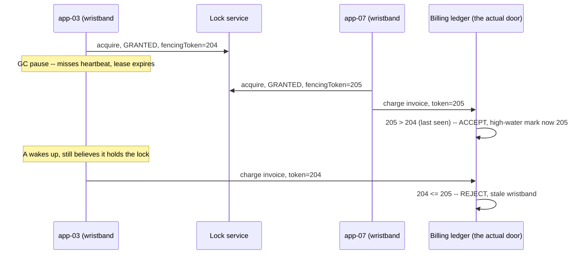
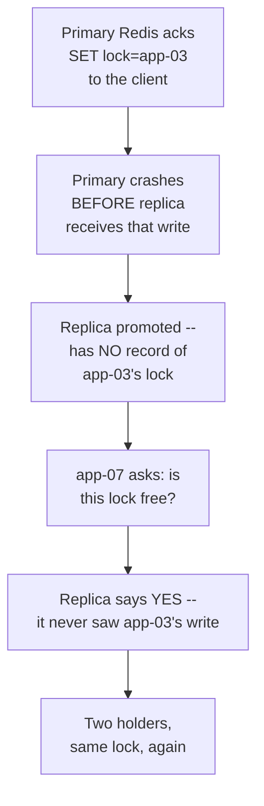
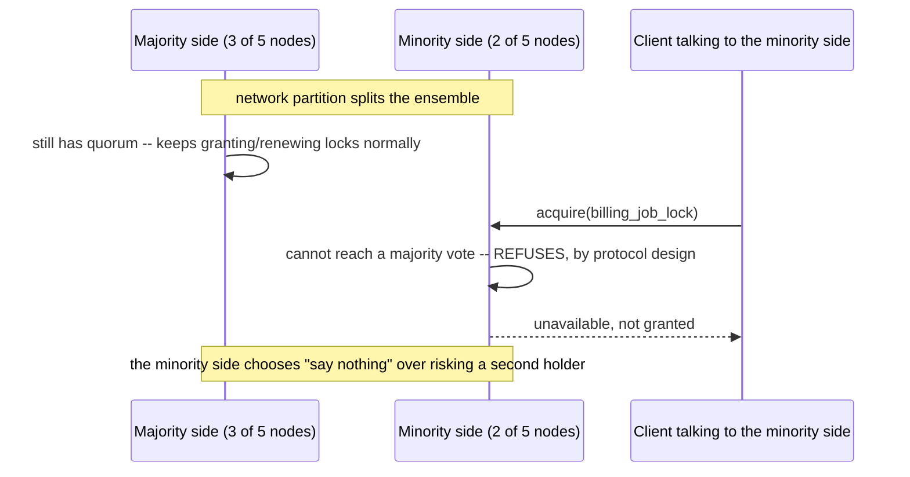
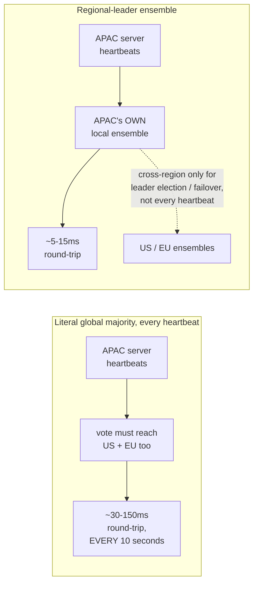
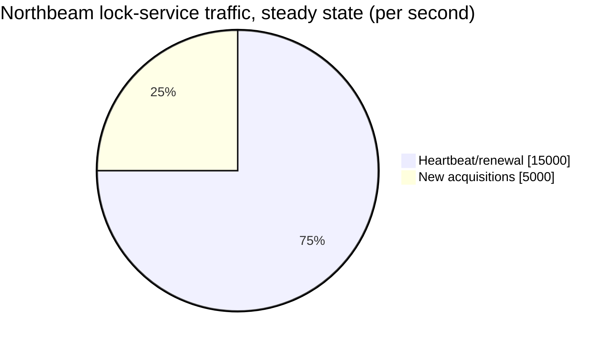

# Design a Global Distributed Lock Service — The Story (narrative edition)

> **What this file is.** The reference file, `61-Design-a-Global-Distributed-Lock-Service-FAANG-Guide.md`,
> is the one to recite from — requirements, API shapes, every trade-off table, the master cheat
> sheet. This file is a second way in: the same material as one continuous story, told in plain
> language. Engineers at a company keep hitting a wall, patch it, and the patch itself creates the
> next wall — until we land on the exact same design the reference file documents. The company,
> **Northbeam** (a B2B invoicing platform), is fictional. But every wall it hits, and every fix it
> reaches for, is something a real, named system actually does: Google's Chubby lock service
> (Burrows, 2006), Apache ZooKeeper, etcd's lease-based locks (the mechanism Kubernetes itself
> leans on for leader election), and Martin Kleppmann's well-documented 2016 critique of Redis's
> Redlock algorithm. I'll say clearly, every time, whether something is a documented fact or just a
> reasonable, labeled guess.

**The trigger phrase** for this whole topic: *"how do we make sure only ONE of our servers runs
this job, even though we deliberately run several copies for redundancy."* Keep one sentence in
your head as you read: **a distributed lock's whole job is to let many machines agree, without
ever disagreeing, on who is allowed to touch a piece of shared work right now** — and, as you'll
see, agreeing on "who's allowed" turns out to be only half the problem; stopping the loser from
acting anyway, once it doesn't realize it lost, is the other half. Everything below is just this
one idea, getting harder in small, honest steps.

---

## Chapter 1 — The lock that only lived in one server's head

Northbeam runs a "close the books" job every night at 2:00 AM — it reconciles the day's invoices
and charges anyone who's due. To survive any one server being down, Northbeam runs this job on a
fleet of 6 identical app servers, and lets *whichever one wakes up first* claim the job. The code,
on every server, looks like this: check a variable called `job_running`; if it's `False`, set it to
`True` and start the job.

The obvious bug, the moment you say `job_running` out loud: it's a plain in-memory boolean, private
to *that one process*. At 2:00:00.100 AM, both `app-03` and `app-07` check their own local
`job_running`, both see `False` — because each server has never heard of the other's variable at
all — and both set it to `True` and start running. Real number: both servers independently pull the
day's ~38,000 unbilled invoices and both start charging them `[illustrative — the exact invoice
count is a stand-in, but "two redundant workers both grab an in-memory flag and both run" is a
real, common bug shape]`. By the time anyone notices, **roughly 1,900 customers have been charged
twice**.



The obvious next question: *why didn't the flag stop the second server?* Because there was never
actually one flag — there were six, one sitting privately inside each server's own memory, and none
of them could see any of the others. A "lock" that only one process can see isn't a lock at all;
it's just that process's opinion.

**The fix, and the analogy for the rest of this story:** put the "is it taken" flag somewhere
*every* server can see and agree on — one shared row in a database, or a key in a shared store like
Redis, set with an atomic "set if not already set" operation. Think of it as a **shared whiteboard**
sitting in a hallway everyone walks past, instead of six private sticky notes taped inside six
different offices. Before anyone starts the job, they walk up to the *same* whiteboard and check it.

**New problem, one week later:** `app-03` grabs the whiteboard lock, writes "TAKEN," and starts the
job — then gets OOM-killed three minutes in, mid-run, before it ever erases the mark. Nobody else
is watching the clock; the whiteboard has no concept of time at all. Every other server sees
"TAKEN" and politely backs off, forever, because as far as the whiteboard is concerned, whoever
wrote that mark still owns it. Real number: **the nightly billing job doesn't run for the next two
nights (48 hours)** until an engineer notices and manually erases the key by hand.

**How I'd say this in an interview:** "A lock that lives inside one process's own memory isn't
shared at all — that's the bug in step one. Moving it to a shared external store like Redis fixes
'nobody agrees,' but a plain 'set if not exists' with no expiry just trades that bug for a worse
one — a crashed holder locks the resource forever, because nothing ever tells the whiteboard the
holder is gone."

---

## Chapter 2 — The whiteboard mark that fades on its own

The fix: give the whiteboard mark a **lease** — a built-in expiry, a timer sticker that fades on
its own unless the holder keeps re-stamping it. In Redis terms, this is `SET key value NX EX 30` —
grab the lock only if nobody has it (`NX`), and auto-expire it in 30 seconds (`EX 30`) if nobody
renews. The holder is expected to **heartbeat** — re-stamp the timer — well before it expires, say
every 10 seconds (roughly a third of the TTL, so a missed heartbeat or two doesn't cause a false
reclaim).



This fixes "locked forever" completely — a crashed holder's mark now fades within 30 seconds, no
human required. But six weeks later, a genuinely nastier bug shows up, and it happens with **no
crash at all**. `app-03` hits a long garbage-collection pause mid-job — a real, well-documented
category of failure in JVM-, Go-, and even Python-based services under memory pressure — and
freezes for **45 seconds**. Its 30-second lease has nobody renewing it, so at t=31s the mark fades,
and `app-07` grabs the now-free lock and starts the *same* job from scratch. At t=45s, `app-03`
wakes back up — completely unaware its lease ever expired — and keeps writing invoice charges,
believing it's still the exclusive holder.



Real number this time: **1,200 invoices get double-charged** `[illustrative]` — and this run has no
crash, no error log, no alert. Everything "worked" from each server's own point of view.

The obvious next question: *didn't the lease/heartbeat fix already solve the "dead holder" case —
so what's still broken?* The lease mechanism correctly detects "nobody's renewing" and correctly
reclaims the lock. What it can't do is *tell* the original holder it lost the lock — there's no
network connection open, no interrupt, nothing that reaches into `app-03`'s paused process and
says "by the way, you're not the holder anymore." A lock service can revoke your permission; it
cannot force you to stop acting on it.

**How I'd say this in an interview:** "Lease and heartbeat fix 'locked forever after a crash,' but
they create a subtler gap: a process that merely *pauses* long enough — GC pause, network stall,
being descheduled — can lose its lease without ever finding out, wake up, and keep acting as if it
still holds the lock. That's the single most-tested failure mode in this whole topic, and it's
worth naming unprompted."

---

## Chapter 3 — The wristband with a number that only ever goes up

The fix: stop trying to make the *lock service* stop `app-03` — it can't, for the reason above.
Instead, make every operation against the thing actually being protected — Northbeam's billing
ledger — carry proof of *which acquisition* it came from, and have the ledger itself refuse
anything stale. This is the **fencing token**: every successful acquisition gets a brand-new,
strictly increasing number, and every write to the ledger must carry it.

**The analogy:** think of a wristband at the door of a venue, stamped with a rising serial number
each time a new one is issued. The person checking wristbands *at the actual door to the ledger
room* — not the person handing wristbands out — only lets in whoever's wristband number is the
current one or higher. An old wristband, even worn by someone who genuinely had it first, doesn't
open that door once a newer one has been issued.



This is the exact scenario from Chapter 2, replayed — except this time, `app-07`'s charge is
preserved uncorrupted, and `app-03`'s stale charge is rejected outright. No double charge.

**The detail worth saying carefully, because it's the whole point:** the check has to live in the
**ledger**, not the lock service. The lock service only ever knows "who currently holds the lock" —
it has zero visibility into, and zero control over, what a client actually does against the
ledger. Only the ledger itself, the resource being protected, can refuse a specific write. If the
ledger's code path forgets to check the token — or some internal tool bypasses the API and writes
directly — fencing buys nothing at all. It's a contract the resource has to actively honor, not a
force field the lock service can project onto it.

**New problem, one layer down:** fencing tokens solve the client-vs-client race completely — *as
long as the wristband numbers themselves are trustworthy.* But right now Northbeam's "wristband
booth" is a single Redis box. What happens when the booth itself has a bad night?

**How I'd say this in an interview:** "A lock without a fencing token doesn't actually guarantee
mutual exclusion — the paused-then-resumed client is a real failure mode, and fencing tokens,
checked by the resource itself, are what close it. I'd say this unprompted; it's the single most-
tested insight in the whole topic."

---

## Chapter 4 — The booth itself has a bad night

Northbeam's whiteboard-plus-wristband setup so far is one Redis instance. One night, that box's
disk starts throwing errors right before the 2:00 AM job. To avoid this being a single point of
failure, an engineer adds a **replica** with automatic failover — if the primary dies, the replica
takes over.

Here's the new bug, and it's a real, documented one at the industry level, not a Northbeam
invention. Redis replication is asynchronous by default: the primary can acknowledge a `SET` to
the client *before* the replica has actually received it. If the primary crashes in that exact
gap, the replica gets promoted — without that key. A second client, asking the now-promoted replica
for the *same* lock that was supposedly already held, gets told **yes, it's free**, and grabs it.
Two holders, same lock, again — not because of a paused process this time, but because the lock
store itself lost a write during failover.

This is precisely the shape of Martin Kleppmann's well-known 2016 critique of Redis's **Redlock**
algorithm (Redis's own proposed answer to "run this across several Redis instances for safety") —
his argument, publicly debated with Redis's creator at the time, is that a multi-instance heuristic
like Redlock makes fragile assumptions about clocks and pauses and doesn't actually deliver the
safety guarantee a correctness-critical lock needs; it's fine for reducing duplicate *effort*, not
for guaranteeing exclusivity. Northbeam's failover bug is a live instance of exactly the class of
problem that critique is about.



The obvious next question: *how do you actually make a lock store safe across node failures, then?*
Not with an ad hoc multi-box heuristic — with **consensus**: a cluster where a write is only ever
considered "real" once a strict **majority** of nodes have it durably recorded, and everyone in the
cluster agrees on the same sequence of events even if some members are temporarily unreachable.

**The fix, and its own analogy — the Parliament Rule:** nothing is official policy unless a
majority of members vote for it and that vote is written into the permanent record. A single
member's opinion — even the Speaker's — means nothing on its own; only a majority, durably
recorded, counts as truth.

This is exactly what Google's **Chubby** lock service does — described in Mike Burrows' 2006 OSDI
paper, built on Paxos, and used inside Google for jobs like GFS master election. It's exactly what
**Apache ZooKeeper** does for the many production systems that use it for distributed locking, via
its own consensus protocol (ZAB). And it's exactly what **etcd** does, via Raft — the same
lease-based lock mechanism Kubernetes itself relies on for leader election among its own
controllers. Northbeam replaces its single Redis box with a small consensus-backed ensemble (an
etcd- or ZooKeeper-style cluster) as the lock store itself.

**New problem:** a Parliament that requires a majority vote for everything is safe — but what
happens the moment the Parliament can't physically reach a majority, because part of it just got
cut off from the rest?

**How I'd say this in an interview:** "The lock store itself has to be highly available AND
strongly consistent, and a single instance — or a multi-instance heuristic without real consensus —
doesn't get you there; Kleppmann's Redlock critique is the well-known, documented version of this
exact gap. The real fix is a consensus-backed service — Chubby, ZooKeeper, or etcd — where nothing
is true until a majority durably agrees on it."

---

## Chapter 5 — The half of Parliament that correctly refuses to vote

One afternoon, a network issue splits Northbeam's 5-node lock ensemble into two groups: 3 nodes on
one side, 2 on the other. The obvious worry: does each side keep granting locks independently,
leading straight back to two holders of the same lock? No — and this is the entire point of
building on consensus instead of an ad hoc setup. The 3-node side still has a majority (3 of 5), so
it keeps working exactly as before. The 2-node side does **not** have a majority — it cannot get a
quorum vote to pass, by protocol design — so it simply **refuses** to grant or renew any locks at
all, for anyone who happens to be talking to it.



Real number, observed later in the incident review: the partition lasted **8 minutes**
`[illustrative]`. Every client that happened to be talking to the minority side simply got
"unavailable" responses for those 8 minutes — annoying, but zero double-grants happened, because
the minority side never once said yes to anything during the split. This is the exact same
principle behind why a Kubernetes controller that can't renew its etcd-backed leader lease steps
down rather than risk two active controllers running at once — a real, documented behavior of that
system.

This is a deliberate trade-off, not an accident: Northbeam's lock service would rather be
temporarily unavailable to some clients than risk being wrong to any of them. Safety wins over
availability here, on purpose.

**How I'd say this in an interview:** "A correctly-implemented consensus-based lock service refuses
to grant new locks from a minority partition — it can't reach a majority, so by protocol design it
just says 'unavailable' instead of guessing. That's a real, intentional CAP-theorem trade-off: this
system favors correctness over availability whenever the two are in tension, and I'd say that
explicitly, not treat the unavailability as a bug."

---

## Chapter 6 — Parliament, but the members are on different continents

Northbeam expands to three regions — US, EU, and APAC — each running its own billing servers for
latency and data-residency reasons. The obvious next question from the interviewer-equivalent in
the room: *should the SAME 5-node consensus ensemble now require a majority vote spanning all
three regions, for every single lock operation?*

Here's why that's a bad default. A consensus round-trip *within* one region is fast — commonly
single-digit to low-teens milliseconds. A round-trip that has to span regions — say, US to APAC —
is commonly **30-150ms**, roughly an order of magnitude slower, simply because of the physical
distance the network has to cross. And remember from Chapter 2: heartbeat/renewal traffic, not
one-time acquisition, is the *dominant*, constant load on a lock service — every currently-held
lock needs to re-stamp its timer sticker every ~10 seconds, forever, for as long as it's held. If
every one of those heartbeats has to pay a cross-continent round-trip, Northbeam's entire billing
pipeline in every region gets an order-of-magnitude latency tax, permanently, on its single most
frequent operation.



**The fix:** each region runs its **own** consensus ensemble, handling locks for work scoped to
that region — APAC's billing job is locked by APAC's own local Parliament, EU's by EU's. Cross-
region coordination is reserved for the rare cases that are genuinely global (say, a single
company-wide config lock) or for leader election/failover — not paid on every routine heartbeat.

The catch, worth stating out loud rather than glossing over: this means Northbeam now has to
explicitly decide, *for every lock*, whether it needs to be exclusive across the whole company or
just within one region. That's a real design decision with real consequences if gotten wrong — get
it wrong toward "regional" for something that actually needed to be global, and you're right back
to two regions both running what should have been one exclusive job.

**How I'd say this in an interview:** "Don't default to a literal global quorum for every lock
operation at planet scale — cross-region round-trips are roughly an order of magnitude slower than
staying within one region, and heartbeat traffic pays that cost constantly, not just once. A
regional-leader architecture, with cross-region coordination reserved for genuinely global
resources or failover, is the realistic default — but it means explicitly classifying which locks
actually need global scope."

---

## Chapter 7 — Tuning the timer sticker, and what it can and can't break

With regional ensembles live, Northbeam's on-call engineer wants to know one more thing: what
should the lease TTL actually *be*? Worked numbers, in the same shape as the capacity math earlier
in this course: if lock acquisitions across all regions run at **5,000/sec** and the average job
holds its lock for **30 seconds**, then concurrently-held locks at any moment are roughly
`5,000 × 30 ≈ 150,000`. At a heartbeat interval of ~10 seconds (a third of the 30s TTL, the same
convention from Chapter 2), that's `150,000 / 10 ≈ 15,000` heartbeats/sec — **three times** the raw
acquisition rate `[illustrative, but the ratio itself — heartbeats dominating acquisitions — is the
real, worth-remembering shape]`.



So: shorter TTL or longer? Here's the actual trade-off, and it's worth being precise about which
half of the system it touches. A **too-short** TTL means a perfectly healthy holder that hits a
brief, harmless network hiccup gets its timer sticker fade prematurely — a **false reclaim** — and
loses a lock it was still legitimately using. A **too-long** TTL means a genuinely dead holder's
lock takes correspondingly longer to free up for anyone else. Both of these are real costs. But
neither of them is a **safety** problem — and this is the payoff for everything built in Chapters
3 through 6: because the billing ledger independently checks fencing tokens no matter what the TTL
is doing, a badly-tuned TTL can only ever make the system *slower to reclaim* or *falsely twitchy* —
it can never let two holders corrupt the ledger at the same time. That specific guarantee was
already locked down back in Chapter 3, regardless of what number gets picked here.

**How I'd say this in an interview:** "Lease TTL tuning is an availability trade-off — too short
causes false reclaims, too long delays reclaiming a genuinely dead holder — but it's not a safety
lever. Fencing tokens already guarantee safety independently of whatever TTL you pick, which is
exactly why it's fine to keep iterating on the TTL number without re-opening the correctness
question every time."

---

## Where the story actually lands

```mermaid
flowchart LR
    A["Ch1: in-memory flag\n(each server's own opinion)"] -->|"fixes: shared visibility\nbreaks: no expiry, stuck forever"| B["Ch2: whiteboard + lease/TTL"]
    B -->|"fixes: self-healing on crash\nbreaks: paused holder wakes up unaware"| C["Ch3: fencing tokens"]
    C -->|"fixes: resource rejects stale writers\nbreaks: the booth itself can fail unsafely"| D["Ch4: consensus-backed lock store"]
    D -->|"fixes: durable majority agreement\nbreaks: what if the majority splits?"| E["Ch5: minority correctly refuses"]
    E -->|"fixes: safe under partition\nbreaks: global quorum is slow at planet scale"| F["Ch6: regional-leader ensembles"]
    F -->|"fixes: fast common case\nbreaks: what TTL number, and does it matter?"| G["Ch7: TTL is availability, not safety"]
```



```mermaid
mindmap
  root((Why a distributed lock\nservice needs all of this))
    Shared visibility
      in-memory flag = one server's private opinion
      shared external store = everyone looks at the same whiteboard
    Self-healing
      no expiry = crashed holder locks it forever
      lease + heartbeat = mark fades on its own
    The gap lease alone can't close
      paused-then-resumed holder doesn't know it lost the lock
      fencing token, checked by the RESOURCE, closes it
    The lock store's own safety
      single instance / ad hoc replication = can lose writes on failover
      real consensus (majority durably agrees) = Chubby, ZooKeeper, etcd
    Partition behavior
      minority side can't reach a majority
      correctly refuses instead of guessing -- safety over availability
    Going global
      literal global quorum on every heartbeat = order-of-magnitude latency tax
      regional-leader ensembles = fast common case, explicit scope decisions
    Tuning knobs vs safety
      TTL tuning only affects availability
      fencing tokens already guarantee safety, independent of TTL
```

Every real distributed lock service you'll design in an interview sits *somewhere* on this chain.
The skill isn't reciting all seven chapters — it's stopping where the stated requirements say to
stop. A single-region, low-stakes job scheduler might reasonably stop around Chapter 3. Anything
described as "planet-scale," or where the interviewer explicitly says "what if the holder pauses
and comes back," has to reach fencing tokens and the consensus-store chapters — those are the two
places depth is actually being graded.

---

## Grill me — adversarial follow-ups

**Q1: "Why not just make the in-memory flag from Chapter 1 a static variable shared via some
in-process singleton instead of building a whole external lock store?"**
Because "shared" only means something within one process — the moment you run more than one
server (which Northbeam does, on purpose, for redundancy), a static variable in server A is still
invisible to server B. The fix has to live somewhere every participating machine can actually see,
which by definition means an external, network-reachable store.

**Q2: "Isn't the fencing token just a fancier version of the lease TTL — why do you need both?"**
No — they solve different halves of the problem. The lease/TTL is about *detecting* that a holder
might be gone and letting someone else proceed; the fencing token is about *protecting the
resource* even when that detection is wrong, i.e., when the "gone" holder wakes back up. You need
the lease to make progress at all, and the token to stay safe when the lease's guess turns out to
be premature.

**Q3: "You said the fencing check has to live in the resource, not the lock service — why can't the
lock service just also talk to the resource and block the stale write itself?"**
Because the lock service has no idea what operations a client is about to perform against the
resource, and no way to intercept them — it only knows "who currently holds the lock," not "what
that holder is doing with it." Only the resource sees the actual write coming in, so only the
resource can refuse it.

**Q4: "The Redlock critique you mentioned — isn't that just Kleppmann being overly theoretical?
Does it actually matter in practice?"**
It matters exactly when a lock is protecting something correctness-critical, like Northbeam's
billing ledger — the critique's core point is that clock and pause assumptions Redlock leans on
aren't reliable enough for that use case, even if they're fine for a "reduce duplicate work, but a
duplicate is cheap and harmless" use case. The right response is knowing which bucket your lock's
use case falls into, not dismissing the critique outright.

**Q5: "Why does a majority vote matter — why not just have the lock store's leader unilaterally
decide?"**
Because a single node's opinion doesn't survive that node failing or getting partitioned away from
everyone else — you'd be right back to Chapter 4's failover bug, where a promoted node has no idea
what the old leader actually wrote. A majority guarantees any two majorities always overlap by at
least one node, so whichever node takes over provably has seen every previously-acknowledged
write.

**Q6: "During the partition in Chapter 5, the minority side refused everything — isn't that a
pretty big availability hit for something that might resolve itself in seconds?"**
It is a real cost, and it's the honest trade-off this whole system makes on purpose — some
legitimate requests get refused or delayed during a partition that a more availability-leaning
system might have served, incorrectly. For a system whose entire job is a safety guarantee, that's
the right trade, and it's worth saying explicitly rather than treating the unavailability as an
unqualified downside.

**Q7: "If Northbeam's regions each run their own ensemble, what actually stops two regions from
both grabbing what should have been ONE global lock?"**
Only an explicit design decision — deciding, per resource, that it needs global rather than
regional scope, and routing that specific lock's traffic through the cross-region coordination path
instead of a purely regional one. That's a real classification problem, not something that solves
itself automatically just by having regional ensembles.

**Q8: "Given everything here, if someone just says 'design a distributed lock service' cold, where
do you actually start?"**
Say the two things that decide almost everything downstream: does the resource being protected
allow the lock holder to check a fencing token before it's modified, and does this need to work
across regions or just one. Fencing tokens and a consensus-backed store are close to a given for
anything correctness-critical; regional-leader architecture and cross-region scope decisions are
things you earn by naming a real multi-region requirement, not defaults you reach for unprompted.

**Q9: "What's the one thing you'd say unprompted, even if nobody asks a single follow-up
question?"**
That a lock by itself doesn't guarantee mutual exclusion — a lock plus a fencing token, checked by
the protected resource, does. That's the single highest-signal sentence in this entire topic, and
saying it before being asked is what separates a "use Redis SETNX" answer from a staff-level one.

**Q10: "Your lease-tuning answer in Chapter 7 says TTL doesn't affect safety — could you ever be
wrong about that?"**
Only if the fencing check itself is missing or buggy somewhere in the resource's code — the
guarantee depends entirely on that check existing and being correct, not on the lock service or
the TTL. That's exactly why Chapter 3's caveat matters: fencing is a contract the resource has to
actively honor, and if it doesn't, the TTL discussion in Chapter 7 doesn't hold up either.

---

## Cheat sheet — one line per stop on the story

- **In-memory flag**: a "lock" that only one process can see is just that process's opinion —
  move it to a shared external store everyone can check.
- **Shared store, no expiry**: fixes "nobody agrees," but a crashed holder now locks the resource
  forever — needs a lease with automatic expiry.
- **Lease + heartbeat**: self-heals after a crash, but creates a subtler gap — a *paused* (not
  crashed) holder can lose its lease without knowing, wake up, and keep acting as the holder.
- **Fencing token**: a strictly increasing number per acquisition, validated by the *resource*, not
  the lock service — this is what actually stops the paused-then-resumed holder from corrupting
  shared state, and it's the single most-tested idea in this topic.
- **Lock store's own safety**: a single instance, or an ad hoc multi-instance heuristic (Redlock),
  can lose writes on failover — Kleppmann's 2016 critique is the documented version of this exact
  gap; real consensus (Chubby, ZooKeeper, etcd) is the fix.
- **Partition behavior**: a minority partition can't reach a majority vote, so it correctly
  refuses to grant or renew locks — safety wins over availability, by design.
- **Cross-region cost**: a literal global quorum on every heartbeat pays an order-of-magnitude
  latency tax, since heartbeat traffic — not acquisition traffic — dominates steady-state load; a
  regional-leader architecture is the realistic default at planet scale.
- **TTL tuning**: an availability trade-off (false reclaims vs. slow-to-reclaim-a-dead-holder), not
  a safety mechanism — fencing tokens already guarantee safety no matter what TTL is chosen.
- **The meta-lesson**: every fix in this story buys one property (shared visibility, self-healing,
  resource-side safety, lock-store durability, partition safety, low-latency common case, or a
  tunable availability knob) by spending something else — say the trade in the same sentence you
  propose the fix.
