# Design an API Gateway — The Story (narrative edition)

> **What this file is.** The reference file, `64-Design-an-API-Gateway-FAANG-Guide.md`, is the one
> to recite from — requirements, API shapes, every trade-off table, the master cheat sheet. This
> file is a second way in: the same material as one continuous story, told in plain language.
> Engineers at a company keep hitting a wall, patch it, and the patch itself creates the next wall
> — until we land on exactly the pipeline the reference file documents: TLS → auth → rate limit →
> route → circuit breaker, all local, fronted by a fleet, config pulled from one versioned source.
> The company, **Loopline** (a ride-hailing and delivery app), is fictional. But every wall it hits
> is something a real, named system actually hit: the well-documented "N clients calling M
> microservices directly" problem, Steve Yegge's leaked 2011 Amazon platform memo (Bezos's mandate
> that every team expose functionality only through service interfaces — real, documented, widely
> discussed), Netflix's Zuul gateway (their own "front door" terminology, documented on Netflix's
> engineering blog), Netflix's Hystrix circuit breaker (documented, since sunset in favor of
> resilience4j, but the pattern it popularized is still exactly what production gateways run today),
> and Kong / AWS API Gateway's plugin-and-authorizer pipeline model (documented in their own docs).
> I'll say clearly, every time, whether something is a documented fact or just a reasonable guess.

**The trigger phrases** for this whole topic: *"design the front door for our microservices,"*
*"how do we stop every service from reimplementing its own auth,"* or *"what happens if the
gateway itself goes down."* Keep one sentence in your head as you read: **an API gateway's whole
job is to be the one shared front door every request passes through, so authentication, rate
limiting, routing, and failure handling get done once, correctly, and in the right order — instead
of forty different services each doing it slightly differently — and because it's now in front of
literally everything, its own speed and its own uptime become everyone's speed and everyone's
uptime.** Nothing in this story is a new algorithm. It's the same handful of ideas you already
know — auth, rate limiting, routing, circuit breaking — learning to stand in the right line, one
behind the other.

---

## Chapter 1 — Forty services, three clients, nobody agreed on how to knock

It's 2017. Loopline started two years ago as one monolith handling rides. By now it's split into
**40 independent microservices** — pricing, driver-matching, trip-tracking, payments, promotions,
notifications — an ordinary outcome of decomposing a monolith. Three clients call these services
directly: the **Rider app**, the **Driver app**, and an internal **Ops dashboard**. Each one holds
its own hardcoded list of service hostnames, and each independently decides how to attach an auth
token.

The break: the pricing team renames `PricingService` to `FareEngine` and moves it during a planned
migration. All three clients have the old hostname baked into their own code, in three separate
places, owned by three teams that don't routinely talk. The old hosts get decommissioned on
schedule. For **22 minutes** `[illustrative]`, ride pricing is broken for every client at once —
because "who talks to pricing" was never owned in one place, it was silently duplicated three
times.

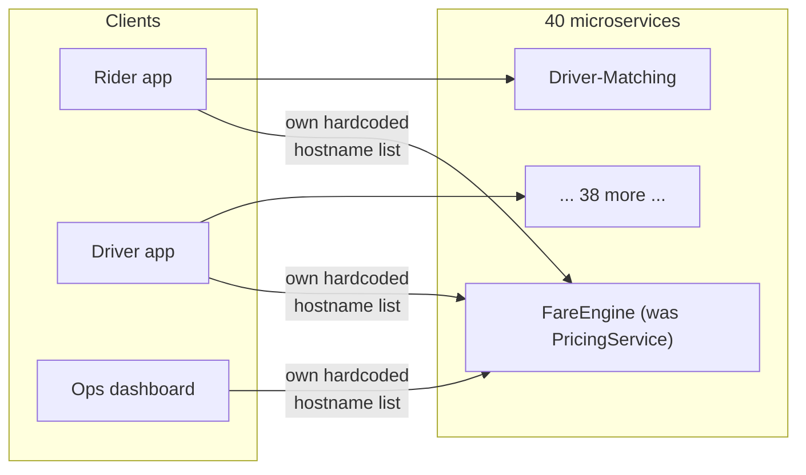

A second, quieter incident lands the same month: a new `PromotionsService` ships with no shared auth
check to plug into, because there **is** no shared auth check — every client just assumes "someone"
validates the bearer token. A security review finds it's been accepting **unauthenticated requests
for 9 days** `[illustrative]`, leaking active promo codes to anyone who guessed the URL.

*Why does every client need all 40 addresses, and why does every service reinvent its own auth?*
Because nothing owns "how do you get into this system" — that job got smeared across every client
and every service instead of living in one place. This is close to the real scenario in Steve
Yegge's leaked 2011 Amazon memo (widely-discussed, publicly archived) describing Bezos's mandate
that every team's functionality be exposed *only* through a service interface, no direct pipes —
because point-to-point sprawl like Loopline's doesn't get better on its own as service count grows.

**The fix, and the analogy for the rest of this story:** one **shared front door** in front of all
40 services; every client talks only to *that*. Think of an **apartment building's lobby and
doorman**, replacing 40 apartments each with their own lock and buzzer. The doorman checks IDs once,
the same way every time, no matter which apartment the visitor is headed to. This is literally what
Netflix built and named **Zuul** — their own documented term for it is "the front door for all
requests" into Netflix's infrastructure, rolled out as they scaled into hundreds of microservices.

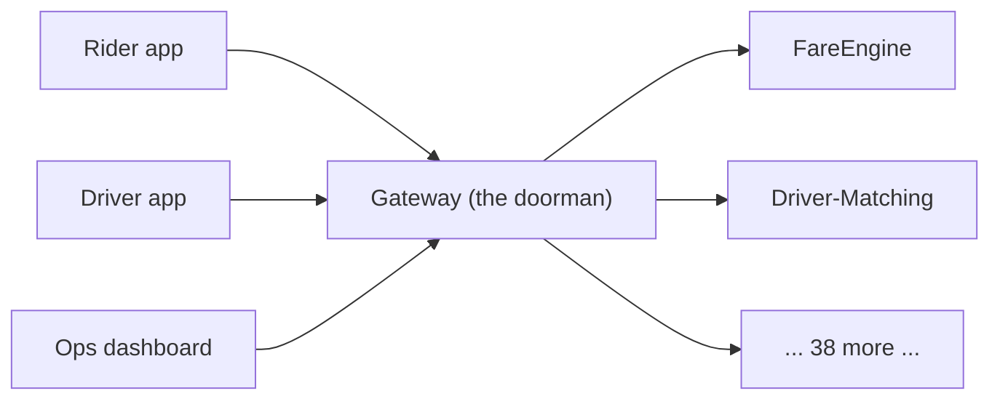

**New problem, visible on day one:** Loopline stands up exactly **one** gateway process. Three weeks
in, that box's NIC card fails at 6:14pm on a Friday, peak demand. Every client, for every service,
goes down **at once** — none of the 40 backends are broken, the single front door to all of them
just stopped existing. The exact single point of failure this fix was meant to prevent, one level
up.

**How I'd say this in an interview:** "Forty services and multiple clients calling them directly is
the classic N-times-M problem — every client needs every address, every service reinvents auth
slightly differently, which is exactly what Amazon's internal 'everything must be a service
interface' mandate was written to stop. A shared gateway fixes the duplication, but the instant
everything centralizes into one door, that door becomes the new single point of failure."

---

## Chapter 2 — Many doormen, same lobby

The fix is the one you'd reach for with any stateless service that became a SPOF: run a **fleet** of
identical gateway instances behind a load balancer, not one box. This isn't gateway-specific — it's
the same horizontal-scaling-plus-failover discipline any shared infrastructure gets, and exactly how
real gateway products (AWS API Gateway, Kong, Netflix's Zuul fleet) are actually deployed.

**The analogy, continued:** the lobby gets a rotating team of doormen, all trained identically,
standing behind a reception desk (the load balancer) that hands each visitor to whoever's free. Lose
one doorman, the desk routes the next visitor elsewhere. Nobody notices.

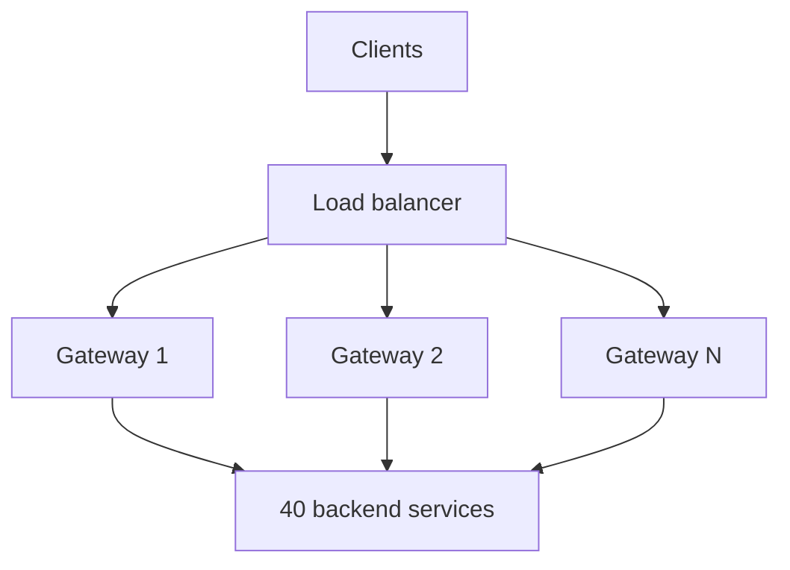

A single instance sustains roughly **10,000 requests/sec** `[illustrative]` before CPU becomes the
bottleneck. Peak platform traffic is **200,000 requests/sec** `[illustrative]`. That's **20-25
instances** — a boring, straightforward horizontal-scaling number, since each instance's work is
stateless and independent.

**New problem, the next sprint:** someone finally looks at what order the pipeline runs its checks
in. The engineer who built v1, shipping fast, wired rate limiting **before** authentication — rate-
limiting by IP was the fastest thing to bolt on, and auth felt like it could come "whenever." Nobody
flagged it as a decision; it just happened in that order.

**How I'd say this in an interview:** "The SPOF problem has the boring, standard answer — a
horizontally scaled, load-balanced, stateless fleet. What's not boring, and what actually causes
bugs, is the *order* the pipeline runs its checks in inside each instance — that's next."

---

## Chapter 3 — Checking the boarding pass before checking the passport

Loopline's early pipeline: **rate limit by raw IP, then authenticate.** Rate limiting felt like
"just infrastructure," auth felt like "the real security check" — so why not do the cheap one
first?

Two real bugs surface from this ordering, same week. **Bug 1:** mobile carriers put large numbers of
customers behind a few shared IPs via carrier-grade NAT — a real, well-known fact. Loopline's limit
is 100 req/min *per IP*. One evening roughly **600 riders** on the same carrier share one NAT'd IP
`[illustrative]`. Combined they blow past 100/min in under 90 seconds, and the gateway throttles
**all 600 together** — 599 innocent riders punished for sharing a stranger's IP. **Bug 2:** the same
week, a bot brute-forcing promo codes against `PromotionsService` simply rotates across **5,000 IPs**
`[illustrative]`, staying under the per-IP limit from any single one, even though its *total* volume
is enormous. The limit is keyed on something trivially rotatable and not tied to a real identity.

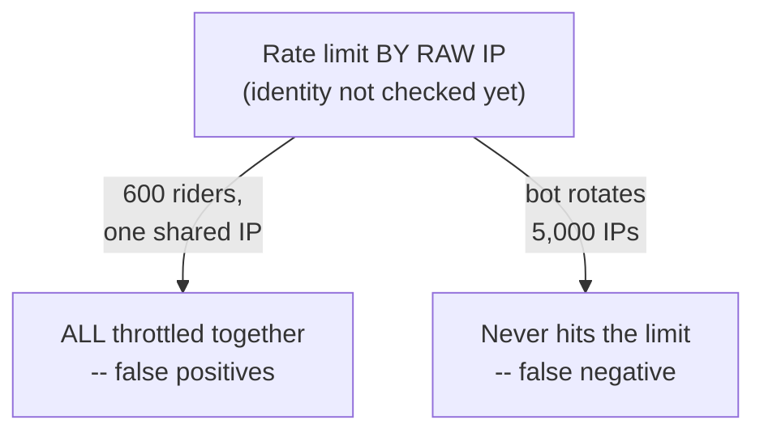

*Is the rate limiter broken?* No — it's fine. The problem is **what it's keyed on**: an identity
decision made before identity exists. It's like a gate agent deciding your upgrade history by which
shuttle bus dropped you off — strangers share a shuttle, and anyone can just take a different one.

**The fix:** flip the order. **Authenticate first, then rate-limit by that validated identity** —
check the passport before anything downstream (bag limits, lounge access, flight history) gets
decided.

With the fix: each of the 600 riders authenticates with their own ID, so each gets their **own**
100-req/min budget — false-positive throttling disappears. The bot still needs *some* identity to
authenticate as, and now that identity — not a rotatable IP — is what gets flagged, which security
can actually act on.

**New problem, once everyone's happy:** benchmarking the corrected pipeline shows gateway-added
latency has crept to **28ms/request** `[illustrative]`. At 200,000 requests/sec, that's 28ms taxed
onto every single request to every one of the 40 services, platform-wide.

**How I'd say this in an interview:** "Stage order is a correctness bug, not a style choice — rate-
limiting before auth keys the limit on something spoofable or shareable. Authenticate first, then
everything downstream uses the real identity. Fixing the order doesn't make the pipeline fast,
though — that's separate."

---

## Chapter 4 — The auth check that calls home before answering the door

The 28ms traces to one thing: auth validates every token by looking it up in a **shared session
database** — a real network round-trip, every request, taking **20-25ms** `[illustrative]`.
Everything else (routing lookup, rate-limit counter) is under 1ms, purely local. The one stage that
leaves the box dominates the whole budget by roughly **20-40x**.

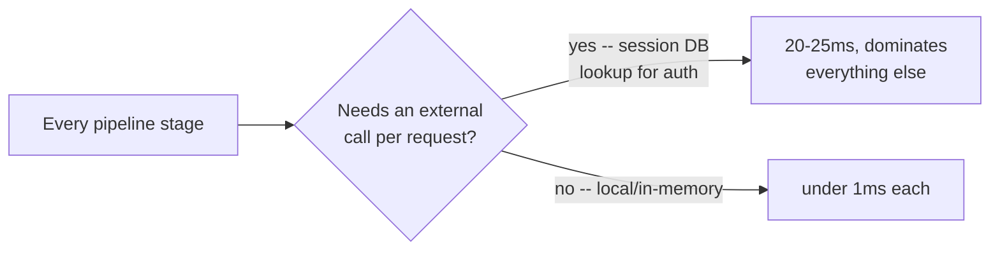

**The fix:** stop asking a database "is this still valid" per request. Issue **short-lived, signed
tokens** (JWT-shaped) — the gateway verifies the signature **locally**, no network call, because the
signature *is* the proof, and a short expiry (say 15 minutes) bounds how long a stolen token stays
dangerous without a live revocation check. This is exactly what real gateways do: AWS API Gateway's
Lambda authorizers cache their result for a TTL specifically to skip a per-request call; Kong's JWT
plugin verifies signatures locally, no DB round-trip — both documented.

Same idea for rate limiting: local or tightly-bounded in-memory counters, never a slow centralized
store checked synchronously per request. Reworked budget, everything local: TLS ~0.5ms, local auth
~0.5-1ms, local rate-limit check ~0.5-1ms, local routing lookup ~0.2ms, local circuit-breaker check
~0.1ms — **roughly 2-3ms total** `[illustrative, matching the reference guide's estimate]`, a 10x+
improvement purely from removing the one non-local stage.

**New problem, immediately:** if routing and policy checks are local, in-memory lookups against a
**routing table** and **policy table** — where does that table actually come from? If the answer is
"ask a config service per request," that's the exact same forbidden external call, smuggled back in
through a different door.

**How I'd say this in an interview:** "Once stage order is fixed, audit every stage for external
calls per request — the gateway sits in front of every request to every backend, so one non-local
stage doesn't cost itself, it costs the whole platform, multiplied. Short-lived signed tokens and
local counters get you back to low-single-digit milliseconds. But 'local' only works if the data
those checks depend on gets to every instance some other way — that's next."

---

## Chapter 5 — Restocking the vending machine on a schedule, not calling the warehouse per sale

Every instance needs its own local copy of a **routing table** and a **policy table**. These
change — new services ship, tiers get upgraded — but only a handful of times a day, not per request.

*How does a local table stay both fast and current?* Same shape as any config-distribution problem:
one **authoritative, versioned config store**, and every gateway instance **pulls its own copy on
its own schedule** — say every 10 seconds — never a synchronous per-request call, and never gateway-
to-gateway sync.

**The analogy:** a vending machine doesn't call the warehouse before every purchase to check today's
price — it sells off whatever's on the shelf, and a delivery truck restocks and updates the price
sheet on a schedule. Every machine in the building restocks independently from the same warehouse;
machines never coordinate with each other.

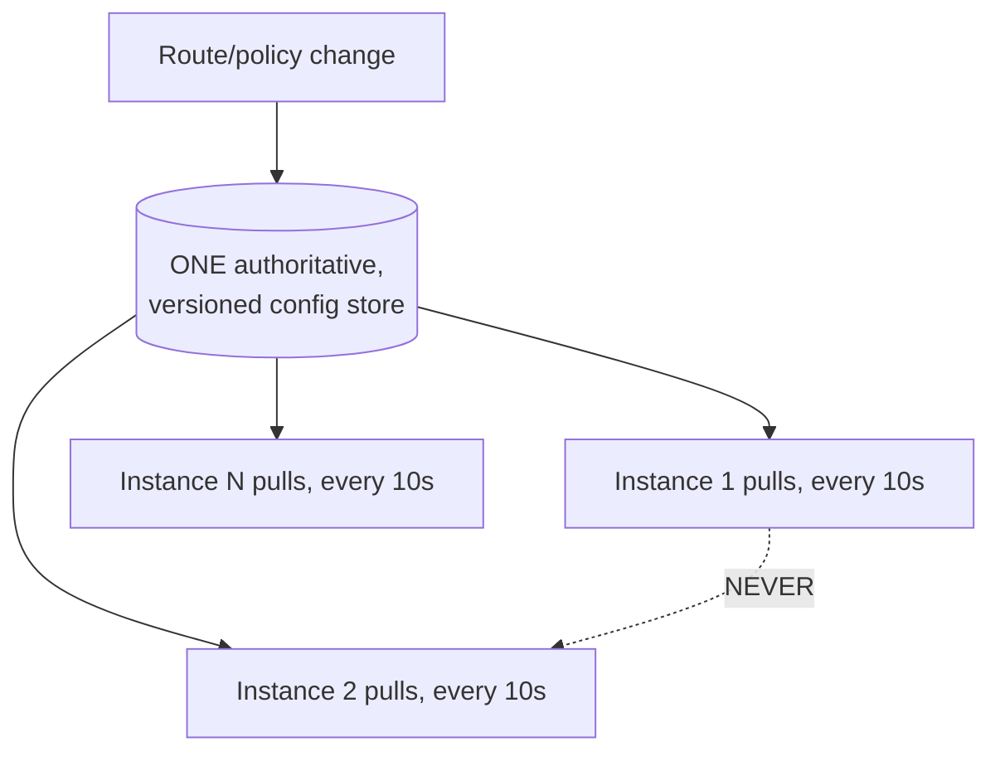

The whole routing table plus every tier's policy is a few megabytes even at 40 services and
thousands of accounts `[illustrative, matching the reference guide]` — tiny. The real effort is
propagation correctness, not size.

**New problem, three months later, during a migration:** Loopline cuts `FareEngine` over from v1 to
v2 hosts. One instance's config-pull job silently stalls for **40 minutes** `[illustrative]`, still
serving its stale, pre-cutover table. During that window roughly **8% of the fleet's traffic**
`[illustrative]` keeps routing to the now-decommissioned v1 hosts, which return connection-refused,
and nobody notices until complaints show up.

The fix isn't a new mechanism — it's discipline: monitor each instance's **config version lag**
against the latest published version as an alertable metric, the same way you'd watch replication lag
on a DB replica.

**How I'd say this in an interview:** "Config distribution to a gateway fleet is the same pattern as
distributing any small, frequently-changing config to a fleet — one versioned source, independent
pulls, never node-to-node sync. What actually needs discipline is monitoring version lag per
instance, because a silently-stuck puller is what turns a routine migration into an outage nobody
sees."

---

## Chapter 6 — One big customer's burst, drained from everyone else's tank

Loopline signs a corporate fleet partner. A bug in their integration fires **12,000 pricing-lookup
requests in 8 seconds** `[illustrative]` — far more than any rider generates. The rate limiter still
has a single **shared counter for the whole `FareEngine` route**, not one per customer. The burst
blows through that shared budget, and **every regular rider's pricing requests** get throttled too —
not because they did anything wrong, but because one customer's spike consumed a budget that was
never theirs alone.

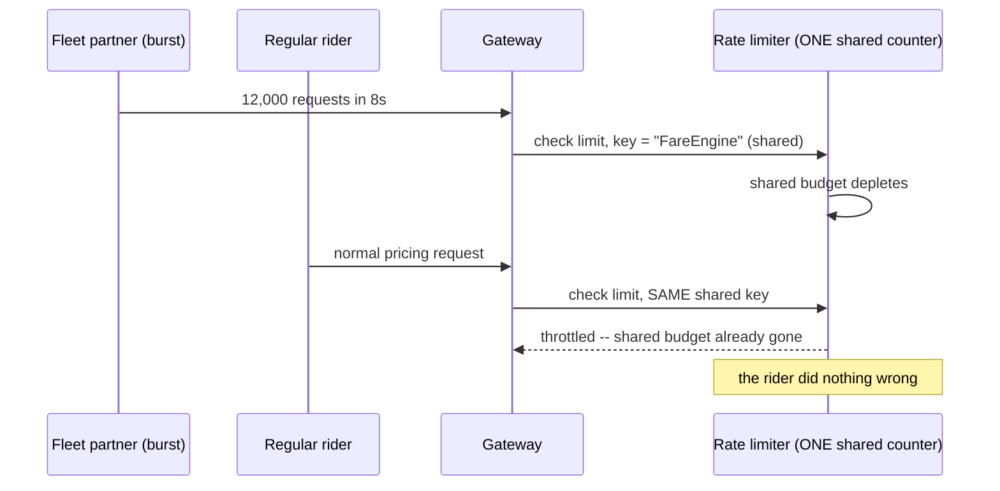

This is the classic **noisy-neighbor** problem. The fix: **scope every counter by tenant/customer
identity, never by route alone.** Once the key is `tenant:fleet-partner-42` instead of just
`"FareEngine"`, the partner's burst can only exhaust *its own* bucket — every other tenant's budget,
including every rider, is untouched.

**New problem, once isolation is solid:** a different kind of failure shows up — not about limits at
all, but a backend simply getting slow, with the gateway not reacting to that fact in any useful way.

**How I'd say this in an interview:** "A shared, unscoped rate-limit counter is a real multi-tenant
bug, not a minor inefficiency — one tenant's burst can starve everyone sharing that bucket. Every
policy needs a mandatory tenant-scoped key, not an optional convention someone can forget."

---

## Chapter 7 — The doorman who keeps knocking on a door nobody's answering

`DriverMatchService` has a bad afternoon: its own database is overloaded, and response time climbs
from a normal **80ms** to **30 seconds** `[illustrative]`, without ever returning an error — just
slow. The gateway has no special handling: it forwards every request and waits. At **500
requests/sec** `[illustrative]`, each now hanging 30 seconds instead of 80ms, connections pile up
across the fleet faster than they drain — within roughly **90 seconds** the fleet's own connection
pools saturate *because of this one backend*, and unrelated, perfectly healthy requests (payments,
notifications) start queuing behind them too, sharing the same exhausted gateway resources.

*Why does the gateway keep sending requests to a backend that clearly isn't answering?* Because
nothing tracks "how has this backend been behaving lately" — each request is handled statelessly,
with no memory of the last 100 calls.

**The fix:** a **circuit breaker**, per backend, tracking a rolling failure/slowness rate — the
pattern Netflix's **Hystrix** made famous (documented; the library itself has since been retired in
favor of newer tooling, but the shape it popularized is still what production gateways run). Three
states: **closed** (normal), **open** (threshold crossed — stop forwarding, fail fast instead of
waiting on a doomed request), **half-open** (after a cooldown, one trial request checks recovery).

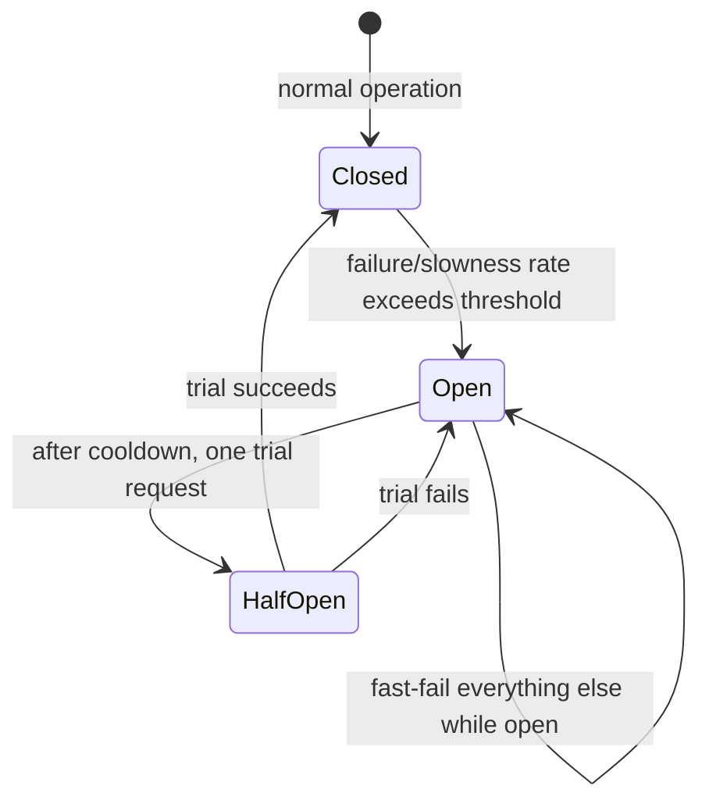

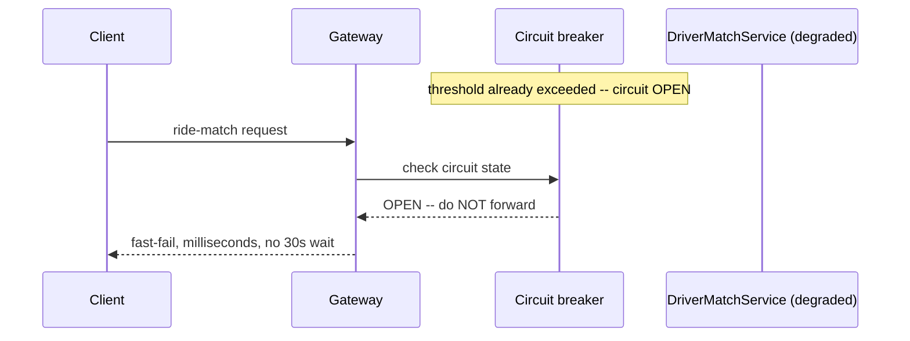

Once the circuit is open, the gateway stops forwarding and returns a fast failure in milliseconds —
every client benefits immediately, instead of each one independently rediscovering the same hang.

**New problem, once the pipeline is fast, ordered, config-distributed, isolated, and
circuit-broken:** Loopline's internal services have migrated to gRPC for performance — but the Rider
and Driver apps, and every partner integration, still speak plain REST/JSON, and always will.

**How I'd say this in an interview:** "A circuit breaker per backend stops one degraded service from
draining capacity that every *other* service on the same fleet needs — the Hystrix pattern, still the
shape every production gateway uses even though the library itself is retired. Composing it into the
gateway means every client benefits the moment it trips, not just whoever discovers the timeout
first."

---

## Chapter 8 — Translating at the door so nobody inside has to speak two languages

External callers speak REST/JSON; internal services, post-migration, speak gRPC. *Should every
external client learn gRPC just because the backends switched?* No — that pushes an internal
implementation detail onto integrations Loopline doesn't even control.

**The fix:** add **protocol translation** as an explicit pipeline stage — REST/JSON in, translated to
gRPC for the backend call, translated back to JSON for the response. The gateway is the natural
place, since it's already the one spot every request passes through — translating once there beats
making all 40 services support two protocols each.

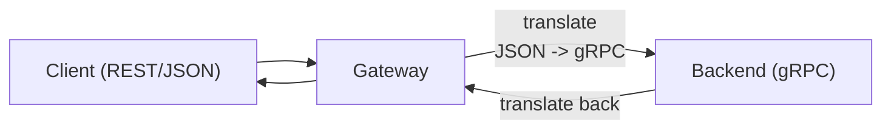

**The new problem, immediately, because Chapter 4's rule doesn't get a pass here:** translation costs
real CPU — parsing and re-serializing every request and response, sitting in the same hot path as
every other stage. Skip the latency-budget discipline on this one because it "feels like plumbing,
not security," and it quietly regresses the platform back toward the tens of milliseconds Chapter 4
worked to eliminate. That's exactly why the reference guide treats translation as a stretch-goal
stage with its own explicit budget line, not a free add-on.

**How I'd say this in an interview:** "Protocol translation belongs at the gateway because it's the
one place that already sees every request. But it's still a pipeline stage — it needs its own
latency budget, monitored the same way as auth, rate limiting, and routing, not exempted because it
feels like plumbing."

---

## Where the story actually lands

```mermaid
flowchart LR
    A["Ch1: N clients,\nM services, direct calls"] -->|"fixes: one front door\nbreaks: gateway is a SPOF"| B["Ch2: stateless\nfleet + LB"]
    B -->|"fixes: no single box\nbreaks: wrong stage order"| C["Ch3: auth BEFORE\nrate limit"]
    C -->|"fixes: real identity\nbreaks: auth calls a DB, 28ms"| D["Ch4: every stage\nlocal"]
    D -->|"fixes: 2-3ms total\nbreaks: where do tables come from?"| E["Ch5: versioned config,\nindependent pull"]
    E -->|"fixes: fast + current\nbreaks: shared counter, noisy neighbor"| F["Ch6: rate limits\nper tenant"]
    F -->|"fixes: isolation\nbreaks: hammers a dead backend"| G["Ch7: circuit breaker\nper backend"]
    G -->|"fixes: fast-fail\nbreaks: REST clients, gRPC backends"| H["Ch8: protocol translation,\nbudgeted"]
```

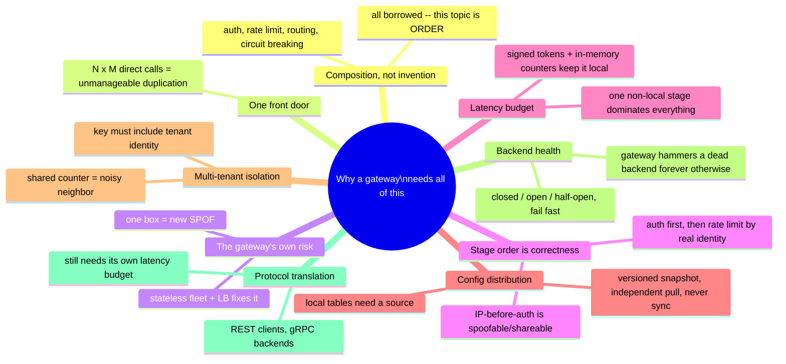

Every real gateway you design in an interview sits *somewhere* on this chain. A small internal
platform with one client and five services might reasonably stop around Chapter 4. A large,
multi-tenant, external-facing platform has to reach Chapter 6 and 7. If nobody's mentioned mixed
protocols, walking to Chapter 8 unprompted reads as padding, not depth.

---

## Grill me — adversarial follow-ups

**Q1: "Why not have each of the 40 services validate auth itself — isn't that more secure, defense
in depth?"**
It sounds safer, but it means 40 slightly different implementations of the same check — and history
(the `PromotionsService` incident) shows "slightly different" quickly becomes "forgot it entirely."
Centralizing doesn't forbid a service from double-checking something service-specific; it just makes
the baseline impossible to accidentally skip.

**Q2: "What actually breaks if routing happens before rate limiting instead of after?"**
Not correctness, mostly wasted work — you'd have spent a routing lookup on a request that was about
to get rejected anyway. The real rule is narrower than "this exact order": cheaper rejection checks
before expensive ones, and each stage depending only on information an earlier stage established.

**Q3: "Isn't 'add more gateway instances' just delaying the SPOF, not fixing it — what if the load
balancer dies?"**
Fair — the load balancer needs the same no-single-point-of-failure treatment, recursively, one layer
up (multiple LB nodes, health-checked, DNS or anycast failover). You do bottom out at physical
redundancy somewhere; the goal isn't zero single nodes, it's no *one* node's failure taking down the
platform.

**Q4: "Doesn't local signature verification skip checking if the token's been revoked?"**
Yes, deliberately — it trades instant revocation for speed. A compromised token stays valid for at
most its short expiry, not forever. Genuine instant-revocation needs are a real requirement to name
explicitly, because that means accepting a slow, non-local check per request on purpose.

**Q5: "Rate-limit counters need to agree across 20+ instances — doesn't that reintroduce the
external-call problem Chapter 4 just eliminated?"**
It's the one stage that genuinely can't stay purely local, because a user's real limit must hold
regardless of which instance handles any given request. The fix is a fast, tightly-bounded shared
cache, not a full database — a small, deliberate exception, because a per-instance-siloed counter
would let anyone evade their limit just by getting load-balanced around.

**Q6: "If config propagation takes 10 seconds, isn't that a security hole for revoking a compromised
key instantly?"**
For routine changes, 10 seconds is a fine trade for simplicity. For an emergency revocation, that's a
separate, faster "kill switch" path — the reference guide calls this out as a stretch goal precisely
because routine and emergency changes have different latency needs, and conflating them either
over-engineers the routine case or makes emergencies too slow.

**Q7: "Why scope rate limits per tenant instead of just giving the big partner their own dedicated
gateway?"**
You could, for a large enough partner — but it doesn't scale as a general policy, since you'd stand
up a dedicated gateway per big customer. Tenant-scoped counters solve isolation for arbitrarily many
tenants sharing one fleet, without new infrastructure every time you sign someone new.

**Q8: "The circuit breaker opens per backend — what stops a brief 5-second blip from getting treated
like a full outage?"**
The half-open state: after a cooldown, exactly one trial request checks recovery, and if it succeeds
the circuit closes right away. Threshold and cooldown are tunable specifically so a blip doesn't get
treated the same as a sustained failure.

**Q9: "Given this whole story, if someone says 'design an API gateway' cold, where do you start?"**
Reframe it out loud first: not a new algorithm, but correctly composing auth, rate limiting, routing,
and circuit breaking, in order, without the gateway's own latency or availability becoming the
platform's bottleneck. Then walk only as far as the interviewer points — ordering and latency budget
are near-universal; config distribution, multi-tenancy, and protocol translation are earned by a
specific stated requirement, not defaults.

**Q10: "What's the single biggest thing separating a good gateway design from a bad one here?"**
Catching, unprompted, that the gateway sits on every request to every backend — so anything that
would be a minor detail inside one service (a DB call, a wrong check order) becomes a platform-wide
multiplier the moment it's inside the gateway. Everything else in this story is that one observation,
applied five times.

---

## Cheat sheet — one line per stop on the story

- **N clients calling M services directly**: every client needs every address, every service
  reinvents auth — the sprawl Amazon's internal "everything must be a service interface" mandate was
  written to stop.
- **Shared gateway**: one front door (Netflix's own term for Zuul) replacing duplicated per-service
  auth/routing/logging.
- **Gateway fleet + load balancer**: the gateway is a new SPOF the moment it's introduced — fix it
  like any other critical stateless service, horizontal scale plus failover.
- **Stage order — auth before rate limit**: limiting by raw IP before auth keys the limit on
  something spoofable/shareable; authenticate first, then limit by the real identity.
- **Latency budget — every stage local**: one non-local stage can dominate the pipeline by 20-40x;
  short-lived signed tokens and in-memory counters keep the total in low single-digit milliseconds.
- **Config distribution**: one authoritative versioned source, every instance pulls independently on
  its own schedule — never instance-to-instance sync, and monitor version lag as an alertable metric.
- **Multi-tenant rate-limit isolation**: every counter key must include tenant identity, or one
  tenant's burst starves everyone else — a real isolation bug, not a minor inefficiency.
- **Circuit breaker per backend**: closed / open / half-open, fail fast instead of hanging — the
  Hystrix pattern, still the shape every production gateway uses.
- **Protocol translation**: belongs at the gateway because it already sees every request, but it's
  still a pipeline stage with its own latency budget, not a free add-on.
- **The meta-lesson**: nothing here is a new mechanism — every fix is auth, rate limiting, routing, or
  circuit breaking, borrowed from elsewhere, learning to run in the right order, fully local, on a
  fleet that isn't itself a single point of failure.
