# Design a Code Execution Engine (LeetCode/Replit) — The Story (narrative edition)

> **What this file is.** The reference file, `66-Design-a-Code-Execution-Engine-LeetCode-Replit-FAANG-Guide.md`, is the one to recite from — requirements, API shapes, every trade-off table, the master cheat sheet. This file is a second way in: the same material as one continuous story, told in plain language. Engineers at a company keep hitting a wall, patch it, and the patch itself creates the next wall — until we land on the exact same design the reference file documents. The company, **Runlet** (a coding-interview-practice platform, think a scrappy LeetCode competitor that later adds a Replit-style live coding room), is fictional. But every wall it hits, and every fix it reaches for, is something a real, named system actually does: Docker containers plus Linux cgroups/namespaces for isolation, gVisor and Firecracker microVMs (the technology AWS Lambda documents using in production), and Judge0's own documented open-source online-judge architecture, which has faced this exact "someone submitted an infinite loop" problem for years. I'll say clearly, every time, whether something is a documented fact or just a reasonable, labeled guess — with an inline `[illustrative]` tag.

**The trigger phrase** for this whole topic is one word: **untrusted**. The moment an interviewer says "users submit arbitrary code and we run it," every subsequent decision has to assume that code is actively hostile — not "might have a bug," but "might be deliberately trying to read someone else's data, crash the host, or escape the box it's running in." Keep one sentence in your head as you read: **a code execution engine's whole job is to run code it does not trust, thousands of times a day, and guarantee that no single submission can hurt another submission, another user, or the machine underneath it.** Everything below is just this one idea, getting harder in small, honest steps.

---

## Chapter 1 — The demo that ate the server

It's early 2016. Runlet is three people and about 40 concurrent users practicing coding-interview problems. The "run code" button does the simplest possible thing: the web server takes the submitted source, drops it into a subprocess with something like `exec()` or `child_process.spawn()`, and waits for it to finish — running right there, on the same box that's also serving every other user's web requests. No isolation, no timer, no limit. It works fine for `print("hello world")`.

One evening, a user testing edge cases for a "detect an infinite loop" practice problem submits, half-joking, `while(true) {}`. The process starts, and it never returns. That one worker thread — one of a small pool handling all of Runlet's traffic — is now spinning a CPU core at 100% forever, on the same machine serving the homepage, the login page, and everyone else's "run code" button. Runlet has, say, 8 worker threads `[illustrative — a small early-stage server]` total. Within about six minutes, three more users happen to submit their own infinite loops (some on purpose, some by accident — a bug in *their* code). Now 4 of 8 workers are wedged forever. The site isn't down, but it's crawling, and it never recovers on its own — a stuck worker doesn't come back; it's just gone until someone manually restarts the process.

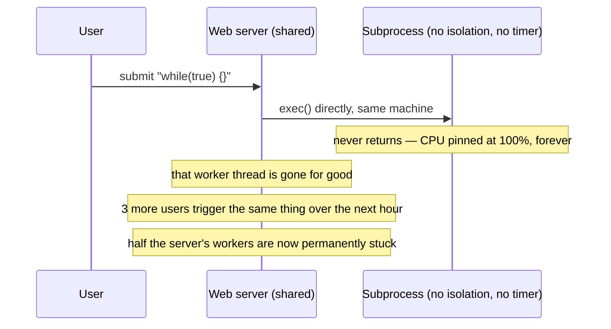

The obvious question: *why does one person's bad loop get to degrade the entire site for everyone?* Because the code runs directly on the same machine, in the same process pool, as everything else — there's no wall between "code we wrote and trust" and "code a stranger just typed into a text box." This is the single most well-documented failure mode in the entire history of online judges: Judge0, the real, open-source online-judge project used by many practice platforms, exists specifically because running submitted code with no isolation is where every one of these systems starts, and where every one of them immediately gets burned.

**The fix, and the analogy for the rest of this story:** never run untrusted code in the same place trusted code runs. Put every submission inside its own **container** — think of it as a **sealed shipping container**, not a moving box you casually reuse. Whatever's inside one container can't see, touch, or affect what's in the container next to it, or the ship carrying them (the host machine) — at least, that's the promise. Runlet moves code execution to Docker containers, one per submission, on their own small fleet of "runner" machines, completely separate from the web servers.

**New problem, visible the same week:** a container is a real, documented isolation boundary for the filesystem and process list — but nobody at Runlet set any actual resource caps on it. `docker run` with no flags doesn't limit CPU or memory by default. The infinite-loop submission still runs forever, still eats 100% of a CPU core — it's just eating it inside a box now, instead of on the bare web server. Progress, but the core problem — nothing stops a runaway submission — isn't solved yet.

**How I'd say this in an interview:** "The very first thing to say out loud, unprompted, is that submitted code is untrusted by definition — running it directly on shared infrastructure, even in a plain subprocess, is disqualifying on security and availability grounds alone. The first real fix is isolation: put every submission in its own container, away from anything else that matters. But a container by itself is just a locked room with no rules about what happens inside it — that's the very next problem."

---

## Chapter 2 — The fuse nobody installed

Containers give Runlet filesystem and process isolation — a submission genuinely can't see another submission's files anymore. But three weeks later, someone submits a small C program that calls `fork()` in a tight loop — a classic **fork bomb**. Inside its own container, with no process-count limit set, that program spawns child processes as fast as the CPU allows. Real number: in about 8 seconds `[illustrative]`, the process count inside that one container balloons past 15,000. Linux has a system-wide cap on total process IDs, shared across every container on that host, because containers share the host's kernel. That one submission exhausts the *host's* PID table, and every other container on that machine — belonging to other users, running perfectly innocent code — starts failing to even start a new process.

The obvious next question: *containers isolate the filesystem and process namespace — so why didn't they stop this?* Because namespace isolation (what container process A can *see*) and resource limits (how much container A is allowed to *use*) are two separate Linux mechanisms. Docker gives you the first one by default. It does not give you the second one unless you explicitly ask for it.

**A tempting half-fix that Runlet actually tries first, and why it doesn't hold:** an engineer adds an application-level timer — start a stopwatch when the container launches, and if it's still running after 5 seconds, tell the container to stop. This works for simple infinite loops. It does not work for the fork bomb: the timer is watching one process, but by the time it fires, that process has already spawned thousands of children, and killing the original parent doesn't kill the orphaned children still running underneath it. A "please stop after 5 seconds" instruction that the *code itself* (or a naive wrapper around it) is expected to respect can always be outrun by code that doesn't cooperate — and untrusted code, by definition, never has to cooperate.

**The real fix:** enforce every limit with **cgroups** (Linux control groups) — the actual, documented mechanism Docker itself is built on top of. Set a hard CPU quota, a hard memory ceiling (with an automatic OOM-kill if it's exceeded), and a hard cap on the number of processes/threads a single container's whole process tree is allowed to create — all three enforced by the kernel, from *outside* the container, regardless of what's happening inside it.

**The analogy:** think of a cgroup limit as **a fuse box, not a request**. You don't ask an appliance to please not draw too much current — you install a fuse that trips at a fixed amperage no matter what's plugged in, no matter how the appliance behaves, and it doesn't care whether the appliance "meant to" pull that much power. The fuse doesn't negotiate.

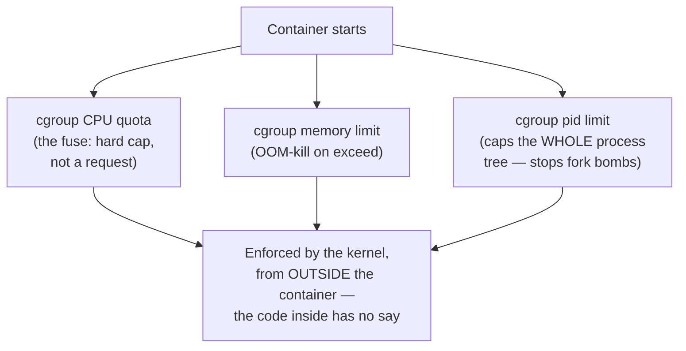

Runlet sets: CPU quota equivalent to 1 core, memory ceiling of 256MB `[illustrative — a reasonable per-submission cap for short scripts]`, and a process-count cap of 32. The fork bomb now hits the pid limit almost instantly, gets killed, and — critically — *only that one container* is affected. Other containers on the same host never notice.

**New problem, spotted by a security-minded engineer the following month:** CPU, memory, and process count are now hard-capped from outside the process. But nothing yet stops a submission from opening a network socket. A submitted script could reach out to an external server, download and run additional malicious tools, or use Runlet's own runner fleet to attack some unrelated third party on the internet — none of which trips a CPU, memory, or PID limit at all, because network activity isn't any of those three things.

**How I'd say this in an interview:** "Isolation and resource limits are two different jobs — containers give you the first for free, but you have to explicitly ask for the second, with cgroups, because a container with no configured limits will happily let one submission's fork bomb exhaust the whole host's process table. And any limit enforced by asking the code to cooperate — a soft timer, a polite convention — doesn't count, because untrusted code by definition doesn't have to listen."

---

## Chapter 3 — The room with no phone line

CPU, memory, and process count are locked down. But Runlet's containers, by default, share the host's network — a submission can make outbound HTTP calls just like any other program on that machine. A user (testing Runlet's limits, not maliciously — this time) submits a Python script that opens a socket and starts port-scanning Runlet's own internal network. It doesn't get very far, because Runlet's internal services aren't reachable from the runner fleet's subnet — but the fact that it *could try* is the actual problem: nothing about "run untrusted code" should ever include "and it's allowed to talk to the outside world, or to us, unsupervised."

The obvious question: *does a coding-practice submission ever legitimately need network access?* For the vast majority of Runlet's problems — sort this array, reverse this string — the answer is no. There's no legitimate reason for `solution.py` to be making outbound HTTP calls at all.

**The fix:** network namespace isolation — give every container its own network namespace with **no route to anywhere**, not the internet, not Runlet's own internal services, not even other containers. This is the same real Linux networking primitive containers are already built on (Docker uses network namespaces for every container by default; the fix here is *removing* the bridge/route entirely rather than leaving it open).

**The analogy, extending the shipping-container picture:** the container isn't just sealed — **it has no phone line and no windows.** Whatever's inside can't call out, and nothing outside can be reached from in there, full stop. If a specific exercise genuinely needs to call an external API, that's a named, explicit, tightly-scoped exception granted on purpose — never the default.

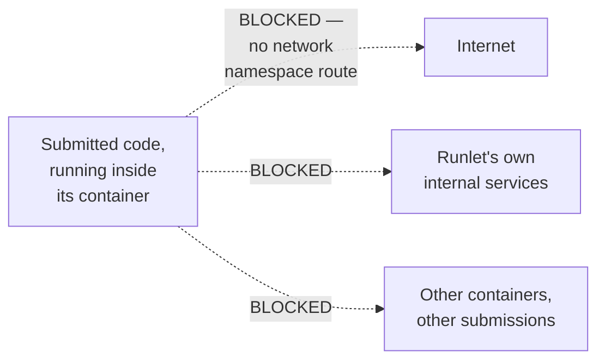

**New problem, three months later:** network is closed off. CPU/memory/process are hard-capped. Filesystem is namespace-isolated per container. And yet — a user files a bug report that's genuinely alarming: they can see, in their own submission's working directory, a leftover file named `output_4471.tmp` that clearly isn't theirs. Runlet's runner fleet had started **reusing** containers between submissions to save on startup cost — spin one up, run a submission, wipe the obvious stuff (delete `/tmp/solution.py`), and hand the same container to the next submission. The wipe step missed a file. One user's leftover data just leaked into another user's sandbox.

**How I'd say this in an interview:** "No network access by default is its own explicit security boundary, distinct from CPU and memory limits — it's about stopping data exfiltration and abuse of your own infrastructure, not resource exhaustion. But the scarier bug here isn't networking at all — it's that 'isolated while running' and 'safe to reuse afterward' are two completely different guarantees, and Runlet only had the first one."

---

## Chapter 4 — The hotel room that gets rebuilt, not cleaned

The leftover-file bug is a symptom of a deeper decision: Runlet tried to make container reuse safe by **cleaning** a used container before handing it to the next submission — deleting known temp files, resetting known state. The bug proves that approach is fundamentally fragile: "clean up everything a submission might have touched" requires the cleanup code to know, in advance, every possible way a submission could leave something behind — new files in unexpected paths, modified environment state, leftover processes that didn't get reaped, cached data in a language runtime's own temp directories. Any gap in that list is a potential cross-user data leak, and the list is never provably complete.

The obvious question: *why try to make reuse safe at all, instead of never reusing a sandbox in the first place?* Because starting fresh every time costs something — but the alternative, hoping a cleanup script caught everything, just proved itself unsafe with actual user data at stake.

**The fix:** never reuse a sandbox across submissions. **Destroy it completely after exactly one use, and build a brand-new one from scratch for the next submission** — no reset, no cleanup script, no "we think we got everything."

**The analogy, staying with the same picture:** this is the difference between a hotel **cleaning** a room (real risk: something gets missed) and a hotel **demolishing the room and rebuilding it from the studs** for every single guest. It sounds wasteful, and it is more work — but it closes the entire category of "did the cleanup crew miss something" bugs by construction, because there's no previous state left to miss. Nothing carries over, because nothing survives.

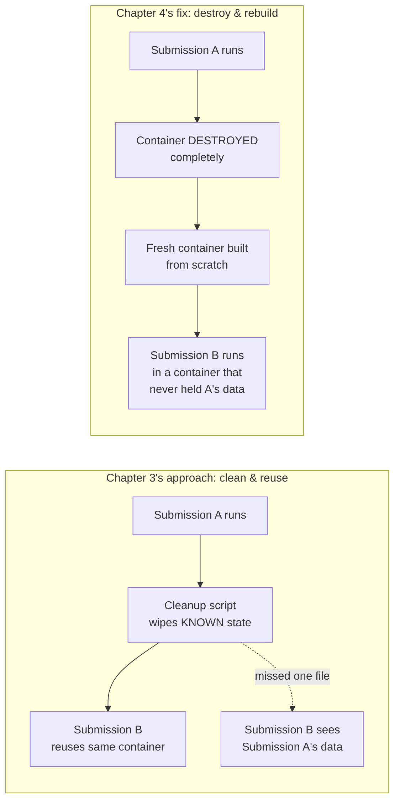

**New problem, immediately obvious once this ships:** building a genuinely fresh container from scratch for every single submission is not free. Runlet benchmarks it: a cold container start, with the language runtime's image pulled and initialized, takes roughly **300-500ms** `[illustrative — consistent with the general range documented for container cold-starts]` before the submitted code even begins running. For a single user idly practicing, that's barely noticeable. But Runlet is about to run a timed coding contest with 3,000 registered users, most of whom will hit "submit" within the same two-minute window at the contest's start — and 400ms of pure startup overhead, multiplied across a sudden wave of simultaneous submissions, is the kind of number that turns into a very visible lag spike.

**How I'd say this in an interview:** "Trying to safely reset and reuse a sandbox is a real engineering effort with an unbounded list of things that could leak — a missed file, leftover process, cached runtime state — and any gap in that list is a cross-tenant data leak. Destroying the sandbox and building a fresh one every time closes that whole bug class by construction. The cost is that a from-scratch container isn't instant, and that cost is about to matter a lot once traffic gets spiky."

---

## Chapter 5 — The valet who already has your car running

Contest day arrives. Registration hits 3,000 users, and true to form, roughly 1,800 of them submit their first solution within the same 90-second window right after the problems go live. Each submission needs a fresh, from-scratch container per Chapter 4's rule — and at ~400ms of pure cold-start overhead per submission `[illustrative]`, before a single line of the user's code has run, that's a visible, cumulative lag that shows up as "why is 'run code' taking 2-3 seconds just to start" complaints in the contest's live chat.

The obvious question: *if a fresh container is mandatory for safety, but building one from scratch is slow, how do you get both speed and safety at the same time?* You separate "build a clean, fresh sandbox" from "the moment a user actually needs one." Do the slow part *before* it's needed, continuously, in the background — and hand out an already-built one the instant a submission arrives.

**The fix:** a **pre-warmed pool** — a background process constantly keeps a stock of ready-to-go, already-built containers sitting idle, one pool per supported language (a Python pool, a Java pool, a C++ pool, and so on, since a Python submission obviously can't run inside a container that's already set up as a Java sandbox). When a submission arrives, Runlet doesn't build a container — it **claims** one that was already sitting there, warm.

**The analogy:** think of valet parking outside a busy restaurant. The slow part — walking to the far end of the garage, starting the engine, driving it up — already happened *before* you walked out the door, because the valet keeps a few cars pulled up and idling in anticipation of the next guest. You don't wait for the slow part; you just get in and go.

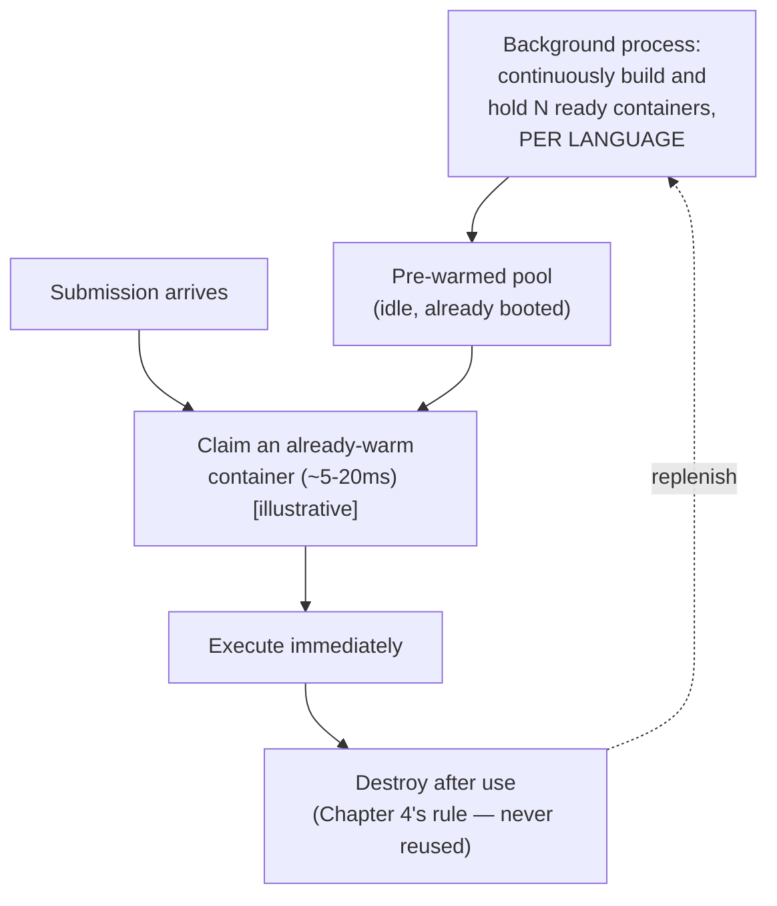

Claim time for an already-warm container: roughly **5-20ms** `[illustrative]`, versus the 300-500ms cold-start — call it a 10-40x improvement on the part of the process users actually feel waiting for. Runlet re-runs the contest-day math with pre-warmed pools live: the same 1,800-submission burst now feels instant to almost everyone, because the slow work already happened quietly in the background, minutes or hours earlier.

**New problem, visible partway through the very same contest:** pools are per-language, and languages aren't submitted in equal proportion. This particular contest's problems happen to favor Python — roughly 55% of submissions are Python, versus 20% Java and the rest split across C++ and JavaScript. Runlet had sized every language's pool equally, assuming a roughly even split. The Python pool, sized for "some slice of traffic," gets claimed faster than it can be replenished, while the Java and C++ pools sit mostly idle with spare warm containers nobody's using.

**How I'd say this in an interview:** "Pre-warmed pools trade a standing cost — idle containers sitting ready, per language — for cutting the part of startup latency users actually feel by an order of magnitude, roughly 10-40x in this case. But 'per language' isn't a detail, it's the whole mechanism — a submission can't run in the wrong language's sandbox, so an unbalanced pool means one language starves while another sits idle with spare capacity nobody can borrow."

---

## Chapter 6 — The waitlist that never turns anyone away

With the Python pool running dry mid-contest, Runlet's first instinct is the wrong one: when a pool has nothing to claim, reject the submission outright with a "server busy, try again" error. That's a bad experience during a *timed* contest — a rejected submission during a ticking clock feels like the platform failing the user, not the user's code failing.

The obvious question: *if the pool is temporarily out of ready containers, what should happen to a new submission that shows up right then?* It shouldn't be told "no." It should wait its turn, briefly, for a container to become free — and it should never even know the pool was empty for a moment, other than a slightly longer wait.

**The fix:** put a **submission queue** in front of the pools. A submission that arrives when its language's pool is empty doesn't get rejected — it sits in the queue, in order, while a background process races to replenish that language's pool as fast as capacity allows. The moment a container frees up (either newly built, or returned and rebuilt after the previous submission finished), the next queued submission claims it.

**The analogy:** a busy restaurant with a full dining room doesn't turn hungry customers away at the door — it takes their name, gives them a waitlist position, and texts them the moment a table's ready. Nobody's refused service; some people just wait a little longer than others, and the restaurant is working the whole time to seat the next name.

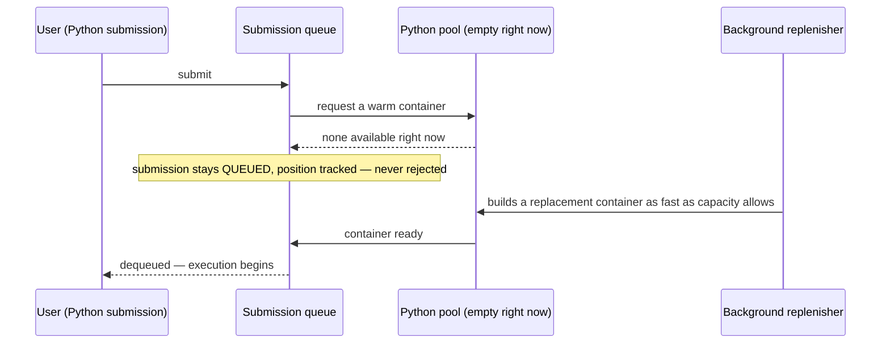

**New problem, once the contest-day retro happens:** the queue kept nothing from being outright rejected, which is the right behavior — but it also revealed that Runlet had been guessing at pool sizes rather than actually calculating them. Nobody could answer, with a number, "how big should the Python pool actually be for a contest this size?" That's not a queueing problem anymore — it's a capacity-planning gap.

**How I'd say this in an interview:** "A dry pool should degrade to a longer queue wait, never an outright rejection — the same admission-control instinct you'd use for any thundering-herd spike, just triggered by a contest deadline instead of a product launch. But a queue only buys you graceful degradation; it doesn't tell you how big to actually build each pool, and that's a real number you need to go compute."

---

## Chapter 7 — The math that says how big each pool actually is

Runlet sits down after the contest and works the numbers properly, instead of guessing.

```
Peak submission rate during the contest spike       ~= 2,000 submissions/sec [illustrative]
Average execution time per submission                 ~= 1.5 seconds
  (mix of quick scripts and slower multi-test-case runs)

Concurrent containers needed at peak
  = peak_rate x avg_execution_time
  = 2,000 x 1.5
  ~= 3,000 concurrent containers held at once

  -- this is the number that actually sizes the pool. NOT submission rate alone --
     a container is held for the FULL DURATION of one execution, not released
     the instant a submission is accepted.

Per-language split, using this contest's actual traffic mix
  (Python 55%, Java 20%, C++ 15%, JavaScript 10%):
  Python pool needed   = 3,000 x 0.55 = 1,650
  Java pool needed     = 3,000 x 0.20 =   600
  -- each language pool must be sized to ITS OWN share of concurrent demand --
     spare capacity sitting idle in the Java pool never rescues a starved
     Python pool, because a submission can't run in the wrong language's box.

Memory footprint at peak
  memory limit per container (Chapter 2's cgroup cap) = 256MB
  total memory footprint at 3,000 concurrent           = 3,000 x 256MB ~= 768GB
  -- a real, substantial infrastructure cost, directly proportional to how many
     concurrent containers you choose to keep ready -- which is exactly why the
     256MB cap itself isn't a throwaway number, it's a cost lever.
```

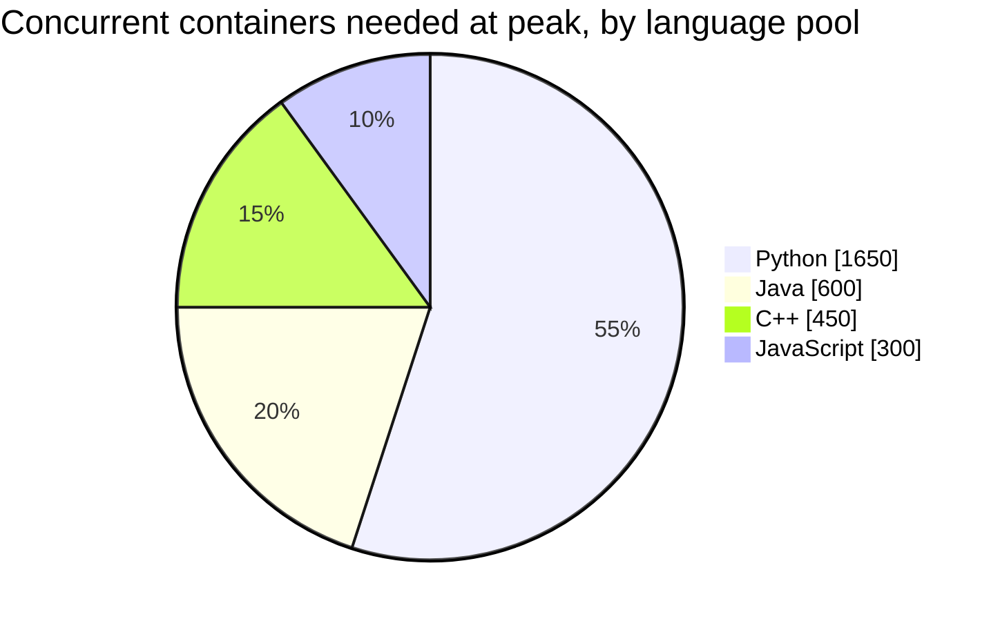

**The redo-the-chain test:** if the next contest is twice as popular and submission rate doubles to 4,000/sec at the same 1.5-second average execution time, concurrent container need doubles too, to ~6,000 — a direct, computable relationship, not a guess, and the number worth citing if an interviewer asks "how do you size this."

**How I'd say this in an interview:** "The number that sizes a pool is concurrent containers held, not raw submission rate — a container is occupied for an execution's *entire* duration. Compute it as rate times average duration, split proportionally by each language's real share of traffic, and treat memory-per-container as a cost lever, not a fixed given — right-sizing that cap directly right-sizes your total infrastructure bill at peak."

---

## Chapter 8 — The tiny house next to the rented room

Runlet's containers are now hard-capped on CPU/memory/processes, network-isolated, destroyed after every use, and pre-warmed per language with queueing to absorb spikes. By most measures, this is a solid system — and it's roughly where Judge0's own real, documented architecture lands too: containers, resource limits, per-submission isolation. But Runlet is growing past "coding-interview practice for a niche audience" into a fully public product anyone on the internet can sign up for and submit arbitrary code to, no vetting at all. A security-minded engineer raises an uncomfortable point: **containers share the host's kernel.** A container is a strongly-isolated *room*, but every room in the building shares the same structural foundation and walls — and a real, documented class of vulnerability (a container-escape CVE exploiting a kernel bug) can, in principle, let code inside one container reach the host, or another container, by going *through* that shared foundation rather than around the room's locked door.

The obvious question: *is that a real risk, or a theoretical one not worth the cost of fixing?* For an internal CI system running code from your own trusted engineers, it's reasonable to accept — the code source isn't adversarial. For a public product deliberately inviting arbitrary code from literally anyone, "the isolation depends on the shared kernel never having an exploitable bug" is a bet that gets worse, not better, the bigger and more attractive a target the platform becomes.

**The fix:** for the highest-risk, fully public tier of traffic, move from containers to **microVMs** — technology like **gVisor or Firecracker**, which is real and documented (Firecracker is the microVM technology AWS itself documents using to run Lambda functions in production). A microVM gives each submission its own lightweight virtual machine, with its **own kernel**, not a shared one — a materially smaller, more contained attack surface if something inside does try to break out.

**The analogy, one step past the shipping container:** a container is a **room you're renting inside someone else's building** — solidly locked, but the building's foundation and load-bearing walls are shared with every other room. A microVM is closer to **a tiny house with its own separate foundation**, sitting on the same lot but not structurally connected to anything else. A crack in the shared building's foundation can, in the worst case, reach every room built on it. A crack in one tiny house's foundation stays in that one tiny house.

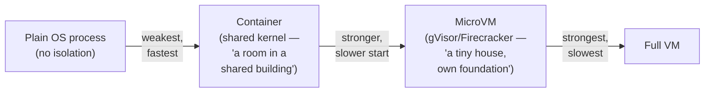

MicroVMs start slower than a container `[illustrative — meaningfully slower cold, though still fast warm]`, but Runlet's pre-warmed-pool mechanism from Chapter 5 already exists specifically to hide startup cost from the user-facing critical path — so the extra latency of a microVM largely gets absorbed by the same pool trick, rather than showing up as user-visible lag. Runlet moves its fully-public, no-vetting submission tier onto microVMs, while lower-risk internal tooling stays on the cheaper container tier.

**New problem, spotted once the isolation and pool sides are both settled:** everything so far has assumed one shape of interaction — submit code, get one final result back. But Runlet's product roadmap now includes a Replit-style live coding room, where a user types code, runs it, and expects to see output streaming in as it's produced, and possibly type input back mid-run. The batch "submit and poll for a final answer" model doesn't fit that at all.

**How I'd say this in an interview:** "Place your isolation choice explicitly on the process-to-container-to-microVM spectrum, and justify it by how adversarial the real code source is — a shared-kernel container is a reasonable default, but a fully public product accepting arbitrary code from anyone should lean toward microVM-level isolation like gVisor or Firecracker, accepting the extra startup cost, which pre-warmed pools already exist to hide."

---

## Chapter 9 — The chat window that doesn't fit in a mailbox

Runlet's engineers try the fastest possible way to bolt a live coding room onto the existing system: reuse the batch "submit, then poll for the result" API, but poll every 500ms instead of once. It's a disaster in practice. A user typing into an interactive prompt that expects to read a number from `stdin` mid-execution has nowhere to send that input — the batch API has no concept of "the program is still running and is now waiting on you." And output that should appear incrementally, line by line, as a script runs, instead shows up in one lump the next time a poll happens to land after the process finishes — which, for a long-running interactive script, might be never, since the whole point is that it isn't supposed to finish.

The obvious question: *why not just poll faster, like every 50ms?* Because the shape of the interaction is fundamentally wrong, not just too slow — polling is a request/response pattern for asking "is there a final answer yet," and an interactive REPL session doesn't have a single final answer; it has an open-ended back-and-forth that can go on indefinitely, with input flowing in both directions.

**The fix:** give the two modes genuinely different transport, not just different response formatting. Batch submissions keep the simple **submit, then poll (or get notified)** shape — there's exactly one final result. Interactive sessions get a **persistent, bidirectional connection** — a WebSocket, in Runlet's case — that stays open for the life of the session, streaming `stdout` out and accepting `stdin` in, continuously, in either direction, as long as the user keeps the session running.

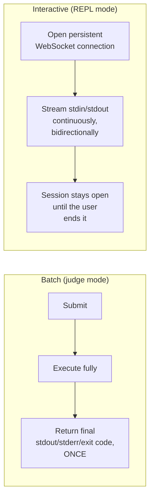

**New problem, surfacing within the first week of the interactive feature going live:** a user in a live coding room, testing exactly how fast they can flood output, writes a script that prints a line in a tight loop with no delay. It's not a fork bomb, and it doesn't touch much CPU or memory relative to Chapter 2's cgroup limits — it's a light, fast loop. But it produces an enormous *volume* of stdout in a very short time. Real number: a print loop generating a short string at full speed can produce on the order of hundreds of megabytes of output in just a few seconds `[illustrative]` — comfortably inside the CPU/memory execution limits, but the *service that captures and buffers that output* for streaming back to the user's browser has no cap of its own, and starts running out of memory trying to hold it all.

**How I'd say this in an interview:** "Batch and interactive execution aren't the same API with different formatting — one has exactly one final result, the other is an open-ended, bidirectional stream, and conflating them under-serves both. That said, streaming introduces a new failure mode that batch mode mostly hides: unbounded output volume, which sails right past your CPU and memory limits because it's not really a compute problem — it's a buffering problem, on a completely different part of the system."

---

## Chapter 10 — The cap that isn't about CPU or memory at all

The print-loop-flood incident is a genuinely different kind of problem than anything earlier in the story. Every prior limit — CPU quota, memory ceiling, process count — protects the *execution itself*. This bug happens even when execution behaves perfectly within all of those caps; the danger is entirely in how much output gets *captured and held onto* afterward, by a separate service that streams or stores results.

The obvious question: *doesn't the 256MB memory cgroup limit already cover this?* No — that limit caps memory used *inside the sandbox, by the running code*. The problem here is memory used *outside* the sandbox, by the output-capture pipeline holding a growing buffer of text it's trying to relay to the user's browser or persist for a later poll. Two different services, two different memory budgets, and only one of them had a cap.

**The fix:** cap captured output size explicitly, as its own limit, independent of the execution's CPU/memory/process limits. Once a submission's combined stdout/stderr crosses a fixed size — say, a few megabytes `[illustrative — enough for any reasonable test-case output, small enough to bound the capture service's memory]` — stop capturing further output, truncate what's shown, and clearly mark it as truncated so the user knows they hit a limit rather than assuming that's genuinely all their program printed.

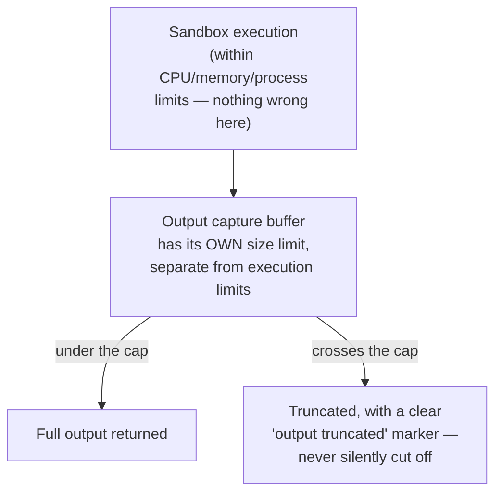

This closes the loop on the last open gap. Combined with everything from Chapters 1 through 9, Runlet's system now matches the real, documented shape this kind of platform actually needs: destroyed-after-use, resource-capped, network-isolated sandboxes, pre-warmed per language and queued under spikes, isolation strength chosen deliberately for how public and adversarial the traffic really is, batch and interactive traffic on genuinely different transports, and output itself treated as its own, separately-bounded resource.

**How I'd say this in an interview:** "Every earlier limit protects the sandbox from the code running inside it. This one protects the *rest of the system* from the sandbox's own legitimate, well-behaved output — a print loop that never trips a CPU or memory limit can still flood a downstream buffer that has no cap of its own. It's a small, easy-to-miss gap, and it's worth naming explicitly rather than assuming 'resource limits' already covers it."

---

## Where the story actually lands

```mermaid
flowchart LR
    A["Ch1: exec() on the\nshared web server\n(one bad loop wedges\nhalf the workers)"] -->|"fixes: isolation\nbreaks: no resource caps"| B["Ch2: cgroups\n(the fuse)"]
    B -->|"fixes: CPU/mem/pid caps\nbreaks: network still open"| C["Ch3: no network\nnamespace route"]
    C -->|"fixes: no exfiltration\nbreaks: reused sandbox leaks data"| D["Ch4: destroy after\nevery single use"]
    D -->|"fixes: no cross-tenant leak\nbreaks: cold start is slow"| E["Ch5: pre-warmed\npools per language"]
    E -->|"fixes: fast claim\nbreaks: one language's pool\ndrains under a spike"| F["Ch6: queue,\nnever reject"]
    F -->|"fixes: graceful degrade\nbreaks: pool sizes were guesses"| G["Ch7: capacity math,\nper-language sizing"]
    G -->|"fixes: right-sized pools\nbreaks: shared kernel risk\nfor a public product"| H["Ch8: microVMs\n(the tiny house)"]
    H -->|"fixes: stronger isolation\nbreaks: batch API can't do REPL"| I["Ch9: WebSocket\nstreaming session"]
    I -->|"fixes: real-time I/O\nbreaks: unbounded output\nfloods the buffer"| J["Ch10: output size cap,\nseparate from exec limits"]
```

```mermaid
mindmap
  root((Why a code execution\nengine needs all of this))
    Isolation
      exec() on shared server = one bad loop wedges everyone
      container = sealed shipping container
    Resource limits
      soft timers can be outrun
      cgroups = the fuse, enforced from outside
    Network & filesystem
      open network = exfiltration/abuse risk
      reused sandbox = cross-tenant leak
      fix: no network route + destroy after use
    Startup cost
      fresh sandbox every time is slow
      pre-warmed pool = valet already running the car
    Handling spikes
      dry pool should never reject
      queue = restaurant waitlist, never turned away
    Capacity
      concurrent containers, not raw rate, sizes the pool
      per-language proportional split
    Isolation strength ceiling
      containers share a kernel
      microVM = a tiny house, own foundation
    Interaction shape
      batch = submit once, poll once
      interactive = persistent bidirectional stream
    Output itself
      a print loop can flood a buffer
      cap output size, separate from CPU/memory limits
```

Every real code-execution system you'd design in an interview sits somewhere on this chain. The skill isn't reciting all ten chapters — it's stopping where the stated requirements say to stop. A simple internal coding-quiz tool for vetted employees might reasonably stop around Chapter 5 or 6. A fully public, adversarial-by-default product accepting arbitrary code from anyone on the internet needs to reach Chapter 8, 9, and 10. If nobody's mentioned interactive REPL sessions, walking all the way to Chapter 9 unprompted reads as padding, not depth.

---

## Grill me — adversarial follow-ups

**Q1: "Why not just give the web server more worker threads instead of moving execution off it entirely?"**
More threads just raises the number of infinite loops it takes to wedge the server — it doesn't fix the actual problem, which is that untrusted code is running in the same place as trusted request-handling logic at all. The fix isn't more capacity to absorb bad behavior, it's removing the coupling between "serve web traffic" and "run adversarial code" entirely.

**Q2: "You said cgroups are enforced 'from outside the process' — walk me through what that actually means mechanically."**
The kernel tracks resource usage for an entire cgroup — the container's whole process tree, including any children it forks — and compares it against the configured limits on every scheduling tick or memory allocation, independent of anything the processes inside are doing or requesting. When a limit is crossed, the kernel itself sends the kill or throttle, not a monitor process asking politely; the code inside the cgroup has no API to opt out of that check.

**Q3: "Isn't 'destroy and rebuild every time' wasteful compared to a well-tested reset script?"**
It costs more compute and repeated warm-up work, yes — but a reset script has to correctly anticipate every possible way a submission could leave state behind, and any gap in that list is a real cross-tenant data leak with actual user data at stake. Destroy-and-rebuild trades a knowable, bounded compute cost for eliminating an entire, open-ended bug category by construction.

**Q4: "If pre-warmed pools already fix cold-start latency, why bother with microVMs at all — just keep using containers everywhere?"**
Pre-warmed pools fix the *speed* problem, but they don't change the *isolation* problem — a container still shares the host's kernel no matter how fast it started. For a fully public product, the risk being addressed by microVMs is a kernel-level escape vector, which pool speed has nothing to do with; the two fixes solve genuinely different problems and you often want both together.

**Q5: "Why does each language need its own separate pool instead of one shared pool of generic containers?"**
Because a pre-warmed container isn't generic — it already has a specific language's runtime and toolchain booted and ready, and a Python submission simply can't execute inside a container that was warmed up as a Java sandbox. Sharing one pool would mean guessing the language mix in advance for every container, which defeats the purpose of pre-warming at all.

**Q6: "What's actually different between a submission that hits a resource limit and one that just has a runtime bug in the user's own code?"**
They need to be reported differently, because they mean different things to the user — a resource-limit kill (timeout, memory exceeded) says "the sandbox stopped your code because it broke a hard rule," while a non-zero exit code says "your code ran to completion and decided to fail on its own." Conflating them into one generic error field would hide genuinely useful debugging information from the user.

**Q7: "Your queue never rejects submissions — doesn't that mean a big enough spike just grows the queue forever?"**
In principle yes, and that's exactly why the capacity math in Chapter 7 matters — the queue is meant to absorb short-lived bursts while pools catch up, not to substitute for correctly sizing the pools in the first place. If sustained demand permanently exceeds pool capacity, the honest answer is "add more capacity," not "let the queue grow unbounded and call it handled."

**Q8: "Why is the output-size cap a separate limit from the memory cgroup limit, instead of just tightening the memory limit?"**
Because they're capping two different services' memory, not the same one — the cgroup limit bounds memory used *inside* the sandbox by the running code, while the output cap bounds memory used *outside* the sandbox, by whatever's buffering and relaying the captured output. Tightening the sandbox's memory limit does nothing to protect a downstream buffering service that has no cap of its own.

**Q9: "For a coding-practice product like this, is Firecracker/gVisor overkill, or the right default?"**
It depends entirely on how adversarial the real user base is — an internal tool for vetted employees can reasonably stay on well-hardened containers, but a public product accepting arbitrary submissions from literally anyone should lean toward the stronger, own-kernel isolation microVMs provide, because the cost of getting that judgment call wrong is a real security incident, not a minor outage. I'd say this out loud explicitly rather than defaulting to one answer, because the interviewer is grading whether you can place the trade-off correctly for the specific product in front of you.

**Q10: "If someone just says 'design a code execution engine' cold, where do you actually start?"**
Say the one framing sentence first: every submission is untrusted and adversarial by default, full stop, regardless of who the product's actual users are. Then walk forward in order — isolation, hard resource limits enforced from outside the process, network/filesystem confinement, destroy-after-use, then pre-warmed pools to make all of that fast — and only go deeper into microVMs or interactive streaming if the interviewer's stated requirements actually call for them.

---

## Cheat sheet — one line per stop on the story

- **Direct `exec()` on shared infrastructure**: one bad submission (an infinite loop) can wedge shared resources forever — the reason this whole system exists.
- **Containers**: a sealed shipping container — real filesystem/process isolation, but no resource caps unless you explicitly set them.
- **cgroups (CPU/memory/process limits)**: the fuse, not a request — enforced by the kernel from outside the process, so an infinite loop or fork bomb can't outrun it, and it doesn't rely on the code cooperating.
- **No network access by default**: the room has no phone line — a separate security boundary from resource limits, closing off exfiltration and abuse of your own infrastructure.
- **Destroy after every use, never reset-and-reuse**: rebuild the hotel room from the studs instead of cleaning it — closes an entire class of cross-tenant data-leak bugs by construction.
- **Pre-warmed pools, per language**: the valet already has your car running — cuts the startup latency users actually feel by roughly 10-40x, but each language needs its own proportionally-sized pool.
- **Submission queue in front of the pools**: the restaurant waitlist — a dry pool degrades to a longer wait, never an outright rejection.
- **Capacity math**: concurrent containers held (rate × average execution duration), split proportionally by each language's real share of traffic — not a guess, and not raw submission rate alone.
- **MicroVMs (gVisor/Firecracker)**: a tiny house with its own foundation, versus a rented room in a shared building — stronger isolation for a fully public product, at a startup cost pre-warmed pools already exist to hide.
- **Batch vs. interactive transport**: submit-and-poll for one final result, versus a persistent bidirectional stream for a live REPL — genuinely different shapes, not just different formatting.
- **Output-size cap, separate from execution limits**: even code that never breaks a CPU or memory rule can flood a downstream buffer with legitimate output — cap it on its own, independent of the sandbox's own resource limits.
- **The meta-lesson**: every fix in this story buys one property (isolation, hard limits, confinement, leak-safety, speed, graceful degradation, right-sizing, stronger isolation, real-time interaction, or buffer safety) by spending something else — say the trade in the same sentence you propose the fix.
