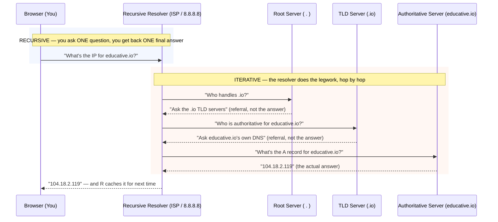
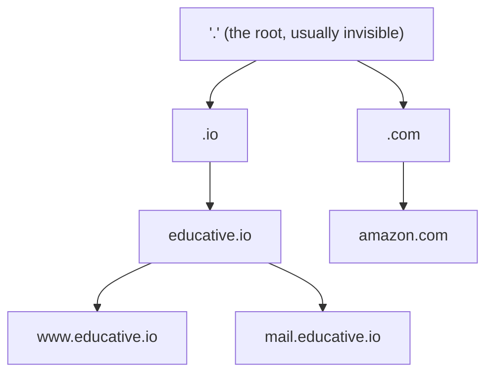
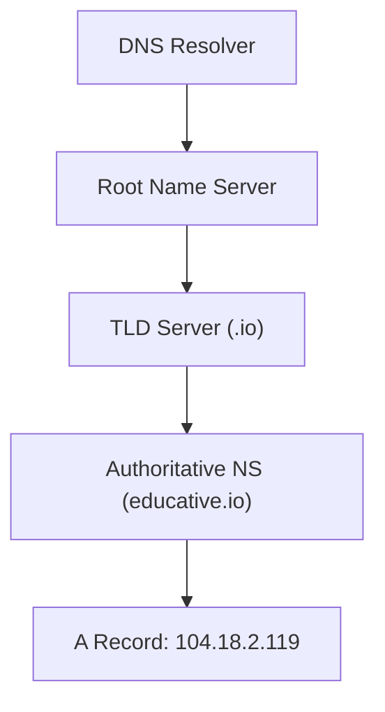
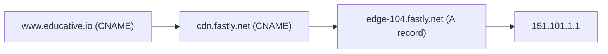
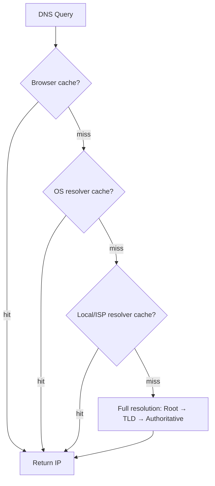
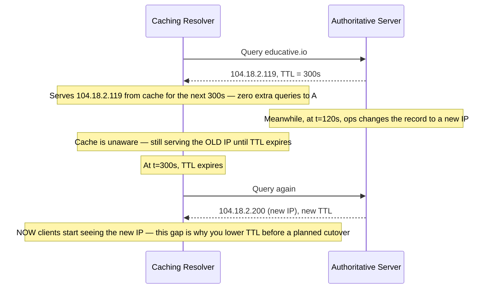
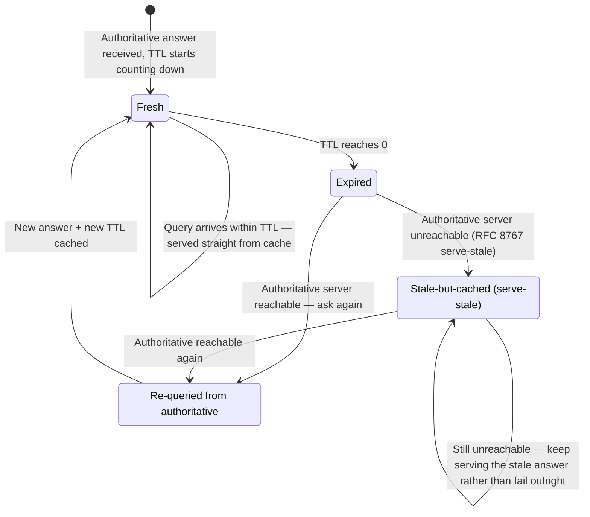
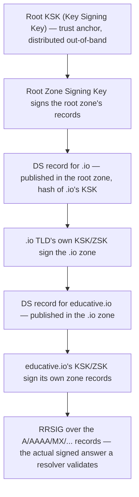
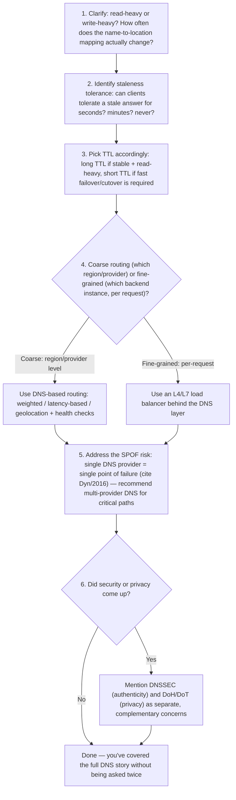

# DNS (Domain Name System) — FAANG Interview Guide

## Mental model

DNS is the Internet's **phone book**: it maps human-friendly names (`educative.io`) to machine-readable IP addresses (`104.18.2.119`). But the more useful interview framing is: **DNS is a globally distributed, hierarchical, eventually-consistent, read-heavy key-value store optimized for caching.** Every hard property of DNS (scalability, availability, staleness) follows from that framing — and it's the same framing you'll reuse when you design your own read-heavy distributed lookup service (service discovery, feature flags, config stores).

If you can explain *why* DNS is built the way it is (not just *what* it does), you signal senior-level systems thinking.

---

## 1. What DNS is and why it exists

- Computers are addressed by IP (e.g., `104.18.2.119`); humans can't memorize thousands of these, so we need a naming layer.
- DNS decouples **identity** (domain name) from **location** (IP address). This indirection is the same reason you'd put a load balancer or service registry in front of a fleet of servers — it lets the underlying IPs change (server failure, migration, scaling, cloud region moves) without breaking every client that references the name.
- It's **transparent to the end user** — the browser silently resolves the name before the HTTP request ever leaves the machine.

### The one diagram to remember

Everything else in this guide is detail on top of this single picture. Memorize this shape, not the prose.

**Memory hook — nest it like Russian dolls:** *one recursive call on the outside, wrapping an iterative walk on the inside.* You (the browser) never see the iterative part — that's entirely the resolver's problem to solve on your behalf. This single fact is what section 4 below is really about; everything there is just zooming into the orange box.

**Interview cheat-sheet:**
- DNS resolution happens **before** the TCP handshake — it's pure overhead on the critical path, which is exactly why caching at every layer matters so much.
- Say "DNS decouples name from location" when asked why any naming/discovery layer exists.
- Root/TLD replies are **referrals** ("ask someone else"), not answers — only the authoritative server gives the actual IP.
- Every DNS answer served before its TTL expires is a **cache hit** — the multi-hop dance in the diagram above is what happens on a *miss*, which is the rare case, not the common one.
- This mental model (globally distributed, hierarchical, eventually-consistent, cache-optimized KV store) is directly reusable for service-discovery/config-store design questions — say so explicitly.
- If asked to estimate DNS load, don't jump straight to numbers — state this framing first; it's *why* the numbers in section 6 work out the way they do.

---

## 2. DNS hierarchy — the four server types

DNS is **not one server** — it's a tree-structured infrastructure, which is the source of its scalability.

**Don't conflate two different trees** — this is the #1 thing people mix up:

1. **The naming tree (the data)** — how domain names themselves are structured, dot by dot:

2. **The server-role tree (the infrastructure that serves a slice of that data):**

| Server type | Role | Analogy |
|---|---|---|
| **DNS Resolver** (local/recursive resolver) | Entry point for the client; does the legwork of walking the tree on the client's behalf; caches aggressively | Your assistant who makes all the phone calls for you |
| **Root name servers** | Know which TLD servers exist (`.com`, `.io`, `.edu`); don't know actual IPs | "Which country is this address in?" |
| **TLD (Top-Level Domain) name servers** | Know the authoritative servers for each registered domain under that TLD | "Which city, within that country?" |
| **Authoritative name servers** | Owned/operated by the organization; hold the actual resource records (A, CNAME, MX, etc.) | "Which house, on that street?" — the final, exact answer |

**Memory hook — asking for directions, one zoom level at a time:** "Which country?" → "Which city?" → "Which street?" → "Which house?" Each server only answers *its own* zoom level and delegates the rest — nobody holds the whole map.

**Key fact to memorize:** There are **13 logical root server addresses** (letters A–M), operated by **12 different organizations**, but physically replicated into **~1,000+ instances worldwide** using anycast IP routing. This is the canonical example of "logical count stays fixed, physical replication scales horizontally" — a pattern you'll reuse when discussing sharding vs. replication.

### Anycast vs. unicast — the trick that makes "13 servers" a lie in the best way

Root servers, public resolvers, and CDN edges all rely on **anycast**; a typical origin server relies on **unicast**. These are never contrasted directly, but the difference is exactly what makes DNS's scale numbers make sense:

| | Anycast | Unicast |
|---|---|---|
| IP-to-node mapping | The **same IP address** is announced from many physical locations simultaneously; BGP routes each client to the topologically nearest instance | One IP address maps to exactly **one** physical node |
| Who uses it | Root servers, TLD servers, public resolvers (8.8.8.8, 1.1.1.1), CDN edge PoPs | A typical origin server, a single-region database primary |
| Failure behavior | An instance can go dark and BGP simply stops advertising its route — traffic reroutes to the next-nearest instance, transparently, with no DNS change needed | Node failure requires an explicit failover mechanism (DNS record change, VIP move, etc.) |
| Why it matters here | This is *how* "13 logical roots" become "~1,000 physical instances" without any client doing anything differently | The contrast case — what you'd have *without* anycast: one IP, one place, one point of failure |

Domain names are resolved **right to left**: `www.educative.io` → root (`.`) → `.io` → `educative.io` → `www.educative.io`. This is why root servers are queried first even though they're "furthest" from the actual answer conceptually.

**Interview cheat-sheet:**
- Four layers: Resolver → Root → TLD → Authoritative.
- Root servers answer "which TLD server?", not "what's the IP?" — each layer only knows how to route to the *next* layer, not the final answer (delegation of responsibility, just like a routing table).
- 13 logical roots, 12 orgs, ~1000 anycast instances — say this number, interviewers like it.
- Anycast = one IP, many physical machines, BGP picks the nearest one; unicast = one IP, one machine. This is the mechanism, not just a buzzword.
- Don't confuse the naming tree (dot-separated domain hierarchy) with the server-role tree (resolver/root/TLD/authoritative) — two different trees, easy to conflate under interview pressure.
- "Delegation" is the operative word: every layer except the authoritative server only knows how to point to the *next* layer.

---

## 3. Resource Records (RRs) — the actual data model

The DNS database is a set of **resource records**, each a `(Type, Name, Value)` triple. This is DNS's actual "schema."

| Type | Purpose | Name | Value | Example |
|---|---|---|---|---|
| **A** | Hostname → IPv4 | Hostname | IP address | `(A, relay1.main.educative.io, 104.18.2.119)` |
| **AAAA** | Hostname → IPv6 | Hostname | IPv6 address | `(AAAA, educative.io, 2606:4700::...)` |
| **NS** | Authoritative DNS server for a domain | Domain name | Hostname | `(NS, educative.io, dns.educative.io)` |
| **CNAME** | Alias → canonical hostname | Alias hostname | Canonical name | `(CNAME, www.educative.io, server1.primary.educative.io)` |
| **MX** | Mail server for a domain | Domain/alias | Mail server hostname | `(MX, mail.educative.io, mailserver1.backup.educative.io)` |
| **TXT** | Arbitrary text (SPF, domain verification) | Hostname | Text string | used for email anti-spoofing, ownership proofs |
| **SOA** | Zone's authoritative info (refresh/retry/TTL defaults) | Zone | Admin metadata | governs zone transfer behavior |

**Memory hook — the 7 record types, one sentence:** *"Ants Always Carry Mangoes To Nervous Snails"* → **A**, **A**AAA, **C**NAME, **M**X, **T**XT, **N**S, **S**OA. Say it once out loud and you won't blank on the list under pressure.

**CNAME chains resolve like alias-following, always ending in an A record:**

**Memory hook:** a CNAME is a signpost saying "actually, ask over there" — the resolver keeps following signposts until it hits an **A record**, which is the only record type that ends the chase with a real IP.

### CNAME vs. A/AAAA vs. ALIAS/ANAME — the classic gotcha

| | A / AAAA | CNAME | ALIAS / ANAME (provider extension) |
|---|---|---|---|
| Points to | An IP address, directly | Another hostname (indirection) | Another hostname, but resolved **server-side** into an IP before the answer ever reaches the client |
| Can coexist with other records at the same name? | Yes | **No** — if `www` has a CNAME, it can hold *no other record* (no MX, no TXT, nothing) at that exact name | Yes — behaves like an A record on the wire |
| Usable at the zone apex (`example.com` itself)? | Yes | **No** — RFC 1034 forbids a CNAME at the apex because the apex must also carry NS/SOA records, which can't coexist with a CNAME | Yes — this restriction is *precisely why it was invented* |
| Typical use | Origin servers, load balancer VIPs | `www.example.com` → CDN/vendor hostname | Naked domain (`example.com`) → CDN hostname, when you need CNAME-like flexibility at the apex |

**The gotcha to say out loud:** "You can't put a CNAME at a zone apex, and a CNAME can't share a name with any other record — that's why ALIAS/ANAME records exist, as a DNS-provider-side workaround, not an IETF standard record type."

**Why this matters in an interview:** if you're asked to design a **global traffic routing / multi-region failover** system, the answer is almost always "use DNS with short TTLs and health-checked A/CNAME records" (this is literally how Route 53 and Cloudflare Load Balancing work). Knowing the RR types lets you say concretely: "point the CNAME at a weighted/latency-based routing policy, and have health checks pull unhealthy IPs out of rotation."

**Interview cheat-sheet:**
- RR = `(Type, Name, Value)`. Know A, NS, CNAME, MX cold.
- CNAME is an alias layer — useful for pointing your domain at a third-party service (CDN, load balancer) without hardcoding IPs.
- This RR model is *why* DNS-based traffic steering (GSLB, blue-green deploys, canary by region) works.
- CNAME's two hard rules: can't coexist with other records at the same name, can't sit at a zone apex — ALIAS/ANAME exists specifically to route around rule two.
- Mnemonic for all 7 types: "Ants Always Carry Mangoes To Nervous Snails" → A, AAAA, CNAME, MX, TXT, NS, SOA.
- SOA isn't just trivia — it holds the refresh/retry/expire timers that govern how secondary name servers stay in sync with the primary.

---

## 4. Iterative vs. recursive resolution

Two query styles, and interviewers love this distinction because it maps to a general "who does the work" trade-off you'll see again in proxies/gateways.

| | Iterative | Recursive |
|---|---|---|
| Who does the walking | The **querying server** (local resolver) does all the round trips itself, receiving referrals ("ask X next") at each step | Each server forwards the request **on your behalf** and returns only the final answer |
| Load on upstream servers | Lower — root/TLD servers just return a referral and are done | Higher — root/TLD/auth servers would need to do the recursion themselves |
| Who's typically doing this | ISP/local resolver → root/TLD/auth (iterative from resolver's perspective) | Client → local resolver (recursive from client's perspective) |
| Real-world usage | **Preferred between resolver and upstream** servers to protect root/TLD infra from load | **Preferred between client and local resolver** — the client wants a single round trip |

This is the same recursive/iterative split already color-coded in **section 1's diagram** — blue box is recursive, orange box is iterative; scroll up if you want the visual.

**Interview cheat-sheet:**
- Client-to-resolver = recursive (client wants zero extra round trips).
- Resolver-to-{root,TLD,auth} = iterative (protects upstream servers from doing recursive work for every client on Earth).
- The "why": recursive resolution at massive fan-in (root servers) would multiply load; iterative keeps root/TLD servers stateless and cheap to serve.
- This is a general "who does the work" pattern — the same recursive-vs-iterative trade-off shows up in proxies, gateways, and distributed query planners.
- If a resolver were misconfigured to make fully recursive queries against a root server, that's the load-amplification failure mode interviewers are probing for with "what could go wrong here."

---

## 5. Caching — the mechanism that makes DNS actually work

Without caching, every page load would require 3–4 round trips to root/TLD/authoritative servers — DNS would collapse under global query volume. Caching exists at **every layer**:

- Caching happens in: **browser → OS stub resolver → local/ISP recursive resolver**.
- Even a **partial cache hit helps**: if the resolver doesn't have `educative.io`'s IP cached but *does* have the `.io` TLD server's IP cached, it skips the root server hop entirely.
- Each cached record carries a **TTL (time-to-live)**, set by the authoritative server, controlling how long downstream caches may serve it before re-validating.

**TTL as a timeline — this is what "eventual" actually looks like:**

**The same timeline as a state machine — a record's life in a cache:**

**TTL is a trade-off knob** — this is the single most interview-relevant fact in this chapter:
- **Long TTL** → less load on authoritative/root infra, faster average resolution, but slow to propagate IP changes (bad during failover/migration).
- **Short TTL** → fast failover and traffic steering, but more load and higher average latency (more cache misses).
- This is *exactly* the mechanism behind **blue-green deployments, disaster recovery cutover, and weighted traffic shifting** — ops teams **lower TTL in advance** of a planned cutover so the old cached records expire quickly when they flip the record.

**Interview cheat-sheet:**
- Name the 4 cache layers: browser, OS, local resolver, ISP resolver.
- TTL is a latency-vs-staleness dial — say this explicitly if asked "how would you migrate traffic to a new datacenter with DNS."
- Caching is *why* DNS scales to billions of daily queries despite having relatively few root/TLD servers.
- TTL lifecycle has 4 named states worth knowing: Fresh → Expired → Re-queried, with an optional Stale-but-cached detour if the authoritative server is unreachable (serve-stale, RFC 8767) — see the state diagram above.
- Section 6 turns this into real numbers: cache hit rate ≈ 1 − 1/(query-rate × TTL).
- Serving a stale-but-cached answer during an authoritative outage is a deliberate resilience feature, not a bug — it trades a few stale answers for continued availability.

---

## 6. Capacity estimation — sizing DNS traffic, worked example

Interviewers expect a numbers pass whenever a chapter is "read-heavy + caching" — DNS is the canonical warm-up for that muscle. State assumptions out loud, then compute.

**Global query volume:**
- ~5 billion internet-connected people; each device fires roughly 50–100 DNS lookups/day (every distinct hostname on every page load: main site + CDN + ads + analytics + fonts...). Take **80** as a round middle estimate.
- Daily volume ≈ 5B × 80 ≈ **400 billion queries/day** ≈ **~4.6 million queries/second** average (real traffic is bursty; peak is several× that).

**Fan-in at the root/TLD layer:**
- Only a **cache miss** ever reaches root/TLD/authoritative — recursive resolvers absorb the overwhelming majority of that ~4.6M qps.
- ~1,000 anycast root instances worldwide → even if 1% of global queries missed every cache and hit a root server, that's ~46,000 qps spread across 1,000 instances ≈ **~46 qps/instance** — trivially small.
- This is *why* the anycast + caching combo scales: fan-in gets divided **twice** — once by anycast routing (many physical instances share the load), once by caching (most queries never leave the resolver at all).

**Cache-hit-rate math — why TTL choice quantitatively matters:**
- Model: a hostname with TTL = T seconds, queried at rate λ (queries/sec) against one resolver, causes **1 upstream query** per T-second window and serves **(λT − 1)** answers straight from cache out of λT total queries.
- Cache hit rate ≈ (λT − 1) / λT = **1 − 1/(λT)** for λT ≫ 1.
- Take λ = 10 queries/sec for a popular hostname at a large resolver (realistic for an ISP resolver on a popular CDN name):
  - **TTL = 60s:** λT = 600 → hit rate ≈ 1 − 1/600 ≈ **99.83%** — roughly 1 upstream query per 600 client queries.
  - **TTL = 3600s (1 hr):** λT = 36,000 → hit rate ≈ 1 − 1/36,000 ≈ **99.997%** — roughly 1 upstream query per 36,000 client queries, a **~60× reduction** in upstream load versus TTL = 60s.
- What this quantifies: dropping TTL from 3600s to 60s multiplies authoritative-server load ~60× for that hostname, in exchange for propagation delay dropping from up to an hour to under a minute — the exact math behind "lower TTL before a planned cutover, raise it back afterward."

**Interview cheat-sheet:**
- Global DNS volume: **hundreds of billions of queries/day**, single-digit millions of qps average.
- Caching + anycast divide fan-in twice — that's why ~1,000 root instances can serve the entire planet.
- Cache hit rate ≈ 1 − 1/(λT) — bigger TTL or higher per-hostname query rate both push hit rate toward 100%.
- Have a concrete number ready: "TTL=60s vs TTL=3600s is roughly a 60× difference in upstream load for the same client traffic."
- Even a "small" 0.17% miss rate (TTL=60s case) is still ~8M queries/day hitting authoritative infra for one popular hostname — miss rate that looks tiny in percentage terms is not tiny in absolute terms at internet scale.

---

## 7. DNS as a distributed system: scalability, reliability, consistency

This is the section that turns "DNS trivia" into "distributed systems fundamentals" — bring this up explicitly, it's the strongest signal you can give.

### Scalability
- Hierarchical sharding of the namespace: root servers own the very top, TLD servers own one slice each, authoritative servers own their own zone. No single server holds the whole database — this is **partitioning by key prefix** (reversed domain name) at global scale.
- ~1,000 anycast-replicated instances of the 13 logical root servers absorb query fan-in without any single machine becoming a bottleneck.

### Reliability
Three independent mechanisms combine:
1. **Caching** — stale-but-available data survives origin outages (a soft form of graceful degradation).
2. **Replication** — every logical server has many physical replicas geographically distributed (redundancy against failure and reduces latency via proximity).
3. **Protocol choice: UDP over TCP** — DNS predominantly uses UDP because:
   - Only needs **1 round trip** vs. TCP's 3-way handshake (lower latency).
   - If a UDP response is lost, the resolver just **retries** — acceptable because DNS queries are small, idempotent, and cheap to redo.
   - TCP is used as a fallback for large responses (>512 bytes traditionally, or when `EDNS0`/DNSSEC increases payload size) or for zone transfers between servers.

### Consistency
- DNS deliberately **trades strong consistency for availability and performance** — a textbook **CAP theorem / PACELC example** to cite when discussing eventual consistency.
- Justification: DNS is **extremely read-heavy** (reads:writes ratio is enormous), so optimizing for fast, cheap reads via caching is the right call even though it means writes (record updates) propagate lazily.
- Propagation of an updated record can take **anywhere from a few seconds up to ~3 days**, depending on:
  - The TTL set on the previous cached value (won't update until TTL expires).
  - Which level of the tree is being updated (a change at an authoritative server propagates faster than a change that also requires updating NS delegation at the TLD level).
- This is **eventual consistency by design** — exactly the model you'd argue for in a system where reads vastly outnumber writes and slight staleness is tolerable (e.g., CDN edge caches, feature-flag propagation, service discovery).

**Interview cheat-sheet:**
- "DNS sacrifices strong consistency for read performance — a real-world PACELC example." Say this line verbatim if CAP/PACELC comes up.
- UDP is preferred: 1 RTT vs. TCP's 3-way handshake; retries handle loss; TCP is the fallback for large payloads/zone transfers.
- Reliability = caching + replication + cheap retryable protocol — three independent layers of defense, not one.
- Propagation delay range: seconds to ~3 days — cite this number.
- Say "partitioning" explicitly when describing the hierarchy — root/TLD/authoritative is DNS's version of sharding by (reversed) key prefix.
- The Dyn 2016 outage (section 10) is the concrete cautionary tale for "what happens when you under-invest in DNS reliability."

---

## 8. DNS-based load balancing & traffic steering

Section 3 already showed CNAME/A records can point at different places — this section is about *how* the authoritative server decides *which* answer to hand back, and how that compares to a real load balancer.

**Traffic-steering policies (what Route 53 / GeoDNS actually let you configure per-record):**
- **Weighted routing:** each candidate record gets a weight (e.g., 80/20); the authoritative server returns record A to ~80% of queries and record B to ~20%, chosen roughly at random per query. Used for canary releases and gradual traffic shifting.
- **Latency-based routing:** the authoritative server keeps a latency table between regions/edge locations and returns whichever endpoint has the lowest *measured* latency to the resolver's presumed location (approximated from the resolver's IP, not the client's — an important caveat to state out loud).
- **Geolocation routing:** returns a different answer purely by the *geographic origin* of the query (country/continent/state) — used for content licensing, data-residency rules, or "serve the .de site to German visitors," independent of latency.
- **Health-check-driven removal:** the DNS provider runs out-of-band health checks (HTTP/TCP/ping) against each candidate endpoint every N seconds; an endpoint that fails checks is automatically pulled out of the answer rotation until it recovers — this is what makes DNS-based failover "automatic" instead of requiring a human to edit a record.

**Memory hook:** weighted = "roll loaded dice," latency-based = "pick the fastest road right now," geolocation = "pick by passport," health-check = "the dice only has faces that are currently alive."

### DNS-based load balancing vs. L4/L7 load balancer

| | DNS-based load balancing | L4/L7 load balancer (ALB/NLB, Envoy, HAProxy) |
|---|---|---|
| Granularity | Coarse — routes by *hostname resolution*, before any connection is even opened | Fine — routes/inspects individual connections or requests |
| Reaction time | Slow — bounded by TTL; a client with a cached answer keeps using it until TTL expires, even after a health check has already failed upstream | Instant — every new connection/request is routed live against current backend state |
| Visibility into backend load | None in real time — only periodic out-of-band health checks (up/down), no per-request load signal | Full — can balance on live connection counts, response times, request content |
| Client-side caching in the way | Yes, by design — that's the whole point of DNS, and exactly what limits reaction time | None — every request re-evaluates routing |
| Where it sits | Before the client even opens a connection | After the client has already resolved an IP and is opening/using a connection |
| Best for | Coarse routing across regions/providers, cheap global failover, canary-by-percentage | Fine-grained per-request routing, instant failover, content-based routing (path, headers) |
| Typical pairing | Used *together* in practice: DNS routes you to the right region, then an L4/L7 LB inside that region does fine-grained balancing across instances | — |

**Interview cheat-sheet:**
- Name the three routing policies cold: weighted, latency-based, geolocation.
- Health checks don't change traffic *instantly* — they change what the authoritative server hands out on the *next* query; existing caches downstream still hold the old (possibly unhealthy) answer until TTL expires. State this limitation explicitly.
- Low TTLs are paired with health-check-driven DNS LB for exactly this reason — a long TTL would keep sending traffic to a dead endpoint long after the health check caught it.
- DNS LB and L4/L7 LB are complementary, not competing — DNS picks the region/provider, the L4/L7 LB picks the instance.
- If asked "would DNS alone be enough for failover," the answer is no — it's a coarse, cache-delayed dial, not a real-time switch.

---

## 9. DNSSEC — securing the chain of trust

DNS answers are plaintext and, without DNSSEC, unauthenticated — anything on the path, or able to guess a query's transaction ID, can forge a response. DNSSEC lets a resolver **verify an answer actually came from the zone's real owner**, without changing what a DNS answer looks like on the wire.

**Chain of trust:**

**The three record types that do the work:**

| Record | Role |
|---|---|
| **DNSKEY** | Publishes a zone's public key(s) — a Zone Signing Key (ZSK) for day-to-day signing, and a Key Signing Key (KSK) that signs the ZSK and is the one referenced by the parent zone |
| **RRSIG** | The actual digital signature over a specific record set (e.g., all A records for a name) — this is what a validating resolver checks against |
| **DS (Delegation Signer)** | Lives in the **parent** zone (e.g., `.io`'s zone holds the DS for `educative.io`) — a hash of the child zone's KSK, which delegates trust downward without the parent needing the child's full key |

**Memory hook:** DS is the parent vouching for the child ("I attest this hash belongs to my child zone's key"); RRSIG is the child signing its own answers; DNSKEY is the child publishing the key that makes RRSIG checkable. Chain of trust = a chain of DS records walking down from the root KSK to your zone.

**What DNSSEC defends against:** cache poisoning / the **Kaminsky attack** (2008) — where an attacker races forged responses (guessing the 16-bit transaction ID and source port) to get a resolver to cache a forged IP for a real hostname before the genuine authoritative response arrives. A validating resolver checks RRSIG against a trusted DS chain and rejects any answer it can't cryptographically verify, closing this off entirely.

**What DNSSEC explicitly does NOT do — the classic gotcha:**
- It does **not encrypt** anything — queries and responses stay plaintext on the wire; anyone on-path can still see *which domain* a client is asking about.
- It does **not hide who's asking** — zero confidentiality for the querying client.
- Confidentiality is a separate protocol layer entirely: **DoH (DNS-over-HTTPS)** and **DoT (DNS-over-TLS)** encrypt the transport between client and resolver. DNSSEC is about the *authenticity of the answer*; DoH/DoT are about the *privacy of the question*. They're complementary, not substitutes — interviewers like hearing that distinction stated explicitly.

**Interview cheat-sheet:**
- DNSSEC = authenticity/integrity of DNS answers (signed records), not confidentiality.
- Chain of trust: root KSK → DS record in parent zone → child zone's DNSKEY → RRSIG over the actual records.
- Defends against cache poisoning / Kaminsky-style spoofing attacks.
- Does **not** encrypt queries or hide the client — that's DoH/DoT's job, a different problem DNSSEC doesn't touch.
- If asked "how would you secure DNS," the complete answer pairs DNSSEC (authenticity) with DoH/DoT (privacy) — two separate concerns usually both wanted together.
- DS records are the delegation mechanism — without one published in the parent zone, a child zone's signatures have nothing to anchor to, and validation falls back to "insecure."

---

## 10. Real-world systems and how they actually use DNS

| System | How it uses DNS concepts |
|---|---|
| **AWS Route 53** | Authoritative DNS with weighted, latency-based, and geo-routing records; health checks auto-remove unhealthy endpoints from A/CNAME rotation — DNS *is* the global load balancer (see section 8). |
| **Cloudflare DNS / 1.1.1.1** | Anycast-routed recursive resolver — the same IP address is announced from hundreds of PoPs; BGP routes the client to the nearest one (same anycast trick root servers use, see section 2). |
| **Netflix** | Uses DNS + Route 53 for multi-region failover; lowers TTL before planned regional evacuations so traffic reroutes quickly once the record flips. |
| **CDNs (Akamai, Cloudflare, Fastly)** | CNAME your domain to the CDN's domain; the CDN's authoritative DNS returns the *nearest edge PoP's* IP per-query — DNS-based geo-steering is the entry point to the whole CDN. |
| **Kubernetes (CoreDNS/kube-dns)** | Cluster-internal service discovery reimplements the exact same hierarchy-and-cache pattern at a smaller scale: `service.namespace.svc.cluster.local` mirrors DNS's dotted, right-to-left hierarchical namespace. |
| **DNSSEC** | Cryptographically signs records (RRSIG, DNSKEY, DS) to defend against cache poisoning/spoofing — see section 9 for the full chain-of-trust breakdown; the classic follow-up trap is confusing it with encryption (it isn't). |
| **DDoS on DNS (Dyn/2016)** | A single authoritative DNS provider outage took down Twitter, Netflix, Reddit, etc. — the canonical example of why DNS is a **single point of failure** if you don't multi-provider it. Good example for "what could go wrong" discussions. |

**Interview cheat-sheet:**
- Route 53 and CDNs are DNS-based load balancers in disguise — weighted/latency/geo routing + health checks (section 8 has the mechanics).
- Cloudflare 1.1.1.1 and root servers use the exact same anycast trick — one IP, many physical PoPs, BGP does the routing.
- Kubernetes' cluster DNS (CoreDNS) proves this pattern generalizes below the public internet — same hierarchy, same caching, smaller scale.
- Dyn 2016 is the go-to real-world SPOF example: one DNS provider outage took out Twitter, Netflix, Reddit, and Spotify simultaneously.
- DNSSEC's full breakdown lives in section 9 — don't just say the acronym, be ready to sketch the chain of trust.
- Every row in this table is really the same three ideas (hierarchy, caching, anycast) reapplied — that pattern-recognition is worth saying out loud.

---

## 11. Interview Playbook — the order to talk through DNS out loud

Rather than memorizing a list of "trigger phrases," walk this checklist in order whenever a design question smells like DNS. It's fully repeatable across problems.

**Trigger phrases that mean "this is secretly a DNS question":**
- "How would you route users to the **nearest data center**?" → step 4, DNS geo/latency-based routing.
- "How do you achieve **zero-downtime failover** to a backup region?" → steps 3 and 5: lower TTL ahead of time, flip the authoritative record, rely on health checks.
- "How does a client discover which server to talk to?" (microservices/service-discovery) → same tree/cache pattern as DNS, even when implemented via a service registry instead of literal DNS.
- "What happens when you type a URL into a browser?" → classic opener; DNS resolution is stage 1 — walking resolver → root → TLD → authoritative with caching at each layer demonstrates depth.
- "Why did **[cite a real DNS outage]** cause a wide outage?" → step 5, SPOF discussion, multi-provider DNS, caching as graceful degradation.
- Any question about **CAP/PACELC trade-offs** in a read-heavy system → DNS is the go-to concrete example of trading consistency for availability/performance.
- "How would you **version or gradually roll out** an IP/endpoint change to millions of clients?" → step 3, TTL as the propagation-speed dial.

---

## 12. Common follow-up/trick questions

**Q: Why doesn't DNS just use TCP always, for reliability?**
A: TCP's 3-way handshake adds a full extra round trip before any data moves — for a request this small and frequent, that's a large relative overhead. UDP's fire-and-retry model is cheaper at DNS's query volume and modern networks are reliable enough that retries are rare. TCP is kept as a fallback for responses too large for a single UDP datagram (DNSSEC, many records) and for admin operations like zone transfers.

**Q: What happens if the network is congested — should DNS keep using UDP?**
A: This is where the trade-off shows: congestion increases UDP packet loss, so retries increase, which can look like added latency, not a hard failure (unlike TCP where the handshake itself might stall). Because queries are idempotent and cheap, resolvers will keep retrying; some implementations fall back to TCP if responses keep failing/truncating. The point to make: DNS's reliability model assumes *retryable* loss, not persistent congestion — under sustained congestion, you'd want TCP or larger resolver-side timeout/retry tuning.

**Q: How would you keep DNS strongly consistent, and what would it cost you?**
A: You'd need synchronous replication/consensus across every replica of every authoritative and caching layer worldwide before acknowledging a write — this kills DNS's core value proposition (fast, cheap, cached reads at planetary scale) for a property (instant consistency) that write-rare, read-heavy workloads don't need. This is the standard "would you actually want strong consistency here" trap question — the answer is no, and you should say why.

**Q: What is a stub resolver vs. a recursive resolver?**
A: The **stub resolver** lives on the client OS — it doesn't do the tree walk itself, it just forwards the query to a configured recursive resolver and caches the answer locally. The **recursive resolver** (ISP or public like 8.8.8.8/1.1.1.1) does the actual iterative walk through root → TLD → authoritative on the client's behalf.

---

## 13. Golden Rules

- **Never use DNS as your only failover mechanism** — it's a coarse, cache-delayed dial, not an instant switch; pair it with health checks and, for anything critical, a secondary DNS provider.
- **TTL is a dial you tune, not a fixed constant** — lower it before a planned cutover, raise it back once things stabilize to cut load.
- **Cache at every layer of the chain, or the whole tree collapses under root/TLD load** — browser, OS, and resolver caching together are what let ~1,000 root instances serve the entire planet.
- **A CNAME can't coexist with other records at the same name, and can't sit at a zone apex** — reach for ALIAS/ANAME (or a plain A record) instead.
- **Anycast is what turns "13 logical servers" into planet-scale infrastructure** — know the difference from unicast cold.
- **DNSSEC authenticates, it does not encrypt** — pair it with DoH/DoT if privacy is the actual ask.
- **Report propagation delay honestly** — "seconds to ~3 days" depending on TTL and tree level; never promise instant global consistency.

---

## Master Cheat Sheet

**The memory hooks, all in one place:**
1. **Russian dolls:** recursive (outer, one call) wraps iterative (inner, hop-by-hop referrals).
2. **Asking for directions:** country → city → street → house = root → TLD → authoritative → the answer.
3. **CNAME = signpost:** keep following signposts until you hit an A record; that's the real IP.
4. **"Ants Always Carry Mangoes To Nervous Snails":** the 7 record types, in order — A, AAAA, CNAME, MX, TXT, NS, SOA.

**Core definition:** DNS = distributed, hierarchical, heavily-cached, eventually-consistent name→IP lookup service.

**Hierarchy (top to bottom):** Resolver → Root (13 logical, 12 orgs, ~1000 anycast instances) → TLD (`.com`, `.io`, …) → Authoritative (org-owned).

**Resource record = `(Type, Name, Value)`.** Know: A (host→IPv4), AAAA (host→IPv6), NS (authoritative server), CNAME (alias→canonical), MX (mail server). CNAME can't coexist with other records at the same name or sit at a zone apex — ALIAS/ANAME works around the second rule.

**Resolution direction:** right-to-left (`www.educative.io` → `.` → `.io` → `educative.io` → `www`).

**Query styles:**
- Client → resolver = **recursive** (single round trip for the client).
- Resolver → root/TLD/auth = **iterative** (protects upstream infra from doing recursion for everyone).

**Caching layers:** browser → OS → local/ISP resolver. Governed by **TTL**, set by the authoritative server. TTL = latency-vs-staleness dial; lower it before planned cutovers/migrations. Lifecycle: Fresh → Expired → Re-queried, with an optional Stale-but-cached detour on authoritative outage.

**Capacity math to have ready:** ~400B queries/day globally (~4.6M qps average); cache hit rate ≈ 1 − 1/(query-rate × TTL); TTL=60s vs TTL=3600s is roughly a 60× difference in upstream load for the same traffic.

**Reliability = caching + replication + UDP-with-retry** (UDP: 1 RTT vs TCP's 3-way handshake; TCP is the large-payload/zone-transfer fallback).

**Consistency:** eventually consistent by design — a canonical CAP/PACELC example (trades consistency for read performance because reads ≫ writes). Propagation: seconds to ~3 days depending on TTL and which tree level changed.

**Anycast vs unicast:** anycast = one IP, many physical machines, BGP picks the nearest; unicast = one IP, one machine, no automatic failover.

**DNS-based LB vs L4/L7 LB:** DNS LB is coarse-grained, cached client-side, reacts only as fast as TTL allows, no real-time load visibility; L4/L7 LB is fine-grained and reacts instantly. Used together in practice — DNS picks the region, the LB picks the instance.

**DNSSEC:** authenticates answers via a DS→DNSKEY→RRSIG chain of trust rooted at the root KSK; defends against cache poisoning/Kaminsky attacks; does **not** encrypt or hide queries — that's DoH/DoT's job.

**Real-world DNS-as-load-balancer:** Route 53 weighted/latency/geo routing + health checks; CDNs CNAME into edge PoPs; Netflix lowers TTL before regional failover; Dyn 2016 outage = DNS as SPOF cautionary tale.

**One-liners to have ready:**
- "DNS is the Internet's phone book, but the interesting part is that it's a globally sharded, cache-heavy, eventually-consistent key-value store."
- "DNS trades strong consistency for availability/performance because it's overwhelmingly read-heavy — a real PACELC example."
- "TTL is the dial between propagation speed and cache-hit rate; you lower it before a planned failover."
- "Iterative between resolver and upstream, recursive between client and resolver — this protects root/TLD servers from doing everyone's recursion."
- "DNSSEC authenticates the answer; it doesn't hide the question — DoH/DoT does that instead."
- "Never make DNS your only failover mechanism — it's a coarse, cache-delayed dial, not a real-time switch."
