# Load Balancers — FAANG System Design Interview Guide

> **Enhancement notes:** this pass filled gaps that were thin or missing in the original: TLS
> termination vs. passthrough vs. re-encryption (§4), health-check *recovery* (re-adding a node,
> not just removing it, with slow-start) (§4), the concrete cost of sticky sessions — uneven load
> and blocked scale-down (§7), and an explicit active-passive vs. active-active comparison for LB
> HA (§2). It also adds a new v1 → v2 → v3 architecture-evolution diagram (end of §9), a "Key
> trade-off" column plus worked numeric examples on the algorithm table (§6), and a handful of new
> cheat-sheet/interview-signal entries (§13–14) so the additions are recallable, not just present.
> The rest of the guide was already tight and example-rich, so it was left as written — new
> material is marked with 🆕 throughout.

## Quick visual overview — the whole chapter in one diagram

Every section below is a zoom-in on one hop of this journey. If you remember only one picture,
remember this one — everything else is detail.

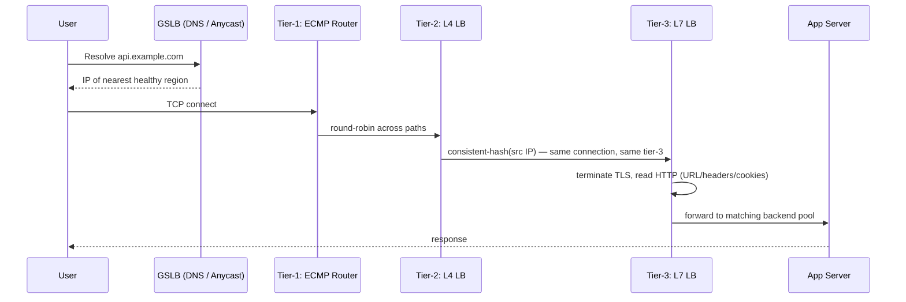
```mermaid
sequenceDiagram
    participant User
    participant DNS as GSLB (DNS / Anycast)
    participant T1 as Tier-1: ECMP Router
    participant T2 as Tier-2: L4 LB
    participant T3 as Tier-3: L7 LB
    participant App as App Server

    User->>DNS: Resolve api.example.com
    DNS-->>User: IP of nearest healthy region
    User->>T1: TCP connect
    T1->>T2: round-robin across paths
    T2->>T3: consistent-hash(src IP) — same connection, same tier-3
    T3->>T3: terminate TLS, read HTTP (URL/headers/cookies)
    T3->>App: forward to matching backend pool
    App-->>User: response
```

**Read it as:** *DNS/anycast picks the region → ECMP spreads across paths → an L4 LB pins a
connection to one L7 LB → the L7 LB reads the actual request and sends it to the right backend.*
Four hops, four different jobs — that's the entire mental model of this chapter.

## 1. Mental model

A load balancer is a **traffic cop**: it stands at every fork in the road between a group of
clients and a pool of interchangeable servers, and decides — request by request — who gets sent
where. Think of a restaurant host seating parties across ten tables instead of everyone crowding
around one. The host also refuses to seat anyone at a table that's on fire (health checking), and
greets guests at the door instead of making each table handle its own greeting (TLS termination).

The load balancing layer is **the first point of contact inside a data center after the
firewall** — everything downstream of it is designed around the assumption that it exists.

**Why it matters in an interview:** the moment your design has more than one instance of
anything (web server, app server, cache shard, DB replica), you need to explain how traffic finds
the right instance(s). "I'll add a load balancer" is table stakes; a strong candidate explains
*which layer*, *which algorithm*, *how it fails over*, and *what state it needs to hold*.

## 2. Why load balancers exist

A single service instance can handle a few hundred to a few thousand requests/sec. Beyond that,
you horizontally scale — and scaling only works if load is actually spread evenly. LBs deliver
three things:

| Property | What the LB does |
|---|---|
| **Scalability** | Add/remove servers behind the LB; capacity changes transparently to clients |
| **Availability** | Detects dead/unhealthy servers and stops routing to them — masks failures from users |
| **Performance** | Routes to less-loaded servers, improving both response time and resource utilization |

**Interview follow-up: "Isn't the load balancer itself a single point of failure?"**
This is the standard trap question, and it has a standard answer:

- Run LBs in **active-passive** or **active-active** pairs behind a shared **virtual IP (VIP)**,
  using a protocol like **VRRP/keepalived** to fail over the VIP within seconds.
- Use **DNS with multiple A records** or **anycast IP** so multiple LB instances answer the same
  address, and a dead one is routed around at the network layer.
- In the cloud, the LB *is* a managed, already-redundant service (AWS ALB/NLB, GCP's Maglev-backed
  Cloud Load Balancer) — you don't run a single box, you get a distributed fleet for free.
- Push redundancy one layer down: **client-side/service-mesh load balancing** (sidecars, smart
  clients) removes the centralized LB from the critical path entirely for internal traffic.

**How VIP failover actually works** — this is the mechanism behind "active-passive pair," and
naming it (VRRP) is what separates a memorized answer from an understood one:

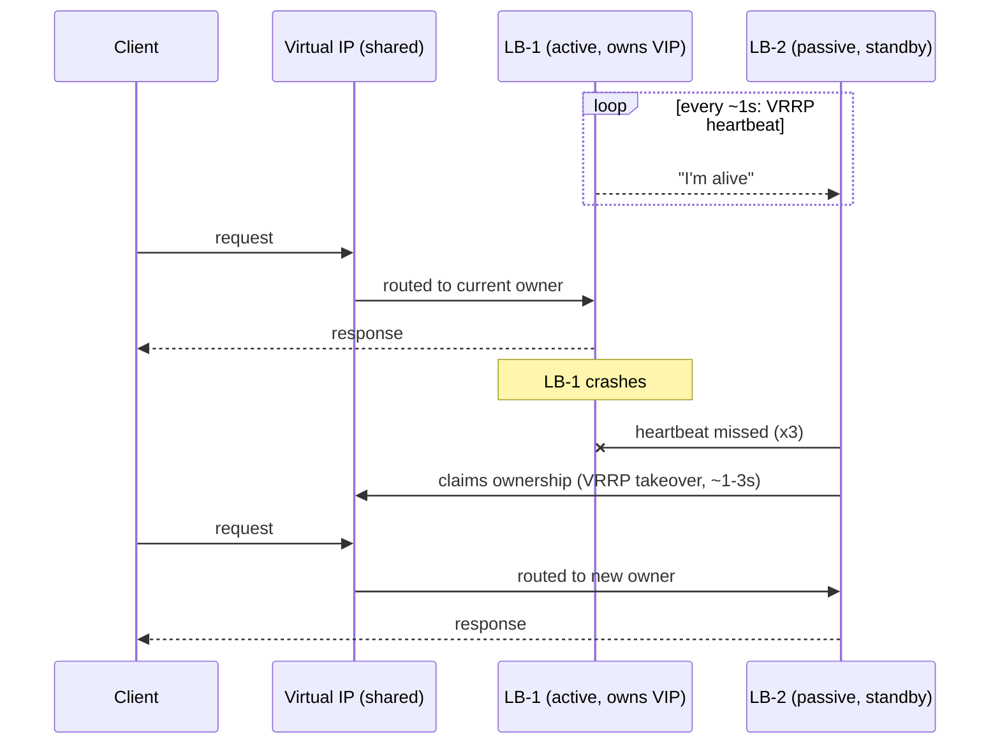
```mermaid
sequenceDiagram
    participant C as Client
    participant VIP as Virtual IP (shared)
    participant LB1 as LB-1 (active, owns VIP)
    participant LB2 as LB-2 (passive, standby)

    loop every ~1s: VRRP heartbeat
        LB1-->>LB2: "I'm alive"
    end
    C->>VIP: request
    VIP->>LB1: routed to current owner
    LB1-->>C: response

    Note over LB1: LB-1 crashes
    LB2-xLB1: heartbeat missed (x3)
    LB2->>VIP: claims ownership (VRRP takeover, ~1-3s)
    C->>VIP: request
    VIP->>LB2: routed to new owner
    LB2-->>C: response
```

**Memory hook:** the VIP is the address; the LB owning it is just a lease-holder. Losing the
lease-holder doesn't lose the address.

### 🆕 Active-passive vs. active-active — the other half of the SPOF answer

The diagram above shows active-passive (one owner, one idle standby). That's the easier case to
reason about, but interviewers often push on the alternative — say both out loud:

| | Active-passive | Active-active |
|---|---|---|
| Do both nodes serve live traffic? | No — standby sits idle until the VIP moves to it | Yes — both nodes take real traffic at the same time |
| Mechanism | Single VIP, VRRP/keepalived picks one owner | Multiple LB IPs live at once — DNS with multiple A records, or ECMP/anycast spreading connections across both |
| Capacity efficiency | Wastes the standby's capacity (you pay for an idle box) | Full utilization of every node you run |
| What happens on failure | Clean VIP takeover — survivor was already idle, just starts serving | In-flight connections *pinned to the failed node* still drop; the LB tier reroutes new connections to survivors, but existing ones aren't magically resumed |
| Typical fit | Simpler ops, smaller fleets, or when the standby doesn't need to coordinate any shared state | Larger fleets, cloud-managed LBs (AWS ALB/NLB and GCP's Cloud LB are active-active internally by default) |

**Memory hook:** active-passive trades money (idle standby) for simplicity; active-active trades
simplicity (rerouting live connections) for full utilization. Managed cloud LBs default to
active-active because the provider already owns the complexity — you just don't see it.

## 3. Where load balancers sit

LBs aren't limited to the client-facing edge — in a classic three-tier architecture you place one
between *every* pair of horizontally-scaled tiers:

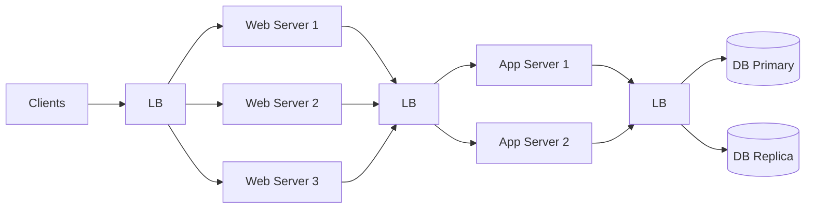
```mermaid
graph LR
    C[Clients] --> LB1[LB]
    LB1 --> W1[Web Server 1]
    LB1 --> W2[Web Server 2]
    LB1 --> W3[Web Server 3]
    W1 --> LB2[LB]
    W2 --> LB2
    W3 --> LB2
    LB2 --> A1[App Server 1]
    LB2 --> A2[App Server 2]
    A1 --> LB3[LB]
    A2 --> LB3
    LB3 --> D1[(DB Primary)]
    LB3 --> D2[(DB Replica)]
```

In reality, an LB can sit between **any two services with multiple instances** — including in
front of caches, message brokers, or internal microservices.

## 4. Services a load balancer provides beyond routing

| Service | What it does |
|---|---|
| **Health checking** | Heartbeat/probe protocol monitors backend liveness; unhealthy nodes are pulled from rotation |
| **TLS termination** | LB decrypts TLS so backend servers are freed from crypto overhead |
| **Service discovery** | LB queries a service registry to find current healthy hosting servers |
| **Predictive analytics** | Aggregates traffic stats/patterns to anticipate load spikes |
| **Security** | Mitigates L3/L4/L7 DoS (SYN floods, HTTP floods) via rate limiting, connection limits |
| **Reduced ops burden** | Automated failure handling cuts manual intervention |

Net effect: LBs give a system **flexibility, reliability, redundancy, and efficiency**.

**Active vs. passive health checking** — both run at once in real systems, and interviewers like
to hear you distinguish them:

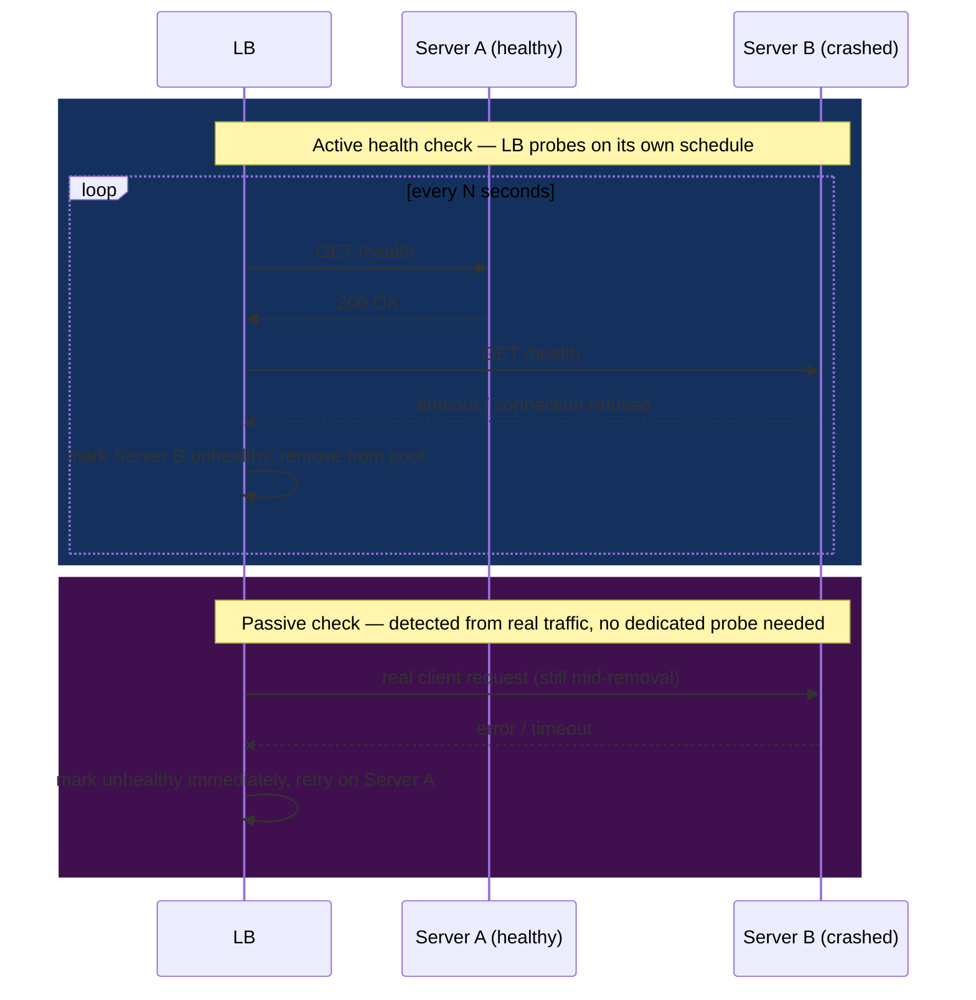
```mermaid
sequenceDiagram
    participant LB
    participant S1 as Server A (healthy)
    participant S2 as Server B (crashed)

    rect rgb(20, 49, 94)
    Note over LB,S2: Active health check — LB probes on its own schedule
    loop every N seconds
        LB->>S1: GET /health
        S1-->>LB: 200 OK
        LB->>S2: GET /health
        S2--xLB: timeout / connection refused
        LB->>LB: mark Server B unhealthy, remove from pool
    end
    end

    rect rgb(63, 16, 77)
    Note over LB,S2: Passive check — detected from real traffic, no dedicated probe needed
    LB->>S2: real client request (still mid-removal)
    S2--xLB: error / timeout
    LB->>LB: mark unhealthy immediately, retry on Server A
    end
```

**Memory hook:** active checking asks "are you alive?" on a timer even when no one's calling;
passive checking notices "you didn't answer" from real traffic. Production LBs use both — active
catches failures before users do, passive catches anything active checks missed between polls.

### 🆕 How a node gets removed *and re-added* (interviewers ask both halves)

Most candidates can explain removal. Fewer explain recovery — say both, with numbers, so it
sounds like a real config instead of a vague idea:

- **Unhealthy threshold**: e.g. 3 consecutive failed probes at a 5-second interval → the LB
  declares the node dead and pulls it from rotation in ~15 seconds (illustrative numbers — real
  thresholds are config, not physics).
- **The LB keeps probing the removed node anyway** — it isn't deleted from the pool, just marked
  "out of rotation," so it can come back automatically.
- **Healthy threshold**: e.g. 2 consecutive successful probes at the same 5-second interval →
  the node is eligible to rejoin, roughly ~10 seconds after it starts responding again.
- **Slow start on re-entry**: a server that just rebooted has a cold cache/cold JIT/cold
  connection pool. Dumping full traffic share on it immediately can cause it to fail health
  checks again. Many LBs (AWS ALB's "slow start" is a named example) ramp a recovering node from
  a small traffic weight up to 100% over a configurable window — illustrative range: 30–900
  seconds — instead of an instant on/off switch.

**Memory hook:** removal is a threshold crossed downward; recovery is the *same* threshold
crossed upward, plus a ramp so the server doesn't get re-crushed the moment it's trusted again.

### 🆕 TLS termination vs. passthrough vs. re-encryption

"TLS termination" is in the services table above as one line — it deserves its own comparison,
because "termination vs. passthrough" is a direct, frequently-asked interview question:

| | **Termination** | **Passthrough** | **Re-encryption (TLS bridging)** |
|---|---|---|---|
| Where TLS ends | At the LB | At the backend server | Twice — at the LB, then again LB→backend |
| What the LB can see | Full plaintext HTTP: headers, cookies, URL, body | Nothing — just encrypted bytes (can still route on the **SNI hostname**, unencrypted in the TLS handshake) | Full plaintext, same as termination, before it re-encrypts |
| Enables L7 features (path/header/cookie routing)? | Yes | No — only SNI-based routing | Yes |
| Backend CPU cost | Backend does no crypto | Backend does its own TLS handshake/crypto | Backend still does a (cheaper, private-network) TLS handshake |
| End-to-end encryption? | No — LB↔backend hop is typically plaintext HTTP inside the trusted network | Yes — client's TLS session goes untouched all the way to the backend | Yes, in two separate encrypted hops |
| Typical driver | Default choice — you want L7 routing/WAF/rate-limiting at the LB | Compliance (PCI/HIPAA) or client-cert auth that requires the *backend* to see the original TLS session | Compliance that requires encryption everywhere, but you still want L7 features at the edge |

Illustrative cost note: a full TLS handshake costs roughly 1-2ms of CPU per connection
(illustrative, varies by cipher/hardware) — trivial per-connection, but at tens of thousands of
new connections/sec it's why hyperscale L4 LBs (Maglev, Katran) either skip termination entirely
or offload it to dedicated crypto hardware.

**Memory hook:** *termination opens the envelope and reads the letter; passthrough only reads the
address on the outside (SNI) and never opens it; re-encryption opens it, reads it, then reseals
it in a new envelope for the last leg.*

## 5. Global vs. local load balancing

Two distinct problems get conflated under "load balancing" — know the difference cold.

**Memory hook:** *GSLB picks the city, local LB picks the counter.* GSLB decides which data
center a user's traffic goes to; local LB decides which specific server inside that data center
handles it.

| | **Global (GSLB)** | **Local** |
|---|---|---|
| Scope | Across geographic regions/data centers | Within a single data center |
| Goal | Route to the *right region*; regional failover | Spread load across servers efficiently |
| Mechanism | DNS, anycast, ADCs, cloud LBaaS | Reverse proxy behind a VIP |
| Failure handling | Reroute all traffic to a healthy DC | Remove unhealthy server from pool |

### GSLB via DNS (round-robin)

DNS is the simplest GSLB mechanism: it returns a **reordered list of IPs** per query, so
different users/ISPs land on different data centers.

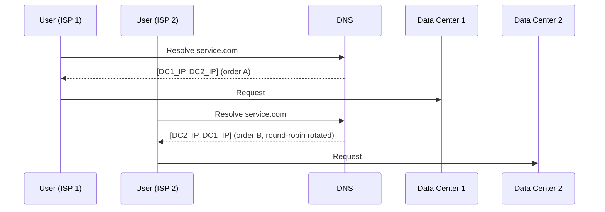
```mermaid
sequenceDiagram
    participant U1 as User (ISP 1)
    participant U2 as User (ISP 2)
    participant DNS
    participant DC1 as Data Center 1
    participant DC2 as Data Center 2

    U1->>DNS: Resolve service.com
    DNS-->>U1: [DC1_IP, DC2_IP]  (order A)
    U1->>DC1: Request
    U2->>DNS: Resolve service.com
    DNS-->>U2: [DC2_IP, DC1_IP]  (order B, round-robin rotated)
    U2->>DC2: Request
```

**Limitations of DNS round-robin** (know these — they're frequently asked):

- **512-byte DNS packet limit** — can't list every server IP.
- **No health awareness** — DNS keeps handing out a crashed server's IP until the cached TTL
  expires; a long TTL means a slow-motion outage.
- **ISP-level unevenness** — a large ISP caches one IP for all its users, causing skewed load.
- **No client control** — clients pick arbitrarily from the returned list; can't pick the
  *closest* one without geolocation/anycast tricks.
- Despite this, DNS round-robin is still widely used because it's simple, free, and "good enough"
  combined with short TTLs.

**Better GSLB mechanisms** (beyond the source material, standard interview knowledge):
- **Anycast IP** — same IP announced from multiple regions via BGP; network routes to the nearest
  healthy one automatically (used by Cloudflare, Google's edge).
- **Latency/geo-based DNS routing** — AWS Route 53 (latency-based & geoproximity routing), Akamai
  GTM/ADCs — route based on real health + latency data, not blind rotation.
- **Cloud LBaaS** — provider-managed global load balancer (e.g., GCP Global HTTP(S) LB) fronts
  multiple regions with a single anycast IP and does real-time health-based failover.

### Local load balancing

Local LBs sit inside one data center, act as a **reverse proxy**, and expose a single **virtual
IP (VIP)** to clients. They exist because DNS-level GSLB alone can't do fine-grained, low-latency,
health-aware distribution across *individual servers* — that granularity requires a layer that's
actually in the request path.

## 6. Load balancing algorithms

| Algorithm | How it decides | Best for | 🆕 Key trade-off |
|---|---|---|---|
| **Round-robin** | Cycles through servers sequentially | Homogeneous servers, uniform request cost | Blind to actual load — a slow/overloaded server still gets its equal turn |
| **Weighted round-robin** | Round-robin biased by a per-server capacity weight | Heterogeneous server capacity | Weight is a static guess set at config time — doesn't adapt if real-time load shifts |
| **Least connections** | Picks server with fewest active connections | Long-lived/variable-duration requests (e.g., WebSocket, streaming) | Requires the LB to track live connection counts per server — more state, more coordination overhead |
| **Least response time** | Picks server currently responding fastest | Latency-sensitive services | Needs continuous latency sampling; a server can look artificially fast right after being marked healthy again (empty queue) |
| **IP hash** | Hash of client IP → server | Sticky sessions without a shared session store | Uneven if client IPs aren't evenly distributed (e.g., one large NAT/corporate proxy = one "client") |
| **URL hash** | Hash of URL/path → server | Routing to service-specific server pools (e.g., cache locality) | A single hot URL/path still overloads one server — hashing doesn't rebalance skewed popularity |
| **Consistent hashing** | Ring/hash-space mapping, minimal remapping on scale change | Stateless LBs, sharded caches, minimizing cache-miss storms on scale-out | More complex to implement/reason about than mod-N hashing; needs virtual nodes to avoid uneven ring distribution |

**🆕 Worked examples (concrete numbers, not just names):**
- **Weighted round-robin:** Server A is weighted 3, Server B is weighted 1 (A has 3x B's
  capacity). Out of every 4 incoming requests, 3 go to A and 1 goes to B.
- **Least connections:** at the moment a new request arrives, Server A has 40 active connections,
  Server B has 15. The LB sends the new request to B — not because B is "the algorithm's turn,"
  but because it's carrying less live work right now.
- **Consistent hashing:** with 4 cache shards on the ring holding roughly 1,000 keys each
  (illustrative), adding a 5th shard remaps only the ~200 keys physically adjacent to it on the
  ring — the other ~3,800 keys stay put. Plain `hash(key) % N` would have remapped nearly all
  4,000 keys the moment `N` changed from 4 to 5.

**Decision tree — pick the algorithm out loud instead of reciting the table:**

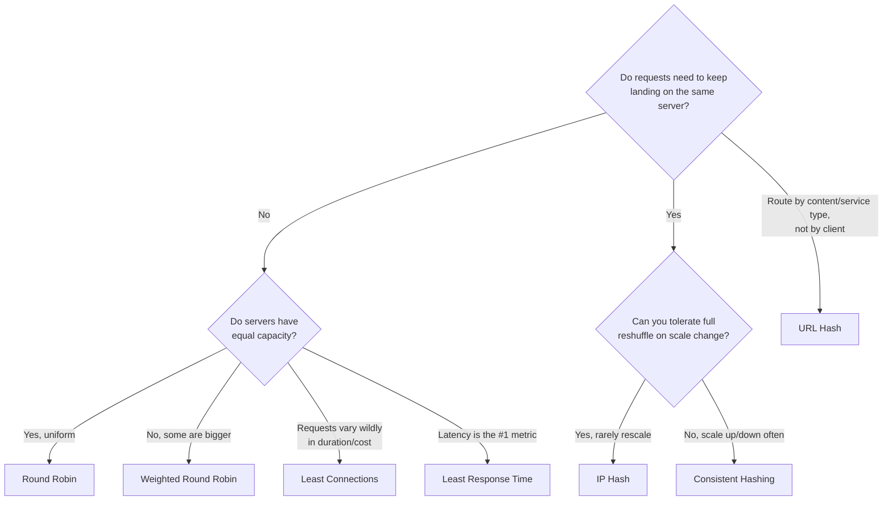
```mermaid
flowchart TD
    Q1{Do requests need to keep<br/>landing on the same server?}
    Q1 -->|No| Q2{Do servers have<br/>equal capacity?}
    Q1 -->|Yes| Q3{Can you tolerate full<br/>reshuffle on scale change?}

    Q2 -->|Yes, uniform| RR[Round Robin]
    Q2 -->|No, some are bigger| WRR[Weighted Round Robin]
    Q2 -->|Requests vary wildly<br/>in duration/cost| LC[Least Connections]
    Q2 -->|Latency is the #1 metric| LRT[Least Response Time]

    Q3 -->|Yes, rarely rescale| IPH[IP Hash]
    Q3 -->|No, scale up/down often| CH[Consistent Hashing]

    Q1 -->|Route by content/service type,<br/>not by client| URLH[URL Hash]
```

### Static vs. dynamic algorithms

| | Static | Dynamic |
|---|---|---|
| Decision basis | Fixed, pre-known server config | Current/recent server state (load, health) |
| Complexity | Simple, single-router friendly | Requires inter-node communication (overhead) |
| Quality | Can send traffic to an overloaded/dead server | Better decisions; monitors health |
| Examples | Plain round-robin | Least connections, least response time |

**Interview cheat-sheet:**
- Uniform, stateless, cheap requests → round-robin / weighted round-robin.
- Variable-duration connections (chat, video, DB conns) → least connections.
- Need cache/session affinity without shared state → consistent hashing or IP/URL hash.
- Scaling servers up/down frequently → consistent hashing minimizes redistribution ("only 1/N keys move" property) — always name-drop this against plain hashing (mod N remaps *everything*).

## 7. Stateful vs. stateless load balancers

| | Stateful | Stateless |
|---|---|---|
| What's kept | Map of client↔server session, shared across LB instances | No cross-LB state; decisions via consistent hashing |
| Pros | Resilient to infrastructure changes (adding/removing servers) | Fast, lightweight, horizontally scalable |
| Cons | Complexity, limits scalability of the LB tier itself | Consistent hashing alone can misroute if servers change (may still need light local state) |

**Practical bridge concept (add this in interviews):** most real systems use **sticky
sessions** (session affinity) — an L7 LB attaches a cookie pinning a client to a server, giving
most of stateful LB's benefit without full cross-LB state sharing. Combine with a shared session
store (Redis) if you need failover-safe stickiness.

**🆕 The cost of sticky sessions — say this before an interviewer asks "any downsides?":**
- **Uneven load.** Load-balancing algorithms assume they can freely redistribute the *next*
  request. Stickiness removes that freedom for the *rest of that client's session* — if a handful
  of pinned clients happen to send heavy requests, their server gets overloaded while others idle,
  and the LB can't rebalance mid-session without breaking the affinity contract.
- **Complicates scaling down.** You can't just terminate a server that has active sticky sessions
  — doing so drops every client pinned to it. The safe path is to **drain** it first: stop
  assigning *new* sessions to that server, then wait for existing sessions to end or their cookie
  TTL to expire (illustrative example: a 30-minute session cookie means up to a 30-minute drain
  window) before removing the instance.
- **Failure isn't free either.** If the pinned server crashes outright (no graceful drain), the
  session state dies with it unless it was externalized to a shared store — which is exactly why
  "sticky sessions + Redis-backed session store" is the standard pairing, not sticky sessions
  alone.

**Memory hook:** stickiness is a promise to one client at the cost of the LB's freedom to
rebalance everyone else — the more of it you use, the less "horizontally scalable" your fleet
really behaves.

**Why consistent hashing is the "stateless" answer** — the whole point is that adding/removing
one server only remaps the keys next to it on the ring, not everything:

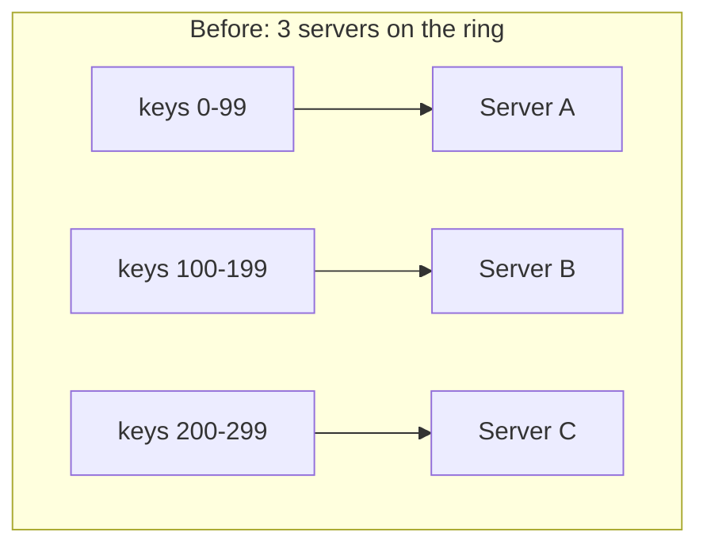
```mermaid
flowchart LR
    subgraph Before["Before: 3 servers on the ring"]
        direction LR
        k1["keys 0-99"] --> A1[Server A]
        k2["keys 100-199"] --> B1[Server B]
        k3["keys 200-299"] --> C1[Server C]
    end
```

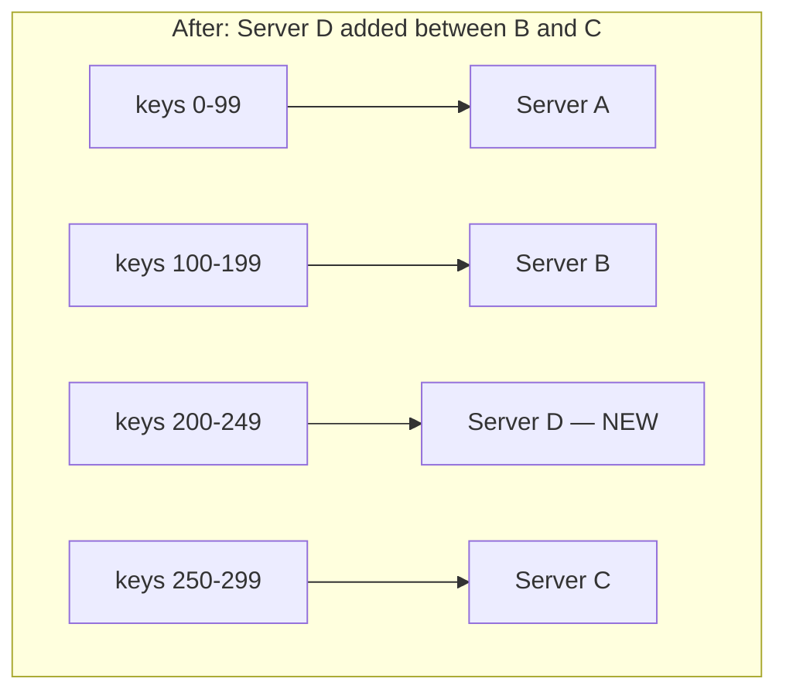
```mermaid
flowchart LR
    subgraph After["After: Server D added between B and C"]
        direction LR
        k1b["keys 0-99"] --> A2[Server A]
        k2b["keys 100-199"] --> B2[Server B]
        k4["keys 200-249"] --> D2[Server D — NEW]
        k3b["keys 250-299"] --> C2[Server C]
    end
```

**Memory hook:** with plain `hash(key) % N`, adding one server changes `N` and reshuffles
*almost every* key — a cache-stampede waiting to happen. With consistent hashing, only the slice
of keys physically adjacent to the new node on the ring moves (~1/N of all keys). This is *the*
fact to say out loud when asked "how do you add a server without a wave of cache misses?"

## 8. Layer 4 vs. Layer 7 load balancers

| | **Layer 4 (Transport)** | **Layer 7 (Application)** |
|---|---|---|
| Operates on | TCP/UDP, IP + port | HTTP headers, URLs, cookies, payload |
| Speed | Faster (no payload inspection) | Slower (parses application data) |
| Intelligence | Routes same connection to same backend | Content-aware routing, header rewriting, rate limiting per user/URL |
| TLS termination | Sometimes supported | Standard feature |
| Examples | AWS NLB, IPVS/LVS, Google Maglev, Katran (Meta, XDP/eBPF) | AWS ALB, NGINX, HAProxy, Envoy |

**Rule of thumb to state out loud:** *L7 is smart but slower; L4 is fast but blind.* Real systems
layer both — L4 in front for raw throughput and DDoS absorption, L7 behind it for
routing/business logic.

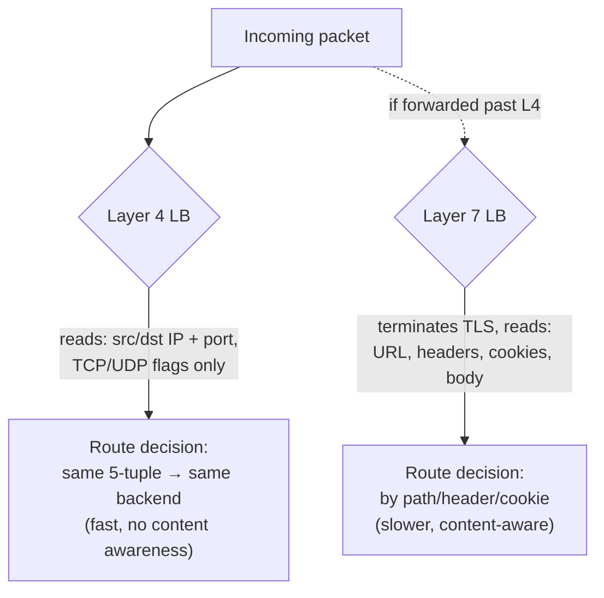
```mermaid
flowchart TD
    P[Incoming packet] --> L4{Layer 4 LB}
    L4 -->|"reads: src/dst IP + port,<br/>TCP/UDP flags only"| D1["Route decision:<br/>same 5-tuple → same backend<br/>(fast, no content awareness)"]
    P -.->|"if forwarded past L4"| L7{Layer 7 LB}
    L7 -->|"terminates TLS, reads:<br/>URL, headers, cookies, body"| D2["Route decision:<br/>by path/header/cookie<br/>(slower, content-aware)"]
```

**Memory hook:** *L4 reads the envelope (address only); L7 opens the letter (reads what's
inside).* That single sentence answers 90% of "L4 vs L7" interview probes.

## 9. The tiered load balancer hierarchy

Production data centers don't use a single LB layer — they chain tiers, each solving a different
problem:

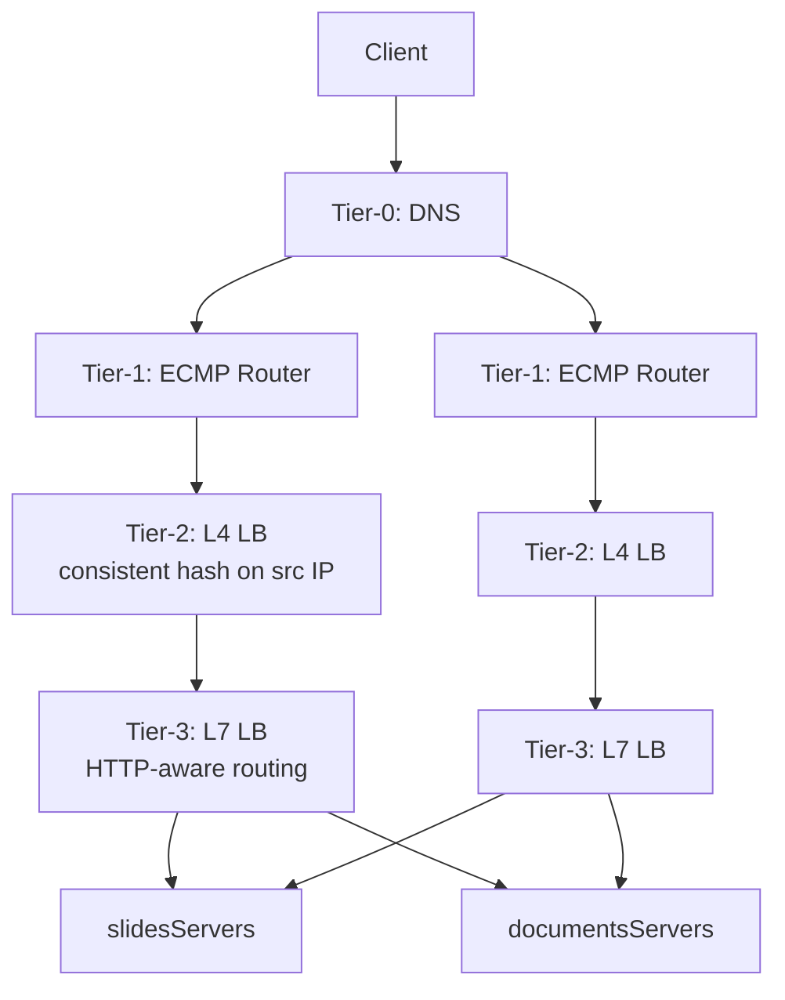
```mermaid
graph TD
    Client --> T0[Tier-0: DNS]
    T0 --> T1a[Tier-1: ECMP Router]
    T0 --> T1b[Tier-1: ECMP Router]
    T1a --> T2a[Tier-2: L4 LB<br/>consistent hash on src IP]
    T1b --> T2b[Tier-2: L4 LB]
    T2a --> T3a[Tier-3: L7 LB<br/>HTTP-aware routing]
    T2b --> T3b[Tier-3: L7 LB]
    T3a --> S1[slidesServers]
    T3a --> S2[documentsServers]
    T3b --> S1
    T3b --> S2
```

| Tier | Role | Mechanism |
|---|---|---|
| **Tier-0** | DNS | Coarse routing to a region/data center |
| **Tier-1** | ECMP routers | Split traffic across paths via IP hash / round-robin; gives tier-2 horizontal scalability |
| **Tier-2** | L4 LBs | Ensure all packets of one connection reach the *same* tier-3 LB, typically via consistent hashing on source IP |
| **Tier-3** | L7 LBs | HTTP-aware routing to the correct backend pool; does health checks, TLS offload, TCP congestion control, Path MTU discovery |

**Worked example (from the course, good to reproduce verbally):** a request for `/presentation`
and one for `/document` both enter through the same ECMP router and land on some tier-2 LB via a
source-IP hash — but tier-3 inspects the URL and routes each to a *different* backend pool.
Seeing it play out over time makes the "each tier does one job" idea concrete:

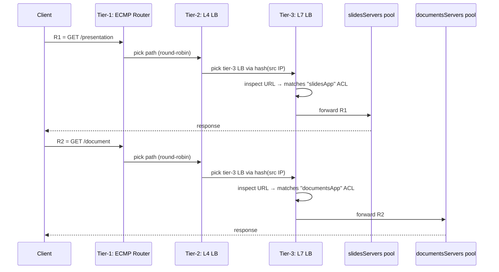
```mermaid
sequenceDiagram
    participant C as Client
    participant T1 as Tier-1: ECMP Router
    participant T2 as Tier-2: L4 LB
    participant T3 as Tier-3: L7 LB
    participant Slides as slidesServers pool
    participant Docs as documentsServers pool

    C->>T1: R1 = GET /presentation
    T1->>T2: pick path (round-robin)
    T2->>T3: pick tier-3 LB via hash(src IP)
    T3->>T3: inspect URL → matches "slidesApp" ACL
    T3->>Slides: forward R1
    Slides-->>C: response

    C->>T1: R2 = GET /document
    T1->>T2: pick path (round-robin)
    T2->>T3: pick tier-3 LB via hash(src IP)
    T3->>T3: inspect URL → matches "documentsApp" ACL
    T3->>Docs: forward R2
    Docs-->>C: response
```

The matching HAProxy config at tier-3:

```
mode HTTP                                   # HTTP mode (tier-2 LBs use TCP mode instead)
acl slidesApp path_end -i /presentation     # match requests ending in /presentation
use_backend slidesServers if slidesApp      # route matched requests to slidesServers
backend slidesServers
    server slides1 192.168.12.1:80          # actual backend instance
```

**Quiz to remember:** does the response route back *through* every tier on the way out? No —
responses typically flow directly from the backend server back to the client (or take a
shorter path), since the return path doesn't need re-routing decisions once the connection is
established.

### Zooming out: how Google/Facebook-scale traffic actually spans regions and AZs

Everything above happens **inside a single facility**. A real multi-region product wraps two more
decisions around it, and this is exactly the gap in the question "do we need a load balancer per
datacenter, *and* a level above at the regional level?" — **yes, and there's actually a third
level above that too.** It's three distinct routing decisions, not one "add an LB" answer:

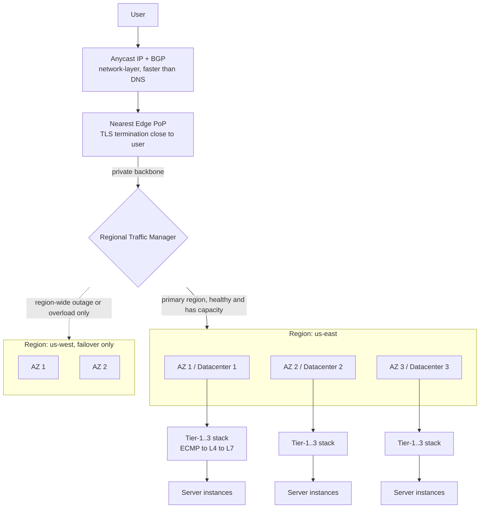
```mermaid
graph TD
    U[User] --> Any["Anycast IP + BGP<br/>network-layer, faster than DNS"]
    Any --> Edge["Nearest Edge PoP<br/>TLS termination close to user"]
    Edge -->|private backbone| RTM{Regional Traffic Manager}

    subgraph RegA["Region: us-east"]
        direction TB
        AZ1[AZ 1 / Datacenter 1]
        AZ2[AZ 2 / Datacenter 2]
        AZ3[AZ 3 / Datacenter 3]
    end

    subgraph RegB["Region: us-west, failover only"]
        direction TB
        AZ4[AZ 1]
        AZ5[AZ 2]
    end

    RTM -->|primary region, healthy and has capacity| RegA
    RTM -.->|region-wide outage or overload only| RegB

    AZ1 --> Local1["Tier-1..3 stack<br/>ECMP to L4 to L7"]
    AZ2 --> Local2["Tier-1..3 stack"]
    AZ3 --> Local3["Tier-1..3 stack"]

    Local1 --> S1[Server instances]
    Local2 --> S2[Server instances]
    Local3 --> S3[Server instances]
```

| Decision | Answers | Typical mechanism | Failure handling |
|---|---|---|---|
| **Which region?** | Which continent/metro serves this user | Anycast/BGP (network-layer, fastest) or DNS-based GSLB (§5), driven by a global traffic controller watching real-time load | Withdraw the anycast route or update GSLB weights — slow and "expensive," so reserved for real regional outages or major capacity crunches |
| **Which AZ/datacenter within that region?** | Which of the 3+ physical facilities in that metro handles it | A dedicated **regional traffic-management layer**, or simply a cross-zone-aware LB product that treats every AZ in the region as one pool | Shift traffic to the remaining healthy AZs — cheap and fast, because AZs share a low-latency private backbone (typically sub-millisecond to a few ms apart) |
| **Which server instance within that AZ?** | Which of hundreds/thousands of instances of one service handles it | The Tier-1→Tier-3 stack from §9 above (ECMP → L4 consistent hash → L7 HTTP-aware) | Health checks pull the instance from rotation (§4) |

**The nuance that separates a memorized diagram from real understanding:** the "regional" tier
isn't always a separate box you'd draw on its own. Two real patterns exist — name both:

- **Baked-in cross-zone balancing.** Managed LBs like AWS's ALB deploy LB nodes in every AZ you
  enable and, by default, balance across targets in *all* those AZs — not just the AZ the request
  happened to land in. Here "regional" isn't an extra hop at all, it's a feature flag on the same
  L7 LB.
- **An explicit regional traffic-management layer.** Hyperscalers run a dedicated system that
  watches real-time AZ/region health *and* capacity (not just up/down) and actively shifts weight.
  Publicly documented examples: Google's internal load balancing behind **Maglev + GFE**, and
  Meta's **Taiji** system, which routes user traffic to specific edge PoPs/regions based on live
  load and RTT — much faster, capacity-aware feedback than plain DNS TTL expiry.

**Why cross-AZ balancing can be "just a feature flag" while cross-region can't:** AZs within a
region sit on the cloud provider's own low-latency private fiber — round trips are single-digit
milliseconds. Cross-*region* hops run over the public internet or an inter-region backbone at
tens-to-hundreds of ms. That latency gap is exactly why AZ selection is a cheap, routine decision
and region selection is a rare, deliberate one.

**The failure-escalation sequence worth reproducing verbally** — notice how AZ failover is fast
and silent, while region failover is a heavier, slower-detected event:

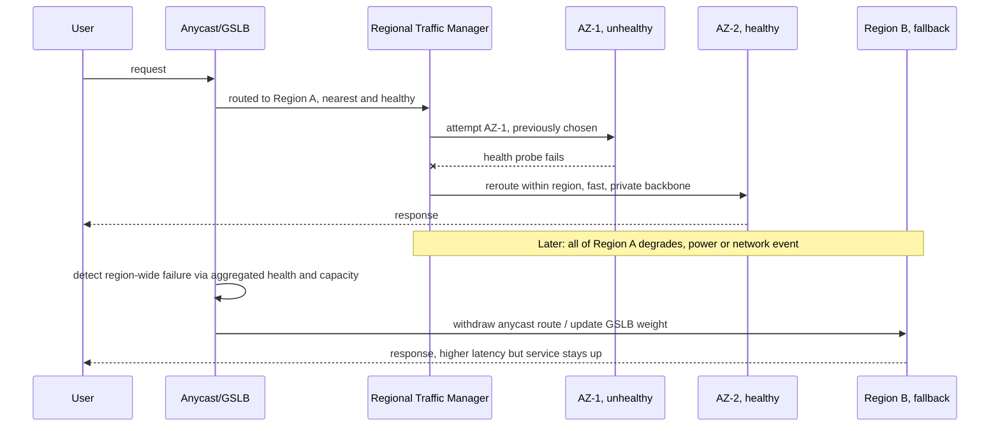
```mermaid
sequenceDiagram
    participant U as User
    participant Any as Anycast/GSLB
    participant RTM as Regional Traffic Manager
    participant AZ1 as AZ-1, unhealthy
    participant AZ2 as AZ-2, healthy
    participant RegionB as Region B, fallback

    U->>Any: request
    Any->>RTM: routed to Region A, nearest and healthy
    RTM->>AZ1: attempt AZ-1, previously chosen
    AZ1--xRTM: health probe fails
    RTM->>AZ2: reroute within region, fast, private backbone
    AZ2-->>U: response

    Note over RTM,RegionB: Later: all of Region A degrades, power or network event
    Any->>Any: detect region-wide failure via aggregated health and capacity
    Any->>RegionB: withdraw anycast route / update GSLB weight
    RegionB-->>U: response, higher latency but service stays up
```

**The stateful-service wrinkle (a frequent senior-level follow-up):** this whole hierarchy assumes
a *stateless* service, where any instance in any AZ can serve any request. The moment there's a
database, primary-replica cache, or sharded stateful store behind it, routing splits by
read/write instead of being uniform:

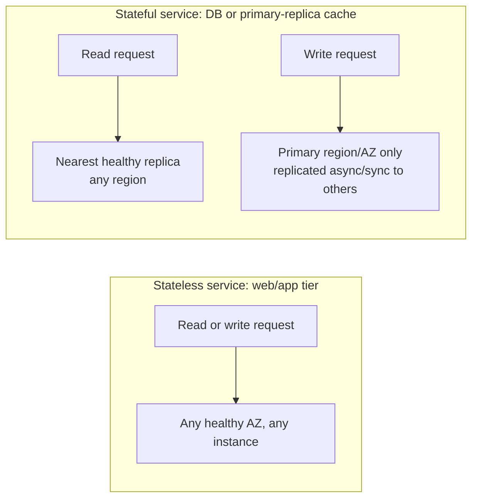
```mermaid
flowchart LR
    subgraph Stateless["Stateless service: web/app tier"]
        R1[Read or write request] --> AnyAZ[Any healthy AZ, any instance]
    end
    subgraph Stateful["Stateful service: DB or primary-replica cache"]
        Read[Read request] --> NearestReplica["Nearest healthy replica<br/>any region"]
        Write[Write request] --> Primary["Primary region/AZ only<br/>replicated async/sync to others"]
    end
```

Say this explicitly whenever the design includes a database: *"Reads can be load-balanced
globally like any stateless request; writes have to be pinned to wherever the primary lives, and
that pinning is exactly why multi-region write availability is hard — it's a
consensus/replication problem, not a load-balancing one."*

**Memory hook for the whole section:** *global picks the metro, regional picks the building,
local picks the desk.* Three decisions, three different costs, three different failure-handling
speeds — collapsing them into one "add a load balancer" answer is the single most common gap at
this scale.

### 🆕 Putting it all together: architecture evolution v1 → v2 → v3

Every mechanism in this guide showed up because a simpler version broke. Narrating this
progression — instead of jumping straight to the "final" tiered diagram — is a strong way to show
an interviewer *why* each piece exists, not just that it exists.

**v1 — single LB, no redundancy, no health awareness:**

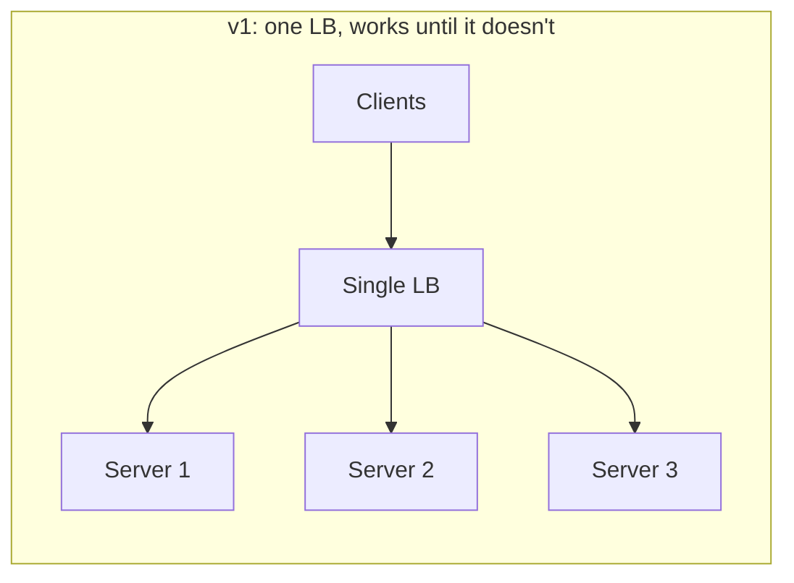
```mermaid
flowchart LR
    subgraph V1["v1: one LB, works until it doesn't"]
        C1[Clients] --> LB1[Single LB]
        LB1 --> S1[Server 1]
        LB1 --> S2[Server 2]
        LB1 --> S3[Server 3]
    end
```
Gap: the LB is a single point of failure (§2), and it keeps sending traffic to a dead server
because nothing is checking (§4).

**v2 — active-passive LB pair, with health checks:**

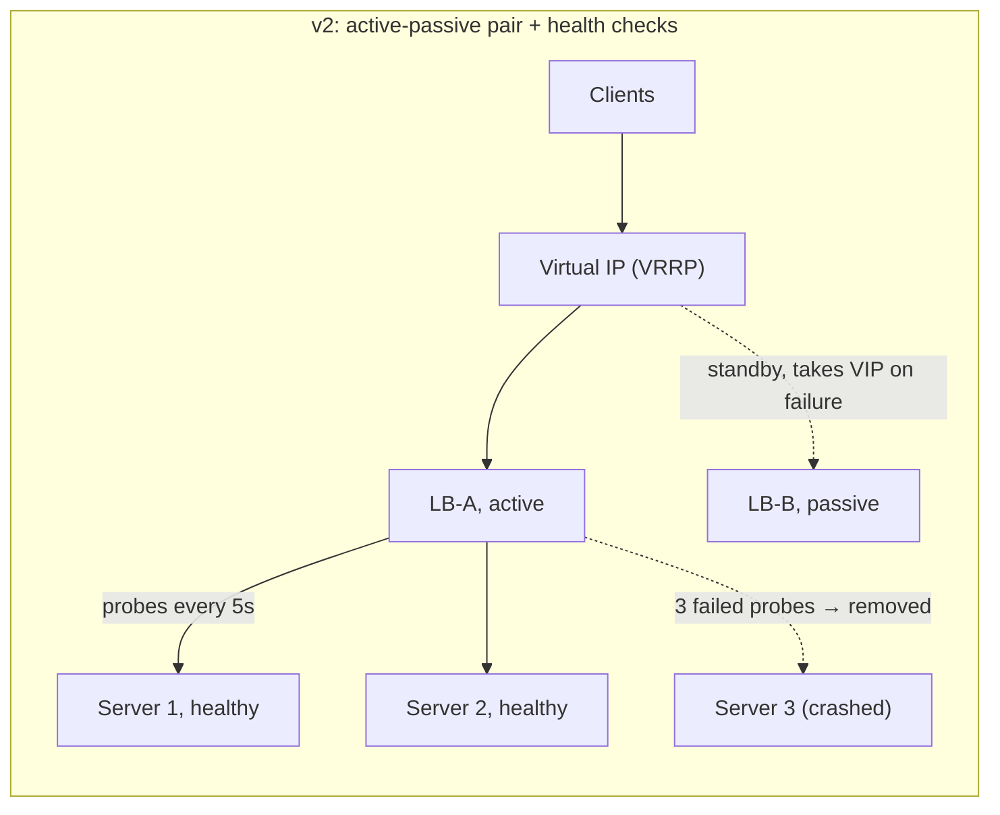
```mermaid
flowchart LR
    subgraph V2["v2: active-passive pair + health checks"]
        C2[Clients] --> VIP2["Virtual IP (VRRP)"]
        VIP2 --> LBA[LB-A, active]
        VIP2 -.->|"standby, takes VIP on failure"| LBB[LB-B, passive]
        LBA -->|"probes every 5s"| S1b[Server 1, healthy]
        LBA --> S2b[Server 2, healthy]
        LBA -.->|"3 failed probes → removed"| S3b["Server 3 (crashed)"]
    end
```
Fixes: LB SPOF (§2, VRRP failover in ~1-3s) and dead-backend routing (§4). Still limited to one
data center and one algorithm — no notion of "which region" yet.

**v3 — GSLB + regional/tiered LBs + consistent hashing for stateful backends:**

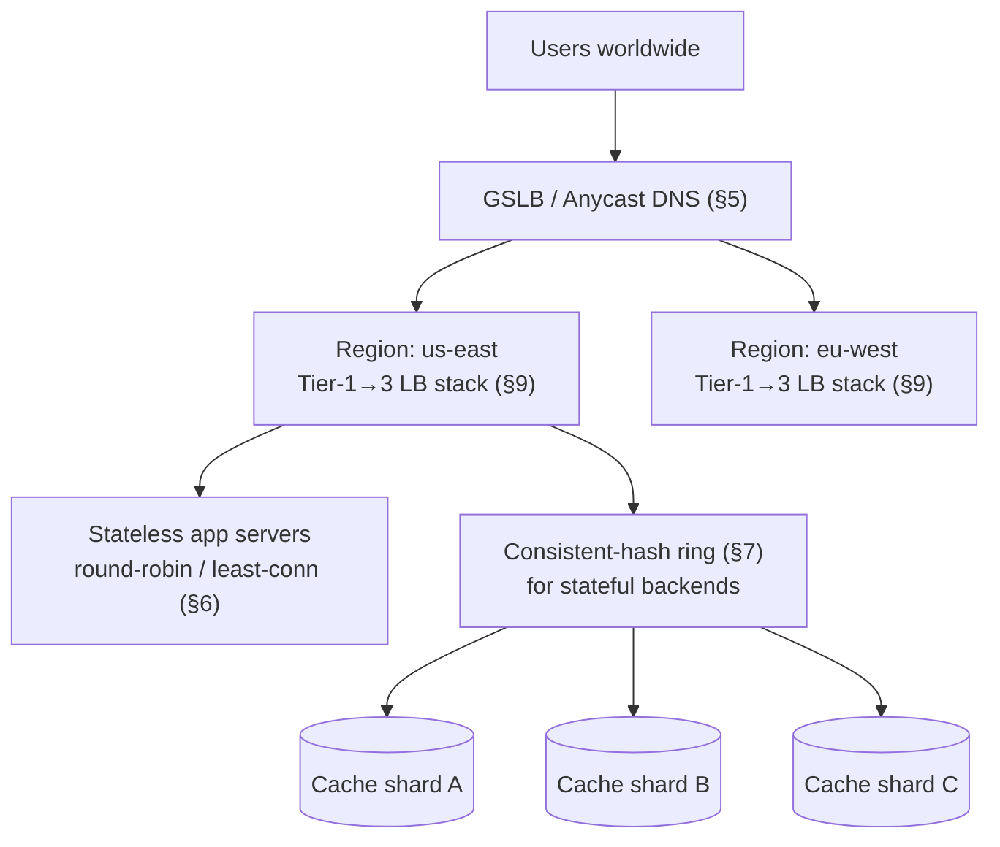
```mermaid
flowchart TD
    U[Users worldwide] --> GSLB["GSLB / Anycast DNS (§5)"]
    GSLB --> RegA["Region: us-east<br/>Tier-1→3 LB stack (§9)"]
    GSLB --> RegB["Region: eu-west<br/>Tier-1→3 LB stack (§9)"]
    RegA --> Stateless["Stateless app servers<br/>round-robin / least-conn (§6)"]
    RegA --> Ring["Consistent-hash ring (§7)<br/>for stateful backends"]
    Ring --> Cache1[(Cache shard A)]
    Ring --> Cache2[(Cache shard B)]
    Ring --> Cache3[(Cache shard C)]
```
Fixes: multi-region reach and regional failover (§5, §9), plus safe scaling of stateful backends
— adding/removing a cache shard remaps only ~1/N of keys instead of a full cache-stampede (§7).

**Memory hook:** each version fixes exactly one gap the previous one exposed — v1→v2 removes the
LB itself as a SPOF and adds failure detection; v2→v3 adds "which region" and makes scaling
stateful backends safe. If an interviewer asks "how would this evolve as we grow," this is the
story to tell, in this order.

## 10. API Gateway vs. Load Balancer

### Mental model

If a load balancer is a traffic cop, an **API Gateway is the building receptionist**. It doesn't
just point you at *an* elevator — it checks your ID (auth), tells you you've visited too many
times today (rate limiting), looks up which department you actually need (routing by API
route/version), sometimes calls two departments on your behalf and hands you back one combined
answer (aggregation/composition), and translates your request into a language the back office
understands (protocol translation: REST↔gRPC, GraphQL↔REST). A load balancer rarely looks past
the URL; an API Gateway reads the whole request and acts on its business meaning.

### Why it exists

Microservice architectures split one monolith into dozens or hundreds of services. Without a
gateway, every client would need to know every service's address, implement auth and rate
limiting itself, handle N different response shapes, and make N separate network calls to render
one screen. The API Gateway centralizes these **cross-cutting concerns** so individual services
stay focused on business logic, and clients talk to **one stable façade**.

### Core capabilities

| Capability | What it does |
|---|---|
| **Authentication/authorization** | Validates JWT/OAuth tokens or API keys before any service sees the request |
| **Rate limiting/throttling** | Enforces per-client/per-key/per-tenant request quotas |
| **Routing** | Maps external routes/versions to internal services (`/v2/users` → `users-service`) |
| **Protocol translation** | REST ↔ gRPC, REST ↔ GraphQL, WebSocket upgrade handling |
| **API composition/aggregation** | Fans one client request out to multiple services, merges the responses |
| **Request/response transformation** | Reshapes payloads, strips internal fields, rewrites headers |
| **Caching** | Caches idempotent GET responses at the edge |
| **Circuit breaking** | Stops calling a failing downstream service, fails fast |
| **Analytics/observability** | Centralized request logging, metrics, tracing entry point |
| **Developer experience** | API docs/portal, versioning, API key issuance |

### API Gateway vs. Load Balancer — the core distinction

| Dimension | Load Balancer | API Gateway |
|---|---|---|
| Layer | L4 (mostly) or basic L7 | L7 only, deep application awareness |
| What it understands | Connections, IP/port, at most URL/headers | Full API semantics: routes, versions, payload, identity |
| Job | Spread traffic across *identical* backend instances | Manage, secure, and compose access to *many different* APIs |
| Cross-cutting concerns | None (occasionally TLS termination) | Auth, rate limiting, transformation, composition, caching |
| Routing granularity | Connection / IP / coarse URL | Route + version + method + tenant + header |
| Statefulness | Usually near-stateless | Often stateful (rate-limit counters, API keys, sessions) |
| Fronts | One homogeneous pool of interchangeable servers | Many heterogeneous microservices |
| Blast radius on failure | One service's traffic | The entire public API surface |
| Examples | AWS NLB/ALB, HAProxy, Google Maglev | AWS API Gateway, Kong, Apigee, Netflix Zuul, Spring Cloud Gateway |

**The line blurs at the edges** — an L7 ALB doing path-based routing already looks like a
lightweight gateway, and Envoy is used as *both* an edge proxy and a service-mesh sidecar. Saying
this nuance out loud ("a full API Gateway is really an L7 LB plus a stack of API-specific
policies") signals depth instead of reciting two disjoint boxes.

### Which comes first? (and does it always?)

The load balancer almost always comes **first** — not because it's "more important," but because
the **API Gateway is itself just another horizontally-scaled service that needs a load balancer
in front of it** to be highly available and to scale. The usual chain:

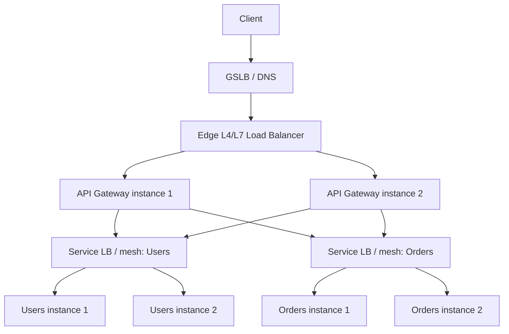
```mermaid
graph TD
    Client --> GSLB[GSLB / DNS]
    GSLB --> EdgeLB[Edge L4/L7 Load Balancer]
    EdgeLB --> GW1[API Gateway instance 1]
    EdgeLB --> GW2[API Gateway instance 2]
    GW1 --> Mesh1[Service LB / mesh: Users]
    GW1 --> Mesh2[Service LB / mesh: Orders]
    GW2 --> Mesh1
    GW2 --> Mesh2
    Mesh1 --> U1[Users instance 1]
    Mesh1 --> U2[Users instance 2]
    Mesh2 --> O1[Orders instance 1]
    Mesh2 --> O2[Orders instance 2]
```

| Scenario | Typical order |
|---|---|
| Public API in front of many microservices (common case) | GSLB → Edge LB → API Gateway cluster → per-service LB/mesh → service instances |
| Small serverless API (e.g. AWS API Gateway + Lambda) | The managed API Gateway *is* the entry point — the cloud provider load-balances gateway capacity internally, so you don't provision a separate LB |
| Multi-region global product | GSLB → regional Edge LB → regional API Gateway cluster → service mesh → services |
| Service-to-service (east-west) calls | **Skip the API Gateway entirely** — internal calls go through a service-mesh sidecar or internal LB directly; routing every internal call through the gateway adds latency and turns it into a bottleneck |
| Mobile vs. web needing different response shapes | Multiple **BFFs (Backend-for-Frontend)** behind the shared edge LB, each doing its own composition, instead of one monolithic gateway |

**The two ordering mistakes candidates most often make:**
1. Saying "API Gateway, then load balancer" — backwards; the gateway needs the LB in front of it
   to scale/fail over, same as any other service.
2. Routing *internal* service-to-service traffic through the API Gateway — the gateway is a
   **north-south** (client-to-system) concern; **east-west** (service-to-service) traffic should
   use a service mesh or internal LB instead.

### Request walkthrough

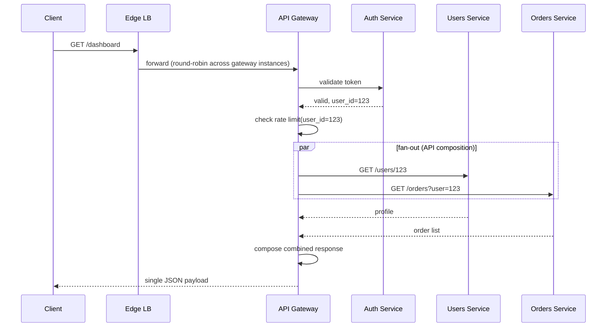
```mermaid
sequenceDiagram
    participant C as Client
    participant LB as Edge LB
    participant GW as API Gateway
    participant Auth as Auth Service
    participant Users as Users Service
    participant Orders as Orders Service

    C->>LB: GET /dashboard
    LB->>GW: forward (round-robin across gateway instances)
    GW->>Auth: validate token
    Auth-->>GW: valid, user_id=123
    GW->>GW: check rate limit(user_id=123)
    par fan-out (API composition)
        GW->>Users: GET /users/123
        GW->>Orders: GET /orders?user=123
    end
    Users-->>GW: profile
    Orders-->>GW: order list
    GW->>GW: compose combined response
    GW-->>C: single JSON payload
```

One diagram, four signature gateway jobs: auth, rate limiting, fan-out, and response composition
— none of which a plain load balancer does.

### Rate limiting algorithms (a common gateway-specific follow-up)

| Algorithm | Idea | Trade-off |
|---|---|---|
| Token bucket | Bucket refills at a fixed rate; each request consumes a token | Allows short bursts up to bucket size |
| Leaky bucket | Requests queue and drain at a fixed rate | Smooths bursts, adds queuing latency |
| Fixed window counter | Count requests in a fixed time window | Simple, but allows ~2x burst at window boundary |
| Sliding window log/counter | Weighted count across a rolling window | More accurate, costs more memory/compute |

### How to handle this in an interview

- **Trigger phrases**: "How would you expose these microservices to clients?", "How do you
  centralize auth?", "How do you version your API?", "How do you avoid the client calling five
  services to render one screen?", "How do you rate-limit per customer?" — all of these want an
  **API Gateway** answer, not "add a load balancer."
- **What to say**: name the gateway's job as *policy enforcement and composition at the API
  boundary*, explicitly separate it from the load balancer's job of *raw traffic distribution*,
  and state that the gateway sits behind an LB for its own high availability.
- **Depth signal for senior/staff**: mention that a single monolithic gateway can become a
  bottleneck/God-object — the fix is BFFs per client type, or splitting gateway policies (auth at
  the edge, composition per domain).
- **Common trap to avoid**: don't route internal service-to-service calls through the gateway —
  say explicitly that's a service-mesh/internal-LB concern (north-south vs. east-west traffic).
- **If asked to go deeper on rate limiting**: name token bucket vs. sliding window trade-offs
  (table above) — this is a frequent one-level-deeper follow-up question.

### Real-world examples

| System | Role |
|---|---|
| **AWS API Gateway** | Fully managed gateway; integrates directly with Lambda, handles auth (Cognito/IAM), throttling, request/response transformation |
| **Netflix Zuul / Zuul2** | Edge gateway in front of hundreds of Netflix microservices; dynamic routing, filters for auth/logging |
| **Kong** | Open-source API gateway built on NGINX, plugin-based (auth, rate limiting, transformation) |
| **Apigee (Google)** | Enterprise API management platform — gateway + analytics + developer portal |
| **Spring Cloud Gateway** | JVM-native gateway commonly paired with Eureka for Java microservice stacks |
| **Envoy (as edge gateway / Istio Ingress Gateway)** | Same proxy technology used as a sidecar in the mesh, reused at the edge as a gateway — the L4/L7 LB and gateway lines fully converge here |

## 11. Implementation choices

| | Hardware LB | Software LB | Cloud LB (LBaaS) |
|---|---|---|---|
| Cost | High (specialized appliance) | Low (commodity hardware) | Pay-as-you-go / metered |
| Flexibility | Low, vendor lock-in | High, programmable | High, managed |
| Availability | Needs standby hardware to fail over | Cheap to add redundant instances | Provider-managed redundancy |
| Ops burden | High (dedicated staff) | Moderate | Low (managed service) |
| Examples | F5 BIG-IP, Citrix ADC | NGINX, HAProxy, Envoy | AWS ELB/ALB/NLB, GCP Cloud LB, Azure LB |

**Client-side load balancing (the "smart client" alternative):** instead of a centralized LB
hop, the client itself holds a list of healthy backend instances (from a service registry) and
picks one directly — removing an extra network hop and a potential bottleneck.
- **Netflix**: Eureka (service registry) + Ribbon (client-side LB) + Zuul/Spring Cloud Gateway at
  the edge.
- **Twitter**: Finagle does client-side load balancing across service instances.
- **Service mesh equivalent**: Envoy/Istio sidecars perform this per-hop, giving you client-side
  LB semantics without embedding LB logic in application code.
- Trade-off: pushes complexity (health tracking, retries, circuit breaking) into every client;
  works best when you control all clients (internal microservices), not for public-facing traffic.

## 12. Real-world reference points

| System | What it does |
|---|---|
| **Google Maglev** | Software L4 LB running on commodity hardware at Google's edge; uses consistent hashing so any Maglev instance can handle any packet — no shared connection state needed, enabling linear horizontal scaling |
| **Google Front End (GFE)** | L7 reverse proxy layer handling TLS termination, GSLB integration in front of all Google services |
| **AWS ALB / NLB / GLB** | L7 (ALB), L4 (NLB), and gateway/3rd-party-appliance (GLB) managed load balancers |
| **Meta Katran** | XDP/eBPF-based L4 LB running in the kernel for extremely high packet-processing throughput |
| **Netflix Eureka + Ribbon/Zuul** | Client-side service discovery + LB, with Zuul as the L7 edge gateway |
| **Envoy / Istio** | Sidecar proxy providing per-service L4/L7 load balancing, retries, circuit breaking in a service mesh |
| **Route 53** | DNS-based GSLB with latency-based and geoproximity routing policies |
| **Meta Taiji** | Global traffic-engineering system that routes users to specific edge PoPs/regions based on live load and RTT, shifting weight faster and more precisely than DNS TTL-based GSLB |

## 13. How to bring this up in a system design interview

Watch for these interviewer signals — each maps to a specific part of this guide:

| Interviewer says... | They want you to talk about |
|---|---|
| "How do you handle millions of requests / scale this service?" | Local LB + algorithm choice (§6) |
| "What if a server crashes?" | Health checking, dynamic algorithms (§4, §6) |
| "Users are global, how do you route them efficiently?" | GSLB, anycast, latency-based DNS (§5) |
| "What if the load balancer itself dies?" | LB redundancy, VIP failover, cloud-managed LBs (§2) |
| "How do you keep a user's session on the same server?" | Sticky sessions / stateful vs stateless, and the uneven-load/scale-down cost of stickiness (§7) |
| "Can you inspect the request to route it?" | L7 vs L4 (§8) |
| "🆕 Where does TLS get decrypted?" | Termination vs. passthrough vs. re-encryption (§4) |
| "🆕 A server just recovered — does it come back instantly?" | Health-check recovery thresholds + slow start (§4) |
| "How would you design this at Google/Facebook/Netflix scale?" | Tiered LB hierarchy, Maglev/Katran, client-side LB (§9, §11–12) |
| "Your app spans multiple regions/data centers — how does traffic get distributed?" | The three-tier decision: global (region) → regional (AZ) → local (instance); AZ failover is cheap, region failover is expensive (§9 "Zooming out") |
| "What about the database/cache behind it — same routing?" | Stateful pinning: reads spread globally, writes pinned to the primary region (§9 "Zooming out") |
| "How do you expose microservices to clients / centralize auth / version your API?" | API Gateway (§10) |
| "How do you avoid clients making 5 calls to render one screen?" | API composition/aggregation in the gateway (§10) |
| "How do you rate-limit per customer?" | Gateway rate limiting algorithms (§10) |

Bring up the **tiered hierarchy (tier-0 to tier-3)** specifically when asked to design something
at hyperscale — it signals you understand that "add a load balancer" is actually multiple
distinct layers solving distinct problems, which is a strong differentiator at senior/staff
levels. Bring up the **API Gateway vs. LB distinction** specifically whenever the design involves
multiple public-facing microservices — conflating the two is one of the most common
mid-level-vs-senior tells in these interviews.

## 14. Master cheat sheet

- **LB = traffic cop**: first hop after the firewall; delivers scalability, availability,
  performance.
- **SPOF answer**: active-active/active-passive VIP pairs (VRRP/keepalived), anycast, or just use
  a managed cloud LB.
- **🆕 Active-passive vs active-active**: passive standby is simple but wastes idle capacity;
  active-active uses both nodes but drops in-flight connections pinned to whichever node fails.
- **GSLB ≠ local LB**: GSLB routes across regions (DNS, anycast, cloud LBaaS); local LB routes
  across servers within one DC (reverse proxy + VIP).
- **DNS round-robin limits**: 512B packet size, no health awareness, long-TTL staleness, ISP
  caching skew.
- **Algorithm pick**: uniform → round-robin; heterogeneous capacity → weighted RR; long-lived
  conns → least connections; latency-sensitive → least response time; need affinity → IP/URL
  hash or consistent hashing.
- **Static vs dynamic**: dynamic = health/load-aware but costs communication overhead; almost
  always worth it in practice.
- **Stateful vs stateless**: stateful = resilient but complex/less scalable; stateless = fast,
  uses consistent hashing, pair with sticky sessions/shared session store if needed.
- **🆕 Sticky session cost**: pins one client to one server → uneven load if session weight
  varies, and blocks safe scale-down until the server is drained of its pinned sessions.
- **L4 vs L7**: L4 = fast & blind (TCP/UDP); L7 = smart & slower (HTTP-aware, TLS termination,
  rate limiting).
- **🆕 TLS termination vs passthrough vs re-encryption**: termination enables L7 routing but the
  LB↔backend hop is plaintext; passthrough keeps end-to-end encryption but the LB can only route
  on SNI; re-encryption gets both at the cost of two TLS handshakes.
- **🆕 Health-check recovery, not just removal**: a node is pulled after N consecutive failed
  probes (e.g. 3 × 5s ≈ 15s) and re-added after M consecutive successes (e.g. 2 × 5s ≈ 10s),
  often with a slow-start ramp so a just-recovered node isn't instantly re-crushed.
- **Tiered hierarchy**: DNS (tier-0) → ECMP (tier-1) → L4 consistent-hash (tier-2) → L7
  HTTP-routing (tier-3).
- **Multi-region scale = three routing decisions, not one**: global (which region — anycast/BGP
  or GSLB, expensive to change) → regional (which AZ — often just cross-zone LB, cheap/fast
  failover) → local (which instance — the tiered hierarchy above). "Add a load balancer" alone
  misses this.
- **Stateful pinning**: reads load-balance globally like any stateless request; writes pin to the
  primary region/AZ and replicate out — multi-region write availability is a
  consensus/replication problem, not a load-balancing one.
- **🆕 Architecture evolution**: v1 single LB (SPOF, no health checks) → v2 active-passive pair +
  health checks (fixes both) → v3 GSLB + tiered regional LBs + consistent hashing for stateful
  backends (adds multi-region reach and stampede-free scaling). Narrate it in that order.
- **Implementation**: hardware (expensive, rigid) → software (flexible, cheap) → cloud LBaaS
  (managed, metered) → client-side LB (no extra hop, pushes complexity to clients).
- **Name-drop real systems**: Maglev (Google, consistent-hashing L4), Katran (Meta, eBPF/XDP L4),
  Eureka+Ribbon (Netflix, client-side), Envoy/Istio (service mesh sidecar LB), Route 53
  (latency-based GSLB DNS).
- **LB vs. API Gateway**: LB distributes traffic across identical instances, no business
  awareness; Gateway enforces auth/rate-limiting/routing/composition across many *different*
  APIs. LB is "fast and blind," Gateway is "slow and smart."
- **Ordering**: LB always fronts the Gateway (the Gateway is just another service that needs HA)
  — chain is GSLB → Edge LB → API Gateway cluster → service mesh/internal LB → services.
- **Gateway is north-south only**: never route internal service-to-service (east-west) traffic
  through the API Gateway — use a service mesh/internal LB for that.
- **Rate limiting recall**: token bucket (allows bursts), leaky bucket (smooths, adds latency),
  fixed window (simple, boundary burst risk), sliding window (accurate, costlier).
- **Name-drop gateways**: AWS API Gateway (managed/serverless), Kong, Apigee, Netflix Zuul,
  Spring Cloud Gateway, Envoy/Istio Ingress Gateway (same tech as the mesh sidecar).
