# 9.0 Databases — Series Index

> This chapter has grown into a full textbook-style series. This file is the map: what each file covers, the order to read them in, and which file to jump to when a specific keyword comes up in an interview.

> **Enhancement notes:**
> - Fixed a broken/stale reference: the foundations file is no longer `Databases-FAANG-Guide.md` — it was renumbered to **9.12** (`9.12-Databases-FAANG-Guide.md`), but it's still meant to be read *first*, not last. Flagged this explicitly since the numbering now contradicts the reading order.
> - Table descriptions for 9.2, 9.4, 9.6, 9.10, 9.11, and 9.12 were stale — those files had grown new sections (isolation-level trade-offs, the Aurora/WAL-replication link, a replication topology refresher + replica bootstrapping, search/time-series databases + worked walkthroughs, "what to proactively mention," and the v1→v2→v3 architecture-evolution playbook) that weren't reflected here. Updated.
> - Added a 🆕 comparison table disambiguating isolation (9.2, single-node) vs. consistency (9.3, multi-node) and replication (9.6, copies) vs. partitioning (9.7, splits) — the two pairs that get confused most.
> - Added a 🆕 mermaid reading-path diagram covering 9.12 → 9.1 → ... → 9.11.
> - No staleness found in 9.1, 9.3, 9.5, 9.7, 9.8, 9.9 — their table rows already matched current file contents.

---

## The full series

| File | Covers | Read this when... |
|---|---|---|
| **[9.12 — Databases FAANG Guide](9.12-Databases-FAANG-Guide.md)** *(numbered last, read first — see note below)* | Foundations: why databases exist, SQL vs NoSQL, the 4 NoSQL families, replication basics (sync/async, 3 topologies, quorums), partitioning basics (vertical/horizontal, key-range/hash, consistent hashing, rebalancing), centralized-vs-distributed trade-offs, capacity-estimation walkthrough, 🆕 an architecture-evolution playbook (v1 single node → v2 read replicas → v3 sharded+NoSQL) tying the whole chapter together | Starting from zero, or need a fast full-chapter refresher the morning of an interview |
| **[9.1 ACID and Transactions - Deep Dive](9.1%20ACID%20and%20Transactions%20-%20Deep%20Dive.md)** | How atomicity/consistency/durability are actually implemented (undo logs, shadow paging, fsync, group commit), ACID vs BASE, per-database transaction implementation comparison | "How does a transaction actually survive a crash?" / "What's BASE?" |
| **[9.2 Isolation Levels and Concurrency Anomalies](9.2%20Isolation%20Levels%20and%20Concurrency%20Anomalies.md)** | All 6 anomalies with concrete T1/T2 timelines (dirty read/write, non-repeatable read, phantom read, lost update, write skew), the 4 ANSI isolation levels + Snapshot Isolation, 2PL vs MVCC vs SSI, per-database defaults and quirks, 🆕 choosing an isolation level for a real workload and its cost | "What happens if two transactions run at the same time on **one** database?" |
| **[9.3 Consistency Models](9.3%20Consistency%20Models.md)** | Linearizability → Sequential → Causal → Session guarantees (read-your-writes, monotonic reads) → Eventual, vector clocks, CRDTs, tunable consistency (Cassandra/DynamoDB/Cosmos DB) | "What might a client see when data is replicated across **multiple** nodes?" |
| **[9.4 Write-Ahead Logging and Crash Recovery](9.4%20Write-Ahead%20Logging%20and%20Crash%20Recovery.md)** | Why log before data, ARIES recovery (Analysis/Redo/Undo), checkpointing, group commit, WAL across real databases, the log-as-replication-backbone link to 9.6, and the Aurora "log is the database" case study | "How does the database recover after a crash?" |
| **[9.5 Storage Engines - B-Tree vs LSM-Tree](9.5%20Storage%20Engines%20-%20B-Tree%20vs%20LSM-Tree.md)** | B-Tree structure vs. LSM-Tree (memtable/SSTable/compaction/Bloom filters), the write/read/space amplification triangle, real engine choices | "Why is Cassandra fast at writes but Postgres better at reads?" / any storage-internals question |
| **[9.6 Replication - Deep Dive](9.6%20Replication%20-%20Deep%20Dive.md)** | 🆕 quick topology refresher, then replication lag causes/fixes, GTID vs. binlog position, semi-synchronous replication, chain replication, full failover mechanics (incl. fencing/split-brain), Dynamo-style anti-entropy (hinted handoff, read repair, Merkle trees), multi-region active-active, bootstrapping a new replica | "What happens when the primary fails?" (the deep version) / multi-region design questions — **copies** of the same data |
| **[9.7 Partitioning and Sharding - Deep Dive](9.7%20Partitioning%20and%20Sharding%20-%20Deep%20Dive.md)** | Shard key selection heuristics, hot partition diagnosis + fixes (salting), cross-shard joins/transactions, live resharding (dual-write/backfill/verify/cutover) | "How would you shard this?" / "what if one shard gets way more traffic?" — **splitting** the data across nodes |
| **[9.8 CAP Theorem and PACELC](9.8%20CAP%20Theorem%20and%20PACELC.md)** | Rigorous CAP statement, the "P isn't optional" correction, CP vs AP real systems, PACELC's latency-vs-consistency extension, ACID-C vs CAP-C disambiguation | Any "consistency vs availability" question — always usable as a framing tool |
| **[9.9 Distributed Transactions and Consensus](9.9%20Distributed%20Transactions%20and%20Consensus.md)** | 2PC (and its blocking flaw), Sagas (choreography vs orchestration), Paxos, Raft, Spanner's TrueTime | "How do you commit a transaction across two shards/services?" / "how does etcd/CockroachDB/Spanner actually agree on things?" |
| **[9.10 Database Selection Guide](9.10%20Database%20Selection%20Guide%20-%20Types%2C%20Real%20Systems%2C%20and%20When%20to%20Use%20What.md)** | Keyword-to-database trigger table, NoSQL family trade-offs, NewSQL, vector databases, 🆕 search & time-series databases, real company stacks (Meta, Amazon, Netflix, Uber, Google, Instagram, LinkedIn), 🆕 worked walkthroughs and a master comparison matrix | "What database would you use for X?" — the fastest lookup in the whole series |
| **[9.11 Interview Playbook](9.11%20Interview%20Playbook%20-%20Databases.md)** | The data-layer design framework to narrate live, model answers to common follow-ups, 🆕 what to proactively mention even if not asked, common traps, rapid recall Q&A drill | The night before / morning of the interview |

---

## 🆕 Isolation vs. consistency, replication vs. partitioning

Two pairs of terms get confused constantly — they sound similar but operate at different scopes:

| | Scope | Question it answers | File |
|---|---|---|---|
| **Isolation levels** | Single node, concurrent transactions | What can go wrong when two transactions run at once on **one** database? | 9.2 |
| **Consistency models** | Multiple nodes/replicas | What might a client see when data is copied across **many** nodes? | 9.3 |
| **Replication** | Copies of the same data | How many copies exist, and how do they stay in sync? | 9.6 |
| **Partitioning / sharding** | Splits of the data (no copies) | How is the dataset divided so no single node holds all of it? | 9.7 |

Note: replication and partitioning are usually combined (each shard is itself replicated) — 9.6 and 9.7 are complementary, not alternatives.

---

## Suggested reading paths

**First pass (learning from scratch)**: 9.12 (foundations) → 9.1 → 9.2 → 9.3 → 9.4 → 9.5 → 9.6 → 9.7 → 9.8 → 9.9 → 9.10 → 9.11. 9.12 is numbered last but read first — it's the foundational primer everything else builds on. Each file references the ones before it, so this order avoids forward references.

**Night-before-interview refresh**: 9.11 (playbook + rapid recall) first, then jump into whichever specific file the recall drill exposes a gap in.

**"I have a specific question right now" lookup**:
- Anything about transactions/crashes/durability → 9.1, 9.4
- Anything about concurrent access correctness on one DB → 9.2
- Anything about staleness/replicas/"eventually consistent" across nodes → 9.3, 9.6
- Anything about disk/storage internals → 9.5
- Anything about scaling out (shards, hot keys) → 9.7
- Anything about "consistency vs availability" framing → 9.8
- Anything about multi-node atomic operations or leader election → 9.9
- "Which database should I use" → 9.10

### 🆕 Reading path

```mermaid
graph LR
    F["9.12<br/>Foundations"] --> A1["9.1<br/>ACID"]
    A1 --> A2["9.2<br/>Isolation"]
    A2 --> A3["9.3<br/>Consistency"]
    A3 --> A4["9.4<br/>WAL & Recovery"]
    A4 --> A5["9.5<br/>Storage Engines"]
    A5 --> A6["9.6<br/>Replication"]
    A6 --> A7["9.7<br/>Partitioning"]
    A7 --> A8["9.8<br/>CAP/PACELC"]
    A8 --> A9["9.9<br/>Distributed Txns"]
    A9 --> A10["9.10<br/>DB Selection"]
    A10 --> A11["9.11<br/>Playbook"]
```

---

## How this series relates to the rest of the course

This series stays focused on **database internals and theory**. Adjacent system-design building blocks (load balancers, caches as a standalone topic, message queues, CDNs) are covered in their own chapters — cross-reference those when a design question needs them alongside a database choice from this series.
