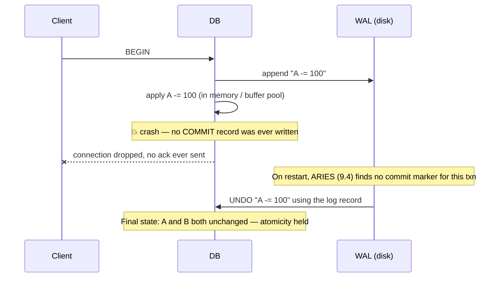
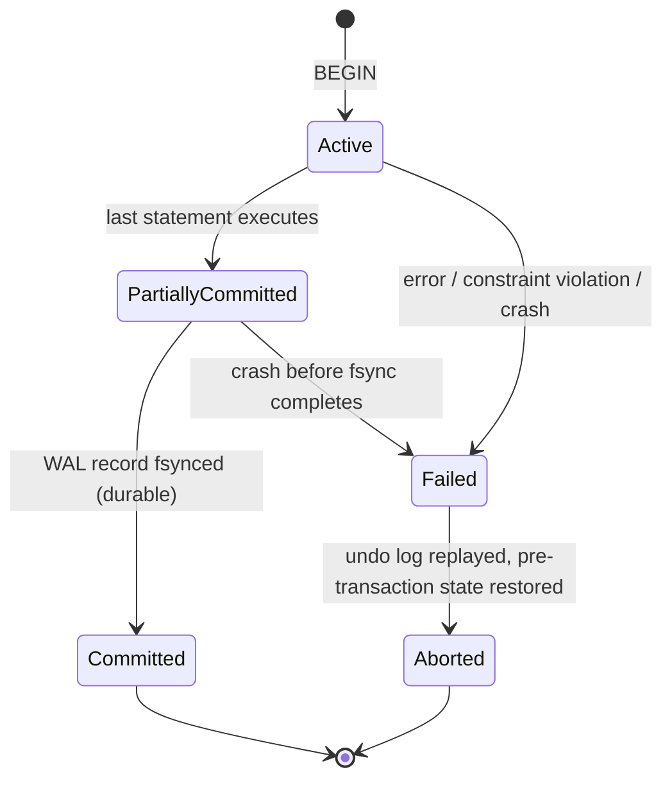
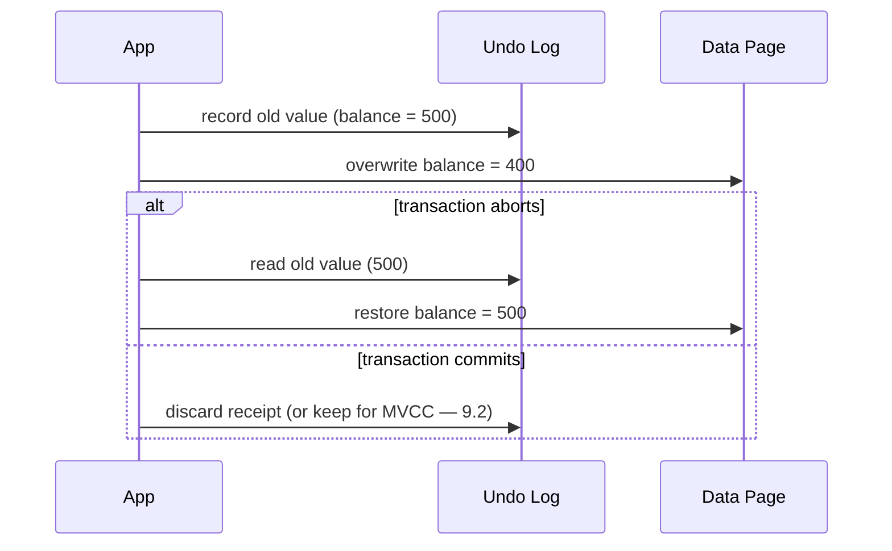
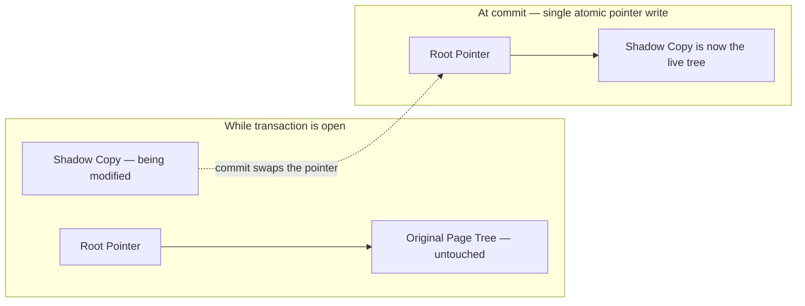
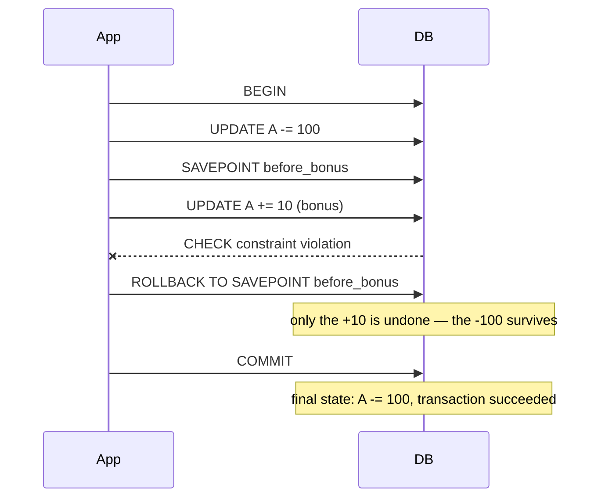
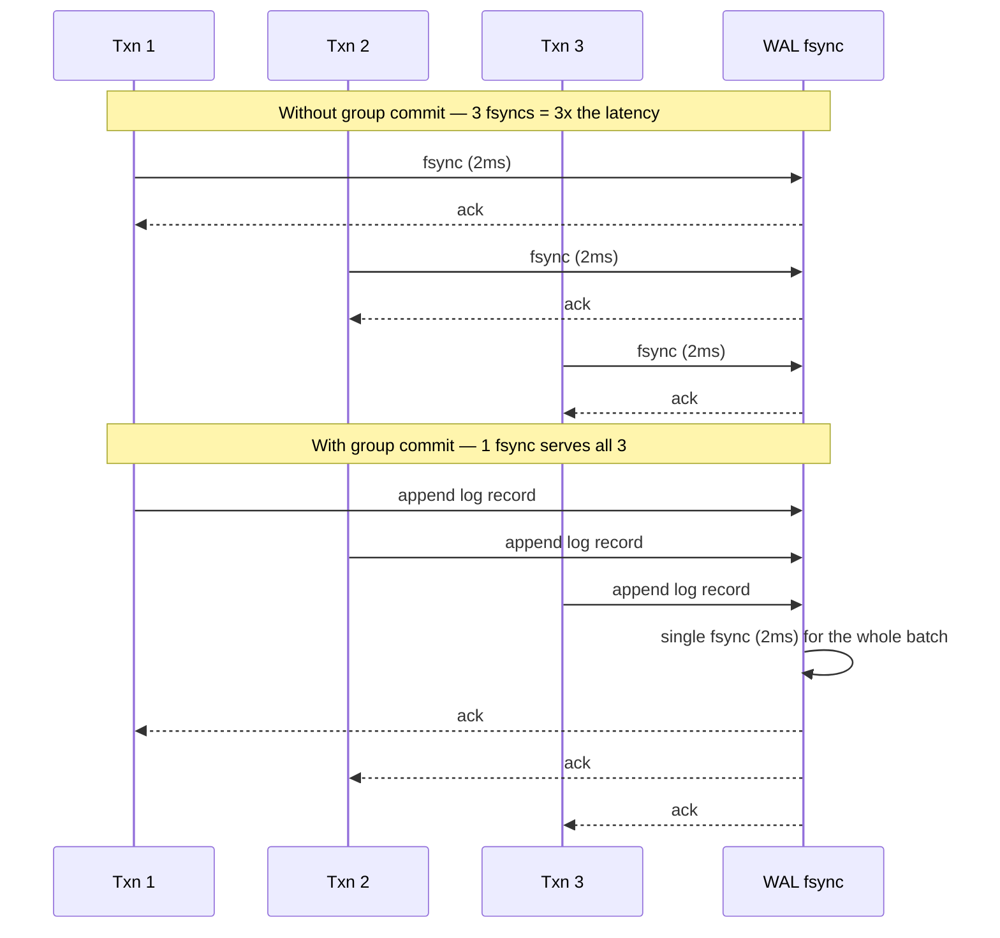
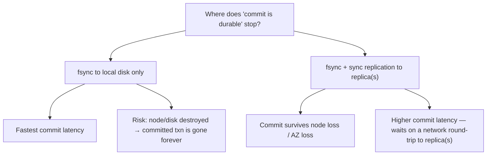
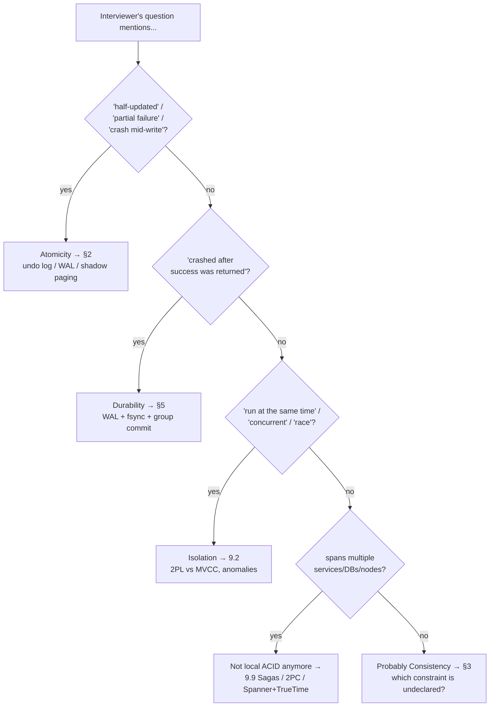

# 9.1 ACID and Transactions — Deep Dive

> **Enhancement notes:** this pass added material rather than rewriting — the existing prose, diagrams, and cheat sheet were already solid and mostly left untouched.
> - Added a "what breaks if you drop each letter" table in §1 (one concrete failure per A/C/I/D) and gave Isolation a proper `Contract:` line + concrete lost-update example in §4, matching the style the other three letters already had.
> - Added a worked numeric example in §5 (fsync throughput ceiling: 500 commits/sec without group commit vs. 10,000 commits/sec batching 20 — illustrative, labeled as such).
> - Added new §9 (🆕 Where ACID Bends in Distributed Systems) — a pointer table to 9.9/9.6/9.7, not a rewrite of them — and new §10 (🆕 What Each Letter Actually Costs You) plus a 🆕 mnemonic ("log it, check it, lock it, flush it"), tied back into the cheat sheet.
> - Left untouched: the transaction-lifecycle state diagram, the crash/recovery sequence diagram, savepoints, ACID-vs-BASE, the real-DB table, and the interview routing diagram — these already covered what the task asked for and didn't need duplicating.
>
> Prerequisite context: [Databases-FAANG-Guide.md](Databases-FAANG-Guide.md) §2 gave you the one-line definitions of A/C/I/D. This file goes underneath the hood: how each property is actually *implemented*, what breaks when you relax it, and what to say when an interviewer pushes past the textbook definition.

---

## 1. What a transaction actually is

A **transaction** is a unit of work that groups multiple reads/writes so the *group* behaves as one operation. The classic example: transferring money.

```sql
BEGIN;
UPDATE accounts SET balance = balance - 100 WHERE id = 'A';
UPDATE accounts SET balance = balance + 100 WHERE id = 'B';
COMMIT;
```

Without transactional guarantees, a crash between the two `UPDATE`s deletes $100 from existence. ACID is the contract that makes this impossible. Let's take each letter further than the one-liner.

### 🆕 What breaks if you drop each letter

Four different failure modes, each caused by dropping exactly one guarantee and nothing else:

| Drop this | Concrete failure | Fix lives in |
|---|---|---|
| **Atomicity** | Crash between the two `UPDATE`s above. $100 leaves account A, never reaches B. Money vanishes. | §2 |
| **Consistency** | No `CHECK (balance >= 0)` constraint exists. A bug commits a transaction that leaves `balance = -50`. Nothing crashed, nothing raced — an invariant simply wasn't declared. | §3 |
| **Isolation** | Two transactions both read `balance = 500`, both subtract 100, both write `400`. One of the two `-100`s is silently lost, even though each transaction was individually correct. | §4, 9.2 |
| **Durability** | DB acks "commit succeeded," a confirmation email goes out, then the machine loses power before the WAL page hits disk. The row reverts to its pre-commit value — the customer now has a "confirmed" order that the database never actually kept. | §5 |

**What a crash mid-transaction actually looks like**, and why it doesn't lose money:



The client never saw "success," so the DB doesn't owe it a committed result — it just has to guarantee no *half-applied* state survives. That guarantee is Atomicity, and §2 covers how it's built.

**Transaction lifecycle** — the classic four-state model every DB textbook draws, worth having memorized cold:



Note the trap: reaching "Partially Committed" (all statements executed) is **not** the same as "Committed" — that only happens once the commit log record is durably fsynced. Anything that crashes between those two states rolls back to `Aborted`, never leaks forward.

---

## 2. Atomicity — implementation mechanisms

**Contract**: all statements in a transaction commit, or none do.

### How it's actually implemented

Databases use one (or a combination) of these techniques:

| Technique | Idea | Used by |
|---|---|---|
| **Undo logging (rollback segments)** | Before overwriting a value, write the *old* value to a log. On abort, replay the log backwards to restore old values. | Oracle (undo tablespace), MySQL InnoDB (undo logs, also feeds MVCC) |
| **Redo + undo (WAL-based)** | Log the *intended change* before applying it; on crash, redo committed transactions, undo uncommitted ones. | PostgreSQL, MySQL InnoDB, SQL Server |
| **Shadow paging** | Never overwrite the original page. Write changes to a new copy of the page; atomically swap a root pointer to the new page tree on commit. No undo log needed — abort just discards the shadow copy. | Older designs (early System R); still used conceptually in copy-on-write filesystems (ZFS, Btrfs) and some embedded DBs |

**Mental model for undo logging**: think of it as a "receipt" of what a value used to be. Abort = walk the receipts backward and restore. Commit = throw the receipts away (or archive them, in MVCC's case — see §9.2).



**Shadow paging in one picture** — no undo log needed because the original is never touched until the atomic swap:



**Key interview point**: atomicity is a *local, single-node* concept by default. Once a transaction spans multiple nodes/shards, atomicity requires a distributed protocol — this is exactly what **Two-Phase Commit (2PC)** and Sagas exist for. See [9.9 Distributed Transactions and Consensus](9.9%20Distributed%20Transactions%20and%20Consensus.md).

### Savepoints — partial rollback without losing the whole transaction

Real transactions are rarely "all or nothing" the way the textbook money-transfer example implies. Batch jobs, multi-step business logic, and ORMs routinely need to undo *one failed step* without discarding everything already done in the same transaction. A **savepoint** is a named marker inside an open transaction that you can roll back to, without aborting the transaction itself:

```sql
BEGIN;
UPDATE accounts SET balance = balance - 100 WHERE id = 'A';
SAVEPOINT before_bonus;
UPDATE accounts SET balance = balance + 10 WHERE id = 'A';  -- loyalty bonus; fails a CHECK constraint
ROLLBACK TO SAVEPOINT before_bonus;   -- undoes only the bonus, keeps the -100
COMMIT;                                -- the -100 debit still commits
```



Under the hood this is just undo logging (above) with an extra bookmark: the log tracks a savepoint's position, and `ROLLBACK TO SAVEPOINT` replays undo records back to that position instead of all the way to the start. This is also why "nested transactions" in ORMs (Django's `atomic()` blocks, Rails' nested `transaction do...end`) are implemented as savepoints under the hood — most SQL databases don't have true nested transactions, only one transaction with savepoint checkpoints inside it.

**Interview soundbite**: "Savepoints let you retry or skip a failed sub-step without paying for a full rollback — that's why ORMs build nested transaction blocks on top of savepoints instead of real nested transactions, which almost no SQL database actually implements."

---

## 3. Consistency — the property nobody implements directly

**Contract**: a transaction moves the database from one valid state to another valid state; all constraints (PK, FK, `CHECK`, `UNIQUE`, application-level invariants) hold before and after.

This is the odd one out in ACID: **the database doesn't "implement" consistency the way it implements atomicity or durability.** It only *enforces the constraints you declare* (foreign keys, unique indexes, check constraints, triggers). The rest — e.g., "an account balance must never go negative" if not expressed as a `CHECK` constraint — is the **application's** responsibility. Atomicity + Isolation are the *mechanisms*; Consistency is the *outcome* they jointly protect, plus whatever invariants you declared.

> **Interview soundbite**: "C in ACID is actually a consequence of A + I, not an independently engineered mechanism — the database guarantees the invariants you tell it about (constraints); it can't guarantee invariants that live only in application logic."

This is also why the "C" in ACID and the "C" in CAP are **different concepts** — a classic interview gotcha (see [9.8 CAP Theorem and PACELC](9.8%20CAP%20Theorem%20and%20PACELC.md) §5 for the full disambiguation). ACID's C = constraint validity. CAP's C = linearizability across replicas.

---

## 4. Isolation — the deep dive lives in its own file

**Contract**: concurrent transactions produce the same result as if they had run one after another, in some serial order — even though they physically overlap in time.

**What breaks if you drop it (concrete example)**: two transactions both read `balance = 500`, both compute `500 - 100 = 400`, both write `400`. Only one `-100` should have survived; the other is silently lost — a classic **lost update**. Neither transaction did anything wrong on its own (each was individually atomic and durable); the bug only exists *between* them. This is exactly the anomaly catalog 9.2 covers in full — dirty reads, non-repeatable reads, phantoms, lost updates, write skew.

Isolation is by far the richest of the four letters and gets a full dedicated file: [9.2 Isolation Levels and Concurrency Anomalies](9.2%20Isolation%20Levels%20and%20Concurrency%20Anomalies.md). Read that next.

Quick preview of the two implementation families you must be able to name:

| Family | Idea | Examples |
|---|---|---|
| **Pessimistic (lock-based)** — Two-Phase Locking (2PL) | Acquire locks before touching data; hold all locks until commit/abort | SQL Server (default), older MySQL MyISAM, most textbook implementations |
| **Optimistic (version-based)** — MVCC | Every writer creates a new *version* of a row; readers see a consistent snapshot without blocking writers | PostgreSQL, MySQL InnoDB, Oracle |

---

## 5. Durability — the mechanism and its actual cost

**Contract**: once a transaction commits, it survives a crash — power loss, process kill, OS panic.

### How it's implemented
1. Before acknowledging a commit, the DB **writes the transaction's log record to durable storage** (disk/SSD) — this is the **Write-Ahead Log**, covered fully in [9.4 Write-Ahead Logging and Crash Recovery](9.4%20Write-Ahead%20Logging%20and%20Crash%20Recovery.md).
2. It issues an **`fsync()`** (or equivalent) to force the OS to actually flush the write to physical media, not just to a page cache that a power loss would wipe.
3. Only after the fsync returns does the DB tell the client "commit succeeded."

### The real-world cost of durability
`fsync()` is *slow* relative to memory writes — typically 1–10ms on spinning disk, tens of microseconds to low-single-digit milliseconds on SSD/NVMe, and this per-commit cost is the single biggest throughput limiter on write-heavy OLTP systems.

**Mitigation: group commit.** Instead of fsyncing after every individual transaction, the DB batches multiple transactions' log records and fsyncs once for the batch, then acknowledges all of them together. This trades a small amount of added latency (waiting to batch) for a large throughput win (one fsync serves N transactions). Nearly every serious RDBMS (PostgreSQL, MySQL, Oracle) implements group commit.

#### 🆕 Worked example: the fsync throughput ceiling (illustrative numbers)

Say each `fsync()` costs 2ms — a plausible illustrative figure for a spinning disk, slower than typical SSD/NVMe.

- **Without group commit**: one fsync per commit, and fsyncs on a single log can't overlap. Ceiling = `1 / 0.002s` = **500 commits/sec**, full stop — no amount of extra CPU or RAM changes that number, because the bottleneck is the disk, not the database.
- **With group commit, batching 20 transactions per fsync**: the same one fsync now clears 20 transactions. Ceiling = `20 / 0.002s` = **10,000 commits/sec** — a 20x jump from the same disk, same hardware, just by delaying the fsync a few milliseconds to let a batch form.

The trade is real, not free: each transaction in the batch waits for the *whole batch* to fsync, so p99 commit latency goes up slightly even as aggregate throughput goes up a lot. That's the standard throughput-vs-latency knob interviewers are probing for when they ask "how would you make this write-heavy system handle more load?"



**Durability is also a replication question, not just a disk question.** A single-node fsync survives disk/power failure but not "the whole machine burns down." That's why:
- **Synchronous replication** (§[9.6 Replication Deep Dive](9.6%20Replication%20-%20Deep%20Dive.md)) extends durability across machines — a commit isn't acknowledged until a replica has it too.
- Cloud databases often expose a durability *knob*: e.g., "commit acknowledged after write to local disk" vs. "commit acknowledged after replication to N availability zones." **Naming this trade-off — durability-per-node vs. durability-across-failure-domains — is a strong signal in interviews.**



### The client-side half of durability: idempotency keys

§1's crash diagram showed the server-side half of an uncomfortable truth: **the client can't always tell whether a commit that looks like it failed actually succeeded.** If the connection drops after the WAL record is fsynced but before the "success" response reaches the client, the transaction is durably committed — but the client, having seen no ack, has no way to know that and will typically retry.

For non-idempotent operations (charge a card, decrement inventory) a naive retry double-executes. This is exactly why Stripe's API requires an **`Idempotency-Key`** header on every payment-creating request: the server stores the `(key → result)` mapping in the *same transaction* as the charge itself, so a retried request with the same key returns the original result instead of re-running the charge.

```mermaid
sequenceDiagram
    participant Client
    participant API as Payment API
    participant DB

    Client->>API: POST /charge (Idempotency-Key: abc123)
    API->>DB: BEGIN; INSERT charge; INSERT idempotency_key=abc123; COMMIT
    DB-->>API: commit succeeded
    API--xClient: response lost (timeout / network drop)
    Note over Client: client sees a timeout — doesn't know if the charge happened
    Client->>API: retry POST /charge (same Idempotency-Key: abc123)
    API->>DB: look up idempotency_key=abc123
    DB-->>API: found — return the original charge result
    API-->>Client: same response returned, no double charge
```

The database alone guarantees the charge either fully happened or didn't (atomicity) and survives a crash once committed (durability) — but only the *application*, by making the write idempotent at the API layer, closes the gap between "the commit succeeded" and "the client knows it succeeded." **Naming this ambiguous-ack problem, and idempotency keys as the standard fix, is a strong signal in payment/booking-system interviews** — it's a direct, practical extension of the crash-recovery picture in §1.

---

## 6. ACID vs. BASE — the term interviewers expect you to contrast unprompted

**BASE** is the NoSQL-era counter-philosophy to ACID, and knowing the acronym cold is a cheap, high-signal move:

| | **ACID** | **BASE** |
|---|---|---|
| Stands for | Atomicity, Consistency, Isolation, Durability | **B**asically **A**vailable, **S**oft state, **E**ventually consistent |
| Philosophy | Pessimistic — guarantee correctness at the cost of availability/latency under failure | Optimistic — favor availability and partition tolerance; let replicas converge over time |
| Typical systems | PostgreSQL, MySQL, Oracle, SQL Server, Spanner (with caveats) | Cassandra, DynamoDB (default mode), Riak |
| Trade-off | Strong guarantees, harder to scale horizontally without extra machinery (2PC/Paxos) | Scales horizontally easily, but callers must tolerate stale reads / handle conflicts |

**Interview framing**: "ACID vs. BASE is really CAP's C-vs-A trade-off wearing a database hat — ACID systems bias toward consistency (and pay for it with coordination overhead), BASE systems bias toward availability (and pay for it by pushing conflict resolution onto the application or a convergence mechanism like CRDTs / last-write-wins)."

---

## 7. How real databases actually implement transactions (name-dropping table)

| Database | Isolation mechanism | Default isolation level | Notes |
|---|---|---|---|
| **PostgreSQL** | MVCC | Read Committed | "Repeatable Read" in Postgres is actually **Snapshot Isolation** (stronger than the SQL standard requires), not textbook Repeatable Read |
| **MySQL (InnoDB)** | MVCC + gap locks | Repeatable Read | InnoDB's Repeatable Read uses **next-key locking** to prevent phantom reads — stronger than the SQL standard mandates at that level |
| **Oracle** | MVCC (multi-version read consistency) | Read Committed | Readers never block writers and vice versa — Oracle never does true dirty reads even at its lowest level |
| **SQL Server** | 2PL by default; MVCC optional (`SNAPSHOT` isolation) | Read Committed (with locking) | Can be configured for optimistic (snapshot) concurrency |
| **DynamoDB** | Per-item conditional writes + `TransactWriteItems` for multi-item ACID transactions | N/A (not full SQL isolation semantics) | ACID transactions across up to 100 items/25 (varies by API) added later — originally a pure BASE system |
| **Spanner** | 2PL + MVCC + TrueTime for external consistency | Serializable (externally consistent) | Uses atomic clocks + GPS ("TrueTime") to assign globally ordered timestamps — this is *the* namedrop for "how do you get ACID transactions across continents" |
| **CockroachDB** | Serializable Snapshot Isolation only (no weaker levels offered) | Serializable | Deliberately offers only one isolation level to eliminate footguns |

---

## 8. How to identify ACID/transaction questions in an interview

- "How do you make sure this multi-step operation doesn't leave data half-updated?" → Atomicity, transactions.
- "What happens if the server crashes right after telling the client 'success'?" → Durability, WAL, fsync, group commit.
- "Can two of these run at the same time safely?" → Isolation (redirect to 9.2).
- "This needs to work across two microservices/databases" → this is **not** local ACID anymore — pivot to Sagas/2PC (9.9). Saying "just wrap it in a transaction" across service boundaries is a red flag answer.
- "How would Spanner give you ACID transactions across data centers?" → TrueTime + Paxos + 2PC, mention explicitly.

**As a routing diagram** — the fastest way to pattern-match a question to a section:



---

## 9. 🆕 Where ACID Bends in Distributed Systems

Everything above assumes **one log, one lock manager, one clock** — true on a single node, false the moment a transaction spans two nodes. This section is a pointer, not a rewrite: the full mechanics live in [9.9 Distributed Transactions and Consensus](9.9%20Distributed%20Transactions%20and%20Consensus.md).

| Letter | Single-node mechanism (this file) | What breaks once you cross a network boundary | Fixed by |
|---|---|---|---|
| **Atomicity** | One WAL, one undo log | Node 1 commits, then the network partitions before node 2 gets the same instruction — one side is done, the other isn't, and there's no single log to replay to fix it | Two-Phase Commit / Sagas — 9.9 |
| **Consistency** | DB-enforced constraints (FK, CHECK, UNIQUE) | A foreign key across two shards can't be enforced by either database alone — each only sees its own rows | App-level coordination, or design shards to avoid cross-shard FKs — 9.7 |
| **Isolation** | One lock manager, or one MVCC snapshot clock | Two nodes can each believe they went first; there's no shared sequence number ordering both | Distributed consensus / TrueTime — 9.9 |
| **Durability** | fsync to local disk (+ optional sync replica) | A whole node or availability zone can disappear mid-transaction, before the second half of a distributed write lands anywhere else | Synchronous replication (9.6) combined with 2PC (9.9) |

**Interview soundbite**: "Local ACID is a solved problem — WAL, MVCC, fsync. The interesting question is always what happens when the transaction has to span a network boundary, because none of those single-node mechanisms have a natural distributed equivalent — that's why 2PC, Sagas, and Spanner's TrueTime exist."

---

## 10. 🆕 What Each Letter Actually Costs You (Performance)

Every ACID guarantee is bought with a specific, nameable performance cost — worth having a one-line answer for each when an interviewer asks "what's the overhead of this?"

| Letter | Mechanism | What it costs (illustrative) | What you get |
|---|---|---|---|
| **Atomicity** | Undo/redo logging | Roughly 2x write amplification — every changed row writes both a log record and the data page | A crash mid-transaction can't leave half-applied state |
| **Consistency** | Constraint checks (FK, UNIQUE, CHECK) | Extra index lookup per constraint on every write — usually microseconds each, but it scales linearly with how many constraints/indexes a table has | Invalid states (negative balance, orphaned foreign key) can't commit |
| **Isolation** | Locking (2PL) or MVCC | 2PL: writers block writers, sometimes readers too — contention under hot rows. MVCC: no blocking, but old row versions pile up until vacuumed/garbage-collected, costing storage and background CPU | Concurrent transactions don't see each other's half-finished work |
| **Durability** | `fsync()` per commit | ~500 commits/sec ceiling on a single log at 2ms/fsync, without group commit (see worked example, §5) | A committed transaction survives power loss |

### 🆕 Mnemonic

**"Log it, check it, lock it, flush it."** — one verb per letter, in order: Atomicity *logs* the old/new value, Consistency *checks* declared constraints, Isolation *locks or versions* rows, Durability *flushes* to disk. If you can say the verb, you can say the mechanism.

---

## Interview Cheat Sheet — ACID & Transactions

- Atomicity is implemented via **undo logs**, **redo+undo (WAL)**, or **shadow paging** — pick the WAL answer as your default, it's what 90% of production databases use.
- **Savepoints** give partial rollback inside one transaction (`ROLLBACK TO SAVEPOINT`) — this is also how ORM "nested transactions" (Django `atomic()`, Rails nested `transaction`) actually work under the hood.
- Consistency is not separately implemented — it's the **outcome** of atomicity + isolation plus whatever constraints (PK/FK/CHECK) you declare. App-level invariants are your job, not the DB's.
- Durability = WAL + `fsync` + (ideally) replication. **Group commit** batches fsyncs to reclaim throughput — always mention this when asked about write throughput ceilings.
- The client can't always tell if an unacknowledged commit actually succeeded — **idempotency keys** (Stripe's pattern) are the application-layer fix for that ambiguity, not something the database gives you for free.
- ACID's "C" ≠ CAP's "C" — don't conflate them; this distinction alone signals depth.
- **BASE** is ACID's opposite number for NoSQL: Basically Available, Soft state, Eventually consistent — frame it as CAP's availability side.
- Multi-node "transactions" are not free — they need 2PC, Sagas, or a consensus-backed design like Spanner. Naming this boundary is the single highest-leverage thing you can say in this section of an interview.
- Mnemonic: **"Log it, check it, lock it, flush it"** — Atomicity/Consistency/Isolation/Durability in mechanism order.
- Every letter has a performance tax: atomicity ≈ 2x write amplification, consistency ≈ extra index lookups per write, isolation ≈ blocking (2PL) or version bloat (MVCC), durability ≈ an fsync-per-commit latency floor (§10).
