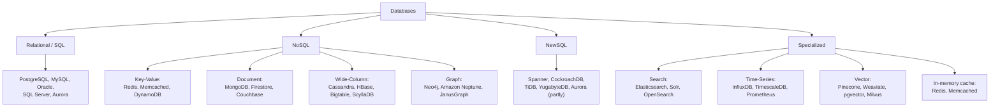
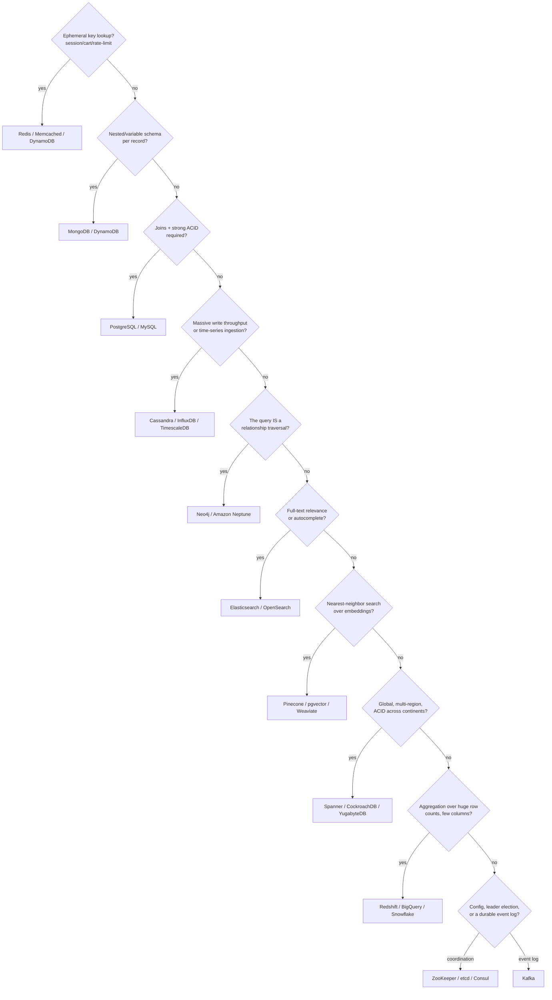

# 9.10 Database Selection Guide — Types, Real Systems, and When to Use What

> The goal of this file is speed: given a requirement, you should be able to name the right database family — and a specific real product — in under 10 seconds, then justify it in two sentences. This is the file to re-read the morning of an interview.

---

## 1. The full landscape, one diagram

---

## 2. The "identify in 10 seconds" trigger table

This is the highest-value table in this entire series. Interviewers drop keywords/scenarios that are meant to be recognized instantly.

| If the requirement says... | Reach for | Why |
|---|---|---|
| "Session data", "shopping cart", "rate limiting counter" | **Redis / Memcached** (key-value, in-memory) | O(1) key lookup, sub-millisecond latency, TTL support built in |
| "User profile with variable/nested attributes", "product catalog" | **MongoDB / DynamoDB** (document / KV) | Schema flexibility, no impedance mismatch for nested data |
| "Financial transactions", "orders and payments", "needs joins and strong consistency" | **PostgreSQL / MySQL** (relational) | ACID transactions, mature tooling, joins are a first-class citizen |
| "Massive write throughput", "IoT sensor data", "time-series metrics ingestion at huge scale" | **Cassandra / InfluxDB / TimescaleDB** | LSM-tree write optimization (Cassandra) or purpose-built time-series compression and downsampling |
| "Social graph", "friends of friends", "fraud ring detection", "recommendation traversal" | **Neo4j / Amazon Neptune** (graph) | Relationship traversal is the query itself; graph databases index edges, not just nodes |
| "Full-text search", "autocomplete", "faceted search/filtering" | **Elasticsearch / OpenSearch** | Inverted index built for text relevance ranking and fast multi-field filtering, not a relational DB's job |
| "Global, multi-region, need ACID transactions across continents" | **Spanner / CockroachDB / YugabyteDB** (NewSQL) | Distributed consensus + (Spanner) synchronized clocks give you SQL semantics at global scale |
| "Semantic search", "find similar embeddings", "RAG pipeline for an LLM" | **Pinecone / Weaviate / pgvector / Milvus** (vector) | Approximate nearest-neighbor search over high-dimensional embeddings — not something a B-Tree or inverted index does efficiently |
| "Analytics/aggregation over a huge number of rows, few columns" | **Columnar warehouse: Redshift / BigQuery / Snowflake** (or Cassandra/HBase if it's operational, not analytical) | Columnar storage minimizes I/O for aggregation-heavy scans |
| "Multi-tenant SaaS, need strict data isolation per customer" | **PostgreSQL with row-level security or schema-per-tenant**, or **DynamoDB with tenant_id partition key** | Depends on tenant count/size — few large tenants favor schema-per-tenant, many small tenants favor a shared table partitioned by tenant |
| "Config data, service discovery, leader election, distributed lock" | **ZooKeeper / etcd / Consul** | These are consensus-backed coordination services, not general-purpose databases — always name this distinction |
| "Cache-aside in front of a slow database" | **Redis / Memcached** | Not a database replacement — an explicit caching layer, mention cache invalidation strategy |
| "Append-only event log, event sourcing, stream processing source of truth" | **Kafka** (technically a distributed log, not a database, but frequently the right answer) | Durable, ordered, replayable log — the backbone of event-driven and CQRS architectures |

### Same table, as a decision tree

Walking the trigger table top to bottom in your head *is* the decision tree — this just makes the order explicit as a flowchart, so the elimination logic (rather than the product names) is what sticks.

---

## 3. Deep comparison: the "big four" NoSQL families revisited with real trade-offs

(Foundational intro is in [Databases-FAANG-Guide.md](Databases-FAANG-Guide.md) §2 — this table adds the operational trade-offs that intro skips.)

| Family | Best real system | Consistency posture | Storage engine | When it breaks down |
|---|---|---|---|---|
| Key-Value | Redis (in-memory), DynamoDB (durable) | Redis: single-threaded, strongly consistent per-key by default. DynamoDB: tunable (§9.3 §7) | Redis: in-memory hash table + optional AOF/RDB persistence. DynamoDB: SSD-backed, LSM-like internals | Poor fit once you need to query by anything other than the key (no secondary indexes without extra machinery) |
| Document | MongoDB | Tunable read/write concern | WiredTiger (B-Tree default, LSM optional) | Deeply relational data (many-to-many joins) forces either app-level joins or denormalization — the impedance-mismatch problem just moves rather than disappears |
| Wide-Column | Cassandra, Bigtable | AP by default, tunable | LSM-Tree | Ad-hoc queries not matching the pre-modeled partition/clustering key are expensive or impossible — schema design must be query-driven, not entity-driven, from day one |
| Graph | Neo4j | Typically single-leader, ACID within a node; horizontal scaling for huge graphs is genuinely hard | Custom (native graph storage, index-free adjacency) | Doesn't scale horizontally as gracefully as KV/document/wide-column stores — very large graphs (billions of edges) often need specialized distributed graph engines (JanusGraph, Neptune, or a custom Pregel-style batch system) |

---

## 4. NewSQL — the category the foundational guide only gestures at

**NewSQL** databases aim to give you relational (SQL, ACID, joins) semantics **with** horizontal scalability — historically thought to be mutually exclusive.

| System | Consensus | Standout feature | Real users |
|---|---|---|---|
| **Google Spanner** | Paxos per shard + 2PC across shards + TrueTime | First to prove global, externally-consistent SQL transactions were possible at scale | Google internal (AdWords, etc.), Cloud Spanner as a public product |
| **CockroachDB** | Raft per shard | Open-source, Postgres-wire-compatible, deliberately offers only Serializable isolation | Various enterprises needing multi-region SQL without vendor lock-in |
| **TiDB** | Raft (via TiKV storage layer, itself RocksDB-backed — an LSM-tree) | MySQL-wire-compatible, separates SQL layer from a distributed KV storage layer | PingCAP's ecosystem, used heavily in China's fintech sector |
| **YugabyteDB** | Raft per shard | PostgreSQL-compatible, similar philosophy to CockroachDB | Multi-cloud enterprise deployments |
| **Amazon Aurora** | Not a full NewSQL (single-writer, many-reader) but a hybrid worth knowing | Separates compute from a distributed, self-healing storage layer; storage layer replicates 6 ways across 3 AZs | AWS-native applications wanting Postgres/MySQL compatibility with cloud-native storage resilience |

**Interview soundbite**: *"NewSQL's pitch is 'you shouldn't have to choose between SQL/ACID and horizontal scale' — they deliver that using the same consensus machinery (Raft/Paxos) covered in 9.9, just packaged behind a familiar SQL interface."*

---

## 5. Vector databases — the category the original 2023-era guide would have missed entirely

With retrieval-augmented generation (RAG) and semantic search now a standard system-design interview topic, vector databases are worth treating as a first-class category.

**What they solve**: given a high-dimensional embedding (e.g., a 1536-dimension vector from an LLM embedding model), find the **k nearest neighbors** by cosine similarity/Euclidean distance, fast, over millions-to-billions of vectors — something a B-Tree or a standard inverted index cannot do efficiently, because "nearness" in high-dimensional space doesn't map onto a sortable single key.

**Core technique**: Approximate Nearest Neighbor (ANN) search, usually via **HNSW** (Hierarchical Navigable Small World graphs) or **IVF** (Inverted File Index) — trading a small amount of recall accuracy for massive speed gains over an exact brute-force scan.

| System | Type | Notes |
|---|---|---|
| **Pinecone** | Managed, dedicated vector DB | Fully managed, no infra to run yourself — common answer for "fastest to ship a RAG pipeline" |
| **Weaviate / Milvus** | Open-source, dedicated vector DB | Self-hosted alternative, more control |
| **pgvector** | PostgreSQL extension | Adds vector similarity search to an existing Postgres instance — the answer when the requirement is "don't want to add a whole new database just for this" |
| **Redis (with vector search module)** | In-memory + vector | Good when you're already using Redis and want to avoid another moving part |

**Interview framing**: *"For a RAG-style feature, I'd ask first whether we already run Postgres or Redis — pgvector or Redis's vector module avoid standing up a new system for what might be a secondary feature. A dedicated store like Pinecone makes sense once vector search is a primary, high-QPS workload in its own right, not an add-on."*

---

## 6. Real company stacks — concrete, memorable namedrops

Interviewers respond well to hearing that you know what companies *actually* run, not just textbook categories.

| Company | Stack (representative, not exhaustive) | Why |
|---|---|---|
| **Meta / Facebook** | MySQL (with **MyRocks** — RocksDB-backed LSM engine, see [9.5](9.5%20Storage%20Engines%20-%20B-Tree%20vs%20LSM-Tree.md)) for OLTP; **TAO** (a graph-aware caching layer over MySQL) for the social graph; Cassandra for some services | Massive write volume + social graph access patterns drove both the LSM storage-engine switch and the TAO caching layer |
| **Amazon** | **DynamoDB** for many internal/retail services (the original Dynamo paper came from here); Aurora for relational workloads | Amazon's own 2007 Dynamo paper is the direct ancestor of the leaderless-replication family covered in 9.6 |
| **Netflix** | Cassandra (widely, for its availability-over-consistency posture matching streaming's tolerance for eventual consistency) + **EVCache** (a Memcached-based distributed cache layer) | Netflix explicitly prioritizes availability (never show an error page) over strict consistency for most of its data |
| **Uber** | Originally **Schemaless** (a custom sharded-MySQL layer), later heavy **Cassandra** and **Docstore** usage; Kafka extensively for event streaming | Ride/location data has extreme write volume and geographic sharding needs |
| **Google** | **Spanner** and **Bigtable** internally; Bigtable predates and directly inspired HBase | Google's internal scale problems produced two of the most influential papers/systems in this entire chapter |
| **Instagram** | Sharded **PostgreSQL** (core data — user/photo metadata, horizontally sharded by user ID) + **Cassandra** (feed/inbox-style, high-fan-out data) + **Redis** (feed generation, session storage) + **Memcached** (read-through cache in front of Postgres) | Postgres is the counter-example to "NoSQL is required at scale" — proof relational can shard successfully with the right shard-key discipline (9.7 §1); but the feed itself (fan-out-on-write to millions of followers) is a read-dominated, denormalized-write problem Postgres alone wouldn't serve at Instagram's QPS, hence Cassandra/Redis/Memcached layered on top |
| **LinkedIn** | Originated **Kafka** and **Voldemort** (a Dynamo-style key-value store) | Directly influenced the wider industry's adoption of both event streaming and Dynamo-style KV stores |

---

## 7. The decision framework to narrate out loud in an interview

When asked "what database would you use for X," walk through these questions **in this order** — the order itself is the signal, not just the final answer:

1. **What's the access pattern?** By primary key only? By arbitrary/ad-hoc query? By full-text relevance? By nearest-neighbor similarity? By graph traversal? — this alone eliminates most of the wrong families immediately.
2. **What's the consistency requirement?** Does staleness cause real harm (money, uniqueness, safety) or is it invisible/acceptable (view counts, social feed ordering)? → maps to 9.3's spectrum.
3. **What's the scale, and along which axis?** Data volume? Write QPS? Read QPS? Fan-out per query? → determines whether you need to shard at all (9.7 §1's "don't shard by default" caution from the foundational guide's §5 still applies).
4. **Do you need joins/transactions across entities?** If yes and they're rare/narrow, relational-with-sharding (Instagram's Postgres) can work; if pervasive, consider NewSQL; if the entities can be modeled to avoid needing joins (denormalize), NoSQL becomes viable.
5. **What's the team's / org's existing operational expertise?** A boring, well-understood Postgres instance operated by a team that knows it cold often beats an exotic, "more scalable on paper" system nobody on the team has run in production — this is a legitimate, senior-signaling answer, not a cop-out.

---

## Interview Cheat Sheet — Database Selection

- Speed-match keywords to families: session/cart → KV (Redis/DynamoDB); variable-schema catalog → Document (MongoDB); huge write volume/time-series → Wide-column/LSM (Cassandra) or purpose-built TSDB; social graph/fraud rings → Graph (Neo4j/Neptune); full-text/autocomplete → Search (Elasticsearch); global ACID → NewSQL (Spanner/CockroachDB); RAG/semantic search → Vector (Pinecone/pgvector).
- **NewSQL** = SQL/ACID semantics + horizontal scale, built on the same Paxos/Raft consensus machinery as 9.9 (Spanner=Paxos+TrueTime, CockroachDB/TiDB/YugabyteDB=Raft).
- **Vector databases** are now a first-class category for RAG/LLM system design — default to `pgvector`/Redis-vector if the team already runs Postgres/Redis and this is a secondary feature; reach for Pinecone/Weaviate/Milvus when vector search is the primary, high-QPS workload.
- Coordination services (ZooKeeper, etcd, Consul) are **not general-purpose databases** — they're consensus-backed systems for config, leader election, and locks; naming this distinction avoids a common conflation.
- Real-world proof points to keep ready: Meta's MyRocks (LSM at OLTP scale), Amazon's Dynamo paper (→ DynamoDB, →the whole leaderless-replication family), Netflix's Cassandra (availability-first for streaming), Instagram's sharded Postgres (relational can scale with disciplined shard-key choice).
- The decision framework itself is the interview answer: access pattern → consistency needs → scale axis → join/transaction needs → team's operational reality. Narrating this order out loud is more valuable than jumping straight to a product name.
