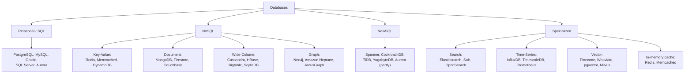
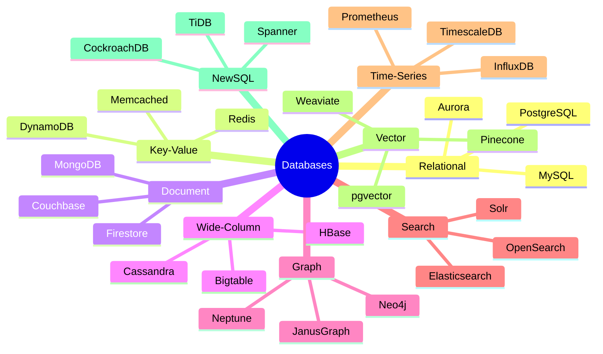
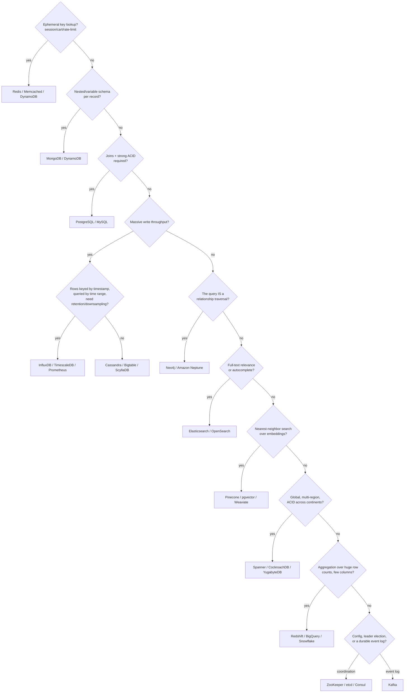

# 9.10 Database Selection Guide — Types, Real Systems, and When to Use What

> **Enhancement notes:** this file was extended in place — nothing existing was rewritten or reordered beyond renumbering headings to fit new content.
> - Added two missing categories as full sections: **§6 Search databases** (Elasticsearch/OpenSearch/Solr) and **§7 Time-series databases** (InfluxDB/TimescaleDB/Prometheus) — previously these only appeared as one-line trigger-table entries.
> - Added **§10 Worked walkthroughs** — five concrete workload → pick → reasoning scenarios (social graph, time-series metrics, session store, full-text search, financial ledger) with illustrative numbers, closing the "abstract pros/cons only" gap.
> - Added **§11 Master comparison matrix** (category × data model × real systems × best-fit signal × avoid-if) covering all 11 categories in one table, and **§12 Memory hooks** (a chant + one-liners) for interview-pressure recall.
> - Added a 🆕 numeric-signal table in §2 (ops/sec, latency, data-shape numbers per category, labeled illustrative) and a 🆕 mind-map diagram in §1 as an alternate view of the taxonomy tree.
> - Refined the §2 decision tree's write-throughput branch to split wide-column from time-series (it previously conflated the two), since they now have separate sections.
> - Original sections 1–5, 6→8 (real company stacks), and 7→9 (decision framework) are otherwise untouched in content — only their numbers shifted to make room; the cheat sheet gained four bullets pointing at the new material.

> The goal of this file is speed: given a requirement, you should be able to name the right database family — and a specific real product — in under 10 seconds, then justify it in two sentences. This is the file to re-read the morning of an interview.

---

## 1. The full landscape, one diagram

#### 🆕 Same landscape, as a mind-map

Same nine families, drawn as a mind-map instead of a tree — useful for the 30-second mental scan right before you walk into the room.

---

## 2. The "identify in 10 seconds" trigger table

This is the highest-value table in this entire series. Interviewers drop keywords/scenarios that are meant to be recognized instantly.

| If the requirement says... | Reach for | Why |
|---|---|---|
| "Session data", "shopping cart", "rate limiting counter" | **Redis / Memcached** (key-value, in-memory) | O(1) key lookup, sub-millisecond latency, TTL support built in |
| "User profile with variable/nested attributes", "product catalog" | **MongoDB / DynamoDB** (document / KV) | Schema flexibility, no impedance mismatch for nested data |
| "Financial transactions", "orders and payments", "needs joins and strong consistency" | **PostgreSQL / MySQL** (relational) | ACID transactions, mature tooling, joins are a first-class citizen |
| "Massive write throughput", "IoT sensor data", "time-series metrics ingestion at huge scale" | **Cassandra / InfluxDB / TimescaleDB** | LSM-tree write optimization (Cassandra) or purpose-built time-series compression and downsampling |
| "Social graph", "friends of friends", "fraud ring detection", "recommendation traversal" | **Neo4j / Amazon Neptune** (graph) | Relationship traversal is the query itself; graph databases index edges, not just nodes |
| "Full-text search", "autocomplete", "faceted search/filtering" | **Elasticsearch / OpenSearch** | Inverted index built for text relevance ranking and fast multi-field filtering, not a relational DB's job |
| "Global, multi-region, need ACID transactions across continents" | **Spanner / CockroachDB / YugabyteDB** (NewSQL) | Distributed consensus + (Spanner) synchronized clocks give you SQL semantics at global scale |
| "Semantic search", "find similar embeddings", "RAG pipeline for an LLM" | **Pinecone / Weaviate / pgvector / Milvus** (vector) | Approximate nearest-neighbor search over high-dimensional embeddings — not something a B-Tree or inverted index does efficiently |
| "Analytics/aggregation over a huge number of rows, few columns" | **Columnar warehouse: Redshift / BigQuery / Snowflake** (or Cassandra/HBase if it's operational, not analytical) | Columnar storage minimizes I/O for aggregation-heavy scans |
| "Multi-tenant SaaS, need strict data isolation per customer" | **PostgreSQL with row-level security or schema-per-tenant**, or **DynamoDB with tenant_id partition key** | Depends on tenant count/size — few large tenants favor schema-per-tenant, many small tenants favor a shared table partitioned by tenant |
| "Config data, service discovery, leader election, distributed lock" | **ZooKeeper / etcd / Consul** | These are consensus-backed coordination services, not general-purpose databases — always name this distinction |
| "Cache-aside in front of a slow database" | **Redis / Memcached** | Not a database replacement — an explicit caching layer, mention cache invalidation strategy |
| "Append-only event log, event sourcing, stream processing source of truth" | **Kafka** (technically a distributed log, not a database, but frequently the right answer) | Durable, ordered, replayable log — the backbone of event-driven and CQRS architectures |

### Same table, as a decision tree

Walking the trigger table top to bottom in your head *is* the decision tree — this just makes the order explicit as a flowchart, so the elimination logic (rather than the product names) is what sticks.

#### 🆕 The same signals, but with numbers attached

The trigger table above says "sub-millisecond" and "massive write throughput" — vague under interview pressure. Here's the same signals pinned to illustrative numbers (labeled illustrative because exact figures vary by workload; the point is the *order of magnitude and shape*, not the digit).

| Category | Illustrative numbers that scream "pick this" | Why the shape of the number matters |
|---|---|---|
| Key-Value (Redis) | Sub-ms p99 reads at 500K–1M ops/sec, data fits in RAM (tens of GB per node), TTL of minutes-to-hours | If you can throw away the value in an hour and never need to query it by anything but its ID, you don't need a database — you need a hash table with a network in front of it |
| Document (MongoDB) | ~10K writes/sec, records with 50–200 fields where no two records share the same field set | The "no two records share the same shape" part is the tell — a fixed relational schema would need dozens of nullable columns or a sparse join table |
| Relational (Postgres) | A few thousand TPS, each transaction touches 2–5 rows across 2–3 tables and must commit atomically | Low absolute throughput but a hard atomicity requirement — this is a correctness problem, not a scale problem |
| Wide-Column (Cassandra) | 1M+ writes/sec across a cluster, each row keyed by (id, time) and rarely read back except by that same key | The write volume alone would saturate a single-leader relational DB's WAL; the LSM-tree write path (9.5) is built for exactly this |
| Time-Series (InfluxDB/Prometheus) | 1M points/sec from 100K hosts (100K hosts × 10 metrics × 1/sec), queries are always "last N minutes, bucketed" | Every query has a time range in it — that's the signal a general wide-column store doesn't optimize for but a TSDB's compression + downsampling does |
| Graph (Neo4j) | 1B+ edges, a single query needs a 3–4 hop traversal in under 200ms | A relational self-join 4 levels deep over a billion-row edge table is a correctness *and* latency disaster; index-free adjacency makes hop cost independent of table size |
| Search (Elasticsearch) | 10M+ documents, free-text query returns ranked results in <150ms with typo tolerance | Ranking by relevance isn't a sort — it's a scoring function (BM25) over an inverted index, something no B-Tree computes |
| Vector (Pinecone/pgvector) | 100M–1B embeddings (768–1536 dims each), k-NN query in <50ms at ~95% recall | Trading a little recall for massive speed (ANN vs. brute-force) only makes sense once brute-force cosine similarity over that many vectors would take seconds, not milliseconds |
| NewSQL (Spanner/CockroachDB) | Multi-region ACID commit in <100ms p99 despite a consensus round-trip across continents | The number that matters isn't throughput, it's that a *cross-region* transaction still commits fast enough to feel synchronous to a user |

---

## 3. Deep comparison: the "big four" NoSQL families revisited with real trade-offs

(Foundational intro is in [Databases-FAANG-Guide.md](Databases-FAANG-Guide.md) §2 — this table adds the operational trade-offs that intro skips.)

| Family | Best real system | Consistency posture | Storage engine | When it breaks down |
|---|---|---|---|---|
| Key-Value | Redis (in-memory), DynamoDB (durable) | Redis: single-threaded, strongly consistent per-key by default. DynamoDB: tunable (§9.3 §7) | Redis: in-memory hash table + optional AOF/RDB persistence. DynamoDB: SSD-backed, LSM-like internals | Poor fit once you need to query by anything other than the key (no secondary indexes without extra machinery) |
| Document | MongoDB | Tunable read/write concern | WiredTiger (B-Tree default, LSM optional) | Deeply relational data (many-to-many joins) forces either app-level joins or denormalization — the impedance-mismatch problem just moves rather than disappears |
| Wide-Column | Cassandra, Bigtable | AP by default, tunable | LSM-Tree | Ad-hoc queries not matching the pre-modeled partition/clustering key are expensive or impossible — schema design must be query-driven, not entity-driven, from day one |
| Graph | Neo4j | Typically single-leader, ACID within a node; horizontal scaling for huge graphs is genuinely hard | Custom (native graph storage, index-free adjacency) | Doesn't scale horizontally as gracefully as KV/document/wide-column stores — very large graphs (billions of edges) often need specialized distributed graph engines (JanusGraph, Neptune, or a custom Pregel-style batch system) |

---

## 4. NewSQL — the category the foundational guide only gestures at

**NewSQL** databases aim to give you relational (SQL, ACID, joins) semantics **with** horizontal scalability — historically thought to be mutually exclusive.

| System | Consensus | Standout feature | Real users |
|---|---|---|---|
| **Google Spanner** | Paxos per shard + 2PC across shards + TrueTime | First to prove global, externally-consistent SQL transactions were possible at scale | Google internal (AdWords, etc.), Cloud Spanner as a public product |
| **CockroachDB** | Raft per shard | Open-source, Postgres-wire-compatible, deliberately offers only Serializable isolation | Various enterprises needing multi-region SQL without vendor lock-in |
| **TiDB** | Raft (via TiKV storage layer, itself RocksDB-backed — an LSM-tree) | MySQL-wire-compatible, separates SQL layer from a distributed KV storage layer | PingCAP's ecosystem, used heavily in China's fintech sector |
| **YugabyteDB** | Raft per shard | PostgreSQL-compatible, similar philosophy to CockroachDB | Multi-cloud enterprise deployments |
| **Amazon Aurora** | Not a full NewSQL (single-writer, many-reader) but a hybrid worth knowing | Separates compute from a distributed, self-healing storage layer; storage layer replicates 6 ways across 3 AZs | AWS-native applications wanting Postgres/MySQL compatibility with cloud-native storage resilience |

**Interview soundbite**: *"NewSQL's pitch is 'you shouldn't have to choose between SQL/ACID and horizontal scale' — they deliver that using the same consensus machinery (Raft/Paxos) covered in 9.9, just packaged behind a familiar SQL interface."*

---

## 5. Vector databases — the category the original 2023-era guide would have missed entirely

With retrieval-augmented generation (RAG) and semantic search now a standard system-design interview topic, vector databases are worth treating as a first-class category.

**What they solve**: given a high-dimensional embedding (e.g., a 1536-dimension vector from an LLM embedding model), find the **k nearest neighbors** by cosine similarity/Euclidean distance, fast, over millions-to-billions of vectors — something a B-Tree or a standard inverted index cannot do efficiently, because "nearness" in high-dimensional space doesn't map onto a sortable single key.

**Core technique**: Approximate Nearest Neighbor (ANN) search, usually via **HNSW** (Hierarchical Navigable Small World graphs) or **IVF** (Inverted File Index) — trading a small amount of recall accuracy for massive speed gains over an exact brute-force scan.

| System | Type | Notes |
|---|---|---|
| **Pinecone** | Managed, dedicated vector DB | Fully managed, no infra to run yourself — common answer for "fastest to ship a RAG pipeline" |
| **Weaviate / Milvus** | Open-source, dedicated vector DB | Self-hosted alternative, more control |
| **pgvector** | PostgreSQL extension | Adds vector similarity search to an existing Postgres instance — the answer when the requirement is "don't want to add a whole new database just for this" |
| **Redis (with vector search module)** | In-memory + vector | Good when you're already using Redis and want to avoid another moving part |

**Interview framing**: *"For a RAG-style feature, I'd ask first whether we already run Postgres or Redis — pgvector or Redis's vector module avoid standing up a new system for what might be a secondary feature. A dedicated store like Pinecone makes sense once vector search is a primary, high-QPS workload in its own right, not an add-on."*

---

## 6. 🆕 Search databases — the category everyone namedrops but few explain

**What they solve**: ranking many documents by *textual relevance* for a free-text query. A relational `LIKE '%shoe%'` scan or a B-Tree index on a `title` column can't rank results by how relevant they are, tolerate typos, or filter across many fields at once — that needs an **inverted index** (term → list of document IDs) plus a scoring function like **BM25**.

**Core idea**: instead of indexing rows by a primary key, you index *words*. A query for "red running shoes" looks up each term's posting list, intersects/scores them, and returns the best matches — the same data structure that makes a search engine fast for the whole web works here at application scale.

| System | Notes |
|---|---|
| **Elasticsearch** | Built on Apache Lucene; the default answer in interviews — distributed, JSON-native, near-real-time indexing |
| **OpenSearch** | AWS's fork of Elasticsearch after Elastic's 2021 license change; functionally near-identical, worth knowing the name exists |
| **Solr** | Older Lucene-based engine, still runs at scale in some large enterprises (e.g., Bloomberg) — a legitimate "already in production" answer |
| **Algolia** | Managed, instant-search-as-you-type product — the answer when the requirement is "ship search fast, don't run infra" |

**Access-pattern signal**: "search across product descriptions," "autocomplete-as-you-type," "faceted filters alongside free text" (brand + price + rating + a text query, all at once), or "log search / observability" (the classic ELK-stack use case).

**When it breaks down**: a search index is almost never the system of record — it's fed by CDC (change-data-capture) or dual-writes from a durable primary store, so there's always a lag before new/updated data becomes searchable (near-real-time, not real-time). It also doesn't do multi-row transactions — don't reach for it as your only database.

**Interview soundbite**: *"For search, I'd keep Postgres/DynamoDB as the system of record and stream changes into Elasticsearch as a read-optimized index — that way a search-cluster outage degrades search, not checkout."*

---

## 7. 🆕 Time-series databases — the category candidates most often underrate

**What they solve**: extremely high-volume writes of `(timestamp, metric name, tags, value)` tuples, where almost every read is a **range scan over time** with aggregation ("average CPU over the last 5 minutes, bucketed every 10 seconds"), plus automatic **downsampling** (roll old data up to coarser resolution) and **retention** (expire raw data after N days).

**Why a general wide-column or relational store isn't the first choice**: you *can* model this in Cassandra or Postgres, but you'd hand-roll retention jobs, rollup jobs, and time-bucket partitioning yourself. A time-series database ships those as built-in features, not app-level cron jobs.

| System | Notes |
|---|---|
| **Prometheus** | Pull-based metrics scraping + alerting, the default for infra/service monitoring; its local TSDB is *not* meant as a long-term store — pair it with **Thanos**, **Cortex**, or **Mimir** for retention beyond a few weeks |
| **InfluxDB** | Purpose-built line protocol + TSM storage engine, popular for IoT and infra metrics as a single ingest-and-query system |
| **TimescaleDB** | A PostgreSQL extension ("hypertables") — the answer when the requirement is "we already run Postgres and don't want a new database just for metrics" |

**Access-pattern signal, with numbers**: 100K hosts × 10 metrics × 1 point/sec ≈ 1M points/sec ingest (illustrative), every query has a time range and a bucket size baked in, retention policy like "30 days raw, 13 months rolled up to 1-hour resolution."

**When it breaks down**: point lookups by a non-time key (e.g., "give me this one user's current profile") aren't what it's optimized for, and it's the wrong place to hold data that needs to be the transactional source of truth for business logic.

---

## 8. Real company stacks — concrete, memorable namedrops

Interviewers respond well to hearing that you know what companies *actually* run, not just textbook categories.

| Company | Stack (representative, not exhaustive) | Why |
|---|---|---|
| **Meta / Facebook** | MySQL (with **MyRocks** — RocksDB-backed LSM engine, see [9.5](9.5%20Storage%20Engines%20-%20B-Tree%20vs%20LSM-Tree.md)) for OLTP; **TAO** (a graph-aware caching layer over MySQL) for the social graph; Cassandra for some services | Massive write volume + social graph access patterns drove both the LSM storage-engine switch and the TAO caching layer |
| **Amazon** | **DynamoDB** for many internal/retail services (the original Dynamo paper came from here); Aurora for relational workloads | Amazon's own 2007 Dynamo paper is the direct ancestor of the leaderless-replication family covered in 9.6 |
| **Netflix** | Cassandra (widely, for its availability-over-consistency posture matching streaming's tolerance for eventual consistency) + **EVCache** (a Memcached-based distributed cache layer) | Netflix explicitly prioritizes availability (never show an error page) over strict consistency for most of its data |
| **Uber** | Originally **Schemaless** (a custom sharded-MySQL layer), later heavy **Cassandra** and **Docstore** usage; Kafka extensively for event streaming | Ride/location data has extreme write volume and geographic sharding needs |
| **Google** | **Spanner** and **Bigtable** internally; Bigtable predates and directly inspired HBase | Google's internal scale problems produced two of the most influential papers/systems in this entire chapter |
| **Instagram** | Sharded **PostgreSQL** (core data — user/photo metadata, horizontally sharded by user ID) + **Cassandra** (feed/inbox-style, high-fan-out data) + **Redis** (feed generation, session storage) + **Memcached** (read-through cache in front of Postgres) | Postgres is the counter-example to "NoSQL is required at scale" — proof relational can shard successfully with the right shard-key discipline (9.7 §1); but the feed itself (fan-out-on-write to millions of followers) is a read-dominated, denormalized-write problem Postgres alone wouldn't serve at Instagram's QPS, hence Cassandra/Redis/Memcached layered on top |
| **LinkedIn** | Originated **Kafka** and **Voldemort** (a Dynamo-style key-value store) | Directly influenced the wider industry's adoption of both event streaming and Dynamo-style KV stores |

---

## 9. The decision framework to narrate out loud in an interview

When asked "what database would you use for X," walk through these questions **in this order** — the order itself is the signal, not just the final answer:

1. **What's the access pattern?** By primary key only? By arbitrary/ad-hoc query? By full-text relevance? By nearest-neighbor similarity? By graph traversal? — this alone eliminates most of the wrong families immediately.
2. **What's the consistency requirement?** Does staleness cause real harm (money, uniqueness, safety) or is it invisible/acceptable (view counts, social feed ordering)? → maps to 9.3's spectrum.
3. **What's the scale, and along which axis?** Data volume? Write QPS? Read QPS? Fan-out per query? → determines whether you need to shard at all (9.7 §1's "don't shard by default" caution from the foundational guide's §5 still applies).
4. **Do you need joins/transactions across entities?** If yes and they're rare/narrow, relational-with-sharding (Instagram's Postgres) can work; if pervasive, consider NewSQL; if the entities can be modeled to avoid needing joins (denormalize), NoSQL becomes viable.
5. **What's the team's / org's existing operational expertise?** A boring, well-understood Postgres instance operated by a team that knows it cold often beats an exotic, "more scalable on paper" system nobody on the team has run in production — this is a legitimate, senior-signaling answer, not a cop-out.

---

## 10. 🆕 Worked walkthroughs — workload in, pick and reasoning out

The framework above is the *process*. Here it is applied to five workloads an interviewer actually asks about. Numbers are illustrative — the reasoning pattern is what to memorize.

**1. Social graph / "people you may know" / fraud-ring detection**
Workload: 500M users, ~300 connections each, query = "mutual friends" or "is there a path between these two accounts within 4 hops," answered online in under 200ms.
Pick: **Neo4j / Amazon Neptune** (graph).
Why: the query *is* a multi-hop traversal. Modeling this relationally means self-joining a billion-row edge table 3-4 times, which degrades badly past 2 hops. A graph engine's index-free adjacency makes hop cost proportional to nodes visited, not table size.
Caveat worth naming: at Meta's actual scale, even a graph database isn't the real answer — they built **TAO**, a graph-aware caching layer over sharded MySQL, instead of adopting an off-the-shelf graph DB. Know both answers: "textbook" (Neo4j) and "what Meta actually did" (TAO + MySQL).

**2. Time-series metrics for an observability platform**
Workload: 50K hosts × 200 metrics every 10s ≈ 1M points/sec, dashboards query "rate over the last hour," alerts fire on "rate of change over 5 minutes."
Pick: **Prometheus** for scraping + alerting, paired with **Thanos/Cortex** or **InfluxDB/TimescaleDB** for retention beyond a few weeks.
Why: pure append keyed by (metric, time), every read is a range-plus-aggregate. A relational DB would need hand-built partitioning and retention jobs that a TSDB gives you natively.

**3. Session store for a web application**
Workload: 20M concurrent sessions, ~2 KB each, must survive a single server restart (not a full outage), 500K ops/sec, p99 under 5ms, auto-expire after 30 minutes idle.
Pick: **Redis** (or Memcached if zero persistence is acceptable).
Why: the only query is "get by session ID" at high QPS with a built-in TTL — exactly Redis's design point. A general-purpose database's query planner, joins, and disk durability are all overhead you'd be paying for and never using.

**4. Full-text search on an e-commerce catalog**
Workload: 20M product listings, free-text queries like "red running shoes size 10" need typo tolerance, relevance ranking, and faceted filters (brand/price/rating), p99 under 150ms.
Pick: **Elasticsearch/OpenSearch**, fed by CDC from the system-of-record catalog (Postgres/DynamoDB).
Why: this is a relevance-ranking-plus-multi-field-filter problem, exactly what an inverted index and BM25 exist for. Naming the cheaper alternative shows judgment: if the catalog is under ~1M rows and typo tolerance/complex facets aren't required, Postgres's built-in full-text search extension is a legitimate "don't overbuild" answer.

**5. Financial ledger (payments / banking)**
Workload: account balances and transactions; "transfer $50 from A to B" must be atomic — both legs happen or neither does; auditors need point-in-time consistent history; throughput is a few thousand TPS, not millions.
Pick: **PostgreSQL/MySQL** (or **Spanner/CockroachDB** if it must span regions with strict consistency).
Why: this is the textbook ACID-plus-joins case. Multi-row transactions where a lost or partial update causes real financial harm are exactly what MVCC and write-ahead logging (9.4) exist to guarantee — "eventually consistent" is not an acceptable answer for a ledger.

---

## 11. 🆕 Master comparison matrix — every category, one table

The single table to memorize if you memorize only one thing in this file.

| Category | Data model | Real systems | Best-fit signal | Avoid if |
|---|---|---|---|---|
| Relational | Rows/columns, fixed schema, foreign keys | PostgreSQL, MySQL, Aurora | Joins across entities + multi-row ACID transactions (ledgers, orders) | Schema changes per-record, or write throughput needs more than one primary can take |
| Key-Value | Opaque value by a single key | Redis, Memcached, DynamoDB | Sub-ms lookups by ID only, at huge QPS (session, cart, cache) | You need to query by anything other than the key |
| Document | Semi-structured JSON/BSON per record | MongoDB, DynamoDB, Firestore | Nested, variable-shape records (catalogs, profiles) queried mostly by ID or a few indexed fields | Deep many-to-many relationships need querying — that's relational |
| Wide-Column | Sparse table, rows keyed by partition + clustering key | Cassandra, Bigtable, ScyllaDB, HBase | Very high write throughput, queries always match a pre-modeled key | Ad-hoc queries on non-key columns |
| Graph | Nodes + edges, index-free adjacency | Neo4j, Amazon Neptune, JanusGraph | The query itself is a traversal (N-hop relationships) | Billions of edges *and* you need horizontal write scale (needs a distributed graph engine) |
| Search | Inverted index, term → doc list, relevance score | Elasticsearch, OpenSearch, Solr | Free-text relevance ranking, faceted filtering, autocomplete | It's your system of record, or you need transactional writes |
| Time-Series | Append-only, keyed by (metric, time), auto-downsampled | InfluxDB, TimescaleDB, Prometheus | High-volume timestamped writes, range+aggregate reads, retention policies | Point lookups by a non-time key, or it's your transactional source of truth |
| Vector | High-dimension embeddings + ANN index (HNSW/IVF) | Pinecone, Weaviate, pgvector, Milvus | Nearest-neighbor search over embeddings (RAG, semantic search, recs) | Exact-match lookup suffices — a plain index is cheaper |
| NewSQL | Distributed SQL, sharded + consensus-replicated | Spanner, CockroachDB, TiDB, YugabyteDB | Global ACID transactions with SQL semantics, multi-region | Team has no distributed-systems ops experience, or single-region Postgres would do |
| Columnar / OLAP | Column-oriented storage, huge scans, few columns | Redshift, BigQuery, Snowflake | Aggregation over billions of rows for analytics, not operational lookups | Needs low-latency single-row reads/writes — that's OLTP's job |
| Coordination service | Small, strongly consistent, consensus-backed KV | ZooKeeper, etcd, Consul | Config, leader election, distributed locks | Storing application/business data — it's not a general-purpose database |

---

## 12. 🆕 Memory hooks for interview pressure

**The chant** — say it fast, it maps 1:1 to the decision-tree question order in §2: **"Key, Doc, Join, Write, Hop, Word, Near, Global, Stack, Log."**

| Word | Stands for | Category |
|---|---|---|
| Key | Lookup by ID only | Key-Value |
| Doc | Nested, variable shape | Document |
| Join | Multi-row ACID | Relational |
| Write | Firehose ingest, keyed | Wide-Column / Time-Series |
| Hop | The query is a traversal | Graph |
| Word | Relevance ranking | Search |
| Near | Nearest-neighbor on embeddings | Vector |
| Global | Multi-region ACID | NewSQL |
| Stack | Column scans for analytics | Columnar/OLAP |
| Log | Config/locks or an event stream | Coordination service / Kafka |

**One-liner per category**, for when you need to justify a pick in a single sentence:
- Relational = "joins and ACID are non-negotiable."
- Key-Value = "the only question I'll ever ask is 'get by ID.'"
- Document = "every record looks a little different."
- Wide-Column = "writes outnumber reads by orders of magnitude, and I know my query key up front."
- Time-Series = "every read has a time range baked into it."
- Graph = "the relationship *is* the query, not a side detail."
- Search = "I'm ranking by relevance, not filtering by equality."
- Vector = "nearness in high-dimensional space, not an exact match."
- NewSQL = "I need SQL/ACID but one machine, or one region, isn't enough."
- Coordination service = "this holds *about* my system, not data *in* my system."

---

## Interview Cheat Sheet — Database Selection

- Speed-match keywords to families: session/cart → KV (Redis/DynamoDB); variable-schema catalog → Document (MongoDB); huge write volume/time-series → Wide-column/LSM (Cassandra) or purpose-built TSDB; social graph/fraud rings → Graph (Neo4j/Neptune); full-text/autocomplete → Search (Elasticsearch); global ACID → NewSQL (Spanner/CockroachDB); RAG/semantic search → Vector (Pinecone/pgvector).
- **NewSQL** = SQL/ACID semantics + horizontal scale, built on the same Paxos/Raft consensus machinery as 9.9 (Spanner=Paxos+TrueTime, CockroachDB/TiDB/YugabyteDB=Raft).
- **Vector databases** are now a first-class category for RAG/LLM system design — default to `pgvector`/Redis-vector if the team already runs Postgres/Redis and this is a secondary feature; reach for Pinecone/Weaviate/Milvus when vector search is the primary, high-QPS workload.
- Coordination services (ZooKeeper, etcd, Consul) are **not general-purpose databases** — they're consensus-backed systems for config, leader election, and locks; naming this distinction avoids a common conflation.
- Real-world proof points to keep ready: Meta's MyRocks (LSM at OLTP scale), Amazon's Dynamo paper (→ DynamoDB, →the whole leaderless-replication family), Netflix's Cassandra (availability-first for streaming), Instagram's sharded Postgres (relational can scale with disciplined shard-key choice).
- The decision framework itself is the interview answer: access pattern → consistency needs → scale axis → join/transaction needs → team's operational reality. Narrating this order out loud is more valuable than jumping straight to a product name.
- **Search** (Elasticsearch/OpenSearch) = inverted index + relevance ranking, always paired with a durable system-of-record, never the source of truth itself. **Time-series** (InfluxDB/TimescaleDB/Prometheus) = every read has a time range baked in, with retention/downsampling built in rather than hand-rolled.
- Five workloads worth having pre-baked (§10): social graph → Neo4j (but know Meta actually uses TAO+MySQL); metrics/observability → Prometheus+long-term store; session store → Redis; product search → Elasticsearch fed by CDC; financial ledger → Postgres/Spanner. Each answer is one sentence of "why," not a feature list.
- Memory chant for the decision-tree order (§12): **"Key, Doc, Join, Write, Hop, Word, Near, Global, Stack, Log."**
