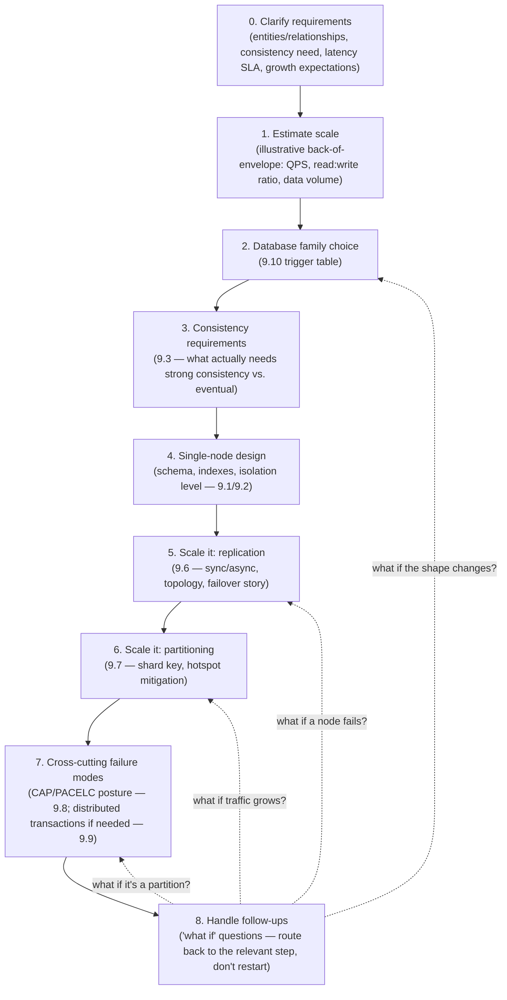
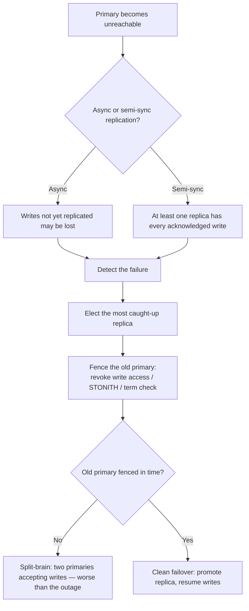
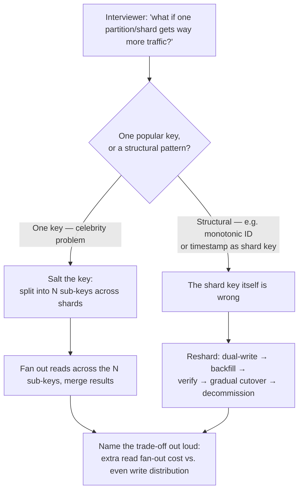

# 9.11 Interview Playbook — Databases

> This file is the "night before the interview" read. It doesn't introduce new concepts — it packages everything from 9.0–9.10 into a framework you can execute live, a set of model answers to the follow-ups that always come, and a rapid-fire recall drill.

> **Enhancement notes:** the original framework, model answers, traps table, and recall drill were left as-is — they already worked. Added: (1) explicit "clarify requirements" and "handle follow-ups" bookend steps to the step-by-step framework, plus a worked clarifying-question opener with illustrative scale numbers; (2) two new Mermaid flowcharts — a primary-failure/failover decision flow and a hot-partition diagnosis-to-mitigation flow — plus a new Q&A distinguishing a sync-path replica failure from a plain async follower failure; (3) a new "🆕 3. Proactively mention even if not asked" checklist (replication/failover, backups, monitoring, capacity, least-privilege, migrations) that was previously missing entirely; (4) a "quick-fire opening lines" table and an eight-word order mnemonic for recall under pressure; (5) a reusable "one-breath trade-off template" for narrating any trade-off concisely. Sections were renumbered (3→4, 4→5, 5→6) to make room; two rows were added to the existing recall drill to cover the new content.

---

## 1. The framework for "design the data layer" — narrate this structure out loud

When a system design interview reaches the data layer, walk through these steps **in order**, saying the step name before you answer it (interviewers explicitly reward visible structure):

**Why this order matters**: it mirrors how real systems actually get built — you don't reach for sharding before you've picked a database, and you don't pick a database before you know the access pattern. Jumping straight to "let's use Cassandra with consistent hashing" without establishing *why* is the most common way candidates lose points here, even when the final answer is technically fine. Step 8 is the one candidates forget to name explicitly: interviewer follow-ups aren't a new problem, they're a pointer back into the same 7 steps — say that out loud ("that's a replication question, so back to step 5...") instead of improvising from scratch.

#### 🆕 Mnemonic for the order

**Clarify → Count → Choose → Consistency → Chart it → Copy it → Cut it → Catch it** — eight steps, eight words starting with the same sound: clarify requirements, count (estimate) the scale, choose the database family, pin down consistency, chart the single-node schema, copy it (replication), cut it (partitioning), catch the follow-ups.

#### 🆕 The one-breath trade-off template

Interviewers reward candidates who state a trade-off in one sentence instead of a paragraph. Use this shape every time you make a call:

> "I'd pick **[X]** because **[the dominant access pattern / invariant / failure cost]**, which costs me **[Z]**, and I'd revisit that if **[a specific metric crosses a threshold]**."

Worked instantiation: *"I'd pick semi-synchronous replication because losing an acknowledged write on failover is unacceptable here, which costs me a few extra milliseconds of write latency, and I'd revisit that if p99 write latency became the bottleneck users actually feel."*

### Worked example — narrating this live for "design a URL shortener"

*"0. Before I size anything — do links ever expire or get deleted? Do we need custom aliases, or only auto-generated codes? And roughly what's the traffic — are we talking millions or billions of links?"* Say the interviewer answers: no expiry for now, no custom aliases, and (illustrative numbers, since real figures depend on the interviewer) 100M new links/day and 10B redirects/day.

*"1. Estimate scale: 100M writes/day is roughly 1,200 writes/sec average; 10B reads/day is roughly 115K reads/sec average — so this is read-heavy by roughly two orders of magnitude, and I'd expect peak traffic to run a few times higher than that average. 2. Database family: single-key lookups with no joins point at a key-value store, or I could just start with Postgres/MySQL since the scale doesn't yet demand more. 3. Consistency: a short code has to resolve to the same URL everywhere, so I want strong consistency on the write path — no BASE-style eventual consistency on link creation. 4. Single-node design: short_code as primary key with a unique index; Read Committed is plenty since there's no multi-row invariant to protect. 5. Replication: read replicas absorb the redirect traffic; the primary only handles writes. 6. Partitioning: once volume exceeds one primary, shard by a hash of the short code — random by construction, so no hot-key risk. 7. Failure modes: this leans CP — a stale or unavailable mapping is worse than a slightly slower one, so I'd pick semi-sync replication over full async."*

*"8. And if you now ask 'what if writes grow to 50K/sec' — that's no longer a single-primary problem regardless of storage engine choice, so that's my trigger to shard by the hash from step 6, not to look for a bigger box."*

Note the pattern: each sentence names the step number before answering it, and every decision cites the reason (access pattern, invariant, or failure cost) rather than just the choice. That's the narration habit worth rehearsing, independent of which system the interviewer actually assigns.

---

## 2. Model answers to the follow-ups that always come

#### 🆕 Quick-fire opening lines — read this table first, the paragraphs below are the backup

Under pressure you won't remember a paragraph, but you can remember one sentence. Lead with these, then expand into the full answer below if there's time.

| If interviewer says... | Lead with... |
|---|---|
| "What if this grows 100x?" | "Read replicas first if it's read-heavy; only shard once a single primary's write throughput or data size is the actual ceiling." |
| "What if a replica/node fails?" | "Depends on sync vs. async replication — let me state which one first, then walk through failover." |
| "Why not shard from day one?" | "Sharding isn't free — cross-shard joins and transactions get expensive. I'd name the specific metric that would trigger it instead." |
| "SQL or NoSQL?" | "Depends on whether the data's shape is stable and whether I need joins/ACID across entities — not a binary choice." |
| "How do you keep two services consistent?" | "First question: does it need to be atomic, or is eventual consistency acceptable?" |
| "What about a hot partition?" | "First I'd diagnose whether it's one popular key or a structural shard-key problem — the fix is different for each." |

### "Why not just use Postgres for everything?"
*"Postgres is actually a strong default — it handles more scale than people assume, and 'boring, well-understood technology' is a legitimate architectural virtue. I'd only move away from it once I have a specific, named bottleneck: either the dataset/write-throughput genuinely exceeds what vertical scaling + read replicas can handle, or the access pattern (huge fan-out writes, graph traversal, vector similarity) is structurally mismatched with a relational engine. I wouldn't preemptively adopt a more exotic system without that concrete trigger."*

### "How would you scale this database as traffic grows 100x?"
*"In order: add read replicas (9.6) if it's read-heavy — cheapest lever. If writes are the bottleneck, look at whether a faster storage engine helps (LSM-tree backed store, 9.5) before reaching for sharding. Only shard (9.7) once a single primary's write throughput or data size is the actual ceiling — and when I do, I'd pick the shard key based on the dominant query pattern, not an arbitrary hash, to avoid turning every query into scatter-gather."*

### "What happens if the primary database goes down?"
*"Depends on the replication setup. If it's async (9.6), any writes that hadn't replicated yet are at risk — semi-synchronous replication (waiting for at least one replica's ack) closes that gap without paying full synchronous-replication latency. Failover itself isn't just 'promote a replica' — you need to detect the failure, elect the most caught-up replica, and critically, **fence the old primary** so it can't keep accepting writes if it's actually still alive — otherwise you risk split-brain, which is worse than the original outage."*

#### 🆕 Primary-failure / failover decision flow

### "What if a replica goes down mid-write, not the primary?"
*"It depends on whether that replica was in the acknowledgment path. If I'm running semi-sync with a single designated standby and that standby is the one that dies, in-flight writes can stall waiting for an ack that'll never come — which is exactly why production setups name a pool of candidate synchronous standbys, or use a quorum (`W` acks out of `N` replicas), not just one. If the dead replica was a plain async follower not in the write path, the primary keeps accepting writes normally, and that replica just resumes replaying the log once it's back — the only cost is it re-joins with a burst of catch-up lag, which read traffic routed to it would see as staleness until it clears."*

### "How do you keep two services' databases consistent when a user action touches both?"
*"First question: do they need to be transactionally atomic, or is eventual consistency acceptable? If eventual is fine, an event (via Kafka or similar) with idempotent consumers is the simplest answer. If they genuinely need all-or-nothing semantics, I'd reach for a Saga (9.9) — a sequence of local transactions with compensating actions on failure — rather than a two-phase commit, because 2PC's coordinator-failure blocking problem makes it a poor fit across service boundaries. I'd explicitly call out that Sagas give up isolation — intermediate states are visible — and design the UI/API to tolerate that."*

### "Would you use SQL or NoSQL here?"
*"I'd resist treating it as a binary. The real questions are: does the data have a stable, structured shape, and do I need joins/ACID across entities? If yes to both, relational. If the shape varies per record or the dominant need is horizontal write scale with single-key access, NoSQL. And I'd flag that the line has blurred — Spanner/CockroachDB give SQL semantics at NoSQL-like scale, so 'SQL vs NoSQL' is really 'what trade-offs do I need,' not 'which camp am I in.'"*

### "How would you handle a hot partition?"
*"First diagnose why: is it a genuinely popular key (celebrity problem) or a structural issue like a monotonically increasing shard key concentrating all new writes on one shard? For the former, salting — splitting the hot key into N sub-keys spread across shards, and fanning out reads to reassemble — is the standard fix. For the latter, the shard key itself needs to change, which is a resharding migration (dual-write, backfill, verify, gradual cutover)."*

#### 🆕 Hot-partition follow-up flowchart

*Illustrative example*: a "trending posts" table sharded by `post_id` hash is fine until one post goes viral and its comment-count updates alone hit, say, 20K writes/sec against a single shard while every other shard sees a few hundred. That's the celebrity-key case — salting into, say, 16 sub-counters and summing them on read fixes it without touching the shard key for everyone else.

### "Explain ACID vs. BASE, and where CAP fits in."
*"ACID is the transactional contract a single database gives you: atomicity, consistency of declared constraints, isolation between concurrent transactions, durability against crashes. BASE is the NoSQL-era alternative philosophy — basically available, soft state, eventually consistent — trading strong guarantees for availability and horizontal scale. CAP explains *why* that trade-off exists in a distributed system: during a network partition, you can't have both full availability and linearizable consistency, so ACID-leaning systems tend to pick consistency (CP) and BASE-leaning systems tend to pick availability (AP). And I'd note ACID's 'C' and CAP's 'C' are different concepts that happen to share a letter — constraint validity vs. cross-replica recency."*

---

## 🆕 3. Proactively mention even if not asked

An interviewer doesn't always ask "what about backups?" — but a candidate who never brings up operability voluntarily reads as someone who's only designed systems on a whiteboard, never run one. Drop one line on each of these once the core design is down, even uninvited:

| Topic | One line to say | Why it's worth saying even if not asked |
|---|---|---|
| Replication & failover | "I'd run at least one replica with an automated failover path and fencing on the old primary." | Shows you don't treat a single node as acceptable in production |
| Backup & point-in-time recovery | "Nightly full backup plus continuous WAL/log archiving, so I can restore to any point, not just the last snapshot." | Recoverability is a different concern from replication (replicas don't protect against a bad `DELETE` or corrupted data — a backup does) |
| Monitoring & alerting | "I'd track replication lag, disk usage, slow-query rate, and connection-pool saturation, and alert before they become outages." | Distinguishes "I designed a system" from "I've operated one" |
| Capacity headroom | "I'd provision for a multiple of today's peak, not exactly today's peak, since traffic doesn't grow in neat steps." | Shows forward thinking beyond the numbers given in the prompt |
| Least-privilege access | "The application connects with a scoped role, not a superuser/root account." | Cheap to say, signals security hygiene, almost never volunteered |
| Schema migration strategy | "Migrations are additive and backward-compatible; no blocking schema change on a hot table without an online-migration tool." | Shows awareness that schema change is a first-class operational risk, not a free action |

None of these need a deep dive unless the interviewer bites — one sentence each is the point. If they do bite on one, that's your cue to go deep using the relevant model answer from Section 2.

---

## 4. Common traps and how to avoid them

| Trap | Why it's wrong | What to say instead |
|---|---|---|
| "CAP means pick 2 of 3, always" | Partitions aren't optional in a real distributed system — P is a given, not a choice | "CAP is about what happens *during* a partition — the live choice is C vs A in that moment" |
| "Repeatable Read prevents phantom reads" per the ANSI standard | True only loosely — Postgres's Repeatable Read (=Snapshot Isolation) does prevent phantoms, but the ANSI standard technically allows them at this level, and behavior varies by database | Name the specific database, and distinguish "Snapshot Isolation" from ANSI "Repeatable Read" |
| "NoSQL is always more scalable than SQL" | Instagram, Vitess-sharded YouTube/Slack MySQL are large-scale counter-examples | "Relational databases scale horizontally too with the right shard-key discipline — the real trade-off is joins/transactions vs. write throughput, not an inherent SQL scaling ceiling" |
| Reaching for 2PC across service boundaries in microservices | 2PC's coordinator-blocking failure mode is a poor fit for independently-owned, independently-deployed services | Sagas with compensating actions |
| Assuming "eventual consistency" alone is a sufficient design | Pure eventual consistency (no session guarantees) produces visibly broken UX (users not seeing their own writes) | Layer in read-your-writes / monotonic reads (session guarantees) as the practical minimum bar |
| Sharding preemptively "because it's more scalable" | Sharding adds cross-shard join/transaction cost and operational complexity that isn't free | Start centralized; name the specific metric/threshold that would trigger sharding |
| Confusing write skew with lost update | They look similar but have different root causes and different fixes | Lost update = same row, concurrent read-modify-write, one write clobbers the other. Write skew = different rows, an invariant *spanning* them breaks. Only Serializable (or a schema-level constraint) fixes write skew. |
| Defaulting to AP because "availability is what scales" | Many real systems (payments, inventory, booking, auth) need CP — a stale read there causes real damage (double-booking, overselling) | Ask what a stale read costs before picking a side; let that cost, not a reflex, decide CP vs AP |
| Describing resharding as "just move the data to the new shards" | Skips the exact step that separates a senior answer from a junior one | Name the full sequence: dual-write → backfill → **verify** (checksums/row counts) → gradual read cutover → decommission |

---

## 5. Rapid recall drill — cover the right column and self-test

| Question | Answer |
|---|---|
| 4 ACID letters? | Atomicity, Consistency, Isolation, Durability |
| 6 concurrency anomalies? | Dirty write, dirty read, non-repeatable read, phantom read, lost update, write skew |
| Which anomaly does Snapshot Isolation NOT prevent? | Write skew |
| Formula for quorum consistency? | `W + R > N` |
| Order the consistency spectrum, strongest to weakest? | Linearizable → Sequential → Causal → Session guarantees (read-your-writes/monotonic reads) → Eventual |
| What do CRDTs guarantee? | Convergence without coordination — replicas merge concurrent updates to the same final state (e.g., G-Counter, LWW-register) |
| 3 phases of ARIES recovery? | Analysis → Redo (unconditional) → Undo (uncommitted only) |
| Why WAL before data pages? | Sequential writes are cheap; enables crash recovery; commit can ack after cheap sequential fsync, defer expensive random writes |
| What closes the durability gap on primary failure without full sync replication cost? | Semi-synchronous replication (wait for one replica's ack) |
| What prevents split-brain during failover? | Fencing the old primary (STONITH, revoke write access, or term/lease-based rejection as in Raft) |
| 3 Dynamo-style anti-entropy mechanisms? | Hinted handoff, read repair, Merkle-tree anti-entropy |
| B-Tree vs LSM-Tree: which favors writes? | LSM-Tree (sequential appends, background compaction) |
| What mitigates LSM read amplification? | Bloom filters (skip SSTables that don't contain the key) |
| CAP: what's actually optional? | Nothing — P isn't optional in a real distributed system; the live choice is C vs A during a partition |
| PACELC's addition beyond CAP? | Else (no partition): Latency vs Consistency — a trade-off that exists even with a healthy network |
| 2PC's fatal flaw? | Coordinator crash after votes but before decision blocks all participants indefinitely |
| What do Sagas give up that ACID transactions provide? | Isolation — intermediate states are visible to the outside world |
| What prevents split-brain in Raft specifically? | Term numbers — any node discovering a higher term steps down |
| Spanner's trick for global consistency without full coordination? | TrueTime bounded-uncertainty intervals + commit-wait |
| Fix for a hot partition from a celebrity key? | Salting — split into N sub-keys spread across shards |
| Full resharding sequence on a live system? | Dual-write → backfill → verify (checksums/row counts) → gradual read cutover → decommission old layout |
| First question to ask before a cross-shard transaction? | Can the shard key be redesigned so these entities live on the same shard? |
| ACID's "C" vs CAP's "C"? | Constraint validity (single node) vs. linearizability across replicas (multi-node) — different concepts, same letter |
| When to reach for a vector database? | Semantic/similarity search over embeddings (RAG pipelines) — not a fit for B-Tree/inverted-index structures |
| Sync-path replica dies mid-write vs. plain async follower dies? | Sync-path replica can stall in-flight writes (unless quorum/candidate pool); async follower dying doesn't block writes, it just resumes with catch-up lag |
| 3 things to volunteer even if not asked? | Replication/failover story, backup & point-in-time recovery, monitoring/alerting (capacity headroom, least-privilege access, migration strategy also count) |

---

## 6. The series map — read in this order if starting fresh

1. [9.12-Databases-FAANG-Guide.md](9.12-Databases-FAANG-Guide.md) — foundations: SQL vs NoSQL, replication basics, partitioning basics, centralized-vs-distributed trade-offs.
2. [9.1 ACID and Transactions - Deep Dive](9.1%20ACID%20and%20Transactions%20-%20Deep%20Dive.md)
3. [9.2 Isolation Levels and Concurrency Anomalies](9.2%20Isolation%20Levels%20and%20Concurrency%20Anomalies.md)
4. [9.3 Consistency Models](9.3%20Consistency%20Models.md)
5. [9.4 Write-Ahead Logging and Crash Recovery](9.4%20Write-Ahead%20Logging%20and%20Crash%20Recovery.md)
6. [9.5 Storage Engines - B-Tree vs LSM-Tree](9.5%20Storage%20Engines%20-%20B-Tree%20vs%20LSM-Tree.md)
7. [9.6 Replication - Deep Dive](9.6%20Replication%20-%20Deep%20Dive.md)
8. [9.7 Partitioning and Sharding - Deep Dive](9.7%20Partitioning%20and%20Sharding%20-%20Deep%20Dive.md)
9. [9.8 CAP Theorem and PACELC](9.8%20CAP%20Theorem%20and%20PACELC.md)
10. [9.9 Distributed Transactions and Consensus](9.9%20Distributed%20Transactions%20and%20Consensus.md)
11. [9.10 Database Selection Guide](9.10%20Database%20Selection%20Guide%20-%20Types%2C%20Real%20Systems%2C%20and%20When%20to%20Use%20What.md)
12. This file — playbook and rapid recall, the morning-of read.
