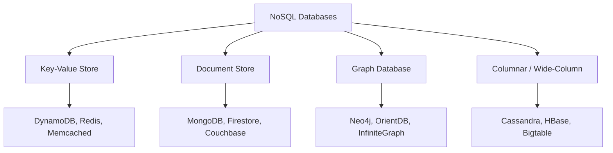
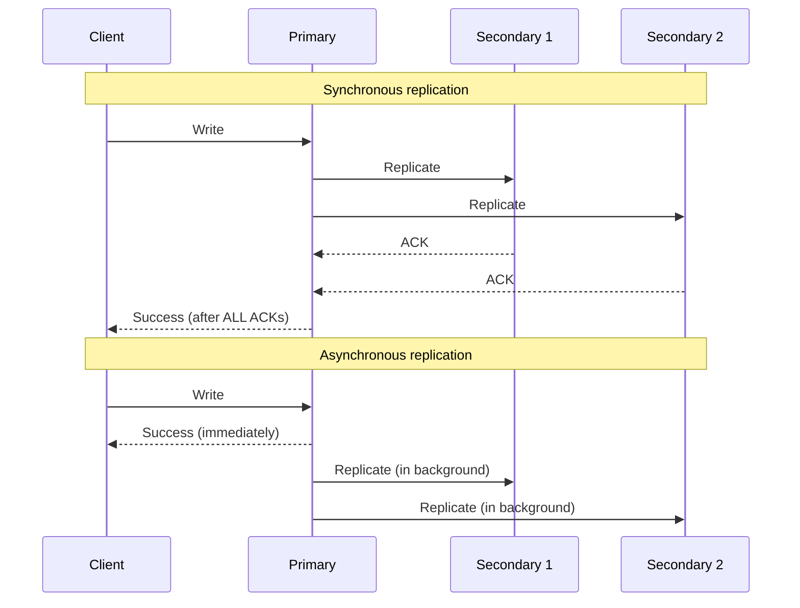
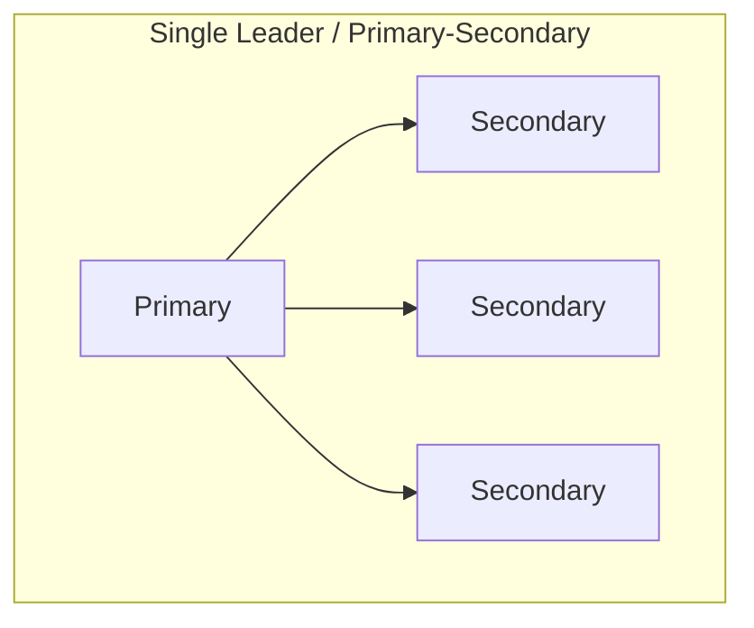
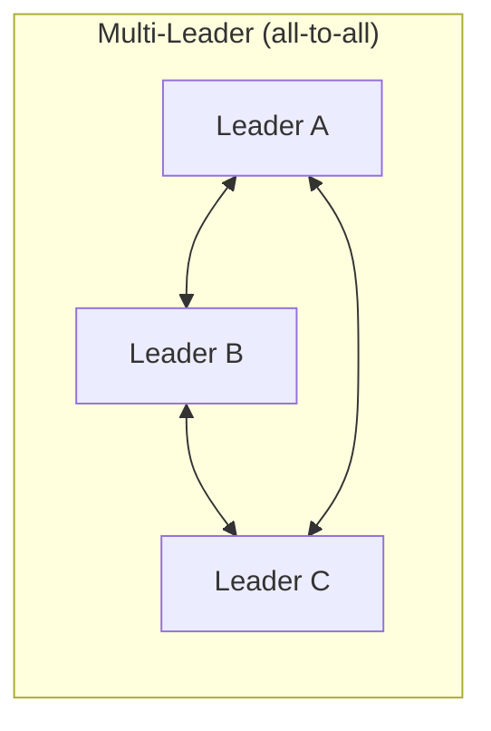
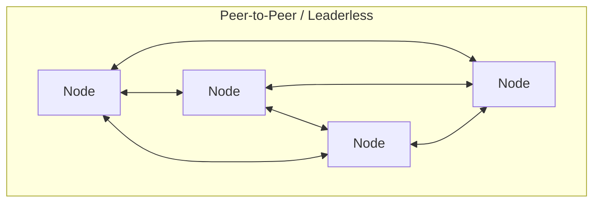
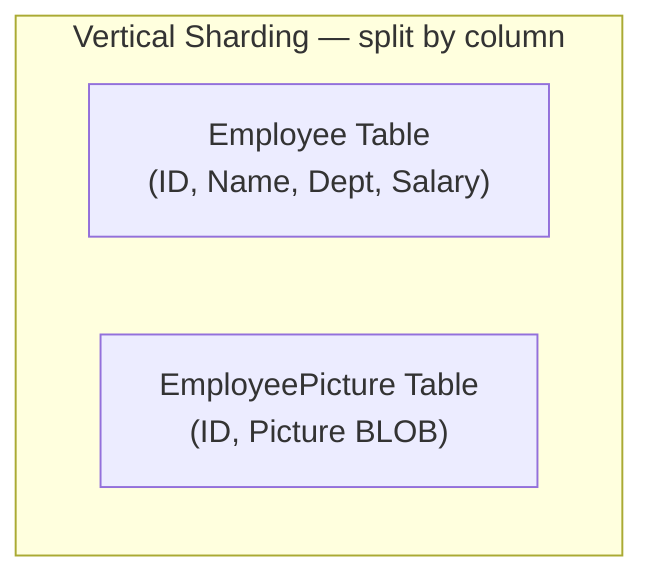
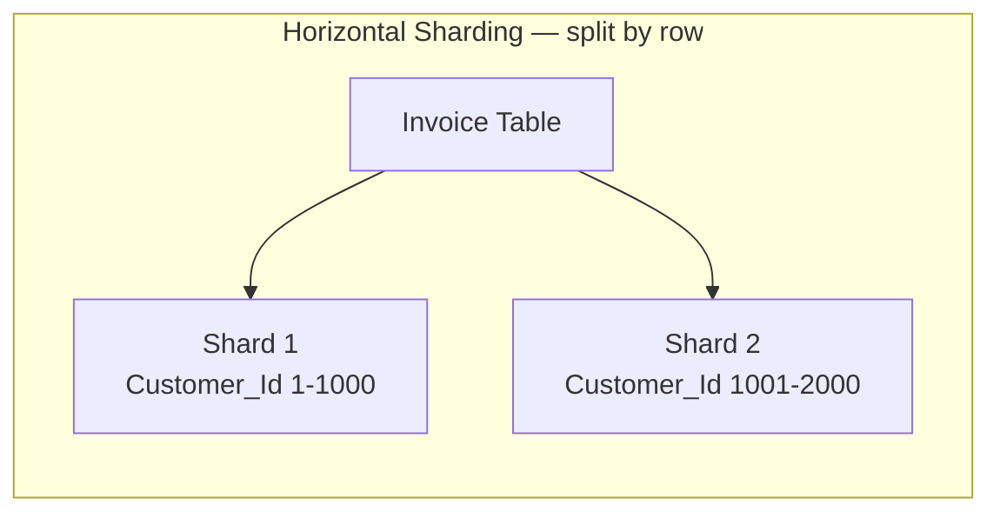
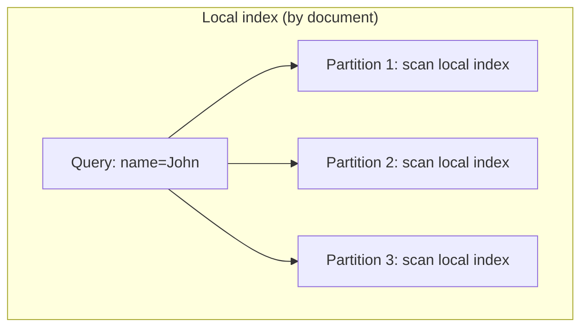
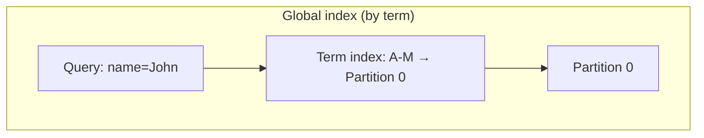

# Databases — FAANG System Design Interview Guide

> Covers: types of databases (SQL/NoSQL), replication, partitioning/sharding, and the trade-offs interviewers expect you to defend. Read this once and you should be able to design the data layer for almost any FAANG system design question — Twitter, YouTube, Uber, WhatsApp, DynamoDB clone, whatever comes up.

---

## 1. What a database is and why it exists

**Mental model**: a database is a shared, concurrent, crash-safe filing cabinet with a query language. Before databases, engineers stored data in flat files. Flat files break down along four axes the moment you have more than one user:

| File storage limitation | What a database fixes |
|---|---|
| No concurrent access control | Transactions + locking/MVCC |
| No fine-grained permissions | GRANT/REVOKE, row/column-level security |
| Doesn't scale to thousands of entries | Indexes, partitioning |
| Slow to search | Indexes, query planners |

**Why this matters in an interview**: when asked "why not just use a file / a single Postgres instance," this is your one-liner: *databases exist to give you concurrency control, access control, scalability, and fast retrieval — none of which a flat file gives you for free.*

### Core reasons a database is "essential" (interviewer-recognizable phrasing)
- **Manage large data volumes** a single process/file can't hold.
- **Data consistency** — constraints guarantee you get back correct, non-corrupted data.
- **Easy updates** via DML (`INSERT`/`UPDATE`/`DELETE`) instead of rewriting files.
- **Security** — authn/authz gates who can touch what.
- **Data integrity** — constraints (PK, FK, unique, check) prevent invalid states.
- **Availability** — achieved via **replication** (§3).
- **Scalability** — achieved via **partitioning/sharding** (§4).

Note the last two: availability and scalability are not properties of "a database" in the abstract — they're properties you *engineer in* via replication and partitioning. This is the thread that ties this whole chapter together, and it's exactly how you should structure your answer when an interviewer says "how would you scale this database?"

---

## 2. SQL vs. NoSQL — the first fork in every design

### Mental model
- **Relational (SQL)** = a phone book: fixed schema (name, number, address), every entry looks the same.
- **Non-relational (NoSQL)** = a filing cabinet / junk drawer: each folder can hold something different, structure emerges per-item, not enforced up front.

### Relational databases

Data lives in **tables** (relations) made of **tuples** (rows) and **attributes** (columns). Each tuple has a unique **primary key**; tuples reference each other via **foreign keys**. Manipulated with **SQL**.

**ACID** — the contract a relational DB gives you:

| Property | Guarantee | Failure mode it prevents |
|---|---|---|
| **A**tomicity | All statements in a transaction succeed, or none do (rollback on failure) | Partial writes |
| **C**onsistency | DB moves from one valid state to another; constraints always hold | Corrupt/contradictory data |
| **I**solation | Concurrent transactions don't see each other's intermediate state | Dirty reads, lost updates, write skew |
| **D**urability | Committed data survives crashes | Data loss on power/crash failure |

> **Interview insight**: ACID is "a big hammer" — generically safe but sometimes overkill. If your application only needs to guard against a couple of specific anomalies (e.g., only worried about lost updates, not phantom reads), you can trade the generality of ACID for a custom, faster mechanism. Naming this trade-off explicitly signals seniority — it shows you know ACID has a cost, not just a benefit.

**Anomalies ACID hides from you** (know these by name — interviewers probe here): dirty reads, dirty writes, read skew, lost updates, write skew, phantom reads.

**Why relational databases win by default**: simplicity, robustness, flexibility, performance, scalability for structured data, and broad compatibility/tooling.

Deeper reasons:
- **Flexibility** — DDL lets you alter schema (add/rename columns/tables) even while the server is live and other queries run.
- **Reduced redundancy via normalization** — each fact lives in one place; related tables link via FKs. Removes "inconsistent dependency" (update one place, not five).
- **Concurrency** — handled via transactional access; prevents anomalies like double-booking a hotel room.
- **Integration** — multiple applications can share one database as an integration point, relying on the DB's own concurrency control instead of each app inventing coordination.
- **Backup/disaster recovery** — consistent snapshots make export/import and continuous mirroring straightforward.

**The drawback: impedance mismatch.** Relational tables only hold scalar values in cells — no nested structures, no lists. In-memory objects are nested/hierarchical. Every read/write pays a translation tax between "rows and joins" and "objects in memory" (this is literally what ORMs exist to paper over — mention this when discussing ORM overhead).

Popular RDBMS to namedrop: MySQL, PostgreSQL, Oracle, SQL Server, IBM DB2, SQLite.

### NoSQL databases

Built for **large volumes of semi-/unstructured data**, **low latency**, and **flexible schemas** — achieved by *relaxing* some of the consistency guarantees SQL gives you for free.

Characteristics:
- **Simple design** — no impedance mismatch; e.g. one document holds everything about an employee instead of normalizing across many joined tables.
- **Horizontal scaling** — designed from day one to run across a large cluster; nodes can fail and be replaced transparently.
- **Availability** — replication is a first-class citizen, not an add-on.
- **Schema flexibility** — one JSON document can have fewer fields than another; no schema is enforced at write time.
- **Cost** — often open source, runs on commodity hardware vs. expensive proprietary RDBMS licenses/hardware.

### The four NoSQL families — know when to reach for each



| Type | Data model | Best for | Real examples |
|---|---|---|---|
| **Key-value** | hash table, key → opaque value | Session storage, caching, shopping carts | DynamoDB, Redis, Memcached |
| **Document** | JSON/BSON/XML tree per record | Catalogs, CMS, product attributes that vary per item | MongoDB, Firestore |
| **Graph** | nodes + edges + properties | Social graphs, fraud detection, recommendations, ML feature graphs | Neo4j, OrientDB |
| **Columnar / wide-column** | column-oriented storage | Analytics, time-series, aggregation-heavy read patterns | Cassandra, HBase, Bigtable, SimpleDB |

**Key-value** — use case is *session-oriented apps*: assign a session a unique key, store a blob of profile/recommendation/promo data as the value. DynamoDB example: composite primary key = `(Product ID, Type)`.

**Document** — use case is *unstructured catalog / CMS data*. Classic example: an e-commerce product with thousands of variable attributes — forcing that into a normalized relational schema tanks read performance; one JSON document per product solves it. Also good for blogs/video platforms where "one entity = one document."

**Graph** — use case is *relationship-first data*: social networks, fraud/AML detection, recommendation engines, regulatory/compliance graphs. Mental trick: if the *interesting information is the edges*, not the nodes, reach for a graph DB.

**Columnar** — use case is *aggregation over few columns across many rows*: "sum all transactions this quarter" only needs the `amount` column, not the whole row — columnar storage means the engine reads only that column off disk, dramatically cutting I/O. This is the mental model for why time-series and analytics workloads (Cassandra, HBase) love columnar layouts.

### NoSQL drawbacks (name these to sound balanced, not NoSQL-fanboy)
- **Lack of standardization** — no shared "relational algebra" equivalent; porting between two NoSQL products (say, MongoDB → Cassandra) is a rewrite, not a driver swap.
- **Weaker consistency** — no cross-record referential integrity like FKs; typically **eventual consistency** instead of immediate.

### The decision table interviewers want you to produce unprompted

| Choose **Relational** if... | Choose **NoSQL** if... |
|---|---|
| Data is structured, schema is stable | Data is unstructured / schema varies per record |
| You need ACID transactions | You can tolerate eventual consistency |
| You need joins / relational integrity | You mostly access by single key or document |
| Dataset fits comfortably on one node (or a few) | Dataset is large and must scale horizontally |
| Strong consistency + complex queries matter more than raw scale | Massive scale / low-latency single-key ops matter more than joins |

> Real-world nuance to drop in an interview: the SQL/NoSQL line has blurred. **Google Cloud Spanner** offers SQL semantics with automatic horizontal sharding and global-scale, high-consistency snapshots ("NewSQL"). Mentioning Spanner (or CockroachDB / YugabyteDB) shows you know the field has moved past "pick one camp."

### How to identify this topic in an interview
- "We have structured/unstructured data..." → SQL vs NoSQL framing.
- "Users have highly variable profile fields" → document store.
- "We need to look up a session/cart by ID in O(1)" → key-value.
- "We need to recommend friends-of-friends" or "detect fraud rings" → graph.
- "We need to sum/aggregate over a time range for millions of rows" → columnar.
- "Do we need joins?" is often the single most decision-determining question — ask it explicitly.

### Cheat sheet
- Databases exist to give you **concurrency, access control, scale, and fast retrieval** over raw files.
- ACID = Atomicity, Consistency, Isolation, Durability — know the 6 anomalies it hides: dirty reads, dirty writes, read skew, lost updates, write skew, phantom reads.
- Relational strengths: flexibility (DDL), normalization (reduced redundancy), concurrency, integration, backup/recovery.
- Relational weakness: impedance mismatch (tabular vs. in-memory object shape).
- NoSQL exists to relax consistency in exchange for scale, schema flexibility, and simpler code.
- 4 NoSQL families map to 4 access patterns: key-value (by key), document (by entity, variable shape), graph (by relationship), columnar (by column, for aggregation).
- Spanner/CockroachDB show SQL and horizontal scale aren't mutually exclusive anymore — don't present it as a strict binary.

---

## 3. Data Replication

### Mental model
Replication = keeping multiple copies of the same data, ideally geographically distributed, so that no single disk/node/network/power failure takes your data down and so reads can be spread across copies.

You need replication because a single node cannot simultaneously give you:
- **Availability** under faults (disk, node, network, power failures)
- **Scalability** with growing reads/writes
- **Performance** (low latency, high throughput)

Replication is easy if data never changes. The entire chapter is really about: **how do you keep changing data consistent across copies?**

Open questions replication forces you to answer (use these as your "clarifying questions" checklist in an interview):
1. How do we keep copies consistent?
2. How do we handle a failed replica?
3. Sync or async replication?
4. How do we handle replication lag (async)?
5. How do we handle concurrent writes hitting different replicas?
6. What consistency model do we expose to callers?

### Synchronous vs. asynchronous replication



| | Synchronous | Asynchronous |
|---|---|---|
| Primary waits for | ACK from all secondaries | Nothing — replies to client immediately |
| Consistency | Strong — secondaries always current | Weak — secondaries can lag |
| Availability / latency | One slow/dead secondary stalls every write | Primary keeps working even if all secondaries are down |
| Failure mode | High write latency if any replica is unhealthy | **Data loss** on primary crash before replication completes |

This is a direct, concrete instance of the **CAP theorem trade-off** — say so explicitly in an interview: sync replication favors consistency at the cost of availability/latency; async favors availability/latency at the cost of consistency (risk of lost writes on primary failure).

### The three replication topologies







#### 1. Single-leader (primary-secondary / primary-replica)

One primary handles **all writes**, then ships them to secondaries. Secondaries can serve reads.

- **Good for**: read-heavy workloads — add followers, spread reads across them.
- **Bad for**: write-heavy workloads — primary is the write bottleneck, and shipping writes to *many* followers can itself bottleneck the primary.
- **Read resilience**: if the primary dies, secondaries can still serve reads (just possibly stale ones).
- **Consistency risk**: with async replication, a dead primary can lose writes that never made it to any secondary. Readers hitting different secondaries can see different (stale) data.

**Point to ponder (asked verbatim in the source — expect it in interviews): what happens when the primary fails?** Answer: you need **failover** — promote a secondary to primary. This requires (a) detecting the failure (timeout/heartbeat), (b) choosing the most up-to-date replica, (c) reconfiguring clients/DNS/routing to point at the new primary, and (d) handling **split-brain** if the old primary comes back thinking it's still primary. This is the single most common follow-up question on this topic — always mention split-brain.

**Three primary→secondary replication methods** (know all three by name, they come up as trivia):

| Method | How it works | Used by | Weakness |
|---|---|---|---|
| **Statement-based** | Ship the literal SQL statements (INSERT/UPDATE/DELETE) to replicas, re-execute them | MySQL (pre-5.1) | Non-deterministic functions (`NOW()`) diverge; write-order dependencies break if statements arrive out of order |
| **Write-ahead log (WAL) shipping** | Ship the low-level WAL (the log the storage engine writes before every mutation) | PostgreSQL, Oracle | Tightly coupled to storage engine internals → primary/replica must run near-identical versions, complicating rolling upgrades |
| **Logical (row-based) log replication** | Ship a decoded, storage-engine-independent description of the row change | MySQL binlog (row format) | None of the above weaknesses — this is the modern default |

#### 2. Multi-leader replication

Multiple primaries each accept writes and propagate them to every other primary/secondary.

- **Wins**: better write throughput/scalability than single-leader; tolerates offline operation (classic example: a calendar app where your laptop is a "leader" while offline, syncing once reconnected).
- **Cost**: **write-write conflicts** — two leaders can accept conflicting writes to the same record before either sees the other's write.

**Conflict resolution strategies:**
- **Conflict avoidance** — route all writes for a given record through the *same* leader (e.g., route by user's home region). Breaks down when a user travels/moves and starts writing through a different leader.
- **Last-write-wins (LWW)** — attach a timestamp, keep the newest. Danger: clock skew across nodes can silently discard a legitimately later write. Always flag this as a data-loss risk, not a free lunch.
- **Custom conflict-resolution logic** — app-specific merge function invoked on read and/or write when a conflict is detected (e.g., CRDT-style merges, "union the two shopping carts").

**Topologies**: circular, star, all-to-all. Circular/star share a weakness — one dead node can partition the whole replication graph. **All-to-all is the most common in practice** because it has no single node whose failure breaks propagation.

#### 3. Peer-to-peer / leaderless replication

No primary at all — every node accepts reads and writes. Popularized by **Amazon DynamoDB** (the original Dynamo paper).

- **Wins**: no single point of failure, no write bottleneck — solves single-leader's core weakness (write scalability).
- **Cost**: concurrent writes to different nodes → same write-write inconsistency problem as multi-leader, solved differently: **quorums**.

### Quorums — the formula every interviewer expects cold

Given **N** total replicas:
- **W** = number of replicas that must acknowledge a write for it to succeed.
- **R** = number of replicas you read from.
- **Guarantee**: if **W + R > N**, every read is guaranteed to overlap with the most recent successful write on at least one node → you always read fresh-or-newer data.

```
W + R > N   →  strong-ish consistency (read-your-writes achievable)
W + R <= N  →  possible stale reads, but higher availability/lower latency
```

Classic example: N=3. If W=2 and R=2, then 2+2=4 > 3 — any read set of 2 nodes must intersect any write set of 2 nodes out of 3, so at least one node in your read quorum has the latest write.

Tunable per-operation in Dynamo-style stores (DynamoDB, Cassandra, Riak) — this tunability *is* the pitch: you can dial towards consistency (`W=N`) or availability/latency (`W=1`) per query.

### Interview cheat sheet — Replication
- Replication buys you availability, scalability, and performance — but forces you to answer 6 hard questions about consistency, failure, and conflicts.
- Sync = strong consistency, high latency, availability risk. Async = low latency, availability, but risk of lost writes on primary crash. This is CAP in miniature.
- Single-leader: great for read scaling, bad for write scaling, needs a failover story (mention split-brain).
- 3 replication methods: statement-based (fragile), WAL shipping (version-coupled), logical/row-based (robust, modern default).
- Multi-leader: better writes, but write-write conflicts — resolve via avoidance, LWW (risky w/ clock skew), or custom merge logic. All-to-all topology avoids single-node-failure partitioning.
- Leaderless/peer-to-peer (Dynamo): no bottleneck node, resolves conflicts via **quorums**: `W + R > N` for consistency guarantees.
- Always be ready to say "what happens when the primary fails" unprompted — it's the most common follow-up.

---

## 4. Data Partitioning (Sharding)

### Mental model
Replication answered "how do I survive failure and scale reads." Partitioning answers the other half: **how do I scale when the data itself is too big or too hot for one node.** They're usually deployed together: shard the data, then replicate each shard.

Partitioning splits one large dataset into smaller chunks ("shards") stored on different nodes. The goal is **balanced** partitions — if partitioning is uneven, a few partitions become **hotspots**, and load concentrates on the nodes holding them, which negates the entire point of partitioning.

### Vertical vs. horizontal sharding





| | Vertical sharding | Horizontal sharding |
|---|---|---|
| Splits by | Column (some columns in one table/DB, rest in another) | Row (subsets of rows across DBs) |
| Typical trigger | Wide-text/BLOB columns dragging down scan speed on the "hot" columns | A single table too large/hot for one node |
| Automation | Manual — humans decide the column split, must respect join locality | Automatable, works well under dynamic/automatic rebalancing |
| Example | Split `Employee` into `Employee` (ID, Name, Dept) + `EmployeePicture` (ID, Picture) | Split `Invoice` by `Customer_Id` ranges across shards |

Multi-table horizontal sharding detail worth knowing: when multiple tables are related by FK, they're sharded using the **same partition key** so related rows land on the same shard (avoids cross-shard joins). Implementation details interviewers like hearing:
- A **customer mapping table** replicated on every shard tracks which partition keys live where.
- The partition key column is **denormalized/replicated** into every related table as a "data isolation point" — trades storage for shard-lookup efficiency.
- **Primary keys must be globally unique across shards** (not just per-shard) to avoid collisions during migration/merges.
- A `creation_date`-style column (assuming synchronized clocks) is used as a **data consistency point** when merging shard data into a global view (e.g., for OLAP).

### Horizontal sharding strategies

#### Key-range based sharding
Each partition owns a contiguous range of keys (e.g., `Customer_Id 1–1000` → shard 1).

| Pros | Cons |
|---|---|
| Range queries are trivial and efficient (data is sorted within a shard) | Range queries on *non-partition-key* columns aren't supported |
| | Poor key choice → uneven distribution → hotspots |

#### Hash-based sharding
`hash(key) mod N` decides the shard.

| Pros | Cons |
|---|---|
| Uniform distribution across nodes | No range queries at all — hashing scatters sequential keys everywhere |

**Sizing math you should be able to do live:**
```
Database size = 10 TB
Max data per node (empirically determined) = 50 GB
Number of shards = 10 TB / 50 GB = 200 shards
```
This "how many shards" back-of-envelope pattern is exactly the kind of arithmetic interviewers want to see you do out loud, unprompted.

**The `hash mod N` rebalancing trap** — this is a classic gotcha:
```
hash(key) = 1235
5 nodes:  1235 mod 5 = 0   → node 0
Add a 6th node: 1235 mod 6 = 5 → key must move to node 5
```
Every single node's assignment shifts when N changes → massive, expensive data movement on every scale-out event. **This is exactly the problem consistent hashing exists to solve.**

#### Consistent hashing

Nodes and keys are both hashed onto positions on an abstract **ring**. A key belongs to the next node clockwise from its position. Adding/removing a node only reshuffles the keys between it and its immediate neighbor — not the whole keyspace.

| Advantages | Disadvantages |
|---|---|
| Horizontally scalable without a full reshuffle | Naive random placement can still produce non-uniform load (mitigated with **virtual nodes** — assign each physical node many points on the ring) |
| Better throughput/latency under scale-out | |

> Real-world namedrop: Cassandra, DynamoDB, and Akamai's CDN routing all use consistent hashing (with virtual nodes) — this is one of the highest-leverage concepts to demonstrate mastery of, since it shows up in almost every "design a distributed X" question.

### Rebalancing strategies (why load goes uneven, and the 3 fixes)

Causes: unequal data distribution, one hot partition, or organic traffic growth requiring more nodes.

| Strategy | How it works | Downside | Used by |
|---|---|---|---|
| **Fixed number of partitions** | Create far more partitions than nodes up front; new nodes steal partitions from existing ones | Must pick partition count correctly upfront — too many small partitions = overhead, too few large ones = expensive rebalance/recovery | Elasticsearch, Riak |
| **Dynamic partitioning** | Partition auto-splits into two when it crosses a size threshold | Hard to rebalance while serving live reads/writes | HBase, MongoDB |
| **Partition proportional to nodes** | Fixed partitions *per node*; new node randomly splits existing partitions and takes half | Can produce unfair splits | Cassandra, Ketama |

### Partitioning secondary indexes

The hard part of sharding isn't primary-key lookups — it's **secondary indexes** (querying by a non-key attribute).




| Approach | Reads | Writes | Trade-off |
|---|---|---|---|
| **By document (local index)** | Scatter-gather — query **every** partition, merge results | Cheap — touches only the partition owning the document | Read latency bound by the *slowest* partition responding |
| **By term (global index)** | Fast — go straight to the partition owning that term range | Expensive — a single write can touch multiple partitions (the doc's own shard + the global index shard) | Classic read/write trade-off — pick based on your read:write ratio |

### Request routing — how does a client find the right node?
Because rebalancing constantly changes which node owns which partition, you need **service discovery**:
1. **Any node can act as a router** — if a node gets a request for data it doesn't own, it forwards it internally.
2. **A dedicated routing tier** sits in front and directs every request to the correct node.
3. **Coordination service (e.g., ZooKeeper)** — tracks the authoritative partition→node mapping; nodes/routers subscribe to it and get notified on every rebalance. Used by HBase, Kafka, SolrCloud.

### How to identify this topic in an interview
- "The dataset won't fit on one machine" / "one table has billions of rows" → horizontal sharding.
- "This table has huge BLOB/text columns dragging down scans" → vertical sharding.
- "How do you add a node without moving all the data" → consistent hashing (say this immediately, it's the expected answer).
- "How do you query by a field that isn't the shard key" → global vs. local secondary index trade-off.
- "How does the client know which shard to hit" → routing tier / ZooKeeper-style coordination.

### Interview cheat sheet — Partitioning
- Partitioning exists because a single node can't hold/serve all the data — replication and partitioning are usually combined, not either/or.
- Vertical = split columns (manual, join-aware). Horizontal = split rows (automatable).
- Key-range sharding → range queries work, but risks hotspots. Hash sharding → uniform load, but no range queries.
- `hash mod N` breaks on every resize — **consistent hashing** (with virtual nodes) is the fix everyone expects you to name.
- Rebalancing approaches: fixed partition count (Elasticsearch/Riak), dynamic splitting (HBase/MongoDB), proportional-to-nodes (Cassandra).
- Secondary indexes: local/by-document (read-scatter, write-cheap) vs. global/by-term (read-fast, write-expensive) — always state which read:write ratio favors which.
- Routing needs a mechanism: self-forwarding, routing tier, or a coordination service like ZooKeeper.

---

## 5. Trade-offs: Centralized vs. Distributed Databases

This is the "cost-benefit" lesson — the section interviewers use to check that you don't reflexively reach for sharding just because it sounds impressive.

### Centralized (single-node) database

| Advantages | Disadvantages |
|---|---|
| Easy maintenance — backups, updates are simple | Single point of failure |
| Stronger consistency, full ACID transactions | Throughput/latency ceiling as QPS approaches single-node limits |
| Simplest programming model | |
| More efficient when data volume genuinely fits on one node | |

### Distributed database

| Advantages | Disadvantages |
|---|---|
| Fast access — read from the nearest/most-used shard | Cross-site queries take longer than expected |
| Data with different transparency/locality needs can live in different places | **Joins become expensive** — reconstructing a relation across shards means fetching and stitching data over the network |
| Large transactions decompose into parallel sub-queries across shards | Harder to maintain consistency across sites — needs explicit mechanisms |
| | Backups/updates take longer to synchronize |

**The single biggest craft point interviewers are listening for**: *don't shard by default.* Sharding is a cost — operational complexity, cross-shard joins, eventual consistency — that you pay only once a single node's throughput/latency genuinely can't keep up. Always frame it as: "I'd start centralized, and shard when [specific metric] crosses [specific threshold]," not "obviously we shard from day one."

### Query optimization in a distributed DB — the worked example to reason through live

This is a concrete distributed-query-planning example worth internalizing the *shape* of (exact numbers rarely matter, the reasoning pattern does):

**Setup**: query joins `Store` (10K rows, site A), `Product` (100K rows, site B), `Sales` (1M rows, site A), filtered to `Region='East' AND Brand='Wolf'`. Estimated cardinalities: 10 rows match `Brand='Wolf'`, 100,000 rows match `Region='East'`.

Formula: **Total time = access_delay + (data_volume / data_rate)**

| Strategy | Move | Time |
|---|---|---|
| 1. Move `Product` to site A, join there | 100,000 rows × 200 bits | 0.1 + 0.5 = **0.5s** |
| 2. Move `Store`+`Sales` to site B, join there | 1,010,000 rows × 200 bits | 0.2 + 4.24 = **4.24s** |
| 3. **Filter `Product` by `Brand='Wolf'` at site B first (project down to 10 rows), then move just that to site A** | 10 rows × 200 bits | 0.1 + ~0 = **~0.1s** |

**The lesson, stated plainly**: *filter before you move data across the network.* Push predicates down to wherever the smallest resulting set lives, and only ship the reduced result — don't ship whole tables and filter after. This single idea (predicate pushdown / project-then-ship) generalizes to nearly every distributed-query-planning question you'll get, including "how would Spark/Presto/BigQuery execute this join across nodes."

### How to identify this topic in an interview
- "Should we shard this database?" → don't say yes reflexively; walk through the centralized-vs-distributed trade-off table and name a concrete trigger metric (QPS, data size, latency SLO breach).
- "This query joins tables across shards, how do you make it fast?" → predicate pushdown / filter-then-ship, exactly like the worked example.
- Interviewer probing operational cost of distribution → cross-shard joins, backup/sync overhead, cross-site consistency mechanisms (this is where you can bring back quorums/replication from §3).

### Interview cheat sheet — Trade-offs
- Centralized wins: simplicity, stronger consistency, easier ops, cheaper when data actually fits one node.
- Distributed wins: parallelism, locality, fault isolation — but costs you cross-shard joins, consistency complexity, and slower synchronized backups.
- Default posture: start centralized, shard when a specific bottleneck is hit — say the threshold out loud.
- Query optimization across shards: minimize data moved over the network by filtering (projecting) at the source before shipping — the exact lesson of the Store/Product/Sales example.

---

## Master Cheat Sheet

### One-liners you should have ready
- **Why databases**: concurrency control + access control + scale + fast retrieval, vs. flat files.
- **ACID**: Atomicity, Consistency, Isolation, Durability — hides dirty reads/writes, read skew, lost updates, write skew, phantom reads.
- **SQL vs NoSQL**: schema-rigid + joins + strong consistency vs. schema-flexible + horizontal scale + eventual consistency. The line is blurring (Spanner, CockroachDB).
- **4 NoSQL shapes → 4 access patterns**: key-value (session/cache), document (variable-shape entities), graph (relationship-first), columnar (column-aggregation/analytics).
- **Sync vs async replication**: sync = consistent but higher latency/availability risk; async = fast/available but can lose writes on primary crash. This *is* CAP in practice.
- **3 replication topologies**: single-leader (read-scale, write-bottleneck, needs failover+split-brain story), multi-leader (write-scale, conflict resolution needed), leaderless/peer-to-peer (no bottleneck, resolved via quorums).
- **3 primary→secondary methods**: statement-based (fragile to non-determinism), WAL shipping (version-coupled), logical/row-based (robust, modern default).
- **Quorum formula**: `W + R > N` guarantees read-after-write consistency.
- **Vertical vs horizontal sharding**: columns vs. rows; vertical is manual/join-aware, horizontal automates well.
- **Key-range vs hash sharding**: range queries vs. uniform distribution — pick one, you can't have both without extra machinery.
- **`hash mod N` breaks on resize → consistent hashing fixes it** (ring + virtual nodes).
- **3 rebalancing strategies**: fixed partition count (Elasticsearch/Riak), dynamic splitting (HBase/MongoDB), proportional-to-nodes (Cassandra).
- **Secondary index partitioning**: local/by-document (scatter-gather read, cheap write) vs. global/by-term (fast read, expensive multi-partition write).
- **Routing**: self-forwarding nodes, dedicated routing tier, or coordination service (ZooKeeper).
- **Centralized vs distributed**: don't shard by default — name the trigger metric. Distributed pays for parallelism with expensive cross-shard joins and consistency complexity.
- **Distributed query optimization**: filter/project at the source, ship the smallest possible result — minimize bytes crossing the network, not just row counts.

### Formulas to have cold
```
Quorum consistency:         W + R > N
Shard count estimate:       shards = total_data_size / max_data_per_node
Distributed query cost:     T = access_delay + (data_volume / data_rate)
hash-mod pitfall:           hash(key) mod N   → changes for ~all keys when N changes
```

### The 30-second version if asked "walk me through how you'd design the data layer"
1. Start centralized (single primary, maybe read replicas) — simplest, strongest consistency, cheapest to operate.
2. Add **replication** first for availability/read-scaling: single-leader if read-heavy, decide sync vs async based on your consistency/latency SLA, and have a failover story ready (split-brain).
3. Only **shard** once a single node's data size or write throughput genuinely can't keep up — pick key-range if you need range queries, hash/consistent-hashing if you need uniform load and easy elastic scaling.
4. Plan secondary indexes explicitly — local vs. global is a read/write trade-off, not a default.
5. Name your routing mechanism (routing tier or ZooKeeper-style coordination) so rebalancing doesn't strand clients.
6. When queries span shards, optimize by filtering at the source and shipping the smallest possible result set.
