# 9.2 Isolation Levels and Concurrency Anomalies

> This is the single richest, most-tested sub-topic in the whole databases chapter. Interviewers use it to separate "read the docs once" candidates from people who've actually debugged a production race condition. Every anomaly below has a concrete two-transaction timeline — memorize the *shape* of each, not just the name.

---

## 1. Why isolation is hard: the core tension

If every transaction ran one at a time, isolation would be trivial (and throughput would be terrible). Real databases run transactions **concurrently** for performance, then use locking or versioning to make the outcome *look* as if they ran one at a time (or close to it). The isolation level is a dial that trades **correctness guarantees** for **concurrency/performance**.

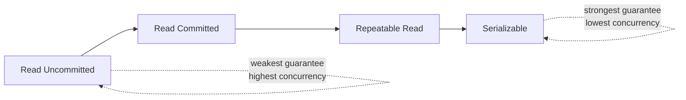

---

## 2. The anomalies — know all six by name and by example

| # | Anomaly | One-line definition |
|---|---|---|
| 1 | **Dirty write** | Two transactions write to the same object before either commits, interleaving updates incorrectly |
| 2 | **Dirty read** | A transaction reads data written by another transaction that hasn't committed yet |
| 3 | **Non-repeatable read (fuzzy read)** | A transaction reads the same row twice and gets different values because another transaction modified and committed in between |
| 4 | **Phantom read** | A transaction re-runs a range query and sees *new rows* that weren't there before, because another transaction inserted matching rows and committed |
| 5 | **Lost update** | Two transactions read-modify-write the same object concurrently; one update silently overwrites the other |
| 6 | **Write skew** | Two transactions read overlapping data, then each writes to a *different* object, but the combination violates an invariant that held for either alone |

### 2.1 Dirty write

**This is the one anomaly that's purely hypothetical** — no production database actually lets it happen, at any isolation level, because a write always takes an exclusive lock that a second writer must wait for. It's included because you need to be able to *say why* it's a non-issue, not because you'll ever see it:

```
T1: UPDATE orders SET status = 'shipped' WHERE id = 5;   -- uncommitted
T2: UPDATE orders SET status = 'cancelled' WHERE id = 5; -- BLOCKS here, waiting for T1's row lock
T1: COMMIT;   -- T1's lock releases; T2's UPDATE can now proceed
T2: UPDATE orders SET status = 'cancelled' WHERE id = 5; -- now applies cleanly, sees T1's committed row
T2: COMMIT;
```

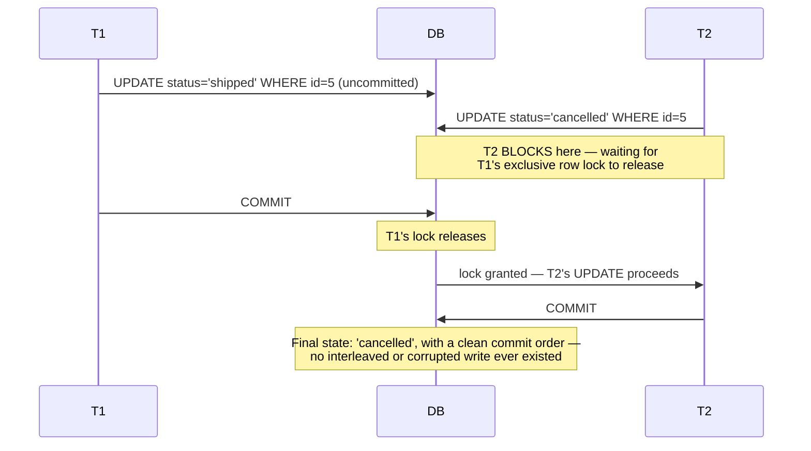

Every isolation level (even Read Uncommitted) prevents dirty writes — it's the one anomaly no serious database tolerates, because row-level write locks are essentially free to implement and universally applied. If a candidate is asked "what if two writes race on the same row," the correct answer is "the second one blocks, it doesn't corrupt" — this is the guarantee to name.

### 2.2 Dirty read

```
Time  T1 (uncommitted)                  T2
t1    UPDATE balance = 0 WHERE id=A
t2                                      SELECT balance FROM accounts WHERE id=A  -- reads 0!
t3    ROLLBACK                          -- T2 already acted on a value that never existed
```

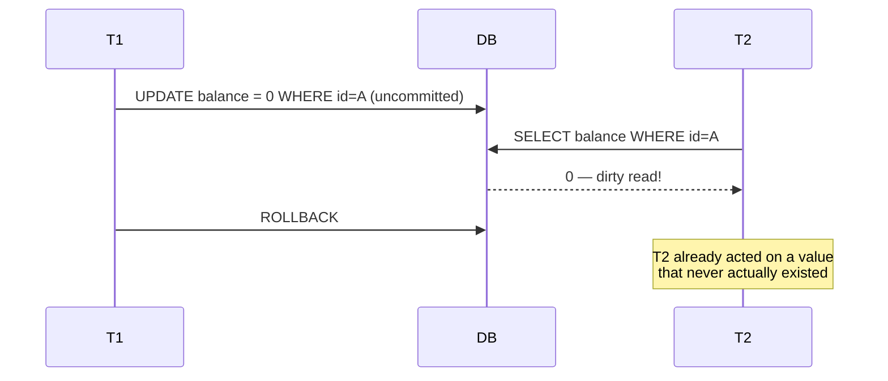

T2 read a value T1 never actually committed. If T1 rolls back, T2 made a decision based on data that logically never existed. **Prevented starting at Read Committed.**

### 2.3 Non-repeatable read (aka read skew)

```
Time  T1                                T2
t1    SELECT balance FROM accounts
      WHERE id=A;              -- reads 100
t2                                      UPDATE accounts SET balance=50
                                        WHERE id=A; COMMIT;
t3    SELECT balance FROM accounts
      WHERE id=A;              -- reads 50 -- different answer, same query, same txn!
```

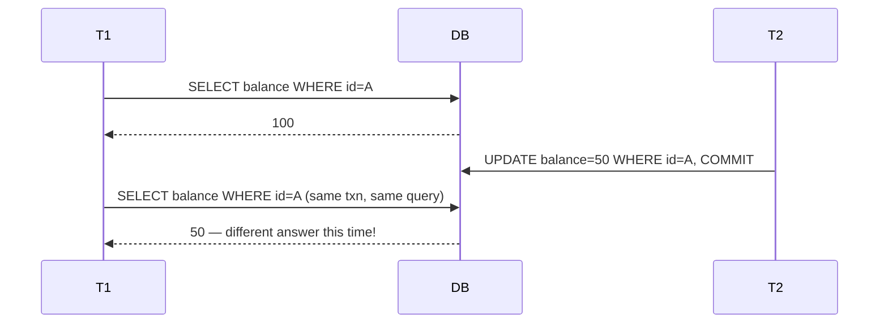

**Prevented starting at Repeatable Read.**

**A second, more subtle shape of the same anomaly: reading *different* objects at different times — the classic backup problem.** Non-repeatable read isn't only "re-read the same row and get a different answer." Kleppmann's *Designing Data-Intensive Applications* uses **read skew** specifically for the case where one transaction reads *several different rows* at different points in time and ends up with a combination that never actually existed:

```
Time  T1 (nightly backup job)                 T2 (funds transfer, $100)
t1    SELECT balance FROM accounts
      WHERE id=A;              -- reads 500 (before transfer)
t2                                             UPDATE accounts SET balance=balance-100
                                                WHERE id=A;
t3                                             UPDATE accounts SET balance=balance+100
                                                WHERE id=B; COMMIT;
t4    SELECT balance FROM accounts
      WHERE id=B;              -- reads 600 (after transfer)

Backup file now shows A=500, B=600. Before the transfer, A+B = 1000 (correct).
The backup's combined view, A+B = 1100 -- $100 that appears to exist twice,
even though neither individual read was "wrong" on its own.
```

This is exactly why **Snapshot Isolation** matters beyond just "don't let me re-read the same row and see it change": it gives a transaction one consistent point-in-time view across *every* row it touches, not just protection for a single row re-read. A long-running report or backup job is the case that makes this concrete — it reads many rows over several seconds, and without a snapshot it can capture a transfer mid-flight. **Prevented by Snapshot Isolation / MVCC snapshots**, same fix as ordinary non-repeatable read.

### 2.4 Phantom read

```
Time  T1                                T2
t1    SELECT count(*) FROM orders
      WHERE status='pending';  -- returns 5
t2                                      INSERT INTO orders (status) VALUES ('pending');
                                        COMMIT;
t3    SELECT count(*) FROM orders
      WHERE status='pending';  -- returns 6 -- a "phantom" row appeared
```

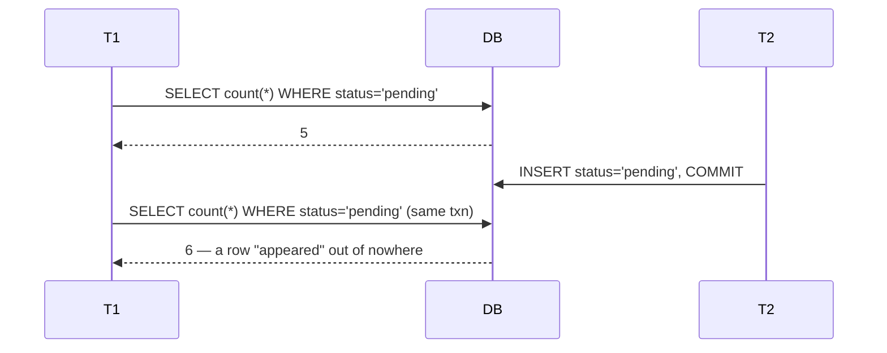

Subtly different from non-repeatable read: it's about the **set of rows matching a predicate** changing, not a specific row's value changing. **Prevented at Serializable** in the ANSI standard — though several real databases (MySQL InnoDB's Repeatable Read via gap locks, Postgres's Repeatable Read via snapshot isolation for this specific case) prevent it earlier than the standard requires. This is a favorite "gotcha" interview question — see §4.

### 2.5 Lost update

The classic example: two people incrementing a counter, or two clients editing the same wiki page.

```
Time  T1                                T2
t1    x = SELECT value FROM counters
      WHERE id=1;              -- x = 10
t2                                      y = SELECT value FROM counters
                                        WHERE id=1;   -- y = 10
t3    UPDATE counters SET value = x+1
      WHERE id=1;  -- writes 11
t4                                      UPDATE counters SET value = y+1
                                        WHERE id=1;  -- writes 11 (should be 12!)
```

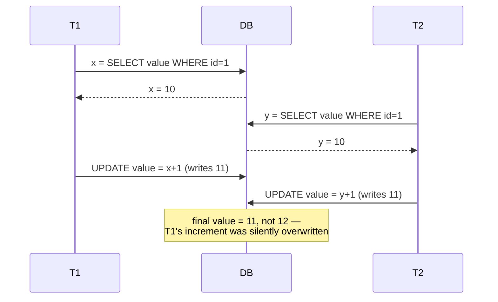

Both transactions read 10, both computed "+1," both wrote 11 — one increment is **silently lost**. This happens even under Read Committed in most databases, because each individual read and write is itself consistent — the problem is the *read-modify-write* isn't atomic as a unit.

**Fixes:**
- `SELECT ... FOR UPDATE` — take a row lock at read time so the second transaction blocks until the first commits.
- Atomic update expressions: `UPDATE counters SET value = value + 1 WHERE id = 1` (push the read+write into a single statement the DB executes atomically).
- **Compare-and-swap (CAS)**: `UPDATE counters SET value = 11 WHERE id = 1 AND value = 10` — check the app-level "did anything change" condition in the `WHERE` clause; if 0 rows affected, retry.
- Snapshot isolation with **first-committer-wins**: Postgres/MySQL detect this at commit time under Repeatable Read/Snapshot Isolation and abort the loser with a serialization error, forcing an app-level retry.

### 2.6 Write skew — the anomaly that trips up senior engineers

This is the one interviewers love because Repeatable Read / Snapshot Isolation does **NOT** prevent it, and most engineers assume it does.

**Classic example: on-call doctors.** Rule: at least one doctor must always be on call.

```
Initial state: Dr. Alice and Dr. Bob are both on call.

Time  T1 (Alice wants to go off call)         T2 (Bob wants to go off call)
t1    SELECT count(*) FROM doctors
      WHERE on_call = true;        -- reads 2
t2                                             SELECT count(*) FROM doctors
                                               WHERE on_call = true;      -- reads 2
t3    -- 2 >= 2, safe to go off call
      UPDATE doctors SET on_call=false
      WHERE name='Alice';
t4                                             -- 2 >= 2, safe to go off call
                                               UPDATE doctors SET on_call=false
                                               WHERE name='Bob';
t5    COMMIT;                                  COMMIT;

Result: BOTH doctors are off call. The invariant "at least one on call" is violated,
even though each transaction individually read a consistent snapshot and wrote to a
DIFFERENT row (no dirty write, no lost update on the same row).
```

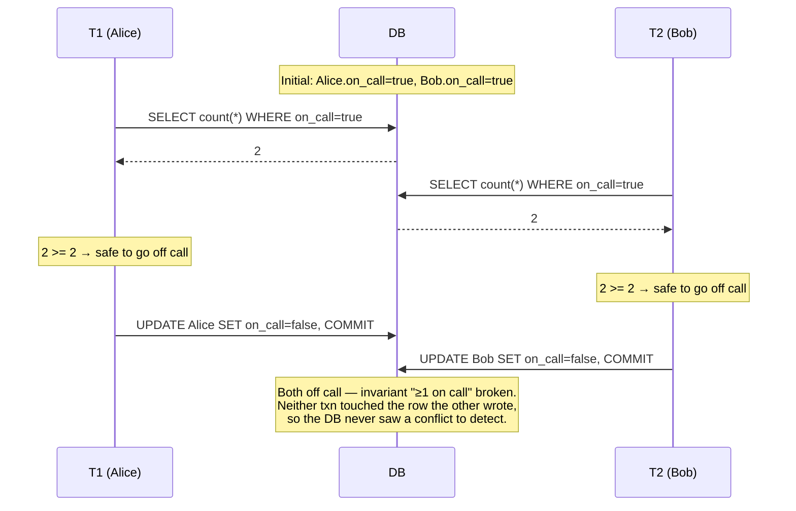

Why Snapshot Isolation misses this: T1 and T2 never touch the *same row* — Alice's row and Bob's row are different objects. There's no write-write conflict for the DB to detect. The invariant that's violated spans both rows, and the DB has no idea such an invariant exists unless you tell it (e.g., via a `CHECK` constraint spanning both rows, which SQL can't easily express, or via `SERIALIZABLE` isolation).

**Other real-world write skew examples worth having ready:**
- **Meeting room booking**: two people check "is this room free 2–3pm" concurrently, both see no conflicting booking, both insert a booking. Now the room is double-booked.
- **Bank account joint withdrawal limit**: a couple has two accounts with a combined overdraft rule ("balance_A + balance_B >= 0"). Each partner withdraws from their own account concurrently; each individual account stays non-negative pre-transaction-check, but the combined balance goes negative.

**The only general fix**: **Serializable isolation** (true serializability, or `SELECT ... FOR UPDATE` on the rows read as part of the invariant, to force a conflict the DB can detect).

---

## 3. The ANSI SQL isolation levels — the matrix to know cold

| Isolation level | Dirty write | Dirty read | Non-repeatable read | Phantom read | Write skew | Lost update |
|---|:---:|:---:|:---:|:---:|:---:|:---:|
| **Read Uncommitted** | prevented | **possible** | possible | possible | possible | possible |
| **Read Committed** | prevented | prevented | possible | possible | possible | possible |
| **Repeatable Read** | prevented | prevented | prevented | possible* | possible | possible* |
| **Snapshot Isolation** (not ANSI-standard, but critical — see below) | prevented | prevented | prevented | prevented | **possible** | prevented (first-committer-wins) |
| **Serializable** | prevented | prevented | prevented | prevented | prevented | prevented |

`*` The ANSI standard technically allows phantoms and lost updates at Repeatable Read, but several real implementations (InnoDB's gap locks) close this gap in practice — this is exactly why "it depends on the actual database" is the right answer, not just the standard.

**Why Snapshot Isolation gets its own row**: it's not part of the 1992 ANSI SQL standard, but it's what PostgreSQL calls "Repeatable Read" and what most people *mean* when they say "Repeatable Read" in casual conversation. It's strictly stronger than ANSI Repeatable Read (no phantoms) but strictly weaker than Serializable (write skew is still possible). **This is one of the most common interview trip-wires — always clarify "ANSI Repeatable Read" vs. "Snapshot Isolation" when the topic comes up.**

---

## 4. Real database defaults and quirks

| Database | Default isolation | Achievable levels | Notable quirk |
|---|---|---|---|
| **PostgreSQL** | Read Committed | Read Committed, Repeatable Read (= Snapshot Isolation), Serializable (true SSI) | Postgres has no "Read Uncommitted" — it silently upgrades to Read Committed even if you ask for it |
| **MySQL (InnoDB)** | **Repeatable Read** | All four ANSI levels | InnoDB's Repeatable Read uses **next-key locks** (record + gap locks) that prevent phantom reads for locking reads — stronger than the ANSI standard requires at this level |
| **Oracle** | Read Committed | Read Committed, Serializable (implemented as snapshot isolation, so write skew is still possible despite the name!) | Oracle's "Serializable" is really snapshot isolation, not true serializability — a famous naming trap |
| **SQL Server** | Read Committed | All four, plus `SNAPSHOT` (optimistic, MVCC-based) as a separate mode | Only DB in this list offering both a full pessimistic (2PL) stack and a full optimistic (snapshot) stack side by side |
| **CockroachDB** | Serializable (only option) | Serializable only | Deliberately refuses to offer weaker levels — "we'd rather you pay the retry cost than debug write skew in prod" |
| **Spanner** | External consistency / Serializable | Effectively one strong level | Uses TrueTime to assign a global commit timestamp — see [9.9](9.9%20Distributed%20Transactions%20and%20Consensus.md) |

**The single most valuable line to say out loud in an interview**: *"Repeatable Read means different things in different databases — Postgres and MySQL both call something 'Repeatable Read' but Postgres's version is snapshot isolation and MySQL's version uses gap locks to additionally block phantoms. I'd always check the specific engine's docs rather than assume the ANSI definition."*

---

## 5. Implementation mechanisms

### 5.1 Two-Phase Locking (2PL) — pessimistic

- **Growing phase**: transaction acquires locks as it reads/writes (shared locks for reads, exclusive locks for writes).
- **Shrinking phase**: once the transaction releases its first lock, it may not acquire any new ones — in practice, most systems release all locks at once at commit/abort (**Strict 2PL**), which is what "2PL" usually means colloquially.
- Guarantees serializability, but readers and writers block each other, hurting concurrency.
- **Deadlocks** are an unavoidable side effect of locking — resolved via a **wait-for graph** cycle detector that picks a victim to abort, or timeout-based detection.
- **Lock granularity** trade-off: row-level locks (high concurrency, more overhead) vs. table-level locks (low overhead, poor concurrency) — **intent locks** (`IS`/`IX`) let the engine efficiently check for conflicts at a coarser granularity before drilling down, which is how "lock escalation" works.

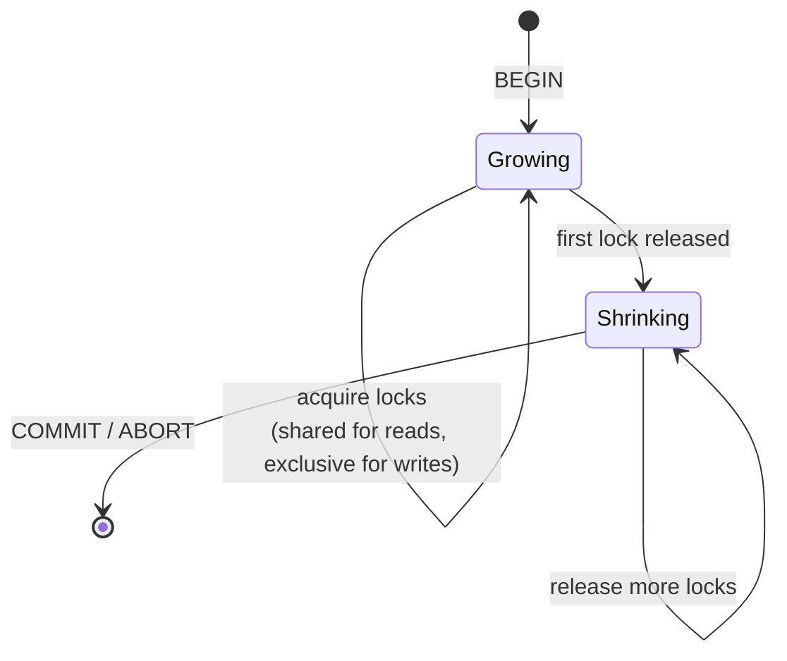

**Strict 2PL** (what "2PL" means colloquially) collapses the shrinking phase into a single instant at commit/abort — every lock is held until the very end and released all at once, rather than trickling out mid-transaction. This is what actually runs in production; textbook 2PL's gradual shrinking phase is rarely implemented as-is because releasing a lock mid-transaction can expose uncommitted writes to other transactions before the releasing transaction is guaranteed to commit.

### 5.2 Multi-Version Concurrency Control (MVCC) — optimistic-ish

- Every write creates a **new version** of a row rather than overwriting in place; each version is tagged with the transaction ID / commit timestamp that created it.
- A reader is given a **snapshot** (a point in transaction-time) and only sees versions committed before its snapshot was taken — readers never block writers, and writers never block readers.
- Old versions are eventually cleaned up by a background process — in Postgres this is **VACUUM**; failing to vacuum causes "bloat" and, in extreme cases, transaction ID wraparound failures (a real production incident class worth namedropping).
- Write-write conflicts are still resolved with **row locks** or an abort-and-retry (**first-committer-wins**) at commit time — MVCC solves reader/writer contention, not writer/writer contention.

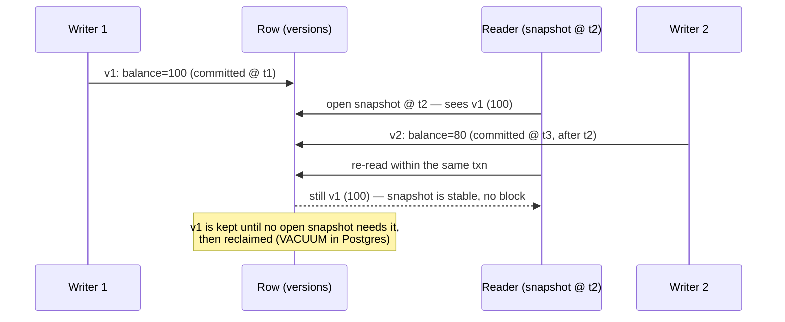

### 5.3 Serializable Snapshot Isolation (SSI) — how Postgres/CockroachDB get true serializability without full 2PL

SSI starts from ordinary snapshot isolation (cheap, non-blocking reads) and adds **runtime conflict detection**: it tracks read/write dependencies between concurrent transactions and aborts one of them if it detects a "dangerous structure" (a pattern of rw-antidependencies known to cause anomalies like write skew) that would otherwise violate serializability. This gives you serializable *guarantees* with close to snapshot-isolation *performance* — at the cost of occasional spurious aborts that the application must retry.

**Interview soundbite**: *"SSI is how you get Serializable's guarantees without paying full 2PL's blocking cost — it optimistically lets transactions run under snapshot isolation, then aborts the specific transactions that would have caused a serializability violation, pushing the retry cost onto the (hopefully rare) conflicting transaction instead of blocking everyone up front."*

**Closing the loop with the doctors example (§2.6)**: under plain Snapshot Isolation, both transactions in that example commit and the invariant breaks. Under SSI, the engine notices that T1's read (count of on-call doctors) overlaps with T2's write (Bob's row), and T2's read overlaps with T1's write (Alice's row) — a *rw-antidependency* in both directions, the "dangerous structure" SSI watches for — and aborts one of them at commit time instead of letting both through:

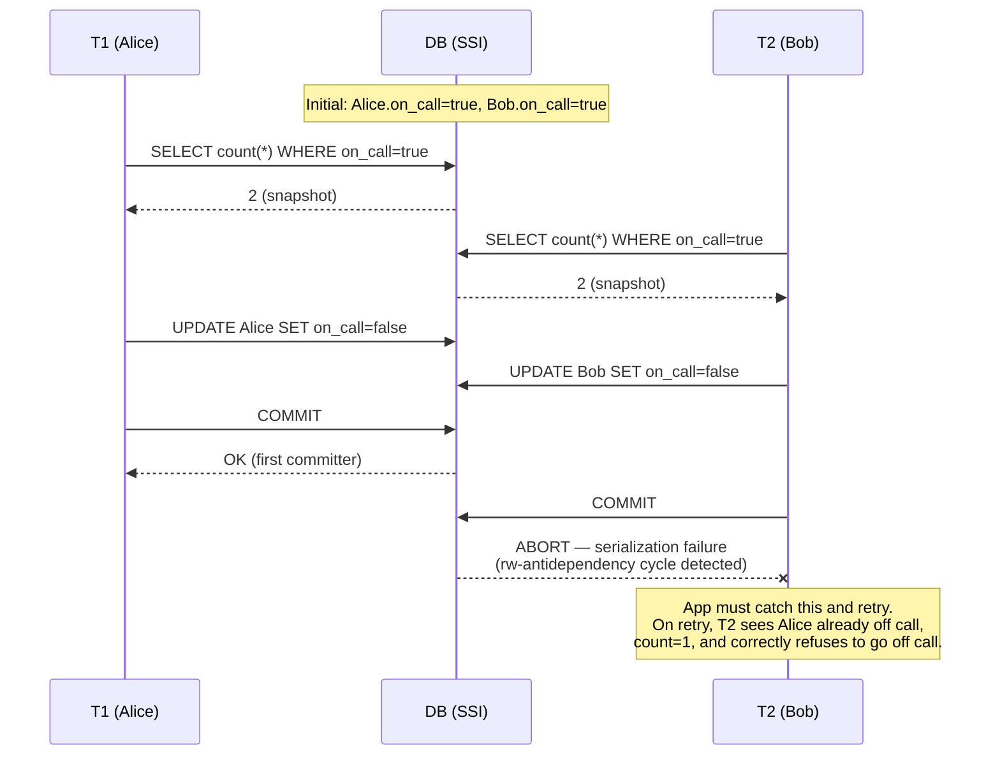

This is the concrete trade-off SSI makes: instead of blocking either transaction up front the way full Serializable/2PL would (via predicate locks that make T2 wait for T1), SSI lets both proceed optimistically and pays the cost only when a real conflict is detected — at the price of an app-level retry loop being mandatory, not optional, for correctness.

---

## 6. How to identify isolation-level questions in an interview

- "Two users edit the same record at the same time, what happens?" → lost update; ask about `SELECT FOR UPDATE` / CAS / optimistic concurrency.
- "We check an invariant across two rows, then write to each separately" → **write skew**, not lost update. This distinction alone is a strong signal.
- "A report re-runs the same query mid-transaction and gets a different row count" → phantom read.
- "Do we need Serializable everywhere?" → almost never; recommend Read Committed/Snapshot Isolation as default, and call out the *specific* invariant that needs stronger protection (and handle just that one with `FOR UPDATE`, a unique constraint, or Serializable scoped narrowly) rather than blanket Serializable everywhere (which tanks throughput).
- "How would you prevent double-booking?" → this is the write-skew shape; the fix is either a `UNIQUE` constraint on `(room_id, time_slot)` (push the invariant into the schema so a dirty-write-level check catches it) or Serializable isolation around the check-then-insert.

**As a routing diagram** — match the question's shape to the anomaly before naming a fix:

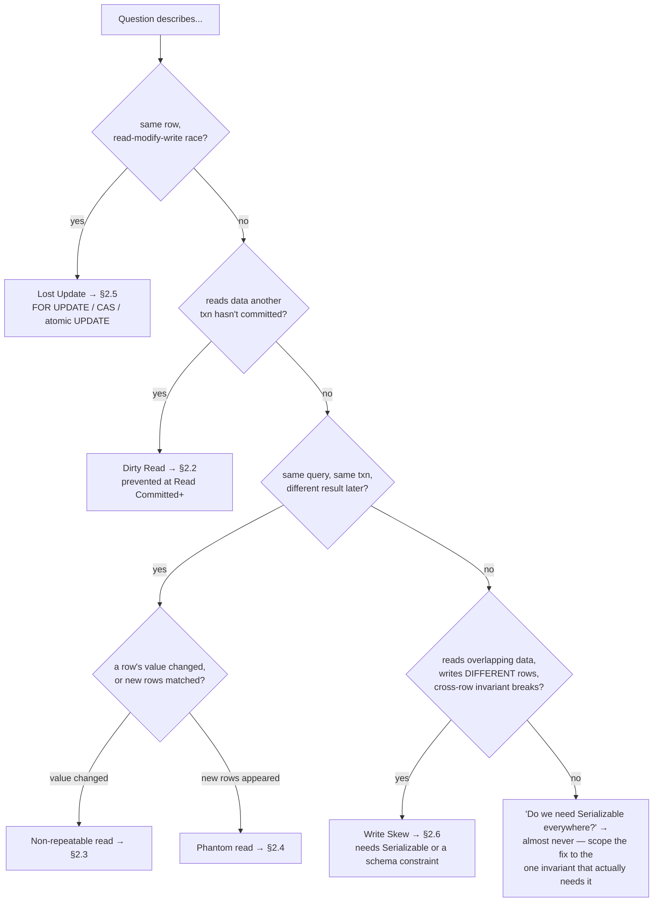

---

## Interview Cheat Sheet — Isolation

- 6 anomalies to say by name: dirty write, dirty read, non-repeatable read, phantom read, lost update, write skew.
- Write skew is the deep-cut anomaly: **read overlapping data → write to different rows → invariant across both rows breaks.** Snapshot Isolation does NOT prevent it — only Serializable does (or a schema-level constraint that converts the invariant into a single-row check).
- The 4 ANSI levels: Read Uncommitted → Read Committed → Repeatable Read → Serializable, each strictly stronger, each strictly more expensive in concurrency.
- **Snapshot Isolation ≠ ANSI Repeatable Read** — it's an extra, stronger, non-standard level that sits between Repeatable Read and Serializable. Postgres's "Repeatable Read" *is* Snapshot Isolation.
- Non-repeatable read is also called **read skew** (Kleppmann's term) — including the multi-object variant where a backup/report job reads different rows at different times and sees a combination that never existed (e.g., a transfer caught mid-flight). Snapshot Isolation fixes this by giving one consistent point-in-time view across *every* row read, not just protection for re-reading a single row.
- Two implementation families: **2PL** (pessimistic, locks, blocks, deadlock detection needed) vs. **MVCC** (optimistic-ish, versioned rows, readers never block writers).
- **SSI** = snapshot isolation + runtime conflict detection = serializable guarantees at near-snapshot-isolation cost, with occasional forced retries — e.g., in the on-call-doctors example, SSI detects the rw-antidependency cycle and aborts one transaction at commit instead of letting both through.
- Lost update fixes: `SELECT FOR UPDATE`, atomic `UPDATE ... SET x = x + 1`, compare-and-swap `WHERE x = <expected>`, or rely on first-committer-wins abort + app retry.
- Always name the *specific* database when discussing defaults — "Repeatable Read" and "Serializable" mean different things in Postgres vs. MySQL vs. Oracle. This nuance is a reliable way to stand out.
