# 9.3 Consistency Models — From Linearizability to Eventual

> Isolation (9.2) is about concurrent transactions on **one** database. Consistency models are about what a client can expect to see across **multiple replicas/nodes** of the same data. These are related but distinct axes — don't conflate them in an interview. This file gives you the full spectrum, ordered strongest to weakest, with a concrete example for each.

---

## 1. The spectrum, at a glance

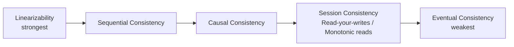

General rule: **stronger consistency = more coordination = higher latency/lower availability under partition.** This entire file is really "CAP's C, examined at high resolution" — pair it with [9.8 CAP Theorem and PACELC](9.8%20CAP%20Theorem%20and%20PACELC.md).

---

## 2. Linearizability (a.k.a. strong consistency, atomic consistency)

**Definition**: once a write completes, every subsequent read by any client, on any replica, sees that write (or a later one) — the system behaves as if there were only **one copy** of the data, and operations happen atomically at some single point in time between when they're invoked and when they return.

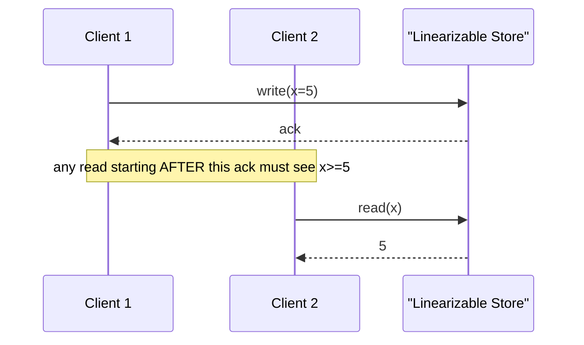

**Cost**: every read and write must coordinate with enough of the system to rule out a stale answer — this is exactly what makes it expensive across a WAN. Achieving linearizability across geographically distributed replicas requires consensus (Paxos/Raft) or synchronized clocks (Spanner's TrueTime) — see [9.9](9.9%20Distributed%20Transactions%20and%20Consensus.md).

**Where you need it**: leader election, distributed locks, uniqueness constraints (username registration), anything where "two people can't both get the same answer" is a correctness requirement, not a nice-to-have.

**Real systems**: ZooKeeper (linearizable writes), etcd, Spanner (linearizable + externally consistent across the globe via TrueTime).

---

## 3. Sequential consistency

**Definition**: all operations from all clients appear in *some* single global order, and each client's own operations appear in that order in the sequence the client issued them — but that global order doesn't have to match real-world (wall-clock) time.

**Difference from linearizability**: linearizability requires the global order to respect **real-time** — if write A finishes before write B starts (in wall-clock time), A must come before B in the observed order. Sequential consistency drops that real-time constraint; it only requires *some* consistent total order that respects each individual client's program order.

**Analogy**: imagine a play being performed — the audience (all clients) sees the same sequence of scenes, in the same order, but the play doesn't have to be performed in real "wall clock sync" with when the script was written.

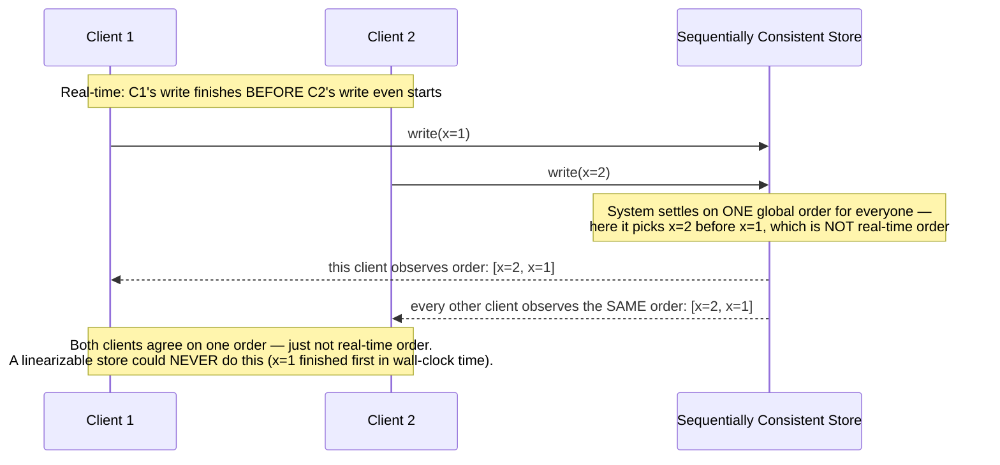

**Where it shows up**: distributed shared memory systems, some replicated state machines where you care about a consistent order but can tolerate it not perfectly matching real time.

---

## 4. Causal consistency

**Definition**: operations that are **causally related** (B read a value that A wrote, so B "happened after" A) must be seen by everyone in that same order. Operations that are **concurrent** (no causal relationship) can be seen in different orders by different clients — that's fine.

**The canonical example — comments on a social post:**

```
Post: "What's for lunch?"
Comment A: "Tacos!"
Comment B (replying to A): "Tacos sound great!"
```

Comment B **causally depends** on Comment A (B's author read A before writing B). A causally consistent system guarantees no client ever sees B without also seeing A first — you'll never see "Tacos sound great!" as a reply floating above an invisible "Tacos!" comment. But two *unrelated* comments posted around the same time by different, uncoordinated users can appear in different orders to different viewers, and that's acceptable.

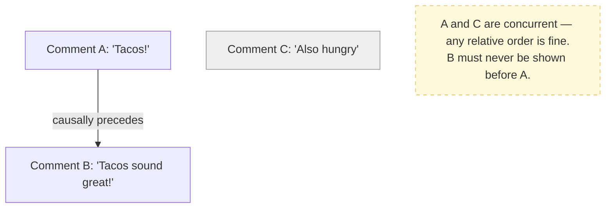

**How it's implemented**: **vector clocks** (or version vectors) track causal dependency chains between writes across replicas — see §6. Causal consistency is the strongest model that can still be implemented **without a global coordination bottleneck**, which is why it's the "sweet spot" a lot of systems research aims for (e.g., COPS, MongoDB's causal consistency sessions).

**Real systems**: MongoDB (causal consistency sessions, opt-in), some CRDT-based collaborative editors.

---

## 5. Session guarantees — the pragmatic middle ground

These are weaker than causal consistency globally, but scoped to **a single client's session** — and they're what most production "eventually consistent" systems actually offer as a usable minimum bar, because pure eventual consistency with zero guarantees is nearly unusable for a UI.

| Guarantee | What it promises | Concrete failure it prevents |
|---|---|---|
| **Read-your-writes** | After a client writes X, that same client's subsequent reads always see X (or newer) | You update your profile picture, refresh the page, and see the *old* picture because your read hit a replica that hadn't caught up yet |
| **Monotonic reads** | If a client has read a value, it will never later read an *older* value | You refresh a comment thread and a comment you already saw *disappears* because your second read hit a lagging replica |
| **Monotonic writes** | A client's writes are applied in the order the client issued them | You set a value to A, then to B — a lagging replica must never apply B, then A (ending up stuck at A) |
| **Writes-follow-reads** | If a client reads X, then writes Y (where Y is causally dependent on X), other clients who see Y must also see the X it depended on | You reply to a comment; anyone who can see your reply must also be able to see the original comment |

**Each guarantee, as the violation it prevents:**

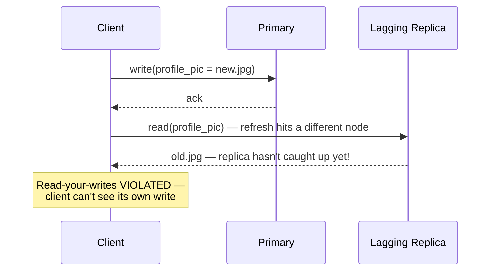

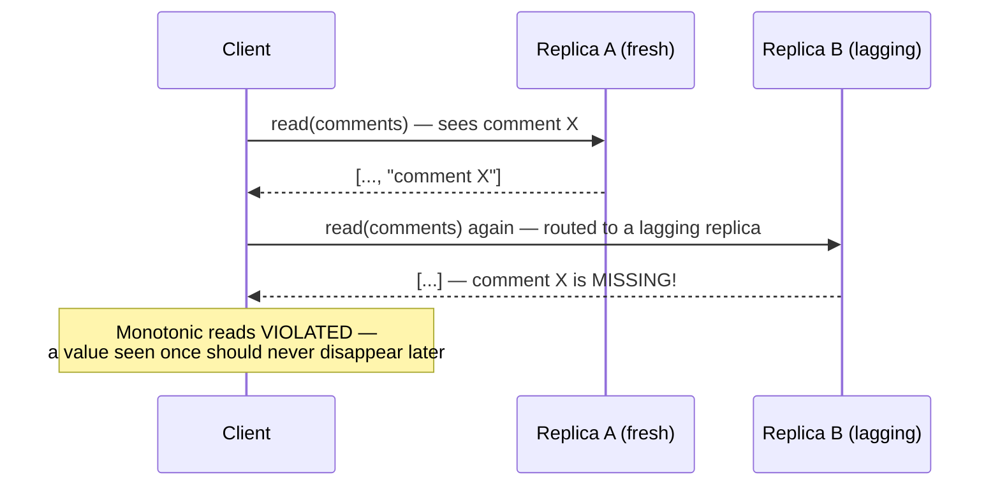

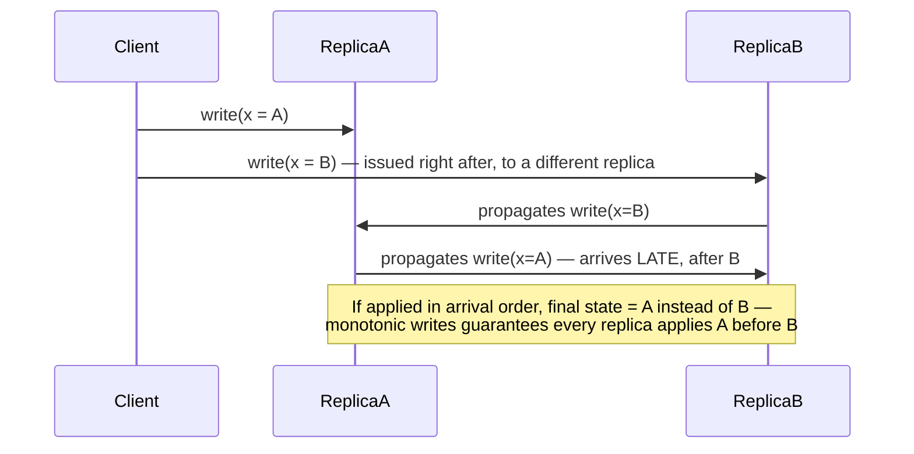

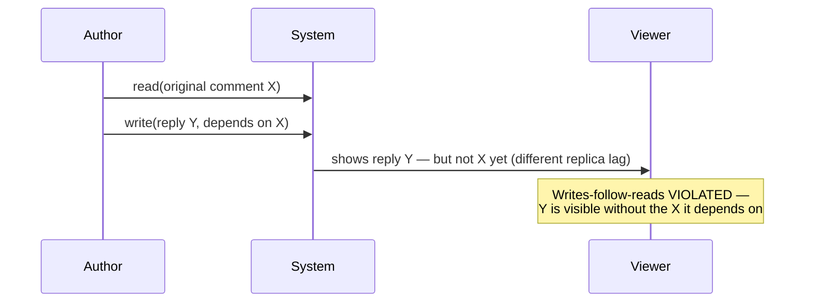

**How these are commonly implemented in practice**: **sticky sessions / read-your-own-writes routing** — route a client's reads to the same replica that served its last write (or to the primary) for a bounded window, often using a timestamp/version token the client carries between requests ("read at least version N").

**Interview soundbite**: *"When someone says 'eventually consistent,' the first follow-up I'd ask is: do we at least guarantee read-your-writes for the acting user? Most consumer products need that minimum bar even if they're fine with other users seeing stale data briefly."*

---

## 6. Eventual consistency

**Definition**: if no new writes occur, all replicas will *eventually* converge to the same value — but there's no bound on how long "eventually" takes, and no guarantee about what you see in the meantime (could be stale, could even be a value that's about to be overwritten by a concurrent write not yet resolved).

This is the weakest model on the spectrum and the default for AP-leaning systems (Cassandra, DynamoDB in its base mode, Riak).

### 6.1 The conflict-detection problem eventual consistency creates

If two clients write to the same key on two different nodes before either write propagates, you get a genuine conflict — which write wins? Two big families of solution:

**A. Last-Write-Wins (LWW)** — attach a timestamp, keep the newest. Cheap, but risky: clock skew across nodes can silently discard a legitimately later write (already covered as a replication risk in [Databases-FAANG-Guide.md](Databases-FAANG-Guide.md) §3).

**B. Vector clocks / version vectors** — each replica tags a value with a vector of (node, counter) pairs. Comparing two vectors tells you:
- One **dominates** the other (all counters ≥, at least one >) → no real conflict, take the dominant version.
- Neither dominates → **true concurrent write** → surface both versions to the application (or a merge function) to resolve. This is exactly what Amazon's original Dynamo paper does — and why DynamoDB's predecessor famously returned **multiple "sibling" values** to the client on a conflicting read, pushing resolution up to the app (the "add item back to cart" merge logic in Amazon's shopping cart is the textbook example).

```
Vector clock example:
  Write 1 by Node A: {A:1}
  Write 2 (based on Write 1) by Node A: {A:2}          -- dominates Write 1, no conflict
  Write 3 by Node B, unaware of Write 2: {A:1, B:1}     -- concurrent with Write 2! neither dominates
    → both {A:2} and {A:1,B:1} are returned to the app as "siblings" to merge
```

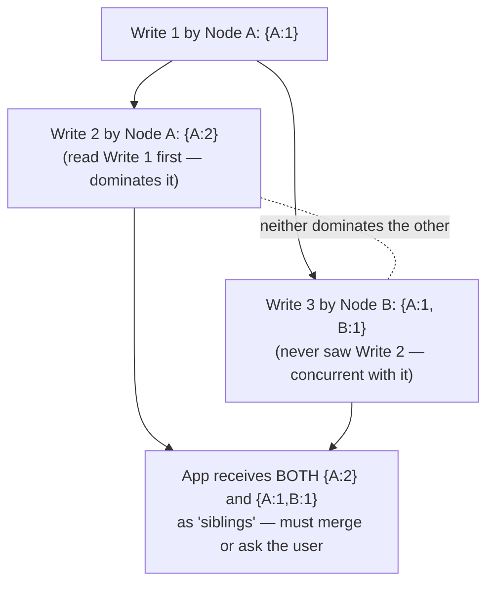

**C. CRDTs (Conflict-free Replicated Data Types)** — data structures specifically designed so that *any* merge order of concurrent updates converges to the same correct result, with no conflict ever surfaced to the application. Examples: G-Counter (grow-only counter, merge = element-wise max), OR-Set (observed-remove set, supports concurrent add/remove safely), LWW-Register. **This is the modern, increasingly-expected answer** to "how do you resolve conflicts without losing data or bothering the user" — mention CRDTs by name if asked about collaborative editing (Figma, Google Docs) or offline-first mobile apps.

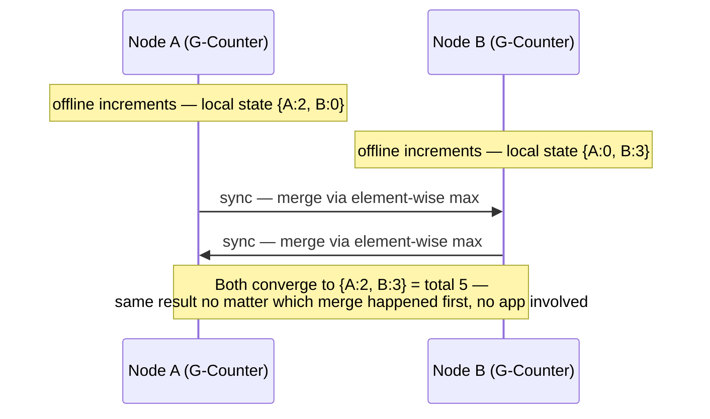

### 6.2 Real-world case study: Meta's TAO — two consistency models, one system

TAO (Meta's graph-aware caching layer in front of MySQL, serving the social graph — namedropped in [9.10](9.10%20Database%20Selection%20Guide%20-%20Types%2C%20Real%20Systems%2C%20and%20When%20to%20Use%20What.md) as a caching layer) is a clean real-world example of deliberately running *two* of the models above in the same product, at the same time:

- Every object/association has one **master region**; all writes for it route there and update that region's cache synchronously.
- A read from **inside the write's master region** is read-your-writes / session-consistent — you always see your own write immediately.
- A read from **a different region** is served off that region's replica, kept current via async MySQL replication — which can lag, so it's only eventually consistent.

That's why "I post something and immediately see it on refresh" always works, while "my friend on another continent sees my post a second later" is an accepted, deliberate trade-off — same system, two different consistency guarantees depending on *where* the read happens. This is the textbook answer when an interviewer asks "how would you get read-your-writes at global scale without paying for linearizability everywhere?"

---

## 7. Tunable consistency — how real systems let you pick per-operation

Rather than forcing one global consistency level, several production systems let you dial consistency **per read/write call**:

| System | Mechanism | How it works |
|---|---|---|
| **Cassandra** | Consistency level per query: `ONE`, `QUORUM`, `ALL`, `LOCAL_QUORUM`, etc. | Recall the quorum formula from [Databases-FAANG-Guide.md](Databases-FAANG-Guide.md) §3: `W + R > N` gives you strong-ish consistency; `W=1, R=1` gives you fast/available but possibly stale reads |
| **DynamoDB** | `ConsistentRead: true/false` flag per `GetItem`/`Query` call | `false` (default) = eventually consistent read, cheaper, may hit a lagging replica; `true` = strongly consistent read, routes to a replica guaranteed current, costs more (2x read capacity units) |
| **MongoDB** | `readConcern` (local / available / majority / linearizable) and `writeConcern` (`w: 1..N`, `majority`) | Independently tunable read and write guarantees per operation |
| **Azure Cosmos DB** | **Five explicit consistency levels**: Strong, Bounded Staleness, Session, Consistent Prefix, Eventual | The most granular public spectrum of any major cloud database — genuinely maps almost 1:1 onto this file's spectrum (Strong≈linearizable, Session≈session guarantees, Consistent Prefix≈causal-ish ordering guarantee without recency, Eventual≈eventual). Naming Cosmos DB's five levels is a strong, specific signal in an interview. |

**Bounded Staleness, defined** (the one term in that table that isn't self-explanatory): a middle ground stronger than plain eventual but weaker than strong — the system guarantees a replica is never more than **K versions** or **T seconds** behind the latest write (whichever limit you configure), and within that window reads are still monotonic and prefix-consistent. Cosmos DB is the system that turned this into a first-class, explicitly tunable knob rather than an unmanaged side effect of replication lag — name it if an interviewer asks "is there anything between strong and eventual that still gives a hard, numeric guarantee?"

**Interview framing**: *"I'd treat consistency as a per-query dial, not a database-wide setting — read your own profile strongly consistent, but render someone else's public follower count eventually consistent, because the cost/benefit is completely different for those two reads."*

---

## 8. Putting it together — a decision table

| Requirement | Consistency model to reach for |
|---|---|
| Distributed lock, leader election, uniqueness check | Linearizable |
| Collaborative doc editing, offline-first sync | Causal + CRDTs |
| "I posted this, why don't I see it" complaints | Read-your-writes (session guarantee) |
| Social feed, follower counts, view counts | Eventual — staleness is invisible/acceptable to the user |
| Financial ledger balance | Linearizable (or at minimum, Serializable transactions — pair with 9.2) |
| Shopping cart merge across devices | Vector clocks / CRDTs, app-level merge |

---

## How to identify consistency-model questions in an interview

- "A user updates something and refreshes but doesn't see the change" → read-your-writes violation; propose sticky routing or a client-carried version token.
- "Comments/replies show up out of order relative to what they're replying to" → causal consistency; propose vector clocks or a causally-ordered log (e.g., ordering by a Lamport/hybrid logical clock).
- "Two devices edited the same note offline, how do you merge?" → CRDT or vector-clock-based conflict surfacing.
- "Do we need strong consistency here?" → default answer should be "only for the specific operations where staleness causes a real problem (locks, payments, uniqueness) — everything else should default to eventual/session-level for latency and availability."
- Interviewer says "eventual consistency" and expects you to immediately volunteer: "eventual consistency alone is a very weak guarantee — in practice I'd want at least read-your-writes for the acting user, layered on top."

**As a routing diagram** — match the question's shape to the model before naming a fix:

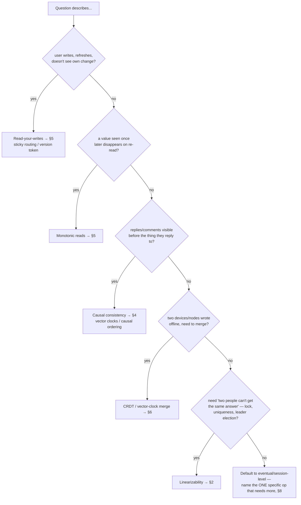

---

## Interview Cheat Sheet — Consistency Models

- Spectrum, strongest to weakest: **Linearizable → Sequential → Causal → Session (read-your-writes / monotonic reads / monotonic writes / writes-follow-reads) → Eventual.**
- Linearizability = real-time-respecting single-copy illusion; expensive across a WAN; needed for locks/uniqueness/leader election.
- Sequential consistency = a single global order exists, but doesn't have to match wall-clock real time — weaker/cheaper than linearizable.
- Causal consistency = only causally-related ops need consistent ordering; concurrent ops can reorder freely. Implemented via **vector clocks**. Sweet spot between correctness and avoiding a global coordination bottleneck.
- Session guarantees (read-your-writes, monotonic reads/writes, writes-follow-reads) are the realistic minimum bar for usable "eventually consistent" products — implemented via sticky routing / version tokens.
- Eventual consistency = converges *eventually*, no bound, no guarantee in between. Conflict resolution needs LWW (risky, clock skew), vector clocks (surfaces "siblings" to the app), or **CRDTs** (auto-merge, no conflict ever surfaced — the modern answer for collaborative/offline apps).
- Real-world case study: Meta's **TAO** runs two consistency models in one system — synchronous same-region cache updates give read-your-writes locally, while async cross-region MySQL replication gives only eventual consistency globally. Same write, different guarantee depending on where you read from.
- Real systems expose consistency as a **tunable per-call dial**, not a single global setting: Cassandra (`ONE`/`QUORUM`/`ALL`), DynamoDB (`ConsistentRead` flag), MongoDB (`readConcern`/`writeConcern`), Cosmos DB (5 named levels — the most granular, good namedrop). **Bounded Staleness** = the one Cosmos DB level worth defining on sight: at most K versions or T seconds stale, a numeric middle ground between strong and eventual.
- Don't conflate this file with 9.2 (Isolation) — isolation is single-database, concurrent-transaction semantics; consistency models are multi-replica, distributed-read/write semantics. They're analogous but answer different questions.
