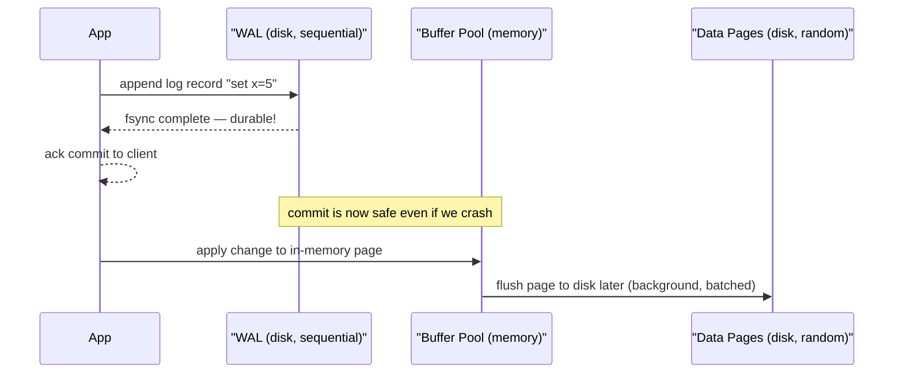
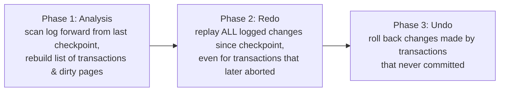
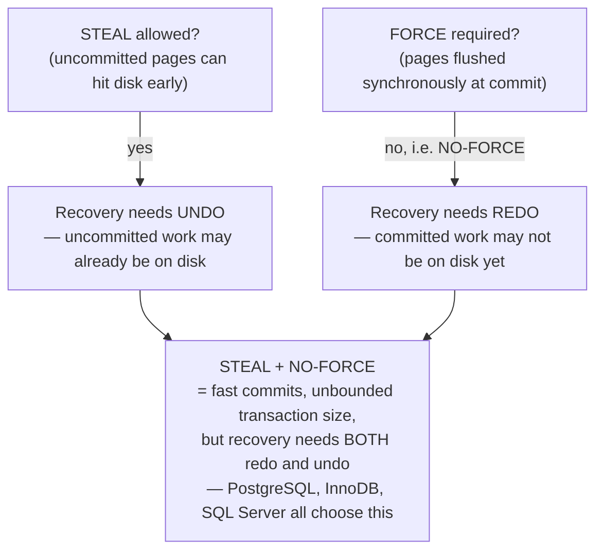
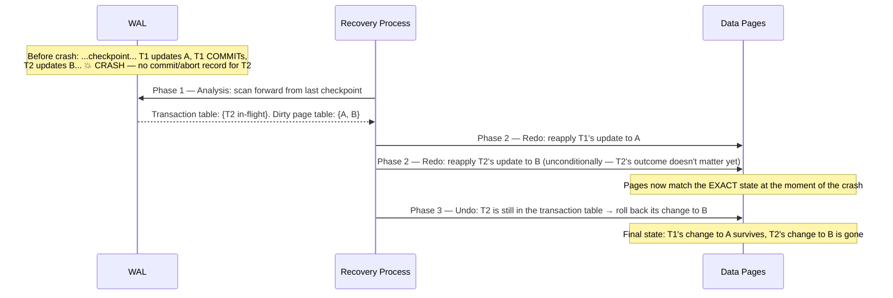
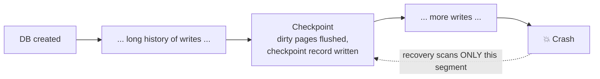
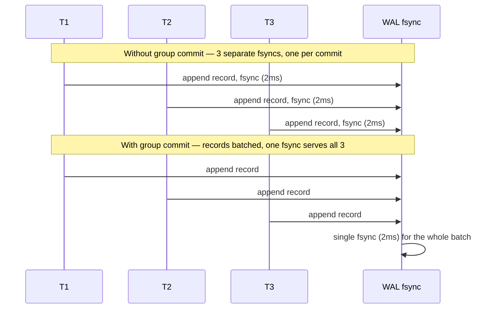
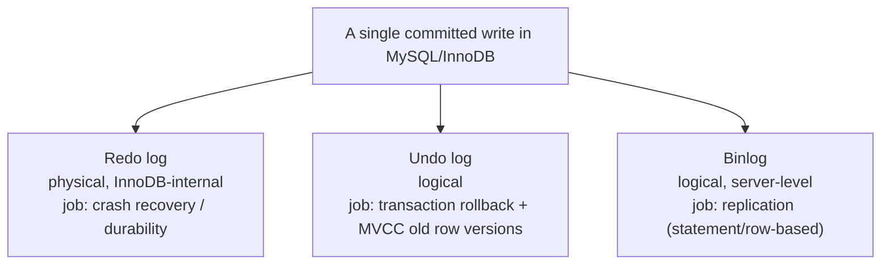
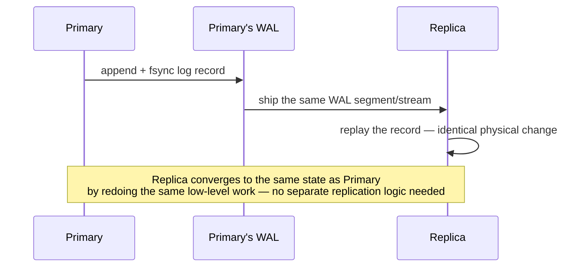
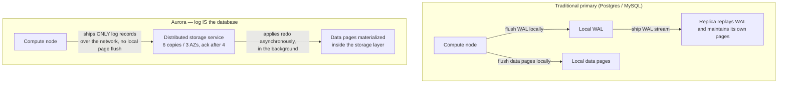
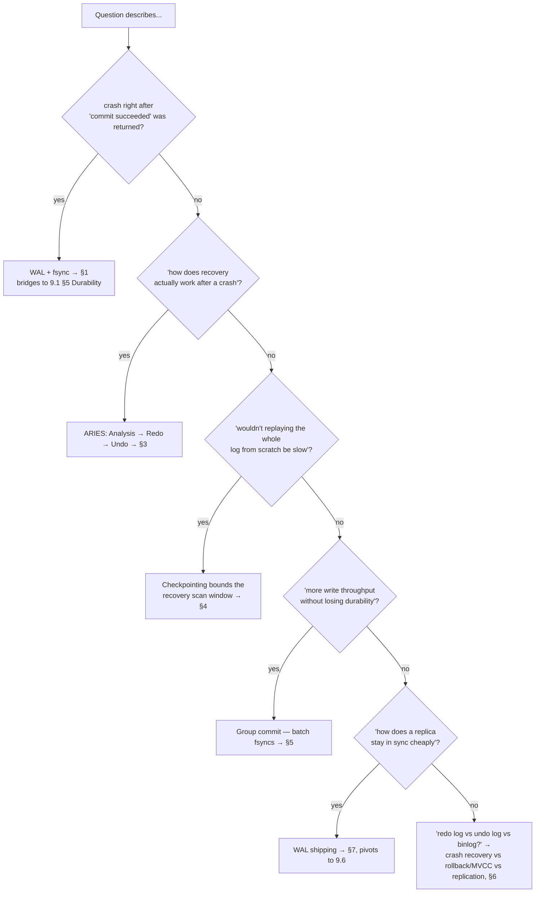

# 9.4 Write-Ahead Logging (WAL) and Crash Recovery

> **Enhancement notes:** This file already covered all the core FAANG-interview must-haves (WAL write path, ARIES phases, checkpointing, group commit, WAL shipping, Aurora) in solid depth, so the gap check found no missing sections — enhancements here are additions, not fixes. Added: (1) a "No-WAL vs WAL" comparison table and mnemonic in §1, (2) a worked concrete log-record example with an L-T-C-C mnemonic in §2, (3) a one-sentence "A-R-U" mnemonic for the ARIES phase order in §3, (4) a concrete "checkpoint every 5 minutes → ≤5 minutes of replay" example plus a checkpoint-frequency trade-off table in §4, (5) a synchronous-fsync-vs-group-commit comparison table with an "if X then Y" recall line in §5, and (6) an illustrative (explicitly labeled, hardware-dependent) sequential-vs-random-I/O note in §1. All new material is marked with 🆕. Sections 6, 7, 8, the routing diagram, and the cheat sheet were already clear and are untouched.

> This is the mechanism that makes Durability (9.1 §5) actually work, and it's also the backbone of Replication (9.6) — the WAL *is* the stream that gets shipped to replicas in log-shipping replication. If you understand WAL deeply, two other chapters get easier for free.

---

## 1. The core idea

**Write-ahead logging**: before modifying the actual data on disk, first append a record describing the change to a **log** — and only consider the change durable once that log record itself is safely on disk.

**Why log first instead of just writing the data directly?**

1. **Sequential writes are fast, random writes are slow.** The log is *append-only* — always writing to the end, which is sequential I/O. The actual data pages (a B-Tree, see [9.5](9.5%20Storage%20Engines%20-%20B-Tree%20vs%20LSM-Tree.md)) are scattered across disk — updating them in place means random I/O. WAL lets you acknowledge a commit the instant the *cheap* sequential write is durable, and defer the *expensive* random-write page updates to happen lazily, in the background, batched. *Illustrative, not a number to memorize:* a random write on a spinning disk pays several milliseconds of head-seek time on top of the actual write; even on SSD (no seek arm), a random write is still slower and less predictable than appending to a log block that's already sitting at the end of the file. The direction — sequential ≫ random — is the point, not the exact millisecond figure, which depends entirely on the hardware.
2. **Crash safety.** If the process crashes mid-write to a data page, that page could be left in a corrupted, half-written state with no way to tell what it used to contain. The log gives you a durable, ordered record of *intent* you can replay to reconstruct a consistent state after a crash — this is the entire premise of crash recovery (§3).



**Interview soundbite**: *"WAL turns a random-write-per-commit workload into a sequential-write-per-commit workload, and defers the expensive random writes to background flushing — that's the whole performance case for it. The crash-safety case is a bonus that falls out of the same design for free."*

#### 🆕 No-WAL vs WAL — the trade-off in one table

| | Write data pages directly, no WAL | Write-ahead logging |
|---|---|---|
| **Commit path** | Random write(s) to scattered data pages, then fsync those pages | One sequential append to the log, then fsync the log |
| **Commit latency** | Bound by random I/O — slow, and gets worse as the data file grows and pages scatter further apart | Bound by sequential I/O — fast, and roughly constant regardless of data size |
| **Crash mid-write** | A page can be left half-written with no record of what it used to be — unrecoverable corruption | The log has a durable, ordered record of intent; recovery replays it to reach a consistent state (§3) |
| **Throughput under concurrency** | Every commit pays its own random-write cost | Multiple commits can share one fsync via group commit (§5) |
| **Who actually does this** | Toy / embedded engines without a durability story; SQLite's older *rollback-journal* mode is a related-but-different approach (undo info in a journal, not ahead-of-time redo info) | Essentially every production RDBMS: PostgreSQL, MySQL/InnoDB, Oracle, SQL Server |

**Mnemonic**: *no WAL = no safety net.* Without a log, a crash mid-write doesn't just lose the in-flight transaction — it can corrupt data that was already durable.

---

## 2. Anatomy of a log record

Every WAL record needs at minimum:
- **LSN (Log Sequence Number)** — a monotonically increasing identifier for the record's position in the log. Every data page also stores the LSN of the last log record that modified it — this is how recovery knows whether a given page's on-disk state already reflects a given log record (§3).
- **Transaction ID** — which transaction this change belongs to.
- **The change itself** — either *physical* (byte offsets changed in a specific page — used for **redo**) or *logical* (the inverse operation needed to undo it — used for **undo**). Most production WALs (e.g., PostgreSQL, InnoDB) are **physiological**: physical description of *which page* changed, logical description of *what* changed within it — a pragmatic middle ground that's both replayable efficiently and doesn't require re-deriving exact byte layouts.
- **Commit/abort marker** — a special record type that marks the transaction's outcome; this is the record recovery looks for to decide whether to redo or undo a transaction's other records.

#### 🆕 A concrete record, worked through

Illustrative shape of a single physiological log record (field names simplified for interview use, not any one product's exact on-disk format):

```
LSN: 104215   Txn: 42   Page: 7381   Offset: 120   Old: balance=100   New: balance=150
```

Followed later, once the transaction finishes, by:

```
LSN: 104219   Txn: 42   COMMIT
```

Recovery reads LSN 104215 and asks *"does page 7381 on disk already reflect a change at LSN ≥ 104215?"* If not, it applies `New: balance=150` (redo). If Txn 42 never got its COMMIT record before the crash, recovery instead applies the inverse (`Old: balance=100`) during undo. That single row — old value, new value, page, LSN — is the whole mechanism; everything else in ARIES is bookkeeping around when to apply which side of it.

**Mnemonic for the four fields**: **L-T-C-C** — **L**SN (where), **T**xn ID (whose), **C**hange (what), **C**ommit/abort marker (whether it counts).

---

## 3. Crash recovery — the ARIES algorithm

**ARIES** (Algorithm for Recovery and Isolation Exploiting Semantics) is the classic recovery algorithm nearly every production WAL-based database implements some variant of (IBM DB2 originally, but the same three-phase shape shows up in PostgreSQL, MySQL/InnoDB, SQL Server). Know the three phases by name — this is a very common "how does the database recover from a crash" interview question.



### Phase 1: Analysis
Scan the log forward from the most recent **checkpoint** (§4) to the end. Rebuild two tables in memory:
- **Transaction table**: which transactions were in-flight at crash time.
- **Dirty page table**: which data pages had uncommitted changes still only in the buffer pool (not yet flushed to disk) at crash time.

This phase determines *where* redo needs to start and *what* undo will need to fix.

### Phase 2: Redo
Replay **every** logged change from the earliest point any dirty page needed it, forward — including changes made by transactions that **later aborted**. This sounds counterintuitive but it's the key insight of ARIES: redo doesn't ask "did this transaction commit?" — it just restores the database to the **exact physical state it was in at the moment of the crash**, warts and all. Uncommitted changes get cleaned up in the next phase instead. Redoing unconditionally (rather than checking commit status first) is what makes ARIES simple and fast — no conditional logic needed during the performance-critical redo pass, just "does this page's on-disk LSN already reflect this record? If not, apply it."

### Phase 3: Undo
Now roll back any transaction that was in-flight (in the transaction table from Phase 1) but never committed — walk its log records backward and apply the inverse operation for each, restoring pre-transaction values. This is where the **undo log** portion of a physiological log record gets used.

**Why this order (redo-then-undo) matters**: if you tried to undo before fully redoing, you might be undoing against a data page that's in some intermediate, partially-applied state rather than the true "at the moment of crash" state — redo-first guarantees undo always operates on a known-consistent baseline.

#### 🆕 Mnemonic for the three phases

**"A-R-U: Assess, Restore, Undo."** Or, as a single sentence: *analysis figures out who was doing what, redo puts the database back exactly where the crash left it (good and bad alike), undo then erases only the bad.* If you can say that one sentence out loud, you have the whole algorithm — the phase names alone (Analysis/Redo/Undo) are easy to recite but easy to blank on the *order* under pressure; anchoring "restore reality first, clean up second" fixes the order in memory.

### Why does recovery need both phases at all? STEAL and NO-FORCE

A sharper follow-up interviewers like to ask after "explain ARIES" is: *"why does it need both redo and undo — couldn't you design a database that only needs one?"* The answer comes from two buffer-pool policies every database has to pick:

- **STEAL**: can a dirty (uncommitted) page be written to disk before its transaction commits? Needed to keep memory bounded when transactions are large.
- **FORCE**: must every page touched by a transaction be flushed to disk at commit time, before acknowledging the commit?

Nearly every production database picks **STEAL + NO-FORCE** — best performance, worst-case recovery complexity:



The alternative, **NO-STEAL + FORCE**, needs neither redo nor undo (nothing uncommitted ever reaches disk, everything committed is always already there) — but it caps transaction size at buffer-pool memory and forces a synchronous flush on every commit, which is a bad trade for OLTP throughput. Naming this trade-off explicitly is a strong signal that you understand *why* ARIES is shaped the way it is, not just its three phase names.

**A worked example — the trace to have memorized:**



The counterintuitive step is redoing T2's change in Phase 2 even though T2 never committed — ARIES restores the crash-time physical state first, unconditionally, then decides what to undo afterward. Trying to skip straight to "just undo the uncommitted stuff" would operate on a page state that was never fully reconstructed.

---

## 4. Checkpointing — why you can't replay the log from the beginning of time

Without checkpoints, recovery after a long-running database's crash would mean replaying the **entire history of the log since the database was created** — clearly untenable.

A **checkpoint** periodically:
1. Flushes all currently-dirty pages in the buffer pool to disk (or at least records enough state to know what's still dirty).
2. Writes a checkpoint record to the log noting which transactions were active and which pages were dirty at that moment.

Production databases don't do this as a stop-the-world pause — that would freeze every foreground write while the checkpoint runs. Instead they run a **fuzzy checkpoint**: the checkpoint record captures *which* pages were dirty at that instant, and those pages are flushed concurrently with ongoing transaction traffic, not before it's allowed to continue. If asked "wouldn't checkpointing block all my writes?", naming "fuzzy checkpoint" directly is the answer.

Recovery then only needs to scan the log **from the last checkpoint forward**, not from the beginning of time — bounding recovery time to "how much happened since the last checkpoint," which is a tunable operational knob (checkpoint too rarely → slow recovery after a crash; checkpoint too often → wastes I/O flushing pages that would've been overwritten again soon anyway). This checkpoint-frequency trade-off (recovery time vs. steady-state I/O overhead) is worth naming explicitly if asked "how do you tune this."

*Concrete illustrative example*: if checkpoints run every 5 minutes, a crash forces recovery to replay at most 5 minutes of WAL — seconds to low minutes of work, depending on write volume. Without any checkpoint, a database that's been running for months could force recovery to replay months of log, turning a restart into an outage that lasts hours. The exact numbers depend entirely on write rate and I/O speed; the point to remember is that checkpoint interval *is* the recovery-time upper bound, by construction.

#### 🆕 Checkpoint frequency — the two-sided trade-off

| Checkpoint every... | Worst-case recovery replay | Steady-state I/O cost |
|---|---|---|
| Rarely (e.g., hours) | Long — up to hours of WAL to replay | Low — fewer redundant page flushes |
| Frequently (e.g., seconds) | Short — at most seconds of WAL to replay | High — same hot pages get flushed over and over even if they'd be overwritten again soon |
| Never | Unbounded — the entire log since DB creation | Zero (but this is never done in production) |

**If X then Y**: *if your SLA says "recover within 1 minute of a crash," then your checkpoint interval must be short enough that 1 minute of WAL replay finishes in time — that's the number to size the checkpoint interval against, not an arbitrary default.*



Without the checkpoint marker, that dotted arrow would have to reach all the way back to "DB created" — checkpointing is purely a bound on how far back recovery has to look.

---

## 5. Group commit — the throughput lever

Covered briefly in [9.1 §5](9.1%20ACID%20and%20Transactions%20-%20Deep%20Dive.md), worth restating precisely here because it's a WAL-specific mechanism: instead of calling `fsync()` once per committing transaction, the database buffers log records from **multiple concurrent transactions** and issues a single `fsync()` for the batch, then acknowledges all of them at once.

```
Without group commit:  T1 fsync (2ms) → T2 fsync (2ms) → T3 fsync (2ms)  = 6ms for 3 commits
With group commit:      [T1, T2, T3 batched] → 1 fsync (2ms)              = 2ms for 3 commits
```



The trade-off is a small added latency per transaction (waiting a few milliseconds to see if other transactions will join the batch) in exchange for dramatically higher aggregate throughput under concurrent load. This is enabled by default in PostgreSQL, MySQL, and most production OLTP engines.

#### 🆕 Synchronous fsync-per-commit vs. group commit

| | fsync per commit | Group commit |
|---|---|---|
| **fsync calls for 10 concurrent commits** | 10 | 1 (illustrative — batch size varies with load) |
| **Total fsync-bound time (at ~2ms/fsync, illustrative)** | ~20ms serialized across the 10 | ~2ms for the whole batch |
| **Per-transaction latency** | Lowest possible for that one transaction in isolation | Slightly higher — each transaction waits a short window for others to join the batch |
| **Aggregate throughput under concurrency** | Poor — fsyncs serialize | Much higher — one fsync amortized across many transactions |
| **Best for** | Low-concurrency workloads where minimizing single-transaction latency matters most | High-concurrency OLTP workloads — the common case in production |

**If X then Y**: *if commits are concurrent and durability-bound throughput is the bottleneck, then group commit is the lever — it doesn't remove the fsync, it amortizes it.*

---

## 6. WAL in real databases

| Database | What they call it | Notable detail |
|---|---|---|
| **PostgreSQL** | WAL (literally) | WAL files are named as 16MB segments; `wal_level` setting controls how much detail is logged (`minimal`, `replica`, `logical`) — `replica` or higher is required for streaming replication, `logical` is required for logical/row-based replication |
| **MySQL (InnoDB)** | Redo log + separate Undo log | Two distinct logs: **redo log** (physical, fixed-size circular buffer, used for crash recovery / durability) and **undo log** (logical, used both for transaction rollback *and* to power MVCC snapshot reads — an undo log entry is literally what an old MVCC row version comes from) |
| **MySQL (binlog)** | Binary log — a *separate*, logical, replication-oriented log, not the crash-recovery WAL | This is a common point of confusion: MySQL has **two** logs serving different purposes — redo log (crash recovery, InnoDB-internal) and binlog (replication, server-level, statement- or row-based) |
| **SQLite** | WAL mode (opt-in, alternative to default rollback-journal mode) | In WAL mode, writers append to a WAL file and readers can continue reading the last-known-good snapshot concurrently — dramatically improves SQLite's traditionally poor concurrent-read/write story |
| **Oracle** | Redo log (+ Undo tablespace) | Same physical/logical split as InnoDB conceptually; Oracle's redo logs are mirrored in groups for extra durability |

**One write, three different logs, three different jobs** — the diagram to have memorized for "why does InnoDB have both a redo log and an undo log, and what's the binlog for":



Three logs, three independent jobs: redo log answers "did this survive a crash," undo log answers "what did this row look like before / what do other snapshots see," binlog answers "how do I tell a replica what happened." Postgres collapses this to one physical WAL but gates how much gets logged via `wal_level`.

**A wrinkle WAL alone doesn't cover — torn pages.** Redo assumes a data page on disk is either fully the pre-crash version or fully the post-crash version. But a page (e.g. InnoDB's 16KB default) is usually larger than the disk's atomic write unit (a 512-byte or 4KB sector), so a crash mid-write can leave a **torn page**: part old bytes, part new, matching neither — and replaying a redo record against a torn page can corrupt it further instead of fixing it. InnoDB's fix is the **doublewrite buffer**: before writing a page to its real location, InnoDB first writes it to a contiguous scratch area; on recovery, any page found torn gets restored from the doublewrite copy *before* redo runs. If asked "is WAL alone enough for crash safety?" — the precise answer is "almost — you also need a way to detect and repair torn writes at the page level, which is what the doublewrite buffer is for."

---

## 7. WAL as the backbone of replication (the connection to 9.6)

Because the WAL already contains a complete, ordered record of every change, the cheapest way to keep a replica in sync is: **ship the primary's WAL to the replica and have it replay the same log.** This is exactly **WAL shipping**, one of the three primary→secondary replication methods introduced in [Databases-FAANG-Guide.md](Databases-FAANG-Guide.md) §3 and detailed further in [9.6 Replication - Deep Dive](9.6%20Replication%20-%20Deep%20Dive.md). The trade-off already noted there — WAL is tightly coupled to storage-engine internals, complicating cross-version replication — is a direct consequence of WAL being a low-level, physical(-ish) log rather than an abstract description of the change.



---

## 8. Real-world case study: AWS Aurora — "the log is the database"

Aurora takes the idea from §7 to its logical extreme. In a traditional setup, the primary flushes its own WAL and its own data pages to local disk, then separately ships the WAL to replicas, which replay it and maintain their own local pages. Aurora's compute node does neither of those local flushes: it ships **only the redo log records** over the network to a distributed storage layer (6 copies across 3 Availability Zones) and considers the write durable once 4 of those 6 copies have acknowledged it. The storage layer — not the compute node — is what applies redo to materialize data pages, and it does so lazily, in the background, out of the critical commit path.



Two consequences worth naming in an interview:
- **Crash recovery is nearly instantaneous** — there's no local redo/undo pass to run on the compute node at restart, because the storage layer has already been continuously applying the log all along.
- **Replication and durability collapse into the same mechanism** — the 4-of-6 write quorum *is* both the durability guarantee and the replication guarantee, because the log itself was the only thing that needed to travel.

This is the answer to "how would you design a cloud-native database's storage layer" or "what's actually novel about Aurora": WAL stops being an internal implementation detail of a single node and becomes the network protocol, the replication protocol, and the durability boundary, all at once.

---

## How to identify WAL/recovery questions in an interview

- "How does the database survive a crash right after telling the client 'success'?" → WAL + fsync, straight from 9.1 §5.
- "How does recovery actually work after a crash?" → ARIES: Analysis (rebuild state) → Redo (replay everything unconditionally) → Undo (roll back uncommitted transactions).
- "Wouldn't replaying the whole log from scratch be slow?" → checkpointing bounds recovery time.
- "How do you get more write throughput without sacrificing durability?" → group commit — batch fsyncs across concurrent transactions.
- "How does a database ship changes to a replica cheaply?" → WAL shipping — pivots straight into 9.6.
- "Why does InnoDB have both a redo log and an undo log, and why is there also a binlog?" → redo log = crash recovery (physical, InnoDB-internal); undo log = rollback + MVCC old versions; binlog = replication (logical, server-level). Getting all three right in one breath is a strong depth signal.
- "Why does recovery need both redo AND undo — couldn't you design around needing only one?" → STEAL + NO-FORCE buffer management policy, §3.
- "How does Aurora get such fast crash recovery / cheap replication?" → "the log is the database" — ship only the log, let storage materialize pages, §8.

**As a routing diagram** — match the question's phrasing to the section before naming the mechanism:



---

## Interview Cheat Sheet — WAL & Recovery

- WAL's core justification: sequential log write is cheap and crash-safe; the expensive random write to actual data pages happens later, in the background.
- Log records are **physiological**: physical "which page," logical "what changed" — the pragmatic default (PostgreSQL, InnoDB).
- **ARIES** = Analysis (rebuild transaction/dirty-page tables) → **Redo** (replay everything unconditionally, even later-aborted transactions) → **Undo** (roll back only the transactions that never committed). Redo-before-undo matters: undo needs a fully-restored baseline to operate on.
- **STEAL + NO-FORCE** is the buffer-pool policy nearly every production database picks — dirty pages can hit disk before commit (STEAL, needs undo) and committed pages don't have to be flushed at commit time (NO-FORCE, needs redo). That's *why* ARIES needs both phases; NO-STEAL + FORCE would need neither, at the cost of a transaction-size cap and slow commits.
- **Checkpointing** bounds recovery time by flushing dirty pages periodically so recovery only replays log since the last checkpoint, not since the dawn of the database. Production checkpoints are **fuzzy** — they don't block foreground writes while flushing.
- **Group commit** batches multiple transactions' fsyncs into one — the standard lever for OLTP write throughput.
- Real systems split logs by purpose: InnoDB's **redo log** (crash recovery) is not the same as its **undo log** (rollback + MVCC) or the server-level **binlog** (replication). Postgres uses one unified WAL but gates detail level via `wal_level`.
- WAL alone doesn't cover **torn pages** (a page write interrupted mid-sector) — InnoDB's **doublewrite buffer** writes pages to a scratch area first so a torn page can be repaired before redo runs.
- WAL shipping (ship the log itself to a replica, replay it there) is the cheapest replication mechanism and the direct bridge to [9.6](9.6%20Replication%20-%20Deep%20Dive.md) — but couples primary/replica to compatible storage-engine versions.
- **AWS Aurora** pushes this to its extreme: the compute node ships only log records (no local page/WAL flush) to a distributed storage layer that materializes pages and owns durability + replication via one write quorum — "the log is the database."
