# 9.5 Storage Engines — B-Tree vs. LSM-Tree

> This topic is a gap in most candidates' prep and a favorite differentiator question at senior levels: "how does the database actually store bytes on disk, and why did Cassandra/RocksDB choose a completely different structure than Postgres/MySQL?" This file gives you both structures deeply enough to reason about any new database's trade-offs from first principles.

---

## 1. Why this matters: the fundamental disk-I/O constraint

Both structures exist to solve the same problem: **disks (spinning or SSD) are dramatically better at sequential I/O than random I/O**, and any on-disk index structure lives or dies by how well it respects that constraint while still supporting fast point lookups and range scans. B-Trees and LSM-Trees are two fundamentally different answers to "how do I organize data on disk so reads and writes are both fast."

---

## 1.1 What exactly *is* a "page"? (the unit everything else in this file is built on)

Every structure in this file — B-Tree nodes, LSM-Tree memtables/SSTables, the buffer pool in [9.4](9.4%20Write-Ahead%20Logging%20and%20Crash%20Recovery.md) — is built on top of one primitive: the **page**. If you don't have this concrete, everything above it (splits, dirty pages, buffer pools) stays abstract. It's worth nailing down once, here, so every later mention of "a page" already has a picture attached.

**Definition**: a page is the **fixed-size unit of I/O** a database reads and writes as a single, indivisible chunk — typically 4KB, 8KB (Postgres's default), or 16KB (InnoDB's default), chosen to be a multiple of the OS/filesystem block size. The database **never** reads or writes a single row directly off disk; it always pulls in (or flushes out) one whole page at a time, even if it only actually needs one row from it.

**Where pages live**: a table's data file on disk is nothing more than a flat, back-to-back sequence of same-sized pages, each addressable by a **page number** — `byte offset in file = page_number × page_size`. This is why databases can jump straight to any page with a single `seek()`, with no need to scan anything to find it:

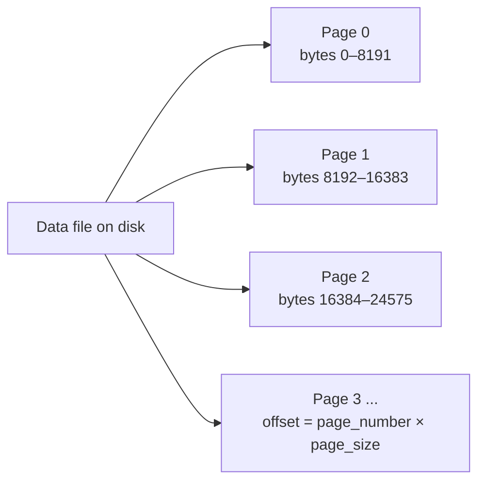

**How a page gets from disk into your query**: this is exactly the buffer pool from 9.4, shown from the page's point of view:

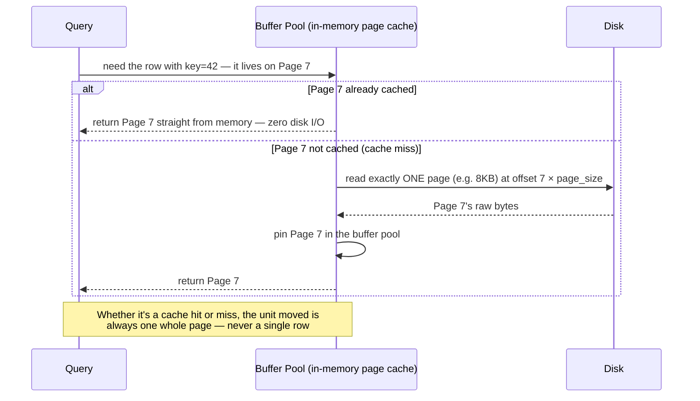

**What's actually inside a page** — the classic **slotted page** layout (this is the real, documented structure Postgres, MySQL, and SQLite all use, with minor variations):

```
Page (e.g. 8KB), laid out as one contiguous byte range:

┌───────────────┬──────────────────────┬──────────────────┬───────────────────────┐
│  Page Header  │  Slot Array (grows→) │  ... free space ...  │ ←(grows) Tuple Data │
│  page LSN,    │  [slot 1: offset,len]│                   │  tuple 3's raw bytes  │
│  checksum,    │  [slot 2: offset,len]│                   │  tuple 2's raw bytes  │
│  page type,   │  [slot 3: offset,len]│                   │  tuple 1's raw bytes  │
│  free-space   │  ...                 │                   │                       │
│  pointers     │                      │                   │                       │
└───────────────┴──────────────────────┴──────────────────┴───────────────────────┘
```

- **Page header**: fixed-size metadata — critically, the **page LSN** (the log sequence number of the last WAL record that touched this page, exactly what ARIES's redo phase in [9.4 §3](9.4%20Write-Ahead%20Logging%20and%20Crash%20Recovery.md) compares against), a checksum, and pointers marking where free space starts/ends.
- **Slot array** (a.k.a. line pointers / item pointers): a small array of `(offset, length)` pairs, one per row stored on the page, growing forward from just after the header. This indirection is what lets a row be moved around *within* the page — compacted, resized — without changing any external reference to it (Postgres's row identifier, the `ctid`, is literally `(page_number, slot_number)`).
- **Free space**: the gap in the middle. As rows are inserted, the slot array grows from one end and the tuple data grows from the other; they meet when the page is full — that's the moment a page split (§2) is triggered.
- **Tuple data**: the actual row bytes, packed in from the *end* of the page backward.
- **Internal (non-leaf) B-Tree pages** use this same layout, just storing separator keys + child page numbers as their "tuples" instead of row data — a B-Tree internal page and a B-Tree leaf page are the same physical structure serving two different logical roles.

**Page size is itself a trade-off**: bigger pages amortize disk-seek overhead better for range scans (one I/O reads more rows) but waste bandwidth on a point lookup that only needed one row out of the page, and make write amplification worse (a 1-byte change still rewrites the whole page). Smaller pages do the opposite. Postgres defaults to 8KB, InnoDB to 16KB (configurable down to 4KB or up to 32/64KB) — both are long-standing sweet spots for OLTP; OLAP/columnar engines often go much larger since they're built for scans, not point lookups.

**A real gotcha worth naming: double buffering.** Because pages are just chunks of a file, the OS's own filesystem page cache is *also* happy to cache them — independently of whatever the database's own buffer pool is doing:

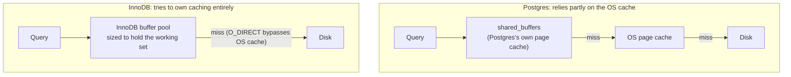

Postgres deliberately keeps `shared_buffers` moderate (a common guideline is ~25% of RAM) and leans on the OS page cache for the rest — meaning a given page can genuinely be cached **twice**, once in each layer, wasting RAM. InnoDB instead sizes its own buffer pool large (commonly 70–80% of RAM) and opens data files with `O_DIRECT` specifically to skip the OS cache and avoid that duplication. Neither is "correct" — it's a real, named design trade-off (how much caching logic to build yourself vs. delegate to the OS), and naming it by name (double buffering) is a strong signal that you understand storage below the "index structure" level.

---

## 2. B-Trees — the default for decades

### Structure
A B-Tree is a balanced tree of fixed-size **pages** (typically 4KB–16KB, matching disk block size — see §1.1 for what's physically inside one). Each internal page holds sorted keys and pointers to child pages; leaf pages hold the actual data (or pointers to it). Lookups descend from root to leaf in `O(log n)` page reads.

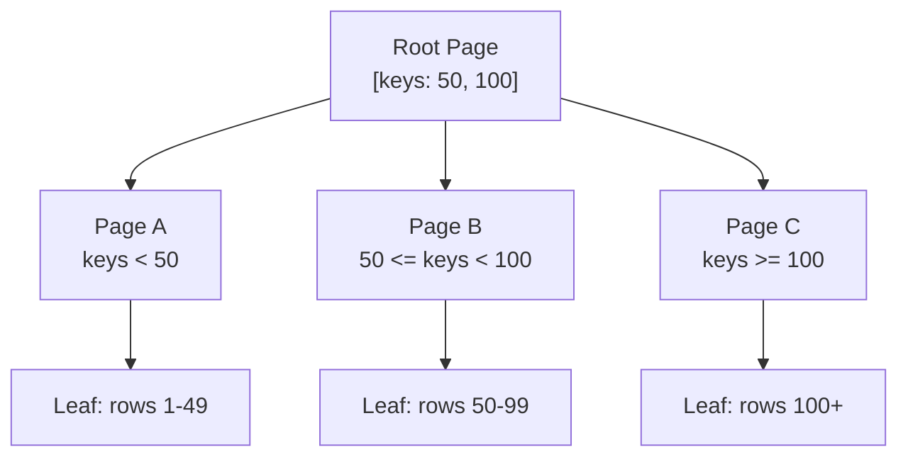

### How writes work
An update modifies the value **in place**, inside the specific leaf page that holds it. If a page fills up, it **splits** into two pages, and the split propagates up to the parent (possibly cascading all the way to the root — this is what "tree rebalancing" means in practice).

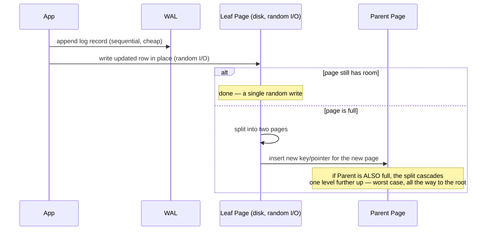

**The split itself, before/after** — this is the picture to draw when asked "what happens when a B-Tree page fills up":

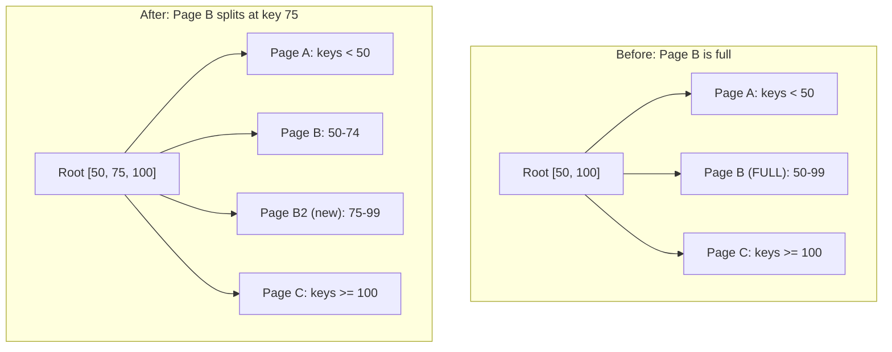

The root gained a new key (75) and a new child pointer — that's the "propagates up to the parent" step made concrete. If the root itself were full, this exact process would repeat one level higher.

### The write cost: write amplification
A single logical write (change one row) can trigger: a WAL entry (see [9.4](9.4%20Write-Ahead%20Logging%20and%20Crash%20Recovery.md)) + a random-I/O write to the specific data page + potentially a page split cascading through multiple ancestor pages. This multiplies the actual bytes written to disk relative to the logical bytes changed — **write amplification**.

### Strengths
- **Excellent read performance**, especially point lookups and range scans — data is always stored in sorted order in place, one tree traversal away.
- **Mature, well-understood, transactional-friendly** — decades of engineering (locking, MVCC integration) built around this structure.

### Weaknesses
- Writes require random I/O (updating pages scattered across disk) — expensive, especially on spinning disks (less so, but still nontrivial, on SSDs due to erase-block behavior).
- Page splits and fragmentation over time can leave pages partially empty, wasting space until a maintenance operation (e.g., Postgres's `VACUUM FULL`, index rebuilds) reclaims it.

### Who uses it
PostgreSQL, MySQL (InnoDB — a **clustered index** B+Tree where the leaf pages *are* the actual row data, keyed by primary key), SQL Server, Oracle, SQLite, most traditional RDBMS.

---

## 3. LSM-Trees — optimized for write-heavy workloads

### Core idea
**Never do random writes.** Turn every write into a **sequential append**, and periodically merge/reorganize the accumulated data in the background.

### Structure and write path

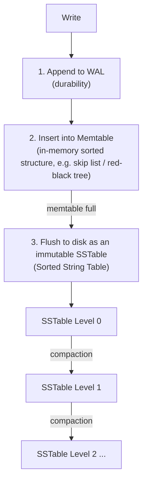

1. **Write path**: append to the WAL for durability, then insert into an in-memory sorted structure called the **memtable**.
2. When the memtable reaches a size threshold, it's flushed to disk as an **SSTable** (Sorted String Table) — an immutable, sorted, sequential file. "Immutable" is the key word: once written, an SSTable is never modified, only eventually deleted after being merged elsewhere.
3. Over time, many small SSTables accumulate. A background process called **compaction** merges them into fewer, larger SSTables, discarding overwritten/deleted values (tombstones) along the way.

### 3.1 What exactly *are* a "memtable" and an "SSTable"?

Same exercise as pages (§1.1) for the other half of this file — "memtable" and "SSTable" get used constantly above; here's what's actually inside each.

**The memtable — a sorted buffer that lives entirely in RAM:**

- **What it stores**: recent writes as `key → value` (or `key → tombstone`) pairs, kept **sorted by key at all times** — that's the entire point of it. Because it's already sorted, flushing it to disk later requires no extra sort pass; the file is written out in the order the structure already maintains.
- **Data structure**: almost always a **skip list** (RocksDB, Cassandra) or a balanced tree — both give `O(log n)` insert and lookup and, critically, an easy way to iterate keys in sorted order for the eventual flush. A skip list is preferred in practice because it's simpler to make concurrent (lock-free reads while a write is in progress) than a balanced tree is.

**A closer look — what a skip list actually is, since "why not just use a balanced tree" is the natural follow-up question:**

A skip list is a **stack of increasingly sparse linked lists**, all sharing the same sorted key order. The bottom level holds *every* key, like a plain sorted linked list. Each level above it holds only a random subset of the keys below it — each node "flips a coin" when inserted to decide how many levels it gets promoted into (stop at the first tails). The result: a small number of high-level "express lanes" that let a search skip over large chunks of the list at once, instead of walking it one node at a time.

```
Level 3:  HEAD ─────────────────────────────► 50 ───────────────────────────────────► NIL
Level 2:  HEAD ───────────────► 30 ────────── 50 ─────────────► 80 ─────────────────► NIL
Level 1:  HEAD ───────► 10 ─── 30 ──────► 40  50 ──────► 60 ─── 80 ─────────► 90 ────► NIL
Level 0:  HEAD ─► 5 ─► 10 ─► 20 ─► 30 ─► 40 ─► 50 ─► 60 ─► 70 ─► 80 ─► 85 ─► 90 ─► 95 ─► NIL
```

Every key exists at Level 0; only some also exist one level up; fewer still exist two levels up — the taller a node's "tower," the rarer it is, purely by chance.

**Search algorithm**: start at the top-left. At the current level, move right as long as the next node's key is still ≤ the target; the moment moving right would overshoot, **drop down one level** and repeat, all the way down to Level 0. Searching for key **80**:

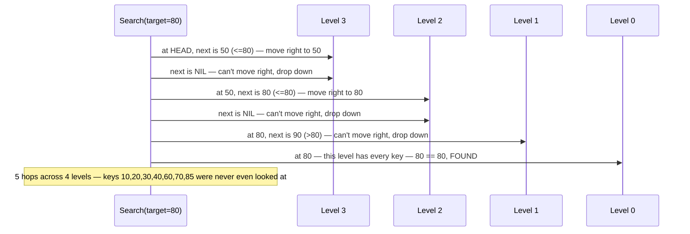

**Why this is `O(log n)` expected time**: with a promotion probability of `p` (commonly 1/2), roughly a `p` fraction of each level's keys get promoted to the level above it, so the list needs about `log_(1/p) n` levels before you're down to O(1) keys at the top — and the search does roughly constant work per level. It's *expected*, not *guaranteed* like a balanced tree's worst case, because promotion is random — but with real promotion probabilities, the odds of a pathologically bad skip list are astronomically small in practice. Expected pointers per node is a small constant (`1/(1-p)`, e.g. 2 for p=1/2), so space overhead stays `O(n)`, not `O(n log n)`.

**Insert/delete**, and why this beats a balanced tree for a memtable specifically: inserting means running the same search to find the splice point at each level the new node was randomly promoted into, then linking it in — a handful of pointer writes, no cascading restructure. A red-black or AVL tree insert can trigger **rotations** that touch and re-link several nodes at once to keep the tree balanced, which is exactly the kind of multi-node, all-or-nothing mutation that's hard to make safe for concurrent lock-free readers. A skip list insert, by contrast, is just a handful of independent forward-pointer swaps, one per level:

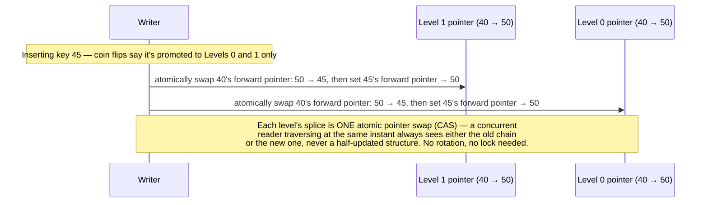

This is *the* reason skip lists show up specifically wherever high write-concurrency and sorted iteration both matter: RocksDB's default memtable representation (`SkipListRep`), Redis's sorted sets (`ZSET`, paired with a hash table for O(1) score lookup by member), and Java's `ConcurrentSkipListMap`/`ConcurrentSkipListSet` all use one for exactly this reason.

- **Where it lives, and what "durable" means here**: purely in-memory — a process crash wipes it instantly. It is **not** the memtable that makes a write durable; the WAL entry written *before* the memtable insert is what survives a crash (§1 of [9.4](9.4%20Write-Ahead%20Logging%20and%20Crash%20Recovery.md)). On restart, the memtable is rebuilt by replaying the WAL since the last flush — the memtable is a performance structure, not a durability one.
- **Active vs. immutable**: real engines don't flush the one memtable writes are going into — that would stall writes for the whole flush duration. Instead, once the active memtable fills up, it's frozen as **immutable** (still readable, never written to again) and a **brand-new** active memtable immediately starts taking writes, while a background thread flushes the immutable one to disk at its own pace:

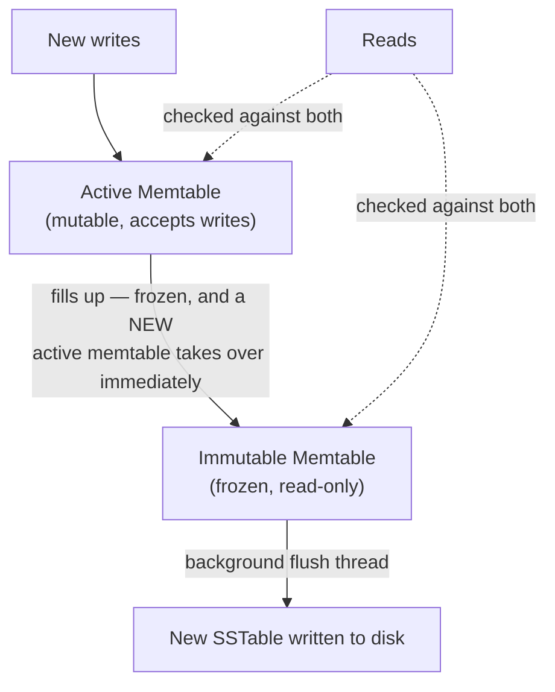

**The SSTable — an immutable, sorted file with its own internal index:**

Once flushed, an SSTable is not just "a sorted list of key-value pairs" — it has its own internal structure so a reader never has to scan the whole file to find one key:

```
SSTable file on disk, in order:

┌─────────────────────┬─────────────────────┬─────┬─────────────────────┐
│ Data Block 1         │ Data Block 2         │ ... │ Data Block N         │
│ sorted k/v pairs,     │ sorted k/v pairs,     │     │ sorted k/v pairs,     │
│ compressed            │ compressed            │     │ compressed            │
├─────────────────────┴─────────────────────┴─────┴─────────────────────┤
│ Bloom Filter Block — "might this file contain key K?" bitmap           │
├─────────────────────────────────────────────────────────────────────────┤
│ Index Block — sparse index: first key of each Data Block → its offset  │
├─────────────────────────────────────────────────────────────────────────┤
│ Footer — fixed-size trailer with pointers to the Index and Bloom blocks│
│          (this is the ONLY part read at a known, fixed position)       │
└─────────────────────────────────────────────────────────────────────────┘
```

- **Data blocks**: the actual sorted, usually-compressed key-value pairs, grouped into fixed-size chunks (a few KB each) — this is the unit actually read off disk, analogous to a B-Tree page (§1.1), except an SSTable data block's *file offset* isn't computable by simple arithmetic (blocks compress to different sizes), which is exactly why the index block exists.
- **Bloom filter block**: the same Bloom filter from the read-path discussion above, physically stored with the file (and typically kept resident in memory across reads since it's small relative to the data).
- **Index block**: a **sparse** index — not one entry per key, one entry per *data block* (its first key → its byte offset) — small enough to load fully into memory and binary-search to find which single data block could contain a given key.
- **Footer**: a small, fixed-size trailer at a known position (the very end of the file) — read first, on open, purely to bootstrap "where do the index and Bloom filter blocks live."

**How a read actually walks one SSTable:**

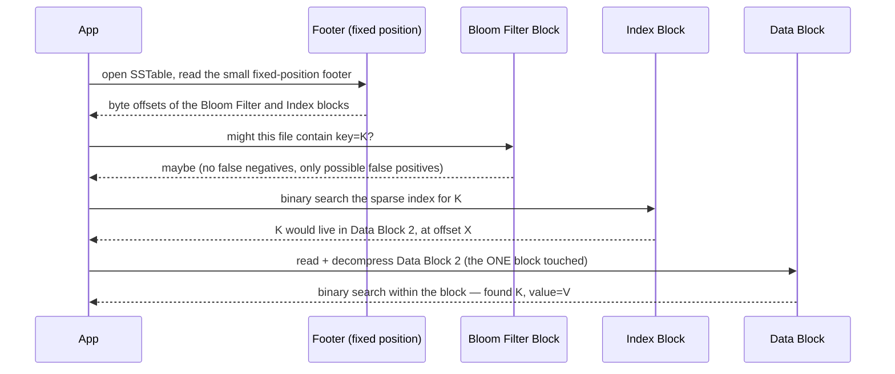

Notice the parallel to §1.1: a page's offset is pure arithmetic (`page_number × page_size`), while an SSTable's index block exists *because* that arithmetic doesn't work once blocks are individually compressed to different sizes — the index is what stands in for the offset math a B-Tree gets for free.

### The read path — the cost of this design
A read for a given key might need to check: the memtable, then potentially **multiple SSTables** (since the key could have been written at different times, into different files, and the newest value wins) — until it finds the key or exhausts all SSTables. This is **read amplification**: one logical read can become many physical file reads.

**Mitigation: Bloom filters.** Each SSTable keeps a compact **Bloom filter** — a probabilistic data structure that can definitively say "this key is definitely NOT in this SSTable" (no false negatives) or "this key MIGHT be in this SSTable" (possible false positives, tunable rate). Checking a Bloom filter is cheap (in-memory), so the read path uses it to skip SSTables that certainly don't contain the key, dramatically cutting down which SSTables actually need a disk read.

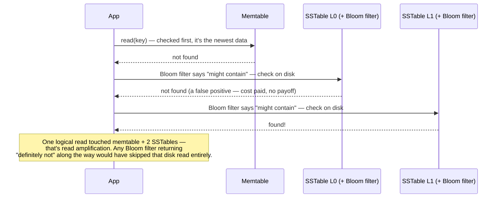

### Compaction strategies
| Strategy | Idea | Trade-off | Used by |
|---|---|---|---|
| **Size-tiered compaction** | Merge SSTables of similar size together once there are enough of them | Higher space amplification (multiple versions of a key can coexist longer across differently-sized tiers) but lower write amplification | Cassandra (default) |
| **Leveled compaction** | Organize SSTables into levels (L0, L1, L2...) with each level ~10x larger than the last; merge a file from level N into overlapping files at level N+1 | Lower space amplification and better read performance (fewer SSTables to check per key at higher levels) but higher write amplification (data gets rewritten more times across its lifetime) | RocksDB (default), LevelDB, Cassandra (optional) |

**What compaction actually does to the files** — merge, keep only the newest version per key, drop anything tombstoned:

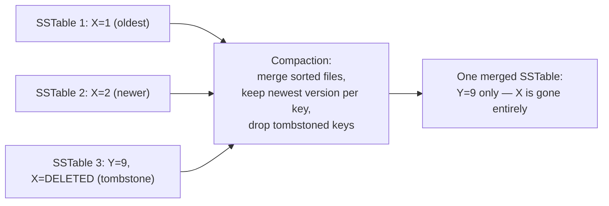

### 3.2 The tombstone gotcha — deleted data reappearing

A delete in an LSM-Tree isn't a removal, it's **a write** — a special marker (**tombstone**) saying "this key is deleted as of this point." The tombstone has to stick around and outlive every older version of that key across every SSTable, so that compaction knows to discard them all. If compaction ever discards the *tombstone* before it has discarded every older *value* it was supposed to shadow, the old value comes back from the dead:

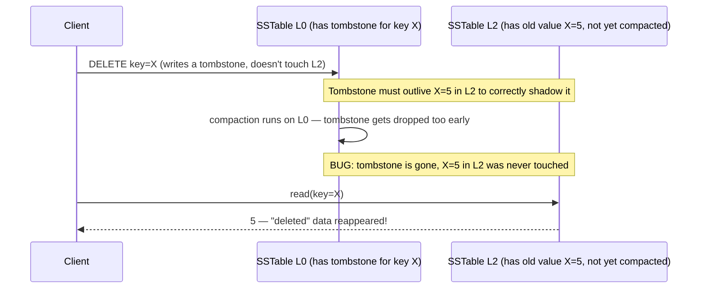

This is a real, named operational failure mode in Cassandra (and why `gc_grace_seconds` exists — it's the minimum time a tombstone is kept around before it's eligible for removal, giving slower-to-compact levels time to catch up).

### The amplification triangle — the concept interviewers are really testing

Every storage engine design is a trade-off between three costs, and you can't minimize all three simultaneously:

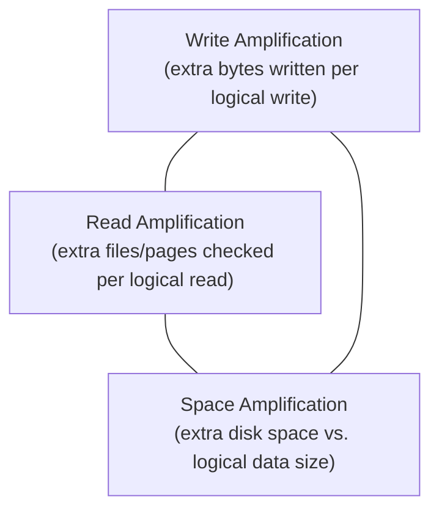

- **B-Trees**: low read amplification (one tree traversal), low space amplification (data stored once, in place), but higher random-write cost per logical write.
- **LSM-Trees (size-tiered)**: low write amplification, but higher read and space amplification.
- **LSM-Trees (leveled)**: balances read/space amplification down at the cost of higher write amplification than size-tiered.

**Interview soundbite**: *"There's no free lunch here — you're always trading write cost against read cost against space cost. LSM-trees make that trade explicitly and tunably (via compaction strategy); B-trees make a different, more fixed trade favoring reads."*

### Worked example: the same write-heavy workload through both engines, with real numbers

Take a concrete ingestion workload — a metrics/events pipeline writing **50,000 rows/sec**, ~200 bytes each, into a table that's already grown past what fits in RAM (so a B-Tree leaf write is, worst case, a real disk I/O, not a buffer-pool hit). A typical NVMe SSD gives roughly **10,000–20,000 random 4KB write IOPS** but **500 MB/s+ of sequential write throughput** — that gap is the entire reason these two structures exist.

- **Through a B-Tree**: each row write touches one leaf page. Since the table doesn't fit in cache, that page is frequently not resident, so the write costs one random read (page miss) + one random write (eventual dirty-page flush) — call it ~1–2 random IOPS per row, before even counting page splits cascading into ancestor pages. At 50,000 rows/sec that's **50,000–100,000 random IOPS/sec sustained** — 3–5x more than a single high-end NVMe drive can do, meaning this workload alone pins the disk and starts queueing, before read traffic even enters the picture.
- **Through an LSM-Tree**: every row is only ever appended — to the WAL, and to the in-memory memtable (a skip list, §3.1). Zero random disk I/O on the hot write path. With a 64MB memtable threshold, at 200 bytes/row and 50,000 rows/sec, it fills in `64MB / (200B × 50,000/s) ≈ 6.4s`, and each flush is one **sequential** 64MB write — about `64MB / 6.4s ≈ 10 MB/s`, roughly 2% of one SSD's sequential bandwidth. Compaction adds background rewrites on top (the write-amplification cost above); even a leveled-compaction amplification factor of 10x only pushes this to ~100MB/s — still comfortably inside what one SSD does sequentially, let alone the fleet that'd be needed to *randomly* absorb the same load.

**The punchline**: the same 50,000 writes/sec is disk-bound and barely feasible on a B-Tree, and a rounding error on an LSM-Tree — not because the LSM-Tree does less total work (compaction rewrites data multiple times over its life; more total bytes hit disk), but because *every byte it writes is sequential*, and sequential throughput on identical hardware is 25–50x higher than random IOPS. This is the concrete arithmetic behind "why did Meta move to MyRocks" (§5) and "why is Cassandra fast at writes" — not a vague appeal to "LSM-Trees are optimized for writes."

---

## 4. Head-to-head comparison

| | B-Tree | LSM-Tree |
|---|---|---|
| Write pattern | In-place random writes | Sequential appends + background compaction |
| Write throughput | Lower (random I/O bound) | **Higher** (sequential I/O, batched) |
| Read throughput (point lookup) | **Higher** — one tree traversal | Lower — may check memtable + multiple SSTables (mitigated by Bloom filters) |
| Range scans | **Excellent** — data stored in sorted order in place | Good, but must merge across multiple sorted SSTables |
| Space overhead | Lower — no duplicate versions lying around (aside from normal MVCC bloat) | Higher — old/overwritten versions persist until compaction runs |
| Write amplification | Moderate (page splits, WAL) | Tunable via compaction strategy |
| Delete handling | Straightforward, in place | **Tombstones** — a delete is itself a write (a marker) that must survive until compaction physically removes the data; deleted data can "come back" if a tombstone is compacted away before all older versions are, a real operational gotcha in Cassandra (see §3.2) |
| Best for | Read-heavy, mixed read/write, transactional workloads | **Write-heavy** workloads: logging, time-series ingestion, event streams, wide-column stores |

---

## 5. Who uses which — the name-drop table

| Database | Storage engine | Structure |
|---|---|---|
| **PostgreSQL** | Custom heap + B-Tree indexes | B-Tree |
| **MySQL (InnoDB)** | InnoDB | B+Tree (clustered index) |
| **MySQL (MyRocks — used at Facebook/Meta)** | RocksDB under the hood | **LSM-Tree** — Meta migrated much of their MySQL fleet to this to cut storage costs via better compression and lower write amplification at scale |
| **Cassandra** | Custom LSM engine | LSM-Tree (size-tiered or leveled compaction, configurable per table) |
| **HBase / Bigtable** | Custom LSM engine (the design LSM-trees were popularized by) | LSM-Tree |
| **RocksDB / LevelDB** | (the engines themselves) | LSM-Tree — embedded, used as a building block inside Kafka Streams, CockroachDB (Pebble, a Go rewrite of RocksDB's ideas), TiKV, MyRocks |
| **SQLite** | Custom B-Tree | B-Tree |
| **MongoDB (WiredTiger engine)** | WiredTiger | B-Tree by default, LSM-Tree mode also available |

---

## 6. How to identify this topic in an interview

- "This workload is write-heavy — logging/metrics/event ingestion at huge volume" → LSM-Tree engine (Cassandra, RocksDB-backed store) — name write amplification as the reason B-Trees underperform here.
- "We need fast range scans and point lookups, moderate write volume" → B-Tree (Postgres/MySQL).
- "Why is Cassandra fast at writes but sometimes slow/wasteful on reads for a key that's been updated many times?" → LSM read amplification, mitigated by Bloom filters and compaction — mention tombstones if deletes come up.
- "Why did Meta rewrite their MySQL storage engine (MyRocks)?" → to trade B-Tree's higher write amplification and worse compression for LSM-Tree's better write throughput and storage efficiency at Facebook-scale write volume — a great, concrete real-world namedrop.
- If someone asks "how would you speed up reads in an LSM-based store" → Bloom filters (skip SSTables that don't have the key), leveled compaction (fewer SSTables per key at steady state), or a read-through cache in front of the engine.
- "What actually gets read off disk when I fetch one row?" → not the row — a whole **page** (§1.1); this is the question that separates candidates who've memorized index names from candidates who understand storage.
- "What's actually inside a memtable, and what makes an SSTable searchable without scanning the whole file?" → memtable is a sorted in-memory skip list (§3.1); an SSTable carries its own sparse index + Bloom filter block so a read touches exactly one data block, not the whole file.
- "Why a skip list instead of a balanced tree for the memtable?" → both are `O(log n)`, but a skip list's insert is a handful of independent pointer swaps (one per level) instead of a balanced tree's cascading rotations — that's what makes it dramatically easier to implement lock-free for concurrent writers (§3.1).
- If asked to actually justify "LSM is better for writes" with numbers instead of a slogan → the worked example in §3 (50K writes/sec: ~50-100K random IOPS on a B-Tree vs. ~10MB/s sequential flush throughput on an LSM-Tree) is the concrete version of that claim.

**As a routing diagram** — match the workload/question to the engine before naming the mechanism:

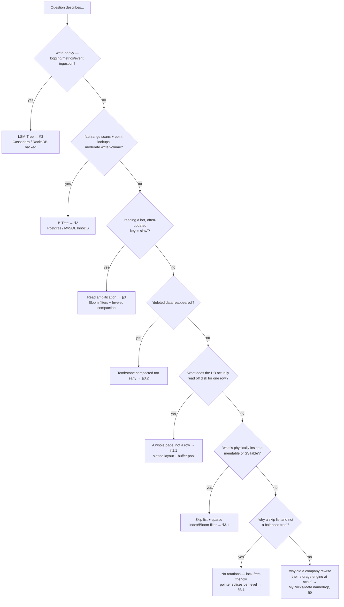

---

## Interview Cheat Sheet — Storage Engines

- A **page** (§1.1) is the fixed-size unit (4–16KB) of ALL disk I/O — the DB never reads/writes a single row, only whole pages. A file is just pages back-to-back; `offset = page_number × page_size` gives O(1) seeks.
- Inside a page: **slotted layout** — header (incl. page LSN, the thing ARIES's redo phase checks), a slot array of `(offset, length)` pointers, free space, and tuple data growing in from the other end. The slot array indirection is what lets Postgres's `ctid` stay stable while a row shifts within the page.
- **Double buffering** is a real, namedroppable trade-off: Postgres caches pages in both `shared_buffers` and the OS page cache (same bytes, twice); InnoDB uses `O_DIRECT` to bypass the OS cache and own caching entirely via its buffer pool.
- A **memtable** (§3.1) is a sorted, in-memory-only structure (usually a skip list) that buffers recent writes — it's a performance structure, not a durability one; the WAL is what actually survives a crash, and the memtable gets rebuilt by WAL replay. Real engines split it into an active (writable) and immutable (frozen, flushing) memtable so writes never stall on a flush.
- A **skip list** (§3.1) is a stack of increasingly sparse sorted linked lists — every key at the bottom level, a random subset promoted to each level above, giving `O(log n)` expected search by "move right, drop down when you'd overshoot." Preferred over a balanced tree for a memtable because insert is a handful of independent per-level pointer swaps (no rotations), which is dramatically easier to make lock-free for concurrent writers. Same reason Redis `ZSET`, RocksDB's default memtable, and Java's `ConcurrentSkipListMap` all use one.
- An **SSTable** (§3.1) isn't just a sorted file — it carries its own footer, sparse index block, and Bloom filter block, so a point read touches exactly one data block instead of scanning the file. The index exists because compressed blocks don't sit at arithmetic offsets the way B-Tree pages do.
- Both structures exist because **sequential disk I/O is far cheaper than random disk I/O** — they just make opposite bets about which operation (read vs. write) gets to be the sequential one.
- Put in real numbers: a write-heavy workload that needs ~50K random IOPS/sec (impossible on one SSD) can collapse to ~10MB/s of sequential flush throughput on an LSM-Tree — same rows, same total bytes eventually written, but random vs. sequential is a 25-50x throughput gap on identical hardware. That arithmetic, not a vague "LSM is optimized for writes," is what should come out of your mouth when asked why.
- **B-Tree**: in-place random writes, one-traversal reads, excellent range scans. Default for OLTP/RDBMS (Postgres, MySQL/InnoDB, SQLite, Oracle, SQL Server).
- **LSM-Tree**: sequential writes (WAL → memtable → immutable SSTable), reads may need to check multiple SSTables (mitigated by **Bloom filters**), reorganized in the background via **compaction** (size-tiered = cheaper writes/more space; leveled = cheaper reads/space at the cost of more write amplification). Default for write-heavy/wide-column stores (Cassandra, HBase, Bigtable, RocksDB).
- The **amplification triangle** (write / read / space) is the unifying mental model — no engine minimizes all three; know which one each design sacrifices.
- Deletes in LSM-Trees are **tombstones**, not immediate removals — mention this if asked about delete semantics or "deleted data reappearing" bugs.
- Real migrations (MyRocks at Meta) are concrete proof this isn't academic — companies actively re-engineer their storage engine choice as write volume scales.
