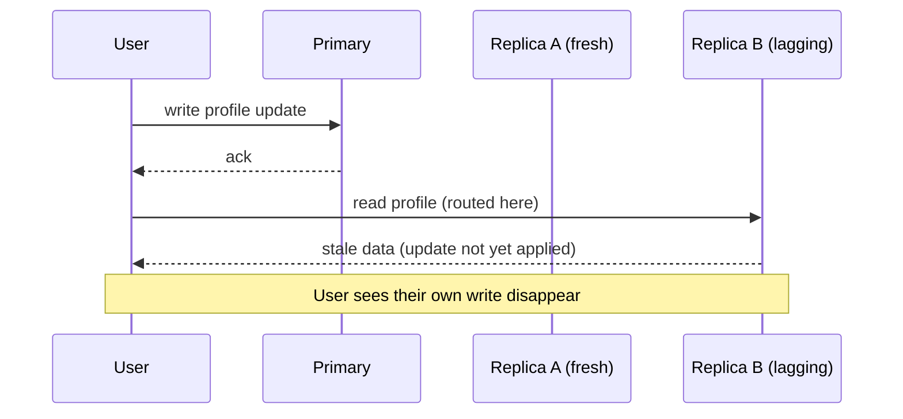
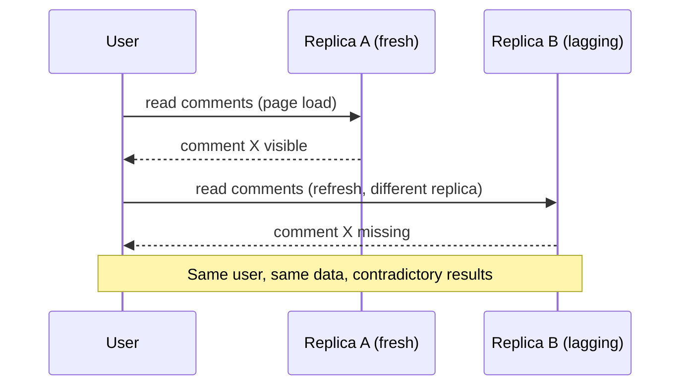
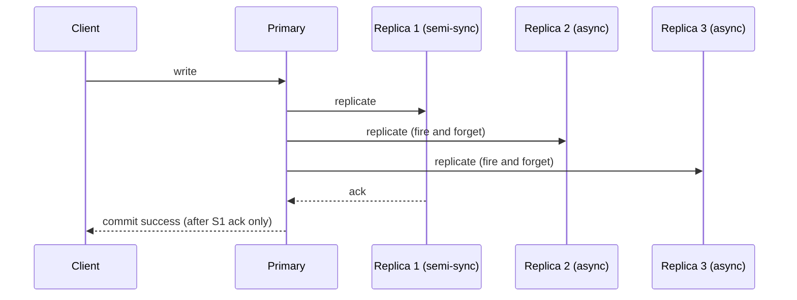
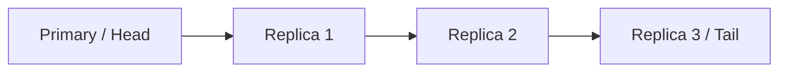
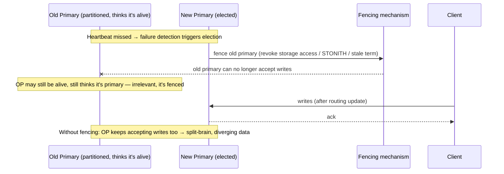
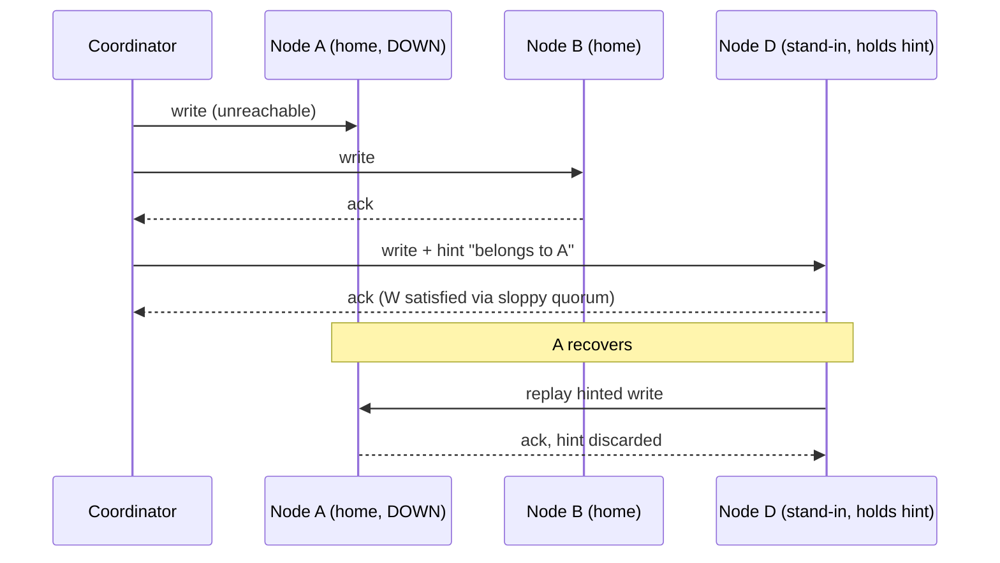
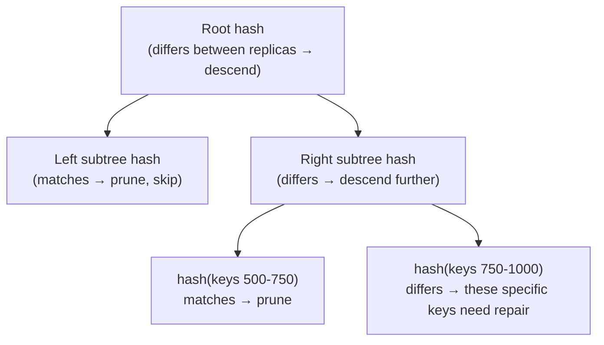
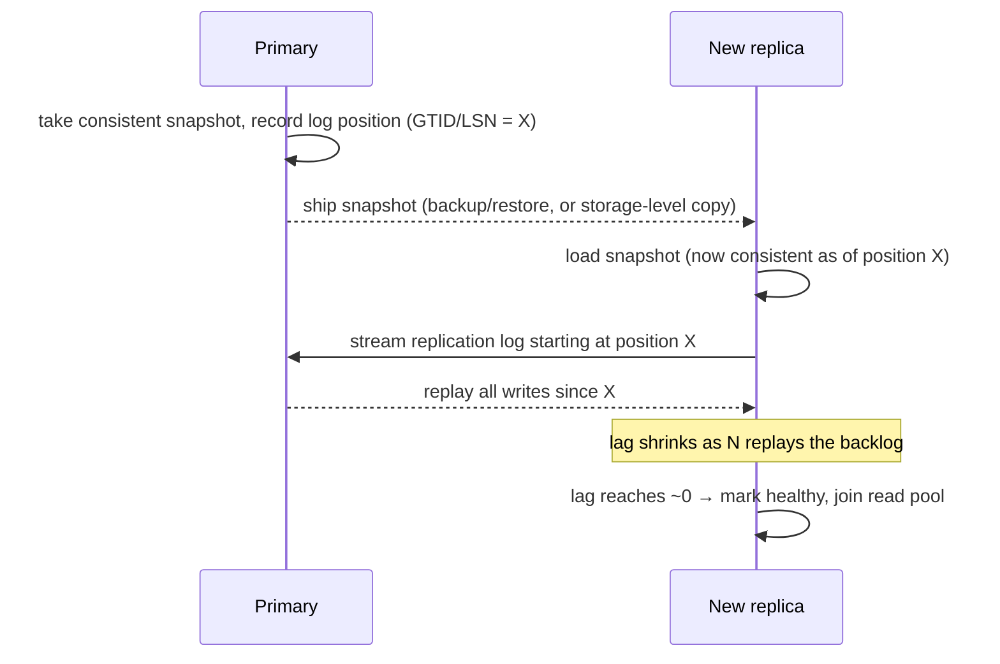
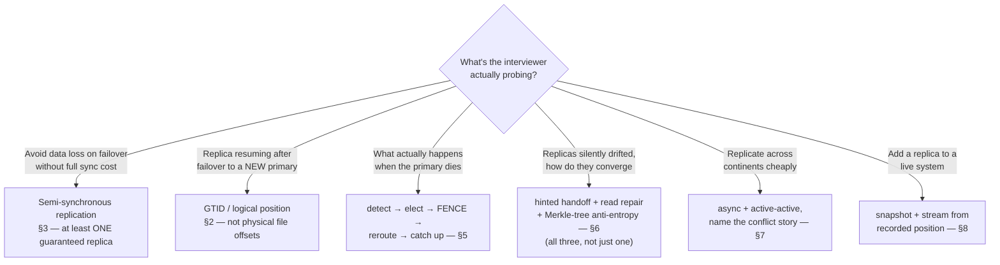

# 9.6 Replication — Deep Dive

> [Databases-FAANG-Guide.md](Databases-FAANG-Guide.md) §3 covered the fundamentals: sync vs. async, the three topologies (single-leader, multi-leader, leaderless), the three log-shipping methods, and quorums. This file goes past the fundamentals into what actually breaks in production — replication lag, failover mechanics, and the specific anti-entropy machinery Dynamo-style systems use to stay eventually consistent without losing data.

---

## 1. Replication lag — the problem that dominates real operational life

Async replication (the common case, since sync replication's latency cost is often unacceptable) means secondaries are **always somewhat behind** the primary. "Somewhat behind" is usually milliseconds, but under load, network issues, or a slow secondary, it can spike to seconds or minutes — and that's when the session-consistency violations from [9.3 §5](9.3%20Consistency%20Models.md) start showing up as real user-facing bugs.

### Concrete failure modes and their fixes

| Symptom | Root cause | Fix |
|---|---|---|
| User updates profile, refreshes, sees old data | Read hit a lagging replica (read-your-writes violation) | Route the acting user's reads to the primary (or a replica guaranteed caught-up) for a short window after their write; or have the client carry a "read at least version N" token |
| A comment disappears on refresh | Second read hit a *more* lagging replica than the first (monotonic-reads violation) | Sticky session routing — pin a client to the same replica for the duration of its session |
| Replica falls further and further behind under load | Replica can't apply changes as fast as primary produces them (often because single-threaded apply vs. multi-threaded writes on primary) | Parallel/multi-threaded replication apply (MySQL 5.7+ supports parallel replication by schema/transaction); scale replica hardware; reduce primary write rate |
| Failover promotes a replica that's missing recent writes | Async replication lost un-replicated writes when the primary died | Semi-synchronous replication (§3) trades a little latency to guarantee at least one replica has every committed write before ack |

### Visualizing the two most common violations

**Read-your-writes violation** — the write and the second read hit different replicas that haven't converged yet:

**Monotonic-reads violation** — two consecutive reads from the *same* user land on replicas at different lag levels, so time appears to move backward:

Both are fixed by **routing consistency** (sticky sessions or a "read at least version N" token), not by reducing lag itself — lag is unavoidable with async replication, so the fix is controlling *which* replica a given user's reads land on.

### Measuring and monitoring lag
Real systems expose lag as a first-class metric: MySQL's `Seconds_Behind_Master` (legacy) / replica lag via GTID position diff, PostgreSQL's `pg_stat_replication` (`replay_lag`, measured as both time and byte-position difference), MongoDB's `rs.printSecondaryReplicationInfo()`. **Always mention that lag is a monitored, alertable metric** — in an interview this signals you've operated these systems, not just read about them.

---

## 2. GTID vs. position-based replication (MySQL specifics, generalizable concept)

Older MySQL replication tracked position as `(binlog file, byte offset)` — a secondary asks "give me everything after file X, offset Y." This is fragile: after a failover, the *new* primary has a different binlog file/offset numbering, so every other replica must be manually reconfigured to point at the new coordinates — error-prone and slow during an incident.

**GTID (Global Transaction Identifier)** assigns every transaction a globally unique ID (`server_uuid:transaction_number`) at commit time. Replicas track "which GTIDs have I already applied" instead of a raw file offset. After a failover, a replica can ask any new primary "give me everything after GTID set S" — the new primary computes the answer regardless of its own local binlog numbering. **This is the generalizable lesson**: replication position should be tracked by a **logical, portable identifier**, not a **physical, source-specific coordinate** — the same principle shows up in Kafka (consumer offsets are logical per-partition sequence numbers, not "byte offset in this specific broker's file").

---

## 3. Semi-synchronous replication — the practical middle ground

Pure synchronous replication (wait for ALL replicas) kills availability the moment any replica hiccups. Pure asynchronous risks losing committed writes on primary failure. **Semi-synchronous replication** is the pragmatic compromise real systems (MySQL semi-sync, PostgreSQL synchronous_standby_names with `1` in the list) actually ship:

> The primary waits for acknowledgment from **at least one** replica (not all) before acknowledging the commit to the client. All *other* replicas still replicate asynchronously.

This guarantees **at least one replica** always has every committed write — enough to survive the primary's failure without data loss, without paying the latency/availability cost of waiting for every replica. This is the answer to give when asked "how do you avoid losing data on failover without tanking write latency."

---

## 4. Chain replication

Instead of the primary replicating directly to every secondary (fan-out, which bottlenecks the primary's network/CPU as replica count grows), **chain replication** arranges nodes in a sequence: primary → replica 1 → replica 2 → replica 3. Each node only needs to replicate to the *next* node in the chain.

- **Writes** go to the head, propagate down the chain.
- **Reads** are typically served from the **tail** — the tail has, by construction, seen every update that's fully propagated through the chain, giving strong consistency for reads without burdening the head.
- Trade-off: **write latency grows with chain length** (a write must traverse every hop before being fully durable), and a mid-chain node failure requires re-linking the chain around it.

This is less commonly asked than single-leader/multi-leader/leaderless, but it's a strong answer if asked "how do you replicate without bottlenecking the primary's fan-out" — and it's the design behind systems like the original Chain Replication paper and parts of Azure Storage's replication design.

**Don't confuse it with cascading replication** — the thing MySQL/PostgreSQL actually ship in production. A cascading replica (a replica of a replica) exists purely to reduce the primary's fan-out load; it's a **tree**, not a strict chain, reads can be served from any level, and there's no tail-read strong-consistency guarantee. Chain replication is the stricter, textbook version with an explicit consistency contract at the tail — cascading replication is the pragmatic, weaker-guarantee cousin you'll actually find in the wild.

---

## 5. Failover — the mechanics interviewers push on after "what happens when the primary fails"

Failover is a multi-step process, and naming all the steps (not just "promote a replica") is what separates a strong answer:

1. **Failure detection** — usually via missed heartbeats over some timeout window. Too short a timeout → false positives (unnecessary failovers during a brief network blip); too long → extended downtime. This timeout-tuning trade-off is worth naming explicitly.
2. **Choosing a new primary** — pick the replica with the **most advanced replication position** (least data loss) — comparing GTID sets or LSNs across candidates.
3. **Fencing the old primary** — critical and often skipped in naive designs: you must ensure the old primary, if it's actually still alive (e.g., a network partition made it *look* dead but it's still serving writes), can no longer accept writes. Otherwise you get **split-brain**: two nodes both believing they're primary, both accepting writes, diverging irrecoverably. Fencing mechanisms: STONITH ("Shoot The Other Node In The Head" — literally power off/reboot the suspected-dead node), revoking its ability to write to shared storage, or a **lease/term-based** approach (as in Raft — a node only acts as leader while holding a current lease/term, and an old leader's writes are rejected once its term is stale).
4. **Reconfiguring routing** — update DNS, a proxy layer, or a service-discovery registry so clients (and other replicas) find the new primary.
5. **Catching up other replicas** — remaining replicas must now replicate from the *new* primary; GTID-based replication (§2) makes this seamless, position-based replication requires manual recalculation.

**Automation tools worth namedropping**: **Orchestrator** and **MHA** (MySQL High Availability) for MySQL, **Patroni** (built on top of etcd/Consul/ZooKeeper for distributed consensus on who's currently primary) for PostgreSQL, MongoDB's built-in **replica set elections** (uses a Raft-like protocol internally), and cloud-managed offerings (RDS Multi-AZ, Aurora) that handle all of this transparently.

**Interview soundbite**: *"Failover isn't just 'promote a replica' — the step people forget is fencing the old primary. Without it you risk split-brain, which is strictly worse than the original outage because now you have two diverging sources of truth to reconcile."*

---

## 6. Leaderless/Dynamo-style replication — the anti-entropy machinery

[Databases-FAANG-Guide.md](Databases-FAANG-Guide.md) §3 introduced quorums (`W + R > N`) as the write-conflict mechanism for peer-to-peer replication. Real Dynamo-style systems (DynamoDB's lineage, Cassandra, Riak) add three more mechanisms on top to keep replicas converged over time:

### Sloppy quorum + hinted handoff
Strict quorum (`W`/`R` counted only among the key's designated N "home" nodes) means a single down home node can block writes entirely. **Sloppy quorum** relaxes this: if a home node is unreachable, the coordinator counts a write toward `W` using the next healthy node in the preference list instead — availability over strict placement. That stand-in node accepts the write on the down node's behalf and stores a **hint**: "this write actually belongs to node X, deliver it once X is back." This is **hinted handoff** — the mechanism that makes sloppy quorum's temporary substitution safe rather than lossy.

When the down node recovers, nodes holding hints for it replay those writes to it. This keeps write availability high even when a "correct" replica is briefly unreachable, at the cost of temporary under-replication.

### Read repair
When a client reads from multiple replicas as part of satisfying `R` (or the coordinator does a background comparison), if the replicas disagree, the coordinator detects the stale replica(s) and pushes the correct, newest value to them **as a side effect of the read**. This gradually heals inconsistency for frequently-read keys without any dedicated background process — but rarely-read keys never get repaired this way, which is exactly why anti-entropy (below) exists as a backstop.

**"Newest" isn't always well-defined** — concurrent writes to different replicas can't be ordered by wall-clock time alone (clock skew). Real Dynamo-style systems detect this with **vector clocks / version vectors** ([9.3 §6](9.3%20Consistency%20Models.md)) rather than blindly picking a timestamp: if the vectors show one write causally preceded the other, take the later one; if they're concurrent (neither precedes the other), surface both as **sibling values** for the application (or client) to merge, instead of silently dropping one.

### Anti-entropy via Merkle trees
A background process that compares two replicas' entire datasets to find and fix divergence, even for keys nobody has read recently (which read repair can't help with). Doing a naive full-dataset comparison (hash every single key-value pair and compare) is prohibitively expensive at scale. Instead:

- Each replica builds a **Merkle tree**: a hash tree where each leaf is the hash of a small range of keys, and each internal node is the hash of its children's hashes, up to a single root hash summarizing the entire dataset.
- Two replicas compare their root hashes first. If they match, the datasets are identical — done in one comparison.
- If they differ, compare children recursively — only descending into subtrees whose hashes disagree, until the specific divergent key ranges are isolated.

This turns "compare a billion keys between two replicas" into "compare `O(log n)` hashes, then only transfer the actually-divergent ranges" — a huge bandwidth and CPU win. **Cassandra's `nodetool repair` is built on exactly this mechanism** — a great concrete namedrop.

---

## 7. Multi-region / active-active replication — the extra layer of pain

Everything above gets harder when replicas are spread across regions/continents rather than racks in one datacenter:

- **Latency**: cross-region round-trips are tens to hundreds of milliseconds — synchronous or even semi-synchronous replication across regions can make write latency user-visibly bad. Most multi-region designs default to **async cross-region replication**, accepting a larger potential data-loss window on a regional failure in exchange for acceptable write latency.
- **Active-active (multi-leader across regions)**: each region has its own writable primary, serving local users with low latency, replicating asynchronously to other regions — this is exactly the multi-leader topology from the foundational chapter, and it inherits the same write-write conflict problem, now with speed-of-light-induced lag making conflicts *more* likely, not less.
- **Real-world resolution strategies at this scale**: DynamoDB Global Tables (last-writer-wins by default, with newer "multi-region strong consistency" options), Cosmos DB (explicit conflict resolution policies — LWW or a custom merge procedure you register), Spanner (side-steps the whole problem by using TrueTime to give you a single global linearizable timeline instead of multiple regional leaders — the "pay for it with tightly synchronized atomic clocks + a bit of commit latency" trade-off).

**Interview framing**: *"Multi-region is where the CAP trade-off stops being theoretical — you're choosing, per write, whether to pay real cross-ocean latency for consistency (Spanner-style) or accept eventual convergence and a conflict-resolution story (DynamoDB Global Tables-style)."*

---

## 8. Bootstrapping a new replica — the "how do you even add one" question

Every mechanism above assumes replicas already exist. Interviewers sometimes ask the more basic operational question: **how do you add a new replica to a live system, at scale, without downtime or a huge write-throughput hit?** Streaming the entire history of writes from scratch is impractical — the answer is always *snapshot + catch-up*:

1. **Snapshot** the primary (or an existing replica, to avoid load on the primary) at a **known, recorded log position** — `pg_basebackup` (Postgres), Percona XtraBackup / a storage snapshot (MySQL), or an LSM-tree engine's own SSTable snapshot — while noting the GTID/LSN at snapshot time.
2. **Restore** that snapshot onto the new node.
3. **Stream forward** from the recorded position — this is exactly why GTID/logical position tracking (§2) matters here too, not just for failover.
4. **Gate traffic** — don't add the new replica to the read-serving pool (or failover-election candidate pool) until its lag reaches ~0; a freshly-joined, still-catching-up replica is exactly the "lagging replica" failure mode from §1.

**Interview soundbite**: *"You never replay history from zero — snapshot at a known position, then stream forward from there. It's the same snapshot-plus-log pattern as a database restoring from a backup, just continuous instead of one-shot."*

---

## How to identify deep replication questions in an interview

- "How do you avoid losing data on failover, without waiting for every replica?" → semi-synchronous replication (at least one guaranteed replica).
- "How does a replica know where to resume after a failover to a *different* new primary?" → GTID / logical position tracking, not physical file offsets.
- "What's the actual failover sequence, and what goes wrong if you skip a step?" → detect → elect → **fence** (name split-brain explicitly) → reroute → catch up stragglers.
- "How do Dynamo/Cassandra-style systems repair replicas that silently drifted apart?" → sloppy quorum + hinted handoff (short-term), read repair (opportunistic, per-read), anti-entropy via Merkle trees (systematic background sweep) — all three, not just one.
- "How would you replicate across continents without killing write latency?" → async replication, likely active-active/multi-leader, and be ready to discuss the conflict-resolution consequence.
- "How do you add a new replica without downtime?" → snapshot at a known log position, then stream forward from there — never replay from zero.

---

## Interview Cheat Sheet — Replication Deep Dive

- Replication lag is the dominant real-world failure mode of async replication — know the fixes: sticky routing for read-your-writes/monotonic-reads, semi-sync for no-data-loss failover, parallel apply for keeping up under load.
- **GTID** (logical, portable transaction IDs) beats **binlog position** (physical, source-specific coordinates) for surviving failover cleanly — this "logical over physical" lesson generalizes beyond MySQL.
- **Semi-synchronous replication** = wait for ONE replica's ack, not all — the practical middle ground between sync (safe but slow/fragile) and async (fast but risks data loss).
- **Chain replication**: primary → replica → replica in sequence; reads from the tail get strong consistency without loading the head; write latency grows with chain length. **Cascading replication** (real MySQL/Postgres feature) is the weaker cousin — a tree for fan-out reduction, no tail-read guarantee.
- Failover = detect → elect (most caught-up replica) → **fence the old primary (prevents split-brain — the step people forget)** → reroute clients → catch up remaining replicas. Name Patroni/Orchestrator/MHA or built-in replica-set elections (MongoDB) as real tooling.
- Dynamo-style anti-entropy is **three mechanisms, not one**: sloppy quorum + hinted handoff (write-time, for temporarily-down nodes), read repair (read-time, opportunistic — use vector clocks, not wall-clock time, to detect true "newest"), Merkle-tree anti-entropy (background, systematic, `O(log n)` comparison cost via hash tree pruning).
- Multi-region replication makes CAP concrete: pay real cross-region latency for strong consistency (Spanner/TrueTime) or accept async replication + an explicit conflict-resolution policy (DynamoDB Global Tables, Cosmos DB).
- **Bootstrapping a new replica** = snapshot at a known log position (GTID/LSN), restore, then stream forward from that position — never replay history from zero; gate it out of the read/election pool until lag ≈ 0.
