# 9.7 Partitioning and Sharding — Deep Dive

> **Enhancement notes:** This pass found the file already strong on shard-key selection, hot partitions, cross-shard queries/transactions, and dual-write resharding — those sections were left largely untouched. Added: (1) a generic shard-key decision flowchart (§1, before the detailed properties list) to complement the existing ride-hailing worked example; (2) a new side-by-side comparison of all four partitioning strategies — range/hash/consistent-hash/directory — with a table, a 3-way visual diagram, and the concrete data-movement numbers (naive `hash mod N` moves ~(N-1)/N of keys vs. ~1/N for consistent hashing, worked through a 10→11 node example); (3) a CDC-based copy-then-cutover alternative to dual-write resharding (§4), for migrations that can't touch application code; (4) illustrative traffic-skew numbers on the celebrity-hotspot example; (5) recall-list and cheat-sheet updates to cover the new material. Section order and existing diagrams/tone are unchanged.

> [Databases-FAANG-Guide.md](Databases-FAANG-Guide.md) §4 covered vertical/horizontal sharding, key-range vs. hash sharding, consistent hashing, rebalancing strategies, and secondary-index partitioning. This file covers the parts that actually bite in production: choosing a shard key well, fixing a hot shard after the fact, and migrating a live system to a new shard scheme without downtime.

---

## 1. Choosing a shard key — the decision that's nearly impossible to undo later

The shard key determines which node owns which rows. Get it wrong and you're stuck with cross-shard queries, hotspots, or an expensive re-sharding migration (§4). This is worth spending real interview time on rather than rushing past.

#### 🆕 Shard-key decision flowchart (quick recall, before the details)

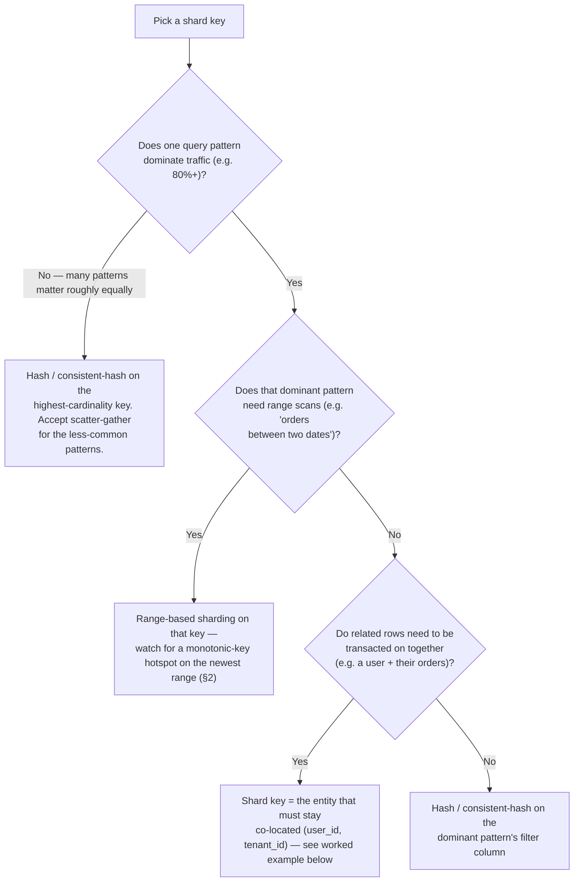

This is the fast version to recite; the worked example below shows the messier reality — three competing query patterns, and only one shard key to give.

### Properties of a good shard key
- **High cardinality** — enough distinct values to spread across many shards (a boolean `is_active` column is a terrible shard key; a `user_id` is a good one).
- **Even access distribution** — not just even *storage* distribution, but even *query load* distribution. A shard key can have high cardinality and still be hot if traffic concentrates on a few values (see §2).
- **Aligns with your dominant query pattern** — if 90% of queries filter by `user_id`, shard by `user_id` so those queries hit exactly one shard. If you shard by something else, every such query becomes a scatter-gather across all shards.
- **Supports your consistency/transaction boundary** — if you need transactional guarantees across a set of rows (e.g., a user and their orders), they should live on the **same shard**. This is the single most important design heuristic: **shard so that entities that need to be transacted on together live together.**

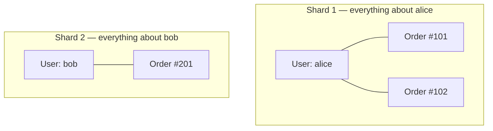
Placing "alice + her orders" on one shard means "checkout: create order, debit her wallet" is a **local** transaction. It's the transfer *between* alice and bob — a cross-shard case — that needs §3's Sagas/2PC, because no single shard key choice can co-locate every pair of entities.

### Common shard key choices and their trade-offs

| Shard key | Good for | Risk |
|---|---|---|
| `user_id` | Per-user queries, keeping a user's data together for transactions | A celebrity/power user can create a hot shard (§2) |
| `tenant_id` (multi-tenant SaaS) | Strong data isolation per customer, easy to reason about | Large enterprise tenants can dwarf small ones — uneven shard sizes |
| Geographic region | Data residency/compliance requirements, low-latency local reads | Uneven population/traffic distribution across regions |
| Time-based (e.g., `created_at` month) | Time-series/log data, easy to age out old shards | All *current* writes land on the newest shard — a permanent hotspot on the "live" shard |
| Random/hashed UUID | Perfectly even distribution | Destroys any query locality — almost every query becomes scatter-gather unless paired with a secondary lookup index |

### Worked example: picking a shard key for a ride-hailing `Trips` table

A concrete walk-through of the reasoning, not just the properties list. Table: `trip_id, rider_id, driver_id, city, fare, created_at`. Three real queries compete for the same shard key:

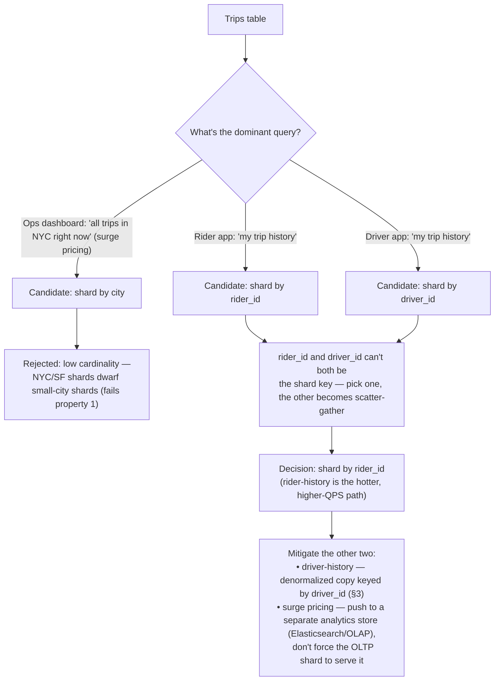

**The reasoning, spelled out**: no single shard key satisfies three competing query patterns at once — that's not a failure of analysis, it's structural. The senior move is picking the *hottest* pattern to own the shard key, then explicitly naming how the other two get served (denormalization for one, a different data store entirely for the other) rather than pretending one key can do everything.

### Directory-based sharding — the third strategy (and the one that makes resharding easy)

The foundational guide (§4) covered **key-range** and **hash-based** sharding. There's a third approach that interviewers probing live-resharding questions expect you to at least know exists:

**Directory-based (lookup-table) sharding**: a small, highly-available service (the "shard map" or "directory") stores an explicit `key → shard_id` mapping, consulted on every request instead of computed by a formula.

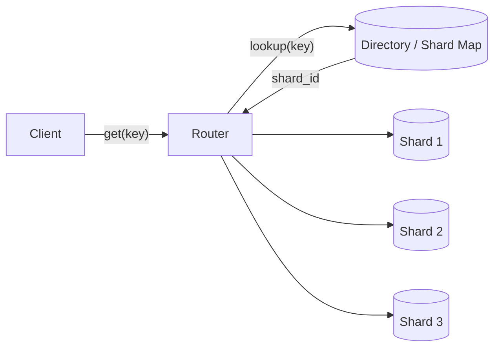

- **Why it matters for resharding**: with hash sharding, moving one key means *recomputing where everything lives* (the formula itself changes). With a directory, moving a key means *updating one row in the mapping* — MongoDB's config servers, Vitess's VSchema, and Elasticsearch's cluster state all lean on this indirection to make rebalancing far cheaper than a naive `hash(key) % N`.
- **Trade-off**: the directory is now a critical dependency on every request (mitigated by aggressive client/router-side caching), and it needs its own HA story — usually solved by fully replicating it rather than sharding it, since it's small.
- **Interview soundbite**: *"Hash sharding is simple but makes resharding expensive because the routing formula itself has to change. A directory adds a layer of indirection — and that indirection is exactly what buys you cheap resharding later."*

### 🆕 All four strategies, side by side — and how much data moves when you add a node

The foundational guide covers range-based, hash-based, and consistent hashing in depth; this table's job is just to put all four strategies (including directory-based, above) next to each other so the trade-offs are easy to recall under pressure.

| Strategy | Range queries? | Load balance | Data moved when you add/remove a node | Used by |
|---|---|---|---|---|
| **Range-based** | Yes, cheap (data is sorted within a shard) | Poor if key distribution is skewed — needs active range-splitting | Only the ranges near the split point — but rebalancing itself is manual/managed work | Bigtable, HBase, early MongoDB |
| **Hash-based** (`hash(key) mod N`) | No | Good, if the hash is uniform | **~(N-1)/N of ALL keys** — changing N changes almost every key's answer to `mod N` | Naive/simple sharded systems |
| **Consistent hashing** (+ virtual nodes) | No | Good; virtual nodes smooth out remaining skew | **~1/N of keys** — only the wedge of the ring between the changed node and its neighbor(s) moves | Cassandra, DynamoDB, Akamai CDN routing |
| **Directory-based** | Depends on the directory's own indexing | Good — the directory can move individual hot keys, not just whole ranges | Just the mapping rows for the keys being moved — no formula recompute at all | MongoDB config servers, Vitess VSchema, Elasticsearch cluster state |

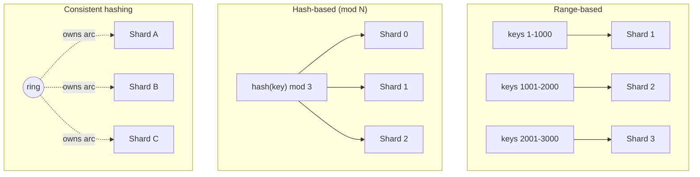

**The concrete number worth memorizing**: go from 10 nodes to 11. Naive `hash(key) mod N` remaps roughly **10/11 ≈ 91% of all keys** — nearly the entire dataset gets copied over the network for a 10% capacity increase. Consistent hashing bounds that to roughly **1/11 ≈ 9% of keys** — only the wedge the new node claims. With **100 virtual nodes per physical node**, that ~9% is also spread thinly across many donor nodes instead of being ripped entirely from one unlucky neighbor. This ratio — **~1/N moved (consistent hashing) vs. ~(N-1)/N moved (naive modulo)** — is the single fact to have cold when an interviewer asks "how do you add a node without moving everything."

**If X, then Y — picking among the four:**
- Need range scans on the shard key → **range-based**, and plan for range-splitting as ranges grow.
- Need uniform load, no range scans, topology is mostly static → **hash-based** is simplest, but budget for a painful resharding day.
- Need uniform load *and* expect to add/remove nodes routinely → **consistent hashing with virtual nodes** — that's the whole reason it exists.
- Need to move individual hot keys surgically, or want resharding to be a metadata update instead of a data migration → **directory-based**.

---

## 2. Hot partitions — diagnosis and fixes

A **hot partition (hotspot)** is a shard receiving disproportionate load relative to others — the single most common operational problem in sharded systems, and a frequent interview follow-up to "how would you shard X."

### Why hotspots happen
- **Celebrity problem**: a shard key with high overall cardinality can still concentrate traffic — e.g., sharding tweets by `user_id` works fine until a celebrity with 100M followers tweets. Every one of those 100M followers' feed reads may need to touch that one shard, so — illustratively — it could see 100-1000x the read load of a shard holding an average user's tweets, even though both shards hold roughly the same *amount* of data. High cardinality prevents storage skew, not traffic skew.
- **Sequential/monotonic keys**: sharding by an auto-incrementing ID or a timestamp means all *new* writes land on the same shard (the one holding the current high end of the range) — this is a very common real bug in naively-designed key-range-sharded systems.
- **Skewed real-world distributions**: most naturally-occurring data (city population, product popularity, follower counts) follows a power law, not a uniform distribution. Hashing guarantees keys spread evenly across shards — it says nothing about whether *traffic* to those keys is even, and in practice it usually isn't.

### Real-world case study: Instagram's custom ID scheme

A concrete example of solving shard key, monotonic-hotspot, and sortability together in one design (Instagram Engineering, 2012). Instead of an auto-incrementing `id` (the monotonic-key hotspot above) or a random UUID (destroys time-ordering), each row gets a **custom 64-bit ID** generated at write time:

`[ 41 bits: ms since custom epoch ][ 13 bits: shard ID ][ 10 bits: per-shard sequence ]`

- The **shard ID is baked into the ID itself** — no lookup needed to know where a row lives, and the shard is chosen once at creation time (typically hashed from `user_id`), not "whichever shard is current."
- The **timestamp prefix keeps IDs roughly sortable** by creation order, the same trick as Twitter's Snowflake IDs — a property a pure hash or UUID throws away.
- **Why it's worth remembering**: shard key and primary key don't have to be the same column — encoding routing info directly into the ID sidesteps both the monotonic-hotspot problem and the directory-lookup indirection cost above.

### Fixes

**Salting (key splitting)**: append a random or hashed suffix to a hot key, spreading its writes across multiple shards — e.g., instead of one `celebrity_user_id` key, use `celebrity_user_id#0` through `celebrity_user_id#9` and round-robin/hash across the ten. Reads must now fan out to all ten sub-keys and merge — you've traded a write hotspot for read fan-out, which is usually the right trade since writes are what melt a single shard under celebrity-scale load.

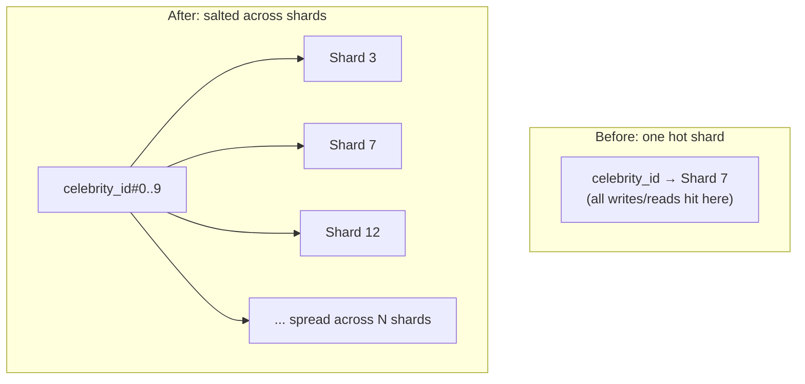

The trade-off in motion — one write, many reads:

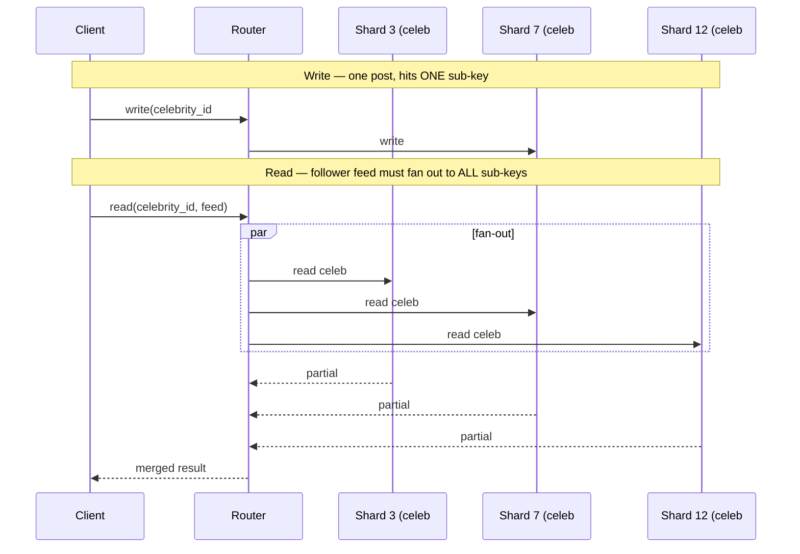

**Dedicated shard for known-hot keys**: identify hot keys ahead of time (or dynamically, via monitoring) and give them their own shard(s) rather than colocating them with "normal" keys — isolates the blast radius so a hot key doesn't degrade unrelated tenants sharing its shard.

**Caching in front of the hot shard**: if the hot key is read-heavy (not write-heavy), a cache (Redis, Memcached, or an in-process cache) absorbing reads can eliminate most of the load before it ever reaches the shard — often the cheapest fix when the workload is skewed toward reads.

**Consistent hashing with virtual nodes** (recall from the foundational chapter, numbers in §1): assigning many virtual positions per physical node smooths out uneven load distribution that plain consistent hashing alone doesn't fully solve — and, as a side effect, it's also what keeps node-addition data movement down to ~1/N instead of ~(N-1)/N.

---

## 3. Cross-shard queries and transactions — the cost sharding always imposes

Once data is sharded, two categories of operation get structurally harder, and every design should have an explicit answer for both:

### Cross-shard joins
- **Scatter-gather**: query every shard, merge results in the application/routing layer. Works, but latency is bound by the *slowest* responding shard, and it doesn't scale well as shard count grows.
- **Denormalization**: duplicate the data you'd otherwise need to join, directly onto the shard that needs it — trade storage and write complexity (keeping duplicates in sync) for read simplicity (no join needed at read time). This is the standard NoSQL answer, and it's the same idea as "partition secondary indexes by document" vs. "by term" from the foundational chapter, generalized to whole-entity duplication. Continuing the ride-hailing example above:

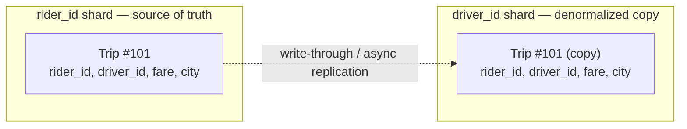
The driver's "my trip history" query now reads only its own shard — no join, no scatter-gather — at the cost of every write touching two places (sync, and the copy is briefly stale; or async, and it lags).

- **Application-level joins**: fetch from each shard separately and join in application code — essentially a manual scatter-gather with explicit control over how partial failures/timeouts are handled.

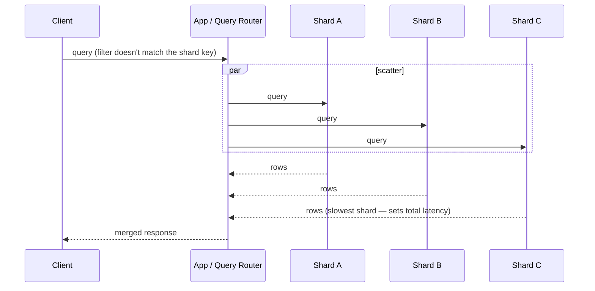

### Cross-shard transactions
If an operation must atomically update rows on two different shards (e.g., transferring money between two users whose accounts live on different shards), single-node ACID (9.1) doesn't apply anymore. Options, roughly cheapest-to-most-expensive:
1. **Avoid the need** — shard so that the entities requiring joint transactions live together (the §1 heuristic). This is *always* the first thing to consider before reaching for a distributed protocol.
2. **Saga pattern** — a sequence of local transactions with compensating rollback actions if a later step fails. See [9.9 Distributed Transactions and Consensus](9.9%20Distributed%20Transactions%20and%20Consensus.md) for the full treatment.
3. **Two-Phase Commit (2PC)** — a coordinator ensures all shards prepare and commit atomically. Also detailed in 9.9 — expensive and blocking, rarely used at internet scale for this reason.
4. **A globally-consistent database that hides this from you** — Spanner/CockroachDB/YugabyteDB give you cross-shard ACID transactions natively via consensus + (for Spanner) synchronized clocks, at the cost of adopting that specific database.

---

## 4. Resharding — migrating a live system without downtime

Almost every system eventually needs to change its shard count or shard key (add capacity, fix a hotspot, or correct an early design mistake). Doing this on a **live, serving** system is one of the hardest operational problems in this space, and interviewers who've operated production databases love probing here.

### The dual-write / backfill / cutover pattern (the general-purpose playbook)

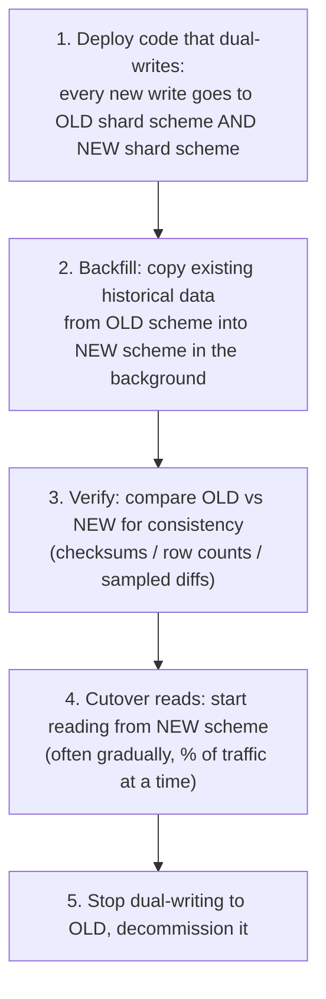

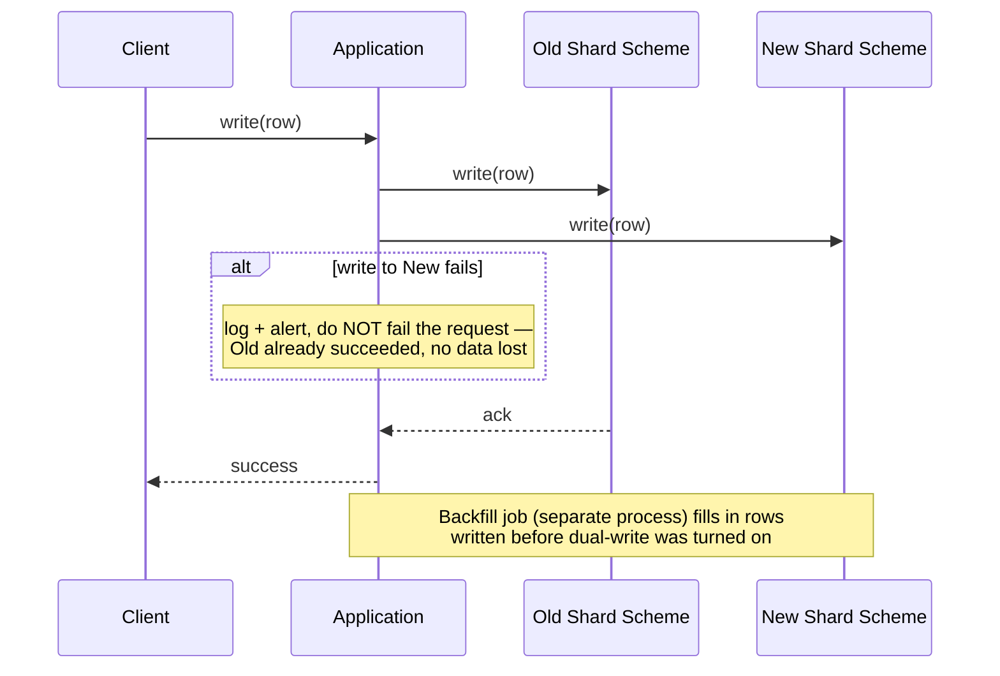

1. **Dual writes**: the application (or a proxy layer) writes every new mutation to both the old and new shard layouts simultaneously — ensures no new data is missed once the migration starts.
2. **Backfill**: a background job copies pre-existing data from the old layout into the new one, typically in batches, throttled to avoid overloading production traffic.
3. **Verification**: before trusting the new layout, validate it — row counts match, checksums over ranges match, or a sampling-based diff catches silent bugs in the migration logic. **Skipping this step is the single most common cause of resharding incidents** — always mention verification explicitly.
4. **Gradual read cutover**: shift read traffic to the new layout incrementally (1% → 10% → 50% → 100%), monitoring error rates/latency at each step, with an easy rollback path (flip back to reading old) at any stage.
5. **Decommission the old layout** only after full confidence — keep it as a fallback for a safety window even after cutover completes.

### 🆕 Alternative: CDC-based copy-then-cutover (no application code changes)

Dual-write requires touching every service that writes to the table — risky if many services own writes to it. A common infra-level alternative pushes the migration below the application entirely, using **change data capture (CDC)** instead of app-level dual writes:

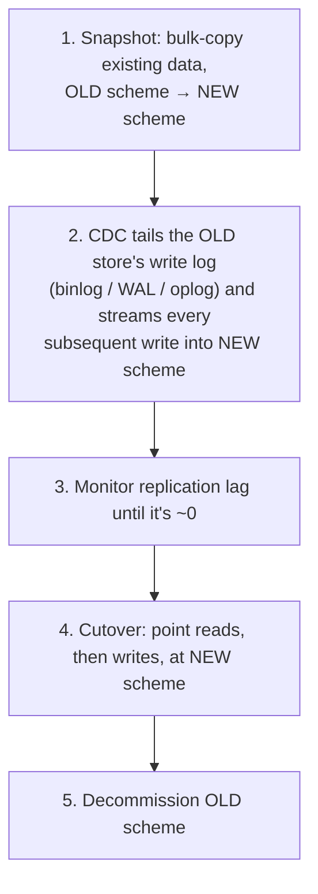

- **No application code changes** — the app keeps writing to the old store exactly as before; a CDC pipeline (Debezium, AWS DMS, a binlog/oplog reader) does the copying in the background.
- **The trade-off**: you're now trusting the CDC pipeline's correctness and its replication lag as the thing separating old and new. "Verify before cutover" still applies — check lag is near-zero and row counts/checksums match, exactly as in step 3 of the dual-write playbook above.
- **When to prefer which**: dual-write gives the application explicit control over both writes (useful when the new schema needs transformation logic the CDC tool can't express) and fails loud at write time; CDC-based copy-then-cutover is less invasive (zero app changes) but fails quiet — a stuck or lagging pipeline can go unnoticed without dedicated lag monitoring.

### Real tooling that implements variations of this pattern
- **Online schema change tools** for single-node schema migrations that need similar zero-downtime rigor: `gh-ost` (GitHub's online schema migration tool) and `pt-online-schema-change` (Percona) both use a dual-write-and-backfill-style approach (shadow table + triggers or binlog tailing, then atomic rename) to alter huge MySQL tables without locking them.
- **Vitess** (used by YouTube, Slack, and others to shard MySQL) has built-in **resharding workflows** that automate exactly this dual-write/backfill/cutover sequence, including automatic verification and traffic-shifting.
- **DynamoDB/Cassandra** handle *adding nodes* to an existing consistent-hash ring largely transparently (the whole point of consistent hashing is minimizing data movement on topology change) — but changing the **shard key** itself on these systems is still a full application-level migration, no different in kind from the RDBMS case.

**Interview soundbite**: *"Resharding is really a live-migration problem, not a database problem — the pattern (dual-write, backfill, verify, gradually cut over reads, then retire the old path) is the same whether you're resharding a database, migrating between two entirely different database products, or doing a zero-downtime schema change. I'd always insist on an explicit verification step and a gradual, reversible cutover rather than a single flag-flip."*

---

## How to identify deep partitioning questions in an interview

Quick recall map — match the symptom, then give the verbal answer below it:

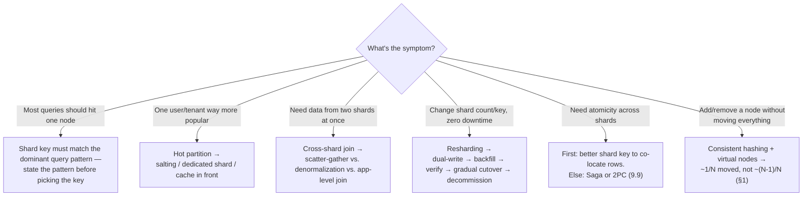

- "How would you shard this so most queries hit one node?" → shard key should match the dominant query pattern; state the pattern explicitly before picking the key.
- "What happens if one user/tenant becomes way more popular than others?" → hot partition; propose salting, dedicated shards for known-hot keys, or caching in front.
- "How do you join data that lives on two different shards?" → scatter-gather vs. denormalization vs. app-level join — name the latency/consistency trade-off of each.
- "How do you change the number of shards (or the shard key) on a live system with zero downtime?" → dual-write → backfill → verify → gradual cutover → decommission (or the CDC-based copy-then-cutover variant if you can't touch application code). Naming verification and gradual (not instant) cutover is the senior-level signal here.
- "Do we need a distributed transaction across shards?" → first answer should be "can I avoid it by choosing a better shard key so these rows are co-located" — only reach for Sagas/2PC (9.9) if that's genuinely impossible.
- "How do you add a node without moving all the data?" → consistent hashing with virtual nodes moves ~1/N of the keys, vs. ~(N-1)/N for naive `hash(key) mod N` — have the 10-node → 11-node, ~91% vs. ~9% numbers ready.

---

## Interview Cheat Sheet — Partitioning Deep Dive

- Shard key selection is close to irreversible — optimize for (1) high cardinality, (2) even *load* not just even *storage*, (3) matching your dominant query pattern, and (4) co-locating entities that need joint transactions.
- **Four partitioning strategies, one fact each**: range (range scans work, watch for skew), hash (uniform load, no range scans, resharding is expensive), consistent hashing + virtual nodes (uniform load, ~1/N data moved on node add/remove instead of ~(N-1)/N), directory-based (explicit `key → shard_id` lookup — costs a lookup, buys cheap resharding since moving a key is just updating one mapping row).
- **The number to have cold**: going from 10 to 11 nodes, naive `hash(key) mod N` remaps ~91% of keys; consistent hashing bounds that to ~9%. That ratio — ~(N-1)/N vs. ~1/N — *is* the interview answer to "how do you add a node without moving everything."
- Hot partitions come from celebrity/power-user skew, monotonic keys concentrating new writes on one shard, or real-world power-law distributions. Fixes: **salting** (split one hot key into N sub-keys — trades write hotspot for read fan-out), dedicated shards for known-hot keys, caching in front, virtual nodes in consistent hashing. Instagram's shard-ID-embedded-in-the-ID scheme is the case study to cite for solving this at design time.
- Cross-shard joins: scatter-gather (simple, latency-bound by slowest shard), denormalization (duplicate data, trade write complexity for read simplicity), or app-level joins.
- Cross-shard transactions: first try to avoid them via shard-key design; otherwise Sagas (compensating actions) or 2PC (blocking, expensive) — full detail in [9.9](9.9%20Distributed%20Transactions%20and%20Consensus.md).
- **Resharding a live system** = dual-write + backfill + **verify** + gradual read cutover + decommission — or, if you can't touch application code, a CDC-based copy-then-cutover (snapshot + binlog/oplog tailing) that migrates below the app layer instead. This exact pattern also underlies zero-downtime schema-change tools (`gh-ost`, `pt-online-schema-change`) and platforms like Vitess that automate it for MySQL sharding.
- Always volunteer the verification step and a gradual, reversible cutover — skipping straight to "flip a flag" is the naive answer; explicit validation and staged rollout is the experienced one.
