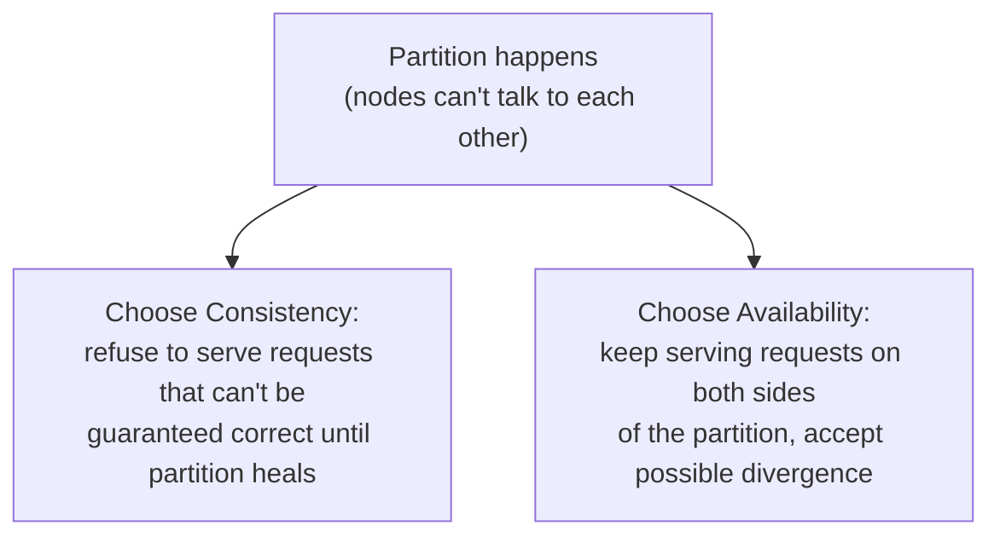
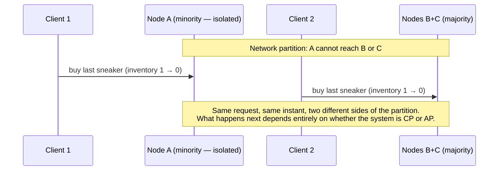
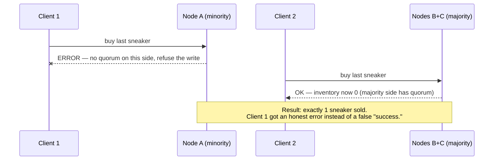
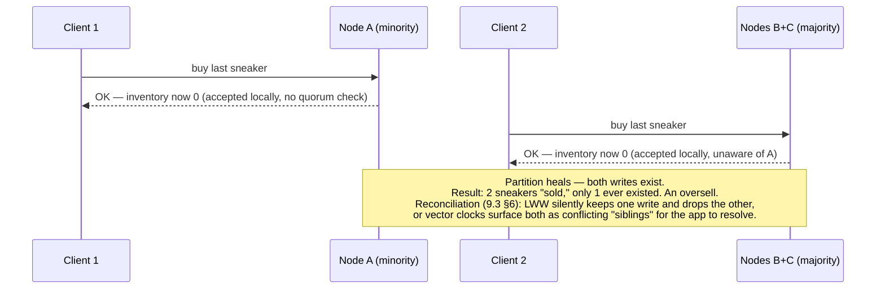
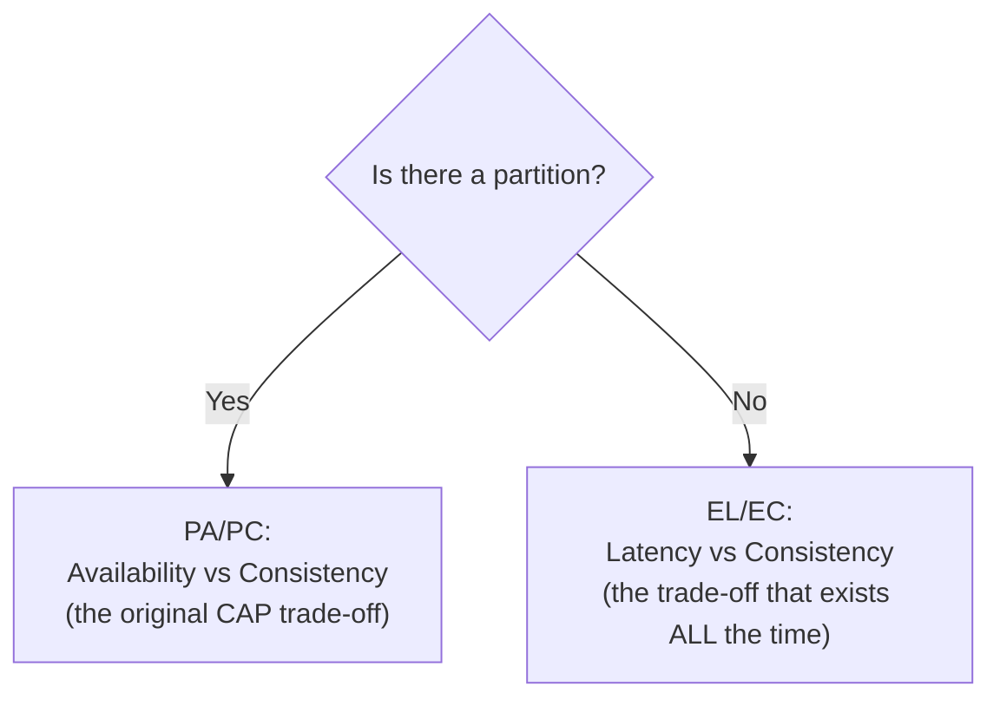
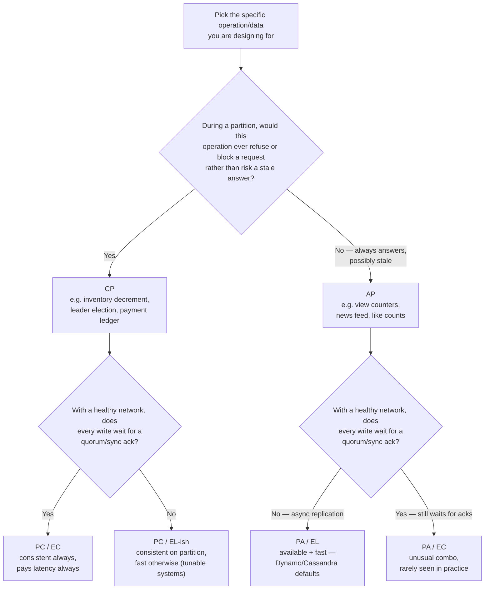
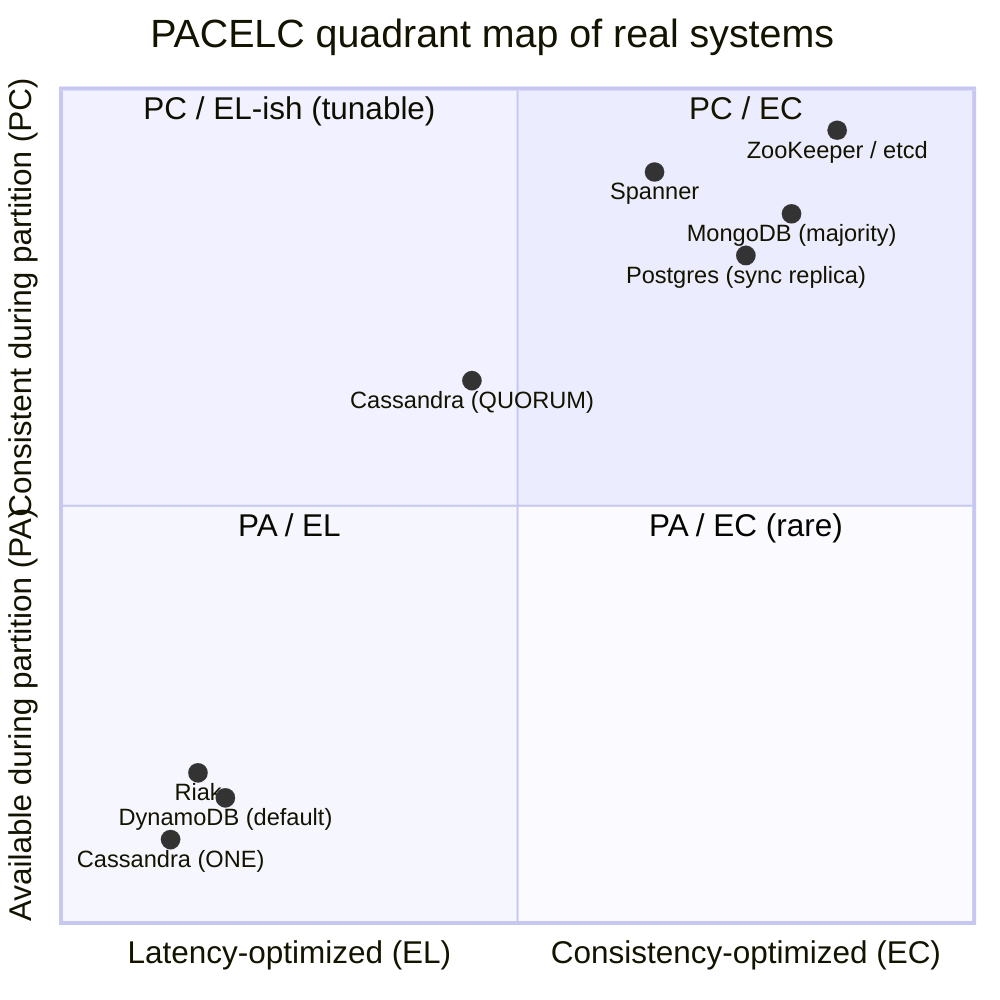

# 9.8 CAP Theorem and PACELC

> **Enhancement notes:** this pass added (marked with 🆕 inline) — (1) an explicit ❌/✅ "common misconception vs. correct statement" callout in §2, sharpened but not replacing the existing prose; (2) a concrete latency number for the PACELC latency-vs-consistency trade (~0.5-2ms async vs ~5-20ms sync cross-AZ ack, labeled illustrative) in §4; (3) two new Mermaid diagrams — a decision flowchart for classifying a design choice as CP/AP/PACELC-quadrant, and a `quadrantChart` plotting real systems (DynamoDB, Cassandra, MongoDB, ZooKeeper/etcd, Postgres, Spanner) on the PA/EL–PC/EC plane; (4) a PACELC recall mnemonic and a consolidated system × CAP × PACELC × notes table for quick review; (5) a note on MongoDB's default write concern changing to `majority` since v5.0, sharpening the CP table in §3. The original structure, worked example, tables, cheat sheet, and voice are untouched — this was already a strong, precisely-written file, so the additions fill genuine gaps (concrete numbers, diagrams, memorability aids) rather than rewriting anything.

> CAP is namedropped constantly and understood precisely by almost nobody. This file gives you the rigorous version, the common misunderstanding that will make an interviewer's eyebrows go up if you avoid it, and PACELC — the extension that actually matters more in practice.

---

## 1. The formal statement

**CAP theorem** (Eric Brewer, 2000; formally proven by Gilbert & Lynch, 2002): in a distributed system, you can only simultaneously guarantee **two** of the following three properties:

| Property | Definition |
|---|---|
| **C — Consistency** | Every read receives the most recent write or an error — i.e., **linearizability** (see [9.3 §2](9.3%20Consistency%20Models.md)). Note: this is a much stronger, more specific definition than ACID's "C" — see §5. |
| **A — Availability** | Every request to a non-failing node receives a (non-error) response — not necessarily the *correct* one, just *a* response. |
| **P — Partition tolerance** | The system continues to operate despite an arbitrary number of messages being dropped/delayed by the network between nodes. |

---

## 2. The most important correction to make in an interview: CAP is not a 3-way permanent choice

The single biggest misconception — and the fastest way to signal shallow understanding if you repeat it uncorrected — is saying **"CP, AP, or CA, pick any two, all the time."**

The accurate statement:

> **Network partitions are a fact of life in any real distributed system — they will happen.** So P isn't really an optional design choice; it's a given. **The actual choice CAP forces on you is: when a partition occurs, do you sacrifice Consistency or Availability?** There is no meaningful "CA" system in a real distributed (multi-node) setting — a single-node database is trivially CA (no partitions possible because there's only one node), but that's a degenerate case, not a design option for a distributed system.

> **🆕 ❌ Common misconception:** "CAP means every distributed database is permanently CP, AP, or CA — pick one label and it holds all the time."
>
> **🆕 ✅ Correct statement:** CAP constrains behavior **only while a partition is actually happening**. It says **nothing** about what a system must do the rest of the time — and most systems try to give you both C and A when the network is healthy. The only moment the theorem forces a real trade-off is the partition itself, which is exactly why PACELC (§4) is needed to describe the (much more common) no-partition case.

**Interview soundbite**: *"CAP isn't 'pick two of three' as a static property of a database — it's specifically about what happens **during a network partition**. Outside of a partition, most systems try to give you both consistency and availability. The theorem only forces a real trade-off in the failure case."*

### 2.1 Worked example — the same request, two different systems, concretely

Abstract definitions are easy to nod along to and hard to actually apply — so trace one request through both outcomes.

**Setup**: a flash sale has exactly **1 sneaker left** — `inventory:sneaker-42 = 1` — replicated across 3 nodes (A, B, C). A network partition splits the cluster into **{A}** (minority, 1 node) and **{B, C}** (majority, 2 nodes). At the same moment, **Client 1** hits node A to buy the last sneaker, and **Client 2** independently hits node B to buy the same last sneaker.

**What a CP system does** (e.g. MongoDB with majority write concern, or anything ZooKeeper/etcd-backed):

**What an AP system does** (e.g. Cassandra/DynamoDB-classic at a low consistency level):

**Why this matters beyond the toy example**: overselling inventory during a partition is a real, well-known production failure mode for AP systems — it's exactly why e-commerce checkout/inventory-decrement paths are one of the classic exceptions carved out of an otherwise AP-leaning architecture (routed through a CP store, a single-authoritative-owner counter, or a distributed lock) even when the rest of the product happily runs eventually consistent.

---

## 3. CP vs. AP — where real systems land, with reasoning

### CP systems — consistency over availability during a partition
On a partition, a CP system will **refuse to serve some requests** (return an error, or block) rather than risk returning stale/incorrect data.

| System | How it behaves under partition | Why |
|---|---|---|
| **ZooKeeper** | Only the side of a partition with a **quorum majority** of nodes remains available; the minority side stops serving | Needs a majority to safely elect/confirm a leader — the minority side literally cannot know if it's stale |
| **HBase / Bigtable** | Region servers unreachable from the region-owning master become unavailable for their key range | Relies on a single authoritative owner per key range at any time |
| **MongoDB (with majority write concern)** | Writes requiring majority ack fail/block if a majority of replica set members are unreachable | Same majority-quorum logic as ZooKeeper |
| **etcd** | Same majority-quorum unavailability behavior | Raft-based, needs majority to commit |

> **🆕 Note on MongoDB's default:** since MongoDB 5.0, the *default* write concern for a replica set (with no arbiters) is already `majority`, not the historical `w:1`. So plain "MongoDB" out of the box already leans CP for durability — "majority write concern" isn't an exotic opt-in anymore, it's what you get unless you deliberately weaken it.

### AP systems — availability over consistency during a partition
On a partition, an AP system keeps serving reads and writes on **both** sides, accepting that the two sides may diverge and need reconciliation later (this is exactly why Dynamo-style anti-entropy — hinted handoff, read repair, Merkle trees, see [9.6 §6](9.6%20Replication%20-%20Deep%20Dive.md) — exists).

| System | Behavior under partition | Reconciliation mechanism |
|---|---|---|
| **Cassandra** | Both sides keep serving reads/writes at low consistency levels (`ONE`) | Read repair + anti-entropy (Merkle trees) + tunable quorum consistency levels for stronger guarantees when needed |
| **DynamoDB** (in its base/original Dynamo-derived design) | Both sides keep serving | Vector clocks surface conflicting "sibling" versions to the application, or last-writer-wins |
| **Riak** | Same lineage as Cassandra/Dynamo | Same anti-entropy toolkit |
| **CouchDB** | Explicitly designed for offline-first/multi-master with eventual sync | App-level or CRDT-based conflict resolution |

**Interview-ready one-liner per system if asked "is X CP or AP"**: ZooKeeper/etcd = CP (they're *literally used as the consensus layer other systems build CP guarantees on top of* — a great thing to say). Cassandra/DynamoDB(-classic)/Riak = AP by default, but often **tunable** toward CP-like behavior per-operation via quorum settings (`W+R>N`, strong consistent reads) — meaning the CP/AP label is really "default posture," not an immutable law of the system.

---

## 4. PACELC — the extension that matters more day-to-day

CAP only describes behavior **during a partition** — but partitions are (hopefully) rare. **PACELC** (Daniel Abadi, 2010) extends the theorem to describe the more common, everyday case: what happens when the network is fine.

> **P**artition: if there **is** a partition, choose **A**vailability or **C**onsistency (this part is exactly CAP).
> **E**lse (no partition): choose **L**atency or **C**onsistency.

This second half is the genuinely useful addition: **even with no partition at all, there's still a permanent trade-off between latency and consistency**, because achieving strong consistency requires coordination (synchronous replication, consensus round-trips), and coordination costs time.

#### 🆕 A concrete number for the latency tax

Abstract "coordination costs time" is easy to nod along to — so put a number on it. Take a primary in `us-east-1a` with a synchronous replica in `us-east-1b` (a different Availability Zone, same region):

- **Async replication (choosing L):** the primary fsyncs locally and returns success immediately — commit latency is dominated by the local disk, roughly **~0.5-2ms**. The replica catches up a moment later; a crash right after the ack can lose that last write.
- **Sync replication (choosing C):** the primary must wait for the AZ-B replica to receive and ack the write before it can return success. A cross-AZ round trip within the same region is typically on the order of **~1-2ms of raw network latency, but ~5-20ms once you include the replica's own fsync and any queueing** (illustrative — actual numbers depend on cloud provider, region pair, and load, so measure your own).

That **~5-20ms added per write** is a pure PACELC latency-vs-consistency trade — it happens on every single commit, with zero network partition in sight. Multiply it across your write volume and it becomes a real throughput ceiling, not just a per-request annoyance.

### Classifying real systems on the full PACELC spectrum

| System | Partition behavior | Normal-operation behavior | PACELC classification |
|---|---|---|---|
| **DynamoDB (default)** | Availability | Latency (async replication, eventually consistent reads by default) | **PA/EL** |
| **Cassandra (default `ONE`/`LOCAL_QUORUM`)** | Availability | Latency | **PA/EL** |
| **MongoDB (majority read/write concern)** | Consistency | Consistency (waits for majority ack even when network is healthy) | **PC/EC** |
| **ZooKeeper / etcd** | Consistency | Consistency | **PC/EC** |
| **PostgreSQL (single primary, synchronous replica)** | Consistency (blocks if sync replica unreachable) | Consistency (every commit waits for the sync replica) | **PC/EC** |
| **Spanner** | Consistency | Consistency — but engineered to minimize the latency cost via TrueTime, so it pays *less* of the EC latency tax than a naive PC/EC system would | **PC/EC**, optimized |
| **Cassandra tuned with `QUORUM`** | Consistency (partial — needs quorum on each side) | Latency (better than full-consistency EC, worse than `ONE`) | **PC/EL-ish** — this is exactly why "tunable consistency" (9.3 §7) exists: to let you sit at different points on this spectrum per operation |

#### 🆕 Decision flowchart: classifying a design choice as CP, AP, or a PACELC quadrant

Use this on a specific piece of data or operation in your design — not on "the system" as a whole, since a real design (and a real interview answer) usually mixes quadrants across different data types.

#### 🆕 PACELC quadrant map of real systems

Reading the map: bottom-left (PA/EL) is the "default AP" cluster — fast and available, weakest consistency. Top-right (PC/EC) is the "default CP" cluster — strong guarantees, pays latency for it. Top-left (PC/EL-ish) is where tunable systems land when you dial them toward consistency without going all the way to full quorum-everywhere. Spanner sits high on the y-axis (strongly consistent) but pulled left of the naive PC/EC cluster because TrueTime shaves down the latency tax it would otherwise pay.

**Why PACELC is the better interview answer than CAP alone**: CAP only equips you to talk about outages. PACELC equips you to explain **why a strongly consistent database is slower even when nothing is broken** — which is the question that actually comes up when someone asks "why not just make everything strongly consistent?"

**Interview soundbite**: *"CAP tells you what happens during a partition, which is hopefully rare. PACELC tells you what you're paying every single day even when the network is perfectly healthy — that's the more operationally relevant trade-off, and it's why I'd default new features to eventual/session consistency and only pay the latency tax for the specific operations that truly need linearizability."*

#### 🆕 Mnemonic for recall

Say the acronym as one phrase, branch by branch: **"Partition? Availability or Consistency. Else, Latency or Consistency."** — that's literally what P-A/C-E-L/C spells out. Or, shorter: **"PACELC is CAP with a second question tacked on for the 99.9% of the time you're not partitioned."** If you can only remember one thing under pressure, remember that **CAP is a subset of PACELC**, not a separate, competing model.

---

## 5. CAP's "C" vs. ACID's "C" — the disambiguation interviewers specifically listen for

This exact confusion is planted deliberately in a lot of interview questions, and resolving it out loud is a cheap, high-signal move (already flagged in [9.1 §3](9.1%20ACID%20and%20Transactions%20-%20Deep%20Dive.md), worth restating precisely here):

| | ACID's "C" (Consistency) | CAP's "C" (Consistency) |
|---|---|---|
| Scope | A single database, single transaction | Multiple replicas/nodes of the same data |
| Means | The database moves between states that satisfy declared **constraints** (PK/FK/CHECK/application invariants) | Every read reflects the most recent write — i.e., **linearizability** |
| Who enforces it | The database engine's constraint system + your schema design | The replication/consensus protocol |
| Independent of the other? | Yes — a database can be ACID-consistent (all constraints hold) on a single node while being CAP-inconsistent across replicas (a stale replica temporarily violates no *constraint*, it's just temporally behind) | Yes — same reasoning in reverse |

**Interview soundbite**: *"These are unrelated definitions that happen to share a letter — ACID's C is about constraint satisfaction within one node's transactions, CAP's C is about read-after-write recency across multiple nodes. A single-node database can be perfectly ACID-consistent and the question of CAP-consistency doesn't even apply to it, because CAP is fundamentally a multi-node/distributed-systems concept."*

---

#### 🆕 Quick-reference table: system × CAP × PACELC × notes

One row per system, all three facts in one place — the table to glance at 60 seconds before walking into the room.

| System | CAP (during partition) | PACELC (full) | Note |
|---|---|---|---|
| DynamoDB (default) | AP | PA/EL | Tunable per-op toward CP via quorum reads/writes |
| Cassandra (`ONE`) | AP | PA/EL | Same Dynamo-style tunability |
| Cassandra (`QUORUM`) | Leans CP | PC/EL-ish | Middle of the tunable spectrum, per 9.3 §7 |
| Riak | AP | PA/EL | Same Dynamo lineage, vector-clock reconciliation |
| CouchDB | AP | PA/EL | Multi-master, offline-first; app/CRDT resolves conflicts |
| MongoDB (majority concern, default since 5.0) | CP | PC/EC | Minority side of a partition stops serving majority-acked writes |
| HBase / Bigtable | CP | PC/EC | Single authoritative owner per key range |
| ZooKeeper / etcd | CP | PC/EC | The consensus layer other CP systems are built on |
| PostgreSQL (sync replica) | CP | PC/EC | Every commit waits for the sync replica, partitioned or not |
| Spanner | CP | PC/EC (optimized) | TrueTime shrinks the EC latency tax, doesn't eliminate it |

---

## How to identify CAP/PACELC questions in an interview

- "Would you choose consistency or availability here?" → first ask "during a partition, or in general?" — this single clarifying question demonstrates you know CAP and PACELC are different questions.
- "Why not just make the whole system strongly consistent?" → pivot to PACELC's EL/EC trade-off — strong consistency costs latency *even with a healthy network*, not just during outages.
- "Is Cassandra/DynamoDB/MongoDB CP or AP?" → give the default posture, then immediately note it's **tunable per-operation**, not a fixed label (recall 9.3 §7's quorum/consistency-level knobs).
- If a question conflates "ACID compliant" with "strongly consistent across replicas" → name the disambiguation in §5 explicitly; this is a very reliable "shows real depth" moment.
- "How does Spanner get strong consistency without the usual latency penalty?" → TrueTime (bounded clock uncertainty via atomic clocks/GPS) lets it assign a safe global commit order without a full round of cross-region coordination for every operation — detailed further in [9.9](9.9%20Distributed%20Transactions%20and%20Consensus.md).
- "What happens if two customers buy the last item in stock during a network blip?" → walk through §2.1's worked example concretely: a CP path rejects the minority-side write (no oversell, but one customer gets an error); an AP path accepts both writes and reconciles/oversells afterward — this is why inventory/payment paths are a common CP carve-out inside an otherwise AP system.

---

## Interview Cheat Sheet — CAP & PACELC

- CAP: pick 2 of {Consistency (linearizability), Availability, Partition tolerance} — but **P isn't optional** in a real distributed system, so the actual live choice is **C vs. A, and only during an actual network partition.**
- CP systems (ZooKeeper, etcd, HBase, MongoDB w/ majority concern): refuse to serve when they can't guarantee correctness — the minority side of a partition goes unavailable.
- AP systems (Cassandra, DynamoDB-classic, Riak): keep serving both sides of a partition, reconcile divergence afterward via read repair / hinted handoff / anti-entropy (9.6 §6) or vector clocks/CRDTs (9.3 §6).
- **Worked example** (§2.1): last item in stock, partition splits the cluster — CP rejects the minority-side write (no oversell, one honest error); AP accepts both writes and oversells, reconciling after the fact. This is why checkout/inventory paths are a common CP carve-out even inside an AP-leaning system.
- **PACELC** extends CAP to the (much more common) no-partition case: **Else, Latency vs. Consistency** — strong consistency costs latency even on a perfectly healthy network, because it requires coordination.
- Classify systems on the full 4-letter spectrum: DynamoDB/Cassandra defaults = **PA/EL**; MongoDB (majority)/ZooKeeper/etcd/synchronous-replica Postgres = **PC/EC**; Spanner = **PC/EC engineered to minimize the EC latency tax via TrueTime**.
- ACID's "C" (constraint satisfaction, single node) and CAP's "C" (linearizability, multi-node) are **different concepts sharing a letter** — always disambiguate this explicitly when both come up.
