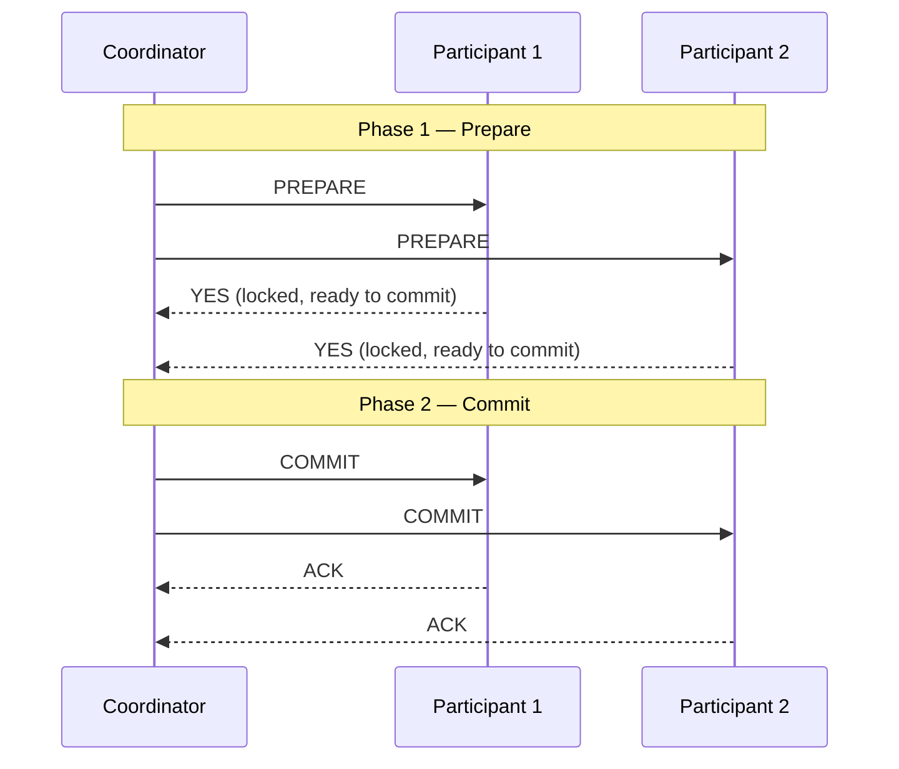
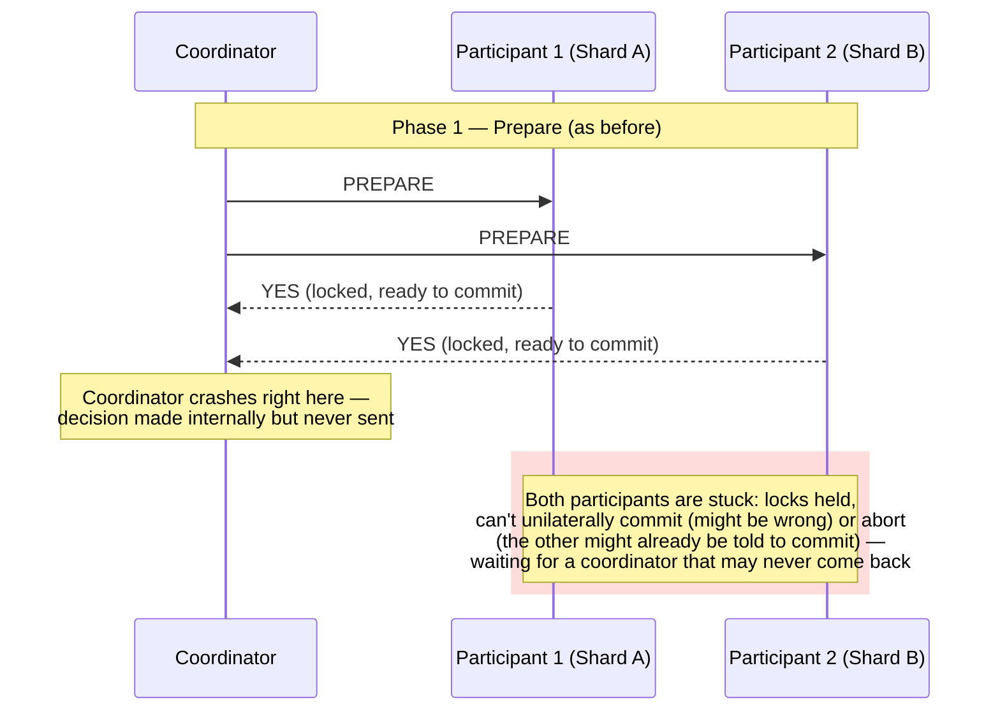
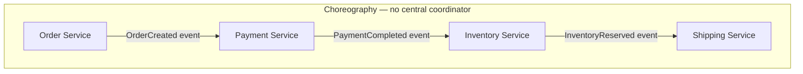
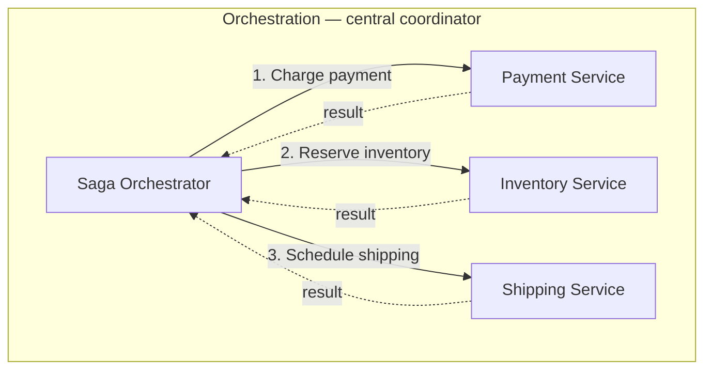
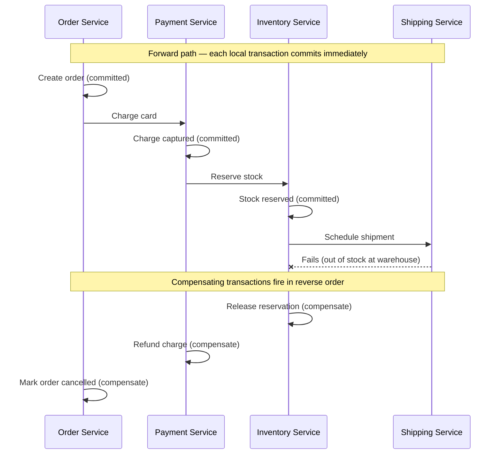
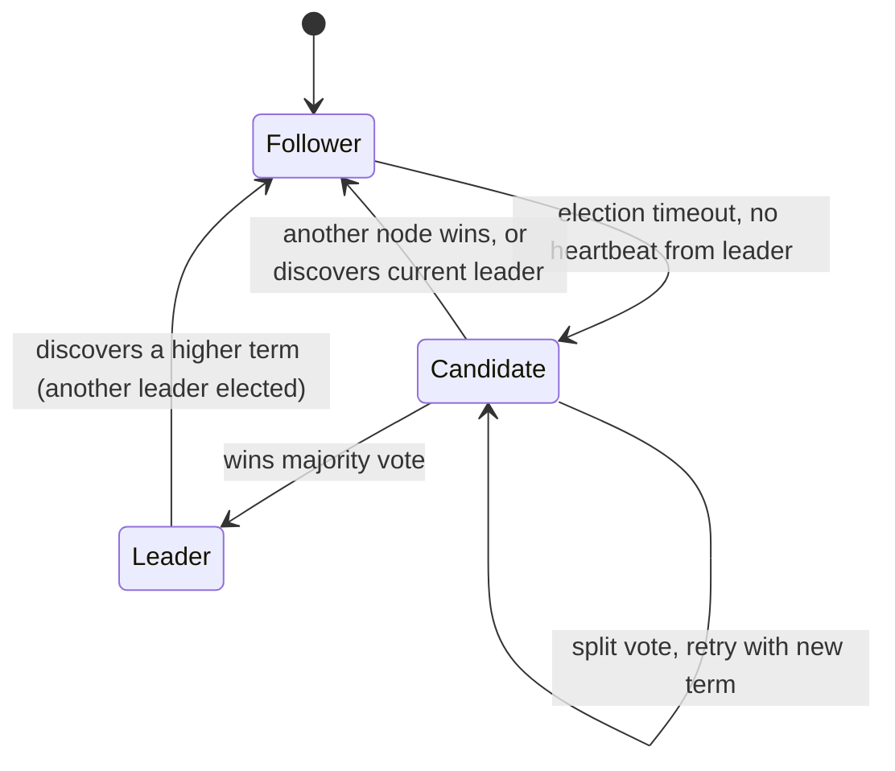
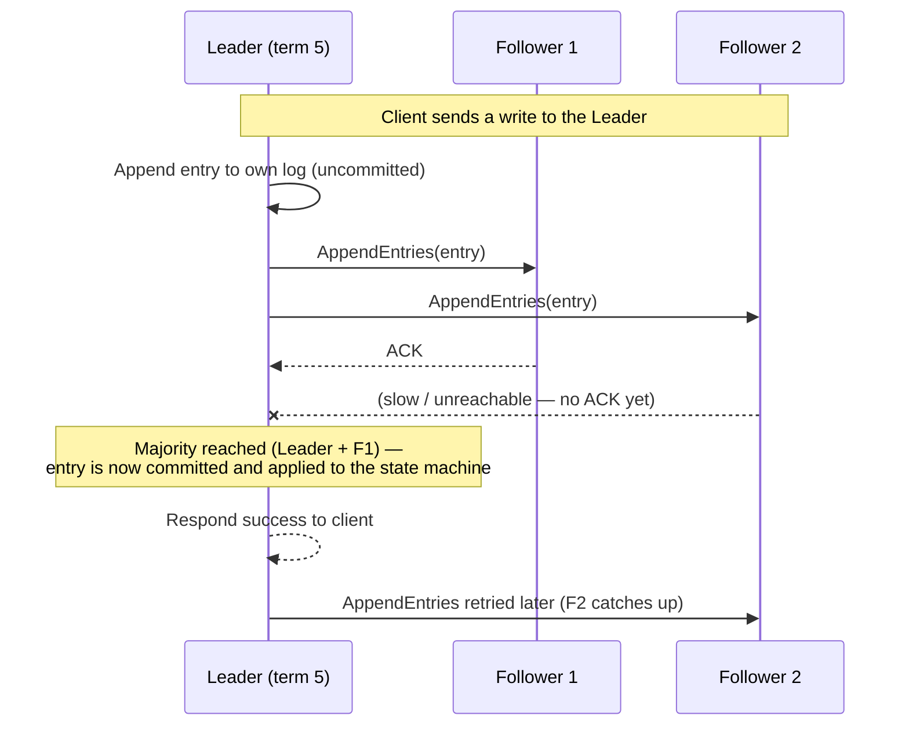

# 9.9 Distributed Transactions and Consensus

> Referenced from [9.1](9.1%20ACID%20and%20Transactions%20-%20Deep%20Dive.md) (multi-node atomicity), [9.7](9.7%20Partitioning%20and%20Sharding%20-%20Deep%20Dive.md) (cross-shard transactions), and [9.8](9.8%20CAP%20Theorem%20and%20PACELC.md) (CP systems need consensus to work at all). This file is where those threads converge: how do multiple independent nodes agree on anything — a commit, a leader, an ordering — when any of them might crash or the network might drop messages?

---

## 1. Why this is hard: the problem statement

On a single node, atomicity is "easy" — one process, one disk, a WAL (9.4). Across multiple nodes, you must get **all of them to agree** on an outcome (commit or abort; who's the leader; what value was written) despite nodes crashing, messages being delayed or lost, and no node having a complete, instantaneous view of what every other node is doing. This is the **consensus problem**, and it's provably impossible to solve with a guaranteed bound on time in a fully asynchronous network with even one faulty node (the **FLP impossibility result** — worth namedropping: it's *why* every real consensus protocol makes a practical trade-off, usually by assuming partial synchrony or accepting probabilistic/eventual termination rather than a hard deadline).

---

## 2. Two-Phase Commit (2PC)

The classic protocol for atomically committing a transaction across multiple nodes/shards (the direct answer to "cross-shard transaction" from [9.7 §3](9.7%20Partitioning%20and%20Sharding%20-%20Deep%20Dive.md)).

### The protocol

1. **Prepare phase**: the coordinator asks every participant "can you commit this?" Each participant does whatever local work is needed to *guarantee* it can commit if told to (write to its own WAL, acquire locks) and replies YES or NO — but does **not** commit yet.
2. **Commit phase**: if **all** participants said YES, the coordinator tells everyone to commit. If **any** participant said NO (or timed out), the coordinator tells everyone to abort instead.

### The fatal flaw: blocking on coordinator failure

If the coordinator crashes **after** collecting all YES votes but **before** sending the commit decision, every participant is stuck: it has already promised (in the prepare phase) that it *can* commit, meaning it must hold its locks and can't unilaterally decide to abort — but it also doesn't know if the coordinator meant to say commit or abort. Participants are **blocked**, holding locks, until the coordinator recovers. This is 2PC's defining weakness and the reason it's used less than people expect in internet-scale systems — a stuck coordinator can freeze an entire distributed transaction's resources indefinitely.

This is the concrete scenario worth walking through out loud in an interview: it's not "2PC can fail," it's specifically *this* window — after votes are in, before the decision is sent — that has no safe unilateral exit for a participant.

### 3PC — the incomplete fix
**Three-Phase Commit** adds an extra phase (prepare → pre-commit → commit) specifically to remove the blocking behavior on coordinator failure, by giving participants enough information to safely decide the outcome themselves in more failure scenarios. In practice it's **rarely used** — it still doesn't fully solve the problem under network partitions (a participant can still get stuck if it's partitioned away during the critical window), and the added round-trip cost isn't worth the partial improvement. **Know that it exists and why it mostly hasn't caught on** — that's the appropriate depth for an interview; don't over-invest here.

### Where 2PC actually shows up in production
- **Spanner** uses 2PC for cross-shard transactions, but layers it **on top of Paxos-replicated participants** — so even if one physical machine acting as a participant crashes, its Paxos group (a replicated set of machines) survives and can still respond, sidestepping 2PC's single-point-of-blocking weakness. This combination (2PC across shards, each shard internally replicated via Paxos) is Spanner's actual answer to "how do you get global ACID transactions," and it's worth stating precisely this way.
- **XA transactions** (the standard most RDBMS/message-queue vendors implement for distributed transaction coordination, e.g., across a database and a JMS queue) are a direct implementation of 2PC — if asked about "distributed transactions across a database and a queue," XA/2PC is the textbook answer, alongside the caveat that it's rarely used at large scale for exactly the blocking reason above.

---

## 3. The Saga pattern — the internet-scale alternative

Given 2PC's blocking problem and its poor fit for long-running or cross-service (as opposed to cross-shard-within-one-database) transactions, **Sagas** are the dominant real-world pattern for multi-service "transactions" in microservice architectures.

### The core idea
Break the transaction into a sequence of **local transactions**, each of which commits immediately (no held locks across steps, no waiting on other services). If a later step fails, execute **compensating transactions** that semantically undo the effects of the already-completed earlier steps — since you can't roll back a commit that already happened, you take a new, opposite action instead (e.g., "refund the charge" rather than "un-charge the card").

### Two coordination styles

| | Choreography | Orchestration |
|---|---|---|
| How it works | Each service publishes an event on completing its step; the next service subscribes and reacts — no single service knows the whole flow | A central orchestrator explicitly calls each service in sequence and tracks overall saga state |
| Pros | No single point of failure/bottleneck; services stay decoupled | Saga logic is centralized, easy to see/reason about/monitor as one flow; easier to add new steps |
| Cons | The overall flow is implicit, spread across many services' event handlers — hard to see "what does checkout actually do" in one place; hard to debug | The orchestrator is a new component that must itself be reliable, and it's a central point every step depends on |
| Real usage | Common in loosely-coupled event-driven architectures (Kafka-based systems) | Common with explicit workflow engines: **Temporal, AWS Step Functions, Camunda** — namedrop these when discussing orchestration |

### Worked example: e-commerce checkout as a Saga
1. **Order Service**: create order (local transaction, commits immediately).
2. **Payment Service**: charge the card (local transaction, commits immediately).
3. **Inventory Service**: reserve stock (local transaction, commits immediately).
4. **Shipping Service**: schedule shipment — **fails** (out of stock at the warehouse, say).
5. **Compensating actions fire in reverse**: Inventory Service releases the reservation; Payment Service refunds the charge; Order Service marks the order as cancelled.

**The trade-off you must name**: Sagas give up **isolation** — between steps 1 and 4, the order is visible in a "pending" state, the payment is actually captured, and the inventory is actually reserved — other transactions/users can observe this intermediate state, which would never happen inside a real ACID transaction. This is the price of avoiding 2PC's blocking/locking — you trade isolation for availability and service independence. **Always state this trade-off explicitly** — it's the single most important thing to say about Sagas.

---

## 4. Consensus algorithms — Paxos and Raft

These solve a more general problem than 2PC: getting a set of nodes to agree on a **sequence of values** (not just one commit/abort decision) despite crashes — which is exactly what's needed to replicate a log (and therefore a database) safely across nodes that might fail (this is literally the mechanism ZooKeeper, etcd, Spanner's per-shard replication, and CockroachDB's replication are built on).

### Paxos — the foundational (and notoriously hard to understand) algorithm

Roles: **Proposer** (proposes a value), **Acceptor** (votes on proposals), **Learner** (learns the agreed value). Simplified flow:
1. A proposer picks a proposal number `n` and sends `PREPARE(n)` to a majority of acceptors.
2. Acceptors promise not to accept any proposal numbered less than `n`, and reply with any value they've already accepted (if any).
3. The proposer picks a value (either its own, or the highest-numbered value an acceptor already reported, to preserve safety) and sends `ACCEPT(n, value)` to the majority.
4. If a majority accepts, the value is **chosen** — permanently, safely agreed upon.

**Why majority matters**: any two majorities out of the same set of nodes must overlap by at least one node — that overlapping node is what prevents two different values from both being chosen, even if different proposers are racing concurrently. This "majority quorum overlap" logic is the same fundamental idea as the `W + R > N` quorum formula from replication (9.6/foundational chapter) — Paxos is, in a sense, that same idea applied to agreeing on a single value instead of reading/writing data.

**Reputation**: Paxos is famous for being correct but extremely difficult to understand and implement correctly from the original paper — which directly motivated Raft.

### Raft — Paxos's "designed to be understood" successor

Raft decomposes consensus into three understandable sub-problems, and is what most modern systems actually implement (etcd, CockroachDB, Kafka's KRaft mode, Consul) precisely because it's implementable correctly without a distributed-systems PhD.

1. **Leader election**: nodes are Followers by default. If a follower doesn't hear from a leader within an election timeout, it becomes a Candidate, increments a **term** number, and requests votes from other nodes. Whoever gets a majority becomes Leader for that term.
2. **Log replication**: the Leader is the only node that accepts writes; it appends them to its own log and replicates them to Followers. An entry is considered **committed** once a majority of nodes have it in their log — at which point it's safe to apply to the state machine.
3. **Safety**: a node can only become leader if its log is at least as up-to-date as a majority of the cluster's — this prevents a node that's missing recent committed entries from ever becoming leader and silently "losing" data that was already agreed upon.

**Log replication, concretely**: the diagram above shows *who becomes* leader; this is what the leader *does* once elected — every write goes through it, and it only needs a majority ack (not all nodes) before treating the entry as committed:

Note the contrast with 2PC: a majority is enough to commit — a slow or temporarily unreachable follower (F2 above) never blocks progress the way a single stuck participant blocks 2PC.

**Terms are the mechanism that prevents split-brain** (directly connects to [9.6 §5](9.6%20Replication%20-%20Deep%20Dive.md)'s fencing discussion): every message carries a term number; a node always accepts the message with the higher term and steps down if it discovers a higher term than its own. An old leader that gets network-partitioned away and later reconnects immediately discovers a higher term from the current leader and demotes itself — this is Raft's built-in fencing, no separate STONITH mechanism required.

### Where these show up, concretely
| System | Consensus algorithm | What it's used for |
|---|---|---|
| **ZooKeeper** | **ZAB** (ZooKeeper Atomic Broadcast — Paxos-like, purpose-built for ZooKeeper) | Coordination service (leader election, distributed locks, config) for HBase, Kafka (legacy mode), SolrCloud |
| **etcd** | Raft | Kubernetes's entire cluster state store — every kubectl operation ultimately goes through Raft-replicated etcd |
| **CockroachDB** | Raft (one Raft group per data range/shard) | Replicating each shard's data safely, which 2PC then coordinates across for cross-shard transactions |
| **Kafka (KRaft mode, replacing ZooKeeper)** | Raft | Kafka's own metadata/controller quorum, removing the ZooKeeper dependency in modern Kafka versions |
| **Spanner** | Paxos (one Paxos group per shard/tablet) | Same role as CockroachDB's Raft groups — replicate each shard safely; 2PC + TrueTime handle cross-shard transactions on top |
| **MongoDB replica sets** | A Raft-like protocol (not formally Raft, but same design lineage) | Primary election among replica set members |

---

## 5. Spanner's TrueTime — the special trick worth understanding on its own

Spanner deserves a specific callout because it's the most commonly-asked "how does Google get global ACID" question, and the answer isn't just "Paxos + 2PC" — the genuinely novel piece is **TrueTime**.

**The problem**: to give transactions a global, externally-consistent commit order (linearizability across continents), you need to know precisely *when* each transaction committed relative to every other one — but clocks on different machines are never perfectly synchronized, and clock skew could make a later transaction appear to have an earlier timestamp.

**TrueTime's answer**: instead of pretending clocks are perfectly synced, Spanner's `TrueTime.Now()` API returns an **interval** `[earliest, latest]` that is *guaranteed* to contain the true current time — using GPS receivers and atomic clocks in every datacenter to keep that uncertainty interval extremely small (single-digit milliseconds). When committing a transaction, Spanner **waits out the uncertainty window** ("commit wait") before releasing the transaction's effects, guaranteeing that any transaction which starts after this one commits will get a strictly later timestamp. This deliberate wait is a small, bounded latency cost paid in exchange for genuine global linearizability without a single global coordinator serializing every transaction.

**Interview soundbite**: *"Spanner doesn't avoid the latency-for-consistency trade-off from PACELC — it just pays a small, precisely-bounded amount of it (the commit-wait, bounded by clock uncertainty) instead of a large, variable amount (a full cross-region consensus round-trip per transaction) that a naive design would need."*

---

## How to identify distributed-transaction/consensus questions in an interview

- "How do you atomically commit a transaction across two databases/shards?" → 2PC, and immediately name its blocking weakness on coordinator failure.
- "How do you handle a multi-step operation across microservices where each owns its own database?" → Saga (choreography vs. orchestration), and explicitly name the isolation trade-off (intermediate states are visible).
- "How does a cluster agree on who's the leader / what value was written, safely, despite crashes?" → Paxos or Raft — for a from-scratch design conversation, default to explaining Raft (it's simpler to reason about out loud) and mention Paxos as the theoretical predecessor.
- "How does etcd/Kubernetes/CockroachDB stay consistent across node failures?" → Raft, majority quorums, term numbers preventing split-brain.
- "How does Spanner give you ACID transactions across the globe?" → Paxos-replicated shards + 2PC across shards + TrueTime's bounded-uncertainty commit-wait for global ordering — all three pieces, not just one.

---

## Interview Cheat Sheet — Distributed Transactions & Consensus

- **2PC**: prepare (everyone votes, locks held) → commit (coordinator's decision executed). Fatal flaw: **coordinator crash after votes but before decision blocks all participants indefinitely holding locks.** 3PC partially addresses this but is rarely used in practice.
- **XA transactions** are the standard 2PC implementation most databases/message queues expose — the textbook answer for "transaction across a DB and a queue."
- **Sagas**: sequence of local transactions + compensating actions on failure. Choreography (event-driven, decentralized, hard to see the whole flow) vs. Orchestration (central coordinator — Temporal, Step Functions — easy to see/manage, new single dependency). **Always name the trade-off: Sagas give up isolation** — intermediate states are visible to the outside world.
- **Paxos**: Proposer/Acceptor/Learner, majority-quorum voting, correct but famously hard to implement right.
- **Raft**: leader election (terms, majority vote) + log replication (majority-committed entries) + built-in split-brain prevention via term numbers. The modern default (etcd, CockroachDB, Kafka KRaft) because it's designed to be understandable and implementable correctly.
- Both Paxos and Raft rest on the same **majority-quorum-overlap** logic as the `W+R>N` replication quorum formula — same underlying idea, applied to "agree on one value" instead of "read/write data."
- **Spanner's TrueTime**: bounded clock-uncertainty intervals + "commit wait" to get genuine global linearizability with a small, bounded latency cost instead of a full per-transaction global coordination round-trip — the concrete answer to "how do you get ACID across continents."
