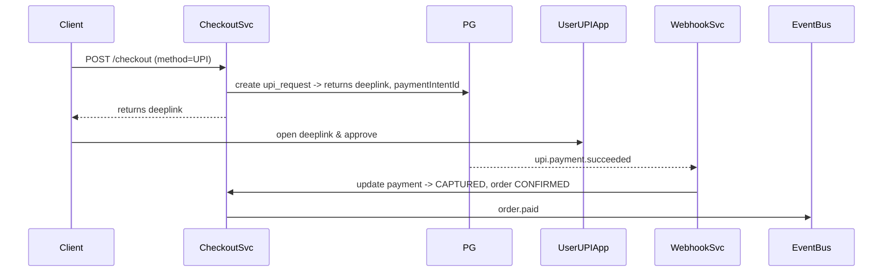
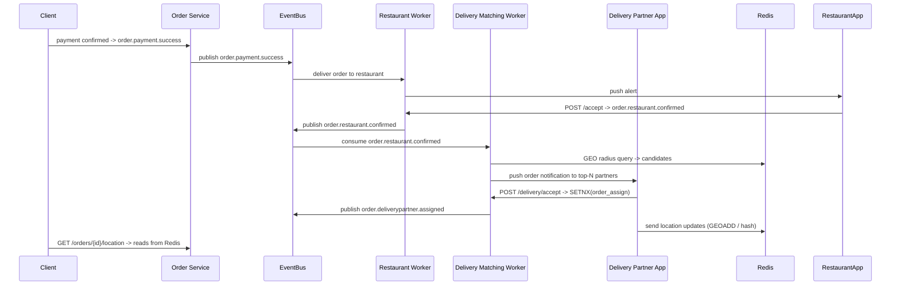

Nice — this is a good concrete start. I’ll tighten and expand what you posted into production-ready API contracts, DB schema, events, validations, error handling, and operational notes (presigned image uploads, idempotency, auth, etc.). You can copy-paste these into your API spec / backlog.

# 1. API surface (REST-style) — request / response examples

### 1.1 Create restaurant (signup)

**POST /restaurants**
Request (JSON)

```json
{
  "name": "The Spice Box",
  "logoUrl": "https://cdn.example/signed/...png",
  "description": "Authentic Indian street food",
  "address": {
    "line1": "12 MG Road",
    "line2": "Near Central Mall",
    "city": "Hyderabad",
    "state": "Telangana",
    "postalCode": "500081",
    "country": "IN",
    "latitude": 17.3850,
    "longitude": 78.4867
  },
  "contact": {
    "phone": "+91-9876543210",
    "email": "owner@spicebox.in"
  },
  "licenseNumber": "LIC-123456",
  "gstNumber": "27AAAAA0000A1Z5",
  "metadata": { "cuisine": ["Indian","Street Food"] }
}
```

Response `201 Created`

```json
{
  "id": "rest_5f3a2b",
  "status": "PENDING_VERIFICATION",
  "createdAt": "2025-09-06T07:40:00Z"
}
```

**Notes**

* `logoUrl` should be a presigned upload URL or an already uploaded CDN URL (see presigned flow below).
* `status` lifecycle: `PENDING_VERIFICATION -> VERIFIED -> ONLINE/OFFLINE` (or `REJECTED`).

---

### 1.2 Get restaurant

**GET /restaurants/{id}**
Response `200 OK`

```json
{
  "id": "rest_5f3a2b",
  "status": "ONLINE",
  "name": "The Spice Box",
  "logoUrl": "https://cdn.example/.../logo.png",
  "description": "...",
  "address": { /* as above */ },
  "contact": { /* as above */ },
  "licenseNumber": "LIC-123456",
  "gstNumber": "27AAAAA0000A1Z5",
  "metadata": {},
  "createdAt": "...",
  "updatedAt": "..."
}
```

---

### 1.3 Update restaurant

**PUT /restaurants/{id}**
Request: partial or full resource (use PATCH if you prefer partial updates).
Response `200 OK` with updated resource.

---

### 1.4 Delete restaurant

**DELETE /restaurants/{id}**
Response `204 No Content` (soft-delete preferred; keep record for compliance).

---

### 1.5 Update status (online/offline)

**PUT /restaurants/{id}/status**
Request:

```json
{ "status": "ONLINE", "reason": "Open for orders" }
```

Response `200 OK`.

**Business rule**: Only verified restaurants may go `ONLINE`. Status changes emit `restaurant.status_changed`.

---

### 1.6 Create menu (or bulk create items)

**POST /restaurants/{id}/menu**
Request:

```json
{
  "items": [
    {
      "externalId": "sku-1001",
      "name": "Paneer Butter Masala",
      "description": "Creamy tomato gravy",
      "ingredients": ["paneer","tomato","butter"],
      "imageUrl": "https://cdn.example/...,",
      "price": 24900,         // price in paise/cents => integer
      "currency": "INR",
      "type": "VEG",
      "category": "Dinner",
      "prepTimeMinutes": 15,
      "status": "AVAILABLE",
      "metadata": {"spiceLevel":"Medium"}
    }
  ]
}
```

Response `201 Created` with created items (id, timestamps).

---

### 1.7 Update menu item

**PUT /restaurants/{id}/menu/{itemId}**
Request: updated item fields. Response `200 OK`.

---

# 2. DB schema (simplified SQL DDL)

```sql
CREATE TABLE restaurants (
  id                 VARCHAR(64) PRIMARY KEY,
  name               TEXT NOT NULL,
  description        TEXT,
  logo_path          TEXT,
  status             VARCHAR(32) NOT NULL DEFAULT 'PENDING_VERIFICATION',
  license_number     VARCHAR(128),
  gst_number         VARCHAR(64),
  metadata           JSONB,
  address_line1      TEXT,
  address_line2      TEXT,
  city               TEXT,
  state              TEXT,
  postal_code        VARCHAR(16),
  country            VARCHAR(64),
  latitude           NUMERIC(9,6),
  longitude          NUMERIC(9,6),
  contact_phone      VARCHAR(32),
  contact_email      VARCHAR(128),
  is_deleted         BOOLEAN DEFAULT false,
  created_at         TIMESTAMP WITH TIME ZONE DEFAULT now(),
  updated_at         TIMESTAMP WITH TIME ZONE DEFAULT now()
);

CREATE INDEX idx_restaurants_geo ON restaurants USING gist (ll_to_earth(latitude, longitude));

CREATE TABLE menu_items (
  id                 VARCHAR(64) PRIMARY KEY,
  restaurant_id      VARCHAR(64) REFERENCES restaurants(id),
  external_id        VARCHAR(128),
  name               TEXT NOT NULL,
  description        TEXT,
  ingredients        TEXT[],
  image_path         TEXT,
  price_cents        BIGINT NOT NULL,
  currency           VARCHAR(8) NOT NULL DEFAULT 'INR',
  type               VARCHAR(16), -- VEG/NON_VEG
  category           VARCHAR(64),
  prep_time_minutes  INT,
  status             VARCHAR(32) DEFAULT 'AVAILABLE', -- AVAILABLE/OUT_OF_STOCK/DISABLED
  metadata           JSONB,
  created_at         TIMESTAMP WITH TIME ZONE DEFAULT now(),
  updated_at         TIMESTAMP WITH TIME ZONE DEFAULT now()
);

CREATE INDEX idx_menu_restaurant ON menu_items (restaurant_id);
```

Notes:

* Use integer `price_cents` to avoid float issues.
* Keep `metadata` JSONB for extensibility (allergen tags etc).

---

# 3. Blob storage & image upload flow

Recommended: **presigned upload** flow.

1. Client requests presigned URL:
   **POST /uploads/presign** `{ "filename":"logo.png", "contentType":"image/png", "purpose":"restaurant_logo" }`
   → server returns `{ uploadUrl, finalUrl, uploadId, expiresAt }`.
2. Client does a PUT to `uploadUrl` (direct to S3/CDN).
3. Client includes `finalUrl` when creating restaurant or when updating menu item.
4. Backend validates size, content-type, and optionally runs virus/malware scan or image moderation.

Store only `finalUrl` / `image_path` in DB.

---

# 4. Events / Webhooks

Emit these events (pub/sub + webhook):

* `restaurant.created` (payload: id, name, status)
* `restaurant.updated`
* `restaurant.status_changed`
* `menu.item.created`
* `menu.item.updated`
* `menu.item.deleted`

Webhook delivery: HMAC signing, timestamp, retry with exponential backoff, and idempotency token.

---

# 5. Validation & business rules

* Validate required fields (name, contact phone).
* Address: geocoding optional at ingestion; if provided, store lat/lon.
* Price must be >= 0; currency required.
* Menu item `status` defaults to `AVAILABLE`; only allow `OUT_OF_STOCK`/`AVAILABLE` for live channels.
* Only `VERIFIED` restaurants may go `ONLINE`.
* Soft-delete: `is_deleted` true; cascade or keep menu items but mark inactive.
* `externalId` for menu items to map POS SKUs.

---

# 6. Error handling / idempotency / concurrency

**Idempotency**

* For `POST /restaurants` and `POST /restaurants/{id}/menu`, accept an `Idempotency-Key` header. Store mapping server-side for at least 24h to prevent duplicate creates.

**Concurrency**

* For menu updates: use optimistic locking (`updated_at` or `version` column) to avoid lost updates.
* For status changes: atomic DB update and publish event.

**Errors**

* `400 Bad Request` — validation errors (return structured errors with field paths).
* `401 Unauthorized` — missing/invalid auth.
* `403 Forbidden` — authenticated but not allowed (e.g., trying to update other restaurant).
* `404 Not Found` — resource missing.
* `409 Conflict` — idempotency/version conflict.
* `500` — server errors.

Example error structure:

```json
{
  "code": "BAD_REQUEST",
  "message": "Validation failed",
  "errors": [
    { "field": "address.postalCode", "message": "Invalid postal code" }
  ]
}
```

---

# 7. Auth & Authorization

* Restaurant app users authenticate (OAuth2 client credentials / JWT).
* Each restaurant has an API key or OAuth client representing the restaurant app; scoping ensures they can only modify their restaurant.
* Admin/Platform endpoints protected separately (RBAC).

---

# 8. Auditing & compliance

* Record `audit_logs` for changes: who changed what, old/new values, timestamp.
* Keep `restaurant_documents` table with `url`, `type`, `uploaded_at`, `expiry_date` for licenses/GST.
* Soft-delete with retention policy for regulatory compliance.

---

# 9. Edge cases & tests to cover

* Duplicate restaurant creation by retry — covered by idempotency.
* Uploads failing mid-way — client retries with same `uploadId`.
* Menu item price changed while an order in-flight — lock price at order placement time.
* Logo content invalid or too big — validate size and dimensions on presign or in ingestion pipeline.
* Partial menu bulk upload failures — report per-row errors, do transactional semantics as per business rule (all-or-nothing vs best-effort).

---

# 10. Operational considerations

* Cache published menus in CDN/Redis for fast reads; invalidate on `menu.item.updated`.
* Use message queue (Kafka/Rabbit) for events to keep operations async (e.g., webhook fanout, search/index updates).
* Use background job to verify GST/bank details via external services if available.
* Rate-limit restaurant API keys per restaurant to prevent abuse.

---

# 11. Minimal OpenAPI snippet (example for create restaurant)

```yaml
paths:
  /restaurants:
    post:
      summary: Create restaurant
      requestBody:
        required: true
        content:
          application/json:
            schema:
              $ref: '#/components/schemas/CreateRestaurant'
      responses:
        '201':
          description: Created
components:
  schemas:
    CreateRestaurant:
      type: object
      properties:
        name: { type: string }
        logoUrl: { type: string }
        address:
          type: object
```

(If you want, I can expand this into a full OpenAPI v3 spec for all endpoints.)

---
---
---

# Goal

When a user opens the app we show relevant restaurants near their current location (and allow typed search for restaurants/dishes). The system must be fast (sub-300ms perceived), up-to-date (near real-time when restaurants change), scalable for spikes, and resilient to partial failures.

---

# High-level flow (step-by-step)

1. **Client captures location** (user grants permission)

   * Client obtains `latitude`, `longitude`, and optional `accuracy` and `timestamp`.
   * Client attaches a `clientSessionId`, `userId` (if logged in), and `appVersion`.

2. **Client request: Nearby / Home feed**

   * `GET /search/restaurants/nearby?lat={lat}&lon={lon}&radiusKm=5&page=1&size=20&sort=personalized`
   * Includes headers: `Authorization`, `Accept-Language`, `X-Client-Session`, optional `X-Idempotency-Key` for repeated queries.
   * Request may include filters: `cuisines`, `openNow=true`, `deliveryMode=platform|self|pickup`, `priceRange`, `minRating`.

3. **API Layer / Search Service**

   * Auth & rate limiting (per-user and per-device).
   * Validate location and apply geo-bounds (sanity checks: e.g., lat in \[-90,90], lon in \[-180,180], radius clamp to max allowed like 25km).
   * Build search query to ES (or fallback to in-memory search if ES down).
   * Query ES for restaurants in the requested radius + filters.
   * Apply server-side ranking & personalization (see Ranking section).
   * Enrich results from cached DB/cache (promo badges, delivery ETA, live status).
   * Return paginated result with `nextCursor` or `page`.

4. **Client renders list / map**

   * Use clustering for map view.
   * Prefetch restaurant details for first N results (for faster UX).
   * Track impressions & clicks (analytics events) and send back to event pipeline.

---

# Data pipeline & index update flow

### A. Source of truth

* Primary DB: `restaurants` table (and `menu_items` etc.) is the canonical data.
* Whenever restaurants are created/updated/deleted an event is emitted:

  * `restaurant.created`, `restaurant.updated`, `restaurant.deleted`
  * `menu.item.created|updated|deleted`
  * `restaurant.status_changed` (online/offline/hours/temporary-closed)
  * `promotion.applied` (if you show promos on the home screen)

### B. Event publication

* Transactional outbox pattern: write DB change + outbox row in same DB transaction to guarantee event delivery.
* Outbox to message queue (Kafka/Rabbit) via background publisher.

### C. Ingestion worker (indexer)

* Consumer reads events and writes to search index (Elasticsearch).
* Use bulk updates and batching:

  * Buffer events up to `N` or `T` (e.g., 500 events or 1s) and use Bulk API.
  * Deduplicate within batch by `restaurantId` (last-write-wins using event timestamp or version).
* Idempotency: use `restaurantId` as ES doc `_id` and include `version` or `lastUpdatedAt` for conflict detection.
* Handle deletes explicitly (`DELETE /index/_doc/{restaurantId}`) or mark `is_active=false` in index.
* Emit index update success/failure metrics and push failed events to a DLQ for manual retry.

### D. Index lifecycle & reindexing

* Use index aliases for zero-downtime reindexing: `restaurants_v2025_09` -> alias `restaurants_live`.
* Periodically reindex for mapping changes or schema improvements.

---

# Search index design (Elasticsearch example)

### Index mapping (high level)

```json
PUT /restaurants_live
{
  "mappings": {
    "properties": {
      "restaurantId": {"type":"keyword"},
      "name": {"type":"text", "analyzer":"standard", "fields": {"keyword":{"type":"keyword"}}},
      "cuisines": {"type":"keyword"},
      "address": {"type":"text"},
      "location": {"type":"geo_point"},
      "rating": {"type":"float"},
      "avgDeliveryTimeMinutes": {"type":"integer"},
      "status": {"type":"keyword"},            // ONLINE/OFFLINE/CLOSED
      "priceTier": {"type":"integer"},         // 1..5
      "promotions": {"type":"nested"},
      "menu_preview": {"type":"text"},         // merged text for dishes (for simple dish search)
      "vector_embedding": {"type":"dense_vector", "dims": 1536}, // optional semantic search
      "lastUpdatedAt": {"type":"date"}
    }
  }
}
```

### When to use TF-IDF vs ES vs Vector:

* Use Elasticsearch for geo + text (tf-idf / BM25) + filters + aggregations.
* If you want semantic dish search (user types "buttery paneer"), add a vector embedding pipeline (OpenAI/LM embeddings) and combine BM25 + vector scoring.
* Keep BM25 as baseline for speed; augment with vector for ambiguous queries.

---

# Sample ES query: Geo + text + filters + sort by distance

```json
POST /restaurants_live/_search
{
  "size": 20,
  "query": {
    "bool": {
      "must": [
        { "multi_match": { "query": "paneer butter masala", "fields": ["name^3","menu_preview","cuisines"] } }
      ],
      "filter": [
        { "geo_distance": { "distance": "10km", "location": { "lat": 17.3850, "lon": 78.4867 } } },
        { "term": { "status": "ONLINE" } }
      ]
    }
  },
  "sort": [
    { "_geo_distance": { "location": { "lat":17.3850, "lon":78.4867 }, "order":"asc", "unit":"km" } },
    {"_score": "desc"}
  ],
  "track_total_hits": false
}
```

---

# Ranking & personalization (server-side)

1. **Base signals** (in index):

   * Distance
   * Rating
   * Avg prep/delivery time
   * Price tier
   * IsPromoted / boost score
2. **Real-time signals / personalization**:

   * User preferences (liked cuisines), past order history, time-of-day patterns.
   * Temporal boosts (breakfast menu boost in morning).
   * Promoted/sponsored restaurants (with caps).
3. **Combining scores**:

   * Fetch candidate set from ES with a loose query (e.g., top 100 by geo + text).
   * Re-rank candidates in the Search Service using a weighted linear model or ML ranker:
     `final_score = w1 * bm25_score + w2 * distance_score + w3 * rating_score + w4 * personalization_score + w5 * promotion_boost`.
   * Apply business rules (e.g., hide restaurants that are `offline` or beyond max radius even if indexed).
4. **A/B testing**: Split users to A/B cohorts to test ranking tweaks and promotional placement.

---

# Autocomplete, spell correction, synonyms, facets

* **Autocomplete** (prefix): Use an ES `completion` suggester or a dedicated suggester index updated from restaurant names & dish names.
* **Spell correction / fuzzy**: Use fuzzy matching `fuzziness: "AUTO"` for small typos.
* **Synonyms**: Maintain synonym analyzer (e.g., "soda, soft drink, coke") for better recall.
* **Facets/Aggregations**: Provide counts for `cuisines`, `deliveryMode`, `priceTier` to populate UI filters quickly.

---

# Caching & latency optimizations

* **Edge cache** (CDN / cache layer) for common location tiles (hotspots) — cache key: `latTile_lonTile_filters`.
* **Redis** cache for per-user home feed snapshots (5–30s TTL) to reduce ES traffic during heavy bursts.
* **Pre-computed tiles**: For high density areas, precompute top-k restaurants per tile.
* **Cold fallback**: If ES slow/down, fallback to DB read with geospatial index (PostGIS) and simpler ranking.

---

# Freshness & Consistency

* Near real-time: aim for < 2s index propagation for most updates via optimized bulk pipeline.
* Use event `lastUpdatedAt` in index and in response so client can detect staleness.
* For critical fields (status, opening hours), consider **fast-path updates** that directly update ES (low-latency write) or use a tiny Redis layer for immediate status (e.g., marking busy/offline) that overrides index.

---

# Failure modes & resilience

* **Event consumer failure**: events in Kafka retained; consumer resumes from offset; failed events to DLQ.
* **ES cluster issues**: circuit-breaker in Search Service; fallback to DB; serve cached results.
* **Stale index**: if index older than threshold (e.g., 10s) add a `stale=true` flag to response, or refresh critical fields from DB.
* **Partial failures while bulk-ingest**: on bulk error, retry failed items individually; escalate if persistent.

---

# Security & privacy

* Validate and sanitize user-provided location; do not store precise user location indefinitely unless user consents.
* Rate-limit `search` endpoint per IP / device / API-key to prevent scraping.
* Use HTTPS; ES access only from private VPC or through a gateway service.

---

# Telemetry & metrics to track

* Request latency (p50/p95/p99) for `/search`.
* ES query times and bulk indexing times.
* Event lag (DB change → indexed) distribution.
* Cache hit ratio.
* Query volume by geotile.
* Click-through rate (home impressions → clicks).
* Error rates and DLQ size.

---

# Example event payload (restaurant.updated)

```json
{
  "eventType":"restaurant.updated",
  "restaurantId":"rest_5f3a2b",
  "payload": {
    "name":"The Spice Box",
    "cuisines":["Indian","Street Food"],
    "location":{"lat":17.3850,"lon":78.4867},
    "status":"ONLINE",
    "avgDeliveryTimeMinutes":35,
    "priceTier":2,
    "menu_preview":"paneer butter masala, veg biryani, gulab jamun",
    "rating":4.3,
    "lastUpdatedAt":"2025-09-06T07:40:00Z"
  },
  "meta": {"source":"restaurant-service","occurredAt":"2025-09-06T07:40:00Z","version":7}
}
```

Ingestion worker maps this payload into ES doc (and calls bulk API).

---

# Client behavior & UX considerations

* **Location permission**: gracefully degrade to manual location input if denied.
* **Adaptive radius**: default 5km, but expand radius progressively if few results found.
* **Progressive enhancement**: show closest `N` restaurants immediately, then fetch more as user scrolls.
* **OpenNow / ETA**: filter or badge restaurants that are open and can deliver within acceptable ETA.
* **Map clustering**: group markers for dense areas to avoid clutter and reduce API calls.

---

# Cost & scaling tips

* Use alias + multiple smaller indices for sharding by region/country to limit size of per-query shards.
* Don’t store unnecessary large fields in ES (like full menu docs) — use preview text and fetch detailed menu from DB when user opens restaurant.
* Tune ES refresh interval for ingest-heavy periods (raise refresh interval during bulk imports, and force refresh after critical updates).

---

# Quick sequence of events (condensed)

1. Client → `GET /search/restaurants/nearby?lat,lon`
2. Search Service validates → query ES (geo + text + filters)
3. ES returns candidate docs
4. Search Service re-ranks with personalization → enrich with promo/ETA from cache/DB
5. Response returned to client
6. Client logs impression events → analytics stream
7. When restaurant updates: Restaurant Service writes DB → outbox → Kafka → Indexer consumes → ES bulk update → alias remains same.

---
---

Nice — I expanded and hardened your **Cart create / update / delete** flow into a production-ready design you can drop into your API spec or backlog. I kept it copy-paste friendly with API contracts, DB schema, events, concurrency rules, validations, and common edge-cases.

# 1. Goals / constraints

* A cart belongs to a single restaurant (prevent cross-restaurant mixing).
* Support both guest (cookie/session) and authenticated users; allow merging.
* Validate item availability & current price at add-time and re-validate at checkout.
* Keep carts short-lived (TTL) and remove abandoned carts.
* Support promotions, taxes, packaging fees, and scheduled orders.
* Avoid heavy inventory reservations — only check availability and optionally soft-reserve for short period.

# 2. Primary endpoints (REST-style)

### 2.1 Create / Add item (idempotent)

**POST /cart** or **POST /cart/items**
Request (create-new cart or add item to existing if `cartId` provided):

```json
{
  "cartId": "optional-cart-id",    // for adding to an existing cart; omit to create new
  "userId": "user_123",            // optional for guest carts
  "sessionId": "sess_xyz",         // required for guest
  "restaurantId": "rest_5f3a2b",
  "items": [
    { "itemId": "item_1001", "quantity": 2, "modifiers": [{"id":"m1","choiceId":"c2"}] }
  ],
  "requestedDeliveryAt": "2025-09-09T12:30:00Z" // optional scheduled order
}
```

Response `201 Created` (new cart) or `200 OK` (updated cart):

```json
{
  "cartId": "cart_ab12",
  "userId": "user_123",
  "restaurantId": "rest_5f3a2b",
  "items": [
    { "cartItemId": "ci_1", "itemId":"item_1001", "name":"Paneer Butter Masala", "unitPriceCents":24900, "quantity":2, "modifiers":[...], "totalPriceCents":49800 }
  ],
  "subtotalCents": 49800,
  "taxCents": 8970,
  "packagingCents": 500,
  "discountCents": 1000,
  "totalCents": 58270,
  "expiresAt": "2025-09-06T08:00:00Z",
  "version": 5
}
```

### 2.2 Get cart

**GET /cart/{cartId}** → `200 OK` returning cart payload (as above).

### 2.3 Update item quantity / modifiers / replace items

**PUT /cart/{cartId}/items/{cartItemId}**
Request:

```json
{ "quantity": 3, "modifiers": [ ... ] }
```

Response `200 OK` with updated cart.

### 2.4 Remove an item

**DELETE /cart/{cartId}/items/{cartItemId}** → `200 OK` with updated cart.

### 2.5 Clear/Delete cart

**DELETE /cart/{cartId}** → `204 No Content` (soft-delete or mark `is_deleted`).

### 2.6 Apply / Remove promotion

**POST /cart/{cartId}/promotions** `{ "promoCode": "WELCOME50" }` → `200 OK` with updated totals.
\*\*DELETE /cart/{cartId}/promotions/{promoId}`→`200 OK\`.

### 2.7 Merge guest cart into user cart

**POST /cart/merge** `{ "sourceCartId":"guest_cart","targetUserId":"user_123" }` → `200 OK` merged cart.

# 3. DB schema (simplified)

```sql
CREATE TABLE carts (
  id                VARCHAR PRIMARY KEY,
  user_id           VARCHAR NULL,       -- nullable for guest
  session_id        VARCHAR NULL,       -- for guest
  restaurant_id     VARCHAR NOT NULL,
  subtotal_cents    BIGINT NOT NULL DEFAULT 0,
  tax_cents         BIGINT NOT NULL DEFAULT 0,
  packaging_cents    BIGINT NOT NULL DEFAULT 0,
  discount_cents    BIGINT NOT NULL DEFAULT 0,
  total_cents       BIGINT NOT NULL DEFAULT 0,
  requested_delivery TIMESTAMP WITH TIME ZONE NULL,
  status            VARCHAR(32) NOT NULL DEFAULT 'OPEN', -- OPEN/LOCKED/CHECKOUT_IN_PROGRESS/EXPIRED/ABANDONED/COMPLETED
  version           BIGINT NOT NULL DEFAULT 1,           -- optimistic lock
  expires_at        TIMESTAMP WITH TIME ZONE,
  metadata          JSONB,
  created_at        TIMESTAMP WITH TIME ZONE DEFAULT now(),
  updated_at        TIMESTAMP WITH TIME ZONE DEFAULT now()
);

CREATE TABLE cart_items (
  id              VARCHAR PRIMARY KEY,
  cart_id         VARCHAR REFERENCES carts(id) ON DELETE CASCADE,
  item_id         VARCHAR NOT NULL,
  name            TEXT,
  unit_price_cents BIGINT NOT NULL,   -- price snapshot at add-time
  quantity        INT NOT NULL DEFAULT 1,
  modifiers       JSONB,              -- modifier choices, price adjustments
  item_total_cents BIGINT NOT NULL,
  is_available    BOOLEAN DEFAULT TRUE,
  created_at      TIMESTAMP WITH TIME ZONE DEFAULT now(),
  updated_at      TIMESTAMP WITH TIME ZONE DEFAULT now()
);

CREATE TABLE cart_promotions (
  id              VARCHAR PRIMARY KEY,
  cart_id         VARCHAR REFERENCES carts(id) ON DELETE CASCADE,
  promo_code      VARCHAR,
  discount_cents  BIGINT,
  applied_at      TIMESTAMP WITH TIME ZONE DEFAULT now()
);
```

# 4. Business rules & validations

* **Single-restaurant rule**: If `cart.restaurant_id` exists, disallow adding items from another restaurant. Option: return `409 Conflict` with message `CART_MISMATCH_RESTAURANT`.
* **Availability check**: On add/update, check `menu_items.status` (AVAILABLE) and optionally real-time inventory. If unavailable return `400` with `ITEM_OUT_OF_STOCK`.
* **Price snapshot**: Store `unit_price_cents` at the time of add so cart totals are deterministic. On checkout, re-validate and if price changed, notify user and optionally update cart.
* **Modifiers & composed price**: Calculate modifier costs at add-time and store in `modifiers` JSON and `item_total_cents`.
* **Rounding & currency**: Use integer cents/paise; apply tax rounding rules consistent with invoicing.
* **Promo validation**: When applying promo, validate min-order, user-eligibility, expiry, per-user/redemption cap.
* **Scheduled orders**: Validate `requestedDeliveryAt` is within acceptable window (e.g., after current time + minimum prep time and within restaurant opening hours).
* **Cart TTL / expiry**: Default TTL e.g., 30 minutes since last update. Background job marks `EXPIRED` and emits event. ExpiresAt set on updates.
* **Lock during checkout**: When user starts checkout, set `status=CHECKOUT_IN_PROGRESS` to avoid concurrent modifications; use small lease TTL (e.g., 2 minutes).
* **Merging**: Merge by summing quantities for same item+modifiers; recalc prices; de-duplicate by `externalItemId` if provided.

# 5. Concurrency & idempotency

* **Optimistic locking**: Use `version` on carts. Each update includes expected `version`. DB `UPDATE ... WHERE id = ? AND version = ?` and increment `version`. If no rows affected → return `409 Conflict` with `VERSION_MISMATCH`.
* **Idempotency for POST**: Accept `Idempotency-Key` header for `POST /cart` and `POST /cart/items` to prevent duplicate creation on retries.
* **Atomic operations**: Wrap cart and cart\_items updates in a single DB transaction to keep snapshot consistent.
* **Checkout race**: At checkout we must re-validate availability & price and then create an order atomically. Use DB transactions and consider short reservation or decrement inventory in order creation step.

# 6. Events (async pub/sub)

Emit these events to other services:

* `cart.created` `{ cartId, userId, restaurantId, items, subtotal, expiresAt }`
* `cart.updated` `{ cartId, changes, totals }`
* `cart.promo_applied`
* `cart.expired`
* `cart.merged`
* `cart.checkout_initiated` (useful to pre-warm order creation)
  Events should include `occurredAt`, `source`, and `version` for idempotency.

# 7. Sample error response model

```json
{
  "code": "ITEM_OUT_OF_STOCK",
  "message": "Paneer Butter Masala is currently out of stock",
  "details": { "itemId":"item_1001" }
}
```

Common error codes:

* `400 BAD_REQUEST` — validation failure
* `401 UNAUTHORIZED`
* `403 FORBIDDEN`
* `404 NOT_FOUND` (cart/item)
* `409 CONFLICT` (restaurant mismatch, version conflict, idempotency violation)
* `422 UNPROCESSABLE_ENTITY` (promo invalid)

# 8. Edge cases & how to handle

* **Item removed from menu after being added**: Mark `is_available=false` on validation; show UI prompt to replace or remove item.
* **Price changed after add**: At checkout, if price increased/decreased:

  * Option A: Lock price at add-time (merchant accepts this risk).
  * Option B (recommended): Recalculate and show to user before final confirmation; allow user to accept new price.
* **Partial fulfillment**: If an item becomes unavailable just before checkout, allow removing that item and continue or cancel whole cart based on business rule.
* **Multiple devices**: If user updates cart from multiple devices, `version` mismatch forces clients to refresh cart and retry update.
* **Guest → Auth merge**: On login, attempt merge: prefer target (user cart) totals and timestamps; keep server-side conflict resolution policy clear and deterministic.
* **High concurrency spikes**: Use rate-limits per user/session. Keep cart update endpoints small and fast.

# 9. Performance & caching

* Cache read-mostly cart view in Redis for quick GETs; persist authoritative cart to DB for writes.
* Use TTL in Redis matching `expires_at`. On write, invalidate cache.
* Keep cart size bounded (e.g., max 50 items) to prevent abuse.

# 10. Tests to include

* Add item when available vs unavailable.
* Concurrent updates with optimistic locking (simulate two clients).
* Merge guest and user carts with overlapping items.
* Promo apply/remove and boundary conditions (min-order amount).
* Scheduled order time validation against restaurant hours.
* Cart expiry and subsequent re-creation.

# 11. Sequence diagram (textual)

1. Client `POST /cart` (or `/cart/items`) → Cart Service.
2. Cart Service starts DB tx:

   * If `cartId` provided: SELECT cart FOR UPDATE (or rely on version).
   * Validate restaurantId (single-restaurant rule).
   * For each item: call Menu Service / cache to validate `status` and fetch `unit_price`, modifier prices.
   * Insert / update cart\_items rows and snapshot prices.
   * Recompute subtotal, taxes, packaging, total.
   * Update `expiresAt` and increment `version`.
   * Commit transaction.
3. Cart Service publishes `cart.updated` to event bus and invalidates Redis cache.
4. Client receives updated cart.

---
---
---


Nice — below is a tightened, production-ready **Checkout (summary → payment → order confirmation)** flow with missing details filled in, trade-offs, API contracts, sequence diagrams, DB updates, webhook handling, idempotency, failure modes, and recommended best practices. Copy-paste friendly.

# High-level goals

* Show final, authoritative checkout summary to user.
* Create an *immutable order* and a *payment intent* safely and idempotently.
* Know for sure whether payment succeeded using the payment gateway (webhook as source-of-truth).
* Keep good UX for synchronous and asynchronous payment flows (cards w/3DS, UPI, wallets).
* Avoid duplicate orders and race conditions.

---

# Endpoints (summary)

* `GET /checkout/summary?cartId={cartId}` — returns authoritative summary (items, totals, taxes, fees, promos, ETA).
* `POST /checkout` — begin checkout and create an order + payment intent. Body: `{ cartId, userId, deliveryAddress, paymentMethodType, idempotencyKey }`
* `POST /payments/confirm` — (optional) client tells backend it finished payment and wants server to check status. Body: `{ paymentIntentId }`
* `POST /webhooks/payments` — public endpoint for PG -> your backend (authoritative).
* `GET /orders/{orderId}` — final order details and status.

---

# Step-by-step flow (detailed)

## 1. User lands on checkout summary

Client: `GET /checkout/summary?cartId=cart_ab12`

Server (Checkout Service):

1. Lock-free read: fetch cart from DB/cache and revalidate each item status/price from Menu Service or cache (fast read).
2. Recompute totals (snapshot prices) including:

   * Subtotal, item-level tax, packaging, delivery fee, tip, discount, platform commission metrics (if needed).
3. Check restaurant open/availability (status online/open) and delivery coverage/ETA.
4. Return summary JSON with `summaryVersion`, `expiresAt` (short TTL, e.g., 5–10 minutes), and `cartVersion` to client.

Response example:

```json
{
  "cartId":"cart_ab12",
  "cartVersion": 5,
  "items":[{ "itemId":"item_1","name":"X","qty":2,"unitPriceCents":24900 }],
  "subtotalCents":49800,
  "taxCents":9000,
  "deliveryFeeCents":3000,
  "discountCents":1000,
  "totalCents": 60800,
  "expiresAt":"2025-09-09T12:00:00Z"
}
```

**UX note:** show clear note: “Price & availability will be rechecked at payment.”

---

## 2. User clicks Proceed → create checkout (POST /checkout)

Client: `POST /checkout` with `Idempotency-Key` header.

Server actions (atomic-ish):

1. **Validate** request: cart exists, belongs to user/session, `cartVersion` matches (or proceed with latest but return diff).
2. **Lock cart** using optimistic `version` update or DB `SELECT FOR UPDATE` and set cart `status=CHECKOUT_IN_PROGRESS` with a small lease TTL (e.g., 2–5 minutes).
3. **Re-validate** items and prices (strong validation — authoritative):

   * Query Menu Service (or cache) for `AVAILABLE` and `currentPrice`.
   * If any item unavailable → return `409 CART_MODIFIED` with specifics and abort.
   * If any price changed → return `409 PRICE_CHANGED` with delta and new snapshot (client must confirm).
4. **Compute final totals** (subtotal/tax/fees/discounts/tip).
5. **Create Order record** (idempotent using Idempotency-Key):

   * status = `PENDING_PAYMENT`
   * snapshot items, totals, user, address, restaurantId, created\_at.
   * create a `payment` row with status `CREATED` and `amountCents` = final total.
6. **Create Payment Intent** at payment gateway:

   * call PG API: `amount, currency, orderId, metadata(orderId, userId), return_url`
   * PG returns `paymentIntentId`, `clientSecret`, `next_action` (if any).
   * Save `paymentIntentId` and `clientSecret` (if you must; store encrypted) and `expiresAt` from PG.
7. **Return response to client** with `{ orderId, paymentIntentId, clientSecret, next_action }`.

   * If `next_action` indicates 3DS/redirect, client will perform it via PG SDK.

**Important idempotency:** If the same `Idempotency-Key` is used again, return the same `orderId` & `paymentIntentId` and **do not create duplicate orders or payment intents**.

**Tradeoff note:** You may create payment intent *before* creating order or vice-versa. Recommended: create order first (immutable snapshot) and then create payment intent referencing `orderId`. That ensures order exists even if PG call fails and makes reconciliation simpler.

---

## 3. Client performs payment (PG-hosted UI)

* For card: client uses gateway SDK or payment form with `clientSecret` to collect card details & trigger 3DS if needed.
* For UPI: client receives a deeplink or QR, user approves in bank app.
* For wallets/redirects: client follows redirect flow.

**Two possible completion channels:**

1. **Client return path (synchronous):** PG returns result to client immediately (e.g., `success` or `requires_action`). Client can call your `POST /payments/confirm` to ask backend to verify PG status and update order.
2. **Webhook (recommended & authoritative):** PG posts payment status to your `POST /webhooks/payments` endpoint when final outcome (succeeded/failed/refunded) is available.

**Recommendation:** Always accept webhooks as source-of-truth. Client confirmation is *helpful* for UX but **the backend must still verify with PG or wait for the webhook** before marking order fully `CONFIRMED`.

---

## 4. Webhook handling (PG -> your `POST /webhooks/payments`)

When PG calls your webhook:

1. **Verify signature** (HMAC/JWT) and timestamp to avoid spoofing/replay.
2. Extract `event.type`, `payment_intent_id`, `status`, `orderId` from metadata.
3. **Idempotency:** PG may retry — use `event_id` or gateway `webhook_id` to dedupe.
4. Lookup local payment by `payment_intent_id` or `orderId`. If not found, store event in DLQ for manual investigation.
5. **Update payment row** with `status` = `AUTHORIZED` / `CAPTURED` / `FAILED` etc., and add gateway payload to `payment_attempts`.
6. **Transition order status** depending on payment status:

   * `CAPTURED` → `order.status = CONFIRMED` (or `PAID`); emit `order.paid` & `order.created` downstream.
   * `AUTHORIZED` (pre-auth) → keep order in `AUTHORIZED` waiting for capture; you may notify restaurant but prefer to wait for capture — tradeoff below.
   * `FAILED` → `order.status = PAYMENT_FAILED` and notify client (and allow retry).
7. **Acknowledge PG** with `200 OK` quickly.

**Webhook pseudocode (very short)**:

```pseudo
if !verifySignature(rawBody, signature) return 400
if seenEvent(event.id) return 200
payment = findPaymentByIntent(event.data.id)
if not payment: enqueueDLQ(event); return 200
updatePayment(payment, event.data)
if event.type == 'payment_intent.succeeded': markOrderPaid(payment.orderId)
acknowledge 200
```

---

## 5. Restaurant / Courier notification

Decide when to notify restaurant and start courier flow:

Options:

* **Notify on Payment AUTHORIZED:** faster time-to-kitchen, but risk: if authorization fails to capture later or payment cancelled, restaurant must be informed and you refund — operational overhead.
* **Notify on Payment CAPTURED (recommended for risk-averse systems):** ensures money actually came in before notifying restaurant. Slightly slower in flows requiring capture later (e.g., pre-auth then capture on handoff).
* **Hybrid approach:** For trusted merchants or small amounts, you can notify on `AUTHORIZED` but flag order with `paymentAuthorized=true`. Implement robust rollback/refund handling.

I recommend: **notify restaurant only after `payment_intent.succeeded` (CAPTURED)** unless you have strong reasons to optimize for speed and have mitigations for failures.

When notifying:

* Emit `order.created` / `order.paid` event to event bus (Kafka).
* Restaurant service consumes and inserts order into KDS, prints receipt, etc.
* Courier service starts matching/assignment if `deliveryMode=platform`.

---

## 6. Client confirmation endpoint (optional)

`POST /payments/confirm` allows client to tell server “I finished the PG flow — please finalize”.

Server should:

* Lookup `paymentIntentId`.
* Query PG API to verify final status (defensive — in case webhook delayed).
* If PG reports `succeeded` → mark order paid & continue.
* If PG reports `requires_action` → return details to client.
* If PG reports `failed` → surface failure.

**Remember:** still treat webhook updates as authoritative; if confirm endpoint responds success but webhook later says failed, you must revert and refund if needed.

---

## 7. Edge cases & failure handling

* **Client closes app before webhook:** webhook will still arrive — update order and notify user via push/email.
* **Webhook missed / PG webhook down:** PG retries. Implement health checks & monitor DLQ. Also run reconciliation job to poll PG for `PENDING` payments older than a threshold.
* **Duplicate webhooks:** dedupe using PG `event_id`.
* **Payment succeeded but restaurant rejects/closed:** auto-initiate refund (or issue credit). Policy must define who bears cost.
* **Cart changed between summary and checkout:** server must revalidate and reject checkout with `409` if mismatch.
* **Payment capture later (authorize only):** implement TTL for capture. If capture fails later, handle refund & notify parties.
* **Chargebacks & disputes:** create a `disputes` workflow; freeze payouts until resolution.
* **Refunds/partial refunds:** call PG refund API; handle webhook `refund.succeeded` to update DB.

---

# DB state transitions (quick)

* Cart: `OPEN` → `CHECKOUT_IN_PROGRESS` (leased) → `LOCKED/DISABLED` after order creation or `RELEASED` on failure/timeout.
* Order: `PENDING_PAYMENT` → `PAYMENT_FAILED` OR `CONFIRMED/PAID` → `ACCEPTED` → `PREPARING` → `READY` → `OUT_FOR_DELIVERY` → `DELIVERED` → `SETTLED`
* Payment: `CREATED` → `REQUIRES_ACTION` → `AUTHORIZED` → `CAPTURED` → `REFUNDED` / `FAILED`

---

# Security, idempotency & best practices checklist

* Use `Idempotency-Key` for `POST /checkout` and `POST /payments`.
* Use server-side idempotency store and PG idempotency support if available.
* Webhook security: HMAC signatures, timestamp, and rotate secrets occasionally.
* Use PG SDK/hosted components to avoid handling raw PANs (minimize PCI scope).
* Store sensitive tokens encrypted (KMS).
* Implement replay protection and event dedupe.
* Log everything (payments are auditable).

---

# Sample payloads

### POST /checkout (client)

```json
{
  "cartId":"cart_ab12",
  "userId":"user_123",
  "deliveryAddress":{ "line1":"...", "lat":17.3850, "lon":78.4867 },
  "paymentMethodType":"CARD",
  "idempotencyKey":"ik_abc123"
}
```

### Response (200)

```json
{
  "orderId":"order_987",
  "paymentIntentId":"pi_abc123",
  "clientSecret":"cs_live_xxx",
  "nextAction": null,
  "expiresAt":"2025-09-09T12:10:00Z",
  "message":"Proceed to payment using the payment SDK"
}
```

### Example webhook (gateway → /webhooks/payments)

```json
{
 "id":"evt_01G...",
 "type":"payment_intent.succeeded",
 "data":{
   "object":{
     "id":"pi_abc123",
     "amount":60800,
     "currency":"INR",
     "metadata":{"orderId":"order_987"}
   }
 },
 "created":1694000000
}
```

---

# Mermaid sequence diagrams

### Happy path (card immediate capture; webhook as source-of-truth)

```mermaid
sequenceDiagram
  Client->>CheckoutSvc: GET /checkout/summary?cartId
  Client->>CheckoutSvc: POST /checkout (Idempotency-Key)
  CheckoutSvc->>DB: lock cart, validate, create order (PENDING_PAYMENT)
  CheckoutSvc->>PG: create payment_intent(amount, orderId)
  PG-->>CheckoutSvc: paymentIntentId, clientSecret
  CheckoutSvc-->>Client: paymentIntentId + clientSecret
  Client->>PG: complete payment via SDK (3DS may run)
  alt PG returns immediate success to client
    Client->>CheckoutSvc: POST /payments/confirm(paymentIntentId)
    CheckoutSvc->>PG: verify payment status
    CheckoutSvc->>DB: mark payment CAPTURED, order CONFIRMED
    CheckoutSvc->>EventBus: order.paid
  else PG posts webhook
    PG-->>WebhookSvc: payment_intent.succeeded
    WebhookSvc->>CheckoutSvc: publish event
    CheckoutSvc->>DB: mark payment CAPTURED, order CONFIRMED
    CheckoutSvc->>EventBus: order.paid
  end
  EventBus->>RestaurantSvc: order.paid (restaurant receives order)
  Client<-CheckoutSvc: respond success (order confirmed)
```

### Async flow (UPI)



---

# Operational notes

* Monitor event lag between order creation → payment capture → restaurant notification.
* Keep a reconciliation job that polls PG for `PENDING`/`UNKNOWN` payments older than threshold and reconciles.
* Keep a DLQ for orphan webhooks or missing order references.
* Set alerting on payment success rate and webhook failure rate.

---
---


Awesome — this is a solid architecture. I’ll expand and harden each step with concrete APIs, event schemas, data models, operational rules, concurrency primitives, failure / compensation flows, scaling notes, and metrics so the system is production-ready.

# 1. High-level state machine (order)

Order states you must model and persist (transitions driven by events):
`PENDING_PAYMENT -> PAYMENT_CAPTURED (or AUTHORIZED) -> ACCEPTED -> PREPARING -> READY -> PICKED_UP -> OUT_FOR_DELIVERY -> DELIVERED -> SETTLED`
Failure/alternate states: `PAYMENT_FAILED`, `REJECTED`, `CANCELLED`, `REFUNDED`, `RETURNED`.

Always store `status`, `status_history[{status, actor, timestamp, meta}]` and `version` for optimistic concurrency.

---

# 2. Order Confirmation & Restaurant Notification (detailed)

## Events & APIs

* Event published by Order Service after payment success:

```json
{
  "eventType":"order.payment.success",
  "eventId":"evt_01",
  "occurredAt":"2025-09-10T10:00:00Z",
  "payload": {
    "orderId":"order_987",
    "restaurantId":"rest_5f3a2b",
    "userId":"user_123",
    "items": [{ "itemId":"i1","qty":2}],
    "totalCents":60800,
    "etaMinutes":45,
    "metadata": {}
  }
}
```

* Restaurant push API (for worker to push):
  `POST /restaurants/{restaurantId}/push-order` with the same `order` payload.

## Real-time delivery to restaurant

* Use WebSocket for real-time order push. Implementation notes:

  * Restaurant app holds an authenticated WebSocket connection; map restaurantId → socket(s).
  * Use an internal Pub/Sub (Kafka/Rabbit/Redis Streams) to fan-out events to socket cluster nodes.
  * For horizontal scaling of socket servers, use a presence layer in Redis (e.g., `SET user:{restaurantId} -> socketNodeId`) so the event router knows which socket server(s) to notify.
  * Push a small message containing `orderId` + `summary`; restaurant client fetches full order via `GET /restaurants/{id}/orders/{orderId}` (keeps push lightweight & resilient).
  * If socket unavailable, fallback: SMS / push notification / email (configurable per restaurant).

## Restaurant Worker behavior

* On receiving `order.payment.success`:

  1. Insert order record in restaurant DB / KDS queue.
  2. Play audible alert and surface acceptance UI with accept/reject buttons.
  3. Start accept timeout timer (configurable, e.g., 90s).
  4. If accepted → publish `order.restaurant.confirmed`.
  5. If rejected or timeout → publish `order.restaurant.rejected`.

## Acceptance API (idempotent)

* `POST /restaurants/{restaurantId}/orders/{orderId}/accept`

  * Validates restaurant ownership; checks order status is `PAYMENT_CAPTURED` (or allowed pre-accept); transitions to `ACCEPTED`.
  * Publishes `order.restaurant.confirmed`.
* `POST /restaurants/{restaurantId}/orders/{orderId}/reject`

  * Body: `{ reasonCode, message }`.
  * Publishes `order.restaurant.rejected`.

### Failure handling

* If restaurant rejects after payment captured → trigger refund workflow (automated) and notify user with reason & alternatives.
* If restaurant does not respond within SLA → auto-escalate:

  * Option A: Auto-cancel and refund.
  * Option B: Re-route to another kitchen (if multi-restaurant is supported).

Choose policy according to business rules; implement as a configurable policy engine.

---

# 3. Delivery Partner Matching & Assignment (detailed)

## Data model & live state

* Maintain real-time partner state in Redis (in-memory, fast reads/writes):

  * Key per partner: `partner:{id}` → hash with `{lat,lon,status,capacity,lastSeen,tags}`
  * Geo index: use Redis GEO (`GEOADD`) with `geo:{city}` or region tile.
  * Partner status: `AVAILABLE`, `ON_TRIP`, `OFFLINE`, `BUSY`.

## Matching Worker

* Trigger: listens for `order.restaurant.confirmed` event.
* Steps (pseudocode):

```pseudo
candidates = GEO_RADIUS("geo:city", order.restaurant.location, radiusKm)
filter candidates where status == AVAILABLE and capacity >= order.size and not blacklisted
sort by score(distance, ETA, rating, workload)
selected = takeTopN(candidates, N=3..5)
for partner in selected:
   notifyPartner(partner.id, orderId)   // push + push-sdk notification + vibration
start timer T_response (e.g., 20s)
if partner accepts within T_response: assign partner (see assignment lock)
else if no one accepts: expand radius or escalate to manual dispatch
```

## Assignment atomicity & race handling

* Use Redis-based distributed lock or atomic **compare-and-set** on the `assignment` key:

  * Key: `order:assignment:{orderId}`
  * Use `SETNX order:assignment:{orderId} partnerId` with TTL to claim.
  * When partner taps ACCEPT, their app calls `POST /delivery/accept {orderId, partnerId}` which tries to `SETNX` the key; on success, persist assignment in DB and publish `order.deliverypartner.assigned`.
  * If `SETNX` fails, return `409` to partner and send "order no longer available".

This pattern prevents multiple partners from getting assigned.

## Notification & rejections

* When assignment completes:

  * Persist assignment history: `assignment_history[{partnerId, timestamp, action}]`.
  * Notify other partners (who were notified) that order is taken (silent push).
* If no partner accepts within time:

  * Auto-escalate: increase radius & notify more partners, or move to manual dispatch.

## Routing optimizations

* Score function: `score = w1*distance + w2*ETA + w3*partnerRating + w4*currentWorkload + w5*sLA_priority`
* Use precomputed tiles or a spatial index (geohash) for large scale to avoid scanning global GEO set.
* Use multiple candidate pools (e.g., premium partners, bicycle vs two-wheeler) by tags.

---

# 4. Real-time Location Tracking (detailed)

## Telemetry model

* Partner device sends frequent location updates: `{ partnerId, lat, lon, timestamp, heading, speed, accuracy }`
* Use websockets or efficient HTTPS/UDP (gRPC) for streaming.
* On server, Delivery Location Worker ingests updates and writes to Redis:

  * Key pattern: `partner:loc:{partnerId}` → small hash `{lat,lon,timestamp}`
  * Geo index: `GEOADD geo:partners {lon} {lat} partnerId` for radius queries.

## Update frequency & battery

* Use adaptive sampling:

  * When `status=AVAILABLE` & idle: send updates every 30–60s.
  * When `status=ON_TRIP` or near pickup/dropoff: increase to 2–5s.
* Respect device battery & OS background rules; use significant-motion or geofencing where possible.

## Smoothing & ETA

* Smooth location with simple moving average or Kalman filter for jumps.
* Compute ETA:

  * Get route duration estimate (`distance / avg_speed` or call routing service).
  * Show dynamic ETA to customer, recalc every update.
* Keep historical small window for last-known positions to display path.

## Customer API

* `GET /orders/{orderId}/location` → returns assigned partner location with `lat,lon,timestamp,eta,heading`.
* Use short cache TTL (1s–3s) or read directly from Redis for low latency.

## Privacy & retention

* Only persist minimal last-known position in Redis. Store full location history only if needed (for disputes) and with strict retention (e.g., delete after 7 days unless needed for investigations).

---

# 5. Events (canonical list + example payloads)

Important events (all include `eventId`, `occurredAt`, `payload`):

* `order.payment.success` (earlier)
* `order.restaurant.confirmed`

```json
{ "orderId":"order_987", "restaurantId":"rest_5f3a2b", "acceptedAt":"2025-09-10T10:02:00Z", "estimatedPrepMins":20 }
```

* `order.restaurant.rejected`
* `order.deliverypartner.requested` (matching worker notified partners)
* `order.deliverypartner.assigned`

```json
{ "orderId":"order_987", "partnerId":"partner_42", "assignedAt":"2025-09-10T10:05:00Z" }
```

* `partner.location.update`

```json
{ "partnerId":"partner_42", "lat":17.385, "lon":78.4867, "ts":"2025-09-10T10:20:05Z" }
```

* `order.picked_up`, `order.delivered`, `order.settled`, `order.refund.initiated`

Use JSON Schema or Avro for strong typing and consumer compatibility.

---

# 6. Failure / compensation flows

### Restaurant rejects after acceptance

* If restaurant rejects **after** `ACCEPTED`:

  * Publish `order.restaurant.rejected`.
  * Order Service → policy engine:

    * Auto-refund user (if pre-paid) and set `order.status=REFUNDED` or
    * Re-route to backup restaurant if available.
  * Emit `order.refunded` event.

### No delivery partner accepts

* Retry matching with expanded radius/longer TTL.
* If still none → escalate to manual dispatch or cancel order per business rule and refund.

### Partner cancels mid-trip

* Immediately unassign partner, publish `order.delivery.cancelled.byPartner`, attempt fast re-assignment, notify customer & restaurant.

### Location loss / app offline

* If partner hasn’t updated location (lastSeen > X secs), mark `DEGRADED_TRACKING` and show last-known ETA with notice.

---

# 7. Scaling & operational considerations

### Socket & scaling

* Stateless WebSocket servers behind load-balancer; use Redis (or Kafka) for presence & pub/sub.
* Use consistent hashing for socket affinity (optional).
* Autoscale socket nodes and workers based on concurrent connections and event throughput.

### Redis sizing

* Geo sets with millions of partners → shard by city/region.
* Use eviction policies for ephemeral keys; persist only necessary data to primary DB for auditing.

### Kafka / Message queue

* Partition by `restaurantId` or `orderId` to preserve ordering for related events.
* Use compacted topics for presence/status if needed.

### Monitoring & SLOs

Track:

* Order acceptance latency (payment → restaurant notification → acceptance) — target p95 < 60s.
* Matching latency (order.confirmed → partner assigned) — target p95 < 30s.
* Location update latency & staleness.
* Matches per second, assign success rate.
* DLQ growth and retry rates.

Set alerts for sudden drops (e.g., acceptance rate < X%) or matching failures.

---

# 8. Security & fraud prevention

* Validate all events with signatures (payment webhooks) and authenticated internal service-to-service calls (mTLS or JWT).
* Rate-limit partner accept endpoints to prevent accidental storming.
* Blacklist partners who repeatedly accept and cancel.
* For high-value orders, require higher partner rating thresholds or manual verification.

---

# 9. Auditing & replayability

* Persist `status_history` and all events for each order. Use Kafka retention or a dedicated event store for traceability and for rebuilding state if needed.
* In event of logic changes, you can replay events to reconstruct state.

---

# 10. Metrics & dashboards (recommended)

* Orders per minute, by city
* Average time to acceptance
* Acceptance rate by restaurant
* Delivery partner assignment latency
* Location update frequency distribution
* Orders cancelled by restaurants / partners
* Refund rate and reasons

---

# 11. Short mermaid sequence (condensed)



---
---
