# RAG System Design, learned as a story

We'll go one chapter at a time. I'll move on only when you tell me you're comfortable.

**Roadmap**

1. **Why RAG exists** (this chapter)
2. Naive RAG end to end, and where it breaks
3. Extraction / ingestion (PDFs, tables, OCR, metadata)
4. Chunking strategies
5. Embeddings
6. Vector indexes and ANN search (HNSW, IVF, PQ)
7. Retrieval: dense vs sparse (BM25) vs hybrid
8. Query understanding and expansion (rewriting, multi-query, HyDE)
9. Reranking
10. Prompt assembly, generation, citations, hallucination control
11. Evaluation
12. Scaling: sharding and replication
13. Caching
14. Freshness, updates, deletes, access control, multi-tenancy
15. Error handling, observability, cost and latency
16. Full mock HLD interview walkthrough

---

## Chapter 1: Why does RAG even exist?

### The story

It's 2023. You work at **Acme Corp**, which has 50,000 internal documents: HR policies, engineering runbooks, legal contracts, and product specs. ChatGPT has just blown everyone's mind, and your CEO says:

> "Build me a chatbot where employees can ask questions about our company and get correct answers."

Let's see how the industry stumbled toward RAG.

---

### Attempt 1: Just ask the LLM

An employee asks: *"How many weeks of parental leave do I get in India?"*

The LLM answers confidently: *"Typically 12 weeks."*

The actual Acme policy, updated last month, says **16 weeks**. Four problems show up:

| Problem | What happened |
|---|---|
| **Knowledge cutoff** | The model was trained before the policy changed |
| **No private data** | It never saw Acme's documents at all |
| **Hallucination** | It generated a plausible-sounding answer instead of saying "I don't know" |
| **No verifiability** | Nothing points to a source, so the employee can't check it |

Hallucination is the dangerous one. A wrong answer delivered confidently is worse than no answer.

**Lesson:** the model's built-in knowledge is frozen, public, and unverifiable.

---

### Attempt 2: Fine-tune the model on company documents

*"Teach the model our documents!"* Train it on all 50,000 documents so the knowledge lives in its weights.

This sounded logical, but the team hit several walls:

- **Updates are painful.** The policy changes next week, so you'd have to retrain. Retraining is slow and expensive, and it can degrade other abilities (catastrophic forgetting).
- **You can't delete.** A confidential document was accidentally included. Removing one fact from billions of weights isn't practical. This matters for compliance such as GDPR's right to erasure.
- **No access control.** If the model learned executive compensation documents, any intern can extract them by asking cleverly. The weights have no concept of "who is asking."
- **Still hallucinates.** Fine-tuning teaches style and behavior well, but it stores facts unreliably. The model may blend two similar policies.
- **No citations.** You still can't point at the source.

**Lesson:** fine-tuning is good for *how* the model behaves (tone, format, domain vocabulary) but bad for *what facts it knows*.

---

### Attempt 3: Stuff everything into the prompt

*"Forget training. Just paste all documents into the prompt with the question!"*

Do the math:

- 50,000 docs × ~4,000 tokens ≈ **200 million tokens**
- 2023 context windows were 4k to 32k tokens
- Even a modern 1M-token window holds only **~0.5%** of the corpus

Say the corpus were small enough to fit anyway. It still breaks:

| Issue | Why it hurts |
|---|---|
| **Cost** | You pay per input token on every query. At roughly $3 per 1M tokens (illustrative), one full-context query is ~$3, so 10,000 queries/day is ~$30k/day |
| **Latency** | Processing a million tokens takes many seconds to minutes |
| **Accuracy** | Research shows models get worse at using information buried in the middle of very long contexts ("lost in the middle") |
| **No access control** | Whatever is in the prompt, the user can potentially see |
| **Doesn't scale** | Corpus grows to billions of tokens and the approach is dead |

**Lesson:** the context window is expensive working memory, not storage.

---

### Attempt 4: The "open-book exam" insight

Someone asked: how do humans answer questions about things they don't memorize?

They **look it up**. A student in an open-book exam doesn't memorize the textbook, and doesn't carry the whole library to their desk either. They use the index, find the 2 or 3 relevant pages, read them, and write the answer.

That is **RAG: Retrieval-Augmented Generation**. The idea was formalized in a 2020 paper from Facebook AI Research (now Meta).

1. **Retrieve**: find the few pieces of text relevant to the question
2. **Augment**: put those pieces into the prompt
3. **Generate**: let the LLM answer using *only* that supplied context

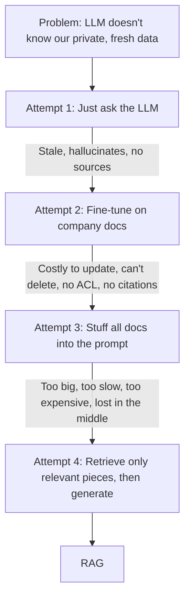

---

### The same parental-leave question, with RAG

1. The system searches Acme's documents and finds the chunk: *"Effective Aug 1, parental leave in India is 16 weeks..."* from `HR_Policy_v7.pdf`, page 12.
2. It builds a prompt: *"Answer using only the context below. Context: [chunk]. Question: How many weeks of parental leave in India?"*
3. The LLM answers: *"16 weeks (HR Policy v7, p.12)."*

Each earlier failure now has an answer:

| Earlier problem | How RAG solves it |
|---|---|
| Stale data | Update the index, not the model |
| Private data | The index holds it; the LLM only sees retrieved chunks |
| Hallucination | The model is grounded in the supplied text |
| No citations | We know exactly which chunk produced the answer |
| Delete / compliance | Delete the chunk from the index and it's gone |
| Access control | Filter retrieval by user permissions *before* the LLM sees anything |
| Cost | Send ~2k tokens per query, not 200M |

---

### The big-picture architecture

Every RAG system has **two pipelines**. Interviewers love it when you separate them right away:

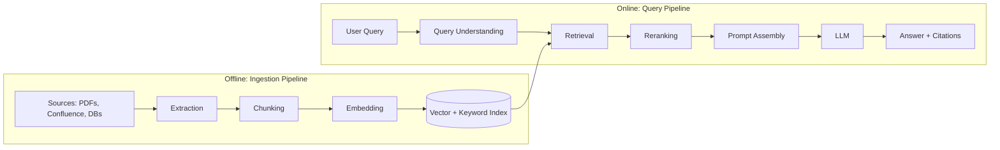

- **Offline (write path):** runs in the background, is throughput-oriented, and can take minutes or hours.
- **Online (read path):** runs per user request, is latency-oriented, and must finish in roughly 1 to 3 seconds.

This is the same read/write separation you already know from other HLD problems, and it shapes every scaling decision later. Ingestion scales for throughput, and querying scales for latency and QPS.

---

### RAG vs Fine-tuning vs Long context: the interview table

| | RAG | Fine-tuning | Long context |
|---|---|---|---|
| **Best for** | Facts, private and changing knowledge | Style, format, behavior | Small, one-off document sets |
| **Update knowledge** | Instant (re-index) | Retrain | Re-paste |
| **Citations** | Natural | Not possible | Possible but weak |
| **Access control** | Filter at retrieval | Not possible | Manual |
| **Cost per query** | Low | Low at inference, high upfront | High |
| **Scales to huge corpora** | Yes | Partially | No |

They aren't mutually exclusive. Many production systems use RAG for knowledge, light fine-tuning for tone and format, and long context for the retrieved chunks. Saying this shows maturity.

---

### Interview soundbite

> "LLMs have frozen, public, unverifiable knowledge. Fine-tuning bakes facts into weights, which makes them hard to update, delete, or permission. Long context is too expensive and degrades in accuracy. RAG keeps knowledge outside the model in a searchable index, retrieves only the relevant pieces per query, and grounds the LLM's answer in them, giving us freshness, citations, access control, and low cost."

---

### Quick self-check

Try answering these in your own words:

1. Why can't fine-tuning satisfy a "delete this document's knowledge" requirement?
2. Why is a 1M-token context window not a replacement for RAG?
3. Why do we split RAG into an offline and an online pipeline?

Answer them if you'd like feedback, or tell me **"next"** and we'll start Chapter 2: **Naive RAG end to end**. There we'll build the simplest working version and watch exactly where it fails, which motivates extraction, chunking, query expansion, and reranking.

---

# Chapter 2: Naive RAG end to end, and where it breaks

## The story

Acme's team is excited about the open-book idea. A small team of two engineers gets one week to build a prototype. They want the **simplest thing that could possibly work**, and that first version is now called **"Naive RAG"** (some people say "Vanilla RAG").

## Building Naive RAG in five steps

**Ingestion (offline):**

1. **Load** all documents as plain text.
2. **Split** every document into fixed-size pieces, say 1,000 characters each. These pieces are called **chunks**.
3. **Embed** each chunk. An embedding model turns text into a list of numbers (a *vector*) so that texts with similar *meaning* get similar vectors.
4. **Store** the vectors, along with the original chunk text, in a vector database.

**Query (online):**

5. Embed the question with the same model. Find the **top-k** (say 3) chunks whose vectors are closest to the question's vector. Paste them into a prompt and ask the LLM.

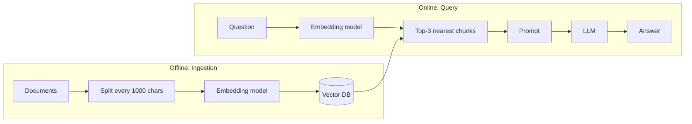

### The runtime flow

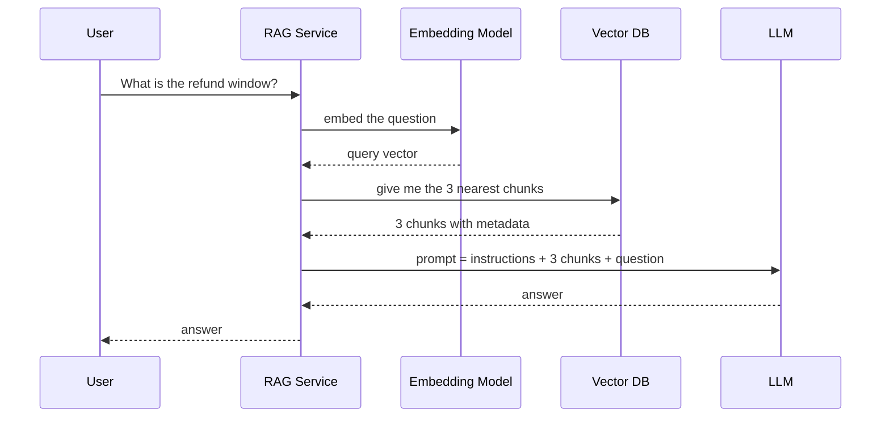

### The whole thing in about 15 lines

```python
# ---------- Offline ----------
chunks = []
for doc in load_documents():
    text = doc.text
    for i in range(0, len(text), 1000):          # fixed-size split
        chunks.append(text[i:i+1000])

vectors = embed_model.encode(chunks)              # e.g. 1024-dim vectors
vector_db.upsert(vectors, payload=chunks)

# ---------- Online ----------
def answer(question):
    q_vec = embed_model.encode([question])[0]
    top_chunks = vector_db.search(q_vec, k=3)     # nearest by cosine similarity
    prompt = f"""Answer ONLY using the context below.
If the answer is not in the context, say "I don't know".

Context:
{top_chunks}

Question: {question}"""
    return llm.generate(prompt)
```

That's the whole system. The interesting part is what happens *inside* `embed_model` and `vector_db.search`.

---

## Intuition: why embeddings work

Suppose we store three chunks:

- **A:** "Refunds are accepted within 30 days of purchase."
- **B:** "Our office is closed on public holidays."
- **C:** "Items may be sent back within a month for a full return."

The user asks: **"How long do I have to get my money back?"**

The question shares almost **no keywords** with A or C. A keyword search (like Ctrl+F) would fail. But the embedding model has learned from huge amounts of text that "get my money back", "refund", and "return" live in the same neighborhood of meaning. So:

```
Similarity(question, A) = 0.82   ← high
Similarity(question, C) = 0.79   ← high
Similarity(question, B) = 0.11   ← low
```

Top-2 gives us A and C, which is what we want. This is **semantic search**, the superpower that made RAG possible. Chapter 5 covers how it works internally.

---

## The demo works, so they ship it

The CEO tries three questions in the demo, and all three work. Everyone celebrates. Then real employees start using it and the complaints roll in. Each failure teaches us something.

### Failure 1: Garbage in, garbage out (extraction)

An employee asks: *"What's the reimbursement limit for a Level 5 manager?"*

The answer lives in a **table** inside a PDF. The naive loader flattened the table into this:

```
Level Meals Travel Lodging L3 $50 $200 $150 L4 $60 $250 $180 L5 $75 $300 $220
```

The row and column structure is gone, so the LLM can't tell which number belongs where. It answers "$75", which is the wrong column.

Other extraction disasters include scanned PDFs (images, so no text at all), page headers and footers repeated in every chunk, multi-column layouts read left-to-right across columns, and slides with text inside images.

**Lesson:** if the text is broken *before* embedding, nothing downstream can fix it. → **Chapter 3: Extraction**

### Failure 2: The answer got cut in half (chunking)

The policy says:

> "...Employees may claim refunds within 30 days. **[← 1000-char boundary]** However, this does not apply to digital goods, which are non-refundable."

The fixed splitter cut it in the middle. Chunk 1 ends with "within 30 days." and Chunk 2 starts with "However, this does not apply...". A question about digital goods retrieves Chunk 2, but Chunk 2 has no idea *what* "this" refers to. The reverse can happen too: the question about the 30-day window retrieves only Chunk 1, and the LLM confidently misses the exception.

Two related problems:

- **Too big:** a 5-topic chunk gets one blurry embedding and matches nothing well.
- **Too small:** a chunk has the fact but not the context ("it is 16 weeks", but *what* is 16 weeks?).

**Lesson:** where you cut the text decides what can be found. → **Chapter 4: Chunking**

### Failure 3: Semantic search misses exact things (embeddings and retrieval)

An engineer asks: *"How do I fix error ERR-4021?"*

Embeddings capture *meaning*, not exact strings. The model sees "ERR-4021" and "ERR-4012" as nearly identical, so it returns the runbook for the wrong error. The same happens with product SKUs, function names, legal clause numbers, and people's names.

**Lesson:** semantic search alone is not enough, and old-school keyword search (BM25) still matters. → **Chapters 5 and 7**

### Failure 4: Users don't ask good questions (query understanding)

A user chats:

> User: "What's the parental leave policy in India?"
> Bot: (good answer)
> User: **"and for adoption?"**

The system embeds "and for adoption?" *literally*. That's vague and has no context, so retrieval returns junk. Other cases include one-word queries ("VPN"), typos, and questions using different vocabulary than the docs ("laptop" vs "endpoint device").

**Lesson:** we need to fix the query before searching. → **Chapter 8: Query Expansion and Rewriting**

### Failure 5: The right chunk is retrieved but ranked 7th (reranking)

The correct chunk exists and the search *does* find it, but at rank 7. We only send the top 3 to the LLM, so the answer never reaches it. Vector search is a fast, rough filter. It's good at "roughly relevant" but bad at "which is the *most* relevant".

We could raise k to 10, but then the prompt gets noisy (more cost, and more distractions for the LLM).

**Lesson:** retrieve broadly and cheaply, then re-score the candidates with a smarter (slower) model. → **Chapter 9: Reranking**

### Failure 6: The LLM misbehaves (generation)

- It ignores the context and answers from its own memory.
- It merges two conflicting policy versions (v6 and v7) into one wrong answer.
- It gives no citations, so users still can't trust it.
- It answers when it should say "I don't know."

**Lesson:** prompt design and guardrails matter. → **Chapter 10**

### Failure 7: It breaks at real scale (systems)

Here's the number that changes how you think about architecture. Let's estimate for Acme:

- 200M tokens ÷ ~500 tokens per chunk ≈ **400,000 chunks**
- One 1024-dim float32 vector = 4 KB → 400k × 4 KB ≈ **1.6 GB**

That fits in RAM on **one machine**, and even brute-force comparison against every vector takes only milliseconds. So for Acme, the naive system is fine on scale.

Now imagine a Google- or Meta-scale corpus: **1 billion chunks**.

- 1B × 4 KB = **4 TB** of vectors, which won't fit on one machine.
- Brute-force comparison per query takes many seconds, not milliseconds.

Now you need **approximate nearest neighbor (ANN) indexes**, **sharding**, **replication**, and **caching**. → **Chapters 6, 12, 13**

> **Interview tip:** always compute the scale numbers *first*. They decide whether the answer is "one Postgres box with pgvector" or "a sharded distributed vector search cluster." Saying "at 400k chunks I wouldn't even need ANN" impresses interviewers more than over-engineering.

### Failure 8: The real world moves (operations)

- The HR policy was updated. Are the old chunks still in the index?
- A document was deleted for legal reasons. Is it *truly* gone?
- An intern asks about executive salaries. Does the retriever filter by permissions?
- How do we know if a change made things better or worse? ("It feels better" is not evidence.)

**Lesson:** freshness, deletion, security, and evaluation are first-class parts of the design. → **Chapters 11 and 14**

---

## The failure map

Every stage of the naive pipeline has a known failure mode, and each chapter of this course fixes one:

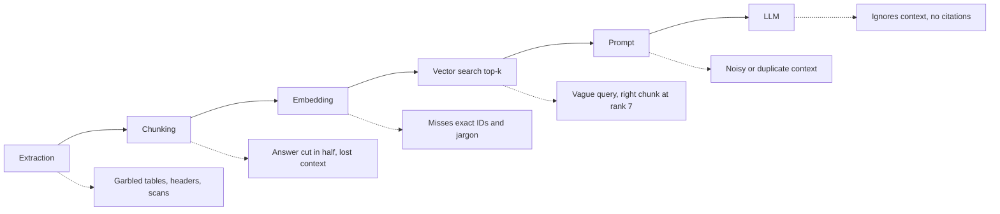

## The four "knobs" of naive RAG

You'll be asked how you'd tune a RAG system, and the answer starts with these knobs:

| Knob | Too low | Too high |
|---|---|---|
| **Chunk size** | Loses context | Blurry embeddings, wasted tokens |
| **Chunk overlap** | Facts split across chunks | Duplicate storage and noisy results |
| **Top-k** | Misses the answer (low recall) | Noisy prompt, higher cost |
| **Embedding model** | Weak semantic match | Slower and pricier |

## Interview soundbite

> "The baseline RAG is: split documents into fixed-size chunks, embed them, store in a vector DB, and at query time embed the question, take the top-k nearest chunks, and stuff them into the LLM prompt. It works for demos but fails in production at every stage: bad extraction from tables and PDFs, chunk boundaries that destroy context, semantic search missing exact identifiers, vague user queries, poor ranking within top-k, and LLMs that ignore or misuse context. Each of these motivates a specific improvement, and I'd decide which ones to invest in based on the corpus, the query patterns, and scale."

## Quick self-check

1. Why did the fixed 1,000-character splitter hurt the "digital goods" question?
2. Why can semantic search fail on a query like "ERR-4021"?
3. At 400k chunks vs 1B chunks, what changes in the design, and why?

Answer any of these if you want feedback, or say **"next"** and we'll start Chapter 3: **Extraction**. That covers how real companies pull clean text, tables, and structure out of messy PDFs, scans, slides, and web pages, and why it's the most under-rated part of RAG.

---

# Chapter 3: Extraction (Ingestion)

## The story

Acme's chatbot is live, and the reimbursement-table failure from last chapter is the top complaint. An engineer, Riya, opens the PDF and does something nobody had done yet: she **looks at what the pipeline actually extracted**.

```
Level Meals Travel Lodging L3 $50 $200 $150 L4 $60 $250 $180 L5 $75 $300 $220
```

Her realization: **the LLM never had a chance.** It was shown garbage and asked to produce gold.

> **Core principle:** RAG quality is capped by extraction quality. Every later stage, whether chunking, embedding, or reranking, can only work with what extraction gave it.

Let's follow how the industry improved this step by step.

---

## Attempt 1: A plain text extractor

The prototype used a simple library that pulls text from a PDF (think `pdftotext` or PyPDF). It reads the PDF's internal "draw this character at this position" instructions and dumps the characters as a stream.

| Problem | Example |
|---|---|
| **Tables flattened** | Rows and columns collapse into one line of numbers |
| **Multi-column layouts** | A two-column research paper is read straight across, so sentence 1 of column A gets glued to sentence 1 of column B |
| **Headers and footers** | "Acme Confidential, Page 12 of 40" gets injected into the middle of paragraphs and repeated in every chunk |
| **Scanned PDFs** | These are just images, so the extractor returns an **empty string**, and 15% of Acme's contracts were silently ignored |
| **Lost structure** | Headings, bullet nesting, and lists all look like plain text |
| **Hyphenation and ligatures** | "reim-\nbursement" becomes two tokens, and "finance" (with a ligature) doesn't match "finance" |

A **PDF is not a document format, it's a drawing format.** It stores where to paint glyphs, not paragraphs or tables. That's why extraction is genuinely hard.

Two-column example:

```
What the page looks like:        What Attempt 1 produced:
┌──────────┬──────────┐
│ Refunds  │ Digital  │          "Refunds are accepted Digital goods are
│ are      │ goods    │           within 30 days of    non-refundable and
│ accepted │ are non- │           purchase for..."
│ ...      │ ...      │
└──────────┴──────────┘          (two unrelated sentences interleaved)
```

---

## Attempt 2: OCR everything

*"Scans have no text? Then treat every page as an image and run OCR (Optical Character Recognition) on all of them."*

OCR converts pixels into characters. It fixed the empty-scan problem, but new issues showed up:

- **Slow and expensive.** OCR on pages that already had perfectly good embedded text is wasted compute.
- **Errors.** "0" vs "O", "1" vs "l", and smudged fax scans produce typos. A wrong digit in a contract amount is a serious bug.
- **Structure still lost.** OCR gives you words and coordinates, not tables or headings.

**Lesson:** OCR is a tool for *some* pages, not a strategy.

---

## Attempt 3: Layout-aware parsing

The insight: **understand the page like a human does.** Look at the page, detect regions, classify each region, and treat each type differently.

A **layout detection model** (an object-detection-style vision model) looks at a page and outputs boxes labeled as:

- Title / Heading
- Paragraph
- Table
- Figure / Image
- List
- Header / Footer / Page number (to be **dropped**)
- Caption, Footnote

Now:

- Reading order is solved per region, so columns are handled properly.
- Headers and footers are identified and removed instead of polluting every chunk.
- Tables are sent to a **specialized table extractor** that recovers rows and columns.
- Headings are kept, so we know the *document hierarchy*.

Existing tools in this space include Unstructured, Docling, cloud document-AI services (AWS Textract, Azure Document Intelligence, Google Document AI), and PyMuPDF-style libraries for the digital-text basics. You don't need to memorize vendors. In an interview, say "a layout-aware parser or a managed document-AI service".

The result is a **typed element list** instead of a blob of text:

```json
[
  {"type": "Title",  "text": "Employee Expense Policy", "page": 1},
  {"type": "Heading","text": "Reimbursement Limits by Level", "page": 4},
  {"type": "Table",  "page": 4, "rows": [
      ["Level","Meals","Travel","Lodging"],
      ["L3","$50","$200","$150"],
      ["L4","$60","$250","$180"],
      ["L5","$75","$300","$220"]]},
  {"type": "Paragraph","text": "Claims must be filed within 30 days...", "page": 5}
]
```

That's a huge upgrade. Chunking (next chapter) can now respect these boundaries.

---

## Handling tables properly

Tables deserve extra attention because they carry the highest-value facts (limits, prices, SLAs) and break the most easily.

**Step 1: Keep the structure.** Convert to Markdown, HTML, or CSV-like text:

```
| Level | Meals | Travel | Lodging |
|-------|-------|--------|---------|
| L5    | $75   | $300   | $220    |
```

Now an LLM can read "L5 → Meals $75" correctly.

**Step 2: The embedding problem.** An embedding model handles a table of pipes and numbers poorly, so a question like "what can a manager claim for hotels?" won't match it well.

**Step 3: The "summary for search, raw for answer" trick.** Have an LLM write a short natural-language description of the table:

> *"Expense reimbursement limits per day by employee level (L3 to L5) for meals, travel, and lodging. L5 limits: meals $75, travel $300, lodging $220."*

We **embed the summary** (good for finding) but **return the original table** to the answering LLM (good for accuracy). This pattern comes back in chunking as the **parent-child** idea: search on one representation, return another.

**Step 4: Big tables.** A 500-row table can't be one chunk. Split by row groups and **repeat the header row in every piece**. Otherwise "$75" floats around with no column name.

---

## Images, charts, diagrams, slides

A PowerPoint slide's key content may be a chart. A runbook's key content may be an architecture diagram. Text extraction sees nothing.

- **Captioning:** send the image to a **vision-language model (VLM)** and ask for a description plus any text or numbers visible. Embed the caption and store a pointer to the image.
- **Slides:** treat each slide as a unit, combining slide text, speaker notes, and image captions.

---

## Attempt 4: Let a vision-language model read the page

Newer approach: skip the parsing stack. Render each page to an image and ask a multimodal LLM to *"transcribe this page to Markdown, preserving tables and headings."* It handles messy layouts, handwriting, and weird forms surprisingly well.

Trade-offs to state in an interview:

| | Classic layout parser | VLM page reading |
|---|---|---|
| **Cost** | Low | High (per page, per token) |
| **Speed** | Fast (CPU) | Slow (GPU or API calls) |
| **Failure mode** | Structural errors | **Hallucination**: it may "fix" or invent text |
| **Best for** | Bulk, clean digital docs | Hard pages, complex tables, scans |

There's also a research-driven alternative: **embed page images directly** (as in ColPali-style models) and skip text extraction altogether. It's promising for visually rich documents but less mature operationally, so mention it as an emerging option, not the default.

---

## The production answer: a tiered router with fallbacks

Nobody uses one method for everything. Real systems **route documents by type and difficulty**, starting cheap and escalating only when needed:

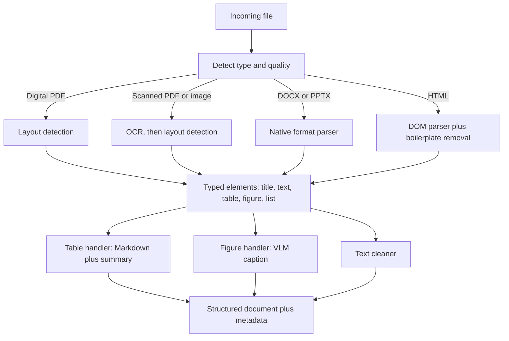

The **escalation ladder** for one problematic PDF:

1. Fast embedded-text extraction. Run a **quality check** on the output.
2. If quality is low (see the heuristics below), fall back to layout parser plus OCR.
3. If still low, or the page contains a complex table, send that **page only** to a VLM.
4. If everything fails, **quarantine** the document and alert. Don't silently drop it.

**Quality heuristics** (cheap signals that extraction went wrong):

- Very few characters per page for a page that looks full of ink means a scan.
- High ratio of non-printable or garbage characters.
- Many single-character "words" (columns interleaved).
- OCR confidence score below a threshold.
- Extracted numbers don't add up (for tables with totals).

Escalating **per page**, not per document, is a good cost-saving detail to mention.

---

## Cleaning and normalization

After parsing, before anything is indexed:

- **Boilerplate removal:** headers, footers, page numbers, cookie banners, nav menus (for HTML), email signatures and legal disclaimers.
- **Text normalization:** unicode normalization, fix hyphenation across line breaks, expand ligatures, collapse whitespace.
- **Deduplication:**
  - *Exact duplicates:* hash the content.
  - *Near duplicates:* the same policy copied into 12 wikis with tiny edits. Use MinHash/SimHash-style fingerprints. Without dedup, your top-k fills with 5 copies of the same paragraph, which wastes prompt space and crowds out other useful chunks.
- **PII handling:** detect and mask or tag sensitive data (SSNs, card numbers) according to policy, *before* it gets into an index.
- **Language detection:** it decides which embedding model or analyzer to use later.

---

## Metadata: the most valuable by-product

Extraction shouldn't only produce text. It should produce **metadata** that powers almost everything downstream:

```json
{
  "doc_id": "hr-policy-2024",
  "version": 7,
  "source": "sharepoint://hr/policies/leave.pdf",
  "page": 12,
  "section_path": "HR Policy > Leave > Parental Leave > India",
  "doc_type": "policy",
  "language": "en",
  "created_at": "2024-08-01",
  "updated_at": "2024-08-01",
  "content_hash": "9f2c...",
  "acl": ["group:hr-all", "group:india-employees"],
  "parser_version": "3.2"
}
```

| Metadata | Enables |
|---|---|
| `page`, `source` | **Citations** ("HR Policy v7, p.12") |
| `section_path` | Adds context to chunks ("this is about India parental leave") |
| `version`, `updated_at` | Preferring the latest version, freshness filtering |
| `acl` | **Permission filtering** at retrieval time |
| `content_hash` | Change detection and dedup |
| `parser_version` | Knowing what to **re-process** when you upgrade the parser |

Don't treat metadata as an afterthought. It's what makes citations, security, and updates possible.

---

## Different sources, different problems

| Source | Typical challenge | Approach |
|---|---|---|
| PDF | Layout, tables, scans | Layout-aware parsing with tiered fallbacks |
| DOCX / PPTX | Nested structure, embedded images | Native parsers (they retain real structure) |
| HTML / web | Boilerplate, JS-rendered pages | DOM parsing, main-content extraction |
| Confluence / Notion / Drive | Permissions, pagination, rate limits | API connectors with incremental sync |
| Slack / email | Threads, noise, privacy | Group by thread, filter noise, strict ACLs |
| Databases | Rows aren't documents | Serialize records to text or use text-to-SQL for structured questions |
| Audio / video | No text at all | Speech-to-text (transcription), keep timestamps |
| Code | Structure matters | Parse by function or class using syntax trees |

---

## The system-design view: an ingestion pipeline at scale

This is where interview answers become "HLD". The extraction stage is a **distributed batch and streaming pipeline**:

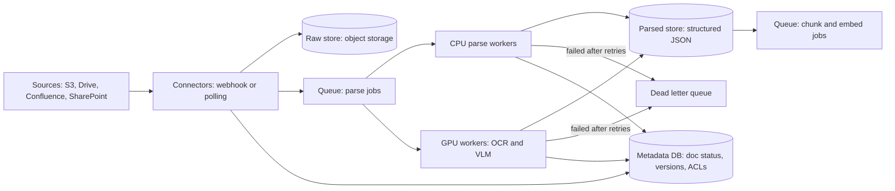

### Key design decisions

**1. Store the raw document forever (source of truth).** Keep the original files in object storage. Parsers improve over time, and when you upgrade you can **re-parse everything** without going back to the source systems. Keep the **parsed output** as a separate, versioned artifact (tagged with `parser_version`).

**2. Queue between stages.** Decoupling connectors, parsers, and embedders means each stage scales independently and absorbs bursts. If someone dumps 2M files into a bucket, the queue absorbs the spike and the workers drain it at their own pace (**backpressure**).

**3. Separate worker pools by cost profile.** Cheap CPU workers handle digital PDFs and Office files. Expensive **GPU workers** handle OCR and VLM. Route by document type so GPUs don't sit idle behind slow CPU jobs, or vice versa.

**4. Parallelism at the page level.** A 2,000-page PDF shouldn't be one 30-minute job. Fan out **per page or per page-range**, then merge in reading order. This also gives partial-failure isolation.

**5. Idempotency.** Jobs may be delivered twice (at-least-once queues). Use a job key like `doc_id + content_hash + parser_version`. Reprocessing the same input then produces the same output and doesn't create duplicates.

**6. Change detection.** Don't re-parse everything on every sync. Use ETag, last-modified, or content hash to detect what really changed. Only changed docs go into the queue.

**7. Deletion and permission changes.** These are events too. If a document is deleted or its ACL changes at the source, the pipeline must propagate that (tombstones and ACL updates) all the way to the index. We'll cover this in Chapter 14.

### Scale estimate (illustrative)

Acme acquires a company and needs to ingest **1M scanned pages**.

- OCR at ~1 second per page per worker → 1,000,000 seconds ≈ **11.6 days** on one worker.
- With 100 parallel workers → ~10,000 seconds ≈ **2.8 hours**.

So the answer is horizontal scaling with page-level fan-out, not a faster single machine.

**Cost control:** VLM calls cost real money. Run them only on pages that failed cheaper methods, cache results by content hash (identical pages never get processed twice), and set per-tenant budgets.

---

## Error handling in ingestion

Real corpora are messy. Expect these:

| Failure | Handling |
|---|---|
| Corrupt or unreadable file | Mark `FAILED`, store the error reason, notify the owner |
| Password-protected file | Quarantine with a clear status |
| Timeout on a huge file | Split into page ranges, retry only the failed range |
| Transient errors (API rate limits, network) | **Retry with exponential backoff and jitter** |
| Repeated failure ("poison message") | Move to **Dead Letter Queue** after N retries, so it doesn't block the queue |
| Parser produced low-quality output | Escalate down the fallback ladder, then quarantine |
| Partial success | Index good pages, flag failed ones, and never silently drop |

Track each document with a state machine so the team can always answer "why isn't my document searchable?":

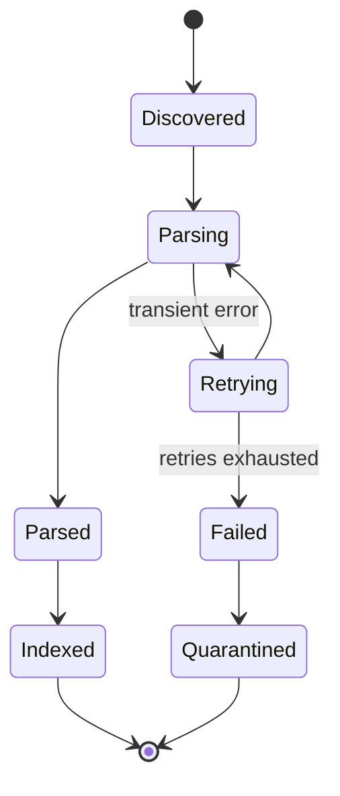

**Observability:** dashboards for parse success rate by file type, queue depth and age of oldest message, per-stage latency, DLQ size, and the fraction of pages that needed escalation to OCR or VLM. A rising escalation rate is an early warning that a source system changed its format.

---

## Measuring extraction quality

Teams often skip this and then blame the LLM. Instead:

- Keep a **golden set** of ~100 tricky documents (tables, scans, multi-column) with human-verified extraction.
- Measure text accuracy and **table structure accuracy** separately.
- Randomly sample production docs for periodic human review.
- Track the *downstream* effect. If a parser upgrade improves retrieval hit rate on your evaluation set, it was worth it (more on this in Chapter 11).

---

## Naive vs improved extraction: the same table

| | Naive | Improved |
|---|---|---|
| Table | `Level Meals Travel Lodging L3 $50...` | Markdown table plus NL summary |
| Headers and footers | In every chunk | Removed |
| Scans | Empty | OCR, with quality check |
| Metadata | None | page, section path, version, ACL |
| Failures | Silent | Tracked, retried, quarantined |
| Upgrade path | Re-crawl everything | Re-parse from raw store |

---

## Interview soundbite

> "Extraction is the foundation of RAG because garbage text can't be fixed downstream. I'd build a tiered pipeline: detect file type, use fast native parsers for clean digital docs, layout-aware parsing for PDFs so tables, columns, and headers are handled properly, OCR for scans, and escalate only hard pages to a vision-language model, with quality checks deciding when to escalate. Tables are preserved as Markdown, with an LLM-generated summary used for embedding. Output is a typed, structured document with rich metadata: page, section path, version, ACLs, content hash. Architecturally it's an asynchronous pipeline: connectors write raw files to object storage, queues feed CPU and GPU worker pools, jobs are idempotent and fanned out per page, failures retry with backoff and land in a dead-letter queue, and I keep the raw files so I can re-parse when the parser improves."

---

## Quick self-check

1. Why is a PDF hard to extract text from, compared with a Word document?
2. Why embed a table's *summary* but return the *original table* to the LLM?
3. Why fan out per page and keep the raw files in object storage?

Answer any of them for feedback, or say **"next"** and we'll move to Chapter 4: **Chunking**. That's where we decide how to cut clean, structured text into pieces, and where the "answer got cut in half" failure gets solved.

---

# Chapter 4: Chunking

## The story

After Riya's extraction fixes, Acme's tables and scans are clean. But the "digital goods" complaint is still open. Here is the refund section, now extracted perfectly:

> *Refunds are accepted within 30 days of purchase. However, this does not apply to digital goods, which are non-refundable. Gift cards can be exchanged but not refunded.*

The fixed 1,000-character splitter still cuts it wherever the 1,000th character happens to fall. Riya says: "We have clean text, but we're slicing it like bread."

**Chunking** is the decision of how to cut extracted text into the units that get embedded, stored, retrieved, and shown to the LLM.

---

## Why chunk at all?

Why not embed each whole document? Four reasons:

| Reason | Explanation |
|---|---|
| **Embedding model input limit** | Models accept a maximum number of tokens (commonly 512 to 8,192). Text beyond it is **silently truncated**, so the tail of a long document becomes unsearchable. |
| **Blurry vectors** | One vector for a 40-page document is an average of 50 topics. It matches none of them sharply. |
| **Precision** | The answer is usually 2 sentences. Returning 40 pages wastes tokens and distracts the LLM. |
| **Cost and latency** | The LLM bills per input token. |

But there's an opposite danger. A chunk that's too small has a sharp embedding but **no context**.

```
Too big:    [Refunds + Shipping + Warranty + Contact info + ...]  → blurry, matches nothing well
Too small:  ["It is 16 weeks."]                                   → sharp but 16 weeks of WHAT?
Just right: [A self-contained idea with enough context to answer]
```

**Chunking is the art of making each chunk a self-contained unit of meaning.** Let's watch how the industry evolved.

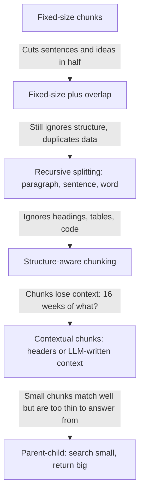

---

## Attempt 1: Fixed-size chunks

Split every N characters (or tokens), ignoring content.

```
Chunk 1: "...Refunds are accepted within 30 days of purchase. Howev"
Chunk 2: "er, this does not apply to digital goods, which are non-ref"
Chunk 3: "undable. Gift cards can be exchanged but..."
```

**Pros:** trivial, fast, and every chunk is a predictable size, which is easy to batch and budget.

**Cons:** it cuts mid-word, mid-sentence, and mid-idea. Chunk 2 says "this does not apply" with no idea what "this" is.

**Lesson:** the size limit is a constraint, not a splitting strategy.

---

## Attempt 2: Fixed-size with overlap

*"If a boundary might cut an idea, let neighboring chunks share some text."* Each chunk repeats the last ~10 to 20% of the previous one.

```
Chunk 1: [ A A A A A A A A A A ]
Chunk 2:                 [ A A | B B B B B B B B ]     ← overlap
Chunk 3:                                 [ B B | C C C C C C C C ]
```

Now a sentence cut at the boundary appears whole in at least one chunk (if the overlap is bigger than the sentence).

**Trade-offs:**

| Benefit | Cost |
|---|---|
| Ideas at boundaries survive | **Storage inflation**: 512-token chunks with 64 overlap store ~12.5% more vectors and text |
| Cheap insurance | **Duplicate hits**: top-k can return two chunks with the same overlapping text, wasting prompt space |
| | Doesn't fix a *long* idea that exceeds the overlap |

**Lesson:** overlap is a band-aid. Better to cut at natural boundaries in the first place.

---

## Attempt 3: Recursive splitting

*"Cut at the biggest natural boundary that fits."* Try separators in order of preference:

1. Section breaks / double newlines (paragraphs)
2. Single newlines
3. Sentence endings
4. Spaces (words)
5. Characters (last resort)

Algorithm: split by paragraphs. If a paragraph fits under the size limit, keep it. If not, split *that* piece by sentences, and so on. Then **merge small neighbors** up to the limit so we don't produce tiny chunks.

Result on our refund text: chunks now break at sentence boundaries. That's a big improvement, and this is the **default in most libraries** (a "recursive character text splitter").

Two practical points:

- **Measure size in tokens, using the embedding model's own tokenizer**, not characters. Characters vary wildly (code, other languages), and the model's limit is in tokens. Leave a safety margin.
- It still knows nothing about *document structure*. A heading can be separated from its paragraph, and a table can be split between rows.

---

## Attempt 4: Structure-aware chunking

This is where Chapter 3 pays off. We now have **typed elements** (title, heading, paragraph, table, list, code), so we chunk along the document's own hierarchy:

- Each **section** (heading plus its content) is a natural chunk. If it's too big, split it recursively *inside* the section, never across sections.
- A heading is always attached to the content beneath it.
- **Tables**: keep whole if small. If large, split by row groups and **repeat the header row** in each piece.
- **Lists**: keep the intro sentence ("The following are not refundable:") together with its items.
- **Code**: split by function or class using the syntax tree, not by lines.

Different content types call for different strategies:

| Content | Best chunk unit |
|---|---|
| Policy / legal | Section or clause, keeping numbering ("§4.2") |
| FAQ | One question + answer pair per chunk |
| Slides | One slide (text + notes + image caption) |
| Chat / Slack / transcripts | A window of turns or a thread, with speaker names |
| Code | Function or class, with docstring and file path |
| Web pages | Content under each heading |
| Tables | Row groups with the header repeated |

**Lesson:** the document already tells you where the ideas are. Use it.

---

## Attempt 5: Semantic chunking

*"Let meaning decide the boundaries."* Embed each sentence, then compare adjacent sentences. Where similarity **drops sharply**, the topic probably changed, so cut there.

```
S1 "Refunds accepted within 30 days."        ┐
S2 "Digital goods are non-refundable."       │ high similarity → same chunk
S3 "Gift cards can be exchanged."            ┘
S4 "Our offices are closed on holidays."       ← big drop → cut here
```

**Pros:** chunks follow topic changes even in unstructured text (transcripts, long prose).

**Cons:**

- Extra embedding cost at ingestion (every sentence gets embedded).
- Chunk sizes become unpredictable. Some are huge and some are tiny, so you need min and max bounds.
- Benchmarks are mixed. Gains over good recursive or structure-aware splitting are often modest, and sometimes negative.

**Honest interview answer:** "I'd try it on unstructured text and measure. I wouldn't default to it."

There are also more exotic options to name-drop: **proposition chunking** (an LLM rewrites text into atomic, self-contained facts, which is great for QA but expensive), **LLM-driven "agentic" chunking**, and **late chunking** (embed the whole long document first with a long-context embedding model, then pool per-chunk vectors so each chunk's embedding "knows" the surrounding document).

---

## The next problem: chunks that have lost their context

Even with perfect boundaries, a chunk pulled out of its document can be ambiguous. Take this chunk from the HR policy:

> *"The entitlement is 16 weeks, extendable by 4 weeks with a medical certificate."*

Which entitlement? Which country? A user asking "parental leave India" may not match it, because the words "parental", "leave", and "India" appear in the **section heading**, not in the chunk.

### Fix A: Contextual headers (cheap)

Prepend the document title and section path (from Chapter 3's metadata) to the chunk text *before embedding*:

```
[Acme HR Policy v7 > Leave > Parental Leave > India]
The entitlement is 16 weeks, extendable by 4 weeks with a medical certificate.
```

Now the embedding carries the topic. This is cheap and very effective.

### Fix B: LLM-generated context per chunk (contextual retrieval)

For each chunk, give an LLM the whole document plus the chunk and ask for a 1 to 2 sentence situating description:

> *"This chunk is from Acme's HR Policy v7, section on India parental leave, describing the length of paid leave and medical extension."*

Prepend that to the chunk before embedding **and** before building the keyword index. Anthropic published this as "Contextual Retrieval" and reported large reductions in failed retrievals, especially when combined with keyword search and reranking.

**The cost problem:** one LLM call per chunk over a large document is expensive. The mitigation is **prompt caching**: the whole document is the same prefix for all its chunks, so it's processed once and reused, and only the chunk-specific part changes. Mention this cost awareness in the interview.

---

## The next trade-off: matching well vs. answering well

Small chunks (about 100 to 200 tokens) have **sharp embeddings**, so they match questions precisely. But a sentence alone may be too thin for the LLM to answer from. Big chunks (about 800+ tokens) give the LLM rich context, but their embeddings are blurrier.

We want both, and the trick is to **decouple what you search from what you return.**

### Parent-child (small-to-big) retrieval

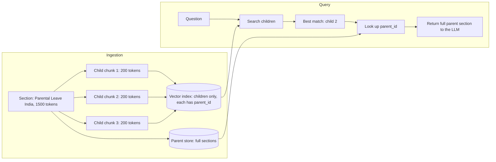

**Walkthrough:** the question "Can leave be extended?" matches child 2 strongly (it mentions the 4-week medical extension). We don't send that snippet alone. We look up its parent and send the **entire section**, so the LLM also sees the base entitlement, eligibility, and exceptions.

Variants:

- **Sentence-window:** embed single sentences, return the sentence plus N neighbors on each side.
- **Multi-representation:** embed a *summary*, or *hypothetical questions the chunk answers*, but return the original chunk (this is the same "search one form, return another" idea you saw with tables).

**Watch out:** if the top 3 children share the same parent, **deduplicate parents** before building the prompt, or you'll send the same section three times.

---

## Worked example: one passage, five strategies

Text: *"Refunds are accepted within 30 days of purchase. However, this does not apply to digital goods, which are non-refundable. Gift cards can be exchanged but not refunded."* (under the heading **Returns Policy > Refunds**)

| Strategy | What the question "Can I get a refund on an e-book?" gets |
|---|---|
| Fixed-size | Chunk starting "er, this does not apply..." → confusing |
| Fixed + overlap | Probably contains the digital-goods sentence, but maybe cut awkwardly |
| Recursive | The sentence "However, this does not apply to digital goods..." alone → "this" is ambiguous |
| Structure-aware + header | Whole Refunds section with the heading → clear and complete |
| Parent-child | Child matches "digital goods"; the LLM receives the full Refunds section |

The failure from Chapter 2 is fixed.

---

## How do you choose chunk size? (the interview question)

There is no universal answer. Use a starting point, then **measure**.

**Typical starting point:** about 200 to 500 tokens, with 10 to 15% overlap (or none, if you split on structure).

| Factor | Pushes toward |
|---|---|
| Factoid questions ("what's the limit for L5?") | Smaller chunks |
| Explanatory / "how does X work" questions | Larger chunks |
| Embedding model with a short input limit | Smaller |
| Long-context LLM and rich documents | Larger (or parent-child) |
| Tight prompt budget or latency | Smaller, with fewer results |
| Highly structured docs | Follow the structure and ignore fixed sizes |

**The experiment:** build an evaluation set of, say, 200 real questions with known correct source passages. Index the corpus with chunk sizes 128, 256, 512, and 1024, and measure **recall@k** (did the right chunk appear in the top k?) and end-to-end answer quality. Pick the winner for *your* data. We'll build this properly in Chapter 11.

---

## System design view: the chunking service

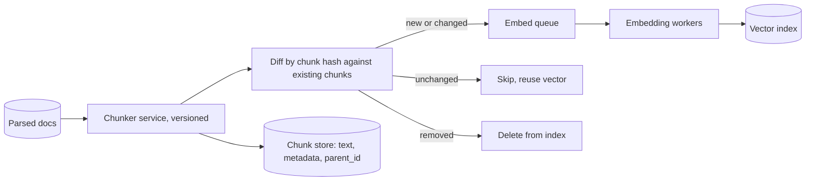

### Key design decisions

**1. Chunking is cheap. Embedding is expensive.** Chunking is pure CPU string work and fast. The costly step after it is embedding (GPU or API). So the design goal is to **avoid unnecessary re-embedding**.

**2. Stable, content-based chunk IDs.**
Suppose a document is edited by inserting one paragraph at the top. With position-based IDs (`doc42_chunk_0`, `doc42_chunk_1`, ...), every chunk shifts, so **everything looks changed** and gets re-embedded. With a **content hash** ID (for example `hash(doc_id + normalized_text)`), only the truly new or edited chunks differ. The diff step above then skips the unchanged ones, saving embedding cost and index churn.

**3. Metadata inheritance.** Every chunk copies the parent document's metadata: `doc_id`, `version`, `page`, `section_path`, and above all the **ACL**. If a chunk loses its ACL, you have a security hole (Chapter 14).

**4. Version the chunker.** Store `chunker_version` (and `parser_version`, `embedding_model_version`) on every chunk. When you improve chunking, you know exactly which chunks are stale.

**5. Changing strategy means re-embedding everything.** Illustrative math:

| Corpus | Tokens to re-embed | Reality |
|---|---|---|
| Acme: 400k chunks × 500 tokens | 200M | Cheap (small dollar amounts), done in hours |
| Web-scale: 1B chunks × 500 tokens | 500B | Real money, days of GPU time |

So you never re-chunk "in place". You build a **shadow index** with the new strategy, evaluate it, and **swap atomically** (blue/green, via an index alias) if it wins. Old and new keep serving until then.

**6. Chunk-store schema (example):**

```json
{
  "chunk_id": "c_9a1f...",
  "doc_id": "hr-policy-2024",
  "doc_version": 7,
  "parent_id": "sec_leave_india",
  "text": "[HR Policy > Leave > Parental Leave > India] The entitlement is 16 weeks...",
  "token_count": 212,
  "position": 3,
  "section_path": "HR Policy > Leave > Parental Leave > India",
  "page": 12,
  "acl": ["group:hr-all"],
  "chunker_version": "2.1",
  "embedding_model": "embed-v3"
}
```

### Scale estimate

- Acme: 200M tokens ÷ ~450 effective tokens per chunk (500 minus overlap) ≈ **~440k chunks**.
- Chunk text is roughly 2 KB each, so ~1 GB of chunk text (small). The vectors (1024-dim float32 = 4 KB each) take about 1.8 GB.
- The numbers tell you chunk *metadata* storage is trivial next to **vector storage**, which is what drives sharding decisions later.

---

## Error handling and edge cases

| Situation | What to do |
|---|---|
| Chunk exceeds the embedding model's token limit (tokenizer mismatch, giant unbreakable text) | Enforce a hard max with a safety margin, and force-split as a last resort |
| Empty or whitespace-only chunk, or only boilerplate | Drop it, and log the count |
| Tiny "orphan" chunk (a lone heading or a one-line remainder) | Merge into the neighbor |
| Very long table row or code block | Split at the nearest logical boundary and repeat context (table header, function signature) |
| Chunker throws on weird input | Catch per document, fall back to the simple recursive splitter, flag for review |
| Chunker crashes midway | Idempotent job keyed by `doc_id + content_hash + chunker_version`, so a retry recreates the same chunks |

**Invariant tests worth mentioning:** no chunk exceeds the max tokens, concatenating chunks (minus overlap) reproduces the section, every chunk has an ACL, and no chunk is empty. Cheap automated checks catch many production bugs.

**Monitoring:** chunk-size histogram (a sudden spike of tiny chunks means a parser change), number of chunks per document, duplicate-chunk ratio, and the fraction hitting a fallback path.

---

## Interview soundbite

> "Chunking decides what's findable. I'd start from the document's own structure, since after extraction I have headings, tables, and lists, and split by section, with recursive splitting inside oversized sections, sized in tokens using the embedding model's tokenizer, at roughly 200 to 500 tokens. I'd prepend the title and section path to each chunk so it carries its context, and use parent-child retrieval so I search small chunks for precision but hand the LLM the full parent section for context. Tables are kept whole or split by row groups with the header repeated. I'd treat chunk size as a tunable, measured through recall@k on a labeled question set, and not guess. Operationally, chunk IDs are content hashes so an edit re-embeds only the changed chunks, the chunker is versioned, every chunk inherits its document's ACL, and if I change strategy I build a shadow index and swap it in."

---

## Quick self-check

1. Why does overlap help, and what are its two costs?
2. Why do we search small chunks but return the parent in parent-child retrieval?
3. Why use content-hash chunk IDs instead of position-based ones?

Answer any of these for feedback, or say **"next"** and we'll go to Chapter 5: **Embeddings**. That's the magic step: how text becomes vectors, why "refund" and "get my money back" end up close together, how to choose an embedding model, and what happens when the model itself needs to change.

---

# Chapter 5: Embeddings

## The story

Acme's team has clean extraction and smart chunking. Now they face the question hiding inside Chapter 2's magic step: **how does the system know that "get my money back" and "refund" mean the same thing?**

Before embeddings, they had to solve it the hard way.

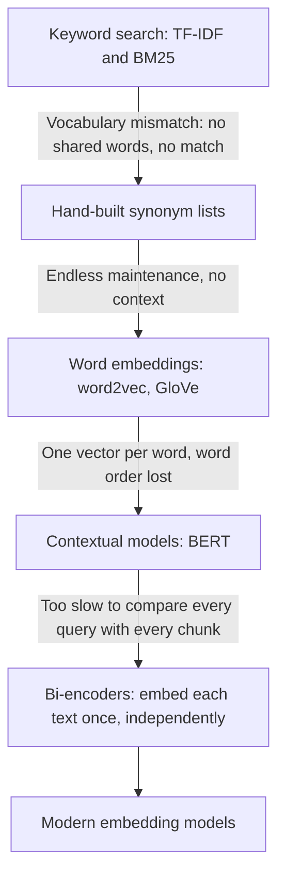

---

## Attempt 1: Keyword search

Classic search engines count words. **TF-IDF** and its successor **BM25** score a document higher when it contains the query's words, especially rare ones.

A user asks: *"How long do I have to get my money back?"*

The policy says: *"Refunds are accepted within 30 days of purchase."*

Shared words: **none**. Keyword search returns nothing useful. This is the **vocabulary mismatch problem**: humans use different words for the same idea.

## Attempt 2: Synonym lists

*"Add 'money back → refund → return → reimbursement' to a thesaurus."* This works for the ten cases someone thought of. Acme's 50,000 documents span HR, legal, and engineering, and every domain has its own jargon. Nobody can maintain that list, and it can't handle context ("bank" of a river vs "bank" for money).

## Attempt 3: Word embeddings (word2vec, GloVe)

The breakthrough idea: **learn from text which words appear in similar contexts, and give each word a vector (a list of numbers)** so that words with similar meanings get nearby vectors.

- "refund" and "reimbursement" appear near "money", "return", "30 days", so their vectors end up close.
- Famous demo: `king − man + woman ≈ queen`. Meaning had become geometry.

For search, people averaged the word vectors of a sentence. Two problems appeared:

| Problem | Example |
|---|---|
| **One vector per word, regardless of context** | "bank" has the same vector in "river bank" and "bank account" |
| **Averaging destroys word order** | "dog bites man" and "man bites dog" get the **same** average |

## Attempt 4: Contextual models (BERT)

BERT-style transformers read the *whole sentence at once*, so the vector for "bank" now depends on its neighbors. Meaning is captured much better.

Now try using it for search. The natural design is a **cross-encoder**: feed the *pair* (question, chunk) into the model together and let it output a relevance score.


It's accurate, but a disaster for search speed. To answer one question over 440k chunks, you'd run **440,000 model passes**, one per chunk, for **every query**. That's minutes per question, and you can't precompute anything because each score depends on the query.

## Attempt 5: Bi-encoders (Sentence-BERT and descendants)

The key move: **encode each text independently into a single vector**. Then compare vectors with cheap math.

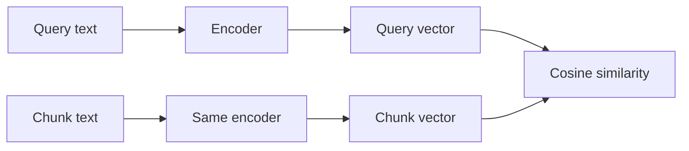

Now the expensive part changes:

- **Offline:** embed all 440k chunks **once** and store the vectors.
- **Online:** embed only the **query** (one model pass, tens of milliseconds), then find the nearest stored vectors, which is fast vector math.

That's the architecture behind every RAG retriever today, and the reason the offline/online split from Chapter 1 works.

> **Interview hook:** the *bi-encoder vs cross-encoder* trade-off comes up again in Chapter 9 (reranking). Bi-encoder = fast, approximate, precomputable. Cross-encoder = slow, accurate, run only on a shortlist.

---

## What an embedding actually is

An embedding is a **fixed-length list of numbers** (commonly 384 to 3072 of them) produced by a neural network for a piece of text. Each individual number means nothing to a human. What matters is **distance**: texts with similar meaning land close together.

A 2D sketch of what is really a 1000+ dimensional space:

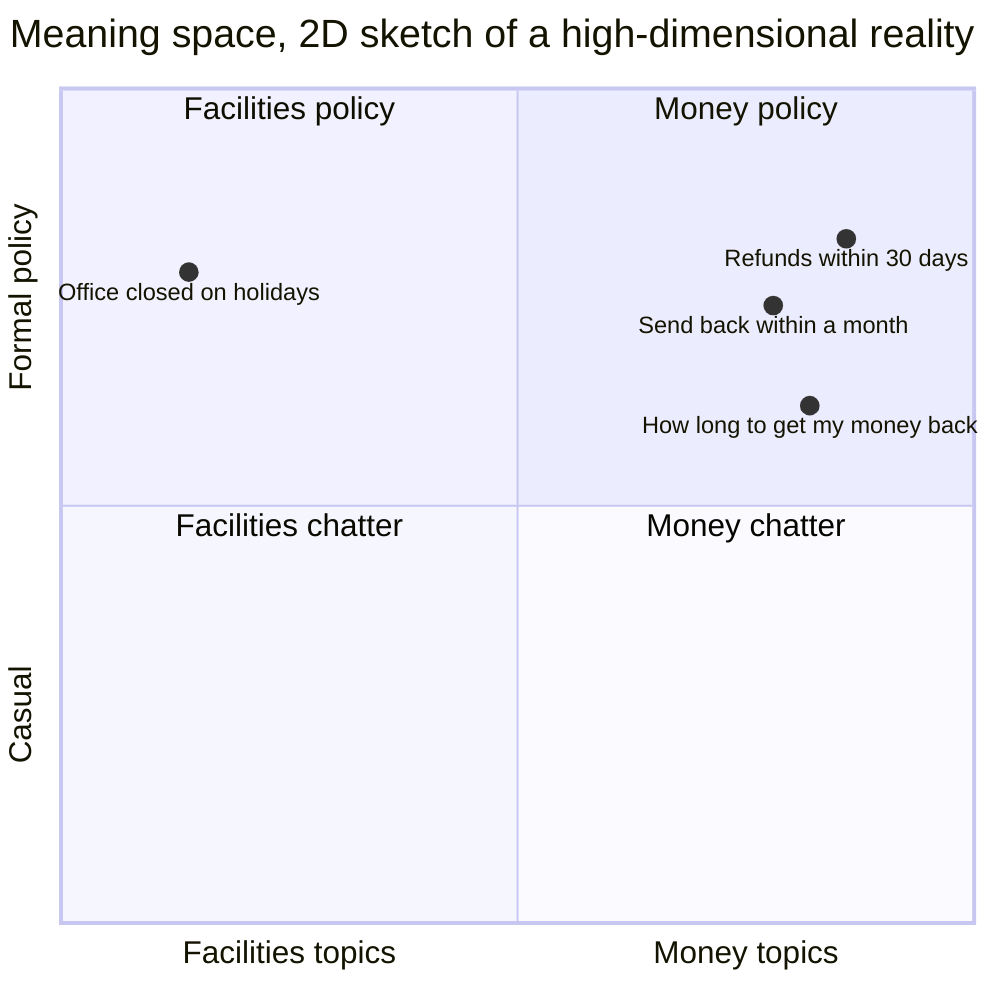

The three refund-related texts cluster together even though they share almost no words. The holiday sentence is far away.

### Measuring "closeness"

Three common measures:

| Metric | What it measures | Note |
|---|---|---|
| **Cosine similarity** | Angle between vectors (ignores length) | Most common for text |
| **Dot product** | Angle *and* length | Fast, and identical to cosine if vectors are normalized |
| **Euclidean (L2) distance** | Straight-line distance | Also equivalent in ranking if vectors are normalized |

A tiny worked example (real vectors have 1000+ dimensions, this one has 2):

```
query  q = (1, 1)
chunk  A = (2, 1)      chunk  B = (-1, 1)

cos(q, A) = (1·2 + 1·1) / (|q|·|A|) = 3 / (1.414 × 2.236) = 0.949   ← very similar
cos(q, B) = (1·-1 + 1·1) / (|q|·|B|) = 0 / ... = 0.0               ← unrelated
```

Cosine ranges from −1 to 1. Similar text typically scores high (roughly 0.6 to 0.9 depending on the model), and unrelated text scores low. **Scores are only comparable within one model.** A 0.75 from model X and a 0.75 from model Y mean different things.

**Practical tip:** normalize all vectors to unit length at write time. Then cosine, dot product, and L2 give the same ranking, so you can use the fastest (dot product) everywhere. **Whatever metric you choose must match how the model was trained and how the index is configured.**

---

## How does the model learn this? (contrastive training)

You don't need the math, but you must explain the idea:

1. Collect millions of **(query, relevant passage) pairs**: search logs, question-answer sites, titles paired with their articles, and so on.
2. Train the model so each pair's vectors move **closer**, and mismatched pairs move **apart**.

This is called **contrastive learning**. A neat trick is **in-batch negatives**: in a batch of 3 pairs, every *other* pair's passage acts as a wrong answer for free.

| | passage 1 | passage 2 | passage 3 |
|---|---|---|---|
| **query 1** | ✅ pull together | push apart | push apart |
| **query 2** | push apart | ✅ pull together | push apart |
| **query 3** | push apart | push apart | ✅ pull together |

The best training data also includes **hard negatives**: passages that *look* relevant but aren't, such as the "refund policy" for a different country. These teach the model fine distinctions and are a big reason modern models beat older ones.

---

## Queries and documents are different animals

A query is short and question-like ("parental leave India?"). A chunk is long and declarative. Many modern models are trained **asymmetrically** and expect a different prefix or instruction for each, something like `query: ...` vs `passage: ...` (the exact format is model-specific).

> **Classic production bug:** embedding queries and documents with the *same* prefix, or forgetting the prefix entirely. Retrieval quality quietly drops, and nothing errors out. **Always follow the model's documentation.**

---

## Choosing an embedding model

| Factor | Why it matters |
|---|---|
| **Max input tokens** | Text beyond the limit is silently cut off. This must be at least as big as your chunk size |
| **Dimensions** | Drives storage cost, RAM, and search speed (details below) |
| **Multilingual?** | Acme has employees in India, Germany, and Brazil. Use a multilingual model, or per-language routing, if queries and docs span languages |
| **Domain fit** | A general model may not understand legal, medical, or code text as well as a specialized one |
| **Hosted API vs self-hosted** | API: zero ops, per-token cost, data leaves your network, rate limits. Self-hosted: GPU ops, fixed cost, data stays in, full control |
| **Latency** | Adds directly to every query |
| **Quality on *your* data** | Public leaderboards like MTEB are a starting shortlist, **not** the decision |

**How to decide:** shortlist 2 or 3 models, then run each on your own labeled question set and compare **recall@k**. Leaderboard winners frequently lose on private data.

---

## Storage math: dimensions matter

Each vector = dimensions × bytes per number.

| Setup | Bytes per vector | 1B vectors |
|---|---|---|
| 1024-d, float32 | 4 KB | **4 TB** |
| 384-d, float32 | 1.5 KB | 1.5 TB |
| 3072-d, float32 | 12 KB | 12 TB |
| 1024-d, **int8** quantized | 1 KB | 1 TB |
| 1024-d, **binary** quantized | 128 B | **128 GB** |

Ways to shrink vectors, each trading a little recall for a lot of memory:

- **Quantization:** store numbers with fewer bits (float32 → int8, or even 1 bit). Often paired with re-scoring the top results using the full-precision vectors.
- **Matryoshka-style embeddings:** some models are trained so the *first N dimensions* are already a good embedding. You can truncate 1024 → 256 dimensions with modest quality loss.
- **Product Quantization (PQ):** compresses vectors inside the index. We'll cover this in Chapter 6.

Because vector storage dominates everything else (recall the chunk metadata was ~1 GB vs ~1.8 GB of vectors for Acme), **this is what will drive sharding and cost decisions at scale.**

---

## Where embeddings fail (and what fixes each)

This list justifies the next several chapters:

| Failure | Example | Fix |
|---|---|---|
| **Exact identifiers** | "ERR-4021" vs "ERR-4012" look alike | Hybrid search with BM25 (Ch. 7) |
| **Negation** | "Refunds are allowed" ≈ "Refunds are not allowed" | Reranker (Ch. 9), and LLM reading the text |
| **Numbers and units** | "30 days" vs "3 days" barely differ | Reranker, metadata filters |
| **Rare or internal jargon** | Company code names the model never saw | Fine-tune the embedder, or add keyword search |
| **Vague queries** | "and for adoption?" | Query rewriting (Ch. 8) |
| **Multi-hop questions** | Needs facts from two separate docs | Query decomposition, agentic retrieval |
| **Question ≠ answer shape** | The query looks like a question, the passage looks like a statement | HyDE, hypothetical questions (Ch. 8) |

Embeddings measure "aboutness", not truth. Never present them as understanding.

### Fine-tuning an embedding model

If a general model consistently fails on your domain:

1. Take your chunks and have an LLM **generate realistic questions** each chunk answers (synthetic queries).
2. Mine **hard negatives**: near-miss chunks that shouldn't match.
3. Fine-tune the embedder on these pairs.
4. **Evaluate on a human-labeled hold-out set**, not on the synthetic data.

The catch: a new model means **re-embedding the entire corpus**. It's worth it when the recall gain is large, and it's not when a reranker or hybrid search would fix the problem more cheaply.

---

## System design: the embedding service

Embedding shows up in **two very different places** with different requirements:

| | Ingestion path (offline) | Query path (online) |
|---|---|---|
| **Goal** | Throughput | Low latency |
| **Batch size** | Large (dozens to hundreds of chunks) | 1 |
| **Hardware** | GPU workers, autoscaled on queue depth | Small always-on pool, sized for QPS |
| **Failure impact** | Delayed searchability | User-facing errors |

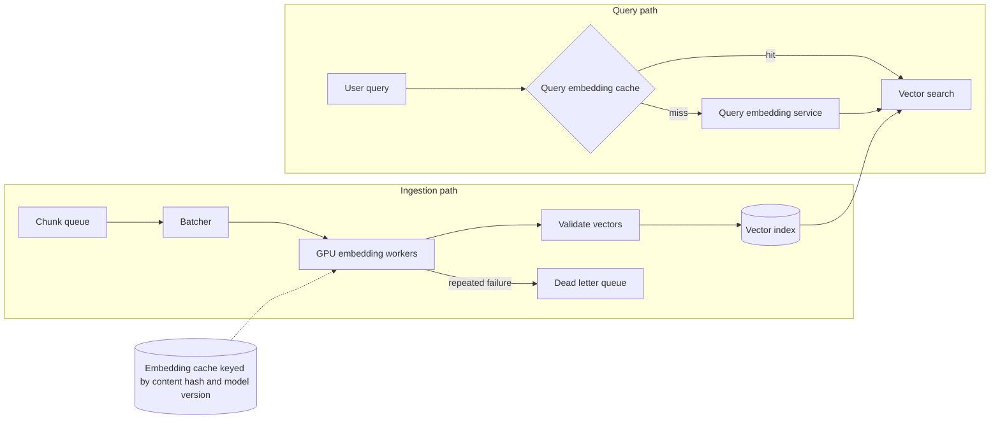

### Key design decisions

**1. Same model for queries and chunks (a hard invariant).** A query vector is only meaningful in the space its chunk vectors live in. Different models (or even different versions of one model) produce *incompatible* spaces, sometimes with different dimensions. Never mix.

**2. Batching for throughput.** GPUs are efficient on large batches. The batcher groups chunks (ideally of similar length, to avoid padding waste) and feeds workers continuously.

**3. Cache by `hash(chunk_text) + model_version`.** Identical or unchanged chunks are never re-embedded. This is the same idea as Chapter 4's content-hash chunk IDs, and it makes re-processing and retries cheap. On the query side, cache embeddings of normalized query strings, since popular questions repeat.

**4. Isolate the pools.** Give the online query embedder its own capacity. Otherwise a giant bulk re-index can starve live user traffic, a classic noisy-neighbor problem.

**5. Rate limits (if you use a hosted API).** Use a client-side rate limiter, exponential backoff with jitter on 429/5xx errors, and a queue to smooth bursts.

**6. Idempotent writes.** Upsert by `chunk_id`, so retries don't create duplicate vectors.

### Scale estimate (illustrative numbers)

*Acme:* 200M tokens. At an assumed hosted price around a few cents per million tokens, that's on the order of **single-digit to tens of dollars**. Trivial.

*Web-scale:* 1B chunks, say 2,000 chunks/sec per GPU (assumed):

- 1B ÷ 2,000 = 500,000 seconds ≈ **5.8 days** on one GPU
- With 50 GPUs ≈ **~2.8 hours**

Same pattern as OCR in Chapter 3: scale horizontally and use the queue as a buffer.

### Query-time latency budget

Embedding the query is usually ~10 to 50 ms (small self-hosted model) or ~50 to 200 ms (network API call), inside a total budget of maybe 1 to 3 seconds including LLM generation. Embedding is rarely the bottleneck, but network-hop variance can hurt the p99.

---

## Changing the embedding model: the migration story

This is a great interview topic because it exposes real operational thinking.

**The situation:** a better model is released, or you fine-tuned one. You can't just start writing new vectors into the old index.

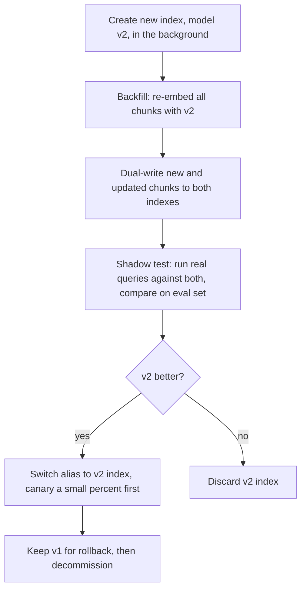

Requirements to state:

- Each vector or index records `embedding_model` and `model_version`.
- Queries must use the model that matches the index they hit.
- **Pin hosted model versions.** If a provider silently updates a model behind a fixed name, you'd get a mixed index and mysteriously degraded search.
- A rollback path (keep the old index until the new one is proven).

---

## Error handling

| Failure | What happens | Handling |
|---|---|---|
| **Chunk exceeds max tokens** | Silent truncation, so the end of the chunk is unsearchable | Enforce token limits in the chunker with a margin, and alert on truncation |
| **Rate limit / timeout** | Batch fails | Retry with backoff and jitter |
| **Partial batch failure** | One bad item poisons the whole batch | Retry per item, and isolate the bad one to the DLQ |
| **Bad vectors** (NaN, all zeros, wrong dimension) | Corrupts search results | Validate before writing: dimension, finite values, non-zero norm |
| **Embedding service down at query time** | Search unavailable | **Degrade gracefully**: fall back to keyword (BM25) retrieval only, which doesn't need embeddings (see Ch. 7). Do *not* fall back to a different embedding model against the same index |
| **Model drift or silent provider update** | Quality drops with no errors | Pin versions, run periodic regression checks against a golden query set |
| **Very long or empty text** | Errors or meaningless vectors | Skip empty text, log it |

**Security note:** embeddings are **not** anonymized data. Research on *embedding inversion* shows that a lot of the original text can sometimes be reconstructed from its vector. Treat vectors with the same access controls and retention rules as the source text, and inherit the ACL from the chunk.

---

## Interview soundbite

> "Keyword search fails on vocabulary mismatch, so we use embeddings: a bi-encoder model maps each chunk, and at query time the question, into a vector so semantically similar text is close together, typically by cosine similarity. Bi-encoders let me precompute chunk vectors offline and only embed the query online, unlike cross-encoders which are too slow to run against every chunk. I'd pick the model by testing a shortlist on our own labeled queries, checking max token length, dimensions, multilingual needs, and hosted vs self-hosted trade-offs. Vectors dominate storage, so at scale I'd consider quantization or Matryoshka truncation. Embeddings are weak on exact IDs, negation, and numbers, which I'd address with hybrid search and reranking. Operationally, ingestion embedding is batched on autoscaled GPU workers behind a queue, with a cache keyed by content hash and model version, the query embedder is a separate low-latency pool with a query cache, and a hard invariant is that queries and chunks use the same pinned model version. Model upgrades need a shadow index, backfill, evaluation, and an alias swap with rollback."

---

## Quick self-check

1. Why can't we use a cross-encoder to search all 440k chunks directly, and what does a bi-encoder change?
2. Why is it dangerous to mix vectors from two different embedding models in one index?
3. Give two things embeddings are bad at, and what you'd add to fix each.

Answer any of these for feedback, or say **"next"** and we'll move to Chapter 6: **Vector Indexes and ANN Search** (HNSW, IVF, PQ). We'll see why brute-force nearest-neighbor search stops working at scale, and how the industry made search over billions of vectors fast enough.

---

# Chapter 6: Vector Indexes and ANN Search

## The story

Acme's internal chatbot runs happily on ~440k chunks. Then the company launches a **customer-facing support assistant** for 5,000 enterprise customers, each uploading their own documentation. Chunk count jumps from 440k to **200 million**, and query latency jumps from milliseconds to seconds.

Riya profiles the system: the LLM isn't the slow part, **the nearest-neighbor search is**. Let's see why, and how the industry fixed it.

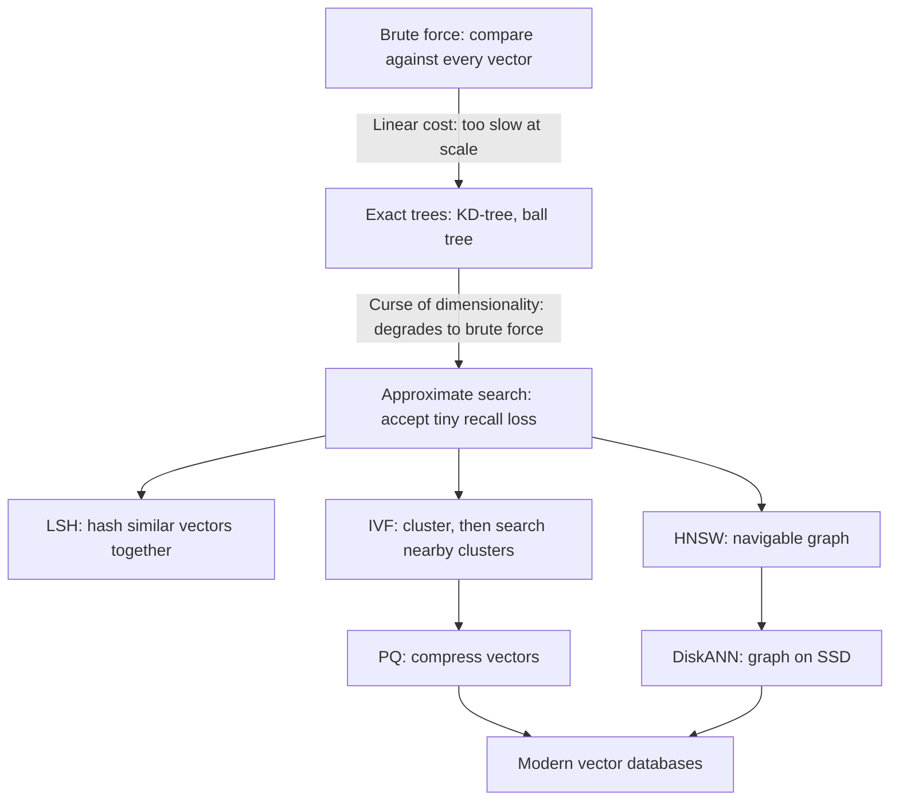

---

## Attempt 1: Brute force (exact "flat" search)

Compare the query vector against **every** stored vector, then keep the top k.

The cost is dominated by **memory bandwidth**: every vector must be read from RAM for every query. The numbers (illustrative, assuming ~100 GB/s of memory bandwidth per server):

| Corpus | Vector data (1024-d float32) | Time to scan once |
|---|---|---|
| 440k chunks (Acme internal) | 1.8 GB | **~18 ms** ✅ |
| 10M chunks | 40 GB | ~400 ms (about 2.5 QPS per machine) |
| 200M chunks (Acme customers) | 800 GB | ~8 s ❌ |
| 1B chunks | 4 TB | ~40 s ❌ |

> **Interview tip:** brute force is *not* wrong. For under ~100k to 1M vectors it's simple, gives 100% exact recall, and needs no index tuning. Saying "I'd start with exact search and only add ANN when the numbers demand it" shows judgment.

Brute force does remain the **ground truth** you measure every approximate index against.

---

## Attempt 2: Exact tree structures (KD-trees, ball trees)

In 2D or 3D, a KD-tree splits space by coordinates, so a query can skip whole regions. Databases and maps use this successfully.

In 1024 dimensions it collapses. This is the **curse of dimensionality**: in very high-dimensional spaces, almost all points are roughly the same distance from each other, so no region can be safely pruned. The tree ends up visiting nearly everything and becomes brute force with extra overhead.

**Lesson:** exact nearest-neighbor search in high dimensions has no known shortcut. We must give something up.

---

## The key insight: approximate is good enough

**Approximate Nearest Neighbor (ANN)** search returns *very likely* the true top-k, much faster. We measure this with **ANN recall@k**: the fraction of the true (brute-force) top-k that the index actually returned.

> Example: exact top-10 = {A,B,C,D,E,F,G,H,I,J}. The ANN index returns {A,B,C,D,E,F,G,H,I,X}. ANN recall@10 = 9/10 = 90%.

Typical production targets are **95 to 99%**. Why not 100%?

- The embedding is already a *lossy proxy* for relevance. The "true nearest neighbor" isn't necessarily the best answer, just the closest in an imperfect space.
- The reranker (Chapter 9) reorders candidates anyway, so a slightly-off top-k rarely changes the final answer.
- Each extra percent of recall costs disproportionately more latency and memory.

Don't confuse this with **retrieval recall** (did the *relevant chunk* appear in the results?). ANN recall measures faithfulness to exact search, and retrieval recall measures usefulness. Interviewers like it when you separate them.

The main ANN families each answer "how do we avoid looking at everything?" differently.

---

## Approach A: LSH (Locality-Sensitive Hashing)

Design hash functions so **similar vectors collide** into the same bucket. At query time, hash the query and check only its bucket.

**Problems:** achieving high recall needs many hash tables (lots of memory), tuning is fiddly, and in practice it lost to the methods below on the recall/speed trade-off. Know the name and why it faded, and don't build on it.

---

## Approach B: IVF (Inverted File Index), "search only the nearby neighborhoods"

**Analogy:** a huge library organized by sections. To find a book about refunds, you don't walk every aisle. You go to the "Business and Law" section and its neighbors.

**Build (offline):**
1. Run **k-means** on the vectors to create `nlist` clusters, each with a **centroid** (its center).
2. Assign every vector to its nearest centroid, so each cluster holds a list of vectors (the "inverted list").

**Query (online):**
1. Compare the query to all `nlist` centroids (cheap, since there are few).
2. Pick the closest `nprobe` clusters.
3. Brute-force scan **only** vectors in those clusters.

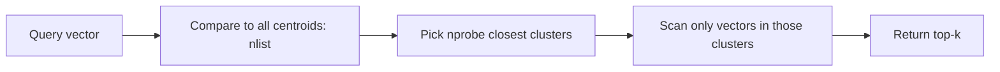

**Worked example:** 100M vectors, `nlist` = 10,000 (a common rule of thumb is around √N), `nprobe` = 50.
- Centroid comparisons: 10,000.
- Vectors scanned: 50/10,000 = 0.5% of the data ≈ **500k vectors**.
- That's ~200× less work than brute force.

**The catch, the boundary problem:** if the query lands near the edge between two clusters, its true nearest neighbor may sit in a cluster you **didn't probe**. The fix is raising `nprobe`, which improves recall and costs latency. `nprobe` is your **recall-vs-speed dial**.

Other notes: IVF needs a **training step** (k-means) and works best when data is reasonably stable. If your data distribution drifts a lot, the centroids go stale and recall degrades, so you must periodically retrain.

---

## Approach C: HNSW (Hierarchical Navigable Small World), "the highway map"

The most widely used index in vector databases today.

**Analogy:** finding a specific house. You don't start on your street. You take a national highway to the right region, a state road to the right city, then local streets to the exact address. **Coarse hops first, fine hops last.**

**Structure:** a multi-layer graph.
- **Layer 0** contains *every* vector, connected to its near neighbors (short local links).
- **Higher layers** contain exponentially fewer, randomly chosen vectors, with longer-range links (the "highways").

**Query:**

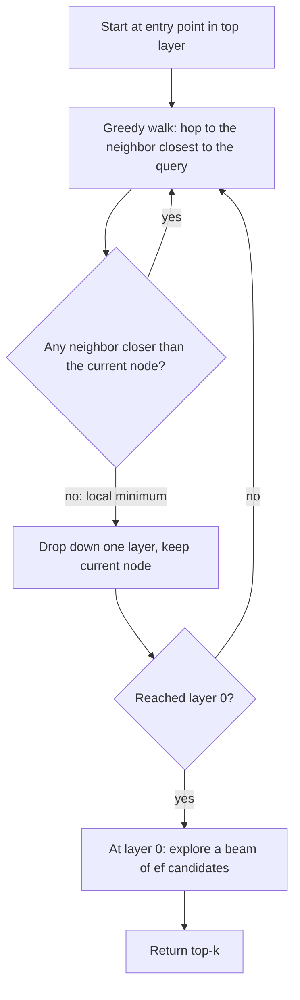

Because the top layers let you skip huge distances, search takes roughly **O(log N)** hops.

**Key parameters:**

| Parameter | Meaning | Turning it up |
|---|---|---|
| `M` | Links per node | Better recall, more memory, slower build |
| `efConstruction` | Beam width while **building** | Better graph quality, slower indexing |
| `efSearch` | Beam width while **querying** | Better recall, higher latency (the query-time dial, like `nprobe`) |

**Why it's popular:** excellent recall/latency, works well without a training step, and supports **incremental inserts** (new vectors are just added to the graph).

**Downsides (know these):**

- **RAM-hungry:** the full vectors and the graph normally live in memory. The graph adds ~`2M × 4` bytes per vector (for M=16: ~128 bytes, small next to a 4 KB float32 vector, but the *vectors themselves* are the real cost).
- **Slow to build:** graph construction is expensive at large scale.
- **Deletes are awkward:** removing a node can break paths. Systems mark it as a **tombstone** (skip it in results) and rebuild the graph later.
- **Filtered search can struggle** (covered below).

---

## Approach D: Product Quantization (PQ), "compress the vectors"

IVF and HNSW reduce *how many* vectors you look at, but you still store 4 KB per vector. At 1B vectors that's 4 TB. **PQ shrinks the vectors themselves.**

**How it works:**

1. Split each 1024-d vector into `m` sub-vectors (say m = 128 pieces of 8 dimensions).
2. For each piece position, learn a **codebook** of 256 representative sub-vectors (via k-means).
3. Replace each piece with the **1-byte ID** of its nearest codebook entry.

```mermaid
flowchart LR
    V["1024-d vector: 4096 bytes"] --> S1["Piece 1: dims 1-8"]
    V --> S2["Piece 2: dims 9-16"]
    V --> S3["... 128 pieces total"]
    S1 --> C1["Nearest of 256 codewords: id 17"]
    S2 --> C2["Nearest of 256 codewords: id 203"]
    S3 --> C3["..."]
    C1 --> CODE["Stored code: 128 bytes"]
    C2 --> CODE
    C3 --> CODE
```

**Result:** 4096 bytes → **128 bytes** (32× smaller). 1B vectors drops from 4 TB to **~128 GB**, which fits in RAM on a single large machine or a small cluster.

**Fast distance:** at query time, precompute a small lookup table of distances from the query's pieces to every codeword, then a stored vector's distance is just **128 table lookups and adds**. No full-vector math.

**Trade-off:** compression is lossy, so distances are approximate. The standard fix is **rescoring**: fetch extra candidates (say 5× k) using compressed codes, then recompute exact distances for just those, using full-precision vectors stored on SSD or in a slower tier.

**IVF-PQ** combines both: IVF narrows the search to a few clusters, and PQ makes each scanned vector cheap and small. It's a classic recipe for billion-scale search.

Also worth naming: **scalar quantization** (float32 → int8, 4× smaller, very little recall loss) and **binary quantization** (1 bit per dimension, 32× smaller, usually needs rescoring). These are simpler than PQ and often the first thing to try.

---

## Approach E: DiskANN, "the graph lives on SSD"

HNSW wants everything in RAM, which gets expensive at billions of vectors. **DiskANN** (Microsoft) builds a graph designed for SSD access:
- Keep **compressed vectors** (PQ codes) in RAM for fast approximate navigation.
- Keep **full vectors and the graph** on SSD, fetching a few SSD blocks per query for rescoring.

Cost drops sharply (SSD is far cheaper per GB than RAM), at the price of higher latency (still typically low tens of milliseconds) and more complex updates. It's the answer to "we have 1B+ vectors and can't afford terabytes of RAM."

---

## Comparison table (the one to memorize)

| Index | Memory | Query speed | Recall | Build cost | Updates | Best for |
|---|---|---|---|---|---|---|
| **Flat (brute force)** | Vectors only | Slow at scale | 100% exact | None | Trivial | < ~1M vectors, ground truth |
| **IVF-Flat** | Vectors + centroids | Good | Good (tune `nprobe`) | Needs training | Okay, retrain if data drifts | Mid-size, batch-ish data |
| **HNSW** | Vectors + graph (RAM) | Excellent | Excellent | Slow | Good inserts, awkward deletes | Low-latency, up to hundreds of millions |
| **IVF-PQ** | Very small (compressed) | Good | Lower (rescore to recover) | Needs training | Moderate | Billion-scale in limited RAM |
| **DiskANN** | Small RAM + SSD | Good | Very good | Slow | Complex | Billion-scale, cost-sensitive |

**A rule of thumb for interviews:**
- Under ~1M vectors: flat search, or `pgvector` inside your existing Postgres.
- Millions to hundreds of millions with tight latency: **HNSW** (add scalar quantization to cut memory).
- Billions, memory-constrained: **IVF-PQ or DiskANN** with rescoring, sharded.

---

## The hidden monster: filtered search

RAG almost never searches *all* vectors. You need to restrict by:
- **Permissions (ACL):** only chunks this user may see (Chapter 3's metadata)
- **Tenant:** only this customer's documents
- **Metadata:** language, doc type, date range, latest version only

**Why it's hard:** ANN indexes are built for "nearest overall", not "nearest among those matching a condition."

Suppose the intern can access only 2% of chunks.

| Strategy | How | Problem |
|---|---|---|
| **Post-filter** | Get top-10 from the index, then drop the ones the user can't see | Expected survivors = 10 × 2% = **0.2 results**. Users get empty or tiny answers, and worse, it can leak existence of data through timing |
| **Over-fetch then filter** | Get top-500, then filter | Wasteful, and still unreliable for very selective filters |
| **Pre-filter** | Compute the allowed set first, then search only within it | Fine when the allowed set is small (brute-force it), but hard to combine with a global graph |
| **Filter-aware traversal** | HNSW walks the graph but only *accepts* matching nodes | Works for mild filters, but if the filter is very selective the walk can hit dead ends because the graph's connections go through non-matching nodes |
| **Partitioning** | Separate index (or shard) per tenant or ACL group | Simple and fast, but many tiny indexes are costly to manage |

```mermaid
flowchart TD
    Q["Query plus filter"] --> SEL{"How selective is the filter?"}
    SEL -->|"Matches a few thousand vectors or fewer"| EX["Exact scan over the filtered subset"]
    SEL -->|"Matches a moderate share"| FA["Filter-aware ANN traversal"]
    SEL -->|"Matches most vectors"| PO["ANN then post-filter with over-fetch"]
    EX --> R["Top-k"]
    FA --> R
    PO --> R
```

This is a **query planner**: pick the strategy from the filter's selectivity. Good vector databases do this internally.

**Big-picture design choice:** for **multi-tenant** systems like Acme's customer assistant, put the **tenant ID at the partition/shard level** and reserve within-index filters for finer-grained rules. This gives both performance and strong isolation (Chapters 12 and 14).

---

## System design: what's inside a vector database

Real vector databases (Milvus, Qdrant, Weaviate, Elasticsearch/OpenSearch, Pinecone, and Postgres's `pgvector` extension) share an architecture borrowed from search engines and LSM-tree databases. Don't memorize vendors, but know this shape:

```mermaid
flowchart LR
    W["Writes: upsert and delete"] --> WAL["Write-ahead log"]
    WAL --> GS["Growing segment: in memory, small, brute-force searchable"]
    GS -->|"flush when full"| SS1["Sealed segment 1: HNSW or IVF built"]
    GS -->|"flush when full"| SS2["Sealed segment 2: HNSW or IVF built"]
    SS1 --> CMP["Background compaction: merge segments, drop tombstones, rebuild"]
    SS2 --> CMP
    CMP --> BIG["Larger merged segment"]
    Q["Query"] --> FAN["Fan out to all segments"]
    GS --> FAN
    SS1 --> FAN
    SS2 --> FAN
    BIG --> FAN
    FAN --> MRG["Merge partial top-k lists"]
    MRG --> RES["Final top-k"]
```

Why this works:

- **Immutable segments:** building an HNSW or IVF index for a fixed batch is simple, and immutability makes concurrent reads safe.
- **Growing segment:** new writes are searchable **immediately** (brute-force over a small in-memory buffer), even before an index exists. This gives near-real-time freshness.
- **Deletes:** a delete marks a **tombstone**. Search skips tombstoned vectors, and **compaction** later physically removes them and rebuilds.
- **An update = delete old + insert new.** Chunk IDs (Chapter 4) make this clean.
- **Query fan-out:** search each segment, then merge the partial top-k lists.
- **Durability:** the **WAL** (write-ahead log) survives crashes. Segments and snapshots are backed up to object storage.

The full **distributed** story (sharding these segments across machines, replication, and scatter-gather across shards) is Chapter 12.

### Source of truth

**The vector index is a derived, rebuildable artifact.** The source of truth is the chunk store plus the raw documents (Chapters 3 and 4). If the index is corrupted, or you switch index type, you rebuild it from the stored chunks and vectors, never by trying to repair it. State this clearly.

### Memory sizing example: Acme's 200M vectors

| Config | Approximate RAM |
|---|---|
| Float32 vectors + HNSW (M=16) | 200M × (4 KB + ~0.13 KB) ≈ **~830 GB** |
| **int8 scalar quantized** + HNSW | 200M × (1 KB + 0.13 KB) ≈ **~230 GB** (full-precision copies on SSD for rescoring) |
| **IVF-PQ** (128 B/vector) | ≈ **~26 GB** plus overhead |

Same corpus, a 30× spread in memory. That's why sizing quantization early is an HLD decision, not a tuning detail.

### Tuning workflow

1. Build a **ground truth** set: take ~1,000 to 10,000 sample queries and compute exact top-k via brute force.
2. Sweep `efSearch` (or `nprobe`) and measure **ANN recall@k**, **p50/p95/p99 latency**, and **QPS per node**.
3. Choose the cheapest setting that hits your recall target (say 97%) within your latency budget.
4. **Re-run this whenever data grows 2 to 3× or the embedding model changes.** Recall silently drifts as the index grows.

Index sizing is also a cost problem: *"what's the cheapest hardware that meets latency at target recall for peak QPS?"*

---

## Error handling and operational pitfalls

| Problem | Symptom | Handling |
|---|---|---|
| **Recall silently degrades** | Answers get worse over weeks, no errors | Continuously compare ANN vs exact search on a sampled set of live queries (**shadow exact search**), alert on drops |
| **Filtered search returns < k results** | Empty or thin context for restricted users | Query planner, exact-scan fallback for selective filters, tenant partitioning |
| **Tombstone bloat** | Latency and memory creep up after mass deletes | Trigger compaction on a tombstone ratio threshold |
| **Index exceeds RAM** | OOM, swapping, latency spikes | Capacity planning, quantization, memory-mapped indexes, add shards, alerts at 70 to 80% memory |
| **Cold start** | After a restart, a node needs minutes to load its index | Readiness probes (don't route traffic until loaded), keep replicas warm, rolling restarts |
| **Index corruption or bad build** | Wrong results | Rebuild from the source of truth, snapshots in object storage |
| **Dimension or metric mismatch** | Errors or garbage results | Validate at write time, and lock `metric` and `dim` in the collection schema (Chapter 5's invariant) |
| **Slow index build blocks freshness** | New docs unsearchable for a long time | Growing segment gives immediate brute-force searchability |
| **Node failure** | Query errors from missing shards | Replication and retries (Chapter 12), and return **partial results with a flag** rather than failing completely |
| **Traffic spike** | Latency climbs | Autoscale read replicas, apply timeouts and load shedding |

**Timeouts:** give the vector search its own strict time budget (say 100 to 200 ms), so one slow shard can't eat the whole request. If it times out, return the partial results you have.

---

## Interview soundbite

> "Exact nearest-neighbor search costs O(N × d) and is memory-bandwidth bound, so at hundreds of millions of vectors it takes seconds per query, and tree-based exact methods fail in high dimensions. So we use approximate nearest neighbor indexes and accept ~95 to 99% recall. HNSW, a layered navigable graph, gives the best latency and recall up to hundreds of millions of vectors but is RAM-hungry and awkward with deletes. IVF partitions vectors into clusters and searches only the nearest `nprobe` of them, and PQ compresses vectors 30× or more, so IVF-PQ or DiskANN handle billion-scale in limited memory, with rescoring on full-precision vectors to recover accuracy. The hardest practical issue is filtered search for ACLs and tenants: post-filtering can return empty results, so I'd use a planner that picks exact scan, filter-aware traversal, or post-filter based on selectivity, and partition by tenant. Internally the database uses immutable segments plus a growing in-memory segment, tombstones and compaction, and fan-out with merged top-k. The index is a derived artifact rebuildable from the chunk store, and I'd tune `efSearch` against a brute-force ground truth set, monitoring recall, p99 latency, and memory over time."

---

## Quick self-check

1. Why does brute-force search get slow at scale, and why do KD-trees not rescue us?
2. Explain the recall-vs-latency dial in IVF and in HNSW. What are the parameter names?
3. Why is post-filtering by ACL dangerous, and what would you do instead for a multi-tenant system?

Answer any of these for feedback, or say **"next"** and we'll move to Chapter 7: **Retrieval, dense vs sparse (BM25) vs hybrid**. That's where the "ERR-4021" failure gets fixed, and where we learn how to combine keyword search and vector search into one ranked list.

---

